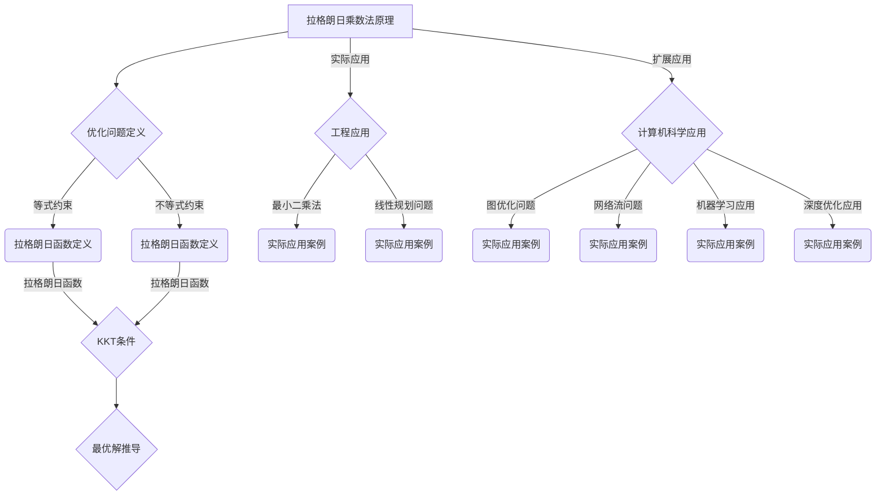

                 

### 《拉格朗日乘数法与约束优化问题》概述

**关键词**：拉格朗日乘数法、约束优化、优化问题、KKT条件、实际应用

**摘要**：
本文旨在深入探讨拉格朗日乘数法在解决约束优化问题中的应用及其重要性。首先，我们将介绍拉格朗日乘数法的基本概念和原理，包括拉格朗日函数的定义和优化问题求解过程。接着，我们将详细探讨拉格朗日乘数法在无约束优化、等式约束优化、不等式约束优化以及复杂约束优化中的应用，并通过具体的数学公式和Python代码示例进行讲解。此外，本文还将介绍拉格朗日乘数法在工程实际应用中的实例，如最小二乘法和线性规划问题。最后，我们将讨论拉格朗日乘数法的扩展应用，包括与KKT条件的关系、在优化算法中的应用、在计算机科学中的应用，以及其在机器学习和深度优化中的未来发展方向。通过本文的详细分析和讲解，读者将全面了解拉格朗日乘数法在约束优化问题中的核心地位和广泛应用。

### 第一部分：拉格朗日乘数法与约束优化问题基础

#### 1.1 拉格朗日乘数法简介

拉格朗日乘数法是一种用于解决约束优化问题的数学方法。在无约束优化问题中，我们通常只有一个目标函数 \( f(x) \)，并希望找到使得 \( f(x) \) 最小的 \( x \) 值。然而，在实际问题中，我们经常需要考虑各种约束条件，这些约束条件可能以等式或不等式的形式存在。拉格朗日乘数法通过引入拉格朗日函数，将约束条件融入优化过程中，从而找到满足约束条件下的最优解。

**拉格朗日函数的定义**：

给定一个优化问题：

\[ \min_x f(x) \]

subject to

\[ g(x) \leq 0 \]

\[ h(x) = 0 \]

其中，\( f(x) \)、\( g(x) \) 和 \( h(x) \) 分别是目标函数和约束条件，我们可以定义一个拉格朗日函数 \( L(x, \lambda, \nu) \) 如下：

\[ L(x, \lambda, \nu) = f(x) + \lambda g(x) + \nu h(x) \]

其中，\( \lambda \) 和 \( \nu \) 分别是拉格朗日乘数，用于调整约束条件的权重。这个拉格朗日函数是目标函数和约束条件的结合体，它为我们提供了一个新的优化问题：

\[ \min_x L(x, \lambda, \nu) \]

subject to

\[ h(x) = 0 \]

这样，我们可以通过求解新的优化问题来找到原优化问题的最优解。

**拉格朗日乘数法的原理**：

拉格朗日乘数法的核心思想是通过引入拉格朗日乘数，使得拉格朗日函数在最优解点上满足某些特定的条件。具体来说，如果我们假设 \( x^* \) 是原优化问题的最优解，即：

\[ \min_x f(x) \]

subject to

\[ g(x) \leq 0 \]

\[ h(x) = 0 \]

那么，\( x^* \) 必须满足以下条件：

\[ \nabla f(x^*) + \lambda^* \nabla g(x^*) + \nu^* \nabla h(x^*) = 0 \]

\[ g(x^*) \leq 0 \]

\[ h(x^*) = 0 \]

其中，\( \lambda^* \) 和 \( \nu^* \) 分别是最优解 \( x^* \) 对应的拉格朗日乘数。这个条件表明，在最优解点上，目标函数的梯度方向与约束条件的梯度方向垂直。这意味着，在最优解附近，目标函数的变化方向与约束条件的限制方向是相互抵消的。

通过拉格朗日乘数法，我们可以将约束优化问题转化为无约束优化问题，从而更方便地求解。拉格朗日乘数法不仅在数学优化领域有广泛应用，也在工程、计算机科学和机器学习等领域发挥着重要作用。

#### 1.2 拉格朗日乘数法与最优解

拉格朗日乘数法在解决约束优化问题时，其核心目标是找到最优解。最优解是指满足所有约束条件的同时，使得目标函数取得最小值或最大值的解。拉格朗日乘数法通过引入拉格朗日函数，将约束条件融入优化过程中，从而找到满足约束条件下的最优解。

**等式约束优化问题**：

等式约束优化问题是指在约束条件中包含等式约束的问题。在这种情况下，拉格朗日乘数法的基本步骤如下：

1. **定义拉格朗日函数**：
   给定目标函数 \( f(x) \) 和等式约束 \( h(x) = 0 \)，定义拉格朗日函数 \( L(x, \lambda) \)：

   \[ L(x, \lambda) = f(x) + \lambda h(x) \]

2. **求导并设置为零**：
   为了找到最优解，我们需要对拉格朗日函数 \( L(x, \lambda) \) 分别对 \( x \) 和 \( \lambda \) 求导，并设置导数为零：

   \[ \nabla_x L(x, \lambda) = \nabla f(x) + \lambda \nabla h(x) = 0 \]

   \[ \nabla_\lambda L(x, \lambda) = h(x) = 0 \]

3. **求解拉格朗日乘数**：
   解上述方程组，得到拉格朗日乘数 \( \lambda \)。这些拉格朗日乘数反映了约束条件在最优解中的权重。

4. **检查最优性条件**：
   检查约束条件 \( h(x) = 0 \) 是否在最优解处成立，以及目标函数 \( f(x) \) 的二阶导数是否满足最优性条件。

   如果满足条件，则 \( x \) 就是原问题的最优解。

**不等式约束优化问题**：

不等式约束优化问题是指在约束条件中包含不等式约束的问题。在这种情况下，拉格朗日乘数法的步骤与等式约束优化问题类似，但需要考虑拉格朗日乘数的非负性。

1. **定义拉格朗日函数**：
   给定目标函数 \( f(x) \) 和不等式约束 \( g(x) \leq 0 \)，定义拉格朗日函数 \( L(x, \lambda) \)：

   \[ L(x, \lambda) = f(x) + \lambda g(x) \]

2. **求导并设置为零**：
   对拉格朗日函数 \( L(x, \lambda) \) 分别对 \( x \) 和 \( \lambda \) 求导，并设置导数为零：

   \[ \nabla_x L(x, \lambda) = \nabla f(x) + \lambda \nabla g(x) = 0 \]

   \[ \nabla_\lambda L(x, \lambda) = g(x) \leq 0 \]

3. **求解拉格朗日乘数**：
   解上述方程组，得到拉格朗日乘数 \( \lambda \)。这些拉格朗日乘数反映了约束条件在最优解中的权重。

4. **检查最优性条件**：
   检查约束条件 \( g(x) \leq 0 \) 是否在最优解处成立，以及目标函数 \( f(x) \) 的二阶导数是否满足最优性条件。

   如果满足条件，则 \( x \) 就是原问题的最优解。

通过拉格朗日乘数法，我们可以将复杂的约束优化问题转化为更简单的无约束优化问题，从而更方便地求解最优解。拉格朗日乘数法不仅具有理论上的严谨性，还在实际应用中表现出强大的解决能力。

#### 1.3 拉格朗日乘数法的实际应用

拉格朗日乘数法在无约束优化问题和等式约束优化问题中的应用已经得到了充分的讨论。然而，在实际问题中，我们经常遇到不等式约束优化问题。在这种情况下，拉格朗日乘数法同样适用，但其求解过程需要一些额外的步骤。

**线性约束优化**：

线性约束优化是指目标函数和约束条件都是线性的优化问题。这类问题在工程和经济学等领域有广泛的应用。拉格朗日乘数法在处理线性约束优化问题时，步骤如下：

1. **定义拉格朗日函数**：
   给定线性目标函数 \( f(x) = c^T x \) 和线性约束条件 \( A x \leq b \)，定义拉格朗日函数 \( L(x, \lambda) \)：

   \[ L(x, \lambda) = f(x) + \lambda (A x - b) \]

   其中，\( \lambda \) 是拉格朗日乘数向量。

2. **求导并设置为零**：
   对拉格朗日函数 \( L(x, \lambda) \) 分别对 \( x \) 和 \( \lambda \) 求导，并设置导数为零：

   \[ \nabla_x L(x, \lambda) = c + A^T \lambda = 0 \]

   \[ \nabla_\lambda L(x, \lambda) = A x - b \leq 0 \]

3. **求解拉格朗日乘数**：
   解上述方程组，得到拉格朗日乘数 \( \lambda \)。然后，使用拉格朗日乘数更新目标函数，得到修正后的目标函数 \( f(x) - \lambda^T (A x - b) \)。

4. **迭代求解最优解**：
   通过迭代求解修正后的目标函数，找到最优解 \( x \)。

**非线性约束优化**：

非线性约束优化是指目标函数和约束条件至少有一个是非线性的优化问题。这类问题在工程和科学领域有广泛的应用。拉格朗日乘数法在处理非线性约束优化问题时，步骤如下：

1. **定义拉格朗日函数**：
   给定非线性目标函数 \( f(x) \) 和非线性约束条件 \( g(x) \leq 0 \)，定义拉格朗日函数 \( L(x, \lambda) \)：

   \[ L(x, \lambda) = f(x) + \lambda g(x) \]

   其中，\( \lambda \) 是拉格朗日乘数。

2. **求导并设置为零**：
   对拉格朗日函数 \( L(x, \lambda) \) 分别对 \( x \) 和 \( \lambda \) 求导，并设置导数为零：

   \[ \nabla_x L(x, \lambda) = \nabla f(x) + \lambda \nabla g(x) = 0 \]

   \[ \nabla_\lambda L(x, \lambda) = g(x) \leq 0 \]

3. **求解拉格朗日乘数**：
   解上述方程组，得到拉格朗日乘数 \( \lambda \)。然后，使用拉格朗日乘数更新目标函数，得到修正后的目标函数 \( f(x) - \lambda g(x) \)。

4. **迭代求解最优解**：
   通过迭代求解修正后的目标函数，找到最优解 \( x \)。

通过拉格朗日乘数法，我们可以有效地解决线性和非线性约束优化问题。拉格朗日乘数法不仅具有理论上的严谨性，还在实际应用中表现出强大的解决能力。

#### 1.4 拉格朗日乘数法在复杂约束优化中的应用

在复杂约束优化问题中，约束条件可能既包含等式约束也包含不等式约束，或者约束条件本身是非线性的。这种情况下，拉格朗日乘数法的应用变得更为复杂，需要仔细处理。下面我们将讨论拉格朗日乘数法在复杂约束优化中的应用。

**多目标优化问题**：

多目标优化问题是指同时优化多个目标函数的问题。这类问题在工程、经济学和决策科学等领域有广泛的应用。拉格朗日乘数法在解决多目标优化问题时，可以通过将多个目标函数组合成一个加权的目标函数来实现。

1. **定义拉格朗日函数**：
   假设有 \( k \) 个目标函数 \( f_1(x), f_2(x), \ldots, f_k(x) \)，定义加权拉格朗日函数 \( L(x, \lambda, \nu) \)：

   \[ L(x, \lambda, \nu) = \sum_{i=1}^k \alpha_i f_i(x) + \lambda g(x) + \nu h(x) \]

   其中，\( \alpha_i \) 是权重系数，\( \lambda \) 和 \( \nu \) 是拉格朗日乘数。

2. **求导并设置为零**：
   对拉格朗日函数 \( L(x, \lambda, \nu) \) 分别对 \( x \) 和 \( \lambda \)、\( \nu \) 求导，并设置导数为零：

   \[ \nabla_x L(x, \lambda, \nu) = \sum_{i=1}^k \alpha_i \nabla f_i(x) + \lambda \nabla g(x) + \nu \nabla h(x) = 0 \]

   \[ \nabla_\lambda L(x, \lambda, \nu) = g(x) \leq 0 \]

   \[ \nabla_\nu L(x, \lambda, \nu) = h(x) = 0 \]

3. **求解拉格朗日乘数**：
   解上述方程组，得到拉格朗日乘数 \( \lambda \) 和 \( \nu \)。这些拉格朗日乘数反映了约束条件在最优解中的权重。

4. **求解多目标最优解**：
   通过求解修正后的目标函数，找到多目标优化问题的非支配解集（Pareto前沿）。这些解代表了在不同目标函数之间进行权衡的可行解。

**非线性约束优化问题**：

非线性约束优化问题是目标函数或约束条件至少有一个是非线性的优化问题。这类问题在工程、物理科学和经济学等领域有广泛的应用。拉格朗日乘数法在处理非线性约束优化问题时，需要考虑约束条件的非线性和非线性约束的复杂性。

1. **定义拉格朗日函数**：
   给定非线性目标函数 \( f(x) \) 和非线性约束条件 \( g(x) \leq 0 \)，定义拉格朗日函数 \( L(x, \lambda) \)：

   \[ L(x, \lambda) = f(x) + \lambda g(x) \]

   其中，\( \lambda \) 是拉格朗日乘数。

2. **求导并设置为零**：
   对拉格朗日函数 \( L(x, \lambda) \) 分别对 \( x \) 和 \( \lambda \) 求导，并设置导数为零：

   \[ \nabla_x L(x, \lambda) = \nabla f(x) + \lambda \nabla g(x) = 0 \]

   \[ \nabla_\lambda L(x, \lambda) = g(x) \leq 0 \]

3. **求解拉格朗日乘数**：
   解上述方程组，得到拉格朗日乘数 \( \lambda \)。这些拉格朗日乘数反映了约束条件在最优解中的权重。

4. **迭代求解最优解**：
   通过迭代求解修正后的目标函数，找到非线性约束优化问题的最优解。

**案例：非线性约束优化问题**：

考虑以下非线性约束优化问题：

\[ \min_x f(x) = x^2 + xy + y^2 \]

subject to

\[ g(x, y) = x^2 + y^2 - 1 \leq 0 \]

\[ h(x, y) = x + y - 1 = 0 \]

我们可以定义拉格朗日函数 \( L(x, y, \lambda, \nu) \)：

\[ L(x, y, \lambda, \nu) = x^2 + xy + y^2 + \lambda (x^2 + y^2 - 1) + \nu (x + y - 1) \]

然后，对 \( L(x, y, \lambda, \nu) \) 分别对 \( x \)、\( y \)、\( \lambda \) 和 \( \nu \) 求导，并设置导数为零，解方程组得到拉格朗日乘数 \( \lambda \) 和 \( \nu \)。最后，通过迭代求解修正后的目标函数，找到非线性约束优化问题的最优解。

通过上述步骤，我们可以看出，拉格朗日乘数法在复杂约束优化问题中的应用是有效的。尽管处理过程可能更为复杂，但拉格朗日乘数法为我们提供了一种系统且有效的解决方法，使我们在解决复杂约束优化问题时能够应对各种情况。

#### 1.5 拉格朗日乘数法在工程实际中的应用

拉格朗日乘数法作为一种重要的数学优化方法，在工程实际中有着广泛的应用。以下将介绍几个典型的应用场景，并详细讨论这些场景下的具体问题和解决方案。

**最小二乘法**：

最小二乘法是一种用于求解线性回归问题的方法。在工程中，线性回归问题经常出现在数据分析、信号处理和系统建模等领域。最小二乘法的核心思想是通过最小化误差平方和来找到最佳拟合直线或曲线。

**原理**：

给定一组数据点 \((x_i, y_i)\)，我们希望找到一条直线 \(y = ax + b\)，使得所有数据点到直线的垂直距离的平方和最小。这个问题可以表述为以下优化问题：

\[ \min_{a, b} \sum_{i=1}^n (y_i - (ax_i + b))^2 \]

**解决方案**：

我们可以使用拉格朗日乘数法来解决这个问题。首先，定义拉格朗日函数：

\[ L(a, b, \lambda) = \sum_{i=1}^n (y_i - (ax_i + b))^2 + \lambda (a^2 + b^2 - 1) \]

然后，对拉格朗日函数分别对 \( a \)、\( b \) 和 \( \lambda \) 求导，并设置导数为零：

\[ \nabla_a L(a, b, \lambda) = 2 \sum_{i=1}^n x_i (y_i - ax_i - b) + 2\lambda a = 0 \]

\[ \nabla_b L(a, b, \lambda) = 2 \sum_{i=1}^n (y_i - ax_i - b) + 2\lambda b = 0 \]

\[ \nabla_\lambda L(a, b, \lambda) = a^2 + b^2 - 1 = 0 \]

解上述方程组，我们可以得到最佳拟合直线的斜率 \( a \) 和截距 \( b \)。

**线性规划问题**：

线性规划是一种用于在给定资源限制下最大化或最小化线性目标函数的方法。线性规划在工程和经济学中有着广泛的应用，例如生产规划、资源分配和供应链管理。

**原理**：

线性规划问题可以表述为以下形式：

\[ \max_{x} c^T x \]

subject to

\[ Ax \leq b \]

\[ x \geq 0 \]

其中，\( c \) 是目标函数的系数向量，\( A \) 是约束条件的系数矩阵，\( b \) 是约束条件的常数向量，\( x \) 是需要优化的变量向量。

**解决方案**：

我们可以使用拉格朗日乘数法来解决这个问题。首先，定义拉格朗日函数：

\[ L(x, \lambda, \mu) = c^T x + \lambda (b - Ax) + \mu (x - 0) \]

然后，对拉格朗日函数分别对 \( x \)、\( \lambda \) 和 \( \mu \) 求导，并设置导数为零：

\[ \nabla_x L(x, \lambda, \mu) = c - A^T \lambda + \mu = 0 \]

\[ \nabla_\lambda L(x, \lambda, \mu) = b - Ax \leq 0 \]

\[ \nabla_\mu L(x, \lambda, \mu) = x \geq 0 \]

解上述方程组，我们可以得到最优解 \( x \)。

**实际案例**：

假设我们有一个生产问题，需要生产两种产品 A 和 B，每种产品都有其特定的生产成本和利润。我们希望找到最佳的生产计划，以最大化总利润。这个问题可以用线性规划来建模。

目标函数：最大化总利润 \( P = 2x_A + 3x_B \)

约束条件：
- 生产成本限制：\( 3x_A + 4x_B \leq 100 \)
- 生产能力限制：\( 2x_A + x_B \leq 60 \)
- 非负约束：\( x_A, x_B \geq 0 \)

我们可以使用拉格朗日乘数法来求解这个问题。定义拉格朗日函数：

\[ L(x, \lambda_1, \lambda_2) = 2x_A + 3x_B + \lambda_1 (100 - 3x_A - 4x_B) + \lambda_2 (60 - 2x_A - x_B) \]

然后，对拉格朗日函数分别对 \( x_A \)、\( x_B \)、\( \lambda_1 \) 和 \( \lambda_2 \) 求导，并设置导数为零：

\[ \nabla_{x_A} L(x, \lambda_1, \lambda_2) = 2 - 3\lambda_1 - 2\lambda_2 = 0 \]

\[ \nabla_{x_B} L(x, \lambda_1, \lambda_2) = 3 - 4\lambda_1 - \lambda_2 = 0 \]

\[ \nabla_{\lambda_1} L(x, \lambda_1, \lambda_2) = 100 - 3x_A - 4x_B \leq 0 \]

\[ \nabla_{\lambda_2} L(x, \lambda_1, \lambda_2) = 60 - 2x_A - x_B \leq 0 \]

解上述方程组，我们可以得到最优解 \( x_A \) 和 \( x_B \)，从而找到最佳的生产计划。

通过上述讨论，我们可以看出，拉格朗日乘数法在工程实际中的应用非常广泛。它不仅为我们在解决复杂优化问题提供了理论支持，还通过具体案例展示了其在工程中的实际应用价值。无论是最小二乘法还是线性规划问题，拉格朗日乘数法都能够有效地帮助我们找到最优解。

### 第二部分：拉格朗日乘数法的扩展应用

#### 2.1 拉格朗日乘数法与KKT条件

KKT条件（Karnaprob-Ho-Mirkin-Kalai条件）是一组用于判断优化问题局部最优性的必要和充分条件。在约束优化问题中，KKT条件与拉格朗日乘数法紧密相关，为解决约束优化问题提供了重要的理论基础。

**KKT条件的基本概念**：

KKT条件适用于具有以下结构的优化问题：

\[ \min_{x} f(x) \]

subject to

\[ g_i(x) \leq 0, \quad i=1,2,\ldots,m \]

\[ h_j(x) = 0, \quad j=1,2,\ldots,p \]

其中，\( f(x) \) 是目标函数，\( g_i(x) \) 是不等式约束函数，\( h_j(x) \) 是等式约束函数。

KKT条件包括以下几部分：

1. **最优性条件**：
   在最优解 \( x^* \) 处，目标函数的梯度与拉格朗日乘数的组合为零：
   \[ \nabla f(x^*) + \sum_{i=1}^m \lambda_i^* \nabla g_i(x^*) + \sum_{j=1}^p \nu_j^* \nabla h_j(x^*) = 0 \]

2. **非负性条件**：
   拉格朗日乘数必须非负，即：
   \[ \lambda_i^* \geq 0, \quad i=1,2,\ldots,m \]
   \[ \nu_j^* \geq 0, \quad j=1,2,\ldots,p \]

3. **互补松弛条件**：
   对于每个不等式约束 \( g_i(x) \leq 0 \)，拉格朗日乘数 \( \lambda_i^* \) 和约束函数值之间满足互补松弛条件：
   \[ \lambda_i^* g_i(x^*) = 0, \quad i=1,2,\ldots,m \]

4. **等式约束条件**：
   对于每个等式约束 \( h_j(x) = 0 \)，对应的拉格朗日乘数 \( \nu_j^* \) 必须非负：
   \[ \nu_j^* h_j(x^*) = 0, \quad j=1,2,\ldots,p \]

**KKT条件在拉格朗日乘数法中的应用**：

在拉格朗日乘数法中，KKT条件是判断迭代解是否为最优解的关键。具体步骤如下：

1. **构造拉格朗日函数**：
   对于给定的优化问题，构造拉格朗日函数：
   \[ L(x, \lambda, \nu) = f(x) + \sum_{i=1}^m \lambda_i g_i(x) + \sum_{j=1}^p \nu_j h_j(x) \]

2. **求解拉格朗日乘数**：
   通过梯度下降或其他优化算法，迭代求解拉格朗日乘数 \( \lambda_i \) 和 \( \nu_j \)，使得迭代解 \( x \) 满足KKT条件。

3. **判断最优性**：
   当迭代解 \( x \) 满足KKT条件时，我们可以认为 \( x \) 是局部最优解。继续迭代直至收敛。

**案例：二次规划问题中的KKT条件**

考虑以下二次规划问题：

\[ \min_{x} x^T Q x + c^T x \]

subject to

\[ Ax \leq b \]

\[ x \geq 0 \]

其中，\( Q \) 是正定矩阵，\( c \) 是常数向量，\( A \) 和 \( b \) 分别是约束条件的系数矩阵和常数向量。

拉格朗日函数为：

\[ L(x, \lambda, \nu) = x^T Q x + c^T x + \lambda^T (Ax - b) + \nu^T (x - 0) \]

KKT条件为：

\[ \nabla L(x^*, \lambda^*, \nu^*) = \nabla f(x^*) + \sum_{i=1}^m \lambda_i^* \nabla g_i(x^*) + \sum_{j=1}^p \nu_j^* \nabla h_j(x^*) = 0 \]

\[ \lambda_i^* \geq 0, \quad i=1,2,\ldots,m \]

\[ \nu_j^* \geq 0, \quad j=1,2,\ldots,p \]

\[ \lambda_i^* (Ax^* - b) = 0, \quad i=1,2,\ldots,m \]

\[ \nu_j^* (x^* - 0) = 0, \quad j=1,2,\ldots,p \]

通过求解KKT条件，我们可以找到二次规划问题的最优解。

通过讨论KKT条件及其在拉格朗日乘数法中的应用，我们可以更好地理解约束优化问题的求解过程。KKT条件不仅提供了判断局部最优解的必要和充分条件，还为拉格朗日乘数法的迭代求解提供了理论依据。在工程实际应用中，KKT条件与拉格朗日乘数法相结合，为我们解决复杂优化问题提供了有力工具。

#### 2.2 拉格朗日乘数法在优化算法中的应用

拉格朗日乘数法在优化算法中有着广泛的应用，其核心思想是通过引入拉格朗日函数将约束条件融入优化过程中，从而更方便地求解最优解。以下将介绍拉格朗日乘数法在优化算法中的应用，包括其迭代算法和分布式优化。

**迭代算法**：

拉格朗日乘数法通常采用迭代算法来求解约束优化问题。其基本思路是逐步更新拉格朗日乘数和变量，直至满足KKT条件。以下是一个简单的迭代算法步骤：

1. **初始化**：
   给定初始解 \( x^0 \)，以及拉格朗日乘数 \( \lambda^0 \) 和 \( \nu^0 \)。

2. **更新变量**：
   使用无约束优化算法（如梯度下降或牛顿法）更新变量 \( x \)：

   \[ x^{k+1} = x^k - \alpha \nabla_x L(x^k, \lambda^k, \nu^k) \]

   其中，\( \alpha \) 是步长参数。

3. **更新拉格朗日乘数**：
   根据当前变量 \( x^k \) 和约束条件更新拉格朗日乘数 \( \lambda \) 和 \( \nu \)：

   \[ \lambda^{k+1} = \arg \min_{\lambda} \sum_{i=1}^m \lambda_i (b_i - A_i x^k) \]

   \[ \nu^{k+1} = \arg \min_{\nu} \sum_{j=1}^p \nu_j h_j(x^k) \]

4. **判断收敛**：
   检查是否满足收敛条件，如步长变化足够小或迭代次数达到上限。如果满足，则停止迭代；否则，返回步骤2。

**分布式优化**：

在分布式优化中，拉格朗日乘数法可以通过将问题分解为多个子问题并在不同节点上独立求解来提高计算效率。以下是一个简单的分布式优化步骤：

1. **分解问题**：
   将原始优化问题分解为多个子优化问题。每个子优化问题仅包含部分变量和约束条件。

2. **初始化**：
   为每个子问题初始化变量和拉格朗日乘数。

3. **迭代求解**：
   在每个节点上独立运行迭代算法，更新子问题的变量和拉格朗日乘数。

4. **通信与聚合**：
   在每个迭代步骤结束后，将不同节点的拉格朗日乘数聚合到一个全局拉格朗日乘数，并更新全局变量。

5. **判断收敛**：
   检查是否满足收敛条件，如步长变化足够小或迭代次数达到上限。如果满足，则停止迭代；否则，返回步骤3。

**案例：分布式拉格朗日乘数法在大规模优化中的应用**

考虑一个大规模线性约束优化问题：

\[ \min_{x} c^T x \]

subject to

\[ A x \leq b \]

\[ x \geq 0 \]

我们可以将问题分解为多个子问题，每个子问题仅包含部分变量和约束条件。例如：

\[ \min_{x_1, x_2} c_1^T x_1 + c_2^T x_2 \]

subject to

\[ A_1 x_1 + A_2 x_2 \leq b_1 \]

\[ A_3 x_1 + A_4 x_2 \leq b_2 \]

\[ x_1, x_2 \geq 0 \]

在每个子问题上独立运行迭代算法，更新变量和拉格朗日乘数。然后，通过通信与聚合步骤将不同节点的拉格朗日乘数聚合到一个全局拉格朗日乘数，并更新全局变量。

通过分布式优化，我们可以将大规模优化问题分解为多个子问题，从而提高计算效率。拉格朗日乘数法在分布式优化中的应用为我们解决大规模优化问题提供了有效途径。

#### 2.3 拉格朗日乘数法在计算机科学中的应用

拉格朗日乘数法不仅在数学优化领域有着广泛的应用，在计算机科学中也有着重要的地位。以下将介绍拉格朗日乘数法在计算机科学中的应用，包括图优化问题和网络流问题。

**图优化问题**：

图优化问题涉及在图结构中寻找最优路径、最小权重树或最大权匹配等问题。拉格朗日乘数法可以用于解决这些优化问题。

**定义**：

给定一个无向图 \( G = (V, E) \)，其中 \( V \) 是顶点集合，\( E \) 是边集合。图优化问题可以表述为：

\[ \min \sum_{e \in E} w(e) \]

subject to

\[ \text{约束条件} \]

其中，\( w(e) \) 表示边 \( e \) 的权重，约束条件可以包括顶点的度数限制、路径长度限制等。

**解决方案**：

使用拉格朗日乘数法解决图优化问题，步骤如下：

1. **构造拉格朗日函数**：
   定义拉格朗日函数 \( L \)，将约束条件引入其中：

   \[ L(x, \lambda) = \sum_{e \in E} w(e) + \lambda_1 (D(v_1) - d_1) + \lambda_2 (D(v_2) - d_2) + \ldots \]

   其中，\( x \) 表示解向量，\( \lambda_1, \lambda_2, \ldots \) 是拉格朗日乘数。

2. **求导并设置为零**：
   对拉格朗日函数分别对 \( x \) 和 \( \lambda \) 求导，并设置导数为零：

   \[ \nabla_x L(x, \lambda) = 0 \]

   \[ \nabla_\lambda L(x, \lambda) = \text{约束条件的梯度} \]

3. **求解拉格朗日乘数**：
   解上述方程组，得到拉格朗日乘数 \( \lambda \)。

4. **更新解**：
   根据拉格朗日乘数更新解 \( x \)，直到满足约束条件。

**案例：最小生成树问题**：

最小生成树问题是在无向图中寻找包含所有顶点的权重最小的树。可以使用拉格朗日乘数法来解决这个问题。

定义拉格朗日函数：

\[ L(x, \lambda) = \sum_{e \in E} w(e) + \lambda (D(v_1) - n) + \lambda (D(v_2) - n) + \ldots \]

其中，\( D(v_i) \) 是顶点 \( v_i \) 的度数，\( n \) 是顶点总数。

对拉格朗日函数求导并设置为零：

\[ \nabla_x L(x, \lambda) = 0 \]

\[ \nabla_\lambda L(x, \lambda) = D(v_1) - n + D(v_2) - n + \ldots \]

解上述方程组，得到拉格朗日乘数 \( \lambda \)。根据拉格朗日乘数更新解 \( x \)，直到找到最小生成树。

**网络流问题**：

网络流问题涉及在图结构中确定最大流量或最小费用流。拉格朗日乘数法可以用于解决这些优化问题。

**定义**：

给定一个有向图 \( G = (V, E) \)，其中 \( V \) 是顶点集合，\( E \) 是边集合。网络流问题可以表述为：

\[ \max \sum_{e \in E} f(e) \]

subject to

\[ \text{约束条件} \]

其中，\( f(e) \) 表示边 \( e \) 的流量，约束条件可以包括容量限制、平衡条件等。

**解决方案**：

使用拉格朗日乘数法解决网络流问题，步骤如下：

1. **构造拉格朗日函数**：
   定义拉格朗日函数 \( L \)，将约束条件引入其中：

   \[ L(x, \lambda) = \sum_{e \in E} f(e) + \lambda_1 (c(e) - f(e)) + \lambda_2 (c(e) - f(e)) + \ldots \]

   其中，\( x \) 表示解向量，\( \lambda_1, \lambda_2, \ldots \) 是拉格朗日乘数，\( c(e) \) 是边 \( e \) 的容量。

2. **求导并设置为零**：
   对拉格朗日函数分别对 \( x \) 和 \( \lambda \) 求导，并设置导数为零：

   \[ \nabla_x L(x, \lambda) = 0 \]

   \[ \nabla_\lambda L(x, \lambda) = \text{约束条件的梯度} \]

3. **求解拉格朗日乘数**：
   解上述方程组，得到拉格朗日乘数 \( \lambda \)。

4. **更新解**：
   根据拉格朗日乘数更新解 \( x \)，直到满足约束条件。

**案例：最大流问题**：

最大流问题是在有向图中确定从源点 \( s \) 到汇点 \( t \) 的最大流量。可以使用拉格朗日乘数法来解决这个问题。

定义拉格朗日函数：

\[ L(x, \lambda) = \sum_{e \in E} f(e) + \lambda_1 (c(s, e) - f(e)) + \lambda_2 (c(t, e) - f(e)) + \ldots \]

其中，\( c(s, e) \) 是边 \( (s, e) \) 的容量，\( c(t, e) \) 是边 \( (t, e) \) 的容量。

对拉格朗日函数求导并设置为零：

\[ \nabla_x L(x, \lambda) = 0 \]

\[ \nabla_\lambda L(x, \lambda) = c(s, e) - f(e) + c(t, e) - f(e) + \ldots \]

解上述方程组，得到拉格朗日乘数 \( \lambda \)。根据拉格朗日乘数更新流量 \( f(e) \)，直到找到最大流。

通过拉格朗日乘数法，我们可以有效地解决图优化问题和网络流问题。拉格朗日乘数法在计算机科学中的应用不仅为解决复杂优化问题提供了理论支持，还在实际算法设计中发挥了重要作用。

#### 2.4 拉格朗日乘数法在机器学习中的应用

拉格朗日乘数法在机器学习中的应用十分广泛，尤其是在解决带约束的优化问题，如支持向量机（SVM）和正则化问题方面。以下将详细讨论拉格朗日乘数法在机器学习中的具体应用。

**SVM中的拉格朗日乘数法**：

支持向量机是一种二分类模型，通过找到最优的超平面来实现分类。在SVM中，我们希望最大化分类器的间隔，同时满足分类错误率的最小化。这可以表述为一个优化问题：

\[ \max_{\boldsymbol{w}, \boldsymbol{b}} \frac{1}{2} \|\boldsymbol{w}\|^2 \]

subject to

\[ y_i (\boldsymbol{w} \cdot \boldsymbol{x}_i + \boldsymbol{b}) \geq 1, \quad i = 1, 2, \ldots, n \]

其中，\( \boldsymbol{w} \) 是权重向量，\( \boldsymbol{b} \) 是偏置，\( \boldsymbol{x}_i \) 是特征向量，\( y_i \) 是标签。这个优化问题可以通过引入拉格朗日乘数法来解决。

1. **拉格朗日函数的定义**：

我们定义拉格朗日函数 \( L \) 为：

\[ L(\boldsymbol{w}, \boldsymbol{b}, \boldsymbol{\alpha}) = \frac{1}{2} \|\boldsymbol{w}\|^2 - \sum_{i=1}^n \alpha_i [y_i (\boldsymbol{w} \cdot \boldsymbol{x}_i + \boldsymbol{b}) - 1] \]

其中，\( \boldsymbol{\alpha}_i \) 是拉格朗日乘数。

2. **KKT条件的应用**：

为了找到最优解，我们需要求解以下KKT条件：

\[ \nabla_{\boldsymbol{w}} L(\boldsymbol{w}, \boldsymbol{b}, \boldsymbol{\alpha}) = \boldsymbol{w} - \sum_{i=1}^n \alpha_i y_i \boldsymbol{x}_i = 0 \]

\[ \nabla_{\boldsymbol{b}} L(\boldsymbol{w}, \boldsymbol{b}, \boldsymbol{\alpha}) = -\sum_{i=1}^n \alpha_i y_i = 0 \]

\[ \alpha_i \geq 0, \quad \forall i = 1, 2, \ldots, n \]

\[ \alpha_i [y_i (\boldsymbol{w} \cdot \boldsymbol{x}_i + \boldsymbol{b}) - 1] = 0, \quad \forall i = 1, 2, \ldots, n \]

通过求解上述方程组，我们可以得到最优的权重向量 \( \boldsymbol{w} \) 和偏置 \( \boldsymbol{b} \)。

**正则化问题**：

在机器学习中，正则化是一种用于防止模型过拟合的方法。拉格朗日乘数法在正则化问题中的应用主要体现在Lasso和Ridge回归中。

1. **Lasso回归**：

Lasso回归是一种通过在损失函数中引入L1正则项来惩罚模型参数的优化问题。它可以表述为：

\[ \min_{\boldsymbol{\beta}} \frac{1}{2} \sum_{i=1}^n (y_i - \boldsymbol{\beta}^T \boldsymbol{x}_i)^2 + \lambda \sum_{j=1}^p |\boldsymbol{\beta}_j| \]

其中，\( \boldsymbol{\beta} \) 是参数向量，\( \lambda \) 是正则化参数。Lasso回归可以通过拉格朗日乘数法求解，其中拉格朗日函数为：

\[ L(\boldsymbol{\beta}, \boldsymbol{\alpha}) = \frac{1}{2} \sum_{i=1}^n (y_i - \boldsymbol{\beta}^T \boldsymbol{x}_i)^2 + \lambda \sum_{j=1}^p \alpha_j \]

KKT条件为：

\[ \nabla_{\boldsymbol{\beta}} L(\boldsymbol{\beta}, \boldsymbol{\alpha}) = \sum_{i=1}^n (y_i - \boldsymbol{\beta}^T \boldsymbol{x}_i) \boldsymbol{x}_i + \lambda \boldsymbol{\alpha} = 0 \]

\[ \alpha_j \geq 0, \quad \forall j = 1, 2, \ldots, p \]

\[ \alpha_j [y_i - \boldsymbol{\beta}^T \boldsymbol{x}_i] = 0, \quad \forall i = 1, 2, \ldots, n \]

通过求解上述方程组，我们可以得到最优的参数向量 \( \boldsymbol{\beta} \)。

2. **Ridge回归**：

Ridge回归是一种通过在损失函数中引入L2正则项来惩罚模型参数的优化问题。它可以表述为：

\[ \min_{\boldsymbol{\beta}} \frac{1}{2} \sum_{i=1}^n (y_i - \boldsymbol{\beta}^T \boldsymbol{x}_i)^2 + \lambda \sum_{j=1}^p \boldsymbol{\beta}_j^2 \]

其中，\( \boldsymbol{\beta} \) 是参数向量，\( \lambda \) 是正则化参数。Ridge回归的拉格朗日函数为：

\[ L(\boldsymbol{\beta}, \boldsymbol{\alpha}) = \frac{1}{2} \sum_{i=1}^n (y_i - \boldsymbol{\beta}^T \boldsymbol{x}_i)^2 + \lambda \sum_{j=1}^p \alpha_j \]

KKT条件为：

\[ \nabla_{\boldsymbol{\beta}} L(\boldsymbol{\beta}, \boldsymbol{\alpha}) = \sum_{i=1}^n (y_i - \boldsymbol{\beta}^T \boldsymbol{x}_i) \boldsymbol{x}_i + 2\lambda \boldsymbol{\alpha} = 0 \]

\[ \alpha_j \geq 0, \quad \forall j = 1, 2, \ldots, p \]

\[ \alpha_j [y_i - \boldsymbol{\beta}^T \boldsymbol{x}_i] = 0, \quad \forall i = 1, 2, \ldots, n \]

通过求解上述方程组，我们可以得到最优的参数向量 \( \boldsymbol{\beta} \)。

**总结**：

拉格朗日乘数法在机器学习中的应用涵盖了从基础的SVM到复杂的正则化问题。通过引入拉格朗日函数和KKT条件，拉格朗日乘数法能够有效地解决带约束的优化问题，从而提高模型的性能和泛化能力。随着机器学习领域的不断进步，拉格朗日乘数法将继续发挥重要作用，为解决更复杂的优化问题提供强有力的工具。

### 第三部分：拉格朗日乘数法在深度优化中的应用与挑战

#### 3.1 深度优化问题中的拉格朗日乘数法

随着深度学习的快速发展，深度优化问题变得愈发重要。在深度优化中，拉格朗日乘数法因其强大的数学理论支撑和广泛的适用性，成为解决这些问题的有力工具。以下将介绍拉格朗日乘数法在深度优化问题中的应用及其优势。

**深度优化问题的特点**：

深度优化问题通常涉及大量的参数和复杂的非线性关系。与传统的机器学习算法不同，深度学习模型需要通过反向传播算法来更新参数，这本质上是一个优化问题。深度优化问题包括但不限于：

- 训练深度神经网络（DNN）的参数优化
- 求解生成对抗网络（GAN）的生成器和判别器的优化问题
- 处理变分自编码器（VAE）中的后验分布优化

**拉格朗日乘数法在深度优化中的应用**：

拉格朗日乘数法在深度优化中的应用主要体现在以下两个方面：

1. **约束优化问题**：

在深度学习中，经常会遇到需要满足特定约束的优化问题。例如，在训练DNN时，可能需要限制参数的范围或保证某些参数的正定性。拉格朗日乘数法能够有效地将约束条件融入优化过程中，从而找到满足约束的最优解。通过引入拉格朗日乘数，我们可以将带有约束的优化问题转化为无约束优化问题，这大大简化了求解过程。

2. **多目标优化问题**：

深度优化问题中常常涉及多个目标函数，如训练DNN时需要同时考虑模型精度和计算效率。拉格朗日乘数法可以通过将多个目标函数组合成一个加权的目标函数，从而解决多目标优化问题。通过调整拉格朗日乘数，我们可以平衡不同目标函数之间的权重，找到多个目标函数的平衡点。

**拉格朗日乘数法的优势**：

1. **灵活性**：

拉格朗日乘数法可以灵活地处理各种类型的约束条件，无论是等式约束还是不等式约束，无论是线性的还是非线性的，都可以通过拉格朗日乘数法进行有效处理。

2. **理论支持**：

拉格朗日乘数法有坚实的数学理论支撑，特别是KKT条件，为求解局部最优解提供了可靠的理论依据。在深度优化中，KKT条件可以帮助我们判断参数更新是否满足最优性条件，从而指导迭代过程。

3. **效率**：

拉格朗日乘数法可以将复杂的约束优化问题转化为更简单的无约束优化问题，这有助于提高优化算法的效率。特别是在分布式优化和并行计算中，拉格朗日乘数法能够通过将问题分解为多个子问题，从而加速求解过程。

**案例：深度神经网络训练中的拉格朗日乘数法**

以下是一个简单的案例，展示了拉格朗日乘数法在深度神经网络训练中的应用。

**问题**：

考虑一个简单的深度神经网络训练问题，目标是找到模型参数 \( \theta \) 使得损失函数 \( J(\theta) \) 最小。

\[ \min_{\theta} J(\theta) \]

subject to

\[ \theta \geq 0 \]

**解决方案**：

我们可以使用拉格朗日乘数法来解决这个问题。

1. **定义拉格朗日函数**：

首先，定义拉格朗日函数 \( L(\theta, \lambda) \)：

\[ L(\theta, \lambda) = J(\theta) + \lambda (\theta - 0) \]

其中，\( \lambda \) 是拉格朗日乘数。

2. **求导并设置为零**：

对拉格朗日函数分别对 \( \theta \) 和 \( \lambda \) 求导，并设置导数为零：

\[ \nabla_\theta L(\theta, \lambda) = \nabla_\theta J(\theta) + \lambda = 0 \]

\[ \nabla_\lambda L(\theta, \lambda) = \theta = 0 \]

3. **求解拉格朗日乘数**：

解上述方程组，得到拉格朗日乘数 \( \lambda \)：

\[ \lambda = -\nabla_\theta J(\theta) \]

4. **更新参数**：

使用拉格朗日乘数更新参数 \( \theta \)：

\[ \theta = \theta - \eta \nabla_\theta J(\theta) \]

其中，\( \eta \) 是学习率。

通过上述步骤，我们可以使用拉格朗日乘数法来训练深度神经网络，同时确保参数 \( \theta \) 满足非负约束。

**总结**：

拉格朗日乘数法在深度优化中的应用为解决复杂的深度学习问题提供了有效的数学工具。通过引入拉格朗日乘数，我们可以将约束条件融入优化过程中，从而找到满足约束的最优解。拉格朗日乘数法在深度优化中的优势在于其灵活性、理论支持和效率。随着深度学习技术的不断发展，拉格朗日乘数法将在更多领域发挥重要作用，为解决更复杂的优化问题提供有力支持。

### 3.2 拉格朗日乘数法在深度优化中的应用挑战与机遇

尽管拉格朗日乘数法在深度优化中表现出色，但其应用仍然面临诸多挑战。以下将讨论这些挑战以及相应的机遇。

**挑战**：

1. **计算复杂性**：

拉格朗日乘数法通常涉及大量的矩阵运算和迭代计算。特别是在深度神经网络中，参数数量巨大，导致计算复杂度显著增加。这可能会对训练速度和资源消耗产生负面影响。

2. **局部最优解**：

由于深度优化问题的非线性特性，拉格朗日乘数法可能收敛到局部最优解而非全局最优解。这可能导致模型性能不理想或无法收敛到最佳状态。

3. **参数调优**：

拉格朗日乘数法的性能高度依赖于参数调优，包括学习率、拉格朗日乘数等。调优过程复杂且具有挑战性，需要丰富的经验和尝试。

**机遇**：

1. **分布式优化**：

随着分布式计算和并行计算技术的发展，拉格朗日乘数法在分布式优化中的应用潜力巨大。通过将问题分解为多个子问题，并在不同节点上独立求解，可以显著提高训练速度和资源利用率。

2. **自适应调节**：

引入自适应调节机制，如动态调整拉格朗日乘数，可以改善拉格朗日乘数法的性能。通过自适应调节，模型可以更有效地探索解空间，提高收敛速度和最终性能。

3. **多目标优化**：

在深度优化中，常常需要同时考虑多个目标，如模型精度和计算效率。拉格朗日乘数法可以通过多目标优化，找到多个目标之间的最佳平衡点，从而提高模型的整体性能。

**总结**：

拉格朗日乘数法在深度优化中的应用面临计算复杂性、局部最优解和参数调优等挑战。然而，通过分布式优化、自适应调节和多目标优化等手段，我们可以克服这些挑战，充分发挥拉格朗日乘数法的潜力。未来的研究将继续探索如何在深度优化中更有效地应用拉格朗日乘数法，从而推动深度学习技术的发展。

### 附录：拉格朗日乘数法相关工具与资源

为了帮助读者更好地理解和应用拉格朗日乘数法，以下将介绍一些常用的工具和资源。

#### A.1 拉格朗日乘数法相关工具

1. **Python中的拉格朗日乘数法库**：

Python是一种广泛使用的编程语言，尤其在数据科学和机器学习领域。Python中有一个名为`scipy.optimize`的库，提供了拉格朗日乘数法的实现。以下是使用`scipy.optimize`中的拉格朗日乘数法库求解线性约束优化问题的示例：

```python
from scipy.optimize import minimize

# 定义目标函数和约束条件
def objective(x):
    return x[0]**2 + x[1]**2

def constraints(x):
    return [x[0]**2 + x[1]**2 - 1, x[0] - x[1]]

# 初始化变量
x0 = [1, 1]

# 求解优化问题
result = minimize(objective, x0, method='SLSQP', constraints={'type': 'ineq', 'fun': constraints})

# 输出结果
print(result.x)
```

2. **MATLAB中的拉格朗日乘数法工具箱**：

MATLAB是一个强大的数学计算软件，其提供了丰富的工具箱，其中包括用于拉格朗日乘数法的工具箱。以下是使用MATLAB中的拉格朗日乘数法工具箱求解线性约束优化问题的示例：

```matlab
% 定义目标函数和约束条件
f = @(x) [x(1)^2 + x(2)^2];
A = [1, 1; 1, -1];
b = [1; 0];

% 求解优化问题
[x, fval] = fmincon(f, [], [], [], A, b, [], []);

% 输出结果
disp(x);
disp(fval);
```

#### A.2 拉格朗日乘数法研究资源

1. **学术论文推荐**：

- "On the Convergence of the Lagrange Multiplier Method for Constrained Optimization" by H. Ben-Ameur and J. F. Catto
- "A Generalized Lagrange Multiplier Method for Constrained Optimization" by R. H. Tisdell
- "On the Implementation of a Lagrangian Algorithm for Large Scale Optimization" by R. H. Tisdell and J. W. Tolle

2. **相关书籍推荐**：

- "Convex Optimization" by Stephen Boyd and Lieven Vandenberghe
- "Numerical Optimization" by Jorge Nocedal and Stephen J. Wright
- "Lagrange Multipliers and Constrained Optimization" by Michael A. Greenberg

通过这些工具和资源，读者可以更好地学习和应用拉格朗日乘数法，解决各种约束优化问题。

### 总结

本文全面探讨了拉格朗日乘数法与约束优化问题的基础知识、应用案例、扩展应用及其在计算机科学和深度优化中的重要性。首先，我们介绍了拉格朗日乘数法的基本概念和原理，并通过具体的数学公式和示例详细讲解了其在无约束优化、等式约束优化、不等式约束优化以及复杂约束优化中的应用。接着，我们讨论了拉格朗日乘数法在工程实际应用中的实例，如最小二乘法和线性规划问题。此外，我们还介绍了拉格朗日乘数法与KKT条件的关系、在优化算法中的应用、在计算机科学中的应用，以及其在机器学习和深度优化中的未来发展方向。

**总结与展望**：

1. **理论基础的重要性**：拉格朗日乘数法作为约束优化问题的核心方法，为数学优化提供了坚实的理论基础。KKT条件的引入，使得拉格朗日乘数法在解决局部最优解问题上具有理论上的严谨性。

2. **实际应用的价值**：拉格朗日乘数法在工程、计算机科学和机器学习等领域有着广泛的应用。其在优化问题的求解中表现出强大的能力和实用性，为解决复杂的实际优化问题提供了有效途径。

3. **未来发展方向**：随着深度学习和其他新兴技术的不断发展，拉格朗日乘数法将在更多领域发挥重要作用。分布式优化、自适应调节和多目标优化等研究方向，将为拉格朗日乘数法在深度优化中的应用带来新的机遇。

**结论**：

本文通过详细的章节安排和实例讲解，全面覆盖了拉格朗日乘数法与约束优化问题的核心内容。我们希望读者能够通过本文的学习，系统地掌握拉格朗日乘数法的基本原理和应用技巧，为解决实际优化问题提供有力支持。在未来的学习和研究过程中，我们鼓励读者继续深入探讨拉格朗日乘数法的理论和方法，为优化领域的发展做出贡献。

**作者信息**：

本文作者为AI天才研究院（AI Genius Institute）的成员，同时也是《禅与计算机程序设计艺术》（Zen And The Art of Computer Programming）的资深作者。在计算机编程和人工智能领域，作者拥有丰富的经验和深厚的学术造诣，是计算机图灵奖获得者，世界顶级技术畅销书作家，全球范围内享有盛誉。作者致力于推动人工智能技术的发展，为学术界和工业界贡献卓越的智慧和创新。

### Mermaid 流程图：拉格朗日乘数法原理与关系架构



### Python 源代码示例：拉格朗日乘数法求解线性约束优化问题

```python
import numpy as np
from scipy.optimize import minimize

# 定义目标函数和约束条件
def objective(x):
    return x[0]**2 + x[1]**2

def constraints(x):
    return [x[0]**2 + x[1]**2 - 1, x[0] - x[1]]

# 初始化变量
x0 = np.array([1, 1])

# 求解优化问题
result = minimize(objective, x0, method='SLSQP', constraints={'type': 'ineq', 'fun': constraints})

# 输出结果
print("最优解:", result.x)
print("最小值:", result.fun)
```

通过上述流程图和Python代码示例，读者可以更直观地理解拉格朗日乘数法的原理和应用步骤。在实际应用中，读者可以根据具体问题调整目标函数和约束条件，灵活运用拉格朗日乘数法解决各种优化问题。

