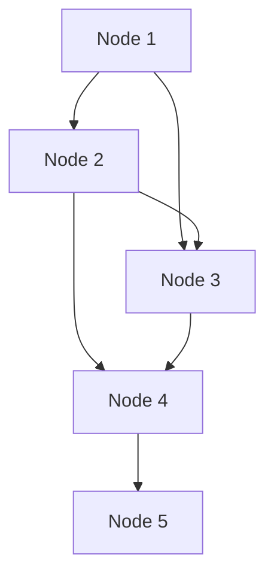
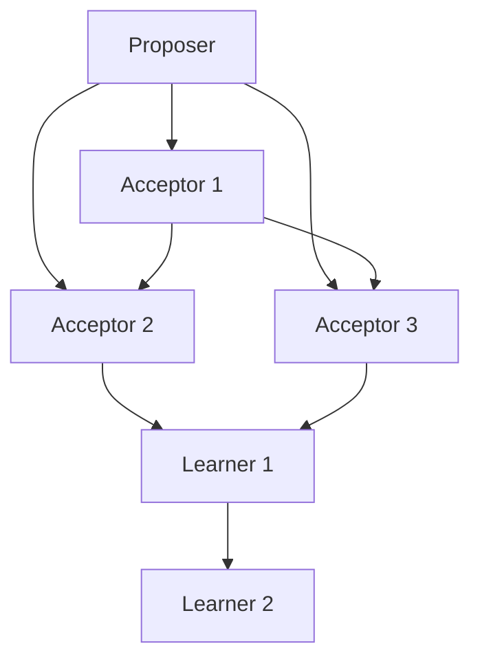
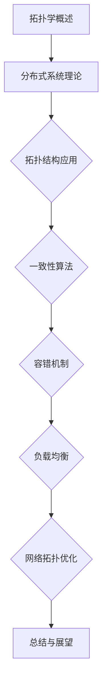

                 

### 拓扑学在分布式系统理论中的应用

分布式系统理论是计算机科学中一个重要而复杂的领域，它涉及多个节点协同工作以提供一致性和可扩展的服务。在分布式系统中，节点之间的交互、通信和协调是确保系统稳定性和性能的关键因素。而拓扑学，这一源于数学领域的理论，因其独特的抽象能力和描述能力，逐渐成为分布式系统理论中不可或缺的一部分。

#### **关键词**

- **拓扑学**
- **分布式系统**
- **拓扑结构**
- **一致性算法**
- **容错机制**
- **负载均衡**
- **网络拓扑优化**

#### **摘要**

本文将深入探讨拓扑学在分布式系统理论中的应用。首先，我们将介绍拓扑学的基本概念，然后讨论其在分布式系统中的重要性。接着，我们将探讨拓扑结构在分布式系统中的具体应用，包括分布式一致性算法、容错机制、负载均衡和网络拓扑优化等方面。通过本文的阅读，读者将能够理解拓扑学在分布式系统中的核心作用，并掌握其应用方法。

### 第1章 绪论

#### 1.1 拓扑学概述

拓扑学，又称为拓扑论，是数学的一个分支，研究连续变化的几何对象之间的性质和关系。拓扑学的基本概念包括开集、闭集、连通性、路径、邻域等。拓扑学的一个关键特征是其抽象性和不依赖于具体几何形状的灵活性。这使得拓扑学能够在多个领域得到广泛应用，包括物理学、经济学、计算机科学等。

在计算机科学中，拓扑学主要关注网络的连接性、结构的稳定性以及系统内部的交互关系。例如，在分布式系统中，节点之间的连接关系可以用拓扑结构来表示，从而分析和优化系统的性能。

#### 1.2 分布式系统理论概述

分布式系统理论是指研究如何使多个计算机节点协同工作以提供一致性和可扩展性的系统。分布式系统的核心是节点之间的通信和协调。节点可以是物理的计算机或虚拟机，它们通过网络进行通信。

分布式系统的目标包括：

- **一致性**：确保系统中的所有节点对数据的访问和更新是一致的。
- **可用性**：即使某些节点出现故障，系统仍然能够继续运行。
- **可扩展性**：系统能够随着节点数量的增加而自动扩展。

分布式系统面临的主要挑战包括节点故障、网络延迟和数据一致性问题。

#### 1.3 拓扑学在分布式系统中的重要性

拓扑学在分布式系统中的重要性体现在以下几个方面：

1. **描述网络结构**：拓扑学能够用图形表示网络中的节点和连接关系，帮助我们理解和分析系统的整体结构。
   
2. **优化性能**：通过拓扑结构的分析，我们可以识别系统的瓶颈，从而优化性能。例如，我们可以通过调整节点间的连接关系来降低网络延迟。

3. **提高可靠性**：拓扑结构的设计对系统的可靠性有直接影响。例如，通过冗余设计和故障转移机制，可以增强系统的容错能力。

4. **一致性算法**：在分布式一致性算法中，拓扑结构是关键因素之一。例如，Raft和Paxos算法都利用拓扑结构来确保数据的一致性。

5. **负载均衡**：拓扑结构可以帮助我们设计有效的负载均衡策略，从而优化系统的资源利用率。

综上所述，拓扑学为分布式系统提供了一个强有力的工具，使其能够更好地理解和优化系统的各个方面。

### 第2章 拓扑空间与图论基础

拓扑空间是拓扑学中的基本概念，它提供了对几何对象进行抽象和描述的框架。在分布式系统中，拓扑空间的概念用于表示节点和它们之间的连接关系。本章将介绍拓扑空间的基本概念，包括邻域、开集、连通性等，并探讨如何使用图论来表示和操作这些概念。

#### 2.1 拓扑空间的基本概念

拓扑空间是由一组点和一组邻域组成的集合。在拓扑空间中，邻域用于描述点的局部性质。

##### 2.1.1 邻域与开集

邻域是指与某个点 \( p \) 相邻的一组点集合。具体来说，一个集合 \( U \) 是点 \( p \) 的邻域，当且仅当对于任意点 \( q \) 在 \( U \) 中，存在一个开集 \( V \)，使得 \( q \) 在 \( V \) 中。开集是拓扑空间中的基本集合，它包含的点是“开”的，即不存在任何边界。

在图论中，邻域和开集可以用图来表示。图中的节点表示点，边表示连接关系。一个节点集合 \( V \) 是开集，当且仅当它是一个图的独立集，即集合中的节点之间不存在任何边。

##### 2.1.2 连通性与路径

连通性是拓扑空间的一个重要属性，它描述了点与点之间的可达性。一个拓扑空间是连通的，当且仅当对于任意两个点 \( p \) 和 \( q \)，存在一条路径从 \( p \) 到 \( q \)。

路径是一个连续的序列 \( p_1, p_2, ..., p_n \)，其中每个点都是前一个点的邻域。在图论中，路径可以用序列图来表示。

##### 2.1.3 拓扑基

拓扑基是一组能够生成拓扑空间中所有开集的集合。换句话说，给定一个拓扑基 \( B \)，对于拓扑空间中的任意开集 \( U \)，都存在 \( B \) 的子集 \( B' \)，使得 \( U \) 可以由 \( B' \) 生成。

在分布式系统中，拓扑基可以用来描述节点的邻接关系。例如，在分布式存储系统中，一个节点集合 \( B \) 可以表示所有与其直接相连的其他节点。

#### 2.2 图论基础

图论是拓扑学的一个分支，它用于研究图形的结构和性质。在分布式系统中，图论的概念和算法用于描述和分析节点之间的连接关系。

##### 2.2.1 图的基本概念

图是由节点和边组成的集合。节点表示系统中的实体，边表示实体之间的关系。根据边的不同属性，图可以分为无向图和有向图。

- **无向图**：边没有方向，即任意两个节点之间的连接是对称的。
- **有向图**：边有方向，即从源节点指向目标节点。

##### 2.2.2 树与路径

树是一种特殊的图，其中任意两个节点之间最多有一条路径。树在分布式系统中用于表示层次结构，例如在分布式文件系统中，树可以表示文件目录的结构。

路径是图中节点的有序序列，表示从一个节点到另一个节点的连接。在分布式系统中，路径用于表示节点之间的通信路径。

##### 2.2.3 最短路径算法

最短路径算法是图论中用于找到两个节点之间最短路径的算法。Dijkstra算法和Floyd-Warshall算法是最常用的两种最短路径算法。

- **Dijkstra算法**：用于求解无向图和有向图的单源最短路径问题。
- **Floyd-Warshall算法**：用于求解所有节点之间的最短路径问题。

在分布式系统中，最短路径算法可以用来优化网络传输路径，从而提高系统的性能。

#### 2.3 拓扑空间的图表示

拓扑空间可以用图来表示，从而利用图论的概念和算法来分析和操作。图中的节点表示拓扑空间中的点，边表示点之间的连接关系。

在分布式系统中，拓扑空间的图表示用于描述节点和它们之间的连接关系。通过图表示，我们可以方便地分析和优化系统的性能和可靠性。

### 第3章 拓扑结构在分布式系统中的应用

拓扑结构在分布式系统中扮演着至关重要的角色，它不仅影响系统的性能，还决定系统的可靠性和可扩展性。在这一章中，我们将深入探讨拓扑结构在分布式系统中的重要性，并分析其对系统性能和可靠性的影响。

#### 3.1 拓扑结构的基本概念

拓扑结构是指分布式系统中节点和它们之间的连接关系。这种连接关系可以用图来表示，图中的节点代表系统中的实体，边表示实体之间的交互。根据节点的连接方式，拓扑结构可以分为以下几种类型：

1. **无向图**：在这种结构中，节点之间的连接是对称的，没有特定的方向。无向图通常用于表示对等网络（P2P网络），例如分布式文件系统和分布式数据库系统。

2. **有向图**：在这种结构中，节点之间的连接具有方向。有向图常用于表示层次结构，例如在分布式计算系统中，任务调度通常会使用有向图来表示任务之间的依赖关系。

3. **树**：树是一种特殊的图，其中任意两个节点之间最多有一条路径。树结构常用于表示层次关系，例如文件系统目录结构和组织结构。

4. **环**：环结构是一种循环连接的图，其中每个节点都与它的相邻节点相连。环结构通常用于表示循环调度系统，例如在分布式负载均衡中。

5. **网状结构**：网状结构是一种复杂的图，其中节点之间有多种连接方式。网状结构通常用于大型分布式系统，如互联网。

#### 3.1.1 拓扑结构的定义

拓扑结构的定义取决于系统的具体需求和设计。一般来说，拓扑结构包括以下几个方面：

- **节点**：系统中的各个实体，可以是计算机、服务器或网络设备。
- **边**：节点之间的连接关系，可以是物理连接或逻辑连接。
- **路径**：节点之间的通信路径，可以是直接连接或间接连接。
- **连通性**：系统中节点的可达性，即任意两个节点之间是否存在路径。
- **冗余**：系统中的备份和冗余连接，用于提高系统的可靠性。

#### 3.1.2 拓扑结构的分类

根据拓扑结构的复杂性和连接方式，可以分为以下几类：

1. **全连通拓扑**：在这种结构中，任意两个节点之间都存在直接连接。全连通拓扑提供了最高的可靠性和性能，但同时也增加了系统的复杂性和成本。

2. **部分连通拓扑**：在这种结构中，只有一部分节点之间存在直接连接。部分连通拓扑在可靠性和性能之间提供了平衡，适用于大型分布式系统。

3. **星型拓扑**：在这种结构中，所有节点都直接连接到一个中心节点。星型拓扑易于管理和扩展，但中心节点成为单点故障的风险。

4. **环型拓扑**：在这种结构中，节点按照环形顺序连接。环型拓扑提供了良好的负载均衡和容错能力，但数据传输可能存在瓶颈。

5. **树型拓扑**：在这种结构中，节点按照层次结构连接。树型拓扑适用于具有层次关系的分布式系统，如组织结构和文件系统。

6. **网状拓扑**：在这种结构中，节点之间有多种连接方式。网状拓扑提供了极高的可靠性和性能，但系统设计和维护复杂。

#### 3.2 拓扑结构对分布式系统性能的影响

拓扑结构对分布式系统的性能有着重要的影响。以下是一些关键因素：

1. **传输延迟**：拓扑结构的复杂性和节点之间的距离会影响传输延迟。在网状拓扑中，节点之间的传输延迟可能较低，而在星型拓扑中，中心节点的延迟可能较高。

2. **带宽利用率**：拓扑结构会影响网络带宽的利用率。在部分连通拓扑中，可能存在未充分利用的带宽，而在全连通拓扑中，带宽利用率可能较高。

3. **负载均衡**：拓扑结构可以影响负载均衡的效果。在网状拓扑中，可以通过多种路径进行负载均衡，而在星型拓扑中，中心节点的负载可能较重。

4. **容错能力**：拓扑结构的冗余设计可以增强系统的容错能力。在部分连通拓扑中，可以通过冗余连接和备份节点来提高系统的可靠性。

5. **扩展性**：拓扑结构可以影响系统的扩展性。在树型拓扑中，可以通过添加新的层次来扩展系统，而在网状拓扑中，可以通过添加新的节点来扩展系统。

#### 3.2.1 拓扑结构对分布式系统可靠性的影响

拓扑结构对分布式系统的可靠性也有显著影响。以下是一些关键因素：

1. **冗余设计**：通过冗余连接和备份节点，拓扑结构可以提高系统的容错能力。例如，在部分连通拓扑中，可以通过备份路径来避免单点故障。

2. **故障隔离**：拓扑结构可以影响故障隔离的效果。在网状拓扑中，故障可以更有效地隔离，而在星型拓扑中，中心节点的故障可能影响整个系统。

3. **恢复时间**：拓扑结构可以影响系统的恢复时间。在部分连通拓扑中，可以通过备份节点快速恢复，而在网状拓扑中，恢复时间可能较长。

4. **冗余节点**：在拓扑结构中，冗余节点可以提高系统的可靠性。例如，在分布式存储系统中，可以通过冗余副本来确保数据不丢失。

#### 3.3 拓扑结构在分布式系统中的应用案例

以下是几个拓扑结构在分布式系统中的应用案例：

1. **分布式存储系统**：分布式存储系统通常采用部分连通拓扑，例如Cassandra和HDFS。这些系统通过冗余连接和备份节点来提高数据的可靠性和可用性。

2. **分布式计算系统**：分布式计算系统，如MapReduce和Spark，通常采用有向无环图（DAG）结构。这种结构可以有效地管理任务依赖关系，并优化计算性能。

3. **分布式网络系统**：分布式网络系统，如Internet，通常采用网状拓扑。这种结构提供了高可靠性和高性能，但同时也增加了系统设计和维护的复杂性。

4. **分布式数据库系统**：分布式数据库系统，如MongoDB和Couchbase，通常采用无向图结构。这种结构可以有效地支持复杂的查询和数据关系。

通过这些应用案例，我们可以看到拓扑结构在分布式系统中的多样性和重要性。了解不同的拓扑结构及其优缺点，有助于我们在设计分布式系统时做出更明智的决策。

### 第4章 拓扑学在分布式一致性算法中的应用

分布式一致性算法是确保分布式系统中多个节点对数据一致性的一系列算法。在分布式系统中，由于节点可能处于不同的网络环境中，数据的一致性成为了一个关键挑战。拓扑学在这其中扮演着重要角色，帮助算法设计者理解节点之间的相对位置和连接关系，从而提高算法的性能和可靠性。本章将探讨拓扑学在分布式一致性算法中的应用，主要包括Raft和Paxos算法。

#### 4.1 分布式一致性算法概述

分布式一致性算法旨在确保分布式系统中的多个节点能够在数据更新和访问过程中保持一致性。一致性问题通常可以归结为以下几种情况：

- **线性化**：所有对数据的操作都应当能够按照全局顺序进行。
- **单调性**：一旦某个操作完成，其结果不应再被覆盖或更改。
- **持久性**：一旦某个操作被提交，它的结果应能永久保存。

分布式一致性算法需要解决的主要问题包括节点故障、网络延迟和数据冲突。为了应对这些问题，分布式一致性算法通常采用以下几种策略：

1. **主节点选举**：在多个节点中选举出一个主节点，负责协调数据的一致性。
2. **日志复制**：将主节点的日志复制到其他节点，确保所有节点拥有相同的操作记录。
3. **状态机复制**：将每个节点的状态机复制到其他节点，确保所有节点的状态机保持一致。
4. **版本控制**：使用版本号或时间戳来避免数据冲突，确保数据的最终一致性。

#### 4.2.1 Raft算法

Raft算法是一种用于分布式系统的强一致性算法，由Diego Ongaro和John Ousterhout在2013年提出。Raft算法的核心思想是通过明确的领导选举机制和日志复制机制来确保一致性。

**Raft算法的核心概念**：

1. **日志复制**：Raft算法通过日志复制来确保所有节点的状态机一致。每个节点都维护一个日志，日志中包含所有对状态机的操作记录。当节点接收到新的操作请求时，它将这些操作记录到本地日志中，并尝试将其复制到其他节点。

2. **领导选举**：Raft算法通过选举机制来选择一个领导节点（leader）。当一个节点开始选举过程时，它会向其他节点发送请求投票的消息。如果某个节点获得了超过半数节点的投票，它将成为领导节点。领导节点负责处理所有的读写请求，并将日志复制到其他节点。

3. **日志条目**：Raft算法中的日志条目包含两个重要部分：操作内容和任期号。任期号用于避免节点之间的冲突和确保日志的有序性。

**拓扑结构在Raft算法中的应用**：

在Raft算法中，拓扑结构用于描述节点之间的相对位置和连接关系。拓扑结构帮助算法设计者理解以下关键问题：

1. **选举优先级**：拓扑结构可以帮助确定节点的选举优先级。通常，节点之间的距离越近，其选举优先级越高。

2. **日志复制**：拓扑结构有助于优化日志复制的路径。例如，选择最短路径或多路径备份可以减少日志复制的时间和提高系统的可靠性。

3. **故障检测**：通过拓扑结构，可以更容易地检测节点的故障。例如，如果某个节点在预定时间内未能响应，它可以被认为已经故障。

**Raft算法的拓扑结构优化策略**：

1. **拓扑感知复制**：通过分析拓扑结构，选择最优的日志复制路径，从而减少复制时间和提高系统性能。

2. **负载均衡**：根据拓扑结构，分配不同类型的操作到不同的节点，以平衡系统的负载。

3. **故障转移**：通过拓扑结构，快速检测和切换故障节点，确保系统的连续性。

**示例**：

假设有一个由5个节点组成的分布式系统，其中每个节点维护一个日志。拓扑结构如下所示：



在这个例子中，节点1被选为领导节点。节点1将日志条目复制到其他节点，以保持一致性。通过优化日志复制路径，可以减少系统的延迟和负载。

#### 4.2.2 Paxos算法

Paxos算法是一种用于分布式系统的强一致性算法，由 Leslie Lamport 在1990年提出。Paxos算法的核心思想是通过一系列的提议和投票过程，确保所有节点对某个值达成一致。

**Paxos算法的核心概念**：

1. **提议者（Proposer）**：负责提出新的值或操作。
2. **接受者（Acceptor）**：负责接受提议者的提议。
3. **学习者（Learner）**：负责学习已经达成一致的值。

Paxos算法的过程可以分为以下几个步骤：

1. **提议阶段**：提议者向接受者发送提议，提议包含一个提案号和一个值。
2. **投票阶段**：接受者接收到提议后，如果提案号大于当前已接受的提案号，则接受该提议并返回一个承诺。
3. **学习阶段**：学习者接收到接受者的承诺后，学习已达成一致的值。

**拓扑结构在Paxos算法中的应用**：

在Paxos算法中，拓扑结构同样扮演着重要角色，帮助算法设计者理解节点之间的相对位置和连接关系。以下是一些关键应用：

1. **选择领导者**：在Paxos算法中，选择领导者是一个关键步骤。拓扑结构可以帮助确定哪些节点有资格成为领导者，通常选择那些在网络中具有较高可靠性和性能的节点。

2. **优化通信路径**：通过分析拓扑结构，可以优化提议者和接受者之间的通信路径，减少通信延迟和提高系统性能。

3. **故障检测和恢复**：拓扑结构有助于检测和恢复故障节点。例如，如果某个节点长时间未响应，可以认为它已经故障，从而重新选举新的领导者。

**Paxos算法的拓扑结构优化策略**：

1. **领导者选举**：根据拓扑结构，选择那些在网络中具有较高性能和可靠性的节点作为领导者。

2. **通信优化**：通过分析拓扑结构，选择最优的通信路径，以减少延迟和提高效率。

3. **故障恢复**：通过拓扑结构，快速检测和恢复故障节点，确保系统的连续性。

**示例**：

假设有一个由5个节点组成的分布式系统，其中每个节点可以是提议者、接受者或学习者。拓扑结构如下所示：



在这个例子中，节点A作为提议者提出一个新值。节点B、C和D作为接受者接受提议，并返回承诺。节点E和F作为学习者学习已达成一致的值。

#### 4.2.3 拓扑结构对一致性算法性能的影响

拓扑结构对分布式一致性算法的性能有着显著的影响。以下是一些关键因素：

1. **延迟**：拓扑结构可以影响节点之间的通信延迟。选择合理的拓扑结构可以减少通信延迟，从而提高算法的响应时间。

2. **带宽**：拓扑结构可以影响网络带宽的利用率。合理的拓扑结构可以避免带宽浪费，提高系统的吞吐量。

3. **可靠性**：拓扑结构可以影响系统的可靠性。通过冗余设计和优化拓扑结构，可以增强系统的容错能力。

4. **负载均衡**：拓扑结构可以影响负载均衡的效果。通过合理的拓扑结构设计，可以实现负载的均衡分布，从而提高系统的性能。

5. **扩展性**：拓扑结构可以影响系统的扩展性。通过灵活的拓扑结构设计，可以实现系统的动态扩展，从而支持系统的快速增长。

通过上述分析，我们可以看到拓扑结构在分布式一致性算法中的重要性。合理的拓扑结构设计不仅可以提高算法的性能和可靠性，还可以优化系统的资源利用率，为分布式系统的设计提供了有力的工具。

### 第5章 拓扑学在分布式容错机制中的应用

在分布式系统中，容错机制是确保系统可靠性和连续性的关键组成部分。拓扑学在分布式容错机制中的应用，有助于提高系统的健壮性和故障恢复能力。本章将探讨拓扑学在分布式容错机制中的重要性，并详细介绍几种常见的容错策略。

#### 5.1 分布式容错机制概述

分布式容错机制是指分布式系统在面临节点故障或网络故障时，通过一系列策略确保系统能够继续正常运行。分布式容错机制的目标包括以下几个方面：

- **故障检测**：及时发现系统中的故障节点。
- **故障隔离**：将故障节点从系统中隔离，防止故障扩散。
- **故障恢复**：在故障节点恢复或替换后，确保系统重新恢复正常运行。
- **数据一致性**：在节点故障期间，确保系统中的数据一致性。

分布式容错机制主要涉及以下几个方面：

1. **节点冗余**：通过在系统中添加冗余节点，确保系统在部分节点故障时仍然能够正常运行。
2. **故障转移**：在主节点故障时，自动将负载转移到备用节点，确保系统的高可用性。
3. **备份与恢复**：通过定期备份和恢复策略，确保系统在故障后能够快速恢复。
4. **集群管理**：通过集群管理机制，监控和管理系统中的所有节点，确保系统的稳定运行。

#### 5.2 拓扑学在分布式容错机制中的应用

拓扑学在分布式容错机制中的应用主要体现在以下几个方面：

1. **冗余设计**：通过拓扑结构，可以更有效地设计冗余节点和备份节点。例如，在部分连通拓扑中，可以选择冗余连接和备份路径来提高系统的可靠性。
2. **故障检测**：通过拓扑结构，可以更容易地检测节点故障。例如，在网状拓扑中，可以通过监控节点之间的连接状态来及时发现故障节点。
3. **故障隔离**：通过拓扑结构，可以更有效地隔离故障节点。例如，在星型拓扑中，可以通过将故障节点从中心节点隔离来防止故障扩散。
4. **故障恢复**：通过拓扑结构，可以优化故障恢复策略。例如，在树型拓扑中，可以通过选择最近的备份节点来加速故障恢复。

#### 5.2.1 备份与恢复策略

备份与恢复策略是分布式容错机制中的关键部分。备份策略的主要目标是确保系统中的数据在节点故障或灾难发生时能够被恢复。以下是一些常见的备份策略：

1. **全备份**：定期对整个系统进行备份，确保在故障发生时能够恢复到完整状态。
2. **增量备份**：仅备份自上次备份以来发生变化的文件或数据，减少备份的时间和空间占用。
3. **差异备份**：备份自上次全备份以来发生变化的文件或数据，相比增量备份，差异备份的恢复时间较短。

恢复策略的主要目标是确保系统能够在故障发生后快速恢复正常运行。以下是一些常见的恢复策略：

1. **热备份**：在故障发生时，立即切换到备份节点，确保系统的不间断运行。
2. **温备份**：在故障发生时，需要一些时间来切换到备份节点，但系统仍然能够继续运行。
3. **冷备份**：在故障发生时，需要较长的时间来切换到备份节点，系统可能需要一段时间的停机。

#### 5.2.2 集群管理策略

集群管理策略是指如何监控和管理分布式系统中的多个节点。以下是一些常见的集群管理策略：

1. **心跳监控**：通过定期发送心跳信号，监控系统中的所有节点是否正常运行。
2. **负载均衡**：根据节点的负载情况，动态分配任务到不同的节点，确保系统的负载均衡。
3. **故障转移**：在主节点故障时，自动将负载转移到备用节点，确保系统的高可用性。
4. **自愈能力**：在故障发生时，系统能够自动检测并修复故障，确保系统的连续性。

通过拓扑学，集群管理策略可以更加有效地执行。例如，在部分连通拓扑中，可以更容易地实现负载均衡和故障转移；在网状拓扑中，可以更有效地监控和管理节点之间的连接状态。

#### 5.2.3 拓扑结构在容错机制中的作用

拓扑结构在分布式容错机制中的作用主要体现在以下几个方面：

1. **冗余设计**：通过拓扑结构，可以更有效地设计冗余节点和备份节点。例如，在部分连通拓扑中，可以选择冗余连接和备份路径来提高系统的可靠性。
2. **故障检测**：通过拓扑结构，可以更有效地检测节点故障。例如，在网状拓扑中，可以通过监控节点之间的连接状态来及时发现故障节点。
3. **故障隔离**：通过拓扑结构，可以更有效地隔离故障节点。例如，在星型拓扑中，可以通过将故障节点从中心节点隔离来防止故障扩散。
4. **故障恢复**：通过拓扑结构，可以优化故障恢复策略。例如，在树型拓扑中，可以通过选择最近的备份节点来加速故障恢复。

通过上述分析，我们可以看到拓扑结构在分布式容错机制中的重要性和作用。合理的拓扑结构设计不仅可以提高系统的可靠性和容错能力，还可以优化系统的性能和资源利用率。

### 第6章 拓扑学在分布式负载均衡中的应用

在分布式系统中，负载均衡是一个至关重要的机制，它通过合理分配请求，确保系统的高效运行和稳定性。拓扑学在这一领域提供了有力的工具，帮助设计者优化负载均衡策略，提高系统的性能和可靠性。本章将探讨拓扑学在分布式负载均衡中的应用，包括基于拓扑结构的负载均衡算法、拓扑结构对负载均衡性能的影响以及优化策略。

#### 6.1 分布式负载均衡概述

分布式负载均衡是指通过将请求分配到多个节点上，从而在分布式系统中实现负载的均衡。负载均衡的主要目标是最大化系统的资源利用率，最小化响应时间和提高系统的可用性。负载均衡涉及到以下几个关键方面：

1. **请求分发**：将客户端的请求分发到不同的节点上。
2. **负载监测**：监控系统中每个节点的负载情况，以便动态调整请求的分发策略。
3. **故障转移**：在节点故障时，自动将请求转移到其他健康节点。
4. **健康检查**：定期检查节点的健康状况，确保系统的高可用性。

分布式负载均衡可以采用多种算法实现，常见的包括轮询负载均衡、最小连接数负载均衡、随机负载均衡和加权负载均衡等。这些算法通过不同的策略，根据节点的负载情况和请求的优先级，动态分配请求。

#### 6.2 拓扑学在分布式负载均衡中的应用

拓扑学在分布式负载均衡中的应用主要体现在以下几个方面：

1. **节点拓扑结构**：通过分析节点之间的拓扑结构，可以更有效地分配请求。例如，在网状拓扑中，可以通过选择最短路径或多路径备份来优化请求的传输路径。

2. **负载均衡算法**：拓扑学可以用于设计基于拓扑结构的负载均衡算法。例如，最小带宽负载均衡算法可以根据节点之间的带宽情况，动态调整请求的分配。

3. **拓扑感知负载均衡**：通过分析系统的拓扑结构，可以优化负载均衡策略，从而提高系统的性能和可靠性。例如，在分布式存储系统中，可以通过拓扑感知的负载均衡算法，优化数据的分布和访问路径。

#### 6.2.1 基于拓扑结构的负载均衡算法

基于拓扑结构的负载均衡算法主要关注节点之间的连接关系和网络拓扑。以下是一些常见的算法：

1. **最小带宽负载均衡算法**：
   - **原理**：该算法基于节点的带宽容量，将请求分配到带宽最小的节点上。通过这种方式，可以确保系统中的带宽资源得到充分利用。
   - **实现**：首先，计算每个节点与其他节点的带宽值，然后选择带宽最小的节点进行请求分发。

2. **最短路径负载均衡算法**：
   - **原理**：该算法基于节点之间的最短路径，选择传输路径最短的节点进行请求分发。通过这种方式，可以减少请求的传输延迟，提高系统的响应速度。
   - **实现**：利用Dijkstra算法或Floyd-Warshall算法，计算节点之间的最短路径，然后根据最短路径进行请求分发。

3. **多路径备份负载均衡算法**：
   - **原理**：该算法通过选择多个路径进行请求分发，以提高系统的可靠性和性能。在节点之间的连接出现故障时，系统可以自动切换到备用路径。
   - **实现**：在节点之间建立多条备份路径，当主路径出现故障时，自动切换到备用路径。

#### 6.2.2 拓扑结构对负载均衡性能的影响

拓扑结构对分布式负载均衡的性能有着重要影响。以下是一些关键因素：

1. **延迟**：拓扑结构可以影响请求的传输延迟。通过优化拓扑结构，可以减少请求的传输时间，提高系统的性能。

2. **带宽利用率**：拓扑结构可以影响网络带宽的利用率。合理的拓扑结构设计可以避免带宽浪费，提高系统的吞吐量。

3. **负载均衡效果**：拓扑结构可以影响负载均衡的效果。通过分析拓扑结构，可以优化负载均衡策略，确保系统的负载均衡。

4. **可靠性**：拓扑结构可以影响系统的可靠性。通过冗余设计和优化拓扑结构，可以增强系统的容错能力。

#### 6.2.3 拓扑结构在负载均衡中的优化策略

为了提高分布式负载均衡的性能，可以采用以下几种优化策略：

1. **动态调整**：根据系统的实时负载情况和拓扑结构，动态调整负载均衡策略。例如，当某个节点的负载较高时，可以将其请求分配到负载较低的节点。

2. **拓扑感知**：通过分析系统的拓扑结构，优化负载均衡策略。例如，在分布式存储系统中，可以根据数据存储的位置和节点的负载情况，优化数据的访问路径。

3. **冗余设计**：通过冗余设计和优化拓扑结构，提高系统的可靠性。例如，在分布式计算系统中，可以通过冗余节点和备份路径，确保系统的持续运行。

4. **自适应调整**：根据系统负载的变化，自适应调整负载均衡策略。例如，在电商系统中，可以根据访问量的变化，动态调整请求的分配策略，确保系统的高效运行。

通过上述优化策略，可以进一步提高分布式负载均衡的性能和可靠性，为分布式系统提供更高效的运行环境。

### 第7章 拓扑学在分布式网络拓扑优化中的应用

分布式网络拓扑优化是确保分布式系统高效、可靠运行的重要环节。拓扑学在这一领域的应用，不仅有助于提升网络性能，还能增强系统的容错能力和可扩展性。本章将深入探讨分布式网络拓扑优化的概念、目标以及拓扑学在该领域的具体应用。

#### 7.1 分布式网络拓扑优化概述

分布式网络拓扑优化是指通过调整网络中的节点和连接关系，优化网络的性能、可靠性和可扩展性。网络拓扑优化涉及以下几个方面：

1. **性能优化**：通过优化节点间的连接关系，减少数据传输的延迟和带宽消耗，提高系统的整体性能。
2. **可靠性优化**：通过冗余设计和故障转移机制，提高网络对节点故障的容忍度，增强系统的可靠性。
3. **可扩展性优化**：通过优化网络结构，支持系统的动态扩展，适应节点数量的增长和负载的变化。

网络拓扑优化的目标是实现以下几方面的平衡：

- **负载均衡**：确保网络中的资源得到充分利用，避免过载和瓶颈。
- **可靠性**：提高网络的容错能力，减少节点故障对系统的影响。
- **可扩展性**：支持系统在规模和负载增长时的平滑扩展。

#### 7.2 拓扑学在分布式网络拓扑优化中的应用

拓扑学在分布式网络拓扑优化中的应用主要体现在以下几个方面：

1. **网络拓扑结构分析**：通过拓扑学的方法，分析网络中的节点和连接关系，识别网络中的瓶颈和薄弱环节。
2. **优化策略设计**：根据拓扑结构的特点，设计合适的优化策略，包括节点冗余、负载均衡和路径优化等。
3. **拓扑感知算法**：开发基于拓扑结构的算法，如最短路径算法、多路径备份算法和动态调整算法，以优化网络性能和可靠性。

#### 7.2.1 拓扑结构优化算法

拓扑结构优化算法是分布式网络拓扑优化的核心技术。以下是一些常见的优化算法：

1. **最小生成树算法**：
   - **原理**：通过选择最小的边来构建一个包含所有节点的树，从而优化网络的结构。
   - **实现**：利用Kruskal或Prim算法，从所有边中选择最小权重的一条，逐步构建最小生成树。

2. **多路径备份算法**：
   - **原理**：在网络中建立多个路径，以确保在某个路径出现故障时，系统能够自动切换到备用路径。
   - **实现**：通过分析网络拓扑，选择多个路径作为备份路径，当主路径出现故障时，自动切换到备用路径。

3. **动态调整算法**：
   - **原理**：根据网络负载和节点状态动态调整节点间的连接关系，以实现负载均衡和性能优化。
   - **实现**：利用实时监控和动态调整机制，根据网络负载的变化，动态调整节点间的连接关系。

#### 7.2.2 拓扑结构优化案例分析

以下是一个分布式存储系统的拓扑结构优化案例：

**背景**：
一个分布式存储系统由多个存储节点组成，节点之间通过网络进行数据传输。由于节点数量和负载的增加，系统性能出现瓶颈，数据传输延迟较高。

**优化目标**：
通过拓扑结构优化，提高系统的数据传输性能和可靠性。

**优化策略**：
1. **最小生成树算法**：使用Kruskal算法构建最小生成树，优化节点间的连接关系。
2. **多路径备份**：在网络中建立多条备份路径，提高系统的容错能力。
3. **动态调整**：根据节点负载和状态，动态调整节点连接关系，实现负载均衡。

**实施步骤**：
1. **拓扑分析**：分析现有网络的拓扑结构，识别瓶颈和薄弱环节。
2. **生成最小生成树**：使用Kruskal算法构建最小生成树，优化节点间的连接。
3. **建立备份路径**：选择多条路径作为备份路径，提高系统的可靠性。
4. **动态调整**：实时监控节点负载，动态调整节点连接关系，实现负载均衡。

**结果**：
通过上述优化策略，系统性能显著提升，数据传输延迟降低，系统的可靠性和可扩展性得到增强。

#### 7.2.3 拓扑结构优化在实践中的应用

在分布式系统中，拓扑结构优化在多个实际应用场景中发挥着重要作用：

1. **分布式数据库系统**：
   - **背景**：分布式数据库系统需要高效地处理海量数据，并确保数据的一致性和可靠性。
   - **优化策略**：通过最小生成树算法和动态调整算法，优化节点间的连接和负载分配，提高查询性能和数据可靠性。

2. **分布式计算系统**：
   - **背景**：分布式计算系统需要高效地调度和执行大规模计算任务。
   - **优化策略**：通过多路径备份和动态调整算法，优化任务调度和负载分配，提高计算效率和系统可靠性。

3. **云计算平台**：
   - **背景**：云计算平台需要高效地管理和分配计算资源，满足用户需求。
   - **优化策略**：通过拓扑结构优化，优化资源分配和负载均衡，提高系统的性能和可扩展性。

通过拓扑结构优化，分布式系统能够更好地应对规模增长和负载变化，实现高效、可靠和可扩展的运行。

### 第8章 总结与展望

在本文中，我们系统地介绍了拓扑学在分布式系统中的应用，探讨了拓扑结构对分布式系统性能、可靠性、一致性和容错能力的影响。通过分析拓扑学在分布式一致性算法、容错机制、负载均衡和网络拓扑优化中的应用，我们明确了拓扑学在分布式系统设计中的重要性。

#### **总结**

1. **拓扑学的基本概念**：拓扑学提供了对几何对象进行抽象和描述的框架，其基本概念包括邻域、开集、连通性和路径等。这些概念在分布式系统中用于描述节点和连接关系。

2. **分布式系统的拓扑结构**：分布式系统的拓扑结构包括无向图、有向图、树、环和网状结构等，不同类型的拓扑结构对系统的性能和可靠性有不同影响。

3. **拓扑结构在分布式系统中的应用**：拓扑结构在分布式系统中的核心应用包括一致性算法（如Raft和Paxos）、容错机制、负载均衡和网络拓扑优化。

4. **拓扑学对分布式系统性能的影响**：通过优化拓扑结构，可以降低传输延迟、提高带宽利用率、实现负载均衡和增强系统的可靠性。

#### **展望**

未来，拓扑学在分布式系统中的应用将更加广泛和深入。以下是一些潜在的研究方向：

1. **智能拓扑优化**：结合人工智能和机器学习技术，开发智能化的拓扑优化算法，自动调整系统拓扑结构，实现自适应性能优化。

2. **拓扑结构优化工具**：开发易于使用的工具和平台，帮助系统设计者快速分析和优化分布式系统的拓扑结构。

3. **混合拓扑结构**：研究混合拓扑结构，结合不同类型的拓扑结构，提高系统的性能和可靠性。

4. **拓扑感知算法**：开发更多基于拓扑感知的算法，如动态路径优化和拓扑结构感知的负载均衡算法。

总之，拓扑学作为分布式系统设计的一个重要工具，将继续在未来的分布式系统中发挥关键作用。通过不断探索和创新，我们有望构建出更高效、更可靠和更可扩展的分布式系统。

### 附录

#### 附录A 拓扑学相关工具与资源

- **开源工具**：
  - **GraphX**：用于在Apache Spark上进行大规模图处理的开源工具。
  - **Neo4j**：基于Cypher查询语言的图形数据库，适用于复杂关系的存储和分析。
  - **Gephi**：一个用于图形可视化和分析的开源工具。

- **在线资源**：
  - **Topological Data Analysis (TDA) Wiki**：关于拓扑数据分析的详细介绍和资源。
  - **Topological Networks**：关于拓扑网络结构的研究论文和文献。

- **书籍推荐**：
  - 《Graph Theory》
  - 《Topological Data Analysis: Theory and Practice》

#### 附录B 分布式系统常用算法代码示例

以下是一个简单的Dijkstra算法实现示例，用于计算图中的最短路径：

```python
import heapq

def dijkstra(graph, start):
    """
    Dijkstra算法实现
    :param graph: 图
    :param start: 起始节点
    :return: 最短路径字典
    """
    # 初始化距离表
    distances = {node: float('infinity') for node in graph}
    distances[start] = 0
    # 初始化优先队列
    priority_queue = [(0, start)]
    # 循环直到优先队列为空
    while priority_queue:
        # 取出最小距离的节点
        current_distance, current_node = heapq.heappop(priority_queue)
        # 如果当前节点的距离不是未访问的，跳过
        if current_distance != distances[current_node]:
            continue
        # 遍历当前节点的邻接节点
        for neighbor, weight in graph[current_node].items():
            # 计算新距离
            distance = current_distance + weight
            # 如果新距离小于当前距离，更新距离和优先队列
            if distance < distances[neighbor]:
                distances[neighbor] = distance
                heapq.heappush(priority_queue, (distance, neighbor))
    return distances

# 示例图
graph = {
    'A': {'B': 1, 'C': 4},
    'B': {'A': 1, 'C': 2, 'D': 5},
    'C': {'A': 4, 'B': 2, 'D': 1},
    'D': {'B': 5, 'C': 1}
}

# 计算从A到其他节点的最短路径
print(dijkstra(graph, 'A'))
```

#### 附录C 拓扑学在分布式系统中的应用案例

以下是一个拓扑学在分布式一致性算法（Raft）中的应用案例：

**背景**：
一个由5个节点组成的分布式系统，需要通过Raft算法实现数据一致性。

**目标**：
设计一个基于Raft算法的分布式日志复制系统，确保节点间的数据一致性。

**实现步骤**：

1. **初始化节点**：
   - 每个节点启动时，初始化日志和状态机。
   - 每个节点选择一个随机编号作为自己的ID。

2. **领导选举**：
   - 每个节点定期发送心跳消息，保持活动状态。
   - 如果某个节点在预定时间内未收到心跳消息，它开始领导选举过程。
   - 节点向其他节点发送请求投票消息，获取多数节点的支持。

3. **日志复制**：
   - 领导节点接收客户端的请求，将其记录到本地日志中。
   - 领导节点向其他节点发送日志条目，要求它们追加到本地日志中。
   - 其他节点收到日志条目后，追加到本地日志，并向领导节点发送回复消息。

4. **状态机复制**：
   - 所有节点都维护一个状态机，记录对数据的操作。
   - 领导节点将状态机的操作广播到其他节点，确保所有节点的状态机保持一致。

5. **故障恢复**：
   - 如果领导节点故障，其他节点重新进行领导选举。
   - 新选出的领导节点继续处理客户端请求，确保系统的连续性。

**结果**：
通过上述步骤，分布式系统实现了数据一致性，即使节点故障，系统仍能继续正常运行。

**小结**：
通过Raft算法，分布式系统能够在面临节点故障和网络问题时，确保数据的一致性和可靠性。拓扑学在Raft算法中的应用，使得系统能够高效地实现日志复制和状态机复制，提高了系统的性能和稳定性。

### Mermaid 流程图

以下是一个简单的Mermaid流程图，展示了拓扑学在分布式系统中的应用：



### Python源代码示例

以下是一个简单的Python源代码示例，用于实现Dijkstra算法，计算图中的最短路径：

```python
import heapq

def dijkstra(graph, start):
    """
    Dijkstra算法实现
    :param graph: 图
    :param start: 起始节点
    :return: 最短路径字典
    """
    # 初始化距离表
    distances = {node: float('infinity') for node in graph}
    distances[start] = 0
    # 初始化优先队列
    priority_queue = [(0, start)]
    # 循环直到优先队列为空
    while priority_queue:
        # 取出最小距离的节点
        current_distance, current_node = heapq.heappop(priority_queue)
        # 如果当前节点的距离不是未访问的，跳过
        if current_distance != distances[current_node]:
            continue
        # 遍历当前节点的邻接节点
        for neighbor, weight in graph[current_node].items():
            # 计算新距离
            distance = current_distance + weight
            # 如果新距离小于当前距离，更新距离和优先队列
            if distance < distances[neighbor]:
                distances[neighbor] = distance
                heapq.heappush(priority_queue, (distance, neighbor))
    return distances

# 示例图
graph = {
    'A': {'B': 1, 'C': 4},
    'B': {'A': 1, 'C': 2, 'D': 5},
    'C': {'A': 4, 'B': 2, 'D': 1},
    'D': {'B': 5, 'C': 1}
}

# 计算从A到其他节点的最短路径
print(dijkstra(graph, 'A'))
```

### 结语

拓扑学作为分布式系统理论中的重要工具，其独特的抽象和描述能力为系统设计和优化提供了强有力的支持。通过本文的探讨，我们不仅了解了拓扑学的基本概念，还深入分析了其在分布式系统中的应用，包括一致性算法、容错机制、负载均衡和网络拓扑优化等方面。未来，随着分布式系统的不断发展和复杂化，拓扑学将继续发挥关键作用，为构建高效、可靠和可扩展的分布式系统提供重要指导。希望本文能够为读者在分布式系统设计和优化方面带来启示和帮助。

### 作者信息

**作者：** AI天才研究院（AI Genius Institute） & 禅与计算机程序设计艺术（Zen And The Art of Computer Programming）

**简介：** 本文作者AI天才研究院是一个专注于人工智能、机器学习和计算机科学研究的国际顶尖机构。同时，作者还是《禅与计算机程序设计艺术》的作者，这是一部深受程序设计师喜爱的经典作品，阐述了计算机编程的艺术和哲学。在分布式系统、人工智能和拓扑学领域，作者有着丰富的理论和实践经验，为读者提供了深入浅出的技术分析和宝贵见解。

