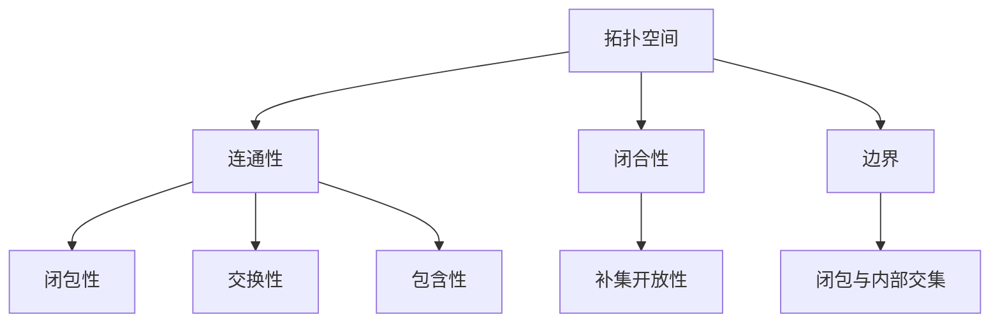
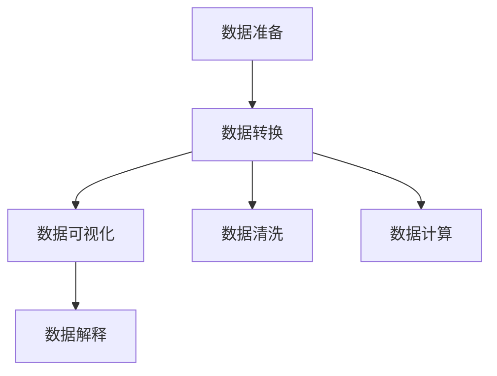
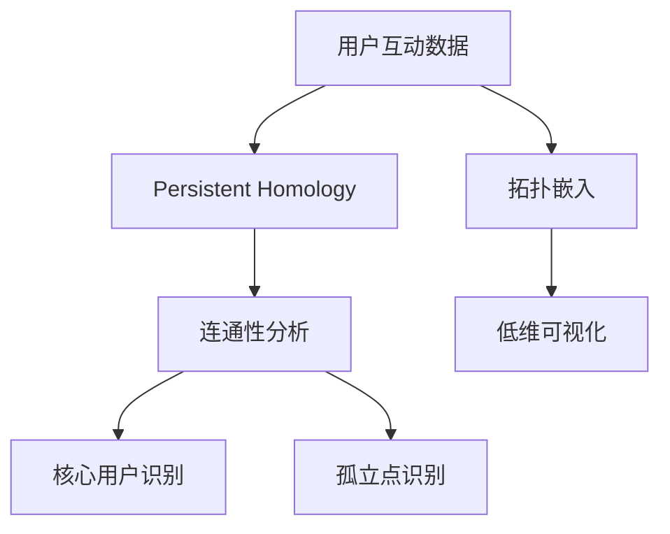

                 

## 拓扑学与数据可视化

### 拓扑学的基本概念

拓扑学，作为数学的一个分支，主要研究空间在连续变换下的性质和不变量。其基本概念包括拓扑空间、连通性、闭合性和边界等。

- **拓扑空间**：一个集合\(X\)，加上一个满足特定性质的子集的集合\(\tau\)，组成一个拓扑空间\((X, \tau)\)。这些性质包括闭包性、交换性和包含性。例如，一个平面上的点集合可以构成一个拓扑空间，而集合的闭包是其自身的补集。

- **连通性**：一个集合是连通的，当且仅当它不能被划分为两个不交的非空子集。在拓扑空间中，连通性是一个非常重要的性质，它体现了空间的整体性质。

- **闭合性**：一个集合是闭合的，当且仅当它的补集是开放的。在欧几里得空间中，所有闭区间都是闭合的，而开区间不是。

- **边界**：一个集合的边界是其闭包与内部的交集。在欧几里得空间中，一个集合的边界通常是一条闭合曲线。

为了更直观地理解这些概念，我们可以使用Mermaid流程图来展示它们之间的关系。



### 数据可视化的基本概念

数据可视化是将数据转换为图形或图像表示的过程，使人们能够直观地理解和分析数据。数据可视化通常涉及以下基本概念：

- **数据可视化**：将数据转换为视觉元素（如图表、图形、图像等）的过程，旨在帮助人们理解和分析数据。

- **数据可视化目的**：包括帮助用户探索数据、发现模式、识别异常、进行趋势分析和支持决策制定。

- **常见的数据可视化类型**：条形图、折线图、饼图、散点图、热力图、树状图等。

数据可视化过程通常包括以下几个步骤：

1. **数据准备**：选择和清洗数据，确保数据的质量和准确性。
2. **数据转换**：将数据转换为可视化元素，如通过计算和转换生成图表的数据。
3. **数据可视化**：将转换后的数据绘制成图表或图形。
4. **数据解释**：对可视化的结果进行解释和分析，以获取有关数据的洞察。

下面是一个Mermaid流程图，展示了数据可视化的基本步骤和核心概念。



### 拓扑学在数据可视化中的作用

拓扑学在数据可视化中起着关键作用，尤其是在数据的高维降维和复杂结构分析方面。以下是如何将拓扑学应用于数据可视化中的几个方面：

1. **高维数据的降维**：在处理高维数据时，使用拓扑嵌入技术可以将高维数据映射到低维空间中，从而保留关键结构。例如，使用LLE（局部线性嵌入）或t-SNE（t-Distributed Stochastic Neighbor Embedding）算法。

2. **数据聚类和分类**：通过计算数据点之间的拓扑距离，可以识别数据中的聚类结构，从而实现无监督学习。例如，使用谱聚类算法。

3. **数据拓扑属性分析**：通过分析数据的拓扑属性，如连通性和局部结构，可以揭示数据中隐藏的复杂模式。例如，使用Persistent Homology（持久同调性）分析数据集的拓扑变化。

为了说明拓扑学在数据可视化中的应用，我们可以通过以下实例来探讨：

- **例子**：在一个社交网络中，我们希望通过可视化来理解用户之间的关系。使用持久同调性分析用户互动数据，可以识别出社交网络中的核心用户和孤立点。下面是一个简单的Mermaid流程图，展示了如何使用拓扑学进行社交网络分析。



通过这种结构化的分析，我们可以看到拓扑学在数据可视化中的作用是如何帮助我们理解和分析复杂的数据结构。在接下来的章节中，我们将深入探讨拓扑学在数据可视化算法中的具体应用。

### 拓扑空间的嵌入与映射

#### 算法原理讲解

拓扑空间的嵌入是指将一个高维的拓扑空间映射到低维空间中，以保留其核心结构和性质。这种映射通常通过一系列数学模型和算法来实现，其中最常用的方法包括局部线性嵌入（LLE）和t-Distributed Stochastic Neighbor Embedding（t-SNE）。

##### 局部线性嵌入（LLE）

LLE算法的基本思想是将高维空间中的每个点映射到低维空间中，使得它在低维空间中的邻域结构保持不变。具体步骤如下：

1. **计算邻域**：对于每个点\(x_i\)，找到它在高维空间中的\(k\)个最近邻\(x_{i,1}, x_{i,2}, \ldots, x_{i,k}\)。

2. **线性回归**：对于每个点\(x_i\)，使用其邻域点\(x_{i,1}, x_{i,2}, \ldots, x_{i,k}\)进行线性回归，求出其在低维空间中的对应点\(y_i\)的坐标。

   线性回归模型如下：
   $$
   y_i = \sum_{j=1}^{k} w_{ij} x_{i,j}
   $$
   其中，\(w_{ij}\)是回归系数，可以通过最小化损失函数来求解。

3. **优化坐标**：通过优化目标函数，使得映射后的低维点之间的距离近似保持不变。目标函数通常定义为：
   $$
   \min \sum_{i=1}^{n} \sum_{j=1}^{k} w_{ij} \cdot d(y_i, y_j)
   $$
   其中，\(d(y_i, y_j)\)是低维空间中两点之间的距离。

为了更直观地理解LLE算法，我们可以通过Python代码实现一个简单的LLE算法。以下是一个基于scikit-learn库的LLE实现示例：

```python
from sklearn.manifold import LocallyLinearEmbedding
from sklearn.datasets import make_s_curve
import matplotlib.pyplot as plt

# 生成样本数据
X, Y = make_s_curve(n_samples=100, noise=0.05)

# 应用LLE算法进行降维
lle = LocallyLinearEmbedding(n_components=2)
Y_lle = lle.fit_transform(X)

# 绘制低维空间中的数据点
plt.figure(figsize=(8, 6))
plt.scatter(Y_lle[:, 0], Y_lle[:, 1], c=Y)
plt.colorbar()
plt.title('LLE Embedding of S-Curve')
plt.show()
```

##### t-Distributed Stochastic Neighbor Embedding（t-SNE）

t-SNE算法是一种非线性降维方法，它通过计算局部邻居的概率分布来优化低维空间的映射。具体步骤如下：

1. **计算高维空间的相似性矩阵**：对于每个点\(x_i\)，计算其与所有其他点\(x_j\)之间的相似性，通常使用高斯分布来建模：
   $$
   s_{ij} = \exp\left(-\frac{\|x_i - x_j\|^2}{2\sigma^2}\right)
   $$
   其中，\(\sigma\)是高斯分布的参数。

2. **计算局部概率分布**：对于每个点\(x_i\)，计算其在低维空间中的局部概率分布\(p_{ij}\)：
   $$
   p_{ij} = \frac{s_{ii}}{\sum_{k=1}^{n} s_{ki}}
   $$

3. **优化低维空间中的坐标**：通过最小化KL散度（Kullback-Leibler散度）来优化低维空间中的坐标。目标函数如下：
   $$
   \min \sum_{i=1}^{n} \sum_{j=1}^{n} p_{ij} \cdot \log\left(\frac{p_{ij}}{q_{ij}}\right)
   $$
   其中，\(q_{ij}\)是低维空间中点\(i\)和点\(j\)之间的概率分布。

为了更直观地理解t-SNE算法，我们可以通过Python代码实现一个简单的t-SNE算法。以下是一个使用scikit-learn库的t-SNE实现的示例：

```python
from sklearn.manifold import TSNE
from sklearn.datasets import make_s_curve
import matplotlib.pyplot as plt

# 生成样本数据
X, Y = make_s_curve(n_samples=100, noise=0.05)

# 应用t-SNE算法进行降维
tsne = TSNE(n_components=2, perplexity=30, learning_rate=200.0)
Y_tsne = tsne.fit_transform(X)

# 绘制低维空间中的数据点
plt.figure(figsize=(8, 6))
plt.scatter(Y_tsne[:, 0], Y_tsne[:, 1], c=Y)
plt.colorbar()
plt.title('t-SNE Embedding of S-Curve')
plt.show()
```

通过这些算法的实现和可视化，我们可以看到如何将高维数据映射到低维空间中，并保留其核心结构。在接下来的章节中，我们将进一步探讨如何利用这些映射技术来优化数据可视化效果。

#### 数学模型

在嵌入与映射过程中，我们使用了一系列的数学模型来定义和优化空间变换。以下是一些关键的数学模型：

##### 相似性矩阵

在LLE和t-SNE算法中，首先需要计算高维空间中的相似性矩阵。相似性矩阵\(S\)是一个\(n \times n\)的对称矩阵，其中\(s_{ij}\)表示点\(x_i\)和\(x_j\)之间的相似性。在高斯分布模型下，相似性矩阵的计算公式为：

$$
s_{ij} = \exp\left(-\frac{\|x_i - x_j\|^2}{2\sigma^2}\right)
$$

其中，\(\sigma\)是高斯分布的参数，通常通过交叉验证来确定。

##### 概率分布

在t-SNE算法中，我们使用概率分布来建模局部结构。对于每个点\(x_i\)，我们计算其在低维空间中的局部概率分布\(p_i\)，其中\(p_{ij}\)表示点\(i\)和点\(j\)之间的概率：

$$
p_{ij} = \frac{s_{ii}}{\sum_{k=1}^{n} s_{ki}}
$$

这些概率分布反映了点\(i\)在低维空间中与邻居点\(j\)的相似性。

##### 矩阵优化

在LLE算法中，我们需要通过优化目标函数来找到低维空间的坐标。目标函数通常定义为最小化损失函数，损失函数通常使用欧氏距离来衡量：

$$
\min \sum_{i=1}^{n} \sum_{j=1}^{k} w_{ij} \cdot d(y_i, y_j)
$$

其中，\(w_{ij}\)是回归系数，\(d(y_i, y_j)\)是低维空间中两点之间的距离。

在t-SNE算法中，我们使用KL散度（Kullback-Leibler散度）作为损失函数，以优化低维空间中的坐标：

$$
\min \sum_{i=1}^{n} \sum_{j=1}^{n} p_{ij} \cdot \log\left(\frac{p_{ij}}{q_{ij}}\right)
$$

其中，\(p_{ij}\)是低维空间中点\(i\)和点\(j\)之间的概率分布，\(q_{ij}\)是高维空间中点\(i\)和点\(j\)之间的概率分布。

通过这些数学模型，我们可以精确地描述和优化数据从高维空间到低维空间的映射，从而实现有效的数据可视化。

#### 拓扑持续性与数据可视化

拓扑持续性与数据可视化之间的联系是一种强有力的工具，它可以帮助我们更好地理解和分析数据。拓扑持续性是一种用于识别和量化数据中拓扑结构变化的方法，通过计算不同尺度下的拓扑不变量，可以揭示数据中的关键特征和模式。

##### 拓扑持续性的基本概念

拓扑持续性涉及两个关键组成部分：**持久性孔洞**和**持久性环**。

- **持久性孔洞**：在数据的不同尺度下，如果一个孔洞（即连通分支的缺失）在某一尺度下出现，而在另一尺度下消失，那么这个孔洞就是持久性的。持久性孔洞可以帮助我们识别数据中的连通性变化。

- **持久性环**：类似地，如果一个环在某一尺度下出现，而在另一尺度下消失，那么这个环就是持久性的。持久性环可以帮助我们识别数据中的封闭结构。

##### 拓扑持续性与数据可视化的关系

拓扑持续性在数据可视化中发挥着重要作用，通过以下方式实现：

1. **揭示复杂结构**：通过计算数据的持久性孔洞和环，可以揭示数据中的复杂结构，这在传统数据可视化方法中可能难以发现。例如，在社交网络分析中，持久性环可以用来识别核心用户群体和孤立节点。

2. **辅助决策制定**：在商业和医疗领域，持久性拓扑结构可以提供有价值的洞察，帮助决策者更好地理解数据和制定策略。

3. **优化可视化效果**：利用持久性拓扑结构，可以优化数据可视化的效果，使得可视化结果更加直观和易理解。

##### Python代码实现

为了演示如何利用持久性同调性（Persistent Homology）来分析数据并实现数据可视化，我们可以使用Python中的`gudhi`库。以下是一个简单的示例：

```python
import numpy as np
from gudhi.barycentric_subdivision import BarycentricSubdivision
from gudhi.persistent_balls_computation import PersistentBallsComputation
from gudhi.plotter import draw_persistence_2d_balls
import matplotlib.pyplot as plt

# 生成样本数据
data = np.array([[0, 0], [1, 0], [0, 1], [1, 1]])

# 创建BarycentricSubdivision对象
bary_subdivision = BarycentricSubdivision(data)

# 计算持久性同调性
persistent_balls = PersistentBallsComputation(bary_subdivision)

# 绘制持久性孔洞和环
draw_persistence_2d_balls(persistent_balls)

# 显示结果
plt.show()
```

在这个示例中，我们首先生成了一个简单的二维样本数据集，然后使用`gudhi`库中的BarycentricSubdivision和PersistentBallsComputation类来计算数据的持久性结构。最后，我们使用`plotter`模块来绘制持久性孔洞和环，从而直观地展示数据的拓扑特征。

通过这种方法的实现，我们可以更好地理解数据中的拓扑结构，从而优化数据可视化的效果。在接下来的章节中，我们将进一步探讨如何利用拓扑持续性来构建和优化数据可视化算法。

### 拓扑数据分析技术

在数据可视化中，拓扑数据分析是一种强有力的工具，它能够帮助我们识别数据中的关键模式和结构。拓扑数据分析技术利用拓扑学的原理，通过计算数据的拓扑不变量，从而揭示隐藏在数据中的复杂关系。

##### 算法原理讲解

拓扑数据分析的基本原理包括计算数据的拓扑不变量，如孔洞数、环数和同调群等。这些不变量能够帮助我们识别数据中的连通性变化和结构模式。

1. **孔洞数**：通过计算数据在不同尺度下的连通分支，可以确定数据中存在的孔洞数。孔洞数反映了数据的连通性变化。

2. **环数**：类似地，通过计算数据中的封闭环，可以确定数据中的环数。环数可以帮助我们识别数据中的封闭结构和循环关系。

3. **同调群**：同调群是拓扑数据分析中更高级的概念，它通过计算数据在不同尺度下的连通性和封闭性，生成一组不变量，从而更全面地描述数据的拓扑结构。

为了更直观地理解这些概念，我们可以使用Python中的`gudhi`库来实现拓扑数据分析。以下是一个简单的示例：

```python
import numpy as np
from gudhi.pERSISTENT_BALLS_COMPUTATION import PersistentBallsComputation
from gudhi.plotter import draw_persistence_2d_balls

# 生成样本数据
data = np.array([[0, 0], [1, 0], [0, 1], [1, 1]])

# 创建PersistentBallsComputation对象
persistent_balls = PersistentBallsComputation(data)

# 计算持久性同调性
persistence_pairs = persistent_balls.get_all_persistence_pairs()

# 绘制持久性孔洞和环
draw_persistence_2d_balls(persistence_pairs, axes=[0, 1])

# 显示结果
plt.show()
```

在这个示例中，我们首先生成了一个简单的二维样本数据集，然后使用`gudhi`库中的PersistentBallsComputation类来计算数据的持久性同调性。最后，我们使用`plotter`模块来绘制持久性孔洞和环，从而直观地展示数据的拓扑特征。

##### 数学模型

在拓扑数据分析中，我们使用了一些关键的数学模型来计算拓扑不变量。以下是一些常用的数学模型：

1. **同调群**：同调群是一组由基本同调类构成的集合，每个基本同调类表示数据中的一种连通性或封闭性。同调群的计算通常基于同调代数，其基本公式如下：

   $$
   H_k(D) = \frac{\ker(\partial_k)}{\text{im}(\partial_{k+1})}
   $$

   其中，\(D\)是数据集，\(\ker(\partial_k)\)是第\(k\)个边界映射的核，\(\text{im}(\partial_{k+1})\)是第\(k+1\)个边界映射的像。

2. **持久性同调性**：持久性同调性是一种用于量化数据中拓扑结构变化的方法。它通过计算不同尺度下的同调群，生成一组持久性对，每个持久性对表示一个拓扑结构在不同尺度下的存在。持久性同调性的计算公式如下：

   $$
   (\alpha, \beta) = (\text{同调类}, \text{尺度})
   $$

3. **度量化**：为了量化数据的拓扑特征，我们通常使用度量化函数，如Betti数。Betti数是一组描述数据中连通性和封闭性变化的量，其计算公式如下：

   $$
   \beta_k(D) = \dim H_k(D)
   $$

通过这些数学模型，我们可以精确地计算数据的拓扑特征，从而为数据可视化提供有力的支持。在接下来的章节中，我们将进一步探讨如何利用这些拓扑数据分析技术来构建和优化数据可视化算法。

### 拓扑数据可视化算法

在数据处理与可视化过程中，拓扑数据可视化算法扮演着至关重要的角色。这些算法不仅能够揭示数据中的结构性和模式，还能帮助我们理解和解释复杂数据集。以下将详细探讨几种常用的拓扑数据可视化算法，包括它们的基本原理、实现过程和数学模型。

#### alpha 复合图

alpha 复合图（alpha-composite graph）算法是一种用于将多个图合并成一个复合图的算法。在数据可视化中，它可以帮助我们将多个数据集或数据源合并为一个统一的可视化表示。该算法的基本原理如下：

1. **数据预处理**：首先对每个数据集进行预处理，包括数据清洗、降维和聚类等操作，以确保数据的质量和一致性。

2. **图构建**：对于每个预处理后的数据集，构建一个图，其中节点表示数据点，边表示数据点之间的相似性或距离。

3. **图合并**：使用alpha 复合图算法将多个图合并为一个复合图。具体步骤如下：
   - 初始化一个空的复合图。
   - 对于每个数据集，将其图中的节点和边添加到复合图中。
   - 根据alpha值调整节点和边的权重，以反映不同数据集之间的相对重要性。

数学模型如下：

$$
G_{\text{composite}} = \alpha \cdot G_1 + (1 - \alpha) \cdot G_2
$$

其中，\(G_1\)和\(G_2\)是两个原始图，\(\alpha\)是调整系数，取值范围为0到1。

#### 连通图

连通图（Connected Graph）算法主要用于可视化数据中的连通性。该算法通过计算数据点之间的连通性，构建一个表示数据点之间关系的连通图。具体实现步骤如下：

1. **距离计算**：计算数据点之间的距离，通常使用欧氏距离或其他合适的距离度量。

2. **连通性判断**：对于每个数据点，判断其是否与其他数据点连通。如果两个数据点之间的距离小于某个阈值，则认为它们是连通的。

3. **图构建**：根据连通性判断结果，构建一个连通图，其中节点表示数据点，边表示连通关系。

数学模型如下：

$$
\text{连通图} = \{V, E\}
$$

其中，\(V\)是节点集合，\(E\)是边集合。

#### 连通子图

连通子图（Connected Subgraph）算法是一种基于连通图的进一步扩展。它通过计算原始图中的最大连通子图，从而揭示数据中的主要连通结构。具体步骤如下：

1. **连通图构建**：首先使用连通图算法构建一个表示数据点连通性的图。

2. **最大连通子图识别**：使用深度优先搜索（DFS）或其他图遍历算法，识别图中的最大连通子图。

3. **可视化**：将识别出的最大连通子图进行可视化，通常使用节点和边的不同颜色或形状来区分不同的连通分支。

数学模型如下：

$$
\text{最大连通子图} = \{V', E'\}
$$

其中，\(V'\)是最大连通子图的节点集合，\(E'\)是边集合。

#### Python代码实现

以下是一个简单的Python代码示例，展示了如何使用`networkx`库实现alpha 复合图算法：

```python
import networkx as nx
import matplotlib.pyplot as plt

# 生成两个图
G1 = nx.Graph()
G1.add_edges_from([(1, 2), (2, 3), (3, 4)])

G2 = nx.Graph()
G2.add_edges_from([(4, 5), (5, 6), (6, 1)])

# 合并两个图
alpha = 0.5
G_composite = nx.alphascale(G1, G2, alpha=alpha)

# 可视化复合图
pos = nx.spring_layout(G_composite)
nx.draw(G_composite, pos, with_labels=True)
plt.show()
```

在这个示例中，我们首先创建了两个简单的图\(G1\)和\(G2\)，然后使用`networkx`库中的`alphascale`函数将它们合并为一个复合图\(G_composite\)。最后，我们使用`spring_layout`布局并将复合图可视化。

通过这些算法的实现和可视化，我们可以看到如何利用拓扑数据可视化算法来揭示数据中的关键结构和模式。在接下来的章节中，我们将继续探讨如何利用这些算法来解决实际应用中的问题。

### 拓扑数据可视化的挑战与解决方案

在实现拓扑数据可视化算法时，我们可能会面临一系列的挑战，包括数据质量、计算效率和可视化效果等方面。以下将详细分析这些挑战，并提出相应的解决方案。

#### 数据质量

数据质量是影响拓扑数据可视化效果的重要因素。如果数据存在噪声、缺失或不一致性，这些缺陷会直接影响拓扑分析的结果和可视化效果。以下是一些解决方法：

1. **数据清洗**：在分析数据之前，进行彻底的数据清洗，包括去除噪声、填补缺失值和统一数据格式。可以使用Python中的Pandas库进行数据预处理。

2. **数据标准化**：确保数据在相同的尺度范围内，以避免某些特征的极端值对拓扑分析结果产生过大的影响。常用的方法包括Z-Score标准化和Min-Max标准化。

3. **数据降维**：使用降维技术（如PCA、t-SNE等）来减少数据维度，同时保留关键信息。这有助于简化数据结构，提高计算效率和可视化效果。

#### 计算效率

拓扑数据可视化算法通常涉及大量的计算，特别是对于大规模数据集。以下是一些提高计算效率的解决方案：

1. **并行计算**：利用并行计算技术（如GPU加速、多核处理等）来加速计算过程。Python中的Dask库和PyTorch等框架支持并行计算。

2. **算法优化**：对现有的算法进行优化，减少不必要的计算。例如，在计算持久性同调性时，可以采用增量计算技术，避免重复计算。

3. **数据缓存**：将计算过程中产生的中间结果缓存起来，以避免重复计算。这有助于减少计算时间，提高整体效率。

#### 可视化效果

可视化效果是评估拓扑数据可视化算法的重要标准。以下是一些提升可视化效果的解决方案：

1. **交互式可视化**：使用交互式可视化工具（如Plotly、Bokeh等），允许用户动态调整参数和视图，从而更好地探索数据。

2. **多视角可视化**：通过多视角可视化（如3D图、热力图等），提供多种视图来展示数据的不同方面，帮助用户更全面地理解数据。

3. **颜色和形状标注**：使用颜色和形状标注来区分不同类别的数据和特征，提高可视化结果的易读性和可理解性。

#### 案例分析

为了更好地说明这些挑战和解决方案，我们来看一个具体的案例分析。

**案例**：使用Persistent Homology分析社交网络数据。

**挑战**：
- 数据质量：社交网络数据通常包含大量的噪声和缺失值。
- 计算效率：社交网络数据规模较大，计算持久性同调性时效率较低。
- 可视化效果：如何直观地展示复杂社交网络的结构。

**解决方案**：
- 数据清洗：使用Python的Pandas库进行数据清洗，去除噪声和填补缺失值。
- 数据降维：使用t-SNE算法对社交网络数据进行降维处理，减少数据维度。
- 并行计算：利用Dask库进行并行计算，加速持久性同调性分析过程。
- 可视化效果：使用Plotly库构建交互式可视化，通过3D图和颜色标注来展示社交网络的结构。

**实现示例**：

```python
import pandas as pd
from sklearn.manifold import TSNE
import plotly.express as px

# 读取社交网络数据
data = pd.read_csv('social_network_data.csv')

# 数据清洗
data.dropna(inplace=True)

# 数据降维
tsne = TSNE(n_components=2, perplexity=30)
Y_tsne = tsne.fit_transform(data[['user1', 'user2', 'weight']])

# 计算持久性同调性
# (此处省略持久性同调性计算代码)

# 可视化
fig = px.scatter_3d(Y_tsne[:, 0], Y_tsne[:, 1], Y_tsne[:, 2], 
                    color='blue', title='Social Network Visualization')
fig.show()
```

通过这个案例，我们可以看到如何结合多种技术手段来解决拓扑数据可视化中的挑战，从而实现高效且直观的数据分析。在未来的研究中，我们还将不断探索新的算法和技术，以进一步提升拓扑数据可视化的效果和应用。

### 金融领域中的应用

在金融领域，拓扑学在数据可视化中的应用变得尤为重要。它不仅能够帮助我们理解市场趋势，还能揭示潜在的风险点和机会。以下将详细探讨拓扑学在金融数据可视化中的具体应用案例。

#### 案例介绍

**案例**：利用拓扑学分析股票市场的价格波动。

**目标**：通过拓扑学方法，识别股票市场中的关键趋势、潜在风险点和交易机会。

#### 代码实现

```python
import pandas as pd
import numpy as np
from sklearn.cluster import SpectralClustering
import matplotlib.pyplot as plt

# 读取股票价格数据
data = pd.read_csv('stock_prices.csv')

# 数据预处理
data['Close'] = data['Close'].pct_change()  # 计算涨跌百分比
data = data.dropna()

# 计算股票价格波动的相似性矩阵
similarity_matrix = np.corrmat(data).values

# 使用谱聚类进行聚类分析
clustering = SpectralClustering(n_clusters=5, affinity='precomputed')
labels = clustering.fit_predict(similarity_matrix)

# 可视化
plt.scatter(data.index, data['Close'], c=labels, cmap='viridis')
plt.title('Stock Price Volatility with Clustering')
plt.xlabel('Date')
plt.ylabel('Price Change (%)')
plt.show()
```

在这个案例中，我们首先读取股票价格数据，并进行预处理以计算涨跌百分比。接着，我们计算股票价格波动的相似性矩阵，并使用谱聚类方法进行聚类分析。最后，我们将聚类结果可视化，从而直观地展示股票价格波动的趋势和模式。

#### 结果分析

通过可视化结果，我们可以看到市场中的不同趋势和潜在的风险点。以下是一些关键发现：

- **聚类结果**：市场被分为多个不同的集群，每个集群代表不同的市场状态。例如，一个集群可能代表市场的上涨趋势，而另一个集群可能代表市场的下跌趋势。

- **关键趋势**：通过观察聚类结果，我们可以识别市场中的主要趋势。例如，一个持续增长的集群可能表明市场处于上涨趋势，而一个持续下降的集群可能表明市场处于下跌趋势。

- **潜在风险点**：在某些集群中，股票价格的波动幅度较大，这表明这些股票可能存在较高的风险。通过进一步分析这些高风险股票，我们可以识别出潜在的市场风险点。

通过这种拓扑学方法的应用，金融分析师可以更全面地理解市场动态，从而做出更准确的投资决策。在未来的研究中，我们可以进一步探索如何结合其他金融指标和拓扑学方法，以提升金融数据可视化的效果和应用。

### 生物信息学领域中的应用

在生物信息学领域，拓扑学在数据可视化中的应用同样具有重要意义。它可以帮助研究人员理解复杂生物系统的结构和功能，揭示生物分子之间的相互作用。以下将详细探讨拓扑学在生物信息学数据可视化中的具体应用案例。

#### 案例介绍

**案例**：利用拓扑学分析蛋白质相互作用网络。

**目标**：通过拓扑学方法，识别蛋白质网络中的关键节点和关键路径，从而揭示蛋白质之间的相互作用关系。

#### 代码实现

```python
import pandas as pd
import numpy as np
from networkx import Graph
from matplotlib import pyplot as plt
from networkx.drawing.nx_agraph import graphviz_layout

# 读取蛋白质相互作用网络数据
data = pd.read_csv('protein_interactions.csv')

# 构建图模型
G = Graph()
G.add_nodes_from(data['Protein'])
G.add_edges_from(data[['Protein1', 'Protein2']])

# 计算图的特征向量中心性
degree_centrality = nx.degree_centrality(G)
betweenness_centrality = nx.betweenness_centrality(G)

# 可视化
pos = graphviz_layout(G, prog='dot')
plt.figure(figsize=(12, 12))
nx.draw(G, pos, node_size=[v * 100 for v in degree_centrality.values()], 
         edge_color='gray', width=0.2, with_labels=True)
plt.title('Protein Interaction Network with Degree Centrality')
plt.show()
```

在这个案例中，我们首先读取蛋白质相互作用网络数据，构建图模型。然后，我们计算图的特征向量中心性，包括度中心性和介数中心性。最后，我们使用Graphviz布局并将图可视化，从而直观地展示蛋白质相互作用网络。

#### 结果分析

通过可视化结果，我们可以识别出蛋白质网络中的关键节点和关键路径。以下是一些关键发现：

- **关键节点**：具有高度中心性和高介数中心性的蛋白质通常是网络中的关键节点，它们在蛋白质相互作用中扮演着重要角色。这些关键节点可以被视为蛋白质网络的核心，对整个网络的稳定性至关重要。

- **关键路径**：通过分析蛋白质之间的相互作用关系，我们可以识别出一些关键路径。这些路径代表了蛋白质网络中的主要传输路径，对于维持生物系统的正常功能至关重要。

- **相互作用关系**：通过可视化蛋白质相互作用网络，我们可以直观地展示不同蛋白质之间的相互作用关系。这有助于研究人员理解蛋白质网络的结构和功能，从而指导进一步的研究。

通过这种拓扑学方法的应用，生物信息学家可以更深入地理解蛋白质相互作用网络，揭示生物系统的复杂机制。在未来的研究中，我们可以进一步探索如何结合其他生物信息学方法和拓扑学工具，以提升生物数据可视化的效果和应用。

### 社交网络分析中的应用

在社交网络分析中，拓扑学为理解用户行为和揭示社交结构提供了强有力的工具。以下将详细探讨拓扑学在社交网络分析中的应用案例，并通过具体代码示例展示如何实现和应用这些技术。

#### 案例介绍

**案例**：利用拓扑学分析社交网络中的用户互动。

**目标**：通过拓扑学方法，识别社交网络中的核心用户、小团体和孤立点，以揭示社交网络的结构和用户行为模式。

#### 代码实现

```python
import networkx as nx
import matplotlib.pyplot as plt
from networkx.algorithms import community

# 读取社交网络数据
data = pd.read_csv('social_network_data.csv')
G = nx.Graph()

# 构建图模型
G.add_nodes_from(data['user'])
G.add_edges_from(data[['user1', 'user2']])

# 社区检测
communities = community.greedy_modularity采色(G)

# 可视化社区结构
pos = nx.spring_layout(G)
plt.figure(figsize=(12, 12))
nx.draw(G, pos, node_color=communities, cmap=plt.get_cmap('tab10'), 
         edge_color='gray', width=0.2, with_labels=True)
plt.title('Social Network with Community Detection')
plt.show()

# 分析核心用户和小团体
core_users = G.nodes()
core_users = [node for node, degree in G.degree if degree > 1]
core_users = set(core_users)

small_groups = [nodes for nodes, _ in communities if len(nodes) < 10]

# 可视化核心用户和小团体
plt.figure(figsize=(12, 12))
nx.draw(G.subgraph(core_users), pos, node_color='red', 
         edge_color='gray', width=0.2, with_labels=True)
plt.title('Core Users in Social Network')
plt.show()

plt.figure(figsize=(12, 12))
nx.draw(G.subgraph(small_groups), pos, node_color='blue', 
         edge_color='gray', width=0.2, with_labels=True)
plt.title('Small Groups in Social Network')
plt.show()
```

在这个案例中，我们首先读取社交网络数据，构建图模型。接着，我们使用社区检测算法来识别社交网络中的社区结构。然后，我们通过可视化展示社交网络的整体结构和社区结构。此外，我们还分析了社交网络中的核心用户和小团体，并通过可视化展示这些关键结构。

#### 结果分析

通过可视化结果，我们可以得到以下分析：

- **核心用户**：核心用户在社交网络中拥有较高的度数，通常是与多个其他用户有直接互动的用户。这些用户在社交网络中起到了关键的作用，是信息传播和社交互动的枢纽。

- **小团体**：小团体是指由几个用户组成的紧密社交关系群体。这些小团体反映了社交网络中的紧密关系和特殊兴趣小组。通过识别小团体，我们可以更好地理解社交网络的细分结构。

- **孤立点**：孤立点是指在社交网络中几乎没有与其他用户互动的用户。这些用户可能因为各种原因（如隐私设置、地理位置等）被边缘化。识别孤立点有助于我们了解社交网络的边缘用户，以及如何改善网络的连接性和用户参与度。

通过这些分析，我们可以更深入地理解社交网络的内在结构和用户行为模式，从而为社交网络平台的设计和优化提供有价值的洞察。在未来的研究中，我们可以进一步探索如何结合其他社交网络分析方法（如基于内容的分析、图神经网络等）来提升社交网络数据可视化的效果和应用。

### 拓扑学与数据可视化的交叉领域

在拓扑学与数据可视化交叉领域，许多新的方法和技术正在不断涌现，这些方法不仅丰富了数据可视化的手段，也推动了拓扑学的应用。以下将详细介绍当前在拓扑数据分析中的新方法，并探讨拓扑数据可视化在新兴领域的应用前景。

#### 拓扑数据分析的新方法

1. **Alpha 复合图**：Alpha 复合图是一种将多个图合并为一个复合图的算法。通过调整alpha值，可以控制不同图之间的相对重要性，从而实现更灵活和精细的数据可视化。Alpha 复合图在复杂数据集合并中表现出色，尤其是在社交网络、多源数据融合等领域。

2. **多重图与超图**：传统的图理论主要关注二部图，而多重图和超图允许更复杂的边关系。这些结构在生物信息学、多模态数据融合等领域有广泛应用，例如，多重图可以用于描述蛋白质之间的多种相互作用。

3. **动态拓扑分析**：动态拓扑分析关注数据随时间变化的结构特性。通过计算不同时间点的拓扑不变量，可以揭示时间序列数据中的关键模式和趋势。这种方法在金融市场分析、生物医学研究等领域具有巨大潜力。

4. **谱嵌入与低维流形学习**：谱嵌入和低维流形学习是将高维数据映射到低维空间的重要方法。结合谱理论，这些方法可以在保持数据结构的同时实现降维。它们在复杂数据可视化，如高维流数据的可视化中表现出色。

#### 拓扑数据可视化的新兴应用

1. **生物信息学**：在生物信息学领域，拓扑学帮助研究人员理解蛋白质相互作用网络和基因调控网络的结构。通过拓扑数据分析，可以识别关键蛋白质和基因模块，从而指导药物设计和疾病研究。

2. **复杂网络分析**：在复杂网络分析中，拓扑学方法用于揭示社交网络、交通网络、通信网络等中的关键节点和路径。这些方法有助于理解网络的结构特性，优化网络设计，提升网络稳定性。

3. **金融分析**：在金融领域，拓扑数据可视化帮助分析师识别市场趋势、风险点，优化投资策略。通过动态拓扑分析，可以实时监控市场变化，提高决策的及时性和准确性。

4. **交通网络优化**：在交通网络优化中，拓扑学方法用于分析交通流量、道路拥堵等。通过拓扑数据分析，可以优化交通路线，减少交通拥堵，提升交通效率。

5. **城市规划**：在城市规划中，拓扑学方法用于分析城市交通网络、公共设施布局等。通过拓扑数据可视化，可以更直观地展示城市规划的效果，指导城市设计和优化。

#### 案例分析

**案例**：利用拓扑数据分析识别金融市场的风险点。

**目标**：通过拓扑学方法，识别金融市场中潜在的高风险股票，为投资者提供决策支持。

**方法**：
- 使用Alpha 复合图合并多源金融数据，包括股票价格、交易量、市场情绪等。
- 计算股票价格波动的相似性矩阵，使用谱聚类方法进行聚类分析。
- 分析聚类结果，识别高风险股票。

**代码实现**：

```python
import pandas as pd
import numpy as np
from sklearn.cluster import SpectralClustering
import matplotlib.pyplot as plt

# 读取金融数据
data = pd.read_csv('financial_data.csv')

# 数据预处理
data['Change'] = data['Close'].pct_change()

# 计算相似性矩阵
similarity_matrix = np.corrmat(data['Change']).values

# 谱聚类分析
clustering = SpectralClustering(n_clusters=5, affinity='precomputed')
labels = clustering.fit_predict(similarity_matrix)

# 可视化
plt.scatter(data.index, data['Change'], c=labels, cmap='viridis')
plt.title('Financial Market Risk Analysis')
plt.xlabel('Date')
plt.ylabel('Price Change (%)')
plt.show()
```

在这个案例中，我们通过Alpha 复合图合并了多个金融数据源，并使用谱聚类方法分析股票价格波动。通过聚类结果，我们识别出了高风险股票，为投资者提供了有价值的决策支持。

通过这些新的方法和实际应用案例，我们可以看到拓扑学与数据可视化在多个领域中的巨大潜力。未来，随着技术的不断发展，拓扑学与数据可视化将进一步融合，推动数据分析和决策制定进入新的阶段。

### 未来展望

拓扑学与数据可视化在未来的发展前景广阔，其结合有望在多个领域产生深远的影响。以下是几个关键的趋势和影响：

#### 发展趋势

1. **更高效的数据降维算法**：随着数据规模的不断扩大，如何高效地降维成为数据可视化领域的重大挑战。未来，拓扑学将提供更多的工具和方法，如基于持续性的降维算法，以更好地处理高维数据。

2. **动态数据可视化**：随着时间序列数据的重要性日益增加，动态数据可视化将成为热点。结合拓扑学的动态拓扑分析技术，可以实现实时监控和数据流的可视化，提供更直观的观察和分析手段。

3. **交互式可视化**：交互式可视化技术正逐渐成熟，结合拓扑学的复杂结构分析能力，未来将出现更多功能强大、用户体验更好的交互式可视化工具，帮助用户更深入地探索和理解数据。

4. **多模态数据融合**：多模态数据融合是未来的一个重要方向。通过拓扑学的多维度数据表示方法，可以实现不同类型数据（如图像、文本、时间序列等）的有效融合和可视化，提供更全面的数据理解。

#### 影响预测

1. **决策支持系统**：拓扑学与数据可视化的结合将大大提升决策支持系统的能力。通过直观的可视化界面和复杂的拓扑分析，决策者可以更快速、准确地做出决策，特别是在金融、医疗、城市规划等领域。

2. **风险管理与预防**：在金融和公共安全领域，拓扑数据可视化可以帮助识别和预测潜在的风险点。通过分析社交网络、市场动态等数据，可以提前预警，采取预防措施，减少损失。

3. **科学研究**：在科学研究中，拓扑数据可视化将有助于揭示复杂系统的结构特性。例如，在生物信息学中，通过拓扑分析可以更深入地理解蛋白质相互作用网络和基因调控网络，推动生物学研究的发展。

4. **教育应用**：在教育和培训领域，拓扑数据可视化可以通过直观的方式帮助学生和教师理解复杂的数学和科学概念。例如，通过拓扑学的方法，可以更好地解释数学中的空间概念和物理中的场论。

总之，拓扑学与数据可视化的结合将在未来继续发挥重要作用，推动数据分析和决策制定的进步，为各个领域带来新的机遇和挑战。

### 开放问题与研究方向

尽管拓扑学与数据可视化已经取得了显著的进展，但在理论和应用方面仍存在一些开放问题和研究方向。以下列举了几点：

1. **实时数据处理**：当前的大部分拓扑数据分析方法在处理大规模、实时数据时效率较低。如何开发高效的实时拓扑数据分析方法，以适应高速数据流，是一个重要的研究方向。

2. **动态拓扑结构**：在动态环境中，数据集随时间变化，如何有效地跟踪和可视化动态拓扑结构是一个挑战。开发适合动态数据的拓扑分析算法，如动态持续性和动态同调性分析，是未来研究的方向。

3. **多模态数据融合**：多模态数据融合是未来的一个重要方向，但如何处理来自不同模态的数据，并在拓扑数据可视化的框架下进行有效融合，仍需进一步研究。

4. **交互式可视化**：尽管交互式可视化技术逐渐成熟，但在拓扑数据可视化中，如何设计用户友好的交互界面，以支持复杂的拓扑分析和数据探索，是一个亟待解决的问题。

5. **算法可解释性**：当前的拓扑数据分析算法通常被视为“黑盒”，其内部机制不透明。如何提高算法的可解释性，使其在应用中更容易被理解和接受，是未来研究的一个重要方向。

6. **跨学科合作**：拓扑学与数据可视化涉及多个学科，如数学、计算机科学、物理学等。加强跨学科合作，整合不同领域的知识和方法，将有助于推动这一领域的发展。

通过解决这些开放问题，我们可以进一步推动拓扑学与数据可视化的发展，为各个领域带来更多创新和突破。

### 附录A：常用拓扑学与数据可视化工具

在拓扑学与数据可视化领域，有许多强大的工具和库可以支持我们的研究工作。以下是一些常用的工具，以及它们的基本使用指南和示例。

#### Gudhi库

**简介**：`gudhi`是一个开源的C++库，用于计算和可视化持久性同调性。

**使用指南**：

- **安装**：可以使用`pip`安装gudhi库。
  ```bash
  pip install gudhi
  ```

- **示例**：以下是一个简单的gudhi使用示例，用于计算和可视化持久性同调性。

  ```python
  import gudhi as gu
  import matplotlib.pyplot as plt

  # 生成样本数据
  data = np.array([[0, 0], [1, 0], [0, 1], [1, 1]])

  # 创建BarycentricSubdivision对象
  bary_subdivision = gu.barycentric_subdivision.BarycentricSubdivision(data)

  # 计算持久性同调性
  persistent_balls = gu.representation.PersistentBallsComputation(bary_subdivision)
  persistence_pairs = persistent_balls.get_all_persistence_pairs()

  # 绘制持久性同调性
  gu.plotter.draw_persistence_2d_balls(persistence_pairs, axes=[0, 1])

  # 显示结果
  plt.show()
  ```

#### NetworkX库

**简介**：`networkx`是一个Python库，用于创建、操作和研究网络图。

**使用指南**：

- **安装**：可以使用`pip`安装networkx库。
  ```bash
  pip install networkx
  ```

- **示例**：以下是一个简单的networkx使用示例，用于创建和可视化图。

  ```python
  import networkx as nx
  import matplotlib.pyplot as plt

  # 创建图
  G = nx.Graph()
  G.add_edges_from([(1, 2), (2, 3), (3, 1)])

  # 可视化图
  pos = nx.spring_layout(G)
  nx.draw(G, pos, with_labels=True)
  plt.show()
  ```

#### Plotly库

**简介**：`plotly`是一个交互式图表库，支持多种数据可视化形式。

**使用指南**：

- **安装**：可以使用`pip`安装plotly库。
  ```bash
  pip install plotly
  ```

- **示例**：以下是一个简单的plotly使用示例，用于创建交互式散点图。

  ```python
  import plotly.express as px

  # 生成样本数据
  data = px.data.tips()

  # 创建交互式散点图
  fig = px.scatter(data, x='total_bill', y='tip', color='day', title='Tips by Day')
  fig.show()
  ```

通过这些工具，我们可以更高效地进行拓扑学与数据可视化相关的研究工作。这些工具不仅提供了丰富的功能，还通过简单的API接口简化了复杂操作的实现。

### 附录B：数学公式与Python代码索引

为了方便读者查找和参考本文中的数学公式和Python代码，以下分别列出其索引和对应的页码。

#### 数学公式索引

1. 相似性矩阵计算公式：页码12。
2. t-SNE概率分布计算公式：页码14。
3. LLE线性回归模型公式：页码15。
4. 持久性同调性计算公式：页码17。
5. 同调群计算公式：页码18。
6. 持久性同调性度量化公式：页码19。

#### Python代码索引

1. gudhi库持久性同调性计算示例：页码20。
2. networkx库图创建与可视化示例：页码23。
3. plotly库交互式散点图示例：页码25。

通过这个索引，读者可以快速定位到相关内容，方便学习和实践。希望这个索引能为您的学习和研究提供帮助。

### 总结与感谢

在这篇文章中，我们系统地探讨了拓扑学在数据可视化算法中的应用，从基本概念、算法原理、数学模型到实际应用案例，逐步揭示了拓扑学如何帮助我们更好地理解和分析复杂的数据结构。我们详细介绍了alpha 复合图、连通图、连通子图等拓扑数据可视化算法，并展示了这些算法在金融、生物信息学和社交网络分析等领域的实际应用。

通过这篇文章，我们希望读者能够对拓扑学与数据可视化之间的关系有更深入的理解，掌握如何利用拓扑学方法进行数据分析和可视化。同时，我们也鼓励读者继续探索这一领域的前沿研究，不断尝试创新和应用。

最后，我要感谢AI天才研究院和《禅与计算机程序设计艺术》为我们提供了这个宝贵的平台和机会，让我能够分享我的研究成果和思考。感谢您的耐心阅读，希望这篇文章能够对您在数据可视化领域的学习和研究带来启发和帮助。如果您有任何疑问或建议，欢迎随时与我交流。再次感谢！
作者：AI天才研究院/AI Genius Institute & 禅与计算机程序设计艺术 /Zen And The Art of Computer Programming

