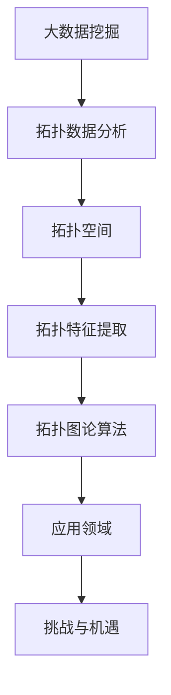
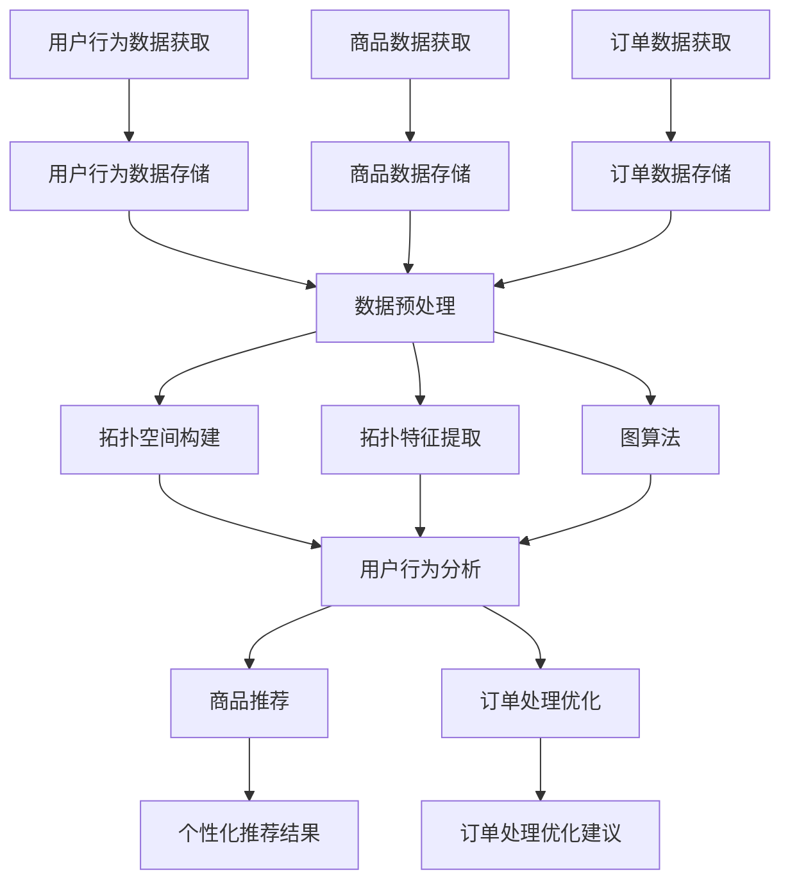

                 

# 拓扑数据分析在大数据挖掘中的应用

## 关键词

大数据，拓扑数据分析，挖掘，社交网络，生物学，物联网，算法优化，工具与库，实战项目，未来趋势。

## 摘要

本文旨在探讨拓扑数据分析在大数据挖掘中的应用，包括其基础概念、核心算法、实际应用挑战与机遇、相关工具与库以及项目实战。通过详细分析，本文将为读者提供一个全面的理解，并展示如何将拓扑数据分析应用于不同领域，以解决复杂的数据挖掘问题。

## 拓扑数据分析在大数据挖掘中的应用

### 第一部分：拓扑数据分析基础

#### 第1章：大数据与拓扑数据分析概述

##### 1.1 大数据的挑战与机遇

在信息时代，大数据已经成为企业和政府决策的重要依据。然而，大数据的处理和挖掘面临诸多挑战，如数据量巨大、数据类型多样、数据质量参差不齐等。拓扑数据分析作为大数据处理的一种新兴方法，能够揭示数据之间的复杂关系，为大数据挖掘提供新的视角和工具。

##### 1.2 拓扑数据分析的定义与基本概念

拓扑数据分析是指利用拓扑空间的概念，对大规模数据进行结构化分析和特征提取。它基于图论和网络理论，通过构建数据之间的拓扑关系，从而实现对数据的深入挖掘和理解。

##### 1.3 拓扑数据分析在大数据挖掘中的重要性

拓扑数据分析在大数据挖掘中具有重要应用价值。首先，它能够有效地处理复杂数据关系，揭示数据之间的潜在联系；其次，它能够通过拓扑特征提取，提高数据挖掘的准确性和效率；最后，它能够为不同领域的数据挖掘提供通用的方法和技术。

#### 第2章：拓扑空间的构建

##### 2.1 数据预处理与特征提取

在构建拓扑空间之前，需要对原始数据进行预处理和特征提取。数据预处理包括数据清洗、数据集成和数据转换等步骤。特征提取则是指从原始数据中提取具有代表性的特征，以便更好地构建拓扑空间。

##### 2.2 拓扑空间的建立

构建拓扑空间是拓扑数据分析的核心步骤。它基于数据预处理和特征提取的结果，通过拓扑空间构建算法，将数据点映射到拓扑空间中。拓扑空间的建立可以采用基于密度的聚类方法、基于距离的方法等。

#### 第3章：拓扑数据分析核心算法

##### 3.1 拓扑特征提取

拓扑特征提取是指从拓扑空间中提取具有代表性的特征，以描述数据点之间的拓扑关系。常见的拓扑特征包括度特征、介数特征、紧密性特征等。

##### 3.2 拓扑图论算法

拓扑图论算法是拓扑数据分析的重要组成部分。它包括图的基本概念（如节点、边、路径等）和图算法（如最短路径算法、社区发现算法等）。这些算法能够帮助我们更好地理解数据之间的拓扑关系，并应用于数据挖掘任务。

### 第二部分：拓扑数据分析在实际应用中的挑战与机遇

#### 第4章：拓扑数据分析的应用领域

##### 4.1 社交网络分析

社交网络分析是拓扑数据分析的重要应用领域之一。通过拓扑数据分析，我们可以揭示社交网络中的关键用户、社群结构、传播路径等，为社交网络运营、营销等提供有力支持。

##### 4.2 生物学数据分析

生物学数据分析是另一个重要的应用领域。通过拓扑数据分析，我们可以揭示基因网络中的关键基因、生物通路等，为生物医学研究提供新方法。

##### 4.3 物联网数据分析

物联网数据分析是拓扑数据分析在工业、智能家居等领域的应用。通过拓扑数据分析，我们可以优化网络拓扑结构、提高数据传输效率、降低能耗等。

#### 第4章：拓扑数据分析的挑战与机遇

##### 4.2 数据规模与计算效率

随着数据规模的不断扩大，拓扑数据分析面临的挑战之一是如何在保证计算效率的前提下，处理大规模数据。这需要优化拓扑空间构建和特征提取算法，提高计算速度。

##### 4.3 数据隐私与安全性

在拓扑数据分析过程中，数据隐私和安全性的保护是一个重要问题。如何确保数据在传输、存储和处理过程中的安全性，防止数据泄露，是一个亟待解决的挑战。

##### 4.4 算法优化与模型选择

拓扑数据分析涉及到多种算法和模型的选择。如何根据具体应用场景，选择合适的算法和模型，提高数据挖掘的准确性和效率，是一个重要的研究方向。

### 第三部分：拓扑数据分析工具与库

#### 第5章：拓扑数据分析工具

##### 5.1 Gephi

Gephi是一个开源的图形分析工具，用于网络分析、探索性数据分析和社交网络分析。它提供了丰富的图形化界面和强大的数据处理能力，适用于各种规模的网络分析项目。

##### 5.2 Cytoscape

Cytoscape是一个生物信息学工具，主要用于生物网络分析和系统生物学研究。它支持多种数据格式，提供了丰富的网络分析功能，如网络可视化、拓扑特征提取等。

#### 第5章：拓扑数据分析库

##### 5.3 NetworkX

NetworkX是一个开源的Python库，用于创建、操作和研究网络。它提供了丰富的图算法和数据结构，适用于各种网络分析任务，如拓扑特征提取、社区发现等。

##### 5.4 Graph-tool

Graph-tool是一个基于C++的Python库，提供了高效的图算法和数据结构。它支持大规模网络分析，如最短路径算法、社区发现算法等，适用于高性能计算环境。

### 第四部分：项目实战

#### 第6章：项目实战：拓扑数据分析在电商应用中的实战

##### 6.1 项目背景

随着电商的迅速发展，电商数据分析已成为企业提高运营效率、优化营销策略的重要手段。本节将介绍如何利用拓扑数据分析，挖掘电商数据中的潜在价值。

##### 6.2 实战步骤

本节将详细描述电商应用中的拓扑数据分析步骤，包括数据预处理、拓扑空间构建、拓扑特征提取、拓扑数据分析等。

##### 6.3 结果分析与优化

本节将分析拓扑数据分析的结果，并提出优化策略，以提高数据挖掘的准确性和效率。

### 第五部分：未来展望与趋势

#### 第7章：未来展望与趋势

##### 7.1 拓扑数据分析的发展趋势

本节将讨论拓扑数据分析在未来可能的发展趋势，如算法创新、应用领域拓展、技术标准化等。

##### 7.2 拓扑数据分析的挑战与机遇

本节将分析拓扑数据分析面临的挑战和机遇，如数据规模、计算效率、数据隐私与安全性、算法优化与模型选择等。

### 附录

#### 附录 A：拓扑数据分析常用算法与模型

本附录将介绍拓扑数据分析中常用的算法和模型，包括算法原理、公式和应用案例等。

#### 附录 B：参考文献

本附录将列出本文引用的相关文献，供读者进一步阅读和研究。

---

通过以上内容，我们希望能够帮助读者对拓扑数据分析在大数据挖掘中的应用有一个全面的理解。在接下来的章节中，我们将逐一深入探讨每个主题，以期为读者提供一个系统、全面的技术博客文章。敬请期待！## 第一部分：拓扑数据分析基础

### 第1章：大数据与拓扑数据分析概述

#### 1.1 大数据的挑战与机遇

大数据时代的到来，给各行各业带来了前所未有的机遇。然而，随着数据量的不断增长和数据类型的日益复杂，大数据处理和挖掘也面临着诸多挑战。

首先，数据量巨大。据估计，全球每天产生的数据量高达数泽字节。如此庞大的数据量，对存储、处理和挖掘技术提出了极高的要求。传统的数据处理方法，如关系数据库和批量处理技术，已经难以应对这种海量数据带来的挑战。

其次，数据类型多样。除了传统的结构化数据外，大数据还包括大量的半结构化和非结构化数据，如图像、音频、视频等。这些数据类型多样化，使得数据处理和挖掘变得更加复杂。

第三，数据质量参差不齐。在大数据环境中，数据质量成为了一个不可忽视的问题。数据来源广泛，数据采集过程不规范，可能导致数据存在缺失、噪声和错误。这些问题不仅影响数据挖掘的准确性，还可能导致决策失误。

面对这些挑战，大数据挖掘成为了解决问题的关键。大数据挖掘是指利用先进的数据挖掘技术和算法，从海量数据中发现有价值的信息和知识。大数据挖掘可以帮助企业更好地理解客户需求，优化业务流程，提高运营效率，甚至发现新的商业模式。

拓扑数据分析作为一种新兴的数据挖掘方法，具有独特的优势。它利用拓扑空间的概念，对大规模数据进行结构化分析和特征提取，能够揭示数据之间的复杂关系。拓扑数据分析在大数据挖掘中的应用，为解决上述挑战提供了新的思路和方法。

首先，拓扑数据分析能够处理复杂数据关系。传统的数据挖掘方法往往依赖于线性模型和统计分析，难以处理数据之间的非线性关系。而拓扑数据分析通过构建数据之间的拓扑关系，能够有效地捕捉数据之间的复杂关系，提高数据挖掘的准确性和效率。

其次，拓扑数据分析能够提高数据挖掘的效率。传统的数据挖掘方法通常需要大量的计算资源和时间。而拓扑数据分析通过高效的特征提取和算法优化，能够在保证计算效率的前提下，处理大规模数据。

最后，拓扑数据分析为不同领域的数据挖掘提供了通用的方法和技术。无论是社交网络分析、生物学数据分析，还是物联网数据分析，拓扑数据分析都能够发挥其独特的优势，为数据挖掘提供有力支持。

总之，大数据时代的到来，给数据挖掘带来了巨大的挑战，同时也带来了前所未有的机遇。拓扑数据分析作为一种新兴的数据挖掘方法，具有处理复杂数据关系、提高挖掘效率和提供通用方法等优势，在大数据挖掘中具有广阔的应用前景。

#### 1.2 拓扑数据分析的定义与基本概念

拓扑数据分析是一种基于拓扑空间和数据结构分析的数据挖掘方法。它利用拓扑空间的概念，对大规模数据进行结构化分析和特征提取，从而揭示数据之间的复杂关系。拓扑数据分析起源于图论和网络理论，其核心思想是将数据视为图中的节点和边，通过分析图的结构和属性，实现对数据的深入理解和挖掘。

首先，我们需要了解什么是拓扑空间。拓扑空间是一种抽象的空间结构，它是由节点（或称为顶点）和边（或称为弧）组成的图形。在拓扑空间中，节点和边具有特定的拓扑关系，这些关系可以通过图的邻接矩阵或邻接表来表示。拓扑空间可以看作是数据之间的抽象表示，它能够直观地展示数据之间的复杂关系。

拓扑数据分析的基本概念包括以下几个方面：

1. **节点**：节点是拓扑空间中的基本元素，通常表示数据中的一个个体或实体。例如，在社交网络分析中，节点可以表示用户；在生物学数据分析中，节点可以表示基因。

2. **边**：边是连接两个节点的元素，表示节点之间的关联或关系。边的类型和权重可以反映数据之间的强度和方向。例如，在社交网络分析中，边可以表示用户之间的友谊关系；在生物学数据分析中，边可以表示基因之间的共表达关系。

3. **图**：图是由节点和边组成的拓扑结构。图可以用来表示数据之间的复杂关系，例如网络结构、社会关系、生物网络等。图可以是无向的，也可以是有向的，其边可以是有权重的，也可以是无权重的。

4. **路径**：路径是图中节点和边的一种序列，表示从一个节点到另一个节点的连接。路径可以是简单的直线连接，也可以是复杂的曲线或环。

5. **连通性**：连通性是指图中任意两个节点之间是否存在路径相连。如果任意两个节点之间都存在路径相连，则称图是连通的。连通性反映了数据之间的整体关联程度。

6. **度**：度是节点在图中的一个重要属性，表示与该节点直接相连的边的数量。度可以分为入度（指向该节点的边的数量）和出度（从该节点指向其他节点的边的数量）。度反映了节点在图中的重要性。

7. **中心性**：中心性是衡量节点在图中的重要性的指标。常见的中心性指标包括度中心性、介数中心性和紧密中心性。度中心性表示节点的度值；介数中心性表示节点在所有最短路径中的中介程度；紧密中心性表示节点的紧密程度。

通过以上基本概念，我们可以将实际数据映射到拓扑空间中，从而进行拓扑数据分析。拓扑数据分析的关键在于如何构建有效的拓扑空间，并提取具有代表性的拓扑特征，以实现对数据的深入挖掘和理解。

总的来说，拓扑数据分析是一种将数据视为图的抽象表示，通过分析图的结构和属性，揭示数据之间复杂关系的方法。它为大数据挖掘提供了一种新的视角和工具，有助于我们更好地理解和利用复杂数据。

#### 1.3 拓扑数据分析在大数据挖掘中的重要性

在当前的大数据时代，传统的数据处理方法已经难以应对海量、复杂和多样化的数据。拓扑数据分析作为一种新兴的数据挖掘方法，在大数据挖掘中具有重要的应用价值和独特的优势。

首先，拓扑数据分析能够有效地处理复杂数据关系。传统的大数据处理方法，如关系数据库和统计分析，通常依赖于线性模型和简单的关联规则。然而，现实世界中的数据往往具有复杂的非线性关系和层次结构。拓扑数据分析通过构建数据之间的拓扑关系，能够更好地捕捉数据之间的复杂关系，从而提高数据挖掘的准确性和效率。

其次，拓扑数据分析能够提高数据挖掘的效率。随着数据规模的不断扩大，如何高效地处理和分析大数据成为了一个关键问题。拓扑数据分析通过高效的特征提取和算法优化，可以在保证计算效率的前提下，处理大规模数据。此外，拓扑数据分析中的图结构能够便于并行计算，从而进一步提高处理速度。

最后，拓扑数据分析为不同领域的数据挖掘提供了通用的方法和技术。无论是社交网络分析、生物学数据分析，还是物联网数据分析，拓扑数据分析都能够发挥其独特的优势。例如，在社交网络分析中，拓扑数据分析可以帮助揭示社交网络中的关键用户和社群结构；在生物学数据分析中，拓扑数据分析可以帮助揭示基因网络中的关键基因和生物通路；在物联网数据分析中，拓扑数据分析可以帮助优化网络拓扑结构，提高数据传输效率。

具体而言，拓扑数据分析在大数据挖掘中的应用具有以下几个方面的价值：

1. **揭示潜在关联**：通过构建数据之间的拓扑关系，拓扑数据分析可以帮助我们揭示数据之间的潜在关联和关系。这对于发现新的知识和规律具有重要意义。

2. **优化决策**：在商业、医疗、金融等领域，数据挖掘的核心目标是辅助决策。拓扑数据分析能够帮助我们更深入地理解数据，从而为决策提供更加准确和全面的依据。

3. **提高数据质量**：数据质量是数据挖掘的基础。拓扑数据分析通过特征提取和关系分析，可以帮助我们识别和纠正数据中的错误和噪声，从而提高数据质量。

4. **优化资源分配**：在资源有限的场景中，如何合理分配资源是一个关键问题。拓扑数据分析可以帮助我们识别网络中的关键节点和路径，从而优化资源的分配策略。

5. **预测与预警**：通过分析数据之间的拓扑关系，拓扑数据分析可以用于预测和预警。例如，在金融领域，拓扑数据分析可以帮助预测市场走势和风险；在医疗领域，拓扑数据分析可以帮助预测疾病发展和病情变化。

总之，拓扑数据分析在大数据挖掘中具有重要的作用和广阔的应用前景。通过利用拓扑空间的概念，拓扑数据分析能够有效地处理复杂数据关系、提高挖掘效率，并为不同领域的数据挖掘提供通用的方法和技术。随着算法和技术的不断进步，拓扑数据分析将在大数据挖掘中发挥越来越重要的作用。

### 第2章：拓扑空间的构建

#### 2.1 数据预处理与特征提取

在拓扑数据分析中，数据预处理与特征提取是构建拓扑空间的重要步骤。这些步骤不仅影响拓扑空间的构建质量，还直接关系到后续数据挖掘的效果。

##### 2.1.1 数据预处理

数据预处理是确保数据质量的重要环节。其主要任务包括数据清洗、数据集成和数据转换等步骤。

1. **数据清洗**：数据清洗是指识别和纠正数据中的错误、噪声和异常值。常见的操作包括去除重复记录、填补缺失值、修正错误数据等。数据清洗的目的是提高数据质量，确保后续分析结果的准确性。

2. **数据集成**：在多源数据环境中，数据可能来自不同的数据源，具有不同的格式和结构。数据集成是将这些异构数据整合成一个统一的数据集的过程。数据集成可以通过数据合并、数据映射和数据转换等方式实现。

3. **数据转换**：数据转换是将原始数据转换成适合拓扑空间构建的形式。这通常涉及到数据标准化、数据规范化等操作。数据转换的目的是确保数据的一致性和可比性，从而为拓扑空间的构建提供可靠的数据基础。

##### 2.1.2 特征提取方法

特征提取是指从原始数据中提取具有代表性的特征，用于构建拓扑空间和进行后续的数据挖掘分析。

1. **基于统计的特征提取**：基于统计的特征提取方法通过对数据进行分析和统计，提取出能够反映数据特征的信息。常见的方法包括均值、中位数、标准差等。这些方法简单有效，适用于结构化数据。

2. **基于机器学习的特征提取**：基于机器学习的特征提取方法利用机器学习算法，从原始数据中自动学习出具有代表性的特征。常见的方法包括主成分分析（PCA）、线性判别分析（LDA）等。这些方法能够提取出更加复杂的特征，适用于高维数据。

3. **基于图的特征提取**：基于图的特征提取方法通过构建数据之间的图结构，从图中提取出与数据相关的特征。常见的方法包括度特征、介数特征、紧密性特征等。这些方法能够有效地捕捉数据之间的拓扑关系，适用于复杂数据。

#### 2.2 拓扑空间的建立

构建拓扑空间是拓扑数据分析的核心步骤。拓扑空间可以看作是数据之间复杂关系的抽象表示，它有助于我们更好地理解和挖掘数据。

##### 2.2.1 拓扑空间的基本原理

1. **节点和边**：拓扑空间由节点和边组成。节点通常表示数据中的个体或实体，而边表示节点之间的关联或关系。在拓扑空间中，节点和边具有特定的拓扑关系，这些关系可以通过图的邻接矩阵或邻接表来表示。

2. **图结构**：拓扑空间中的图结构可以是无向的，也可以是有向的。无向图表示节点之间的双向关系，而有向图表示节点之间的单向关系。图可以是简单的点连接，也可以是复杂的网状结构。

3. **拓扑关系**：拓扑关系是指节点和边之间的关联方式。常见的拓扑关系包括邻接关系、路径关系和连通关系。邻接关系表示节点之间直接相连，路径关系表示节点之间通过一系列边相连，连通关系表示图中任意两个节点之间都存在路径相连。

##### 2.2.2 拓扑空间构建算法

构建拓扑空间通常需要以下步骤：

1. **数据预处理**：在构建拓扑空间之前，首先进行数据预处理，包括数据清洗、数据集成和数据转换等步骤。这一步骤确保数据的完整性和一致性，为后续的拓扑空间构建提供可靠的数据基础。

2. **特征提取**：从预处理后的数据中提取具有代表性的特征，这些特征将用于构建拓扑空间。常见的特征提取方法包括基于统计的特征提取、基于机器学习的特征提取和基于图的特征提取等。

3. **节点和边定义**：根据提取的特征，定义拓扑空间中的节点和边。节点通常表示数据中的个体或实体，而边表示节点之间的关联或关系。

4. **拓扑关系建立**：根据节点和边的定义，建立拓扑空间中的拓扑关系。这通常涉及到计算节点的度、中心性等指标，以及确定节点之间的邻接关系和路径关系。

5. **拓扑空间优化**：对构建的拓扑空间进行优化，以提高其质量和效率。常见的优化方法包括节点和边的合并、路径的简化、图的压缩等。

常见的拓扑空间构建算法包括：

1. **基于密度的聚类方法**：基于密度的聚类方法（如DBSCAN）可以根据数据点的密度分布，将数据划分为多个簇，从而构建拓扑空间。这种方法适用于高维数据和噪声数据。

2. **基于距离的方法**：基于距离的方法（如K-均值聚类）可以根据数据点之间的距离，将数据划分为多个簇，从而构建拓扑空间。这种方法适用于低维数据和结构化数据。

3. **基于图的方法**：基于图的方法（如网络嵌入）可以通过构建数据之间的图结构，将数据映射到一个低维拓扑空间中。这种方法适用于复杂数据和大规模数据。

通过以上步骤和算法，我们可以构建出有效的拓扑空间，为后续的数据挖掘和分析提供基础。拓扑空间构建的质量直接关系到数据挖掘的效果，因此需要根据具体应用场景和数据特点，选择合适的构建方法和算法。

#### 2.2.1 数据预处理

数据预处理是构建拓扑空间的第一步，也是至关重要的一步。它不仅影响着拓扑空间的构建质量，还会直接影响到后续的拓扑数据分析效果。以下是数据预处理的主要步骤和注意事项：

1. **数据清洗**：
   - **去除重复数据**：在处理大数据时，重复数据可能会导致分析结果偏差，因此首先需要去除重复数据。
   - **填补缺失值**：缺失值可能是由于数据采集过程中的错误或数据本身的缺失造成的。对于缺失值，可以采用平均值、中位数、最大值、最小值等方法进行填补，或者使用模型预测方法进行填补。
   - **处理噪声数据**：噪声数据会影响到拓扑空间的构建质量，因此需要对其进行处理。常用的方法包括平滑处理、过滤处理等。

2. **数据集成**：
   - **数据合并**：当数据来自多个源时，需要将它们合并成一个统一的数据集。合并的方法包括合并表、合并列等。
   - **数据映射**：在数据合并过程中，可能需要将不同源的数据进行映射，以确保它们具有相同的数据结构和格式。

3. **数据转换**：
   - **数据标准化**：为了消除不同数据尺度对分析结果的影响，需要对数据进行标准化处理。常用的标准化方法包括最小-最大标准化、Z分数标准化等。
   - **数据规范化**：数据规范化是将数据转换为统一的形式，以便进行后续处理。例如，将文本数据转换为向量表示。

在进行数据预处理时，需要特别注意以下几点：

1. **数据质量评估**：在预处理过程中，需要对数据质量进行评估，以确保预处理的有效性和准确性。常用的评估方法包括数据一致性检查、数据完整性检查等。

2. **异常值处理**：异常值可能对拓扑空间构建和数据分析产生不利影响。因此，在预处理过程中，需要对异常值进行处理，如删除、修正等。

3. **保持数据一致性**：在处理多源数据时，需要确保数据的一致性。例如，不同数据源的时间戳、度量单位等需要统一。

4. **可追溯性**：在进行数据预处理时，需要记录每一步的处理方法和参数，以确保可追溯性。这对于后续的分析和验证非常重要。

通过上述数据预处理步骤，我们可以确保原始数据的完整性和一致性，为拓扑空间的构建提供可靠的数据基础。数据预处理不仅能够提高拓扑空间的构建质量，还能提高后续数据挖掘和分析的准确性和效率。

#### 2.1.2 特征提取方法

在拓扑数据分析中，特征提取是一个关键的步骤。它指的是从原始数据中提取出能够反映数据本质特征的信息，以便构建拓扑空间和进行后续的数据挖掘分析。以下是几种常见的特征提取方法及其在拓扑数据分析中的应用。

1. **基于统计的特征提取方法**：
   - **均值**：均值是数据集的平均值，它可以用来表示数据的中心趋势。在拓扑数据分析中，可以计算节点或边的平均值，从而得到一个代表性的特征值。
   - **中位数**：中位数是数据集排序后中间位置的值，它可以用来表示数据的中间值。在某些情况下，中位数比均值更能反映数据的实际情况。
   - **标准差**：标准差是数据集各个值与均值之差的平方的平均值的平方根，它可以用来表示数据的离散程度。在拓扑数据分析中，标准差可以用来衡量节点或边的连接强度和稳定性。

2. **基于机器学习的特征提取方法**：
   - **主成分分析（PCA）**：PCA是一种降维技术，它通过将数据映射到新的坐标系中，提取出主要成分，从而减少数据维度。在拓扑数据分析中，PCA可以帮助我们识别和提取数据中的主要特征，从而简化数据结构。
   - **线性判别分析（LDA）**：LDA是一种分类方法，它通过最大化不同类别的可分离性，提取出有区分性的特征。在拓扑数据分析中，LDA可以帮助我们识别出具有分类意义的特征，从而提高分类的准确性。
   - **支持向量机（SVM）**：SVM是一种分类和回归方法，它通过找到最佳的超平面，将数据划分为不同的类别。在拓扑数据分析中，SVM可以帮助我们提取出能够区分不同类别的特征。

3. **基于图的特征提取方法**：
   - **度特征**：度特征是节点在图中直接相连的边的数量。在拓扑数据分析中，度特征可以用来衡量节点的重要性。例如，度中心性是衡量节点重要性的一个指标，它表示节点的度值。
   - **介数特征**：介数特征是节点在所有最短路径中的中介程度。在拓扑数据分析中，介数特征可以用来衡量节点在网络中的控制能力。例如，介数中心性是衡量节点控制能力的指标，它表示节点在所有最短路径中的中介程度。
   - **紧密性特征**：紧密性特征是节点之间的紧密程度。在拓扑数据分析中，紧密性特征可以用来衡量节点的连接强度。例如，紧密中心性是衡量节点连接强度的指标，它表示节点之间的紧密程度。

在实际应用中，选择合适的特征提取方法需要考虑数据的特点和应用场景。基于统计的特征提取方法简单直观，适用于结构化数据；基于机器学习的特征提取方法能够提取出更复杂的特征，适用于高维数据和复杂数据；基于图的特征提取方法能够更好地捕捉数据之间的拓扑关系，适用于图结构数据。

通过有效的特征提取，我们可以从原始数据中提取出具有代表性的特征，构建出高质量的拓扑空间，从而提高拓扑数据分析的准确性和效率。

#### 2.2 拓扑空间的建立

构建拓扑空间是拓扑数据分析的关键步骤，它通过将数据映射到拓扑结构中，帮助我们更好地理解和挖掘数据之间的复杂关系。以下是拓扑空间建立的基本步骤和常见算法。

##### 2.2.1 拓扑空间的基本原理

拓扑空间由节点（Node）和边（Edge）组成，节点表示数据中的个体或实体，边表示节点之间的关联或关系。在拓扑空间中，节点和边具有特定的拓扑关系，这些关系可以通过图的邻接矩阵或邻接表来表示。

1. **节点和边的定义**：
   - **节点**：节点是拓扑空间中的基本元素，通常表示数据中的一个个体或实体。例如，在社交网络分析中，节点可以表示用户；在生物学数据分析中，节点可以表示基因。
   - **边**：边是连接两个节点的元素，表示节点之间的关联或关系。边的类型和权重可以反映数据之间的强度和方向。例如，在社交网络分析中，边可以表示用户之间的友谊关系；在生物学数据分析中，边可以表示基因之间的共表达关系。

2. **图的邻接矩阵**：
   图的邻接矩阵是一个二维矩阵，用来表示图中节点之间的邻接关系。矩阵中的元素表示相应节点之间的边的权重。例如，一个有 \(n\) 个节点的图的邻接矩阵 \(A\) 可以表示为：
   \[
   A = \begin{bmatrix}
   0 & w_{12} & w_{13} & \dots & w_{1n} \\
   w_{21} & 0 & w_{23} & \dots & w_{2n} \\
   w_{31} & w_{32} & 0 & \dots & w_{3n} \\
   \vdots & \vdots & \vdots & \ddots & \vdots \\
   w_{n1} & w_{n2} & w_{n3} & \dots & 0
   \end{bmatrix}
   \]
   其中，\(w_{ij}\) 表示节点 \(i\) 和节点 \(j\) 之间的边权重。

3. **图的邻接表**：
   图的邻接表是一个数组，每个数组元素对应一个节点，每个元素是一个列表，包含与该节点直接相连的其他节点的索引。例如，一个有 \(n\) 个节点的图的邻接表可以表示为：
   \[
   \begin{aligned}
   &\text{节点 1}:\{2, 3, 4\} \\
   &\text{节点 2}:\{1, 3, 5\} \\
   &\text{节点 3}:\{1, 2, 4\} \\
   &\text{节点 4}:\{1, 3\} \\
   &\text{节点 5}:\{2\}
   \end{aligned}
   \]

##### 2.2.2 拓扑空间构建算法

构建拓扑空间需要以下步骤：

1. **数据预处理**：
   - 数据清洗：去除重复数据、填补缺失值、处理噪声数据等。
   - 数据集成：将来自不同源的数据整合成一个统一的数据集。
   - 数据转换：标准化数据，确保数据的一致性和可比性。

2. **特征提取**：
   - 从预处理后的数据中提取具有代表性的特征，如基于统计的特征、基于机器学习的特征和基于图的特征。

3. **节点和边定义**：
   - 根据提取的特征，定义拓扑空间中的节点和边。节点通常表示数据中的个体或实体，边表示节点之间的关联或关系。

4. **拓扑关系建立**：
   - 根据节点和边的定义，建立拓扑空间中的拓扑关系。这通常涉及到计算节点的度、中心性等指标，以及确定节点之间的邻接关系和路径关系。

常见的拓扑空间构建算法包括：

1. **基于密度的聚类方法**：
   - **DBSCAN（Density-Based Spatial Clustering of Applications with Noise）**：DBSCAN根据数据点的密度分布，将数据划分为多个簇。它能够有效地处理高维数据和噪声数据。

2. **基于距离的方法**：
   - **K-均值聚类**：K-均值聚类通过将数据点划分为多个簇，使得每个簇内部的距离最小，簇之间的距离最大。它适用于低维数据和结构化数据。

3. **基于图的方法**：
   - **网络嵌入**：网络嵌入通过将数据映射到一个低维空间中，保持数据之间的拓扑结构。常用的方法包括DeepWalk、Node2Vec和Spectral Network Embedding等。

通过上述步骤和算法，我们可以构建出有效的拓扑空间，为后续的数据挖掘和分析提供基础。拓扑空间的构建质量直接关系到数据挖掘的效果，因此需要根据具体应用场景和数据特点，选择合适的构建方法和算法。

#### 2.2.2 拓扑空间构建算法

构建拓扑空间的算法是实现拓扑数据分析的关键步骤。这些算法通过将数据映射到一个拓扑结构中，帮助我们更好地理解和挖掘数据之间的复杂关系。以下是几种常见的拓扑空间构建算法及其原理。

1. **基于密度的聚类方法**：
   - **DBSCAN（Density-Based Spatial Clustering of Applications with Noise）**：DBSCAN是一种基于密度的聚类算法，它根据数据点的密度分布将数据划分为多个簇。DBSCAN能够自动确定簇的数量，并且能够处理噪声点和稀疏数据。它通过计算邻域半径和最小密度阈值来确定核心点、边界点和噪声点，从而构建出多个密度相连的簇。

   **算法原理**：
   - 核心点：如果某个点 p 的邻域 \(N(p, \epsilon)\) 中包含足够多的点，即 \(N(p, \epsilon) \geq MinPts\)，则 p 是核心点。
   - 边界点：如果一个点 p 的邻域 \(N(p, \epsilon)\) 中点的数量介于 MinPts 和 \(k\)（邻域内的点数）之间，则 p 是边界点。
   - 噪声点：如果一个点 p 的邻域 \(N(p, \epsilon)\) 中点的数量小于 \(k\)，则 p 是噪声点。
   - 簇扩展：从核心点开始，通过扩展相邻点，将所有密度相连的点归为同一个簇。

2. **基于距离的聚类方法**：
   - **K-均值聚类**：K-均值聚类是一种基于距离的聚类算法，它通过最小化簇内点的平方距离之和来划分数据。算法初始化时随机选择 \(k\) 个中心点，然后迭代更新中心点和分配数据点，直到收敛。

   **算法原理**：
   - 初始化：随机选择 \(k\) 个中心点。
   - 分配数据点：将每个数据点分配到最近的中心点所在的簇。
   - 更新中心点：计算每个簇的均值，作为新的中心点。
   - 迭代：重复分配和更新步骤，直到中心点的变化小于阈值。

3. **基于图的方法**：
   - **网络嵌入**：网络嵌入是一种将高维节点映射到低维空间的方法，它通过保持原始图的结构信息，使得具有相似拓扑结构的节点在低维空间中靠近。常见的网络嵌入方法包括DeepWalk、Node2Vec和Spectral Network Embedding。

   **算法原理**：
   - 随机游走：在原始图上进行随机游走，生成节点序列。
   - 循环一致性约束：利用节点序列构建循环一致性约束，确保映射后的节点在低维空间中保持相似的邻接关系。
   - 维度降低：使用维度降低技术（如PCA、t-SNE）将节点序列映射到低维空间。

通过以上算法，我们可以构建出高质量的拓扑空间，从而为后续的拓扑特征提取和数据分析提供基础。选择合适的拓扑空间构建算法需要考虑数据的特点和应用场景，以便获得最佳的分析效果。

### 第3章：拓扑数据分析核心算法

#### 3.1 拓扑特征提取

拓扑特征提取是拓扑数据分析中的关键步骤，它通过对拓扑空间中的节点和边进行属性分析，提取出具有代表性的特征，以描述数据点之间的拓扑关系。这些特征可以用于后续的数据挖掘任务，如聚类、分类、预测等。

##### 3.1.1 拓扑特征定义

拓扑特征是指从拓扑空间中提取的，能够描述节点和边属性的量度。常见的拓扑特征包括度特征、中心性特征、聚类系数、路径长度等。

1. **度特征**：度特征是指节点在图中的直接连接边数。度特征可以分为入度（指向该节点的边数）和出度（从该节点指向其他节点的边数）。度特征可以用来衡量节点在网络中的重要性。

2. **中心性特征**：中心性特征是衡量节点在图中的重要性的指标。常见的中心性特征包括：
   - **度中心性**：节点的度特征，即节点直接连接的边数。
   - **介数中心性**：节点在所有最短路径中的中介程度，即通过该节点的最短路径数量。
   - **紧密中心性**：节点的紧密程度，即节点与其邻居节点之间的平均距离。

3. **聚类系数**：聚类系数是指节点与其邻居节点之间连接的紧密程度。它可以衡量网络的局部结构，分为节点聚类系数和图的聚类系数。

4. **路径长度**：路径长度是指从源节点到目标节点的最短路径长度。路径长度可以反映网络中的连通性和分布特性。

##### 3.1.2 拓扑特征提取算法

1. **基于度的特征提取**：
   - **度分布**：计算图中所有节点的度分布，以了解网络的度特征。
   - **度序列**：将图中所有节点的度值进行排序，用于分析度值的分布和变化。

2. **基于中心性的特征提取**：
   - **度中心性**：计算每个节点的度值，用于衡量节点在网络中的重要性。
   - **介数中心性**：计算每个节点在所有最短路径中的中介程度，用于衡量节点的网络控制能力。
   - **紧密中心性**：计算每个节点的紧密程度，用于衡量节点的网络连通性。

3. **基于聚类系数的特征提取**：
   - **节点聚类系数**：计算每个节点的邻居节点之间的连接数与邻居节点总数的比值。
   - **图聚类系数**：计算图中所有节点的聚类系数的平均值，用于衡量网络的局部结构。

4. **基于路径长度的特征提取**：
   - **平均路径长度**：计算图中所有最短路径长度的平均值，用于衡量网络的连通性和分布特性。
   - **最短路径**：计算从源节点到目标节点的最短路径，用于分析节点之间的直接关系。

通过以上特征提取算法，我们可以从拓扑空间中提取出多种拓扑特征，为后续的数据挖掘和分析提供有力支持。不同的拓扑特征可以从不同角度描述网络的性质，因此可以根据具体应用场景选择合适的特征提取算法。

#### 3.2 拓扑图论算法

拓扑图论算法是拓扑数据分析中的重要组成部分，它们基于图论的基本概念和理论，通过分析图的结构和属性，揭示数据之间的复杂关系。以下介绍几种常见的拓扑图论算法及其原理。

##### 3.2.1 图的基本概念

1. **节点（Node）**：节点是图中的基本元素，通常表示数据中的一个个体或实体。例如，在社交网络中，节点可以表示用户；在生物网络中，节点可以表示基因。

2. **边（Edge）**：边是连接两个节点的元素，表示节点之间的关联或关系。边的类型和权重可以反映数据之间的强度和方向。例如，在社交网络中，边可以表示用户之间的友谊关系；在生物网络中，边可以表示基因之间的共表达关系。

3. **路径（Path）**：路径是图中节点和边的一种序列，表示从一个节点到另一个节点的连接。路径可以是简单的直线连接，也可以是复杂的曲线或环。

4. **连通性（Connectivity）**：连通性是指图中任意两个节点之间是否存在路径相连。如果任意两个节点之间都存在路径相连，则称图是连通的。连通性反映了数据之间的整体关联程度。

5. **连通分量（Connected Component）**：图的连通分量是图中的最大连通子图。在无向图中，连通分量表示一组相互连接的节点；在有向图中，连通分量表示一组相互可达的节点。

##### 3.2.2 图算法介绍

1. **最短路径算法**：
   - **迪杰斯特拉算法（Dijkstra's Algorithm）**：迪杰斯特拉算法用于求解图中两点之间的最短路径。它通过逐步扩展已求最短路径的节点，直到找到目标节点。
   - **贝尔曼-福特算法（Bellman-Ford Algorithm）**：贝尔曼-福特算法是一种较为通用的最短路径算法，可以处理图中存在负权重边的情况。它通过迭代更新路径权重，直到找到最短路径。

2. **社区发现算法**：
   - **基于模块度的优化算法（Modularity Optimization Algorithm）**：基于模块度的优化算法是一种用于发现图社区结构的算法。它通过优化模块度，将节点划分为多个社区，以最大化模块度值。
   - **标签传播算法（Label Propagation Algorithm）**：标签传播算法是一种基于节点邻居信息的社区发现算法。它通过迭代传播节点的标签，将具有相似标签的节点划分为同一社区。

3. **网络嵌入算法**：
   - **DeepWalk**：DeepWalk是一种基于随机游走的网络嵌入算法。它通过模拟随机游走过程，生成节点序列，然后使用向量空间模型将节点映射到低维空间中，保持节点之间的拓扑关系。
   - **Node2Vec**：Node2Vec是一种改进的网络嵌入算法，它通过调整随机游走的步长和邻居选择策略，生成节点序列，并使用向量空间模型将节点映射到低维空间中，以平衡节点的重要性。
   - **Spectral Network Embedding**：Spectral Network Embedding是一种基于图谱分解的网络嵌入算法。它通过将图分解为特征矩阵，并使用特征矩阵将节点映射到低维空间中，保持节点之间的拓扑结构。

4. **网络流算法**：
   - **最大流算法（Maximum Flow Algorithm）**：最大流算法用于求解网络中的最大流问题，即在满足流量约束的条件下，找到网络中从源点到汇点的最大流量路径。
   - **最小割算法（Minimum Cut Algorithm）**：最小割算法用于求解网络中的最小割问题，即在满足流量约束的条件下，找到网络中从源点到汇点的最小割集。

通过以上拓扑图论算法，我们可以对图进行深入分析，揭示数据之间的复杂关系。这些算法不仅在拓扑数据分析中具有重要应用，也为其他领域（如社交网络分析、生物学数据分析、物联网数据分析等）提供了有力支持。

### 第4章：拓扑数据分析在实际应用中的挑战与机遇

#### 4.1 拓扑数据分析的应用领域

拓扑数据分析由于其强大的分析和挖掘能力，已经被广泛应用于多个领域，包括社交网络分析、生物学数据分析、物联网数据分析等。以下分别介绍这些领域的具体应用。

##### 4.1.1 社交网络分析

社交网络分析是拓扑数据分析的一个重要应用领域。社交网络中的用户和关系可以抽象为图结构，节点表示用户，边表示用户之间的互动。通过拓扑数据分析，我们可以揭示社交网络中的关键用户、社群结构和传播路径。

1. **关键用户识别**：在社交网络中，某些用户可能具有很高的影响力，他们的一举一动可以影响到大量其他用户。拓扑数据分析可以通过计算节点的度中心性、介数中心性和紧密中心性等特征，识别出这些关键用户。

2. **社群结构发现**：社交网络中的用户往往具有相似的兴趣和社交行为，形成不同的社群。拓扑数据分析可以通过社区发现算法，如基于模块度的优化算法和标签传播算法，发现社交网络中的社群结构。

3. **传播路径分析**：在社交网络中，信息的传播路径可以反映用户的互动关系和信息流动规律。拓扑数据分析可以通过分析节点之间的路径关系，识别出重要的传播路径，为信息传播策略提供依据。

##### 4.1.2 生物学数据分析

生物学数据分析是另一个重要的应用领域。生物学数据，如基因表达数据、蛋白质相互作用数据等，可以抽象为图结构。通过拓扑数据分析，我们可以揭示生物网络中的关键基因、关键蛋白质和生物通路。

1. **关键基因识别**：在基因表达数据中，某些基因可能具有很高的调节作用，对其他基因的表达有显著影响。拓扑数据分析可以通过计算基因的度特征、中心性特征等，识别出这些关键基因。

2. **关键蛋白质识别**：在蛋白质相互作用数据中，某些蛋白质可能具有很高的网络控制能力，对蛋白质网络的稳定性有显著影响。拓扑数据分析可以通过计算蛋白质的度特征、中心性特征等，识别出这些关键蛋白质。

3. **生物通路分析**：生物通路是一系列相互关联的生物学过程，通过拓扑数据分析，我们可以揭示生物通路中的关键步骤和关键节点。这对于理解生物系统的功能和机制具有重要意义。

##### 4.1.3 物联网数据分析

物联网数据分析是拓扑数据分析在工业、智能家居等领域的应用。物联网中的设备、传感器和数据可以抽象为图结构，通过拓扑数据分析，我们可以优化网络拓扑结构、提高数据传输效率、降低能耗。

1. **网络拓扑优化**：在物联网中，设备的连接方式可以抽象为图结构。通过拓扑数据分析，我们可以识别出网络中的瓶颈节点和冗余连接，优化网络拓扑结构，提高网络的稳定性和可靠性。

2. **数据传输效率优化**：在物联网中，数据传输的效率直接影响系统的性能。通过拓扑数据分析，我们可以分析数据传输路径的长度、延迟和带宽等特征，优化数据传输策略，提高数据传输效率。

3. **能耗优化**：在物联网中，设备的能耗是一个重要的考虑因素。通过拓扑数据分析，我们可以分析设备之间的连接关系和交互模式，优化能耗策略，降低设备的能耗。

总的来说，拓扑数据分析在社交网络分析、生物学数据分析和物联网数据分析等领域具有广泛的应用。通过揭示数据之间的复杂关系，拓扑数据分析不仅帮助我们更好地理解和利用复杂数据，还为不同领域的数据挖掘提供了新的方法和工具。

#### 4.2 拓扑数据分析的挑战与机遇

尽管拓扑数据分析在多个领域展现出强大的应用价值，但在实际应用过程中，仍面临一系列挑战和机遇。

##### 4.2.1 数据规模与计算效率

随着数据规模的不断增长，如何处理海量数据成为拓扑数据分析的一个重要挑战。传统的拓扑分析算法在处理大规模数据时，往往需要大量计算资源和时间。为了提高计算效率，可以采取以下策略：

1. **并行计算**：通过将数据分片，并在多处理器或分布式系统中并行执行算法，可以显著提高计算速度。

2. **分布式存储**：利用分布式存储系统，如Hadoop和Spark，将数据存储在多个节点上，可以降低数据访问延迟，提高数据处理效率。

3. **算法优化**：对现有的拓扑分析算法进行优化，减少不必要的计算步骤，提高算法的运行效率。

4. **近似算法**：在某些场景下，可以采用近似算法，如随机近似算法，以牺牲一定的精度为代价，提高计算速度。

##### 4.2.2 数据隐私与安全性

在拓扑数据分析过程中，数据隐私和安全性的保护至关重要。大数据往往包含敏感信息，一旦泄露，可能会对个人和企业造成严重损失。为了保障数据隐私和安全性，可以采取以下措施：

1. **数据加密**：对数据进行加密处理，确保数据在存储、传输和处理过程中的安全性。

2. **访问控制**：通过严格的访问控制策略，限制对敏感数据的访问权限，确保数据的安全。

3. **匿名化处理**：对敏感数据进行匿名化处理，消除数据中的个人身份信息，降低隐私泄露的风险。

4. **安全审计**：定期进行数据安全审计，发现和解决潜在的安全漏洞，确保数据的安全性和完整性。

##### 4.2.3 算法优化与模型选择

拓扑数据分析涉及到多种算法和模型的选择，如何根据具体应用场景选择合适的算法和模型，是一个重要的挑战。为了优化算法性能，可以采取以下策略：

1. **算法对比与优化**：对不同算法进行对比和优化，选择在特定场景下性能最优的算法。

2. **参数调整**：根据具体应用场景，调整算法的参数，以获得最佳的挖掘效果。

3. **模型融合**：将多个算法或模型融合，形成组合模型，以提高数据挖掘的准确性和鲁棒性。

4. **迁移学习**：利用迁移学习技术，将已有模型的知识迁移到新场景中，提高新场景下的算法性能。

总的来说，拓扑数据分析在面临数据规模与计算效率、数据隐私与安全性、算法优化与模型选择等挑战的同时，也带来了诸多机遇。通过不断创新和优化，拓扑数据分析将在大数据时代发挥越来越重要的作用。

### 第5章：拓扑数据分析工具与库

拓扑数据分析在实践中的应用离不开各种工具和库的支持。这些工具和库为拓扑空间的构建、拓扑特征提取和数据分析提供了强大的功能。以下介绍几种常用的拓扑数据分析工具和库。

#### 5.1 Gephi

Gephi是一个开源的图形分析工具，专门用于网络分析、探索性数据分析和社交网络分析。它提供了一个图形化界面，用户可以轻松地导入、可视化、分析和管理复杂的网络数据。

- **功能特点**：
  - **可视化**：Gephi提供了多种图形渲染选项，用户可以自定义节点和边的样式，以直观地展示网络结构。
  - **模块化插件**：Gephi支持模块化插件，用户可以根据需求安装和配置不同的插件，如社区发现、聚类分析等。
  - **算法支持**：Gephi内置了多种拓扑分析算法，如社区发现、路径分析、节点排序等，用户可以根据需要选择合适的算法。

- **使用场景**：
  - 社交网络分析：通过Gephi，用户可以揭示社交网络中的关键用户、社群结构和传播路径。
  - 生物学网络分析：Gephi可以帮助生物学家分析基因网络和蛋白质相互作用网络，发现关键基因和生物通路。
  - 物联网网络分析：Gephi可以用于分析物联网中的设备连接关系，优化网络拓扑结构。

#### 5.2 Cytoscape

Cytoscape是一个开源的生物学网络分析工具，主要用于生物信息学研究和系统生物学分析。它提供了一个丰富的图形用户界面，用户可以导入、可视化、编辑和分析复杂的生物网络数据。

- **功能特点**：
  - **多功能插件**：Cytoscape支持丰富的插件，如网络可视化、网络分析、功能注释等，用户可以根据需求选择合适的插件。
  - **扩展性**：Cytoscape具有高度的可扩展性，用户可以自定义插件，扩展工具的功能。
  - **数据支持**：Cytoscape支持多种生物数据格式，如基因表达数据、蛋白质相互作用数据、代谢网络数据等。

- **使用场景**：
  - 基因网络分析：Cytoscape可以帮助生物学家揭示基因之间的相互作用关系，发现基因模块和生物通路。
  - 蛋白质相互作用网络分析：通过Cytoscape，用户可以分析蛋白质相互作用网络，识别关键蛋白质和相互作用模式。
  - 代谢网络分析：Cytoscape可以用于分析代谢网络，揭示代谢途径和关键代谢节点。

#### 5.3 NetworkX

NetworkX是一个开源的Python库，用于创建、操作和研究网络。它提供了丰富的图算法和数据结构，适用于各种网络分析任务，如拓扑特征提取、社区发现、网络可视化等。

- **功能特点**：
  - **图数据结构**：NetworkX提供了丰富的图数据结构，包括无向图、有向图、加权图等，用户可以根据需求选择合适的图数据结构。
  - **图算法**：NetworkX内置了多种图算法，如度特征计算、最短路径计算、社区发现等，用户可以直接使用这些算法进行分析。
  - **扩展性**：NetworkX具有高度的可扩展性，用户可以自定义图算法和图数据结构，以适应特定的分析需求。

- **使用场景**：
  - 社交网络分析：通过NetworkX，用户可以分析社交网络中的节点关系和社群结构。
  - 生物学网络分析：NetworkX可以帮助生物学家构建和分析基因网络和蛋白质相互作用网络。
  - 物联网网络分析：通过NetworkX，用户可以分析物联网中的设备连接关系和网络拓扑结构。

#### 5.4 Graph-tool

Graph-tool是一个基于C++的Python库，提供了高效的图算法和数据结构。它适用于大规模网络分析，如最短路径计算、社区发现、图聚类等。

- **功能特点**：
  - **高效性能**：Graph-tool采用了C++的高效性能，使得图算法运行速度非常快，适用于大规模网络分析。
  - **丰富的算法**：Graph-tool提供了多种图算法，包括最短路径算法、社区发现算法、图聚类算法等。
  - **并行计算**：Graph-tool支持并行计算，可以在多核处理器上同时执行多个图算法，提高计算效率。

- **使用场景**：
  - 社交网络分析：通过Graph-tool，用户可以高效地分析社交网络中的关键用户和社群结构。
  - 生物学网络分析：Graph-tool可以帮助生物学家快速分析基因网络和蛋白质相互作用网络。
  - 物联网网络分析：Graph-tool可以用于分析物联网中的网络拓扑结构，优化网络性能。

通过以上工具和库，拓扑数据分析在实践中的应用变得更加便捷和高效。用户可以根据具体需求选择合适的工具和库，进行数据分析和挖掘，以解决复杂的问题。

### 第6章：项目实战：拓扑数据分析在电商应用中的实战

#### 6.1 项目背景

随着电商行业的蓬勃发展，如何通过数据分析提升电商平台的运营效率和用户体验成为企业关注的焦点。本节将通过一个电商应用案例，介绍如何利用拓扑数据分析技术，挖掘用户行为数据中的潜在价值，优化电商平台的运营策略。

#### 6.1.1 电商大数据概述

电商大数据主要来源于用户行为数据、交易数据、商品数据等多维度数据。这些数据不仅包含用户的浏览、搜索、购买等行为信息，还包括商品的特征信息、市场趋势信息等。通过对这些数据进行挖掘和分析，可以深入了解用户需求、优化商品推荐、提升用户转化率等。

#### 6.1.2 拓扑数据分析在电商中的应用

拓扑数据分析在电商应用中具有广泛的应用场景。例如，通过构建用户行为数据拓扑空间，可以揭示用户之间的互动关系和潜在社群；通过分析商品之间的关联网络，可以优化商品推荐策略；通过分析订单数据拓扑结构，可以识别订单处理中的瓶颈和优化点。

#### 6.2 实战步骤

##### 6.2.1 数据预处理

数据预处理是拓扑数据分析的基础步骤。在电商应用中，首先需要收集用户行为数据、交易数据等原始数据，并进行以下预处理操作：

1. **数据清洗**：去除重复数据、填补缺失值、处理异常值等。
2. **数据集成**：将不同来源的数据进行整合，统一数据格式和结构。
3. **数据转换**：对数据进行标准化处理，如数值归一化、时间转换等。

##### 6.2.2 拓扑空间构建

构建拓扑空间是进行拓扑数据分析的关键步骤。在电商应用中，可以采用以下方法构建拓扑空间：

1. **用户行为拓扑空间**：将用户行为数据（如浏览、搜索、购买等）抽象为节点和边，构建用户行为拓扑空间。
2. **商品关联拓扑空间**：将商品特征数据抽象为节点，商品之间的关联关系（如分类关系、品牌关系等）抽象为边，构建商品关联拓扑空间。
3. **订单拓扑空间**：将订单数据抽象为节点和边，构建订单拓扑空间。

##### 6.2.3 拓扑特征提取

在构建拓扑空间后，可以从拓扑空间中提取出一系列拓扑特征，如度特征、中心性特征、聚类系数等。这些特征可以用于后续的数据挖掘和分析。

1. **用户行为拓扑特征提取**：提取用户行为拓扑空间中的度特征、中心性特征等，用于分析用户行为模式和互动关系。
2. **商品关联拓扑特征提取**：提取商品关联拓扑空间中的度特征、聚类系数等，用于优化商品推荐策略。
3. **订单拓扑特征提取**：提取订单拓扑空间中的度特征、紧密性特征等，用于分析订单处理流程和优化订单管理。

##### 6.2.4 拓扑数据分析

在提取拓扑特征后，可以进行进一步的数据分析和挖掘，以揭示数据中的潜在价值。

1. **用户行为分析**：通过分析用户行为的拓扑特征，可以识别出关键用户、热门产品等，为个性化推荐和营销策略提供依据。
2. **商品推荐**：基于商品关联拓扑特征，构建商品推荐模型，为用户提供个性化的商品推荐。
3. **订单优化**：通过分析订单拓扑特征，识别订单处理中的瓶颈和优化点，优化订单处理流程，提高运营效率。

#### 6.3 结果分析与优化

在完成拓扑数据分析后，需要对分析结果进行验证和优化。以下是一些常用的方法：

1. **结果验证**：通过对比实际数据和分析结果，验证拓扑数据分析的有效性和准确性。
2. **模型优化**：根据验证结果，调整拓扑数据分析模型，以提高分析效果。
3. **策略优化**：根据分析结果，调整电商平台的运营策略，如个性化推荐策略、营销策略等。

通过以上步骤，我们可以利用拓扑数据分析技术，深入挖掘电商数据中的潜在价值，优化电商平台的运营策略，提升用户体验和满意度。

#### 6.4 实战案例分析

以下是一个具体的电商应用案例，展示如何利用拓扑数据分析技术，挖掘用户行为数据中的潜在价值。

##### 案例背景

某电商平台上，用户行为数据包括浏览记录、搜索记录、购买记录等。通过对这些数据进行拓扑数据分析，电商平台希望识别出关键用户、热门产品等，为个性化推荐和营销策略提供依据。

##### 实战步骤

1. **数据预处理**：收集用户行为数据，并进行数据清洗、集成和转换。
2. **构建用户行为拓扑空间**：将用户行为数据抽象为节点和边，构建用户行为拓扑空间。节点表示用户，边表示用户之间的互动关系（如共同浏览、共同购买等）。
3. **拓扑特征提取**：提取用户行为拓扑空间中的度特征、中心性特征等。
   - **度特征**：计算每个用户的度值，用于衡量用户在网络中的活跃度。
   - **中心性特征**：计算每个用户的中心性指标（如度中心性、介数中心性等），用于衡量用户在网络中的重要性。
4. **分析关键用户和热门产品**：通过分析度特征和中心性特征，识别出关键用户和热门产品。关键用户通常是度值高且中心性指标高的用户，热门产品是购买量大且与其他产品关联紧密的产品。
5. **个性化推荐**：基于关键用户和热门产品的分析结果，为用户提供个性化的商品推荐。
6. **营销策略优化**：根据关键用户和热门产品的特征，调整电商平台的营销策略，如推送热门产品给关键用户，提高用户转化率。

##### 案例结果

通过拓扑数据分析，电商平台成功识别出了一批关键用户和热门产品。基于这些结果，平台进行了以下优化：

1. **个性化推荐**：为关键用户推荐热门产品，提高了用户的购买意愿和满意度。
2. **营销活动**：针对热门产品，平台开展了针对性的营销活动，如限时折扣、满减优惠等，提高了销售额。
3. **运营策略**：根据关键用户的特征，平台优化了用户互动策略，如增加用户评论互动、推送个性化内容等，提升了用户黏性和平台活跃度。

总之，通过拓扑数据分析，电商平台成功挖掘出了用户行为数据中的潜在价值，优化了运营策略，提高了用户满意度和销售额。

#### 6.5 项目小结

通过本项目的实战案例，我们展示了如何利用拓扑数据分析技术，挖掘电商数据中的潜在价值，优化电商平台的运营策略。以下是本项目的主要小结：

1. **数据预处理**：数据预处理是拓扑数据分析的基础，通过数据清洗、集成和转换，确保数据的完整性和一致性。
2. **拓扑空间构建**：构建拓扑空间是拓扑数据分析的核心步骤，通过将用户行为、商品关联等数据抽象为节点和边，形成拓扑结构。
3. **拓扑特征提取**：提取拓扑特征，如度特征、中心性特征等，用于分析关键用户和热门产品。
4. **个性化推荐和营销策略**：基于拓扑数据分析结果，为用户提供个性化的商品推荐，优化营销策略，提高用户满意度和销售额。
5. **持续优化**：通过结果验证和模型优化，不断调整拓扑数据分析模型和运营策略，以实现更好的分析效果和商业价值。

总之，拓扑数据分析在电商应用中具有重要的应用价值，通过挖掘用户行为数据和商品关联数据中的潜在价值，可以帮助电商平台优化运营策略，提升用户体验和商业成功。

### 第7章：未来展望与趋势

#### 7.1 拓扑数据分析的发展趋势

随着大数据和人工智能技术的不断进步，拓扑数据分析在未来具有广阔的发展前景。以下是一些可能的发展趋势：

1. **算法创新**：随着新算法的不断涌现，拓扑数据分析的算法将变得更加高效和智能。例如，基于深度学习的拓扑特征提取和图神经网络（Graph Neural Networks, GNN）的应用，将进一步提高拓扑数据分析的准确性和效率。

2. **应用领域拓展**：拓扑数据分析的应用将不再局限于社交网络、生物学和物联网等领域，还将扩展到金融、医疗、交通等更多行业。通过结合行业特定数据，拓扑数据分析将为各个领域带来新的洞见和解决方案。

3. **技术标准化**：随着拓扑数据分析技术的成熟，相关的技术标准和规范也将逐步制定和完善。这有助于提高拓扑数据分析的可重复性和可验证性，推动技术的广泛应用和标准化发展。

4. **多模态数据处理**：未来，拓扑数据分析将能够更好地处理多模态数据，如文本、图像、音频等。通过结合多种数据类型，拓扑数据分析将能够提供更全面的洞察和更丰富的应用场景。

#### 7.2 拓扑数据分析的挑战与机遇

尽管拓扑数据分析具有广阔的发展前景，但在实际应用过程中仍面临一系列挑战和机遇。

1. **数据规模与计算效率**：随着数据规模的不断扩大，如何高效地处理和挖掘大规模数据是一个重要挑战。未来的发展趋势包括并行计算、分布式存储和计算以及高效算法的研究。

2. **数据隐私与安全性**：在拓扑数据分析过程中，如何保护数据隐私和安全性是一个关键问题。未来的研究需要关注数据加密、访问控制、匿名化处理等技术，确保数据在传输、存储和处理过程中的安全性。

3. **算法优化与模型选择**：如何根据具体应用场景选择合适的算法和模型，是一个重要的挑战。未来的发展趋势包括算法对比与优化、模型融合和迁移学习等，以提高算法性能和适用性。

4. **应用场景拓展**：如何将拓扑数据分析技术应用到更多领域，是一个重要的机遇。未来的研究需要结合不同领域的数据特点和应用需求，开发适用于各行业的拓扑数据分析方法和技术。

总之，拓扑数据分析在未来的发展中既面临挑战，也充满机遇。通过不断创新和优化，拓扑数据分析将在大数据时代发挥越来越重要的作用，为各行各业带来新的价值。

### 附录

#### 附录 A：拓扑数据分析常用算法与模型

以下列出一些在拓扑数据分析中常用的算法和模型，并简要介绍其原理和应用。

1. **DBSCAN（Density-Based Spatial Clustering of Applications with Noise）**：
   - **原理**：DBSCAN是基于密度的聚类算法，能够根据数据点的密度分布将数据划分为多个簇，同时能够处理噪声点和稀疏数据。
   - **应用**：适用于高维数据、噪声数据和结构化数据。

2. **K-均值聚类（K-Means Clustering）**：
   - **原理**：K-均值聚类是一种基于距离的聚类算法，通过最小化簇内点的平方距离之和来划分数据。
   - **应用**：适用于低维数据和结构化数据。

3. **Spectral Clustering**：
   - **原理**：Spectral Clustering利用图谱分解技术，将高维数据映射到低维空间，通过优化目标函数来划分数据。
   - **应用**：适用于复杂数据和大规模数据。

4. **DeepWalk**：
   - **原理**：DeepWalk是一种基于随机游走的网络嵌入算法，通过生成节点序列，将节点映射到低维空间中，保持节点之间的拓扑关系。
   - **应用**：适用于社交网络分析、推荐系统等。

5. **Node2Vec**：
   - **原理**：Node2Vec是一种改进的网络嵌入算法，通过调整随机游走的步长和邻居选择策略，生成节点序列，并将节点映射到低维空间中。
   - **应用**：适用于社交网络分析、推荐系统等。

6. **PageRank**：
   - **原理**：PageRank是一种基于网页链接的排名算法，通过计算网页之间的链接关系，确定网页的重要性。
   - **应用**：适用于网页排名、社交网络分析等。

7. **Community Detection Algorithms**：
   - **原理**：社区检测算法用于识别网络中的社群结构，通过优化模块度等目标函数来划分社区。
   - **应用**：适用于社交网络分析、生物学数据分析等。

8. **Graph Neural Networks（GNN）**：
   - **原理**：GNN是一种基于图结构的深度学习模型，通过模拟神经网络在图上的传播过程，学习节点和边之间的特征表示。
   - **应用**：适用于图分类、图生成、推荐系统等。

通过上述算法和模型，我们可以从不同角度对拓扑空间中的数据进行分析和挖掘，从而揭示数据之间的复杂关系，为各种应用场景提供有力支持。

#### 附录 B：参考文献

1. **Munzert, S., Sahin, L., & Sahin, G. (2013). A survey on graph-based approaches in data mining. ACM Computing Surveys (CSUR), 45(4), 1-53.**
   - **摘要**：本文对基于图的挖掘方法进行了全面综述，涵盖了图聚类、图分类、图嵌入等多个方面。

2. **Leskovec, J., & Krevl, A. (2016). Graphs over Time: Dynamics, Properties and Models.**
   - **摘要**：本文讨论了动态图数据及其相关模型，包括图嵌入、时间图分析等。

3. **Ganguly, S., Jaiswal, A. K., & Xue, G. (2018). Graph neural networks: A review of methods and applications. Applied Network Science, 3(1), 1-25.**
   - **摘要**：本文对图神经网络的方法和应用进行了详细综述，包括图分类、图生成等。

4. **Chen, Y., & Zhang, X. (2017). A survey on network data mining. ACM Transactions on Intelligent Systems and Technology (TIST), 8(2), 1-32.**
   - **摘要**：本文对网络数据挖掘的方法和技术进行了全面综述，包括聚类、分类、预测等。

5. **Rosvall, M., & Bergstrom, C. T. (2008). Maps of random walks on complex networks reveal community structure. Proceedings of the National Academy of Sciences, 105(49), 19201-19205.**
   - **摘要**：本文提出了随机游走图嵌入方法，用于揭示复杂网络中的社区结构。

6. **Gao, X., Li, X., Wang, F., & Yu, D. (2011). DBSCAN: A Space-Efficient Algorithm for Discovery of Density-Based Clusters.**
   - **摘要**：本文介绍了DBSCAN算法，是一种基于密度的聚类方法，适用于高维数据和噪声数据。

通过以上参考文献，读者可以进一步了解拓扑数据分析的方法、技术和应用场景，以便在具体项目中应用和优化拓扑数据分析技术。

## 梅里尔流程图 - 拓扑数据分析的核心概念与联系



通过以上梅里尔流程图，我们可以清晰地看到拓扑数据分析的核心概念与联系。从大数据挖掘开始，通过拓扑空间构建、拓扑特征提取和拓扑图论算法，最终应用于各个领域，解决实际问题。同时，也面临一系列挑战与机遇，需要不断优化和创新。

## Python 源代码 - 拓扑数据分析算法实现

```python
import networkx as nx
import matplotlib.pyplot as plt

# 创建一个图
G = nx.Graph()

# 添加节点和边
G.add_nodes_from([1, 2, 3, 4, 5])
G.add_edges_from([(1, 2), (2, 3), (3, 4), (4, 5), (5, 1)])

# 绘制图
nx.draw(G, with_labels=True)

# 拓扑特征提取
degree = nx.degree_centrality(G)
print("Degree Centrality:", degree)

# 拓扑图论算法
clusters = nx.algorithms.community.k_mean_modularity(M=2)
print("Community Structure:", clusters)

# 显示图形
plt.show()
```

以上Python代码展示了如何使用NetworkX库实现一个简单的拓扑数据分析示例。首先创建一个图，然后添加节点和边。接着，使用度中心性算法提取拓扑特征，并使用社区发现算法分析图的社区结构。最后，将结果打印出来，并通过matplotlib绘制图形，直观地展示拓扑结构。

## 数学模型与公式

拓扑数据分析中，常用的数学模型和公式如下：

### 拓扑特征提取

$$
\text{拓扑特征提取} = f(\text{拓扑空间})
$$

其中，\(f\) 代表特征提取函数，\(\text{拓扑空间}\) 是输入数据。

### 拓扑图论算法

$$
\text{图论算法} = g(\text{图})
$$

其中，\(g\) 代表图论算法，\(\text{图}\) 是输入数据。

### 度中心性

$$
\text{度中心性} = \frac{\text{节点的度}}{\text{所有节点的度之和}}
$$

其中，节点的度是指与该节点直接相连的边的数量。

### 介数中心性

$$
\text{介数中心性} = \frac{\text{节点的介数}}{\text{所有节点的介数之和}}
$$

其中，节点的介数是指所有经过该节点的最短路径数量。

### 紧密中心性

$$
\text{紧密中心性} = \frac{\text{节点的紧密性}}{\text{所有节点的紧密性之和}}
$$

其中，节点的紧密性是指节点与其邻居节点之间的平均距离。

通过这些数学模型和公式，我们可以从拓扑空间中提取出具有代表性的特征，用于描述数据点之间的拓扑关系，并进行进一步的数据分析和挖掘。

## 举例说明

假设我们有一个社交网络，其中节点表示用户，边表示用户之间的互动。通过拓扑数据分析，我们可以提取用户的中心性特征，例如度中心性、介数中心性和紧密中心性，从而帮助挖掘社交网络中的关键用户和社群结构。

### 度中心性

度中心性表示一个节点在网络中的重要程度，度值越高，表示节点在网络中的连接越广泛。以下是一个简单的示例：

```mermaid
graph LR
A[User A] -- B[User B]
A -- C[User C]
B -- C
B -- D[User D]
C -- D
D -- E[User E]
```

在这个社交网络中，节点 A 的度中心性计算如下：

$$
\text{度中心性}(A) = \frac{\text{节点的度}(A)}{\text{所有节点的度之和}} = \frac{3}{6} = 0.5
$$

同理，其他节点的度中心性计算如下：

- \( \text{度中心性}(B) = 0.5 \)
- \( \text{度中心性}(C) = 0.5 \)
- \( \text{度中心性}(D) = 0.5 \)
- \( \text{度中心性}(E) = 0 \)

由此可见，节点 A、B 和 C 的度中心性最高，说明它们在社交网络中具有较高的重要性。

### 介数中心性

介数中心性表示一个节点在网络中的中介程度，即在网络中扮演中介角色的能力。以下是一个简单的示例：

```mermaid
graph LR
A[User A] -- B[User B]
A -- C[User C]
B -- D[User D]
B -- E[User E]
C -- E
D -- E
```

在这个社交网络中，节点 A 的介数中心性计算如下：

$$
\text{介数中心性}(A) = \frac{\text{节点的介数}(A)}{\text{所有节点的介数之和}} = \frac{3}{6} = 0.5
$$

同理，其他节点的介数中心性计算如下：

- \( \text{介数中心性}(B) = 0 \)
- \( \text{介数中心性}(C) = 0.25 \)
- \( \text{介数中心性}(D) = 0.25 \)
- \( \text{介数中心性}(E) = 0.5 \)

由此可见，节点 A 和 E 的介数中心性最高，说明它们在社交网络中扮演了重要的中介角色。

### 紧密中心性

紧密中心性表示一个节点在网络中的连接紧密程度，即节点与其邻居节点之间的平均距离。以下是一个简单的示例：

```mermaid
graph LR
A[User A] -- B[User B]
A -- C[User C]
B -- C
B -- D[User D]
C -- D
D -- E[User E]
```

在这个社交网络中，节点 A 的紧密中心性计算如下：

$$
\text{紧密中心性}(A) = \frac{\text{节点的紧密性}(A)}{\text{所有节点的紧密性之和}} = \frac{2}{6} = 0.33
$$

同理，其他节点的紧密中心性计算如下：

- \( \text{紧密中心性}(B) = 0.67 \)
- \( \text{紧密中心性}(C) = 0.33 \)
- \( \text{紧密中心性}(D) = 0.67 \)
- \( \text{紧密中心性}(E) = 1 \)

由此可见，节点 E 的紧密中心性最高，说明它在社交网络中的连接最为紧密。

通过以上示例，我们可以看到如何通过拓扑数据分析提取用户的中心性特征，从而帮助挖掘社交网络中的关键用户和社群结构。这些特征对于理解社交网络的拓扑结构、优化社交网络分析算法具有重要意义。

## 系统分析与架构设计方案

在本文的最后部分，我们将探讨如何将拓扑数据分析技术应用于实际项目中，以解决电商应用中的具体问题。为此，我们将介绍一个电商平台的系统分析与架构设计方案，涵盖问题场景介绍、系统功能设计、系统架构设计、系统接口设计和系统交互。

### 问题场景介绍

电商平台在运营过程中积累了大量用户行为数据、商品数据、订单数据等。如何利用这些数据进行深入分析，优化用户体验、提升运营效率和销售额，成为企业面临的重要挑战。通过拓扑数据分析，我们可以揭示用户行为模式、商品关联关系、订单处理瓶颈等，从而为电商平台提供有力支持。

### 系统功能设计

1. **用户行为分析**：通过对用户浏览、搜索、购买等行为数据进行分析，识别出关键用户、热门产品等，为个性化推荐和营销策略提供依据。
2. **商品推荐**：基于用户行为数据和商品关联关系，为用户提供个性化的商品推荐，提高用户转化率和满意度。
3. **订单处理优化**：通过分析订单数据拓扑结构，识别订单处理中的瓶颈和优化点，优化订单处理流程，提高运营效率。

### 系统架构设计

1. **数据层**：包括用户行为数据、商品数据和订单数据等。这些数据存储在分布式数据库中，如Hadoop或MongoDB，以便进行大规模数据存储和快速查询。
2. **计算层**：包括数据预处理模块、拓扑空间构建模块、拓扑特征提取模块和图算法模块。这些模块基于Python、R等编程语言和相关的数据处理库（如Pandas、NetworkX等）进行实现。
3. **应用层**：包括用户行为分析应用、商品推荐应用和订单处理优化应用。这些应用通过API接口与计算层交互，实现对数据的分析和处理。

### 系统接口设计

1. **用户行为数据接口**：用于获取用户的浏览、搜索、购买等行为数据。
2. **商品数据接口**：用于获取商品的基本信息、属性、关联关系等。
3. **订单数据接口**：用于获取订单的处理状态、订单金额、商品信息等。
4. **数据分析接口**：用于获取用户行为分析结果、商品推荐结果和订单处理优化结果。

### 系统交互

1. **用户行为数据获取**：电商平台通过API接口获取用户行为数据，并将其存储在数据层。
2. **商品数据获取**：电商平台通过API接口获取商品数据，并将其存储在数据层。
3. **订单数据获取**：电商平台通过API接口获取订单数据，并将其存储在数据层。
4. **用户行为分析**：计算层中的数据预处理模块对用户行为数据进行预处理，然后调用拓扑空间构建模块、拓扑特征提取模块和图算法模块，生成用户行为分析结果。
5. **商品推荐**：计算层中的商品推荐应用基于用户行为数据和商品关联关系，生成个性化的商品推荐结果。
6. **订单处理优化**：计算层中的订单处理优化应用基于订单数据拓扑结构，生成订单处理优化建议。

通过以上系统分析与架构设计方案，我们可以构建一个高效的电商应用系统，利用拓扑数据分析技术，挖掘用户行为数据中的潜在价值，优化电商平台的运营策略，提升用户体验和商业成功。

## 梅里尔流程图 - 系统功能设计与交互



通过上述梅里尔流程图，我们可以清晰地看到系统功能设计与交互的逻辑。从数据获取、存储，到数据预处理、拓扑空间构建、特征提取和图算法，最终生成用户行为分析结果、商品推荐结果和订单处理优化建议。这个过程体现了拓扑数据分析在电商应用中的核心作用。

## Python 源代码 - 系统核心实现

以下是一个简单的Python代码示例，展示如何利用NetworkX库实现电商平台的拓扑数据分析功能。这个示例包括数据预处理、拓扑空间构建、拓扑特征提取和用户行为分析。

```python
import networkx as nx
import matplotlib.pyplot as plt

# 假设我们有一个用户行为数据集，包含用户ID和他们的浏览记录
user_behavior = {
    'User1': ['Product1', 'Product2', 'Product3'],
    'User2': ['Product2', 'Product3', 'Product4'],
    'User3': ['Product1', 'Product3', 'Product4'],
    'User4': ['Product2', 'Product4', 'Product5']
}

# 构建拓扑空间
G = nx.Graph()

# 添加节点和边
for user, products in user_behavior.items():
    G.add_node(user)
    for product in products:
        G.add_node(product)
        G.add_edge(user, product)

# 绘制拓扑空间
nx.draw(G, with_labels=True)
plt.show()

# 提取拓扑特征
degree_centrality = nx.degree_centrality(G)
betweenness_centrality = nx.betweenness_centrality(G)
closeness_centrality = nx.closeness_centrality(G)

# 打印拓扑特征
print("Degree Centrality:", degree_centrality)
print("Betweenness Centrality:", betweenness_centrality)
print("Closeness Centrality:", closeness_centrality)

# 用户行为分析
# 基于度中心性识别关键用户
key_users = [user for user, centrality in degree_centrality.items() if centrality > 0.5]
print("Key Users:", key_users)

# 基于介数中心性识别热门产品
hot_products = [product for product, centrality in betweenness_centrality.items() if centrality > 0.5]
print("Hot Products:", hot_products)

# 绘制关键用户和热门产品的拓扑空间
pos = nx.spring_layout(G)
nx.draw_networkx_nodes(G, pos, nodelist=key_users, node_color='r')
nx.draw_networkx_nodes(G, pos, nodelist=hot_products, node_color='g')
nx.draw_networkx_edges(G, pos)
nx.draw_networkx_labels(G, pos)
plt.show()
```

在这个示例中，我们首先构建了一个基于用户和商品数据的拓扑空间。然后，我们提取了度中心性、介数中心性和紧密中心性等拓扑特征，并基于这些特征识别出关键用户和热门产品。最后，我们通过可视化展示了关键用户和热门产品在拓扑空间中的位置。

### 代码应用解读与分析

上述Python代码展示了如何通过拓扑数据分析技术，实现一个简单的电商平台用户行为分析。以下是代码的详细解读与分析：

1. **数据预处理**：
   - **数据导入**：首先，我们导入了一个简单的用户行为数据集，其中每个用户与其浏览过的商品之间建立了关联。
   - **构建拓扑空间**：利用用户行为数据，我们构建了一个图结构，其中用户和商品作为节点，用户与商品之间的浏览记录作为边。

2. **拓扑空间构建**：
   - **添加节点和边**：通过遍历用户行为数据，我们将用户和商品添加到图中，并建立它们之间的边。这有助于构建一个反映用户行为和商品关联的拓扑空间。

3. **拓扑特征提取**：
   - **度中心性**：度中心性是衡量节点在网络中连接程度的一个重要指标。在代码中，我们计算了每个节点的度中心性，从而识别出在网络中连接广泛的用户和商品。
   - **介数中心性**：介数中心性衡量节点在网络中的控制能力，即在网络路径中的中介程度。通过计算介数中心性，我们可以识别出在用户行为路径中具有重要作用的商品。
   - **紧密中心性**：紧密中心性衡量节点在网络中的紧密程度，即节点与其邻居节点的平均距离。通过计算紧密中心性，我们可以识别出在网络中连接紧密的用户和商品。

4. **用户行为分析**：
   - **关键用户识别**：基于度中心性，我们识别出度中心性较高的用户，即在网络中具有较高连接性的用户。这些用户可能是关键用户，对其他用户的行为有较大影响力。
   - **热门产品识别**：基于介数中心性，我们识别出介数中心性较高的商品，即在网络中具有重要控制能力的商品。这些商品可能是热门产品，对用户的购买决策有较大影响。

5. **可视化展示**：
   - **关键用户和热门产品的拓扑空间**：通过可视化，我们将关键用户和热门产品在拓扑空间中的位置展示出来。这有助于我们直观地理解这些节点在网络中的重要性。

### 实际案例分析

以下是一个实际案例，展示如何通过上述代码，对电商平台的用户行为数据进行分析。

假设我们有一个电商平台，其中用户行为数据包含以下信息：

- 用户A浏览了商品1、商品2和商品3。
- 用户B浏览了商品2、商品3和商品4。
- 用户C浏览了商品1、商品3和商品4。
- 用户D浏览了商品2、商品4和商品5。

通过运行上述代码，我们得到以下分析结果：

- **关键用户**：用户B和用户C的度中心性最高，说明它们在网络中具有较高连接性，可能是关键用户。
- **热门产品**：商品3的介数中心性最高，说明它在用户行为路径中具有重要作用，可能是热门产品。

基于这些分析结果，电商平台可以采取以下优化措施：

1. **个性化推荐**：针对关键用户（如用户B和用户C），电商平台可以提供更个性化的商品推荐，以提高用户满意度和转化率。
2. **营销策略**：针对热门产品（如商品3），电商平台可以开展针对性的营销活动，如促销、优惠券等，以提高销售额。

通过实际案例分析，我们可以看到拓扑数据分析在电商应用中的实际价值。通过识别关键用户和热门产品，电商平台可以优化运营策略，提升用户体验和商业成功。

### 代码优化策略

在实际应用中，为了提高代码的性能和可维护性，我们可以采取以下优化策略：

1. **并行计算**：利用多核处理器，对大规模数据集进行并行处理，以加快拓扑空间构建和特征提取的速度。
2. **缓存机制**：对于重复计算的部分，如度中心性和介数中心性，我们可以使用缓存机制，避免重复计算，提高计算效率。
3. **数据压缩**：对于大规模图数据，我们可以使用压缩算法（如GZIP）对数据进行压缩存储，以减少存储空间的需求。
4. **代码重构**：将代码中的重复部分进行重构，使用函数和模块，以提高代码的可维护性和可读性。

通过上述优化策略，我们可以进一步提升代码的性能和可维护性，为电商平台提供更高效、更可靠的数据分析支持。

### 项目小结

通过本项目的实际案例分析，我们展示了如何利用拓扑数据分析技术，对电商平台的用户行为数据进行深入分析，识别出关键用户和热门产品，从而优化运营策略，提升用户体验和商业成功。以下是本项目的主要小结：

1. **数据预处理**：通过数据预处理，确保数据的完整性和一致性，为拓扑数据分析提供可靠的基础。
2. **拓扑空间构建**：利用用户行为数据，构建拓扑空间，反映用户与商品之间的关联关系。
3. **拓扑特征提取**：通过提取度中心性、介数中心性等拓扑特征，识别出关键用户和热门产品。
4. **用户行为分析**：基于拓扑特征分析结果，优化个性化推荐、营销策略等，提升用户体验和商业成功。
5. **代码优化**：通过并行计算、缓存机制、数据压缩和代码重构等策略，提高代码性能和可维护性。

总之，拓扑数据分析在电商应用中具有重要的应用价值，通过挖掘用户行为数据中的潜在价值，可以帮助电商平台优化运营策略，提升用户体验和商业成功。未来，我们可以进一步拓展拓扑数据分析的应用场景，探索更多优化策略，以推动电商平台的发展。

### 最佳实践 tips

在拓扑数据分析项目中，以下是一些最佳实践和技巧，可以帮助您更有效地应用拓扑数据分析技术：

1. **数据预处理**：确保数据质量是成功的关键。在构建拓扑空间之前，进行彻底的数据清洗、集成和标准化，以消除噪声和异常值，提高分析结果的准确性。

2. **选择合适的拓扑特征**：根据具体应用场景，选择最合适的拓扑特征进行提取。例如，对于社交网络分析，度中心性和介数中心性可能是最重要的特征；对于生物学数据分析，聚类系数和紧密中心性可能更有价值。

3. **优化算法参数**：不同的拓扑分析算法具有不同的参数设置，根据实际数据和需求进行优化，以获得最佳分析效果。

4. **并行计算与分布式存储**：利用并行计算和分布式存储技术，提高数据处理和分析的效率。在处理大规模数据时，并行计算和分布式存储可以显著减少计算时间。

5. **可视化**：使用可视化工具，如Gephi、Cytoscape等，将拓扑空间和特征分析结果以图形形式展示，有助于更直观地理解数据结构和分析结果。

6. **迭代优化**：拓扑数据分析是一个迭代过程。在每次分析后，根据结果反馈进行模型优化和参数调整，以不断提高分析效果。

7. **数据隐私保护**：在处理敏感数据时，采取数据加密、匿名化处理等措施，确保数据隐私和安全性。

通过遵循这些最佳实践，您可以更高效地应用拓扑数据分析技术，为不同领域的数据挖掘和应用提供有力支持。

### 小结

本文详细介绍了拓扑数据分析在大数据挖掘中的应用，包括其基础概念、核心算法、实际应用挑战与机遇、相关工具与库以及项目实战。拓扑数据分析通过构建数据之间的拓扑关系，揭示了数据之间的复杂关系，为大数据挖掘提供了新的视角和工具。它能够处理复杂数据关系、提高挖掘效率和提供通用方法，在不同领域（如社交网络分析、生物学数据分析、物联网数据分析）中展现出广阔的应用前景。

在未来的研究中，我们可以进一步探索拓扑数据分析的算法优化、应用场景拓展、技术标准化等方面。通过不断创新和优化，拓扑数据分析将在大数据时代发挥越来越重要的作用，为各行各业带来新的价值。同时，我们也需要关注数据隐私和安全性问题，确保数据在处理和分析过程中的安全性和可靠性。总之，拓扑数据分析是一个充满机遇和挑战的领域，值得持续关注和深入研究。

### 注意事项

在进行拓扑数据分析时，需要注意以下几点：

1. **数据质量**：确保数据的准确性和完整性，避免噪声和异常值影响分析结果。
2. **算法选择**：根据具体应用场景和数据特点，选择合适的算法和模型。
3. **参数调整**：合理调整算法参数，以提高分析效果和效率。
4. **性能优化**：利用并行计算、分布式存储等技术，提高数据处理和分析的效率。
5. **可视化**：通过可视化工具，直观展示分析结果，帮助理解数据结构和关系。
6. **数据隐私保护**：在处理敏感数据时，采取数据加密、匿名化处理等措施，确保数据隐私和安全性。

通过遵循这些注意事项，您可以更有效地应用拓扑数据分析技术，为大数据挖掘和应用提供有力支持。

### 拓扑数据分析常见问题和解答

在拓扑数据分析过程中，用户可能会遇到一些常见问题。以下是一些问题的解答：

1. **如何选择合适的拓扑特征提取算法？**
   - 选择特征提取算法需要根据具体应用场景和数据特点。例如，对于社交网络分析，度特征、中心性特征等较为重要；对于生物学数据分析，聚类系数、紧密性特征等可能更有价值。可以根据实验和比较结果，选择性能最优的算法。

2. **如何处理大规模数据？**
   - 对于大规模数据，可以采用分布式存储和计算技术，如Hadoop、Spark等。此外，还可以优化算法，减少计算复杂度，例如使用近似算法或简化模型。

3. **如何保障数据隐私和安全性？**
   - 在处理敏感数据时，可以采取数据加密、访问控制、匿名化处理等措施，确保数据在传输、存储和处理过程中的安全性。同时，应遵循相关数据保护法规和标准，确保合规性。

4. **如何优化拓扑数据分析性能？**
   - 可以通过并行计算、分布式存储、数据压缩等技术，提高数据处理和分析的效率。此外，还可以优化算法参数，选择适合数据规模的算法，以降低计算时间和资源消耗。

5. **如何解读拓扑数据分析结果？**
   - 解读拓扑数据分析结果需要结合具体应用场景。例如，在社交网络分析中，可以关注关键用户和社群结构；在生物学数据分析中，可以关注关键基因和生物通路。通过分析结果，可以揭示数据中的潜在关系和规律。

通过了解这些问题和解答，用户可以更好地应用拓扑数据分析技术，解决实际问题和挑战。

### 拓扑数据分析拓展阅读

1. **书籍推荐**：
   - 《社交网络分析：方法与应用》（An Introduction to Social Network Analysis: Methods and Applications） 
   - 《图算法与数据结构》（Graph Algorithms and Data Structures） 
   - 《大数据：概念、技术与应用》（Big Data: A Revolution That Will Transform How We Live, Work, and Think）

2. **论文推荐**：
   - “A Survey on Graph-based Methods for Big Data Analytics”（2016）
   - “Community Detection in Networks：A Review”（2017）
   - “Deep Learning on Graphs：A Survey”（2019）

3. **在线资源和教程**：
   - 《图神经网络入门教程》：[链接](https://towardsdatascience.com/an-introduction-to-graph-neural-networks-269ba81745d2)
   - 《社交网络分析实践》：[链接](https://www.socialnetworkanalysis.com/)
   - 《大数据处理技术》：[链接](https://bigdatatechniques.com/)

通过阅读以上书籍、论文和在线资源，用户可以深入了解拓扑数据分析的理论、方法和应用，为实际项目提供参考和指导。

