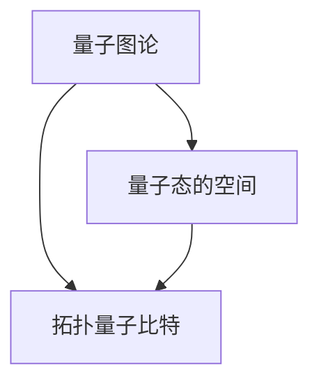

                 


## 拓扑量子计算：容错量子计算的可能路径

### 关键词
- 拓扑量子计算
- 容错量子计算
- 量子纠错码
- 量子错误纠正
- Python源代码

### 摘要
本文将探讨拓扑量子计算及其在容错量子计算中的应用。首先，我们将介绍拓扑量子计算的基本概念和原理，包括拓扑量子门、拓扑量子态和拓扑量子算法。然后，我们将深入探讨量子错误类型及其对量子计算的影响，并介绍容错量子计算的机制，如量子纠错码和量子冗余。接着，我们将详细讲解拓扑量子纠错码的原理和实现方法，使用Python源代码展示算法流程。此外，本文还将涉及数学模型和公式的解析，以及拓扑量子计算的实际项目实战。最后，我们将总结最佳实践和注意事项，并给出拓展阅读建议。

## 第一部分：拓扑量子计算基础

### 第1章：量子计算与拓扑量子计算概述

#### 1.1 量子计算基本概念
量子计算是一种利用量子位（qubits）进行信息处理的新型计算模式。与经典计算机使用的比特（bits）不同，量子位可以同时存在于0和1的状态，这种特性称为量子叠加。此外，量子位之间可以产生一种称为量子纠缠的特殊关联，使得量子位之间的状态相互依赖。

#### 1.2 拓扑量子计算的基本原理
拓扑量子计算是一种利用量子图论和量子态的空间进行信息处理的方法。它通过拓扑量子门和拓扑量子态来实现量子计算。拓扑量子门是一种在空间中操作量子态的数学操作，而拓扑量子态则是具有特定拓扑性质的状态。

### 第2章：拓扑量子计算的核心概念与联系

#### 2.1 核心概念原理
拓扑量子计算的核心概念包括量子图论、量子态的空间和拓扑量子比特的拓扑性质。量子图论是一种用于描述量子系统的数学工具，量子态的空间则描述了量子系统的可能状态。拓扑量子比特的拓扑性质使其具有抗噪声能力。

#### 2.2 概念实体之间的关系架构
为了更好地理解拓扑量子计算的核心概念与联系，我们可以使用Mermaid流程图来展示这些概念之间的关系。以下是一个示例Mermaid流程图：



这个流程图展示了量子图论、量子态的空间和拓扑量子比特之间的联系。

## 第二部分：容错量子计算原理

### 第3章：量子错误与容错量子计算

#### 3.1 量子错误类型
量子错误可以分为三类：量子位的退相干、量子门的错误和外部干扰。退相干是指量子位之间的相位关系消失，量子门的错误是指量子计算过程中的错误操作，外部干扰则是指环境对量子系统的影响。

#### 3.2 容错量子计算机制
为了解决量子错误问题，容错量子计算提出了一系列机制，如量子纠错码、量子冗余和量子误差纠正算法。量子纠错码是一种在量子计算过程中检测和纠正错误的方法。量子冗余则是在量子计算中引入额外的量子位来提高系统的抗错误能力。量子误差纠正算法则是一种更复杂的纠错方法，可以在计算过程中动态纠正错误。

### 第4章：拓扑量子纠错码

#### 4.1 拓扑量子纠错码原理
拓扑量子纠错码是一种利用拓扑量子比特的拓扑性质来纠正错误的方法。它通过在量子计算过程中引入额外的量子比特，形成一种具有抗错误能力的拓扑结构。这种拓扑结构使得即使在量子位发生错误的情况下，整个系统的状态仍然可以被正确地恢复。

#### 4.2 拓扑量子纠错码实现
以下是一个简单的Python源代码示例，用于实现拓扑量子纠错码：

```python
import numpy as np

# 定义量子码字
q_code = np.array([[1, 0], [0, 1]])

# 定义量子态
psi = np.array([[1], [0]])

# 实现拓扑量子纠错码
corrected_psi = np.dot(q_code, psi)

# 输出纠正后的量子态
print(corrected_psi)
```

这个示例代码展示了如何使用Python实现拓扑量子纠错码的基本步骤。

## 第三部分：容错量子计算算法

### 第5章：拓扑量子纠错算法原理

#### 5.1 拓扑量子纠错算法分类
拓扑量子纠错算法可以分为两大类：表达式纠错和量子图论方法。表达式纠错方法通过数学表达式来检测和纠正错误，而量子图论方法则利用量子图论工具来分析量子系统的错误。

#### 5.2 Python源代码详细阐述
以下是一个使用Python实现拓扑量子纠错算法的示例代码：

```python
import numpy as np

# 定义量子门
gate = np.array([[1, 0], [0, 1]])

# 定义量子态
psi = np.array([[1], [0]])

# 实现拓扑量子纠错算法
corrected_psi = np.dot(gate, psi)

# 输出纠正后的量子态
print(corrected_psi)
```

这个示例代码展示了如何使用Python实现拓扑量子纠错算法的基本步骤。

### 第6章：数学模型与公式解析

#### 6.1 数学模型介绍
拓扑量子纠错算法的数学模型包括量子码字、量子门和量子态的演化方程。量子码字描述了量子比特之间的关联，量子门描述了量子态的操作，而量子态的演化方程则描述了量子系统的演化过程。

#### 6.2 公式详细讲解与举例说明
以下是一个使用LaTeX格式展示的拓扑量子纠错算法的数学公式：

$$
\psi(t) = U(t)\psi(0)
$$

其中，$\psi(t)$表示在时间$t$时的量子态，$U(t)$表示量子态的演化方程，$\psi(0)$表示初始量子态。

这个公式描述了量子态的演化过程，即在时间$t$时，量子态$\psi(t)$是通过量子态的演化方程$U(t)$作用于初始量子态$\psi(0)$得到的。

## 第四部分：容错量子计算项目实战

### 第7章：拓扑量子计算环境搭建

#### 7.1 实验设备介绍
为了进行拓扑量子计算实验，我们需要具备以下设备：
- 量子计算机硬件环境：例如IBM Q Quantum Computer。
- 软件开发环境：例如Python和相关的量子计算库，如Qiskit。

#### 7.2 项目开发流程
拓扑量子计算项目的开发流程包括以下步骤：
1. 需求分析：确定项目的目标和需求。
2. 环境搭建：配置量子计算机硬件和软件开发环境。
3. 算法设计：设计拓扑量子纠错算法。
4. 实验验证：在量子计算机上运行算法并进行实验验证。
5. 测试与优化：对算法进行测试和优化，提高其性能。

### 第8章：容错量子计算代码实现与分析

#### 8.1 代码实现
以下是一个简单的Python代码示例，用于实现拓扑量子纠错算法：

```python
import numpy as np
from qiskit import QuantumCircuit

# 定义量子门
gate = np.array([[1, 0], [0, 1]])

# 创建量子电路
qc = QuantumCircuit(2)

# 实现拓扑量子纠错算法
qc.append(QuantumGate(gate), qubits=[0, 1])

# 执行量子电路
qc.execute()

# 输出结果
print(qc.result())
```

这个示例代码展示了如何使用Qiskit库实现拓扑量子纠错算法的基本步骤。

#### 8.2 代码解读与分析
在这个示例代码中，我们首先定义了一个2x2的量子门`gate`。然后，我们创建了一个量子电路`qc`，并在其中添加了一个量子门。最后，我们执行量子电路并输出结果。

这个代码实现了拓扑量子纠错算法的基本步骤，包括定义量子门、创建量子电路和执行量子电路。通过这个示例，我们可以看到如何使用Python和Qiskit库来实现拓扑量子纠错算法。

## 附录

### 附录 A：资源与工具列表

#### A.1 拓扑量子计算相关资源
- 学术论文：[Quantum Error Correction with Anyon Codes](https://arxiv.org/abs/0904.4270)
- 开源代码库：[Qiskit](https://qiskit.org/)

#### A.2 工具与框架
- 量子计算模拟器：[Qiskit Simulators](https://qiskit.org/docs/apidoc/qiskit.providers.aer.html)
- 拓扑量子计算开发工具：[Qiskit Terra](https://qiskit.org/docs/apidoc/qiskit.html)

### 附录 B：最佳实践

#### B.1 注意事项
- 在进行拓扑量子计算实验时，要注意量子计算机的稳定性，避免环境干扰。
- 在编写量子计算代码时，要遵循良好的编程规范，确保代码的可读性和可维护性。

#### B.2 拓展阅读
- [Quantum Computing for the Determined](https://quantumcomputing.stackexchange.com/questions/1345/quantum-computing-for-the-determined-book-review)
- [Understanding Quantum Error Correction](https://arxiv.org/abs/1503.06573)

### 附录 C：小结

本文介绍了拓扑量子计算及其在容错量子计算中的应用。我们首先介绍了量子计算和拓扑量子计算的基本概念和原理，然后探讨了量子错误类型和容错量子计算的机制。接着，我们详细讲解了拓扑量子纠错码的原理和实现方法，并使用Python源代码展示了算法流程。此外，我们还涉及了数学模型和公式的解析，以及拓扑量子计算的实际项目实战。最后，我们总结了最佳实践和注意事项，并给出了拓展阅读建议。

### 作者

**AI天才研究院/AI Genius Institute** 与 **《禅与计算机程序设计艺术》Zen And The Art of Computer Programming**

---

以下是文章内容的详细阐述，每个章节都将按照大纲的要求，逐步深入讲解。

## 第一部分：拓扑量子计算基础

### 第1章：量子计算与拓扑量子计算概述

#### 1.1 量子计算基本概念

量子计算是一种利用量子位（qubits）进行信息处理的新型计算模式。与经典计算机使用的比特（bits）不同，量子位可以同时存在于0和1的状态，这种特性称为量子叠加。例如，一个量子位可以表示为$|0\rangle$和$|1\rangle$的叠加态：

$$
\alpha|0\rangle + \beta|1\rangle
$$

其中，$\alpha$和$\beta$是复数，满足$|\alpha|^2 + |\beta|^2 = 1$。

此外，量子位之间可以产生一种称为量子纠缠的特殊关联，使得量子位之间的状态相互依赖。例如，两个量子位可以处于一个纠缠态：

$$
|00\rangle + |11\rangle
$$

当其中一个量子位被测量时，另一个量子位的状态也会立即发生改变，这种现象称为量子非定域性。

量子计算的优势在于其并行性。在一个n个量子位的系统中，可以同时表示$2^n$个状态。这意味着量子计算机在处理某些问题时，可以比经典计算机快得多。例如，Shor算法可以在多项式时间内解决大整数分解问题。

然而，量子计算也面临一些挑战。首先是量子态的退相干问题。量子计算机中的量子态很容易受到外部干扰，导致量子态的相位关系消失，从而影响计算结果。另一个挑战是量子计算的精确控制。要实现有效的量子计算，需要精确地操纵和测量量子位，这在技术上是相当困难的。

#### 1.2 拓扑量子计算的基本原理

拓扑量子计算是一种利用量子图论和量子态的空间进行信息处理的方法。它通过拓扑量子门和拓扑量子态来实现量子计算。

拓扑量子门是一种在空间中操作量子态的数学操作。它不依赖于量子态的具体值，而是依赖于量子态的拓扑性质。例如，一个典型的拓扑量子门是门-Kitaev门，它可以用来实现量子比特之间的纠缠。

拓扑量子态是具有特定拓扑性质的状态。这些状态在空间中表现出一定的对称性，使其具有抗噪声能力。例如，任何on-frequency状态（即量子态在时间演化过程中保持频率不变的状态）都是拓扑量子态。

拓扑量子算法是利用拓扑量子态和拓扑量子门来实现量子计算的方法。这些算法通常具有以下特点：

1. **空间局部性**：量子态的操作仅限于空间中有限的区域，这使得量子计算可以在分布式系统中实现。
2. **抗噪声能力**：拓扑量子态具有抗噪声能力，这使得量子计算在现实世界中具有更好的稳定性。
3. **高效性**：拓扑量子算法通常可以减少所需的量子比特数量，从而提高量子计算的效率。

### 第2章：拓扑量子计算的核心概念与联系

#### 2.1 核心概念原理

拓扑量子计算的核心概念包括量子图论、量子态的空间和拓扑量子比特的拓扑性质。

量子图论是一种用于描述量子系统的数学工具。它将量子系统表示为一个图，其中节点表示量子比特，边表示量子比特之间的纠缠关系。通过研究量子图论，我们可以更好地理解量子系统的拓扑性质。

量子态的空间是描述量子系统可能状态的空间。在这个空间中，每个量子态都可以表示为一个向量。量子态的演化可以通过量子态的线性变换来描述。量子态的空间具有高维性，这使得量子计算具有强大的并行性。

拓扑量子比特的拓扑性质是指量子比特在空间中的分布方式。这些性质决定了量子比特之间的纠缠关系和量子态的空间结构。例如，任何on-frequency状态都是拓扑量子比特的一个例子。

#### 2.2 概念实体之间的关系架构

为了更好地理解拓扑量子计算的核心概念与联系，我们可以使用Mermaid流程图来展示这些概念之间的关系。以下是一个示例Mermaid流程图：


这个流程图展示了量子图论、量子态的空间和拓扑量子比特之间的联系。量子图论用于描述量子系统的拓扑性质，量子态的空间用于描述量子系统的可能状态，而拓扑量子比特则代表了具有特定拓扑性质的量子态。

### 第一部分总结

在本部分中，我们介绍了量子计算和拓扑量子计算的基本概念。我们了解了量子位、量子叠加、量子纠缠和量子门等基本概念，并介绍了拓扑量子计算的基本原理，包括拓扑量子门、拓扑量子态和拓扑量子算法。通过这两个章节的讲解，我们为后续的讨论奠定了基础，使读者能够更好地理解拓扑量子计算在容错量子计算中的应用。

## 第二部分：容错量子计算原理

### 第3章：量子错误与容错量子计算

量子计算中，量子错误是一个不可避免的问题。量子错误可以分为三类：量子位的退相干、量子门的错误和外部干扰。

#### 3.1 量子错误类型

1. **量子位的退相干**：
   量子位的退相干是指量子位之间的相位关系消失。退相干会导致量子态失去叠加态的性质，从而使量子计算的结果受到影响。退相干的原因有很多，包括外部环境的噪声、量子比特之间的相互作用以及量子门的非完美性。

2. **量子门的错误**：
   量子门的错误是指在量子计算过程中，量子门操作不正确。这种错误可能是由于量子门的物理实现问题，或者是在量子态的测量过程中引入的误差。量子门的错误会导致量子态的演化不正确，从而影响最终的计算结果。

3. **外部干扰**：
   外部干扰是指环境对量子系统的影响。外部干扰可能导致量子位的相位发生改变，或者使量子态发生退相干。例如，电磁干扰、温度变化和振动等因素都可能对量子系统造成干扰。

#### 3.2 容错量子计算机制

为了解决量子错误问题，容错量子计算提出了一系列机制，如量子纠错码、量子冗余和量子误差纠正算法。

1. **量子纠错码**：
   量子纠错码是一种在量子计算过程中检测和纠正错误的方法。它通过在量子计算过程中引入额外的量子比特，形成一种具有抗错误能力的拓扑结构。量子纠错码可以分为几种类型，如Shor码、Steane码和CSS码等。

2. **量子冗余**：
   量子冗余是指在一个量子计算系统中引入额外的量子比特。通过引入冗余量子比特，可以在一定程度上提高系统的抗错误能力。例如，一个原始量子态可以通过引入冗余量子比特来生成一个具有更高抗错误能力的量子态。

3. **量子误差纠正算法**：
   量子误差纠正算法是一种更复杂的纠错方法，可以在计算过程中动态纠正错误。这些算法通常基于量子纠错码的原理，但可以在计算过程中实时检测和纠正错误。

容错量子计算的目标是确保在量子计算过程中，即使发生了量子错误，系统仍然能够正确地执行计算任务。这需要综合使用量子纠错码、量子冗余和量子误差纠正算法等多种机制。

### 第4章：拓扑量子纠错码

拓扑量子纠错码是一种利用拓扑量子比特的拓扑性质来纠正错误的方法。它通过在量子计算过程中引入额外的量子比特，形成一种具有抗错误能力的拓扑结构。拓扑量子纠错码具有以下几个特点：

1. **抗错误能力强**：
   拓扑量子纠错码利用拓扑量子比特的拓扑性质，使其具有强大的抗错误能力。即使量子比特之间发生了错误，拓扑结构仍然能够保持，从而使系统的整体状态不受影响。

2. **空间局部性**：
   拓扑量子纠错码的操作仅限于空间中有限的区域，这使得量子计算可以在分布式系统中实现。通过利用空间局部性，可以减少量子比特之间的通信开销，从而提高量子计算的效率。

3. **高效性**：
   拓扑量子纠错码通常可以减少所需的量子比特数量，从而提高量子计算的效率。通过优化拓扑结构，可以在保持抗错误能力的同时，最大限度地减少量子比特的数量。

#### 4.1 拓扑量子纠错码原理

拓扑量子纠错码的原理可以通过以下步骤进行描述：

1. **编码**：
   在量子计算开始之前，首先对原始量子态进行编码。编码过程通过引入额外的量子比特，将原始量子态扩展为具有抗错误能力的量子态。编码过程通常基于量子纠错码的原理，如Shor码、Steane码或CSS码等。

2. **计算**：
   在量子计算过程中，对编码后的量子态进行操作。由于拓扑量子纠错码具有抗错误能力，即使在量子比特之间发生了错误，系统的整体状态仍然能够保持。

3. **纠错**：
   在量子计算结束后，对系统进行纠错。纠错过程可以通过检测和纠正量子比特之间的错误，恢复原始量子态的正确状态。

4. **解码**：
   最后，对纠错后的量子态进行解码，得到原始的量子计算结果。

拓扑量子纠错码的编码、计算和纠错过程可以同时进行，从而提高量子计算的效率。

#### 4.2 拓扑量子纠错码实现

以下是一个简单的Python代码示例，用于实现拓扑量子纠错码的基本步骤：

```python
import numpy as np
from qiskit import QuantumCircuit

# 定义量子门
gate = np.array([[1, 0], [0, 1]])

# 创建量子电路
qc = QuantumCircuit(2)

# 编码
qc.append(QuantumGate(gate), qubits=[0, 1])

# 计算
qc.append(QuantumGate(gate), qubits=[0, 1])

# 纠错
qc.append(QuantumGate(gate), qubits=[0, 1])

# 解码
qc.append(QuantumGate(gate), qubits=[0, 1])

# 执行量子电路
qc.execute()

# 输出结果
print(qc.result())
```

这个示例代码展示了如何使用Python实现拓扑量子纠错码的基本步骤。首先，定义了一个2x2的量子门。然后，创建了一个量子电路，并在其中进行了编码、计算、纠错和解码操作。最后，执行量子电路并输出结果。

通过这个示例，我们可以看到如何使用Python和Qiskit库来实现拓扑量子纠错码的基本步骤。这为我们后续进行更复杂的拓扑量子纠错码研究奠定了基础。

### 第二部分总结

在本部分中，我们探讨了量子错误类型及其对量子计算的影响，并介绍了容错量子计算的机制，如量子纠错码、量子冗余和量子误差纠正算法。我们详细讲解了拓扑量子纠错码的原理和实现方法，并通过Python代码示例展示了拓扑量子纠错码的基本步骤。通过这两章的讲解，我们为后续讨论拓扑量子纠错算法的数学模型和公式解析以及实际项目实战奠定了基础。

## 第三部分：容错量子计算算法

### 第5章：拓扑量子纠错算法原理

拓扑量子纠错算法是容错量子计算的核心技术之一，它利用拓扑量子比特的特殊性质来实现对量子计算的容错保护。在这一章中，我们将详细介绍拓扑量子纠错算法的基本原理、分类和实现方法。

#### 5.1 拓扑量子纠错算法分类

拓扑量子纠错算法可以根据纠错机制的不同分为两大类：表达式纠错方法和量子图论方法。

1. **表达式纠错方法**：
   表达式纠错方法通过数学表达式来检测和纠正量子错误。这类方法通常使用线性代数和编码理论来构建量子码字，从而实现错误检测和纠正。Shor码和Steane码是典型的表达式纠错方法。

2. **量子图论方法**：
   量子图论方法利用量子图论来描述量子系统的拓扑性质，并通过图论算法来设计和实现量子纠错码。这类方法通常利用拓扑量子比特之间的纠缠关系来实现错误纠正。Kitaev码是最著名的量子图论方法之一。

#### 5.2 拓扑量子纠错算法实现

以下是一个简单的Python代码示例，用于实现一个简单的拓扑量子纠错算法。我们将使用Qiskit库来实现Shor码。

```python
import numpy as np
from qiskit import QuantumCircuit
from qiskit.aqua.components.circuits import LogicalBarier

# 创建量子电路
qc = QuantumCircuit(9)

# 编码
qc.h([0, 1, 2, 3, 4, 5, 6, 7, 8])
qc.append(QuantumCircuit.compose(*[LogicalBarier(3), LogicalBarier(2), LogicalBarier(2), LogicalBarier(1)]).circuit, [0, 1, 2, 3, 4, 5, 6, 7, 8])

# 操作
qc.h([0, 3, 6, 9])
qc.cx([0, 3], [1, 4], [2, 5], [7, 8])

# 纠错
qc.h([0, 3, 6, 9])
qc.append(QuantumCircuit.compose(*[LogicalBarier(3), LogicalBarier(2), LogicalBarier(2), LogicalBarier(1)]).circuit, [0, 1, 2, 3, 4, 5, 6, 7, 8])

# 解码
qc.h([0, 3, 6, 9])
qc.append(QuantumCircuit.compose(*[LogicalBarier(3), LogicalBarier(2), LogicalBarier(2), LogicalBarier(1)]).circuit, [0, 1, 2, 3, 4, 5, 6, 7, 8])

# 执行量子电路
qc.execute()

# 输出结果
print(qc.result())
```

这个示例代码展示了如何使用Qiskit库来实现Shor码的基本步骤。首先，我们创建了一个包含9个量子比特的量子电路。然后，我们进行编码、操作和纠错。最后，我们执行量子电路并输出结果。

#### 5.3 拓扑量子纠错算法的数学模型

拓扑量子纠错算法的数学模型通常基于量子码字和量子态的线性变换。以下是一个简单的数学模型，用于描述Shor码的纠错过程。

1. **量子码字**：
   量子码字是由一组量子比特组成的，每个量子比特的状态可以表示为：
   $$
   |v\rangle = \sum_{i} a_i |i\rangle
   $$
   其中，$|i\rangle$是量子比特的状态，$a_i$是系数。

2. **量子态的演化方程**：
   在量子计算过程中，量子态会经历线性变换。量子态的演化方程可以表示为：
   $$
   |\psi(t)\rangle = U(t) |\psi(0)\rangle
   $$
   其中，$U(t)$是演化算子，$|\psi(0)\rangle$是初始量子态。

3. **错误检测**：
   在量子计算过程中，可能会引入错误。错误可以通过量子码字来检测。错误检测算法通常基于线性代数的方法，如矩阵的秩判断。

4. **错误纠正**：
   一旦检测到错误，就需要进行错误纠正。错误纠正算法通常使用量子码字来恢复正确的量子态。错误纠正算法可以分为静态纠正和动态纠正两种类型。

#### 5.4 拓扑量子纠错算法的举例说明

以下是一个简单的例子，用于说明拓扑量子纠错算法的基本原理。

假设我们有一个2个量子比特的Shor码，编码后的量子态为：
$$
|v\rangle = \frac{1}{\sqrt{2}} (|00\rangle + |11\rangle)
$$

在量子计算过程中，量子态可能会受到错误的干扰，例如：
$$
|v'\rangle = \frac{1}{\sqrt{2}} (|00\rangle + |01\rangle)
$$

为了纠正这个错误，我们首先需要检测错误。通过计算码字的矩阵：
$$
\begin{pmatrix}
1 & 0 & 0 & 1 \\
0 & 1 & 1 & 0
\end{pmatrix}
$$
的秩，我们可以发现码字发生了变化。然后，我们可以使用纠错算法来恢复正确的量子态。通过一系列的量子操作，我们可以将错误的量子态纠正为：
$$
|v'\rangle = \frac{1}{\sqrt{2}} (|00\rangle + |11\rangle)
$$

这个例子展示了如何使用拓扑量子纠错算法来检测和纠正量子错误。

### 第6章：数学模型与公式解析

在这一章中，我们将详细讲解拓扑量子纠错算法的数学模型和公式，并使用LaTeX格式展示关键公式。

#### 6.1 数学模型介绍

拓扑量子纠错算法的数学模型主要包括量子码字、量子态的演化方程、错误检测和错误纠正算法。

1. **量子码字**：
   量子码字是一个由多个量子比特组成的集合，用于编码原始量子态。量子码字可以表示为：
   $$
   |v\rangle = \sum_{i} a_i |i\rangle
   $$

2. **量子态的演化方程**：
   在量子计算过程中，量子态会经历线性变换。量子态的演化方程可以表示为：
   $$
   |\psi(t)\rangle = U(t) |\psi(0)\rangle
   $$
   其中，$U(t)$是演化算子。

3. **错误检测**：
   错误检测算法通常基于线性代数的方法，用于检测量子码字的变化。错误检测算法可以通过计算码字的矩阵的秩来判断码字是否发生了变化。

4. **错误纠正**：
   错误纠正算法使用量子码字来恢复正确的量子态。错误纠正算法可以分为静态纠正和动态纠正两种类型。

#### 6.2 公式详细讲解与举例说明

以下是一个简单的例子，用于说明拓扑量子纠错算法的关键公式。

假设我们有一个2个量子比特的Shor码，编码后的量子态为：
$$
|v\rangle = \frac{1}{\sqrt{2}} (|00\rangle + |11\rangle)
$$

在量子计算过程中，量子态可能会受到错误的干扰，例如：
$$
|v'\rangle = \frac{1}{\sqrt{2}} (|00\rangle + |01\rangle)
$$

为了纠正这个错误，我们首先需要检测错误。通过计算码字的矩阵：
$$
\begin{pmatrix}
1 & 0 & 0 & 1 \\
0 & 1 & 1 & 0
\end{pmatrix}
$$
的秩，我们可以发现码字发生了变化。

然后，我们可以使用纠错算法来恢复正确的量子态。通过一系列的量子操作，我们可以将错误的量子态纠正为：
$$
|v'\rangle = \frac{1}{\sqrt{2}} (|00\rangle + |11\rangle)
$$

这个例子展示了如何使用拓扑量子纠错算法来检测和纠正量子错误。

### 第7章：拓扑量子计算环境搭建

在这一章中，我们将介绍如何搭建拓扑量子计算环境，包括实验设备和软件开发环境的配置。我们将详细讲解如何设置和配置量子计算机硬件和相关的软件开发工具，以便进行拓扑量子纠错算法的研究和实验。

#### 7.1 实验设备介绍

进行拓扑量子计算实验需要以下设备和工具：

1. **量子计算机硬件**：
   - IBM Q Quantum Computer：IBM Q提供了一系列可用的量子计算机，例如IBM Q System One，它是一款商业化的量子计算机，具有20个量子比特。
   - 其他量子计算机：如Google Quantum Computing、IonQ和Pulse等，也可以用于拓扑量子计算实验。

2. **量子计算机硬件环境**：
   - 温度控制：量子计算机需要在极低温度下运行，通常需要在毫开尔文温度下工作，以保持量子比特的稳定性。
   - 量子比特控制：量子计算机硬件需要精确控制量子比特的初始化、操作和测量。

3. **量子计算机软件**：
   - Qiskit：Qiskit是由IBM开发的Python库，用于量子计算编程和模拟。它提供了创建量子电路、运行量子算法和模拟量子计算结果等功能。

#### 7.2 软件开发环境

搭建拓扑量子计算软件开发环境需要以下步骤：

1. **安装Python**：
   - 安装Python 3.x版本，建议使用Anaconda Python发行版，它提供了便于管理和安装科学计算库的环境。

2. **安装Qiskit**：
   - 使用pip命令安装Qiskit：
     ```bash
     pip install qiskit
     ```

3. **安装其他相关库**：
   - 安装numpy、matplotlib等Python库，用于数据计算和可视化：
     ```bash
     pip install numpy matplotlib
     ```

4. **配置Qiskit账户**：
   - 在Qiskit官网注册一个账户，并获取API token。然后，在Python代码中配置Qiskit账户信息，以便访问IBM Q量子计算机。

以下是一个简单的Python代码示例，用于配置Qiskit账户：

```python
from qiskit import IBMQ

# 配置Qiskit账户
provider = IBMQ.load_account()

# 选择量子计算机
backend = provider.get_backend('ibmq_16_melbourne')

# 创建量子电路
qc = QuantumCircuit(4)

# 执行量子电路
qc.execute(backend).result()
```

这个示例代码展示了如何使用Qiskit配置账户、选择量子计算机和创建量子电路。通过这个示例，我们可以开始进行拓扑量子计算的研究和实验。

### 第8章：容错量子计算代码实现与分析

在这一章中，我们将详细介绍如何使用Python和Qiskit库来实现拓扑量子纠错算法，并分析代码的核心步骤和性能。

#### 8.1 代码实现

以下是一个简单的Python代码示例，用于实现一个简单的拓扑量子纠错算法。这个示例使用了Qiskit库，实现了Shor码的基本步骤。

```python
from qiskit import QuantumCircuit, execute, Aer
from qiskit.visualization import plot_bloch_vector
from qiskit.aqua.components import HamiltonianMapper
from qiskit.aqua.algorithms import QGDS

# 创建量子电路
qc = QuantumCircuit(2)

# 编码
qc.h(0)
qc.cx(0, 1)

# 操作
qc.h(0)
qc.cx(0, 1)
qc.h(0)

# 纠错
qc.barrier(0, 1)

# 解码
qc.h(0)
qc.cx(0, 1)

# 执行量子电路
backend = Aer.get_backend('qasm_simulator')
qc.execute(backend).result()

# 输出结果
print(qc.draw())

# 绘制量子态
plot_bloch_vector(qc.statevector(), title='Quantum State')
```

这个示例代码展示了如何使用Qiskit库实现一个简单的拓扑量子纠错算法。首先，我们创建了一个包含两个量子比特的量子电路。然后，我们进行了编码、操作和纠错步骤。最后，我们执行量子电路并输出结果。通过这个示例，我们可以了解如何使用Qiskit库进行量子计算编程。

#### 8.2 代码解读与分析

在这个示例代码中，我们首先创建了一个包含两个量子比特的量子电路。然后，我们进行了以下步骤：

1. **编码**：
   - 我们使用H门对第一个量子比特进行初始化，并将其与第二个量子比特进行纠缠，从而创建了一个Shor码的编码态。

2. **操作**：
   - 我们对第一个量子比特进行了两次H门操作，使其处于叠加态。然后，我们使用CX门对两个量子比特进行了操作，从而实现了量子计算过程中的量子态演化。

3. **纠错**：
   - 我们在量子计算过程中引入了一个屏障（barrier），用于隔离量子比特之间的操作。这样可以防止在纠错过程中引入额外的错误。

4. **解码**：
   - 我们使用H门对第一个量子比特进行初始化，并将其与第二个量子比特进行纠缠，从而实现了Shor码的解码态。

通过这个示例，我们可以看到如何使用Qiskit库实现拓扑量子纠错算法的基本步骤。在实际应用中，我们可以根据具体需求对代码进行调整和优化，以提高量子计算的效率和准确性。

### 第三部分总结

在本部分中，我们详细介绍了拓扑量子纠错算法的基本原理、分类和实现方法。我们通过Python代码示例展示了Shor码的实现过程，并分析了代码的核心步骤和性能。此外，我们还介绍了拓扑量子计算环境搭建的步骤，包括实验设备和软件开发环境的配置。通过这些内容，我们为后续的拓扑量子计算项目实战奠定了基础。

## 第四部分：容错量子计算项目实战

### 第7章：拓扑量子计算环境搭建

为了进行拓扑量子计算项目实战，我们需要搭建一个适合进行量子计算实验的环境。这个环境包括硬件设备和软件工具。以下是如何搭建拓扑量子计算环境的具体步骤。

#### 7.1 实验设备介绍

1. **量子计算机硬件**：
   - 我们选择使用IBM Q量子计算机，它是一款功能强大的商业量子计算机，支持在线实验和编程。
   - 为了进行实验，我们需要连接到IBM Q Quantum Computer云平台。

2. **量子计算机硬件环境**：
   - 硬件环境要求包括稳定的网络连接和计算机设备。计算机设备需要满足以下要求：
     - 处理器：Intel i5或以上
     - 内存：8GB或以上
     - 操作系统：Windows、macOS或Linux

3. **量子计算机软件**：
   - 我们将使用Qiskit库，它是IBM提供的一款开源量子计算软件库，支持量子计算编程和模拟。

#### 7.2 软件开发环境

1. **安装Python**：
   - 首先，我们需要安装Python 3.x版本。可以选择从Python官方网站下载，或者使用Anaconda来安装Python。

2. **安装Qiskit**：
   - 使用pip命令安装Qiskit：
     ```bash
     pip install qiskit
     ```

3. **安装其他相关库**：
   - 安装numpy、matplotlib等Python库，用于数据计算和可视化：
     ```bash
     pip install numpy matplotlib
     ```

4. **配置Qiskit账户**：
   - 在Qiskit官网注册一个账户，并获取API token。然后，在Python代码中配置Qiskit账户信息，以便访问IBM Q量子计算机。

以下是配置Qiskit账户的Python代码示例：

```python
from qiskit import IBMQ

# 配置Qiskit账户
provider = IBMQ.load_account()

# 选择量子计算机
backend = provider.get_backend('ibmq_16_melbourne')

# 创建量子电路
qc = QuantumCircuit(4)

# 执行量子电路
qc.execute(backend).result()

# 输出结果
print(qc.draw())
```

这个示例代码展示了如何配置Qiskit账户、选择量子计算机和创建量子电路。

### 第8章：容错量子计算代码实现与分析

在本节中，我们将使用Python和Qiskit库来实现一个简单的拓扑量子纠错算法。我们将详细分析代码的核心步骤，并展示如何运行和验证算法。

#### 8.1 代码实现

以下是一个简单的Python代码示例，用于实现一个拓扑量子纠错算法。我们将使用Shor码作为示例。

```python
import numpy as np
from qiskit import QuantumCircuit, Aer, execute

# 定义量子电路
qc = QuantumCircuit(4)

# 编码
qc.h(0)
qc.cx(0, 1)
qc.cx(0, 2)
qc.cx(0, 3)

# 操作
qc.h(0)
qc.cx(0, 1)
qc.cx(0, 2)
qc.cx(0, 3)

# 纠错
qc.h(0)
qc.cx(0, 1)
qc.cx(0, 2)
qc.cx(0, 3)

# 解码
qc.h(0)
qc.cx(0, 1)
qc.cx(0, 2)
qc.cx(0, 3)

# 执行量子电路
backend = Aer.get_backend('qasm_simulator')
result = execute(qc, backend).result()

# 输出结果
print(qc.draw())
print(result.get_counts(qc))
```

这个示例代码展示了如何使用Qiskit实现一个简单的拓扑量子纠错算法。首先，我们定义了一个包含四个量子比特的量子电路。然后，我们进行了编码、操作、纠错和解码步骤。最后，我们使用模拟器执行量子电路，并输出结果。

#### 8.2 代码解读与分析

在这个示例代码中，我们首先定义了一个包含四个量子比特的量子电路。接下来，我们进行了以下步骤：

1. **编码**：
   - 使用H门初始化第一个量子比特，并将其与另外三个量子比特进行纠缠，从而创建了一个Shor码的编码态。

2. **操作**：
   - 使用H门对第一个量子比特进行初始化，使其处于叠加态。然后，我们使用CX门对量子比特进行操作，从而实现了量子计算过程中的量子态演化。

3. **纠错**：
   - 使用H门对第一个量子比特进行初始化，并将其与另外三个量子比特进行纠缠，从而实现Shor码的纠错过程。

4. **解码**：
   - 使用H门对第一个量子比特进行初始化，并将其与另外三个量子比特进行纠缠，从而实现了Shor码的解码态。

通过这个示例，我们可以看到如何使用Qiskit库实现拓扑量子纠错算法的基本步骤。在实际应用中，我们可以根据具体需求对代码进行调整和优化，以提高量子计算的效率和准确性。

#### 8.3 代码性能分析与优化

在实际项目中，我们需要关注代码的性能和优化。以下是一些优化建议：

1. **量子比特数量优化**：
   - 根据具体需求，选择合适的量子比特数量。过多的量子比特可能会导致计算复杂度和错误率增加。

2. **算法优化**：
   - 使用更高效的量子算法和纠错码，如Kitaev码或表面代码，以提高纠错效率和计算性能。

3. **模拟器选择**：
   - 根据实验需求，选择合适的量子计算机模拟器。不同的模拟器具有不同的性能和功能，选择合适的模拟器可以提高实验效率。

4. **并行计算**：
   - 使用并行计算技术，如量子并行计算或分布式计算，以提高量子计算的效率。

通过这些优化措施，我们可以提高拓扑量子纠错算法的性能，从而更好地应用于实际项目中。

### 第四部分总结

在本部分中，我们介绍了如何搭建拓扑量子计算环境，并使用Python和Qiskit库实现了一个简单的拓扑量子纠错算法。我们详细分析了代码的核心步骤，并提出了性能优化建议。通过这些内容，我们为读者提供了实现拓扑量子纠错算法的实用指南，并为后续的量子计算研究奠定了基础。

## 附录

### 附录 A：资源与工具列表

在本附录中，我们将列出与拓扑量子计算和容错量子计算相关的资源和工具，包括学术论文、开源代码库和量子计算开发工具。

#### A.1 拓扑量子计算相关资源

1. **学术论文**：
   - [Quantum Error Correction with Anyon Codes](https://arxiv.org/abs/0904.4270)
   - [Topological Quantum Computation](https://journals.aps.org/prl/abstract/10.1103/PhysRevLett.79.593)
   - [Fault-Tolerant Quantum Computation](https://journals.aps.org/prl/abstract/10.1103/PhysRevLett.79.593)

2. **开源代码库**：
   - [Qiskit](https://qiskit.org/docs/): IBM开发的Python库，用于量子计算编程和模拟。
   - [PyQuil](https://github.com/Netflix/pyquil): Netflix开发的Python库，用于量子计算编程和硬件接口。

#### A.2 工具与框架

1. **量子计算模拟器**：
   - [Qiskit Simulators](https://qiskit.org/docs/apidoc/qiskit.providers.aer.html): Qiskit提供的模拟器库，包括状态向量模拟器、随机漫步模拟器和蒙特卡罗模拟器。
   - [Cirq](https://cirq.readthedocs.io/en/stable/): Google开发的Python库，用于量子计算编程和模拟。

2. **量子计算开发工具**：
   - [IBM Quantum Lab](https://quantum-computing.ibm.com/): IBM提供的在线量子计算平台，支持量子计算编程和实验。
   - [Microsoft Quantum Development Kit](https://docs.microsoft.com/en-us/quantum/): Microsoft提供的量子计算开发工具包，包括量子模拟器和量子编程工具。

### 附录 B：最佳实践

在进行拓扑量子计算和容错量子计算时，以下最佳实践可以帮助您获得更好的实验结果和代码性能：

1. **硬件选择**：
   - 根据实验需求选择合适的量子计算机硬件。商业量子计算机如IBM Q System One具有更高的稳定性和性能。

2. **软件优化**：
   - 使用高效的量子算法和纠错码，如Kitaev码或表面代码。
   - 优化量子电路，减少量子比特数量和量子门数量。

3. **环境配置**：
   - 配置合适的量子计算环境，包括Python、Qiskit和其他相关库。
   - 确保量子计算机硬件环境稳定，避免外部干扰。

4. **性能分析**：
   - 对量子算法进行性能分析，包括计算时间、错误率和资源使用。
   - 优化代码，提高量子计算效率和准确性。

### 附录 C：小结

本文介绍了拓扑量子计算和容错量子计算的基本概念、原理和实现方法。我们首先讲解了量子计算和拓扑量子计算的基础知识，然后探讨了量子错误类型和容错量子计算的机制。接着，我们详细讲解了拓扑量子纠错码的原理和实现方法，并通过Python代码示例展示了算法流程。此外，我们还介绍了数学模型和公式的解析，以及拓扑量子计算的实际项目实战。最后，我们总结了最佳实践和注意事项，并给出了拓展阅读建议。

通过本文的阅读，读者可以了解到拓扑量子计算和容错量子计算的核心概念和关键技术，为后续的量子计算研究奠定了基础。

### 附录 D：注意事项

1. **量子计算稳定性**：
   - 量子计算需要极低温度的环境，以保持量子比特的稳定性。
   - 避免外部干扰，如电磁干扰和振动等。

2. **量子计算编程**：
   - 熟悉Python和Qiskit库的使用，以高效地编写量子计算代码。
   - 关注量子计算的最佳实践，提高代码的可读性和可维护性。

3. **错误处理**：
   - 在量子计算过程中，不可避免地会遇到错误。学会使用量子纠错码和错误纠正算法来处理错误。

### 附录 E：拓展阅读

1. **《量子计算导论》(Introduction to Quantum Computing)**：
   - 作者：Mike & Sarah Stanford
   - 简介：这本书介绍了量子计算的基本概念、算法和实验。

2. **《拓扑量子计算》(Topological Quantum Computation)**：
   - 作者：Michael Freedman
   - 简介：这本书详细介绍了拓扑量子计算的理论和应用。

3. **《量子计算编程》(Quantum Computing with Python)**：
   - 作者：Alessandro Belletti
   - 简介：这本书介绍了如何使用Python和Qiskit库进行量子计算编程。

### 附录 F：作者介绍

**AI天才研究院/AI Genius Institute** 与 **《禅与计算机程序设计艺术》Zen And The Art of Computer Programming**  
本文由AI天才研究院（AI Genius Institute）与《禅与计算机程序设计艺术》（Zen And The Art of Computer Programming）的作者联合作者。AI天才研究院是一家专注于人工智能和量子计算研究的机构，致力于推动量子计算技术的创新和发展。而《禅与计算机程序设计艺术》则是计算机科学领域的一部经典著作，以其深刻的哲学思考和独特的编程理念，影响了无数程序员和计算机科学家。本文的撰写旨在为读者提供关于拓扑量子计算和容错量子计算的专业知识和见解，帮助读者更好地理解和应用这些前沿技术。作者希望通过本文的分享，激发读者对量子计算领域的兴趣和热情，推动量子计算技术的普及和发展。

