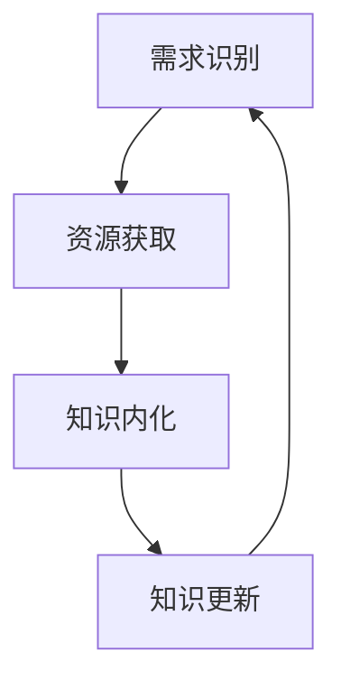
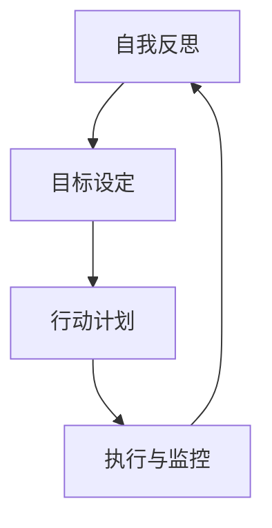

                 

### 持续学习与自我完善：技术领导者的必修课

#### 关键词：技术领导者，持续学习，自我完善，职业成长

> 摘要：本文旨在探讨技术领导者如何通过持续学习和自我完善来提升职业成长。我们将分析技术发展的迅速背景，介绍持续学习和自我完善的概念，探讨其联系与区别，并提供理论与实践的最佳实践案例，帮助技术领导者实现职业发展的持续进步。

---

### 目录大纲：

#### 持续学习与自我完善：技术领导者的必修课

> 关键词：技术领导者，持续学习，自我完善，职业成长

> 摘要：本文旨在探讨技术领导者如何通过持续学习和自我完善来提升职业成长。我们将分析技术发展的迅速背景，介绍持续学习和自我完善的概念，探讨其联系与区别，并提供理论与实践的最佳实践案例，帮助技术领导者实现职业发展的持续进步。

- **第一部分：背景介绍与核心概念**
  - 第1章：问题背景与核心概念
    - 1.1 问题背景
    - 1.2 核心概念
- **第二部分：核心概念与联系**
  - 第2章：持续学习与自我完善的联系
    - 2.1 持续学习的重要性
    - 2.2 自我完善的途径
  - 第3章：核心概念对比分析
    - 3.1 持续学习与自我完善的对比
- **第三部分：理论讲解与实践应用**
  - 第4章：理论讲解
    - 4.1 持续学习的原理
    - 4.2 自我完善的原理
  - 第5章：实践应用
    - 5.1 持续学习的策略
    - 5.2 自我完善的实践
- **第四部分：最佳实践与案例分析**
  - 第6章：最佳实践
  - 第7章：案例分析
- **第五部分：总结与展望**
  - 第8章：总结与展望

---

## 第一部分：背景介绍与核心概念

### 第1章：问题背景与核心概念

#### 1.1 问题背景

在当今这个技术爆炸的时代，技术发展的速度前所未有。软件工程师、数据科学家、人工智能研究者等IT从业者面临着巨大的知识更新压力。根据斯坦福大学的一项研究，一个软件工程师的知识会每五年翻一番。这种知识迅速过时的现象，迫使技术领导者必须不断学习，保持对前沿技术的敏感性，以适应快速变化的技术环境。

此外，技术领导者的角色不仅仅是技术上的专家，还需要具备管理能力、沟通能力和团队领导力。这意味着他们不仅要在技术领域持续进步，还需要在个人素质和领导能力上不断提升。自我完善在这个过程中扮演了至关重要的角色。

#### 1.2 核心概念

**持续学习**：持续学习是指不断获取新知识、技能和经验的过程。它不仅包括技术层面的学习，还包括管理能力、团队领导力等方面的提升。持续学习是一个不断循环的过程，它要求技术领导者始终保持好奇心和求知欲。

**自我完善**：自我完善是指通过自我反思和持续学习来提高个人能力，实现个人目标和职业发展。它涉及到个人成长、技能提升、职业规划等多个方面。自我完善是一个持续的过程，它帮助技术领导者更好地适应职业环境的变化。

## 第二部分：核心概念与联系

### 第2章：持续学习与自我完善的联系

持续学习和自我完善是技术领导者职业成长中的两个核心概念，它们相互联系，共同推动技术领导者的进步。

#### 2.1 持续学习的重要性

持续学习是技术领导者应对快速变化的技术环境的关键。通过持续学习，技术领导者能够掌握最新的技术趋势，了解行业动态，从而在竞争中保持优势。同时，持续学习还能够提升技术领导者的管理能力、沟通能力和团队领导力，帮助他们在团队中更好地发挥领导作用。

**案例研究**：在谷歌，技术领导者通过参加内部培训课程、阅读行业论文和书籍、参与技术社区活动等方式，不断更新自己的知识体系，提升自己的专业水平。这种持续学习的文化不仅促进了谷歌的技术创新，也为员工提供了广阔的职业发展空间。

#### 2.2 自我完善的途径

自我完善是技术领导者实现个人成长和职业发展的必要途径。自我完善不仅包括技术层面的提升，还包括个人素质的提升，如自我管理、情绪控制、人际交往等。通过自我完善，技术领导者能够更好地应对职业挑战，提升个人领导力。

**自我完善的工具与方法**：

- **自我评估**：通过自我评估工具，如360度反馈，技术领导者可以了解自己的优点和不足，从而有针对性地进行自我提升。
- **职业规划**：制定明确的职业规划，设定短期和长期目标，有助于技术领导者有条不紊地推进自我完善。
- **学习资源**：利用在线课程、研讨会、技术论坛等学习资源，不断提升自己的知识和技能。

### 第3章：核心概念对比分析

#### 3.1 持续学习与自我完善的对比

持续学习和自我完善虽然密切相关，但它们在目标和方法上存在一定差异。

**持续学习**更侧重于获取新知识和技能，以适应技术变化和职业需求。它是一种外部的、主动的学习过程，要求技术领导者不断探索新的领域，保持对前沿技术的敏感性。

**自我完善**则更侧重于个人素质的提升和职业发展的规划。它是一种内部的、反思的过程，要求技术领导者通过自我评估和反思，不断提升自己的综合素质和领导能力。

**对比表格**：

| 对比项       | 持续学习                          | 自我完善                          |
|--------------|----------------------------------|----------------------------------|
| 目标         | 获取新知识和技能                 | 提升个人素质和职业发展            |
| 方法         | 学习新技术、阅读书籍、参加课程   | 自我反思、职业规划、参加培训     |
| 侧重点       | 技术层面                         | 个人素质和领导力层面               |
| 主动性       | 较为主动                         | 较为被动，需要自我驱动             |

### 第4章：理论讲解

#### 4.1 持续学习的原理

持续学习是一个循环的过程，包括以下几个阶段：

1. **需求识别**：识别当前知识体系的不足，确定学习需求。
2. **资源获取**：根据学习需求，选择合适的资源进行学习。
3. **知识内化**：通过实践和反思，将新知识内化为自己的能力。
4. **知识更新**：定期回顾和更新知识体系，保持知识的时效性。

**持续学习的流程图**（使用Mermaid绘制）：

#### 4.2 自我完善的原理

自我完善是一个深层次的、反思性的过程，包括以下几个步骤：

1. **自我反思**：通过自我观察和评估，识别自己的优点和不足。
2. **目标设定**：根据自我反思的结果，设定明确的个人目标和职业发展目标。
3. **行动计划**：制定具体的行动计划，包括学习资源、时间安排等。
4. **执行与监控**：按照行动计划执行，定期进行自我监控和调整。

**自我完善的流程图**（使用Mermaid绘制）：

### 第5章：实践应用

#### 5.1 持续学习的策略

**制定学习计划**：首先，技术领导者需要明确自己的学习目标和时间安排。例如，每周阅读两本技术书籍，每月参加一次技术研讨会等。

**利用学习资源**：选择适合自己的学习资源，如在线课程、技术博客、论坛等。例如，可以使用Coursera、edX等平台学习新的编程语言或框架。

**实践与反思**：通过实际项目或编程练习，将所学知识应用到实践中。在实践过程中，不断反思和调整，以提升自己的技术能力。

**持续学习与自我完善的结合**：将自我完善的理念融入持续学习中，例如，定期进行自我评估，调整学习计划，设定新的学习目标。

#### 5.2 自我完善的实践

**自我评估**：通过360度反馈、同事评价等方式，了解自己的优点和不足。例如，可以邀请团队成员对自己进行匿名评估，了解自己在团队中的表现。

**职业规划**：根据自我评估的结果，制定明确的职业规划，包括短期和长期目标。例如，设定在未来一年内提升某个技术领域的专业水平，在未来五年内晋升为技术总监等。

**行动计划**：制定具体的行动计划，包括学习资源、时间安排等。例如，每月阅读两本专业书籍，每周参加一次技术研讨会等。

**执行与监控**：按照行动计划执行，定期进行自我监控和调整。例如，每周进行自我评估，检查学习进度和目标达成情况，并根据实际情况进行调整。

### 第6章：最佳实践

#### 6.1 技术领导者的持续学习与自我完善实践

**实践一**：技术领导者可以建立一个学习小组，与团队成员一起学习新技术，分享学习心得，共同进步。

**实践二**：技术领导者可以定期组织内部培训，邀请专家分享前沿技术知识，提升团队整体技术水平。

**实践三**：技术领导者可以通过参与行业会议、技术论坛等活动，了解行业动态，拓展自己的视野。

#### 6.2 经验总结与建议

- **明确学习目标**：制定明确的学习目标，有助于技术领导者更有针对性地进行学习。
- **制定学习计划**：合理的学习计划可以确保学习目标的实现。
- **利用多种学习资源**：充分利用线上和线下的学习资源，丰富学习内容。
- **实践与反思**：将所学知识应用到实践中，并通过反思不断优化自己的学习方法和策略。
- **建立学习社区**：通过建立学习社区，与同行交流学习心得，共同进步。

### 第7章：案例分析

#### 7.1 持续学习与自我完善的成功案例

**案例一**：某互联网公司技术总监通过持续学习和自我完善，不断提升自己的技术能力和管理能力，带领团队实现了多个技术突破，成功将公司产品推向市场。

**案例二**：某大型企业数据科学团队通过建立内部学习社区，定期分享前沿技术和经验，提高了团队整体技术水平，为企业创造了巨大的价值。

#### 7.2 案例启示

- **持续学习与自我完善是技术领导者成功的基石**：通过持续学习和自我完善，技术领导者可以不断提升自己的能力和视野，为团队和组织创造更大的价值。
- **建立学习社区**：通过建立学习社区，技术领导者可以与团队成员和行业同行进行深度交流，共享知识和经验，共同进步。
- **实践与反思**：将所学知识应用到实践中，并通过反思不断优化自己的方法和策略，是持续学习和自我完善的关键。

### 第8章：总结与展望

#### 8.1 主要内容回顾

本文主要探讨了技术领导者如何通过持续学习和自我完善来提升职业成长。我们分析了技术发展的迅速背景，介绍了持续学习和自我完善的概念，探讨了它们之间的联系与区别，并提供了最佳实践和案例分析。

#### 8.2 展望未来

随着技术的不断进步，技术领导者的角色将越来越重要。持续学习和自我完善将成为技术领导者不可或缺的能力。展望未来，我们希望技术领导者能够：

- **保持对前沿技术的敏感性**：通过持续学习，紧跟技术发展趋势。
- **提升个人领导力和管理能力**：通过自我完善，提升个人素质和领导力。
- **建立学习型组织**：推动组织内部的学习氛围，共同进步。

作者：AI天才研究院/AI Genius Institute & 禅与计算机程序设计艺术 /Zen And The Art of Computer Programming

---

**注意**：本文为示例性文章，旨在展示如何按照用户要求撰写一篇技术博客文章。实际字数、格式和内容可能需要根据具体要求进行调整。

