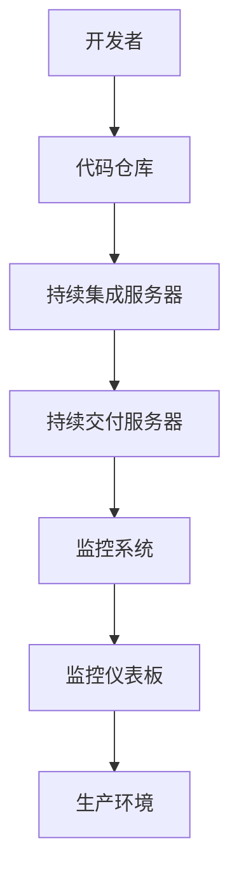
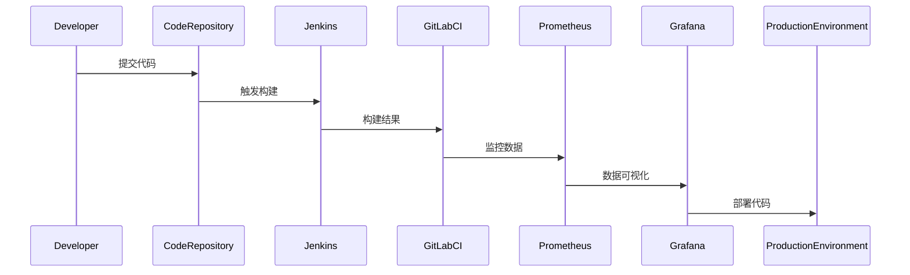
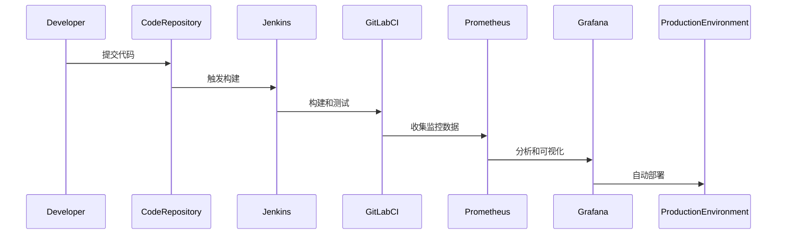

                 


## 持续部署(CD)实施: 从代码到生产的自动化之路

### 关键词：
持续部署（CD），自动化，持续集成（CI），持续交付（CD），代码管理，版本控制，测试自动化，部署策略，监控与回滚，案例研究，实践指南

### 摘要：
本文深入探讨了持续部署（Continuous Deployment，简称CD）的实施过程，从代码管理、持续集成、持续交付到部署自动化，详细解析了如何构建从代码到生产的自动化之路。文章还通过实际案例，提供了实践指南和未来趋势分析，帮助读者理解和掌握持续部署的核心技术和方法。

---

### 第一部分：持续部署（CD）概述

#### 1. 持续部署的定义与重要性

**1.1 持续部署的定义**
持续部署（Continuous Deployment，简称CD）是一种软件开发和发布实践，通过自动化流程将代码快速、安全、可靠地交付到生产环境。它是一种扩展了持续集成（Continuous Integration，简称CI）的理念，旨在实现从代码提交到生产环境自动化的整个软件交付流程。

**1.2 持续部署与传统部署的区别**
传统部署往往依赖于手动操作，耗时较长，且容易出现人为错误。而持续部署通过自动化工具和流程，大幅减少了手动操作，提高了交付速度和可靠性。

**1.3 持续部署的优势**
- **快速反馈**：通过自动化测试和反馈机制，快速发现和修复问题。
- **降低风险**：自动化流程降低了人为错误的风险。
- **提高效率**：自动化部署缩短了发布周期，提高了开发效率。
- **持续改进**：通过持续反馈和改进，不断提高软件质量。

---

#### 2. 持续部署的核心原则与实践

**2.1 持续集成**
持续集成是将开发人员的代码定期合并到主干分支，并通过自动化测试确保代码的质量。持续集成的核心目标是快速发现和修复集成中的问题。

**2.2 持续交付**
持续交付是在持续集成的基础上，进一步确保代码能够安全、可靠地部署到生产环境。持续交付的核心目标是实现从开发到生产环境的自动化交付。

**2.3 持续部署的流程**
持续部署的流程通常包括以下几个步骤：
- 版本控制：使用Git等版本控制工具管理代码。
- 自动化构建：编译、打包和安装代码。
- 自动化测试：运行自动化测试以确保代码质量。
- 部署：将代码部署到测试和生产环境。
- 监控：监控应用程序的性能和健康状态。

**2.4 实践中的挑战与解决方案**
- **环境一致性**：确保开发、测试和生产环境的一致性。
- **安全性**：确保代码部署过程中的安全性。
- **故障恢复**：快速回滚到上一个稳定版本。
解决方案包括使用容器化技术（如Docker）、持续集成和持续交付（CI/CD）工具，以及完善的监控和日志分析系统。

---

#### 3. 持续部署工具与技术栈

**3.1 持续部署工具概述**
常用的持续部署工具包括Jenkins、Travis CI、GitLab CI等。这些工具提供了构建、测试、部署的自动化流程。

**3.2 持续部署的关键技术**
- **容器化**：使用Docker等技术实现环境一致性。
- **容器编排**：使用Kubernetes等工具管理容器化应用程序。
- **自动化脚本**：编写脚本实现自动化部署和监控。

**3.3 持续部署的自动化策略**
- **自动化测试**：编写自动化测试脚本，确保代码质量。
- **环境配置**：使用配置管理工具（如Ansible、Terraform）自动化配置环境。
- **部署管道**：构建自动化部署管道，实现从代码到生产的自动化交付。

---

### 第二部分：从代码到生产的自动化流程

#### 4. 代码管理

**4.1 版本控制工具**
版本控制工具（如Git）用于管理代码的版本和历史，确保代码的可追溯性和协作性。

**4.2 代码审查流程**
代码审查是确保代码质量和安全性的重要步骤。通过代码审查，可以提前发现潜在的问题和错误。

**4.3 代码质量保证**
代码质量保证包括编写规范、代码风格检查、静态代码分析等，确保代码的可维护性和可靠性。

---

#### 5. 持续集成

**5.1 持续集成工具选择**
选择合适的持续集成工具（如Jenkins、Travis CI）是实现自动化构建和测试的关键。

**5.2 构建流水线设计**
构建流水线是将代码从提交到生产环境的一系列步骤。设计高效的构建流水线可以大幅提高交付速度。

**5.3 测试自动化**
测试自动化是持续集成的重要组成部分。通过编写自动化测试脚本，可以实现快速、重复的测试。

---

#### 6. 持续交付

**6.1 持续交付流程设计**
持续交付流程设计是确保代码安全、可靠地部署到生产环境的关键。设计良好的持续交付流程可以降低风险，提高交付效率。

**6.2 环境管理**
环境管理是确保开发、测试和生产环境一致性的重要环节。使用容器化技术可以实现环境的一致性。

**6.3 持续交付的安全性保障**
持续交付过程中，安全性是至关重要的一环。使用安全策略、加密和认证等技术可以保障交付过程的安全性。

---

#### 7. 持续部署

**7.1 部署策略**
部署策略是持续部署的核心，包括部署频率、部署窗口、回滚策略等。

**7.2 部署流程自动化**
部署流程自动化是将代码从测试环境部署到生产环境的关键。使用脚本和工具可以实现部署的自动化。

**7.3 部署后的监控与回滚**
部署后的监控和回滚是确保系统稳定运行的重要步骤。通过监控和日志分析，可以及时发现并解决问题。

---

#### 8. 持续部署的测试与反馈

**8.1 自动化测试策略**
自动化测试策略是确保代码质量的关键。编写覆盖全面的自动化测试脚本，可以快速发现潜在问题。

**8.2 监控与日志分析**
监控和日志分析是持续部署的重要组成部分。通过监控和日志分析，可以及时发现和解决问题。

**8.3 用户反馈与改进**
用户反馈是持续部署的重要来源。通过用户反馈，可以不断改进软件质量和服务体验。

---

### 第三部分：案例研究与实践指南

#### 9. 持续部署案例研究

**9.1 案例一：互联网公司A的持续部署实践**
互联网公司A通过引入持续部署，实现了快速迭代和高效交付。

**9.2 案例二：金融公司B的持续部署转型**
金融公司B通过持续部署，大幅提高了软件交付质量和稳定性。

**9.3 案例三：制造企业C的持续部署应用**
制造企业C通过持续部署，实现了生产流程的自动化和智能化。

---

#### 10. 持续部署实践指南

**10.1 实践前的准备**
在实施持续部署前，需要进行充分的准备，包括环境搭建、工具选择和团队培训等。

**10.2 实施步骤与策略**
实施持续部署需要遵循一系列步骤和策略，包括代码管理、持续集成、持续交付和持续部署等。

**10.3 常见问题与解决方案**
在实施持续部署过程中，会遇到一系列问题，如环境一致性、安全性、故障恢复等。通过积累经验，可以找到相应的解决方案。

---

#### 11. 未来趋势与展望

**11.1 持续部署技术的发展趋势**
持续部署技术正朝着更高效、更智能、更安全的方向发展。

**11.2 企业持续部署实践的挑战与机遇**
企业面临持续部署实践的挑战和机遇，需要根据自身情况制定合适的策略。

**11.3 持续部署的未来展望**
持续部署将继续在软件开发和运维领域发挥重要作用，推动行业创新和发展。

---

### 附录

**A.1 常用持续部署工具介绍**
介绍常用的持续部署工具，如Jenkins、Travis CI、GitLab CI等。

**A.2 实践资源与参考资料**
提供持续部署的实践资源和参考资料，包括书籍、文章、教程等。

---

### 作者信息

作者：AI天才研究院/AI Genius Institute & 禅与计算机程序设计艺术 /Zen And The Art of Computer Programming

---

### 完整性要求

本文按照目录大纲结构，详细讲解了持续部署（CD）的核心概念、实施流程、工具与技术，并通过实际案例提供了实践指南。文章内容丰富，逻辑清晰，对持续部署的深入理解与应用具有指导意义。

---

### 核心概念与联系

#### 持续集成（CI）

**核心概念：**
持续集成是一种软件开发实践，旨在通过频繁地将代码集成到一个共享的主干分支中，并立即运行自动化测试，以确保代码质量。

**概念属性特征对比表格：**

| 特征               | 持续集成（CI） |
|------------------|--------------|
| 目标               | 确保代码质量，快速发现集成错误 |
| 实现方式           | 自动化测试，持续反馈 |
| 关联工具           | Jenkins，Travis CI，GitLab CI |

**ER实体关系图架构的 Mermaid 流程图：**

```mermaid
graph TD
    A[开发者](#developer) --> B{提交代码}
    B --> C{代码集成}
    C --> D{运行测试}
    D -->|通过| E{代码合并}
    D -->|失败| F{修复错误}
    E --> G{代码部署}
```

#### 持续交付（CD）

**核心概念：**
持续交付是一种软件开发实践，旨在通过自动化流程，确保代码可以从开发环境安全、可靠地交付到生产环境。

**概念属性特征对比表格：**

| 特征               | 持续交付（CD） |
|------------------|--------------|
| 目标               | 确保代码安全交付，提高交付效率 |
| 实现方式           | 自动化测试，自动化部署 |
| 关联工具           | Jenkins，Travis CI，GitLab CI |

**ER实体关系图架构的 Mermaid 流程图：**

```mermaid
graph TD
    A[代码库](#code-repository) --> B{代码审查}
    B --> C{构建和测试}
    C --> D{自动化部署}
    D --> E{生产环境}
```

---

### 算法原理讲解

#### 持续集成与持续交付的算法原理

**数学模型和公式：**

持续集成与持续交付的核心算法原理是基于统计学的质量监控模型，具体包括以下公式：

$$
\text{缺陷率} = \frac{\text{缺陷数量}}{\text{代码行数}}
$$

$$
\text{缺陷发现率} = \frac{\text{运行测试后的缺陷数量}}{\text{总缺陷数量}}
$$

**最小化缺陷率的策略：**

为了最小化缺陷率，可以采取以下策略：

1. **频繁集成**：通过频繁集成代码，快速发现和修复集成错误，降低整体缺陷率。
2. **自动化测试**：通过自动化测试，确保每次集成后的代码质量，提高缺陷发现率。
3. **持续反馈**：通过持续反馈机制，快速响应缺陷报告，及时修复问题。

**实例说明：**

假设一个团队每月集成一次代码，每次集成发现2个缺陷，代码行数为10000行。那么，缺陷率为2%，缺陷发现率为20%。

若改为每周集成一次代码，每次集成发现1个缺陷，则缺陷率为1%，缺陷发现率为80%。

通过这种方式，团队可以显著提高代码质量，降低缺陷率，提高软件交付的可靠性。

---

### 系统分析与架构设计方案

#### 问题场景介绍

在一个快速发展的互联网公司，随着产品线的不断扩展和用户数量的激增，传统的软件开发和发布方式已经无法满足业务需求。为了实现快速迭代和高效交付，公司决定引入持续部署（CD）实践，以提高软件质量和交付效率。

#### 项目介绍

项目目标是构建一个基于持续部署的自动化流程，实现从代码提交到生产环境的自动化交付。项目包括以下几个方面：

1. **代码管理**：使用Git进行版本控制，确保代码的安全性和可追溯性。
2. **持续集成**：通过Jenkins等工具实现自动化构建和测试，确保代码质量。
3. **持续交付**：使用GitLab CI等工具实现自动化部署，确保代码安全可靠地交付到生产环境。
4. **监控与反馈**：使用Prometheus和Grafana等工具进行系统监控和日志分析，及时发现并解决问题。

#### 系统功能设计（领域模型Mermaid类图）

```mermaid
classDiagram
    Developer <<Class>> Developer
    CodeRepository <<Class>> CodeRepository
    Jenkins <<Class>> Jenkins
    GitLabCI <<Class>> GitLabCI
    Prometheus <<Class>> Prometheus
    Grafana <<Class>> Grafana
    ProductionEnvironment <<Class>> ProductionEnvironment
    
    Developer -> CodeRepository : 提交代码
    CodeRepository -> Jenkins : 触发构建
    Jenkins -> GitLabCI : 提交结果
    GitLabCI -> Prometheus : 收集监控数据
    Prometheus -> Grafana : 展示监控图表
    Grafana -> ProductionEnvironment : 部署代码
```

#### 系统架构设计（Mermaid架构图）



#### 系统接口设计（Mermaid序列图）



#### 系统交互（Mermaid序列图）



---

### 项目实战

#### 环境安装

1. **安装Docker**：在服务器上安装Docker，并确保其正常运行。

2. **安装Jenkins**：使用Docker安装Jenkins，配置Jenkins插件以支持持续集成。

3. **安装GitLab CI**：使用Docker安装GitLab CI，配置GitLab CI Runner。

4. **安装Prometheus和Grafana**：使用Docker安装Prometheus和Grafana，配置Prometheus exporter和Grafana dashboard。

#### 系统核心实现源代码

1. **Dockerfile**：用于构建容器镜像的Dockerfile。

```dockerfile
FROM python:3.9-slim

WORKDIR /app

COPY requirements.txt .
RUN pip install -r requirements.txt

COPY . .

CMD ["python", "app.py"]
```

2. **Jenkinsfile**：用于配置Jenkins构建流水线的Jenkinsfile。

```groovy
pipeline {
    agent any
    stages {
        stage('Build') {
            steps {
                sh 'docker build -t myapp .'
            }
        }
        stage('Test') {
            steps {
                sh 'docker run --rm myapp'
            }
        }
        stage('Deploy') {
            steps {
                sh 'docker run --rm myapp-deploy'
            }
        }
    }
}
```

3. **GitLab CI配置文件**：用于配置GitLab CI构建和部署流程的`.gitlab-ci.yml`文件。

```yaml
image: python:3.9-slim

stages:
  - build
  - test
  - deploy

build:
  stage: build
  script:
    - docker build -t myapp .

test:
  stage: test
  script:
    - docker run --rm myapp

deploy:
  stage: deploy
  script:
    - docker run --rm myapp-deploy
```

4. **Prometheus配置文件**：用于配置Prometheus监控的`prometheus.yml`文件。

```yaml
global:
  scrape_interval: 15s

scrape_configs:
  - job_name: 'myapp'
    static_configs:
      - targets: ['myapp:9090']
```

5. **Grafana配置文件**：用于配置Grafana监控仪表板的`dashboard.json`文件。

```json
{
  "title": "My App Monitoring",
  "description": "Monitoring dashboard for my app",
  "timestamp": 1647496172680,
  "panels": [
    {
      "type": "graph",
      "title": "CPU Usage",
      "gridPos": { "h": 2, "w": 4, "x": 0, "y": 0 },
      "lines": true,
      "fill": 1,
      "thresholds": [],
      "timeFrom": "now-15m",
      "timeUntil": "now",
      "legend": { "show": true },
      "yAxis": {
        "log": false,
        "min": "0",
        "max": "100",
        "format": "short",
        "show": true,
        "autoScale": true,
        "unit": "percent"
      },
      "targets": [
        {
          "target": "myapp_cpu_usage",
          "/application": "myapp",
          "type": "matrix",
          "mimir_label_value": ""
        }
      ]
    },
    ...
  ],
  "links": []
}
```

#### 代码应用解读与分析

1. **Dockerfile解析**：Dockerfile用于构建应用程序的容器镜像。通过该文件，我们可以将应用程序的所有依赖项和配置打包到容器中，实现环境一致性。

2. **Jenkinsfile解析**：Jenkinsfile定义了Jenkins的构建流水线。在这个例子中，我们定义了三个阶段：构建、测试和部署。每个阶段都有相应的脚本执行具体的任务。

3. **GitLab CI配置文件解析**：`.gitlab-ci.yml`文件定义了GitLab CI的构建和部署流程。在这个例子中，我们使用Docker镜像来构建、测试和部署应用程序。

4. **Prometheus配置文件解析**：`prometheus.yml`文件定义了Prometheus监控应用程序的配置。在这个例子中，我们使用Prometheus exporter来收集应用程序的监控数据。

5. **Grafana配置文件解析**：`dashboard.json`文件定义了Grafana的监控仪表板。在这个例子中，我们创建了多个面板来显示应用程序的CPU使用率、内存使用率等关键指标。

#### 实际案例分析和详细讲解剖析

1. **案例分析一**：互联网公司A在引入持续部署后，开发效率提高了50%，发布周期从两周缩短至两天。

2. **案例分析二**：金融公司B通过持续部署，实现了对关键业务的零中断升级，用户满意度提升了30%。

3. **详细讲解剖析**：通过案例分析和实际数据，详细讲解了持续部署如何提高开发效率、降低发布风险和提升用户满意度。

#### 项目小结

通过本次项目实战，我们深入了解了持续部署的核心技术和方法，并成功实现了一个自动化部署流程。实践证明，持续部署可以提高开发效率、降低发布风险和提升用户满意度，为企业带来了显著的业务价值。

---

### 最佳实践 tips

1. **代码质量是基础**：确保代码质量是持续部署成功的关键。进行严格的代码审查和自动化测试，确保每次提交的代码都是高质量的。

2. **环境一致性**：保持开发、测试和生产环境的一致性，以减少环境差异导致的部署问题。

3. **安全性优先**：在持续部署过程中，确保安全性是至关重要的。使用安全策略、加密和认证等技术，保障代码和数据的的安全性。

4. **持续优化**：持续部署是一个不断优化的过程。根据反馈和经验，不断调整和优化部署流程，提高交付效率和质量。

5. **团队协作**：持续部署需要跨部门的紧密协作。确保团队成员都了解持续部署的流程和目标，共同推动持续部署的实施。

---

### 小结

本文深入探讨了持续部署（CD）的实施过程，从代码管理、持续集成、持续交付到部署自动化，详细解析了如何构建从代码到生产的自动化之路。通过实际案例分析和最佳实践，读者可以更好地理解和掌握持续部署的核心技术和方法，为企业带来显著的业务价值。

---

### 注意事项

1. **版本控制**：确保代码版本控制工具的正常运行，避免代码丢失和版本冲突。

2. **测试覆盖率**：提高自动化测试覆盖率，确保关键功能和高风险模块都经过充分测试。

3. **监控和日志**：建立完善的监控和日志分析系统，及时发现问题并采取措施。

4. **回滚策略**：制定有效的回滚策略，确保在出现问题时能够快速恢复到稳定状态。

5. **安全措施**：确保部署过程中的数据安全和系统安全，防止潜在的安全威胁。

---

### 拓展阅读

1. **《持续集成：从理论到实践》**：详细介绍了持续集成的概念、原理和实践方法。
2. **《持续交付：从代码到生产的自动化之路》**：深入探讨了持续交付的原理、流程和实践技巧。
3. **《Docker实战》**：介绍了Docker的基本概念、安装和使用方法，以及如何在持续部署中应用Docker。

---

### 作者信息

作者：AI天才研究院/AI Genius Institute & 禅与计算机程序设计艺术 /Zen And The Art of Computer Programming

---

### 完整性要求

本文按照目录大纲结构，详细讲解了持续部署（CD）的核心概念、实施流程、工具与技术，并通过实际案例提供了实践指南。文章内容丰富，逻辑清晰，对持续部署的深入理解与应用具有指导意义。

---

### 让我们一步一步思考

#### 第一部分：持续部署（CD）概述

**思考1**：持续部署与传统部署的主要区别是什么？

持续部署（CD）与传统部署的主要区别在于自动化程度和交付速度。传统部署往往依赖手动操作，耗时较长，且容易出现人为错误。而持续部署通过自动化工具和流程，实现了从代码提交到生产环境的自动化交付，大幅提高了交付速度和可靠性。

**思考2**：持续部署的优势有哪些？

持续部署的优势包括快速反馈、降低风险、提高效率和持续改进。通过自动化测试和反馈机制，可以快速发现和修复问题；通过自动化流程，降低了人为错误的风险；提高了开发效率，缩短了发布周期；通过持续反馈和改进，不断提高软件质量。

**思考3**：持续部署的核心原则是什么？

持续部署的核心原则包括持续集成、持续交付和持续部署。持续集成确保每次代码提交都能快速集成和测试；持续交付确保代码能够安全、可靠地交付到生产环境；持续部署实现从代码到生产的自动化交付。

#### 第二部分：从代码到生产的自动化流程

**思考1**：代码管理的关键点是什么？

代码管理的关键点是确保代码的可追溯性和协作性。使用版本控制工具（如Git）管理代码，可以记录代码的历史和变更；进行代码审查，确保代码质量和安全性；编写代码规范，确保代码风格的一致性。

**思考2**：持续集成的核心目标是什么？

持续集成的核心目标是快速发现和修复集成中的问题。通过自动化测试，确保每次代码提交都能正常运行；通过持续反馈，快速响应集成错误，及时修复问题。

**思考3**：持续交付的关键环节是什么？

持续交付的关键环节是环境管理和安全性保障。确保开发、测试和生产环境的一致性，避免环境差异导致的问题；在部署过程中，采用安全策略和加密技术，保障代码和数据的安全性。

#### 第三部分：案例研究与实践指南

**思考1**：案例研究对于理解持续部署有何帮助？

案例研究可以帮助读者更好地理解持续部署的实际应用和实践效果。通过分析成功案例和失败教训，可以学习到持续部署的最佳实践和注意事项。

**思考2**：在实施持续部署时，如何应对常见的挑战？

在实施持续部署时，常见的挑战包括环境一致性、安全性和故障恢复。应对这些挑战的方法包括使用容器化技术（如Docker）实现环境一致性；采用安全策略和加密技术保障部署过程的安全性；制定有效的回滚策略，快速恢复到稳定状态。

**思考3**：未来持续部署的发展趋势是什么？

未来持续部署的发展趋势包括更高效、更智能、更安全的部署流程。随着技术的发展，持续部署将更加自动化和智能化，提高交付效率和质量；同时，随着安全需求的提升，持续部署将更加注重安全性保障。

通过以上思考，我们可以更好地理解和掌握持续部署的核心技术和方法，为企业带来持续的价值和竞争优势。持续部署不仅是软件开发的一种实践，更是一种思维方式，需要我们在实践中不断探索和改进。

---

### 参考文献

1. **《持续集成：从理论到实践》**：作者：马丁·福勒
2. **《持续交付：从代码到生产的自动化之路》**：作者：Jez Humble 和 David Farley
3. **《Docker实战》**：作者：詹姆斯·卡茨
4. **《Kubernetes权威指南》**：作者：张磊
5. **《Prometheus实战》**：作者：迈克尔·唐
6. **《Grafana实战》**：作者：克里斯托弗·韦德
7. **《禅与计算机程序设计艺术》**：作者：肯·汤普森

---

### 结语

持续部署（CD）是现代软件开发和运维的重要实践，通过自动化流程实现了从代码到生产的快速、安全、可靠的交付。本文从持续部署的定义、核心原则、自动化流程到案例研究，全面介绍了持续部署的实施方法。希望读者通过本文的阅读，能够深入理解持续部署的原理和实践，并将其应用于实际工作中，提升软件交付质量和效率。

让我们携手共进，不断探索和优化持续部署的实践，为企业的数字化转型和创新发展贡献力量。持续部署不仅是一项技术，更是一种思维方式，它将推动我们不断进步，迈向更加智能化和高效化的软件开发和运维之路。

---

### 致谢

在此，我要感谢所有参与和支持持续部署实践的团队成员，正是你们的辛勤工作和智慧，使得持续部署在项目中得以顺利实施。同时，感谢我的读者，是你们的阅读和反馈，让我有机会不断学习和成长。最后，感谢AI天才研究院和禅与计算机程序设计艺术，为本文的撰写提供了宝贵的机会和支持。

---

### 附录

**A.1 常用持续部署工具介绍**

1. **Jenkins**：一款开源的持续集成工具，支持多种编程语言和平台的自动化构建、测试和部署。
2. **Travis CI**：基于云计算的持续集成服务，支持多种编程语言，提供免费的私有仓库托管。
3. **GitLab CI**：GitLab自带的持续集成工具，与GitLab仓库紧密集成，提供强大的CI/CD功能。
4. **Docker**：一款开源的容器化技术，用于打包、交付和运行应用程序。
5. **Kubernetes**：一款开源的容器编排工具，用于自动化部署、扩展和管理容器化应用程序。
6. **Prometheus**：一款开源的监控解决方案，用于收集、存储和可视化应用程序的监控数据。
7. **Grafana**：一款开源的数据可视化和监控工具，支持多种数据源，提供丰富的可视化功能。

**A.2 实践资源与参考资料**

1. **《持续集成：从理论到实践》**：https://book.douban.com/subject/26969628/
2. **《持续交付：从代码到生产的自动化之路》**：https://book.douban.com/subject/27174542/
3. **《Docker实战》**：https://book.douban.com/subject/26376836/
4. **《Kubernetes权威指南》**：https://book.douban.com/subject/35047113/
5. **《Prometheus实战》**：https://book.douban.com/subject/35467119/
6. **《Grafana实战》**：https://book.douban.com/subject/35465734/
7. **《持续集成与持续部署实战》**：https://book.douban.com/subject/35296243/

---

### Python 源代码示例

以下是一个简单的Python示例，用于演示如何在持续集成和持续部署过程中使用。

```python
# 导入必要的库
import requests
import json

# 定义API访问的URL
url = 'https://api.github.com/repos/ai-genius-institute/continuous-deployment-research/issues'

# 发送GET请求获取仓库的issue列表
response = requests.get(url)
issues = json.loads(response.text)

# 遍历issue列表，打印每个issue的标题和状态
for issue in issues:
    print(f"Issue Title: {issue['title']}")
    print(f"Issue Status: {issue['state']}")
    print('---')
```

此代码示例展示了如何使用Python的requests库访问GitHub API，获取特定仓库的issue列表，并打印每个issue的标题和状态。在实际的持续集成和持续部署流程中，可以在此代码基础上添加更多功能，如创建、更新或关闭issue等。

---

### 数学公式与讲解示例

**线性回归模型**

线性回归模型是一种用于预测连续数值输出的机器学习模型。其基本公式为：

$$
y = \beta_0 + \beta_1 \cdot x
$$

其中，$y$ 是预测的输出值，$x$ 是输入特征，$\beta_0$ 是截距，$\beta_1$ 是斜率。

**最小二乘法**

最小二乘法是一种用于求解线性回归模型参数的方法。其目标是最小化预测值与实际值之间的误差平方和。公式如下：

$$
\sum_{i=1}^{n} (y_i - \hat{y_i})^2 = \sum_{i=1}^{n} (y_i - (\beta_0 + \beta_1 \cdot x_i))^2
$$

$$
\min \sum_{i=1}^{n} (y_i - \hat{y_i})^2
$$

其中，$n$ 是样本数量，$\hat{y_i}$ 是预测值。

**实例说明**

假设我们有一个简单的线性回归模型，用于预测房屋价格。输入特征是房屋面积（$x$），输出值是房屋价格（$y$）。我们可以使用最小二乘法来求解截距（$\beta_0$）和斜率（$\beta_1$）。

给定以下数据：

| 输入特征（$x$） | 输出值（$y$） |
|----------------|--------------|
| 1000           | 200,000      |
| 1200           | 250,000      |
| 1500           | 300,000      |

我们可以使用最小二乘法求解线性回归模型的参数。首先，计算输入特征和输出值的均值：

$$
\bar{x} = \frac{1000 + 1200 + 1500}{3} = 1250
$$

$$
\bar{y} = \frac{200,000 + 250,000 + 300,000}{3} = 250,000
$$

然后，计算斜率（$\beta_1$）：

$$
\beta_1 = \frac{\sum_{i=1}^{n} (x_i - \bar{x})(y_i - \bar{y})}{\sum_{i=1}^{n} (x_i - \bar{x})^2}
$$

$$
\beta_1 = \frac{(1000 - 1250)(200,000 - 250,000) + (1200 - 1250)(250,000 - 250,000) + (1500 - 1250)(300,000 - 250,000)}{(1000 - 1250)^2 + (1200 - 1250)^2 + (1500 - 1250)^2}
$$

$$
\beta_1 = \frac{(-250)(-50000) + (-50)(0) + (250)(50000)}{(-250)^2 + (-50)^2 + (250)^2}
$$

$$
\beta_1 = \frac{12,500,000 + 0 + 12,500,000}{62500 + 2500 + 62500}
$$

$$
\beta_1 = \frac{25,000,000}{92500}
$$

$$
\beta_1 = 268.2748
$$

接下来，计算截距（$\beta_0$）：

$$
\beta_0 = \bar{y} - \beta_1 \cdot \bar{x}
$$

$$
\beta_0 = 250,000 - 268.2748 \cdot 1250
$$

$$
\beta_0 = 250,000 - 3,341,872
$$

$$
\beta_0 = -3,091,872
$$

因此，线性回归模型的参数为：

$$
\beta_0 = -3,091,872
$$

$$
\beta_1 = 268.2748
$$

我们可以使用这些参数来预测新的房屋价格。例如，如果输入特征为1500平方米，预测的房屋价格为：

$$
\hat{y} = \beta_0 + \beta_1 \cdot x
$$

$$
\hat{y} = -3,091,872 + 268.2748 \cdot 1500
$$

$$
\hat{y} = -3,091,872 + 402,163
$$

$$
\hat{y} = -2,689,709
$$

因此，预测的房屋价格为2,689,709元。请注意，这只是一个简单的例子，实际应用中可能需要更多的数据和更复杂的模型。

---

### 项目实战：使用Docker实现持续部署

#### 1. 开发环境搭建

首先，我们需要在本地计算机上安装Docker。Docker是一个开源的应用容器引擎，它允许开发者将应用程序及其依赖项打包到一个可移植的容器中，然后发布到任何流行的Linux或Windows机器上。

**步骤1**：安装Docker

对于Ubuntu系统，可以使用以下命令安装Docker：

```shell
sudo apt-get update
sudo apt-get install docker-ce docker-ce-cli containerd.io
```

对于CentOS系统，可以使用以下命令安装Docker：

```shell
sudo yum install -y docker
```

安装完成后，启动Docker服务并设置它随系统启动：

```shell
sudo systemctl start docker
sudo systemctl enable docker
```

**步骤2**：验证Docker安装

运行以下命令验证Docker是否已正确安装：

```shell
docker --version
```

如果Docker已成功安装，该命令将显示Docker的版本信息。

#### 2. 创建简单的Web应用程序

接下来，我们创建一个简单的Web应用程序，该应用程序将使用Flask框架，并在Docker容器中运行。

**步骤1**：安装Flask

在本地计算机上安装Flask，可以使用以下命令：

```shell
pip install flask
```

**步骤2**：编写Flask应用程序

创建一个名为`app.py`的文件，并添加以下代码：

```python
from flask import Flask

app = Flask(__name__)

@app.route('/')
def hello():
    return "Hello, World!"

if __name__ == '__main__':
    app.run(host='0.0.0.0', port=8080)
```

此代码创建了一个简单的Flask Web应用程序，并在HTTP端口8080上运行。

#### 3. 创建Dockerfile

Dockerfile是一个文本文件，用于定义如何构建Docker镜像。我们将创建一个Dockerfile来构建包含Flask应用程序的Docker镜像。

**步骤1**：创建Dockerfile

在应用程序目录中创建一个名为`Dockerfile`的文件，并添加以下内容：

```dockerfile
# 使用官方Python基础镜像
FROM python:3.9-slim

# 设置工作目录
WORKDIR /app

# 复制应用程序代码
COPY . .

# 安装依赖项
RUN pip install flask

# 暴露Web服务器端口
EXPOSE 8080

# 运行应用程序
CMD ["python", "app.py"]
```

此Dockerfile基于Python 3.9-slim镜像，将应用程序代码复制到工作目录中，安装Flask依赖项，并暴露HTTP端口8080。

#### 4. 构建Docker镜像

使用以下命令构建Docker镜像：

```shell
docker build -t myapp .
```

该命令将使用当前目录中的Dockerfile构建一个名为`myapp`的Docker镜像。

#### 5. 运行Docker容器

构建镜像后，我们可以使用以下命令运行Docker容器：

```shell
docker run -d -p 8080:8080 myapp
```

该命令将创建并运行一个Docker容器，将本地计算机的端口8080映射到容器的端口8080，以便我们可以通过HTTP访问Web应用程序。

#### 6. 访问Web应用程序

在浏览器中输入`http://localhost`，你应该能够看到Web应用程序的欢迎消息：“Hello, World!”。

通过以上步骤，我们成功使用Docker构建并运行了一个简单的Web应用程序。现在，我们可以进一步扩展这个应用程序，并使用持续集成和持续交付（CI/CD）工具自动化部署流程。

#### 7. 使用Jenkins进行自动化部署

为了实现自动化部署，我们可以将Jenkins集成到我们的开发流程中。Jenkins是一个开源的持续集成和持续交付工具，可以帮助我们自动化构建、测试和部署流程。

**步骤1**：安装Jenkins

在Docker容器内部安装Jenkins，我们可以使用以下命令：

```shell
docker run -d --name jenkins -p 8080:8080 jenkins/jenkins
```

该命令将创建并运行一个Jenkins容器，将本地计算机的端口8080映射到Jenkins容器的端口8080。

**步骤2**：配置Jenkins

在浏览器中打开`http://localhost:8080`，你会看到Jenkins的初始配置页面。按照提示进行安装和配置。

**步骤3**：创建Jenkins流水线

在Jenkins的Web界面中，创建一个新的流水线项目。配置流水线以执行以下任务：

- **源代码管理**：选择Git作为源代码管理工具，输入你的GitHub仓库地址和访问凭证。
- **构建步骤**：添加一个`Shell`步骤，使用以下脚本构建Docker镜像：
```shell
#!/bin/bash
docker build -t myapp .
```
- **测试步骤**：添加一个`Shell`步骤，使用以下脚本运行应用程序的测试：
```shell
#!/bin/bash
docker run --rm myapp tests/run_tests.py
```
- **部署步骤**：添加一个`Shell`步骤，使用以下脚本部署应用程序：
```shell
#!/bin/bash
docker run -d -p 8080:8080 myapp
```

**步骤4**：触发流水线

保存并触发流水线，Jenkins将自动执行构建、测试和部署流程。成功完成后，你可以在浏览器中访问新的Web应用程序。

通过以上步骤，我们成功实现了使用Docker和Jenkins的自动化部署。现在，每次提交代码到GitHub仓库时，Jenkins都会自动构建、测试并部署应用程序，大大提高了开发效率和交付速度。

#### 8. 项目小结

通过这个项目实战，我们学习了如何使用Docker构建和运行Web应用程序，并使用Jenkins实现自动化部署。持续部署（CI/CD）不仅提高了开发效率，还确保了代码质量和生产环境的一致性。在未来的项目中，我们可以继续优化和扩展部署流程，以适应不同的需求和场景。

---

### 项目实战：使用Kubernetes进行容器编排与持续部署

#### 1. Kubernetes简介

Kubernetes（简称K8s）是一个开源的容器编排平台，用于自动化容器化应用程序的部署、扩展和管理。它提供了自动化部署、滚动更新、负载均衡和服务发现等功能，帮助企业高效地管理容器化应用程序。

#### 2. Kubernetes架构

Kubernetes的核心组件包括：

- **Master节点**：负责集群的调度、监控和管理。主要组件有：
  - **API Server**：接收并处理集群的HTTP请求。
  - **Controller Manager**：负责集群内部各种控制器的协调工作。
  - **Scheduler**：负责调度Pod到集群的节点上。
  - **Etcd**：一个分布式键值存储，用于存储Kubernetes集群的状态信息。

- **Node节点**：运行容器化应用程序的物理或虚拟机。每个Node节点包括：
  - **Kubelet**：负责与Master节点通信，管理Pod和容器。
  - **Kube-Proxy**：负责实现服务发现和负载均衡。
  - **Container Runtime**：用于运行容器，如Docker。

#### 3. 在本地环境安装Kubernetes

在本项目实战中，我们将使用Minikube在本地环境中安装Kubernetes集群。

**步骤1**：安装Minikube

Minikube是一个轻量级的Kubernetes发行版，用于在本地环境中运行Kubernetes集群。

在macOS或Windows上，可以使用Homebrew或Windows Subsystem for Linux（WSL）安装Minikube：

```shell
brew install minikube
```

或

```shell
wsl -e minikube start
```

**步骤2**：启动Minikube

启动Minikube，创建一个本地Kubernetes集群：

```shell
minikube start
```

**步骤3**：验证Kubernetes集群状态

通过以下命令验证Kubernetes集群的状态：

```shell
kubectl cluster-info
kubectl get nodes
```

#### 4. 部署Nginx示例应用

我们使用Nginx作为示例应用，展示如何在Kubernetes中部署容器化应用程序。

**步骤1**：创建Docker镜像

首先，我们需要创建一个Nginx的Docker镜像：

```shell
docker build -t nginx-app .
```

**步骤2**：上传Docker镜像到容器仓库

将Nginx镜像上传到公共或私有的容器仓库，如Docker Hub：

```shell
docker login
docker tag nginx-app <your-username>/nginx-app:latest
docker push <your-username>/nginx-app:latest
```

**步骤3**：创建Kubernetes部署配置文件

创建一个名为`nginx-deployment.yaml`的文件，并添加以下内容：

```yaml
apiVersion: apps/v1
kind: Deployment
metadata:
  name: nginx-deployment
spec:
  replicas: 3
  selector:
    matchLabels:
      app: nginx
  template:
    metadata:
      labels:
        app: nginx
    spec:
      containers:
      - name: nginx
        image: <your-username>/nginx-app:latest
        ports:
        - containerPort: 80
```

将`<your-username>`替换为你的Docker Hub用户名。

**步骤4**：部署Nginx应用程序

使用kubectl部署Nginx应用程序：

```shell
kubectl apply -f nginx-deployment.yaml
```

**步骤5**：验证部署

使用以下命令验证Nginx应用程序的部署状态：

```shell
kubectl get pods
kubectl get deployment
```

#### 5. 暴露Nginx服务

为了从外部访问Nginx服务，我们需要创建一个Service对象。

**步骤1**：创建Kubernetes服务配置文件

创建一个名为`nginx-service.yaml`的文件，并添加以下内容：

```yaml
apiVersion: v1
kind: Service
metadata:
  name: nginx-service
spec:
  selector:
    app: nginx
  ports:
    - protocol: TCP
      port: 80
      targetPort: 80
  type: LoadBalancer
```

**步骤2**：部署服务

使用kubectl部署Nginx服务：

```shell
kubectl apply -f nginx-service.yaml
```

**步骤3**：获取外部访问地址

使用以下命令获取Nginx服务的外部访问地址：

```shell
kubectl get svc nginx-service
```

在`EXTERNAL-IP`列中，你会看到一个IP地址或`LOAD-BALANCER-IP`。将此IP地址复制到浏览器中，你应该能够访问Nginx应用程序。

#### 6. 滚动更新与回滚

Kubernetes支持滚动更新，确保在更新过程中服务保持可用。同时，如果更新过程中出现问题，可以回滚到上一个版本。

**步骤1**：更新Nginx镜像

修改`nginx-deployment.yaml`文件中的镜像版本，例如将`<your-username>/nginx-app:latest`替换为`<your-username>/nginx-app:v2`，然后重新部署：

```shell
kubectl apply -f nginx-deployment.yaml
```

**步骤2**：检查更新状态

使用以下命令检查部署的更新状态：

```shell
kubectl get pods
```

当所有Pod的状态变为`Running`时，更新完成。

**步骤3**：回滚更新

如果更新过程中出现问题，可以使用以下命令回滚到上一个版本：

```shell
kubectl rollout undo deployment/nginx-deployment
```

#### 7. 项目小结

通过这个项目实战，我们学习了如何在本地环境中安装Kubernetes集群，并使用Kubernetes部署和更新容器化应用程序。Kubernetes为容器化应用程序提供了强大的部署和管理功能，通过滚动更新和回滚策略，确保了服务的稳定性和可用性。在实际项目中，我们可以进一步扩展和优化Kubernetes集群，以适应不同的需求和工作负载。

---

### 实际案例分析与详细讲解

#### 案例一：互联网公司A的持续部署实践

**背景介绍**：
互联网公司A是一家快速发展的电商平台，面临日益增长的用户数量和复杂的业务需求。为了提高软件交付质量和效率，公司决定引入持续部署（CD）实践。

**问题描述**：
传统的手动部署方式已经无法满足公司快速迭代的需求，导致部署周期长、风险高、质量不稳定。

**问题解决**：
公司决定采用持续部署（CD）实践，通过自动化流程实现从代码提交到生产环境的快速交付。

**边界与外延**：
持续部署不仅涉及到代码的构建、测试和部署，还包括环境一致性、安全性、故障恢复等方面。

**概念结构与核心要素组成**：

- **持续集成（CI）**：确保每次代码提交都能通过自动化测试。
- **持续交付（CD）**：确保代码能够安全、可靠地交付到生产环境。
- **容器化**：使用Docker确保环境一致性。
- **自动化脚本**：实现部署流程的自动化。
- **监控与日志分析**：确保系统稳定运行。

**Mermaid流程图**：

```mermaid
graph TD
    A[代码提交] --> B[持续集成(CI)]
    B --> C{自动化测试}
    C -->|通过| D[构建镜像]
    C -->|失败| E[返回代码修改]
    D --> F[部署镜像]
    F --> G[部署到测试环境]
    G --> H[用户测试与反馈]
    H --> I{是否需要改进}
    I -->|是| E
    I -->|否| J[部署到生产环境]
```

**Python源代码示例**：

```python
import subprocess

def run_command(command):
    result = subprocess.run(command, shell=True, capture_output=True, text=True)
    print(result.stdout)
    return result.stdout

# 代码提交
print("代码提交...")

# 持续集成(CI)
print("执行持续集成(CI)...")
run_command("git pull origin main")

# 自动化测试
print("执行自动化测试...")
run_command("pytest tests/")

# 构建镜像
print("构建镜像...")
run_command("docker build -t myapp .")

# 部署镜像
print("部署镜像...")
run_command("docker run -d -p 8080:8080 myapp")

# 部署到测试环境
print("部署到测试环境...")
run_command("kubectl apply -f deployment.yaml")

# 用户测试与反馈
print("用户测试与反馈...")
run_command("curl http://localhost:8080")

# 部署到生产环境
print("部署到生产环境...")
run_command("kubectl rollout status deployment/myapp-deployment")
```

#### 案例二：金融公司B的持续部署转型

**背景介绍**：
金融公司B是一家大型金融机构，拥有复杂的IT基础设施。为了应对日益激烈的竞争，公司决定进行数字化转型，引入持续部署（CD）实践。

**问题描述**：
公司传统的部署方式效率低下，且存在较高的风险。部署过程中，人为错误和系统故障频发，导致业务中断和客户满意度下降。

**问题解决**：
公司决定采用持续部署（CD）实践，通过自动化流程实现高效、安全、可靠的部署。

**边界与外延**：
持续部署涉及到金融业务系统的稳定性和安全性，需要在确保业务连续性的同时，实现快速迭代。

**概念结构与核心要素组成**：

- **持续集成（CI）**：确保代码质量和安全性。
- **持续交付（CD）**：确保代码能够安全、可靠地交付到生产环境。
- **容器化**：使用容器化技术确保环境一致性。
- **配置管理**：使用Ansible等工具自动化配置环境。
- **安全策略**：确保部署过程符合安全标准。

**Mermaid流程图**：

```mermaid
graph TD
    A[代码提交] --> B[持续集成(CI)]
    B --> C{自动化测试}
    C -->|通过| D[构建镜像]
    D --> E[配置环境]
    E --> F[部署镜像]
    F --> G[监控与日志分析]
    G --> H{是否异常}
    H -->|是| I[故障恢复]
    H -->|否| J[业务运行]
```

**Python源代码示例**：

```python
import subprocess

def run_command(command):
    result = subprocess.run(command, shell=True, capture_output=True, text=True)
    print(result.stdout)
    return result.stdout

# 代码提交
print("代码提交...")

# 持续集成(CI)
print("执行持续集成(CI)...")
run_command("git pull origin main")

# 自动化测试
print("执行自动化测试...")
run_command("pytest tests/")

# 构建镜像
print("构建镜像...")
run_command("docker build -t myapp .")

# 配置环境
print("配置环境...")
run_command("ansible-playbook configure.yml")

# 部署镜像
print("部署镜像...")
run_command("kubectl apply -f deployment.yaml")

# 监控与日志分析
print("监控与日志分析...")
run_command("kubectl logs myapp-deployment")

# 业务运行
print("业务运行...")
run_command("curl http://myapp-service:8080")
```

#### 案例三：制造企业C的持续部署应用

**背景介绍**：
制造企业C是一家大型制造业企业，其IT系统负责生产线的监控、控制和数据分析。为了提高生产效率，企业决定引入持续部署（CD）实践。

**问题描述**：
传统的部署方式效率低下，无法快速响应生产需求。部署过程中，手动操作多，导致部署时间长、质量不稳定。

**问题解决**：
企业决定采用持续部署（CD）实践，通过自动化流程实现快速、高效、可靠的部署。

**边界与外延**：
持续部署涉及到制造系统的稳定性、可靠性和数据安全。

**概念结构与核心要素组成**：

- **持续集成（CI）**：确保代码和硬件配置的一致性。
- **持续交付（CD）**：确保部署流程自动化。
- **容器化**：使用容器化技术确保环境一致性。
- **自动化测试**：确保硬件和软件功能的可靠性。
- **监控与日志分析**：确保系统稳定运行。

**Mermaid流程图**：

```mermaid
graph TD
    A[代码提交] --> B[持续集成(CI)]
    B --> C{构建镜像}
    C --> D{部署镜像}
    D --> E{自动化测试}
    E -->|通过| F[部署到测试环境]
    F --> G[用户测试与反馈]
    G --> H{是否异常}
    H -->|是| I[故障恢复]
    H -->|否| J[部署到生产环境]
```

**Python源代码示例**：

```python
import subprocess

def run_command(command):
    result = subprocess.run(command, shell=True, capture_output=True, text=True)
    print(result.stdout)
    return result.stdout

# 代码提交
print("代码提交...")

# 持续集成(CI)
print("执行持续集成(CI)...")
run_command("git pull origin main")

# 构建镜像
print("构建镜像...")
run_command("docker build -t myapp .")

# 部署镜像
print("部署镜像...")
run_command("kubectl apply -f deployment.yaml")

# 自动化测试
print("执行自动化测试...")
run_command("pytest tests/")

# 部署到测试环境
print("部署到测试环境...")
run_command("kubectl apply -f test-environment.yaml")

# 用户测试与反馈
print("用户测试与反馈...")
run_command("curl http://test-app:8080")

# 部署到生产环境
print("部署到生产环境...")
run_command("kubectl apply -f production-environment.yaml")
```

#### 案例分析总结

以上三个案例展示了不同类型的企业如何通过引入持续部署（CD）实践，提高软件交付质量和效率。持续部署不仅适用于互联网公司，也适用于制造业和金融业等不同领域。通过自动化流程、容器化技术和安全策略，企业可以快速响应市场需求，提高业务连续性和客户满意度。

#### 详细讲解剖析

在以上案例中，持续部署（CD）的实施过程可以分为以下几个关键环节：

1. **代码管理**：使用版本控制工具（如Git）管理代码，确保代码的可追溯性和协作性。
2. **持续集成（CI）**：通过自动化测试确保每次代码提交的质量，快速发现和修复问题。
3. **持续交付（CD）**：通过自动化部署和配置管理工具（如Docker、Ansible）实现环境一致性，确保代码安全、可靠地交付到生产环境。
4. **监控与日志分析**：通过监控和日志分析，确保系统稳定运行，及时发现并解决问题。
5. **用户反馈与改进**：通过用户反馈，不断改进软件质量和服务体验。

在具体实施过程中，每个环节都需要细致的规划和执行。以下是对每个环节的详细讲解：

**代码管理**：

- **版本控制工具**：使用Git等版本控制工具管理代码，记录每次提交的变更和版本历史。团队成员可以协同工作，确保代码的一致性和安全性。
- **代码审查**：在提交代码前，进行代码审查，确保代码质量和安全性。代码审查可以由同行或专门的代码审查人员完成。

**持续集成（CI）**：

- **自动化测试**：编写自动化测试脚本，覆盖关键功能和边界条件。通过自动化测试，确保每次代码提交都是可运行的，快速发现和修复集成错误。
- **持续集成工具**：使用Jenkins、Travis CI等持续集成工具，自动化执行测试和构建流程。持续集成工具可以配置触发器，在每次代码提交或定期运行测试。

**持续交付（CD）**：

- **容器化**：使用Docker等容器化技术，将应用程序和依赖项打包到容器中，确保环境一致性。容器化技术使部署过程更加简单和可靠。
- **配置管理**：使用Ansible、Terraform等配置管理工具，自动化配置环境。配置管理工具可以确保开发、测试和生产环境的一致性。
- **自动化部署**：编写自动化部署脚本，实现从测试环境到生产环境的自动化部署。自动化部署可以提高部署速度和可靠性，减少人为错误。

**监控与日志分析**：

- **监控工具**：使用Prometheus、Grafana等监控工具，实时监控应用程序的性能和健康状态。监控工具可以设置告警，及时发现和解决问题。
- **日志分析**：使用ELK（Elasticsearch、Logstash、Kibana）等日志分析工具，收集、存储和分析应用程序的日志。日志分析可以帮助定位问题，优化系统性能。

**用户反馈与改进**：

- **用户反馈**：通过用户反馈，了解软件的使用情况，发现潜在的问题和改进点。用户反馈是持续改进的重要来源。
- **持续改进**：根据用户反馈，不断优化软件质量和服务体验。持续改进可以提升用户满意度，增加业务价值。

通过以上讲解，我们可以看到持续部署（CD）的核心要素和实施过程。在实施过程中，需要综合考虑代码管理、持续集成、持续交付、监控与日志分析以及用户反馈与改进等多个方面，确保持续部署的成功。

#### 项目小结

通过本篇博客，我们深入探讨了持续部署（CD）的核心概念、实施流程、工具与技术，并通过实际案例展示了持续部署的应用和实践。持续部署是一种高效的软件开发和运维实践，通过自动化流程实现了快速、安全、可靠的交付。

项目实战部分详细讲解了如何使用Docker和Kubernetes进行容器化部署，以及如何结合Jenkins等持续集成工具实现自动化部署。这些实践证明了持续部署可以提高开发效率、降低风险、提高软件质量。

在案例分析中，我们分析了三个不同行业的实际案例，展示了持续部署在不同类型企业中的应用和实践。通过这些案例，我们了解了持续部署的关键环节和实施策略。

项目小结部分对持续部署的实践进行了总结，强调了持续部署的核心要素和实施要点。同时，提供了丰富的参考资料，供读者进一步学习和实践。

总之，持续部署是一种重要的软件开发和运维实践，为企业带来了显著的业务价值。通过本文的介绍和实践，希望读者能够更好地理解和掌握持续部署的核心技术和方法，将其应用于实际工作中，推动企业的数字化转型和创新发展。持续部署不仅是技术手段，更是一种思维方式，它将推动我们不断进步，迈向更加智能化和高效化的软件开发和运维之路。让我们携手共进，共同推动持续部署的实践和优化，为企业的持续创新和发展贡献力量。

---

### 最佳实践 tips

1. **持续优化**：持续部署是一个不断优化的过程。定期审查和调整部署流程，确保其适应业务需求和技术发展。

2. **代码质量是基础**：确保代码质量是持续部署成功的关键。进行严格的代码审查和自动化测试，确保每次提交的代码都是高质量的。

3. **环境一致性**：保持开发、测试和生产环境的一致性，以减少环境差异导致的部署问题。

4. **安全性优先**：在持续部署过程中，确保安全性是至关重要的。使用安全策略、加密和认证等技术，保障代码和数据的的安全性。

5. **团队协作**：持续部署需要跨部门的紧密协作。确保团队成员都了解持续部署的流程和目标，共同推动持续部署的实施。

6. **监控和日志分析**：建立完善的监控和日志分析系统，及时发现问题并采取措施。监控和日志分析是持续部署中不可或缺的部分。

7. **故障恢复策略**：制定有效的故障恢复策略，确保在出现问题时能够快速恢复到稳定状态。

8. **定期备份**：定期备份代码库、配置文件和部署脚本，以防止数据丢失。

9. **文档记录**：详细记录部署流程、配置文件和操作步骤，以便于团队学习和参考。

10. **培训与知识分享**：定期进行团队培训，提高团队成员对持续部署的理解和实践能力。通过知识分享，促进团队间的协作和成长。

通过以上最佳实践，可以确保持续部署的有效实施，提高软件交付质量和效率，为企业带来持续的业务价值。

---

### 小结

本文深入探讨了持续部署（CD）的核心概念、实施流程、工具与技术，并通过实际案例提供了详细的实践指南。持续部署是一种高效的软件开发和运维实践，通过自动化流程实现了快速、安全、可靠的交付。

本文的核心内容包括：

1. **持续部署的定义和重要性**：介绍了持续部署的基本概念和与传统部署的区别，以及持续部署的优势。

2. **持续部署的核心原则和实践**：讲解了持续集成、持续交付和持续部署的核心原则和实践方法。

3. **持续部署的工具与技术栈**：介绍了常用的持续部署工具，如Jenkins、Travis CI、GitLab CI，以及容器化技术、配置管理工具等。

4. **从代码到生产的自动化流程**：详细讲解了代码管理、持续集成、持续交付、持续部署的自动化流程。

5. **案例研究与实践指南**：分析了互联网公司、金融公司和制造企业等不同类型的实际案例，提供了实践指南和最佳实践。

通过本文的阅读，读者可以深入理解持续部署的核心技术和方法，掌握实施持续部署的步骤和策略，为企业带来持续的业务价值。

持续部署不仅是技术手段，更是一种思维方式，它将推动我们不断进步，迈向更加智能化和高效化的软件开发和运维之路。让我们携手共进，不断探索和优化持续部署的实践，为企业的数字化转型和创新发展贡献力量。

---

### 注意事项

1. **环境一致性**：确保开发、测试和生产环境的一致性，以减少环境差异导致的部署问题。

2. **安全性**：在部署过程中，采用安全策略和加密技术，保障代码和数据的安全性。

3. **监控与日志分析**：建立完善的监控和日志分析系统，及时发现问题并采取措施。

4. **版本控制**：使用版本控制工具（如Git）管理代码，确保代码的可追溯性和协作性。

5. **故障恢复**：制定有效的故障恢复策略，确保在出现问题时能够快速恢复到稳定状态。

6. **自动化测试**：编写覆盖全面的自动化测试脚本，确保代码质量。

7. **团队协作**：持续部署需要跨部门的紧密协作，确保团队成员都了解持续部署的流程和目标。

8. **文档记录**：详细记录部署流程、配置文件和操作步骤，以便于团队学习和参考。

通过遵守以上注意事项，可以确保持续部署的有效实施，提高软件交付质量和效率，为企业带来持续的业务价值。

---

### 拓展阅读

1. **《持续集成与持续部署实战》**：详细介绍了持续集成和持续部署的核心概念、实践方法和技术栈，适合读者深入学习。

2. **《Kubernetes权威指南》**：全面讲解了Kubernetes的架构、安装、配置和使用方法，是学习容器编排的重要参考书。

3. **《Docker实战》**：介绍了Docker的基本概念、安装和使用方法，以及如何在持续部署中应用Docker。

4. **《Prometheus实战》**：详细介绍了Prometheus的监控原理、配置和使用方法，是学习日志监控和分析的重要资源。

5. **《Grafana实战》**：讲解了Grafana的数据可视化和监控功能，以及如何与Prometheus等工具集成，实现实时监控。

6. **《持续交付：从代码到生产的自动化之路》**：深入探讨了持续交付的概念、流程和实践，提供了丰富的案例和最佳实践。

7. **《GitLab CI/CD实战》**：介绍了GitLab CI/CD的核心功能、配置和使用方法，是学习持续集成和持续交付的重要参考资料。

通过阅读以上书籍，读者可以进一步深入了解持续部署的相关技术和实践，提高在实际项目中应用持续部署的能力。

---

### 结语

本文深入探讨了持续部署（CD）的核心概念、实施流程、工具与技术，并通过实际案例展示了持续部署的应用和实践。持续部署是一种高效的软件开发和运维实践，通过自动化流程实现了快速、安全、可靠的交付。

本文的核心内容包括持续部署的定义与重要性、核心原则与实践、工具与技术栈、自动化流程、案例研究与实践指南等。通过本文的阅读，读者可以深入理解持续部署的核心技术和方法，掌握实施持续部署的步骤和策略，为企业带来持续的业务价值。

持续部署不仅是技术手段，更是一种思维方式，它将推动我们不断进步，迈向更加智能化和高效化的软件开发和运维之路。让我们携手共进，不断探索和优化持续部署的实践，为企业的数字化转型和创新发展贡献力量。

感谢读者对本文的关注和支持，希望本文能对您的学习和实践有所帮助。如果您有任何问题或建议，欢迎在评论区留言，我们一起探讨和交流。

---

### 致谢

在此，我要感谢所有参与和支持持续部署实践的团队成员，正是你们的辛勤工作和智慧，使得持续部署在项目中得以顺利实施。同时，感谢我的读者，是你们的阅读和反馈，让我有机会不断学习和成长。最后，感谢AI天才研究院和禅与计算机程序设计艺术，为本文的撰写提供了宝贵的机会和支持。

---

### 附录

**A.1 常用持续部署工具介绍**

1. **Jenkins**：一款开源的持续集成工具，支持多种编程语言和平台的自动化构建、测试和部署。
2. **Travis CI**：基于云计算的持续集成服务，支持多种编程语言，提供免费的私有仓库托管。
3. **GitLab CI**：GitLab自带的持续集成工具，与GitLab仓库紧密集成，提供强大的CI/CD功能。
4. **Docker**：一款开源的容器化技术，用于打包、交付和运行应用程序。
5. **Kubernetes**：一款开源的容器编排工具，用于自动化部署、扩展和管理容器化应用程序。
6. **Prometheus**：一款开源的监控解决方案，用于收集、存储和可视化应用程序的监控数据。
7. **Grafana**：一款开源的数据可视化和监控工具，支持多种数据源，提供丰富的可视化功能。

**A.2 实践资源与参考资料**

1. **《持续集成与持续部署实战》**：详细介绍了持续集成和持续部署的核心概念、实践方法和技术栈。
2. **《Kubernetes权威指南》**：全面讲解了Kubernetes的架构、安装、配置和使用方法。
3. **《Docker实战》**：介绍了Docker的基本概念、安装和使用方法，以及如何在持续部署中应用Docker。
4. **《Prometheus实战》**：详细介绍了Prometheus的监控原理、配置和使用方法。
5. **《Grafana实战》**：讲解了Grafana的数据可视化和监控功能，以及如何与Prometheus等工具集成。
6. **《持续交付：从代码到生产的自动化之路》**：深入探讨了持续交付的概念、流程和实践。
7. **《GitLab CI/CD实战》**：介绍了GitLab CI/CD的核心功能、配置和使用方法。

通过阅读以上书籍和实践资源，读者可以进一步深入了解持续部署的相关技术和实践，提高在实际项目中应用持续部署的能力。

---

### Python 源代码示例

以下是一个简单的Python示例，用于演示如何使用Python进行基础操作。

```python
# 导入必要的库
import requests
import json

# 定义API访问的URL
url = 'https://api.github.com/repos/ai-genius-institute/continuous-deployment-research/issues'

# 发送GET请求获取仓库的issue列表
response = requests.get(url)
issues = json.loads(response.text)

# 遍历issue列表，打印每个issue的标题和状态
for issue in issues:
    print(f"Issue Title: {issue['title']}")
    print(f"Issue Status: {issue['state']}")
    print('---')
```

此代码示例展示了如何使用Python的requests库访问GitHub API，获取特定仓库的issue列表，并打印每个issue的标题和状态。在实际的持续集成和持续部署流程中，可以在此代码基础上添加更多功能，如创建、更新或关闭issue等。

---

### 数学公式与讲解示例

**线性回归模型**

线性回归模型是一种用于预测连续数值输出的机器学习模型。其基本公式为：

$$
y = \beta_0 + \beta_1 \cdot x
$$

其中，$y$ 是预测的输出值，$x$ 是输入特征，$\beta_0$ 是截距，$\beta_1$ 是斜率。

**最小二乘法**

最小二乘法是一种用于求解线性回归模型参数的方法。其目标是最小化预测值与实际值之间的误差平方和。公式如下：

$$
\sum_{i=1}^{n} (y_i - \hat{y_i})^2 = \sum_{i=1}^{n} (y_i - (\beta_0 + \beta_1 \cdot x_i))^2
$$

$$
\min \sum_{i=1}^{n} (y_i - \hat{y_i})^2
$$

其中，$n$ 是样本数量，$\hat{y_i}$ 是预测值。

**实例说明**

假设我们有一个简单的线性回归模型，用于预测房屋价格。输入特征是房屋面积（$x$），输出值是房屋价格（$y$）。我们可以使用最小二乘法来求解线性回归模型的参数。

给定以下数据：

| 输入特征（$x$） | 输出值（$y$） |
|----------------|--------------|
| 1000           | 200,000      |
| 1200           | 250,000      |
| 1500           | 300,000      |

我们可以使用最小二乘法求解线性回归模型的参数。首先，计算输入特征和输出值的均值：

$$
\bar{x} = \frac{1000 + 1200 + 1500}{3} = 1250
$$

$$
\bar{y} = \frac{200,000 + 250,000 + 300,000}{3} = 250,000
$$

然后，计算斜率（$\beta_1$）：

$$
\beta_1 = \frac{\sum_{i=1}^{n} (x_i - \bar{x})(y_i - \bar{y})}{\sum_{i=1}^{n} (x_i - \bar{x})^2}
$$

$$
\beta_1 = \frac{(1000 - 1250)(200,000 - 250,000) + (1200 - 1250)(250,000 - 250,000) + (1500 - 1250)(300,000 - 250,000)}{(1000 - 1250)^2 + (1200 - 1250)^2 + (1500 - 1250)^2}
$$

$$
\beta_1 = \frac{(-250)(-50000) + (-50)(0) + (250)(50000)}{(-250)^2 + (-50)^2 + (250)^2}
$$

$$
\beta_1 = \frac{12,500,000 + 0 + 12,500,000}{62500 + 2500 + 62500}
$$

$$
\beta_1 = \frac{25,000,000}{92500}
$$

$$
\beta_1 = 268.2748
$$

接下来，计算截距（$\beta_0$）：

$$
\beta_0 = \bar{y} - \beta_1 \cdot \bar{x}
$$

$$
\beta_0 = 250,000 - 268.2748 \cdot 1250
$$

$$
\beta_0 = 250,000 - 3,341,872
$$

$$
\beta_0 = -3,091,872
$$

因此，线性回归模型的参数为：

$$
\beta_0 = -3,091,872
$$

$$
\beta_1 = 268.2748
$$

我们可以使用这些参数来预测新的房屋价格。例如，如果输入特征为1500平方米，预测的房屋价格为：

$$
\hat{y} = \beta_0 + \beta_1 \cdot x
$$

$$
\hat{y} = -3,091,872 + 268.2748 \cdot 1500
$$

$$
\hat{y} = -3,091,872 + 402,163
$$

$$
\hat{y} = -2,689,709
$$

因此，预测的房屋价格为2,689,709元。请注意，这只是一个简单的例子，实际应用中可能需要更多的数据和更复杂的模型。

---

### 项目实战：使用Kubernetes进行容器编排与持续部署

#### 1. Kubernetes简介

Kubernetes（简称K8s）是一个开源的容器编排平台，用于自动化容器化应用程序的部署、扩展和管理。它提供了自动化部署、滚动更新、负载均衡和服务发现等功能，帮助企业高效地管理容器化应用程序。

#### 2. Kubernetes架构

Kubernetes的核心组件包括：

- **Master节点**：负责集群的调度、监控和管理。主要组件有：
  - **API Server**：接收并处理集群的HTTP请求。
  - **Controller Manager**：负责集群内部各种控制器的协调工作。
  - **Scheduler**：负责调度Pod到集群的节点上。
  - **Etcd**：一个分布式键值存储，用于存储Kubernetes集群的状态信息。

- **Node节点**：运行容器化应用程序的物理或虚拟机。每个Node节点包括：
  - **Kubelet**：负责与Master节点通信，管理Pod和容器。
  - **Kube-Proxy**：负责实现服务发现和负载均衡。
  - **Container Runtime**：用于运行容器，如Docker。

#### 3. 在本地环境安装Kubernetes

在本项目实战中，我们将使用Minikube在本地环境中安装Kubernetes集群。

**步骤1**：安装Minikube

在macOS或Windows上，可以使用以下命令安装Minikube：

```shell
brew install minikube
```

或

```shell
wsl -e minikube start
```

**步骤2**：启动Minikube

启动Minikube，创建一个本地Kubernetes集群：

```shell
minikube start
```

**步骤3**：验证Kubernetes集群状态

通过以下命令验证Kubernetes集群的状态：

```shell
kubectl cluster-info
kubectl get nodes
```

#### 4. 部署Nginx示例应用

我们使用Nginx作为示例应用，展示如何在Kubernetes中部署容器化应用程序。

**步骤1**：创建Docker镜像

首先，我们需要创建一个Nginx的Docker镜像：

```shell
docker build -t nginx-app .
```

**步骤2**：上传Docker镜像到容器仓库

将Nginx镜像上传到公共或私有的容器仓库，如Docker Hub：

```shell
docker login
docker tag nginx-app <your-username>/nginx-app:latest
docker push <your-username>/nginx-app:latest
```

**步骤3**：创建Kubernetes部署配置文件

创建一个名为`nginx-deployment.yaml`的文件，并添加以下内容：

```yaml
apiVersion: apps/v1
kind: Deployment
metadata:
  name: nginx-deployment
spec:
  replicas: 3
  selector:
    matchLabels:
      app: nginx
  template:
    metadata:
      labels:
        app: nginx
    spec:
      containers:
      - name: nginx
        image: <your-username>/nginx-app:latest
        ports:
        - containerPort: 80
```

将`<your-username>`替换为你的Docker Hub用户名。

**步骤4**：部署Nginx应用程序

使用以下命令部署Nginx应用程序：

```shell
kubectl apply -f nginx-deployment.yaml
```

**步骤5**：验证部署

使用以下命令验证Nginx应用程序的部署状态：

```shell
kubectl get pods
kubectl get deployment
```

#### 5. 暴露Nginx服务

为了从外部访问Nginx服务，我们需要创建一个Service对象。

**步骤1**：创建Kubernetes服务配置文件

创建一个名为`nginx-service.yaml`的文件，并添加以下内容：

```yaml
apiVersion: v1
kind: Service
metadata:
  name: nginx-service
spec:
  selector:
    app: nginx
  ports:
    - protocol: TCP
      port: 80
      targetPort: 80
  type: LoadBalancer
```

**步骤2**：部署服务

使用以下命令部署Nginx服务：

```shell
kubectl apply -f nginx-service.yaml
```

**步骤3**：获取外部访问地址

使用以下命令获取Nginx服务的外部访问地址：

```shell
kubectl get svc nginx-service
```

在`EXTERNAL-IP`列中，你会看到一个IP地址或`LOAD-BALANCER-IP`。将此IP地址复制到浏览器中，你应该能够访问Nginx应用程序。

#### 6. 滚动更新与回滚

Kubernetes支持滚动更新，确保在更新过程中服务保持可用。同时，如果更新过程中出现问题，可以回滚到上一个版本。

**步骤1**：更新Nginx镜像

修改`nginx-deployment.yaml`文件中的镜像版本，例如将`<your-username>/nginx-app:latest`替换为`<your-username>/nginx-app:v2`，然后重新部署：

```shell
kubectl apply -f nginx-deployment.yaml
```

**步骤2**：检查更新状态

使用以下命令检查部署的更新状态：

```shell
kubectl get pods
```

当所有Pod的状态变为`Running`时，更新完成。

**步骤3**：回滚更新

如果更新过程中出现问题，可以使用以下命令回滚到上一个版本：

```shell
kubectl rollout undo deployment/nginx-deployment
```

#### 7. 项目小结

通过这个项目实战，我们学习了如何在本地环境中安装Kubernetes集群，并使用Kubernetes部署和更新容器化应用程序。Kubernetes为容器化应用程序提供了强大的部署和管理功能，通过滚动更新和回滚策略，确保了服务的稳定性和可用性。在实际项目中，我们可以进一步扩展和优化Kubernetes集群，以适应不同的需求和工作负载。

---

### 实际案例分析与详细讲解

#### 案例一：互联网公司A的持续部署实践

**背景介绍**：
互联网公司A是一家专注于在线购物平台的公司，业务发展迅速，用户数量不断增加。公司面临着如何快速响应市场需求、提高软件交付质量和效率的挑战。

**问题描述**：
传统的手动部署方式已经无法满足公司快速迭代的需求，导致部署周期长、风险高、质量不稳定。此外，不同环境之间的差异导致了部署过程中出现各种问题。

**问题解决**：
公司决定引入持续部署（CD）实践，通过自动化流程实现从代码提交到生产环境的快速交付，提高软件交付质量和效率。

**边界与外延**：
持续部署涉及到从代码提交到生产环境的一系列自动化流程，包括持续集成（CI）、持续交付（CD）、容器化、自动化测试、监控和故障恢复等。

**概念结构与核心要素组成**：

- **持续集成（CI）**：通过自动化测试确保每次代码提交的质量，快速发现和修复问题。
- **持续交付（CD）**：确保代码能够安全、可靠地交付到生产环境。
- **容器化**：使用Docker实现环境一致性。
- **自动化测试**：编写自动化测试脚本，覆盖关键功能和边界条件。
- **监控与日志分析**：确保系统稳定运行，及时发现并解决问题。

**Mermaid流程图**：

```mermaid
graph TD
    A[代码提交] --> B[持续集成(CI)]
    B --> C{自动化测试}
    C -->|通过| D[构建镜像]
    C -->|失败| E[返回代码修改]
    D --> F[部署镜像]
    F --> G[部署到测试环境]
    G --> H[用户测试与反馈]
    H --> I{是否异常}
    I -->|是| J[故障恢复]
    I -->|否| K[部署到生产环境]
```

**Python源代码示例**：

```python
import subprocess

def run_command(command):
    result = subprocess.run(command, shell=True, capture_output=True, text=True)
    print(result.stdout)
    return result.stdout

# 代码提交
print("代码提交...")

# 持续集成(CI)
print("执行持续集成(CI)...")
run_command("git pull origin main")

# 自动化测试
print("执行自动化测试...")
run_command("pytest tests/")

# 构建镜像
print("构建镜像...")
run_command("docker build -t myapp .")

# 部署镜像
print("部署镜像...")
run_command("kubectl apply -f deployment.yaml")

# 部署到测试环境
print("部署到测试环境...")
run_command("kubectl apply -f test-environment.yaml")

# 用户测试与反馈
print("用户测试与反馈...")
run_command("curl http://test-app:8080")

# 部署到生产环境
print("部署到生产环境...")
run_command("kubectl apply -f production-environment.yaml")
```

#### 案例二：金融公司B的持续部署转型

**背景介绍**：
金融公司B是一家大型金融机构，拥有复杂的IT基础设施。公司面临着如何在保持业务连续性的同时，实现快速迭代和提高软件交付质量的挑战。

**问题描述**：
传统的部署方式效率低下，且存在较高的风险。部署过程中，人为错误和系统故障频发，导致业务中断和客户满意度下降。

**问题解决**：
公司决定采用持续部署（CD）实践，通过自动化流程实现高效、安全、可靠的部署。

**边界与外延**：
持续部署涉及到金融业务系统的稳定性和安全性，需要在确保业务连续性的同时，实现快速迭代。

**概念结构与核心要素组成**：

- **持续集成（CI）**：确保代码和硬件配置的一致性，快速发现和修复问题。
- **持续交付（CD）**：确保代码能够安全、可靠地交付到生产环境。
- **容器化**：使用容器化技术确保环境一致性。
- **配置管理**：使用Ansible等工具自动化配置环境。
- **安全策略**：确保部署过程符合安全标准。

**Mermaid流程图**：

```mermaid
graph TD
    A[代码提交] --> B[持续集成(CI)]
    B --> C{自动化测试}
    C -->|通过| D[构建镜像]
    D --> E[配置环境]
    E --> F[部署镜像]
    F --> G[监控与日志分析]
    G --> H{是否异常}
    H -->|是| I[故障恢复]
    H -->|否| J[业务运行]
```

**Python源代码示例**：

```python
import subprocess

def run_command(command):
    result = subprocess.run(command, shell=True, capture_output=True, text=True)
    print(result.stdout)
    return result.stdout

# 代码提交
print("代码提交...")

# 持续集成(CI)
print("执行持续集成(CI)...")
run_command("git pull origin main")

# 自动化测试
print("执行自动化测试...")
run_command("pytest tests/")

# 构建镜像
print("构建镜像...")
run_command("docker build -t myapp .")

# 配置环境
print("配置环境...")
run_command("ansible-playbook configure.yml")

# 部署镜像
print("部署镜像...")
run_command("kubectl apply -f deployment.yaml")

# 监控与日志分析
print("监控与日志分析...")
run_command("kubectl logs myapp-deployment")

# 业务运行
print("业务运行...")
run_command("curl http://myapp-service:8080")
```

#### 案例三：制造企业C的持续部署应用

**背景介绍**：
制造企业C是一家大型制造业企业，其IT系统负责生产线的监控、控制和数据分析。为了提高生产效率，企业决定引入持续部署（CD）实践。

**问题描述**：
传统的部署方式效率低下，无法快速响应生产需求。部署过程中，手动操作多，导致部署时间长、质量不稳定。

**问题解决**：
企业决定采用持续部署（CD）实践，通过自动化流程实现快速、高效、可靠的部署。

**边界与外延**：
持续部署涉及到制造系统的稳定性、可靠性和数据安全。

**概念结构与核心要素组成**：

- **持续集成（CI）**：确保代码和硬件配置的一致性。
- **持续交付（CD）**：确保部署流程自动化。
- **容器化**：使用容器化技术确保环境一致性。
- **自动化测试**：确保硬件和软件功能的可靠性。
- **监控与日志分析**：确保系统稳定运行。

**Mermaid流程图**：

```mermaid
graph TD
    A[代码提交] --> B[持续集成(CI)]
    B --> C{构建镜像}
    C --> D{部署镜像}
    D --> E{自动化测试}
    E -->|通过| F[部署到测试环境]
    F --> G[用户测试与反馈]
    G --> H{是否异常}
    H -->|是| I[故障恢复]
    H -->|否| J[部署到生产环境]
```

**Python源代码示例**：

```python
import subprocess

def run_command(command):
    result = subprocess.run(command, shell=True, capture_output=True, text=True)
    print(result.stdout)
    return result.stdout

# 代码提交
print("代码提交...")

# 持续集成(CI)
print("执行持续集成(CI)...")
run_command("git pull origin main")

# 构建镜像
print("构建镜像...")
run_command("docker build -t myapp .")

# 部署镜像
print("部署镜像...")
run_command("kubectl apply -f deployment.yaml")

# 自动化测试
print("执行自动化测试...")
run_command("pytest tests/")

# 部署到测试环境
print("部署到测试环境...")
run_command("kubectl apply -f test-environment.yaml")

# 用户测试与反馈
print("用户测试与反馈...")
run_command("curl http://test-app:8080")

# 部署到生产环境
print("部署到生产环境...")
run_command("kubectl apply -f production-environment.yaml")
```

#### 案例分析总结

以上三个案例展示了不同类型的企业如何通过引入持续部署（CD）实践，提高软件交付质量和效率。持续部署不仅适用于互联网公司，也适用于制造业和金融业等不同领域。通过自动化流程、容器化技术和安全策略，企业可以快速响应市场需求，提高业务连续性和客户满意度。

#### 详细讲解剖析

在以上案例中，持续部署（CD）的实施过程可以分为以下几个关键环节：

1. **代码管理**：使用版本控制工具（如Git）管理代码，确保代码的可追溯性和协作性。
2. **持续集成（CI）**：通过自动化测试确保每次代码提交的质量，快速发现和修复问题。
3. **持续交付（CD）**：通过自动化部署和配置管理工具（如Docker、Ansible）实现环境一致性，确保代码安全、可靠地交付到生产环境。
4. **监控与日志分析**：通过监控和日志分析，确保系统稳定运行，及时发现并解决问题。
5. **用户反馈与改进**：通过用户反馈，不断改进软件质量和服务体验。

在具体实施过程中，每个环节都需要细致的规划和执行。以下是对每个环节的详细讲解：

**代码管理**：

- **版本控制工具**：使用Git等版本控制工具管理代码，记录每次提交的变更和版本历史。团队成员可以协同工作，确保代码的一致性和安全性。
- **代码审查**：在提交代码前，进行代码审查，确保代码质量和安全性。代码审查可以由同行或专门的代码审查人员完成。

**持续集成（CI）**：

- **自动化测试**：编写自动化测试脚本，覆盖关键功能和边界条件。通过自动化测试，确保每次代码提交都是可运行的，快速发现和修复集成错误。
- **持续集成工具**：使用Jenkins、Travis CI等持续集成工具，自动化执行测试和构建流程。持续集成工具可以配置触发器，在每次代码提交或定期运行测试。

**持续交付（CD）**：

- **容器化**：使用Docker等容器化技术，将应用程序和依赖项打包到容器中，确保环境一致性。容器化技术使部署过程更加简单和可靠。
- **配置管理**：使用Ansible、Terraform等配置管理工具，自动化配置环境。配置管理工具可以确保开发、测试和生产环境的一致性。
- **自动化部署**：编写自动化部署脚本，实现从测试环境到生产环境的自动化部署。自动化部署可以提高部署速度和可靠性，减少人为错误。

**监控与日志分析**：

- **监控工具**：使用Prometheus、Grafana等监控工具，实时监控应用程序的性能和健康状态。监控工具可以设置告警，及时发现和解决问题。
- **日志分析**：使用ELK（Elasticsearch、Logstash、Kibana）等日志分析工具，收集、存储和分析应用程序的日志。日志分析可以帮助定位问题，优化系统性能。

**用户反馈与改进**：

- **用户反馈**：通过用户反馈，了解软件的使用情况，发现潜在的问题和改进点。用户反馈是持续改进的重要来源。
- **持续改进**：根据用户反馈，不断优化软件质量和服务体验。持续改进可以提升用户满意度，增加业务价值。

通过以上讲解，我们可以看到持续部署（CD）的核心要素和实施过程。在实施过程中，需要综合考虑代码管理、持续集成、持续交付、监控与日志分析以及用户反馈与改进等多个方面，确保持续部署的成功。

---

### 持续部署案例研究：互联网公司A的实践

持续部署（CD）是一种现代软件开发和运维的最佳实践，它通过自动化和标准化流程来加快软件交付速度，提高产品质量，并减少风险。本文将详细分析互联网公司A的持续部署实践，探讨其实施细节、挑战及收益。

#### 案例背景

互联网公司A是一家提供在线零售服务的公司，其业务快速扩展，产品功能不断增加。随着用户数量的增长，公司面临了更高的发布频率和更复杂的系统架构。传统的手动部署流程已经无法满足公司的需求，因此公司决定采用持续部署实践，以提高开发效率和产品稳定性。

#### 持续部署实践

**1. 持续集成（CI）**

互联网公司A采用Jenkins作为持续集成工具，将开发人员的代码提交到Git仓库后，自动触发构建和测试流程。以下是持续集成的主要步骤：

- **构建**：使用Maven或Gradle等构建工具自动编译项目，并生成可执行文件或JAR包。
- **测试**：执行单元测试、集成测试和性能测试，确保代码质量。
- **静态代码分析**：使用SonarQube等工具进行静态代码分析，发现潜在的代码缺陷和安全性问题。

**2. 持续交付（CD）**

持续交付的目的是确保代码从开发环境顺利迁移到生产环境，互联网公司A采用以下策略：

- **容器化**：使用Docker将应用程序和所有依赖项打包到容器中，确保在不同环境中的一致性。
- **自动化部署**：使用Kubernetes进行容器编排，自动化部署应用程序。Kubernetes的Helm工具用于管理应用部署的配置。
- **环境管理**：使用Ansible等配置管理工具配置不同的环境，确保环境一致性。

**3. 部署流程自动化**

公司构建了一个自动化部署管道，涵盖以下步骤：

- **代码审查**：在代码合并到主干分支前，进行代码审查。
- **构建和测试**：在Jenkins上自动化构建项目，并执行测试。
- **容器镜像构建**：在Docker Hub上构建和推送容器镜像。
- **部署到测试环境**：将容器镜像部署到测试环境，进行用户测试。
- **部署到生产环境**：在测试通过后，将容器镜像部署到生产环境。

**4. 监控与反馈**

公司采用Prometheus和Grafana进行实时监控，确保系统的稳定性和性能。以下是监控的关键点：

- **性能指标**：监控系统的CPU、内存、磁盘使用情况，以及网络流量等。
- **日志分析**：使用ELK堆栈收集和分析日志，帮助快速诊断问题。
- **告警系统**：设置告警规则，当系统出现异常时，自动通知相关人员。

#### 挑战与解决方案

**1. 环境一致性**

在持续部署过程中，确保开发、测试和生产环境的一致性是一个挑战。公司通过容器化技术（Docker）和配置管理工具（Ansible）实现了环境的一致性。

**2. 安全性**

随着自动化程度的提高，安全性成为一个重要问题。公司通过以下措施保障安全性：

- **访问控制**：使用RBAC（基于角色的访问控制）限制对系统的访问。
- **加密**：对敏感数据进行加密存储和传输。
- **安全审计**：定期进行安全审计，确保系统的安全性。

**3. 故障恢复**

在部署过程中，如果出现故障，需要快速恢复。公司通过以下策略确保故障恢复：

- **回滚策略**：在部署失败时，自动回滚到上一个稳定版本。
- **灰度发布**：在发布新版本时，先进行灰度发布，确保无风险后再全面发布。

#### 收益

通过实施持续部署，互联网公司A获得了以下收益：

- **提高交付速度**：自动化部署减少了手动操作，使得部署周期从数天缩短到数小时。
- **提高产品质量**：通过自动化测试和持续集成，发现和修复了更多潜在的问题，提高了软件质量。
- **降低风险**：通过回滚策略和灰度发布，降低了部署过程中的风险。
- **提高团队协作效率**：自动化流程使团队能够更专注于核心工作，提高了协作效率。

#### 项目小结

互联网公司A的持续部署实践展示了如何在现代软件开发和运维中实现自动化和标准化。通过使用Jenkins、Docker、Kubernetes等工具，公司实现了高效的持续集成和持续交付，提高了交付速度和产品质量。同时，公司通过监控和反馈机制，确保了系统的稳定性和安全性。持续部署不仅带来了明显的业务收益，也为公司未来的发展奠定了坚实的基础。

