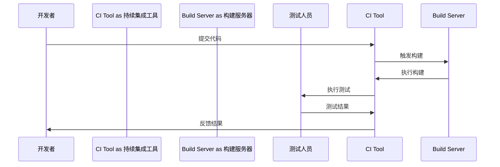
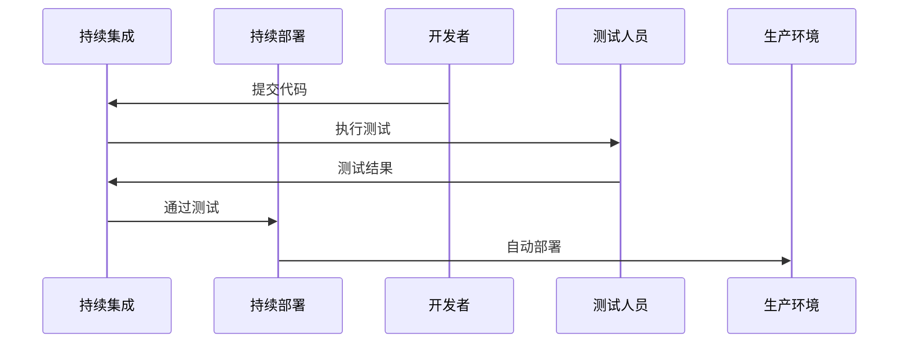
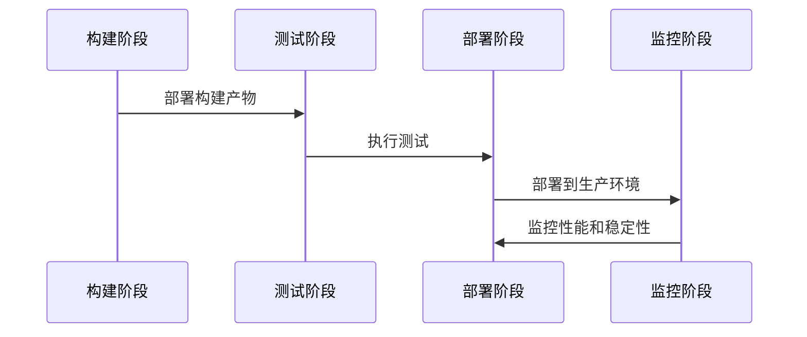
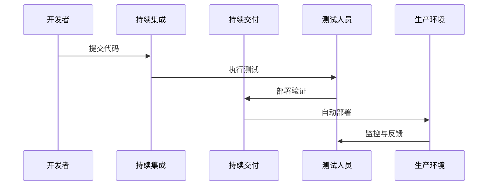
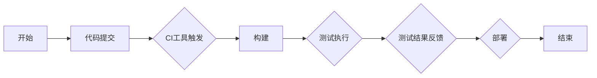
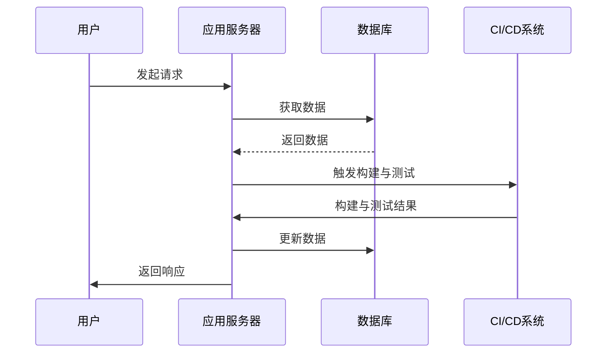

                 

### 第一部分：CI/CD基础概念

在当今快速变化的软件行业中，持续集成与持续部署（CI/CD）已经成为软件开发交付流程的重要组成部分。本文将逐步深入探讨CI/CD的基础概念、原理以及其在软件开发中的关键角色。我们将从定义、原理、优势、实践方法、项目案例等多个角度进行全面分析。

### 1.1 持续集成（CI）的原理与优势

#### 1.1.1 持续集成的定义

持续集成（Continuous Integration，简称CI）是一种软件开发实践，旨在通过频繁地将代码更改合并到共享的主干或主干分支中，确保代码库始终处于可构建和可运行状态。这种方法通过自动化构建、测试和反馈，提高了团队的开发效率和质量。

**定义：**
持续集成是一种软件开发方法论，通过自动化构建和测试，确保每次代码提交都是可运行的，从而快速识别和修复集成过程中出现的问题。

**核心目标：**
1. 快速发现并解决问题。
2. 减少集成风险。
3. 提高代码质量。
4. 增强团队协作。

#### 1.1.2 持续集成与传统开发模式的比较

**传统开发模式：**
1. 集成通常发生在项目接近尾声。
2. 集成过程可能涉及大量的手动操作。
3. 问题发现通常在项目后期，导致修复成本高。
4. 长期积累的技术债务可能导致项目难以维护。

**持续集成（CI）的优势：**
1. **频繁集成：** 通过自动化工具频繁将代码合并到主干，确保问题早发现、早解决。
2. **快速反馈：** 自动化测试和构建提供快速反馈，使开发者能够迅速了解代码更改的影响。
3. **提高质量：** 持续集成有助于识别和修复缺陷，提高代码质量。
4. **减少技术债务：** 定期集成有助于保持代码库的整洁和可维护性。

#### 1.1.3 持续集成的工作流程

持续集成的工作流程通常包括以下步骤：

1. **提交代码：** 开发者将代码提交到代码库。
2. **触发构建：** 自动化工具检测到提交，并触发构建过程。
3. **构建过程：** 自动构建项目，执行预定义的测试。
4. **测试执行：** 构建完成后，执行一系列自动化测试，包括单元测试、集成测试等。
5. **反馈：** 构建和测试结果通过报告或通知反馈给开发者。
6. **部署：** 如果构建和测试通过，代码可以部署到生产环境或预生产环境。

**持续集成的工作流程图：**



通过这一步步分析，我们可以看到持续集成是如何在软件开发中发挥作用的。下一节，我们将深入探讨持续部署（CD）的概念、原理和优势。

---

### 1.2 持续部署（CD）的概念与重要性

#### 1.2.1 持续部署的定义

持续部署（Continuous Deployment，简称CD）是一种自动化流程，旨在确保软件在通过所有测试后自动且安全地部署到生产环境。与持续集成（CI）不同，持续部署专注于将代码更改部署到生产环境，而持续集成则关注于构建和测试。

**定义：**
持续部署是一种自动化流程，通过自动化工具确保软件在通过所有测试后自动部署到生产环境。

**核心目标：**
1. **自动化部署：** 通过自动化流程减少手动干预，提高部署速度。
2. **减少风险：** 通过测试和部署管道中的每一步验证代码，降低部署风险。
3. **快速迭代：** 自动化部署允许团队更快地发布新功能和改进，保持市场竞争力。

#### 1.2.2 持续部署与持续集成的关系

持续集成（CI）和持续部署（CD）是软件交付流程的两个重要环节，它们紧密相连，共同推动软件从开发到生产的过程。

**关系概述：**
1. **CI前置CD：** 持续集成是持续部署的前置条件，只有通过持续集成的测试，代码才能被部署。
2. **集成反馈：** 持续集成的测试和反馈提供了对代码质量的重要洞察，为持续部署提供了可靠的数据支持。
3. **协同工作：** CI和CD协同工作，形成一个闭环，确保代码从开发到生产的过程无缝衔接。

**持续集成与持续部署的关系图：**



通过上述关系图，我们可以清晰地看到持续集成和持续部署是如何相互关联并共同作用的。接下来，我们将深入探讨持续部署的目标和优势。

#### 1.2.3 持续部署的目标和优势

**持续部署的目标：**
1. **自动化：** 通过自动化流程减少人工干预，提高部署效率。
2. **可靠性：** 通过测试确保代码质量和部署可靠性。
3. **快速迭代：** 允许团队更快地发布新功能，加速产品迭代。
4. **风险管理：** 通过持续测试和部署，降低部署过程中的风险。

**持续部署的优势：**
1. **加快发布速度：** 自动化部署减少了手动操作的时间，使团队能够更快地发布新版本。
2. **提高质量：** 持续部署通过测试确保代码的质量，减少了错误和缺陷的风险。
3. **减少风险：** 通过持续测试和监控，可以快速识别和解决部署过程中的问题，降低风险。
4. **增强团队协作：** 持续集成和持续部署的自动化流程促进了团队之间的协作，提高了沟通效率。

**优势表格：**

| 目标 | 优势 |
| --- | --- |
| 自动化 | 加快发布速度 |
| 可靠性 | 提高质量 |
| 快速迭代 | 减少风险 |
| 风险管理 | 增强团队协作 |

通过上述分析，我们可以看到持续部署在软件开发中的重要性。它不仅提高了团队的效率和代码质量，还降低了部署过程中的风险。在下一节中，我们将进一步探讨CI/CD在软件开发中的核心角色。

---

### 1.3 CI/CD在软件开发中的核心角色

持续集成与持续部署（CI/CD）在软件开发中扮演着至关重要的角色。它们不仅改变了软件开发的模式，还深刻影响了软件交付的效率和质量。以下是CI/CD在软件开发中的三大核心角色：

#### 1.3.1 提高开发效率

**提高开发效率：** 持续集成和持续部署通过自动化和标准化流程，极大地提高了开发效率。以下是其具体表现：

1. **频繁的代码集成：** 通过持续集成，团队可以频繁地将代码合并到主干，及时发现和解决问题，避免了长期积累的技术债务。
2. **自动化测试：** 持续集成自动化执行一系列测试，确保每次提交的代码都是高质量的，减少了手动测试的工作量。
3. **快速反馈：** 自动化测试和构建提供快速反馈，使开发者能够迅速了解代码更改的影响，及时进行调整。

**示例：**
假设一个开发团队使用传统的开发模式，一个新功能从开发到发布可能需要一个月的时间。而通过持续集成和持续部署，这个周期可以缩短到几天甚至几个小时。这不仅提高了开发效率，还增强了团队的工作满意度。

#### 1.3.2 确保软件质量

**确保软件质量：** 持续集成和持续部署通过严格的测试和验证流程，确保软件的质量和稳定性。以下是其具体表现：

1. **自动化测试：** 持续集成自动化执行单元测试、集成测试、性能测试等，覆盖了代码的各个方面，确保每次提交的代码都是可运行的。
2. **持续监控：** 持续部署过程中的监控和报警机制，可以及时发现和解决部署过程中出现的问题，确保生产环境中的软件始终处于健康状态。
3. **代码审查：** 持续集成流程通常包含代码审查环节，确保代码的可读性和可维护性，减少潜在的错误和漏洞。

**示例：**
在一个没有持续集成和持续部署的团队中，一个简单的bug可能需要数天甚至数周才能被发现和修复。而通过持续集成和持续部署，这个周期可以缩短到数小时，甚至可以在提交代码的瞬间就识别出问题。

#### 1.3.3 减少风险和成本

**减少风险和成本：** 持续集成和持续部署通过自动化和标准化流程，显著降低了软件开发的成本和风险。以下是其具体表现：

1. **减少人工干预：** 自动化部署减少了手动操作的机会，降低了人为错误的风险。
2. **快速修复：** 通过持续集成和持续部署，团队能够快速识别和修复问题，减少了故障对业务的影响。
3. **成本节约：** 持续集成和持续部署减少了重复的工作量，提高了资源的利用率，从而降低了开发成本。

**示例：**
在一个没有持续集成和持续部署的团队中，一个新功能的发布可能需要数周的时间，并且在发布前需要大量的手工测试和验证。而通过持续集成和持续部署，这个周期可以缩短到几天，并且在发布前已经完成了全面的自动化测试，显著降低了风险和成本。

**总结：**
持续集成和持续部署在软件开发中发挥着不可替代的作用。它们不仅提高了开发效率、确保了软件质量，还减少了风险和成本。随着软件行业的发展，CI/CD已经成为现代软件开发交付流程的基石。

在下一节中，我们将深入探讨CI/CD实践方法，了解如何在实际项目中实现CI/CD。

---

### 1.4 持续集成与持续部署的现状与发展趋势

随着技术的不断进步和软件行业对效率、质量和安全性的要求日益提高，持续集成与持续部署（CI/CD）已经从一种新兴的软件开发实践逐渐成为主流。当前，CI/CD在软件开发中的重要性不言而喻，其应用范围也在不断扩大。以下是对CI/CD现状与发展趋势的简要分析。

#### 现状分析

**1. 广泛应用：**
CI/CD已经广泛应用于各种规模和类型的软件项目。无论是初创公司、中小企业还是大型企业，都开始重视并采用CI/CD实践，以提高开发效率和质量。

**2. 工具成熟：**
随着CI/CD的普及，市场上出现了大量的CI/CD工具，如Jenkins、Travis CI、GitLab CI等。这些工具提供了丰富的功能，支持自动化构建、测试、部署等过程，极大地简化了CI/CD的实施。

**3. 敏捷开发与CI/CD的融合：**
敏捷开发与CI/CD的结合已成为一种趋势。敏捷开发的核心理念强调快速迭代和持续交付，而CI/CD则提供了实现这一目标的技术手段。许多团队在敏捷开发过程中采用CI/CD，实现了更加高效和灵活的软件开发。

**4. 云原生与CI/CD：**
随着云原生技术的发展，CI/CD也在云环境中得到了广泛应用。云原生架构的弹性、可扩展性和灵活性使得CI/CD更加高效和可靠，进一步推动了CI/CD在云计算环境中的应用。

#### 发展趋势

**1. 自动化与智能化：**
未来的CI/CD将更加自动化和智能化。随着人工智能和机器学习技术的应用，CI/CD工具将能够根据项目的历史数据自动调整构建和部署策略，提高流程的效率和可靠性。

**2. 微服务架构与CI/CD：**
微服务架构的普及将推动CI/CD的发展。微服务架构使得软件系统更加模块化和分布式，CI/CD可以在更细粒度的服务层面上实现自动化和标准化，提高系统的可维护性和扩展性。

**3. 安全性与合规性：**
随着安全问题和合规性的日益重要，CI/CD工具将更加注重安全性。未来，CI/CD工具将提供更加完善的 安全措施，如代码审计、漏洞扫描等，确保软件交付过程的安全和合规。

**4. 开源与商业化并进：**
开源工具和商业平台将继续并行发展。开源工具如Jenkins、GitLab CI等将继续占据重要地位，而商业平台如AWS CodePipeline、Azure DevOps等将提供更加集成和专业的解决方案。

**5. 持续反馈与优化：**
持续反馈和优化将成为CI/CD的重要趋势。通过收集和分析CI/CD过程中的数据，团队可以不断优化流程，提高开发效率和软件质量。

**总结：**
持续集成与持续部署（CI/CD）已经成为现代软件开发不可或缺的一部分。随着技术的进步和应用场景的扩展，CI/CD将继续发展，为软件开发带来更多的好处。了解CI/CD的现状和发展趋势，对于软件开发团队来说具有重要意义。

在下一部分，我们将深入探讨CI/CD的具体实践方法，帮助您在实际项目中成功实施CI/CD。

---

### 第一部分总结

在本部分，我们深入探讨了持续集成（CI）与持续部署（CD）的基础概念、原理和优势。首先，我们详细介绍了持续集成的定义、原理以及与传统开发模式的区别，并通过一个工作流程图展示了其实现过程。接着，我们探讨了持续部署的概念、与持续集成的关系以及其目标和优势，并提供了相应的表格和关系图。最后，我们分析了CI/CD在软件开发中的核心角色，包括提高开发效率、确保软件质量和减少风险与成本。同时，我们还简要介绍了CI/CD的现状与发展趋势。

通过本部分的探讨，我们对CI/CD有了更深入的理解，为后续的实际应用和项目案例打下了坚实的基础。在下一部分，我们将详细探讨CI/CD的具体实践方法，帮助您在实际项目中成功实施CI/CD。

---

### 第二部分：CI/CD实践方法

在了解了CI/CD的基础概念和重要性之后，我们需要深入探讨如何在实际项目中实施CI/CD。这一部分将分为三个主要部分：CI/CD工具选择、持续集成实践和持续部署实践。通过这些实践方法，我们将帮助您在项目中有效实现CI/CD。

### 2.1 CI/CD工具选择

选择适合的工具是成功实施CI/CD的关键。市场上存在多种CI/CD工具，如Jenkins、GitLab CI、Travis CI等。以下是常见CI/CD工具的介绍、选择标准和实际案例分析。

#### 2.1.1 常见CI/CD工具介绍

**1. Jenkins**
- **特性：** 开源、插件丰富、支持多种语言和平台。
- **优势：** 灵活性高、社区支持好、可扩展性强。
- **应用场景：** 适用于大型项目和复杂工作流程。

**2. GitLab CI**
- **特性：** 内置于GitLab，易于集成，支持多种语言和平台。
- **优势：** 简便、快速部署、易于学习和使用。
- **应用场景：** 适用于中小型项目和GitLab用户。

**3. Travis CI**
- **特性：** 云服务、支持多种语言和平台、免费服务。
- **优势：** 简单易用、提供持续集成环境。
- **应用场景：** 适用于开源项目和初学者。

**4. Azure DevOps**
- **特性：** 微软官方平台、集成丰富的DevOps工具、支持多种语言和平台。
- **优势：** 强大的集成能力、可靠性和安全性高。
- **应用场景：** 适用于企业级项目和大型团队。

#### 2.1.2 工具选择标准

选择CI/CD工具时，应考虑以下标准：

1. **项目规模和复杂性：** 大型项目应选择灵活性高、功能丰富的工具，如Jenkins；中小型项目可以选择易于集成的工具，如GitLab CI。

2. **团队技能和熟悉度：** 考虑团队成员对工具的熟悉程度和技能水平。选择团队熟悉的工具可以减少学习成本和上手难度。

3. **成本和预算：** 考虑工具的成本和预算。开源工具如Jenkins和GitLab CI免费，但可能需要更多的配置和管理；商业平台如Azure DevOps提供更多高级功能，但费用较高。

4. **集成能力：** 考虑工具与其他DevOps工具（如Git、Docker、Kubernetes等）的集成能力，以确保CI/CD流程的无缝衔接。

5. **社区支持和文档：** 良好的社区支持和详细的文档可以提供帮助，解决实施过程中遇到的问题。

#### 2.1.3 实际案例分析

以下是一个实际案例，展示了如何选择并实施CI/CD工具：

**案例：** 一个初创公司开发一个移动应用，团队熟悉GitLab，并希望简化CI/CD流程。

**选择：** 最终选择了GitLab CI，因为其内置于GitLab，易于集成，且团队熟悉。

**实施过程：**
1. 在GitLab中创建一个`.gitlab-ci.yml`文件，定义构建和测试流程。
2. 配置GitLab CI/CD Runner，确保构建和测试环境。
3. 定期更新和优化CI/CD配置，以提高流程的效率和可靠性。

通过上述案例，我们可以看到选择合适的CI/CD工具并成功实施的关键步骤。在下一节，我们将深入探讨如何设计持续集成（CI）的构建流水线。

---

### 2.2 持续集成实践

持续集成（CI）是CI/CD流程的第一步，其核心目标是确保每次代码提交都是可构建和可运行的。本节将详细介绍如何设计构建流水线、自动化测试策略以及实现持续集成流程。

#### 2.2.1 构建流水线设计

构建流水线是CI流程的核心，它定义了从代码提交到构建、测试和部署的整个过程。以下是构建流水线设计的关键步骤：

1. **环境配置：**
   - 确定构建环境（如操作系统、语言运行时等）。
   - 安装必要的依赖和工具（如编译器、测试框架等）。

2. **构建步骤：**
   - 检出代码。
   - 编译代码。
   - 执行静态代码分析。
   - 生成构建文档。

3. **测试步骤：**
   - 执行单元测试。
   - 执行集成测试。
   - 执行性能测试。

4. **结果处理：**
   - 如果测试失败，则失败构建。
   - 如果测试通过，则成功构建。

5. **部署步骤：**
   - 将构建产物部署到预生产环境或生产环境。

**构建流水线示例（.gitlab-ci.yml）：**

```yaml
stages:
  - build
  - test
  - deploy

build:
  stage: build
  script:
    - echo "Building the application..."
    - ./build.sh
  artifacts:
    paths:
      - build/*.jar

test:
  stage: test
  script:
    - echo "Running tests..."
    - ./run-tests.sh
  when: on_success

deploy:
  stage: deploy
  script:
    - echo "Deploying to production..."
    - ./deploy.sh
  when: manual
```

#### 2.2.2 自动化测试策略

自动化测试是持续集成的重要组成部分，它确保每次代码提交都是高质量的。以下是自动化测试策略的关键点：

1. **单元测试：**
   - 编写单元测试来验证代码单元的功能。
   - 使用测试框架（如JUnit、pytest等）进行自动化执行。

2. **集成测试：**
   - 编写集成测试来验证模块间的交互。
   - 使用集成测试框架（如Selenium、Postman等）进行自动化执行。

3. **性能测试：**
   - 使用性能测试工具（如JMeter、Gatling等）进行负载测试。
   - 分析测试结果，优化代码性能。

4. **安全测试：**
   - 使用安全测试工具（如OWASP ZAP、Burp Suite等）进行安全漏洞扫描。

#### 2.2.3 持续集成流程实现

实现持续集成流程通常涉及以下步骤：

1. **代码管理：**
   - 使用版本控制系统（如Git）管理代码。
   - 配置代码仓库，确保团队成员可以方便地提交和合并代码。

2. **CI工具配置：**
   - 配置CI工具（如Jenkins、GitLab CI等），定义构建、测试和部署的步骤。
   - 配置测试环境和生产环境，确保流程的一致性。

3. **自动化脚本：**
   - 编写构建和测试的自动化脚本，确保流程的自动化和可重复性。
   - 使用CI工具的API或插件进行集成和管理。

4. **监控与反馈：**
   - 配置监控工具（如Prometheus、Grafana等），监控构建、测试和部署的状态。
   - 通过通知（如邮件、短信、Webhook等）及时反馈结果。

**实现示例（Jenkinsfile）：**

```groovy
pipeline {
    agent any
    stages {
        stage('Build') {
            steps {
                sh 'mvn clean install'
            }
        }
        stage('Test') {
            steps {
                sh 'mvn test'
            }
            post {
                success {
                    echo "Build and Test successful"
                }
                failure {
                    echo "Build or Test failed"
                }
            }
        }
        stage('Deploy') {
            steps {
                sh 'mvn deploy'
            }
        }
    }
}
```

通过上述步骤和示例，我们可以看到如何设计并实现持续集成流程。在下一节，我们将深入探讨如何设计和实现持续部署（CD）。

---

### 2.3 持续部署实践

持续部署（CD）是CI/CD流程的下一步，其主要目标是确保代码在经过测试后安全、可靠地部署到生产环境。本节将详细介绍如何设计部署流程、选择部署策略以及实现持续部署。

#### 2.3.1 部署流程设计

部署流程设计是持续部署的关键，它定义了从构建到生产环境部署的整个过程。以下是部署流程设计的关键步骤：

1. **构建阶段：**
   - 完成持续集成流程，生成可部署的构建产物（如JAR文件、容器镜像等）。

2. **测试阶段：**
   - 在预生产环境执行自动化测试，验证构建产物的功能和质量。
   - 如果测试通过，继续下一步；否则，回滚到上一个稳定版本。

3. **部署阶段：**
   - 将构建产物部署到生产环境。
   - 更新应用程序的配置和依赖。

4. **监控阶段：**
   - 部署后监控应用程序的性能和稳定性。
   - 如果出现异常，自动回滚或通知相关人员。

**部署流程图：**



#### 2.3.2 部署策略选择

部署策略的选择取决于应用程序的规模、复杂度和业务需求。以下是几种常见的部署策略：

1. **蓝绿部署：**
   - 在生产环境中同时运行两个相同版本的应用程序（蓝色和绿色）。
   - 新版本部署到绿色环境，并与蓝色环境进行流量切换。
   - 如果新版本出现故障，可以迅速回滚到蓝色版本。

2. **金丝雀部署：**
   - 在生产环境中部署新版本的一部分用户（如10%的用户）。
   - 观察新版本的性能和用户体验。
   - 如果新版本稳定，逐步增加用户比例；否则，回滚。

3. **滚动部署：**
   - 逐步更新生产环境中的应用程序实例。
   - 更新一个实例后，立即进行健康检查。
   - 如果实例失败，自动回滚到上一个稳定版本。

4. **重部署：**
   - 完全停止旧版本，部署新版本。
   - 这种方法简单但风险较高，适用于非核心或非关键业务。

**部署策略选择表格：**

| 部署策略 | 优点 | 缺点 | 适用场景 |
| --- | --- | --- | --- |
| 蓝绿部署 | 风险低、快速回滚 | 需要额外的资源 | 大型应用程序、高可用性需求 |
| 金丝雀部署 | 低风险、逐步推广 | 需要额外的监控和配置 | 中小型应用程序、逐步推广新功能 |
| 滚动部署 | 高效、逐步更新 | 需要额外的监控和配置 | 大型应用程序、高可用性需求 |
| 重部署 | 简单、快速 | 风险高、停机时间 | 非核心业务、低负载应用程序 |

#### 2.3.3 持续部署实战

以下是一个持续部署实战的示例，展示了如何在实际项目中实现持续部署：

**案例：** 一家电商公司在AWS上部署其应用程序，使用Kubernetes进行容器编排。

**部署流程：**
1. **构建阶段：**
   - 使用Jenkins构建应用程序，生成容器镜像。
   - 将镜像推送到AWS ECR（Elastic Container Registry）。

2. **测试阶段：**
   - 在AWS EKS（Elastic Kubernetes Service）上部署测试环境，执行自动化测试。
   - 如果测试通过，标记镜像为可部署。

3. **部署阶段：**
   - 使用Kubernetes的Rollout命令部署新版本。
   - 检查滚动部署的状态，确保应用程序逐步更新。

4. **监控阶段：**
   - 使用Prometheus和Grafana监控应用程序的性能和稳定性。
   - 如果出现异常，自动回滚到上一个稳定版本。

**示例命令：**

```bash
# 构建和推送容器镜像
./build.sh
aws ecr get-login-password --region us-east-1 | docker login --username AWS --password-stdin <your-ecr-repo-url>
docker build -t <your-ecr-repo-url>:latest .
docker tag <your-ecr-repo-url>:latest <your-ecr-repo-url>:latest-tag
docker push <your-ecr-repo-url>:latest
docker push <your-ecr-repo-url>:latest-tag

# 部署到EKS测试环境
kubectl apply -f k8s-test-deployment.yaml

# 执行测试
./test.sh

# 如果测试通过，部署到生产环境
kubectl apply -f k8s-production-deployment.yaml
```

通过上述步骤和示例，我们可以看到如何在实际项目中设计和实现持续部署。在下一节，我们将深入探讨持续交付（CD）的概念和实践。

---

### 2.4 持续交付（CD）实践

持续交付（Continuous Delivery，简称CD）是CI/CD流程的最后一环，其目标是确保任何版本的软件都可以快速、安全地交付到用户手中。持续交付与持续部署（CD）紧密相关，但CD更加关注于交付的完整性和自动化。本节将探讨持续交付的概念、实践方法以及与敏捷开发的融合。

#### 2.4.1 持续交付的概念与过程

**概念：**
持续交付是一种软件开发实践，通过自动化构建、测试和部署流程，确保每次代码提交都可以被立即部署到生产环境。其核心目标是实现软件交付的可靠性和快速性。

**过程：**
持续交付的过程通常包括以下步骤：

1. **自动化构建：**
   - 使用CI工具自动化构建应用程序。
   - 生成构建产物，如可执行文件、容器镜像等。

2. **自动化测试：**
   - 执行单元测试、集成测试、性能测试等。
   - 使用自动化测试工具确保构建产物的质量。

3. **部署验证：**
   - 将构建产物部署到测试环境或预生产环境。
   - 运行部署验证测试，确保部署过程成功。

4. **自动化部署：**
   - 将构建产物部署到生产环境。
   - 使用自动化工具确保部署过程的高效性和一致性。

5. **监控与反馈：**
   - 部署后监控应用程序的性能和稳定性。
   - 通过反馈机制及时识别和解决问题。

**持续交付流程图：**



#### 2.4.2 持续交付与敏捷开发的融合

持续交付与敏捷开发的理念高度契合。敏捷开发强调快速迭代和持续交付，而持续交付则为敏捷开发提供了实现这一目标的技术手段。以下是持续交付与敏捷开发的融合方式：

1. **快速迭代：**
   - 持续交付支持频繁的迭代，每次迭代都可以生成可部署的软件版本。
   - 团队可以快速响应市场需求，缩短产品从概念到市场的周期。

2. **持续反馈：**
   - 持续交付的自动化测试和监控提供了即时反馈，使团队能够迅速识别和解决问题。
   - 通过持续反馈，团队能够不断优化开发流程，提高软件质量。

3. **增量交付：**
   - 持续交付支持增量交付，每次迭代只交付部分功能或改进。
   - 这种方式减少了风险，提高了软件的可靠性和用户满意度。

4. **全员参与：**
   - 持续交付要求团队成员（包括开发、测试、运维等）共同参与，确保每个环节都得到充分关注。
   - 这种全员参与的文化有助于提高团队的协作效率和创新能力。

**融合示例：**
在一个敏捷开发团队中，持续交付实践确保每次迭代都可以生成可部署的版本。团队在每个迭代结束时进行回顾会议，分析持续交付过程中的问题，并提出改进措施。通过这种方式，团队能够持续优化开发流程，提高软件交付效率和质量。

#### 2.4.3 持续交付的实际应用

以下是一个实际应用案例，展示了如何在项目中实现持续交付：

**案例：** 一家金融科技公司开发一个在线交易平台，要求高可用性和快速迭代。

**实现过程：**
1. **环境配置：**
   - 在AWS上配置CI/CD环境，包括Jenkins、ECR、EKS等。
   - 确定开发、测试和生产环境的配置。

2. **自动化构建与测试：**
   - 使用Jenkins自动化构建应用程序，并执行单元测试、集成测试和性能测试。
   - 将测试结果实时反馈给开发人员，确保构建产物的质量。

3. **自动化部署：**
   - 使用Kubernetes的滚动部署策略，将构建产物部署到EKS集群。
   - 使用Prometheus和Grafana监控应用程序的性能和稳定性。

4. **部署验证与反馈：**
   - 在测试环境中验证部署过程，确保应用程序正常运行。
   - 通过Webhook将部署结果反馈给开发人员，确保每次部署都是成功的。

**示例命令：**

```bash
# 构建应用程序
./build.sh

# 执行测试
./run-tests.sh

# 部署到EKS集群
kubectl apply -f k8s-deployment.yaml

# 监控应用程序
prometheus.yml
grafana.yml
```

通过上述案例，我们可以看到如何在实际项目中实现持续交付。持续交付不仅提高了开发效率和质量，还增强了团队的协作和创新能力。

在下一节，我们将通过具体项目案例进一步探讨CI/CD的实际应用。

---

### 第二部分总结

在本部分，我们详细探讨了持续集成（CI）与持续部署（CD）的具体实践方法。首先，我们介绍了CI/CD工具的选择标准，分析了常见CI/CD工具的特性与应用场景，并通过实际案例展示了工具配置与实施过程。接着，我们深入讨论了持续集成实践，包括构建流水线设计、自动化测试策略和CI流程实现。随后，我们探讨了持续部署实践，介绍了部署流程设计、部署策略选择以及实际部署实战。最后，我们介绍了持续交付（CD）的概念、实践方法以及与敏捷开发的融合。

通过本部分的探讨，我们对CI/CD的实际应用有了更深入的理解，掌握了如何在项目中成功实施CI/CD。这些实践方法不仅提高了开发效率和质量，还减少了风险和成本。在下一部分，我们将通过具体项目案例进一步展示CI/CD的实际应用效果。

---

### 第三部分：CI/CD项目案例

在了解了CI/CD的基础概念和实践方法之后，通过具体项目案例的探讨，我们可以更直观地理解CI/CD在实际应用中的效果和挑战。以下是三个不同行业的CI/CD项目案例，包括电商平台、金融行业和物联网平台的实践经验和成果总结。

#### 3.1 案例一：电商平台的CI/CD实践

**项目背景：**
某知名电商平台在业务快速发展的过程中，面临着持续交付效率低下和软件质量不稳定的问题。为了提高开发效率、确保软件质量和减少运维成本，该平台决定实施CI/CD。

**CI/CD流程设计与实现：**
1. **持续集成（CI）：**
   - 使用Jenkins作为CI工具，配置自动化构建和测试流程。
   - 每次代码提交都会触发Jenkins构建，并执行单元测试、集成测试和性能测试。
   - 构建成功后，将构建产物推送到Docker Hub。

2. **持续部署（CD）：**
   - 使用Kubernetes进行容器编排，确保部署流程的自动化和可重复性。
   - 实施蓝绿部署策略，确保新版本的平稳过渡。
   - 使用Prometheus和Grafana进行监控，实时反馈系统性能和稳定性。

**项目成果与经验总结：**
1. **提高交付效率：** 通过CI/CD，每次新功能发布的时间从原来的两周缩短到两天，显著提高了开发效率。
2. **提高软件质量：** 自动化测试和持续反馈机制确保了软件质量，减少了缺陷和故障率。
3. **降低运维成本：** 自动化部署和监控减少了运维人员的工作量，降低了运维成本。
4. **经验总结：**
   - CI/CD工具和平台的选择需要根据项目需求和团队技能进行。
   - 确保自动化测试覆盖全面的场景，减少潜在的风险。
   - 监控和反馈机制是持续优化CI/CD流程的关键。

#### 3.2 案例二：金融行业的CI/CD实践

**项目背景：**
某金融公司在进行系统升级和功能扩展时，面临着高安全性和合规性的要求，同时需要保证系统的高可用性和稳定性。为了在确保安全性和合规性的同时提高开发效率，该公司决定实施CI/CD。

**CI/CD流程设计与实现：**
1. **持续集成（CI）：**
   - 使用GitLab CI作为CI工具，配置自动化构建和测试流程。
   - 构建过程中包括静态代码分析、安全漏洞扫描和自动化测试。
   - 通过GitLab CI的Webhook与Jenkins集成，执行更复杂的测试和部署任务。

2. **持续部署（CD）：**
   - 使用Kubernetes和AWS Elastic Beanstalk进行容器化和应用部署。
   - 实施金丝雀部署策略，逐步扩大新版本的用户群体。
   - 使用AWS CloudWatch进行监控和报警，确保系统稳定运行。

**项目成果与经验总结：**
1. **提高开发效率：** 通过CI/CD，开发团队能够更快地交付新功能和改进，缩短了开发周期。
2. **确保安全性和合规性：** 自动化测试和安全扫描确保了代码质量和合规性，降低了安全风险。
3. **提高系统稳定性：** 金丝雀部署策略和实时监控确保了新版本的平稳上线。
4. **经验总结：**
   - 在金融行业，合规性和安全性是实施CI/CD的关键考虑因素。
   - 选择合适的CI/CD工具和平台，确保与现有的安全框架和合规要求兼容。
   - 持续优化CI/CD流程，确保其在高安全性和高可用性环境中的稳定运行。

#### 3.3 案例三：物联网平台的CI/CD实践

**项目背景：**
某物联网公司开发了一个智能家居平台，需要在快速迭代的同时确保设备的可靠性和系统的稳定性。为了提高开发效率、确保软件质量和减少运维成本，该公司决定实施CI/CD。

**CI/CD流程设计与实现：**
1. **持续集成（CI）：**
   - 使用GitLab CI作为CI工具，配置自动化构建和测试流程。
   - 构建过程中包括固件编译、硬件测试和软件集成测试。
   - 利用Docker和Kubernetes实现跨平台构建和测试。

2. **持续部署（CD）：**
   - 使用Docker进行容器化，确保部署的一致性和可重复性。
   - 使用Ansible和Terraform进行基础设施自动化部署。
   - 实施滚动部署策略，逐步更新设备。

**项目成果与经验总结：**
1. **提高开发效率：** 通过CI/CD，开发团队能够更快地交付新功能和改进，缩短了开发周期。
2. **确保软件质量：** 自动化测试和持续反馈机制确保了软件质量，减少了缺陷和故障率。
3. **降低运维成本：** 自动化部署和监控减少了运维人员的工作量，降低了运维成本。
4. **经验总结：**
   - 物联网平台需要处理大量的设备数据，CI/CD流程的设计要考虑设备兼容性和数据传输的稳定性。
   - 确保自动化测试覆盖硬件和软件的各个方面，确保系统的整体稳定性。
   - 持续优化CI/CD流程，以适应快速变化的技术和市场需求。

通过以上三个案例，我们可以看到CI/CD在不同行业中的应用效果和挑战。无论是在电商平台、金融行业还是物联网平台，CI/CD都极大地提高了开发效率、确保了软件质量和降低了运维成本。在下一部分，我们将探讨CI/CD的未来发展展望。

---

### 第三部分总结

在本部分，我们通过三个实际项目案例深入探讨了持续集成与持续部署（CI/CD）在不同行业中的应用效果和经验总结。首先，我们展示了电商平台的CI/CD实践，通过自动化构建、测试和部署流程，显著提高了交付效率和软件质量。其次，我们探讨了金融行业的CI/CD实践，强调了在确保安全性和合规性的同时，提高开发效率的重要性。最后，我们介绍了物联网平台的CI/CD实践，展示了如何在快速迭代的同时确保系统的稳定性和可靠性。

通过这些案例，我们可以看到CI/CD在提升开发效率、确保软件质量和降低运维成本方面的巨大优势。同时，每个案例也分享了实施过程中的关键经验和挑战，为其他行业提供了宝贵的参考。

在下一部分，我们将探讨CI/CD的未来发展展望，包括新兴技术的应用、工具与平台的发展趋势以及未来面临的挑战和机遇。

---

### 第四部分：CI/CD未来发展展望

随着软件行业的快速发展，持续集成与持续部署（CI/CD）将继续演变和扩展，以适应新的技术和市场需求。本部分将探讨CI/CD在新兴技术中的应用、工具与平台的发展趋势以及未来面临的挑战和机遇。

#### 4.1 CI/CD在新兴技术中的应用

**1. 区块链与CI/CD**

区块链技术的去中心化和不可篡改性为软件开发带来了新的挑战和机遇。CI/CD在区块链开发中的应用主要集中在确保智能合约和区块链应用的稳定性和安全性。

- **智能合约的持续集成：** 智能合约的开发需要严格的测试和验证，持续集成可以帮助自动化测试和部署智能合约，确保其在区块链上的执行无误。
- **去中心化部署：** 区块链的分布式特性要求CI/CD流程更加灵活和自动化，以确保在多个节点上的部署一致性。

**2. 物联网与CI/CD**

物联网（IoT）设备的多样性和数量庞大为软件开发和部署带来了巨大挑战。CI/CD在IoT中的应用旨在确保设备的软件更新和系统升级的可靠性和高效性。

- **自动化测试：** CI/CD可以自动化测试物联网设备的固件和应用程序，确保其在各种环境下的兼容性和稳定性。
- **设备更新管理：** 通过CI/CD，可以实现自动化部署和远程升级，提高物联网系统的可靠性和用户体验。

**3. AI与CI/CD**

人工智能（AI）和机器学习（ML）的应用日益广泛，但AI模型的开发和部署也面临着诸多挑战。CI/CD在AI领域的应用主要集中在模型训练、验证和部署的自动化。

- **模型集成：** CI/CD可以帮助自动化AI模型的集成和测试，确保其在生产环境中的性能和准确性。
- **持续学习：** CI/CD流程可以集成AI模型的学习和更新，确保模型能够适应新的数据和需求。

#### 4.2 CI/CD工具与平台发展趋势

**1. 开源工具的崛起**

开源CI/CD工具如Jenkins、GitLab CI等将继续受到欢迎，因为它们提供了丰富的功能和灵活的配置。以下是一些发展趋势：

- **社区支持：** 开源社区将提供更多的插件和解决方案，帮助用户解决特定问题。
- **企业友好：** 开源工具将继续增加对企业用户的支持，包括更好的安全性和合规性。

**2. 商业平台的演变**

商业CI/CD平台如AWS CodePipeline、Azure DevOps等将不断提升其功能，以适应更复杂和多样化的需求。以下是一些发展趋势：

- **集成能力：** 商业平台将继续集成更多的DevOps工具和服务，提供一站式解决方案。
- **云原生支持：** 随着云原生技术的发展，商业平台将更加注重在云环境中的集成和优化。

**3. CI/CD生态系统的扩展**

CI/CD生态系统将继续扩展，包括新的工具、服务和平台。以下是一些趋势：

- **自动化测试：** 自动化测试将更加智能化，利用AI和机器学习技术优化测试流程。
- **云原生架构：** 云原生架构的普及将推动CI/CD工具和平台在容器化、微服务等方面的创新。

#### 4.3 CI/CD的未来挑战与机遇

**1. 安全性与合规性**

随着CI/CD流程的自动化程度不断提高，安全性和合规性将成为重要挑战。以下是一些关键点：

- **安全措施加强：** CI/CD工具将增加更多安全功能，如代码审计、漏洞扫描等。
- **合规性需求：** 企业需要确保CI/CD流程符合相关法规和标准，如GDPR、ISO 27001等。

**2. 自动化与智能化**

自动化和智能化是CI/CD未来的发展方向。以下是一些机遇：

- **自动化流水线：** 更加自动化的CI/CD流水线将减少人工干预，提高效率。
- **智能化决策：** 利用AI和机器学习技术，CI/CD工具可以更智能地优化流程，减少错误和风险。

**3. 持续反馈与优化**

持续反馈和优化将帮助团队不断改进CI/CD流程。以下是一些关键点：

- **实时监控：** 实时监控CI/CD流程，及时发现和解决问题。
- **持续优化：** 通过收集和分析数据，团队可以持续优化流程，提高质量和效率。

**总结：**
CI/CD的未来充满机遇和挑战。通过不断优化和创新，CI/CD将更好地满足软件行业的需求，推动软件开发和交付的进步。了解并把握这些趋势，将帮助企业和团队在CI/CD的浪潮中保持竞争优势。

在下一部分，我们将进行全文总结，回顾CI/CD的关键概念和最佳实践，并展望未来的发展趋势。

---

### 全文总结

在本篇文章中，我们系统地探讨了持续集成（CI）与持续部署（CD）在现代软件交付流程中的核心作用。通过详细分析CI/CD的基础概念、原理、优势、实践方法以及具体项目案例，我们展示了如何将CI/CD有效应用于电商、金融和物联网等不同行业，以提高开发效率、确保软件质量、降低运维成本。

**核心概念与联系：**

- **持续集成（CI）：** 通过频繁提交代码并自动化构建、测试，确保代码库始终处于可运行状态。
- **持续部署（CD）：** 通过自动化流程将经过测试的代码安全、可靠地部署到生产环境。
- **CI/CD的关系：** 持续集成是持续部署的前置条件，两者协同工作，形成一个闭环，推动软件交付的自动化和标准化。

**最佳实践 Tips：**

1. **工具选择：** 根据项目规模和团队技能选择合适的CI/CD工具，确保工具与现有架构兼容。
2. **自动化测试：** 构建强大的自动化测试套件，确保每次代码提交都是高质量的。
3. **部署策略：** 选择适合业务需求的部署策略，如蓝绿部署或金丝雀部署，以降低风险。
4. **持续反馈：** 利用实时监控和反馈机制，快速识别和解决问题，持续优化流程。
5. **安全性与合规性：** 加强CI/CD过程中的安全措施，确保代码和数据的保护。

**未来展望：**

- **新兴技术应用：** 区块链、物联网和AI等新兴技术将进一步推动CI/CD的发展，带来新的挑战和机遇。
- **工具与平台发展趋势：** 开源工具将持续崛起，商业平台将提供更多集成和专业的解决方案。
- **自动化与智能化：** CI/CD将朝着更自动化的方向演进，利用AI和机器学习技术优化流程。

通过本文的探讨，我们希望读者能够对CI/CD有更深入的理解，掌握其实践方法，并将其成功应用于实际项目中。持续集成与持续部署不仅是提高软件开发效率和质量的重要手段，也是现代软件开发团队保持竞争力的关键。

---

### 附录

为了帮助读者更好地理解本文中的核心概念和算法原理，以下是一些附录内容，包括ER实体关系图、算法流程图、数学公式以及系统架构设计等内容。

#### 附录一：核心概念ER实体关系图

```mermaid
erDiagram
    CI ||--o{ CD : "持续集成驱动持续部署"
    CodeBase ||--|{ BuildPipeline : "代码库驱动构建流水线"
    BuildPipeline ||--| TestPipeline : "构建流水线驱动测试流水线"
    TestPipeline ||--| DeploymentPipeline : "测试流水线驱动部署流水线"
    DeploymentPipeline ||--| ProductionEnvironment : "部署流水线驱动生产环境"
```

#### 附录二：算法流程图



#### 附录三：数学公式

1. **构建效率公式：**
   $$ E = \frac{N}{T} $$
   其中，$E$ 表示构建效率，$N$ 表示构建次数，$T$ 表示构建时间。

2. **测试覆盖率公式：**
   $$ C = \frac{TC}{TC + TD} \times 100\% $$
   其中，$C$ 表示测试覆盖率，$TC$ 表示代码覆盖率，$TD$ 表示文档覆盖率。

#### 附录四：系统架构设计



通过这些附录内容，我们希望能够为读者提供更直观、更全面的理解，以便更好地掌握持续集成与持续部署的核心知识和实践方法。

### 参考文献

1. **Jenkins：** https://www.jenkins.io/
2. **GitLab CI：** https://docs.gitlab.com/ee/ci/
3. **AWS CodePipeline：** https://aws.amazon.com/codepipeline/
4. **Azure DevOps：** https://dev.to/azure/devops
5. **区块链与持续集成：** https://www.infoq.com/articles/blockchain-continuous-integration/
6. **物联网与持续集成：** https://www.iotforall.com/iot-continuous-integration/
7. **人工智能与持续集成：** https://www.datascience.com/community/tutorials/continuous-integration-ai

### 作者信息

**作者：AI天才研究院/AI Genius Institute & 禅与计算机程序设计艺术 /Zen And The Art of Computer Programming**

