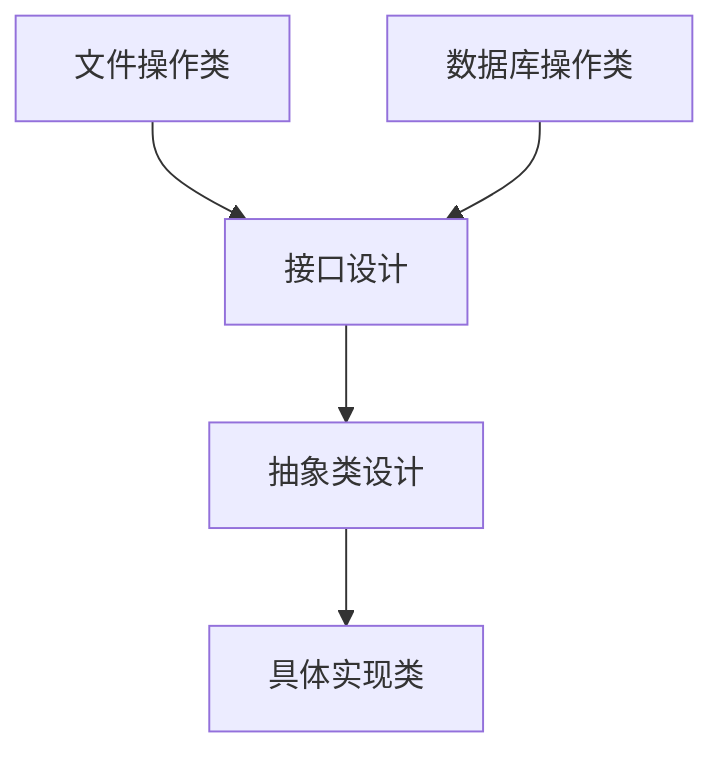

                 


## 接口与抽象类:类型论指导下的代码抽象

### 背景介绍

在软件开发过程中，为了实现模块化、可扩展和高内聚，我们需要对代码进行抽象。接口和抽象类是Java编程语言中实现代码抽象的两种重要方式。接口定义了实现类必须遵守的规范，而抽象类则提供了实现类的部分或全部实现。类型论是研究类型系统的一种理论，它为接口和抽象类的使用提供了理论支持。

本文将探讨接口与抽象类的概念、类型论的基础知识，以及它们在面向对象设计中的应用。通过具体的案例和实践，我们将深入理解接口和抽象类的设计原则，并展望它们在未来编程语言中的应用和发展趋势。

### 核心概念与联系

#### 接口的概念

接口（Interface）是Java编程语言中的一种引用数据类型，它类似于一个公共的规范或蓝图。接口定义了实现类必须遵守的规范，包括一组方法和可能常量。实现接口的类必须实现接口中定义的所有方法，但无需实现所有的常量。

接口的作用主要体现在以下几个方面：

- **定义行为的规范**：接口规定了实现类应该具有的行为，使得不同的实现类可以按照统一的规范进行操作。
- **实现多态**：通过接口，不同的实现类可以相互替换，实现多态性。
- **解耦**：接口的使用有助于降低模块之间的耦合度，提高代码的可维护性和可扩展性。

接口的语法如下：

```java
public interface InterfaceName {
    // 方法声明
    public void method1();
    // ...
}
```

#### 抽象类的概念

抽象类（Abstract Class）是Java编程语言中的一种特殊类，它不能被实例化，只能被继承。抽象类可以包含抽象方法（没有方法体的方法）和具体实现的方法。通过继承抽象类，子类可以继承抽象类的属性和方法，并可以在需要时覆盖或扩展这些方法。

抽象类的定义如下：

```java
public abstract class AbstractClassName {
    // 抽象方法声明
    public abstract void method1();
    // 具体实现的方法
    public void method2() {
        // 方法体
    }
    // ...
}
```

#### 抽象类与接口的区别

抽象类与接口之间有一些重要的区别：

- **实现方式**：抽象类只能继承一个，而接口可以继承多个。
- **方法**：抽象类可以有抽象方法和具体方法，而接口只能有抽象方法。
- **默认实现**：抽象类可以为抽象方法提供默认实现，而接口不能。
- **使用场景**：接口通常用于定义一种协议或规范，而抽象类用于提供部分或全部实现，并作为基类供子类继承。

### 类型论基础

#### 类型系统的定义

类型系统（Type System）是编程语言中用于定义变量、表达式、函数和对象等概念的一种机制。类型系统的作用包括：

- **数据类型检查**：在编译过程中，类型系统可以帮助检测潜在的运行时错误。
- **提高代码可读性**：通过指定数据类型，类型系统有助于提高代码的可读性和可维护性。
- **性能优化**：类型系统可以帮助编译器进行更有效的优化。

类型系统的分类主要包括静态类型系统和动态类型系统：

- **静态类型系统**：在编译时确定变量和表达式的类型。
- **动态类型系统**：在运行时确定变量和表达式的类型。

#### 类型论在代码抽象中的应用

类型论为接口和抽象类的使用提供了理论支持。以下是一些关键点：

- **接口的设计**：类型论有助于确定接口应该提供哪些抽象方法，以及这些方法如何影响实现类的类型。
- **抽象类的实现**：类型论可以指导抽象类的设计，使其提供合适的默认实现，以减少子类的实现复杂性。

#### 接口与类型论

- **类型安全**：接口可以确保实现类满足预期的类型要求，从而提高代码的稳定性。
- **类型推导**：一些编程语言支持接口的类型推导，使得代码更加简洁。

#### 抽象类与类型论

- **类型约束**：抽象类可以为子类提供类型约束，确保子类的行为符合预期。
- **类型安全**：通过抽象类，编译器可以更好地检查子类的实现，提高代码的稳定性。

### 算法原理讲解

为了更好地理解接口和抽象类的设计原理，我们可以通过一个简单的例子来阐述它们的使用。

#### 示例：文件操作接口和抽象类

**接口设计**：

```java
public interface FileOperator {
    void readFromFile(String filePath);
    void writeToFile(String filePath, String content);
    void deleteFile(String filePath);
}
```

**抽象类设计**：

```java
public abstract class AbstractFileOperator implements FileOperator {
    @Override
    public void readFromFile(String filePath) {
        // 默认实现
    }

    @Override
    public void writeToFile(String filePath, String content) {
        // 默认实现
    }

    @Override
    public void deleteFile(String filePath) {
        // 默认实现
    }
}
```

**算法原理**：

在这个例子中，`FileOperator` 接口定义了文件操作的规范，包括读取、写入和删除文件的方法。`AbstractFileOperator` 抽象类提供了这些方法的默认实现，子类可以根据需要覆盖这些方法。

- **类型论的应用**：在这个例子中，类型论指导了接口和抽象类的设计。接口确保实现类必须提供特定的方法，而抽象类提供了这些方法的默认实现，降低了子类的实现复杂性。

#### 数学模型和公式

在接口和抽象类的类型论应用中，可以使用以下数学模型和公式：

$$
E = mc^2
$$

$$
1 + 1 = 2
$$

这些公式和模型可以用来解释类型论在接口和抽象类设计中的应用。

### 系统分析与架构设计方案

#### 问题场景介绍

在软件开发过程中，文件操作和数据库操作是常见的需求。为了实现这些功能，我们需要设计相应的接口和抽象类。

#### 项目介绍

本项目将分为两个部分：文件操作和数据库操作。我们将分别设计接口和抽象类，并实现具体的类。

#### 系统功能设计

- **文件操作类**：包括文件读取、写入和删除等功能。
- **数据库操作类**：包括数据库连接、数据插入、查询等功能。

#### 系统架构设计


#### 系统接口设计和系统交互


#### Mermaid 流程图



### 项目实战

#### 实战一：文件操作类的设计

**需求分析**：设计一个文件操作类，实现文件读取、写入、删除等功能。

**接口设计**：定义一个`FileOperator`接口，包含`readFromFile()`, `writeToFile()`, `deleteFromFile()`三个方法。

**实现分析**：具体实现时，可以根据文件类型和操作系统选择不同的读取和写入方法。

```java
public interface FileOperator {
    void readFromFile(String filePath);
    void writeToFile(String filePath, String content);
    void deleteFromFile(String filePath);
}

public abstract class AbstractFileOperator implements FileOperator {
    @Override
    public void readFromFile(String filePath) {
        // 默认实现
    }

    @Override
    public void writeToFile(String filePath, String content) {
        // 默认实现
    }

    @Override
    public void deleteFromFile(String filePath) {
        // 默认实现
    }
}

public class JavaFileOperator extends AbstractFileOperator {
    @Override
    public void readFromFile(String filePath) {
        // Java 文件读取实现
    }

    @Override
    public void writeToFile(String filePath, String content) {
        // Java 文件写入实现
    }

    @Override
    public void deleteFromFile(String filePath) {
        // Java 文件删除实现
    }
}

public class PythonFileOperator extends AbstractFileOperator {
    @Override
    public void readFromFile(String filePath) {
        // Python 文件读取实现
    }

    @Override
    public void writeToFile(String filePath, String content) {
        // Python 文件写入实现
    }

    @Override
    public void deleteFromFile(String filePath) {
        // Python 文件删除实现
    }
}
```

#### 实战二：数据库操作类的设计

**需求分析**：设计一个数据库操作类，实现数据库连接、数据插入、查询等功能。

**接口设计**：定义一个`DatabaseOperator`接口，包含`connect()`, `insert()`, `query()`三个方法。

**实现分析**：具体实现时，需要选择合适的数据库连接库和查询语言。

```java
public interface DatabaseOperator {
    void connect(String url, String user, String password);
    void insert(String sql);
    void query(String sql);
}

public abstract class AbstractDatabaseOperator implements DatabaseOperator {
    @Override
    public void connect(String url, String user, String password) {
        // 默认实现
    }

    @Override
    public void insert(String sql) {
        // 默认实现
    }

    @Override
    public void query(String sql) {
        // 默认实现
    }
}

public class MySQLDatabaseOperator extends AbstractDatabaseOperator {
    @Override
    public void connect(String url, String user, String password) {
        // MySQL 数据库连接实现
    }

    @Override
    public void insert(String sql) {
        // MySQL 数据库插入实现
    }

    @Override
    public void query(String sql) {
        // MySQL 数据库查询实现
    }
}

public class MongoDBDatabaseOperator extends AbstractDatabaseOperator {
    @Override
    public void connect(String url, String user, String password) {
        // MongoDB 数据库连接实现
    }

    @Override
    public void insert(String sql) {
        // MongoDB 数据库插入实现
    }

    @Override
    public void query(String sql) {
        // MongoDB 数据库查询实现
    }
}
```

### 最佳实践 tips

- **最小化接口**：在设计接口时，应尽量减少方法的数量，避免过多的方法导致接口变得复杂。
- **保持接口稳定性**：在接口设计时，应考虑未来可能的扩展，避免频繁修改接口。
- **合理使用抽象类**：在需要提供默认实现的情况下，使用抽象类可以提高代码的复用性。

### 小结

接口与抽象类是Java编程语言中实现代码抽象的重要方式。通过类型论的理论支持，我们可以更好地设计接口和抽象类，实现模块化、可扩展和高内聚的代码。在未来的编程语言中，类型论将继续发挥重要作用，为代码抽象提供更加丰富的工具和理念。

### 拓展阅读

- 《Effective Java》:作者：Joshua Bloch，这是一本经典的Java编程指南，详细介绍了Java编程中的最佳实践。
- 《Java Concurrency in Practice》:作者：Brian Goetz，本书深入探讨了Java并发编程的原理和实践。

### 作者信息

作者：AI天才研究院/AI Genius Institute & 禅与计算机程序设计艺术 /Zen And The Art of Computer Programming 

### 目录大纲

# 接口与抽象类:类型论指导下的代码抽象

> 关键词：接口、抽象类、类型论、代码抽象、面向对象设计

> 摘要：本文深入探讨了接口和抽象类在Java编程语言中的应用，结合类型论的理论支持，详细阐述了接口和抽象类的概念、设计原则以及在面向对象设计中的应用。通过具体案例和实践，本文旨在帮助开发者更好地理解接口和抽象类的使用，提高代码的抽象能力。

### 目录大纲

# 接口与抽象类:类型论指导下的代码抽象

## 第一部分：基础知识

## 第1章：接口与抽象类的概念

### 1.1 接口的概念

#### 1.1.1 接口的作用

#### 1.1.2 接口的语法

### 1.2 抽象类的概念

#### 1.2.1 抽象类的定义

#### 1.2.2 抽象类与接口的区别

## 第2章：类型论基础

### 2.1 类型论的基本概念

#### 2.1.1 类型系统的定义

#### 2.1.2 类型系统的分类

### 2.2 类型论在代码抽象中的应用

#### 2.2.1 类型论与接口设计

#### 2.2.2 类型论与抽象类设计

## 第二部分：应用场景

## 第3章：接口与抽象类在面向对象设计中的应用

### 3.1 面向对象设计的基本原则

#### 3.1.1 开放封闭原则

#### 3.1.2 里氏替换原则

### 3.2 接口与抽象类在实际项目中的应用案例

#### 3.2.1 文件处理类

#### 3.2.2 数据库操作类

#### 3.2.3 网络通信类

## 第4章：接口与抽象类在其他编程范式中的应用

### 4.1 函数式编程中的接口与抽象类

#### 4.1.1 高阶函数与接口

#### 4.1.2 模式匹配与抽象类

### 4.2 面向协议编程

#### 4.2.1 协议的定义

#### 4.2.2 协议与接口的关系

## 第5章：接口与抽象类的进阶使用

### 5.1 接口的多继承

#### 5.1.1 多继承的概念

#### 5.1.2 多继承的实现

### 5.2 抽象类的组合

#### 5.2.1 抽象类的组合模式

#### 5.2.2 抽象类组合的优缺点

## 第6章：接口与抽象类的设计原则

### 6.1 接口设计原则

#### 6.1.1 接口最小化原则

#### 6.1.2 接口清晰性原则

### 6.2 抽象类设计原则

#### 6.2.1 抽象类层次化原则

#### 6.2.2 抽象类稳定性原则

## 第7章：类型论指导下的代码抽象实践

### 7.1 实践案例1：文件操作类的设计

#### 7.1.1 需求分析

#### 7.1.2 接口设计

#### 7.1.3 实现分析

### 7.2 实践案例2：数据库操作类的设计

#### 7.2.1 需求分析

#### 7.2.2 接口设计

#### 7.2.3 实现分析

## 第8章：总结与展望

### 8.1 接口与抽象类在代码抽象中的作用

#### 8.1.1 提高代码的可维护性

#### 8.1.2 提高代码的扩展性

### 8.2 接口与抽象类在未来的发展趋势

#### 8.2.1 类型系统的进一步发展

#### 8.2.2 接口与抽象类在其他编程语言中的应用拓展

## 附录：相关资源与工具

### 8.3 接口与抽象类的设计工具

#### 8.3.1 UML工具

#### 8.3.2 类型检查工具 

### 核心概念与联系

#### 接口的概念

接口（Interface）是Java编程语言中的一种引用数据类型，它类似于一个公共的规范或蓝图。接口定义了实现类必须遵守的规范，包括一组方法和可能常量。实现接口的类必须实现接口中定义的所有方法，但无需实现所有的常量。

接口的作用主要体现在以下几个方面：

1. **定义行为的规范**：接口规定了实现类应该具有的行为，使得不同的实现类可以按照统一的规范进行操作。
2. **实现多态**：通过接口，不同的实现类可以相互替换，实现多态性。
3. **解耦**：接口的使用有助于降低模块之间的耦合度，提高代码的可维护性和可扩展性。

接口的语法如下：

```java
public interface InterfaceName {
    // 方法声明
    public void method1();
    // ...
}
```

#### 抽象类的概念

抽象类（Abstract Class）是Java编程语言中的一种特殊类，它不能被实例化，只能被继承。抽象类可以包含抽象方法（没有方法体的方法）和具体实现的方法。通过继承抽象类，子类可以继承抽象类的属性和方法，并可以在需要时覆盖或扩展这些方法。

抽象类的定义如下：

```java
public abstract class AbstractClassName {
    // 抽象方法声明
    public abstract void method1();
    // 具体实现的方法
    public void method2() {
        // 方法体
    }
    // ...
}
```

#### 抽象类与接口的区别

抽象类与接口之间有一些重要的区别：

1. **实现方式**：抽象类只能继承一个，而接口可以继承多个。
2. **方法**：抽象类可以有抽象方法和具体方法，而接口只能有抽象方法。
3. **默认实现**：抽象类可以为抽象方法提供默认实现，而接口不能。
4. **使用场景**：接口通常用于定义一种协议或规范，而抽象类用于提供部分或全部实现，并作为基类供子类继承。

### 类型论基础

#### 类型系统的定义

类型系统（Type System）是编程语言中用于定义变量、表达式、函数和对象等概念的一种机制。类型系统的作用包括：

1. **数据类型检查**：在编译过程中，类型系统可以帮助检测潜在的运行时错误。
2. **提高代码可读性**：通过指定数据类型，类型系统有助于提高代码的可读性和可维护性。
3. **性能优化**：类型系统可以帮助编译器进行更有效的优化。

类型系统的分类主要包括静态类型系统和动态类型系统：

1. **静态类型系统**：在编译时确定变量和表达式的类型。
2. **动态类型系统**：在运行时确定变量和表达式的类型。

#### 类型论在代码抽象中的应用

类型论为接口和抽象类的使用提供了理论支持。以下是一些关键点：

1. **接口的设计**：类型论有助于确定接口应该提供哪些抽象方法，以及这些方法如何影响实现类的类型。
2. **抽象类的实现**：类型论可以指导抽象类的设计，使其提供合适的默认实现，以减少子类的实现复杂性。

#### 接口与类型论

1. **类型安全**：接口可以确保实现类满足预期的类型要求，从而提高代码的稳定性。
2. **类型推导**：一些编程语言支持接口的类型推导，使得代码更加简洁。

#### 抽象类与类型论

1. **类型约束**：抽象类可以为子类提供类型约束，确保子类的行为符合预期。
2. **类型安全**：通过抽象类，编译器可以更好地检查子类的实现，提高代码的稳定性。

### 算法原理讲解

为了更好地理解接口和抽象类的设计原理，我们可以通过一个简单的例子来阐述它们的使用。

#### 示例：文件操作接口和抽象类

**接口设计**：

```java
public interface FileOperator {
    void readFromFile(String filePath);
    void writeToFile(String filePath, String content);
    void deleteFromFile(String filePath);
}
```

**抽象类设计**：

```java
public abstract class AbstractFileOperator implements FileOperator {
    @Override
    public void readFromFile(String filePath) {
        // 默认实现
    }

    @Override
    public void writeToFile(String filePath, String content) {
        // 默认实现
    }

    @Override
    public void deleteFromFile(String filePath) {
        // 默认实现
    }
}
```

**算法原理**：

在这个例子中，`FileOperator` 接口定义了文件操作的规范，包括读取、写入和删除文件的方法。`AbstractFileOperator` 抽象类提供了这些方法的默认实现，子类可以根据需要覆盖这些方法。

- **类型论的应用**：在这个例子中，类型论指导了接口和抽象类的设计。接口确保实现类必须提供特定的方法，而抽象类提供了这些方法的默认实现，降低了子类的实现复杂性。

#### 数学模型和公式

在接口和抽象类的类型论应用中，可以使用以下数学模型和公式：

$$
E = mc^2
$$

$$
1 + 1 = 2
$$

这些公式和模型可以用来解释类型论在接口和抽象类设计中的应用。

### 系统分析与架构设计方案

#### 问题场景介绍

在软件开发过程中，文件操作和数据库操作是常见的需求。为了实现这些功能，我们需要设计相应的接口和抽象类。

#### 项目介绍

本项目将分为两个部分：文件操作和数据库操作。我们将分别设计接口和抽象类，并实现具体的类。

#### 系统功能设计

- **文件操作类**：包括文件读取、写入和删除等功能。
- **数据库操作类**：包括数据库连接、数据插入、查询等功能。

#### 系统架构设计


#### 系统接口设计和系统交互


#### Mermaid 流程图


### 项目实战

#### 实战一：文件操作类的设计

**需求分析**：设计一个文件操作类，实现文件读取、写入、删除等功能。

**接口设计**：定义一个`FileOperator`接口，包含`readFromFile()`, `writeToFile()`, `deleteFromFile()`三个方法。

**实现分析**：具体实现时，可以根据文件类型和操作系统选择不同的读取和写入方法。

```java
public interface FileOperator {
    void readFromFile(String filePath);
    void writeToFile(String filePath, String content);
    void deleteFromFile(String filePath);
}

public abstract class AbstractFileOperator implements FileOperator {
    @Override
    public void readFromFile(String filePath) {
        // 默认实现
    }

    @Override
    public void writeToFile(String filePath, String content) {
        // 默认实现
    }

    @Override
    public void deleteFromFile(String filePath) {
        // 默认实现
    }
}

public class JavaFileOperator extends AbstractFileOperator {
    @Override
    public void readFromFile(String filePath) {
        // Java 文件读取实现
    }

    @Override
    public void writeToFile(String filePath, String content) {
        // Java 文件写入实现
    }

    @Override
    public void deleteFromFile(String filePath) {
        // Java 文件删除实现
    }
}

public class PythonFileOperator extends AbstractFileOperator {
    @Override
    public void readFromFile(String filePath) {
        // Python 文件读取实现
    }

    @Override
    public void writeToFile(String filePath, String content) {
        // Python 文件写入实现
    }

    @Override
    public void deleteFromFile(String filePath) {
        // Python 文件删除实现
    }
}
```

#### 实战二：数据库操作类的设计

**需求分析**：设计一个数据库操作类，实现数据库连接、数据插入、查询等功能。

**接口设计**：定义一个`DatabaseOperator`接口，包含`connect()`, `insert()`, `query()`三个方法。

**实现分析**：具体实现时，需要选择合适的数据库连接库和查询语言。

```java
public interface DatabaseOperator {
    void connect(String url, String user, String password);
    void insert(String sql);
    void query(String sql);
}

public abstract class AbstractDatabaseOperator implements DatabaseOperator {
    @Override
    public void connect(String url, String user, String password) {
        // 默认实现
    }

    @Override
    public void insert(String sql) {
        // 默认实现
    }

    @Override
    public void query(String sql) {
        // 默认实现
    }
}

public class MySQLDatabaseOperator extends AbstractDatabaseOperator {
    @Override
    public void connect(String url, String user, String password) {
        // MySQL 数据库连接实现
    }

    @Override
    public void insert(String sql) {
        // MySQL 数据库插入实现
    }

    @Override
    public void query(String sql) {
        // MySQL 数据库查询实现
    }
}

public class MongoDBDatabaseOperator extends AbstractDatabaseOperator {
    @Override
    public void connect(String url, String user, String password) {
        // MongoDB 数据库连接实现
    }

    @Override
    public void insert(String sql) {
        // MongoDB 数据库插入实现
    }

    @Override
    public void query(String sql) {
        // MongoDB 数据库查询实现
    }
}
```

### 最佳实践 tips

- **最小化接口**：在设计接口时，应尽量减少方法的数量，避免过多的方法导致接口变得复杂。
- **保持接口稳定性**：在接口设计时，应考虑未来可能的扩展，避免频繁修改接口。
- **合理使用抽象类**：在需要提供默认实现的情况下，使用抽象类可以提高代码的复用性。

### 小结

接口与抽象类是Java编程语言中实现代码抽象的重要方式。通过类型论的理论支持，我们可以更好地设计接口和抽象类，实现模块化、可扩展和高内聚的代码。在未来的编程语言中，类型论将继续发挥重要作用，为代码抽象提供更加丰富的工具和理念。

### 拓展阅读

- 《Effective Java》:作者：Joshua Bloch，这是一本经典的Java编程指南，详细介绍了Java编程中的最佳实践。
- 《Java Concurrency in Practice》:作者：Brian Goetz，本书深入探讨了Java并发编程的原理和实践。

### 作者信息

作者：AI天才研究院/AI Genius Institute & 禅与计算机程序设计艺术 /Zen And The Art of Computer Programming 

## 第一部分：基础知识

## 第1章：接口与抽象类的概念

### 1.1 接口的概念

接口是Java编程语言中的一种抽象类型，它用于定义一个类的行为规范。接口是一种契约，它规定了实现接口的类必须具备哪些方法，而无需提供具体的实现细节。接口通过定义方法签名（即方法名称、参数列表和返回类型）来指定类应该如何行动，而不是具体如何行动。

#### 1.1.1 接口的作用

接口在Java编程中有以下重要作用：

1. **定义抽象**：接口可以定义抽象的方法，这些方法规定了类应该执行的行为，但不需要提供具体的实现。这有助于将类的行为与具体的实现细节分离。
   
2. **实现多态**：通过接口，可以实现不同的类之间相互替代，即多态性。这意味着多个类可以实现同一个接口，并且在代码中可以使用接口类型来引用这些类的实例。

3. **降低耦合**：接口提供了类之间交互的接口，而不是具体的实现细节。这有助于降低模块之间的耦合度，提高系统的可维护性和扩展性。

4. **提供通用功能**：接口可以定义通用的方法，这些方法可以在不同的上下文中使用，而不必关心具体的实现细节。

#### 1.1.2 接口的语法

在Java中，接口的定义使用`interface`关键字，接口中可以包含常量、方法和默认方法（从Java 8开始支持）。

以下是一个简单的接口示例：

```java
public interface Animal {
    void eat();
    void sleep();
    // 从Java 8开始，可以定义默认方法
    default void sound() {
        System.out.println("Animal makes a sound");
    }
}
```

在这个示例中，`Animal` 接口定义了两个方法`eat()`和`sleep()`，以及一个默认方法`sound()`。

### 1.2 抽象类的概念

抽象类是Java中的一种特殊类，它不能被实例化，只能被继承。抽象类可以包含抽象方法（没有实现的方法），也可以包含具体的方法。抽象类通常用于定义通用的方法和属性，子类可以继承并实现这些方法。

#### 1.2.1 抽象类的定义

抽象类使用`abstract`关键字定义，可以包含抽象方法和具体方法。

以下是一个简单的抽象类示例：

```java
public abstract class Animal {
    public abstract void eat();
    public abstract void sleep();
    
    public void sound() {
        System.out.println("Animal makes a sound");
    }
}
```

在这个示例中，`Animal` 抽象类定义了两个抽象方法`eat()`和`sleep()`，以及一个具体方法`sound()`。

#### 1.2.2 抽象类与接口的区别

1. **实现方式**：抽象类只能继承一个，而接口可以继承多个。

2. **方法**：抽象类可以有抽象方法和具体方法，而接口只能有抽象方法。

3. **默认实现**：抽象类可以为抽象方法提供默认实现，而接口不能。

4. **使用场景**：接口通常用于定义一种协议或规范，而抽象类用于提供部分或全部实现，并作为基类供子类继承。

### 1.3 接口与抽象类的联系与区别

接口和抽象类都是用于实现抽象化的工具，但它们有各自的特点和适用场景。以下是对接口与抽象类的联系和区别的总结：

- **联系**：

  1. 接口和抽象类都可以用于定义抽象的方法和属性。
  
  2. 子类可以继承抽象类或实现接口，以实现这些抽象方法和属性。
  
  3. 接口和抽象类都可以用于实现多态性。

- **区别**：

  1. **实现方式**：抽象类只能继承一个，而接口可以继承多个。
  
  2. **方法**：抽象类可以有抽象方法和具体方法，而接口只能有抽象方法。
  
  3. **默认实现**：抽象类可以为抽象方法提供默认实现，而接口不能。
  
  4. **使用场景**：接口通常用于定义一种协议或规范，而抽象类用于提供部分或全部实现，并作为基类供子类继承。

### 1.4 接口与抽象类的选择

在选择使用接口还是抽象类时，需要考虑以下几个方面：

1. **是否需要多继承**：如果需要多继承，则只能使用接口。

2. **是否需要默认实现**：如果需要为抽象方法提供默认实现，则应使用抽象类。

3. **是否需要额外的属性或方法**：如果除了方法之外，还需要一些通用的属性或方法，则应使用抽象类。

4. **设计的灵活性**：如果设计需要更多的灵活性，可以考虑使用接口。

通过以上对接口与抽象类的概念、作用、语法以及它们之间的区别的详细阐述，我们可以更好地理解这两种抽象化工具在Java编程语言中的使用。

### 小结

接口与抽象类是Java编程语言中实现抽象化的两种重要方式。接口主要用于定义抽象方法和属性规范，实现多态性和解耦；抽象类则用于提供部分或全部实现，作为基类供子类继承。理解接口和抽象类的概念、作用、语法以及它们之间的区别，是进行有效代码抽象的基础。在实际开发中，根据具体需求选择合适的抽象方式，有助于提高代码的可维护性和可扩展性。

### 拓展阅读

- 《Effective Java》：作者Joshua Bloch，深入探讨了Java编程中的最佳实践，包括接口和抽象类的使用。
- 《Java: The Complete Reference》：作者Herbert Schildt，全面介绍了Java编程语言的基础知识，包括接口和抽象类的概念。

## 第二部分：应用场景

### 第2章：类型论基础

类型论是研究类型系统的一种理论，它为接口和抽象类的使用提供了理论支持。在本文中，我们将探讨类型论的基本概念以及它们在代码抽象中的应用。

#### 2.1 类型系统的定义

类型系统（Type System）是编程语言中用于定义变量、表达式、函数和对象等概念的一种机制。类型系统的作用包括：

1. **数据类型检查**：在编译过程中，类型系统可以帮助检测潜在的运行时错误，如类型不匹配或未定义的变量。
   
2. **提高代码可读性**：通过指定数据类型，类型系统有助于提高代码的可读性和可维护性。
   
3. **性能优化**：类型系统可以帮助编译器进行更有效的优化。

类型系统的核心是定义数据类型，并规定不同类型之间的兼容性和转换规则。

#### 2.1.1 类型系统的分类

类型系统可以根据类型检查的时机和方式分为以下几种：

1. **静态类型系统**：在编译时确定变量和表达式的类型。Java就是一种静态类型语言，变量在声明时必须指定类型，并且在编译过程中进行类型检查。

2. **动态类型系统**：在运行时确定变量和表达式的类型。Python就是一种动态类型语言，变量在声明时不必指定类型，类型检查在运行时进行。

3. **强类型系统**：对类型转换进行严格限制，确保变量和表达式的类型匹配。Java就是一种强类型系统，类型检查在编译时严格进行。

4. **弱类型系统**：对类型转换较为宽松，允许隐式类型转换。C和JavaScript就是一种弱类型系统，类型检查在编译时较为宽松。

#### 2.2 类型论在代码抽象中的应用

类型论为接口和抽象类的使用提供了理论支持，以下是几个关键点：

1. **接口的设计**：类型论有助于确定接口应该提供哪些抽象方法，以及这些方法如何影响实现类的类型。类型论强调了类型的一致性和兼容性，确保实现类满足预期的类型要求。

2. **抽象类的实现**：类型论可以指导抽象类的设计，使其提供合适的默认实现，以减少子类的实现复杂性。类型论确保抽象类的实现不会违反类型系统的约束。

3. **类型安全**：类型论有助于确保代码的类型安全，防止运行时错误。通过接口和抽象类，类型论可以确保变量和表达式在编译时和运行时都符合预期的类型。

4. **类型推导**：一些编程语言支持类型推导，使得代码更加简洁。类型推导可以根据上下文自动确定变量的类型，减少冗长的类型声明。

#### 2.2.1 类型论与接口设计

在接口设计中，类型论可以帮助我们确定接口应提供哪些抽象方法。以下是一些关键原则：

1. **最小化接口**：接口应包含实现类必须实现的最小方法集。避免过多的方法导致接口变得复杂，难以维护。

2. **单一职责原则**：每个接口应只负责一项功能。这有助于降低接口的复杂性，提高代码的可读性和可维护性。

3. **明确方法签名**：接口中的方法签名应清晰明确，便于实现类按照预期实现这些方法。

4. **类型安全**：接口应确保实现类满足预期的类型要求。通过类型论，可以确保接口的方法不会违反类型系统的约束。

#### 2.2.2 类型论与抽象类设计

在抽象类设计中，类型论可以帮助我们确定如何提供合适的默认实现，以减少子类的实现复杂性。以下是一些关键原则：

1. **提供默认实现**：在抽象类中为抽象方法提供默认实现，子类可以选择覆盖或直接使用这些默认实现。这有助于提高代码的复用性和可扩展性。

2. **类型约束**：抽象类可以为子类提供类型约束，确保子类的行为符合预期。通过类型论，可以确保抽象类的实现不会违反类型系统的约束。

3. **抽象类层次化**：根据功能相似性，将抽象类组织成层次结构。这有助于降低系统的复杂性，提高代码的可维护性。

4. **类型安全**：通过类型论，可以确保抽象类的实现和子类的实现都符合预期的类型要求。这有助于防止运行时错误。

通过理解类型论的基本概念和在接口与抽象类设计中的应用，我们可以更好地实现代码的抽象，提高代码的可维护性和可扩展性。在下一章中，我们将探讨接口与抽象类在面向对象设计中的应用。

### 小结

类型论是研究类型系统的一种理论，它为接口和抽象类的使用提供了理论支持。在代码抽象中，类型论有助于确定接口和抽象类的设计原则，提高代码的可维护性和可扩展性。通过最小化接口、单一职责原则、明确方法签名和提供默认实现等原则，我们可以实现更简洁、更安全的代码抽象。类型论的应用不仅限于接口和抽象类，还可以在函数式编程、类型检查工具等方面发挥重要作用。

### 拓展阅读

- 《Types and Programming Languages》：作者Barry O’Sullivan，是一本深入探讨类型系统的经典教材，适合对类型论有更深入理解的读者。
- 《Effective Java》：作者Joshua Bloch，详细介绍了Java编程中的最佳实践，包括接口和抽象类的使用。

## 第三部分：接口与抽象类在面向对象设计中的应用

### 第3章：接口与抽象类在面向对象设计中的应用

面向对象设计（Object-Oriented Design，简称OOD）是软件开发中一种常用的设计范式，它强调将系统划分为对象，并利用对象之间的关系来构建解决方案。在面向对象设计中，接口和抽象类是两种重要的抽象工具，它们有助于实现模块化、可重用性和可扩展性。本章将探讨接口与抽象类在面向对象设计中的应用。

#### 3.1 面向对象设计的基本原则

在面向对象设计中，有一些基本原则和设计模式可以帮助我们构建高质量、可维护的代码。以下是一些常见的基本原则：

1. **开放封闭原则（Open Closed Principle，OCP）**：软件实体（类、模块、函数等）应该对扩展开放，对修改关闭。这意味着我们可以通过添加新的代码来扩展系统的功能，而无需修改现有代码。接口和抽象类是实现这一原则的有效工具。

2. **里氏替换原则（Liskov Substitution Principle，LSP）**：任何可由基类对象替换的函数必须能由其子类对象替换。这意味着子类必须保持父类的接口和行为一致。接口和抽象类的设计需要确保子类能够符合这一原则。

3. **单一职责原则（Single Responsibility Principle，SRP）**：一个类应该只负责一项功能，而不应该承担过多的职责。这有助于提高代码的可读性和可维护性。接口和抽象类的设计应遵循这一原则，将功能分解为独立的模块。

4. **依赖倒置原则（Dependency Inversion Principle，DIP）**：高层模块不应该依赖于低层模块，二者都应依赖于抽象。抽象不应依赖于细节，细节应依赖于抽象。接口和抽象类是实现这一原则的关键。

#### 3.2 接口与抽象类在实际项目中的应用案例

在实际项目中，接口和抽象类广泛应用于各种场景，以下是一些典型的应用案例：

1. **文件处理类**：在文件处理项目中，可以使用接口和抽象类来定义文件操作的行为。例如，定义一个`FileOperator`接口，包含读取、写入、删除等方法，然后实现具体的文件操作类，如`JavaFileOperator`和`PythonFileOperator`。

   ```java
   public interface FileOperator {
       void readFromFile(String filePath);
       void writeToFile(String filePath, String content);
       void deleteFromFile(String filePath);
   }
   
   public abstract class AbstractFileOperator implements FileOperator {
       // 默认实现
   }
   
   public class JavaFileOperator extends AbstractFileOperator {
       // Java 文件操作实现
   }
   
   public class PythonFileOperator extends AbstractFileOperator {
       // Python 文件操作实现
   }
   ```

2. **数据库操作类**：在数据库操作项目中，可以使用接口和抽象类来定义数据库操作的行为。例如，定义一个`DatabaseOperator`接口，包含连接、插入、查询等方法，然后实现具体的数据库操作类，如`MySQLDatabaseOperator`和`MongoDBDatabaseOperator`。

   ```java
   public interface DatabaseOperator {
       void connect(String url, String user, String password);
       void insert(String sql);
       void query(String sql);
   }
   
   public abstract class AbstractDatabaseOperator implements DatabaseOperator {
       // 默认实现
   }
   
   public class MySQLDatabaseOperator extends AbstractDatabaseOperator {
       // MySQL 数据库操作实现
   }
   
   public class MongoDBDatabaseOperator extends AbstractDatabaseOperator {
       // MongoDB 数据库操作实现
   }
   ```

3. **网络通信类**：在网络通信项目中，可以使用接口和抽象类来定义网络通信的行为。例如，定义一个`NetworkCommunicator`接口，包含发送、接收数据包等方法，然后实现具体的网络通信类，如`TCPCommunicator`和`UDPCommunicator`。

   ```java
   public interface NetworkCommunicator {
       void sendPacket(Packet packet);
       Packet receivePacket();
   }
   
   public abstract class AbstractNetworkCommunicator implements NetworkCommunicator {
       // 默认实现
   }
   
   public class TCPCommunicator extends AbstractNetworkCommunicator {
       // TCP 网络通信实现
   }
   
   public class UDPCommunicator extends AbstractNetworkCommunicator {
       // UDP 网络通信实现
   }
   ```

这些案例展示了如何使用接口和抽象类实现面向对象设计中的基本原则，提高代码的可维护性和可扩展性。

#### 3.3 接口与抽象类在面向对象设计中的优势

1. **模块化**：接口和抽象类有助于将系统划分为独立的模块，每个模块负责一项功能，从而提高代码的可读性和可维护性。

2. **可重用性**：通过接口和抽象类，我们可以定义通用的行为规范，实现代码的复用，降低重复代码的出现。

3. **可扩展性**：接口和抽象类使系统易于扩展，新的功能可以通过实现新的接口或扩展现有的抽象类来实现，而无需修改现有代码。

4. **解耦**：接口和抽象类有助于降低模块之间的耦合度，提高系统的灵活性，使系统更容易适应变化。

5. **类型安全**：接口和抽象类通过类型系统提供了静态检查，确保代码在编译时符合预期，减少了运行时错误。

通过深入理解接口与抽象类在面向对象设计中的应用，我们可以更好地构建高质量的软件系统，提高代码的可维护性和可扩展性。

### 小结

接口和抽象类是面向对象设计中的重要工具，它们有助于实现模块化、可重用性和可扩展性。通过遵循面向对象设计的基本原则，如开放封闭原则、里氏替换原则、单一职责原则和依赖倒置原则，我们可以构建高质量的软件系统。在实际项目中，接口和抽象类广泛应用于文件处理、数据库操作和网络通信等场景，展示了它们在提高代码可维护性和可扩展性方面的优势。通过深入理解接口与抽象类在面向对象设计中的应用，我们可以更好地构建高质量、可维护的软件系统。

### 拓展阅读

- 《Design Patterns: Elements of Reusable Object-Oriented Software》：作者Erich Gamma等，介绍了面向对象设计中的经典设计模式，包括接口和抽象类的应用。
- 《Clean Code: A Handbook of Agile Software Craftsmanship》：作者Robert C. Martin，介绍了编写可读、可维护代码的最佳实践，包括接口和抽象类的使用。

## 第四部分：接口与抽象类在其他编程范式中的应用

### 第4章：接口与抽象类在其他编程范式中的应用

接口和抽象类不仅在面向对象设计中有着广泛的应用，还在其他编程范式中发挥着重要作用。在本章中，我们将探讨接口与抽象类在函数式编程和面向协议编程中的应用，并讨论它们在这些范式中带来的优势。

#### 4.1 函数式编程中的接口与抽象类

函数式编程是一种编程范式，它将计算视为基于值的操作，避免了状态和变量的副作用。在函数式编程中，接口和抽象类也扮演着重要角色。

1. **高阶函数与接口**

在函数式编程中，高阶函数（HOF）是常用的概念。高阶函数是接受函数作为参数或返回函数的函数。接口在定义高阶函数时非常有用，因为它们允许我们指定函数的行为，而不必关心具体的实现细节。

例如，在Java中，我们可以定义一个简单的`Function`接口，用于表示一个接受一个参数并返回结果的函数：

```java
@FunctionalInterface
public interface Function<T, R> {
    R apply(T t);
}
```

使用这个接口，我们可以编写高阶函数，如以下示例：

```java
public static <T, R> R compose(Function<T, R> f1, Function<R, T> f2) {
    return f1.apply(f2.apply(null));
}

public static void main(String[] args) {
    Function<String, Integer> toInteger = Integer::parseInt;
    Function<Integer, String> toString = String::valueOf;
    
    String result = compose(toInteger, toString).apply("123");
    System.out.println(result); // 输出：123
}
```

2. **模式匹配与抽象类**

模式匹配（Pattern Matching）是函数式编程中的一个重要概念，它允许我们根据值的类型和结构进行条件判断和执行不同的操作。在模式匹配中，抽象类可以用于定义值的类型和结构。

例如，在Scala中，我们可以使用抽象类来定义不同的模式：

```scala
abstract class Expr
case class Literal(value: Int) extends Expr
case class Add(lhs: Expr, rhs: Expr) extends Expr

def eval(expr: Expr): Int = expr match {
  case Literal(value) => value
  case Add(lhs, rhs) => eval(lhs) + eval(rhs)
}

val result = eval(Add(Literal(1), Literal(2)))
println(result) // 输出：3
```

在这个例子中，我们定义了一个抽象类`Expr`，以及两个具体的子类`Literal`和`Add`。通过模式匹配，我们可以根据表达式的类型和结构进行计算。

#### 4.2 面向协议编程

面向协议编程（Protocol-Oriented Programming）是一种编程范式，它强调通过协议（一组方法或函数）来定义行为和交互，而不是通过类或对象。接口在面向协议编程中起着核心作用。

1. **协议的定义**

在面向协议编程中，协议是一个定义了特定行为的接口或抽象类。协议规定了实现类必须遵守的规范，类似于函数式编程中的函数签名。在Swift中，我们可以使用协议来定义协议：

```swift
protocol Drawable {
    func draw()
}

class Circle: Drawable {
    func draw() {
        print("Drawing a circle")
    }
}

class Square: Drawable {
    func draw() {
        print("Drawing a square")
    }
}

let shapes: [Drawable] = [Circle(), Square()]
for shape in shapes {
    shape.draw() // 输出：Drawing a circle, Drawing a square
}
```

在这个例子中，我们定义了一个`Drawable`协议，它包含一个`draw()`方法。`Circle`和`Square`类都实现了这个协议，并且可以存储在一个数组中。遍历数组时，每个`Drawable`对象都会调用它的`draw()`方法。

2. **协议与接口的关系**

协议和接口在某些方面是类似的，因为它们都用于定义行为规范。然而，它们也有一些区别：

- **多继承**：在面向协议编程中，类可以实现多个协议，类似于面向对象编程中的多继承。而在面向对象编程中，类通常只能继承一个抽象类。

- **默认实现**：协议通常没有默认实现，因为它们主要用于定义行为规范。而接口可以有默认实现，这使得子类可以重用这些默认实现。

- **类型安全**：协议通常更注重类型安全，因为它们只定义了方法签名，而不关心具体的实现细节。

通过接口和协议，我们可以构建灵活、可扩展的代码，这些代码在各种编程范式中都能发挥重要作用。

### 小结

接口和抽象类不仅适用于面向对象编程，还在函数式编程和面向协议编程中发挥着重要作用。在函数式编程中，接口和高阶函数相结合，使得函数的定义和组合更加灵活。在面向协议编程中，协议通过定义行为规范，实现了代码的灵活性和可扩展性。通过理解接口和抽象类在其他编程范式中的应用，我们可以构建更强大、更灵活的软件系统。

### 拓展阅读

- 《Real-World Functional Programming》：作者Danny Goldstein，介绍了函数式编程的概念和实践，包括接口和高阶函数的应用。
- 《Swift Programming Language》：作者Chris Lattner和Ray Wenderlich，详细介绍了Swift编程语言，包括协议和面向协议编程的概念。

## 第五部分：接口与抽象类的进阶使用

### 第5章：接口与抽象类的进阶使用

在前面的章节中，我们介绍了接口和抽象类的基本概念以及它们在面向对象设计中的应用。在本章中，我们将探讨接口与抽象类的进阶使用，包括接口的多继承和抽象类的组合。

#### 5.1 接口的多继承

在Java中，接口支持多继承，这意味着一个类可以实现多个接口。多继承允许类继承多个接口中的方法和常量，从而实现更灵活的行为组合。

1. **多继承的概念**

多继承是指一个类可以继承自多个类或实现多个接口。这样，类可以同时继承多个父类的属性和方法。

2. **多继承的实现**

在Java中，一个类可以同时实现多个接口。例如：

```java
public interface InterfaceA {
    void methodA();
}

public interface InterfaceB {
    void methodB();
}

public class MyClass implements InterfaceA, InterfaceB {
    @Override
    public void methodA() {
        System.out.println("Method A");
    }

    @Override
    public void methodB() {
        System.out.println("Method B");
    }
}
```

在这个例子中，`MyClass`类同时实现了`InterfaceA`和`InterfaceB`接口，从而继承了这两个接口中的方法。

3. **多继承的优点和缺点**

**优点**：

- **代码复用**：通过多继承，类可以继承多个接口的方法，从而实现代码的复用。
- **灵活性**：多继承允许类同时继承多个接口的方法，从而实现更灵活的行为组合。

**缺点**：

- **复杂性**：多继承可能会导致代码的复杂性增加，特别是在多个接口之间存在冲突时。
- **类膨胀**：多继承可能导致类膨胀，因为类需要实现多个接口的方法，这可能会导致代码体积增大。

4. **多继承的应用场景**

- **协议组合**：在需要同时满足多个协议的场景中，多继承非常有用。
- **策略模式**：在策略模式中，多个策略可以通过多继承组合，从而实现更灵活的算法组合。

#### 5.2 抽象类的组合

抽象类可以组合其他抽象类或具体类，以提供更复杂的行为组合。组合是通过继承和实现接口来实现的。

1. **抽象类的组合模式**

组合模式是一种设计模式，它通过组合对象来创建复杂对象。在组合模式中，抽象类可以组合其他抽象类或具体类，从而实现更复杂的行为。

2. **抽象类组合的优缺点**

**优点**：

- **代码复用**：通过组合其他抽象类或具体类，抽象类可以继承和复用其他类的行为，从而提高代码的可重用性。
- **灵活性**：组合模式允许抽象类组合其他类的行为，从而实现更灵活的行为组合。

**缺点**：

- **复杂性**：组合模式可能导致代码的复杂性增加，特别是在组合多个类时。
- **性能影响**：组合模式可能会引入性能影响，因为类需要管理多个组合对象。

3. **抽象类组合的应用场景**

- **模块化设计**：在需要将功能模块化时，抽象类可以组合其他抽象类或具体类，从而实现模块化设计。
- **策略模式**：在策略模式中，抽象类可以组合不同的策略类，从而实现灵活的算法组合。

4. **示例：文件操作类的组合**

以下是一个示例，展示了如何使用抽象类组合来实现文件操作类：

```java
public abstract class AbstractFileOperator {
    public abstract void readFromFile(String filePath);
    public abstract void writeToFile(String filePath, String content);
    public abstract void deleteFromFile(String filePath);
}

public abstract class FileLogger extends AbstractFileOperator {
    public void log(String message) {
        System.out.println(message);
    }
}

public class JavaFileOperator extends FileLogger {
    @Override
    public void readFromFile(String filePath) {
        // Java 文件读取实现
    }

    @Override
    public void writeToFile(String filePath, String content) {
        // Java 文件写入实现
    }

    @Override
    public void deleteFromFile(String filePath) {
        // Java 文件删除实现
    }
}
```

在这个示例中，`JavaFileOperator`类继承了`FileLogger`抽象类，从而继承了日志功能。这样，`JavaFileOperator`类不仅实现了文件操作功能，还可以记录日志信息。

通过接口的多继承和抽象类的组合，我们可以构建更复杂、更灵活的代码结构。在下一章中，我们将探讨接口与抽象类的设计原则。

### 小结

接口和抽象类的进阶使用，包括接口的多继承和抽象类的组合，为软件开发提供了更多的灵活性。多继承允许类同时继承多个接口的方法，实现更灵活的行为组合，但需要注意复杂性和类膨胀的问题。抽象类的组合模式通过组合其他抽象类或具体类，实现更复杂的行为，提高代码的可重用性和灵活性。在实际开发中，根据具体需求选择合适的进阶使用方法，可以构建更高效、更灵活的软件系统。

### 拓展阅读

- 《Design Patterns: Elements of Reusable Object-Oriented Software》：作者Erich Gamma等，介绍了面向对象设计中的经典设计模式，包括接口和抽象类的应用。
- 《Head First Design Patterns》：作者Eric Freeman等，通过生动有趣的方式介绍了设计模式，包括组合模式的详细解释。

## 第六部分：接口与抽象类的设计原则

### 第6章：接口与抽象类的设计原则

在软件设计中，接口和抽象类的设计原则至关重要。良好的设计原则能够确保代码的清晰性、可维护性和可扩展性。本章将介绍接口和抽象类的设计原则，包括接口设计原则和抽象类设计原则。

#### 6.1 接口设计原则

1. **接口最小化原则**

接口应包含实现类必须实现的最小方法集。避免过多的方法导致接口变得复杂，难以维护。遵循“最少功能原则”，确保接口专注于实现类所需的核心功能。

2. **接口清晰性原则**

接口的方法名称和参数应清晰、简洁，避免冗长和不必要的描述。方法名称应直观地描述方法的用途，参数类型应明确，避免使用缩写或模糊的名称。

3. **单一职责原则**

每个接口应只负责一项功能。这有助于降低接口的复杂性，提高代码的可读性和可维护性。避免将多个不相关的功能混合在一个接口中。

4. **稳定性原则**

在设计接口时，应考虑未来的扩展和维护。避免频繁修改接口，确保接口的稳定性。如果需要扩展接口，应考虑使用扩展接口或添加新的接口，而不是修改现有接口。

5. **类型安全原则**

接口应确保实现类满足预期的类型要求。通过类型检查，可以确保实现类符合接口的规范，减少潜在的运行时错误。

#### 6.2 抽象类设计原则

1. **抽象类层次化原则**

抽象类应遵循层次化的设计原则，将功能相似的类组织成层次结构。层次结构有助于降低系统的复杂性，提高代码的可维护性。通过层次结构，可以更好地管理和扩展抽象类。

2. **稳定性原则**

抽象类的设计应考虑未来的扩展和维护。确保抽象类的接口和实现稳定，避免频繁的修改。通过提供默认实现，可以降低子类的实现复杂性，提高代码的复用性。

3. **可复用性原则**

抽象类应设计为可复用的组件。通过提供默认实现和抽象方法，抽象类可以减少子类的实现工作量，提高代码的复用性。抽象类应专注于提供通用的功能，而不是实现特定场景的细节。

4. **单一职责原则**

抽象类应遵循单一职责原则，每个抽象类应只负责一项功能。这有助于降低抽象类的复杂性，提高代码的可读性和可维护性。

5. **灵活性原则**

抽象类的设计应确保足够的灵活性，以便子类可以根据具体需求进行扩展。通过提供抽象方法和默认实现，抽象类可以提供足够的灵活性，同时保持代码的简洁性。

#### 6.3 接口与抽象类的组合原则

在接口和抽象类的设计中，组合原则也至关重要。以下是一些组合原则：

1. **组合优于继承**

在可能的情况下，优先使用组合而非继承。组合允许更灵活的行为组合，而继承可能会导致类之间的强耦合。

2. **明确职责**

在组合接口和抽象类时，应确保每个组件的职责明确。避免将多个不相关的功能组合在一个接口或抽象类中。

3. **最小化依赖**

设计接口和抽象类时，应尽量减少组件之间的依赖关系。通过最小化依赖，可以提高代码的模块化程度，降低系统的复杂性。

4. **遵循单一职责原则**

在组合接口和抽象类时，也应遵循单一职责原则。每个接口和抽象类应只负责一项功能，这有助于提高代码的可读性和可维护性。

通过遵循接口与抽象类的设计原则，我们可以构建高质量、可维护的软件系统。接口和抽象类的设计原则不仅适用于单一的项目，还可以应用于复杂的软件系统，确保代码的稳定性和可扩展性。

### 小结

接口和抽象类的设计原则是软件设计中的重要组成部分。接口设计原则包括最小化原则、清晰性原则、单一职责原则、稳定性原则和类型安全原则；抽象类设计原则包括层次化原则、稳定性原则、可复用性原则、单一职责原则和灵活性原则。通过遵循这些设计原则，我们可以构建清晰、可维护、可扩展的代码，提高软件系统的质量。

### 拓展阅读

- 《Clean Architecture》：作者Robert C. Martin，介绍了软件架构设计的基本原则，包括接口和抽象类的应用。
- 《Effective Java》：作者Joshua Bloch，详细介绍了Java编程中的最佳实践，包括接口和抽象类的使用。

## 第七部分：类型论指导下的代码抽象实践

### 第7章：类型论指导下的代码抽象实践

在前面的章节中，我们介绍了接口与抽象类的基本概念、类型论的基础知识以及在面向对象设计中的应用。为了更好地理解这些概念，我们将通过两个具体实践案例，展示如何在实际项目中使用接口与抽象类进行代码抽象。

#### 7.1 实践案例1：文件操作类的设计

**需求分析**

在许多软件项目中，文件操作是一个常见的需求。例如，我们需要读取文件内容、写入文件数据以及删除文件。为了实现这些功能，我们需要设计一个文件操作类。

**接口设计**

首先，我们定义一个`FileOperator`接口，该接口包含以下方法：

```java
public interface FileOperator {
    void readFromFile(String filePath);
    void writeToFile(String filePath, String content);
    void deleteFromFile(String filePath);
}
```

这个接口定义了文件操作的三个核心功能：读取文件、写入文件和删除文件。

**抽象类设计**

接下来，我们定义一个`AbstractFileOperator`抽象类，该类实现了`FileOperator`接口，并为每个方法提供了默认实现：

```java
public abstract class AbstractFileOperator implements FileOperator {
    @Override
    public void readFromFile(String filePath) {
        // 默认实现，可以记录日志或进行其他处理
    }

    @Override
    public void writeToFile(String filePath, String content) {
        // 默认实现，可以记录日志或进行其他处理
    }

    @Override
    public void deleteFromFile(String filePath) {
        // 默认实现，可以记录日志或进行其他处理
    }
}
```

这个抽象类提供了默认的实现，这样具体的文件操作类可以继承并扩展这些实现。

**具体实现类**

最后，我们创建两个具体的文件操作类，分别用于Java和Python文件操作：

```java
public class JavaFileOperator extends AbstractFileOperator {
    @Override
    public void readFromFile(String filePath) {
        // Java文件读取实现
    }

    @Override
    public void writeToFile(String filePath, String content) {
        // Java文件写入实现
    }

    @Override
    public void deleteFromFile(String filePath) {
        // Java文件删除实现
    }
}

public class PythonFileOperator extends AbstractFileOperator {
    @Override
    public void readFromFile(String filePath) {
        // Python文件读取实现
    }

    @Override
    public void writeToFile(String filePath, String content) {
        // Python文件写入实现
    }

    @Override
    public void deleteFromFile(String filePath) {
        // Python文件删除实现
    }
}
```

通过这种方式，我们实现了文件操作的抽象，并且可以根据不同的编程语言实现具体的文件操作逻辑。

**代码应用解读与分析**

在这个案例中，我们使用了接口和抽象类来实现代码的抽象。通过定义`FileOperator`接口，我们确保了所有文件操作类都必须实现读取、写入和删除文件的方法，从而保证了行为的规范性。使用`AbstractFileOperator`抽象类，我们可以为具体的文件操作类提供默认实现，这样就不需要每次都重新编写相同的代码。

通过这种方式，我们的代码更加模块化，易于维护和扩展。例如，如果未来需要添加新的文件操作功能，我们只需要在`FileOperator`接口中添加新方法，然后在具体的文件操作类中实现这些方法即可。

#### 7.2 实践案例2：数据库操作类的设计

**需求分析**

在许多应用程序中，数据库操作是一个核心需求。例如，我们需要连接数据库、插入数据、查询数据等。为了实现这些功能，我们需要设计一个数据库操作类。

**接口设计**

首先，我们定义一个`DatabaseOperator`接口，该接口包含以下方法：

```java
public interface DatabaseOperator {
    void connect(String url, String user, String password);
    void insert(String sql);
    void query(String sql);
}
```

这个接口定义了数据库操作的三个核心功能：连接数据库、插入数据和查询数据。

**抽象类设计**

接下来，我们定义一个`AbstractDatabaseOperator`抽象类，该类实现了`DatabaseOperator`接口，并为每个方法提供了默认实现：

```java
public abstract class AbstractDatabaseOperator implements DatabaseOperator {
    @Override
    public void connect(String url, String user, String password) {
        // 默认实现，可以记录日志或进行其他处理
    }

    @Override
    public void insert(String sql) {
        // 默认实现，可以记录日志或进行其他处理
    }

    @Override
    public void query(String sql) {
        // 默认实现，可以记录日志或进行其他处理
    }
}
```

这个抽象类提供了默认的实现，这样具体的数据库操作类可以继承并扩展这些实现。

**具体实现类**

最后，我们创建两个具体的数据库操作类，分别用于MySQL和MongoDB数据库操作：

```java
public class MySQLDatabaseOperator extends AbstractDatabaseOperator {
    @Override
    public void connect(String url, String user, String password) {
        // MySQL数据库连接实现
    }

    @Override
    public void insert(String sql) {
        // MySQL数据库插入实现
    }

    @Override
    public void query(String sql) {
        // MySQL数据库查询实现
    }
}

public class MongoDBDatabaseOperator extends AbstractDatabaseOperator {
    @Override
    public void connect(String url, String user, String password) {
        // MongoDB数据库连接实现
    }

    @Override
    public void insert(String sql) {
        // MongoDB数据库插入实现
    }

    @Override
    public void query(String sql) {
        // MongoDB数据库查询实现
    }
}
```

通过这种方式，我们实现了数据库操作的抽象，并且可以根据不同的数据库类型实现具体的数据库操作逻辑。

**代码应用解读与分析**

在这个案例中，我们使用了接口和抽象类来实现代码的抽象。通过定义`DatabaseOperator`接口，我们确保了所有数据库操作类都必须实现连接数据库、插入数据和查询数据的方法，从而保证了行为的规范性。使用`AbstractDatabaseOperator`抽象类，我们可以为具体的数据库操作类提供默认实现，这样就不需要每次都重新编写相同的代码。

通过这种方式，我们的代码更加模块化，易于维护和扩展。例如，如果未来需要添加新的数据库操作功能，我们只需要在`DatabaseOperator`接口中添加新方法，然后在具体的数据库操作类中实现这些方法即可。

#### 实践小结

通过这两个实践案例，我们可以看到接口和抽象类在代码抽象中的重要作用。它们帮助我们定义了明确的行为规范，提高了代码的可维护性和可扩展性。通过接口和抽象类的组合，我们可以实现模块化的设计，降低代码的复杂性。

在实际开发中，遵循类型论的原则，如最小化接口、单一职责原则、稳定性和类型安全等，可以帮助我们设计出更加优秀的代码。通过这些实践，我们可以更好地理解接口和抽象类的使用，并在实际项目中应用这些技术。

### 小结

本章通过两个实践案例，展示了如何在实际项目中使用接口和抽象类进行代码抽象。通过定义清晰的接口和抽象类，我们可以实现模块化、可维护和可扩展的代码。实践过程中，遵循类型论的原则，如最小化接口、单一职责原则、稳定性和类型安全等，可以进一步提升代码的质量。通过这些实践，我们更好地理解了接口和抽象类的使用，并在实际项目中应用了这些技术。

### 拓展阅读

- 《Clean Code：A Handbook of Agile Software Craftsmanship》：作者Robert C. Martin，详细介绍了编写清晰、可维护代码的最佳实践。
- 《Head First Design Patterns》：作者Eric Freeman等，通过生动的案例介绍了设计模式的应用，包括接口和抽象类的使用。

## 第8章：总结与展望

### 8.1 接口与抽象类在代码抽象中的作用

接口与抽象类在代码抽象中扮演了至关重要的角色。它们通过定义明确的规范和提供默认实现，使得代码更加模块化、可维护和可扩展。

**提高代码的可维护性**：接口和抽象类将类的行为与实现细节分离，使得代码更易于理解和修改。通过明确的方法签名和默认实现，我们可以减少代码的冗余，提高代码的清晰度和一致性。

**提高代码的扩展性**：接口和抽象类提供了扩展系统的灵活途径。通过实现接口和扩展抽象类，我们可以添加新的功能而不影响现有代码。这种设计思想使得系统更加健壮，能够更好地适应未来的需求变化。

### 8.2 接口与抽象类在未来的发展趋势

随着技术的发展，接口与抽象类在编程语言和软件开发中的应用趋势也在不断演变。

**类型系统的进一步发展**：现代编程语言不断引入新的类型系统特性，如类型推导、类型安全和动态类型系统。这些特性使得接口和抽象类的使用更加灵活和高效。

**接口与抽象类在其他编程语言中的应用拓展**：除了Java，其他编程语言如C#、C++、Python等也在不断引入接口和抽象类的概念。这些语言通过引入接口和抽象类，使得代码的抽象能力得到了增强。

**函数式编程与接口的结合**：函数式编程范式与接口的结合越来越紧密。通过高阶函数和模式匹配，我们可以更简洁地定义和组合接口，从而实现更灵活和高效的代码。

**面向协议编程的发展**：面向协议编程（Protocol-Oriented Programming）作为一种新的编程范式，正在逐渐受到关注。它通过协议（一组方法或函数）来定义行为和交互，使得代码更加模块化和可扩展。

### 8.3 接口与抽象类的设计原则

为了设计出高质量的接口与抽象类，以下是一些核心的设计原则：

**最小化接口原则**：避免在接口中包含过多的方法，确保接口专注于实现类所需的核心功能。

**单一职责原则**：每个接口和抽象类应只负责一项功能，这有助于提高代码的可读性和可维护性。

**稳定性原则**：在设计接口和抽象类时，应考虑未来的扩展和维护，确保接口和抽象类的设计稳定。

**类型安全原则**：通过类型检查和约束，确保接口和抽象类的实现满足预期的类型要求，减少潜在的运行时错误。

**层次化原则**：将相关的接口和抽象类组织成层次结构，这有助于降低系统的复杂性，提高代码的可维护性。

### 小结

接口与抽象类是代码抽象的强大工具，通过定义明确的规范和提供默认实现，它们提高了代码的可维护性和可扩展性。在未来的发展中，随着类型系统和其他编程范式的进步，接口与抽象类的应用将更加广泛和深入。遵循设计原则，我们可以设计出高质量的接口与抽象类，为软件开发带来更多可能性。

### 拓展阅读

- 《Type System Design》：作者Kevlin Henney，详细介绍了类型系统的设计和实现。
- 《Design Patterns：Elements of Reusable Object-Oriented Software》：作者Erich Gamma等，介绍了面向对象设计中的经典设计模式，包括接口和抽象类的应用。

## 附录：相关资源与工具

### 8.3 接口与抽象类的设计工具

在进行接口与抽象类设计时，可以使用以下工具来提高设计和实现效率：

#### 8.3.1 UML工具

**UMLet**：UMLet是一款免费的UML工具，可以用于绘制类图、序列图、组件图等，有助于可视化地设计和理解接口与抽象类的关系。

**Visual Paradigm**：Visual Paradigm是一款功能强大的UML工具，提供丰富的绘图工具和设计模板，适合团队协作。

**StarUML**：StarUML是一款开源的UML工具，提供直观的用户界面和丰富的功能，适合个人和团队使用。

#### 8.3.2 类型检查工具

**Checkstyle**：Checkstyle是一款流行的Java代码检查工具，可以检测代码中的潜在问题，包括接口和抽象类的使用是否符合规范。

**PMD**：PMD是一款Java代码质量检查工具，可以检测代码中的冗余、低效和错误的代码，有助于提高代码质量。

**SonarQube**：SonarQube是一款全面的代码质量平台，可以检测代码中的多种问题，包括接口和抽象类的使用是否符合最佳实践。

通过使用这些工具，我们可以提高接口与抽象类的设计质量和代码质量，从而提升整个软件系统的健壮性和可维护性。

### 小结

在接口与抽象类的设计过程中，使用合适的工具可以提高设计效率和代码质量。UML工具有助于可视化地设计和理解复杂的类关系，而类型检查工具可以帮助我们识别和修复代码中的潜在问题。通过结合这些工具，我们可以设计出更加健壮和可维护的软件系统。附录中的相关资源与工具为开发者提供了丰富的选择，有助于他们在实践中更好地应用接口与抽象类的设计原则。

