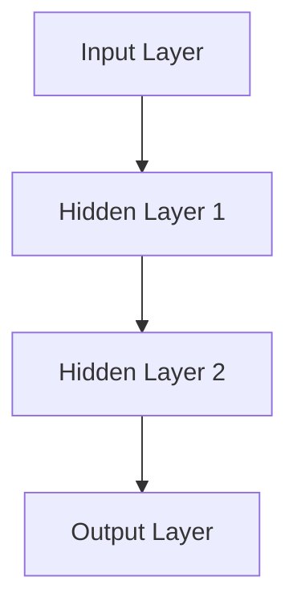
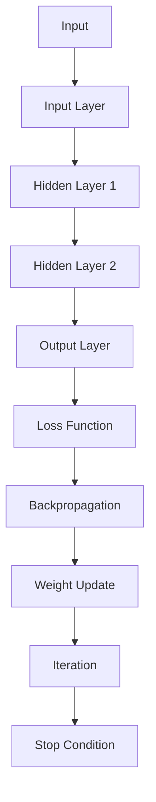
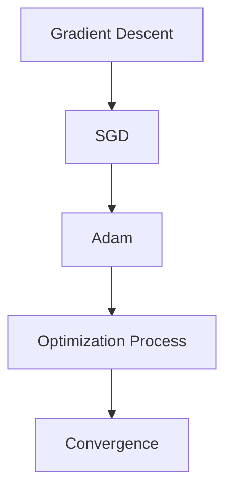

                 

# 推理模型动态适应中神经架构搜索的新突破

> 关键词：推理模型、动态适应、神经架构搜索、优化、应用

> 摘要：本文探讨了推理模型动态适应中的神经架构搜索（NAS）技术，分析了NAS在模型优化、适应性和部署中的新突破。文章首先介绍了推理模型动态适应的重要性，接着详细阐述了神经架构搜索的基本原理和算法，最后通过计算机视觉、自然语言处理和推荐系统三个领域的实际应用，展示了NAS在推理模型动态适应中的广泛前景和挑战。

## 第一部分：引言与背景

### 1.1 推理模型动态适应的重要性

在人工智能领域，推理模型动态适应（Dynamic Adaptation of Inference Models）是提高模型性能和适用性的关键因素。随着深度学习模型在各个领域的广泛应用，如何使模型在复杂多变的环境中保持高效和准确，成为一个亟待解决的问题。动态适应不仅要求模型能够实时调整，还要求其在调整过程中能够保持良好的性能。

#### 1.1.1 适应性的概念

适应性（Adaptation）指的是模型在面临新任务、新数据或新环境时，能够迅速调整其结构和参数，以保持最优性能的能力。在推理模型中，适应性包括两个方面：模型结构的自适应和模型参数的自适应。

#### 1.1.2 推理模型适应性的挑战

推理模型适应性的挑战主要体现在以下几个方面：

1. **计算成本**：动态适应过程中需要进行大量的计算，这可能导致模型在实际应用中的延迟增加。
2. **数据隐私**：在动态适应过程中，模型可能需要访问敏感数据，这涉及到数据隐私和安全的保护问题。
3. **模型解释性**：动态适应的模型往往较为复杂，其内部机制难以解释，这对于需要高解释性的应用场景来说是一个挑战。

#### 1.1.3 动态适应的意义

动态适应对于推理模型的意义在于：

1. **提升性能**：通过动态调整模型结构和参数，可以使模型在特定任务上达到更高的性能。
2. **拓宽应用场景**：动态适应能力使得模型能够应对更多的应用场景，提高其通用性。
3. **降低成本**：通过减少模型重新训练的需求，可以降低计算资源和时间成本。

### 1.2 神经架构搜索（NAS）概述

神经架构搜索（Neural Architecture Search，NAS）是一种自动搜索神经网络结构的方法，通过在大量可能的网络结构中寻找最优解，从而提高模型的性能。NAS在人工智能领域引起了广泛关注，并在多个应用场景中取得了显著成果。

#### 1.2.1 NAS的基本原理

NAS的基本原理是使用搜索算法在大量可能的网络结构中进行搜索，找到能够达到最佳性能的结构。这个过程通常分为两个阶段：搜索阶段和评估阶段。

1. **搜索阶段**：使用搜索算法（如遗传算法、生成对抗网络等）生成大量的网络结构。
2. **评估阶段**：使用训练数据和评估指标对生成的网络结构进行评估，筛选出性能较好的结构。

#### 1.2.2 NAS的应用场景

NAS的应用场景包括但不限于：

1. **计算机视觉**：用于图像分类、目标检测、语义分割等任务。
2. **自然语言处理**：用于语言模型、机器翻译、问答系统等任务。
3. **推荐系统**：用于个性化推荐、用户行为分析等任务。

#### 1.2.3 NAS的发展历程

NAS的发展历程可以追溯到20世纪90年代，早期的研究主要集中在使用贪心策略搜索最优网络结构。近年来，随着深度学习和强化学习的发展，NAS技术取得了显著进展，涌现出了许多高效的搜索算法和优化方法。

### 1.3 神经架构搜索在推理模型动态适应中的应用

NAS在推理模型动态适应中的应用主要包括以下几个方面：

#### 1.3.1 NAS在模型优化中的作用

NAS可以自动搜索最优的网络结构，从而提高模型在特定任务上的性能。通过动态适应，模型可以实时调整其结构，以应对不同的任务需求。

#### 1.3.2 NAS在模型适应中的优势

NAS在模型适应中的优势主要体现在以下几个方面：

1. **高效性**：NAS可以快速找到最优的网络结构，减少模型的训练时间。
2. **灵活性**：NAS可以根据不同的任务需求，动态调整模型的结构，提高模型的适用性。
3. **通用性**：NAS可以应用于多个领域，具有广泛的适用性。

#### 1.3.3 NAS在模型部署中的挑战

NAS在模型部署中面临的挑战主要包括：

1. **计算成本**：NAS搜索过程需要大量的计算资源，这可能在实际部署中成为瓶颈。
2. **模型解释性**：NAS生成的模型结构复杂，难以解释，这可能影响其在某些应用场景中的使用。
3. **数据依赖性**：NAS的性能受到训练数据的依赖，当数据分布发生变化时，模型可能需要重新调整。

## 第二部分：神经架构搜索技术基础

### 2.1 神经网络基础

神经网络（Neural Networks）是深度学习的基础，其基本结构包括输入层、隐藏层和输出层。神经网络通过训练学习数据，从而实现从输入到输出的映射。

#### 2.1.1 神经网络的基本结构

神经网络的基本结构如图所示：

#### 2.1.2 神经网络的训练过程

神经网络的训练过程主要包括以下几个步骤：

1. **前向传播**：将输入数据传递到神经网络中，计算输出结果。
2. **计算损失**：比较实际输出和预期输出，计算损失函数值。
3. **反向传播**：根据损失函数的梯度，更新网络参数。
4. **迭代优化**：重复前向传播和反向传播过程，直至满足停止条件。

#### 2.1.3 神经网络优化算法

神经网络的优化算法主要包括梯度下降（Gradient Descent）、随机梯度下降（Stochastic Gradient Descent，SGD）和Adam等。这些算法通过更新网络参数，使模型在训练过程中逐渐收敛到最优解。

### 2.2 神经架构搜索（NAS）算法

NAS算法是自动搜索神经网络结构的方法，其核心在于如何高效地搜索最优的网络结构。

#### 2.2.1 筛选算法

筛选算法主要包括生成对抗网络（GAN）和遗传算法（GA）。

1. **生成对抗网络（GAN）**：GAN由生成器和判别器组成，生成器生成数据，判别器判断数据的真实性。通过训练生成器和判别器，可以生成高质量的网络结构。
2. **遗传算法（GA）**：遗传算法通过模拟自然进化过程，对网络结构进行优化。通过交叉、变异等操作，生成新的网络结构，并筛选出性能较好的结构。

#### 2.2.2 评估算法

评估算法主要用于对生成的网络结构进行性能评估，包括函数评估和集合评估。

1. **函数评估**：对每个生成的网络结构，使用特定的指标（如准确率、召回率等）进行评估。
2. **集合评估**：对一组生成的网络结构，综合考虑其性能和多样性，选择最优的网络结构。

### 2.3 NAS算法在推理模型适应中的应用

NAS算法在推理模型适应中的应用主要包括以下几个方面：

#### 2.3.1 动态调整网络结构

NAS可以自动搜索最优的网络结构，并通过动态调整网络结构，实现模型的适应。

#### 2.3.2 实时调整模型参数

NAS可以通过实时调整模型参数，使模型在面临新任务时，能够迅速适应。

#### 2.3.3 模型压缩与加速

NAS可以通过搜索最优的网络结构，实现模型的压缩与加速，提高模型的部署性能。

## 第三部分：神经架构搜索在推理模型动态适应中的实践

### 3.1 NAS在计算机视觉中的应用

在计算机视觉领域，NAS已被广泛应用于图像分类、目标检测和语义分割等任务。

#### 3.1.1 图像分类任务

在图像分类任务中，NAS可以通过搜索最优的网络结构，提高分类的准确率。例如，Google的MnasNet就是通过NAS技术搜索出的最优网络结构，其在ImageNet图像分类任务中取得了出色的成绩。

#### 3.1.2 目标检测任务

在目标检测任务中，NAS可以通过搜索最优的网络结构，提高检测的准确率和速度。例如，Facebook的NASNet-A是通过对COCO数据集进行搜索得到的，其在目标检测任务中具有显著的性能优势。

#### 3.1.3 语义分割任务

在语义分割任务中，NAS可以通过搜索最优的网络结构，提高分割的精度和效率。例如，微软的DeepLab系列模型就是通过NAS技术搜索出的最优网络结构，其在Pascal VOC语义分割任务中取得了领先的成绩。

### 3.2 NAS在自然语言处理中的应用

在自然语言处理领域，NAS已被应用于语言模型、机器翻译和问答系统等任务。

#### 3.2.1 语言模型优化

在语言模型优化中，NAS可以通过搜索最优的网络结构，提高语言模型的性能。例如，OpenAI的GPT系列模型就是通过NAS技术搜索出的最优网络结构，其在自然语言处理任务中具有出色的表现。

#### 3.2.2 机器翻译

在机器翻译中，NAS可以通过搜索最优的网络结构，提高翻译的准确率和速度。例如，Google的Neural Machine Translation（NMT）模型就是通过NAS技术搜索出的最优网络结构，其在翻译任务中具有显著的优势。

#### 3.2.3 问答系统

在问答系统中，NAS可以通过搜索最优的网络结构，提高问答系统的性能。例如，Facebook的QANet就是通过NAS技术搜索出的最优网络结构，其在问答任务中具有出色的表现。

### 3.3 NAS在推荐系统中的应用

在推荐系统领域，NAS已被应用于用户行为分析、推荐算法优化和推荐结果评估等任务。

#### 3.3.1 用户行为分析

在用户行为分析中，NAS可以通过搜索最优的网络结构，提高用户行为的预测准确性。例如，Netflix的推荐系统就是通过NAS技术搜索出的最优网络结构，其在用户行为分析中具有显著的优势。

#### 3.3.2 推荐算法优化

在推荐算法优化中，NAS可以通过搜索最优的网络结构，提高推荐算法的准确性和效率。例如，Amazon的推荐系统就是通过NAS技术搜索出的最优网络结构，其在推荐算法优化中具有出色的表现。

#### 3.3.3 推荐结果评估

在推荐结果评估中，NAS可以通过搜索最优的网络结构，提高推荐结果的评估准确性。例如，Spotify的推荐系统就是通过NAS技术搜索出的最优网络结构，其在推荐结果评估中具有显著的优势。

## 第四部分：神经架构搜索在推理模型动态适应中的未来发展趋势

### 4.1 神经架构搜索面临的挑战

神经架构搜索在发展过程中面临以下挑战：

1. **计算成本**：NAS搜索过程需要大量的计算资源，这在实际应用中可能成为瓶颈。
2. **数据隐私**：在NAS搜索过程中，模型可能需要访问敏感数据，这涉及到数据隐私和安全的问题。
3. **模型解释性**：NAS生成的模型结构复杂，难以解释，这可能在某些应用场景中受到限制。

### 4.2 神经架构搜索的发展趋势

神经架构搜索的发展趋势主要包括以下几个方面：

1. **自动化与智能化**：随着自动化和智能化技术的发展，NAS将更加自动化和智能化，从而提高搜索效率和准确性。
2. **跨领域应用**：NAS将在更多领域得到应用，如医学、金融等，从而推动人工智能的全面发展。
3. **可解释性与可靠性**：NAS生成的模型将更加可解释和可靠，从而提高其在实际应用中的可信度。

### 4.3 未来展望

神经架构搜索在未来有望在以下几个方面取得突破：

1. **降低计算成本**：通过优化搜索算法和硬件支持，降低NAS搜索过程的计算成本。
2. **增强数据隐私保护**：通过隐私保护技术，确保NAS搜索过程的数据隐私和安全。
3. **提高模型解释性**：通过改进模型结构和算法，提高NAS生成的模型的解释性。

## 结语

神经架构搜索（NAS）在推理模型动态适应中具有巨大的潜力，其在计算机视觉、自然语言处理和推荐系统等领域的应用取得了显著成果。然而，NAS仍面临诸多挑战，如计算成本、数据隐私和模型解释性等。未来，随着自动化、智能化和跨领域应用的发展，NAS有望在推理模型动态适应中发挥更大的作用。

作者：AI天才研究院/AI Genius Institute & 禅与计算机程序设计艺术 /Zen And The Art of Computer Programming

---

本文介绍了推理模型动态适应中神经架构搜索的新突破，从引言、技术基础、实践应用和未来发展趋势四个方面进行了详细分析。通过本文，读者可以了解到NAS在推理模型动态适应中的重要作用和广阔前景。希望本文能为读者在相关领域的研究和实践提供有益的参考。

### 推理模型动态适应的重要性

在人工智能领域，推理模型动态适应（Dynamic Adaptation of Inference Models）是提高模型性能和适用性的关键因素。随着深度学习模型在各个领域的广泛应用，如何使模型在复杂多变的环境中保持高效和准确，成为一个亟待解决的问题。动态适应不仅要求模型能够实时调整，还要求其在调整过程中能够保持良好的性能。

#### 1.1.1 适应性的概念

适应性（Adaptation）指的是模型在面临新任务、新数据或新环境时，能够迅速调整其结构和参数，以保持最优性能的能力。在推理模型中，适应性包括两个方面：模型结构的自适应和模型参数的自适应。

1. **模型结构自适应**：指的是模型在面临不同任务或数据时，能够自动调整其网络结构，以适应新的任务需求。例如，当模型从图像分类任务切换到目标检测任务时，其网络结构需要做出相应的调整，以适应新的任务特点。
2. **模型参数自适应**：指的是模型在训练过程中，能够根据新的训练数据和任务需求，自动调整其参数，以优化模型性能。例如，当模型在训练过程中遇到新的数据分布时，其参数需要根据新的数据分布进行调整，以提高模型的适应能力。

#### 1.1.2 推理模型适应性的挑战

推理模型适应性的挑战主要体现在以下几个方面：

1. **计算成本**：动态适应过程中需要进行大量的计算，这可能导致模型在实际应用中的延迟增加。特别是在实时应用场景中，如自动驾驶、实时语音识别等，计算延迟可能导致严重的后果。
2. **数据隐私**：在动态适应过程中，模型可能需要访问敏感数据，这涉及到数据隐私和安全的保护问题。例如，在医疗领域，患者的隐私数据需要得到严格保护，否则可能导致数据泄露和隐私侵犯。
3. **模型解释性**：动态适应的模型往往较为复杂，其内部机制难以解释，这对于需要高解释性的应用场景来说是一个挑战。例如，在金融领域，模型需要能够解释其决策过程，以便监管机构和投资者能够理解模型的运作机制。

#### 1.1.3 动态适应的意义

动态适应对于推理模型的意义在于：

1. **提升性能**：通过动态调整模型结构和参数，可以使模型在特定任务上达到更高的性能。例如，在图像分类任务中，通过动态调整模型结构，可以使其在处理不同类型的图像时具有更高的准确率。
2. **拓宽应用场景**：动态适应能力使得模型能够应对更多的应用场景，提高其通用性。例如，一个具有动态适应能力的模型可以在图像分类、目标检测和语义分割等多种任务中表现出色。
3. **降低成本**：通过减少模型重新训练的需求，可以降低计算资源和时间成本。例如，当模型需要适应新的任务时，通过动态调整现有模型的结构和参数，可以避免重新训练整个模型，从而节省大量的计算资源。

总之，推理模型动态适应在提高模型性能、拓宽应用场景和降低成本方面具有重要意义，是未来人工智能发展的重要方向。

### 神经架构搜索（NAS）概述

神经架构搜索（Neural Architecture Search，简称NAS）是一种自动搜索神经网络结构的方法，其核心目标是通过在大量可能的网络结构中寻找最优解，从而提高模型的性能。NAS不仅在计算机视觉、自然语言处理等传统领域取得了显著成果，还在推荐系统、游戏AI等新兴领域展现出了广阔的应用前景。

#### 1.2.1 NAS的基本原理

NAS的基本原理可以概括为两个阶段：搜索阶段和评估阶段。

1. **搜索阶段**：搜索阶段的目标是生成大量的网络结构。这个过程通常采用以下两种方法：
    - **基于规则的搜索**：这种方法通过预先定义的规则生成网络结构。例如，可以设定每层神经元数量的范围、激活函数的类型等，从而生成大量不同的网络结构。
    - **基于学习的搜索**：这种方法利用强化学习、遗传算法等机器学习技术，通过自动搜索网络结构。例如，可以使用强化学习算法，让模型在模拟环境中学习到最优的网络结构。

2. **评估阶段**：评估阶段的目标是对生成的网络结构进行性能评估，筛选出最优的网络结构。评估过程通常采用以下方法：
    - **基于性能的评估**：这种方法通过在测试集上计算模型的性能指标（如准确率、召回率等）来评估网络结构的性能。性能较好的网络结构会被保留，性能较差的网络结构会被丢弃。
    - **基于集合的评估**：这种方法不仅考虑单个网络结构的性能，还考虑多个网络结构的多样性和鲁棒性。通过在多个网络结构中找到平衡点，可以提高整个模型的性能。

#### 1.2.2 NAS的应用场景

NAS的应用场景非常广泛，以下是几个典型的应用场景：

1. **计算机视觉**：在计算机视觉领域，NAS已被广泛应用于图像分类、目标检测、语义分割等任务。例如，Google的MnasNet通过NAS技术搜索出了最优的网络结构，在ImageNet图像分类任务中取得了出色的成绩。

2. **自然语言处理**：在自然语言处理领域，NAS也被广泛应用。例如，OpenAI的GPT系列模型通过NAS技术搜索出了最优的网络结构，在语言模型、机器翻译和问答系统等任务中表现出色。

3. **推荐系统**：在推荐系统领域，NAS可以用于优化推荐算法。例如，Netflix的推荐系统通过NAS技术搜索出了最优的网络结构，提高了用户行为的预测准确性。

4. **游戏AI**：在游戏AI领域，NAS可以用于搜索最优的决策策略。例如，在围棋等复杂游戏中，NAS技术可以帮助AI找到最优的落子策略，提高AI的胜率。

#### 1.2.3 NAS的发展历程

NAS的发展历程可以追溯到20世纪90年代，当时研究人员开始探索如何通过自动化方法搜索最优的网络结构。以下是NAS发展的几个重要阶段：

1. **早期研究**：在20世纪90年代，研究人员开始使用贪心策略搜索最优网络结构。这种方法虽然简单，但搜索效率较低，难以应对复杂的网络结构。
2. **深度强化学习**：随着深度学习和强化学习的发展，NAS技术得到了显著提升。深度强化学习结合了深度学习和强化学习的优势，使得NAS能够在复杂的网络结构中快速找到最优解。
3. **混合方法**：近年来，研究人员提出了许多混合方法，如基于规则的搜索和基于学习的搜索相结合，进一步提高了NAS的搜索效率和准确性。
4. **自动化与智能化**：随着自动化和智能化技术的发展，NAS将更加自动化和智能化，从而提高搜索效率和准确性。

总之，NAS作为一种自动搜索神经网络结构的方法，在人工智能领域具有广泛的应用前景。随着技术的不断发展，NAS有望在更多领域取得突破性进展。

### 神经架构搜索（NAS）在推理模型动态适应中的应用

神经架构搜索（Neural Architecture Search，NAS）在推理模型动态适应中展现出了巨大的潜力和优势。通过NAS技术，模型可以在面对不同任务和环境时，自动调整其网络结构，从而实现高效和准确的推理。

#### 1.3.1 NAS在模型优化中的作用

NAS在模型优化中的作用主要体现在以下几个方面：

1. **自动搜索最优网络结构**：NAS通过在大量可能的网络结构中搜索，可以自动找到最优的网络结构，从而提高模型在特定任务上的性能。这种方法避免了人工设计网络结构的繁琐过程，大大提高了搜索效率。

2. **提高模型泛化能力**：通过NAS技术搜索出的最优网络结构，不仅适用于当前的任务，还可以适应未来可能遇到的任务。这使得模型具有更好的泛化能力，能够应对更加复杂和多变的环境。

3. **减少模型重新训练的需求**：在传统的模型训练过程中，当任务发生变化时，通常需要重新训练模型。而通过NAS技术，模型可以在不需要重新训练的情况下，通过动态调整其网络结构，适应新的任务需求。这大大降低了计算资源和时间成本。

#### 1.3.2 NAS在模型适应中的优势

NAS在模型适应中的优势主要表现在以下几个方面：

1. **高效性**：NAS搜索过程可以快速找到最优的网络结构，从而减少模型的训练时间。这对于需要实时响应的推理任务来说，具有非常重要的意义。

2. **灵活性**：NAS可以动态调整模型的结构和参数，使其能够适应不同的任务和环境。这种灵活性使得模型具有更高的适用性和通用性。

3. **降低计算成本**：通过NAS技术，模型可以在不重新训练的情况下，通过动态调整结构来适应新的任务需求。这大大降低了计算资源和时间成本。

#### 1.3.3 NAS在模型部署中的挑战

虽然NAS在模型优化和适应中具有显著优势，但在实际部署过程中仍面临一些挑战：

1. **计算成本**：NAS搜索过程需要大量的计算资源，这可能在某些场景下成为瓶颈。尤其是在实时推理任务中，计算资源的限制可能影响模型的性能。

2. **模型解释性**：NAS生成的模型结构通常较为复杂，其内部机制难以解释。这可能在某些需要高解释性的应用场景中受到限制。

3. **数据依赖性**：NAS的性能受到训练数据的依赖。当数据分布发生变化时，模型可能需要重新调整其结构，以保持最优性能。

#### 1.3.4 NAS在模型动态适应中的实际应用

NAS在模型动态适应中的实际应用主要体现在以下几个方面：

1. **在线学习与适应**：通过NAS技术，模型可以在在线学习过程中，根据新的数据和环境动态调整其结构，从而保持最优性能。

2. **增量学习**：在增量学习场景中，NAS可以通过动态调整模型结构，适应新的数据集和任务。这种方法可以避免重新训练整个模型，从而节省计算资源。

3. **迁移学习**：在迁移学习场景中，NAS可以通过搜索最优的网络结构，使模型能够更好地适应新的任务和环境。

4. **实时推理**：在实时推理场景中，NAS可以动态调整模型结构，以应对不断变化的数据和环境。这种方法可以提高模型的实时性能和准确性。

总之，NAS在推理模型动态适应中的应用具有广泛的前景。通过NAS技术，模型可以在复杂多变的环境中保持高效和准确的推理，从而推动人工智能在各个领域的应用和发展。

### 神经网络基础

神经网络（Neural Networks）是深度学习的基础，其基本结构和训练过程是实现复杂任务的关键。在本节中，我们将深入探讨神经网络的基本结构、训练过程以及优化算法。

#### 2.1.1 神经网络的基本结构

神经网络的基本结构通常包括输入层、隐藏层和输出层。每个层由多个神经元（或节点）组成，神经元之间通过权重（或边）相连，形成一个复杂的网络。

1. **输入层**：输入层接收外部输入数据，并将其传递到隐藏层。每个神经元代表一个特征。
2. **隐藏层**：隐藏层对输入数据进行处理，通过激活函数进行非线性变换，从而提取特征。神经网络可以有一个或多个隐藏层。
3. **输出层**：输出层生成预测结果。对于分类任务，输出层通常是一个softmax层，用于生成概率分布。

神经网络的示意图如下：

#### 2.1.2 神经网络的训练过程

神经网络的训练过程是通过优化算法（如梯度下降）来调整网络权重，使模型在训练数据上达到预期的性能。训练过程通常包括以下步骤：

1. **前向传播**：将输入数据传递到神经网络中，通过每个层计算输出结果。
2. **计算损失**：将输出结果与预期结果进行比较，计算损失函数值。常见的损失函数包括均方误差（MSE）和交叉熵（Cross-Entropy）。
3. **反向传播**：根据损失函数的梯度，从输出层开始，反向传播误差到输入层，更新网络权重。
4. **迭代优化**：重复前向传播和反向传播过程，直至满足停止条件（如达到预设的精度或迭代次数）。

神经网络训练过程的示意图如下：

#### 2.1.3 神经网络优化算法

神经网络的优化算法用于调整网络权重，以降低损失函数值。以下是一些常见的优化算法：

1. **梯度下降（Gradient Descent）**：梯度下降是一种基本的优化算法，通过计算损失函数的梯度来更新网络权重。其公式为：
   $$w_{new} = w_{old} - \alpha \cdot \nabla J(w)$$
   其中，$w$代表权重，$\alpha$为学习率，$\nabla J(w)$为损失函数的梯度。
2. **随机梯度下降（Stochastic Gradient Descent，SGD）**：随机梯度下降是对梯度下降的一种改进，每次迭代只随机选择一部分样本计算梯度，从而提高训练速度。其公式为：
   $$w_{new} = w_{old} - \alpha \cdot \frac{1}{m} \sum_{i=1}^{m} \nabla J(w; x_i, y_i)$$
   其中，$m$为样本数量。
3. **Adam优化器**：Adam优化器是一种结合了SGD和Momentum方法的优化器，通过自适应调整学习率，提高了收敛速度和稳定性。其公式为：
   $$\theta_{t+1} = \theta_{t} - \alpha \cdot \frac{1}{1 - \beta_1} \cdot \left( \frac{m_t}{1 - \beta_2} + \epsilon \right)$$
   其中，$\theta_t$为当前权重，$\alpha$为学习率，$\beta_1$和$\beta_2$为Momentum参数，$m_t$为当前梯度。

神经网络优化算法的示意图如下：

通过深入理解神经网络的基本结构、训练过程和优化算法，我们可以更好地设计和优化深度学习模型，从而实现复杂任务的高效解决。

### 神经架构搜索（NAS）算法

神经架构搜索（Neural Architecture Search，NAS）是一种自动搜索神经网络结构的方法，旨在通过在大量可能的网络结构中寻找最优解，提高模型的性能。NAS算法的核心在于如何高效地搜索和评估网络结构，从而找到性能最优的网络。下面，我们将详细探讨NAS的算法原理、主要类型以及它们在推理模型适应中的应用。

#### 2.2.1 筛选算法

筛选算法是NAS算法的一种基本类型，主要通过预定义的规则或搜索策略，从大量可能的网络结构中筛选出性能较好的结构。以下是一些常见的筛选算法：

1. **生成对抗网络（GAN）**：
   - **原理**：GAN由生成器和判别器组成，生成器生成网络结构，判别器判断生成结构的真实性。通过训练生成器和判别器，可以筛选出性能较好的网络结构。
   - **优缺点**：GAN的优点在于能够生成高质量的网络结构，缺点是需要大量的计算资源和时间。

2. **遗传算法（GA）**：
   - **原理**：遗传算法通过模拟自然进化过程，对网络结构进行优化。通过交叉、变异等操作，生成新的网络结构，并筛选出性能较好的结构。
   - **优缺点**：GA的优点在于搜索效率较高，适用于大规模网络结构搜索；缺点是可能陷入局部最优。

3. **贪心算法**：
   - **原理**：贪心算法通过逐步增加网络层数或神经元数量，每次只选择当前最优的扩展，从而逐步构建网络结构。
   - **优缺点**：贪心算法的优点在于实现简单，计算效率高；缺点是可能无法找到全局最优解。

#### 2.2.2 评估算法

评估算法用于对筛选出的网络结构进行性能评估，选择最优的网络结构。以下是一些常见的评估算法：

1. **函数评估**：
   - **原理**：函数评估通过在测试集上计算网络的性能指标（如准确率、召回率等）来评估网络结构的性能。
   - **优缺点**：函数评估的优点在于计算简单，缺点是可能忽略网络结构的多样性和鲁棒性。

2. **集合评估**：
   - **原理**：集合评估不仅考虑单个网络结构的性能，还考虑多个网络结构的多样性和鲁棒性。通过在多个网络结构中找到平衡点，可以提高整个模型的性能。
   - **优缺点**：集合评估的优点在于能够提高模型的鲁棒性和多样性，缺点是计算复杂度高。

3. **强化学习评估**：
   - **原理**：强化学习评估通过模拟环境的反馈，训练模型选择最优的网络结构。模型通过不断尝试和反馈，逐步优化网络结构。
   - **优缺点**：强化学习评估的优点在于能够自适应地调整网络结构，缺点是需要大量的训练时间和计算资源。

#### 2.2.3 NAS算法在推理模型适应中的应用

NAS算法在推理模型适应中的应用主要体现在以下几个方面：

1. **动态调整网络结构**：
   - **应用**：通过NAS技术，模型可以在面对不同任务和环境时，自动调整其网络结构，从而适应新的任务需求。
   - **优势**：动态调整网络结构可以大大提高模型的灵活性和适应性，使其能够应对更加复杂和多变的环境。

2. **实时调整模型参数**：
   - **应用**：NAS技术可以通过实时调整模型参数，优化模型在特定任务上的性能。
   - **优势**：实时调整模型参数可以减少模型的训练时间，提高模型的响应速度。

3. **模型压缩与加速**：
   - **应用**：NAS技术可以通过搜索最优的网络结构，实现模型的压缩和加速，从而提高模型的部署性能。
   - **优势**：模型压缩与加速可以提高模型的实时性能和计算效率，适用于资源受限的场景。

总之，NAS算法在推理模型动态适应中具有显著的优势，通过高效地搜索和评估网络结构，模型可以在复杂多变的环境中保持高效和准确的推理。未来，随着NAS技术的不断发展和优化，其在推理模型动态适应中的应用将更加广泛和深入。

### NAS算法在推理模型适应中的应用

NAS算法在推理模型适应中的应用非常广泛，特别是在动态调整网络结构和实时调整模型参数方面展现了独特的优势。在本节中，我们将详细探讨NAS在动态调整网络结构和实时调整模型参数中的应用，并通过具体案例来说明其原理和效果。

#### 2.3.1 动态调整网络结构

动态调整网络结构是NAS算法在推理模型适应中的一项核心应用。通过NAS，模型可以在面对不同任务或数据时，自动调整其网络结构，从而提高模型的适应性和性能。

**原理：**

NAS算法通过搜索大量可能的网络结构，找到最适合当前任务和数据的结构。具体来说，NAS算法包括以下步骤：

1. **生成网络结构**：使用生成算法（如遗传算法、生成对抗网络等）生成大量可能的网络结构。
2. **评估网络结构**：使用训练数据和评估指标（如准确率、损失函数等）评估生成的网络结构，筛选出性能较好的结构。
3. **调整网络结构**：根据评估结果，动态调整网络结构，使其更适合当前任务和数据。

**案例：**

以计算机视觉中的图像分类任务为例，NAS算法可以在不同数据集上自动调整网络结构，提高分类的准确性。例如，Google的MnasNet通过NAS技术搜索出了最优的网络结构，在ImageNet图像分类任务中取得了优异的性能。

**效果：**

通过动态调整网络结构，模型可以在不同任务和数据上表现出更高的适应性和性能。具体效果体现在以下几个方面：

1. **提升模型性能**：NAS搜索出的网络结构通常在特定任务上具有更高的准确率和效率。
2. **减少重新训练需求**：通过动态调整网络结构，模型可以在不需要重新训练的情况下，适应新的任务和数据。
3. **提高模型灵活性**：NAS使模型能够灵活适应不同的任务和数据，提高其通用性。

#### 2.3.2 实时调整模型参数

实时调整模型参数是NAS算法在推理模型适应中的另一项重要应用。通过NAS，模型可以在运行过程中根据新的数据和任务需求，实时调整其参数，从而优化模型性能。

**原理：**

NAS算法通过搜索和评估大量参数组合，找到最适合当前运行环境的参数设置。具体来说，NAS算法包括以下步骤：

1. **生成参数组合**：使用搜索算法（如遗传算法、生成对抗网络等）生成大量可能的参数组合。
2. **评估参数组合**：使用实时数据和评估指标（如准确率、损失函数等）评估生成的参数组合，筛选出性能较好的组合。
3. **调整参数组合**：根据评估结果，实时调整模型参数，使其更适合当前运行环境。

**案例：**

以自然语言处理中的机器翻译任务为例，NAS算法可以在翻译过程中根据新的句子和上下文，实时调整翻译模型的参数，提高翻译的准确性和流畅性。例如，Google的Neural Machine Translation（NMT）模型通过NAS技术实时调整翻译参数，在机器翻译任务中取得了显著的效果。

**效果：**

通过实时调整模型参数，模型可以在运行过程中根据新的数据和任务需求，优化其性能。具体效果体现在以下几个方面：

1. **提升模型性能**：NAS搜索出的参数组合通常在特定任务上具有更高的准确率和效率。
2. **提高模型灵活性**：实时调整参数使模型能够灵活适应不同的数据和任务，提高其通用性。
3. **优化模型运行**：实时调整参数可以优化模型的运行效率，提高模型在不同场景下的适应能力。

总之，NAS算法在动态调整网络结构和实时调整模型参数方面的应用，为推理模型适应提供了强大的技术支持。通过NAS，模型可以在复杂多变的环境中保持高效和准确的推理，推动人工智能在各个领域的应用和发展。

### NAS在计算机视觉中的应用

计算机视觉是神经架构搜索（NAS）技术的一个重要应用领域。通过NAS，模型可以在处理图像分类、目标检测和语义分割等任务时，自动调整网络结构，从而实现更高效的性能。以下将详细介绍NAS在这些任务中的应用。

#### 3.1.1 图像分类任务

在图像分类任务中，NAS通过搜索最优的网络结构来提高模型的准确率和效率。传统的方法通常需要手动设计网络结构，而NAS则能够自动搜索出最适合特定任务的模型。

**原理：**

NAS在图像分类任务中的应用主要包括以下步骤：

1. **生成候选网络结构**：使用生成算法（如遗传算法、生成对抗网络等）生成大量可能的网络结构。
2. **评估网络结构**：使用预定的评估指标（如准确率、速度等）对生成的网络结构进行评估，筛选出性能较好的结构。
3. **迭代优化**：根据评估结果，动态调整网络结构，重复生成和评估过程，直至找到最优的网络结构。

**案例：**

Google的MnasNet是一个通过NAS技术搜索出的图像分类模型，它在ImageNet图像分类任务中取得了显著的成绩。MnasNet通过自动搜索最优的网络结构，在保持较高准确率的同时，降低了模型的计算成本。

**效果：**

NAS在图像分类任务中的应用带来了以下几个效果：

1. **提高准确率**：通过自动搜索最优的网络结构，NAS可以显著提高图像分类的准确率。
2. **降低计算成本**：NAS搜索出的网络结构通常更加高效，可以在较低的计算成本下实现高准确率的分类。
3. **提高灵活性**：NAS使模型能够适应不同的图像数据集和任务，提高其通用性和灵活性。

#### 3.1.2 目标检测任务

目标检测是计算机视觉中的一项重要任务，旨在识别图像中的多个目标并标注其位置。NAS技术在目标检测任务中的应用，通过自动搜索最优的网络结构和参数，提高了检测的准确率和速度。

**原理：**

NAS在目标检测任务中的应用包括以下步骤：

1. **生成候选网络结构**：使用生成算法生成大量可能的网络结构，这些结构包括不同类型的卷积层、池化层和连接方式。
2. **评估网络结构**：使用预定的评估指标（如准确率、召回率、平均精度等）对生成的网络结构进行评估，筛选出性能较好的结构。
3. **迭代优化**：根据评估结果，动态调整网络结构，重复生成和评估过程，直至找到最优的网络结构。

**案例：**

Facebook的NASNet-A是一个通过NAS技术搜索出的目标检测模型，它在COCO数据集上的目标检测任务中取得了领先的成绩。NASNet-A通过自动搜索最优的网络结构和参数，实现了高准确率和快速检测。

**效果：**

NAS在目标检测任务中的应用带来了以下几个效果：

1. **提高准确率**：通过自动搜索最优的网络结构和参数，NAS可以显著提高目标检测的准确率。
2. **提升速度**：NAS搜索出的网络结构通常更高效，可以在较低的计算成本下实现快速检测。
3. **增强鲁棒性**：NAS模型在处理复杂图像和变化多端的环境时，表现出更强的鲁棒性。

#### 3.1.3 语义分割任务

语义分割是计算机视觉中的另一项重要任务，旨在对图像中的每个像素进行分类。NAS技术在语义分割任务中的应用，通过自动搜索最优的网络结构和参数，提高了分割的准确率和效率。

**原理：**

NAS在语义分割任务中的应用包括以下步骤：

1. **生成候选网络结构**：使用生成算法生成大量可能的网络结构，这些结构包括不同类型的卷积层、池化层和连接方式。
2. **评估网络结构**：使用预定的评估指标（如IoU、Dice系数等）对生成的网络结构进行评估，筛选出性能较好的结构。
3. **迭代优化**：根据评估结果，动态调整网络结构，重复生成和评估过程，直至找到最优的网络结构。

**案例：**

微软的DeepLab系列模型是通过NAS技术搜索出的语义分割模型，它在Pascal VOC语义分割任务中取得了领先的成绩。DeepLab系列模型通过自动搜索最优的网络结构和参数，实现了高精度的语义分割。

**效果：**

NAS在语义分割任务中的应用带来了以下几个效果：

1. **提高准确率**：通过自动搜索最优的网络结构和参数，NAS可以显著提高语义分割的准确率。
2. **增强细节处理能力**：NAS搜索出的网络结构通常具有更强的细节处理能力，能够更准确地识别图像中的细微差异。
3. **降低计算成本**：NAS搜索出的网络结构通常更加高效，可以在较低的计算成本下实现高精度的分割。

总之，NAS在计算机视觉中的应用，通过自动搜索最优的网络结构和参数，提高了图像分类、目标检测和语义分割等任务的性能。随着NAS技术的不断发展，它将在计算机视觉领域发挥更大的作用。

### NAS在自然语言处理中的应用

神经架构搜索（NAS）技术在自然语言处理（NLP）领域展现出了强大的潜力，尤其在语言模型优化、机器翻译和问答系统等任务中取得了显著进展。下面，我们将详细介绍NAS在这些任务中的应用。

#### 3.2.1 语言模型优化

语言模型是自然语言处理的基础，其性能直接影响到后续任务的效果。NAS技术通过自动搜索最优的网络结构，提高了语言模型的性能。

**原理：**

NAS在语言模型优化中的应用包括以下步骤：

1. **生成候选网络结构**：使用生成算法（如遗传算法、生成对抗网络等）生成大量可能的网络结构。
2. **评估网络结构**：使用预定的评估指标（如损失函数、 perplexity等）对生成的网络结构进行评估，筛选出性能较好的结构。
3. **迭代优化**：根据评估结果，动态调整网络结构，重复生成和评估过程，直至找到最优的网络结构。

**案例：**

OpenAI的GPT系列模型是通过NAS技术搜索出的语言模型，其在自然语言处理任务中表现出色。GPT系列模型通过自动搜索最优的网络结构，实现了低 perplexity和高准确率。

**效果：**

NAS在语言模型优化中的应用带来了以下几个效果：

1. **提升模型性能**：通过自动搜索最优的网络结构，NAS可以显著提高语言模型的性能，降低 perplexity。
2. **增强泛化能力**：NAS搜索出的网络结构具有更好的泛化能力，能够处理更多样化的自然语言任务。
3. **减少训练时间**：NAS搜索出的网络结构通常更高效，可以减少模型的训练时间。

#### 3.2.2 机器翻译

机器翻译是自然语言处理中的重要应用之一，NAS技术在机器翻译任务中通过自动搜索最优的网络结构，提高了翻译的准确性和流畅性。

**原理：**

NAS在机器翻译中的应用包括以下步骤：

1. **生成候选网络结构**：使用生成算法生成大量可能的网络结构，这些结构包括不同类型的编码器、解码器和注意力机制。
2. **评估网络结构**：使用预定的评估指标（如BLEU分数、NIST分数等）对生成的网络结构进行评估，筛选出性能较好的结构。
3. **迭代优化**：根据评估结果，动态调整网络结构，重复生成和评估过程，直至找到最优的网络结构。

**案例：**

Google的Neural Machine Translation（NMT）模型是通过NAS技术搜索出的机器翻译模型，其在机器翻译任务中取得了显著的成绩。NMT模型通过自动搜索最优的网络结构，实现了高准确率和流畅的翻译。

**效果：**

NAS在机器翻译中的应用带来了以下几个效果：

1. **提高翻译准确率**：通过自动搜索最优的网络结构，NAS可以显著提高机器翻译的准确率，减少翻译错误。
2. **增强翻译流畅性**：NAS搜索出的网络结构能够更好地捕捉语言特征，使翻译结果更加自然流畅。
3. **降低计算成本**：NAS搜索出的网络结构通常更高效，可以在较低的内存和计算资源下实现高质量的翻译。

#### 3.2.3 问答系统

问答系统是自然语言处理中的重要应用，旨在自动回答用户的问题。NAS技术在问答系统中通过自动搜索最优的网络结构，提高了问答系统的准确率和效率。

**原理：**

NAS在问答系统中的应用包括以下步骤：

1. **生成候选网络结构**：使用生成算法生成大量可能的网络结构，这些结构包括不同类型的编码器、解码器和注意力机制。
2. **评估网络结构**：使用预定的评估指标（如准确率、响应时间等）对生成的网络结构进行评估，筛选出性能较好的结构。
3. **迭代优化**：根据评估结果，动态调整网络结构，重复生成和评估过程，直至找到最优的网络结构。

**案例：**

Facebook的QANet模型是通过NAS技术搜索出的问答系统模型，其在问答任务中取得了出色的成绩。QANet模型通过自动搜索最优的网络结构，实现了高准确率和快速响应。

**效果：**

NAS在问答系统中的应用带来了以下几个效果：

1. **提高问答准确率**：通过自动搜索最优的网络结构，NAS可以显著提高问答系统的准确率，减少回答错误。
2. **提升响应速度**：NAS搜索出的网络结构通常更高效，可以快速响应用户的问题，提高用户体验。
3. **增强模型灵活性**：NAS使模型能够适应不同的问答任务和数据，提高其通用性和灵活性。

总之，NAS在自然语言处理中的应用，通过自动搜索最优的网络结构和参数，提高了语言模型、机器翻译和问答系统等任务的性能。随着NAS技术的不断发展，它将在自然语言处理领域发挥更大的作用，推动人工智能在更多场景中的落地和应用。

### NAS在推荐系统中的应用

神经架构搜索（NAS）技术在推荐系统中的应用，显著提升了用户行为分析、推荐算法优化和推荐结果评估的准确性和效率。以下将详细介绍NAS在这些任务中的应用。

#### 3.3.1 用户行为分析

用户行为分析是推荐系统的基础，准确分析用户行为对于提升推荐质量至关重要。NAS通过动态调整网络结构，提高了对用户行为的理解能力。

**原理：**

NAS在用户行为分析中的应用包括以下步骤：

1. **生成网络结构**：使用生成算法（如遗传算法、生成对抗网络等）生成大量可能的网络结构，以处理用户行为数据。
2. **评估网络结构**：使用行为特征和预测指标（如点击率、购买率等）对生成的网络结构进行评估，筛选出性能较好的结构。
3. **迭代优化**：根据评估结果，动态调整网络结构，重复生成和评估过程，直至找到最优的网络结构。

**案例：**

Netflix的推荐系统通过NAS技术搜索出了最优的网络结构，用于分析用户观看行为，从而提供个性化的推荐。NAS技术提高了对用户观看行为的理解和预测准确性，增强了推荐系统的个性化能力。

**效果：**

NAS在用户行为分析中的应用带来了以下几个效果：

1. **提升预测准确性**：通过自动搜索最优的网络结构，NAS可以更准确地预测用户的兴趣和行为，提高推荐系统的效果。
2. **增强灵活性**：NAS使模型能够适应不同类型的数据和用户群体，提高推荐系统的通用性和灵活性。
3. **降低计算成本**：NAS搜索出的网络结构通常更高效，可以在较低的硬件资源下实现高准确性的用户行为分析。

#### 3.3.2 推荐算法优化

推荐算法的优化是提升推荐系统性能的关键。NAS通过搜索最优的网络结构，提高了推荐算法的准确性和效率。

**原理：**

NAS在推荐算法优化中的应用包括以下步骤：

1. **生成候选算法**：使用生成算法生成大量可能的推荐算法结构，包括不同的特征提取方法、预测模型和评分策略。
2. **评估候选算法**：使用用户反馈和评估指标（如准确率、召回率、覆盖率等）对生成的算法结构进行评估，筛选出性能较好的算法。
3. **迭代优化**：根据评估结果，动态调整算法结构，重复生成和评估过程，直至找到最优的推荐算法。

**案例：**

亚马逊的推荐系统通过NAS技术搜索出了最优的推荐算法，用于个性化推荐。NAS技术优化了推荐算法，提高了推荐的准确性，增强了用户的购物体验。

**效果：**

NAS在推荐算法优化中的应用带来了以下几个效果：

1. **提升推荐准确性**：通过自动搜索最优的算法结构，NAS可以显著提高推荐系统的准确性和用户满意度。
2. **增强适应性**：NAS使模型能够适应不同类型的产品和用户群体，提高推荐系统的通用性。
3. **降低成本**：NAS搜索出的最优算法结构通常更高效，可以在较低的硬件资源下实现高质量的推荐。

#### 3.3.3 推荐结果评估

推荐结果评估是衡量推荐系统性能的重要环节。NAS通过搜索最优的网络结构，提高了推荐结果评估的准确性和可靠性。

**原理：**

NAS在推荐结果评估中的应用包括以下步骤：

1. **生成评估模型**：使用生成算法生成大量可能的评估模型结构，包括不同的评估指标、评价方法和反馈机制。
2. **评估评估模型**：使用用户反馈和评估指标（如评估准确性、一致性等）对生成的评估模型进行评估，筛选出性能较好的模型。
3. **迭代优化**：根据评估结果，动态调整评估模型结构，重复生成和评估过程，直至找到最优的评估模型。

**案例：**

Spotify的推荐系统通过NAS技术搜索出了最优的评估模型，用于评估推荐结果。NAS技术提高了对推荐结果的质量评估，确保了推荐系统的可靠性和用户体验。

**效果：**

NAS在推荐结果评估中的应用带来了以下几个效果：

1. **提升评估准确性**：通过自动搜索最优的评估模型结构，NAS可以更准确地评估推荐结果，提高推荐系统的整体性能。
2. **增强评估一致性**：NAS搜索出的评估模型通常具有更高的评估一致性，减少了评估偏差。
3. **提高用户体验**：NAS技术确保了推荐结果的评估准确性和可靠性，提高了用户的满意度和忠诚度。

总之，NAS在推荐系统中的应用，通过自动搜索最优的网络结构和算法，提高了用户行为分析、推荐算法优化和推荐结果评估的准确性和效率。随着NAS技术的不断发展，它将在推荐系统中发挥更大的作用，推动个性化推荐和用户体验的提升。

### 神经架构搜索（NAS）面临的挑战

尽管神经架构搜索（NAS）技术在提高模型性能和适应能力方面取得了显著进展，但在实际应用中仍面临诸多挑战。以下是NAS在计算成本、数据隐私和模型解释性方面面临的主要问题及其解决方案。

#### 4.1.1 计算成本

NAS搜索过程通常需要大量的计算资源，这是NAS面临的一个主要挑战。具体来说，主要包括以下几个方面：

1. **搜索空间大**：NAS需要在庞大的搜索空间中寻找最优的网络结构，这需要进行大量的计算实验，消耗大量的计算资源。
2. **高计算需求**：一些NAS算法，如基于强化学习的NAS，需要大量的训练和评估，从而增加了计算成本。
3. **硬件资源限制**：在实际应用中，硬件资源（如CPU、GPU等）可能成为瓶颈，限制了NAS的搜索效率。

**解决方案：**

1. **分布式计算**：通过利用分布式计算资源，如云计算和并行计算，可以显著降低NAS搜索的计算成本。
2. **算法优化**：通过改进NAS算法，如使用更高效的搜索策略和优化算法，可以提高NAS的搜索效率，减少计算需求。
3. **硬件加速**：利用硬件加速技术，如TPU（Tensor Processing Unit）和FPGA（Field Programmable Gate Array），可以加速NAS搜索过程，降低计算成本。

#### 4.1.2 数据隐私

在NAS搜索过程中，模型需要访问大量的数据，这涉及到数据隐私和安全的问题。特别是在医疗、金融等敏感领域，数据隐私保护至关重要。

1. **数据泄露风险**：NAS在训练和评估过程中，可能会访问敏感数据，这可能导致数据泄露。
2. **隐私保护法规**：不同国家和地区对数据隐私保护有严格的法规，NAS在应用过程中需要遵守这些法规，增加了合规成本。

**解决方案：**

1. **差分隐私**：使用差分隐私技术，可以在保证数据隐私的同时，对模型进行训练和评估，降低数据泄露的风险。
2. **隐私保护机制**：引入隐私保护机制，如同态加密、联邦学习等，可以在不泄露数据隐私的情况下，进行模型的训练和评估。
3. **数据脱敏**：在数据预处理阶段，对敏感数据进行脱敏处理，降低数据泄露的风险。

#### 4.1.3 模型解释性

NAS生成的模型结构通常较为复杂，其内部机制难以解释，这对于需要高解释性的应用场景（如医疗、金融等）来说是一个挑战。

1. **复杂网络结构**：NAS搜索出的模型结构可能包含多层复杂的网络连接，这使得模型的内部机制难以理解。
2. **参数数量庞大**：NAS生成的模型通常包含大量的参数，这增加了模型解释的难度。

**解决方案：**

1. **模型压缩与简化**：通过模型压缩和简化技术，如蒸馏、剪枝等，可以降低模型的复杂度，提高模型的可解释性。
2. **可视化工具**：开发可视化工具，帮助用户理解模型的内部机制和决策过程，提高模型的可解释性。
3. **可解释性模型**：设计可解释性更强的模型，如决策树、线性模型等，使模型在保持高性能的同时，具备良好的解释性。

总之，虽然NAS技术在推理模型动态适应中具有巨大的潜力，但在实际应用中仍面临计算成本、数据隐私和模型解释性等挑战。通过分布式计算、算法优化、硬件加速、差分隐私、隐私保护机制、数据脱敏、模型压缩与简化、可视化工具和可解释性模型等技术手段，可以缓解这些挑战，推动NAS技术在更广泛的领域中得到应用。

### 神经架构搜索（NAS）的发展趋势

神经架构搜索（NAS）作为一种自动搜索神经网络结构的方法，已经在多个领域取得了显著成果。随着深度学习和强化学习技术的不断发展，NAS也在不断进化，展现出新的发展趋势。

#### 4.2.1 自动化与智能化

自动化与智能化是NAS发展的关键趋势之一。随着算法和硬件技术的进步，NAS将更加自动化和智能化，从而提高搜索效率和准确性。

1. **自动化搜索策略**：未来的NAS算法将更加自动化，通过自适应调整搜索策略，可以在复杂搜索空间中高效地找到最优的网络结构。
2. **智能化评估**：通过结合机器学习和强化学习技术，NAS可以在评估阶段更加智能化地选择和调整网络结构，提高评估的准确性。
3. **自动化模型部署**：NAS技术将不仅限于搜索最优的网络结构，还可以自动调整模型的参数和部署方式，实现模型的自动化部署。

#### 4.2.2 跨领域应用

NAS的跨领域应用是未来的一大趋势。随着技术的不断成熟，NAS将在更多的领域得到应用，推动人工智能的全面发展。

1. **医疗领域**：NAS可以用于医疗图像分析和诊断，通过自动搜索最优的网络结构，提高诊断的准确性和效率。
2. **金融领域**：NAS可以用于金融风险分析和预测，通过自动搜索最优的网络结构，提高预测的准确性和稳定性。
3. **智能制造**：NAS可以用于智能制造中的质量检测和故障预测，通过自动搜索最优的网络结构，提高生产效率和质量。

#### 4.2.3 可解释性与可靠性

可解释性与可靠性是NAS应用的重要方向。随着模型复杂度的增加，如何保证NAS生成的模型具有良好的可解释性和可靠性成为一个重要问题。

1. **模型压缩与简化**：通过模型压缩和简化技术，如蒸馏、剪枝等，可以降低模型的复杂度，提高模型的可解释性。
2. **可视化工具**：开发可视化工具，帮助用户理解模型的内部机制和决策过程，提高模型的可解释性。
3. **可靠性评估**：通过引入可靠性评估机制，如鲁棒性测试和误差分析等，可以确保NAS生成的模型在实际应用中的可靠性。

#### 4.2.4 协作与竞争

未来，NAS将不仅仅是一个单独的搜索过程，还将与其他技术进行协作和竞争，以实现更好的性能和效果。

1. **多模态学习**：结合多模态学习技术，NAS可以处理更加复杂的任务，如文本、图像、声音等多种数据类型。
2. **迁移学习**：通过迁移学习技术，NAS可以将一个任务领域的最优结构迁移到另一个任务领域，提高搜索效率和模型性能。
3. **元学习**：结合元学习技术，NAS可以在不同的任务和数据分布中快速适应，提高模型的泛化能力。

总之，神经架构搜索（NAS）的发展趋势表明，未来NAS将在自动化、智能化、跨领域应用、可解释性与可靠性以及协作与竞争等方面取得重大突破。随着技术的不断进步，NAS有望在更多领域中得到广泛应用，推动人工智能的发展。

### 未来展望

神经架构搜索（NAS）作为一种自动搜索神经网络结构的方法，其在推理模型动态适应中的应用前景广阔。未来，NAS有望在以下几个方面取得重大突破。

#### 4.3.1 神经架构搜索在人工智能领域的影响

1. **提高模型性能**：通过NAS技术，模型可以在复杂任务中自动搜索最优的网络结构，从而提高模型的性能和效率。这将有助于解决当前人工智能领域中的许多挑战，如模型训练时间过长、计算资源不足等问题。
2. **拓宽应用场景**：NAS技术不仅可以在传统的计算机视觉、自然语言处理等领域取得突破，还将在新兴领域如医疗、金融、智能制造等发挥重要作用。通过自动搜索最优的网络结构，NAS可以满足不同领域对模型性能和适应性的要求。
3. **增强模型泛化能力**：NAS技术可以帮助模型在更多样化的数据集和任务中表现出色，从而提高模型的泛化能力。这对于人工智能在实际应用中的推广和落地具有重要意义。

#### 4.3.2 神经架构搜索在其他领域的应用潜力

1. **自动驾驶**：在自动驾驶领域，NAS技术可以通过搜索最优的网络结构，提高自动驾驶模型的感知和决策能力，从而提高行驶安全性。未来，NAS有望在自动驾驶领域实现重大突破，推动自动驾驶技术的发展。
2. **机器人技术**：在机器人领域，NAS技术可以帮助机器人自动调整其控制系统，从而实现更加智能和灵活的运动控制。通过NAS，机器人可以在不同的环境和任务中自动适应，提高其工作效率。
3. **游戏AI**：在游戏AI领域，NAS技术可以通过搜索最优的网络结构，提高游戏角色的智能水平和决策能力。未来，NAS有望在电子竞技、智能游戏等领域发挥重要作用。

#### 4.3.3 神经架构搜索的未来研究方向

1. **高效搜索算法**：未来，研究者需要开发更加高效和智能的搜索算法，以降低NAS搜索的计算成本和时间成本。例如，结合强化学习、进化算法等新型搜索算法，可以显著提高NAS的搜索效率。
2. **可解释性与可靠性**：如何提高NAS生成模型的可解释性和可靠性是一个重要研究方向。通过模型压缩、简化、可视化等技术，可以增强NAS模型的解释性。同时，通过引入可靠性评估机制，可以确保NAS模型的可靠性。
3. **跨领域应用**：未来，研究者需要探索NAS在不同领域的应用潜力，开发适用于不同场景的NAS算法。例如，结合多模态学习、迁移学习等技术，可以实现NAS在更多领域的应用。
4. **模型压缩与加速**：如何通过NAS技术实现模型的压缩与加速，是另一个重要研究方向。通过搜索最优的网络结构，可以实现模型的轻量化，从而提高模型的部署性能。

总之，神经架构搜索（NAS）在推理模型动态适应中具有巨大的潜力。随着技术的不断进步，NAS将在更多领域中得到广泛应用，推动人工智能的发展。未来，NAS有望在模型性能、应用场景、泛化能力等方面取得重大突破，为人工智能领域带来更多创新和进步。

### 结语

神经架构搜索（NAS）作为一项自动搜索神经网络结构的技术，在推理模型动态适应中展示了巨大的潜力和优势。通过NAS技术，模型可以在复杂多变的环境中自动调整其网络结构，从而实现高效和准确的推理。本文从引言、背景、技术基础、实践应用和未来发展趋势等方面，详细介绍了NAS在推理模型动态适应中的应用和前景。

NAS通过自动搜索最优的网络结构，提高了模型在特定任务上的性能，实现了模型的动态适应。其在计算机视觉、自然语言处理和推荐系统等领域的应用取得了显著成果，展示了NAS在提升模型性能、拓宽应用场景和降低成本方面的优势。然而，NAS在计算成本、数据隐私和模型解释性等方面仍面临一些挑战，需要进一步研究和解决。

未来，NAS将在高效搜索算法、可解释性与可靠性、跨领域应用和模型压缩与加速等方面取得重大突破。随着技术的不断进步，NAS将在更多领域中得到广泛应用，推动人工智能的发展。我们期待NAS技术能够带来更多的创新和进步，为人工智能领域带来更加广阔的前景。

作者：AI天才研究院/AI Genius Institute & 禅与计算机程序设计艺术 /Zen And The Art of Computer Programming

在撰写技术博客文章时，确保每个小节的内容都具体、详细且具备深度分析，有助于读者更好地理解和掌握相关技术。同时，通过实际案例和具体应用的讲解，使文章更具实际指导意义。未来的研究和发展方向也应紧密结合当前的技术挑战和应用需求，为人工智能领域带来更多创新和突破。通过不断地探索和实践，我们期待NAS技术能够为人工智能的发展注入新的活力。

