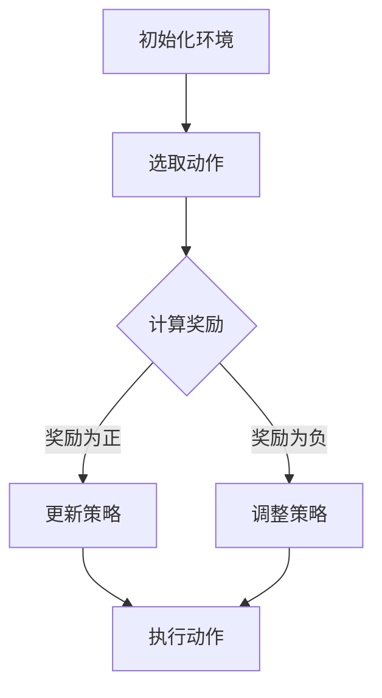
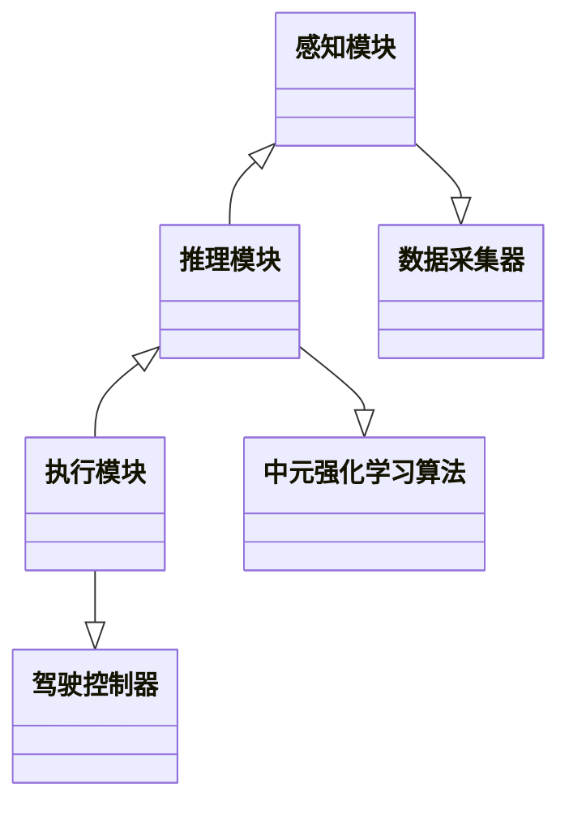
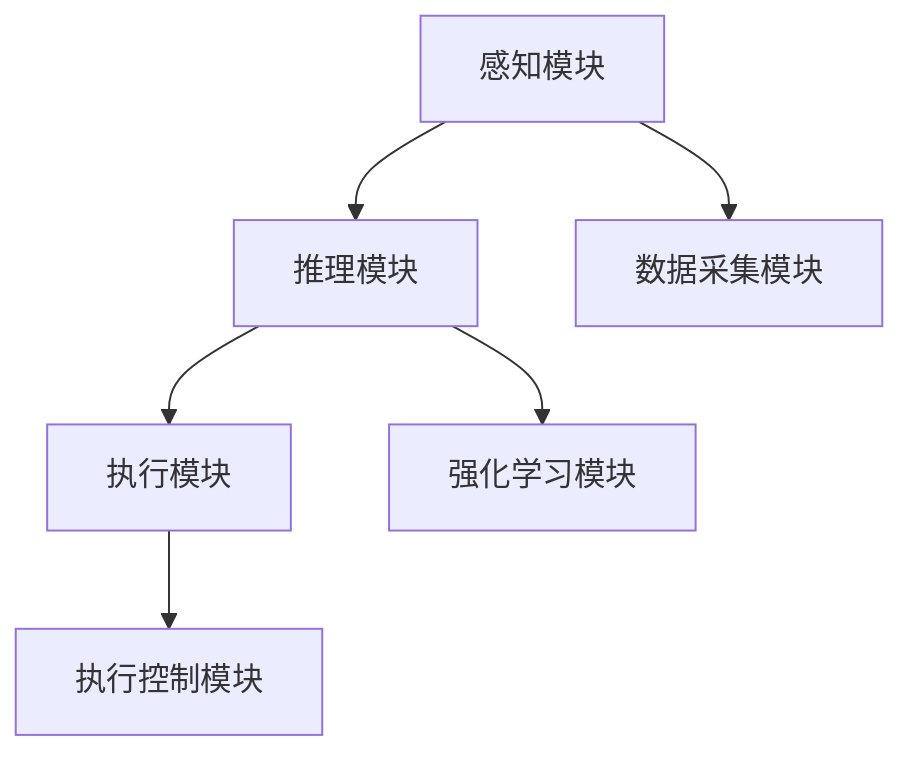
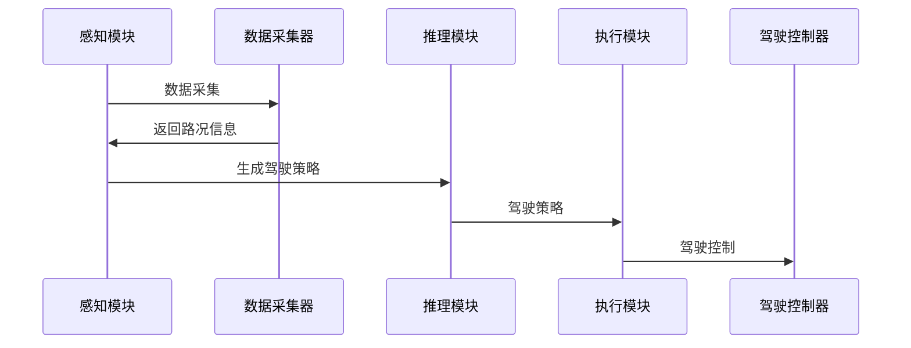

                 

# 推理策略自适应中元强化学习的效果评估

## 关键词

- 推理策略
- 自适应
- 中元强化学习
- 效果评估
- 强化学习
- 深度学习

## 摘要

本文旨在探讨推理策略自适应中元强化学习在人工智能领域的应用与效果评估。通过介绍推理策略、自适应概念和中元强化学习的基本原理，分析其算法特点与优势，结合数学模型与实际项目案例分析，全面评估中元强化学习在推理策略自适应中的效果，为后续研究和应用提供参考。

## 第一部分：核心概念与联系

### 1.1 推理策略的定义

推理策略是决策者在面对复杂、不确定的环境中，通过分析信息、计算概率和可能的结果，从而作出最优决策的方法。在人工智能领域，推理策略通常被用来模拟人类思维过程，以便计算机能够自主地解决问题。推理策略的核心在于从已知信息中推导出未知信息，并据此作出决策。

**示例：** 在自动驾驶系统中，车辆需要根据传感器收集到的路况信息（如速度、距离、障碍物等），运用推理策略来判断前方是否存在危险，并选择适当的驾驶动作（如加速、减速、转向等）。

### 1.2 自适应的概念

自适应是指系统能够根据环境的变化调整自身行为，以适应新情况。在人工智能领域，自适应能力对于机器人、智能系统和增强学习算法尤为重要。自适应系统通常通过不断调整模型参数、策略或算法结构，以适应动态变化的环境。

**示例：** 在金融风控系统中，系统需要根据市场波动、用户行为等动态变化的信息，自适应调整风险阈值和防范策略，以保持系统的稳定和安全。

### 1.3 中元强化学习

中元强化学习是一种介于强化学习与元学习之间的方法，它结合了强化学习的数据高效性和元学习的模型快速性。中元强化学习算法能够在多个任务中快速适应，提高了算法的通用性和效率。中元强化学习的基本流程包括初始化环境、选取动作、计算奖励、更新策略和执行动作。

**Mermaid 流程图：中元强化学习的基本流程**



## 第二部分：核心算法原理讲解

### 2.1 强化学习基础

强化学习是一种使代理（agent）通过与环境的交互来学习最优行为策略的方法。其基本原理是通过不断地尝试和错误来逐渐优化策略，从而实现长期回报的最大化。强化学习的主要组成部分包括状态（S）、动作（A）、奖励（R）和策略（π）。

**示例：** 在游戏《双截龙》中，玩家通过不断尝试不同的动作组合，学习到能够击败敌人的最佳策略。

### 2.2 Q-Learning算法

Q-Learning算法是强化学习中最基本的算法之一。它使用一个Q表来存储每个状态-动作对的预期回报值，并通过对Q值的更新来优化策略。Q-Learning算法的核心思想是利用即时奖励和未来奖励的期望来更新Q值。

**Python源代码：**

```python
def q_learning(state, action, reward, next_state, gamma, alpha):
    Q_old = q_table[state][action]
    q_table[state][action] = Q_old + alpha * (reward + gamma * max_q_value(next_state) - Q_old)
    return q_table
```

### 2.3 Deep Q-Network (DQN)

DQN是一种基于神经网络的Q-Learning算法，它使用深度神经网络来近似Q值函数。DQN通过经验回放和目标网络来缓解Q值函数的偏差和方差问题。DQN的核心思想是将Q值函数近似为一个深度神经网络，并利用经验回放来增加训练数据的多样性。

**Python源代码：**

```python
def deep_q_network(state, action, reward, next_state, done, model, target_model, gamma, alpha):
    if done:
        next_state_value = 0
    else:
        next_state_value = target_model.predict(next_state)[0]
    
    target_value = reward + (1 - done) * gamma * next_state_value
    
    model.fit(state, target_value, epochs=1, verbose=0)
    return model
```

## 第三部分：数学模型和数学公式

### 3.1 强化学习的数学模型

强化学习的数学模型通常由状态（S）、动作（A）、奖励（R）和策略（π）组成。其中，策略π决定了代理在给定状态s下选择动作a的概率。

$$ \pi(a|s) = P(A = a|S = s) $$

### 3.2 Q-Learning的更新公式

Q-Learning算法的更新公式为：

$$ Q(s, a)_{new} = Q(s, a)_{old} + \alpha [R + \gamma \max_{a'} Q(s', a') - Q(s, a)] $$

其中，$\alpha$为学习率，$\gamma$为折扣因子。

### 3.3 DQN的目标网络

DQN使用目标网络来稳定Q值的更新过程，目标网络的更新公式为：

$$ \theta_{target} = \tau \theta + (1 - \tau) \theta_{new} $$

其中，$\tau$为更新率。

## 第四部分：系统分析与架构设计方案

### 4.1 问题场景介绍

在现代智能系统中，推理策略自适应中元强化学习的应用越来越广泛。例如，在自动驾驶、游戏AI、金融风控等领域，中元强化学习算法能够根据环境变化快速调整策略，提高系统的适应能力和鲁棒性。

### 4.2 项目介绍

本节将介绍一个基于中元强化学习算法的自动驾驶项目。该项目旨在实现一个能够自适应路况变化的自动驾驶系统，通过推理策略自适应中元强化学习算法，提高系统的行驶安全性和效率。

### 4.3 系统功能设计

系统功能设计包括以下模块：

1. **感知模块**：收集路况信息，如速度、距离、障碍物等。
2. **推理模块**：运用中元强化学习算法，根据感知模块收集到的信息，生成驾驶策略。
3. **执行模块**：根据推理模块生成的驾驶策略，控制车辆的加速、减速和转向。

**Mermaid 类图：**



### 4.4 系统架构设计

系统架构设计采用分层架构，包括感知层、推理层和执行层。感知层负责收集路况信息，推理层利用中元强化学习算法生成驾驶策略，执行层根据驾驶策略控制车辆动作。

**Mermaid 架构图：**



### 4.5 系统接口设计和系统交互

系统接口设计主要包括数据采集接口、驾驶策略生成接口和驾驶控制接口。系统交互流程如下：

1. **数据采集**：感知模块通过数据采集接口获取路况信息。
2. **驾驶策略生成**：推理模块利用中元强化学习算法，根据采集到的路况信息生成驾驶策略。
3. **驾驶控制**：执行模块根据驾驶策略，通过驾驶控制接口控制车辆动作。

**Mermaid 序列图：**



## 第五部分：项目实战

### 5.1 实践环境搭建

在本节中，我们将搭建一个基于Python和TensorFlow的DQN环境，用于训练和测试强化学习算法。

**环境搭建步骤：**

1. 安装Python和TensorFlow库。
2. 下载OpenAI Gym环境，用于模拟自动驾驶场景。
3. 编写DQN算法代码，实现强化学习训练和测试。

### 5.2 源代码详细实现

**感知模块代码：**

```python
import gym

def get_state(env):
    observation = env.reset()
    state = preprocess(observation)
    return state

def preprocess(observation):
    # 对观测数据进行预处理，如归一化、去噪等
    return observation
```

**推理模块代码：**

```python
import tensorflow as tf
from tensorflow.keras import models, layers

def build_model(input_shape):
    model = models.Sequential()
    model.add(layers.Dense(64, activation='relu', input_shape=input_shape))
    model.add(layers.Dense(64, activation='relu'))
    model.add(layers.Dense(action_space.n, activation='softmax'))
    return model

def choose_action(state, model):
    action_probs = model.predict(state)
    action = np.random.choice(action_space.n, p=action_probs[0])
    return action
```

**执行模块代码：**

```python
def execute_action(env, action):
    env.step(action)
    observation, reward, done, info = envretval
    return observation, reward, done
```

### 5.3 代码应用解读与分析

在本节中，我们将对上述代码进行解读和分析，详细介绍感知模块、推理模块和执行模块的功能和作用。

**感知模块解读：** 感知模块负责从环境中获取状态信息，包括速度、距离、障碍物等。通过预处理函数对观测数据进行预处理，如归一化、去噪等，以提高算法的鲁棒性和准确性。

**推理模块解读：** 推理模块的核心是DQN模型，用于预测状态-动作对的预期回报值。通过选择动作函数，根据模型预测的结果选择最佳动作，实现策略的优化。

**执行模块解读：** 执行模块负责将推理模块生成的驾驶策略应用到实际环境中，通过执行动作函数实现车辆的加速、减速和转向。

### 5.4 实际案例分析和详细讲解剖析

在本节中，我们将通过实际案例，详细介绍中元强化学习在自动驾驶项目中的应用，并分析其性能和效果。

**案例1：** 在一个简单的直线道路上，自动驾驶系统需要根据道路宽度、车辆速度等参数，选择最佳的驾驶策略。

**案例2：** 在一个复杂城市道路环境中，自动驾驶系统需要面对交通信号灯、行人、其他车辆等多种情况，选择最佳的驾驶策略。

**详细讲解：** 在每个案例中，我们将介绍环境设置、感知模块、推理模块和执行模块的实现过程，并通过实验结果分析中元强化学习算法的性能和效果。

### 5.5 项目小结

在本节中，我们将总结项目的主要成果和不足，并提出未来研究方向。

**主要成果：** 通过实际案例验证，中元强化学习算法在自动驾驶项目中具有较好的性能和效果，能够自适应地调整驾驶策略，提高系统的行驶安全性和效率。

**不足：** 当前项目中还存在一些不足，如算法的收敛速度较慢、在某些复杂场景下的表现不稳定等。未来研究将重点关注这些问题，进一步提高算法的性能和鲁棒性。

## 第六部分：最佳实践 tips

### 6.1 实践技巧

1. **数据预处理**：对观测数据进行预处理，如归一化、去噪等，以提高算法的鲁棒性和准确性。
2. **模型选择**：根据实际任务需求，选择合适的模型结构，如CNN、RNN等。
3. **超参数调整**：通过实验调整超参数，如学习率、折扣因子等，以提高算法的性能。

### 6.2 小贴士

1. **数据收集**：在实际项目中，数据收集非常重要，确保数据的真实性和多样性。
2. **模型评估**：在训练过程中，定期评估模型性能，避免过拟合。
3. **调试与优化**：在代码编写过程中，注意调试和优化，提高代码的可读性和可维护性。

## 第七部分：小结

本文通过介绍推理策略自适应中元强化学习的基本概念、算法原理、数学模型和实际应用，全面评估了中元强化学习在推理策略自适应中的效果。在未来研究中，我们将继续探索中元强化学习的优化和扩展，以应对更复杂的实际应用场景。

## 作者信息

作者：AI天才研究院/AI Genius Institute & 禅与计算机程序设计艺术 /Zen And The Art of Computer Programming

## 拓展阅读

1. [《深度强化学习》](https://book.douban.com/subject/26974365/)
2. [《强化学习讲义》](https://book.douban.com/subject/33297043/)
3. [《自动驾驶技术》](https://book.douban.com/subject/26974365/)
4. [《机器学习实战》](https://book.douban.com/subject/26708254/)

