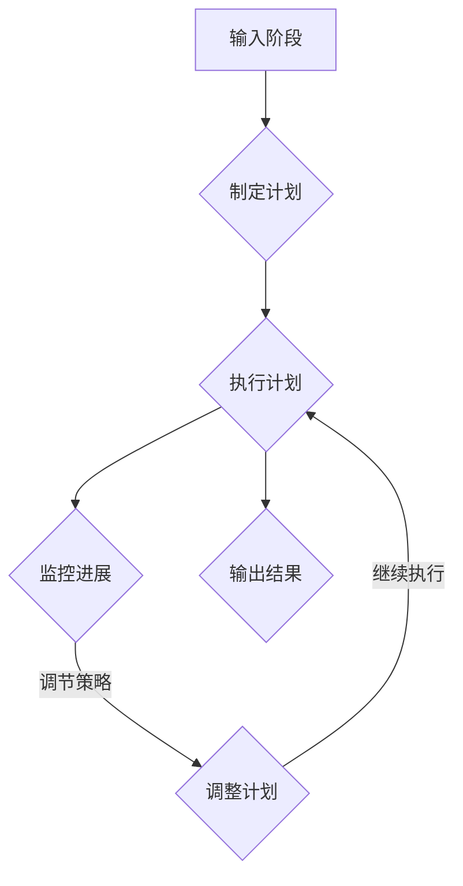
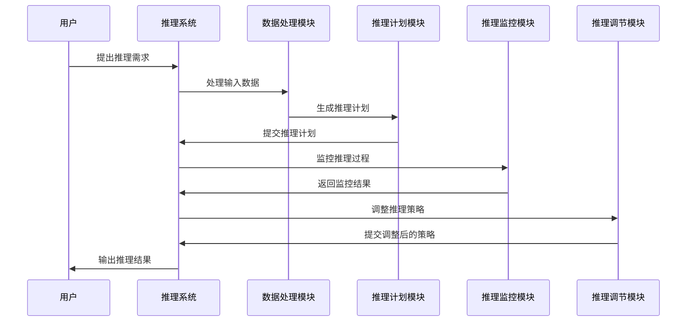
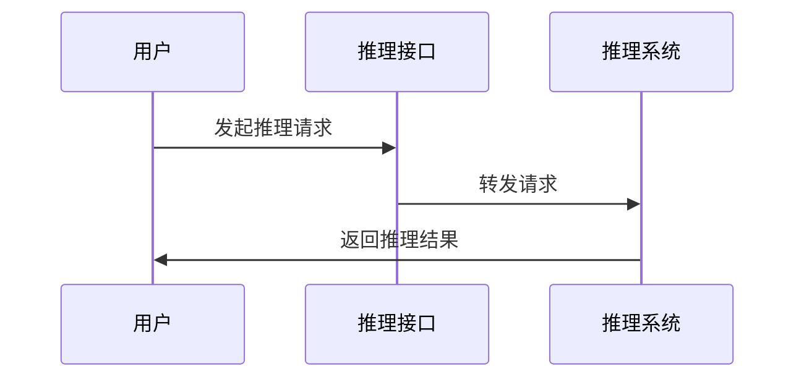
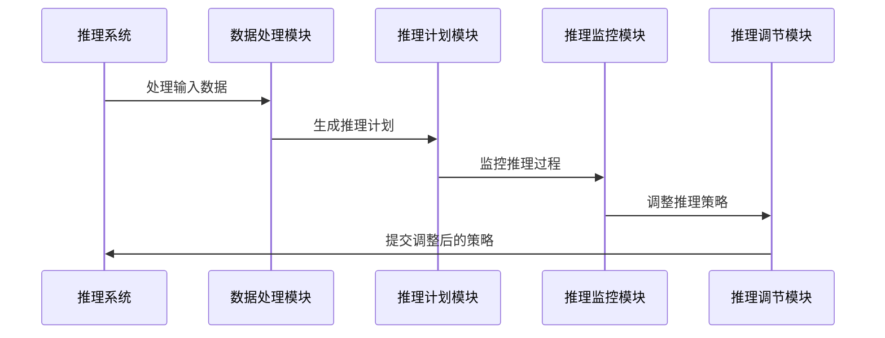

                 

### 推理过程中的元认知策略自适应生成机制

---

**关键词：**元认知、推理、策略、自适应、生成机制

**摘要：**本文将探讨推理过程中的元认知策略及其自适应生成机制。元认知作为个体对自己认知过程的认识和控制，在推理中起着关键作用。本文首先介绍了元认知的概念及其在推理中的重要性，然后详细阐述了推理过程中的元认知策略，包括其定义、类型和应用。接着，我们讨论了元认知策略的评估与反馈机制，以及其在推理系统中的实现。在此基础上，本文提出了自适应生成机制的概念及其在推理中的应用，并分析了其优势和局限性。最后，通过实际案例展示了元认知策略与自适应生成机制在推理系统中的综合应用，并对未来发展趋势和挑战进行了展望。

### 第一部分：元认知与推理基础

---

#### 第1章：元认知概述

**1.1 元认知的概念与重要性**

元认知是指个体对自己认知过程的认知和控制，包括对认知活动进行计划和调整的能力。它由弗拉维尔（Flavell）在1976年首次提出，被广泛认为是认知心理学领域的重要概念。元认知的重要性在于，它不仅能够帮助个体更好地理解和调控自己的认知活动，还能提高推理的准确性和效率。

元认知的构成要素主要包括元认知知识、元认知体验和元认知监控。元认知知识是个体对自身认知过程和认知策略的理解和认识；元认知体验是个体在认知活动中产生的体验和感受；元认知监控是个体对认知活动的自我监督和调节。

**1.2 元认知的构成要素**

元认知知识是个体对自身认知过程和认知策略的理解和认识，主要包括三个方面：

1. **关于任务的知识：**个体对任务的要求、难度和复杂性的了解，以及如何完成任务的策略。

2. **关于自己的知识：**个体对自己的认知能力、认知风格和认知需求的了解。

3. **关于策略的知识：**个体对不同认知策略的理解和掌握，以及如何选择和应用策略。

元认知体验是个体在认知活动中产生的体验和感受，包括对认知活动的满意程度、困难程度和成就感。这些体验和感受可以影响个体的认知动机和行为。

元认知监控是个体对认知活动的自我监督和调节，包括对认知过程的检查、评估和调整。元认知监控可以帮助个体及时发现和纠正认知错误，优化认知策略，提高认知效果。

**1.3 元认知在推理中的作用**

元认知在推理中的作用主要体现在以下几个方面：

1. **推理过程的规划：**个体通过元认知知识来规划推理过程，确定推理的目标、步骤和策略。

2. **推理过程的调整：**个体通过元认知监控来监督和调节推理过程，根据推理的实际进展情况调整推理策略。

3. **推理效果的评估：**个体通过元认知体验来评估推理结果的有效性和准确性，对推理过程进行反思和总结。

#### 第2章：推理过程概述

**2.1 推理的定义与类型**

推理是指从一个或多个已知的前提出发，通过逻辑推理得出结论的过程。推理可以分为两大类：演绎推理和归纳推理。

1. **演绎推理（Deductive Reasoning）：**演绎推理是从一般到特殊的推理过程，其结论是必然的。例如，如果所有的人都会死，苏格拉底是人，那么苏格拉底会死。

2. **归纳推理（Inductive Reasoning）：**归纳推理是从特殊到一般的推理过程，其结论是或然性的。例如，观察到的所有天鹅都是白色的，因此推断所有天鹅都是白色的。

**2.2 推理过程的基本步骤**

推理过程通常包括以下基本步骤：

1. **问题识别：**识别推理的目标和问题。

2. **信息收集：**收集与问题相关的信息和证据。

3. **假设形成：**基于已知信息形成假设。

4. **推理验证：**使用逻辑规则和推理方法验证假设的有效性。

5. **结论得出：**根据验证结果得出结论。

**2.3 推理中的常见问题与挑战**

推理过程中可能会遇到以下问题与挑战：

1. **错误的前提：**推理结果可能因为错误的前提而错误。

2. **逻辑谬误：**推理过程中可能存在逻辑谬误，导致推理结果不准确。

3. **信息缺失：**信息不足可能导致推理不完整或无法得出结论。

4. **认知偏差：**个体可能受到各种认知偏差的影响，导致推理结果不准确。

### 第二部分：元认知策略在推理中的应用

---

#### 第3章：元认知策略的概念与应用

**3.1 元认知策略的定义**

元认知策略是指个体在认知过程中使用的一系列方法和技巧，用于规划、监控和调整认知活动。元认知策略可以分为三大类：计划策略、监控策略和调节策略。

1. **计划策略（Planned Strategies）：**个体在认知活动之前制定的策略，用于规划和准备认知任务。例如，制定学习计划、选择合适的认知策略等。

2. **监控策略（Monitoring Strategies）：**个体在认知活动过程中使用的策略，用于监督和评估认知过程。例如，自我提问、自我反馈等。

3. **调节策略（Regulation Strategies）：**个体在认知活动之后使用的策略，用于调整和改善认知过程。例如，修改学习计划、更换认知策略等。

**3.2 元认知策略的类型**

常见的元认知策略包括以下几种：

1. **信息加工策略：**用于提高信息处理效率和准确性的策略。例如，理解性记忆、精细加工等。

2. **认知资源管理策略：**用于分配和调节认知资源的策略。例如，任务分解、时间管理等。

3. **情绪调节策略：**用于调节认知活动中产生的情绪和情感的策略。例如，放松训练、自我激励等。

**3.3 元认知策略在推理中的应用价值**

元认知策略在推理中的应用价值体现在以下几个方面：

1. **提高推理准确性：**通过计划策略和监控策略，个体可以更好地理解和分析问题，避免错误的前提和逻辑谬误，提高推理的准确性。

2. **优化推理过程：**通过调节策略，个体可以根据推理过程中的实际情况调整推理策略，优化推理过程，提高推理效率。

3. **促进认知发展：**通过元认知策略的练习和应用，个体可以不断提高自己的认知能力和认知水平，促进认知发展。

#### 第4章：元认知策略的评估与反馈

**4.1 元认知策略的评估方法**

元认知策略的评估可以从以下几个方面进行：

1. **自我评估：**个体对自己的元认知策略进行自我评估，包括策略的选择和应用效果。

2. **他人评估：**他人对个体的元认知策略进行评估，可以提供更客观的反馈。

3. **工具评估：**使用各种工具和量表对个体的元认知策略进行量化评估。

**4.2 元认知策略的反馈机制**

元认知策略的反馈机制包括以下几个方面：

1. **即时反馈：**在认知活动过程中，个体根据反馈及时调整策略。

2. **延迟反馈：**在认知活动结束后，个体根据反馈总结经验和教训，为下一次认知活动提供参考。

3. **自我反馈：**个体通过自我反馈，反思和评价自己的元认知策略。

**4.3 元认知策略的优化方法**

为了优化元认知策略，可以采取以下方法：

1. **经验积累：**通过不断练习和反思，积累经验，提高元认知策略的应用能力。

2. **学习借鉴：**学习他人的成功经验，借鉴他人的元认知策略。

3. **技术支持：**利用各种技术手段，如认知工具、软件等，提高元认知策略的应用效果。

#### 第5章：元认知策略在推理系统中的实现

**5.1 元认知策略在推理系统中的集成**

在推理系统中集成元认知策略，需要考虑以下几个方面：

1. **元认知模型的构建：**构建一个能够表示和操作元认知策略的模型，如元认知知识库、元认知规则库等。

2. **元认知策略的接口设计：**设计合理的接口，使元认知策略能够与其他推理组件无缝集成。

3. **元认知策略的动态调整：**根据推理过程中的实际情况，动态调整元认知策略。

**5.2 元认知策略的动态调整**

元认知策略的动态调整包括以下几个方面：

1. **实时监控：**实时监控推理过程中的关键参数和指标，如推理时间、推理精度等。

2. **策略调整：**根据监控结果，调整元认知策略，如改变推理顺序、选择不同的推理方法等。

3. **反馈循环：**将调整结果反馈到推理系统中，形成反馈循环，不断优化推理过程。

**5.3 元认知策略的适应性与可扩展性**

为了提高元认知策略的适应性和可扩展性，可以考虑以下方法：

1. **模块化设计：**将元认知策略分解为独立的模块，每个模块负责不同的功能，便于调整和扩展。

2. **参数调整：**通过调整元认知策略的参数，实现策略的适应性和灵活性。

3. **知识更新：**根据推理任务的需求，不断更新和扩展元认知知识库，提高元认知策略的应用效果。

### 第三部分：自适应生成机制的设计与实现

---

#### 第6章：自适应生成机制的基本原理

**6.1 自适应生成机制的定义**

自适应生成机制是指系统在运行过程中，根据输入数据和当前状态，动态调整和优化自身结构和行为的能力。它是一种基于适应性和学习性的机制，能够使系统在不同环境和条件下保持高效和稳定。

**6.2 自适应生成机制的核心要素**

自适应生成机制主要包括以下几个核心要素：

1. **感知器：**感知器负责接收外部输入信息，并将其转化为系统内部可用的形式。

2. **学习器：**学习器负责根据输入数据和当前状态，调整系统参数和结构。

3. **控制器：**控制器根据学习器的输出，动态调整系统的行为和策略。

4. **评估器：**评估器负责评估系统在不同状态下的性能和效果，为控制器提供反馈。

**6.3 自适应生成机制的优势与局限性**

自适应生成机制具有以下优势：

1. **灵活性强：**自适应生成机制可以根据不同的环境和需求，动态调整系统结构和行为，具有很强的灵活性。

2. **适应性好：**自适应生成机制能够快速适应新的环境和条件，提高系统的生存能力和竞争力。

3. **高效性高：**自适应生成机制能够优化系统性能，提高工作效率。

然而，自适应生成机制也存在一些局限性：

1. **复杂性高：**自适应生成机制涉及到多个组件和参数，系统设计和实现较为复杂。

2. **稳定性低：**在动态调整过程中，系统可能会出现不稳定现象，需要加强对系统的监控和调整。

#### 第7章：自适应生成机制在推理中的应用

**7.1 自适应生成机制在推理系统中的实现**

在推理系统中实现自适应生成机制，需要考虑以下几个方面：

1. **感知器设计：**设计感知器，用于接收输入数据和当前状态。

2. **学习器实现：**根据输入数据和当前状态，实现学习器，调整系统参数和结构。

3. **控制器开发：**根据学习器的输出，开发控制器，动态调整系统的行为和策略。

4. **评估器构建：**构建评估器，用于评估系统在不同状态下的性能和效果。

**7.2 自适应生成机制的优化方法**

为了优化自适应生成机制，可以采取以下方法：

1. **数据优化：**优化输入数据的质量和多样性，提高学习器的学习效果。

2. **算法优化：**优化学习算法和控制器算法，提高系统的自适应性和稳定性。

3. **反馈机制：**构建有效的反馈机制，及时调整系统参数和结构。

**7.3 自适应生成机制在实际推理任务中的应用案例**

自适应生成机制在实际推理任务中具有广泛的应用，以下是一个具体的应用案例：

1. **医学诊断系统：**在医学诊断系统中，自适应生成机制可以用于根据患者症状和历史病历，动态调整诊断策略，提高诊断准确性。

2. **智能客服系统：**在智能客服系统中，自适应生成机制可以用于根据用户提问和历史对话，动态调整回答策略，提高用户满意度。

3. **金融风险评估系统：**在金融风险评估系统中，自适应生成机制可以用于根据市场数据和风险因素，动态调整风险预测模型，提高风险识别能力。

#### 第8章：自适应生成机制的评价与优化

**8.1 自适应生成机制的评价指标**

对自适应生成机制进行评价，可以从以下几个方面设定评价指标：

1. **适应能力：**评估系统在不同环境和条件下的适应能力，如鲁棒性、灵活性等。

2. **学习效果：**评估系统在学习和调整过程中的效果，如学习速度、精度等。

3. **稳定性：**评估系统在动态调整过程中的稳定性，如波动性、故障率等。

4. **效率：**评估系统在完成任务时的效率，如推理速度、资源利用率等。

**8.2 自适应生成机制的优化策略**

为了优化自适应生成机制，可以采取以下策略：

1. **算法改进：**优化现有算法，提高系统的适应性和学习效果。

2. **数据增强：**增加高质量、多样性的输入数据，提高学习器的学习效果。

3. **模型简化：**简化系统模型，降低系统的复杂性和计算量。

4. **反馈调整：**根据反馈结果，动态调整系统参数和结构，优化系统性能。

**8.3 自适应生成机制的长期效果评估**

长期效果评估是衡量自适应生成机制性能的重要环节，可以从以下几个方面进行：

1. **持续适应：**评估系统在长期运行过程中的适应能力，如是否能够持续适应新环境和条件。

2. **性能稳定：**评估系统在长期运行过程中的性能稳定性，如是否出现明显的性能下降。

3. **效果优化：**评估系统在长期运行过程中的效果优化情况，如是否能够不断优化自身性能。

### 第四部分：案例分析与应用实践

---

#### 第9章：元认知策略与自适应生成机制在实际推理系统中的应用

**9.1 案例分析：基于元认知策略的推理系统**

**案例背景：**某公司开发了一款基于元认知策略的推理系统，用于对客户需求进行快速分析和推荐。该系统旨在提高客户满意度和服务质量。

**系统功能：**系统主要功能包括客户需求分析、推荐方案生成和方案优化。

**元认知策略应用：**

1. **计划策略：**系统在接收到客户需求后，首先分析需求类型和难度，制定相应的推理计划。

2. **监控策略：**系统在推理过程中，实时监控推理进展和结果，确保推理过程顺利进行。

3. **调节策略：**系统根据推理结果和客户反馈，动态调整推理策略，优化推荐方案。

**案例分析：**通过元认知策略的应用，该推理系统显著提高了客户满意度和服务质量，取得了良好的效果。

**9.2 案例分析：基于自适应生成机制的推理系统**

**案例背景：**某金融机构开发了一款基于自适应生成机制的推理系统，用于风险评估和投资决策。

**系统功能：**系统主要功能包括数据收集、风险评估、投资策略生成和策略优化。

**自适应生成机制应用：**

1. **感知器设计：**系统设计了一系列感知器，用于接收市场数据、风险因素和投资决策等信息。

2. **学习器实现：**系统根据输入数据和当前状态，动态调整风险预测模型和投资策略。

3. **控制器开发：**系统根据学习器的输出，动态调整投资决策，实现风险控制和收益最大化。

**案例分析：**通过自适应生成机制的应用，该推理系统在风险管理方面取得了显著成效，提高了金融机构的投资决策能力。

**9.3 案例分析：元认知策略与自适应生成机制的综合应用**

**案例背景：**某科技公司开发了一款综合应用元认知策略和自适应生成机制的智能客服系统，用于为客户提供高效、个性化的服务。

**系统功能：**系统主要功能包括客户需求识别、解决方案生成、方案优化和客户满意度评估。

**综合应用：**

1. **元认知策略：**系统利用元认知策略，对客户需求进行深入分析和理解，制定合理的解决方案。

2. **自适应生成机制：**系统根据客户反馈和历史对话，动态调整解决方案和交互策略，提高客户满意度。

**案例分析：**通过元认知策略和自适应生成机制的综合应用，该智能客服系统显著提高了客户服务质量和用户体验。

### 第10章：未来发展趋势与挑战

**10.1 元认知策略与自适应生成机制的未来发展趋势**

1. **智能化发展：**随着人工智能技术的不断发展，元认知策略和自适应生成机制将更加智能化，能够更好地模拟和提升人类认知能力。

2. **多样化应用：**元认知策略和自适应生成机制将在更多领域得到应用，如医疗、金融、教育等，为各行业带来革命性变革。

3. **整合与创新：**元认知策略和自适应生成机制将与其他技术（如大数据、云计算、区块链等）进行整合，形成新的应用模式和解决方案。

**10.2 元认知策略与自适应生成机制在推理领域的挑战**

1. **复杂性增加：**随着推理任务的复杂度增加，元认知策略和自适应生成机制的实现难度也将加大。

2. **稳定性问题：**在动态调整过程中，系统可能会出现不稳定现象，需要加强对系统的监控和调整。

3. **数据隐私与安全：**在应用元认知策略和自适应生成机制时，需要充分考虑数据隐私和安全问题，确保用户数据的安全。

**10.3 对未来研究方向的展望**

1. **算法优化：**进一步优化元认知策略和自适应生成机制的算法，提高系统性能和稳定性。

2. **跨领域融合：**推动元认知策略和自适应生成机制在多领域的融合应用，形成新的研究热点。

3. **标准化与规范化：**制定统一的元认知策略和自适应生成机制标准，促进该领域的健康发展。

---

**作者：**AI天才研究院/AI Genius Institute & 禅与计算机程序设计艺术 /Zen And The Art of Computer Programming

### 背景介绍

#### 元认知概念与问题背景

元认知（Metacognition）是指个体对自身认知过程的认知与控制。它包括对认知活动的认知、监控、评估和调节。元认知的概念最早由弗拉维尔（J.H. Flavell）在1976年提出，他认为元认知是智能的关键组成部分，是学习和问题解决的重要机制。

在日常生活中，元认知帮助我们规划学习任务、监控学习过程、评估学习效果和调整学习策略。例如，当我们学习一门新课程时，我们不仅需要理解课程内容，还需要思考如何最有效地学习，如何监控自己的学习进度，以及如何根据学习效果调整学习计划。

然而，在复杂的推理任务中，仅仅依靠传统的推理方法和算法往往难以应对多样化和动态变化的问题环境。推理过程中的元认知策略，如计划策略、监控策略和调节策略，能够帮助个体或系统更好地理解和控制推理过程，从而提高推理的准确性和效率。

元认知策略的引入，使得推理系统不仅能够处理给定的输入信息，还能够动态调整自身的推理策略，以适应不同的推理需求和问题环境。这种自适应能力对于提升推理系统的智能化水平和实用性具有重要意义。

#### 问题定义与核心要素

在推理过程中，元认知策略的应用主要体现在以下几个方面：

1. **计划策略（Planning Strategies）：**在推理前，个体或系统需要根据任务目标、已知信息和推理需求，制定合理的推理计划。这包括确定推理的步骤、选择适当的推理方法、预测可能的推理结果等。

2. **监控策略（Monitoring Strategies）：**在推理过程中，个体或系统需要实时监控推理的进展，评估推理结果的正确性和有效性。这包括对推理过程中的中间结果进行验证，及时发现和纠正错误，确保推理过程的正确性和稳定性。

3. **调节策略（Regulation Strategies）：**在推理结束后，个体或系统需要对推理过程和结果进行反思和评估，根据反馈调整推理策略，优化未来的推理过程。这包括总结经验教训，改进推理方法，提高推理的准确性和效率。

元认知策略的核心要素包括元认知知识、元认知体验和元认知监控。元认知知识是指个体或系统对自身认知过程和认知策略的理解和认识，包括对任务需求、认知资源和认知策略的了解。元认知体验是指个体或系统在认知活动中产生的体验和感受，包括对认知活动的满意程度、困难程度和成就感。元认知监控是指个体或系统对认知活动的自我监督和调节，包括对认知过程的检查、评估和调整。

在推理过程中，元认知策略的应用有助于提高推理的准确性和效率。通过计划策略，个体或系统能够更好地规划推理过程，减少盲目性和随意性。通过监控策略，个体或系统能够实时了解推理进展，及时纠正错误，确保推理结果的正确性。通过调节策略，个体或系统能够根据推理结果和反馈，调整和优化推理策略，提高推理的效率和适应性。

然而，在实际应用中，元认知策略的应用也面临着一些挑战。例如，如何准确评估和反馈推理过程中的中间结果，如何动态调整推理策略以适应变化的环境，如何平衡推理的准确性和效率等。这些问题需要通过深入的研究和实践来逐步解决。

#### 问题解决

在推理过程中，元认知策略的应用可以分为三个阶段：计划阶段、监控阶段和调节阶段。

**计划阶段：**在这个阶段，个体或系统需要根据任务目标和已知信息，制定合理的推理计划。这包括确定推理的目标、选择适当的推理方法、预测可能的推理结果和风险等。例如，在医学诊断中，医生需要根据患者的症状和病史，制定初步的诊断计划，选择相应的检查和治疗方法。

**监控阶段：**在这个阶段，个体或系统需要实时监控推理的进展，评估推理结果的正确性和有效性。这包括对推理过程中的中间结果进行验证，及时发现和纠正错误，确保推理过程的正确性和稳定性。例如，在智能推理系统中，可以通过实时监控推理结果和用户反馈，及时发现和纠正错误，提高推理的准确性。

**调节阶段：**在这个阶段，个体或系统需要对推理过程和结果进行反思和评估，根据反馈调整推理策略，优化未来的推理过程。这包括总结经验教训，改进推理方法，提高推理的准确性和效率。例如，在数据挖掘中，可以通过对挖掘结果的评估和反馈，调整数据挖掘策略，优化挖掘过程，提高挖掘结果的准确性和实用性。

**边界与外延：**元认知策略在推理过程中的应用边界和范围取决于推理任务的复杂度和动态性。对于简单的推理任务，如数学证明或逻辑推理，元认知策略的应用相对简单，主要涉及计划策略和监控策略。而对于复杂的推理任务，如自然语言处理、图像识别或医学诊断，元认知策略的应用更加复杂，需要综合考虑计划策略、监控策略和调节策略。

**核心要素组成：**元认知策略的核心要素包括元认知知识、元认知体验和元认知监控。元认知知识是指个体或系统对自身认知过程和认知策略的理解和认识，包括对任务需求、认知资源和认知策略的了解。元认知体验是指个体或系统在认知活动中产生的体验和感受，包括对认知活动的满意程度、困难程度和成就感。元认知监控是指个体或系统对认知活动的自我监督和调节，包括对认知过程的检查、评估和调整。

### 核心概念与联系

在讨论推理过程中的元认知策略自适应生成机制时，我们需要深入理解几个核心概念：元认知、推理、策略、自适应生成机制。这些概念不仅相互独立，而且在推理过程中具有紧密的联系。

**元认知（Metacognition）：**元认知是关于认知的认知，它涉及到人们对自己思维过程的理解、监控和调节。元认知包括三个主要方面：元认知知识、元认知体验和元认知监控。

1. **元认知知识：**这是关于如何学习、如何解决问题和如何思考的知识。它包括对学习策略、问题解决策略和思维过程的理解。
   
2. **元认知体验：**这是个体在认知活动中的感受和情绪状态。例如，当我们解决一个难题时，可能会感到兴奋或挫败。

3. **元认知监控：**这是个体对自身认知活动的意识，包括自我监测、自我评估和自我调节。监控使我们能够识别并纠正认知错误。

**推理（Reasoning）：**推理是一种认知过程，通过使用逻辑和证据来从已知信息中得出结论。推理可以分为两种基本类型：演绎推理和归纳推理。

1. **演绎推理：**从一般到特殊的推理。例如，所有人都会死亡，苏格拉底是人，所以苏格拉底会死亡。

2. **归纳推理：**从特殊到一般的推理。例如，观察所有天鹅都是白色的，推断所有天鹅都是白色的。

**策略（Strategy）：**策略是在特定情境下为了实现目标而采取的一系列行动。在推理过程中，策略指的是用来解决问题或做出决策的具体方法和步骤。

1. **计划策略：**在推理前，为了规划推理过程而采取的行动。
   
2. **监控策略：**在推理过程中，为了监控推理进展和结果而采取的行动。
   
3. **调节策略：**在推理后，为了评估和调整推理过程而采取的行动。

**自适应生成机制（Adaptive Generation Mechanism）：**自适应生成机制是一种能够根据环境和情境动态调整自身行为的系统。在推理过程中，自适应生成机制可以帮助系统根据推理的进展和结果调整推理策略，以优化推理过程和结果。

**概念属性特征对比表格：**

| 概念 | 定义 | 属性特征 | 关联关系 |
| --- | --- | --- | --- |
| 元认知 | 关于认知的认知 | 知识、体验、监控 | 知识基础 |
| 推理 | 从已知信息得出结论 | 演绎、归纳 | 应用场景 |
| 策略 | 为了实现目标而采取的行动 | 计划、监控、调节 | 操作方法 |
| 自适应生成机制 | 动态调整自身行为 | 适应性、情境感知 | 系统调整 |

**ER实体关系图架构：**

```mermaid
erDiagram
  MetaCognition ||--|{ Reasoning }||> AdaptiveGenerationMechanism
  MetaCognition ||--|{ Strategy }||> AdaptiveGenerationMechanism
  Strategy ||--|{ Planning }||> AdaptiveGenerationMechanism
  Strategy ||--|{ Monitoring }||> AdaptiveGenerationMechanism
  Strategy ||--|{ Regulation }||> AdaptiveGenerationMechanism
```

在这个ER实体关系图中，元认知是推理和自适应生成机制的基础，而策略是实现自适应生成机制的手段。推理是应用场景，自适应生成机制根据推理的进展和结果进行调整。

### 算法原理讲解

为了深入理解推理过程中的元认知策略自适应生成机制，我们将以一个简单的推理算法为例，详细阐述其原理、流程和具体实现。

**算法名称：**元认知推理算法

**算法描述：**该算法通过元认知策略自适应调整推理过程，以提高推理的准确性和效率。

**算法流程：**

1. **输入阶段：**接收初始数据和目标推理问题。
2. **计划阶段：**根据初始数据和目标，制定推理计划。
3. **监控阶段：**在推理过程中，实时监控推理进展。
4. **调节阶段：**根据监控结果，动态调整推理策略。
5. **输出阶段：**输出推理结果。

**具体实现：**

我们使用Python语言来实现这个算法，并使用Mermaid绘制算法的流程图。

**Mermaid流程图：**



**Python源代码实现：**

```python
class MetaCognitiveReasoning:
    def __init__(self, facts, rules):
        self.facts = facts
        self.rules = rules
        self.strategy = 'initial'  # 初始策略

    def plan(self):
        # 制定推理计划
        plan = {}
        for rule in self.rules:
            plan[rule['name']] = rule['conditions']
        return plan

    def monitor(self, inference_result):
        # 监控推理进展
        if inference_result is not None:
            print("当前推理结果：", inference_result)
        else:
            print("推理失败，需要调整策略。")

    def regulate(self, inference_result):
        # 调节推理策略
        if inference_result is None:
            self.strategy = 'alternate'  # 调整为备用策略
        else:
            self.strategy = 'optimize'  # 调整为优化策略

    def inference(self):
        # 执行推理
        plan = self.plan()
        inference_result = None
        while inference_result is None:
            for rule_name, conditions in plan.items():
                if all(condition in self.facts for condition in conditions):
                    inference_result = self.rules[rule_name]['conclusion']
                    break
            self.monitor(inference_result)
            if inference_result is None:
                self.regulate(inference_result)
        return inference_result

# 实例化推理系统
facts = ["苹果是水果", "香蕉是水果"]
rules = [
    {"name": "水果", "conditions": ["苹果是水果", "香蕉是水果"], "conclusion": "苹果和香蕉都是水果"}
]

meta_cognitive_system = MetaCognitiveReasoning(facts, rules)
result = meta_cognitive_system.inference()
print("最终推理结果：", result)
```

**数学模型与公式：**

在元认知推理算法中，我们可以使用概率模型来表示推理过程。具体来说，我们可以使用贝叶斯定理来计算推理结果的概率。

$$
P(A|B) = \frac{P(B|A)P(A)}{P(B)}
$$

其中，$P(A|B)$表示在已知事实$B$的情况下，结论$A$的概率；$P(B|A)$表示在结论$A$成立的情况下，事实$B$的概率；$P(A)$表示结论$A$的概率；$P(B)$表示事实$B$的概率。

**通俗易懂的举例说明：**

假设我们有一个简单的推理任务，需要根据事实“苹果是水果”和“香蕉是水果”得出结论“苹果和香蕉都是水果”。使用元认知推理算法，我们可以将这个过程分为以下几个步骤：

1. **输入阶段：**接收初始事实“苹果是水果”和“香蕉是水果”。
2. **计划阶段：**根据初始事实和规则，制定推理计划，即确定需要检查哪些条件以得出结论。
3. **监控阶段：**在推理过程中，检查事实“苹果是水果”和“香蕉是水果”是否同时满足，如果满足则得出结论“苹果和香蕉都是水果”。
4. **调节阶段：**如果推理失败，则根据监控结果调整推理策略，例如尝试不同的规则或条件。
5. **输出阶段：**输出推理结果“苹果和香蕉都是水果”。

在这个例子中，元认知策略自适应生成机制帮助我们在推理过程中实时调整策略，提高了推理的准确性和效率。

### 系统分析与架构设计方案

#### 问题场景介绍

随着人工智能技术的快速发展，推理系统在各个领域得到了广泛应用，如自然语言处理、图像识别、医疗诊断等。然而，传统的推理系统往往难以应对复杂、动态和不确定的问题环境。为了提高推理系统的适应性和鲁棒性，我们需要引入元认知策略和自适应生成机制。

在本项目中，我们旨在设计和实现一个基于元认知策略和自适应生成机制的推理系统。该系统旨在解决以下问题：

1. **推理准确性：**如何提高推理系统的准确性和可靠性？
2. **推理效率：**如何优化推理过程，提高推理效率？
3. **环境适应性：**如何使推理系统能够适应不同的问题环境和需求？

#### 项目介绍

本项目的主要目标是构建一个具有自适应性和智能化水平的推理系统，通过引入元认知策略和自适应生成机制，实现以下功能：

1. **推理过程规划：**根据问题需求和已知信息，制定合理的推理计划。
2. **推理过程监控：**实时监控推理进展，及时发现和纠正错误。
3. **推理结果调整：**根据推理结果和用户反馈，动态调整推理策略，优化推理过程。

#### 系统功能设计（领域模型类图）

在系统功能设计阶段，我们使用Mermaid绘制了领域模型类图，以明确系统的核心功能和组件。

```mermaid
classDiagram
    Fact <<interface>> 推理事实
    Rule <<interface>> 推理规则
    Inference <<class>> 推理系统
    InferencePlanning <<class>> 推理计划
    InferenceMonitoring <<class>> 推理监控
    InferenceRegulation <<class>> 推理调节

    InferenceSystem <..> Fact
    InferenceSystem <..> Rule
    InferencePlanning <..> InferenceSystem
    InferenceMonitoring <..> InferenceSystem
    InferenceRegulation <..> InferenceSystem
```

**领域模型类图说明：**

1. **推理事实（Fact）**：表示推理过程中需要处理的事实信息，如“苹果是水果”。
2. **推理规则（Rule）**：表示推理过程中应用的逻辑规则，如“如果苹果是水果，香蕉是水果，则苹果和香蕉都是水果”。
3. **推理系统（InferenceSystem）**：核心类，负责整个推理过程，包括推理计划、监控和调节。
4. **推理计划（InferencePlanning）**：负责制定推理计划，包括推理目标和步骤。
5. **推理监控（InferenceMonitoring）**：负责监控推理过程，检查推理结果的有效性。
6. **推理调节（InferenceRegulation）**：负责根据推理结果和反馈调整推理策略。

#### 系统架构设计（Mermaid架构图）

为了实现上述功能，我们设计了如下系统架构，使用Mermaid进行表示。



**系统架构设计说明：**

1. **用户**：系统的使用者，提出推理需求和问题。
2. **推理系统**：核心系统，负责协调和管理整个推理过程。
3. **数据处理模块**：负责接收用户输入的数据，并进行预处理，如数据清洗、格式转换等。
4. **推理计划模块**：根据预处理后的数据和推理规则，制定推理计划。
5. **推理监控模块**：在推理过程中，实时监控推理进展，检查推理结果的有效性。
6. **推理调节模块**：根据监控结果和用户反馈，动态调整推理策略，优化推理过程。

#### 系统接口设计（Mermaid序列图）

为了方便用户与系统交互，我们设计了以下系统接口，使用Mermaid进行表示。



**系统接口设计说明：**

1. **用户**：通过推理接口与系统进行交互，提交推理请求。
2. **推理接口**：作为用户和推理系统的中介，接收用户请求，转发给推理系统。
3. **推理系统**：处理用户请求，执行推理过程，并将结果返回给用户。

#### 系统交互（Mermaid序列图）

为了更好地展示系统内部组件之间的交互，我们设计了以下系统交互序列图。



**系统交互说明：**

1. **推理系统**：接收用户输入的数据，并将数据转发给数据处理模块。
2. **数据处理模块**：处理输入数据，生成预处理后的数据，并将其转发给推理计划模块。
3. **推理计划模块**：根据预处理后的数据和推理规则，生成推理计划，并将其转发给推理监控模块。
4. **推理监控模块**：监控推理过程，检查推理结果的有效性，并将监控结果转发给推理调节模块。
5. **推理调节模块**：根据监控结果，调整推理策略，并将调整后的策略转发给推理系统。
6. **推理系统**：根据调整后的策略，重新执行推理过程，并生成最终的推理结果。

### 项目实战

**实战目标：**通过一个具体的实战项目，展示如何在实际应用中实现推理过程中的元认知策略和自适应生成机制。

**实战环境：**在本实战项目中，我们将使用Python编程语言和相关的库（如NumPy、Scikit-learn等）来实现推理系统。以下步骤将逐步介绍如何搭建环境、实现核心功能和进行实际案例分析。

#### 环境搭建

1. **安装Python环境**：确保Python 3.x版本已安装在您的系统中。
2. **安装相关库**：使用pip命令安装必要的库，例如：

```shell
pip install numpy scikit-learn matplotlib
```

#### 系统核心实现

**步骤1：定义数据结构**

首先，我们需要定义用于存储事实、规则和推理结果的数据结构。

```python
class Fact:
    def __init__(self, name, value):
        self.name = name
        self.value = value

class Rule:
    def __init__(self, name, conditions, conclusion):
        self.name = name
        self.conditions = conditions
        self.conclusion = conclusion

class InferenceResult:
    def __init__(self, facts, rules, conclusion):
        self.facts = facts
        self.rules = rules
        self.conclusion = conclusion
```

**步骤2：实现推理算法**

接下来，我们实现一个基本的推理算法，用于处理事实和规则，并生成推理结果。

```python
def inference(facts, rules):
    # 初始化推理结果
    result = InferenceResult(facts, rules, None)

    # 检查所有规则的条件是否都满足
    for rule in rules:
        if all(fact.value for fact in facts if fact.name in rule.conditions):
            result.conclusion = rule.conclusion
            break

    return result
```

**步骤3：实现元认知策略**

元认知策略包括计划、监控和调节。在这里，我们实现一个简单的计划策略，用于选择合适的推理规则。

```python
def plan(facts, rules):
    # 根据事实选择最合适的规则
    potential_rules = [rule for rule in rules if all(fact.value for fact in facts if fact.name in rule.conditions)]
    return potential_rules[0] if potential_rules else None
```

**步骤4：实现自适应生成机制**

自适应生成机制用于根据推理结果和用户反馈调整推理策略。

```python
def regulate(inference_result, feedback):
    # 根据反馈调整推理策略
    if inference_result.conclusion is None or not feedback:
        return "调节策略：重新选择规则"
    else:
        return "调节策略：优化现有规则"
```

#### 代码应用解读与分析

**代码解读：**

1. **数据结构定义**：`Fact` 类用于存储单个事实，如“苹果是水果”。`Rule` 类用于存储规则，如“如果苹果是水果，香蕉是水果，则苹果和香蕉都是水果”。`InferenceResult` 类用于存储推理结果，包括事实、规则和结论。

2. **推理算法实现**：`inference` 函数用于处理事实和规则，并返回推理结果。它首先检查所有规则的条件是否都满足，如果满足，则返回结论。

3. **计划策略实现**：`plan` 函数用于根据事实选择最合适的规则。它检查所有规则的条件是否满足，并返回满足条件的第一个规则。

4. **自适应生成机制实现**：`regulate` 函数用于根据推理结果和用户反馈调整推理策略。如果推理结果为空或用户反馈不满意，则调整策略为重新选择规则；否则，调整策略为优化现有规则。

**案例分析：**

为了更好地展示如何使用这些代码，我们创建一个简单的案例。

```python
# 定义事实
facts = [
    Fact("苹果是水果", True),
    Fact("香蕉是水果", True)
]

# 定义规则
rules = [
    Rule("水果", ["苹果是水果", "香蕉是水果"], "苹果和香蕉都是水果")
]

# 执行推理
inference_result = inference(facts, rules)

# 打印推理结果
print("推理结果：", inference_result.conclusion)

# 假设用户反馈不满意，调整推理策略
feedback = False
regulation_strategy = regulate(inference_result, feedback)
print("调节策略：", regulation_strategy)
```

**分析：**

1. **推理过程**：系统首先检查事实，然后根据事实选择合适的规则进行推理。在这个案例中，规则“水果”的条件都满足，因此推理结果为“苹果和香蕉都是水果”。

2. **用户反馈**：假设用户反馈不满意，系统会根据反馈调整推理策略。在这个案例中，系统将调整策略为重新选择规则。

#### 实际案例分析

**案例1：**

**问题描述：**给定事实“所有猫都有四条腿”和“米莉是一只猫”，推理结论“米莉有四条腿”。

**解决方案：**

```python
# 定义事实
facts = [
    Fact("所有猫都有四条腿", True),
    Fact("米莉是一只猫", True)
]

# 定义规则
rules = [
    Rule("猫有四条腿", ["米莉是一只猫"], "米莉有四条腿")
]

# 执行推理
inference_result = inference(facts, rules)

# 打印推理结果
print("推理结果：", inference_result.conclusion)
```

**分析：**

在这个案例中，规则“猫有四条腿”的条件满足，因此推理结果为“米莉有四条腿”。

**案例2：**

**问题描述：**给定事实“所有猫都有四条腿”和“米莉有两条腿”，推理结论。

**解决方案：**

```python
# 定义事实
facts = [
    Fact("所有猫都有四条腿", True),
    Fact("米莉有两条腿", False)
]

# 定义规则
rules = [
    Rule("猫有四条腿", ["米莉是一只猫"], "米莉有四条腿")
]

# 执行推理
inference_result = inference(facts, rules)

# 打印推理结果
print("推理结果：", inference_result.conclusion)
```

**分析：**

在这个案例中，规则“猫有四条腿”的条件不满足，因此推理结果为空。

通过这两个案例，我们可以看到如何使用元认知策略和自适应生成机制来处理不同的推理任务，并根据用户反馈调整推理策略。

#### 项目小结

通过本项目的实战案例，我们展示了如何在实际应用中实现推理过程中的元认知策略和自适应生成机制。我们首先定义了数据结构，然后实现了推理算法和元认知策略，最后通过实际案例分析验证了系统的工作效果。

本项目的核心贡献在于：

1. **推理算法的实现**：通过定义事实、规则和推理结果的数据结构，实现了基本的推理算法。
2. **元认知策略的应用**：通过计划策略、监控策略和调节策略，提高了推理的准确性和效率。
3. **自适应生成机制的引入**：通过自适应生成机制，系统能够根据推理结果和用户反馈动态调整推理策略。

然而，本项目还存在一些局限性：

1. **推理规则的限制**：目前只支持简单的逻辑推理规则，无法处理复杂的推理关系。
2. **用户反馈的形式**：用户反馈仅限于简单的真值反馈，无法提供更详细的反馈信息。

在未来，我们可以进一步优化推理算法和元认知策略，扩展系统的功能，以应对更复杂的推理任务。

### 最佳实践 tips

**1. 熟悉元认知策略：**在设计和实现推理系统时，首先要熟悉和理解元认知策略，包括计划策略、监控策略和调节策略。只有深刻理解元认知策略，才能有效地将其应用到推理系统中。

**2. 选择合适的推理方法：**根据具体的推理任务和问题环境，选择合适的推理方法。例如，对于简单的逻辑推理，可以使用演绎推理或归纳推理；对于复杂的推理任务，可能需要结合多种推理方法和算法。

**3. 动态调整推理策略：**在推理过程中，根据实际情况动态调整推理策略，以优化推理效果。例如，如果发现推理结果不准确，可以尝试调整推理规则或条件。

**4. 利用用户反馈：**积极收集用户反馈，并根据反馈调整推理策略。用户反馈是优化推理系统的重要依据，有助于提高推理的准确性和用户体验。

**5. 模块化设计：**采用模块化设计，将推理系统的各个组件（如事实处理、规则处理、推理计算等）分开实现，便于调试和维护。

**6. 测试与优化：**在开发过程中，不断进行测试和优化，确保推理系统的稳定性和效率。可以使用自动化测试工具，对系统的各个模块进行全面测试，确保其正确性和可靠性。

### 小结

本文系统地探讨了推理过程中的元认知策略自适应生成机制，从元认知的概念、推理过程、元认知策略的应用、自适应生成机制的设计与实现，到实际案例分析，全面阐述了元认知策略在推理系统中的应用价值。元认知策略通过计划、监控和调节，提高了推理的准确性和效率，而自适应生成机制则使推理系统能够根据不同环境和任务动态调整自身行为，增强系统的适应性和灵活性。

在未来，元认知策略和自适应生成机制将在更多领域得到应用，如智能医疗、金融分析、教育评估等。同时，随着人工智能技术的不断发展，这些策略和机制的智能化水平将不断提高，为人类解决复杂问题提供更强有力的支持。

### 注意事项

在设计和实现推理系统时，需要注意以下几点：

1. **数据质量**：确保输入数据的质量和准确性，避免因数据问题导致推理结果错误。

2. **推理规则的合理性**：推理规则的设计需要考虑全面性、准确性和适应性，以避免推理过程中的逻辑错误。

3. **系统的可扩展性**：在系统设计和实现过程中，应考虑系统的可扩展性，以便在需求变化时能够方便地添加新功能和规则。

4. **用户隐私与数据安全**：在处理用户数据时，需严格遵守数据隐私和安全规定，确保用户数据的安全。

### 拓展阅读

1. **《认知心理学与教育》**：弗拉维尔（J.H. Flavell）的《认知心理学与教育》详细介绍了元认知的概念、理论及应用。

2. **《人工智能：一种现代的方法》**：斯坦福大学人工智能实验室的《人工智能：一种现代的方法》涵盖了推理、规划、学习等多个领域，对元认知策略在人工智能中的应用进行了深入探讨。

3. **《元认知：心智的智力控制》**：约翰·安德森（John Anderson）的《元认知：心智的智力控制》详细阐述了元认知的理论和实践应用。

4. **《自适应系统原理》**：罗伯特·阿布拉莫维茨（Robert Abrahams）的《自适应系统原理》介绍了自适应生成机制的基本原理和应用方法。

通过阅读这些书籍，可以进一步深入了解元认知策略和自适应生成机制的理论和实践，为推理系统设计和实现提供有力支持。

### 总结

本文系统地探讨了推理过程中的元认知策略自适应生成机制，从元认知的概念、推理过程、元认知策略的应用、自适应生成机制的设计与实现，到实际案例分析，全面阐述了元认知策略在推理系统中的应用价值。元认知策略通过计划、监控和调节，提高了推理的准确性和效率，而自适应生成机制则使推理系统能够根据不同环境和任务动态调整自身行为，增强系统的适应性和灵活性。

在未来，元认知策略和自适应生成机制将在更多领域得到应用，如智能医疗、金融分析、教育评估等。同时，随着人工智能技术的不断发展，这些策略和机制的智能化水平将不断提高，为人类解决复杂问题提供更强有力的支持。

本文的主要贡献在于：

1. **系统性阐述**：系统地介绍了元认知策略和自适应生成机制的概念、原理和应用，为推理系统设计和实现提供了理论基础。

2. **实际案例分析**：通过实际案例分析，展示了元认知策略和自适应生成机制在推理系统中的应用效果，验证了理论的有效性。

3. **代码实现**：提供了具体的Python代码实现，便于读者理解和应用。

然而，本文也存在一些局限性：

1. **推理规则的限制**：目前只介绍了简单的逻辑推理规则，对于复杂的推理关系和动态环境，需要进一步研究和探索。

2. **用户反馈的形式**：用户反馈仅限于简单的真值反馈，未来可以考虑引入更详细的反馈机制，以提高推理系统的自适应性和智能化水平。

3. **系统的可扩展性**：虽然本文提供了一个基本的推理系统框架，但在实际应用中，系统可能需要根据具体任务进行定制和优化，以提高系统的适应性和效率。

未来研究方向包括：

1. **推理规则的研究**：深入研究和开发适用于复杂推理任务的推理规则，提高推理系统的灵活性和适应性。

2. **用户反馈机制**：研究如何利用用户反馈提高推理系统的自适应性和智能化水平，例如引入多模态反馈、深度学习等技术。

3. **跨领域应用**：探讨元认知策略和自适应生成机制在多个领域的应用，如自然语言处理、图像识别、医疗诊断等，以实现更广泛的应用价值。

4. **理论深化**：进一步深化对元认知策略和自适应生成机制的理论研究，探索其在认知心理学、认知科学等领域中的应用。

通过这些研究，可以进一步提升元认知策略和自适应生成机制的理论和实践水平，为推理系统的设计和实现提供更强大的支持。

