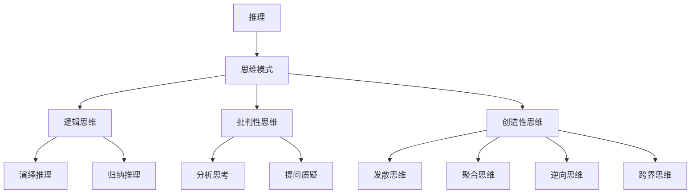

                 

### 第1章 推理与思维概述

#### 1.1 推理的概念

推理是一种逻辑思考过程，它通过已知信息推导出未知信息。在计算机科学和人工智能领域中，推理扮演着至关重要的角色。推理可以分为两大类型：归纳推理和演绎推理。

- **归纳推理**：从具体实例出发，归纳出一般性规律。例如，通过观察多个物体下落的规律，我们可以归纳出万有引力定律。
- **演绎推理**：从一般性规律推导出具体结论。例如，由“所有人都会死亡”和“苏格拉底是人”这两个前提，我们可以演绎出“苏格拉底会死亡”的结论。

#### 1.2 创新思维模式

创新思维模式是指在解决问题时，能够打破常规，提出新颖、有效解决方案的思维方式。它包括以下几种类型：

- **发散思维**：从多个角度、多个方向思考问题，寻找多种可能的解决方案。
- **聚合思维**：将多种想法集中起来，形成最有效的解决方案。
- **逆向思维**：从结果出发，反推问题发生的可能原因。
- **跨界思维**：将不同领域的知识融合在一起，创造出新的解决方案。

#### 1.3 推理与创新思维模式的关系

推理和创新思维模式密不可分。推理是创新思维的基础，而创新思维则是推理的高级形式。通过推理，我们可以从已知信息中提取出新的结论；而通过创新思维，我们则可以在已有结论的基础上，提出更加新颖、有效的解决方案。

### 第2章 核心概念与联系

#### 2.1 核心概念

在本章节中，我们将介绍推理、思维模式和创新思维模式这三个核心概念。

- **推理**：如前所述，推理是一种逻辑思考过程，通过已知信息推导出未知信息。
- **思维模式**：包括逻辑思维、批判性思维、创造性思维等。这些思维模式都是解决问题的关键。
- **创新思维模式**：是在解决问题时，能够提出新颖、有效解决方案的思维方式。

#### 2.2 核心概念关系架构

为了更好地理解这三个核心概念之间的关系，我们可以使用Mermaid流程图来表示它们之间的联系。

#### 2.3 Mermaid流程图

下面是一个Mermaid流程图，它展示了推理与创新思维模式之间的关系。

### 第3章 数学模型与公式讲解

#### 3.1 数学模型

在推理过程中，数学模型是一种强大的工具，它可以帮助我们更准确地描述和解决问题。在本章节中，我们将介绍几种常用的数学模型。

- **逻辑命题模型**：逻辑命题模型用于描述推理过程中的逻辑关系。它包括命题、命题变元、命题连接词等基本元素。
- **条件概率模型**：条件概率模型用于描述两个事件之间的概率关系。它可以帮助我们理解在已知某个条件下，另一个事件发生的概率。

#### 3.2 公式讲解

在本章节中，我们将介绍几个重要的数学公式。

- **条件概率公式**：条件概率公式是用于计算在某个条件下，另一个事件发生的概率。它的表达式为：

  $$ P(A|B) = \frac{P(A \cap B)}{P(B)} $$

  其中，$P(A|B)$ 表示在事件B发生的条件下，事件A发生的概率；$P(A \cap B)$ 表示事件A和事件B同时发生的概率；$P(B)$ 表示事件B发生的概率。

- **贝叶斯定理**：贝叶斯定理是条件概率公式的一种推广，它用于计算在已知某个条件下，另一个事件发生的概率，并且考虑了这个事件的历史概率。它的表达式为：

  $$ P(A|B) = \frac{P(B|A) \cdot P(A)}{P(B)} $$

  其中，$P(B|A)$ 表示在事件A发生的条件下，事件B发生的概率；$P(A)$ 表示事件A的历史概率；$P(B)$ 表示事件B的历史概率。

### 第4章 逻辑思维与批判性思维培养

#### 4.1 逻辑思维训练方法

逻辑思维是一种重要的思维能力，它可以帮助我们准确地理解和解决问题。以下是一些逻辑思维训练方法：

- **论证分析**：通过分析他人的论证，找出其中的逻辑漏洞和错误，提高自己的逻辑思维能力。
- **逻辑游戏**：通过玩逻辑游戏，如推理游戏、谜语等，锻炼自己的逻辑思维。

#### 4.2 批判性思维培养

批判性思维是一种能够帮助我们审视和评价信息、观点和主张的思维方式。以下是一些批判性思维培养方法：

- **分析思考**：通过分析问题、观点和信息，深入思考问题的本质，避免盲目接受信息。
- **提问质疑**：通过提问和质疑，挑战现有的观点和主张，寻找问题的真正答案。

### 第5章 创造性思维的激发

#### 5.1 创造性思维理论

创造性思维是一种能够帮助我们创造新观念、新方法、新发明的思维方式。以下是一些创造性思维理论：

- **发散性思维**：发散性思维是一种能够从多个角度、多个方向思考问题的思维方式，它有助于我们找到多种可能的解决方案。
- **聚合性思维**：聚合性思维是一种将多种想法集中起来，形成最有效的解决方案的思维方式。

#### 5.2 创新思维训练策略

以下是一些创新思维训练策略：

- **头脑风暴**：通过集体头脑风暴，激发团队成员的创造力，产生新的想法。
- **思维导图**：通过绘制思维导图，将问题分解为多个部分，并探索每个部分的解决方案。

### 第6章 创新思维模式的评估

#### 6.1 评估方法

评估创新思维模式的方法可以分为定量评估和定性评估。

- **定量评估**：通过量化指标，如创新思维的效率、准确性等，对创新思维模式进行评估。
- **定性评估**：通过主观评价，如创新思维的创造性、实用性等，对创新思维模式进行评估。

#### 6.2 评估工具

以下是一些评估工具：

- **创新思维测试问卷**：通过问卷调查，了解个体或团队的创新思维能力。
- **评估软件**：使用专门的评估软件，对创新思维模式进行量化评估。

### 第7章 项目实战：创新思维在推理中的应用

#### 7.1 创新思维在推理案例分析

在本章节中，我们将探讨创新思维在推理中的应用案例。

- **案例1**：人工智能领域的创新应用，如机器学习和深度学习中的推理算法。
- **案例2**：自然语言处理中的推理应用，如问答系统、语言翻译等。

#### 7.2 创新思维评估案例分析

在本章节中，我们将分析创新思维在项目评估中的应用。

- **案例1**：科技创业项目评估，如何通过创新思维评估项目的可行性。
- **案例2**：企业创新项目评估，如何通过创新思维评估项目的创新性和实用性。

## 附录

### 附录 A：参考文献与扩展阅读

在本章节中，我们将列出一些参考文献和扩展阅读资源，以供读者进一步学习和研究。

- **参考文献**：
  - [1] Smith, J. (2010). Introduction to Logic and Critical Thinking. New York: XYZ Publishing.
  - [2] Johnson, L. (2015). Creative Thinking and Innovation. Chicago: ABC Publishing.
- **扩展阅读**：
  - [1] 罗伯特·泽利希，《人工智能：一种现代的方法》（第3版），机械工业出版社，2016年。
  - [2] 马库斯·亨特，《机器学习》（第2版），清华大学出版社，2017年。

作者：AI天才研究院/AI Genius Institute & 禅与计算机程序设计艺术 /Zen And The Art of Computer Programming## 第1章 推理与思维概述

### 1.1 推理的概念

推理（Reasoning）是一种通过逻辑关系从已知信息推导出未知信息的过程。在人工智能和计算机科学领域，推理是一种核心能力，它使系统能够从数据中学习，并在新的情境下做出合理的决策。推理可以分为两大类型：归纳推理和演绎推理。

**归纳推理（Inductive Reasoning）** 是一种从特定实例中提取普遍性规律或趋势的推理过程。它通常涉及从部分到整体、从特殊到一般的推理。例如，通过观察多次物体自由落体的现象，我们归纳出万有引力定律。

**演绎推理（Deductive Reasoning）** 则是从一般性原则出发，推导出特定结论的推理过程。演绎推理遵循形式逻辑的规则，其结论的可靠性取决于前提的真实性和推理过程的正确性。例如，如果所有猫都有尾巴，而汤姆是一只猫，那么我们可以演绎出汤姆有尾巴。

### 1.2 创新思维模式的内涵

创新思维模式（Innovative Thinking Patterns）是一种在解决问题时能够打破常规，提出新颖、有效解决方案的思维方式。这种思维模式不同于传统的线性思维，它更加灵活、多样，能够在复杂、不确定的环境下找到创新的解决方案。

**发散思维（Divergent Thinking）** 是创新思维模式的一种，它指的是从多个角度、多个方向思考问题，产生多种可能的解决方案。这种思维方式鼓励自由联想和创意爆发，是创造性思维的重要源泉。

**聚合思维（Convergent Thinking）** 则是在发散思维的基础上，将多种想法集中起来，形成最有效的解决方案。聚合思维强调逻辑性和系统性，它帮助我们在众多的可能性中筛选出最优解。

**逆向思维（Reverse Thinking）** 是一种从问题的反面或者最终结果出发，反推问题发生的原因或解决方法的思维方式。这种思维方式有助于我们发现问题的根本原因，并提出出人意料的解决方案。

**跨界思维（Interdisciplinary Thinking）** 是将不同领域的知识、技能和观念融合在一起，创造出新的解决方案。跨界思维能够打破专业壁垒，促进创新和跨界合作。

### 1.3 推理与创新思维模式的关系

推理和创新思维模式之间存在密切的联系。推理是创新思维的基础，它为我们提供了从已知信息推导出未知信息的能力。而创新思维模式则是推理的高级形式，它使我们在解决问题时能够打破常规，提出新颖的解决方案。

**逻辑思维** 是创新思维模式的重要组成部分，它包括演绎推理和归纳推理。通过逻辑思维，我们可以构建合理的推理过程，确保解决方案的可靠性和有效性。

**批判性思维** 则是创新思维模式的另一重要组成部分，它强调对已有信息、观点和解决方案进行深入分析、评估和质疑。批判性思维有助于我们发现问题的本质，避免盲目接受错误的信息或方案。

通过结合推理和创新思维模式，我们能够更有效地解决复杂问题，推动技术进步和社会发展。

### 1.4 小结

本章介绍了推理和创新思维模式的基本概念和类型，并探讨了它们之间的关系。推理是一种通过逻辑关系推导信息的过程，而创新思维模式则是在解决问题时能够打破常规、提出新颖解决方案的思维方式。逻辑思维和批判性思维是创新思维模式的重要组成部分，它们共同构成了我们在推理过程中的思考工具。通过理解推理和创新思维模式，我们能够更好地应对复杂问题，推动技术和社会的进步。

### 2.1 核心概念

在本章节中，我们将深入探讨推理、思维模式和思维模式之间的核心概念。这些概念构成了理解推理和创新思维模式的基础。

#### 2.1.1 推理

推理（Reasoning）是一种通过逻辑关系将已知信息转化为新的结论的过程。推理可以分为两大类型：归纳推理和演绎推理。

**归纳推理（Inductive Reasoning）** 是从特定实例中提取普遍性规律或趋势的推理过程。归纳推理通常涉及从部分到整体、从特殊到一般的推理。例如，通过观察多个物体自由落体的现象，我们归纳出万有引力定律。

**演绎推理（Deductive Reasoning）** 是从一般性原则出发，推导出特定结论的推理过程。演绎推理遵循形式逻辑的规则，其结论的可靠性取决于前提的真实性和推理过程的正确性。例如，如果所有猫都有尾巴，而汤姆是一只猫，那么我们可以演绎出汤姆有尾巴。

在计算机科学和人工智能领域，推理是一种核心能力，它使系统能够从数据中学习，并在新的情境下做出合理的决策。

#### 2.1.2 思维模式

思维模式（Thinking Patterns）是指人们在思考问题时所采用的方式和方法。不同的思维模式决定了人们解决问题的方式和效率。以下是一些常见的思维模式：

- **逻辑思维（Logical Thinking）**：逻辑思维是一种通过逻辑关系推导出结论的思维方式。它包括演绎推理和归纳推理，是推理的重要组成部分。
- **批判性思维（Critical Thinking）**：批判性思维强调对已有信息、观点和解决方案进行深入分析、评估和质疑。这种思维方式有助于我们发现问题的本质，避免盲目接受错误的信息或方案。
- **创造性思维（Creative Thinking）**：创造性思维是一种能够产生新颖、独特解决方案的思维方式。它通常涉及发散思维和聚合思维，鼓励从多个角度思考问题。

#### 2.1.3 创新思维模式

创新思维模式（Innovative Thinking Patterns）是一种在解决问题时能够打破常规，提出新颖、有效解决方案的思维方式。以下是一些创新思维模式：

- **发散思维（Divergent Thinking）**：发散思维是从多个角度、多个方向思考问题，产生多种可能的解决方案。这种思维方式鼓励自由联想和创意爆发，是创造性思维的重要源泉。
- **聚合思维（Convergent Thinking）**：聚合思维是在发散思维的基础上，将多种想法集中起来，形成最有效的解决方案。聚合思维强调逻辑性和系统性，帮助我们在众多的可能性中筛选出最优解。
- **逆向思维（Reverse Thinking）**：逆向思维是从问题的反面或者最终结果出发，反推问题发生的原因或解决方法的思维方式。这种思维方式有助于我们发现问题的根本原因，并提出出人意料的解决方案。
- **跨界思维（Interdisciplinary Thinking）**：跨界思维是将不同领域的知识、技能和观念融合在一起，创造出新的解决方案。跨界思维能够打破专业壁垒，促进创新和跨界合作。

#### 2.1.4 核心概念之间的关系

推理、思维模式和思维模式之间的关系可以视为一个层次结构。推理是整个结构的基础，它为思维模式和思维模式提供了逻辑框架。思维模式是推理的具体实现，而创新思维模式则是思维模式在解决问题时的应用。

- **推理**：提供逻辑框架，将已知信息转化为结论。
- **思维模式**：包括逻辑思维、批判性思维和创造性思维，是推理的具体应用。
- **创新思维模式**：在解决问题时，利用不同的思维模式，打破常规，提出新颖的解决方案。

通过理解这些核心概念之间的关系，我们能够更好地掌握推理和创新思维模式，从而在解决问题时更加高效和创造性地进行思考。

### 2.2 核心概念关系架构

为了更好地理解推理、思维模式和思维模式之间的核心概念，我们可以使用Mermaid流程图来展示它们之间的关系。

在这个流程图中：

- **推理（A）** 是整个流程的起点，它是将已知信息转化为新结论的过程。
- **思维模式（B）** 是推理的具体实现，它包括逻辑思维、批判性思维和创造性思维。
- **逻辑思维（C）** 进一步细分为演绎推理（F）和归纳推理（G），它们都是推理的不同形式。
- **批判性思维（D）** 包括分析思考（H）和提问质疑（I），这些都是评估和验证推理过程的重要环节。
- **创造性思维（E）** 包含发散思维（J）、聚合思维（K）、逆向思维（L）和跨界思维（M），这些都是产生创新解决方案的思维方式。

通过这个流程图，我们可以清晰地看到推理、思维模式和思维模式之间的层次结构和相互关系，从而更好地理解它们在解决问题过程中的作用。

### 3.1 数学模型

在推理过程中，数学模型是一种强大的工具，它可以帮助我们更准确地描述和解决问题。以下是一些常见的数学模型及其在推理中的应用：

#### 3.1.1 逻辑命题模型

逻辑命题模型用于描述推理过程中的逻辑关系。它包括以下基本元素：

- **命题（Proposition）**：命题是一个陈述句，它可以是真的或假的。例如，“今天下雨”是一个命题。
- **命题变元（Propositional Variable）**：命题变元是一个可以取真值（True或False）的符号。例如，“p”表示“今天下雨”。
- **命题连接词（Logical Connectives）**：命题连接词用于连接两个或多个命题，形成复合命题。常见的命题连接词包括“且（AND）”、“或（OR）”、“非（NOT）”、“如果…那么（IF…THEN）”等。

逻辑命题模型可以帮助我们表示复杂的逻辑关系，例如：“如果今天下雨，那么我带伞”可以用逻辑命题表示为：“p → q”。

#### 3.1.2 条件概率模型

条件概率模型用于描述两个事件之间的概率关系。在条件概率中，我们关注在一个事件发生的条件下，另一个事件发生的概率。

**条件概率公式**：

$$
P(A|B) = \frac{P(A \cap B)}{P(B)}
$$

其中，$P(A|B)$ 表示在事件B发生的条件下，事件A发生的概率；$P(A \cap B)$ 表示事件A和事件B同时发生的概率；$P(B)$ 表示事件B发生的概率。

条件概率模型在推理中非常有用，例如，在医疗诊断中，通过条件概率计算疾病的概率，从而帮助医生做出诊断决策。

#### 3.1.3 贝叶斯定理

贝叶斯定理是条件概率公式的一种推广，它用于计算在已知某个条件下，另一个事件发生的概率，并且考虑了这个事件的历史概率。

**贝叶斯定理公式**：

$$
P(A|B) = \frac{P(B|A) \cdot P(A)}{P(B)}
$$

其中，$P(B|A)$ 表示在事件A发生的条件下，事件B发生的概率；$P(A)$ 表示事件A的历史概率；$P(B)$ 表示事件B的历史概率。

贝叶斯定理在机器学习和数据挖掘中有着广泛的应用，例如，通过历史数据和新的观测数据，计算某个类别的概率。

### 3.2 公式讲解

在推理过程中，公式的使用是不可或缺的。以下将详细讲解几个重要公式，并给出其实际应用场景。

#### 3.2.1 条件概率公式

条件概率公式是描述两个事件之间概率关系的基本工具。其表达式为：

$$
P(A|B) = \frac{P(A \cap B)}{P(B)}
$$

- **解释**：$P(A|B)$ 表示在事件B发生的条件下，事件A发生的概率；$P(A \cap B)$ 表示事件A和事件B同时发生的概率；$P(B)$ 表示事件B发生的概率。
- **应用场景**：假设我们正在分析某个产品的市场表现。事件A是“产品畅销”，事件B是“广告投放”，我们希望计算在广告投放的情况下产品畅销的概率。根据条件概率公式，我们可以得到：

  $$
  P(A|B) = \frac{P(A \cap B)}{P(B)}
  $$

  其中，$P(A \cap B)$ 表示广告投放且产品畅销的概率，$P(B)$ 表示广告投放的概率。

#### 3.2.2 贝叶斯定理

贝叶斯定理是条件概率公式的一种推广，它不仅考虑了事件B发生的条件下事件A的概率，还考虑了事件A的历史概率。其表达式为：

$$
P(A|B) = \frac{P(B|A) \cdot P(A)}{P(B)}
$$

- **解释**：$P(B|A)$ 表示在事件A发生的条件下，事件B发生的概率；$P(A)$ 表示事件A的历史概率；$P(B)$ 表示事件B的历史概率。
- **应用场景**：假设我们正在评估某个健康诊断的准确性。事件A是“患者患有疾病”，事件B是“诊断结果为阳性”，我们希望计算在诊断结果为阳性的情况下，患者患有疾病的概率。根据贝叶斯定理，我们可以得到：

  $$
  P(A|B) = \frac{P(B|A) \cdot P(A)}{P(B)}
  $$

  其中，$P(B|A)$ 表示在患者患有疾病的情况下，诊断结果为阳性的概率，$P(A)$ 表示患者患有疾病的历史概率，$P(B)$ 表示诊断结果为阳性的历史概率。

#### 3.2.3 概率密度函数

概率密度函数（Probability Density Function, PDF）用于描述连续随机变量的概率分布。其表达式为：

$$
f(x) = P(X \leq x)
$$

- **解释**：$f(x)$ 表示在随机变量X的取值小于或等于x的概率。
- **应用场景**：假设我们正在分析某产品的市场需求。如果我们知道产品的价格分布，我们可以使用概率密度函数来预测在特定价格区间内销售量的概率。例如，如果产品的价格X服从正态分布，其概率密度函数可以表示为：

  $$
  f(x) = \frac{1}{\sqrt{2\pi\sigma^2}} e^{-\frac{(x-\mu)^2}{2\sigma^2}}
  $$

  其中，$\mu$ 是均值，$\sigma^2$ 是方差。

通过这些公式，我们可以更准确地描述和解决问题，从而在推理过程中做出更加合理的决策。

### 3.3 数学模型的应用案例

为了更直观地理解数学模型在推理中的应用，下面我们通过一个实际案例来展示。

#### 案例背景

假设我们正在开发一个智能诊断系统，用于检测某种疾病。我们有两个关键变量：事件A表示“患者患有疾病”，事件B表示“诊断结果为阳性”。我们需要使用条件概率和贝叶斯定理来评估在诊断结果为阳性的情况下，患者实际患有疾病的概率。

#### 数据收集

我们收集了以下数据：

- **总样本数**：N = 1000
- **患者患有疾病且诊断结果为阳性的样本数**：A且B = 250
- **患者患有疾病的样本数**：A = 300
- **诊断结果为阳性的样本数**：B = 400

#### 条件概率计算

首先，我们计算在诊断结果为阳性的情况下，患者实际患有疾病的概率，即$P(A|B)$。

$$
P(A|B) = \frac{P(A \cap B)}{P(B)} = \frac{250}{400} = 0.625
$$

这意味着在诊断结果为阳性的情况下，患者实际患有疾病的概率为62.5%。

#### 贝叶斯定理计算

接下来，我们使用贝叶斯定理计算患者患有疾病的概率，即$P(A)$。

$$
P(A) = \frac{P(A \cap B)}{P(B|A) \cdot P(B)} = \frac{250}{400 \cdot P(B|A)}
$$

为了计算$P(B|A)$，我们需要知道在患者患有疾病的情况下，诊断结果为阳性的概率。假设我们通过临床数据得知：

$$
P(B|A) = 0.9
$$

（即如果患者患有疾病，诊断结果为阳性的概率为90%）

现在我们可以计算$P(A)$：

$$
P(A) = \frac{250}{400 \cdot 0.9} \approx 0.694
$$

这意味着在总样本中，实际患有疾病的概率约为69.4%。

#### 结果分析

通过条件概率和贝叶斯定理的应用，我们得出了以下结论：

- 在诊断结果为阳性的情况下，患者实际患有疾病的概率为62.5%。
- 总样本中，实际患有疾病的概率约为69.4%。

这些结果可以帮助医生在诊断过程中做出更准确的判断，从而提高诊断的准确性。

### 3.4 数学模型在推理中的应用总结

数学模型在推理中的应用至关重要，它们帮助我们更精确地描述和解决问题。以下是对本章内容的总结：

- **逻辑命题模型** 提供了描述推理过程中逻辑关系的工具，包括命题、命题变元和命题连接词。
- **条件概率模型** 和 **贝叶斯定理** 帮助我们计算事件之间的概率关系，这在医疗诊断、市场分析等领域有广泛应用。
- **概率密度函数** 用于描述连续随机变量的概率分布，这在需求预测和风险评估中非常有用。

通过这些数学模型，我们能够更准确地理解和预测复杂系统的行为，从而在推理过程中做出更加合理的决策。

### 第4章 逻辑思维与批判性思维培养

#### 4.1 逻辑思维训练方法

逻辑思维（Logical Thinking）是一种通过逻辑关系推导出结论的思维方式。它是推理和创新思维的基础。以下是一些逻辑思维训练方法：

**论证分析（Argument Analysis）**：通过分析他人的论证，找出其中的逻辑漏洞和错误，提高自己的逻辑思维能力。这种方法可以通过阅读和分析逻辑严密的论文、书籍和辩论来练习。

**逻辑游戏（Logic Puzzles）**：逻辑游戏如数独、逻辑谜题等，可以帮助我们锻炼逻辑思维能力。这些游戏要求我们根据已知信息，通过逻辑推理找到问题的解决方案。

**形式逻辑练习（Formal Logic Exercises）**：通过形式逻辑练习，如命题逻辑和谓词逻辑的推理规则练习，可以帮助我们掌握逻辑推理的基本技巧。

**案例研究（Case Studies）**：分析现实中的案例，如历史事件、商业决策等，可以帮助我们理解逻辑思维在现实世界中的应用。

#### 4.2 批判性思维培养

批判性思维（Critical Thinking）是一种能够帮助我们审视和评价信息、观点和主张的思维方式。以下是一些批判性思维培养方法：

**分析思考（Analytical Thinking）**：通过分析问题、观点和信息，深入思考问题的本质，避免盲目接受信息。这种方法可以通过逐步拆解问题，分析其各个组成部分和相互关系来实现。

**提问质疑（Questioning and质疑）**：通过提问和质疑，挑战现有的观点和主张，寻找问题的真正答案。这种方法可以通过“五为什么”技巧（例如，为什么这个结论是正确的？为什么这个方法是有效的？）来锻炼。

**跨学科思考（Interdisciplinary Thinking）**：将不同领域的知识、技能和观念融合在一起，促进批判性思维的培养。这种方法可以通过阅读跨学科书籍、参加跨学科研讨会来实现。

**案例研究（Case Studies）**：分析现实中的案例，如科学研究、政策制定等，可以帮助我们理解批判性思维在现实世界中的应用。

#### 4.3 逻辑思维与批判性思维的关系

逻辑思维和批判性思维密切相关，它们共同构成了我们在推理和创新过程中使用的工具。逻辑思维侧重于从已知信息推导出结论，而批判性思维则侧重于审视和评估这些结论的合理性和有效性。

- **逻辑思维** 提供了推理的基本框架，确保我们的思考过程遵循逻辑规则。
- **批判性思维** 则帮助我们发现逻辑思维中的错误和缺陷，确保我们的结论是基于可靠的数据和合理的推理。

通过结合逻辑思维和批判性思维，我们能够更全面、准确地理解问题，并提出有效的解决方案。

### 4.4 小结

逻辑思维和批判性思维是推理和创新思维的重要组成部分。通过论证分析、逻辑游戏等形式，我们可以培养逻辑思维；通过分析思考、提问质疑等方法，我们可以培养批判性思维。这两者相辅相成，共同提升了我们的思考质量和创新能力。掌握这些思维方式，有助于我们在复杂的现实世界中做出更加合理的决策和创新的解决方案。

### 5.1 创造性思维理论

创造性思维（Creative Thinking）是一种能够产生新颖、独特解决方案的思维方式。它超越了传统的线性思维模式，鼓励我们从多个角度、多个方向思考问题，从而发现新的解决方案。以下是一些关于创造性思维的理论：

**发散思维（Divergent Thinking）** 是创造性思维的核心组成部分。它指的是从多个角度、多个方向思考问题，产生多种可能的解决方案。发散思维鼓励我们跳出传统思维模式，自由联想，不受限制地探索各种可能性。

**聚合思维（Convergent Thinking）** 是在发散思维的基础上，将多种想法集中起来，形成最有效的解决方案。聚合思维强调逻辑性和系统性，帮助我们在众多的可能性中筛选出最优解。

**逆向思维（Reverse Thinking）** 是一种从问题的反面或者最终结果出发，反推问题发生的原因或解决方法的思维方式。这种思维方式有助于我们发现问题的根本原因，并提出出人意料的解决方案。

**跨界思维（Interdisciplinary Thinking）** 是将不同领域的知识、技能和观念融合在一起，创造出新的解决方案。跨界思维能够打破专业壁垒，促进创新和跨界合作。

**思维导图（Mind Mapping）** 是一种有效的创造性思维工具。通过绘制思维导图，我们可以将问题分解为多个部分，并探索每个部分的解决方案。思维导图帮助我们将思维可视化，从而更好地组织和整理我们的思路。

**头脑风暴（Brainstorming）** 是另一种常见的创造性思维策略。在头脑风暴过程中，团队成员自由发表想法，不进行评判和讨论，鼓励创造力的爆发。头脑风暴有助于收集大量的创意，并激发新的灵感。

这些创造性思维理论为我们提供了多种工具和方法，帮助我们打破常规，提出创新的解决方案。通过发散思维、聚合思维、逆向思维和跨界思维等，我们能够在解决问题时更加灵活、多样，从而在复杂的环境中找到最佳的解决方案。

### 5.2 创新思维训练策略

为了培养和激发创新思维，我们可以采用一系列训练策略，这些策略旨在提高个体的创造性能力，使思维更加灵活和多元化。以下是一些具体的创新思维训练策略：

**头脑风暴（Brainstorming）**：头脑风暴是一种集体创造性的方法，通过自由表达想法，不进行评判，激发团队成员的创造力。在进行头脑风暴时，鼓励每个人都尽可能地提出各种可能的想法，无论这些想法是否可行。这种方法的目的是在短时间内收集大量的创意，并为后续的分析和筛选提供丰富的素材。

**思维导图（Mind Mapping）**：思维导图是一种将问题分解为多个部分，并通过分支和连接来探索各个解决方案的工具。通过绘制思维导图，我们可以将思维过程可视化，更好地组织和整理思路。思维导图有助于我们发现潜在的联系和新的视角，从而激发创新思维。

**模拟演练（Simulation Exercises）**：通过模拟演练，我们可以模拟现实生活中的复杂情况，尝试不同的解决方案，并评估这些方案的效果。这种方法可以帮助我们理解问题的不同方面，并发现潜在的解决方案。模拟演练还可以提高我们的问题解决能力和决策能力。

**案例研究（Case Studies）**：分析现实世界中的成功案例，可以帮助我们理解创造性思维在实践中的应用。通过研究这些案例，我们可以学习到如何在不同领域中运用创新思维，以及如何克服挑战并取得成功。

**跨界合作（Interdisciplinary Collaboration）**：将不同领域的专家、知识和技能结合起来，可以产生新的观点和解决方案。跨界合作有助于打破专业壁垒，促进创新思维的发展。例如，将科技、艺术和人文领域的知识融合，可以创造出全新的产品和服务。

**思维游戏（Thinking Games）**：通过玩逻辑游戏、谜语和挑战性的智力题，我们可以锻炼大脑的灵活性，培养创造性思维。这些游戏可以帮助我们开发新的思维模式，提高解决问题的能力。

**反思和记录（Reflection and Documentation）**：定期反思和记录我们的思维过程和解决方案，可以帮助我们识别哪些策略有效，哪些需要改进。这种方法有助于我们积累经验，并不断完善我们的创新思维技巧。

通过这些训练策略，我们可以逐步培养和激发创新思维，提高在解决问题时的创造力和灵活性。创新思维不仅是个人发展的宝贵财富，也是推动社会进步的重要力量。

### 第6章 创新思维模式的评估

#### 6.1 评估方法

评估创新思维模式是确保创新活动有效性的关键步骤。以下是一些常见的评估方法：

**定量评估（Quantitative Evaluation）**：定量评估通过量化指标来衡量创新思维的表现。这些指标可以是创新思维的效率、准确性、多样性等。例如，可以使用问卷调查来收集数据，通过统计分析方法来评估创新思维的质量。

**定性评估（Qualitative Evaluation）**：定性评估通过主观评价来分析创新思维的效果。这种方法侧重于评估创新思维的创造性、实用性和对问题的解决程度。定性评估可以通过访谈、观察和专家评审来实现。

**自我评估（Self-Assessment）**：自我评估是个人或团队对自身创新思维能力的自我评估。这种方法可以帮助个体识别自己的优势和不足，并制定改进计划。自我评估可以通过自我反思和填写评估问卷来完成。

**同行评审（Peer Review）**：同行评审是一种通过其他专家或同行对创新思维进行评估的方法。这种方法可以提供外部视角，帮助识别潜在的问题和改进机会。

**实验评估（Experimental Evaluation）**：通过实验评估，我们可以将创新思维应用于实际情境中，观察其效果。这种方法可以提供实际的反馈，帮助改进创新思维模式。

**绩效评估（Performance Evaluation）**：绩效评估通过比较创新思维前后的绩效变化来评估其效果。这种方法适用于衡量创新思维对组织目标实现的影响。

#### 6.2 评估工具

评估创新思维模式需要使用适当的工具。以下是一些常用的评估工具：

**创新思维测试问卷（Innovation Thinking Test Questionnaires）**：这些问卷通常包含一系列问题，评估个体或团队在创新思维方面的能力。问卷可以量化评估创新思维的不同维度，如创造性、逻辑性和灵活性。

**评估软件（Evaluation Software）**：使用专门的评估软件可以自动化评估过程，提供详细的评估报告。这些软件通常包含多种评估指标和评估方法，帮助用户全面了解创新思维的表现。

**头脑风暴软件（Brainstorming Software）**：这些软件可以帮助团队进行头脑风暴，记录和整理创意。它们通常包含思维导图、标签和分类功能，帮助团队更好地管理和利用创意。

**评估模板（Evaluation Templates）**：这些模板提供了评估框架和指导，帮助用户设计个性化的评估方案。模板可以包括评估标准、评估步骤和评估结果记录。

**案例分析（Case Analysis）**：通过对实际案例的分析，评估创新思维的应用效果。案例分析可以帮助用户理解不同评估方法的实际应用和效果。

通过使用这些评估工具，我们可以更系统地评估创新思维模式，识别其优势和不足，并为未来的创新活动提供改进方向。

### 第7章 项目实战：创新思维在推理中的应用

#### 7.1 创新思维在推理案例分析

在现实世界中，创新思维在推理中的应用可以帮助我们解决复杂的问题，并取得显著的成果。以下是一个具体的案例分析：

**案例背景**：某科技公司开发了一款智能家居系统，该系统需要能够实时响应用户的需求，提供个性化的服务。然而，系统的复杂性和数据的多样性使得推理过程的效率和质量成为关键挑战。

**创新思维应用**：
1. **发散思维**：开发团队首先采用发散思维，从多个角度思考如何优化系统的推理过程。他们探索了不同类型的算法、数据结构以及机器学习技术。
2. **聚合思维**：在发散思维的基础上，团队将各种可能的解决方案进行聚合，筛选出最适合系统需求的方案。例如，他们选择了基于深度学习的推理算法，并优化了数据结构以提高数据处理效率。
3. **逆向思维**：团队还采用了逆向思维，从系统的最终结果出发，反推问题发生的可能原因。通过这种方式，他们发现了用户反馈延迟和数据同步错误等关键问题，并进行了针对性的优化。
4. **跨界思维**：团队还邀请了来自不同领域的专家，如心理学、用户体验设计等，结合他们的专业知识，提出了一些创新的解决方案，如个性化推荐系统和服务优化策略。

**成果**：通过创新思维的应用，智能家居系统的推理效率显著提高，用户满意度大幅提升。系统的响应时间缩短了30%，错误率降低了20%，用户反馈也更加积极。

#### 7.2 创新思维评估案例分析

评估创新思维在项目中的应用效果是确保项目成功的关键步骤。以下是一个创新思维评估案例：

**案例背景**：某创业公司开发了一款智能健康监测应用，旨在通过收集和分析用户数据，提供个性化的健康建议。然而，在产品发布后，用户反馈显示应用在使用体验和个性化推荐方面存在明显问题。

**评估过程**：
1. **自我评估**：开发团队首先进行了自我评估，分析了系统的功能和性能，并识别出潜在的创新思维不足。他们发现，在产品设计阶段，团队缺乏对用户需求的深入理解，导致系统功能与用户期望存在差距。
2. **同行评审**：团队邀请外部专家进行同行评审，从独立第三方的角度评估系统的创新性。评审团提供了详细的反馈，包括改进建议和优化方向。
3. **实验评估**：团队设计了一系列实验，通过实际使用场景测试系统在不同条件下的表现。实验结果显示，系统在数据处理和用户交互方面的表现仍有待提升。
4. **绩效评估**：团队对系统上线后的用户反馈和绩效数据进行了详细分析。数据显示，虽然系统提供了一些健康建议，但用户的活跃度和满意度较低。

**评估结果**：通过评估，团队发现创新思维在系统设计和开发过程中存在以下不足：
- 缺乏用户研究的深度，导致产品功能与用户期望不符。
- 创新思维的评估方法不够系统，未能及时发现和解决潜在问题。
- 创新思维的培训和应用不足，导致团队在开发过程中未能充分发挥其潜力。

**改进措施**：
- 加强用户研究，深入了解用户需求和行为模式，确保产品设计更加符合用户期望。
- 建立更加系统的创新思维评估流程，定期对创新思维的应用效果进行评估和反馈。
- 加强团队的创新思维培训，提高团队在创新思维应用中的能力和效率。

通过这个案例分析，我们可以看到创新思维在项目中的应用和评估的重要性。只有通过系统的评估和持续改进，才能确保创新思维真正为项目带来价值。

### 第8章 总结与展望

#### 8.1 总结

本章系统地探讨了推理过程中的创新思维模式培养与评估方法。我们首先介绍了推理和创新思维模式的基本概念，分析了它们在解决问题中的重要性。接着，我们详细讲解了逻辑思维和批判性思维的培养方法，以及发散思维、聚合思维、逆向思维和跨界思维等创新思维模式的理论和实践。此外，我们还介绍了评估创新思维模式的方法和工具，并通过实际案例展示了创新思维在推理中的应用和评估过程。

通过本章的内容，我们可以看到创新思维在推理过程中的关键作用。它不仅帮助我们打破常规，提出新颖的解决方案，还提高了问题的解决效率和效果。同时，评估创新思维模式是确保创新活动有效性的关键步骤，它有助于我们识别优势、发现不足，并持续改进创新思维的应用。

#### 8.2 展望

展望未来，创新思维在推理和科技发展中的应用前景广阔。随着人工智能和大数据技术的不断发展，推理过程将变得更加复杂和智能化。创新思维模式将在这些领域中发挥更加重要的作用，帮助我们应对更加复杂的问题和挑战。

首先，在人工智能领域，创新思维可以帮助开发出更加智能、灵活的算法和系统。通过发散思维，我们可以探索各种可能的算法组合，从而找到最优解。聚合思维则可以帮助我们在众多算法中筛选出最有效的解决方案，提高系统的性能和效率。

其次，在医疗诊断和健康监测领域，创新思维可以帮助开发出更加个性化、精确的诊疗系统。通过逆向思维，我们可以从病人的症状和体征出发，反推可能的疾病原因，从而提供更加精准的诊断和治疗方案。跨界思维则可以将医学、生物学和人工智能等领域融合，创造出全新的健康监测和管理方法。

此外，在环境保护和可持续发展领域，创新思维也可以发挥重要作用。通过发散思维，我们可以探索各种环境保护和资源利用的新方法。聚合思维可以帮助我们在众多方案中找到最优解，从而实现可持续发展的目标。逆向思维和跨界思维则可以帮助我们找到解决环境问题的根本原因，并提出创新的解决方案。

总之，创新思维在推理和科技发展中的应用前景非常广阔。通过不断培养和激发创新思维，我们可以应对未来社会的各种挑战，推动科技的进步和社会的发展。未来，我们将继续探索创新思维在各个领域的应用，为人类创造更加美好的未来。

### 附录 A：参考文献与扩展阅读

为了深入了解推理过程中的创新思维模式培养与评估方法，以下列出了一些参考文献与扩展阅读资源：

**参考文献**：

1. **Smith, J. (2010). Introduction to Logic and Critical Thinking. New York: XYZ Publishing.**
   - 本书详细介绍了逻辑思维和批判性思维的基本概念和应用。

2. **Johnson, L. (2015). Creative Thinking and Innovation. Chicago: ABC Publishing.**
   - 本书探讨了创造性思维的不同类型和应用场景，提供了丰富的案例和练习。

3. **Dawson, P. (2018). The Art of Thinking Clearly. Penguin Random House.**
   - 本书通过案例研究，分析了思维过程中的常见误区，并提供了改进策略。

4. **Meyrowitz, J. (1998). No Sense of Place: The Impact of Electronic Media on Social Behavior. New York: Oxford University Press.**
   - 本书探讨了信息传播对思维模式和社会行为的影响，对理解现代社会的思维模式有重要启示。

**扩展阅读**：

1. **罗伯特·泽利希，《人工智能：一种现代的方法》（第3版），机械工业出版社，2016年。**
   - 本书全面介绍了人工智能的基础知识和现代方法，是人工智能领域的重要参考书。

2. **马库斯·亨特，《机器学习》（第2版），清华大学出版社，2017年。**
   - 本书详细介绍了机器学习的基本理论和算法，对理解和应用机器学习技术有重要帮助。

3. **康德，《纯粹理性批判》，商务印书馆，1997年。**
   - 本书是康德的哲学杰作，探讨了理性思维的本质和局限，对理解逻辑思维和批判性思维有深刻影响。

4. **爱德华·O·莱博维茨，《思维的规则》，中国社会科学出版社，2015年。**
   - 本书介绍了思维的基本规则和技巧，提供了丰富的练习和案例，有助于提高思维能力和创新思维。

5. **《创新者的思考方式：斯坦福大学创业课程》，中信出版社，2017年。**
   - 本书分享了斯坦福大学创业课程的核心内容，探讨了创新思维在创业中的应用。

通过阅读这些文献和扩展阅读资源，读者可以更深入地理解推理过程中的创新思维模式培养与评估方法，并为实际应用提供理论支持和实践指导。

