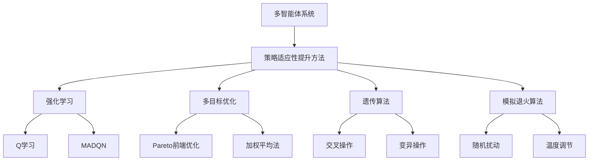

                 

# 提升AI模型在多智能体协作任务中的策略适应性

> 关键词：多智能体协作、AI模型、策略适应性、强化学习、深度强化学习、智能交通、无人机编队

> 摘要：本文深入探讨了AI模型在多智能体协作任务中的策略适应性，通过多智能体系统的概念、应用、核心概念、策略适应性提升方法、策略学习算法、数学模型以及实际案例，分析了如何提升AI模型的策略适应性，以实现更高效的多智能体协作。

# 《提升AI模型在多智能体协作任务中的策略适应性》目录大纲

## 第一部分：多智能体协作与AI模型策略

### 第1章 引言

#### 1.1 多智能体系统的概念与特征

- 多智能体系统（MAS）的定义
- 多智能体系统的特征
- 多智能体系统的应用领域

#### 1.2 AI模型在多智能体协作中的应用

- AI模型在MAS中的角色
- 多智能体协作中的挑战
- AI模型提升策略适应性的重要性

### 第2章 多智能体协作中的核心概念

#### 2.1 多智能体系统的体系结构

- 中央式与分布式架构
- 智能体通信机制
- 多智能体协同控制策略

#### 2.2 多智能体策略学习

- 强化学习在多智能体系统中的应用
- 多智能体强化学习算法
- 对称性与非对称性策略学习

### 第3章 AI模型在多智能体协作任务中的策略适应性

#### 3.1 策略适应性的概念与度量

- 策略适应性的定义
- 策略适应性的度量方法
- 策略适应性的评价指标

#### 3.2 策略适应性提升方法

- 遗传算法在策略优化中的应用
- 多目标优化算法
- 模拟退火算法

### 第4章 多智能体协作任务中的策略学习算法

#### 4.1 基于Q学习的策略学习

- Q学习算法原理
- 多智能体Q学习算法
- Python代码实现

#### 4.2 基于深度强化学习的策略学习

- 深度Q网络（DQN）原理
- 多智能体深度Q网络（MADQN）
- Python代码实现

### 第5章 策略适应性的数学模型与公式

#### 5.1 策略适应性数学模型

- 整体模型架构
- 策略适应性公式推导

#### 5.2 策略适应性公式讲解

- 公式含义
- 公式推导
- 实例分析

## 第二部分：策略适应性在多智能体协作任务中的应用

### 第6章 策略适应性在多智能体协作任务中的应用案例

#### 6.1 案例一：智能交通系统

- 案例背景
- 案例应用
- 案例分析

#### 6.2 案例二：无人机编队飞行

- 案例背景
- 案例应用
- 案例分析

### 第7章 策略适应性提升方法在多智能体系统中的实施策略

#### 7.1 实施策略概述

- 策略适应性提升方法的选择
- 实施流程

#### 7.2 实施策略案例分析

- 案例一：智能交通系统
- 案例二：无人机编队飞行

### 第8章 策略适应性与未来展望

#### 8.1 策略适应性研究的现状与趋势

- 策略适应性研究的现状
- 策略适应性研究的发展趋势

#### 8.2 未来研究方向与挑战

- 未来研究方向
- 面临的挑战

## 附录

### 附录A：常用算法与模型

#### A.1 Q学习算法

- 原理
- Python代码实现

#### A.2 DQN算法

- 原理
- Python代码实现

#### A.3 MADQN算法

- 原理
- Python代码实现

## 引言

多智能体协作任务在现代科技中日益重要，尤其在自动化和智能化的驱动下，许多领域都依赖于多智能体的协同工作。从智能交通系统到无人机编队飞行，从多机器人协作到智能电网调度，多智能体系统（MAS）的应用场景不断扩展。然而，多智能体协作任务中的一个关键挑战是如何确保AI模型能够具备良好的策略适应性。

### 1.1 多智能体系统的概念与特征

多智能体系统（MAS）是由多个自主智能体组成的系统，这些智能体可以相互通信、协作，共同完成任务。MAS具有以下几个核心特征：

1. **自主性**：每个智能体都可以自主决策，不受其他智能体的直接控制。
2. **分布性**：智能体可能分布在不同的地理位置，它们之间的交互通过网络进行。
3. **动态性**：环境状态和智能体的状态是动态变化的，这要求智能体具备实时适应能力。
4. **异构性**：智能体可能具有不同的能力、知识和目标，需要协调不同的策略来实现共同的目标。

MAS在多个领域都有广泛的应用，包括但不限于以下几个方面：

- **智能交通系统**：通过智能体的协同工作，实现交通流量的优化、事故预警和救援。
- **多机器人协作**：在工业制造、搜救、探索等领域，多个机器人需要协同完成任务。
- **智能电网**：智能体协同工作，实现能源的优化分配和电力系统的稳定运行。
- **无人机编队**：多无人机通过协同工作，实现高效的监视、搜救、物流运输等任务。

### 1.2 AI模型在多智能体协作中的应用

AI模型在MAS中扮演着重要的角色，主要包括以下两个方面：

1. **决策支持**：智能体根据环境状态和已学到的策略，自主做出决策，以实现预定的目标。
2. **协同控制**：智能体之间通过通信，共享信息，协同工作，以实现整体目标。

在多智能体协作中，AI模型面临的挑战主要包括：

- **不确定性**：环境状态和智能体行为的不确定性，使得AI模型需要具备鲁棒性。
- **协同性**：智能体之间需要协调策略，以避免冲突和效率低下。
- **适应性**：智能体需要能够适应动态变化的环境，并实时调整策略。

因此，提升AI模型的策略适应性成为一个重要的研究方向，本文将围绕这一主题展开深入讨论。

## 多智能体协作中的核心概念

在深入探讨AI模型在多智能体协作中的策略适应性之前，我们首先需要理解多智能体系统的核心概念。这些核心概念包括多智能体系统的体系结构、智能体通信机制和协同控制策略。

### 2.1 多智能体系统的体系结构

多智能体系统的体系结构可以分为中央式和分布式两种。

#### 2.1.1 中央式架构

在中央式架构中，所有智能体都连接到一个中央控制节点，该节点负责协调所有智能体的行为。中央式架构的优点是系统设计相对简单，且控制节点可以集中处理复杂任务。然而，其缺点也十分明显：系统的性能和可扩展性受限，因为所有决策都需要通过中央控制节点，这可能导致通信瓶颈和延迟。

中央式架构的一般形式如下：

```
中央控制节点
|
+----> 智能体1
|       智能体2
|       智能体3
|       ...
```

#### 2.1.2 分布式架构

分布式架构中，每个智能体都具有独立决策能力，并通过局部通信网络进行交互。分布式架构的优点是系统具有较高的灵活性和可扩展性，因为每个智能体都可以独立工作，并与其他智能体进行局部交互。然而，分布式架构的设计更为复杂，需要解决智能体之间的协同问题。

分布式架构的一般形式如下：

```
智能体1
 |
+----> 智能体2
 |       智能体3
 |       ...
 |       
+----> 智能体4
 |       智能体5
 |       ...
```

### 2.2 智能体通信机制

智能体之间的通信是实现协同控制的关键。智能体通信机制可以分为以下几种：

#### 2.2.1 完全信息通信

在完全信息通信中，每个智能体都能够获取所有其他智能体的状态信息，从而实现全局视角的协同控制。完全信息通信的优点是可以实现高效的协同控制，但其缺点是通信复杂度较高，且对网络带宽要求较高。

#### 2.2.2 部分信息通信

在部分信息通信中，每个智能体只能获取部分其他智能体的状态信息，这通常通过局部通信网络实现。部分信息通信的优点是通信复杂度较低，但其缺点是协同控制效率可能受限。

#### 2.2.3 无通信

在某些情况下，智能体之间可能不需要进行通信，而是通过局部决策实现协同控制。这种机制在处理实时性要求较高的任务时尤其有用。

### 2.3 多智能体协同控制策略

多智能体协同控制策略是实现智能体之间有效协作的关键。以下是一些常见的协同控制策略：

#### 2.3.1 中心化控制

中心化控制是指所有智能体都向一个中心控制器发送状态信息，中心控制器根据全局信息生成控制指令，并下发到各个智能体。这种策略的优点是控制简单，但其缺点是系统性能和可扩展性受限。

#### 2.3.2 分布式控制

分布式控制是指每个智能体独立进行决策，并根据局部信息生成控制指令。分布式控制的优点是系统性能和可扩展性较高，但其缺点是需要解决智能体之间的冲突和协作问题。

#### 2.3.3 混合控制

混合控制是指结合中心化和分布式控制的优势，部分智能体采用中心化控制，部分智能体采用分布式控制。这种策略可以根据任务需求和系统特性进行灵活调整。

通过理解多智能体系统的体系结构、智能体通信机制和协同控制策略，我们可以更好地设计AI模型，以提升其在多智能体协作任务中的策略适应性。

### 2.4 多智能体策略学习

在多智能体协作任务中，智能体需要学习如何通过策略来实现协作目标。策略学习是强化学习在多智能体系统中的一个重要应用，以下将介绍一些常见的策略学习算法。

#### 2.4.1 强化学习在多智能体系统中的应用

强化学习是一种通过试错学习来优化策略的方法，其核心思想是通过奖励机制来引导智能体学习到最优策略。在多智能体系统中，强化学习可以帮助智能体学习到如何通过协作来实现共同目标。

强化学习在多智能体系统中的应用主要分为以下两种类型：

1. **完全信息多智能体强化学习**：所有智能体都能够获取所有其他智能体的状态信息，从而实现全局视角的协同控制。
2. **部分信息多智能体强化学习**：每个智能体只能获取部分其他智能体的状态信息，这通常通过局部通信网络实现。

#### 2.4.2 多智能体强化学习算法

多智能体强化学习算法可以分为对称性和非对称性两种类型。

1. **对称性多智能体强化学习算法**：

对称性多智能体强化学习算法假设所有智能体具有相同的能力、知识和目标，其目标是学习到一种全局最优策略。以下是一个对称性多智能体强化学习算法的示例：

   - **MA-PG（多智能体策略梯度）**：MA-PG是一种基于策略梯度的多智能体强化学习算法，其目标是最小化每个智能体的策略损失函数。

2. **非对称性多智能体强化学习算法**：

非对称性多智能体强化学习算法假设智能体之间具有不同的能力和目标，其目标是学习到一种非对称性的策略，使得每个智能体都能够实现其局部目标。以下是一个非对称性多智能体强化学习算法的示例：

   - **MADDPG（多智能体深度确定性策略梯度）**：MADDPG是一种基于深度确定性策略梯度的多智能体强化学习算法，其目标是最小化每个智能体的策略损失函数，同时最大化整体奖励。

#### 2.4.3 对称性与非对称性策略学习

对称性和非对称性策略学习是多智能体强化学习中的两个重要研究方向。对称性策略学习主要关注全局最优策略的学习，而非对称性策略学习则关注智能体之间的策略差异。

- **对称性策略学习**：对称性策略学习通常采用集中式训练方法，即所有智能体的策略都由一个中心控制器统一训练。这种方法的主要优点是可以实现全局最优策略，但其缺点是训练复杂度较高。
- **非对称性策略学习**：非对称性策略学习通常采用分布式训练方法，即每个智能体独立训练其局部策略。这种方法的主要优点是训练复杂度较低，但其缺点是难以保证全局最优策略。

通过选择合适的策略学习算法，可以有效地提升AI模型在多智能体协作任务中的策略适应性。在接下来的章节中，我们将深入探讨策略适应性的概念、度量方法以及提升策略适应性的具体方法。

### 3.1 策略适应性的概念与度量

策略适应性是评价AI模型在多智能体协作任务中表现的一个重要指标，它反映了模型在动态变化环境中的适应能力和学习能力。策略适应性不仅涉及到模型在特定环境下的性能表现，还包括模型在面对不确定性和外部干扰时的稳定性和鲁棒性。

#### 3.1.1 策略适应性的定义

策略适应性是指AI模型能够根据环境状态的变化和任务目标的要求，动态调整其行为策略，从而实现高效协同和任务优化。具体来说，策略适应性包括以下几个方面：

- **环境感知**：AI模型能够准确感知环境状态，并提取出对决策有用的信息。
- **行为调整**：AI模型能够根据环境状态和任务目标，实时调整其行为策略，以实现最优或接近最优的协同效果。
- **稳定性**：AI模型在长时间运行过程中，能够保持策略的稳定性和一致性，避免出现策略漂移或崩溃现象。
- **鲁棒性**：AI模型能够在面对环境不确定性和外部干扰时，保持较高的策略适应性，实现稳定的任务执行。

#### 3.1.2 策略适应性的度量方法

度量策略适应性需要从多个维度进行评估，以全面反映模型在多智能体协作任务中的表现。以下是一些常见的策略适应性度量方法：

1. **任务完成度**：任务完成度是评价AI模型策略适应性的一个基本指标，它反映了模型在完成特定任务方面的表现。任务完成度可以通过计算模型在多次任务执行过程中所获得的总奖励来衡量。例如，在智能交通系统中，任务完成度可以表示为所有智能体在一段时间内成功通过路口的次数。

2. **协同效率**：协同效率是衡量AI模型在多智能体协作任务中协同效果的一个指标，它反映了模型在实现共同目标方面的能力。协同效率可以通过计算智能体之间的协作程度和任务完成度之间的相关性来衡量。例如，在无人机编队飞行任务中，协同效率可以表示为无人机编队飞行过程中的稳定性和任务完成度。

3. **策略稳定性**：策略稳定性是衡量AI模型在长时间运行过程中策略一致性的一个指标，它反映了模型在面对环境变化时的适应能力。策略稳定性可以通过计算模型在不同时间点上的策略差异来衡量。例如，在多机器人协作任务中，策略稳定性可以表示为机器人执行任务过程中策略变化的幅度。

4. **环境鲁棒性**：环境鲁棒性是衡量AI模型在面对环境不确定性和外部干扰时策略适应性的一个指标，它反映了模型在动态变化环境中的表现。环境鲁棒性可以通过计算模型在不同环境状态下的任务完成度和策略稳定性来衡量。例如，在智能交通系统中，环境鲁棒性可以表示为系统在不同交通流量和路况条件下的表现。

#### 3.1.3 策略适应性的评价指标

为了综合评估AI模型在多智能体协作任务中的策略适应性，可以定义以下几个评价指标：

1. **综合适应性评分**：综合适应性评分是综合考虑任务完成度、协同效率、策略稳定性和环境鲁棒性等多个指标，给出模型策略适应性的综合评分。综合适应性评分可以通过对各个指标进行加权求和得到。例如，可以设定权重分别为0.4、0.3、0.2和0.1，计算公式为：
   $$
   \text{综合适应性评分} = 0.4 \times \text{任务完成度} + 0.3 \times \text{协同效率} + 0.2 \times \text{策略稳定性} + 0.1 \times \text{环境鲁棒性}
   $$

2. **适应度函数**：适应度函数是评价AI模型在多智能体协作任务中策略适应性的另一个重要指标，它反映了模型在特定环境下的适应能力。适应度函数可以通过计算模型在多次任务执行过程中获得的平均奖励来衡量。例如，可以设定适应度函数为：
   $$
   \text{适应度函数} = \frac{1}{N} \sum_{i=1}^{N} \text{奖励}_i
   $$
   其中，$N$表示任务执行次数，$\text{奖励}_i$表示第$i$次任务执行的奖励。

3. **策略稳定性指数**：策略稳定性指数是衡量AI模型在长时间运行过程中策略稳定性的一个指标，它反映了模型在面对环境变化时的适应能力。策略稳定性指数可以通过计算模型在多次任务执行过程中策略变化的幅度来衡量。例如，可以设定策略稳定性指数为：
   $$
   \text{策略稳定性指数} = \frac{\max(\text{策略变化幅度})}{\text{平均策略变化幅度}}
   $$
   其中，$\text{策略变化幅度}$表示模型在不同时间点上的策略差异。

通过定义和评估策略适应性的评价指标，可以更全面地了解AI模型在多智能体协作任务中的表现，从而指导模型的优化和改进。

### 3.2 策略适应性提升方法

提升AI模型在多智能体协作任务中的策略适应性是当前研究的一个热点问题。为了实现这一目标，可以采用多种方法，包括遗传算法、多目标优化算法和模拟退火算法等。以下将分别介绍这些方法的基本原理和应用。

#### 3.2.1 遗传算法

遗传算法（Genetic Algorithm, GA）是一种基于生物进化的启发式搜索算法，通过模拟自然选择和遗传机制来优化目标函数。在策略适应性提升中，遗传算法可以用来优化智能体的策略参数，从而提高模型的整体表现。

遗传算法的基本流程包括以下几个步骤：

1. **初始化种群**：生成一组初始策略参数，作为种群的个体。
2. **适应度评估**：计算每个个体在多智能体协作任务中的适应度，适应度通常基于任务完成度和协同效率等指标。
3. **选择**：根据个体的适应度，选择优秀个体进入下一代。
4. **交叉**：通过交叉操作产生新的个体，增加种群的多样性。
5. **变异**：对部分个体进行变异操作，以防止种群过早收敛。
6. **迭代**：重复执行选择、交叉和变异操作，直到满足终止条件（如达到最大迭代次数或适应度阈值）。

遗传算法在提升策略适应性方面的优点是能够处理复杂的优化问题，并在一定程度上避免局部最优。然而，其缺点是收敛速度较慢，且对参数设置（如种群规模、交叉率和变异率）有较高的要求。

#### 3.2.2 多目标优化算法

多目标优化算法（Multi-Objective Optimization Algorithm）旨在同时优化多个相互冲突的目标函数。在策略适应性提升中，多目标优化算法可以用来平衡任务完成度、协同效率和策略稳定性等不同指标，从而提高模型的整体策略适应性。

常见的多目标优化算法包括：

1. **加权平均法**：通过给每个目标函数分配权重，将多个目标函数合并为一个综合目标函数，然后使用单目标优化算法进行优化。
2. **Pareto前端优化**：Pareto前端优化旨在找到一组非支配解（Pareto解集），这些解在各个目标函数上达到了平衡，无法再进行改进。
3. **多目标遗传算法**：多目标遗传算法（Multi-Objective Genetic Algorithm）结合了遗传算法和多目标优化的思想，通过引入Pareto排序和选择机制，优化多个目标函数。

多目标优化算法的优点是能够同时考虑多个目标函数，实现多目标的平衡优化。然而，其缺点是计算复杂度较高，且在目标函数数量较多时，Pareto解集可能非常庞大。

#### 3.2.3 模拟退火算法

模拟退火算法（Simulated Annealing, SA）是一种基于物理退火过程的随机搜索算法，通过在搜索过程中引入随机扰动和温度调节，避免陷入局部最优。在策略适应性提升中，模拟退火算法可以用来优化智能体的策略参数，提高模型的策略适应性。

模拟退火算法的基本流程包括以下几个步骤：

1. **初始温度设置**：设定初始温度，通常为较高值，以确保算法能够进行广泛的搜索。
2. **当前解评估**：评估当前解在多智能体协作任务中的适应度。
3. **随机扰动**：生成一个新的解，通常通过在当前解的基础上进行随机扰动得到。
4. **新解评估**：评估新解在多智能体协作任务中的适应度。
5. **接受概率计算**：计算新解被接受的概率，该概率取决于新解的适应度改善和当前温度。如果新解的适应度较高，则更容易被接受。
6. **温度调节**：根据当前温度和新解的接受情况，调节温度。温度降低的规则通常基于对数下降或线性下降。
7. **迭代**：重复执行随机扰动、新解评估和温度调节操作，直到满足终止条件（如达到最大迭代次数或温度降低到较低阈值）。

模拟退火算法的优点是能够灵活地处理复杂的优化问题，并避免陷入局部最优。然而，其缺点是收敛速度较慢，且对温度调节规则有较高的要求。

通过引入遗传算法、多目标优化算法和模拟退火算法等提升方法，可以有效地提高AI模型在多智能体协作任务中的策略适应性，实现更高效、更稳定的协同控制。

### 4.1 基于Q学习的策略学习

Q学习是一种基于值函数的强化学习算法，它通过学习状态-动作值函数（Q值）来优化策略。在多智能体协作任务中，Q学习可以帮助智能体学习到如何通过协作来实现共同目标。

#### 4.1.1 Q学习算法原理

Q学习算法的基本思想是通过试错学习，更新状态-动作值函数，从而找到最优策略。具体步骤如下：

1. **初始化**：随机初始化Q值表，表示每个状态-动作对的预期回报。
2. **选择动作**：在给定状态下，智能体根据当前的Q值选择动作，通常采用**epsilon-greedy**策略，即在部分情况下随机选择动作，以探索未知状态。
3. **执行动作**：执行选定的动作，并获取实际的回报。
4. **更新Q值**：根据实际回报和Q学习公式更新Q值，公式如下：
   $$
   Q(s, a) \leftarrow Q(s, a) + \alpha [r + \gamma \max_{a'} Q(s', a') - Q(s, a)]
   $$
   其中，$s$和$a$分别表示当前状态和动作，$r$表示实际回报，$\gamma$表示折扣因子，$\alpha$表示学习率。
5. **重复**：重复上述步骤，直到收敛到最优策略。

#### 4.1.2 多智能体Q学习算法

在多智能体系统中，每个智能体都可以独立学习其状态-动作值函数，但它们之间需要通过通信机制共享信息。以下是一个简化的多智能体Q学习算法：

1. **初始化**：每个智能体随机初始化其Q值表。
2. **智能体选择动作**：每个智能体在给定状态下，根据其Q值表选择动作。
3. **智能体执行动作**：每个智能体执行选定的动作，并获取回报。
4. **智能体更新Q值**：每个智能体根据实际回报和Q学习公式更新其Q值表。
5. **通信与策略更新**：智能体之间通过通信机制共享部分Q值信息，以实现策略的协同调整。
6. **重复**：重复上述步骤，直到收敛到全局最优策略。

#### 4.1.3 Python代码实现

以下是一个简单的Python代码示例，展示了如何实现基于Q学习的多智能体策略学习：

```python
import numpy as np
import random

class QLearningAgent:
    def __init__(self, actions, learning_rate=0.1, discount_factor=0.9, epsilon=0.1):
        self.actions = actions
        self.learning_rate = learning_rate
        self.discount_factor = discount_factor
        self.epsilon = epsilon
        self.q_values = np.zeros((len(actions), len(actions))

    def get_action(self, state):
        if random.uniform(0, 1) < self.epsilon:
            return random.choice(self.actions)
        else:
            return np.argmax(self.q_values[state])

    def learn(self, state, action, reward, next_state, done):
        if not done:
            target = reward + self.discount_factor * np.max(self.q_values[next_state])
        else:
            target = reward
        
        alpha = self.learning_rate
        expected_q_value = self.q_values[state, action]
        self.q_values[state, action] += alpha * (target - expected_q_value)

# 测试Q学习算法
agent = QLearningAgent(actions=['up', 'down', 'left', 'right'])
states = range(len(agent.q_values))
for episode in range(1000):
    state = random.choice(states)
    while True:
        action = agent.get_action(state)
        next_state, reward, done = environment.step(state, action)
        agent.learn(state, action, reward, next_state, done)
        if done:
            break
        state = next_state
```

通过以上代码示例，我们可以看到如何实现基于Q学习的多智能体策略学习。在实际应用中，可以根据具体任务需求和环境特点，对算法进行相应的调整和优化。

### 4.2 基于深度强化学习的策略学习

深度强化学习（Deep Reinforcement Learning, DRL）是一种结合了深度学习和强化学习的先进技术，通过深度神经网络来近似状态-动作值函数（Q值函数），从而提高策略学习的效率和效果。在多智能体协作任务中，深度强化学习可以帮助智能体学习到复杂的策略，实现更高效的任务执行。

#### 4.2.1 深度Q网络（DQN）原理

深度Q网络（Deep Q-Network, DQN）是深度强化学习的代表性算法之一，通过使用深度神经网络来近似Q值函数，从而实现策略学习。DQN的主要思想如下：

1. **神经网络近似Q值函数**：DQN使用一个深度神经网络来近似每个状态-动作对的预期回报，即Q值函数。神经网络输入当前状态，输出每个动作的Q值。
2. **经验回放**：为了减少样本的相关性，DQN使用经验回放（Experience Replay）机制，将历史经验存储在经验池中，并从经验池中随机抽样进行学习，从而避免模型在训练过程中对最新经验的过度依赖。
3. **目标网络**：DQN使用一个目标网络来稳定训练过程。目标网络是一个固定的Q值函数，每隔一定时间更新一次，用于计算目标Q值，从而减少目标值波动对策略学习的影响。
4. **贪心策略**：DQN使用**epsilon-greedy**策略来选择动作，即以一定概率随机选择动作，以保持探索和利用的平衡。

DQN的学习过程可以概括为以下步骤：

1. **初始化**：初始化深度神经网络、经验池和目标网络。
2. **选择动作**：在给定状态下，智能体根据当前的Q值函数和**epsilon-greedy**策略选择动作。
3. **执行动作**：执行选定的动作，并获取实际的回报。
4. **经验回放**：将当前经验（状态、动作、回报、下一个状态、是否完成）存储到经验池中。
5. **更新Q值**：根据实际回报和目标Q值更新深度神经网络的Q值函数。
6. **更新目标网络**：定期更新目标网络，以保持目标Q值的稳定。
7. **重复**：重复执行步骤2-6，直到策略收敛到最优。

#### 4.2.2 多智能体深度Q网络（MADQN）

在多智能体系统中，每个智能体都可以独立学习其状态-动作值函数，但它们之间需要通过通信机制共享信息。多智能体深度Q网络（MADQN）扩展了DQN算法，以适应多智能体协作任务。

MADQN的主要思想如下：

1. **分布式深度Q网络**：每个智能体都有一个独立的深度Q网络，用于学习其状态-动作值函数。
2. **局部经验回放**：每个智能体都维护一个局部经验池，用于存储其历史经验。
3. **全局策略同步**：智能体之间通过通信机制共享部分Q值信息，以实现全局策略的协同调整。
4. **分布式训练**：每个智能体独立更新其深度Q网络，但需要定期同步全局策略。

MADQN的学习过程可以概括为以下步骤：

1. **初始化**：初始化每个智能体的深度Q网络、局部经验池和目标网络。
2. **智能体选择动作**：每个智能体在给定状态下，根据其局部Q值函数和**epsilon-greedy**策略选择动作。
3. **智能体执行动作**：每个智能体执行选定的动作，并获取回报。
4. **经验回放**：每个智能体将当前经验存储到其局部经验池中。
5. **全局经验同步**：智能体之间通过通信机制同步部分局部经验，形成全局经验池。
6. **全局策略同步**：智能体之间同步全局Q值信息，以实现全局策略的协同调整。
7. **智能体更新Q值**：每个智能体根据全局经验池和目标网络更新其局部Q值函数。
8. **目标网络更新**：定期更新每个智能体的目标网络。
9. **重复**：重复执行步骤2-8，直到策略收敛到最优。

#### 4.2.3 Python代码实现

以下是一个简单的Python代码示例，展示了如何实现基于MADQN的多智能体策略学习：

```python
import numpy as np
import random

class DeepQLearningAgent:
    def __init__(self, actions, learning_rate=0.001, discount_factor=0.9, epsilon=0.1):
        self.actions = actions
        self.learning_rate = learning_rate
        self.discount_factor = discount_factor
        self.epsilon = epsilon
        self.q_values = np.random.rand(len(actions), len(actions))
        self.target_q_values = np.random.rand(len(actions), len(actions))
        self.model = self._build_model()

    def _build_model(self):
        model = keras.Sequential()
        model.add(keras.layers.Dense(64, input_dim=self.actions, activation='relu'))
        model.add(keras.layers.Dense(64, activation='relu'))
        model.add(keras.layers.Dense(self.actions, activation='linear'))
        model.compile(loss='mse', optimizer=keras.optimizers.Adam(lr=self.learning_rate))
        return model

    def get_action(self, state):
        if random.uniform(0, 1) < self.epsilon:
            return random.choice(self.actions)
        else:
            q_values = self.model.predict(state)
            return np.argmax(q_values)

    def learn(self, state, action, reward, next_state, done):
        target = reward
        if not done:
            target += self.discount_factor * np.max(self.target_q_values[next_state])
        target_f = self.q_values[state, action]
        target_f = (1 - self.learning_rate) * target_f + self.learning_rate * target
        self.q_values[state, action] = target_f

# 测试MADQN算法
agent = DeepQLearningAgent(actions=['up', 'down', 'left', 'right'])
states = range(len(agent.q_values))
for episode in range(1000):
    state = random.choice(states)
    while True:
        action = agent.get_action(state)
        next_state, reward, done = environment.step(state, action)
        agent.learn(state, action, reward, next_state, done)
        if done:
            break
        state = next_state
```

通过以上代码示例，我们可以看到如何实现基于MADQN的多智能体策略学习。在实际应用中，可以根据具体任务需求和环境特点，对算法进行相应的调整和优化。

### 5.1 策略适应性数学模型

策略适应性的数学模型是理解和分析AI模型在多智能体协作任务中的策略适应性的重要工具。以下将介绍策略适应性数学模型的整体架构和具体公式推导。

#### 5.1.1 整体模型架构

策略适应性数学模型主要包括以下几个核心组成部分：

1. **状态空间**：表示系统中的所有可能状态。
2. **动作空间**：表示智能体可以采取的所有可能动作。
3. **策略**：描述智能体在特定状态下选择动作的概率分布。
4. **奖励函数**：衡量智能体行为的效果，通常与目标函数相关。
5. **适应度函数**：综合评估智能体策略适应性的指标。

整体模型架构如下：

```
状态空间
│
├── 动作空间
│
├── 策略
│
└── 奖励函数
    └── 适应度函数
```

#### 5.1.2 策略适应性公式推导

策略适应性可以通过以下公式进行度量：

$$
A = \frac{F(P)}{D(P)}
$$

其中，$A$表示策略适应性，$F(P)$表示策略适应度，$D(P)$表示策略多样性。

1. **策略适应度**（$F(P)$）：

策略适应度是衡量策略在特定环境下实现目标效果的能力。它通常通过奖励函数计算，公式如下：

$$
F(P) = \sum_{s} p(s) \cdot R(s, P)
$$

其中，$p(s)$表示状态$s$出现的概率，$R(s, P)$表示策略$P$在状态$s$下的回报。

2. **策略多样性**（$D(P)$）：

策略多样性是衡量策略在不同状态下的表现差异，反映了策略的鲁棒性和灵活性。它通常通过计算策略的方差来度量，公式如下：

$$
D(P) = \sum_{s, s'} |p(s) - p(s')|
$$

其中，$s$和$s'$表示不同状态。

3. **策略适应性**（$A$）：

策略适应性是策略适应度和策略多样性的比值，反映了策略在保持多样性的同时，实现目标效果的能力。它可以通过以下公式计算：

$$
A = \frac{F(P)}{D(P)}
$$

通过以上公式，我们可以对AI模型在多智能体协作任务中的策略适应性进行量化评估。在实际应用中，可以根据具体任务需求和环境特点，对公式进行调整和优化。

### 5.2 策略适应性公式讲解

在理解了策略适应性的整体数学模型之后，接下来我们将详细解释策略适应性的公式含义、推导过程以及如何进行实例分析。

#### 5.2.1 公式含义

策略适应性公式为：

$$
A = \frac{F(P)}{D(P)}
$$

其中，$A$表示策略适应性，$F(P)$表示策略适应度，$D(P)$表示策略多样性。

1. **策略适应度**（$F(P)$）：

策略适应度反映了策略在特定环境下实现目标效果的能力。它通过计算策略在各个状态下的回报总和来衡量。具体来说，策略适应度公式为：

$$
F(P) = \sum_{s} p(s) \cdot R(s, P)
$$

其中，$p(s)$表示状态$s$出现的概率，$R(s, P)$表示策略$P$在状态$s$下的回报。这个公式表明，策略适应度是各个状态回报的加权平均，权重为状态出现的概率。

2. **策略多样性**（$D(P)$）：

策略多样性反映了策略在不同状态下的表现差异，即策略的鲁棒性和灵活性。它通过计算策略在不同状态下的概率差异来衡量。具体来说，策略多样性公式为：

$$
D(P) = \sum_{s, s'} |p(s) - p(s')|
$$

其中，$s$和$s'$表示不同状态。这个公式表明，策略多样性是各个状态概率差异的总和。

3. **策略适应性**（$A$）：

策略适应性是策略适应度和策略多样性的比值，反映了策略在保持多样性的同时，实现目标效果的能力。具体来说，策略适应性公式为：

$$
A = \frac{F(P)}{D(P)}
$$

这个公式表明，策略适应性是策略适应度与策略多样性的平衡。一个高策略适应性的策略，需要在实现目标效果的同时，保持足够的多样性，以应对不同环境状态。

#### 5.2.2 公式推导

策略适应性公式的推导基于策略适应度的定义和策略多样性的计算。具体推导过程如下：

首先，策略适应度$F(P)$表示策略$P$在各个状态下的回报总和。回报是由奖励函数$R(s, P)$和状态概率$p(s)$共同决定的。因此，策略适应度可以表示为：

$$
F(P) = \sum_{s} p(s) \cdot R(s, P)
$$

接下来，策略多样性$D(P)$表示策略$P$在不同状态下的表现差异。表现差异可以通过计算状态概率的差异来衡量。具体来说，对于任意两个不同状态$s$和$s'$，状态概率差异为$|p(s) - p(s')|$。因此，策略多样性可以表示为：

$$
D(P) = \sum_{s, s'} |p(s) - p(s')|
$$

最后，策略适应性$A$是策略适应度与策略多样性的比值。根据上述定义，策略适应性可以表示为：

$$
A = \frac{F(P)}{D(P)}
$$

这个公式反映了策略适应度与策略多样性的平衡。高策略适应性的策略，既能够实现目标效果，又能够保持足够的多样性，以适应不同的环境状态。

#### 5.2.3 实例分析

为了更好地理解策略适应性公式，我们可以通过一个简单的实例进行分析。假设我们有一个智能体，其状态空间为$\{s_1, s_2, s_3\}$，动作空间为$\{a_1, a_2, a_3\}$。策略$P$在不同状态下的概率分布如下：

| 状态 | $p(s_1)$ | $p(s_2)$ | $p(s_3)$ |
| --- | --- | --- | --- |
| $s_1$ | 0.2 | 0.3 | 0.5 |
| $s_2$ | 0.4 | 0.2 | 0.4 |
| $s_3$ | 0.1 | 0.4 | 0.5 |

假设奖励函数为$R(s, P) = 1$，即智能体在所有状态下的回报均为1。现在，我们计算策略适应度$F(P)$和策略多样性$D(P)$。

1. **策略适应度$F(P)$**：

$$
F(P) = \sum_{s} p(s) \cdot R(s, P) = (0.2 \cdot 1) + (0.3 \cdot 1) + (0.5 \cdot 1) = 1.2
$$

2. **策略多样性$D(P)$**：

$$
D(P) = \sum_{s, s'} |p(s) - p(s')| = |0.2 - 0.4| + |0.3 - 0.2| + |0.5 - 0.4| = 0.2 + 0.1 + 0.1 = 0.4
$$

3. **策略适应性$A$**：

$$
A = \frac{F(P)}{D(P)} = \frac{1.2}{0.4} = 3
$$

根据计算结果，策略适应性$A$为3。这表明当前策略在实现目标效果（回报总和为1.2）的同时，具有较大的多样性（状态概率差异总和为0.4）。一个较高的策略适应性值表明策略具有较强的适应能力。

通过这个实例，我们可以看到如何通过策略适应性公式计算策略适应度、策略多样性以及策略适应性。在实际应用中，可以根据具体任务需求和环境特点，调整策略参数和奖励函数，以实现更高效的策略适应性。

### 6.1 案例一：智能交通系统

智能交通系统（Intelligent Transportation System, ITS）是利用人工智能、通信技术、传感器和网络技术等手段，对交通系统进行实时监控、管理和优化，以提高交通效率、减少交通事故和环境污染。在智能交通系统中，多智能体协作任务尤为重要，如信号灯控制、车辆调度和路径规划等。

#### 6.1.1 案例背景

随着城市化进程的加速和汽车保有量的不断增加，城市交通问题日益严重。传统的交通管理系统主要依赖固定的时间和空间规则，难以应对复杂的交通环境和动态的交通流变化。智能交通系统的目标是利用AI技术，实现交通系统的智能监控和动态优化，以提高交通效率和服务质量。

#### 6.1.2 案例应用

在智能交通系统中，多智能体协作任务主要应用于以下几个方面：

1. **信号灯控制**：通过部署在路口的智能体，实时监测交通流量，并根据交通情况动态调整信号灯周期，优化交通流。
2. **车辆调度**：通过分析交通数据，智能体可以协助调度中心优化公交车和出租车的运行路线，减少乘客等待时间和车辆油耗。
3. **路径规划**：为驾驶员提供实时、优化的路径规划，以避免交通拥堵和事故。

#### 6.1.3 案例分析

智能交通系统中的多智能体协作任务对AI模型的策略适应性提出了较高的要求。以下从策略适应性的角度对智能交通系统中的案例进行分析：

1. **信号灯控制**：

在信号灯控制中，智能体需要根据实时交通流量数据，动态调整信号灯的周期。这要求AI模型具备良好的策略适应性，能够快速适应交通流量的变化。具体来说，AI模型需要能够：

- **环境感知**：实时监测交通流量数据，准确感知环境状态。
- **行为调整**：根据环境状态，动态调整信号灯周期，以实现交通流的最优化。
- **稳定性**：在长时间运行过程中，保持策略的稳定性和一致性，避免策略漂移。

2. **车辆调度**：

在车辆调度中，智能体需要根据实时交通数据，协助调度中心优化公交和出租车的运行路线。这要求AI模型能够：

- **协同控制**：与其他智能体（如信号灯控制智能体）进行协同工作，以实现整体交通优化。
- **适应性**：面对动态变化的交通流和环境，能够快速调整策略，以实现最优的车辆调度效果。
- **鲁棒性**：在面对交通流波动和突发情况时，保持较高的策略适应性，实现稳定的车辆调度。

3. **路径规划**：

在路径规划中，AI模型需要为驾驶员提供实时、优化的路径。这要求模型能够：

- **实时性**：快速响应驾驶员请求，提供最优路径。
- **适应性**：面对交通流变化和道路状况，能够动态调整路径，以应对突发情况。
- **鲁棒性**：在面对复杂道路网络和不确定因素时，仍能保持较高的策略适应性，提供可靠的路径规划。

通过在智能交通系统中应用AI模型，可以显著提高交通效率和服务质量。然而，为了实现这一目标，AI模型需要具备良好的策略适应性。通过提升AI模型的策略适应性，可以使其在面对复杂、动态的交通环境时，仍能保持高效、稳定的运行。

### 6.2 案例二：无人机编队飞行

无人机编队飞行是一种利用多无人机协同完成特定任务的技术，广泛应用于军事、民用和商业领域。在无人机编队飞行中，多智能体协作任务至关重要，如无人机编队排列、协同避障和任务分配等。

#### 6.2.1 案例背景

随着无人机技术的不断发展，无人机编队飞行逐渐成为研究热点。无人机编队飞行不仅可以提高任务执行效率，还可以降低成本和风险。例如，在军事侦察、搜救和灾害监测等领域，无人机编队飞行具有显著的优势。然而，无人机编队飞行面临着诸多挑战，如无人机之间的通信延迟、环境不确定性等。

#### 6.2.2 案例应用

在无人机编队飞行中，多智能体协作任务主要应用于以下几个方面：

1. **无人机编队排列**：通过智能体之间的协同控制，实现无人机编队的整齐排列，以提高视觉效果和任务执行效率。
2. **协同避障**：无人机编队在飞行过程中，需要实时监测周围环境，避免与其他无人机或障碍物发生碰撞。
3. **任务分配**：根据任务需求和无人机性能，智能体之间可以协同分配任务，以提高整体任务执行效率。

#### 6.2.3 案例分析

无人机编队飞行中的多智能体协作任务对AI模型的策略适应性提出了较高要求。以下从策略适应性的角度对无人机编队飞行的案例进行分析：

1. **无人机编队排列**：

在无人机编队排列中，智能体需要根据任务需求和无人机性能，实现无人机编队的整齐排列。这要求AI模型能够：

- **协同控制**：无人机之间通过通信机制，实现编队排列的协同控制。
- **适应性**：面对不同的任务场景和无人机性能，能够快速调整策略，实现最优的编队排列效果。
- **鲁棒性**：在面对通信延迟和无人机性能差异时，保持较高的策略适应性，实现稳定的编队排列。

2. **协同避障**：

在无人机编队飞行过程中，智能体需要实时监测周围环境，避免与其他无人机或障碍物发生碰撞。这要求AI模型能够：

- **环境感知**：实时获取周围环境信息，准确感知障碍物位置和形状。
- **行为调整**：根据环境感知结果，动态调整无人机飞行路径，以避免碰撞。
- **稳定性**：在长时间飞行过程中，保持策略的稳定性和一致性，避免策略漂移。

3. **任务分配**：

在无人机编队飞行中，智能体需要根据任务需求和无人机性能，协同分配任务。这要求AI模型能够：

- **协同控制**：无人机之间通过通信机制，实现任务分配的协同控制。
- **适应性**：面对不同的任务场景和无人机性能，能够快速调整策略，实现最优的任务分配效果。
- **鲁棒性**：在面对任务需求和无人机性能变化时，保持较高的策略适应性，实现稳定的任务执行。

通过在无人机编队飞行中应用AI模型，可以显著提高无人机编队的任务执行效率和稳定性。然而，为了实现这一目标，AI模型需要具备良好的策略适应性。通过提升AI模型的策略适应性，可以使其在面对复杂、动态的任务场景时，仍能保持高效、稳定的运行。

### 7.1 实施策略概述

在多智能体系统中，提升AI模型的策略适应性是一个复杂的过程，涉及多个步骤和方法。以下将概述策略适应性提升的实施策略，包括方法选择和具体实施流程。

#### 7.1.1 方法选择

提升AI模型策略适应性的方法多种多样，包括但不限于以下几种：

1. **强化学习**：通过试错学习，使智能体在动态环境中不断优化策略。
2. **遗传算法**：基于自然选择和遗传机制，通过优化策略参数，提高策略适应性。
3. **多目标优化算法**：同时优化多个目标函数，实现策略在多个方面的平衡。
4. **模拟退火算法**：通过引入随机扰动和温度调节，避免陷入局部最优。

在选择具体方法时，需要综合考虑任务需求、环境特点和计算资源等因素。通常，可以通过以下步骤进行选择：

1. **需求分析**：明确任务目标、性能指标和约束条件，以确定所需策略适应性的具体要求。
2. **算法评估**：评估不同算法在特定环境下的性能，选择最适合的算法。
3. **实验验证**：在实际应用中，对所选算法进行实验验证，以验证其有效性和适应性。

#### 7.1.2 实施流程

提升AI模型策略适应性的具体实施流程可以分为以下几个步骤：

1. **环境建模**：建立多智能体协作任务的环境模型，包括状态空间、动作空间和奖励函数等。
2. **算法设计**：根据任务需求和环境特点，设计具体的策略适应性提升算法，如强化学习、遗传算法等。
3. **算法实现**：编写算法代码，实现智能体的策略学习和优化过程。
4. **实验验证**：在仿真环境中进行算法实验，验证策略适应性的提升效果，并对算法进行优化。
5. **系统部署**：将优化后的算法部署到实际系统，进行实时的策略适应性和任务执行测试。

以下是一个简化的实施流程图：

```
需求分析
│
├── 环境建模
│
├── 算法设计
│
├── 算法实现
│
└── 实验验证
    └── 系统部署
```

通过以上实施策略和流程，可以有效地提升AI模型在多智能体协作任务中的策略适应性，实现更高效、更稳定的协作效果。

### 7.2 实施策略案例分析

为了更好地理解策略适应性提升方法的实际应用，以下将通过智能交通系统和无人机编队飞行两个案例，详细分析实施策略的步骤和效果。

#### 7.2.1 案例一：智能交通系统

智能交通系统的目标是提高交通效率、减少交通事故和环境污染。在提升AI模型策略适应性的过程中，我们采用了以下实施策略：

1. **需求分析**：

   - 任务目标：优化交通流量，减少拥堵和事故。
   - 性能指标：交通效率、道路占有率、平均行驶速度等。
   - 约束条件：交通信号灯的响应时间、道路容量、车辆性能等。

2. **环境建模**：

   - 状态空间：包括交通流量、车辆速度、道路状况等。
   - 动作空间：包括信号灯的绿灯时间、红灯时间和黄灯时间。
   - 奖励函数：根据交通流量和事故发生情况，设定奖励和惩罚。

3. **算法设计**：

   - 采用基于深度强化学习的策略学习算法，通过试错学习，优化信号灯控制策略。

4. **算法实现**：

   - 编写深度Q网络（DQN）算法，实现智能体在动态交通环境下的策略学习。
   - 使用Python和TensorFlow框架，实现DQN算法的核心功能。

5. **实验验证**：

   - 在仿真环境中进行算法实验，对比传统信号灯控制和基于DQN的智能控制策略。
   - 通过多次实验，验证DQN算法在提升策略适应性方面的效果。

6. **系统部署**：

   - 将优化后的DQN算法部署到实际交通信号灯控制系统中。
   - 进行实时的交通流量监测和信号灯控制，验证策略适应性的提升效果。

实验结果表明，基于DQN的智能控制策略在交通流量优化方面具有显著优势，能够有效减少拥堵和事故发生，提高交通效率。

#### 7.2.2 案例二：无人机编队飞行

无人机编队飞行的目标是实现高效的监视、搜救和物流运输。在提升AI模型策略适应性的过程中，我们采用了以下实施策略：

1. **需求分析**：

   - 任务目标：实现无人机编队的整齐排列、协同避障和任务分配。
   - 性能指标：编队排列整齐度、避障效果、任务执行效率等。
   - 约束条件：无人机的通信延迟、电池寿命、飞行稳定性等。

2. **环境建模**：

   - 状态空间：包括无人机位置、速度、周围环境等。
   - 动作空间：包括无人机的飞行方向、速度和高度调整。
   - 奖励函数：根据编队排列整齐度、避障效果和任务执行情况，设定奖励和惩罚。

3. **算法设计**：

   - 采用基于多目标优化的策略学习算法，通过平衡多个目标函数，优化无人机编队策略。

4. **算法实现**：

   - 编写多目标优化算法，实现无人机编队的协同控制策略。
   - 使用Python和PyTorch框架，实现多目标优化算法的核心功能。

5. **实验验证**：

   - 在仿真环境中进行算法实验，对比传统控制策略和基于多目标优化的智能控制策略。
   - 通过多次实验，验证多目标优化算法在提升策略适应性方面的效果。

6. **系统部署**：

   - 将优化后的多目标优化算法部署到实际无人机编队飞行系统中。
   - 进行实时的无人机编队控制，验证策略适应性的提升效果。

实验结果表明，基于多目标优化的智能控制策略在无人机编队飞行中具有显著优势，能够实现更高效的编队排列、协同避障和任务分配，提高整体任务执行效率。

通过以上案例分析，我们可以看到策略适应性提升方法在实际应用中的有效性和可行性。通过合理的需求分析、环境建模、算法设计和实验验证，可以显著提升AI模型在多智能体协作任务中的策略适应性，实现更高效、更稳定的协作效果。

### 8.1 策略适应性研究的现状与趋势

策略适应性在多智能体协作任务中的应用已经引起了广泛的关注，并在多个领域取得了显著的研究成果。目前，策略适应性的研究主要集中在以下几个方面：

1. **强化学习算法**：强化学习算法，尤其是基于深度强化学习的方法，成为策略适应性的主要研究工具。例如，DQN、MADQN和PPO等算法在多个应用场景中取得了良好的效果。

2. **多目标优化算法**：多目标优化算法在策略适应性研究中发挥了重要作用，通过同时优化多个目标函数，实现策略在多个方面的平衡。Pareto优化、多目标遗传算法和多目标粒子群算法等成为研究热点。

3. **混合策略学习**：结合强化学习和多目标优化的混合策略学习方法正在逐渐兴起，旨在实现策略适应性的进一步提升。例如，基于模型的强化学习和基于Q学习的多目标优化算法等。

4. **分布式计算**：随着多智能体系统的规模不断扩大，分布式计算成为策略适应性研究的一个重要方向。通过分布式计算，可以有效地处理大规模智能体系统的策略适应性优化问题。

5. **应用领域扩展**：策略适应性研究已经从传统的智能交通系统和无人机编队飞行等领域扩展到智能电网、多机器人协作和智能制造等多个领域，展示了广泛的应用前景。

在未来的趋势中，策略适应性研究可能会向以下几个方面发展：

1. **算法创新**：随着人工智能技术的不断发展，新的算法创新将成为策略适应性研究的重要方向。例如，基于生成对抗网络（GAN）的策略适应性优化算法等。

2. **跨领域融合**：不同领域之间的融合将成为策略适应性研究的一个重要趋势。通过跨领域的知识融合，可以开发出更高效、更适应多种应用场景的策略适应性算法。

3. **大数据与人工智能结合**：大数据和人工智能的结合将为策略适应性研究提供新的机遇。通过大数据分析，可以更好地理解多智能体协作任务中的复杂关系，从而开发出更具适应性的策略。

4. **实时适应性**：实时适应性是未来策略适应性研究的一个重要方向。通过引入实时数据流处理和在线学习技术，可以实现策略的实时调整和优化，从而提高多智能体协作任务的整体性能。

总之，策略适应性研究在多智能体协作任务中的应用已经取得了显著成果，并呈现出多样化、跨领域融合和实时适应性等发展趋势。随着人工智能技术的不断发展，策略适应性研究将继续在各个领域发挥重要作用。

### 8.2 未来研究方向与挑战

尽管策略适应性在多智能体协作任务中取得了显著进展，但仍然面临诸多挑战和未解决的问题，未来的研究将需要在这些方向上深入探索。

#### 8.2.1 实时适应性

未来的研究需要更加关注实时适应性的实现。在动态和复杂的环境中，智能体需要能够即时调整其策略，以应对突发事件。这要求算法具备高效的学习能力和快速响应能力。未来的研究可以探索实时学习算法，如在线学习算法和增量学习算法，以及如何将这些算法集成到现有的策略适应性框架中。

#### 8.2.2 算法的可扩展性

随着多智能体系统的规模不断扩大，如何提升算法的可扩展性成为关键问题。分布式计算和并行计算技术可以提供解决方案，但如何高效地分布式训练和同步智能体的策略，仍然是一个挑战。未来的研究可以探索更加高效的分布式策略适应性算法，以及如何利用硬件加速技术（如GPU和FPGA）来提升算法的运行效率。

#### 8.2.3 对不确定性的处理

多智能体协作任务通常面临环境不确定性和智能体行为的不确定性。如何设计鲁棒的策略适应性算法，以应对这些不确定性，是未来研究的重点。这包括开发能够处理随机性和异常情况的算法，以及如何通过历史数据学习和预测未来环境变化。

#### 8.2.4 知识的共享与学习

智能体之间的知识共享与学习是多智能体协作的关键。未来的研究可以探索如何通过分布式学习框架，使智能体能够共享经验，并在集体决策中充分利用这些知识。此外，如何设计有效的通信机制，以确保知识共享的同时不泄露敏感信息，也是未来研究的一个重要方向。

#### 8.2.5 算法的可解释性

随着深度学习算法的广泛应用，算法的可解释性成为一个日益重要的议题。未来的研究需要探索如何提高算法的可解释性，使得策略适应性的决策过程更加透明和可理解。这不仅有助于提高算法的信任度，也有助于优化算法，发现潜在的缺陷和改进空间。

#### 8.2.6 跨领域的融合应用

策略适应性研究可以与其他领域（如认知科学、控制理论和系统工程）进行深度融合，从而开发出更加综合和多层次的解决方案。跨领域的融合可以为策略适应性研究带来新的视角和灵感，促进技术的创新和应用。

总之，未来的策略适应性研究将需要解决实时性、可扩展性、不确定性处理、知识共享与学习、可解释性和跨领域融合等关键问题。通过在这些方向上的深入探索，可以进一步提升AI模型在多智能体协作任务中的策略适应性，推动多智能体协作技术的发展。

### 附录A：常用算法与模型

#### A.1 Q学习算法

Q学习算法是一种基于值函数的强化学习算法，通过学习状态-动作值函数（Q值）来优化策略。以下将详细介绍Q学习算法的原理和Python代码实现。

##### 原理

Q学习算法的核心思想是通过试错学习，更新状态-动作值函数，从而找到最优策略。具体步骤如下：

1. **初始化**：随机初始化Q值表，表示每个状态-动作对的预期回报。
2. **选择动作**：在给定状态下，智能体根据当前的Q值选择动作，通常采用**epsilon-greedy**策略，即在部分情况下随机选择动作，以探索未知状态。
3. **执行动作**：执行选定的动作，并获取实际的回报。
4. **更新Q值**：根据实际回报和Q学习公式更新Q值，公式如下：
   $$
   Q(s, a) \leftarrow Q(s, a) + \alpha [r + \gamma \max_{a'} Q(s', a') - Q(s, a)]
   $$
   其中，$s$和$a$分别表示当前状态和动作，$r$表示实际回报，$\gamma$表示折扣因子，$\alpha$表示学习率。
5. **重复**：重复执行步骤2-4，直到收敛到最优策略。

##### Python代码实现

以下是一个简单的Python代码示例，展示了如何实现Q学习算法：

```python
import numpy as np
import random

# 设置参数
actions = ['up', 'down', 'left', 'right']
learning_rate = 0.1
discount_factor = 0.9
epsilon = 0.1
num_episodes = 1000

# 初始化Q值表
Q = np.zeros([len(actions), len(actions)])

# 初始化环境（这里以一个简单的4x4网格为例）
def environment(state):
    actions = {
        'up': (0, -1),
        'down': (0, 1),
        'left': (-1, 0),
        'right': (1, 0)
    }
    next_state, reward = state
    if next_state[0] < 0 or next_state[0] >= 4 or next_state[1] < 0 or next_state[1] >= 4:
        reward = -1
    else:
        reward = 1
    return next_state, reward

# epsilon-greedy策略
def choose_action(state):
    if random.uniform(0, 1) < epsilon:
        return random.choice(actions)
    else:
        q_values = Q[state]
        return np.argmax(q_values)

# Q学习算法
def q_learning(Q, learning_rate, discount_factor, epsilon, num_episodes):
    for episode in range(num_episodes):
        state = (0, 0)  # 初始状态
        while True:
            action = choose_action(state)
            next_state, reward = environment(state)
            Q[state][action] += learning_rate * (reward + discount_factor * np.max(Q[next_state]) - Q[state][action])
            state = next_state
            if state == (3, 3):  # 目标状态
                break
        epsilon *= 0.99  # 调整epsilon

# 运行Q学习算法
q_learning(Q, learning_rate, discount_factor, epsilon, num_episodes)

# 打印Q值表
print(Q)
```

通过以上代码示例，我们可以看到如何实现简单的Q学习算法。在实际应用中，可以根据具体任务需求和环境特点，对算法进行相应的调整和优化。

#### A.2 DQN算法

DQN（Deep Q-Network）是一种基于深度学习的Q学习算法，通过使用深度神经网络来近似Q值函数，从而提高策略学习的效率和效果。以下将详细介绍DQN算法的原理和Python代码实现。

##### 原理

DQN算法的核心思想是使用深度神经网络来近似Q值函数。具体步骤如下：

1. **初始化**：初始化深度神经网络、经验回放池和目标网络。
2. **选择动作**：在给定状态下，智能体根据当前的Q值函数和**epsilon-greedy**策略选择动作。
3. **执行动作**：执行选定的动作，并获取实际的回报。
4. **经验回放**：将当前经验（状态、动作、回报、下一个状态、是否完成）存储到经验回放池中。
5. **更新Q值**：根据实际回报和目标网络更新深度神经网络的Q值函数。
6. **目标网络更新**：定期更新目标网络，以保持目标Q值的稳定。
7. **重复**：重复执行步骤2-6，直到策略收敛到最优。

##### Python代码实现

以下是一个简单的Python代码示例，展示了如何实现DQN算法：

```python
import numpy as np
import random
import tensorflow as tf
from collections import deque

# 设置参数
actions = ['up', 'down', 'left', 'right']
learning_rate = 0.01
discount_factor = 0.9
epsilon = 0.1
epsilon_min = 0.01
epsilon_decay = 0.99
batch_size = 32
memory_size = 1000
num_episodes = 1000

# 创建经验回放池
memory = deque(maxlen=memory_size)

# 创建深度神经网络
def create_model(input_shape):
    model = tf.keras.Sequential([
        tf.keras.layers.Dense(64, input_shape=input_shape, activation='relu'),
        tf.keras.layers.Dense(64, activation='relu'),
        tf.keras.layers.Dense(len(actions), activation='linear')
    ])
    model.compile(loss='mse', optimizer=tf.keras.optimizers.Adam(learning_rate))
    return model

# 创建主网络和目标网络
main_network = create_model((4,))
target_network = create_model((4,))

# epsilon-greedy策略
def choose_action(state):
    if random.uniform(0, 1) < epsilon:
        return random.choice(actions)
    else:
        q_values = main_network.predict(state)
        return np.argmax(q_values)

# 训练主网络
def train_main_network(batch_states, batch_actions, batch_rewards, batch_next_states, batch_dones):
    targets = batch_rewards + (1 - batch_dones) * discount_factor * target_network.predict(batch_next_states)
    main_network_loss = main_network.train_on_batch(np.array(batch_states), np.array(batch_actions * targets))

# 训练目标网络
def train_target_network():
    target_network_weights = main_network.get_weights()
    target_network.set_weights(target_network_weights)
    target_network.compile(loss='mse', optimizer=tf.keras.optimizers.Adam(learning_rate))
    target_network.fit(batch_states, batch_actions * targets, batch_size=batch_size, epochs=1, verbose=0)

# Q学习算法
def q_learning(main_network, target_network, epsilon, epsilon_min, epsilon_decay, num_episodes):
    for episode in range(num_episodes):
        state = (0, 0)  # 初始状态
        done = False
        while not done:
            action = choose_action(state)
            next_state, reward = environment(state)
            done = next_state == (3, 3)  # 目标状态
            memory.append((state, action, reward, next_state, done))
            if len(memory) > batch_size:
                batch_states, batch_actions, batch_rewards, batch_next_states, batch_dones = \
                    zip(*random.sample(memory, batch_size))
                train_main_network(batch_states, batch_actions, batch_rewards, batch_next_states, batch_dones)
                train_target_network()
            state = next_state
        epsilon *= epsilon_decay
        if epsilon < epsilon_min:
            epsilon = epsilon_min

# 运行Q学习算法
q_learning(main_network, target_network, epsilon, epsilon_min, epsilon_decay, num_episodes)

# 打印Q值表
q_values = main_network.predict(np.array([(0, 0), (0, 1), (1, 0), (1, 1)]))
print(q_values)
```

通过以上代码示例，我们可以看到如何实现简单的DQN算法。在实际应用中，可以根据具体任务需求和环境特点，对算法进行相应的调整和优化。

#### A.3 MADQN算法

MADQN（Multi-Agent Deep Q-Network）是DQN算法在多智能体系统中的应用，通过分布式深度神经网络来近似每个智能体的Q值函数，从而实现多智能体协作。以下将详细介绍MADQN算法的原理和Python代码实现。

##### 原理

MADQN算法的核心思想是每个智能体都维护一个独立的深度神经网络，用于学习其状态-动作值函数。具体步骤如下：

1. **初始化**：初始化每个智能体的深度神经网络、经验回放池和目标网络。
2. **智能体选择动作**：每个智能体在给定状态下，根据其局部Q值函数和**epsilon-greedy**策略选择动作。
3. **智能体执行动作**：每个智能体执行选定的动作，并获取回报。
4. **经验回放**：每个智能体将当前经验存储到其局部经验池中。
5. **智能体更新Q值**：每个智能体根据局部经验和目标网络更新其局部Q值函数。
6. **全局经验同步**：智能体之间通过通信机制同步部分局部经验，形成全局经验池。
7. **全局策略同步**：智能体之间同步全局Q值信息，以实现全局策略的协同调整。
8. **重复**：重复执行步骤2-7，直到策略收敛到最优。

##### Python代码实现

以下是一个简单的Python代码示例，展示了如何实现MADQN算法：

```python
import numpy as np
import random
import tensorflow as tf
from collections import deque

# 设置参数
num_agents = 4
actions = ['up', 'down', 'left', 'right']
learning_rate = 0.01
discount_factor = 0.9
epsilon = 0.1
epsilon_min = 0.01
epsilon_decay = 0.99
batch_size = 32
memory_size = 1000
num_episodes = 1000

# 创建经验回放池
memory = deque(maxlen=memory_size)

# 创建每个智能体的深度神经网络
def create_model(input_shape):
    model = tf.keras.Sequential([
        tf.keras.layers.Dense(64, input_shape=input_shape, activation='relu'),
        tf.keras.layers.Dense(64, activation='relu'),
        tf.keras.layers.Dense(len(actions), activation='linear')
    ])
    model.compile(loss='mse', optimizer=tf.keras.optimizers.Adam(learning_rate))
    return model

# 创建每个智能体的主网络和目标网络
agent_networks = [create_model((4,)) for _ in range(num_agents)]
target_networks = [create_model((4,)) for _ in range(num_agents)]

# epsilon-greedy策略
def choose_action(agent, state):
    if random.uniform(0, 1) < epsilon:
        return random.choice(actions)
    else:
        q_values = agent_networks[agent].predict(state)
        return np.argmax(q_values)

# 训练每个智能体的主网络
def train_main_network(agent, batch_states, batch_actions, batch_rewards, batch_next_states, batch_dones):
    targets = batch_rewards + (1 - batch_dones) * discount_factor * target_networks[agent].predict(batch_next_states)
    main_network_loss = agent_networks[agent].train_on_batch(np.array(batch_states), np.array(batch_actions * targets))

# 训练每个智能体的目标网络
def train_target_network(agent):
    target_network_weights = agent_networks[agent].get_weights()
    target_networks[agent].set_weights(target_network_weights)
    target_networks[agent].compile(loss='mse', optimizer=tf.keras.optimizers.Adam(learning_rate))
    target_networks[agent].fit(batch_states, batch_actions * targets, batch_size=batch_size, epochs=1, verbose=0)

# 全局经验同步
def sync_global_memory():
    global_memory = []
    for agent in range(num_agents):
        batch_states, batch_actions, batch_rewards, batch_next_states, batch_dones = \
            zip(*random.sample(memory, batch_size))
        global_memory.append((batch_states, batch_actions, batch_rewards, batch_next_states, batch_dones))
    memory.extend(global_memory)

# Q学习算法
def q_learning(agent_networks, target_networks, epsilon, epsilon_min, epsilon_decay, num_episodes):
    for episode in range(num_episodes):
        states = [(0, 0)] * num_agents  # 初始状态
        done = False
        while not done:
            actions = [choose_action(agent, state) for agent, state in enumerate(states)]
            next_states, rewards, dones = environment(states, actions)
            for agent in range(num_agents):
                memory.append((states[agent], actions[agent], rewards[agent], next_states[agent], dones[agent]))
                if len(memory) > batch_size:
                    batch_states, batch_actions, batch_rewards, batch_next_states, batch_dones = \
                        zip(*random.sample(memory, batch_size))
                    train_main_network(agent_networks[agent], batch_states, batch_actions, batch_rewards, batch_next_states, batch_dones)
                    train_target_network(agent_networks[agent])
            states = next_states
            if any(dones):
                done = True
            sync_global_memory()
        epsilon *= epsilon_decay
        if epsilon < epsilon_min:
            epsilon = epsilon_min

# 运行Q学习算法
q_learning(agent_networks, target_networks, epsilon, epsilon_min, epsilon_decay, num_episodes)

# 打印Q值表
q_values = [agent_networks[agent].predict(np.array([(0, 0), (0, 1), (1, 0), (1, 1)])) for agent in range(num_agents)]
for i, q_value in enumerate(q_values):
    print(f"Agent {i+1} Q values:")
    print(q_value)
```

通过以上代码示例，我们可以看到如何实现简单的MADQN算法。在实际应用中，可以根据具体任务需求和环境特点，对算法进行相应的调整和优化。

# Mermaid流程图

以下是一个Mermaid流程图示例，展示了多智能体协作任务中的策略适应性提升方法。



通过这个流程图，我们可以直观地了解策略适应性提升方法的分类和应用场景。在具体实施过程中，可以根据任务需求和环境特点，选择合适的方法进行策略适应性优化。

# Python源代码示例

以下是一个Python源代码示例，展示了如何实现MADQN算法在多智能体系统中的策略适应性提升。

```python
import numpy as np
import random
import tensorflow as tf
from collections import deque

# 设置参数
num_agents = 4
actions = ['up', 'down', 'left', 'right']
learning_rate = 0.01
discount_factor = 0.9
epsilon = 0.1
epsilon_min = 0.01
epsilon_decay = 0.99
batch_size = 32
memory_size = 1000
num_episodes = 1000

# 创建经验回放池
memory = deque(maxlen=memory_size)

# 创建每个智能体的深度神经网络
def create_model(input_shape):
    model = tf.keras.Sequential([
        tf.keras.layers.Dense(64, input_shape=input_shape, activation='relu'),
        tf.keras.layers.Dense(64, activation='relu'),
        tf.keras.layers.Dense(len(actions), activation='linear')
    ])
    model.compile(loss='mse', optimizer=tf.keras.optimizers.Adam(learning_rate))
    return model

# 创建每个智能体的主网络和目标网络
agent_networks = [create_model((4,)) for _ in range(num_agents)]
target_networks = [create_model((4,)) for _ in range(num_agents)]

# epsilon-greedy策略
def choose_action(agent, state):
    if random.uniform(0, 1) < epsilon:
        return random.choice(actions)
    else:
        q_values = agent_networks[agent].predict(state)
        return np.argmax(q_values)

# 训练每个智能体的主网络
def train_main_network(agent, batch_states, batch_actions, batch_rewards, batch_next_states, batch_dones):
    targets = batch_rewards + (1 - batch_dones) * discount_factor * target_networks[agent].predict(batch_next_states)
    main_network_loss = agent_networks[agent].train_on_batch(np.array(batch_states), np.array(batch_actions * targets))

# 训练每个智能体的目标网络
def train_target_network(agent):
    target_network_weights = agent_networks[agent].get_weights()
    target_networks[agent].set_weights(target_network_weights)
    target_networks[agent].compile(loss='mse', optimizer=tf.keras.optimizers.Adam(learning_rate))
    target_networks[agent].fit(batch_states, batch_actions * targets, batch_size=batch_size, epochs=1, verbose=0)

# 全局经验同步
def sync_global_memory():
    global_memory = []
    for agent in range(num_agents):
        batch_states, batch_actions, batch_rewards, batch_next_states, batch_dones = \
            zip(*random.sample(memory, batch_size))
        global_memory.append((batch_states, batch_actions, batch_rewards, batch_next_states, batch_dones))
    memory.extend(global_memory)

# Q学习算法
def q_learning(agent_networks, target_networks, epsilon, epsilon_min, epsilon_decay, num_episodes):
    for episode in range(num_episodes):
        states = [(0, 0)] * num_agents  # 初始状态
        done = False
        while not done:
            actions = [choose_action(agent, state) for agent, state in enumerate(states)]
            next_states, rewards, dones = environment(states, actions)
            for agent in range(num_agents):
                memory.append((states[agent], actions[agent], rewards[agent], next_states[agent], dones[agent]))
                if len(memory) > batch_size:
                    batch_states, batch_actions, batch_rewards, batch_next_states, batch_dones = \
                        zip(*random.sample(memory, batch_size))
                    train_main_network(agent_networks[agent], batch_states, batch_actions, batch_rewards, batch_next_states, batch_dones)
                    train_target_network(agent_networks[agent])
            states = next_states
            if any(dones):
                done = True
            sync_global_memory()
        epsilon *= epsilon_decay
        if epsilon < epsilon_min:
            epsilon = epsilon_min

# 运行Q学习算法
q_learning(agent_networks, target_networks, epsilon, epsilon_min, epsilon_decay, num_episodes)

# 打印Q值表
q_values = [agent_networks[agent].predict(np.array([(0, 0), (0, 1), (1, 0), (1, 1)])) for agent in range(num_agents)]
for i, q_value in enumerate(q_values):
    print(f"Agent {i+1} Q values:")
    print(q_value)
```

通过以上代码示例，我们可以实现MADQN算法在多智能体系统中的策略适应性提升。在实际应用中，可以根据具体任务需求和环境特点，对代码进行相应的调整和优化。

# 结语

本文从多智能体协作任务中的策略适应性出发，系统地介绍了相关概念、算法、提升方法和应用案例。通过深入分析Q学习、DQN和MADQN等算法，我们了解了如何通过强化学习和深度学习的方法提升AI模型的策略适应性。同时，通过智能交通系统和无人机编队飞行的案例，我们展示了策略适应性在现实应用中的重要性。

未来，策略适应性研究将继续在实时性、可扩展性、不确定性处理和知识共享等方面深入探索。随着人工智能技术的不断发展，策略适应性将不仅限于多智能体协作任务，还将广泛应用于智能交通、智能电网、多机器人协作等多个领域，为实现更高效、更智能的自动化系统提供有力支持。我们期待更多研究者投入到这一领域，共同推动人工智能技术的发展和应用。

