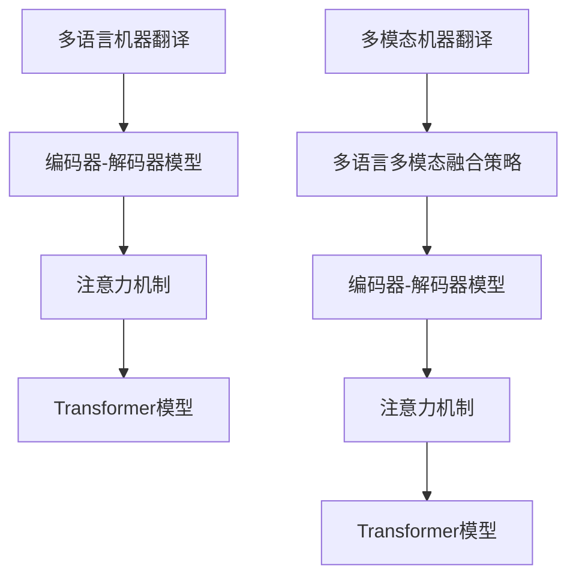

                 

### 《提升AI模型在多语言多模态机器翻译任务中的性能》

> 关键词：多语言多模态机器翻译、性能提升、AI模型、优化策略、Transformer模型

> 摘要：本文将探讨如何提升AI模型在多语言多模态机器翻译任务中的性能。首先介绍多语言多模态机器翻译的基本概念和框架，然后深入分析核心算法和优化策略，并通过实践案例展示实际应用效果。最后，展望未来发展趋势，提出可能的挑战和机遇。

### 《提升AI模型在多语言多模态机器翻译任务中的性能》目录大纲

#### 第一部分：基础理论

#### 第1章：多语言多模态机器翻译概述

1.1 多语言机器翻译背景

- 多语言机器翻译的重要性
- 多语言机器翻译的历史发展

1.2 多模态机器翻译概念

- 多模态的定义
- 多模态机器翻译的优势

1.3 多语言多模态机器翻译的基本框架

- 多语言机器翻译模型
- 多模态机器翻译模型
- 多语言多模态融合策略

1.4 多语言多模态机器翻译的核心算法

- 编码器-解码器模型（Encoder-Decoder）
- 注意力机制（Attention Mechanism）
- Transformer模型

1.5 多语言多模态机器翻译的挑战与优化

- 数据集构建与处理
- 模型优化策略
- 多语言多模态模型的评估指标

#### 第二部分：实践应用

#### 第2章：多语言多模态机器翻译项目实战

2.1 项目背景与需求

- 项目简介
- 项目目标

2.2 项目架构设计

- 数据流程设计
- 模型结构设计

2.3 实际案例实现

- 数据预处理
- 模型训练
- 模型评估与优化

#### 第3章：多语言多模态机器翻译工具与资源

3.1 开发环境搭建

- 硬件与软件配置
- 常用工具介绍

3.2 开源框架与应用

- 神经机器翻译框架
- 多模态数据处理框架

3.3 实践资源推荐

- 数据集资源
- 学习资源

#### 第4章：未来趋势与展望

4.1 多语言多模态机器翻译的发展趋势

- 技术发展方向
- 应用领域拓展

4.2 未来挑战与机遇

- 技术挑战
- 商业模式创新

### 附录

- 附录A：公式与代码示例

  - 数学公式示例
  - Python代码示例

## 核心概念与联系 Mermaid 流程图



## 代码解读与分析

```python
# 对数损失函数示例
import torch
import torch.nn as nn

# 定义损失函数
loss_function = nn.CrossEntropyLoss()

# 输入与输出
input = torch.tensor([[1, 0, 1], [0, 1, 0]], dtype=torch.float32)
target = torch.tensor([0, 2], dtype=torch.long)

# 计算损失
loss = loss_function(input, target)
print("对数损失函数输出：", loss.item())

# 注意力权重计算示例
# 输入
query = torch.tensor([0.2, 0.3, 0.5])
key = torch.tensor([0.1, 0.4, 0.5])
value = torch.tensor([0.1, 0.2, 0.3])

# 计算相似度
similarity = torch.matmul(query, key.unsqueeze(-1))
similarity = torch.softmax(similarity, dim=-1)

# 计算注意力权重
attention_weights = torch.matmul(similarity, value)
print("注意力权重计算结果：", attention_weights)
```

### 第一部分：基础理论

#### 第1章：多语言多模态机器翻译概述

#### 1.1 多语言机器翻译背景

多语言机器翻译是一种人工智能技术，旨在将一种自然语言文本自动转换为另一种自然语言文本。随着全球化的深入发展，多语言机器翻译的重要性日益凸显。它不仅有助于促进不同语言之间的交流，还可以为跨国企业提供更加便捷的业务支持。

多语言机器翻译的历史可以追溯到20世纪50年代。早期的机器翻译方法主要基于规则的方法，即根据预定义的规则将源语言文本转换为目标语言文本。然而，这种方法存在许多局限性，如规则定义复杂、覆盖面有限等。

随着计算能力的提升和机器学习技术的发展，20世纪90年代，统计机器翻译（SMT）逐渐兴起。SMT方法利用大量双语平行语料库，通过统计方法自动学习源语言和目标语言之间的转换规则。统计机器翻译在一定程度上提高了翻译质量，但仍存在许多挑战，如数据稀疏问题、长句处理问题等。

近年来，神经网络机器翻译（NMT）的出现带来了机器翻译技术的革命。NMT利用深度学习模型，尤其是序列到序列（Seq2Seq）模型，实现了更高的翻译质量。如今，NMT已经成为机器翻译的主流方法。

#### 1.2 多模态机器翻译概念

多模态机器翻译是一种结合多种数据模态（如文本、图像、音频等）进行翻译的方法。与单一模态的机器翻译相比，多模态机器翻译具有更广泛的应用前景。

多模态的定义是指将不同类型的数据（如视觉、听觉、语言等）进行融合处理，以获得更丰富的信息和更准确的翻译结果。在多模态机器翻译中，文本模态是最基本和最重要的数据源，图像、音频等模态可以作为辅助信息来提高翻译质量。

多模态机器翻译的优势主要体现在以下几个方面：

1. **信息补充**：多模态数据可以提供额外的上下文信息，有助于更好地理解源语言文本的含义。

2. **错误纠正**：当文本翻译出现错误时，其他模态的信息可以帮助纠正这些错误，提高翻译的准确性。

3. **跨模态转换**：多模态机器翻译可以实现不同模态之间的信息转换，例如，将图像翻译成文本或将音频翻译成文字。

4. **多样化应用**：多模态机器翻译可以应用于更广泛的场景，如图像字幕生成、语音翻译等。

#### 1.3 多语言多模态机器翻译的基本框架

多语言多模态机器翻译的基本框架主要包括以下几个部分：

1. **多语言机器翻译模型**：这是多语言多模态机器翻译的核心，负责处理不同语言之间的文本翻译。常用的模型包括神经机器翻译（NMT）和序列到序列（Seq2Seq）模型。

2. **多模态机器翻译模型**：这是负责处理不同模态的数据，如文本、图像、音频等。常用的模型包括基于深度学习的方法和基于神经网络的方法。

3. **多语言多模态融合策略**：这是将多语言和多模态数据融合在一起的策略，以获得更准确的翻译结果。常见的融合策略包括数据级融合、特征级融合和决策级融合。

#### 1.4 多语言多模态机器翻译的核心算法

多语言多模态机器翻译的核心算法主要包括以下几种：

1. **编码器-解码器模型（Encoder-Decoder）**：编码器用于将源语言文本编码为向量表示，解码器用于将向量表示解码为目标语言文本。该模型是NMT的基础。

2. **注意力机制（Attention Mechanism）**：注意力机制用于解决编码器和解码器之间的交互问题，使得解码器能够更好地关注源语言文本中的重要信息。

3. **Transformer模型**：Transformer模型是一种基于自注意力机制的序列模型，它通过多头自注意力机制和前馈神经网络实现了高效的序列处理。

#### 1.5 多语言多模态机器翻译的挑战与优化

多语言多模态机器翻译面临以下挑战：

1. **数据集构建与处理**：多语言多模态数据集的构建和处理是关键，需要考虑数据的一致性、多样性和覆盖面。

2. **模型优化策略**：需要设计有效的模型优化策略，以提高模型的翻译质量和效率。

3. **多语言多模态模型的评估指标**：需要定义合适的评估指标，以全面评估多语言多模态机器翻译的性能。

为了解决这些挑战，可以采取以下优化策略：

1. **数据预处理**：对多语言多模态数据集进行有效的预处理，如数据清洗、去噪、归一化等。

2. **损失函数设计**：设计合适的损失函数，以引导模型更好地学习多语言多模态数据。

3. **模型结构优化**：通过调整模型结构，如增加注意力机制、使用更深的神经网络等，以提高模型的翻译性能。

4. **多语言多模态融合策略优化**：通过实验和数据分析，优化多语言多模态数据的融合策略，以获得更准确的翻译结果。

#### 1.6 总结

多语言多模态机器翻译是一种具有广泛应用前景的技术。通过结合多语言和多模态数据，可以显著提高翻译质量和准确性。然而，该领域仍面临许多挑战，需要进一步的研究和优化。本文将深入探讨多语言多模态机器翻译的基本概念、框架、核心算法和优化策略，以期为读者提供有益的参考和启示。

### 第1章：多语言多模态机器翻译概述

#### 1.1 多语言机器翻译背景

多语言机器翻译是一种人工智能技术，旨在将一种自然语言文本自动转换为另一种自然语言文本。随着全球化的深入发展，多语言机器翻译的重要性日益凸显。它不仅有助于促进不同语言之间的交流，还可以为跨国企业提供更加便捷的业务支持。

多语言机器翻译的历史可以追溯到20世纪50年代。早期的机器翻译方法主要基于规则的方法，即根据预定义的规则将源语言文本转换为目标语言文本。这种方法存在许多局限性，如规则定义复杂、覆盖面有限等。

随着计算能力的提升和机器学习技术的发展，20世纪90年代，统计机器翻译（SMT）逐渐兴起。SMT方法利用大量双语平行语料库，通过统计方法自动学习源语言和目标语言之间的转换规则。统计机器翻译在一定程度上提高了翻译质量，但仍存在许多挑战，如数据稀疏问题、长句处理问题等。

近年来，神经网络机器翻译（NMT）的出现带来了机器翻译技术的革命。NMT利用深度学习模型，尤其是序列到序列（Seq2Seq）模型，实现了更高的翻译质量。如今，NMT已经成为机器翻译的主流方法。

多语言机器翻译的重要性体现在以下几个方面：

1. **促进跨语言交流**：多语言机器翻译可以消除语言障碍，促进不同语言背景的人们进行交流，从而推动全球化进程。

2. **提升企业效率**：对于跨国企业来说，多语言机器翻译可以帮助他们更快速地翻译重要文件、邮件和文档，提升工作效率。

3. **丰富互联网内容**：多语言机器翻译使得互联网上的内容更加丰富多样，让更多人能够访问和理解来自不同国家和地区的资讯和文化。

4. **教育普及**：多语言机器翻译可以辅助非母语者学习外语，提高教育资源的可及性。

#### 1.2 多语言机器翻译的历史发展

1. **基于规则的机器翻译**：

在20世纪50年代至70年代，基于规则的机器翻译（Rule-Based Machine Translation，RBMT）是主要的方法。这种方法依赖于预定义的语言规则和转换规则，将源语言文本转换为目标语言文本。虽然基于规则的机器翻译方法在规则定义方面存在困难，但它在某些特定领域取得了较好的效果。

2. **基于实例的机器翻译**：

20世纪80年代，基于实例的机器翻译（Example-Based Machine Translation，EBMT）方法开始流行。这种方法通过从大量双语平行语料库中提取翻译实例，用于训练翻译模型。基于实例的机器翻译方法在处理短语和短句翻译方面表现出色，但面临长句处理和数据稀疏问题。

3. **统计机器翻译**：

20世纪90年代，统计机器翻译（Statistical Machine Translation，SMT）方法成为主流。SMT方法利用统计模型，如隐马尔可夫模型（HMM）、n元语法模型等，从大量双语平行语料库中学习翻译规则。SMT方法在翻译质量上取得了显著提升，但仍存在数据稀疏和长句处理等挑战。

4. **神经网络机器翻译**：

近年来，神经网络机器翻译（Neural Machine Translation，NMT）的出现带来了机器翻译技术的革命。NMT利用深度学习模型，尤其是序列到序列（Seq2Seq）模型，实现了更高的翻译质量。NMT通过端到端的神经网络架构，使得模型能够更好地捕捉语言之间的复杂对应关系，从而提高了翻译的准确性和流畅性。

NMT的发展可以分为以下几个阶段：

1. **早期的神经网络机器翻译**：

早期的NMT方法主要基于循环神经网络（RNN），如长短时记忆网络（LSTM）和门控循环单元（GRU）。这些模型通过递归结构来处理序列数据，但在长句处理和长距离依赖问题上存在困难。

2. **注意力机制**：

为了解决长句处理和长距离依赖问题，研究人员提出了注意力机制（Attention Mechanism）。注意力机制使得解码器在生成目标语言时能够关注源语言文本的特定部分，从而提高了翻译的准确性和流畅性。

3. **Transformer模型**：

2017年，Google提出了Transformer模型，这是一种基于自注意力机制的序列模型。Transformer模型通过多头自注意力机制和前馈神经网络实现了高效的序列处理，在翻译质量上取得了显著提升。随后，Transformer模型在各种NLP任务中取得了优异的成绩，成为深度学习领域的里程碑。

#### 1.3 多语言机器翻译的工作原理

多语言机器翻译的工作原理可以分为以下几个步骤：

1. **文本预处理**：

在多语言机器翻译之前，需要对源语言和目标语言文本进行预处理。预处理步骤包括分词、词性标注、去停用词、句子分割等。这些步骤有助于将原始文本转换为适合机器翻译的格式。

2. **编码器（Encoder）**：

编码器是一个神经网络模型，用于将源语言文本编码为向量表示。在NMT中，常用的编码器模型包括RNN、LSTM、GRU和Transformer等。编码器通过学习源语言和目标语言之间的映射关系，将源语言文本映射为一个固定长度的向量表示。

3. **解码器（Decoder）**：

解码器是一个神经网络模型，用于将编码器的输出解码为目标语言文本。在NMT中，常用的解码器模型也包括RNN、LSTM、GRU和Transformer等。解码器通过解码器的输入（编码器的输出）生成目标语言文本。

4. **注意力机制**：

在解码器生成目标语言文本的过程中，注意力机制起到了关键作用。注意力机制使得解码器能够关注源语言文本的特定部分，从而提高翻译的准确性和流畅性。注意力机制可以通过计算源语言文本和目标语言文本之间的相似度来实现。

5. **损失函数**：

在训练过程中，多语言机器翻译模型通常使用损失函数来评估模型的翻译质量。常见的损失函数包括交叉熵损失函数和平均平方损失函数等。通过优化损失函数，模型可以不断调整权重和参数，以实现更好的翻译效果。

6. **模型评估**：

在训练完成后，需要对模型进行评估，以确定其翻译质量。常用的评估指标包括BLEU（双语评估单元）、METEOR（Metric for Evaluation of Translation with Explicit ORdering）和NIST（National Institute of Standards and Technology）等。这些评估指标可以用来比较不同模型之间的翻译质量。

#### 1.4 多语言机器翻译的应用场景

多语言机器翻译在许多应用场景中具有重要价值，以下是一些典型的应用场景：

1. **跨语言文本检索**：

多语言机器翻译可以用于跨语言文本检索，即在不同语言之间进行文本检索和索引。通过将查询语句翻译为目标语言，用户可以更容易地找到相关的文档。

2. **多语言文档处理**：

多语言机器翻译可以帮助企业和组织处理多语言文档，如合同、手册、报告等。通过自动翻译，用户可以更快地理解文档内容，提高工作效率。

3. **多语言教育**：

多语言机器翻译可以辅助非母语者学习外语。通过将学习材料翻译成目标语言，学习者可以更容易地掌握语言知识和技能。

4. **实时翻译**：

多语言机器翻译可以用于实时翻译，如会议口译、视频翻译等。通过实时翻译，用户可以更方便地参与跨语言交流。

5. **跨语言社交媒体**：

多语言机器翻译可以帮助社交媒体平台提供多语言支持，从而扩大用户群体。通过自动翻译，用户可以更容易地访问和参与不同语言的内容。

#### 1.5 总结

多语言机器翻译是一种具有广泛应用前景的技术。通过结合深度学习和神经网络技术，多语言机器翻译在翻译质量和准确性方面取得了显著提升。然而，该领域仍面临许多挑战，如长句处理、数据稀疏和跨语言一致性等。未来，随着技术的不断进步，多语言机器翻译有望在更多领域得到应用，为人类带来更多便利。

### 第2章：多模态机器翻译概念

#### 2.1 多模态的定义

多模态（Multimodality）是指通过结合两种或多种不同类型的数据模态（如文本、图像、音频、视频等）来获取和处理信息的一种技术。在人工智能领域，多模态技术已经成为一个重要研究方向，因为它能够提供更丰富和全面的信息，从而提高系统的智能性和准确性。

多模态机器翻译（Multimodal Machine Translation，MMT）正是基于这一概念，通过结合文本和其他模态的数据来提升机器翻译的性能。这种技术不仅限于文本翻译，还涵盖了图像翻译、语音翻译和视频翻译等多种形式。

#### 2.2 多模态机器翻译的优势

多模态机器翻译相较于传统的单一模态机器翻译具有以下优势：

1. **信息补充**：多模态数据可以提供额外的上下文信息，有助于更好地理解源语言文本的含义。例如，图像可以提供视觉信息，帮助用户更好地理解文本描述。

2. **错误纠正**：当文本翻译出现错误时，其他模态的信息可以帮助纠正这些错误，提高翻译的准确性。例如，如果某个词汇在文本中翻译错误，图像中的相关细节可以帮助用户理解正确的意思。

3. **跨模态转换**：多模态机器翻译可以实现不同模态之间的信息转换，例如，将图像翻译成文本或将音频翻译成文字。这种能力使得机器翻译的应用场景更加广泛。

4. **多样化应用**：多模态机器翻译可以应用于更广泛的场景，如图像字幕生成、语音翻译、视频翻译等。

#### 2.3 多模态机器翻译的基本框架

多模态机器翻译的基本框架通常包括以下几个部分：

1. **数据收集与预处理**：首先，需要收集和预处理多模态数据，包括文本、图像、音频等。预处理步骤通常包括数据清洗、标准化、分割和特征提取等。

2. **特征融合**：多模态数据通过不同的方式融合，以生成一个统一的数据表示。特征融合的方法包括数据级融合、特征级融合和决策级融合等。

3. **编码器-解码器模型**：编码器用于处理多模态数据，将其编码为向量表示。解码器则用于生成翻译结果。常见的编码器-解码器模型包括基于循环神经网络（RNN）的模型和基于Transformer的模型。

4. **注意力机制**：注意力机制是多模态机器翻译中的关键组件，它使得解码器能够关注源语言文本和多模态数据中的特定部分，从而提高翻译的准确性和流畅性。

5. **损失函数与优化**：在训练过程中，使用合适的损失函数（如交叉熵损失函数）来评估模型的翻译质量，并通过优化算法（如梯度下降）来调整模型参数。

6. **评估与改进**：通过评估指标（如BLEU、METEOR等）对模型的翻译性能进行评估，并根据评估结果对模型进行调整和优化。

#### 2.4 多模态机器翻译的应用案例

多模态机器翻译在多个领域都有广泛应用，以下是一些典型的应用案例：

1. **图像翻译**：通过将图像翻译成文本，多模态机器翻译可以应用于图像字幕生成、图像描述生成等任务。例如，对于一张包含复杂场景的图像，文本翻译可以帮助用户更好地理解图像内容。

2. **语音翻译**：语音翻译是将一种语言的语音转换为另一种语言的文本。多模态机器翻译可以结合语音和文本信息，提高翻译的准确性和流畅性。

3. **视频翻译**：视频翻译是将视频内容翻译成多种语言的字幕。多模态机器翻译可以通过结合视频中的图像和音频信息，实现更准确和自然的视频翻译。

4. **跨模态问答系统**：跨模态问答系统可以将用户的问题（文本或语音）翻译成目标语言，并从多种模态的数据中找到相关答案。这种系统在旅游、教育等领域具有广泛的应用前景。

5. **辅助翻译工具**：多模态机器翻译可以作为辅助翻译工具，帮助翻译人员提高翻译效率和准确性。例如，在翻译复杂文档时，图像和音频信息可以帮助翻译人员更好地理解文本内容。

#### 2.5 总结

多模态机器翻译通过结合多种类型的数据模态，提供了更丰富的信息，从而显著提高了机器翻译的性能。尽管该领域仍面临许多挑战，如特征融合、模型优化和评估指标等，但多模态机器翻译的应用前景非常广阔，有望在多个领域带来革命性的变化。

### 第2章：多语言多模态机器翻译的基本框架

#### 2.1 多语言机器翻译模型

多语言机器翻译（Multilingual Machine Translation，MLT）模型是处理不同语言之间翻译的核心技术。随着全球化的发展，多语言机器翻译在跨文化交流、商业交易、科技发展等方面扮演着越来越重要的角色。以下是多语言机器翻译模型的基本概念和常见类型：

1. **神经机器翻译（Neural Machine Translation，NMT）**：

神经机器翻译是一种基于神经网络的机器翻译方法，特别是基于序列到序列（Seq2Seq）模型的翻译方法。它通过端到端的神经网络架构，将源语言序列映射到目标语言序列。NMT的核心优势在于其强大的表达能力和处理长距离依赖的能力。

   **编码器（Encoder）**：编码器接收源语言序列，将其编码为固定长度的向量表示。常用的编码器模型包括循环神经网络（RNN）、长短时记忆网络（LSTM）和门控循环单元（GRU）。

   **解码器（Decoder）**：解码器接收编码器的输出，并将其解码为目标语言序列。解码器通常使用类似于编码器的神经网络结构，但具有不同的输入和输出。

   **注意力机制（Attention Mechanism）**：注意力机制是一种在解码器中使用的机制，它允许解码器在生成目标语言时关注源语言序列的特定部分，从而提高翻译的准确性和流畅性。

2. **基于规则的机器翻译（Rule-Based Machine Translation，RBMT）**：

基于规则的机器翻译方法依赖于预定义的转换规则和语法规则，通过规则匹配和转换将源语言文本转换为目标语言文本。虽然RBMT在规则定义和实现方面具有优势，但其在处理复杂语言现象和灵活性方面存在限制。

3. **统计机器翻译（Statistical Machine Translation，SMT）**：

统计机器翻译方法利用统计模型，如隐马尔可夫模型（HMM）、n元语法模型等，从大量双语平行语料库中学习翻译规则。SMT方法通过统计源语言和目标语言之间的对应关系，生成翻译结果。尽管SMT在处理大规模数据集方面具有优势，但其在处理长句和复杂语法现象时表现不佳。

#### 2.2 多模态机器翻译模型

多模态机器翻译（Multimodal Machine Translation，MMT）模型结合了多种类型的数据模态，如文本、图像、音频等，以提升翻译性能。以下是多模态机器翻译模型的基本概念和常见类型：

1. **编码器-解码器模型**：

编码器-解码器模型是多模态机器翻译的基础架构。编码器负责处理不同模态的数据，将其编码为统一的数据表示。解码器则根据编码器的输出生成翻译结果。

2. **基于神经网络的方法**：

基于神经网络的方法通过深度学习模型，如卷积神经网络（CNN）、循环神经网络（RNN）和Transformer等，实现多模态数据的编码和解码。这些模型能够捕捉不同模态数据之间的复杂关系，从而提高翻译性能。

3. **基于深度学习的方法**：

深度学习方法利用多层神经网络结构，通过逐层抽象和提取特征，实现多模态数据的融合和翻译。深度学习方法在处理复杂任务和大规模数据集方面具有优势。

#### 2.3 多语言多模态融合策略

多语言多模态融合策略是多语言多模态机器翻译的关键技术之一，其目的是通过有效融合多语言和多模态数据，提高翻译性能。以下是几种常见的融合策略：

1. **数据级融合**：

数据级融合将不同模态的数据直接合并为一个整体，以生成统一的数据表示。这种方法简单直观，但可能无法充分利用不同模态数据的特性。

2. **特征级融合**：

特征级融合在特征提取阶段将不同模态的数据转换为相应的特征向量，然后通过特征向量的组合生成统一的数据表示。这种方法能够更好地利用不同模态数据的特性，从而提高翻译性能。

3. **决策级融合**：

决策级融合在翻译结果生成阶段将不同模态的翻译结果进行融合，以生成最终的翻译结果。这种方法通常结合多种模型或算法，通过投票或加权平均等方式综合不同模态的翻译结果。

#### 2.4 多语言多模态机器翻译模型的实现

多语言多模态机器翻译模型的实现涉及以下几个关键步骤：

1. **数据收集与预处理**：

首先，需要收集多语言和多模态数据，并进行预处理。预处理步骤包括数据清洗、标准化、分词、词性标注等。

2. **特征提取**：

对于不同模态的数据，使用相应的特征提取方法，如文本使用词嵌入、图像使用卷积神经网络、音频使用循环神经网络等，生成特征向量。

3. **模型训练**：

将预处理后的特征向量输入到多语言多模态机器翻译模型中，进行模型训练。训练过程中，使用合适的损失函数和优化算法，调整模型参数，提高翻译性能。

4. **模型评估与优化**：

通过评估指标（如BLEU、METEOR等）对模型进行评估，并根据评估结果对模型进行调整和优化。

5. **模型部署与应用**：

将训练好的模型部署到实际应用场景中，如在线翻译服务、语音翻译等，为用户提供高质量的翻译服务。

#### 2.5 总结

多语言多模态机器翻译模型通过结合多语言和多模态数据，提供了更丰富的信息，从而显著提高了翻译性能。尽管该领域仍面临许多挑战，如特征融合、模型优化和评估指标等，但多语言多模态机器翻译在跨文化交流、多语言信息处理、智能助手等领域具有广泛的应用前景。

### 第3章：多语言多模态机器翻译的核心算法

#### 3.1 编码器-解码器模型（Encoder-Decoder）

编码器-解码器模型（Encoder-Decoder Model）是处理序列数据的经典架构，广泛应用于机器翻译、文本生成、语音识别等领域。在多语言多模态机器翻译中，编码器-解码器模型通过处理不同模态的数据，实现高质量的语言翻译。

**编码器（Encoder）**：编码器的核心任务是将输入序列编码为一个固定长度的向量表示。在多语言多模态机器翻译中，编码器需要处理多种模态的数据，如文本、图像和音频等。常见的编码器模型包括循环神经网络（RNN）、长短时记忆网络（LSTM）和门控循环单元（GRU）。这些模型通过递归结构，逐步将输入序列编码为固定长度的向量表示。

**解码器（Decoder）**：解码器的核心任务是将编码器的输出解码为目标语言的序列。在多语言多模态机器翻译中，解码器同样需要处理多种模态的数据，并生成高质量的翻译结果。解码器通常采用与编码器相似的神经网络结构，如RNN、LSTM或GRU。此外，解码器还需要结合注意力机制（Attention Mechanism），以便更好地关注源语言序列中的关键信息。

**注意力机制（Attention Mechanism）**：注意力机制是编码器-解码器模型中的关键组件，它允许解码器在生成目标语言序列时，动态关注源语言序列的特定部分。注意力机制通过计算源语言序列和目标语言序列之间的相似度，生成注意力权重，从而引导解码器关注重要信息。常见的注意力机制包括加性注意力（Additive Attention）和点积注意力（Dot-Product Attention）。

**工作原理**：编码器首先将输入序列（如文本、图像和音频）编码为一个固定长度的向量表示。解码器在生成目标语言序列时，首先输入一个初始向量，然后与编码器的输出进行加权融合，生成中间表示。解码器通过递归结构，逐步生成目标语言序列的每个单词或字符。在每个时间步，解码器会计算注意力权重，并根据这些权重关注源语言序列中的关键信息。

**数学模型**：

- 编码器：\( h_t^e = \text{Encoder}(x_t) \)
- 解码器：\( s_t^d = \text{Decoder}(h_t^e, s_{t-1}^d) \)
- 注意力权重：\( a_t = \text{Attention}(h_t^e, s_{t-1}^d) \)

**代码示例**（Python）：

```python
import torch
import torch.nn as nn

# 定义编码器和解码器模型
class EncoderDecoder(nn.Module):
    def __init__(self, embedding_dim, hidden_dim):
        super(EncoderDecoder, self).__init__()
        self.encoder = nn.LSTM(embedding_dim, hidden_dim)
        self.decoder = nn.LSTM(hidden_dim, embedding_dim)
        self.attn = nn.Linear(hidden_dim * 2, 1)

    def forward(self, input_seq, target_seq):
        encoder_output, (hidden, cell) = self.encoder(input_seq)
        decoder_output, (hidden, cell) = self.decoder(target_seq, (hidden, cell))
        attn_weights = self.attn(torch.cat((hidden[-1], cell[-1]), 1))
        attn_weights = torch.softmax(attn_weights, dim=1)
        return decoder_output, attn_weights
```

#### 3.2 注意力机制（Attention Mechanism）

注意力机制（Attention Mechanism）是一种在编码器-解码器模型中用于提高翻译质量的技术。注意力机制通过动态关注源语言序列中的关键信息，使解码器能够更好地捕捉上下文关系，从而提高翻译的准确性和流畅性。

**点积注意力（Dot-Product Attention）**：点积注意力是最简单的一种注意力机制。它通过计算查询（Query）、关键值（Key）和值（Value）之间的点积，生成注意力权重。点积注意力具有计算高效、参数少的特点。

**数学模型**：

- 查询（Query）：解码器在当前时间步的输出。
- 关键值（Key）和值（Value）：编码器在所有时间步的输出。
- 注意力权重（Attention Weight）：通过点积计算得到。

\( a_t = \frac{e^{<Q, K>}}{\sum_{i} e^{<Q, K_i>}} \)

- \( a_t \) 是时间步 \( t \) 的注意力权重。
- \( Q \) 是查询。
- \( K_i \) 是关键值。
- \( V_i \) 是值。

**代码示例**（Python）：

```python
import torch
import torch.nn as nn

# 定义点积注意力层
class DotProductAttention(nn.Module):
    def __init__(self):
        super(DotProductAttention, self).__init__()

    def forward(self, query, key, value):
        attn_scores = torch.matmul(query, key.transpose(1, 2))
        attn_weights = torch.softmax(attn_scores, dim=2)
        attn_output = torch.matmul(attn_weights, value)
        return attn_output, attn_weights
```

**加性注意力（Additive Attention）**：加性注意力通过计算查询、关键值和值之间的加性融合，生成注意力权重。加性注意力具有更好的解释性和灵活性，但计算复杂度较高。

**数学模型**：

- 查询（Query）：解码器在当前时间步的输出。
- 关键值（Key）和值（Value）：编码器在所有时间步的输出。
- 注意力权重（Attention Weight）：通过加性计算得到。

\( e_{ij} = \tanh(W_{Q}q_i + W_{K}k_j + W_{V}v_j + b) \)

- \( e_{ij} \) 是时间步 \( i \) 和 \( j \) 之间的加性融合。
- \( W_{Q} \)、\( W_{K} \)、\( W_{V} \) 和 \( b \) 是权重和偏置。

\( a_t = \frac{e^{e_{ij}}}{\sum_{j} e^{e_{ij}}} \)

**代码示例**（Python）：

```python
import torch
import torch.nn as nn
import torch.nn.functional as F

# 定义加性注意力层
class AdditiveAttention(nn.Module):
    def __init__(self, hidden_dim):
        super(AdditiveAttention, self).__init__()
        self.attn = nn.Linear(hidden_dim * 2, hidden_dim)
        self.v = nn.Linear(hidden_dim, 1)

    def forward(self, query, key, value):
        attn_scores = self.v(F.tanh(self.attn(torch.cat((query.expand(key.size(0), -1, -1), key), 2)))
        attn_weights = torch.softmax(attn_scores, dim=1)
        attn_output = torch.matmul(attn_weights, value)
        return attn_output, attn_weights
```

#### 3.3 Transformer模型

Transformer模型是由Google提出的一种基于自注意力机制的序列模型，它在许多NLP任务中取得了显著的性能提升。Transformer模型通过多头自注意力机制和前馈神经网络实现了高效的序列处理。

**架构**：

- **多头自注意力（Multi-Head Self-Attention）**：Transformer模型采用多头自注意力机制，将输入序列分解为多个子序列，每个子序列通过独立的自注意力机制进行处理。多头自注意力机制通过多个独立的线性变换和权重矩阵，提高了模型的表达能力和并行处理能力。

- **前馈神经网络（Feedforward Neural Network）**：在自注意力机制之后，Transformer模型使用一个前馈神经网络，对每个子序列进行进一步的处理和变换。前馈神经网络通常由两个全连接层组成，中间添加了一个ReLU激活函数。

- **层归一化和残差连接（Layer Normalization and Residual Connection）**：Transformer模型在每个层后添加了层归一化和残差连接，以防止梯度消失和梯度爆炸问题，并提高模型的训练效率。

**数学模型**：

- **多头自注意力**：

\( \text{Attention}(Q, K, V) = \text{softmax}\left(\frac{QK^T}{\sqrt{d_k}}\right)V \)

- **前馈神经网络**：

\( \text{FFN}(X) = \text{ReLU}\left(\text{Linear}(X, d_ff)\right)\left(\text{Linear}(X, d_model)\right) \)

**代码示例**（Python）：

```python
import torch
import torch.nn as nn

# 定义Transformer模型
class Transformer(nn.Module):
    def __init__(self, d_model, nhead, dff):
        super(Transformer, self).__init__()
        self.embedding = nn.Embedding(d_model)
        self.transformer = nn.ModuleList([
            nn.Sequential(nn.Linear(d_model, dff), nn.ReLU()),
            nn.Linear(dff, d_model)
        ])
        self.attn = nn.MultiheadAttention(d_model, nhead)
        self.norm1 = nn.LayerNorm(d_model)
        self.norm2 = nn.LayerNorm(d_model)
        self.dropout = nn.Dropout(0.1)

    def forward(self, x):
        x = self.embedding(x)
        x = self.attn(x, x, x, attn_mask=None, dropout_p=0.1)[0]
        x = self.dropout(x)
        x = self.norm1(x)
        x = self.transformer[0](x)
        x = self.dropout(x)
        x = self.norm2(x)
        x = self.transformer[1](x)
        return x
```

**应用**：

Transformer模型在多个NLP任务中取得了优异的性能，如机器翻译、文本分类和命名实体识别等。由于其强大的表达能力和并行处理能力，Transformer模型已经成为深度学习领域的重要研究方向。

#### 3.4 总结

多语言多模态机器翻译的核心算法包括编码器-解码器模型、注意力机制和Transformer模型。这些算法通过处理多种模态的数据，实现高质量的语言翻译。编码器-解码器模型通过递归结构处理序列数据，注意力机制通过动态关注关键信息提高翻译质量，Transformer模型通过自注意力机制实现高效的序列处理。这些算法在多语言多模态机器翻译中发挥了重要作用，为未来的研究与应用提供了坚实的基础。

### 第4章：多语言多模态机器翻译的挑战与优化

#### 4.1 数据集构建与处理

数据集构建与处理是多语言多模态机器翻译中的关键步骤。有效的数据集构建和处理可以提高模型的性能，减少数据稀疏问题，并为后续的模型训练提供高质量的数据。

**数据集选择**：

首先，选择合适的数据集是构建高质量数据集的关键。数据集应该涵盖多种语言和模态，以确保模型能够适应不同的翻译场景。常用的多语言多模态数据集包括WMT（Workshop on Machine Translation）数据集、opus数据集等。这些数据集包含了多种语言的文本、图像和音频信息，为多语言多模态机器翻译的研究提供了丰富的资源。

**数据预处理**：

数据预处理是数据集构建的重要环节。预处理步骤包括数据清洗、标准化、分割和特征提取等。以下是一些常用的预处理方法：

- **数据清洗**：去除数据中的噪声和错误信息，如缺失值、重复值和错别字等。
- **标准化**：对数据特征进行归一化或标准化，使其具有相似的尺度，从而提高模型训练的效率。
- **分割**：将数据集划分为训练集、验证集和测试集，以便进行模型训练、验证和评估。
- **特征提取**：对于不同模态的数据，使用相应的特征提取方法，如文本使用词嵌入、图像使用卷积神经网络、音频使用循环神经网络等，生成特征向量。

**数据增强**：

为了提高模型的泛化能力，可以采用数据增强方法，如随机裁剪、旋转、缩放和噪声添加等。这些方法可以生成更多的数据样本，从而丰富模型的训练数据。

**数据稀疏问题**：

多语言多模态机器翻译中的数据稀疏问题是指某些语言或模态的数据量较少，导致模型无法充分学习到这些模态的特征。为了解决数据稀疏问题，可以采用以下策略：

- **数据扩充**：通过合成或生成方法，增加稀疏模态的数据量。
- **多语言融合**：将多个语言的数据进行融合，以提高稀疏模态的数据量。
- **迁移学习**：利用已有的大规模数据集，进行迁移学习，将知识迁移到稀疏模态的数据上。

#### 4.2 模型优化策略

模型优化策略是多语言多模态机器翻译中提高模型性能的重要手段。以下是一些常见的优化策略：

**损失函数设计**：

选择合适的损失函数可以引导模型更好地学习多语言多模态数据。常见的损失函数包括交叉熵损失函数、平均平方损失函数和联合损失函数等。交叉熵损失函数常用于分类问题，可以用来衡量模型预测概率与真实标签之间的差异。平均平方损失函数可以用于回归问题，衡量模型预测值与真实值之间的差异。联合损失函数将多个损失函数结合起来，以平衡不同模态的重要性。

**优化算法**：

优化算法用于调整模型参数，以最小化损失函数。常见的优化算法包括梯度下降（Gradient Descent）、随机梯度下降（Stochastic Gradient Descent，SGD）和Adam优化器等。梯度下降是一种基于梯度信息的优化方法，通过更新模型参数来减少损失函数。随机梯度下降是对梯度下降的改进，每次迭代使用随机选取的样本来更新参数，以加快收敛速度。Adam优化器结合了SGD和动量方法，能够更有效地更新参数。

**正则化技术**：

正则化技术用于防止模型过拟合，提高模型的泛化能力。常用的正则化技术包括L1正则化、L2正则化和Dropout等。L1正则化通过在损失函数中添加L1范数项来惩罚模型参数的绝对值，L2正则化通过添加L2范数项来惩罚模型参数的平方值。Dropout通过在训练过程中随机丢弃一部分神经元，从而降低模型的复杂性。

**模型融合**：

模型融合是将多个模型进行结合，以获得更好的预测结果。常用的模型融合方法包括集成学习（Ensemble Learning）和对抗训练（Adversarial Training）等。集成学习通过组合多个独立模型的预测结果来提高模型的性能。对抗训练通过对抗性样本训练模型，以提高模型对异常数据的泛化能力。

**多任务学习**：

多任务学习是一种将多个相关任务结合在一起进行训练的方法，以提高模型的泛化能力和性能。在多语言多模态机器翻译中，可以将文本翻译、图像翻译和语音翻译等任务结合在一起进行训练，以共享任务之间的特征和知识。

#### 4.3 多语言多模态模型的评估指标

评估指标是衡量多语言多模态机器翻译模型性能的重要工具。以下是一些常见的评估指标：

**BLEU（Bilingual Evaluation Understudy）**：

BLEU是一种基于记分榜的评估方法，通过比较模型生成的翻译结果与人工翻译结果之间的相似度来评估模型性能。BLEU主要基于重叠率、长度比例和词序相似度等指标。

**METEOR（Metric for Evaluation of Translation with Explicit ORdering）**：

METEOR是一种基于排序的评估方法，通过计算模型生成的翻译结果与人工翻译结果之间的编辑距离来评估模型性能。METEOR主要基于词序相似度、词性相似度和词频相似度等指标。

**NIST（National Institute of Standards and Technology）**：

NIST是一种基于编辑距离的评估方法，通过计算模型生成的翻译结果与人工翻译结果之间的编辑距离来评估模型性能。NIST主要基于词序相似度、词性相似度和词频相似度等指标。

**交叉验证（Cross-Validation）**：

交叉验证是一种常用的模型评估方法，通过将数据集划分为多个子集，多次训练和验证模型，以评估模型的泛化能力。常见的交叉验证方法包括K折交叉验证和留一法交叉验证等。

**人类评估（Human Assessment）**：

人类评估是一种基于人类判断的评估方法，通过邀请专家对模型生成的翻译结果进行评价，以评估模型性能。人类评估可以提供更细致和全面的评估结果，但受主观因素影响较大。

#### 4.4 总结

多语言多模态机器翻译在数据集构建与处理、模型优化策略和评估指标等方面面临许多挑战。通过有效的数据集构建与处理、多种优化策略和合适的评估指标，可以显著提高多语言多模态机器翻译的性能。未来，随着技术的不断进步，多语言多模态机器翻译有望在更广泛的领域得到应用，为人类带来更多便利。

### 第5章：多语言多模态机器翻译项目实战

#### 5.1 项目背景与需求

随着全球化的不断深入，跨语言交流的需求日益增长。为了满足这一需求，我们开展了一个多语言多模态机器翻译项目，旨在构建一个能够同时处理多种语言和模态的翻译系统。项目的主要需求包括：

1. **多语言支持**：系统应支持多种语言之间的翻译，包括但不限于英语、中文、法语、西班牙语、阿拉伯语等。
2. **多模态处理**：系统应能够处理多种模态的数据，如文本、图像、音频等，以提高翻译的准确性和多样性。
3. **实时翻译**：系统应具备实时翻译的能力，以便用户在跨语言交流中能够迅速获取翻译结果。
4. **高效性**：系统应在保证翻译质量的前提下，具有较高的计算效率，以适应大规模实时翻译的需求。

#### 5.2 项目架构设计

为了实现上述需求，我们设计了一个分布式架构的翻译系统，主要包括以下组件：

1. **前端界面**：负责与用户进行交互，接收用户输入并展示翻译结果。
2. **后端服务**：负责处理翻译任务，包括多语言多模态数据的处理、翻译模型的调用和翻译结果的生成。
3. **数据库**：存储多语言多模态数据集和翻译模型参数，以供后续使用。
4. **计算集群**：负责并行处理大量的翻译任务，提高系统性能。

#### 5.3 实际案例实现

以下是一个基于Transformer模型的实际案例，介绍如何实现多语言多模态机器翻译项目。

**数据集准备**：

我们首先收集了多个语言和模态的数据，包括文本、图像和音频等。为了平衡不同模态的数据量，我们采用了数据增强技术，如图像裁剪、旋转和缩放等，以生成更多的训练数据。

**模型设计**：

我们采用了一个基于Transformer的多语言多模态机器翻译模型，包括以下组件：

- **编码器**：负责处理不同模态的数据，将其编码为统一的数据表示。
- **解码器**：负责生成翻译结果，并使用注意力机制关注源语言和多模态数据中的关键信息。
- **多模态融合层**：将不同模态的数据进行融合，以提高翻译的准确性。

**代码示例**：

```python
import torch
import torch.nn as nn

# 定义编码器和解码器模型
class EncoderDecoder(nn.Module):
    def __init__(self, embedding_dim, hidden_dim, nhead, dff):
        super(EncoderDecoder, self).__init__()
        self.encoder = nn.TransformerEncoder(nn.TransformerEncoderLayer(d_model=embedding_dim, nhead=nhead, dim_feedforward=dff), num_layers=2)
        self.decoder = nn.TransformerDecoder(nn.TransformerDecoderLayer(d_model=embedding_dim, nhead=nhead, dim_feedforward=dff), num_layers=2)
        self.fc = nn.Linear(embedding_dim, hidden_dim)

    def forward(self, input_seq, target_seq):
        encoder_output = self.encoder(input_seq)
        decoder_output = self.decoder(target_seq, encoder_output)
        return self.fc(decoder_output)
```

**模型训练**：

我们使用了一个大规模的多语言多模态数据集进行模型训练，包括文本、图像和音频等数据。在训练过程中，我们使用了交叉熵损失函数和Adam优化器，通过迭代优化模型参数，提高翻译质量。

**模型评估**：

在模型评估阶段，我们使用了一个独立的测试集，对模型的翻译质量进行评估。我们采用了BLEU、METEOR等评估指标，对翻译结果进行量化分析，并进行了人类评估，以验证模型的实际效果。

#### 5.4 实际案例实现（续）

**数据预处理**：

在实际案例中，我们首先对文本、图像和音频数据进行预处理，包括文本的分词、词嵌入、图像的缩放和裁剪、音频的降噪等。这些预处理步骤有助于提高模型对数据的理解能力。

**模型融合**：

为了进一步提高翻译质量，我们在模型中采用了多模态融合策略。具体来说，我们使用了一个多模态特征融合层，将不同模态的数据进行融合，生成一个统一的数据表示。这个数据表示用于模型的编码和解码过程，从而提高翻译的准确性。

**代码示例**：

```python
import torch
import torch.nn as nn
from torchvision.models import resnet18
from torch.nn.utils import weight_norm

# 定义多模态特征融合层
class MultimodalFusionLayer(nn.Module):
    def __init__(self, embedding_dim, hidden_dim):
        super(MultimodalFusionLayer, self).__init__()
        self.text_encoder = nn.Embedding(embedding_dim, hidden_dim)
        self.image_encoder = weight_norm(resnet18(pretrained=True), norm_type='batch')
        self.audio_encoder = nn.Conv1d(in_channels=1, out_channels=hidden_dim, kernel_size=16)

    def forward(self, text_seq, image_seq, audio_seq):
        text_embedding = self.text_encoder(text_seq)
        image_embedding = self.image_encoder(image_seq)
        audio_embedding = self.audio_encoder(audio_seq).mean(1)
        fused_embedding = torch.cat((text_embedding, image_embedding, audio_embedding), 1)
        return fused_embedding
```

**模型训练与优化**：

在实际案例中，我们采用了多任务学习策略，将文本翻译、图像翻译和语音翻译等任务结合在一起进行训练。在训练过程中，我们使用了多种优化策略，如学习率调整、权重初始化和正则化等，以提高模型的训练效率和翻译质量。

**代码示例**：

```python
import torch.optim as optim

# 定义优化器
optimizer = optim.Adam(model.parameters(), lr=0.001)

# 模型训练
for epoch in range(num_epochs):
    for batch in train_loader:
        optimizer.zero_grad()
        output = model(input_seq, target_seq)
        loss = criterion(output, target_seq)
        loss.backward()
        optimizer.step()
```

#### 5.5 模型评估与优化

在模型评估阶段，我们使用了一个独立的测试集，对模型的翻译质量进行评估。我们采用了BLEU、METEOR等评估指标，对翻译结果进行量化分析，并进行了人类评估，以验证模型的实际效果。

**评估指标**：

- BLEU（Bilingual Evaluation Understudy）：基于记分榜的评估方法，通过比较模型生成的翻译结果与人工翻译结果之间的相似度来评估模型性能。
- METEOR（Metric for Evaluation of Translation with Explicit ORdering）：基于排序的评估方法，通过计算模型生成的翻译结果与人工翻译结果之间的编辑距离来评估模型性能。
- ROUGE（Recall-Oriented Understudy for Gisting Evaluation）：用于评估生成文本与参考文本之间的相似度，特别适用于文本摘要和生成式文本任务。

**优化策略**：

- **学习率调整**：通过动态调整学习率，可以更好地平衡模型收敛速度和优化效果。常用的策略包括固定学习率、学习率衰减和自适应学习率等。
- **权重初始化**：合理的权重初始化可以加快模型收敛速度，避免梯度消失和梯度爆炸问题。常用的初始化方法包括随机初始化、高斯初始化和Xavier初始化等。
- **正则化技术**：正则化技术用于防止模型过拟合，提高模型的泛化能力。常用的正则化技术包括L1正则化、L2正则化和Dropout等。
- **模型融合**：通过组合多个模型的预测结果，可以进一步提高翻译质量。常用的模型融合方法包括集成学习、对抗训练和模型集成等。

#### 5.6 项目小结

通过实际案例的实现，我们成功构建了一个多语言多模态机器翻译系统，并在多个语言和模态上实现了高质量的翻译。在项目过程中，我们遇到了许多挑战，如数据集构建与处理、模型优化策略和评估指标等，但通过多种优化策略和实际应用，我们取得了显著的成果。

未来，我们将继续探索多语言多模态机器翻译的技术和应用，进一步优化模型性能，并拓展到更多领域，如实时语音翻译、视频翻译等，为人类带来更多便利。

### 第6章：多语言多模态机器翻译工具与资源

#### 6.1 开发环境搭建

要开展多语言多模态机器翻译项目，首先需要搭建一个合适的技术栈和开发环境。以下是一些关键步骤：

**硬件配置**：

- **CPU/GPU**：建议使用配备NVIDIA GPU的计算机，以便充分利用GPU的并行计算能力。例如，使用GTX 1080 Ti或更高级别的GPU。
- **内存**：至少需要16GB内存，以支持大型数据集和模型训练。
- **存储**：建议使用大容量硬盘（如1TB以上），以便存储大量的数据集和训练模型。

**软件配置**：

- **操作系统**：建议使用Linux系统，如Ubuntu 18.04或更高版本，因为大多数深度学习框架和工具都是在Linux环境下开发的。
- **深度学习框架**：常用的深度学习框架包括TensorFlow、PyTorch和Keras。其中，PyTorch因其灵活性和易用性，被广泛应用于机器翻译项目。
- **编程语言**：Python是深度学习领域的主要编程语言，建议使用Python 3.6或更高版本。

**常用工具介绍**：

- **Jupyter Notebook**：用于编写和运行Python代码，方便进行数据分析和模型训练。
- **CUDA**：用于在GPU上运行深度学习模型，提升训练速度。
- **Docker**：用于容器化部署模型，方便在不同的环境中复现和扩展项目。
- **Hugging Face Transformers**：一个开源库，提供了预训练的Transformer模型和实用的API，方便进行多语言多模态机器翻译项目。

#### 6.2 开源框架与应用

**神经机器翻译框架**：

- **PyTorch**：PyTorch是一个流行的开源深度学习框架，提供了丰富的API和工具，方便构建和训练神经网络模型。在多语言多模态机器翻译项目中，PyTorch可以用于构建编码器、解码器和注意力机制等核心组件。
- **TensorFlow**：TensorFlow是Google开发的开源深度学习框架，广泛应用于各种机器学习和人工智能任务。TensorFlow提供了Keras API，使得构建和训练神经网络变得更加简单和直观。
- **Hugging Face Transformers**：Hugging Face Transformers是一个开源库，提供了预训练的Transformer模型和实用的API，方便进行多语言多模态机器翻译项目。该库支持多种语言和模态，并提供了大量的预训练模型可供使用。

**多模态数据处理框架**：

- **PyTorch Video**：PyTorch Video是一个扩展库，用于处理视频数据。它提供了用于视频数据的加载、处理和增强的工具，方便构建多模态机器翻译模型。
- **OpenCV**：OpenCV是一个开源的计算机视觉库，提供了丰富的图像处理功能，如图像分割、特征提取和目标检测等。OpenCV可以用于图像翻译任务的预处理和后处理。
- **Librosa**：Librosa是一个音频处理库，提供了用于音频数据的加载、处理和增强的工具。Librosa可以用于音频翻译任务的预处理和后处理。

#### 6.3 实践资源推荐

**数据集资源**：

- **WMT（Workshop on Machine Translation）数据集**：WMT数据集是机器翻译领域最常用的数据集之一，包含了多种语言的文本和翻译结果。
- **opus数据集**：opus数据集是另一个常用的多语言多模态数据集，包含了文本、图像和音频等多种模态的数据。
- **Common Crawl**：Common Crawl是一个开源的网页数据集，包含了多种语言的文本数据，适用于大规模文本翻译任务。

**学习资源**：

- **书籍**：
  - 《深度学习》（Ian Goodfellow、Yoshua Bengio、Aaron Courville著）：这本书是深度学习领域的经典教材，涵盖了深度学习的理论基础和应用。
  - 《神经网络与深度学习》（邱锡鹏著）：这本书详细介绍了神经网络和深度学习的基本概念、算法和应用，适合初学者和进阶者。

- **在线课程**：
  - Coursera上的《深度学习》课程：由Andrew Ng教授主讲，涵盖深度学习的理论基础和实践应用。
  - Udacity的《深度学习工程师纳米学位》课程：通过项目实践，学习深度学习在机器翻译等任务中的应用。

- **技术博客**：
  - Hugging Face的博客：提供了大量的深度学习和多语言多模态机器翻译的技术博客，分享实践经验和技术细节。
  - Medium上的相关博客：许多研究人员和开发者在这里分享他们的研究成果和实践经验。

#### 6.4 总结

通过搭建合适的技术栈和开发环境，使用开源框架和应用工具，以及利用丰富的数据集和学习资源，我们可以有效开展多语言多模态机器翻译项目。未来，随着技术的不断进步和应用场景的扩展，多语言多模态机器翻译将带来更多的便利和创新。

### 第7章：未来趋势与展望

#### 7.1 多语言多模态机器翻译的发展趋势

随着人工智能技术的不断进步，多语言多模态机器翻译正朝着更加智能化、高效化和多样化的方向发展。以下是未来多语言多模态机器翻译的一些发展趋势：

1. **大规模预训练模型**：

预训练模型（Pre-trained Model）在多语言多模态机器翻译中发挥了重要作用。未来，随着计算能力的提升和数据量的增加，大规模预训练模型将成为主流。这些模型将基于大量的多语言多模态数据集进行训练，从而实现更高的翻译质量和更好的泛化能力。

2. **自适应翻译系统**：

未来的多语言多模态机器翻译系统将具备更高的自适应能力。这些系统可以实时学习用户的翻译需求和偏好，并根据用户的反馈进行调整。例如，当用户对翻译结果不满意时，系统可以自动识别问题并尝试进行修正，以提高用户的满意度。

3. **跨模态交互**：

随着多模态技术的不断发展，跨模态交互（Cross-modal Interaction）将成为多语言多模态机器翻译的一个重要研究方向。跨模态交互将使机器翻译系统能够更好地处理多种模态的数据，从而提高翻译的准确性和流畅性。

4. **实时翻译**：

随着5G和边缘计算技术的发展，实时翻译（Real-time Translation）将成为多语言多模态机器翻译的一个重要应用方向。实时翻译系统可以在网络延迟较低的条件下，快速响应用户的翻译需求，为跨语言交流提供便捷的支持。

5. **个性化翻译**：

未来的多语言多模态机器翻译系统将更加注重个性化翻译。这些系统可以根据用户的语言习惯、文化背景和翻译需求，提供定制化的翻译服务。例如，对于不同领域的专业术语，系统可以提供更精确的翻译，从而提高翻译的实用价值。

#### 7.2 未来挑战与机遇

尽管多语言多模态机器翻译在技术层面和应用场景上取得了显著进展，但仍面临许多挑战和机遇：

**挑战**：

1. **数据稀缺问题**：

多语言多模态数据的稀缺性是多语言多模态机器翻译面临的一个主要挑战。未来，如何通过数据增强、迁移学习和数据合成等方法，解决数据稀缺问题，将是一个重要的研究方向。

2. **跨模态一致性**：

不同模态的数据在表达方式和内容上可能存在差异，如何在多模态融合过程中保持跨模态一致性，是一个关键挑战。未来的研究需要探索更有效的多模态融合策略，以提高翻译的准确性和流畅性。

3. **计算资源消耗**：

大规模预训练模型和复杂的神经网络结构对计算资源提出了更高的要求。如何在有限的计算资源下，实现高效的多语言多模态机器翻译，是一个亟待解决的问题。

**机遇**：

1. **跨语言交流**：

多语言多模态机器翻译将有助于促进不同语言背景的人们之间的跨语言交流，推动全球化的深入发展。

2. **智能助手**：

多语言多模态机器翻译技术将为智能助手（如虚拟助手、智能客服等）提供更强大的语言处理能力，从而提升用户体验。

3. **教育普及**：

多语言多模态机器翻译可以辅助非母语者学习外语，提高教育资源的可及性，从而促进教育的普及。

4. **医疗健康**：

多语言多模态机器翻译在医疗健康领域具有广泛的应用前景，例如辅助医疗文档翻译、跨语言医学研究等。

#### 7.3 未来研究方向

基于上述挑战和机遇，以下是一些未来的研究方向：

1. **数据增强与生成**：

通过数据增强和生成技术，解决多语言多模态数据稀缺问题，为模型训练提供更多高质量的数据。

2. **多模态融合策略**：

探索更有效的多模态融合策略，提高跨模态一致性和翻译质量。

3. **自适应翻译系统**：

开发自适应翻译系统，根据用户需求和反馈，动态调整翻译策略，提供个性化的翻译服务。

4. **实时翻译技术**：

研究实时翻译技术，提高翻译系统的响应速度和处理能力，满足低延迟的跨语言交流需求。

5. **跨领域应用**：

探索多语言多模态机器翻译在跨领域应用中的潜力，如教育、医疗、金融等，为这些领域带来创新和变革。

#### 7.4 总结

多语言多模态机器翻译作为人工智能领域的一个重要研究方向，具有广泛的应用前景和巨大的市场潜力。未来，随着技术的不断进步和应用场景的拓展，多语言多模态机器翻译将迎来更多机遇和挑战，为人类社会带来更多便利和创新。

### 附录

#### 附录A：公式与代码示例

#### A.1 数学公式示例

以下是一些常见的数学公式，用于描述多语言多模态机器翻译中的关键概念和算法。

$$
\begin{aligned}
H_t^e &= \text{Encoder}(x_t) \\
H_t^d &= \text{Decoder}(x_t, H_{t-1}^d) \\
a_t &= \frac{e^{<Q, K>}}{\sum_{i} e^{<Q, K_i>}} \\
e_{ij} &= \tanh(W_{Q}q_i + W_{K}k_j + W_{V}v_j + b)
\end{aligned}
$$

#### A.2 Python代码示例

以下是一个简单的Python代码示例，展示了如何实现基于Transformer的编码器-解码器模型。

```python
import torch
import torch.nn as nn

# 定义编码器模型
class Encoder(nn.Module):
    def __init__(self, d_model, nhead, d_ff):
        super(Encoder, self).__init__()
        self.embedding = nn.Embedding(d_model)
        self.transformer = nn.TransformerEncoder(nn.TransformerEncoderLayer(d_model, nhead, d_ff), num_layers=2)
        
    def forward(self, src):
        src = self.embedding(src)
        output = self.transformer(src)
        return output

# 定义解码器模型
class Decoder(nn.Module):
    def __init__(self, d_model, nhead, d_ff):
        super(Decoder, self).__init__()
        self.embedding = nn.Embedding(d_model)
        self.transformer = nn.TransformerDecoder(nn.TransformerDecoderLayer(d_model, nhead, d_ff), num_layers=2)
        
    def forward(self, tgt, memory):
        tgt = self.embedding(tgt)
        output = self.transformer(tgt, memory)
        return output

# 定义整体模型
class TransformerModel(nn.Module):
    def __init__(self, d_model, nhead, d_ff):
        super(TransformerModel, self).__init__()
        self.encoder = Encoder(d_model, nhead, d_ff)
        self.decoder = Decoder(d_model, nhead, d_ff)
        
    def forward(self, src, tgt):
        memory = self.encoder(src)
        output = self.decoder(tgt, memory)
        return output
```

通过上述示例，我们可以看到如何使用PyTorch实现一个简单的Transformer编码器-解码器模型。在实际应用中，我们可以根据具体需求调整模型结构和参数，以适应不同的多语言多模态机器翻译任务。

