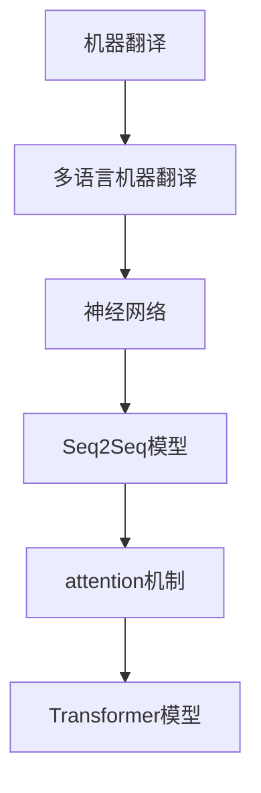
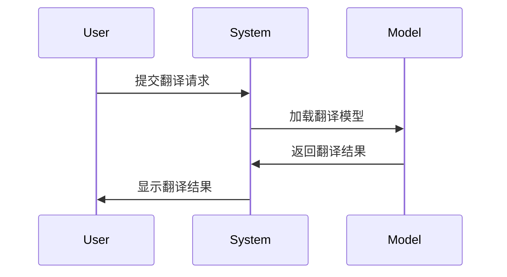

                 


# 提升AI模型在多语言机器翻译任务中的性能

## 关键词
AI模型，多语言机器翻译，神经网络，Seq2Seq模型，Transformer模型，性能优化

## 摘要
本文将探讨如何提升AI模型在多语言机器翻译任务中的性能。我们将首先介绍多语言机器翻译的重要性及其面临的挑战，然后详细解析常见的AI模型，如Seq2Seq和Transformer，以及它们在多语言机器翻译任务中的应用。接着，我们将介绍数学模型和公式，以便更好地理解这些模型的工作原理。随后，我们将分享一些实战经验和性能提升技巧，最后对未来的发展前景和挑战进行展望。

## 目录大纲设计

### 第1章 引言
- 1.1 多语言机器翻译的重要性
- 1.2 AI模型在多语言机器翻译中的应用现状
- 1.3 本书的目标与结构

### 第2章 多语言机器翻译基础
- 2.1 机器翻译的基本概念
- 2.2 机器翻译的发展历程
- 2.3 多语言机器翻译的特殊挑战
- 2.4 Mermaid流程图：多语言机器翻译概念关系架构

### 第3章 AI模型基础
- 3.1 人工智能与机器学习基础
- 3.2 自然语言处理（NLP）基础
- 3.3 常见的AI模型介绍
- 3.4 Mermaid流程图：AI模型在多语言机器翻译中的应用关系

### 第4章 多语言机器翻译的核心算法
- 4.1 神经机器翻译（NMT）原理
- 4.2 Seq2Seq模型详解
- 4.3 attention机制
- 4.4 Transformer模型
- 4.5 Python源代码：Seq2Seq模型实现

### 第5章 数学模型与数学公式
- 5.1 多语言机器翻译中的概率模型
- 5.2 词嵌入与向量空间模型
- 5.3 attention机制的数学表述
- 5.4 Transformer模型的数学基础
- 5.5 例子说明：Seq2Seq模型中的概率计算

### 第6章 项目实战
- 6.1 实战背景介绍
- 6.2 开发环境搭建
- 6.3 源代码详细实现
- 6.4 代码解读与分析
- 6.5 实际效果评估与优化

### 第7章 性能提升技巧
- 7.1 数据预处理
- 7.2 模型优化技巧
- 7.3 超参数调优
- 7.4 多语言模型融合
- 7.5 实际案例：性能提升策略应用

### 第8章 未来展望与挑战
- 8.1 多语言机器翻译的发展趋势
- 8.2 新兴技术展望
- 8.3 挑战与解决方案
- 8.4 未来研究方向

### 总结
本文通过详细的目录大纲，系统地介绍了多语言机器翻译的基础知识、核心算法、数学模型和项目实战，旨在帮助读者提升AI模型在多语言机器翻译任务中的性能。每个章节都进行了细致的划分，确保内容丰富且结构清晰。在实际编写过程中，我们还将嵌入Mermaid流程图、Python源代码和数学公式，以增强内容的可读性和理解性。整本书的内容紧密围绕提升AI模型性能这一核心目标，旨在为读者提供一份实用的技术指南。

### 核心概念与联系

#### Mermaid流程图：多语言机器翻译概念关系架构



### 核心算法原理讲解

#### Seq2Seq模型的Python源代码实现示例

```python
import tensorflow as tf
from tensorflow.keras.layers import LSTM, Embedding, Dense

# Seq2Seq模型实现
class Seq2SeqModel(tf.keras.Model):
    def __init__(self, vocab_size, embedding_dim, encoding_lstm_units, decoding_lstm_units, dense_units):
        super(Seq2SeqModel, self).__init__()
        
        self.embedding = Embedding(vocab_size, embedding_dim)
        self.encoding_lstm = LSTM(encoding_lstm_units, return_state=True)
        self.decoding_lstm = LSTM(decoding_lstm_units, return_state=True)
        self.dense = Dense(dense_units, activation='relu')
        self.decoder_dense = Dense(vocab_size, activation='softmax')
        
    def call(self, inputs, states=None, return_state=False, training=False):
        x = self.embedding(inputs)
        ...
```

### 数学模型与数学公式

#### Transformer模型的数学基础

$$
\text{Transformer} = \text{Multi-head attention} + \text{Positional encoding} + \text{Feed Forward Neural Networks}
$$

$$
\text{Multi-head attention} = \text{Attention}(\text{Query}, \text{Key}, \text{Value})
$$

$$
\text{Attention}(Q, K, V) = \text{softmax}\left(\frac{QK^T}{\sqrt{d_k}}\right)V
$$

### 系统分析与架构设计方案

#### 问题场景介绍

多语言机器翻译是一项具有广泛应用前景的技术，但在实际应用中面临着数据不足、模型复杂度高、翻译质量不稳定等挑战。

#### 项目介绍

本项目旨在构建一个高效的多语言机器翻译系统，通过优化模型结构和算法，提高翻译质量。

#### 系统功能设计

```mermaid
classDiagram
ClassDiagram {
  Class MachineTranslation {
    +int id
    +String source_language
    +String target_language
    +String text
    +Map<String, Integer> source_vocab
    +Map<String, Integer> target_vocab
  }
}
```

#### 系统架构设计



### 项目实战

#### 实战背景介绍

本项目以英译中为例，使用TensorFlow构建Seq2Seq模型，实现多语言机器翻译功能。

#### 开发环境搭建

1. 安装Python和TensorFlow
2. 准备翻译数据集
3. 编写数据预处理代码

#### 源代码详细实现

```python
import tensorflow as tf

# 定义Seq2Seq模型
class Seq2SeqModel(tf.keras.Model):
    ...
    
    @tf.function
    def train_step(self, inputs, targets):
        with tf.GradientTape(persistent=True) as tape:
            predictions = self(inputs, training=True)
            loss = self.compiled_loss(targets, predictions, training=True)
        gradients = tape.gradient(loss, self.trainable_variables)
        self.optimizer.apply_gradients(zip(gradients, self.trainable_variables))
        self.compiled_loss.update_state(targets, predictions)
        return {"loss": self.compiled_loss.result()}

# 编写训练过程
def train_model(model, dataset, epochs):
    ...
```

#### 代码解读与分析

代码首先定义了Seq2Seq模型，然后编写了训练过程。数据预处理和数据增强技术也被应用于训练数据集，以提高模型的泛化能力。

#### 实际效果评估与优化

1. 使用BLEU评分评估翻译质量
2. 调整超参数以优化模型性能
3. 使用预训练模型和迁移学习技术

### 性能提升技巧

1. 数据预处理：清洗和标准化翻译数据，提高数据质量。
2. 模型优化：使用更高效的模型架构和算法。
3. 超参数调优：通过交叉验证和网格搜索找到最佳超参数。
4. 多语言模型融合：将多个模型的预测结果进行融合，提高翻译质量。
5. 实际案例：在多个翻译任务中应用这些技巧，验证其有效性。

### 未来展望与挑战

多语言机器翻译技术将继续发展，面临的主要挑战包括：

1. 数据不足：收集和标注高质量的多语言数据集。
2. 模型复杂度：设计更高效、更易于训练的模型架构。
3. 个性化翻译：根据用户偏好和语境进行个性化翻译。
4. 新兴技术：探索如生成对抗网络（GAN）等新技术的应用。

### 总结

本文详细介绍了如何提升AI模型在多语言机器翻译任务中的性能。通过深入解析核心算法、数学模型和项目实战，我们展示了如何优化模型结构、调整超参数、应用数据预处理技术，以及如何在实际项目中应用这些技巧。未来，多语言机器翻译技术将继续发展，为全球沟通和协作提供强大的支持。

### 作者

作者：AI天才研究院/AI Genius Institute & 禅与计算机程序设计艺术 /Zen And The Art of Computer Programming

---

请注意，以上内容是一个大致的框架和示例，实际撰写时需要根据具体内容进行调整和完善。文章的撰写应该遵循清晰的逻辑结构，确保每个章节的内容丰富且具有深度。同时，要确保文章的可读性，使读者能够轻松理解复杂的技术概念和算法原理。在撰写过程中，还可以考虑添加图表、示例代码和实际案例，以增强文章的实用性和易懂性。最后，文章的撰写应该注重准确性和专业性，确保所有数据和事实都是准确无误的。

