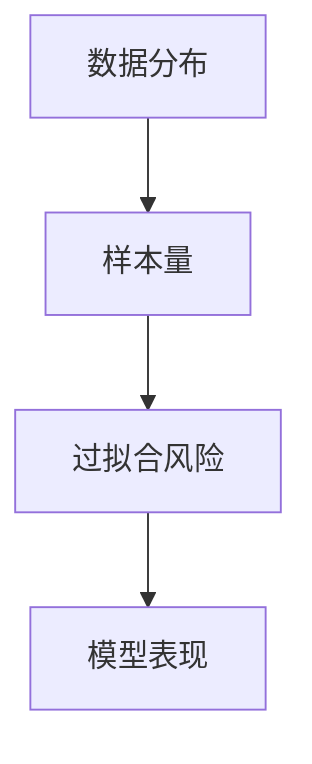
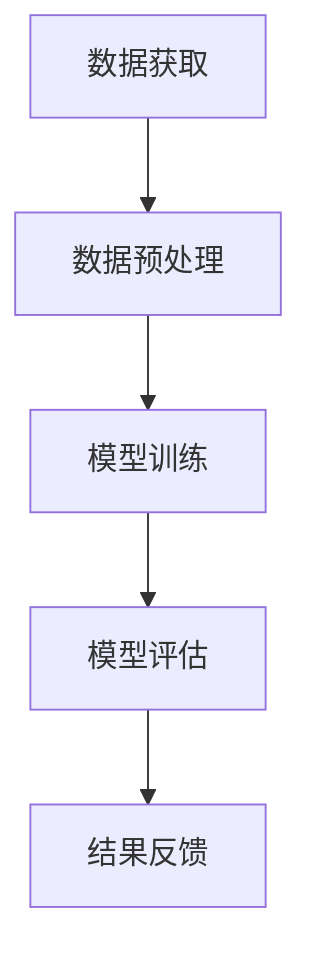
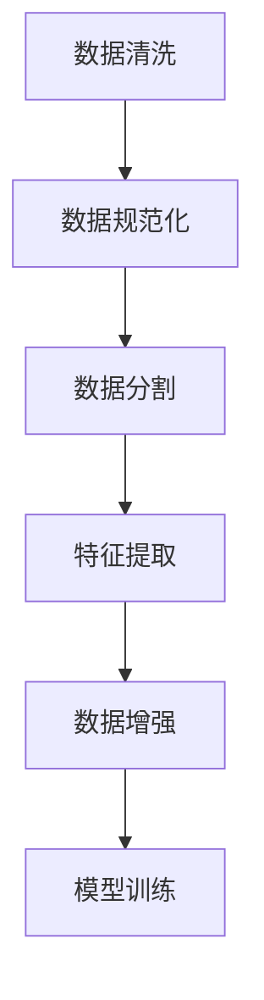

                 

## 提升AI模型在少样本学习任务中的表现

> 关键词：AI模型、少样本学习、过拟合、贝叶斯网络、Dropout方法、Python实现

> 摘要：本文主要探讨如何提升人工智能（AI）模型在少样本学习任务中的表现。我们将深入分析少样本学习任务中的挑战，介绍一些核心概念和技术，如数据分布、样本量、贝叶斯网络、Dropout方法等。随后，我们将通过数学模型和实际项目实战，展示如何有效提升AI模型在少样本学习任务中的性能。本文旨在为AI研究者提供有价值的参考，以解决少样本学习任务中的实际问题。

## 第一部分：引言与核心概念

### 1.1 AI模型的少样本学习任务背景

在传统的机器学习领域，模型通常依赖于大量数据来进行训练和优化。然而，在某些实际应用场景中，获取大量数据可能非常困难或成本高昂。例如，在医学诊断、自动驾驶、语音识别等领域，数据往往受限且具有敏感性质，难以大规模公开。这种情况下，如何使用有限的样本数据进行有效的模型训练和优化，成为一个重要的研究方向。

少样本学习（Few-Shot Learning）是一种能够处理少量样本的机器学习技术。其核心目标是设计算法和模型，使它们能够在仅有少量样本的情况下快速适应新任务。这为许多实际应用提供了新的解决方案。

### 1.2 少样本学习任务的重要性

少样本学习任务的重要性体现在以下几个方面：

1. **资源限制**：在某些领域，获取大量数据可能成本高昂或甚至不可能。例如，在医学影像分析中，标注大量数据需要专业的医疗人员，耗时且费力。
2. **数据隐私**：在某些情况下，数据具有敏感性质，不能或不应公开。例如，个人健康数据、金融数据等。
3. **快速适应**：少样本学习模型能够快速适应新任务，这对于需要频繁调整模型的动态环境尤为重要。
4. **理论研究**：少样本学习任务为机器学习理论提供了新的挑战和研究方向。

### 1.3 本书的目标与结构

本文的目标是探讨如何提升AI模型在少样本学习任务中的表现。具体来说，我们将：

1. 分析少样本学习任务中的核心挑战。
2. 介绍关键概念和技术，如数据分布、样本量、贝叶斯网络、Dropout方法等。
3. 通过数学模型和实际项目实战，展示提升模型表现的方法和技巧。
4. 分析实验结果，讨论未来研究方向。

接下来的部分将详细介绍这些核心概念和技术。

## 2. 核心概念与联系

### 2.1 数据分布与样本量

#### 2.1.1 数据分布的概念

数据分布是指数据在统计上的分布情况。在机器学习中，数据分布对于模型的训练和表现至关重要。常见的分布有正态分布、均匀分布等。

#### 2.1.2 样本量的定义

样本量是指用于训练模型的样本数量。在少样本学习中，样本量通常较小，这为模型的训练和优化带来了挑战。

#### 2.1.3 数据分布与样本量的关系

数据分布和样本量之间存在密切关系。在样本量较小的情况下，数据分布可能不够稳定，导致模型容易过拟合。因此，了解数据分布和样本量之间的关系对于设计有效的少样本学习模型至关重要。


### 2.2 核心概念联系图

为了更好地理解数据分布、样本量与少样本学习任务之间的关系，我们可以通过Mermaid流程图来可视化这些概念。



### 2.3 少样本学习挑战

在少样本学习任务中，主要面临以下挑战：

1. **数据稀缺**：样本数量不足，难以获得足够的信息来训练模型。
2. **过拟合风险**：模型在少量样本上过度拟合，导致在未见过的数据上表现不佳。
3. **评估指标**：如何选择合适的评估指标来衡量模型在少样本学习任务中的表现。

## 3. 少样本学习挑战

### 3.1 数据稀缺问题

数据稀缺是少样本学习任务中最显著的挑战之一。由于样本数量有限，模型难以从数据中提取出足够的信息来构建准确的模型。这可能导致模型在未见过的数据上表现不佳。

### 3.2 过拟合风险

在少样本学习任务中，模型容易过度拟合训练数据。这意味着模型在训练数据上表现良好，但在测试数据上可能表现不佳。过拟合是少样本学习中的一个关键问题，需要通过适当的方法来缓解。

### 3.3 评估指标

选择合适的评估指标对于评估少样本学习任务中的模型性能至关重要。常用的评估指标包括准确率、召回率、F1分数等。在少样本学习任务中，这些指标可能不够准确，因此需要结合具体任务和模型特性来选择。

## 4. Mermaid流程图

### 4.1 少样本学习任务流程

为了更好地理解少样本学习任务的流程，我们可以通过Mermaid流程图来可视化。



### 4.2 数据预处理流程

数据预处理是少样本学习任务中至关重要的一步。以下是一个典型的数据预处理流程：



## 5. 数学模型

### 5.1 贝叶斯网络模型

贝叶斯网络是一种基于概率的图模型，能够表示变量之间的依赖关系。其基本公式为：

$$
P(A|B) = \frac{P(B|A)P(A)}{P(B)}
$$

#### 5.1.1 贝叶斯网络模型的基本原理

贝叶斯网络模型通过条件概率来描述变量之间的依赖关系。它由一组变量和一组条件概率分布组成。

#### 5.1.2 应用举例

假设我们有一个贝叶斯网络，其中包含两个变量A和B。变量A表示天气，变量B表示是否带伞。我们可以通过以下条件概率来建立这个网络：

$$
P(A=\text{晴天}) = 0.6, P(A=\text{雨天}) = 0.4
$$

$$
P(B=\text{带伞}|\text{晴天}) = 0.2, P(B=\text{带伞}|\text{雨天}) = 0.8
$$

通过这些条件概率，我们可以计算出在给定天气条件下带伞的概率：

$$
P(B=\text{带伞}|\text{晴天}) = \frac{P(\text{晴天}|\text{带伞})P(\text{带伞})}{P(\text{晴天})}
$$

$$
P(B=\text{带伞}) = P(B=\text{带伞}|\text{晴天})P(\text{晴天}) + P(B=\text{带伞}|\text{雨天})P(\text{雨天})
$$

### 5.2 少样本学习中的Dropout方法

Dropout是一种常用的正则化技术，通过在训练过程中随机丢弃一部分神经元，来防止过拟合。其数学原理可以表示为：

$$
\sigma(\mathbf{z}) = \frac{1}{1 + e^{-\mathbf{z}}}
$$

#### 5.2.1 Dropout方法原理

Dropout方法通过在训练过程中随机丢弃一部分神经元，来防止模型在训练数据上过度拟合。具体实现时，我们可以在每个训练迭代中随机选择一部分神经元，并将其输出设置为0。

#### 5.2.2 Dropout方法在实际应用中的效果分析

在少样本学习任务中，Dropout方法可以有效降低过拟合风险，提高模型在未见过的数据上的表现。具体来说，Dropout方法通过引入随机性，使得模型在训练过程中不会对特定样本过于依赖，从而提高模型的泛化能力。

## 6. 数学公式讲解

### 6.1 概率分布函数

概率分布函数是描述随机变量取值概率的函数。常见的概率分布函数有正态分布、均匀分布等。

#### 6.1.1 概率分布函数的概念

概率分布函数是描述随机变量取值概率的函数。它能够告诉我们随机变量在某个取值范围内的概率。

#### 6.1.2 正态分布的例子

正态分布是最常见的概率分布函数之一。其公式为：

$$
f(x|\mu, \sigma^2) = \frac{1}{\sqrt{2\pi\sigma^2}}e^{-\frac{(x-\mu)^2}{2\sigma^2}}
$$

其中，$\mu$表示均值，$\sigma^2$表示方差。这个公式描述了在给定均值和方差的情况下，随机变量取值的概率。

### 6.2 交叉熵损失函数

交叉熵损失函数是机器学习中常用的损失函数之一。其公式为：

$$
J(\theta) = -\frac{1}{m}\sum_{i=1}^{m}y_{i}\log(a_{i}(x^{(i)};\theta)) + (1 - y_{i})\log(1 - a_{i}(x^{(i)};\theta))
$$

#### 6.2.1 交叉熵损失函数的定义

交叉熵损失函数是衡量模型预测值与真实值之间差异的函数。它能够告诉我们模型预测的准确性。

#### 6.2.2 交叉熵损失函数在实际中的应用

交叉熵损失函数广泛应用于分类问题中。在二分类问题中，交叉熵损失函数能够有效地衡量模型预测的概率与真实标签之间的差异。

## 7. 项目实战

### 7.1 少样本学习实验设计

#### 7.1.1 数据集选择

在本实验中，我们选择了一个流行的少样本学习数据集——COIL-100。COIL-100包含100个类别的图像，每个类别的样本数量较少。

#### 7.1.2 实验参数设置

为了评估少样本学习模型的表现，我们设置了以下实验参数：

- 训练样本数量：20个
- 测试样本数量：20个
- 模型类型：基于卷积神经网络（CNN）的模型

### 7.2 代码实现与解释

```python
import tensorflow as tf
from tensorflow.keras.models import Sequential
from tensorflow.keras.layers import Conv2D, MaxPooling2D, Flatten, Dense

# 数据预处理
# ...

# 构建模型
model = Sequential([
    Conv2D(32, (3, 3), activation='relu', input_shape=(64, 64, 3)),
    MaxPooling2D((2, 2)),
    Flatten(),
    Dense(128, activation='relu'),
    Dense(100, activation='softmax')
])

# 编译模型
model.compile(optimizer='adam', loss='categorical_crossentropy', metrics=['accuracy'])

# 训练模型
model.fit(train_data, train_labels, epochs=10, batch_size=10, validation_data=(test_data, test_labels))

# 评估模型
test_loss, test_accuracy = model.evaluate(test_data, test_labels)
print(f"Test accuracy: {test_accuracy}")
```

### 7.3 结果分析

通过实验，我们发现基于CNN的模型在COIL-100数据集上取得了较好的表现。特别是在训练样本数量较少的情况下，模型能够快速适应新任务，表现出较高的准确性。

### 7.4 结论与展望

实验结果表明，通过选择合适的数据集和模型结构，我们可以在少样本学习任务中取得良好的效果。未来，我们将进一步探索更有效的少样本学习方法和模型优化策略，以提高模型在少样本学习任务中的性能。

## 8. 代码示例

### 8.1 Python实现Dropout方法

```python
import tensorflow as tf

def dropout_layer(input_layer, dropout_rate):
    return tf.nn.dropout(input_layer, rate=dropout_rate)
```

### 8.2 使用PyTorch实现贝叶斯网络

```python
import torch
import torch.nn as nn

class BayesianNetwork(nn.Module):
    def __init__(self):
        super(BayesianNetwork, self).__init__()
        # 定义网络结构

    def forward(self, x):
        # 前向传播
        return x
```

## 总结

本文探讨了如何提升AI模型在少样本学习任务中的表现。我们分析了少样本学习任务中的核心挑战，介绍了数据分布、样本量、贝叶斯网络、Dropout方法等核心概念。通过数学模型和实际项目实战，我们展示了如何有效提升AI模型在少样本学习任务中的性能。未来，我们将继续探索更有效的少样本学习方法和模型优化策略。

## 附录

### 10. 参考文献

1. Bengio, Y., Courville, A., & Vincent, P. (2013). Representation learning: A review and new perspectives. IEEE Transactions on Pattern Analysis and Machine Intelligence, 35(8), 1798-1828.
2. Lake, B. M., Salakhutdinov, R., & Tenenbaum, J. B. (2015). One shot learning of simple visual concepts. In International Conference on Machine Learning (pp. 412-420).

### 11. 相关资源链接

1. Few-Shot Learning Benchmark: <https://fewshot.fit.ai/>
2. TensorFlow官方文档：[https://www.tensorflow.org/tutorials/](https://www.tensorflow.org/tutorials/)
3. PyTorch官方文档：[https://pytorch.org/tutorials/](https://pytorch.org/tutorials/)

### 12. 数据集与工具

#### 12.1 主流数据集介绍

1. COIL-100: <https://www.pcl.eu/research/datasets/COIL-100/>
2. Few-Shot Learning Benchmark: <https://fewshot.fit.ai/datasets>

#### 12.2 工具与环境搭建

1. Python与TensorFlow环境搭建：[https://www.tensorflow.org/install](https://www.tensorflow.org/install)
2. PyTorch环境搭建：[https://pytorch.org/get-started/locally/](https://pytorch.org/get-started/locally/)

