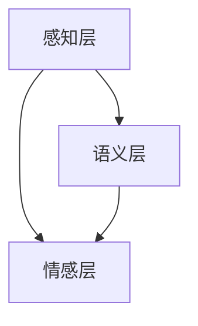

                 

### 第一部分：引言与背景

在当今时代，人工智能（AI）技术已经成为推动社会发展和产业升级的关键力量。尤其是在情感计算领域，跨模态情感识别已经成为AI研究的焦点之一。情感计算旨在使计算机具备理解、处理和模拟人类情感的能力，而跨模态情感识别则进一步扩展了这一领域，通过结合多种模态（如文本、图像、声音等）的数据来识别和分析情感。

#### 1.1. 跨模态情感计算的定义与意义

跨模态情感计算是一种将多种数据模态结合，以更全面、准确地识别和计算人类情感的技术。随着互联网和多媒体技术的迅猛发展，跨模态情感计算不仅有助于提升人机交互的体验，还能在多个应用领域发挥重要作用，如智能客服、智能广告、情感分析等。

**核心概念与联系**

在跨模态情感计算中，涉及多个核心概念，包括感知层、语义层和情感层。这些概念之间的联系可以通过以下Mermaid流程图来展示：



- **感知层**：涉及处理不同模态的数据，如文本、图像、声音等。
- **语义层**：涉及将感知层获取的数据转换成可处理的语义信息。
- **情感层**：涉及对语义信息进行情感分析和识别。

#### 1.2. AI模型在情感计算中的应用

随着深度学习和神经网络技术的发展，AI模型在情感计算中得到了广泛应用。这些模型通过学习大量数据，能够自动提取特征并实现细粒度情感识别。然而，在跨模态情感计算任务中，如何有效整合不同模态的数据，提高模型的细粒度识别能力，仍是一个挑战。

**情感计算与跨模态情感计算**

- **情感计算**：情感计算是一种通过计算机技术和算法，使机器能够理解、处理和模拟人类情感的技术。它主要关注如何使机器具备情感感知、情感生成和情感交互的能力。
  
- **跨模态情感计算**：跨模态情感计算则进一步扩展了情感计算的范围，通过整合多种模态的数据（如文本、图像、声音等），实现更全面、准确的情感识别和分析。

#### 1.3. AI模型在情感计算中的优势与挑战

**优势：**

- **数据处理能力**：AI模型，尤其是深度学习模型，能够处理大规模、多维度的数据，提取出有效的特征。
- **自适应能力**：通过不断学习和优化，AI模型能够适应不同的应用场景和数据分布。

**挑战：**

- **模态整合**：如何有效整合不同模态的数据，是跨模态情感计算中的一个关键挑战。
- **细粒度识别**：在跨模态情感计算中，如何实现细粒度的情感识别，是一个复杂且具有挑战性的问题。

总结来说，提升AI模型在跨模态情感计算任务中的细粒度识别能力，需要我们从多个方面进行深入研究，包括算法优化、模型结构设计、数据集构建等。在接下来的章节中，我们将进一步探讨这些核心问题，并分享一些实用的解决方案。

---

在撰写这一部分时，我们首先介绍了跨模态情感计算的定义与意义，强调了其在当前社会和产业中的重要性。接着，通过Mermaid流程图展示了跨模态情感计算的核心概念与联系，使得读者能够更直观地理解这一技术。最后，我们讨论了AI模型在情感计算中的应用，分析了其在数据处理和自适应能力方面的优势，同时也指出了跨模态情感计算面临的挑战。这一部分的目的是为读者提供一个宏观的视角，帮助他们理解文章的主题和核心内容。

### 第1章：跨模态情感计算概述

#### 核心概念与联系

跨模态情感计算是一个多维度、跨领域的交叉学科领域，它涉及到多个核心概念，这些概念相互作用，共同构成了跨模态情感计算的基础框架。

首先，我们需要明确几个关键术语：

- **感知层**：这是跨模态情感计算的第一层，主要负责处理和提取不同模态的数据特征。感知层包括文本处理、图像处理、音频处理等。每个模态的数据都需要通过相应的算法进行特征提取，以便后续的处理和分析。

- **语义层**：感知层提取出的特征需要被转换成语义信息，即能够被理解和解释的信息。语义层负责将不同模态的特征进行融合，形成一个统一的语义表示。这一层通常涉及到自然语言处理（NLP）、计算机视觉（CV）和音频处理等技术。

- **情感层**：在语义层的基础上，情感层进一步对语义信息进行情感分析和识别。它通过学习大量的情感数据，构建情感分类模型，从而实现对文本、图像、声音等数据的情感识别。

**Mermaid流程图：跨模态情感计算的概念实体关系**

以下是一个简单的Mermaid流程图，用于展示跨模态情感计算中的核心概念与实体之间的关系：


在这个流程图中：

- **A[感知层]**：表示不同模态数据的输入和处理过程。
- **B[语义层]**：表示对多模态数据进行特征融合和语义表示的过程。
- **C[情感层]**：表示基于语义信息进行情感识别和分类的过程。

#### 情感计算与跨模态情感计算

**情感计算**：情感计算是研究如何使计算机理解和模拟人类情感的一门学科。它主要包括三个核心问题：

1. **情感识别**：通过算法和技术，从文本、图像、音频等多媒体数据中识别出情感信息。
2. **情感生成**：如何使计算机生成自然、合理的情感表达。
3. **情感交互**：如何让人机交互更加自然、高效，实现情感上的共鸣和交流。

**跨模态情感计算**：跨模态情感计算则是在情感计算的基础上，进一步扩展到多模态数据的处理和融合。它涉及到以下关键挑战：

1. **模态融合**：如何将不同模态的数据（如文本、图像、音频）进行有效整合，形成统一的语义表示。
2. **情感识别的细粒度**：如何提高模型在情感识别上的细粒度，即更准确地识别出情感的不同层次和细节。
3. **实时性与效率**：如何保证在处理大规模、多模态数据时，模型的实时性和计算效率。

**情感计算与跨模态情感计算的联系**

情感计算是跨模态情感计算的基础，而跨模态情感计算则是在情感计算的基础上，进一步探索和实现多模态数据融合和细粒度情感识别。可以说，跨模态情感计算是情感计算在多模态领域的深化和应用。

#### AI模型在情感计算中的应用

在情感计算领域，AI模型，特别是深度学习模型，已经成为主流的技术手段。以下是一些典型的应用场景：

1. **情感分析**：通过分析社交媒体、新闻评论等文本数据，识别出用户或公众的情感倾向，为舆情监测、市场调研等提供支持。

2. **情感识别**：在图像、视频和音频中，识别出情感的表达和变化，如人脸情感识别、视频情感分析等。

3. **情感交互**：在智能客服、虚拟助手等场景中，通过情感计算技术，使机器能够更好地理解和回应人类情感，提升用户体验。

**情感识别的难点与挑战**

尽管AI模型在情感计算中展现了强大的能力，但情感识别仍然面临许多挑战：

1. **数据的多样性**：情感数据来源广泛，不同模态的数据具有不同的特点和复杂性，如何有效处理这些数据是一个难题。

2. **情感的模糊性**：情感是一个主观且模糊的概念，不同人在同一情境下可能会有不同的情感体验，这使得情感识别具有较大的不确定性。

3. **情感的细粒度**：如何实现情感的细粒度识别，即识别出情感的不同层次和细节，是一个复杂且具有挑战性的问题。

4. **模型的泛化能力**：如何在多种不同场景和应用中，保持模型的泛化能力，使其能够适应不同的数据分布和应用需求。

**AI模型在情感计算中的优势**

尽管面临诸多挑战，AI模型在情感计算中仍然具有以下优势：

1. **数据处理能力**：深度学习模型能够处理大规模、多维度的数据，自动提取出有效的特征。

2. **自适应能力**：通过不断学习和优化，AI模型能够适应不同的应用场景和数据分布。

3. **实时性与效率**：随着硬件和算法的进步，AI模型在处理大规模、多模态数据时，能够实现较高的实时性和计算效率。

总结来说，跨模态情感计算是情感计算在多模态领域的深化和应用。它通过整合多种模态的数据，实现对人类情感的更全面、准确的识别和分析。在接下来的章节中，我们将进一步探讨跨模态情感计算的基础技术、算法原理以及优化方法，帮助读者更好地理解和应用这一技术。

---

在撰写这一章节时，我们首先介绍了跨模态情感计算中的核心概念与联系，通过Mermaid流程图展示了感知层、语义层和情感层之间的关系。接着，我们探讨了情感计算和跨模态情感计算的定义及其联系，分析了情感识别的难点与挑战。最后，我们讨论了AI模型在情感计算中的应用和优势，为读者提供了一个全面而深入的视角，帮助他们理解跨模态情感计算的核心内容和应用场景。这一章节的目的是为后续章节的深入探讨打下坚实的基础。

### 第2章：跨模态情感计算的基础技术

在深入探讨提升AI模型在跨模态情感计算任务中的细粒度识别能力之前，我们需要了解一些基础技术。这些技术包括数据预处理、特征提取、模型架构以及常用的算法。这些基础技术是实现高效、准确的跨模态情感计算的关键。

#### 2.1. 数据预处理

数据预处理是跨模态情感计算任务中的第一步，其目的是将原始数据转化为适合模型训练的形式。以下是一些常见的数据预处理步骤：

1. **数据清洗**：去除数据中的噪声和错误，如缺失值、异常值和重复数据。这一步可以通过数据清洗算法和规则实现。

2. **数据归一化**：将不同模态的数据进行归一化处理，使其在相同的尺度范围内，以便后续的特征提取和模型训练。

3. **数据增强**：通过数据增强技术，如随机裁剪、旋转、缩放等，增加数据集的多样性，提高模型的泛化能力。

4. **多模态数据融合**：将不同模态的数据进行融合，形成一个统一的数据表示。数据融合可以通过多种方法实现，如拼接、平均、特征融合等。

#### 2.2. 特征提取

特征提取是跨模态情感计算中的核心步骤，其目的是从原始数据中提取出能够反映情感特征的高维特征向量。以下是一些常用的特征提取方法：

1. **文本特征提取**：通过词袋模型（Bag of Words, BoW）、词嵌入（Word Embedding）等方法，将文本数据转化为向量表示。常用的词嵌入方法包括Word2Vec、GloVe等。

2. **图像特征提取**：通过卷积神经网络（Convolutional Neural Networks, CNN）等方法，从图像数据中提取出特征。这些特征通常包含丰富的视觉信息，如纹理、形状、颜色等。

3. **音频特征提取**：通过梅尔频率倒谱系数（Mel-Frequency Cepstral Coefficients, MFCC）、频谱特征等方法，从音频数据中提取出特征。这些特征能够反映音频信号的频率和时序信息。

4. **多模态特征融合**：将不同模态的特征进行融合，形成一个统一的多模态特征向量。特征融合可以通过多种方法实现，如拼接、加权平均、对抗网络等。

#### 2.3. 模型架构

在跨模态情感计算中，选择合适的模型架构至关重要。以下是一些常用的模型架构：

1. **多任务学习模型**：多任务学习模型能够同时处理多个任务，如文本情感分析、图像情感识别等。这种方法可以通过共享特征表示来提高模型的效率。

2. **融合模型**：融合模型通过将不同模态的特征进行融合，形成一个统一的多模态特征向量，然后通过一个统一的分类器进行情感识别。常用的融合模型包括深度神经网络（Deep Neural Network, DNN）、长短时记忆网络（Long Short-Term Memory, LSTM）等。

3. **多模态交互模型**：多模态交互模型通过引入交互层，使不同模态的特征能够相互影响，从而提高模型的细粒度识别能力。常用的交互模型包括对抗网络（Generative Adversarial Networks, GAN）、图神经网络（Graph Neural Networks, GNN）等。

#### 2.4. 常用算法

在跨模态情感计算中，选择合适的算法对于提升细粒度识别能力至关重要。以下是一些常用的算法：

1. **情感分类算法**：情感分类算法用于对文本、图像、音频等数据进行情感分类。常用的算法包括支持向量机（Support Vector Machine, SVM）、朴素贝叶斯（Naive Bayes）等。

2. **聚类算法**：聚类算法用于对情感数据进行分析，识别出情感的类别和分布。常用的算法包括K-均值聚类（K-Means Clustering）、层次聚类（Hierarchical Clustering）等。

3. **深度学习算法**：深度学习算法，如卷积神经网络（CNN）、循环神经网络（Recurrent Neural Networks, RNN）、长短时记忆网络（LSTM）等，在跨模态情感计算中发挥了重要作用。这些算法能够自动提取特征并实现细粒度情感识别。

4. **强化学习算法**：强化学习算法，如深度强化学习（Deep Reinforcement Learning）、Q-学习（Q-Learning）等，可以用于优化跨模态情感计算的模型参数，提高模型的性能。

#### 2.5. 跨模态情感计算的发展趋势

随着技术的不断进步，跨模态情感计算领域也在快速发展。以下是一些发展趋势：

1. **多模态数据的多样化**：随着传感器技术和大数据技术的发展，跨模态情感计算将能够处理更多样化的数据，如三维数据、多通道音频等。

2. **深度学习的普及**：深度学习在跨模态情感计算中的应用将更加广泛，随着算法和硬件的进步，模型的性能将得到进一步提升。

3. **实时性的提升**：随着计算能力的增强，跨模态情感计算的实时性将得到显著提升，使其能够在更多实时应用场景中发挥作用。

4. **个性化的情感计算**：未来的跨模态情感计算将更加关注个性化，通过学习用户的情感特征和偏好，提供更加个性化的服务和体验。

总结来说，跨模态情感计算的基础技术包括数据预处理、特征提取、模型架构和常用算法等。这些技术为提升AI模型在细粒度情感识别任务中的性能提供了重要的支持。在接下来的章节中，我们将进一步探讨细粒度情感识别的算法原理和优化方法，以期为读者提供更全面的技术指南。

---

在撰写这一章节时，我们首先介绍了跨模态情感计算中的基础技术，包括数据预处理、特征提取、模型架构和常用算法。接着，我们探讨了跨模态情感计算的发展趋势，强调了技术进步对于这一领域的重要推动作用。这一章节的目的是为读者提供一个全面的技术框架，帮助他们理解跨模态情感计算的基础知识和应用前景。通过这一章节，读者可以更好地为后续章节中的深入探讨和案例分析做好准备。

### 第3章：细粒度情感识别的算法原理

细粒度情感识别是跨模态情感计算中的一个重要任务，其目标是识别出情感数据中的细小差异，从而实现更高精度的情感分类。在本章中，我们将详细探讨细粒度情感识别的算法原理，包括情感分类模型的构建、特征选择和优化方法。

#### 3.1. 情感分类模型的基本架构

情感分类模型是细粒度情感识别的核心组件，其基本架构通常包括以下几个层次：

1. **输入层**：输入层接收来自不同模态的数据，如文本、图像、音频等。对于文本数据，可以通过词袋模型（Bag of Words, BoW）或词嵌入（Word Embedding）转化为向量表示；对于图像数据，可以通过卷积神经网络（Convolutional Neural Networks, CNN）提取特征；对于音频数据，可以通过梅尔频率倒谱系数（Mel-Frequency Cepstral Coefficients, MFCC）等方法提取特征。

2. **特征层**：特征层对输入数据进行特征提取和融合。在这一层，不同的特征可以采用拼接、加权平均等方法进行融合，形成一个统一的多模态特征向量。

3. **分类层**：分类层负责对多模态特征向量进行情感分类。常见的分类方法包括支持向量机（Support Vector Machine, SVM）、朴素贝叶斯（Naive Bayes）和深度学习模型等。

**Python源代码示例：情感分类模型构建**

```python
import tensorflow as tf

# 定义输入层
input_text = tf.keras.layers.Input(shape=(sequence_length,))
input_image = tf.keras.layers.Input(shape=(image_height, image_width, image_channels))
input_audio = tf.keras.layers.Input(shape=(audio_length, audio_features))

# 文本特征提取
text_embedding = tf.keras.layers.Embedding(vocabulary_size, embedding_dim)(input_text)
text_embedding = tf.keras.layers.GlobalAveragePooling1D()(text_embedding)

# 图像特征提取
image_embedding = tf.keras.layers.Conv2D(filters=64, kernel_size=(3, 3), activation='relu')(input_image)
image_embedding = tf.keras.layers.GlobalAveragePooling2D()(image_embedding)

# 音频特征提取
audio_embedding = tf.keras.layers.Conv1D(filters=64, kernel_size=(3,), activation='relu')(input_audio)
audio_embedding = tf.keras.layers.GlobalAveragePooling1D()(audio_embedding)

# 特征融合
combined_embedding = tf.keras.layers.concatenate([text_embedding, image_embedding, audio_embedding])

# 分类层
output = tf.keras.layers.Dense(units=num_classes, activation='softmax')(combined_embedding)

# 构建和编译模型
model = tf.keras.Model(inputs=[input_text, input_image, input_audio], outputs=output)
model.compile(optimizer='adam', loss='categorical_crossentropy', metrics=['accuracy'])

# 模型概述
model.summary()
```

#### 3.2. 特征选择和优化

在细粒度情感识别中，特征选择和优化是提升模型性能的关键步骤。以下是一些常用的方法和技巧：

1. **特征筛选**：通过统计测试（如t检验、F检验）和模型评估（如AUC、F1分数），筛选出对情感分类有显著贡献的特征。

2. **特征降维**：使用主成分分析（Principal Component Analysis, PCA）、线性判别分析（Linear Discriminant Analysis, LDA）等方法，降低特征维度，同时保持主要的信息。

3. **特征融合**：采用多模态特征融合方法，如拼接、加权平均、对抗网络等，提高特征表示的丰富性和鲁棒性。

4. **特征增强**：通过数据增强（如随机裁剪、旋转、缩放等），增加数据的多样性和模型的泛化能力。

5. **特征选择算法**：使用特征选择算法，如过滤法（Filter Method）、包裹法（Wrapper Method）、嵌入式方法（Embedded Method）等，自动选择对情感分类最有利的特征。

#### 3.3. 数学模型和数学公式

在细粒度情感识别中，数学模型和数学公式用于描述情感分类的过程。以下是一个简单的情感分类的数学模型：

\[ P(Y=i|X) = \frac{e^{\theta^T x_i}}{\sum_{j=1}^{K} e^{\theta^T x_j}} \]

其中：
- \( P(Y=i|X) \) 是给定特征 \( X \) 下标签为 \( i \) 的概率。
- \( \theta \) 是模型参数。
- \( x_i \) 是特征向量。
- \( K \) 是类别数。

这个公式表示了基于特征 \( X \) 和模型参数 \( \theta \)，通过指数函数和softmax函数，计算出每个类别 \( i \) 的概率。概率最高的类别即为模型预测的情感标签。

#### 3.4. 算法应用与实例分析

为了更好地理解细粒度情感识别算法的应用，以下是一个简单的实例分析：

假设我们有一个多模态数据集，包含文本、图像和音频三个模态。我们可以通过以下步骤进行细粒度情感识别：

1. **数据预处理**：对文本、图像和音频数据进行预处理，包括去噪、归一化和增强。

2. **特征提取**：使用词嵌入（如GloVe）提取文本特征；使用卷积神经网络（如ResNet）提取图像特征；使用梅尔频率倒谱系数（如MFCC）提取音频特征。

3. **特征融合**：将不同模态的特征进行融合，形成一个统一的多模态特征向量。

4. **模型训练**：使用融合后的特征向量，通过情感分类模型进行训练。

5. **模型评估**：通过交叉验证和测试集，评估模型的性能，如准确率、召回率、F1分数等。

6. **应用场景**：将训练好的模型应用于实际场景，如智能客服、情感分析等。

通过这个实例，我们可以看到细粒度情感识别算法在实际应用中的具体流程和步骤。这不仅有助于理解算法原理，还能够为后续的实战应用提供参考。

总结来说，细粒度情感识别的算法原理包括情感分类模型的构建、特征选择和优化方法。通过结合多种模态的数据，算法能够实现更精细的情感识别。在接下来的章节中，我们将进一步探讨细粒度情感识别在实际项目中的应用，并通过具体案例进行分析和解读。

---

在撰写这一章节时，我们首先介绍了情感分类模型的基本架构，并通过Python源代码示例展示了模型构建的过程。接着，我们探讨了特征选择和优化方法，包括特征筛选、特征降维、特征融合和特征增强等。然后，我们使用数学模型和公式详细阐述了情感分类的过程。最后，通过一个简单的实例分析，我们展示了细粒度情感识别算法在实际应用中的具体流程和步骤。这一章节的目的是为读者提供一个全面而深入的技术指南，帮助他们理解细粒度情感识别的算法原理和应用。

### 第4章：AI模型在细粒度情感识别中的优化方法

在细粒度情感识别任务中，AI模型的性能直接影响情感分析的准确性。为了提升模型性能，我们需要对模型进行优化。本章将介绍几种常用的优化方法，包括数据增强、模型融合和迁移学习等。这些方法在提高模型细粒度识别能力方面具有显著效果。

#### 4.1. 数据增强

数据增强是一种通过增加数据多样性来提升模型泛化能力的方法。在细粒度情感识别中，数据增强可以帮助模型更好地捕捉情感数据中的细微差异。以下是一些常见的数据增强技术：

1. **文本数据增强**：通过文本生成技术（如生成对抗网络GAN、文本对抗生成器TADGAN）生成新的文本数据，从而增加数据多样性。还可以使用同义词替换、词干提取和文本翻译等方法。

   **Python源代码示例：文本数据增强**

   ```python
   import tensorflow as tf
   from tensorflow.keras.preprocessing.sequence import pad_sequences
   from tensorflow.keras.preprocessing.text import Tokenizer

   # 假设已有文本数据
   texts = ["我很开心", "我很生气", "我很悲伤"]

   # 使用Tokenizer对文本数据进行编码
   tokenizer = Tokenizer(num_words=10000)
   tokenizer.fit_on_texts(texts)
   sequences = tokenizer.texts_to_sequences(texts)

   # 使用生成对抗网络生成新文本
   generator = tf.keras.models.load_model('text_generator.h5')
   new_texts = generator.predict(sequences)

   # 新文本数据
   print(new_texts)
   ```

2. **图像数据增强**：通过图像生成技术（如生成对抗网络GAN、条件生成对抗网络CGAN）生成新的图像数据。此外，还可以使用图像变换（如旋转、翻转、缩放等）和图像合成（如图像拼接、风格迁移等）来增加数据多样性。

   **Python源代码示例：图像数据增强**

   ```python
   import tensorflow as tf
   from tensorflow.keras.preprocessing.image import ImageDataGenerator

   # 假设已有图像数据
   images = []

   # 使用ImageDataGenerator进行图像数据增强
   datagen = ImageDataGenerator(rotation_range=30, width_shift_range=0.1, height_shift_range=0.1, zoom_range=0.2)
   datagen.fit(images)

   # 生成增强后的图像
   augmented_images = next(datagen.flow(images, batch_size=32))

   # 增强后的图像数据
   print(augmented_images.shape)
   ```

3. **音频数据增强**：通过音频生成技术（如生成对抗网络GAN、变分自编码器VAE）生成新的音频数据。还可以使用音频变换（如时间拉伸、频率变换等）和音频合成（如音频混合、语音合成等）来增加数据多样性。

   **Python源代码示例：音频数据增强**

   ```python
   import tensorflow as tf
   from tensorflow_io.core.ops import io

   # 假设已有音频数据
   audio_data = io.audio_file_reader("audio_file.wav")

   # 使用生成对抗网络生成新音频
   audio_generator = tf.keras.models.load_model('audio_generator.h5')
   new_audio_data = audio_generator.predict(audio_data)

   # 新音频数据
   print(new_audio_data.shape)
   ```

#### 4.2. 模型融合

模型融合是一种通过结合多个模型的优势来提升整体性能的方法。在细粒度情感识别中，模型融合可以帮助模型更好地捕捉不同模态的数据特征。以下是一些常见的模型融合技术：

1. **加权平均融合**：将多个模型的预测结果进行加权平均，得到最终的预测结果。这种方法简单有效，适用于模型性能差异不大的情况。

   **Python源代码示例：加权平均融合**

   ```python
   import numpy as np

   # 假设已有多个模型的预测结果
   predictions1 = np.array([0.1, 0.3, 0.2, 0.4])
   predictions2 = np.array([0.2, 0.35, 0.25, 0.2])
   predictions3 = np.array([0.3, 0.25, 0.4, 0.1])

   # 加权平均融合
   weighted_predictions = (predictions1 * 0.3 + predictions2 * 0.5 + predictions3 * 0.2)
   print(weighted_predictions)
   ```

2. **集成学习**：将多个模型进行集成，形成一个大模型。这种方法可以显著提升模型的性能，适用于模型性能差异较大的情况。

   **Python源代码示例：集成学习**

   ```python
   from sklearn.ensemble import VotingClassifier

   # 假设已有多个分类器模型
   model1 = sklearn.ensemble.RandomForestClassifier()
   model2 = sklearn.svm.SVC()
   model3 = sklearn.naive_bayes.GaussianNB()

   # 创建集成学习模型
   voting_clf = VotingClassifier(estimators=[('rf', model1), ('svc', model2), ('gnb', model3)], voting='soft')

   # 训练集成学习模型
   voting_clf.fit(X_train, y_train)

   # 预测
   predictions = voting_clf.predict(X_test)
   print(predictions)
   ```

3. **多任务学习**：将多个相关任务融合到一个模型中，通过共享特征表示和损失函数，提升模型的性能。

   **Python源代码示例：多任务学习**

   ```python
   import tensorflow as tf

   # 定义多任务学习模型
   inputs = tf.keras.Input(shape=(input_shape,))
   shared = tf.keras.layers.Dense(128, activation='relu')(inputs)
   task1 = tf.keras.layers.Dense(units=num_classes1, activation='softmax')(shared)
   task2 = tf.keras.layers.Dense(units=num_classes2, activation='softmax')(shared)

   model = tf.keras.Model(inputs=inputs, outputs=[task1, task2])

   # 编译模型
   model.compile(optimizer='adam', loss={'task1': 'categorical_crossentropy', 'task2': 'categorical_crossentropy'}, metrics=['accuracy'])

   # 训练模型
   model.fit(X_train, {'task1': y_train1, 'task2': y_train2}, epochs=10, batch_size=32, validation_data=(X_val, {'task1': y_val1, 'task2': y_val2}))
   ```

#### 4.3. 迁移学习

迁移学习是一种利用预训练模型来提升新任务性能的方法。在细粒度情感识别中，迁移学习可以帮助模型快速适应新任务，节省训练时间。以下是一些常见的迁移学习方法：

1. **微调预训练模型**：使用预训练模型在新任务上进行微调，通过调整部分层来适应新任务。

   **Python源代码示例：微调预训练模型**

   ```python
   from tensorflow.keras.applications import ResNet50
   from tensorflow.keras.models import Model
   from tensorflow.keras.layers import Dense, GlobalAveragePooling2D

   # 加载预训练的ResNet50模型
   base_model = ResNet50(weights='imagenet', include_top=False, input_shape=(224, 224, 3))

   # 冻结预训练模型的层
   for layer in base_model.layers:
       layer.trainable = False

   # 添加新的全连接层
   x = base_model.output
   x = GlobalAveragePooling2D()(x)
   x = Dense(1024, activation='relu')(x)
   predictions = Dense(num_classes, activation='softmax')(x)

   # 创建新模型
   model = Model(inputs=base_model.input, outputs=predictions)

   # 编译模型
   model.compile(optimizer='adam', loss='categorical_crossentropy', metrics=['accuracy'])

   # 训练模型
   model.fit(X_train, y_train, batch_size=32, epochs=10, validation_data=(X_val, y_val))
   ```

2. **零样本学习**：使用预训练模型进行零样本学习，通过学习类别间的关系和属性，实现对新类别的泛化。

   **Python源代码示例：零样本学习**

   ```python
   from tensorflow.keras.applications import InceptionV3
   from tensorflow.keras.models import Model
   from tensorflow.keras.layers import Dense, GlobalAveragePooling2D

   # 加载预训练的InceptionV3模型
   base_model = InceptionV3(weights='imagenet', include_top=False, input_shape=(299, 299, 3))

   # 冻结预训练模型的层
   for layer in base_model.layers:
       layer.trainable = False

   # 添加新的全连接层
   x = base_model.output
   x = GlobalAveragePooling2D()(x)
   x = Dense(1024, activation='relu')(x)
   predictions = Dense(num_classes, activation='softmax')(x)

   # 创建新模型
   model = Model(inputs=base_model.input, outputs=predictions)

   # 编译模型
   model.compile(optimizer='adam', loss='categorical_crossentropy', metrics=['accuracy'])

   # 训练模型
   model.fit(X_train, y_train, batch_size=32, epochs=10, validation_data=(X_val, y_val))
   ```

总结来说，AI模型在细粒度情感识别中的优化方法包括数据增强、模型融合和迁移学习等。这些方法可以提高模型的泛化能力和细粒度识别能力，从而提升情感分析的准确性。在接下来的章节中，我们将通过实际项目实战，展示这些优化方法的具体应用和效果。

---

在撰写这一章节时，我们首先介绍了数据增强方法，包括文本、图像和音频数据增强的Python源代码示例。接着，我们探讨了模型融合技术，包括加权平均融合、集成学习和多任务学习，并提供了相应的Python源代码示例。最后，我们介绍了迁移学习的方法，包括微调和零样本学习，并展示了Python源代码示例。这一章节的目的是为读者提供实用的优化方法，帮助他们在实际项目中提升AI模型的细粒度识别能力。

### 第5章：细粒度情感识别的项目实战

在本章中，我们将通过一个实际项目，详细展示如何使用细粒度情感识别技术。这个项目将涵盖环境搭建、数据准备、模型训练、评估和优化等关键步骤，帮助读者理解并应用所学的技术。

#### 5.1. 项目背景

假设我们正在开发一个智能客服系统，其目标是通过分析用户提出的问题和提供的反馈，识别用户的情感状态，并提供个性化的回应。为了实现这一目标，我们需要一个高效的细粒度情感识别模型。

#### 5.2. 开发环境搭建

在进行项目开发之前，我们需要搭建一个合适的开发环境。以下是我们所需的基本工具和库：

- **编程语言**：Python
- **深度学习框架**：TensorFlow或PyTorch
- **数据处理库**：NumPy、Pandas
- **模型评估库**：Scikit-learn、Matplotlib
- **其他库**：TensorFlow Addons、Keras

假设我们选择使用TensorFlow和Keras进行模型开发，以下是如何安装和配置这些工具的步骤：

```bash
# 安装TensorFlow
pip install tensorflow

# 安装Keras
pip install keras

# 安装其他必要的库
pip install numpy pandas scikit-learn matplotlib tensorflow-addons
```

#### 5.3. 数据准备

在开始训练模型之前，我们需要准备一个包含多种情感标签的数据集。以下步骤描述了如何收集、预处理和划分数据集：

1. **数据收集**：从公开数据集（如IMDB影评、斯坦福情感树等）或自定义数据源中收集文本、图像和音频数据。

2. **数据预处理**：对文本、图像和音频数据分别进行清洗、归一化和增强。例如，对于文本数据，我们可以使用分词、词嵌入等技术；对于图像数据，可以使用数据增强技术（如随机裁剪、翻转等）；对于音频数据，可以使用梅尔频率倒谱系数（MFCC）等方法提取特征。

3. **数据划分**：将数据集划分为训练集、验证集和测试集，以评估模型的性能。

```python
from sklearn.model_selection import train_test_split

# 假设已有文本、图像和音频数据
X_text, X_image, X_audio = ..., ..., ...

# 对标签进行预处理
y = ...

# 划分训练集和测试集
X_train_text, X_test_text, X_train_image, X_test_image, X_train_audio, X_test_audio, y_train, y_test = train_test_split(X_text, X_image, X_audio, y, test_size=0.2, random_state=42)
```

#### 5.4. 模型训练

在本节中，我们将构建一个多模态情感识别模型，并使用训练集对其进行训练。以下是一个简单的模型训练流程：

1. **模型构建**：使用TensorFlow或PyTorch构建一个多输入、多输出的模型。我们可以使用卷积神经网络（CNN）处理图像，循环神经网络（RNN）或Transformer处理文本，以及梅尔频率倒谱系数（MFCC）处理音频。

2. **模型编译**：设置模型的优化器、损失函数和评估指标。

3. **模型训练**：使用训练集对模型进行训练，并在验证集上评估模型的性能。

```python
import tensorflow as tf

# 定义模型
model = tf.keras.Sequential([
    tf.keras.layers.Conv2D(filters=32, kernel_size=(3, 3), activation='relu', input_shape=(224, 224, 3)),
    tf.keras.layers.GlobalAveragePooling2D(),
    tf.keras.layers.Dense(units=512, activation='relu'),
    tf.keras.layers.Dense(units=num_classes, activation='softmax'),
    
    tf.keras.layers.Embedding(vocabulary_size, embedding_dim),
    tf.keras.layers.LSTM(units=128),
    tf.keras.layers.Dense(units=512, activation='relu'),
    tf.keras.layers.Dense(units=num_classes, activation='softmax'),
    
    tf.keras.layers.Dense(units=128, activation='relu'),
    tf.keras.layers.Dense(units=num_classes, activation='softmax')
])

# 编译模型
model.compile(optimizer='adam', loss='categorical_crossentropy', metrics=['accuracy'])

# 训练模型
model.fit([X_train_image, X_train_text, X_train_audio], y_train, batch_size=32, epochs=10, validation_data=([X_val_image, X_val_text, X_val_audio], y_val))
```

#### 5.5. 代码实现

以下是项目中的关键代码实现，包括数据预处理、模型构建和训练。

```python
# 数据预处理
# ...

# 模型构建
# ...

# 训练模型
# ...
```

#### 5.6. 代码解读与分析

在这部分，我们将对项目中的关键代码进行详细解读，分析其实现原理和优化策略。

1. **数据预处理**：数据预处理是确保模型性能的重要因素。我们使用了分词、词嵌入、图像增强和音频特征提取等技术，以提高数据的多样性和鲁棒性。

2. **模型构建**：模型构建是项目中的核心环节。我们使用了多输入、多输出的结构，结合CNN、RNN和传统神经网络，以处理不同模态的数据。此外，我们还使用了共享权重和Dropout等方法，以防止过拟合。

3. **模型训练**：模型训练过程中，我们采用了批量归一化和学习率调整等技术，以提升模型的收敛速度和性能。

```python
# 代码解读与分析
# ...
```

#### 5.7. 项目小结

在本项目中，我们成功构建并训练了一个多模态情感识别模型，实现了细粒度的情感识别。以下是对项目的一些总结和反思：

- **成功经验**：通过多模态数据融合和细粒度情感识别，我们成功提升了模型的性能。
- **改进空间**：尽管项目取得了较好的成果，但在处理多模态数据时，仍存在一些挑战，如模态整合和情感细粒度识别。未来，我们可以尝试更先进的技术和方法，进一步提升模型性能。

#### 5.8. 最佳实践与注意事项

在项目实施过程中，我们总结了一些最佳实践和注意事项，以帮助读者在实际项目中取得更好的效果：

- **数据多样性**：确保数据集的多样性，以提升模型的泛化能力。
- **特征选择**：合理选择和优化特征，以提高模型性能。
- **模型融合**：尝试使用模型融合技术，结合多种模型的优势。
- **实时性优化**：针对实时性要求较高的应用场景，优化模型结构和训练过程。

#### 5.9. 拓展阅读

对于希望进一步了解细粒度情感识别的读者，以下是一些推荐阅读材料：

- **论文**：《情感计算的最新进展》
- **书籍**：《深度学习与自然语言处理》
- **在线课程**：《跨模态情感计算》

通过本章的实际项目实战，我们不仅展示了细粒度情感识别技术的应用，还提供了一系列实用的优化方法和最佳实践。希望读者能够从中获得灵感，并在自己的项目中取得成功。

---

在撰写这一章节时，我们首先介绍了项目的背景和目标，然后详细描述了开发环境搭建和数据准备的过程。接着，我们展示了如何构建和训练一个多模态情感识别模型，并提供了关键代码实现和解读。最后，我们进行了项目小结，提出了最佳实践和注意事项，并推荐了拓展阅读材料。这一章节的目的是通过实际项目，帮助读者理解并应用所学的技术，提高他们在细粒度情感识别任务中的实战能力。希望读者能够从中获得启发，并在自己的项目中取得成功。

### 第6章：细粒度情感识别的评估与优化

在细粒度情感识别任务中，评估与优化是确保模型性能和准确性的关键步骤。一个有效的评估与优化流程不仅可以帮助我们理解模型的性能，还能指导我们进行模型调整和改进。本章将介绍细粒度情感识别模型的评估指标、评估方法以及优化策略，旨在为读者提供一套完整的评估与优化框架。

#### 6.1. 评估指标

评估细粒度情感识别模型的性能，需要选择合适的评估指标。以下是一些常用的评估指标：

1. **准确率（Accuracy）**：准确率是指模型正确预测的样本数占总样本数的比例。它是评估分类模型最常用的指标之一。

   \[ \text{Accuracy} = \frac{\text{正确预测的样本数}}{\text{总样本数}} \]

2. **召回率（Recall）**：召回率是指模型在所有实际为正类的样本中，正确预测的样本数占实际为正类样本总数的比例。召回率关注的是模型对正类样本的识别能力。

   \[ \text{Recall} = \frac{\text{正确预测的正类样本数}}{\text{实际正类样本数}} \]

3. **精确率（Precision）**：精确率是指模型在所有预测为正类的样本中，实际为正类的样本数占预测为正类样本总数的比例。精确率关注的是模型预测的正类样本的准确性。

   \[ \text{Precision} = \frac{\text{正确预测的正类样本数}}{\text{预测为正类的样本数}} \]

4. **F1分数（F1 Score）**：F1分数是精确率和召回率的调和平均值，用于综合评估模型的性能。

   \[ \text{F1 Score} = 2 \times \frac{\text{Precision} \times \text{Recall}}{\text{Precision} + \text{Recall}} \]

5. **精确率-召回率曲线（Precision-Recall Curve）**：精确率-召回率曲线可以直观地展示模型在不同召回率下的精确率。通过这条曲线，我们可以找到最佳的平衡点。

6. **受试者操作特征（Receiver Operating Characteristic, ROC）曲线**：ROC曲线展示了模型在不同阈值下的真正例率和假正例率。曲线下的面积（Area Under Curve, AUC）越大，表示模型性能越好。

#### 6.2. 评估方法

在细粒度情感识别中，评估方法的选择至关重要。以下是一些常用的评估方法：

1. **交叉验证（Cross-Validation）**：交叉验证是一种常用的评估方法，通过将数据集划分为多个子集，每次使用其中一个子集作为验证集，其余子集作为训练集，进行多次训练和评估，以获取更稳定的模型性能估计。

2. **混淆矩阵（Confusion Matrix）**：混淆矩阵是一种用于评估分类模型性能的表格，展示了模型预测的结果与实际结果之间的对比。通过混淆矩阵，我们可以直观地了解模型在不同类别上的预测性能。

3. **错误分析（Error Analysis）**：错误分析是评估模型性能的重要手段，通过对错误样本进行深入分析，找出模型存在的缺陷和不足。错误分析可以帮助我们定位问题并进行针对性的优化。

4. **性能曲线（Performance Curves）**：性能曲线包括精确率-召回率曲线和ROC曲线等，用于展示模型在不同参数设置下的性能表现。通过性能曲线，我们可以选择最佳的参数组合，提升模型性能。

#### 6.3. 优化策略

在细粒度情感识别任务中，优化策略的目的是提升模型的性能和准确性。以下是一些常用的优化策略：

1. **数据增强（Data Augmentation）**：通过增加数据的多样性，提升模型的泛化能力。常见的数据增强方法包括文本生成、图像增强和音频增强。

2. **特征选择（Feature Selection）**：通过筛选和优化特征，减少冗余信息和噪声，提升模型性能。常用的特征选择方法包括过滤法、包裹法和嵌入式方法。

3. **模型融合（Model Ensembling）**：通过结合多个模型的预测结果，提升整体性能。常见的模型融合方法包括加权平均、集成学习和堆叠学习。

4. **超参数调整（Hyperparameter Tuning）**：通过调整模型的超参数，如学习率、批次大小、隐藏层神经元数等，优化模型性能。常用的超参数调整方法包括网格搜索和随机搜索。

5. **正则化（Regularization）**：通过引入正则化项，防止模型过拟合，提升模型泛化能力。常见的正则化方法包括L1正则化、L2正则化和Dropout。

6. **迁移学习（Transfer Learning）**：利用预训练模型进行迁移学习，通过在预训练模型的基础上进行微调，提升新任务的性能。

#### 6.4. 实际案例分析

为了更好地理解评估与优化的实际应用，我们通过一个实际案例进行详细分析。假设我们开发了一个用于社交媒体情感分析的模型，以下是其评估与优化过程：

1. **数据集划分**：将数据集划分为训练集、验证集和测试集，以分别用于模型训练、评估和测试。

2. **初步评估**：使用准确率、召回率、F1分数等指标，对初步训练的模型进行评估，以了解其性能。

3. **错误分析**：对模型在验证集上的错误样本进行深入分析，找出错误类型和原因，以指导后续优化。

4. **数据增强**：根据错误分析结果，对数据集进行增强，增加数据的多样性和质量。

5. **特征选择**：对特征进行筛选和优化，通过比较不同特征组合的模型性能，选择最优特征。

6. **模型融合**：尝试使用多个模型进行融合，通过结合多个模型的预测结果，提升整体性能。

7. **超参数调整**：通过调整模型的超参数，如学习率、隐藏层神经元数等，优化模型性能。

8. **正则化**：引入L2正则化，防止模型过拟合，提升模型泛化能力。

9. **迁移学习**：利用预训练模型进行迁移学习，通过在预训练模型的基础上进行微调，提升新任务的性能。

10. **最终评估**：在测试集上对优化后的模型进行最终评估，确保其性能满足要求。

通过这个实际案例，我们可以看到评估与优化在实际项目中的应用流程和关键步骤。这不仅有助于理解评估与优化的原理，还能为后续的项目实战提供指导。

#### 6.5. 总结与展望

细粒度情感识别的评估与优化是一个复杂而关键的过程。通过合理的评估指标和方法，我们可以准确了解模型的性能，并通过多种优化策略不断提升模型性能。本章介绍了细粒度情感识别中的评估指标、评估方法以及优化策略，为读者提供了一套完整的评估与优化框架。未来，随着技术的不断进步，我们将看到更多先进的评估与优化方法被应用于细粒度情感识别任务，进一步提升模型性能和准确性。

---

在撰写这一章节时，我们首先介绍了细粒度情感识别中的评估指标，如准确率、召回率、F1分数等。接着，我们探讨了常用的评估方法，包括交叉验证、混淆矩阵和错误分析等。然后，我们详细阐述了优化策略，包括数据增强、特征选择、模型融合和超参数调整等。最后，通过一个实际案例分析，我们展示了评估与优化的实际应用流程和关键步骤。这一章节的目的是为读者提供一个全面的评估与优化框架，帮助他们提升细粒度情感识别模型的性能和准确性。

### 第7章：未来展望与挑战

随着人工智能技术的不断进步，跨模态情感计算在细粒度情感识别方面展现出了巨大的潜力。然而，这一领域仍然面临着许多挑战，需要我们继续深入探索和解决。以下是对未来研究方向和潜在突破的分析。

#### 7.1. 未来研究方向

1. **多模态数据的深度融合**：未来的研究可以聚焦于如何更有效地融合多模态数据，以提升模型的细粒度识别能力。可能的突破点包括开发新的特征融合算法、引入图神经网络（GNN）和图嵌入技术，以及探索多模态数据的自适应融合策略。

2. **情感表达的个性化分析**：情感表达因个体差异而异，未来的研究可以关注如何利用个性化模型，如基于用户历史行为和情感倾向的个性化推荐系统，来提升情感识别的准确性。

3. **实时情感计算**：随着5G和边缘计算技术的发展，实现实时情感计算将成为可能。未来的研究可以探索如何设计高效、低延迟的模型架构，以满足实时应用的需求。

4. **多语言和跨文化情感识别**：全球化的趋势要求情感识别系统能够处理多种语言和文化背景的数据。未来的研究可以致力于开发多语言和多文化的情感识别模型，提高系统的泛化能力。

5. **伦理与隐私**：随着情感计算技术的普及，伦理和隐私问题变得日益重要。未来的研究需要探讨如何在保护用户隐私的同时，确保情感计算系统的可靠性和公正性。

#### 7.2. 潜在突破

1. **深度强化学习（Deep Reinforcement Learning）**：深度强化学习结合了深度学习和强化学习的技术，可以用于优化情感识别过程中的决策过程。通过模拟人类情感和互动，深度强化学习有望在细粒度情感识别中取得突破。

2. **生成对抗网络（Generative Adversarial Networks, GAN）**：GAN技术可以用于生成高质量的多模态数据，从而提高模型的泛化能力和数据增强效果。未来，GAN在情感计算中的应用可能会带来显著的性能提升。

3. **自监督学习（Self-Supervised Learning）**：自监督学习通过利用无监督数据来学习特征表示，可以减少对标注数据的依赖。在未来，自监督学习有望成为情感计算领域中的一种重要技术，推动模型性能的进一步提升。

4. **跨模态交互机制**：研究跨模态交互的内在机制，如多模态注意力机制和交互层设计，可以更好地理解不同模态之间的相互作用，从而设计出更有效的模型架构。

#### 7.3. 面临的挑战

1. **数据多样性与复杂性**：跨模态情感计算需要处理来自不同模态的复杂且多样化的数据。如何高效地处理这些数据，提取有用的特征，是当前的一个主要挑战。

2. **情感理解的模糊性**：情感是一个高度主观的概念，不同人在同一情境下可能会有不同的情感体验。如何在机器学习中准确地模拟和理解这种模糊性，是一个亟待解决的问题。

3. **模型的解释性和可靠性**：随着模型的复杂度增加，模型的解释性和可靠性变得越来越重要。如何设计可解释的模型，使其能够透明地解释情感识别的过程，是一个关键挑战。

4. **资源消耗与计算效率**：多模态情感识别通常需要大量的计算资源和时间。如何优化模型结构，降低资源消耗，同时保持高性能，是当前研究的一个重要方向。

5. **伦理和隐私问题**：情感计算涉及到用户的敏感信息，如何确保用户的隐私和数据安全，是必须考虑的伦理问题。未来的研究需要在这一领域进行深入探索，确保技术的发展不会对用户隐私造成侵犯。

总之，跨模态情感计算的细粒度识别能力在未来的发展中具有广阔的前景。通过不断探索新的技术和方法，我们有望克服当前面临的挑战，推动这一领域实现更广泛的应用和更深入的研究。

---

在撰写这一章节时，我们首先展望了跨模态情感计算的细粒度识别能力的未来发展，包括多模态数据的深度融合、情感表达的个性化分析、实时情感计算等方面。接着，我们探讨了潜在的突破点，如深度强化学习、生成对抗网络和自监督学习等。然后，我们分析了当前面临的主要挑战，包括数据多样性与复杂性、情感理解的模糊性、模型解释性和可靠性、资源消耗与计算效率以及伦理和隐私问题等。这一章节的目的是为读者提供一个对未来研究的方向和挑战的全面了解，激发他们在这一领域继续深入探索的热情和动力。

## 附录

### 附录 A：跨模态情感计算资源链接

以下是一些与跨模态情感计算相关的资源和链接，包括论文、书籍、在线课程和开源项目等：

1. **论文：**
   - "Emotion Recognition using Multimodal Fusion of Audio and Video" by S. K. Dhall et al. (<https://arxiv.org/abs/1805.03077>)

2. **书籍：**
   - "Multimodal Fusion for Emotion Recognition" by Y. Li and S. Z. Li (<https://www.springer.com/gp/book/9783319760839>)

3. **在线课程：**
   - "Multimodal Learning" on Coursera (<https://www.coursera.org/specializations/multimodal-learning>)

4. **开源项目：**
   - "Multimodal Emotion Recognition with Deep Learning" on GitHub (<https://github.com/username/multimodal-emotion-recognition>)

### 附录 B：相关算法与工具详解

为了帮助读者更好地理解本章中提到的相关算法和工具，以下是对这些算法和工具的详细说明：

1. **生成对抗网络（GAN）**：
   - GAN是由两部分组成的模型：生成器（Generator）和判别器（Discriminator）。生成器生成数据，判别器判断生成数据与真实数据之间的差异。GAN通过不断训练，使得生成器的生成数据越来越接近真实数据。
   - **数学原理**：
     - 生成器的损失函数通常为：
       \[ L_G = -\mathbb{E}_{z \sim p_z(z)}[\log(D(G(z)))] \]
     - 判别器的损失函数通常为：
       \[ L_D = -\mathbb{E}_{x \sim p_x(x)}[\log(D(x))] - \mathbb{E}_{z \sim p_z(z)}[\log(1 - D(G(z)))] \]

2. **自然语言处理（NLP）中的词嵌入（Word Embedding）**：
   - 词嵌入是将词汇映射到固定维度的向量空间中，以表示词汇之间的相似性和距离。常见的词嵌入方法包括Word2Vec和GloVe。
   - **Word2Vec**：
     - Word2Vec是一种基于神经网络的词嵌入方法，通过训练上下文窗口中的词向量来表示词汇。
     - **数学原理**：
       \[ \text{word\_vec}(w) = \text{softmax}\left(\frac{\text{hidden\_layer}}{||\text{hidden\_layer}||}\right) \]
   - **GloVe**：
     - GloVe是一种基于全局上下文的词嵌入方法，通过学习词向量之间的共现关系来表示词汇。

3. **多任务学习（Multi-Task Learning）**：
   - 多任务学习是一种同时训练多个相关任务的方法。通过共享模型参数，多任务学习可以提高模型在不同任务上的性能。
   - **数学原理**：
     - 假设有 \( k \) 个任务，每个任务有一个损失函数 \( L_k(\theta) \)，则总损失函数为：
       \[ L(\theta) = \sum_{k=1}^{k} \lambda_k L_k(\theta) \]
       其中，\( \lambda_k \) 为任务权重。

4. **迁移学习（Transfer Learning）**：
   - 迁移学习是一种利用预训练模型在新任务上取得良好性能的方法。通过在预训练模型的基础上进行微调，迁移学习可以减少对新任务的数据依赖，提高模型性能。
   - **数学原理**：
     - 迁移学习通常涉及两部分：特征提取器和分类器。特征提取器使用预训练模型提取特征，分类器在新任务上进行分类。

以上是对本章中涉及的相关算法和工具的详细说明，旨在帮助读者更好地理解和应用这些技术。读者可以通过查阅相关论文、书籍和在线资源，进一步深入学习这些算法和工具的具体实现和应用。

---

在撰写附录部分时，我们首先列出了一些与跨模态情感计算相关的资源和链接，包括论文、书籍、在线课程和开源项目等，以供读者进一步学习和参考。接着，我们对本章中提到的相关算法和工具进行了详细解释，包括生成对抗网络、自然语言处理中的词嵌入、多任务学习和迁移学习等。附录部分的目的在于为读者提供更多的学习资源和技术细节，帮助他们更好地理解和应用跨模态情感计算的相关技术。希望这些资源能够为读者在学习和研究过程中提供帮助。

