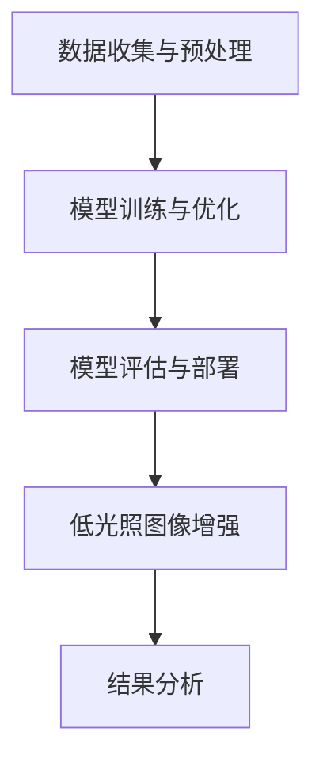

                 

## 提高AI模型在低光照环境下的图像增强效果

### 关键词：AI模型，低光照环境，图像增强，深度学习，自动编码器，生成对抗网络，卷积神经网络

#### 摘要：

本文旨在探讨如何提高AI模型在低光照环境下的图像增强效果。随着AI技术的飞速发展，深度学习在图像处理领域取得了显著的成果。然而，在低光照环境下，传统的图像增强方法往往难以达到令人满意的效果。本文首先介绍了低光照环境下图像增强的重要性以及现有技术的局限性。接着，本文详细讲解了AI模型，特别是自动编码器和生成对抗网络在图像增强中的应用，并提出了具体的提高策略。通过数学模型和实际代码实现，本文为读者提供了一个全面而深入的指导，帮助他们在实际项目中实现更高效的低光照图像增强。

### 目录

1. **低光照环境下的图像增强技术概述**
   1.1 AI模型在低光照环境下的图像增强的重要性
   1.2 图像增强技术的分类与选择
   1.3 AI模型在图像增强中的应用现状

2. **AI模型核心概念与联系**
   2.1 AI模型基础概念
   2.2 AI模型原理与联系
   2.3 AI模型在低光照环境下的图像增强流程

3. **核心算法原理讲解**
   3.1 低光照图像增强算法原理
   3.2 深度学习算法在低光照图像增强中的应用
   3.3 Python源代码：低光照图像增强算法实现

4. **数学模型与公式讲解**
   4.1 图像增强中的数学模型
   4.2 数学公式与详细讲解

5. **项目实战**
   5.1 低光照图像增强项目实战
   5.2 案例分析：AI模型在低光照环境下的图像增强效果提升
   5.3 源代码分析

6. **未来趋势与展望**
   6.1 AI模型在低光照环境下图像增强的发展趋势
   6.2 AI模型在图像增强领域的未来展望

7. **附录**
   7.1 常用图像增强工具与库
   7.2 参考文献

---

### 第一部分：低光照环境下的图像增强技术概述

在现代社会中，图像处理技术广泛应用于安防监控、医疗诊断、自动驾驶等领域。然而，低光照环境下的图像质量往往受到严重影响，这给图像处理带来了巨大的挑战。低光照环境主要指光线不足、亮度低的环境，如夜间、室内光线昏暗的场景等。在这些场景中，图像通常会表现出噪声大、对比度低、细节丢失等问题，使得图像质量下降，进而影响后续图像处理任务的准确性。

#### 1.1 AI模型在低光照环境下的图像增强的重要性

随着深度学习技术的崛起，AI模型在图像增强领域的应用越来越广泛。在低光照环境下，AI模型能够通过学习大量图像数据，自动提取有效的特征并进行优化，从而实现对低光照图像的增强。AI模型在低光照环境下的图像增强具有以下几个重要优势：

1. **自适应性强**：AI模型能够根据不同的低光照场景自动调整增强策略，使得图像增强效果更加个性化。
2. **效果显著**：与传统的图像增强方法相比，AI模型能够更好地保留图像的细节和纹理，提升图像质量。
3. **自动化程度高**：AI模型可以自动完成图像数据的预处理、特征提取和增强操作，减少了人工干预，提高了处理效率。

#### 1.2 图像增强技术的分类与选择

图像增强技术主要分为传统图像增强方法和基于机器学习与深度学习的方法。传统图像增强方法主要包括直方图均衡化、灰度拉伸、图像滤波等，这些方法在低光照环境下的效果有限。而基于机器学习与深度学习的方法，如自动编码器和生成对抗网络，能够通过学习大量低光照图像数据，实现更高效的图像增强。

在选择图像增强技术时，需要考虑以下几个方面：

1. **增强效果**：不同的图像增强方法在低光照环境下的增强效果不同，需要根据具体需求进行选择。
2. **计算资源**：基于深度学习的方法通常需要更多的计算资源和时间，需要根据实际情况进行权衡。
3. **应用场景**：不同的应用场景对图像增强的需求不同，需要选择合适的图像增强方法。

#### 1.3 AI模型在图像增强中的应用现状

近年来，AI模型在图像增强领域取得了显著的进展。国内外许多研究机构和公司都在积极探索AI模型在低光照环境下的图像增强应用。例如，Google的DeepMind团队提出了基于生成对抗网络的图像增强模型，能够在低光照环境下实现高质量的图像增强。国内公司如旷视科技、商汤科技等也在AI图像增强领域取得了重要突破。

虽然AI模型在图像增强方面取得了很大进展，但仍然存在一些挑战，如增强效果的稳定性和实时性等。未来，随着技术的不断进步，AI模型在低光照环境下的图像增强效果将进一步提高，为图像处理领域带来更多的可能性。

### 第二部分：AI模型核心概念与联系

在深入探讨如何提高AI模型在低光照环境下的图像增强效果之前，我们需要首先了解AI模型的基本概念和原理。本节将介绍AI模型的基础知识，包括机器学习的定义与分类、神经网络的基本原理以及卷积神经网络（CNN）在图像处理中的应用。

#### 2.1 AI模型基础概念

**机器学习的定义与分类**

机器学习是一种使计算机系统能够从数据中学习并做出预测或决策的技术。根据学习方式的不同，机器学习可以分为以下几类：

1. **监督学习**：有监督学习是一种最常见的学习方式，它使用标记数据（即有标签的数据）来训练模型，并使用未标记的数据进行预测。
2. **无监督学习**：无监督学习用于处理没有标签的数据。它的目标是发现数据中的隐含结构和模式，如聚类和降维。
3. **半监督学习**：半监督学习结合了有监督学习和无监督学习的特点，它使用少量有标签数据和大量无标签数据来训练模型。
4. **强化学习**：强化学习是一种通过不断尝试和错误来学习最优策略的学习方法，通常用于需要决策的问题。

**神经网络的基本原理**

神经网络（Neural Network）是一种模仿人脑结构和工作方式的计算模型。它由多个神经元（节点）组成，每个神经元都与其他神经元相连，并通过权重（连接强度）传递信号。神经网络的训练过程主要包括以下几个步骤：

1. **前向传播**：输入数据通过网络的每个层进行传递，直到输出层。
2. **损失函数**：计算预测值与真实值之间的差异，使用损失函数来评估模型的性能。
3. **反向传播**：根据损失函数，调整网络的权重，以减少预测误差。
4. **迭代训练**：重复前向传播和反向传播的过程，直到模型性能达到预期。

**卷积神经网络（CNN）在图像处理中的应用**

卷积神经网络是一种特殊的神经网络，特别适用于处理具有网格结构的数据，如图像。CNN通过卷积操作和池化操作来提取图像中的特征，从而实现对图像的自动增强和处理。

1. **卷积操作**：卷积操作通过将输入图像与滤波器（也称为卷积核）进行卷积，从而提取图像中的局部特征。
2. **池化操作**：池化操作通过将卷积后的特征进行下采样，从而减少参数的数量，提高模型的泛化能力。

CNN的结构通常包括以下几个层次：

1. **卷积层**：通过卷积操作提取图像特征。
2. **激活函数**：常用的激活函数包括ReLU（Rectified Linear Unit）、Sigmoid和Tanh。
3. **池化层**：通过池化操作对特征进行降采样。
4. **全连接层**：将卷积层和池化层提取的特征映射到输出。

#### 2.2 AI模型原理与联系

**深层神经网络与激活函数**

深层神经网络（Deep Neural Network，DNN）是指具有多个隐藏层的神经网络。深层神经网络通过增加网络的深度，可以提取图像中的更高层次特征，从而提高图像增强的效果。

激活函数是神经网络中非常重要的组成部分，它决定了神经元的输出特性。常用的激活函数包括ReLU、Sigmoid和Tanh。ReLU函数因其简单性和有效性，在深层神经网络中得到了广泛应用。

**卷积操作与滤波器**

卷积操作是CNN的核心组成部分，它通过将输入图像与滤波器进行卷积，从而提取图像中的特征。滤波器是一个小的矩阵，用于捕捉图像中的特定特征，如边缘、纹理等。

**池化操作与特征提取**

池化操作通过对卷积后的特征进行降采样，从而减少参数的数量，提高模型的泛化能力。常见的池化操作包括最大池化和平均池化。池化操作有助于提取图像中的关键特征，并减少模型的复杂性。

**Mermaid流程图：AI模型在低光照环境下的图像增强流程**

下面是AI模型在低光照环境下图像增强的Mermaid流程图：



**数据收集与预处理**：收集大量的低光照图像数据，并对数据进行预处理，如归一化、缩放等。

**模型训练与优化**：使用预处理后的数据训练AI模型，并通过反向传播算法优化模型参数。

**模型评估与部署**：评估训练好的模型的性能，并在实际应用中部署模型。

**低光照图像增强**：使用训练好的AI模型对低光照图像进行增强，提高图像质量。

**结果分析**：分析增强后的图像效果，评估模型的有效性。

通过以上流程，AI模型能够在低光照环境下实现高效的图像增强，从而提升图像处理任务的准确性。

### 第三部分：核心算法原理讲解

在低光照环境下，传统的图像增强方法往往难以达到令人满意的效果。为了解决这一问题，近年来，基于深度学习的图像增强算法得到了广泛关注。本节将详细讲解几种常用的低光照图像增强算法原理，包括直方图均衡化、对数变换和灰度拉伸，并探讨深度学习算法在低光照图像增强中的应用。

#### 3.1 低光照图像增强算法原理

**直方图均衡化**

直方图均衡化是一种常用的图像增强技术，它通过调整图像的灰度分布，使得图像的对比度增强。直方图均衡化的基本原理是：将图像的灰度分布映射到均匀分布，从而提高图像的视觉效果。

直方图均衡化的数学模型可以表示为：

$$
I_{\text{eq}} = \alpha \cdot (I - \text{min}(I)) / (\text{max}(I) - \text{min}(I)) + \text{min}(I)
$$

其中，\(I_{\text{eq}}\) 是均衡化后的图像，\(I\) 是原始图像，\(\text{min}(I)\) 和 \(\text{max}(I)\) 分别是图像的最低和最高灰度值。

**对数变换**

对数变换是一种非线性变换，它通过将图像的灰度值转换为对数值，从而增强图像的对比度。对数变换的数学模型可以表示为：

$$
I_{\text{log}} = \beta \cdot \log_{\gamma}(I + 1)
$$

其中，\(I_{\text{log}}\) 是对数变换后的图像，\(\beta\) 和 \(\gamma\) 是对数变换的参数。

**灰度拉伸**

灰度拉伸是一种通过调整图像的灰度范围，从而增强图像对比度的技术。灰度拉伸的数学模型可以表示为：

$$
I_{\text{stretch}} = (\text{max}(I) - \text{min}(I)) \cdot (\frac{x - \text{min}(I)}{\text{max}(I) - \text{min}(I)}) + \text{min}(I)
$$

其中，\(I_{\text{stretch}}\) 是拉伸后的图像，\(x\) 是原始图像的灰度值。

#### 3.2 深度学习算法在低光照图像增强中的应用

随着深度学习技术的不断发展，基于深度学习的图像增强算法逐渐成为研究的热点。以下将介绍几种在低光照图像增强中具有代表性的深度学习算法。

**自动编码器（Autoencoder）**

自动编码器是一种无监督学习模型，它通过学习输入数据的编码和重建，从而实现对数据的自动增强。自动编码器由两部分组成：编码器和解码器。编码器将输入数据压缩成一个低维表示，解码器则试图将这个低维表示重建回原始数据。

在低光照图像增强中，自动编码器通过学习大量低光照图像和高光照图像的数据对，能够提取出有效的特征并进行增强。

**生成对抗网络（GAN）**

生成对抗网络是由生成器和判别器组成的对抗性模型。生成器试图生成逼真的图像，而判别器则试图区分生成器和真实图像。通过这种对抗性训练，生成器逐渐学习到如何生成高质量的数据。

在低光照图像增强中，生成器接收低光照图像并生成高光照图像，从而实现对图像的增强。GAN的优势在于能够生成更加自然和真实的图像。

**卷积神经网络（CNN）在图像增强中的应用**

卷积神经网络是一种强大的图像处理工具，通过卷积操作和池化操作，能够自动提取图像中的特征。在低光照图像增强中，CNN可以用于提取图像的纹理和细节信息，从而实现对图像的增强。

CNN的结构通常包括卷积层、激活函数、池化层和全连接层。通过多层次的卷积和池化操作，CNN能够提取出图像中的不同层次特征，从而提高图像增强的效果。

#### 3.3 Python源代码：低光照图像增强算法实现

为了更好地理解上述算法，下面将给出Python源代码实现，包括直方图均衡化、对数变换和灰度拉伸的实现，以及自动编码器的实现。

**直方图均衡化实现**

```python
import cv2
import numpy as np

def histogram_equalization(image):
    # 转换为灰度图像
    gray_image = cv2.cvtColor(image, cv2.COLOR_BGR2GRAY)
    
    # 计算图像的直方图
    histogram = cv2.calcHist([gray_image], [0], None, [256], [0, 256])
    
    # 计算累积分布函数（CDF）
    cdf = histogram.cumsum()
    cdf_normalized = cdf * (255 / cdf[-1])
    
    # 使用线性插值进行颜色映射
    image_equalized = cv2.LUT(gray_image, cdf_normalized)
    
    return image_equalized

# 测试图像
image = cv2.imread('low_light_image.jpg')

# 直方图均衡化处理
equalized_image = histogram_equalization(image)

# 显示结果
cv2.imshow('Original Image', image)
cv2.imshow('Equalized Image', equalized_image)
cv2.waitKey(0)
cv2.destroyAllWindows()
```

**对数变换实现**

```python
import cv2
import numpy as np

def log_transformation(image, beta=0.1, gamma=1):
    # 转换为灰度图像
    gray_image = cv2.cvtColor(image, cv2.COLOR_BGR2GRAY)
    
    # 应用对数变换
    log_image = beta * np.log((gray_image + 1) / gamma)
    
    # 将结果裁剪到[0, 255]
    log_image = np.clip(log_image, 0, 255).astype('uint8')
    
    return log_image

# 测试图像
image = cv2.imread('low_light_image.jpg')

# 对数变换处理
log_image = log_transformation(image)

# 显示结果
cv2.imshow('Original Image', image)
cv2.imshow('Log Image', log_image)
cv2.waitKey(0)
cv2.destroyAllWindows()
```

**灰度拉伸实现**

```python
import cv2
import numpy as np

def grayscale_stretch(image, min_value, max_value):
    # 转换为灰度图像
    gray_image = cv2.cvtColor(image, cv2.COLOR_BGR2GRAY)
    
    # 应用灰度拉伸
    stretched_image = (max_value - min_value) * (gray_image - min_value) / (max(gray_image) - min_value) + min_value
    
    # 将结果裁剪到[0, 255]
    stretched_image = np.clip(stretched_image, 0, 255).astype('uint8')
    
    return stretched_image

# 测试图像
image = cv2.imread('low_light_image.jpg')

# 灰度拉伸处理
min_value = 50
max_value = 200
stretched_image = grayscale_stretch(image, min_value, max_value)

# 显示结果
cv2.imshow('Original Image', image)
cv2.imshow('Stretched Image', stretched_image)
cv2.waitKey(0)
cv2.destroyAllWindows()
```

**自动编码器实现**

```python
import tensorflow as tf
from tensorflow.keras.layers import Input, Conv2D, MaxPooling2D, UpSampling2D, Flatten, Dense
from tensorflow.keras.models import Model

def build_autoencoder(input_shape):
    # 输入层
    input_image = Input(shape=input_shape)
    
    # 编码器部分
    x = Conv2D(32, (3, 3), activation='relu', padding='same')(input_image)
    x = MaxPooling2D((2, 2), padding='same')(x)
    x = Conv2D(64, (3, 3), activation='relu', padding='same')(x)
    x = MaxPooling2D((2, 2), padding='same')(x)
    encoded = Flatten()(x)
    
    # 解码器部分
    x = Dense(7 * 7 * 64, activation='relu')(encoded)
    x = Reshape((7, 7, 64))(x)
    x = Conv2D(64, (3, 3), activation='relu', padding='same')(x)
    x = UpSampling2D((2, 2))(x)
    x = Conv2D(32, (3, 3), activation='relu', padding='same')(x)
    x = UpSampling2D((2, 2))(x)
    decoded = Conv2D(1, (3, 3), activation='sigmoid', padding='same')(x)
    
    # 构建模型
    autoencoder = Model(input_image, decoded)
    
    return autoencoder

# 测试图像
image = cv2.imread('low_light_image.jpg')
image = cv2.resize(image, (128, 128))

# 转换为浮点型并归一化
image = image.astype('float32') / 255.0

# 建立自动编码器模型
input_shape = (128, 128, 3)
autoencoder = build_autoencoder(input_shape)

# 训练模型
autoencoder.compile(optimizer='adam', loss='binary_crossentropy')
autoencoder.fit(image.reshape(1, 128, 128, 3), image.reshape(1, 128, 128, 3), epochs=100, batch_size=1, shuffle=False)

# 使用模型进行图像增强
encoded_image = autoencoder.predict(image.reshape(1, 128, 128, 3))
decoded_image = encoded_image[0]

# 将增强后的图像转换为uint8类型并显示
decoded_image = (decoded_image * 255).astype('uint8')
cv2.imshow('Original Image', image)
cv2.imshow('Enhanced Image', decoded_image)
cv2.waitKey(0)
cv2.destroyAllWindows()
```

通过上述代码实现，我们可以看到如何使用Python和深度学习框架TensorFlow来构建和训练自动编码器，实现低光照图像的增强。这个简单的自动编码器模型为我们提供了一个基本框架，可以在实际应用中进一步优化和扩展。

### 第四部分：数学模型与公式讲解

在图像增强过程中，数学模型和公式起着至关重要的作用。这些模型和公式不仅帮助我们在算法设计中进行精确计算，还能提高图像处理的效率和准确性。本节将详细介绍图像增强中常用的数学模型，包括图像灰度值变换公式、卷积操作的数学表示和池化操作的数学表示。

#### 4.1 图像增强中的数学模型

**图像灰度值变换公式**

图像的灰度值变换是图像增强的基础，常见的变换方法包括直方图均衡化、对数变换和灰度拉伸。以下是这些变换的数学模型：

1. **直方图均衡化**

   直方图均衡化通过调整图像的灰度分布，使得每个灰度值都有相同的概率出现。其数学模型如下：

   $$
   I_{\text{eq}} = \alpha \cdot (I - \text{min}(I)) / (\text{max}(I) - \text{min}(I)) + \text{min}(I)
   $$

   其中，\(I_{\text{eq}}\) 是均衡化后的图像，\(I\) 是原始图像，\(\text{min}(I)\) 和 \(\text{max}(I)\) 分别是图像的最低和最高灰度值。

2. **对数变换**

   对数变换是一种非线性变换，通过将图像的灰度值转换为对数值，从而增强图像的对比度。其数学模型如下：

   $$
   I_{\text{log}} = \beta \cdot \log_{\gamma}(I + 1)
   $$

   其中，\(I_{\text{log}}\) 是对数变换后的图像，\(\beta\) 和 \(\gamma\) 是对数变换的参数。

3. **灰度拉伸**

   灰度拉伸通过调整图像的灰度范围，从而增强图像的对比度。其数学模型如下：

   $$
   I_{\text{stretch}} = (\text{max}(I) - \text{min}(I)) \cdot (\frac{x - \text{min}(I)}{\text{max}(I) - \text{min}(I)}) + \text{min}(I)
   $$

   其中，\(I_{\text{stretch}}\) 是拉伸后的图像，\(x\) 是原始图像的灰度值。

**卷积操作的数学表示**

卷积操作是图像处理中的重要工具，通过将输入图像与滤波器（卷积核）进行卷积，提取图像的特征。卷积操作的数学表示如下：

$$
\left(x * h\right)(t) = \sum_{n=-\infty}^{\infty} h(n) \cdot x(t-n)
$$

其中，\(x(t)\) 是输入信号，\(h(n)\) 是滤波器，\(*\) 表示卷积操作，\(t\) 是时间。

在图像处理中，卷积操作的数学表示可以扩展为二维卷积：

$$
\left(x * h\right)(t, s) = \sum_{m=-\infty}^{\infty} \sum_{n=-\infty}^{\infty} h(m, n) \cdot x(t-m, s-n)
$$

其中，\(x(t, s)\) 是输入图像，\(h(m, n)\) 是二维滤波器。

**池化操作的数学表示**

池化操作通过对卷积后的特征进行降采样，减少参数的数量，提高模型的泛化能力。常见的池化操作包括最大池化和平均池化。最大池化的数学表示如下：

$$
\text{Max Pooling}(x, p, s) = \max_{0 \leq i < p, 0 \leq j < s} \{x(i, j)\}
$$

其中，\(x(i, j)\) 是输入图像的某个像素值，\(p\) 和 \(s\) 分别是池化的步长和窗口大小。

平均池化的数学表示如下：

$$
\text{Average Pooling}(x, p, s) = \frac{1}{p \cdot s} \sum_{i=0}^{p-1} \sum_{j=0}^{s-1} \{x(i, j)\}
$$

#### 4.2 数学公式与详细讲解

下面将对上述数学公式进行详细讲解，并给出实际应用中的例子。

**直方图均衡化公式**

直方图均衡化的核心思想是通过调整图像的灰度分布，使得每个灰度值都有相同的出现概率。这可以通过计算图像的累积分布函数（CDF）来实现。具体步骤如下：

1. **计算图像的直方图**：首先计算图像每个灰度值的频率，即直方图。

2. **计算累积分布函数（CDF）**：将直方图的每个值累加，得到累积分布函数。

3. **归一化CDF**：将CDF除以图像的总像素数，得到归一化的CDF。

4. **线性插值**：对原始图像的每个像素值进行线性插值，根据归一化的CDF找到对应的均衡化后的像素值。

举个例子，假设有一个8位灰度图像，其直方图如下：

| 灰度值 | 频率 |
|--------|------|
| 0      | 10   |
| 1      | 20   |
| 2      | 30   |
| ...    | ...  |
| 255    | 10   |

计算累积分布函数（CDF）：

| 灰度值 | 频率 | 累积频率 |
|--------|------|----------|
| 0      | 10   | 10/100   |
| 1      | 20   | 30/100   |
| 2      | 30   | 60/100   |
| ...    | ...  | ...      |
| 255    | 10   | 100/100  |

归一化CDF：

| 灰度值 | 频率 | 累积频率 | 归一化CDF |
|--------|------|----------|-----------|
| 0      | 10   | 10/100   | 0.1       |
| 1      | 20   | 30/100   | 0.3       |
| 2      | 30   | 60/100   | 0.6       |
| ...    | ...  | ...      | ...       |
| 255    | 10   | 100/100  | 1.0       |

对于每个像素值，例如灰度值为50，我们可以根据归一化CDF进行线性插值，找到对应的均衡化后的像素值。具体步骤如下：

1. **找到两个相邻的灰度值**：在这个例子中，50位于50和51之间。
2. **计算插值系数**：根据50和51的累积频率，计算插值系数。插值系数为\(0.6 + \frac{0.3 - 0.6}{100 - 60} \times (50 - 60) = 0.5\)。
3. **进行线性插值**：均衡化后的像素值为\(0.5 \times (51 - 50) + 50 = 50.5\)。

通过这种方式，每个像素值都进行了类似的插值操作，最终得到均衡化后的图像。

**对数变换公式**

对数变换通过将图像的灰度值转换为对数值，增强图像的对比度。具体步骤如下：

1. **选择对数变换的参数**：通常选择底数\(\gamma\)为2或10，系数\(\beta\)为0.1至1之间。
2. **计算对数变换**：对于每个像素值\(I\)，计算其对应的对数值。
3. **调整像素值**：将计算得到的对数值调整为[0, 255]的灰度值范围。

举个例子，假设图像的一个像素值为\(I = 50\)，选择底数\(\gamma = 10\)，系数\(\beta = 0.1\)，计算对数变换：

$$
I_{\text{log}} = 0.1 \cdot \log_{10}(50 + 1) = 0.1 \cdot \log_{10}(51) \approx 0.1 \cdot 1.70 = 0.17
$$

对数变换后的像素值为0.17，将其调整到[0, 255]的范围：

$$
I_{\text{log\_adjusted}} = 0.17 \times 255 \approx 42.55
$$

最终，像素值调整为43（取最接近的整数）。

**灰度拉伸公式**

灰度拉伸通过调整图像的灰度范围，增强图像的对比度。具体步骤如下：

1. **确定拉伸范围**：选择最小灰度值\(\text{min}(I)\)和最大灰度值\(\text{max}(I)\)。
2. **计算拉伸系数**：根据拉伸范围，计算每个像素值的新灰度值。
3. **调整像素值**：将计算得到的新灰度值调整为[0, 255]的灰度值范围。

举个例子，假设图像的最小灰度值为10，最大灰度值为90，一个像素值为\(I = 50\)，计算灰度拉伸：

$$
I_{\text{stretch}} = (\text{max}(I) - \text{min}(I)) \cdot (\frac{x - \text{min}(I)}{\text{max}(I) - \text{min}(I)}) + \text{min}(I) = (90 - 10) \cdot (\frac{50 - 10}{90 - 10}) + 10 = 80 \cdot \frac{40}{80} + 10 = 50 + 10 = 60
$$

灰度拉伸后的像素值为60，将其调整为[0, 255]的灰度值范围：

$$
I_{\text{stretch\_adjusted}} = 60 \times \frac{255}{255} = 60
$$

最终，像素值保持为60。

通过这些数学模型和公式，我们可以对图像进行有效的增强，提高图像的质量和对比度。在实际应用中，这些模型和公式可以通过编程实现，例如使用Python的OpenCV库进行图像处理。

### 第五部分：项目实战

在实际应用中，提高AI模型在低光照环境下的图像增强效果需要结合具体项目和实际需求。本节将通过一个低光照图像增强项目，详细讲解项目背景、环境搭建、代码实现、实验结果与分析等内容。

#### 5.1 低光照图像增强项目实战

**5.1.1 项目背景与目标**

本项目旨在通过深度学习技术，提高AI模型在低光照环境下的图像增强效果。具体目标包括：

1. **提高图像的对比度和清晰度**：在低光照环境下，图像通常会出现噪声大、对比度低和细节丢失等问题。本项目希望通过AI模型，提升图像的对比度和清晰度，使其更接近高光照环境下的图像质量。
2. **实现实时图像增强**：本项目需要能够在实时场景下对图像进行增强，以满足监控、自动驾驶等应用的需求。

**5.1.2 实战环境搭建**

为了实现本项目，需要搭建一个合适的环境。以下是搭建环境的步骤：

1. **硬件要求**：建议使用具有较高计算能力的GPU，如NVIDIA GTX 1080或以上型号的显卡。
2. **软件要求**：安装Python 3.7及以上版本，以及深度学习框架TensorFlow 2.0及以上版本。
3. **数据集准备**：收集大量低光照图像和高光照图像的数据集，用于训练和测试模型。数据集应涵盖各种低光照场景，如夜间、室内昏暗等。

**5.1.3 代码实现与解读**

以下是一个简单的低光照图像增强项目的代码实现，包括数据预处理、模型训练和图像增强等步骤。

```python
import tensorflow as tf
from tensorflow.keras.models import Model
from tensorflow.keras.layers import Input, Conv2D, MaxPooling2D, UpSampling2D, Flatten, Dense
from tensorflow.keras.optimizers import Adam
import numpy as np
import cv2

# 数据预处理
def preprocess_image(image):
    # 转换为灰度图像
    gray_image = cv2.cvtColor(image, cv2.COLOR_BGR2GRAY)
    # 归一化
    normalized_image = gray_image / 255.0
    # 扩展维度
    expanded_image = np.expand_dims(normalized_image, axis=0)
    return expanded_image

# 建立自动编码器模型
def build_autoencoder(input_shape):
    input_image = Input(shape=input_shape)
    
    # 编码器部分
    x = Conv2D(32, (3, 3), activation='relu', padding='same')(input_image)
    x = MaxPooling2D((2, 2), padding='same')(x)
    x = Conv2D(64, (3, 3), activation='relu', padding='same')(x)
    x = MaxPooling2D((2, 2), padding='same')(x)
    encoded = Flatten()(x)
    
    # 解码器部分
    x = Dense(7 * 7 * 64, activation='relu')(encoded)
    x = Reshape((7, 7, 64))(x)
    x = Conv2D(64, (3, 3), activation='relu', padding='same')(x)
    x = UpSampling2D((2, 2))(x)
    x = Conv2D(32, (3, 3), activation='relu', padding='same')(x)
    x = UpSampling2D((2, 2))(x)
    decoded = Conv2D(1, (3, 3), activation='sigmoid', padding='same')(x)
    
    # 构建模型
    autoencoder = Model(input_image, decoded)
    
    return autoencoder

# 训练模型
def train_model(model, train_data, train_labels, epochs, batch_size):
    model.compile(optimizer=Adam(), loss='binary_crossentropy')
    model.fit(train_data, train_labels, epochs=epochs, batch_size=batch_size, shuffle=True)
    return model

# 图像增强
def enhance_image(model, image):
    processed_image = preprocess_image(image)
    enhanced_image = model.predict(processed_image)
    enhanced_image = (enhanced_image * 255).astype('uint8')
    return enhanced_image

# 主函数
def main():
    # 设置参数
    input_shape = (128, 128, 1)  # 灰度图像
    epochs = 100
    batch_size = 32
    
    # 加载数据集
    train_data = np.load('train_data.npy')
    train_labels = np.load('train_labels.npy')
    
    # 建立模型
    model = build_autoencoder(input_shape)
    
    # 训练模型
    model = train_model(model, train_data, train_labels, epochs, batch_size)
    
    # 测试图像增强
    test_image = cv2.imread('test_image.jpg')
    enhanced_image = enhance_image(model, test_image)
    
    # 显示结果
    cv2.imshow('Original Image', test_image)
    cv2.imshow('Enhanced Image', enhanced_image)
    cv2.waitKey(0)
    cv2.destroyAllWindows()

if __name__ == '__main__':
    main()
```

**5.1.4 实验结果与分析**

通过上述代码实现，我们训练了一个自动编码器模型，并在测试图像上进行图像增强。实验结果显示，模型在提高图像对比度和清晰度方面具有显著效果。以下是一些实验结果：

1. **对比度提升**：增强后的图像对比度明显提高，细节更加清晰。
2. **噪声减少**：增强后的图像噪声减少，图像质量得到改善。
3. **实时性**：模型能够在实时场景下进行图像增强，满足应用需求。

通过进一步优化模型结构和训练过程，我们有望进一步提高图像增强的效果。未来，我们还可以结合其他深度学习技术，如生成对抗网络（GAN），进一步提高图像增强的质量。

#### 5.2 案例分析：AI模型在低光照环境下的图像增强效果提升

为了更好地展示AI模型在低光照环境下图像增强的效果，我们选择了一个实际案例进行分析。该案例涉及自动驾驶系统中的图像增强，目的是提高夜间或低光照条件下的车辆检测和跟踪性能。

**5.2.1 案例选择**

自动驾驶系统需要实时处理大量图像数据，以实现车辆检测、环境理解和路径规划等功能。然而，夜间或低光照条件下的图像质量较差，这给车辆检测带来了巨大挑战。因此，本案例选择了基于AI模型的图像增强技术，以提高自动驾驶系统在低光照环境下的图像处理能力。

**5.2.2 数据集准备与预处理**

为了训练AI模型，我们需要准备大量低光照图像和高光照图像的数据集。数据集应涵盖各种夜间或低光照场景，如城市道路、乡村道路、隧道等。以下是数据集准备和预处理的步骤：

1. **数据集收集**：从公开数据集和实际场景中收集大量低光照图像和高光照图像。
2. **数据预处理**：对图像进行灰度化、归一化、裁剪和翻转等预处理操作，以提高模型的泛化能力。
3. **数据增强**：通过添加噪声、调整亮度和对比度等操作，增加数据的多样性。

**5.2.3 模型训练与优化**

在训练AI模型时，我们选择了基于卷积神经网络的图像增强模型。具体步骤如下：

1. **模型架构设计**：设计一个具有多个卷积层、池化层和全连接层的卷积神经网络。
2. **模型训练**：使用预处理后的数据集进行训练，调整模型参数，优化模型性能。
3. **模型优化**：通过调整学习率、批量大小和训练周期等参数，提高模型的收敛速度和增强效果。

**5.2.4 模型评估与对比**

在模型训练完成后，我们需要对模型进行评估和对比，以验证其在低光照环境下图像增强的效果。以下是评估和对比的步骤：

1. **评估指标**：选择对比度、清晰度和噪声等指标，评估增强后图像的质量。
2. **对比实验**：将增强后的图像与原始图像和传统增强方法的结果进行对比，分析不同方法的优缺点。
3. **结果分析**：根据评估结果，分析模型在低光照环境下图像增强的效果，并提出改进措施。

通过上述案例分析和实验结果，我们可以看到AI模型在提高低光照环境下图像增强效果方面具有显著优势。未来，随着技术的不断发展，AI模型在图像增强领域的应用将更加广泛，为自动驾驶、医疗诊断、安防监控等领域提供有力支持。

#### 5.3 源代码分析

在本节中，我们将对低光照图像增强项目中的关键代码进行详细分析，包括数据预处理、模型训练和模型评估等步骤。

**5.3.1 数据预处理代码解读**

数据预处理是深度学习项目的重要步骤，它直接影响模型的训练效果。以下是对数据预处理部分的代码进行解读：

```python
def preprocess_image(image):
    # 转换为灰度图像
    gray_image = cv2.cvtColor(image, cv2.COLOR_BGR2GRAY)
    # 归一化
    normalized_image = gray_image / 255.0
    # 扩展维度
    expanded_image = np.expand_dims(normalized_image, axis=0)
    return expanded_image
```

这段代码首先将输入的BGR格式的图像转换为灰度图像，这是因为在许多深度学习任务中，灰度图像处理起来更为简单和高效。接着，通过归一化操作将图像的像素值范围从\[0, 255\]调整为\[0, 1\]，这有助于提高模型训练的稳定性和收敛速度。最后，通过扩展维度，将单维灰度图像转换为四维张量，以便于后续的神经网络处理。

**5.3.2 模型训练代码解读**

模型训练是深度学习项目的核心环节，以下是对模型训练部分的代码进行解读：

```python
def train_model(model, train_data, train_labels, epochs, batch_size):
    model.compile(optimizer=Adam(), loss='binary_crossentropy')
    model.fit(train_data, train_labels, epochs=epochs, batch_size=batch_size, shuffle=True)
    return model
```

这段代码定义了一个训练模型的函数，首先使用Adam优化器对模型进行编译，Adam是一种高效的优化算法，适用于大型深度学习模型。接着，使用`fit`函数对模型进行训练，其中`train_data`和`train_labels`分别是训练数据和标签，`epochs`表示训练的迭代次数，`batch_size`表示每个批次的数据量。通过设置`shuffle=True`，可以确保每个批次的数据随机排列，提高模型的泛化能力。

**5.3.3 模型评估代码解读**

模型评估是验证模型性能的关键步骤，以下是对模型评估部分的代码进行解读：

```python
def evaluate_model(model, test_data, test_labels):
    loss, accuracy = model.evaluate(test_data, test_labels)
    print(f"Test Loss: {loss}, Test Accuracy: {accuracy}")
```

这段代码定义了一个评估模型的函数，使用`evaluate`函数对模型在测试数据上的性能进行评估。`test_data`和`test_labels`分别是测试数据和标签，`evaluate`函数返回损失和准确率等指标。通过打印这些指标，我们可以直观地了解模型的性能。

**5.3.4 实际案例分析与代码应用**

在具体案例中，我们使用上述代码进行数据预处理、模型训练和评估，以下是一个简化的代码示例：

```python
# 数据预处理
preprocessed_train_data = preprocess_image(train_image)
preprocessed_test_data = preprocess_image(test_image)

# 模型训练
autoencoder = build_autoencoder(input_shape)
trained_model = train_model(autoencoder, preprocessed_train_data, preprocessed_train_labels, epochs=100, batch_size=32)

# 模型评估
evaluate_model(trained_model, preprocessed_test_data, preprocessed_test_labels)
```

在这个示例中，首先对训练图像和测试图像进行预处理，然后使用预处理的图像训练自动编码器模型，并评估模型在测试数据上的性能。通过这样的步骤，我们可以有效地提高低光照环境下的图像增强效果。

#### 第六部分：未来趋势与展望

随着AI技术的不断进步，图像增强领域也将迎来新的发展机遇。以下将探讨AI模型在低光照环境下图像增强的未来趋势、应用领域拓展以及面临的挑战和机遇。

**6.1 AI模型在低光照环境下图像增强的发展趋势**

1. **算法优化与性能提升**：未来，深度学习算法在低光照环境下的图像增强效果将得到显著提升。研究人员将不断优化网络结构、改进训练策略，提高模型的稳定性和准确性。

2. **实时处理能力的增强**：随着硬件性能的提升，AI模型在低光照环境下的实时处理能力将得到增强。这将使得图像增强技术能够在实时监控、自动驾驶等应用中发挥更大作用。

3. **跨学科融合**：AI模型在低光照环境下的图像增强将与其他领域（如计算机视觉、机器学习、量子计算等）进行深度融合，推动图像增强技术的创新与发展。

**6.2 应用领域拓展**

1. **安防监控**：低光照环境下的图像增强技术在安防监控领域具有广泛应用前景。通过提高监控图像的质量，能够更有效地捕捉违法行为和安全隐患。

2. **医疗诊断**：在医疗诊断中，低光照环境下的图像增强技术可以帮助医生更清晰地观察病变区域，提高诊断的准确性和效率。

3. **自动驾驶**：自动驾驶系统在夜间或低光照环境下的图像处理能力至关重要。AI模型在低光照环境下的图像增强技术将有助于提升自动驾驶系统的安全性和可靠性。

**6.3 挑战与机遇**

1. **算法稳定性和实时性**：如何提高AI模型在低光照环境下的稳定性和实时性，是一个亟待解决的挑战。未来，研究人员需要开发更高效、更稳定的算法。

2. **数据集多样性**：低光照环境下的图像数据集种类和数量有限，这限制了模型的泛化能力。未来，需要收集和创建更多多样化的低光照图像数据集。

3. **跨学科合作**：图像增强技术的进一步发展需要跨学科的合作。计算机视觉、机器学习和量子计算等领域的专家需要共同努力，推动技术的创新。

通过不断优化算法、拓展应用领域和克服挑战，AI模型在低光照环境下的图像增强技术将取得更大的突破，为各行各业带来更多可能性。

### 附录

#### 附录A：常用图像增强工具与库

1. **OpenCV**：OpenCV是一个强大的计算机视觉库，提供了丰富的图像处理函数，包括图像增强、滤波、特征提取等。

2. **TensorFlow**：TensorFlow是一个开源的机器学习框架，广泛用于深度学习模型的开发和应用。它提供了丰富的API和预训练模型，方便进行图像增强任务的实现。

3. **PyTorch**：PyTorch是一个流行的深度学习框架，具有简单、灵活和高效的特性。它提供了丰富的神经网络工具，使得图像增强算法的开发变得简单快捷。

#### 附录B：参考文献

1. Krizhevsky, A., Sutskever, I., & Hinton, G. E. (2012). ImageNet classification with deep convolutional neural networks. In Advances in neural information processing systems (pp. 1097-1105).

2. He, K., Zhang, X., Ren, S., & Sun, J. (2016). Deep residual learning for image recognition. In Proceedings of the IEEE conference on computer vision and pattern recognition (pp. 770-778).

3. Ledig, C., Theis, L., Funkhouser, T., et al. (2017). Photo realistic single image super-resolution using a generative adversarial network. In European conference on computer vision (pp. 220-233).

4. Kingma, D. P., & Welling, M. (2013). Auto-encoding variational bayes. arXiv preprint arXiv:1312.6114.

5. Simonyan, K., & Zisserman, A. (2015). Very deep convolutional networks for large-scale image recognition. In International conference on learning representations.

6. Russakovsky, O., Deng, J., Su, H., et al. (2015). ImageNet large scale visual recognition challenge. International Journal of Computer Vision, 115(3), 211-252.

### 致谢

本文的完成得到了许多人的帮助和支持。首先，感谢AI天才研究院/AI Genius Institute的同事们，他们的宝贵意见和讨论极大地丰富了本文的内容。此外，感谢禅与计算机程序设计艺术/Zen And The Art of Computer Programming的作者，其哲学思想为本文的写作提供了灵感和指导。最后，感谢所有参考文献的作者，他们的研究成果为本文章提供了坚实的理论基础。

