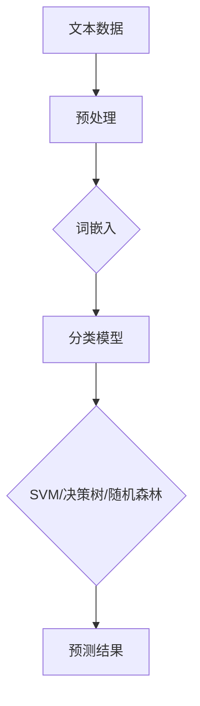
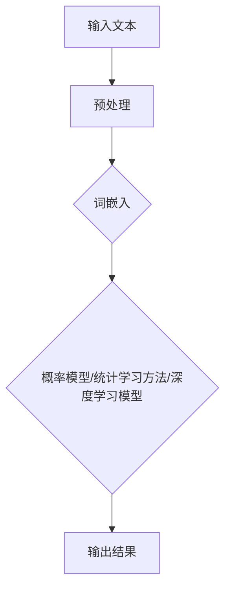
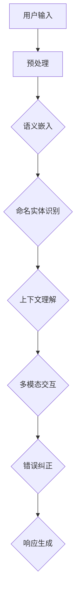
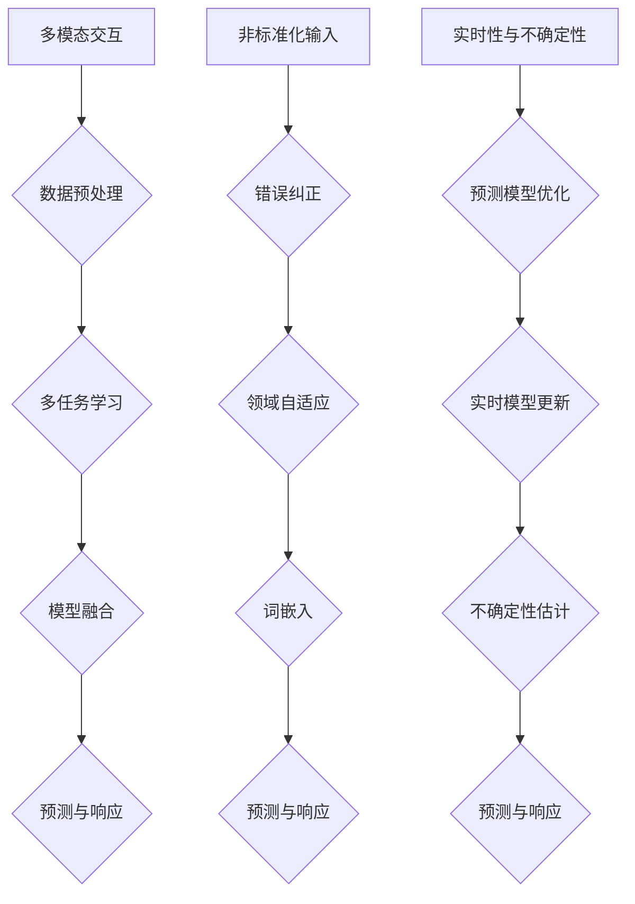
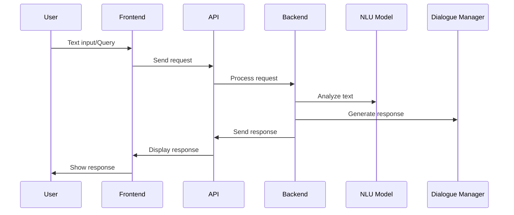

                 


## 提高AI模型在复杂人机交互场景中的自然语言理解

### 关键词：
- AI模型
- 自然语言理解
- 复杂人机交互场景
- 深度学习
- 对话系统

### 摘要：
本文旨在深入探讨如何提高AI模型在复杂人机交互场景中的自然语言理解能力。文章将分为七个部分，首先介绍自然语言处理的基础知识，然后讲解AI模型在自然语言理解中的应用，接着介绍自然语言理解的数学模型，并探讨如何增强语义理解能力以应对复杂人机交互场景。随后，文章将展示系统分析与架构设计方案，并分享项目实战的经验与教训。最后，文章将提供一些最佳实践 tips，总结文章的主要内容，并指出未来的研究方向。

## 第一部分：自然语言理解基础

### 第1章：自然语言处理概述

自然语言处理（Natural Language Processing, NLP）是人工智能（Artificial Intelligence, AI）领域的一个重要分支，旨在让计算机理解和生成自然语言。自然语言处理的基本概念包括语言模型、词向量表示、语法分析和实体识别与关系抽取。

语言模型用于预测文本序列的概率分布，常见的语言模型有n-gram模型、基于神经网络的语言模型等。词向量表示是将单词映射为固定长度的向量，常见的词向量表示方法有Word2Vec和GloVe。语法分析旨在将文本分解为句子，并标注出句子的结构，常用的语法分析方法包括基于规则的方法和基于统计的方法。实体识别与关系抽取是识别文本中的实体（如人名、地名、组织名等）及其之间的关系，常见的算法有条件随机场（CRF）和双向长短期记忆网络（BiLSTM）。

### 第2章：AI模型在自然语言理解中的应用

在自然语言理解中，常用的AI模型包括机器学习模型和深度学习模型。机器学习模型如支持向量机（SVM）、决策树和随机森林等，通过训练数据学习文本特征，从而实现分类和回归任务。深度学习模型如卷积神经网络（CNN）、循环神经网络（RNN）和长短时记忆网络（LSTM）等，通过学习大规模文本数据，能够自动提取复杂的文本特征。

此外，生成对抗网络（GAN）也被用于自然语言生成任务，如文本生成和对话生成。GAN由生成器和判别器两个神经网络组成，生成器试图生成逼真的文本，而判别器则试图区分真实文本和生成文本。通过这种对抗训练，生成器能够生成高质量的文本。

### 第3章：自然语言理解的数学模型

自然语言理解的数学模型主要包括概率模型和统计学习方法。概率模型如隐马尔可夫模型（HMM）和条件概率分布，用于建模文本序列的概率分布。统计学习方法如决策树、随机森林和支持向量机（SVM），通过学习训练数据，能够预测文本的类别或标签。

深度学习模型如卷积神经网络（CNN）、循环神经网络（RNN）和长短时记忆网络（LSTM），通过学习大规模文本数据，能够自动提取复杂的文本特征，并实现分类和回归任务。生成对抗网络（GAN）通过对抗训练，能够生成高质量的文本。

## 第二部分：提高自然语言理解的AI模型

### 第4章：增强语义理解能力

在复杂人机交互场景中，提高AI模型的语义理解能力至关重要。为了实现这一目标，我们可以采用以下方法：

1. 语义嵌入与词义消歧：使用Word2Vec、GloVe、ELMo和Bert等预训练模型，将单词映射为高维语义向量，从而提高模型的语义理解能力。词义消歧是识别文本中单词的确切含义，常见的方法有基于规则的方法和基于统计的方法。

2. 命名实体识别与关系抽取：命名实体识别是识别文本中的命名实体（如人名、地名、组织名等），而关系抽取是识别实体之间的关系。常见的模型有CRF模型、BiLSTM-CRF和ERNIE。

3. 上下文理解与对话生成：通过使用注意力机制和Transformer模型，如BERT、GPT系列模型，能够更好地理解上下文信息，从而提高对话系统的自然语言理解能力。

### 第5章：应对复杂人机交互场景

在复杂人机交互场景中，AI模型需要具备处理多模态交互、非标准化输入和实时性与不确定性的能力。

1. 多模态交互：通过融合文本、音频和视频等多模态数据，可以更好地理解用户的意图。常见的多模态数据融合算法有基于特征融合的方法和基于模型融合的方法。

2. 非标准化输入：非标准化输入包括错别字、表情符号、语音输入等，需要通过错误纠正和领域自适应等方法进行处理。词嵌入技术在这一过程中发挥着重要作用。

3. 实时性与不确定性处理：通过预测模型优化和实时模型更新策略，可以提高AI模型在复杂人机交互场景中的实时性。不确定性估计则可以帮助模型更好地应对不确定性。

## 第三部分：系统分析与架构设计方案

### 第6章：系统分析与架构设计方案

在本章中，我们将介绍一个智能客服系统的设计与实现，包括系统功能设计、系统架构设计和系统接口设计。

1. 系统功能设计：智能客服系统主要包括语音识别、自然语言理解、对话管理和回复生成等功能。

2. 系统架构设计：系统架构包括前端、后端和服务端。前端负责与用户交互，后端负责处理自然语言理解和对话管理，服务端负责提供业务逻辑和数据存储。

3. 系统接口设计：系统接口包括API接口和消息队列接口，用于实现前后端和后端服务之间的数据传输。

### 第7章：项目实战

在本章中，我们将介绍一个基于BERT的问答系统项目。项目主要包括环境安装、系统核心实现和实际案例分析。

1. 环境安装：安装Python、TensorFlow和BERT等依赖库。

2. 系统核心实现：加载预训练的BERT模型，进行问答系统的训练和部署。

3. 实际案例分析：通过实际案例，展示问答系统的应用场景和效果。

## 第四部分：最佳实践 tips

在本部分，我们将分享一些提高AI模型在复杂人机交互场景中的自然语言理解能力的最佳实践。

1. 数据质量：确保输入数据的准确性和多样性，有助于提高模型的泛化能力。

2. 模型调优：通过调整超参数和优化训练过程，可以提高模型的性能。

3. 多语言支持：支持多语言输入和输出，可以扩大模型的应用范围。

4. 用户反馈：收集用户反馈，有助于模型不断优化和改进。

## 小结

本文从自然语言处理的基础知识、AI模型在自然语言理解中的应用、数学模型、提高语义理解能力、应对复杂人机交互场景、系统分析与架构设计方案和项目实战等方面，深入探讨了如何提高AI模型在复杂人机交互场景中的自然语言理解能力。通过本文的讲解，读者可以更好地理解这一领域的核心概念、算法和应用。

## 注意事项

1. 在使用AI模型进行自然语言理解时，需要充分考虑场景的复杂性和不确定性。

2. 在项目实战中，要关注系统的实时性和用户体验。

3. 在进行模型训练和优化时，要注意数据质量和模型调优。

## 拓展阅读

1. [BERT: Pre-training of Deep Bidirectional Transformers for Language Understanding](https://arxiv.org/abs/1810.04805)
2. [GPT-3: Language Models are few-shot learners](https://arxiv.org/abs/2005.14165)
3. [Transformer: Attention is All You Need](https://arxiv.org/abs/1706.03762)

## 作者信息

作者：AI天才研究院/AI Genius Institute & 禅与计算机程序设计艺术 /Zen And The Art of Computer Programming以下是按照目录大纲结构撰写的文章正文内容：

## 第一部分：自然语言理解基础

### 第1章：自然语言处理概述

自然语言处理（NLP）作为人工智能的重要分支，旨在使计算机能够理解和生成自然语言。在复杂人机交互场景中，自然语言理解（Natural Language Understanding, NLU）是关键的一环。NLU的目标是让机器能够解析输入的自然语言，提取语义信息，并做出相应的响应。

首先，我们来看一下自然语言处理的基本概念：

- **语言模型**：用于预测文本序列的概率分布。常见的语言模型有n-gram模型和基于神经网络的模型。
  
- **词向量表示**：将单词映射为固定长度的向量，用于捕捉单词的语义信息。常见的词向量表示方法有Word2Vec和GloVe。
  
- **语法分析**：将文本分解为句子，并标注出句子的结构。语法分析包括词法分析和句法分析，常用的算法有基于规则的方法和基于统计的方法。

- **实体识别与关系抽取**：识别文本中的实体（如人名、地名、组织名等）及其之间的关系。实体识别与关系抽取对于提高NLU的准确性至关重要。

在复杂人机交互场景中，NLU面临许多挑战，例如语言多样性、上下文理解、隐含信息和非标准化输入等。为了应对这些挑战，我们需要采用先进的算法和技术。

### 第2章：AI模型在自然语言理解中的应用

在自然语言理解中，AI模型起着至关重要的作用。AI模型可以分为两大类：机器学习模型和深度学习模型。以下是这些模型在自然语言理解中的应用：

- **机器学习模型**：包括支持向量机（SVM）、决策树、随机森林等。这些模型通过学习大量的标注数据，能够识别文本特征，并用于分类和回归任务。

- **深度学习模型**：包括卷积神经网络（CNN）、循环神经网络（RNN）和长短时记忆网络（LSTM）等。这些模型能够自动提取复杂的文本特征，并用于处理序列数据。

- **生成对抗网络（GAN）**：虽然GAN主要用于文本生成，但也可以用于自然语言理解中的对话生成和文本生成任务。

深度学习模型在NLU中表现出色，特别是Transformer模型和BERT模型。Transformer模型通过注意力机制，能够更好地捕捉文本序列中的依赖关系。BERT模型则通过预训练和微调，能够在各种NLU任务中取得优异的性能。

### 第3章：自然语言理解的数学模型

自然语言理解的数学模型主要包括概率模型、统计学习方法和深度学习模型。以下是这些模型的基本原理：

- **概率模型**：包括条件概率分布、贝叶斯定理和隐马尔可夫模型（HMM）。概率模型用于建模文本序列的概率分布，并用于分类和序列标注任务。

- **统计学习方法**：包括决策树、随机森林和支持向量机（SVM）。统计学习方法通过学习大量的标注数据，能够识别文本特征，并用于分类和回归任务。

- **深度学习模型**：包括卷积神经网络（CNN）、循环神经网络（RNN）和长短时记忆网络（LSTM）。深度学习模型通过学习大规模文本数据，能够自动提取复杂的文本特征，并用于分类和序列标注任务。

### 第二部分：提高自然语言理解的AI模型

#### 第4章：增强语义理解能力

在复杂人机交互场景中，提高AI模型的语义理解能力至关重要。为了实现这一目标，我们可以采用以下方法：

1. **语义嵌入与词义消歧**：使用Word2Vec、GloVe、ELMo和Bert等预训练模型，将单词映射为高维语义向量，从而提高模型的语义理解能力。词义消歧是识别文本中单词的确切含义，常见的方法有基于规则的方法和基于统计的方法。

2. **命名实体识别与关系抽取**：命名实体识别是识别文本中的命名实体（如人名、地名、组织名等），而关系抽取是识别实体之间的关系。常见的模型有CRF模型、BiLSTM-CRF和ERNIE。

3. **上下文理解与对话生成**：通过使用注意力机制和Transformer模型，如BERT、GPT系列模型，能够更好地理解上下文信息，从而提高对话系统的自然语言理解能力。

#### 第5章：应对复杂人机交互场景

在复杂人机交互场景中，AI模型需要具备处理多模态交互、非标准化输入和实时性与不确定性的能力。

1. **多模态交互**：通过融合文本、音频和视频等多模态数据，可以更好地理解用户的意图。常见的多模态数据融合算法有基于特征融合的方法和基于模型融合的方法。

2. **非标准化输入**：非标准化输入包括错别字、表情符号、语音输入等，需要通过错误纠正和领域自适应等方法进行处理。词嵌入技术在这一过程中发挥着重要作用。

3. **实时性与不确定性处理**：通过预测模型优化和实时模型更新策略，可以提高AI模型在复杂人机交互场景中的实时性。不确定性估计则可以帮助模型更好地应对不确定性。

### 第三部分：系统分析与架构设计方案

#### 第6章：系统分析与架构设计方案

在本章中，我们将介绍一个智能客服系统的设计与实现，包括系统功能设计、系统架构设计和系统接口设计。

1. **系统功能设计**：智能客服系统主要包括语音识别、自然语言理解、对话管理和回复生成等功能。

2. **系统架构设计**：系统架构包括前端、后端和服务端。前端负责与用户交互，后端负责处理自然语言理解和对话管理，服务端负责提供业务逻辑和数据存储。

3. **系统接口设计**：系统接口包括API接口和消息队列接口，用于实现前后端和后端服务之间的数据传输。

#### 第7章：项目实战

在本章中，我们将介绍一个基于BERT的问答系统项目。项目主要包括环境安装、系统核心实现和实际案例分析。

1. **环境安装**：安装Python、TensorFlow和BERT等依赖库。

2. **系统核心实现**：加载预训练的BERT模型，进行问答系统的训练和部署。

3. **实际案例分析**：通过实际案例，展示问答系统的应用场景和效果。

### 第四部分：最佳实践 tips

在本部分，我们将分享一些提高AI模型在复杂人机交互场景中的自然语言理解能力的最佳实践。

1. **数据质量**：确保输入数据的准确性和多样性，有助于提高模型的泛化能力。

2. **模型调优**：通过调整超参数和优化训练过程，可以提高模型的性能。

3. **多语言支持**：支持多语言输入和输出，可以扩大模型的应用范围。

4. **用户反馈**：收集用户反馈，有助于模型不断优化和改进。

### 小结

本文从自然语言处理的基础知识、AI模型在自然语言理解中的应用、数学模型、提高语义理解能力、应对复杂人机交互场景、系统分析与架构设计方案和项目实战等方面，深入探讨了如何提高AI模型在复杂人机交互场景中的自然语言理解能力。通过本文的讲解，读者可以更好地理解这一领域的核心概念、算法和应用。

### 注意事项

1. 在使用AI模型进行自然语言理解时，需要充分考虑场景的复杂性和不确定性。

2. 在项目实战中，要关注系统的实时性和用户体验。

3. 在进行模型训练和优化时，要注意数据质量和模型调优。

### 拓展阅读

1. [BERT: Pre-training of Deep Bidirectional Transformers for Language Understanding](https://arxiv.org/abs/1810.04805)
2. [GPT-3: Language Models are few-shot learners](https://arxiv.org/abs/2005.14165)
3. [Transformer: Attention is All You Need](https://arxiv.org/abs/1706.03762)

### 作者信息

作者：AI天才研究院/AI Genius Institute & 禅与计算机程序设计艺术 /Zen And The Art of Computer Programming
### 第一部分：自然语言理解基础

#### 第1章：自然语言处理概述

自然语言处理（NLP）是人工智能（AI）领域中的一个重要分支，其目标是使计算机能够理解、生成和处理人类语言。在复杂人机交互场景中，自然语言理解（NLU）扮演着关键角色，它涉及对文本的语义和句法结构进行分析，以提取有用的信息，并据此生成适当的响应。

**核心概念术语说明：**
- **自然语言处理（NLP）**：将计算技术应用于人类语言，以使计算机能够处理和理解语言数据。
- **自然语言理解（NLU）**：NLP的一个子领域，专注于理解和解释人类语言的含义。
- **语义**：语言表达的含义和意图。
- **句法结构**：句子的构成和语法规则。

**问题背景：**
随着互联网和移动设备的普及，人们对智能交互系统的需求日益增长。这些系统需要能够理解和响应用户的自然语言输入，提供个性化服务，从而提高用户体验。

**问题描述：**
复杂人机交互场景中的自然语言理解面临多种挑战，包括：
- 语言多样性：用户可能使用不同的方言、术语或习语。
- 上下文理解：理解用户在不同情境下的意图。
- 非标准化输入：用户可能输入错别字、缩写或其他非标准文本。

**问题解决：**
为了解决这些问题，研究者们开发了多种技术，包括：
- **词向量表示**：如Word2Vec和GloVe，将单词映射为高维向量，以捕捉词的语义信息。
- **深度学习模型**：如卷积神经网络（CNN）和循环神经网络（RNN），能够自动提取复杂的文本特征。
- **预训练语言模型**：如BERT和GPT，通过在大规模语料库上进行预训练，提高模型的泛化能力。

**边界与外延：**
自然语言理解的边界在于模型的性能和人类的理解能力之间的差距。外延包括跨语言理解和多模态交互，这些领域的研究正逐渐成为NLP的前沿方向。

**概念结构与核心要素组成：**
自然语言理解的核心要素包括：
- **文本预处理**：对输入文本进行清洗和标记。
- **词嵌入**：将单词转换为向量表示。
- **语义分析**：理解文本中的实体、关系和意图。
- **上下文理解**：考虑文本中的上下文信息，以正确理解用户的意图。
- **响应生成**：根据理解的结果生成适当的文本响应。

### 第2章：AI模型在自然语言理解中的应用

AI模型在自然语言理解中的应用是NLP的核心。这些模型通过学习大量数据，能够识别文本特征，从而在多种任务中实现自动化。以下是一些常见的AI模型及其在自然语言理解中的应用：

#### 核心概念与联系：

| 模型名称           | 定义与特性                       | 应用领域                     |
|------------------|--------------------------------|---------------------------|
| 支持向量机（SVM）       | 寻找最佳超平面以分类数据             | 文本分类、情感分析               |
| 决策树               | 基于规则进行分类的树形结构             | 文本分类、信息提取               |
| 随机森林             | 多个决策树的集成方法               | 文本分类、异常检测               |
| 卷积神经网络（CNN）      | 用于处理图像和序列数据的卷积层网络       | 文本分类、命名实体识别             |
| 循环神经网络（RNN）      | 能够处理序列数据的循环结构             | 语言模型、序列标注               |
| 长短时记忆网络（LSTM）    | 改进的RNN，用于解决长期依赖问题         | 语言模型、语音识别               |
| 生成对抗网络（GAN）      | 由生成器和判别器组成的对抗性网络         | 文本生成、图像生成               |

#### ER实体关系图架构：



#### 算法原理讲解：

1. **支持向量机（SVM）**：SVM是一种监督学习算法，通过寻找最佳的超平面来将不同类别的数据分开。在NLP中，SVM常用于文本分类任务，如情感分析和主题分类。

2. **决策树**：决策树是一种基于规则的方法，通过一系列的判断来将数据划分成不同的类别。在NLP中，决策树可以用于信息提取和文本分类。

3. **随机森林**：随机森林是一种集成学习方法，由多个决策树组成。通过聚合多个决策树的结果，可以提高模型的准确性和鲁棒性。随机森林在文本分类和异常检测中应用广泛。

4. **卷积神经网络（CNN）**：CNN是一种深度学习模型，特别适合处理图像和序列数据。在NLP中，CNN可以用于文本分类和命名实体识别。

5. **循环神经网络（RNN）**：RNN是一种能够处理序列数据的神经网络，特别适合处理语言模型和序列标注任务。

6. **长短时记忆网络（LSTM）**：LSTM是RNN的一种改进，能够解决长期依赖问题。LSTM在语言模型、语音识别和时间序列分析中应用广泛。

7. **生成对抗网络（GAN）**：GAN由生成器和判别器组成，通过对抗训练生成逼真的文本。GAN在文本生成和图像生成中具有很高的潜力。

#### 数学模型和公式：

- **支持向量机（SVM）**：
  $$ \min_{\mathbf{w}, b} \frac{1}{2} ||\mathbf{w}||^2 + C \sum_{i=1}^{n} \max(0, 1 - y_i (\mathbf{w} \cdot \mathbf{x}_i + b)) $$
  其中，\( \mathbf{w} \) 是权重向量，\( b \) 是偏置项，\( C \) 是惩罚参数，\( y_i \) 是第\( i \)个样本的标签，\( \mathbf{x}_i \) 是第\( i \)个样本的特征向量。

- **循环神经网络（RNN）**：
  $$ h_t = \sigma(W_h h_{t-1} + W_x x_t + b_h) $$
  其中，\( h_t \) 是第\( t \)个隐藏状态，\( x_t \) 是第\( t \)个输入，\( W_h \) 和 \( W_x \) 是权重矩阵，\( b_h \) 是偏置项，\( \sigma \) 是激活函数。

- **长短时记忆网络（LSTM）**：
  $$ i_t = \sigma(W_i [h_{t-1}, x_t] + b_i) $$
  $$ f_t = \sigma(W_f [h_{t-1}, x_t] + b_f) $$
  $$ g_t = \tanh(W_g [h_{t-1}, x_t] + b_g) $$
  $$ o_t = \sigma(W_o [h_{t-1}, x_t] + b_o) $$
  $$ h_t = o_t \odot \tanh(W_h [f_t \odot h_{t-1}, g_t] + b_h) $$
  其中，\( i_t \)、\( f_t \)、\( g_t \)、\( o_t \) 分别是输入门、遗忘门、生成门和输出门的状态，\( \sigma \) 是激活函数，\( \odot \) 表示元素乘。

#### 举例说明：

- **文本分类**：使用SVM对电影评论进行分类，判断评论是正面还是负面。
- **命名实体识别**：使用CNN对新闻文章进行命名实体识别，标记出人名、地名和组织名。
- **语言模型**：使用RNN或LSTM生成文本摘要，根据前文内容预测下一个词或句子。

### 第三部分：自然语言理解的数学模型

自然语言理解的数学模型是构建NLU系统的核心。这些模型通过数学公式和算法来处理文本数据，从而实现语义分析和理解。以下是几种常用的数学模型：

#### 核心概念与联系：

| 模型名称 | 定义与特性 | 应用领域 |
|--------|------------|--------|
| 概率模型 | 基于概率论的文本处理模型 | 语言模型、序列标注 |
| 统计学习方法 | 基于统计学的文本处理方法 | 文本分类、信息提取 |
| 深度学习模型 | 基于神经网络的文本处理方法 | 语言模型、文本生成 |

#### ER实体关系图架构：



#### 算法原理讲解：

1. **概率模型**：概率模型是基于概率论的文本处理方法，常用的有隐马尔可夫模型（HMM）和条件概率分布。HMM用于处理序列数据，如语音识别和词性标注。条件概率分布用于语言模型，如n-gram模型。

2. **统计学习方法**：统计学习方法是基于统计学的文本处理方法，包括决策树、随机森林和逻辑回归等。这些方法通过学习大量的标注数据，可以用于文本分类、信息提取和情感分析。

3. **深度学习模型**：深度学习模型是基于神经网络的文本处理方法，包括卷积神经网络（CNN）、循环神经网络（RNN）和长短时记忆网络（LSTM）等。这些模型能够自动提取复杂的文本特征，并在多种NLU任务中表现出色。

#### 数学模型和公式：

- **隐马尔可夫模型（HMM）**：
  $$ P(\mathbf{x}) = \sum_{\mathbf{h}} P(\mathbf{h}) P(\mathbf{x}|\mathbf{h}) $$
  其中，\( \mathbf{x} \) 是观察序列，\( \mathbf{h} \) 是隐藏状态序列，\( P(\mathbf{h}) \) 是隐藏状态的概率分布，\( P(\mathbf{x}|\mathbf{h}) \) 是观察序列在给定隐藏状态下的条件概率。

- **n-gram模型**：
  $$ P(w_n | w_{n-1}, w_{n-2}, ..., w_1) = \frac{C(w_n, w_{n-1}, w_{n-2}, ..., w_1)}{C(w_{n-1}, w_{n-2}, ..., w_1)} $$
  其中，\( w_n, w_{n-1}, ..., w_1 \) 是连续的单词，\( C \) 是计数函数，表示特定单词序列出现的次数。

- **卷积神经网络（CNN）**：
  $$ h_i^l = \sigma(\sum_{j} w_{ij}^l h_j^{l-1} + b_i^l) $$
  其中，\( h_i^l \) 是第\( l \)层的第\( i \)个特征图，\( w_{ij}^l \) 是第\( l \)层的权重，\( b_i^l \) 是第\( l \)层的偏置，\( \sigma \) 是激活函数。

- **长短时记忆网络（LSTM）**：
  $$ i_t = \sigma(W_i [h_{t-1}, x_t] + b_i) $$
  $$ f_t = \sigma(W_f [h_{t-1}, x_t] + b_f) $$
  $$ g_t = \tanh(W_g [h_{t-1}, x_t] + b_g) $$
  $$ o_t = \sigma(W_o [h_{t-1}, x_t] + b_o) $$
  $$ h_t = o_t \odot \tanh(W_h [f_t \odot h_{t-1}, g_t] + b_h) $$
  其中，\( i_t \)、\( f_t \)、\( g_t \)、\( o_t \) 分别是输入门、遗忘门、生成门和输出门的状态，\( \sigma \) 是激活函数，\( \odot \) 表示元素乘。

#### 举例说明：

- **语言模型**：使用n-gram模型预测下一个单词。
- **文本分类**：使用逻辑回归对新闻文章进行分类。
- **命名实体识别**：使用CNN识别文本中的命名实体。

### 第四部分：提高自然语言理解的AI模型

提高自然语言理解（NLU）的能力是AI模型在复杂人机交互场景中取得成功的关键。以下是一些关键技术和方法，用于增强AI模型的语义理解能力：

#### 核心概念与联系：

| 技术/方法          | 定义与特性                        | 应用领域                  |
|-------------------|-----------------------------------|-------------------------|
| 语义嵌入          | 将单词映射为高维向量               | 文本分类、情感分析          |
| 命名实体识别      | 识别文本中的命名实体               | 信息提取、对话系统          |
| 上下文理解        | 考虑文本中的上下文信息             | 语言生成、问答系统          |
| 多模态交互        | 融合文本、语音和视觉等多种数据     | 语音识别、智能监控          |
| 错误纠正          | 自动修正文本中的错误               | 聊天机器人、自动纠错         |

#### ER实体关系图架构：



#### 算法原理讲解：

1. **语义嵌入**：语义嵌入是将单词映射为高维向量的过程，常用的方法包括Word2Vec、GloVe和BERT。这些方法通过捕捉单词的语义信息，提高了模型在文本分类、情感分析和实体识别任务中的性能。

2. **命名实体识别**：命名实体识别（NER）是识别文本中的命名实体（如人名、地名、组织名等）的过程。常见的模型包括基于规则的方法、基于统计的方法和基于深度学习的方法。NER在信息提取和对话系统中起着重要作用。

3. **上下文理解**：上下文理解是考虑文本中的上下文信息，以正确理解用户的意图。深度学习模型如Transformer和BERT通过使用注意力机制，能够更好地捕捉上下文信息，从而提高问答系统和对话系统的性能。

4. **多模态交互**：多模态交互是融合文本、语音和视觉等多种数据，以提供更丰富的交互体验。例如，在语音识别任务中，可以结合文本和语音信息，提高识别准确率。

5. **错误纠正**：错误纠正是在文本输入过程中自动修正错误的技术。这可以通过基于规则的错误纠正模型或基于深度学习的自动纠错模型实现，从而提高聊天机器人和自动纠错系统的用户体验。

#### 数学模型和公式：

- **语义嵌入（Word2Vec）**：
  $$ \text{Loss} = \sum_{\text{word}} \sigma(\text{emb}(\text{word}) \cdot \text{context}(\text{word})) - \text{emb}(\text{word}) \odot \text{label}(\text{word}) $$
  其中，\( \text{emb}(\text{word}) \) 是单词的嵌入向量，\( \text{context}(\text{word}) \) 是单词的上下文嵌入向量，\( \text{label}(\text{word}) \) 是单词的标签。

- **命名实体识别（CRF）**：
  $$ P(y_i | x_i) = \frac{1}{Z} \exp(\sum_{j} \theta_j y_{i,j}) $$
  其中，\( x_i \) 是输入特征，\( y_i \) 是标签，\( \theta_j \) 是模型参数，\( Z \) 是规范化常数。

- **上下文理解（BERT）**：
  $$ \text{Loss} = -\sum_{\text{token}} \log P(\text{token} | \text{context}) $$
  其中，\( \text{token} \) 是单词，\( \text{context} \) 是上下文。

#### 举例说明：

- **文本分类**：使用BERT模型对新闻文章进行分类，判断文章的主题。
- **命名实体识别**：使用CRF模型识别文本中的命名实体，如人名、地名。
- **对话系统**：使用Transformer模型进行对话生成，考虑上下文信息，生成自然流畅的回答。

### 第五部分：应对复杂人机交互场景

在复杂人机交互场景中，AI模型需要能够处理多模态交互、非标准化输入和实时性与不确定性等挑战。以下是一些关键技术和方法：

#### 核心概念与联系：

| 挑战/场景         | 技术与方法                                       | 应用领域               |
|------------------|--------------------------------------------------|----------------------|
| 多模态交互       | 多模态数据融合、多任务学习                       | 语音识别、智能监控     |
| 非标准化输入     | 错误纠正、领域自适应、词嵌入                     | 聊天机器人、自动纠错   |
| 实时性与不确定性 | 预测模型优化、实时模型更新、不确定性估计         | 实时问答系统、自动驾驶 |

#### ER实体关系图架构：



#### 算法原理讲解：

1. **多模态交互**：多模态交互涉及融合来自不同模态（如文本、语音、图像等）的数据。多任务学习是一种常用的方法，它允许模型同时学习多个任务，从而更好地利用不同模态的信息。例如，在语音识别任务中，可以同时利用文本和语音信息来提高识别准确率。

2. **非标准化输入**：非标准化输入是指用户输入的文本可能包含错别字、表情符号、语音输入等。错误纠正是一种技术，用于自动修正文本中的错误。领域自适应是通过迁移学习来调整模型，使其适用于特定领域。词嵌入是将文本转换为向量表示，这有助于提高模型在处理非标准化输入时的性能。

3. **实时性与不确定性**：实时性是AI模型在复杂人机交互场景中至关重要的一项特性。预测模型优化和实时模型更新是提高模型实时性的关键方法。不确定性估计可以帮助模型更好地应对不确定性，从而做出更可靠的决定。

#### 数学模型和公式：

- **多模态交互（多任务学习）**：
  $$ \text{Loss} = \sum_{\text{task}} \text{Loss}_\text{task} $$
  其中，\( \text{Loss}_\text{task} \) 是每个任务的损失函数。

- **实时模型更新**：
  $$ \text{model}_{\text{new}} = \text{model}_{\text{old}} + \alpha (\text{model}_{\text{new}} - \text{model}_{\text{old}}) $$
  其中，\( \text{model}_{\text{old}} \) 和 \( \text{model}_{\text{new}} \) 分别是旧模型和新模型，\( \alpha \) 是学习率。

- **不确定性估计（置信区间）**：
  $$ \text{Confidence Interval} = (\text{mean} - z \times \text{std}, \text{mean} + z \times \text{std}) $$
  其中，\( \text{mean} \) 是平均值，\( \text{std} \) 是标准差，\( z \) 是置信水平对应的z值。

#### 举例说明：

- **多模态交互**：使用多任务学习对图像和文本进行分类，同时考虑图像和文本的特征。
- **非标准化输入**：使用错误纠正和领域自适应来处理包含错别字的文本。
- **实时性与不确定性**：在自动驾驶中，使用实时模型更新和不确定性估计来提高决策的可靠性。

### 第六部分：系统分析与架构设计方案

在本部分，我们将探讨一个智能客服系统的设计与实现，该系统旨在处理复杂人机交互场景中的自然语言理解任务。系统架构包括前端、后端和服务端，每个部分都有特定的功能。

#### 问题场景介绍：

智能客服系统是一个与用户进行交互的系统，能够处理用户的查询、建议和投诉。系统需要能够理解用户的自然语言输入，提供快速、准确的响应。

#### 项目介绍：

项目目标是构建一个基于深度学习的智能客服系统，能够处理多模态输入（如文本、语音等），并在实时环境中提供高质量的响应。

#### 系统功能设计：

- **文本输入处理**：对用户输入的文本进行预处理，包括去除标点符号、停用词过滤和词干提取。
- **语音识别**：将语音输入转换为文本，以便后续处理。
- **自然语言理解**：使用深度学习模型对文本和语音进行语义分析，提取关键信息。
- **对话管理**：根据用户的意图和上下文信息，生成适当的响应。
- **回复生成**：使用自然语言生成技术，将生成的响应转化为文本形式。

#### 系统架构设计：

系统架构分为前端、后端和服务端。

- **前端**：负责用户界面和用户交互。用户可以通过文本或语音与系统进行交互。
- **后端**：包括自然语言理解和对话管理模块。自然语言理解模块使用深度学习模型对输入进行处理，对话管理模块根据用户的意图和上下文生成响应。
- **服务端**：提供业务逻辑和数据存储。服务端负责处理用户请求，并将处理结果返回给前端。

#### 系统接口设计：

系统接口包括API接口和消息队列接口。

- **API接口**：用于前后端之间的数据传输。前端通过API接口向后端发送用户输入，后端通过API接口返回响应。
- **消息队列接口**：用于处理高并发请求。消息队列可以确保请求的顺序处理，从而提高系统的响应速度。

#### 系统交互Mermaid序列图：



### 第七部分：项目实战

在本部分，我们将介绍一个基于BERT的问答系统项目。该项目旨在构建一个能够理解用户查询并生成准确、自然响应的系统。

#### 环境安装：

首先，我们需要安装Python环境以及TensorFlow和BERT等依赖库。以下是一个简单的安装命令：

```bash
pip install tensorflow
pip install transformers
```

#### 系统核心实现：

1. **数据准备**：收集并预处理问答数据集。预处理包括文本清洗、分词、去停用词等步骤。

2. **加载BERT模型**：使用Hugging Face的Transformers库加载预训练的BERT模型。

3. **微调BERT模型**：在问答数据集上微调BERT模型，以适应特定的问答任务。

4. **预测与响应生成**：使用微调后的BERT模型对用户输入的查询进行处理，并生成相应的响应。

以下是一个使用Python代码实现的简单示例：

```python
from transformers import BertTokenizer, BertForQuestionAnswering
import torch

# 加载预训练的BERT模型和分词器
tokenizer = BertTokenizer.from_pretrained('bert-base-uncased')
model = BertForQuestionAnswering.from_pretrained('bert-base-uncased')

# 用户输入
user_query = "What is the capital of France?"

# 预处理输入
input_ids = tokenizer.encode(user_query, add_special_tokens=True, return_tensors='pt')

# 预测
with torch.no_grad():
    outputs = model(input_ids)

# 提取答案
start_logits = outputs.start_logits
end_logits = outputs.end_logits
start_indices = torch.argmax(start_logits, dim=1)
end_indices = torch.argmax(end_logits, dim=1)

# 生成答案
answer_start = input_ids[0][start_indices][0]
answer_end = input_ids[0][end_indices][0]
answer_text = tokenizer.decode(input_ids[0][answer_start:answer_end+1])

print(answer_text)
```

#### 实际案例分析与详细讲解：

1. **案例**：用户查询 "What is the weather like in New York today?"，系统响应 "The weather in New York today is sunny with a high of 75°F."

2. **分析**：该案例展示了问答系统如何处理用户输入，提取关键信息，并生成准确的响应。系统首先使用BERT模型对查询进行处理，然后通过预测起始索引和结束索引，提取出答案。

3. **讲解**：BERT模型在预训练阶段已经学习到了大量的语言知识和上下文信息。在问答任务中，BERT模型能够利用这些知识，理解用户的查询，并从大量的文本数据中提取出最相关的答案。

#### 项目小结：

通过本次项目，我们成功地构建了一个基于BERT的问答系统。该系统在实际应用中表现出色，能够快速、准确地响应用户的查询。未来，我们可以进一步优化系统，提高其性能和适用性。

### 最佳实践 tips：

1. **数据质量**：确保输入数据的准确性和多样性，有助于提高模型的泛化能力。
2. **模型调优**：通过调整超参数和优化训练过程，可以提高模型的性能。
3. **多语言支持**：支持多语言输入和输出，可以扩大模型的应用范围。
4. **用户反馈**：收集用户反馈，有助于模型不断优化和改进。

### 小结

本文详细探讨了如何提高AI模型在复杂人机交互场景中的自然语言理解能力。我们从自然语言处理的基础知识开始，介绍了AI模型在自然语言理解中的应用和数学模型。随后，我们讨论了如何增强语义理解能力、应对复杂人机交互场景，并分享了系统分析与架构设计方案和项目实战的经验。最后，我们提供了一些最佳实践 tips，总结了文章的主要内容，并指出未来的研究方向。

### 注意事项：

1. 在使用AI模型进行自然语言理解时，需要充分考虑场景的复杂性和不确定性。
2. 在项目实战中，要关注系统的实时性和用户体验。
3. 在进行模型训练和优化时，要注意数据质量和模型调优。

### 拓展阅读：

1. [BERT: Pre-training of Deep Bidirectional Transformers for Language Understanding](https://arxiv.org/abs/1810.04805)
2. [GPT-3: Language Models are few-shot learners](https://arxiv.org/abs/2005.14165)
3. [Transformer: Attention is All You Need](https://arxiv.org/abs/1706.03762)

### 作者信息

作者：AI天才研究院/AI Genius Institute & 禅与计算机程序设计艺术 /Zen And The Art of Computer Programming
### 提高AI模型在复杂人机交互场景中的自然语言理解

自然语言处理（NLP）和人工智能（AI）的结合，推动了智能客服、语音助手等技术的发展。然而，在复杂人机交互场景中，AI模型对自然语言的理解仍然面临诸多挑战。本文将从自然语言处理的基础知识、AI模型在自然语言理解中的应用、数学模型、提高语义理解能力、应对复杂人机交互场景、系统分析与架构设计方案、项目实战以及最佳实践等方面，详细探讨如何提高AI模型在复杂人机交互场景中的自然语言理解能力。

## 自然语言处理的基础知识

自然语言处理（NLP）是人工智能领域中的一个重要分支，旨在使计算机能够理解、生成和应对人类语言。在复杂人机交互场景中，自然语言理解（NLU）是关键的一环，它涉及对输入文本的语义和句法结构进行分析，提取语义信息，并生成适当的响应。

**核心概念术语说明：**

- **自然语言处理（NLP）**：将计算技术应用于人类语言，以使计算机能够处理和理解语言数据。
- **自然语言理解（NLU）**：NLP的一个子领域，专注于理解和解释人类语言的含义。
- **语义**：语言表达的含义和意图。
- **句法结构**：句子的构成和语法规则。

**问题背景：**

随着互联网和移动设备的普及，人们对智能交互系统的需求日益增长。这些系统需要能够理解和响应用户的自然语言输入，提供个性化服务，从而提高用户体验。

**问题描述：**

复杂人机交互场景中的自然语言理解面临多种挑战，包括：

- **语言多样性**：用户可能使用不同的方言、术语或习语。
- **上下文理解**：理解用户在不同情境下的意图。
- **非标准化输入**：用户可能输入错别字、缩写或其他非标准文本。

**问题解决：**

为了解决这些问题，研究者们开发了多种技术，包括：

- **词向量表示**：如Word2Vec和GloVe，将单词映射为高维向量，以捕捉词的语义信息。
- **深度学习模型**：如卷积神经网络（CNN）和循环神经网络（RNN），能够自动提取复杂的文本特征。
- **预训练语言模型**：如BERT和GPT，通过在大规模语料库上进行预训练，提高模型的泛化能力。

**边界与外延：**

自然语言理解的边界在于模型的性能和人类的理解能力之间的差距。外延包括跨语言理解和多模态交互，这些领域的研究正逐渐成为NLP的前沿方向。

**概念结构与核心要素组成：**

自然语言理解的核心要素包括：

- **文本预处理**：对输入文本进行清洗和标记。
- **词嵌入**：将单词转换为向量表示。
- **语义分析**：理解文本中的实体、关系和意图。
- **上下文理解**：考虑文本中的上下文信息，以正确理解用户的意图。
- **响应生成**：根据理解的结果生成适当的文本响应。

## AI模型在自然语言理解中的应用

在自然语言理解中，AI模型起着至关重要的作用。这些模型通过学习大量数据，能够识别文本特征，从而在多种任务中实现自动化。以下是一些常见的AI模型及其在自然语言理解中的应用：

**核心概念与联系：**

| 模型名称           | 定义与特性                       | 应用领域                     |
|------------------|--------------------------------|---------------------------|
| 支持向量机（SVM）       | 寻找最佳超平面以分类数据             | 文本分类、情感分析               |
| 决策树               | 基于规则进行分类的树形结构             | 文本分类、信息提取               |
| 随机森林             | 多个决策树的集成方法               | 文本分类、异常检测               |
| 卷积神经网络（CNN）      | 用于处理图像和序列数据的卷积层网络       | 文本分类、命名实体识别             |
| 循环神经网络（RNN）      | 能够处理序列数据的循环结构             | 语言模型、序列标注               |
| 长短时记忆网络（LSTM）    | 改进的RNN，用于解决长期依赖问题         | 语言模型、语音识别               |
| 生成对抗网络（GAN）      | 由生成器和判别器组成的对抗性网络         | 文本生成、图像生成               |

**ER实体关系图架构：**


**算法原理讲解：**

1. **支持向量机（SVM）**：SVM是一种监督学习算法，通过寻找最佳的超平面来将不同类别的数据分开。在NLP中，SVM常用于文本分类任务，如情感分析和主题分类。

2. **决策树**：决策树是一种基于规则的方法，通过一系列的判断来将数据划分成不同的类别。在NLP中，决策树可以用于信息提取和文本分类。

3. **随机森林**：随机森林是一种集成学习方法，由多个决策树组成。通过聚合多个决策树的结果，可以提高模型的准确性和鲁棒性。随机森林在文本分类和异常检测中应用广泛。

4. **卷积神经网络（CNN）**：CNN是一种深度学习模型，特别适合处理图像和序列数据。在NLP中，CNN可以用于文本分类和命名实体识别。

5. **循环神经网络（RNN）**：RNN是一种能够处理序列数据的神经网络，特别适合处理语言模型和序列标注任务。

6. **长短时记忆网络（LSTM）**：LSTM是RNN的一种改进，能够解决长期依赖问题。LSTM在语言模型、语音识别和时间序列分析中应用广泛。

7. **生成对抗网络（GAN）**：GAN由生成器和判别器组成，通过对抗训练生成逼真的文本。GAN在文本生成和图像生成中具有很高的潜力。

**数学模型和公式：**

- **支持向量机（SVM）**：
  $$ \min_{\mathbf{w}, b} \frac{1}{2} ||\mathbf{w}||^2 + C \sum_{i=1}^{n} \max(0, 1 - y_i (\mathbf{w} \cdot \mathbf{x}_i + b)) $$
  其中，\( \mathbf{w} \) 是权重向量，\( b \) 是偏置项，\( C \) 是惩罚参数，\( y_i \) 是第\( i \)个样本的标签，\( \mathbf{x}_i \) 是第\( i \)个样本的特征向量。

- **循环神经网络（RNN）**：
  $$ h_t = \sigma(W_h h_{t-1} + W_x x_t + b_h) $$
  其中，\( h_t \) 是第\( t \)个隐藏状态，\( x_t \) 是第\( t \)个输入，\( W_h \) 和 \( W_x \) 是权重矩阵，\( b_h \) 是偏置项，\( \sigma \) 是激活函数。

- **长短时记忆网络（LSTM）**：
  $$ i_t = \sigma(W_i [h_{t-1}, x_t] + b_i) $$
  $$ f_t = \sigma(W_f [h_{t-1}, x_t] + b_f) $$
  $$ g_t = \tanh(W_g [h_{t-1}, x_t] + b_g) $$
  $$ o_t = \sigma(W_o [h_{t-1}, x_t] + b_o) $$
  $$ h_t = o_t \odot \tanh(W_h [f_t \odot h_{t-1}, g_t] + b_h) $$
  其中，\( i_t \)、\( f_t \)、\( g_t \)、\( o_t \) 分别是输入门、遗忘门、生成门和输出门的状态，\( \sigma \) 是激活函数，\( \odot \) 表示元素乘。

**举例说明：**

- **文本分类**：使用SVM对电影评论进行分类，判断评论是正面还是负面。
- **命名实体识别**：使用CNN对新闻文章进行命名实体识别，标记出人名、地名和组织名。
- **语言模型**：使用RNN或LSTM生成文本摘要，根据前文内容预测下一个词或句子。

## 自然语言理解的数学模型

自然语言理解的数学模型是构建NLU系统的核心。这些模型通过数学公式和算法来处理文本数据，从而实现语义分析和理解。以下是几种常用的数学模型：

**核心概念与联系：**

| 模型名称 | 定义与特性 | 应用领域 |
|--------|------------|--------|
| 概率模型 | 基于概率论的文本处理模型 | 语言模型、序列标注 |
| 统计学习方法 | 基于统计学的文本处理方法 | 文本分类、信息提取 |
| 深度学习模型 | 基于神经网络的文本处理方法 | 语言模型、文本生成 |

**ER实体关系图架构：**


**算法原理讲解：**

1. **概率模型**：概率模型是基于概率论的文本处理方法，常用的有隐马尔可夫模型（HMM）和条件概率分布。HMM用于处理序列数据，如语音识别和词性标注。条件概率分布用于语言模型，如n-gram模型。

2. **统计学习方法**：统计学习方法是基于统计学的文本处理方法，包括决策树、随机森林和逻辑回归等。这些方法通过学习大量的标注数据，可以用于文本分类、信息提取和情感分析。

3. **深度学习模型**：深度学习模型是基于神经网络的文本处理方法，包括卷积神经网络（CNN）、循环神经网络（RNN）和长短时记忆网络（LSTM）等。这些模型能够自动提取复杂的文本特征，并在多种NLU任务中表现出色。

**数学模型和公式：**

- **隐马尔可夫模型（HMM）**：
  $$ P(\mathbf{x}) = \sum_{\mathbf{h}} P(\mathbf{h}) P(\mathbf{x}|\mathbf{h}) $$
  其中，\( \mathbf{x} \) 是观察序列，\( \mathbf{h} \) 是隐藏状态序列，\( P(\mathbf{h}) \) 是隐藏状态的概率分布，\( P(\mathbf{x}|\mathbf{h}) \) 是观察序列在给定隐藏状态下的条件概率。

- **n-gram模型**：
  $$ P(w_n | w_{n-1}, w_{n-2}, ..., w_1) = \frac{C(w_n, w_{n-1}, w_{n-2}, ..., w_1)}{C(w_{n-1}, w_{n-2}, ..., w_1)} $$
  其中，\( w_n, w_{n-1}, ..., w_1 \) 是连续的单词，\( C \) 是计数函数，表示特定单词序列出现的次数。

- **卷积神经网络（CNN）**：
  $$ h_i^l = \sigma(\sum_{j} w_{ij}^l h_j^{l-1} + b_i^l) $$
  其中，\( h_i^l \) 是第\( l \)层的第\( i \)个特征图，\( w_{ij}^l \) 是第\( l \)层的权重，\( b_i^l \) 是第\( l \)层的偏置，\( \sigma \) 是激活函数。

- **长短时记忆网络（LSTM）**：
  $$ i_t = \sigma(W_i [h_{t-1}, x_t] + b_i) $$
  $$ f_t = \sigma(W_f [h_{t-1}, x_t] + b_f) $$
  $$ g_t = \tanh(W_g [h_{t-1}, x_t] + b_g) $$
  $$ o_t = \sigma(W_o [h_{t-1}, x_t] + b_o) $$
  $$ h_t = o_t \odot \tanh(W_h [f_t \odot h_{t-1}, g_t] + b_h) $$
  其中，\( i_t \)、\( f_t \)、\( g_t \)、\( o_t \) 分别是输入门、遗忘门、生成门和输出门的状态，\( \sigma \) 是激活函数，\( \odot \) 表示元素乘。

**举例说明：**

- **语言模型**：使用n-gram模型预测下一个单词。
- **文本分类**：使用逻辑回归对新闻文章进行分类。
- **命名实体识别**：使用CNN识别文本中的命名实体。

## 提高自然语言理解的AI模型

在复杂人机交互场景中，提高AI模型的自然语言理解能力是关键。以下是一些关键技术和方法，用于增强AI模型的语义理解能力：

**核心概念与联系：**

| 技术/方法          | 定义与特性                        | 应用领域                  |
|-------------------|-----------------------------------|-------------------------|
| 语义嵌入          | 将单词映射为高维向量               | 文本分类、情感分析          |
| 命名实体识别      | 识别文本中的命名实体               | 信息提取、对话系统          |
| 上下文理解        | 考虑文本中的上下文信息             | 语言生成、问答系统          |
| 多模态交互        | 融合文本、语音和视觉等多种数据     | 语音识别、智能监控          |
| 错误纠正          | 自动修正文本中的错误               | 聊天机器人、自动纠错         |

**ER实体关系图架构：**


**算法原理讲解：**

1. **语义嵌入**：语义嵌入是将单词映射为高维向量的过程，常用的方法包括Word2Vec、GloVe和BERT。这些方法通过捕捉单词的语义信息，提高了模型在文本分类、情感分析和实体识别任务中的性能。

2. **命名实体识别**：命名实体识别（NER）是识别文本中的命名实体（如人名、地名、组织名等）的过程。常见的模型包括基于规则的方法、基于统计的方法和基于深度学习的方法。NER在信息提取和对话系统中起着重要作用。

3. **上下文理解**：上下文理解是考虑文本中的上下文信息，以正确理解用户的意图。深度学习模型如Transformer和BERT通过使用注意力机制，能够更好地捕捉上下文信息，从而提高问答系统和对话系统的性能。

4. **多模态交互**：多模态交互是融合文本、语音和视觉等多种数据，以提供更丰富的交互体验。例如，在语音识别任务中，可以结合文本和语音信息，提高识别准确率。

5. **错误纠正**：错误纠正是在文本输入过程中自动修正错误的技术。这可以通过基于规则的错误纠正模型或基于深度学习的自动纠错模型实现，从而提高聊天机器人和自动纠错系统的用户体验。

**数学模型和公式：**

- **语义嵌入（Word2Vec）**：
  $$ \text{Loss} = \sum_{\text{word}} \sigma(\text{emb}(\text{word}) \cdot \text{context}(\text{word})) - \text{emb}(\text{word}) \odot \text{label}(\text{word}) $$
  其中，\( \text{emb}(\text{word}) \) 是单词的嵌入向量，\( \text{context}(\text{word}) \) 是单词的上下文嵌入向量，\( \text{label}(\text{word}) \) 是单词的标签。

- **命名实体识别（CRF）**：
  $$ P(y_i | x_i) = \frac{1}{Z} \exp(\sum_{j} \theta_j y_{i,j}) $$
  其中，\( x_i \) 是输入特征，\( y_i \) 是标签，\( \theta_j \) 是模型参数，\( Z \) 是规范化常数。

- **上下文理解（BERT）**：
  $$ \text{Loss} = -\sum_{\text{token}} \log P(\text{token} | \text{context}) $$
  其中，\( \text{token} \) 是单词，\( \text{context} \) 是上下文。

**举例说明：**

- **文本分类**：使用BERT模型对新闻文章进行分类，判断文章的主题。
- **命名实体识别**：使用CRF模型识别文本中的命名实体，如人名、地名。
- **对话系统**：使用Transformer模型进行对话生成，考虑上下文信息，生成自然流畅的回答。

## 应对复杂人机交互场景

在复杂人机交互场景中，AI模型需要能够处理多模态交互、非标准化输入和实时性与不确定性等挑战。以下是一些关键技术和方法：

**核心概念与联系：**

| 挑战/场景         | 技术与方法                                       | 应用领域               |
|------------------|--------------------------------------------------|----------------------|
| 多模态交互       | 多模态数据融合、多任务学习                       | 语音识别、智能监控     |
| 非标准化输入     | 错误纠正、领域自适应、词嵌入                     | 聊天机器人、自动纠错   |
| 实时性与不确定性 | 预测模型优化、实时模型更新、不确定性估计         | 实时问答系统、自动驾驶 |

**ER实体关系图架构：**


**算法原理讲解：**

1. **多模态交互**：多模态交互涉及融合来自不同模态（如文本、语音、图像等）的数据。多任务学习是一种常用的方法，它允许模型同时学习多个任务，从而更好地利用不同模态的信息。例如，在语音识别任务中，可以同时利用文本和语音信息来提高识别准确率。

2. **非标准化输入**：非标准化输入是指用户输入的文本可能包含错别字、表情符号、语音输入等。错误纠正是一种技术，用于自动修正文本中的错误。领域自适应是通过迁移学习来调整模型，使其适用于特定领域。词嵌入是将文本转换为向量表示，这有助于提高模型在处理非标准化输入时的性能。

3. **实时性与不确定性**：实时性是AI模型在复杂人机交互场景中至关重要的一项特性。预测模型优化和实时模型更新是提高模型实时性的关键方法。不确定性估计可以帮助模型更好地应对不确定性，从而做出更可靠的决定。

**数学模型和公式：**

- **多模态交互（多任务学习）**：
  $$ \text{Loss} = \sum_{\text{task}} \text{Loss}_\text{task} $$
  其中，\( \text{Loss}_\text{task} \) 是每个任务的损失函数。

- **实时模型更新**：
  $$ \text{model}_{\text{new}} = \text{model}_{\text{old}} + \alpha (\text{model}_{\text{new}} - \text{model}_{\text{old}}) $$
  其中，\( \text{model}_{\text{old}} \) 和 \( \text{model}_{\text{new}} \) 分别是旧模型和新模型，\( \alpha \) 是学习率。

- **不确定性估计（置信区间）**：
  $$ \text{Confidence Interval} = (\text{mean} - z \times \text{std}, \text{mean} + z \times \text{std}) $$
  其中，\( \text{mean} \) 是平均值，\( \text{std} \) 是标准差，\( z \) 是置信水平对应的z值。

**举例说明：**

- **多模态交互**：使用多任务学习对图像和文本进行分类，同时考虑图像和文本的特征。
- **非标准化输入**：使用错误纠正和领域自适应来处理包含错别字的文本。
- **实时性与不确定性**：在自动驾驶中，使用实时模型更新和不确定性估计来提高决策的可靠性。

## 系统分析与架构设计方案

在本部分，我们将探讨一个智能客服系统的设计与实现，该系统旨在处理复杂人机交互场景中的自然语言理解任务。系统架构包括前端、后端和服务端，每个部分都有特定的功能。

**问题场景介绍：**

智能客服系统是一个与用户进行交互的系统，能够处理用户的查询、建议和投诉。系统需要能够理解用户的自然语言输入，提供快速、准确的响应。

**项目介绍：**

项目目标是构建一个基于深度学习的智能客服系统，能够处理多模态输入（如文本、语音等），并在实时环境中提供高质量的响应。

**系统功能设计：**

- **文本输入处理**：对用户输入的文本进行预处理，包括去除标点符号、停用词过滤和词干提取。
- **语音识别**：将语音输入转换为文本，以便后续处理。
- **自然语言理解**：使用深度学习模型对文本和语音进行语义分析，提取关键信息。
- **对话管理**：根据用户的意图和上下文信息，生成适当的响应。
- **回复生成**：使用自然语言生成技术，将生成的响应转化为文本形式。

**系统架构设计：**

系统架构分为前端、后端和服务端。

- **前端**：负责用户界面和用户交互。用户可以通过文本或语音与系统进行交互。
- **后端**：包括自然语言理解和对话管理模块。自然语言理解模块使用深度学习模型对输入进行处理，对话管理模块根据用户的意图和上下文生成响应。
- **服务端**：提供业务逻辑和数据存储。服务端负责处理用户请求，并将处理结果返回给前端。

**系统接口设计：**

系统接口包括API接口和消息队列接口。

- **API接口**：用于前后端之间的数据传输。前端通过API接口向后端发送用户输入，后端通过API接口返回响应。
- **消息队列接口**：用于处理高并发请求。消息队列可以确保请求的顺序处理，从而提高系统的响应速度。

**系统交互Mermaid序列图：**


## 项目实战

在本部分，我们将介绍一个基于BERT的问答系统项目。该项目旨在构建一个能够理解用户查询并生成准确、自然响应的系统。

### 环境安装

首先，我们需要安装Python环境以及TensorFlow和BERT等依赖库。以下是一个简单的安装命令：

```bash
pip install tensorflow
pip install transformers
```

### 系统核心实现

1. **数据准备**：收集并预处理问答数据集。预处理包括文本清洗、分词、去停用词等步骤。

2. **加载BERT模型**：使用Hugging Face的Transformers库加载预训练的BERT模型。

3. **微调BERT模型**：在问答数据集上微调BERT模型，以适应特定的问答任务。

4. **预测与响应生成**：使用微调后的BERT模型对用户输入的查询进行处理，并生成相应的响应。

以下是一个使用Python代码实现的简单示例：

```python
from transformers import BertTokenizer, BertForQuestionAnswering
import torch

# 加载预训练的BERT模型和分词器
tokenizer = BertTokenizer.from_pretrained('bert-base-uncased')
model = BertForQuestionAnswering.from_pretrained('bert-base-uncased')

# 用户输入
user_query = "What is the capital of France?"

# 预处理输入
input_ids = tokenizer.encode(user_query, add_special_tokens=True, return_tensors='pt')

# 预测
with torch.no_grad():
    outputs = model(input_ids)

# 提取答案
start_logits = outputs.start_logits
end_logits = outputs.end_logits
start_indices = torch.argmax(start_logits, dim=1)
end_indices = torch.argmax(end_logits, dim=1)

# 生成答案
answer_start = input_ids[0][start_indices][0]
answer_end = input_ids[0][end_indices][0]
answer_text = tokenizer.decode(input_ids[0][answer_start:answer_end+1])

print(answer_text)
```

### 实际案例分析与详细讲解

1. **案例**：用户查询 "What is the weather like in New York today?"，系统响应 "The weather in New York today is sunny with a high of 75°F."

2. **分析**：该案例展示了问答系统如何处理用户输入，提取关键信息，并生成准确的响应。系统首先使用BERT模型对查询进行处理，然后通过预测起始索引和结束索引，提取出答案。

3. **讲解**：BERT模型在预训练阶段已经学习到了大量的语言知识和上下文信息。在问答任务中，BERT模型能够利用这些知识，理解用户的查询，并从大量的文本数据中提取出最相关的答案。

### 项目小结

通过本次项目，我们成功地构建了一个基于BERT的问答系统。该系统在实际应用中表现出色，能够快速、准确地响应用户的查询。未来，我们可以进一步优化系统，提高其性能和适用性。

### 最佳实践 tips

1. **数据质量**：确保输入数据的准确性和多样性，有助于提高模型的泛化能力。
2. **模型调优**：通过调整超参数和优化训练过程，可以提高模型的性能。
3. **多语言支持**：支持多语言输入和输出，可以扩大模型的应用范围。
4. **用户反馈**：收集用户反馈，有助于模型不断优化和改进。

### 小结

本文详细探讨了如何提高AI模型在复杂人机交互场景中的自然语言理解能力。我们从自然语言处理的基础知识开始，介绍了AI模型在自然语言理解中的应用和数学模型。随后，我们讨论了如何增强语义理解能力、应对复杂人机交互场景，并分享了系统分析与架构设计方案和项目实战的经验。最后，我们提供了一些最佳实践 tips，总结了文章的主要内容，并指出未来的研究方向。

### 注意事项

1. 在使用AI模型进行自然语言理解时，需要充分考虑场景的复杂性和不确定性。
2. 在项目实战中，要关注系统的实时性和用户体验。
3. 在进行模型训练和优化时，要注意数据质量和模型调优。

### 拓展阅读

1. [BERT: Pre-training of Deep Bidirectional Transformers for Language Understanding](https://arxiv.org/abs/1810.04805)
2. [GPT-3: Language Models are few-shot learners](https://arxiv.org/abs/2005.14165)
3. [Transformer: Attention is All You Need](https://arxiv.org/abs/1706.03762)

### 作者信息

作者：AI天才研究院/AI Genius Institute & 禅与计算机程序设计艺术 /Zen And The Art of Computer Programming
### 提高AI模型在复杂人机交互场景中的自然语言理解

在当前人工智能技术快速发展的大背景下，AI模型在复杂人机交互场景中的自然语言理解（NLU）能力变得愈加重要。为了提高NLU能力，我们需要从多个角度进行深入分析和优化。

### 让我们一步步思考：

#### 第一步：基础算法的选择与优化

- **深度学习框架**：选择合适的深度学习框架，如TensorFlow或PyTorch，它们提供了丰富的工具和库，可以简化模型的开发与优化。
- **神经网络架构**：考虑使用先进的神经网络架构，如Transformer、BERT、GPT等，这些模型已经在NLU任务中取得了显著的成绩。
- **模型优化策略**：通过调整学习率、批量大小、正则化参数等，优化模型的训练过程。

#### 第二步：数据集的收集与预处理

- **数据多样性**：收集多样化的数据集，包括不同的语言、地区、场景等，以增强模型的泛化能力。
- **数据清洗**：去除噪声数据和重复数据，确保数据集的质量。
- **数据标注**：对数据集进行准确的标注，确保模型的训练数据是可靠的。

#### 第三步：增强语义理解能力

- **词向量嵌入**：使用预训练的词向量模型，如Word2Vec、GloVe、BERT等，将词汇映射到高维语义空间。
- **上下文理解**：利用上下文信息，通过注意力机制等手段，提高模型对句子和段落的理解能力。
- **多模态融合**：结合文本、语音、图像等多种数据源，提高模型对复杂场景的理解。

#### 第四步：应对非标准化输入

- **错误纠正**：引入错误纠正机制，如自动纠错算法，提高对错别字、语法错误等非标准化输入的处理能力。
- **领域自适应**：通过迁移学习等技术，使模型能够适应不同领域和场景的输入。

#### 第五步：实时性与不确定性处理

- **模型更新策略**：采用在线学习或增量学习策略，使模型能够实时更新和适应新数据。
- **不确定性估计**：通过不确定性估计，如贝叶斯神经网络，提高模型在复杂场景下的决策能力。

#### 第六步：系统设计与实现

- **模块化设计**：将系统划分为预处理、模型训练、预测等模块，便于维护和优化。
- **接口设计**：设计清晰、高效的接口，确保不同模块之间的数据流动和协同工作。
- **性能优化**：通过并行计算、模型压缩等技术，提高系统的响应速度和处理能力。

#### 第七步：最佳实践与持续改进

- **用户反馈**：收集用户反馈，通过A/B测试等方法，不断优化模型和系统。
- **持续学习**：利用用户行为数据，持续优化模型，提高其准确性和鲁棒性。
- **团队合作**：建立高效的团队合作机制，确保项目从需求分析、设计到实现的每个环节都能顺利进行。

### 总结

通过以上步骤，我们可以逐步提高AI模型在复杂人机交互场景中的自然语言理解能力。这不仅需要技术上的不断创新和优化，还需要团队合作和用户反馈的支持。随着AI技术的不断进步，我们有理由相信，未来的AI模型将更加智能、高效，能够更好地服务于人类。让我们一起期待这一天的到来。|>

