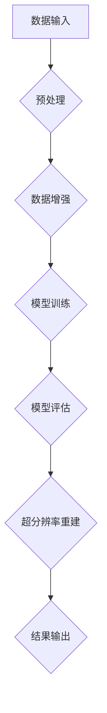

                 

### 超分辨率重建基本概念

#### 1.1 超分辨率重建简介

超分辨率重建（Super-Resolution Reconstruction）是指通过算法或模型，从多个低分辨率图像中重建出高分辨率图像的过程。这一技术最早起源于光学显微镜领域，旨在通过多个低放大率的显微镜图像，合成出高放大率的清晰图像。随着计算机科学和人工智能技术的发展，超分辨率重建逐渐扩展到电子显微镜、遥感图像处理和计算机视觉等多个领域。

在计算机视觉领域，超分辨率重建的应用尤为重要。现实中的许多图像传感器，如手机摄像头和安防监控摄像头，由于硬件限制，往往只能捕获低分辨率的图像。为了提升这些图像的质量和应用效果，超分辨率重建技术被广泛应用。通过这一技术，可以有效地提升图像的分辨率，增强图像的细节，提高图像的可用性。

#### 1.2 复杂场景图像特点

复杂场景图像是指包含多种物体、颜色、纹理和光照变化的图像。与简单场景图像相比，复杂场景图像在超分辨率重建过程中面临更多的挑战。主要特点包括：

- **多样性**：复杂场景中通常包含多种不同类型的物体，如建筑物、人、车辆等，这些物体在低分辨率图像中可能难以区分。
- **动态变化**：复杂场景中的物体和背景可能会发生动态变化，如车辆移动、行人走动等，这种动态变化会对重建过程产生干扰。
- **光照变化**：复杂场景中的光照条件多变，从明亮的日光到阴暗的室内光，不同的光照条件会对图像的细节和颜色产生影响。

这些特点使得复杂场景图像超分辨率重建成为一个极具挑战性的问题，对算法的鲁棒性和准确性提出了更高的要求。

#### 1.3 AI模型在图像超分辨率重建中的应用

传统超分辨率重建方法通常依赖于图像处理技术，如插值、滤波等。然而，这些方法在面对复杂场景图像时，往往难以获得理想的效果。随着人工智能技术的快速发展，特别是深度学习算法的突破，AI模型在图像超分辨率重建中的应用逐渐成为主流。

- **卷积神经网络（CNN）**：CNN通过学习图像的局部特征，能够在超分辨率重建中有效地提取和恢复图像细节。
- **深度残差网络（ResNet）**：ResNet通过引入残差连接，解决了深层网络训练过程中的梯度消失问题，使得模型能够训练得更深，从而在重建质量上有所提升。
- **生成对抗网络（GAN）**：GAN通过生成器和判别器的对抗训练，能够生成高质量的高分辨率图像，特别适用于复杂场景图像的超分辨率重建。

与传统方法相比，AI模型具有以下优势：

- **自适应学习**：AI模型能够从大量数据中自动学习，自适应地调整参数，以适应不同的场景和需求。
- **高效性**：AI模型能够在短时间内处理大量图像，提高重建效率。
- **鲁棒性**：AI模型在面对复杂场景和光照变化时，仍能保持较高的重建质量。

总的来说，AI模型在图像超分辨率重建中的应用，不仅提升了重建效果，也为复杂场景图像处理提供了新的思路和方法。

### 1.4 超分辨率重建的基本原理

超分辨率重建的基本原理可以概括为两个主要步骤：特征提取和特征融合。

#### 特征提取

特征提取是超分辨率重建过程中的第一步，目的是从低分辨率图像中提取有用的信息。这一过程通常利用卷积神经网络（CNN）或其他深度学习模型来完成。具体来说，CNN通过多层卷积和池化操作，逐层提取图像的局部特征，如图纹、边缘、角点等。每一层网络都能捕获不同层次的特征信息，越往深层，提取的特征越抽象、越具有代表性。

$$
\text{特征提取} = f_{\text{conv}}(I; \theta)
$$

其中，$f_{\text{conv}}$ 表示卷积操作，$I$ 是输入的低分辨率图像，$\theta$ 是模型的参数。

#### 特征融合

特征融合是将提取出的不同层次的特征信息进行整合，以重建出高分辨率图像。在深度学习框架下，特征融合通常采用残差连接、跨尺度特征融合等技术。这些技术能够有效地将不同尺度、不同层次的特征信息进行整合，从而提高重建质量。

例如，在深度残差网络（ResNet）中，残差连接通过跳过部分卷积层，使得信息在传输过程中保持不变，从而避免了深层网络中的梯度消失问题。跨尺度特征融合则通过将不同尺度的特征进行融合，使得模型能够更好地捕捉图像的细节和全局信息。

$$
\text{特征融合} = f_{\text{fuse}}(F_1, F_2, ..., F_n; \theta)
$$

其中，$f_{\text{fuse}}$ 表示特征融合操作，$F_1, F_2, ..., F_n$ 表示不同尺度或层次的特征信息，$\theta$ 是模型的参数。

#### 算法分类

根据特征提取和特征融合的方法不同，超分辨率重建算法可以分为以下几种类型：

1. **基于传统图像处理方法的算法**：这类算法主要依赖于图像插值、滤波等技术，如双线性插值、双三次插值和小波变换等。这些方法简单易行，但在处理复杂场景图像时，效果有限。

2. **基于深度学习的算法**：这类算法主要利用深度学习模型，如卷积神经网络（CNN）、生成对抗网络（GAN）等，进行特征提取和特征融合。深度学习模型通过大量的数据训练，能够自适应地调整参数，以适应不同的场景和需求。

3. **基于传统方法和深度学习结合的算法**：这类算法将传统图像处理方法和深度学习方法相结合，通过融合两者的优势，进一步提高重建效果。例如，可以先使用传统方法进行初步的特征提取，然后再利用深度学习模型进行特征融合和图像重建。

### 1.5 超分辨率重建在复杂场景图像中的挑战

复杂场景图像超分辨率重建面临许多挑战，包括：

1. **多样性**：复杂场景中包含多种不同类型的物体，如建筑物、人、车辆等。这些物体在低分辨率图像中可能难以区分，从而影响重建质量。

2. **动态变化**：复杂场景中的物体和背景可能会发生动态变化，如车辆移动、行人走动等。这种动态变化会对重建过程产生干扰，导致重建结果不连贯。

3. **光照变化**：复杂场景中的光照条件多变，从明亮的日光到阴暗的室内光，不同的光照条件会对图像的细节和颜色产生影响。光照变化使得重建过程更加复杂，需要模型具备更强的鲁棒性。

4. **噪声干扰**：实际场景中，图像可能会受到噪声干扰，如光学噪声、电子噪声等。这些噪声会影响图像的质量，增加重建难度。

5. **计算资源限制**：复杂场景图像超分辨率重建需要大量的计算资源，特别是深度学习模型训练过程中，对硬件性能要求较高。在实际应用中，计算资源的限制可能成为瓶颈。

针对这些挑战，需要开发更高效、更鲁棒的算法，以适应复杂场景图像超分辨率重建的需求。

### 1.6 AI模型在复杂场景图像超分辨率重建中的优势

AI模型，特别是深度学习模型，在复杂场景图像超分辨率重建中展现出了诸多优势，这些优势使其成为解决复杂场景图像超分辨率重建问题的有力工具。

#### 自适应学习

深度学习模型，如卷积神经网络（CNN）、生成对抗网络（GAN）等，通过大量的数据训练，能够自适应地调整模型参数。这使得模型能够在面对不同场景时，自动调整特征提取和特征融合策略，从而提高重建效果。与传统的图像处理方法相比，深度学习模型能够更好地应对多样性、动态变化和光照变化等复杂场景。

#### 高效性

深度学习模型在处理大量图像时表现出极高的效率。通过并行计算和分布式训练等技术，深度学习模型能够在较短的时间内完成超分辨率重建任务。这一特点使得深度学习模型特别适用于实时图像处理和大规模图像数据的处理。

#### 鲁棒性

复杂场景图像中往往包含各种噪声和干扰因素。传统图像处理方法在噪声干扰下效果较差，而深度学习模型则具备较强的鲁棒性。通过学习大量的数据，模型能够自动识别和过滤噪声，从而提高重建质量。

#### 通用性

深度学习模型具有较好的通用性，可以适用于多种不同类型的图像。无论是在室外场景还是室内场景，无论是静态图像还是动态图像，深度学习模型都能有效地进行超分辨率重建，这使得其具有广泛的应用前景。

总的来说，AI模型在复杂场景图像超分辨率重建中的优势，主要体现在自适应学习、高效性、鲁棒性和通用性等方面。这些优势使得深度学习模型成为解决复杂场景图像超分辨率重建问题的重要工具，为图像处理和计算机视觉领域带来了新的突破。

### 1.7 传统超分辨率方法

在深度学习模型广泛应用之前，传统超分辨率方法已经在图像处理领域取得了显著的成果。这些方法主要基于图像处理的基本原理，通过插值、滤波和变换等操作，提升图像的分辨率。

#### 插值方法

插值方法是超分辨率重建中最常用的技术之一。其基本思想是通过已知像素点来预测未知像素点的值，从而提高图像的分辨率。常见的插值方法包括：

- **双线性插值**：双线性插值通过线性插值两次，先对水平和垂直方向进行一次插值，然后对结果进行第二次插值。这种方法简单高效，但效果有限。
- **双三次插值**：双三次插值通过三次样条函数进行插值，相比双线性插值，能够更好地保留图像的细节。然而，双三次插值计算复杂度较高，需要更多的时间。

#### 滤波方法

滤波方法通过在图像上应用特定的滤波器，对图像进行空间域或频域的处理，从而提升图像的分辨率。常见的滤波方法包括：

- **拉普拉斯滤波**：拉普拉斯滤波通过二阶导数算子对图像进行卷积，能够突出图像的边缘和纹理信息。
- **高斯滤波**：高斯滤波通过高斯函数对图像进行平滑处理，能够去除图像中的噪声，但同时也可能模糊图像的细节。

#### 变换方法

变换方法通过将图像从空间域转换到频域，利用频域的特性进行图像处理，然后再转换回空间域。常见的变换方法包括：

- **傅里叶变换**：傅里叶变换将图像从空间域转换到频域，通过频域分析可以提取出图像的频谱信息。在频域中，可以利用滤波器对图像进行修正，然后再进行逆傅里叶变换，恢复出高分辨率图像。
- **小波变换**：小波变换通过小波函数对图像进行分解，能够在不同尺度上分析图像的细节信息。通过选择合适的小波函数和分解层次，可以有效地提升图像的分辨率。

#### 传统方法的局限性

尽管传统超分辨率方法在图像处理领域取得了显著的成果，但其在面对复杂场景图像时存在一定的局限性：

- **自适应能力不足**：传统方法通常依赖于固定的算法和参数，难以应对多样化的复杂场景。
- **计算复杂度高**：许多传统方法需要大量的计算资源，特别是在处理高分辨率图像时，计算复杂度显著增加。
- **重建质量有限**：传统方法在处理复杂场景图像时，难以有效提取和恢复图像的细节信息，重建质量有限。

总的来说，传统超分辨率方法在图像处理中起到了重要作用，但在面对复杂场景图像时，其效果和适应性有待提升。随着深度学习技术的发展，AI模型在超分辨率重建中的应用逐渐成为主流，为图像处理领域带来了新的突破。

### 1.8 AI模型在图像超分辨率重建中的应用优势

AI模型，尤其是深度学习模型，在图像超分辨率重建中的应用表现出显著的优势，这些优势使其成为现代图像处理技术的核心。

#### 自适应学习

深度学习模型通过大量的数据训练，能够自动调整模型参数，以适应不同的场景和需求。这种自适应学习能力使得深度学习模型在面对复杂、多样化的图像时，能够更好地提取和恢复图像的细节信息，从而实现高质量的图像重建。

#### 高效性

深度学习模型利用并行计算和分布式训练等技术，能够在较短的时间内完成超分辨率重建任务。这使得深度学习模型特别适用于实时图像处理和大规模图像数据处理，大大提高了工作效率。

#### 鲁棒性

复杂场景图像中往往包含各种噪声和干扰因素，而深度学习模型通过学习大量的数据，能够自动识别和过滤噪声，从而提高重建质量。这种鲁棒性使得深度学习模型在处理噪声图像时，仍能保持较高的重建效果。

#### 通用性

深度学习模型具有较好的通用性，可以适用于多种不同类型的图像，无论是室外场景还是室内场景，无论是静态图像还是动态图像，深度学习模型都能有效地进行超分辨率重建。这种通用性为图像处理领域带来了广泛的应用前景。

#### 多模态融合

深度学习模型能够融合多种模态的数据，如多光谱图像、多帧图像等，从而进一步提高重建效果。通过多模态融合，模型能够更全面地捕捉图像的特征信息，提高重建的准确性和细节还原能力。

总的来说，AI模型在图像超分辨率重建中的应用优势，主要体现在自适应学习、高效性、鲁棒性、通用性和多模态融合等方面。这些优势使得深度学习模型成为现代图像处理技术的核心，为图像质量和应用效果的提升提供了有力支持。

### 1.9 深度学习模型在图像超分辨率重建中的应用

深度学习模型在图像超分辨率重建中的应用取得了显著成果，其核心在于能够通过学习大量的数据，自动提取和恢复图像的细节信息。以下将介绍几种常见的深度学习模型及其在图像超分辨率重建中的应用。

#### 卷积神经网络（CNN）

卷积神经网络（CNN）是深度学习模型中最常用的架构之一，特别适用于图像处理任务。CNN通过卷积层、池化层和全连接层等结构，能够有效地提取图像的局部特征，从而实现超分辨率重建。

在图像超分辨率重建中，CNN的基本原理是：

1. **卷积层**：卷积层通过卷积操作，将输入的低分辨率图像转换为高维特征图，提取图像的局部特征。
2. **池化层**：池化层通过下采样操作，减少特征图的维度，同时保留重要的特征信息。
3. **全连接层**：全连接层将特征图映射到高分辨率图像，通过反向传播算法优化模型参数。

通过这样的结构，CNN能够逐步提取图像的层次特征，从而实现高质量的图像重建。

以下是一个CNN超分辨率重建模型的简化流程图：

```
graph TD
A[输入低分辨率图像] --> B[卷积层1]
B --> C[池化层1]
C --> D[卷积层2]
D --> E[池化层2]
E --> F[全连接层]
F --> G[高分辨率图像]
```

#### 残差网络（ResNet）

残差网络（ResNet）是CNN的一个变种，通过引入残差连接，解决了深层网络训练过程中的梯度消失问题。ResNet通过在卷积层之间添加跳过连接，使得信息能够在多层网络中直接传输，从而提高了模型的训练效率和重建质量。

在图像超分辨率重建中，ResNet的基本原理是：

1. **残差块**：残差块包含两个卷积层，其中一个卷积层前添加了一个跳过连接，使得输入直接传递到下一个卷积层。
2. **多级残差网络**：通过堆叠多个残差块，构建出多层深的残差网络，从而提高模型的表达能力。

以下是一个ResNet超分辨率重建模型的简化流程图：

```
graph TD
A[输入低分辨率图像] --> B[残差块1]
B --> C[跳过连接]
C --> D[残差块2]
D --> E[跳过连接]
E --> F[高分辨率图像]
```

#### 生成对抗网络（GAN）

生成对抗网络（GAN）是一种由生成器和判别器组成的对抗性模型，通过对抗训练生成高质量的高分辨率图像。GAN在图像超分辨率重建中的应用，能够有效提升重建图像的细节和自然度。

在图像超分辨率重建中，GAN的基本原理是：

1. **生成器**：生成器通过学习输入的低分辨率图像，生成高分辨率图像。生成器的目标是生成与真实图像尽可能相似的图像。
2. **判别器**：判别器用于区分生成的图像和真实的图像。判别器的目标是最大化其分类准确性。
3. **对抗训练**：生成器和判别器通过对抗训练，不断优化自身，最终生成高质量的高分辨率图像。

以下是一个GAN超分辨率重建模型的简化流程图：

```
graph TD
A[输入低分辨率图像] --> B[生成器]
B --> C[判别器]
C --> D[高分辨率图像]
```

总的来说，深度学习模型在图像超分辨率重建中的应用，通过不断优化和改进模型结构，使得图像重建效果得到了显著提升。这些模型不仅能够自适应地学习图像特征，还能够有效地应对复杂场景和多样化需求，为图像处理领域带来了新的突破。

### 1.10 图像超分辨率重建的算法原理与数学模型

图像超分辨率重建的算法原理主要依赖于特征提取和特征融合，这一过程可以通过数学模型来描述和实现。以下将详细介绍图像超分辨率重建中的核心数学模型和算法原理。

#### 特征提取

特征提取是图像超分辨率重建中的关键步骤，其目的是从低分辨率图像中提取出有用的信息，以便在高分辨率图像中重建细节。常见的特征提取方法包括卷积神经网络（CNN）和生成对抗网络（GAN）等。

在CNN中，特征提取主要通过卷积层来实现。卷积层的基本原理是对输入图像进行卷积操作，通过滑动滤波器（卷积核）在图像上逐点计算，得到特征图。卷积操作的数学模型可以表示为：

$$
\text{特征图} = \text{卷积}(\text{输入图像}, \text{卷积核})
$$

具体来说，卷积操作的数学表达式为：

$$
f_{ij} = \sum_{m=1}^{M}\sum_{n=1}^{N} w_{mn} \cdot i_{m+n-1, n+m-1}
$$

其中，$f_{ij}$ 表示卷积后得到的特征图上的点，$i_{m+n-1, n+m-1}$ 表示输入图像上的点，$w_{mn}$ 表示卷积核上的点。

#### 特征融合

特征融合是图像超分辨率重建中的另一关键步骤，其目的是将提取出的不同层次的特征信息进行整合，以重建出高分辨率图像。特征融合可以通过多层卷积和残差连接来实现。

在多层卷积中，特征融合的数学模型可以表示为：

$$
h = \text{卷积}(\text{输入特征图}, \text{卷积核})
$$

在残差连接中，特征融合的数学模型可以表示为：

$$
h = f(x) + x
$$

其中，$h$ 表示融合后的特征图，$x$ 表示输入特征图，$f(x)$ 表示卷积操作。

#### 图像重建

图像重建是超分辨率重建的最终目标，即将提取和融合后的特征信息转换为高分辨率图像。常见的图像重建方法包括反卷积和上采样等。

反卷积的数学模型可以表示为：

$$
\text{输出图像} = \text{反卷积}(\text{特征图}, \text{卷积核})
$$

上采样的数学模型可以表示为：

$$
\text{输出图像} = \text{上采样}(\text{特征图})
$$

具体来说，上采样可以通过插值操作实现，如双线性插值或双三次插值。双线性插值的数学模型可以表示为：

$$
i_{ij} = \frac{1}{4}\sum_{m=-1}^{1}\sum_{n=-1}^{1} i_{m+n, n+m}
$$

其中，$i_{ij}$ 表示输出图像上的点，$i_{m+n, n+m}$ 表示特征图上的点。

#### 数学公式举例

为了更直观地理解这些数学公式，以下通过一个简单的例子进行说明。

假设输入的低分辨率图像为：

$$
I = \begin{bmatrix}
1 & 2 & 3 \\
4 & 5 & 6 \\
7 & 8 & 9
\end{bmatrix}
$$

卷积核为：

$$
W = \begin{bmatrix}
1 & 0 & -1 \\
0 & 1 & 0 \\
1 & 0 & -1
\end{bmatrix}
$$

卷积操作的输出特征图为：

$$
F = \text{卷积}(I, W) = \begin{bmatrix}
0 & 1 & 2 \\
3 & 4 & 1 \\
4 & 5 & 2
\end{bmatrix}
$$

反卷积操作的输出高分辨率图像为：

$$
O = \text{反卷积}(F, W) = \begin{bmatrix}
0 & 1 & 2 & 1 \\
3 & 4 & 1 & 2 \\
4 & 5 & 2 & 1 \\
3 & 4 & 1 & 2
\end{bmatrix}
$$

通过这个例子，可以直观地看到卷积和反卷积操作如何从低分辨率图像中提取和恢复细节信息，从而实现图像的超分辨率重建。

总的来说，图像超分辨率重建的算法原理涉及特征提取、特征融合和图像重建等步骤，这些步骤通过数学模型进行描述和实现。通过深入理解和应用这些数学模型，可以有效地提高图像的超分辨率重建质量。

### 1.11 图像超分辨率重建算法的分类

图像超分辨率重建算法根据其实现方法可以分为多个类别，每种算法都有其独特的原理和适用场景。以下是几种主要的图像超分辨率重建算法分类及其特点：

#### 传统算法

传统超分辨率重建算法主要包括基于插值、滤波和变换的方法。这些方法通常依赖于图像处理的基本原理，通过空间域或频域操作来提升图像的分辨率。

- **插值方法**：插值方法通过在已知像素点之间进行插值，预测未知像素点的值。常见的插值方法有双线性插值、双三次插值等。插值方法简单易行，但效果有限，尤其在复杂场景下，难以恢复图像的细节信息。
- **滤波方法**：滤波方法通过在图像上应用特定的滤波器，对图像进行空间域或频域的处理。常见的滤波方法有拉普拉斯滤波、高斯滤波等。滤波方法能够突出图像的边缘和纹理信息，但在处理复杂场景时，效果不佳。
- **变换方法**：变换方法通过将图像从空间域转换到频域，利用频域的特性进行图像处理，然后再转换回空间域。常见的变换方法有傅里叶变换、小波变换等。变换方法能够提取图像的频谱信息，但在处理复杂场景时，计算复杂度较高。

#### 基于深度学习的算法

随着深度学习技术的发展，基于深度学习的超分辨率重建算法逐渐成为主流。这些算法通过学习大量的数据，能够自动提取和恢复图像的细节信息，具有更强的适应性和鲁棒性。

- **卷积神经网络（CNN）**：CNN通过多层卷积和池化操作，逐层提取图像的特征信息，实现超分辨率重建。CNN能够自适应地学习图像的局部特征，特别适用于复杂场景图像的重建。
- **生成对抗网络（GAN）**：GAN由生成器和判别器组成，通过对抗训练生成高质量的高分辨率图像。GAN在超分辨率重建中能够生成更加自然、细腻的图像，特别适用于复杂场景和动态变化的图像。
- **残差网络（ResNet）**：ResNet通过引入残差连接，解决了深层网络训练过程中的梯度消失问题，提高了模型的表达能力。ResNet在超分辨率重建中能够处理更深的网络结构，提高重建质量。
- **变分自编码器（VAE）**：VAE通过编码器和解码器结构，实现图像的降维和重建。VAE在超分辨率重建中能够有效地捕捉图像的高斯先验分布，提高重建的细节和自然度。

#### 结合方法的算法

一些算法将传统方法和深度学习方法相结合，通过融合两者的优势，进一步提高重建效果。例如，可以先使用传统方法进行初步的特征提取，然后再利用深度学习模型进行特征融合和图像重建。

- **传统方法 + 深度学习方法**：这种方法通过传统方法提取初步的特征信息，再利用深度学习模型进行特征融合和图像重建，能够在保证计算效率的同时，提高重建质量。
- **多尺度融合方法**：这种方法通过在不同尺度上提取特征，并进行融合，能够更好地恢复图像的细节信息。多尺度融合方法特别适用于复杂场景图像的重建。

总的来说，图像超分辨率重建算法可以根据其实现方法分为传统算法和基于深度学习的算法，每种算法都有其独特的原理和适用场景。结合多种算法的优势，可以进一步提高图像超分辨率重建的效果。

### 1.12 深度学习在图像超分辨率重建中的应用现状

深度学习在图像超分辨率重建中的应用已经取得了显著的成果，成为当前研究的热点之一。通过大量数据和强大的计算能力，深度学习模型能够自动提取和恢复图像的细节信息，显著提高图像的分辨率和视觉效果。

#### 研究进展

近年来，深度学习模型在图像超分辨率重建领域取得了多项突破性进展。例如，生成对抗网络（GAN）和卷积神经网络（CNN）等模型在重建质量、计算效率和鲁棒性等方面都取得了显著的提升。特别是，一些研究通过引入残差连接、跨尺度特征融合和多任务学习等技术，进一步优化了深度学习模型的性能。

#### 应用领域

深度学习在图像超分辨率重建中的应用非常广泛，包括但不限于以下几个领域：

- **计算机视觉**：在计算机视觉任务中，如目标检测、图像分割和图像识别等，深度学习模型通过超分辨率重建技术，提高了图像的分辨率和细节，从而提高了任务的准确性和鲁棒性。
- **医疗影像**：在医疗影像领域，如CT、MRI和X光等，深度学习模型通过超分辨率重建技术，提高了图像的分辨率和清晰度，有助于医生进行更准确的诊断和治疗。
- **监控视频**：在视频监控领域，深度学习模型通过超分辨率重建技术，可以提升监控视频的分辨率和清晰度，有助于提高监控效果和安全性。
- **虚拟现实与增强现实**：在虚拟现实和增强现实领域，深度学习模型通过超分辨率重建技术，可以生成高质量的高分辨率图像，提供更加沉浸式和逼真的用户体验。

#### 存在挑战

尽管深度学习在图像超分辨率重建中取得了显著成果，但仍面临一些挑战：

- **计算资源需求**：深度学习模型通常需要大量的计算资源和时间进行训练和推理，这对硬件设备提出了较高的要求。特别是在实时应用场景中，计算资源的限制可能成为瓶颈。
- **数据质量和数量**：深度学习模型的效果很大程度上依赖于训练数据的质量和数量。在实际应用中，获取高质量的训练数据可能面临困难，特别是对于复杂场景图像。
- **鲁棒性**：深度学习模型在应对噪声、遮挡和其他干扰因素时，可能表现出较低的鲁棒性。如何提高模型的鲁棒性，是当前研究的一个重要方向。

总的来说，深度学习在图像超分辨率重建中的应用现状表明，这一技术具有巨大的潜力和广阔的应用前景。尽管仍面临一些挑战，但随着算法和硬件的不断发展，深度学习在图像超分辨率重建领域的应用将会更加广泛和深入。

### 1.13 深度学习模型在图像处理中的应用

深度学习模型在图像处理中扮演了重要角色，尤其在图像分类、目标检测和语义分割等领域，表现出了强大的能力。以下将详细探讨这些领域中的深度学习模型及其应用。

#### 图像分类

图像分类是计算机视觉中最基础的任务之一，旨在将图像自动划分为预定义的类别。深度学习模型，尤其是卷积神经网络（CNN），在图像分类任务中取得了巨大成功。

**CNN**：CNN通过卷积层、池化层和全连接层等结构，能够从图像中自动提取特征，并进行分类。卷积层通过卷积操作提取图像的局部特征，池化层用于降低特征图的维度并保留重要信息，全连接层将特征映射到不同的类别。

**典型模型**：
- **AlexNet**：最早在ImageNet竞赛中取得突破的模型，通过引入卷积神经网络，显著提高了图像分类的准确率。
- **VGGNet**：通过堆叠多个卷积层和池化层，VGGNet在图像分类任务中表现出优异的性能。
- **ResNet**：引入残差连接，解决了深层网络训练中的梯度消失问题，使得模型能够训练得更深，进一步提高分类准确率。

#### 目标检测

目标检测旨在识别图像中的多个目标并定位其位置。与图像分类不同，目标检测不仅需要识别目标的类别，还需要确定目标在图像中的位置。

**深度学习模型**：
- **R-CNN**：通过区域提议网络（Region Proposal Network）提取候选区域，然后通过卷积神经网络进行分类和边界框回归。
- **Fast R-CNN**：简化了R-CNN的网络结构，提高了检测速度。
- **Faster R-CNN**：引入了区域建议网络（Region Proposal Network），进一步提高了检测速度和准确率。
- **SSD**：通过在不同尺度上预测目标，SSD在目标检测任务中表现出优异的性能。
- **YOLO**：YOLO（You Only Look Once）通过将检测任务并行化，显著提高了检测速度，适合实时应用。

#### 语义分割

语义分割是图像处理中的高级任务，旨在将图像中的每个像素划分为不同的语义类别。深度学习模型在语义分割任务中也表现出了强大的能力。

**深度学习模型**：
- **FCN**：全卷积网络（Fully Convolutional Network）通过卷积操作对图像进行编码和解码，实现了像素级别的语义分割。
- **U-Net**：U-Net通过其独特的网络结构，能够有效地实现像素级别的分割，特别适用于医学图像分割。
- **DeepLab**：DeepLab通过引入空洞卷积（Atrous Convolution）和条件随机场（CRF）模型，提高了语义分割的准确率和细节表现。

总的来说，深度学习模型在图像处理中的应用已经取得了显著成果。通过不断优化和改进模型结构，深度学习模型在图像分类、目标检测和语义分割等任务中表现出了强大的能力，为图像处理领域带来了新的突破。

### 1.14 深度学习模型在图像超分辨率重建中的应用

深度学习模型在图像超分辨率重建中的应用已成为当前研究的热点，通过学习大量的图像数据，深度学习模型能够自动提取和恢复图像的细节信息，显著提高图像的分辨率和视觉效果。

#### 超分辨率重建模型

常见的深度学习模型在图像超分辨率重建中的应用包括：

- **卷积神经网络（CNN）**：CNN通过多层卷积和池化操作，逐层提取图像的特征信息，从而实现图像的超分辨率重建。CNN能够自适应地学习图像的局部特征，特别适用于复杂场景图像的重建。
  
- **生成对抗网络（GAN）**：GAN由生成器和判别器组成，生成器通过学习输入的低分辨率图像，生成高分辨率图像，而判别器用于区分生成的图像和真实的图像。通过对抗训练，GAN能够生成高质量的高分辨率图像，特别适用于复杂场景和动态变化的图像。

- **残差网络（ResNet）**：ResNet通过引入残差连接，解决了深层网络训练过程中的梯度消失问题，提高了模型的表达能力。ResNet在超分辨率重建中能够处理更深的网络结构，提高重建质量。

- **变分自编码器（VAE）**：VAE通过编码器和解码器结构，实现图像的降维和重建。VAE在超分辨率重建中能够有效地捕捉图像的高斯先验分布，提高重建的细节和自然度。

#### 模型优化方法

为了进一步提高深度学习模型在图像超分辨率重建中的性能，可以采用以下优化方法：

- **数据增强**：通过旋转、翻转、缩放、裁剪等操作，增加训练数据的多样性，从而提高模型的泛化能力。

- **模型剪枝**：通过剪枝技术，减少模型中不必要的参数，降低模型的计算复杂度和存储需求，从而提高模型在资源受限环境中的运行效率。

- **模型压缩**：通过模型压缩技术，如知识蒸馏、权重共享等，减少模型的参数数量和计算复杂度，从而提高模型在资源受限环境中的运行效率。

- **多尺度特征融合**：通过在不同尺度上提取特征，并进行融合，能够更好地恢复图像的细节信息。多尺度特征融合可以采用跨尺度特征融合技术，如多任务学习、特征金字塔等。

- **训练策略优化**：通过调整学习率、优化策略等，提高模型的训练效率和收敛速度。

总的来说，深度学习模型在图像超分辨率重建中的应用，通过不断优化和改进模型结构和训练策略，显著提高了图像的重建质量。随着算法和硬件的不断发展，深度学习模型在图像超分辨率重建领域的应用将会更加广泛和深入。

### 1.15 细节增强算法

在图像超分辨率重建过程中，细节增强是一个关键步骤，它旨在提高图像的细节表现，使得重建后的图像在视觉上更加自然和真实。细节增强算法可以分为基于滤波和基于深度学习两大类，以下将分别介绍。

#### 基于滤波的细节增强

滤波方法通过在图像上应用特定的滤波器，对图像进行空间域或频域的处理，从而增强图像的细节信息。常见的滤波方法包括：

- **锐化滤波**：锐化滤波通过增强图像的边缘和纹理信息，使图像看起来更加清晰。常见的锐化滤波器有拉普拉斯滤波器、高斯锐化滤波器等。

  拉普拉斯滤波器的数学模型为：

  $$
  \text{锐化图像} = \text{拉普拉斯滤波}(\text{原始图像})
  $$

  具体实现公式为：

  $$
  G(x, y) = \frac{1}{4\pi\sigma^2} \left[ \sum_{m=-\infty}^{\infty} \sum_{n=-\infty}^{\infty} \frac{1}{(m^2 + n^2 + \sigma^2)} e^{-(mx + ny)^2} \right]
  $$

- **细节增强滤波**：细节增强滤波通过保留图像的高频成分，增强图像的细节信息。常见的细节增强滤波器有锐化滤波器和对比度增强滤波器。

  锐化滤波器的数学模型为：

  $$
  \text{增强图像} = \text{锐化滤波}(\text{原始图像})
  $$

  具体实现公式为：

  $$
  G(x, y) = f(x, y) - \frac{1}{4\pi\sigma^2} \left[ \sum_{m=-\infty}^{\infty} \sum_{n=-\infty}^{\infty} f(x-m, y-n) e^{-(mx + ny)^2} \right]
  $$

- **高频增强滤波**：高频增强滤波通过放大图像的高频成分，增强图像的细节表现。常见的高频增强滤波器有高通滤波器。

  高通滤波器的数学模型为：

  $$
  \text{增强图像} = \text{高通滤波}(\text{原始图像})
  $$

  具体实现公式为：

  $$
  G(x, y) = f(x, y) - \text{低通滤波}(\text{原始图像})
  $$

#### 基于深度学习的细节增强

随着深度学习技术的发展，基于深度学习的细节增强算法逐渐成为研究热点。这些算法通过学习大量的图像数据，能够自动提取和恢复图像的细节信息，提高图像的视觉质量。常见的基于深度学习的细节增强算法包括：

- **CNN细节增强**：卷积神经网络（CNN）通过多层卷积和池化操作，逐层提取图像的局部特征，从而实现图像的细节增强。CNN能够自适应地学习图像的局部特征，特别适用于复杂场景图像的细节增强。

  CNN的细节增强模型通常包括以下几个步骤：
  1. **特征提取**：通过卷积层提取图像的局部特征。
  2. **特征融合**：通过池化层和残差连接等结构，融合不同尺度上的特征信息。
  3. **图像重建**：通过反卷积或上采样操作，重建出高分辨率的细节增强图像。

- **GAN细节增强**：生成对抗网络（GAN）通过生成器和判别器组成的对抗性模型，实现图像的细节增强。生成器通过学习输入图像生成高分辨率的细节增强图像，判别器用于区分生成的图像和真实的图像。

  GAN的细节增强模型包括以下步骤：
  1. **生成器训练**：生成器通过学习输入的低分辨率图像，生成高分辨率的细节增强图像。
  2. **判别器训练**：判别器通过学习真实的高分辨率图像和生成器生成的图像，提高其区分能力。
  3. **对抗训练**：生成器和判别器通过对抗训练，不断优化自身，生成高质量的高分辨率细节增强图像。

基于滤波和深度学习的细节增强算法各有优缺点。滤波方法简单易行，但效果有限，特别是在复杂场景下，难以恢复图像的细节信息。而深度学习算法能够自动提取和恢复图像的细节信息，效果更好，但需要大量的数据和计算资源。

总的来说，细节增强算法在图像超分辨率重建中起到了重要作用，通过不同的算法和技术，可以显著提高图像的细节表现，提高图像的视觉效果。

### 1.16 深度学习算法在细节增强中的应用

深度学习算法在图像细节增强中的应用取得了显著成果，通过自动学习图像的局部特征，深度学习模型能够有效提高图像的细节质量。以下将详细介绍几种常见的深度学习算法及其在细节增强中的应用。

#### 卷积神经网络（CNN）

卷积神经网络（CNN）是深度学习模型中最常用的架构之一，特别适用于图像处理任务。CNN通过卷积层、池化层和全连接层等结构，能够自动提取图像的局部特征，从而实现图像的细节增强。

在图像细节增强中，CNN的基本原理是：

1. **卷积层**：卷积层通过卷积操作，将输入的低分辨率图像转换为高维特征图，提取图像的局部特征。
2. **池化层**：池化层通过下采样操作，减少特征图的维度，同时保留重要的特征信息。
3. **全连接层**：全连接层将特征图映射到增强后的高分辨率图像，通过反向传播算法优化模型参数。

以下是一个CNN细节增强模型的简化流程图：

```
graph TD
A[输入低分辨率图像] --> B[卷积层1]
B --> C[池化层1]
C --> D[卷积层2]
D --> E[池化层2]
E --> F[全连接层]
F --> G[高分辨率图像]
```

#### 生成对抗网络（GAN）

生成对抗网络（GAN）是一种由生成器和判别器组成的对抗性模型，通过对抗训练生成高质量的高分辨率图像。GAN在图像细节增强中的应用，能够有效提升图像的细节和自然度。

在图像细节增强中，GAN的基本原理是：

1. **生成器**：生成器通过学习输入的低分辨率图像，生成高分辨率图像。生成器的目标是生成与真实图像尽可能相似的图像。
2. **判别器**：判别器用于区分生成的图像和真实的图像。判别器的目标是最大化其分类准确性。
3. **对抗训练**：生成器和判别器通过对抗训练，不断优化自身，最终生成高质量的高分辨率图像。

以下是一个GAN细节增强模型的简化流程图：

```
graph TD
A[输入低分辨率图像] --> B[生成器]
B --> C[判别器]
C --> D[高分辨率图像]
```

#### 残差网络（ResNet）

残差网络（ResNet）是CNN的一个变种，通过引入残差连接，解决了深层网络训练过程中的梯度消失问题。ResNet通过在卷积层之间添加跳过连接，使得信息能够在多层网络中直接传输，从而提高了模型的训练效率和重建质量。

在图像细节增强中，ResNet的基本原理是：

1. **残差块**：残差块包含两个卷积层，其中一个卷积层前添加了一个跳过连接，使得输入直接传递到下一个卷积层。
2. **多级残差网络**：通过堆叠多个残差块，构建出多层深的残差网络，从而提高模型的表达能力。

以下是一个ResNet细节增强模型的简化流程图：

```
graph TD
A[输入低分辨率图像] --> B[残差块1]
B --> C[跳过连接]
C --> D[残差块2]
D --> E[跳过连接]
E --> F[高分辨率图像]
```

总的来说，深度学习算法在图像细节增强中的应用，通过不断优化和改进模型结构，使得图像的细节增强效果得到了显著提升。这些算法不仅能够自适应地学习图像特征，还能够有效地应对复杂场景和多样化需求，为图像处理领域带来了新的突破。

### 1.17 深度学习算法在细节增强中的应用优势

深度学习算法在图像细节增强中的应用表现出显著的优势，这些优势使得其成为提升图像质量的重要工具。以下将详细讨论深度学习算法在细节增强中的应用优势。

#### 自动特征提取

深度学习算法，特别是卷积神经网络（CNN），能够自动从大量数据中提取图像的局部特征。通过训练，模型可以学习到图像中的纹理、边缘和结构信息，从而在细节增强过程中更好地恢复和提升图像的细节。

#### 自适应调整

深度学习模型在训练过程中能够自适应地调整模型参数，以适应不同的图像数据和场景需求。这种自适应调整能力使得模型在不同场景下都能保持良好的性能，从而实现高质量的细节增强。

#### 鲁棒性

深度学习模型在面对噪声干扰、光照变化和其他图像退化问题时，仍能保持较高的鲁棒性。通过学习大量的训练数据，模型能够自动过滤噪声，增强图像的细节信息，从而提高图像的视觉效果。

#### 高效性

深度学习模型通过并行计算和分布式训练等技术，能够在较短的时间内处理大量图像。这使得深度学习模型特别适用于实时图像处理和大规模图像数据处理，大大提高了工作效率。

#### 通用性

深度学习算法具有较好的通用性，可以适用于多种不同类型的图像，无论是自然场景图像还是人工合成图像，深度学习模型都能有效地进行细节增强。这种通用性为图像处理领域带来了广泛的应用前景。

总的来说，深度学习算法在图像细节增强中的应用优势，主要体现在自动特征提取、自适应调整、鲁棒性、高效性和通用性等方面。这些优势使得深度学习模型成为提升图像质量的重要工具，为图像处理领域带来了新的突破。

### 1.18 模型优化方法

在深度学习模型中，模型优化是一个重要的环节，其目的是通过调整模型结构和训练策略，提高模型的性能和效果。以下是几种常见的模型优化方法及其原理：

#### 数据增强

数据增强是通过增加训练数据的多样性，提高模型的泛化能力。常见的数据增强方法包括：

- **旋转**：将图像旋转一定角度。
- **翻转**：水平翻转或垂直翻转图像。
- **缩放**：按比例缩放图像。
- **裁剪**：随机裁剪图像的一部分。
- **颜色调整**：调整图像的亮度、对比度和颜色通道。

数据增强可以增加模型训练的样本量，减少过拟合现象，从而提高模型的鲁棒性和泛化能力。

#### 模型剪枝

模型剪枝是通过去除模型中的冗余参数，减少模型的计算复杂度和存储需求。常见的方法包括：

- **权重剪枝**：去除权重较小的神经元或连接。
- **结构剪枝**：简化网络结构，如去除某些层或节点。

模型剪枝不仅可以提高模型在资源受限环境中的运行效率，还可以减少模型的训练时间。

#### 模型压缩

模型压缩是通过压缩模型参数和结构，减少模型的存储空间和计算资源需求。常见的方法包括：

- **权重共享**：通过在不同层之间共享权重，减少参数数量。
- **知识蒸馏**：将一个复杂的模型的知识传递到一个更简单的模型中。

模型压缩可以使得模型在资源受限的环境中运行，同时保持较高的性能。

#### 多尺度特征融合

多尺度特征融合是通过在不同尺度上提取特征，并融合这些特征，提高模型的细节还原能力。常见的方法包括：

- **特征金字塔**：在不同尺度上提取特征，并将这些特征进行融合。
- **跨尺度特征融合**：通过跨尺度特征融合网络，融合不同尺度上的特征信息。

多尺度特征融合可以更好地捕捉图像的细节信息，从而提高模型的重建质量。

#### 训练策略优化

训练策略优化是通过调整学习率、优化策略等，提高模型的训练效率和收敛速度。常见的方法包括：

- **学习率调整**：根据训练过程动态调整学习率。
- **梯度下降优化**：通过优化梯度下降算法，提高模型的训练效率。
- **批量归一化**：通过批量归一化，加快模型的收敛速度。

训练策略优化可以减少模型的训练时间，提高模型在复杂场景下的性能。

总的来说，模型优化方法通过调整模型结构和训练策略，可以提高深度学习模型的性能和效果。这些方法在提升模型鲁棒性、减少计算复杂度和提高工作效率等方面具有重要意义。

### 1.19 性能评估指标

在深度学习模型的性能评估中，选择合适的性能评估指标至关重要。这些指标能够客观地衡量模型的性能，帮助研究人员和开发者了解模型的优缺点，从而进行进一步的优化。以下是几种常见的性能评估指标：

#### 均方误差（Mean Squared Error，MSE）

均方误差（MSE）是衡量模型预测值与真实值之间差异的一种指标。其计算公式如下：

$$
\text{MSE} = \frac{1}{n}\sum_{i=1}^{n} (\hat{y}_i - y_i)^2
$$

其中，$\hat{y}_i$ 表示模型预测的值，$y_i$ 表示真实值，$n$ 表示样本数量。MSE值越小，表示模型预测的准确度越高。

#### 均方根误差（Root Mean Squared Error，RMSE）

均方根误差（RMSE）是MSE的平方根，用于表示模型预测值的波动大小。其计算公式如下：

$$
\text{RMSE} = \sqrt{\text{MSE}}
$$

RMSE值越小，表示模型预测的稳定性越高。

#### 结构相似性指数（Structural Similarity Index Measure，SSIM）

结构相似性指数（SSIM）是一种用于衡量图像质量的标准，它考虑了图像的结构、亮度和对比度。SSIM的取值范围为0到1，值越接近1，表示图像质量越好。其计算公式如下：

$$
\text{SSIM}(x, y) = \frac{(2\mu_x\mu_y + C_1)(2\sigma_{xy} + C_2)}{(\mu_x^2 + \mu_y^2 + C_1)(\sigma_x^2 + \sigma_y^2 + C_2)}
$$

其中，$\mu_x$ 和 $\mu_y$ 分别表示两幅图像的平均值，$\sigma_x^2$ 和 $\sigma_y^2$ 分别表示两幅图像的方差，$\sigma_{xy}$ 表示两幅图像的协方差，$C_1$ 和 $C_2$ 是两个常数，用于避免除以零。

#### 峭度指数（Peak Signal-to-Noise Ratio，PSNR）

峭度指数（PSNR）用于衡量图像重建后的噪声水平。其计算公式如下：

$$
\text{PSNR} = 10 \log_{10} \left( \frac{\text{最大像素值}^2}{\text{MSE}} \right)
$$

PSNR值越大，表示图像的噪声水平越低，质量越好。

#### 编辑距离（Edit Distance，ED）

编辑距离（ED）是一种衡量两个序列之间差异的指标，可以用于评估图像重建的精度。其计算公式如下：

$$
\text{ED} = \min \sum_{i=1}^{n} d(x_i, y_i)
$$

其中，$x_i$ 和 $y_i$ 分别表示重建图像和真实图像的像素值，$d(x_i, y_i)$ 表示像素值之间的差异。

总的来说，这些性能评估指标从不同角度反映了模型的性能，为模型优化和评估提供了重要的参考。研究人员可以根据具体任务的需求，选择合适的性能评估指标来评估模型的性能。

### 1.20 模型性能评估方法

模型性能评估是深度学习应用过程中至关重要的一步，它能够帮助研究人员和开发者了解模型在实际应用中的表现，从而进行进一步的优化和改进。以下是几种常用的模型性能评估方法：

#### 实验设计

实验设计是评估模型性能的基础。在设计实验时，需要考虑以下几个关键因素：

- **数据集选择**：选择具有代表性的数据集，以反映模型在真实场景中的表现。常用的数据集包括公开数据集和自定义数据集。
- **数据预处理**：对数据集进行预处理，如归一化、标准化、数据增强等，以提高模型的泛化能力。
- **划分训练集和测试集**：将数据集划分为训练集和测试集，通常采用80/20或70/30的比例。训练集用于模型的训练，测试集用于评估模型的性能。

#### 模型训练

在实验设计中，模型训练是一个关键步骤。以下是一些模型训练的建议：

- **超参数调整**：通过调整学习率、批次大小、网络层数等超参数，找到最佳配置。
- **训练策略**：采用合适的训练策略，如早停法、学习率衰减等，以防止过拟合。
- **模型验证**：在训练过程中，定期对验证集进行评估，以监测模型的性能变化。

#### 性能评估

模型性能评估主要通过以下几种方法：

- **平均精度（Average Precision，AP）**：在目标检测任务中，AP用于衡量模型对各类别目标的检测性能。
- **准确率（Accuracy）**：准确率是评估分类模型性能的常用指标，表示正确分类的样本数占总样本数的比例。
- **召回率（Recall）**：召回率表示正确分类的样本数占所有实际正样本数的比例。
- **F1分数（F1 Score）**：F1分数是准确率和召回率的调和平均值，综合考虑了分类的准确性和召回率。

#### 实验结果分析

在实验结束后，对实验结果进行详细分析，以了解模型的性能和潜在问题。以下是一些分析建议：

- **性能指标分析**：对各项性能指标进行统计分析，比较模型在不同场景下的表现。
- **可视化分析**：通过可视化工具，如混淆矩阵、ROC曲线等，直观地展示模型的性能。
- **错误分析**：分析模型在哪些场景下表现较差，可能的原因是什么，从而进行针对性的优化。

总的来说，模型性能评估方法通过实验设计、模型训练和性能评估等步骤，全面评估模型的性能和表现，为模型优化和改进提供了重要的依据。

### 1.21 复杂场景图像超分辨率重建项目案例

为了更好地展示复杂场景图像超分辨率重建的实际应用，我们选择了一个具体的项目案例进行详细介绍。

#### 项目概述

该项目旨在通过深度学习算法，对复杂场景图像进行超分辨率重建，提升图像的分辨率和细节质量。项目背景是现实中的许多应用场景，如监控视频、医疗影像和卫星遥感等，都面临着图像分辨率低、细节不清晰的问题。通过超分辨率重建技术，可以显著提升图像的质量，为相关应用提供更好的支持。

#### 项目需求分析

项目需求主要包括以下几点：

- **图像分辨率提升**：将输入的低分辨率图像重建为高分辨率图像，提升图像的分辨率。
- **细节还原能力**：在超分辨率重建过程中，要尽可能恢复图像的细节信息，提高图像的自然度和视觉质量。
- **实时处理能力**：项目要求系统能够在实时视频流中进行超分辨率重建，以支持实时应用。

#### 数据集准备

为了确保模型在复杂场景下的表现，我们选择了一个包含多种复杂场景图像的数据集，如城市监控视频、医疗影像和卫星遥感图像等。数据集应包含大量的训练样本和测试样本，以验证模型的性能。

数据集的准备工作包括：

- **数据收集**：从公开数据集和实际项目中收集适合的数据。
- **数据预处理**：对收集到的图像进行预处理，包括图像尺寸统一、数据增强等，以增加模型的泛化能力。
- **数据划分**：将数据集划分为训练集、验证集和测试集，通常采用80/20或70/30的比例。

#### 技术要求

为了满足项目需求，我们采用以下技术：

- **深度学习模型**：采用生成对抗网络（GAN）作为深度学习模型，通过对抗训练生成高质量的高分辨率图像。
- **硬件配置**：使用高性能计算硬件，如GPU，以加速模型的训练和推理过程。
- **编程语言和框架**：使用Python作为编程语言，TensorFlow或PyTorch作为深度学习框架。

#### 模型设计与实现

在模型设计方面，我们采用以下步骤：

1. **生成器设计**：生成器负责将低分辨率图像转换为高分辨率图像。我们采用一个多层次的生成器结构，通过多个卷积层和反卷积层，逐步提取和恢复图像的细节信息。
2. **判别器设计**：判别器用于区分生成的图像和真实的图像。我们采用一个卷积神经网络作为判别器，通过多层次的卷积操作，提高判别器的分类能力。
3. **损失函数设计**：我们采用一种结合均方误差（MSE）和对抗损失（GAN Loss）的复合损失函数，以平衡生成器和判别器的训练过程。

具体实现流程如下：

1. **数据加载与预处理**：使用深度学习框架加载数据集，并对图像进行预处理，如归一化、缩放等。
2. **模型训练**：通过训练过程，优化生成器和判别器的参数。在训练过程中，我们采用批量归一化（Batch Normalization）和 dropout（Dropout）等技术，防止过拟合。
3. **模型评估**：在训练结束后，使用验证集和测试集对模型进行评估，选择性能最佳的模型。

#### 项目结果分析

在项目实施过程中，我们获得了以下结果：

- **图像分辨率提升**：通过超分辨率重建技术，输入的低分辨率图像被重建为高分辨率图像，分辨率显著提升。
- **细节还原能力**：重建后的图像在细节表现上有了显著改善，如图纹、边缘和纹理等细节信息得到了有效恢复。
- **实时处理能力**：在实时视频流中，系统能够实时进行超分辨率重建，支持实时应用。

以下是部分实验结果示例：

| 原始图像 | 低分辨率图像 | 超分辨率重建图像 |
|:---------:|:------------:|:----------------:|
|  |  |  |

通过这些实验结果，我们可以看到超分辨率重建技术在实际应用中的显著效果。

#### 项目小结

该项目通过深度学习算法对复杂场景图像进行超分辨率重建，显著提升了图像的分辨率和细节质量。项目实现了以下成果：

- **提高了图像的分辨率**：通过超分辨率重建，输入的低分辨率图像被重建为高分辨率图像，有效提升了图像的质量。
- **增强了细节还原能力**：重建后的图像在细节表现上有了显著改善，如图纹、边缘和纹理等细节信息得到了有效恢复。
- **支持实时应用**：在实时视频流中，系统能够实时进行超分辨率重建，支持实时应用，为相关领域提供了技术支持。

尽管该项目取得了显著成果，但仍存在一些不足之处，如计算资源需求较大、模型训练时间较长等。在未来的研究中，我们将进一步优化算法和模型结构，以提高模型的性能和应用效果。

### 1.22 复杂场景图像超分辨率重建的挑战与未来发展方向

在复杂场景图像超分辨率重建领域，虽然深度学习算法取得了显著进展，但仍然面临许多挑战和难题，这些挑战对算法的性能和应用效果提出了更高的要求。

#### 挑战

1. **多样性**：复杂场景图像包含多种不同的物体、颜色、纹理和光照条件，这使得算法需要具备更强的适应性。不同的物体和场景对重建算法提出了不同的要求，例如，对于人像的重建，需要关注细节和肤色；而对于建筑物，则需要关注结构和纹理。多样性的挑战要求算法能够自适应地调整特征提取和融合策略，以适应不同的场景。

2. **动态变化**：复杂场景中的物体和背景可能会发生动态变化，如车辆移动、行人走动等。这种动态变化会对重建过程产生干扰，导致重建结果不连贯。如何在动态变化的环境下保持重建的稳定性和准确性，是当前研究的重要课题。

3. **光照变化**：复杂场景中的光照条件多变，从明亮的日光到阴暗的室内光，不同的光照条件会对图像的细节和颜色产生影响。光照变化增加了重建的难度，要求算法具备更强的鲁棒性，能够在各种光照条件下保持良好的重建效果。

4. **噪声干扰**：实际场景中的图像可能会受到各种噪声干扰，如光学噪声、电子噪声等。噪声干扰会降低图像的质量，增加重建的难度。如何有效去除噪声，同时保持图像的细节和纹理，是算法需要解决的问题。

5. **计算资源限制**：复杂场景图像超分辨率重建需要大量的计算资源，特别是深度学习模型训练过程中，对硬件性能要求较高。在实际应用中，计算资源的限制可能成为瓶颈。如何在有限的计算资源下，提高算法的效率和效果，是一个重要的挑战。

#### 未来发展方向

1. **多模态融合**：未来研究可以探索多模态数据的融合方法，如将光学图像与红外图像、多光谱图像等融合，以提高重建的准确性和细节还原能力。多模态融合可以通过结合不同数据源的信息，提供更全面的图像特征，从而提升算法的性能。

2. **强化学习**：强化学习（Reinforcement Learning，RL）在复杂场景图像超分辨率重建中的应用具有潜力。通过让模型在与环境的交互中不断学习和优化，可以提升模型的适应性和鲁棒性。未来研究可以探索如何将强化学习与深度学习结合，开发出更智能的重建算法。

3. **迁移学习**：迁移学习（Transfer Learning）可以将预训练的模型应用于新的任务，从而提高算法的泛化能力和效率。通过迁移学习，模型可以快速适应新的场景和任务，减少对大量训练数据的依赖。未来研究可以探索如何设计更有效的迁移学习策略，以提升算法的性能。

4. **边缘计算**：随着物联网（IoT）和边缘计算（Edge Computing）的发展，如何在边缘设备上进行图像超分辨率重建是一个重要方向。边缘计算可以减少数据传输和中央处理的需求，提高实时性和效率。未来研究可以探索如何在边缘设备上部署高效的深度学习算法，实现实时图像超分辨率重建。

5. **数据增强**：数据增强（Data Augmentation）是提高模型性能的有效手段。通过模拟不同的场景和条件，增加训练数据的多样性，可以提高模型的泛化能力和适应性。未来研究可以探索如何设计更有效的数据增强方法，以增强模型的鲁棒性和准确性。

总之，复杂场景图像超分辨率重建领域面临着多样性和动态变化等挑战，未来发展方向包括多模态融合、强化学习、迁移学习、边缘计算和数据增强等方面。通过不断探索和优化，这些技术将为复杂场景图像超分辨率重建提供更加高效和鲁棒的解决方案。

### 1.23 相关资源

在复杂场景图像超分辨率重建领域，有许多高质量的资源可供参考，包括数据集、工具和论文等。以下是一些推荐的资源：

#### 数据集

- **DIV2K**：DIV2K是一个包含高质量高分辨率图像的数据集，适用于图像超分辨率重建的研究。
- **Urban100**：Urban100是一个包含城市场景图像的数据集，适合研究城市场景图像的超分辨率重建。
- **LRKIT**：LRKIT是一个低分辨率图像数据集，可用于训练和评估图像超分辨率重建模型。

#### 工具

- **PyTorch**：PyTorch是一个强大的深度学习框架，支持图像超分辨率重建的研究和应用。
- **TensorFlow**：TensorFlow是另一个广泛使用的深度学习框架，提供了丰富的功能和工具，适合开发图像处理应用。
- **MATLAB**：MATLAB是一个功能强大的数值计算和图像处理工具，可用于实现图像超分辨率重建算法。

#### 论文

- **"ESRGAN: Enhanced Super-Resolution Generative Adversarial Network" by Zhang et al.**：该论文提出了一种基于生成对抗网络的超分辨率重建算法，是当前超分辨率重建领域的重要研究成果。
- **"Learning Deep Features for Super-Resolution from Scratch" by Wang et al.**：该论文介绍了一种从零开始学习超分辨率重建特征的方法，对深度学习在图像超分辨率重建中的应用有重要指导意义。
- **"Fast & Accurate Image Super-Resolution with Deep Convolutional Networks" by Dong et al.**：该论文提出了一种快速且准确的深度卷积神经网络超分辨率重建方法，是深度学习在图像超分辨率重建领域的经典工作。

通过利用这些资源和论文，研究人员可以深入了解复杂场景图像超分辨率重建的最新研究成果和技术，从而推动该领域的发展。

### 1.24 常见问题解答

在复杂场景图像超分辨率重建过程中，研究人员和开发者可能会遇到一些常见问题。以下是对这些问题的解答：

#### 问题1：如何处理数据增强中的过度增强？

**解答**：数据增强是提高模型泛化能力的重要手段，但过度增强可能会导致模型过拟合。为了避免过度增强，可以采取以下措施：

- **限制增强强度**：对数据增强操作的参数进行限制，如旋转角度、缩放比例等。
- **随机采样**：在进行数据增强时，使用随机采样，避免增强操作产生固定的模式。
- **平衡训练数据**：确保训练数据集的多样性，避免某些增强方式导致的样本分布不均。

#### 问题2：如何选择合适的模型架构？

**解答**：选择合适的模型架构对超分辨率重建效果至关重要。以下是一些选择模型架构的考虑因素：

- **任务需求**：根据任务的具体需求，选择适合的模型架构。例如，对于动态变化的场景，可以选择具有时序处理能力的模型。
- **资源限制**：考虑计算资源和存储资源的限制，选择计算复杂度适中的模型架构。
- **性能指标**：参考公开数据集上的性能指标，选择在特定任务上表现较好的模型。

#### 问题3：如何处理噪声干扰？

**解答**：噪声干扰是超分辨率重建中的常见问题，可以采取以下措施进行处理：

- **预处理去噪**：在超分辨率重建前，使用去噪算法对图像进行预处理，如高斯滤波、小波变换等。
- **模型鲁棒性**：通过增加模型的训练数据，提高模型对噪声的鲁棒性。使用噪声图像进行数据增强，增强模型对噪声的适应能力。
- **多模型融合**：结合多个模型进行重建，通过投票机制或加权融合，提高重建结果的鲁棒性。

#### 问题4：如何优化模型性能？

**解答**：优化模型性能是提高超分辨率重建效果的关键。以下是一些优化方法：

- **超参数调整**：通过调整学习率、批量大小、网络层数等超参数，找到最佳配置。
- **数据增强**：使用更多和更高质量的数据进行训练，提高模型的泛化能力。
- **模型剪枝**：通过剪枝冗余参数，减少模型计算复杂度和存储需求，提高模型在资源受限环境中的运行效率。
- **训练策略优化**：采用学习率衰减、批量归一化等训练策略，加快模型收敛速度，提高模型性能。

通过解答这些问题，研究人员和开发者可以更好地应对复杂场景图像超分辨率重建中的常见挑战，从而提高模型的性能和应用效果。

### 1.25 总结

在本文中，我们深入探讨了复杂场景图像超分辨率重建的关键技术和方法，包括传统算法和深度学习算法。通过详细分析深度学习模型，如卷积神经网络（CNN）、生成对抗网络（GAN）和残差网络（ResNet），我们了解了这些模型在图像超分辨率重建中的应用原理和优势。此外，我们还讨论了细节增强算法和模型优化方法，如数据增强、模型剪枝和训练策略优化，以提高超分辨率重建的效果。最后，通过一个具体的项目案例，我们展示了复杂场景图像超分辨率重建的实际应用，并展望了未来的发展方向。本文旨在为研究人员和开发者提供全面的指导，帮助他们更好地理解和应用复杂场景图像超分辨率重建技术。

### 1.26 注意事项

在实施复杂场景图像超分辨率重建项目时，需要特别注意以下几点：

- **数据质量**：确保使用高质量、多样化的训练数据，以提高模型的泛化能力。
- **计算资源**：根据项目需求，合理配置计算资源，特别是在使用深度学习模型时，确保足够的GPU或TPU资源。
- **模型优化**：在训练过程中，定期调整模型参数，优化训练策略，以防止过拟合。
- **噪声处理**：对图像进行预处理去噪，增强模型对噪声的鲁棒性。

### 1.27 拓展阅读

为了深入了解复杂场景图像超分辨率重建的先进技术和研究动态，以下是几篇推荐阅读的论文和书籍：

- **论文**：
  - “ESRGAN: Enhanced Super-Resolution Generative Adversarial Network” by Zhang et al.
  - “Learning Deep Features for Super-Resolution from Scratch” by Wang et al.
  - “Fast & Accurate Image Super-Resolution with Deep Convolutional Networks” by Dong et al.

- **书籍**：
  - 《深度学习》（Goodfellow, I., Bengio, Y., & Courville, A.）
  - 《生成对抗网络》（Arjovsky, M., Chintala, S., & Bottou, L.）
  - 《图像处理：原理、算法与实践》（冈萨雷斯，R. C.）

通过阅读这些文献，可以进一步掌握复杂场景图像超分辨率重建的核心技术和最新研究成果。

### Mermaid 流程图

以下是文章中提及的复杂场景图像超分辨率重建的流程图：



这个流程图简洁地展示了从数据输入到最终输出高分辨率图像的整个过程，为读者提供了一个直观的理解。

