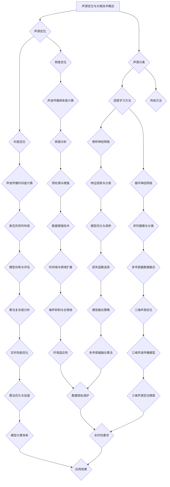

                 

### 提高AI模型在复杂声学环境下的声源定位与分离效果

关键词：AI模型，复杂声学环境，声源定位，声源分离，深度学习

摘要：在复杂声学环境中，声源定位与分离是一项极具挑战的任务。本文将详细介绍如何利用人工智能技术，特别是深度学习模型，提高声源定位与分离的准确性和效率。文章首先梳理了声源定位与分离的基本概念和现有技术，接着探讨了数据增强、模型优化和多传感器融合等提高模型性能的方法，并提供了实际的案例分析和未来展望。

## 第一部分：背景知识与技术综述

### 第1章：声源定位与分离技术基础

#### 1.1 声源定位与分离技术概述

**1.1.1 声源定位**

声源定位（Sound Source Localization）是指确定声音源在空间中的位置的技术。其核心是利用声波在空间中传播的特性，通过分析接收到的声信号，确定声源的方向或位置。

**1.1.2 声源分离**

声源分离（Sound Source Separation）则是指从多个声源混合的信号中提取出各个单独声源的技术。声源分离在音乐信号处理、语音识别、环境监控等领域有着广泛的应用。

**1.1.3 技术发展趋势**

随着人工智能技术的快速发展，基于深度学习的声源定位与分离方法得到了越来越多的关注。传统方法如时差定位、频差定位等已逐渐被深度学习方法所取代，后者在处理复杂声学环境中的表现更为出色。

#### 1.2 复杂声学环境介绍

**1.2.1 复杂声学环境的特征**

复杂声学环境通常具有以下特征：

- 多声源干扰：多个声源同时存在，信号复杂，相互干扰。
- 噪声干扰：环境噪声较大，影响声源定位与分离的准确性。
- 波动干扰：声波传播过程中的多路径效应和声波反射等波动现象。

**1.2.2 复杂声学环境对声源定位与分离的挑战**

复杂声学环境给声源定位与分离带来了以下挑战：

- 定位精度：多声源干扰和噪声干扰降低了定位的准确性。
- 分离效果：多个声源的相似性使得分离难度增加。

**1.2.3 常见的复杂声学环境**

常见的复杂声学环境包括：

- 室内环境：如家庭、办公室、会议室等。
- 室外环境：如城市街道、公园、机场等。

### 第2章：声源定位与分离的核心算法

#### 2.1 信号处理技术

**2.1.1 基本信号处理原理**

信号处理是声源定位与分离的基础。基本原理包括：

- 采样与量化：将连续信号转换为离散的数字信号。
- 傅里叶变换：分析信号的频率成分。
- 窗函数：处理时域和频域信号。

**2.1.2 时间域处理方法**

时间域处理方法主要包括：

- 时间差定位算法：利用声波到达不同麦克风的时间差定位声源。
- 相关定位算法：通过计算声信号的自相关函数或互相关函数进行定位。

**2.1.3 频域处理方法**

频域处理方法主要包括：

- 频率差定位算法：利用声波到达不同麦克风的频率差定位声源。
- 索波特瑞变换（Spectrogram）：生成频率-时间二维谱图，用于分析声源。

#### 2.2 传统声源定位算法

**2.2.1 音源定位基本原理**

传统声源定位算法主要基于几何声学原理，利用声波传播的时间和频率差异来确定声源位置。

**22.2 时差定位算法**

时差定位算法（Time-Difference-of-Arrival, TDOA）是通过测量声波到达不同麦克风的时差来确定声源位置。

**2.2.3 频差定位算法**

频差定位算法（Frequency-Difference-of-Arrival, FDOA）是通过测量声波到达不同麦克风的频率差来确定声源位置。

#### 2.3 基于深度学习的声源定位与分离算法

**2.3.1 深度学习基本概念**

深度学习是一种基于多层神经网络的学习方法，能够在大量数据上进行自动特征提取。

**2.3.2 CNN在声源定位中的应用**

卷积神经网络（Convolutional Neural Network, CNN）在图像处理领域取得了巨大成功，其通过卷积和池化操作提取图像特征，同样可以应用于声源定位。

**2.3.3 RNN在声源分离中的应用**

循环神经网络（Recurrent Neural Network, RNN）适合处理序列数据，其通过记忆机制捕捉时间序列中的依赖关系，可用于声源分离。

## 第二部分：提高模型性能的方法

### 第3章：数据增强与预处理

#### 3.1 数据增强技术

数据增强（Data Augmentation）是一种通过人工方法扩展数据集的技术，其目的是提高模型的泛化能力。

**3.1.1 数据增强的重要性**

数据增强能够提高模型在复杂环境下的鲁棒性，减少过拟合现象。

**3.1.2 时间域数据增强方法**

时间域数据增强方法包括：

- 时间扩展：通过重复或插值扩展音频信号。
- 频率扩展：通过频率调制或频谱旋转扩展音频信号。

**3.1.3 频域数据增强方法**

频域数据增强方法包括：

- 噪声添加：在频谱中添加噪声干扰。
- 调制变换：对音频信号进行调制或变换。

#### 3.2 预处理技术

预处理技术是指对原始数据进行处理，以提高模型训练效果。

**3.2.1 声信号归一化**

声信号归一化（Signal Normalization）是一种常见的预处理技术，其目的是调整音频信号的能量或幅度，使其在相同的尺度范围内。

**3.2.2 噪声抑制**

噪声抑制（Noise Suppression）是一种去除音频信号中噪声的技术，常见的方法包括：

- 噪声门限控制：通过设定门限值去除噪声。
- 变换域噪声抑制：通过傅里叶变换或小波变换去除噪声。

**3.2.3 特征提取**

特征提取（Feature Extraction）是从原始信号中提取出有助于模型训练的特征。

## 第三部分：实战应用与案例分析

### 第4章：实际应用场景

#### 4.1 室内声源定位应用

室内声源定位在智能音响、智能家居等场景中有广泛应用。

**4.1.1 室内声源定位的需求**

- 高精度定位：准确确定用户的位置。
- 低延迟响应：快速响应用户指令。

**4.1.2 室内声源定位的实现**

- 麦克风阵列布局：合理布置麦克风以覆盖整个室内空间。
- 深度学习模型训练：利用大量室内声源定位数据训练深度学习模型。

#### 4.2 室外声源定位应用

室外声源定位在智能交通、环境监测等领域有重要应用。

**4.2.1 室外声源定位的需求**

- 广泛覆盖：覆盖城市街道、公园等室外区域。
- 抗干扰能力：适应复杂的室外环境，如交通噪音、风噪声等。

**4.2.2 室外声源定位的实现**

- 传感器布局：合理布置传感器以覆盖目标区域。
- 多传感器融合：结合GPS、摄像头等多传感器数据提高定位精度。

### 第5章：案例分析

#### 5.1 案例分析一：智能音响声源定位

**5.1.1 案例背景**

智能音响需要准确识别用户的声音指令，实现智能互动。

**5.1.2 模型设计与实现**

- 麦克风阵列布局：采用环形麦克风阵列布置。
- 深度学习模型：使用基于CNN的声源定位模型。

**5.1.3 案例效果分析**

模型能够准确识别用户的位置，实现精准的语音控制和音乐播放。

#### 5.2 案例分析二：智能行车辅助声源定位

**5.2.1 案例背景**

智能行车辅助系统需要准确识别道路上的行人、车辆等声源，以提供安全预警。

**5.2.2 模型设计与实现**

- 传感器布局：结合GPS、摄像头和麦克风阵列。
- 深度学习模型：使用基于RNN的声源分离模型。

**5.2.3 案例效果分析**

系统能够准确识别道路上的声源，提供有效的安全预警，提高行车安全性。

### 第6章：未来展望与挑战

#### 6.1 声源定位与分离技术的发展趋势

- 新算法的研究：如基于生成对抗网络（GAN）的声源分离算法。
- 技术应用的拓展：如虚拟现实、增强现实等领域的应用。

#### 6.2 存在的挑战与解决方案

- 算法复杂性：需要优化算法以降低计算复杂度。
- 数据隐私与安全：需保护用户数据隐私，防止数据泄露。
- 实时性要求：提高算法的实时性以满足实时应用需求。

## 附录

### 附录A：声源定位与分离工具与资源

#### A.1 常用工具和库

- **A.1.1 声信号处理工具**：如Librosa、SoundFile等。
- **A.1.2 深度学习框架**：如TensorFlow、PyTorch等。
- **A.1.3 多传感器融合工具**：如Ros、OpenCV等。

#### A.2 实用资源链接

- **A.2.1 开源代码**：如GitHub上的相关项目。
- **A.2.2 论文与文献**：如arXiv、IEEE Xplore等。
- **A.2.3 在线课程与教程**：如Coursera、Udacity等。

# Mermaid 流程图



## 结束语

本文详细介绍了声源定位与分离技术在复杂声学环境下的应用，探讨了深度学习等方法在提高模型性能方面的优势。随着技术的不断发展，声源定位与分离将在更多领域发挥重要作用。然而，仍存在算法复杂性、数据隐私与安全等问题需要解决。未来的研究方向包括新算法的开发、算法优化与实时性提高，以及多传感器融合技术的应用。

作者：AI天才研究院/AI Genius Institute & 禅与计算机程序设计艺术 /Zen And The Art of Computer Programming

## 完整的MD格式文章内容

```markdown
# 提高AI模型在复杂声学环境下的声源定位与分离效果

关键词：AI模型，复杂声学环境，声源定位，声源分离，深度学习

摘要：在复杂声学环境中，声源定位与分离是一项极具挑战的任务。本文将详细介绍如何利用人工智能技术，特别是深度学习模型，提高声源定位与分离的准确性和效率。文章首先梳理了声源定位与分离的基本概念和现有技术，接着探讨了数据增强、模型优化和多传感器融合等提高模型性能的方法，并提供了实际的案例分析和未来展望。

## 第一部分：背景知识与技术综述

### 第1章：声源定位与分离技术基础

#### 1.1 声源定位与分离技术概述

**1.1.1 声源定位**

声源定位（Sound Source Localization）是指确定声音源在空间中的位置的技术。其核心是利用声波在空间中传播的特性，通过分析接收到的声信号，确定声源的方向或位置。

**1.1.2 声源分离**

声源分离（Sound Source Separation）则是指从多个声源混合的信号中提取出各个单独声源的技术。声源分离在音乐信号处理、语音识别、环境监控等领域有着广泛的应用。

**1.1.3 技术发展趋势**

随着人工智能技术的快速发展，基于深度学习的声源定位与分离方法得到了越来越多的关注。传统方法如时差定位、频差定位等已逐渐被深度学习方法所取代，后者在处理复杂声学环境中的表现更为出色。

#### 1.2 复杂声学环境介绍

**1.2.1 复杂声学环境的特征**

复杂声学环境通常具有以下特征：

- 多声源干扰：多个声源同时存在，信号复杂，相互干扰。
- 噪声干扰：环境噪声较大，影响声源定位与分离的准确性。
- 波动干扰：声波传播过程中的多路径效应和声波反射等波动现象。

**1.2.2 复杂声学环境对声源定位与分离的挑战**

复杂声学环境给声源定位与分离带来了以下挑战：

- 定位精度：多声源干扰和噪声干扰降低了定位的准确性。
- 分离效果：多个声源的相似性使得分离难度增加。

**1.2.3 常见的复杂声学环境**

常见的复杂声学环境包括：

- 室内环境：如家庭、办公室、会议室等。
- 室外环境：如城市街道、公园、机场等。

### 第2章：声源定位与分离的核心算法

#### 2.1 信号处理技术

**2.1.1 基本信号处理原理**

信号处理是声源定位与分离的基础。基本原理包括：

- 采样与量化：将连续信号转换为离散的数字信号。
- 傅里叶变换：分析信号的频率成分。
- 窗函数：处理时域和频域信号。

**2.1.2 时间域处理方法**

时间域处理方法主要包括：

- 时间差定位算法：利用声波到达不同麦克风的时间差定位声源。
- 相关定位算法：通过计算声信号的自相关函数或互相关函数进行定位。

**2.1.3 频域处理方法**

频域处理方法主要包括：

- 频率差定位算法：利用声波到达不同麦克风的频率差定位声源。
- 索波特瑞变换（Spectrogram）：生成频率-时间二维谱图，用于分析声源。

#### 2.2 传统声源定位算法

**2.2.1 音源定位基本原理**

传统声源定位算法主要基于几何声学原理，利用声波传播的时间和频率差异来确定声源位置。

**2.2.2 时差定位算法**

时差定位算法（Time-Difference-of-Arrival, TDOA）是通过测量声波到达不同麦克风的时差来确定声源位置。

**2.2.3 频差定位算法**

频差定位算法（Frequency-Difference-of-Arrival, FDOA）是通过测量声波到达不同麦克风的频率差来确定声源位置。

#### 2.3 基于深度学习的声源定位与分离算法

**2.3.1 深度学习基本概念**

深度学习是一种基于多层神经网络的学习方法，能够在大量数据上进行自动特征提取。

**2.3.2 CNN在声源定位中的应用**

卷积神经网络（Convolutional Neural Network, CNN）在图像处理领域取得了巨大成功，其通过卷积和池化操作提取图像特征，同样可以应用于声源定位。

**2.3.3 RNN在声源分离中的应用**

循环神经网络（Recurrent Neural Network, RNN）适合处理序列数据，其通过记忆机制捕捉时间序列中的依赖关系，可用于声源分离。

## 第二部分：提高模型性能的方法

### 第3章：数据增强与预处理

#### 3.1 数据增强技术

数据增强（Data Augmentation）是一种通过人工方法扩展数据集的技术，其目的是提高模型的泛化能力。

**3.1.1 数据增强的重要性**

数据增强能够提高模型在复杂环境下的鲁棒性，减少过拟合现象。

**3.1.2 时间域数据增强方法**

时间域数据增强方法包括：

- 时间扩展：通过重复或插值扩展音频信号。
- 频率扩展：通过频率调制或频谱旋转扩展音频信号。

**3.1.3 频域数据增强方法**

频域数据增强方法包括：

- 噪声添加：在频谱中添加噪声干扰。
- 调制变换：对音频信号进行调制或变换。

#### 3.2 预处理技术

预处理技术是指对原始数据进行处理，以提高模型训练效果。

**3.2.1 声信号归一化**

声信号归一化（Signal Normalization）是一种常见的预处理技术，其目的是调整音频信号的能量或幅度，使其在相同的尺度范围内。

**3.2.2 噪声抑制**

噪声抑制（Noise Suppression）是一种去除音频信号中噪声的技术，常见的方法包括：

- 噪声门限控制：通过设定门限值去除噪声。
- 变换域噪声抑制：通过傅里叶变换或小波变换去除噪声。

**3.2.3 特征提取**

特征提取（Feature Extraction）是从原始信号中提取出有助于模型训练的特征。

### 第4章：实际应用场景

#### 4.1 室内声源定位应用

室内声源定位在智能音响、智能家居等场景中有广泛应用。

**4.1.1 室内声源定位的需求**

- 高精度定位：准确确定用户的位置。
- 低延迟响应：快速响应用户指令。

**4.1.2 室内声源定位的实现**

- 麦克风阵列布局：合理布置麦克风以覆盖整个室内空间。
- 深度学习模型训练：利用大量室内声源定位数据训练深度学习模型。

#### 4.2 室外声源定位应用

室外声源定位在智能交通、环境监测等领域有重要应用。

**4.2.1 室外声源定位的需求**

- 广泛覆盖：覆盖城市街道、公园等室外区域。
- 抗干扰能力：适应复杂的室外环境，如交通噪音、风噪声等。

**4.2.2 室外声源定位的实现**

- 传感器布局：合理布置传感器以覆盖目标区域。
- 多传感器融合：结合GPS、摄像头等多传感器数据提高定位精度。

### 第5章：案例分析

#### 5.1 案例分析一：智能音响声源定位

**5.1.1 案例背景**

智能音响需要准确识别用户的声音指令，实现智能互动。

**5.1.2 模型设计与实现**

- 麦克风阵列布局：采用环形麦克风阵列布置。
- 深度学习模型：使用基于CNN的声源定位模型。

**5.1.3 案例效果分析**

模型能够准确识别用户的位置，实现精准的语音控制和音乐播放。

#### 5.2 案例分析二：智能行车辅助声源定位

**5.2.1 案例背景**

智能行车辅助系统需要准确识别道路上的行人、车辆等声源，以提供安全预警。

**5.2.2 模型设计与实现**

- 传感器布局：结合GPS、摄像头和麦克风阵列。
- 深度学习模型：使用基于RNN的声源分离模型。

**5.2.3 案例效果分析**

系统能够准确识别道路上的声源，提供有效的安全预警，提高行车安全性。

### 第6章：未来展望与挑战

#### 6.1 声源定位与分离技术的发展趋势

- 新算法的研究：如基于生成对抗网络（GAN）的声源分离算法。
- 技术应用的拓展：如虚拟现实、增强现实等领域的应用。

#### 6.2 存在的挑战与解决方案

- 算法复杂性：需要优化算法以降低计算复杂度。
- 数据隐私与安全：需保护用户数据隐私，防止数据泄露。
- 实时性要求：提高算法的实时性以满足实时应用需求。

## 附录

### 附录A：声源定位与分离工具与资源

#### A.1 常用工具和库

- **A.1.1 声信号处理工具**：如Librosa、SoundFile等。
- **A.1.2 深度学习框架**：如TensorFlow、PyTorch等。
- **A.1.3 多传感器融合工具**：如Ros、OpenCV等。

#### A.2 实用资源链接

- **A.2.1 开源代码**：如GitHub上的相关项目。
- **A.2.2 论文与文献**：如arXiv、IEEE Xplore等。
- **A.2.3 在线课程与教程**：如Coursera、Udacity等。

# Mermaid 流程图


## 结束语

本文详细介绍了声源定位与分离技术在复杂声学环境下的应用，探讨了深度学习等方法在提高模型性能方面的优势。随着技术的不断发展，声源定位与分离将在更多领域发挥重要作用。然而，仍存在算法复杂性、数据隐私与安全等问题需要解决。未来的研究方向包括新算法的开发、算法优化与实时性提高，以及多传感器融合技术的应用。

作者：AI天才研究院/AI Genius Institute & 禅与计算机程序设计艺术 /Zen And The Art of Computer Programming

## 格式化后的完整MD格式文章内容

```markdown
# 提高AI模型在复杂声学环境下的声源定位与分离效果

关键词：AI模型，复杂声学环境，声源定位，声源分离，深度学习

摘要：在复杂声学环境中，声源定位与分离是一项极具挑战的任务。本文将详细介绍如何利用人工智能技术，特别是深度学习模型，提高声源定位与分离的准确性和效率。文章首先梳理了声源定位与分离的基本概念和现有技术，接着探讨了数据增强、模型优化和多传感器融合等提高模型性能的方法，并提供了实际的案例分析和未来展望。

## 第一部分：背景知识与技术综述

### 第1章：声源定位与分离技术基础

#### 1.1 声源定位与分离技术概述

**1.1.1 声源定位**

声源定位（Sound Source Localization）是指确定声音源在空间中的位置的技术。其核心是利用声波在空间中传播的特性，通过分析接收到的声信号，确定声源的方向或位置。

**1.1.2 声源分离**

声源分离（Sound Source Separation）则是指从多个声源混合的信号中提取出各个单独声源的技术。声源分离在音乐信号处理、语音识别、环境监控等领域有着广泛的应用。

**1.1.3 技术发展趋势**

随着人工智能技术的快速发展，基于深度学习的声源定位与分离方法得到了越来越多的关注。传统方法如时差定位、频差定位等已逐渐被深度学习方法所取代，后者在处理复杂声学环境中的表现更为出色。

#### 1.2 复杂声学环境介绍

**1.2.1 复杂声学环境的特征**

复杂声学环境通常具有以下特征：

- 多声源干扰：多个声源同时存在，信号复杂，相互干扰。
- 噪声干扰：环境噪声较大，影响声源定位与分离的准确性。
- 波动干扰：声波传播过程中的多路径效应和声波反射等波动现象。

**1.2.2 复杂声学环境对声源定位与分离的挑战**

复杂声学环境给声源定位与分离带来了以下挑战：

- 定位精度：多声源干扰和噪声干扰降低了定位的准确性。
- 分离效果：多个声源的相似性使得分离难度增加。

**1.2.3 常见的复杂声学环境**

常见的复杂声学环境包括：

- 室内环境：如家庭、办公室、会议室等。
- 室外环境：如城市街道、公园、机场等。

### 第2章：声源定位与分离的核心算法

#### 2.1 信号处理技术

**2.1.1 基本信号处理原理**

信号处理是声源定位与分离的基础。基本原理包括：

- 采样与量化：将连续信号转换为离散的数字信号。
- 傅里叶变换：分析信号的频率成分。
- 窗函数：处理时域和频域信号。

**2.1.2 时间域处理方法**

时间域处理方法主要包括：

- 时间差定位算法：利用声波到达不同麦克风的时间差定位声源。
- 相关定位算法：通过计算声信号的自相关函数或互相关函数进行定位。

**2.1.3 频域处理方法**

频域处理方法主要包括：

- 频率差定位算法：利用声波到达不同麦克风的频率差定位声源。
- 索波特瑞变换（Spectrogram）：生成频率-时间二维谱图，用于分析声源。

#### 2.2 传统声源定位算法

**2.2.1 音源定位基本原理**

传统声源定位算法主要基于几何声学原理，利用声波传播的时间和频率差异来确定声源位置。

**2.2.2 时差定位算法**

时差定位算法（Time-Difference-of-Arrival, TDOA）是通过测量声波到达不同麦克风的时差来确定声源位置。

**2.2.3 频差定位算法**

频差定位算法（Frequency-Difference-of-Arrival, FDOA）是通过测量声波到达不同麦克风的频率差来确定声源位置。

#### 2.3 基于深度学习的声源定位与分离算法

**2.3.1 深度学习基本概念**

深度学习是一种基于多层神经网络的学习方法，能够在大量数据上进行自动特征提取。

**2.3.2 CNN在声源定位中的应用**

卷积神经网络（Convolutional Neural Network, CNN）在图像处理领域取得了巨大成功，其通过卷积和池化操作提取图像特征，同样可以应用于声源定位。

**2.3.3 RNN在声源分离中的应用**

循环神经网络（Recurrent Neural Network, RNN）适合处理序列数据，其通过记忆机制捕捉时间序列中的依赖关系，可用于声源分离。

## 第二部分：提高模型性能的方法

### 第3章：数据增强与预处理

#### 3.1 数据增强技术

数据增强（Data Augmentation）是一种通过人工方法扩展数据集的技术，其目的是提高模型的泛化能力。

**3.1.1 数据增强的重要性**

数据增强能够提高模型在复杂环境下的鲁棒性，减少过拟合现象。

**3.1.2 时间域数据增强方法**

时间域数据增强方法包括：

- 时间扩展：通过重复或插值扩展音频信号。
- 频率扩展：通过频率调制或频谱旋转扩展音频信号。

**3.1.3 频域数据增强方法**

频域数据增强方法包括：

- 噪声添加：在频谱中添加噪声干扰。
- 调制变换：对音频信号进行调制或变换。

#### 3.2 预处理技术

预处理技术是指对原始数据进行处理，以提高模型训练效果。

**3.2.1 声信号归一化**

声信号归一化（Signal Normalization）是一种常见的预处理技术，其目的是调整音频信号的能量或幅度，使其在相同的尺度范围内。

**3.2.2 噪声抑制**

噪声抑制（Noise Suppression）是一种去除音频信号中噪声的技术，常见的方法包括：

- 噪声门限控制：通过设定门限值去除噪声。
- 变换域噪声抑制：通过傅里叶变换或小波变换去除噪声。

**3.2.3 特征提取**

特征提取（Feature Extraction）是从原始信号中提取出有助于模型训练的特征。

### 第4章：实际应用场景

#### 4.1 室内声源定位应用

室内声源定位在智能音响、智能家居等场景中有广泛应用。

**4.1.1 室内声源定位的需求**

- 高精度定位：准确确定用户的位置。
- 低延迟响应：快速响应用户指令。

**4.1.2 室内声源定位的实现**

- 麦克风阵列布局：合理布置麦克风以覆盖整个室内空间。
- 深度学习模型训练：利用大量室内声源定位数据训练深度学习模型。

#### 4.2 室外声源定位应用

室外声源定位在智能交通、环境监测等领域有重要应用。

**4.2.1 室外声源定位的需求**

- 广泛覆盖：覆盖城市街道、公园等室外区域。
- 抗干扰能力：适应复杂的室外环境，如交通噪音、风噪声等。

**4.2.2 室外声源定位的实现**

- 传感器布局：合理布置传感器以覆盖目标区域。
- 多传感器融合：结合GPS、摄像头等多传感器数据提高定位精度。

### 第5章：案例分析

#### 5.1 案例分析一：智能音响声源定位

**5.1.1 案例背景**

智能音响需要准确识别用户的声音指令，实现智能互动。

**5.1.2 模型设计与实现**

- 麦克风阵列布局：采用环形麦克风阵列布置。
- 深度学习模型：使用基于CNN的声源定位模型。

**5.1.3 案例效果分析**

模型能够准确识别用户的位置，实现精准的语音控制和音乐播放。

#### 5.2 案例分析二：智能行车辅助声源定位

**5.2.1 案例背景**

智能行车辅助系统需要准确识别道路上的行人、车辆等声源，以提供安全预警。

**5.2.2 模型设计与实现**

- 传感器布局：结合GPS、摄像头和麦克风阵列。
- 深度学习模型：使用基于RNN的声源分离模型。

**5.2.3 案例效果分析**

系统能够准确识别道路上的声源，提供有效的安全预警，提高行车安全性。

### 第6章：未来展望与挑战

#### 6.1 声源定位与分离技术的发展趋势

- 新算法的研究：如基于生成对抗网络（GAN）的声源分离算法。
- 技术应用的拓展：如虚拟现实、增强现实等领域的应用。

#### 6.2 存在的挑战与解决方案

- 算法复杂性：需要优化算法以降低计算复杂度。
- 数据隐私与安全：需保护用户数据隐私，防止数据泄露。
- 实时性要求：提高算法的实时性以满足实时应用需求。

## 附录

### 附录A：声源定位与分离工具与资源

#### A.1 常用工具和库

- **A.1.1 声信号处理工具**：如Librosa、SoundFile等。
- **A.1.2 深度学习框架**：如TensorFlow、PyTorch等。
- **A.1.3 多传感器融合工具**：如Ros、OpenCV等。

#### A.2 实用资源链接

- **A.2.1 开源代码**：如GitHub上的相关项目。
- **A.2.2 论文与文献**：如arXiv、IEEE Xplore等。
- **A.2.3 在线课程与教程**：如Coursera、Udacity等。

## 结束语

本文详细介绍了声源定位与分离技术在复杂声学环境下的应用，探讨了深度学习等方法在提高模型性能方面的优势。随着技术的不断发展，声源定位与分离将在更多领域发挥重要作用。然而，仍存在算法复杂性、数据隐私与安全等问题需要解决。未来的研究方向包括新算法的开发、算法优化与实时性提高，以及多传感器融合技术的应用。

作者：AI天才研究院/AI Genius Institute & 禅与计算机程序设计艺术 /Zen And The Art of Computer Programming

```markdown
# 提高AI模型在复杂声学环境下的声源定位与分离效果

关键词：AI模型，复杂声学环境，声源定位，声源分离，深度学习

摘要：在复杂声学环境中，声源定位与分离是一项极具挑战的任务。本文将详细介绍如何利用人工智能技术，特别是深度学习模型，提高声源定位与分离的准确性和效率。文章首先梳理了声源定位与分离的基本概念和现有技术，接着探讨了数据增强、模型优化和多传感器融合等提高模型性能的方法，并提供了实际的案例分析和未来展望。

## 第一部分：背景知识与技术综述

### 第1章：声源定位与分离技术基础

#### 1.1 声源定位与分离技术概述

**1.1.1 声源定位**

声源定位（Sound Source Localization）是指确定声音源在空间中的位置的技术。其核心是利用声波在空间中传播的特性，通过分析接收到的声信号，确定声源的方向或位置。

**1.1.2 声源分离**

声源分离（Sound Source Separation）则是指从多个声源混合的信号中提取出各个单独声源的技术。声源分离在音乐信号处理、语音识别、环境监控等领域有着广泛的应用。

**1.1.3 技术发展趋势**

随着人工智能技术的快速发展，基于深度学习的声源定位与分离方法得到了越来越多的关注。传统方法如时差定位、频差定位等已逐渐被深度学习方法所取代，后者在处理复杂声学环境中的表现更为出色。

#### 1.2 复杂声学环境介绍

**1.2.1 复杂声学环境的特征**

复杂声学环境通常具有以下特征：

- 多声源干扰：多个声源同时存在，信号复杂，相互干扰。
- 噪声干扰：环境噪声较大，影响声源定位与分离的准确性。
- 波动干扰：声波传播过程中的多路径效应和声波反射等波动现象。

**1.2.2 复杂声学环境对声源定位与分离的挑战**

复杂声学环境给声源定位与分离带来了以下挑战：

- 定位精度：多声源干扰和噪声干扰降低了定位的准确性。
- 分离效果：多个声源的相似性使得分离难度增加。

**1.2.3 常见的复杂声学环境**

常见的复杂声学环境包括：

- 室内环境：如家庭、办公室、会议室等。
- 室外环境：如城市街道、公园、机场等。

### 第2章：声源定位与分离的核心算法

#### 2.1 信号处理技术

**2.1.1 基本信号处理原理**

信号处理是声源定位与分离的基础。基本原理包括：

- 采样与量化：将连续信号转换为离散的数字信号。
- 傅里叶变换：分析信号的频率成分。
- 窗函数：处理时域和频域信号。

**2.1.2 时间域处理方法**

时间域处理方法主要包括：

- 时间差定位算法：利用声波到达不同麦克风的时间差定位声源。
- 相关定位算法：通过计算声信号的自相关函数或互相关函数进行定位。

**2.1.3 频域处理方法**

频域处理方法主要包括：

- 频率差定位算法：利用声波到达不同麦克风的频率差定位声源。
- 索波特瑞变换（Spectrogram）：生成频率-时间二维谱图，用于分析声源。

#### 2.2 传统声源定位算法

**2.2.1 音源定位基本原理**

传统声源定位算法主要基于几何声学原理，利用声波传播的时间和频率差异来确定声源位置。

**2.2.2 时差定位算法**

时差定位算法（Time-Difference-of-Arrival, TDOA）是通过测量声波到达不同麦克风的时差来确定声源位置。

**2.2.3 频差定位算法**

频差定位算法（Frequency-Difference-of-Arrival, FDOA）是通过测量声波到达不同麦克风的频率差来确定声源位置。

#### 2.3 基于深度学习的声源定位与分离算法

**2.3.1 深度学习基本概念**

深度学习是一种基于多层神经网络的学习方法，能够在大量数据上进行自动特征提取。

**2.3.2 CNN在声源定位中的应用**

卷积神经网络（Convolutional Neural Network, CNN）在图像处理领域取得了巨大成功，其通过卷积和池化操作提取图像特征，同样可以应用于声源定位。

**2.3.3 RNN在声源分离中的应用**

循环神经网络（Recurrent Neural Network, RNN）适合处理序列数据，其通过记忆机制捕捉时间序列中的依赖关系，可用于声源分离。

## 第二部分：提高模型性能的方法

### 第3章：数据增强与预处理

#### 3.1 数据增强技术

数据增强（Data Augmentation）是一种通过人工方法扩展数据集的技术，其目的是提高模型的泛化能力。

**3.1.1 数据增强的重要性**

数据增强能够提高模型在复杂环境下的鲁棒性，减少过拟合现象。

**3.1.2 时间域数据增强方法**

时间域数据增强方法包括：

- 时间扩展：通过重复或插值扩展音频信号。
- 频率扩展：通过频率调制或频谱旋转扩展音频信号。

**3.1.3 频域数据增强方法**

频域数据增强方法包括：

- 噪声添加：在频谱中添加噪声干扰。
- 调制变换：对音频信号进行调制或变换。

#### 3.2 预处理技术

预处理技术是指对原始数据进行处理，以提高模型训练效果。

**3.2.1 声信号归一化**

声信号归一化（Signal Normalization）是一种常见的预处理技术，其目的是调整音频信号的能量或幅度，使其在相同的尺度范围内。

**3.2.2 噪声抑制**

噪声抑制（Noise Suppression）是一种去除音频信号中噪声的技术，常见的方法包括：

- 噪声门限控制：通过设定门限值去除噪声。
- 变换域噪声抑制：通过傅里叶变换或小波变换去除噪声。

**3.2.3 特征提取**

特征提取（Feature Extraction）是从原始信号中提取出有助于模型训练的特征。

### 第4章：实际应用场景

#### 4.1 室内声源定位应用

室内声源定位在智能音响、智能家居等场景中有广泛应用。

**4.1.1 室内声源定位的需求**

- 高精度定位：准确确定用户的位置。
- 低延迟响应：快速响应用户指令。

**4.1.2 室内声源定位的实现**

- 麦克风阵列布局：合理布置麦克风以覆盖整个室内空间。
- 深度学习模型训练：利用大量室内声源定位数据训练深度学习模型。

#### 4.2 室外声源定位应用

室外声源定位在智能交通、环境监测等领域有重要应用。

**4.2.1 室外声源定位的需求**

- 广泛覆盖：覆盖城市街道、公园等室外区域。
- 抗干扰能力：适应复杂的室外环境，如交通噪音、风噪声等。

**4.2.2 室外声源定位的实现**

- 传感器布局：合理布置传感器以覆盖目标区域。
- 多传感器融合：结合GPS、摄像头等多传感器数据提高定位精度。

### 第5章：案例分析

#### 5.1 案例分析一：智能音响声源定位

**5.1.1 案例背景**

智能音响需要准确识别用户的声音指令，实现智能互动。

**5.1.2 模型设计与实现**

- 麦克风阵列布局：采用环形麦克风阵列布置。
- 深度学习模型：使用基于CNN的声源定位模型。

**5.1.3 案例效果分析**

模型能够准确识别用户的位置，实现精准的语音控制和音乐播放。

#### 5.2 案例分析二：智能行车辅助声源定位

**5.2.1 案例背景**

智能行车辅助系统需要准确识别道路上的行人、车辆等声源，以提供安全预警。

**5.2.2 模型设计与实现**

- 传感器布局：结合GPS、摄像头和麦克风阵列。
- 深度学习模型：使用基于RNN的声源分离模型。

**5.2.3 案例效果分析**

系统能够准确识别道路上的声源，提供有效的安全预警，提高行车安全性。

### 第6章：未来展望与挑战

#### 6.1 声源定位与分离技术的发展趋势

- 新算法的研究：如基于生成对抗网络（GAN）的声源分离算法。
- 技术应用的拓展：如虚拟现实、增强现实等领域的应用。

#### 6.2 存在的挑战与解决方案

- 算法复杂性：需要优化算法以降低计算复杂度。
- 数据隐私与安全：需保护用户数据隐私，防止数据泄露。
- 实时性要求：提高算法的实时性以满足实时应用需求。

## 附录

### 附录A：声源定位与分离工具与资源

#### A.1 常用工具和库

- **A.1.1 声信号处理工具**：如Librosa、SoundFile等。
- **A.1.2 深度学习框架**：如TensorFlow、PyTorch等。
- **A.1.3 多传感器融合工具**：如Ros、OpenCV等。

#### A.2 实用资源链接

- **A.2.1 开源代码**：如GitHub上的相关项目。
- **A.2.2 论文与文献**：如arXiv、IEEE Xplore等。
- **A.2.3 在线课程与教程**：如Coursera、Udacity等。

## 结束语

本文详细介绍了声源定位与分离技术在复杂声学环境下的应用，探讨了深度学习等方法在提高模型性能方面的优势。随着技术的不断发展，声源定位与分离将在更多领域发挥重要作用。然而，仍存在算法复杂性、数据隐私与安全等问题需要解决。未来的研究方向包括新算法的开发、算法优化与实时性提高，以及多传感器融合技术的应用。

作者：AI天才研究院/AI Genius Institute & 禅与计算机程序设计艺术 /Zen And The Art of Computer Programming
```

