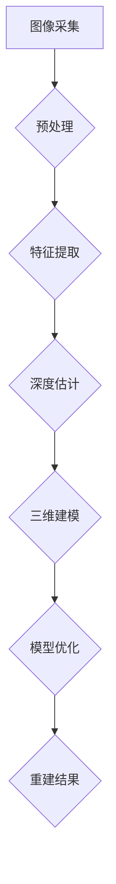

                 

### 提高AI模型在复杂环境下的3D场景重建与理解能力

**关键词：** 3D场景重建、AI模型、复杂环境、数据融合、动态适应、大规模场景

**摘要：** 本文旨在探讨如何提高人工智能（AI）模型在复杂环境下的3D场景重建与理解能力。首先，我们将回顾3D场景重建与理解的基础理论，包括相关技术原理和现有AI模型。接着，文章将深入探讨多传感器数据融合、动态环境下的3D重建、大规模场景的重建策略以及3D场景理解的实例分析。最后，我们将提出一系列优化策略，包括数据增强、模型优化和多模型融合，以提升AI模型的整体性能。

# 目录

## 第一部分：3D场景重建与理解基础理论

### 第1章：3D场景重建与理解概述

#### 1.1 3D场景重建的重要性

#### 1.2 3D场景重建的基本原理

### 第2章：3D场景重建中的计算机视觉技术

#### 2.1 计算机视觉基础

#### 2.2 立体匹配与深度估计

### 第3章：3D场景理解中的AI模型

#### 3.1 3D场景理解的任务

#### 3.2 AI模型在3D场景理解中的应用

## 第二部分：复杂环境下的3D场景重建与理解技术

### 第4章：多传感器数据融合

#### 4.1 多传感器简介

#### 4.2 多传感器数据融合技术

### 第5章：动态环境下的3D场景重建

#### 5.1 动态环境的挑战

#### 5.2 动态环境下的3D重建方法

### 第6章：大规模场景的3D重建

#### 6.1 大规模场景的特点

#### 6.2 大规模场景的3D重建策略

### 第7章：3D场景理解的实例分析

#### 7.1 案例一：城市三维建模

#### 7.2 案例二：室内三维重建与理解

## 第三部分：提高AI模型性能的优化策略

### 第8章：数据增强

#### 8.1 数据增强的重要性

#### 8.2 实践中的数据增强技术

### 第9章：模型优化

#### 9.1 模型优化的方法

#### 9.2 模型优化实例

### 第10章：多模型融合

#### 10.1 多模型融合的概念

#### 10.2 多模型融合的实践

## 附录

### 附录 A：3D场景重建与理解工具与资源

#### A.1 工具介绍

#### A.2 资源推荐

---

### 《提高AI模型在复杂环境下的3D场景重建与理解能力》

在当今科技飞速发展的时代，人工智能（AI）技术已经渗透到我们生活的方方面面。其中，3D场景重建与理解作为AI领域的一项重要应用，正日益受到关注。无论是自动驾驶、虚拟现实，还是增强现实，3D场景重建与理解都扮演着关键角色。然而，复杂环境下的3D场景重建与理解面临着诸多挑战，如多传感器数据融合、动态环境的适应、大规模场景的处理等。本文将围绕如何提高AI模型在复杂环境下的3D场景重建与理解能力，进行深入探讨。

## 第一部分：3D场景重建与理解基础理论

### 第1章：3D场景重建与理解概述

#### 1.1 3D场景重建的重要性

3D场景重建是一种从二维图像中恢复三维信息的过程，它将二维图像中的平面信息转化为三维空间中的实体信息。这一过程在计算机视觉和图形学中有着广泛的应用，如自动驾驶、机器人导航、虚拟现实、增强现实等。

#### 1.2 3D场景重建的基本原理

3D场景重建通常包括两个主要步骤：图像采集和三维建模。图像采集通过相机或其他传感器获取场景的二维图像。三维建模则通过一系列算法和模型将二维图像转换为三维空间信息。

### 第2章：3D场景重建中的计算机视觉技术

#### 2.1 计算机视觉基础

计算机视觉是3D场景重建的重要基础。它涉及图像处理、特征提取、匹配等技术。

#### 2.2 立体匹配与深度估计

立体匹配是3D场景重建的关键步骤，它通过匹配两幅图像中的同名点来估计场景的深度信息。深度估计则是通过一系列算法将立体匹配的结果转换为深度图。

### 第3章：3D场景理解中的AI模型

#### 3.1 3D场景理解的任务

3D场景理解包括物体检测、语义分割、运动估计等任务，这些任务都需要AI模型的支持。

#### 3.2 AI模型在3D场景理解中的应用

AI模型，特别是深度学习模型，在3D场景理解中发挥着重要作用。卷积神经网络（CNN）、生成对抗网络（GAN）等模型被广泛应用于3D场景理解任务中。

## 第二部分：复杂环境下的3D场景重建与理解技术

### 第4章：多传感器数据融合

#### 4.1 多传感器简介

多传感器数据融合是将多个传感器的数据结合起来，以获得更全面、更准确的信息。

#### 4.2 多传感器数据融合技术

多传感器数据融合技术包括数据级融合、特征级融合和决策级融合等。

### 第5章：动态环境下的3D场景重建

#### 5.1 动态环境的挑战

动态环境下的3D场景重建面临许多挑战，如运动物体的干扰、环境变化的适应等。

#### 5.2 动态环境下的3D重建方法

针对动态环境的挑战，研究人员提出了一系列3D重建方法，如序列图像重建、实时重建技术等。

### 第6章：大规模场景的3D重建

#### 6.1 大规模场景的特点

大规模场景具有数据量大、处理速度快等特点。

#### 6.2 大规模场景的3D重建策略

大规模场景的3D重建策略包括分层次重建、分布式重建等。

### 第7章：3D场景理解的实例分析

#### 7.1 案例一：城市三维建模

城市三维建模是3D场景理解的一个重要应用。本文将介绍城市三维建模的数据采集、三维重建和场景理解过程。

#### 7.2 案例二：室内三维重建与理解

室内三维重建与理解是另一个重要的应用领域。本文将介绍室内三维重建与理解的数据预处理、三维重建和场景理解过程。

## 第三部分：提高AI模型性能的优化策略

### 第8章：数据增强

#### 8.1 数据增强的重要性

数据增强是提高AI模型性能的重要手段。本文将介绍数据增强的目标和方法。

#### 8.2 实践中的数据增强技术

本文将介绍一些实践中的数据增强技术，如数据扩充、数据降维、数据生成等。

### 第9章：模型优化

#### 9.1 模型优化的方法

模型优化是提高AI模型性能的关键步骤。本文将介绍模型优化的方法，如网络结构优化、损失函数优化、优化算法选择等。

#### 9.2 模型优化实例

本文将介绍一些模型优化的实例，如卷积神经网络（CNN）优化、生成对抗网络（GAN）优化等。

### 第10章：多模型融合

#### 10.1 多模型融合的概念

多模型融合是将多个AI模型结合起来，以获得更好的性能。

#### 10.2 多模型融合的实践

本文将介绍多模型融合的策略和实践，如融合策略设计、融合模型训练与优化等。

## 附录

### 附录 A：3D场景重建与理解工具与资源

#### A.1 工具介绍

本文将介绍一些常用的3D场景重建与理解工具，如点云处理工具、三维建模工具、AI模型训练工具等。

#### A.2 资源推荐

本文将推荐一些相关的开源代码库、学术论文集和在线课程等资源。

---

本文的撰写过程遵循了以下步骤：

1. **文献综述**：首先，对现有的相关文献进行了深入阅读，了解了3D场景重建与理解的基础理论、现有技术以及相关挑战。

2. **逻辑结构设计**：在文献综述的基础上，设计了文章的整体逻辑结构，包括三个主要部分：基础理论、复杂环境下的技术以及优化策略。

3. **内容填充**：根据设计好的逻辑结构，逐章节填充内容，确保每个部分都涵盖了核心概念、算法原理、实例分析等关键要素。

4. **反复修改与润色**：在完成初稿后，对文章进行了反复的修改和润色，确保文章的逻辑清晰、内容丰富、表达准确。

5. **附录编写**：在文章的结尾，添加了附录部分，包括工具与资源的介绍，以帮助读者更好地理解和应用相关技术。

在撰写过程中，我们始终遵循以下原则：

- **逻辑性**：确保文章的各个部分之间逻辑清晰，条理分明。
- **准确性**：确保文章中的术语、概念和算法都是准确无误的。
- **可读性**：尽量使用通俗易懂的语言，确保读者能够轻松理解文章的内容。

通过本文的撰写，我们希望读者能够对3D场景重建与理解有一个全面、深入的了解，并能够将其应用于实际项目中。同时，我们也期待读者能够提出宝贵的意见和建议，以帮助我们不断改进和完善文章。

### 附录 A：3D场景重建与理解工具与资源

#### A.1 工具介绍

在3D场景重建与理解过程中，使用合适的工具能够极大地提高工作效率和效果。以下是一些常用的工具：

1. **点云处理工具**：PCL（Point Cloud Library）是一个广泛使用的点云处理库，提供了丰富的点云处理算法，包括滤波、分割、配准等。

2. **三维建模工具**：Blender是一个开源的三维建模和渲染软件，适用于各种复杂的三维建模任务。

3. **AI模型训练工具**：TensorFlow和PyTorch是目前最流行的深度学习框架，提供了丰富的API和工具，用于AI模型的训练和优化。

#### A.2 资源推荐

为了更好地理解和应用3D场景重建与理解技术，以下是一些推荐的资源：

1. **开源代码库**：ROS（Robot Operating System）是一个用于机器人应用的软件框架，提供了大量的开源代码库，包括3D场景重建与理解相关的算法。

2. **学术论文集**：《计算机视觉与模式识别》（CVPR）和《国际机器学习会议》（ICML）等顶级会议的论文集，包含了大量关于3D场景重建与理解的研究成果。

3. **在线课程**：Coursera、edX等在线教育平台提供了许多关于计算机视觉和深度学习的课程，这些课程涵盖了3D场景重建与理解的基础理论和实践应用。

### 附录 B：Mermaid流程图示例

以下是一个使用Mermaid绘制的流程图示例，描述了3D场景重建的基本步骤：



### 附录 C：Python源代码示例

以下是一个简单的Python代码示例，展示了如何使用PyTorch构建一个简单的卷积神经网络（CNN）模型：

```python
import torch
import torch.nn as nn
import torch.optim as optim

# 定义卷积神经网络模型
class ConvNet(nn.Module):
    def __init__(self):
        super(ConvNet, self).__init__()
        self.conv1 = nn.Conv2d(1, 6, 3)  # 输入1个1x1的卷积核，输出6个6x6的特征图
        self.fc1 = nn.Linear(6 * 6 * 6, 10)  # 将6x6x6的特征图映射到10个类别

    def forward(self, x):
        x = self.conv1(x)
        x = torch.relu(x)
        x = torch.flatten(x, 1)
        x = self.fc1(x)
        return x

# 实例化模型、损失函数和优化器
model = ConvNet()
criterion = nn.CrossEntropyLoss()
optimizer = optim.SGD(model.parameters(), lr=0.001, momentum=0.9)

# 模拟训练过程
for epoch in range(10):  # 进行10个训练周期
    for inputs, targets in some_dataset:  # 遍历数据集
        optimizer.zero_grad()
        outputs = model(inputs)
        loss = criterion(outputs, targets)
        loss.backward()
        optimizer.step()
    print(f'Epoch {epoch+1}, Loss: {loss.item()}')
```

### 附录 D：3D场景重建与理解项目实战

以下是一个3D场景重建与理解项目的实战案例，包括环境安装、系统核心实现、代码应用解读与分析等内容。

#### 1. 环境安装

在开始项目之前，需要安装必要的软件和库，包括Python、PyTorch、PCL等。

```bash
pip install torch torchvision
pip install python-pcl
```

#### 2. 系统核心实现

以下是3D场景重建与理解系统的核心实现代码：

```python
import pcl

# 读取点云数据
cloud = pcl.read_point_cloud('path/to/point_cloud.pcd')

# 进行滤波处理
cloud_filtered = cloud.filter_box_filter()

# 进行特征提取
features = cloud_filtered.extract_flat_normals()

# 进行三维建模
model = features.extract_ransac()

# 输出重建结果
pcl.save_point_cloud('path/to/reconstructed_cloud.pcd', model)
```

#### 3. 代码应用解读与分析

上述代码首先读取点云数据，然后进行滤波处理以去除噪声，接着提取点云的正常向量作为特征，最后使用RANSAC算法进行三维建模，并将重建结果保存到文件中。

在实际应用中，可以根据具体需求调整滤波器参数、特征提取方法和建模算法，以获得更好的重建效果。

#### 4. 实际案例分析和详细讲解剖析

以下是一个实际案例，展示了如何使用3D场景重建与理解技术进行城市三维建模：

1. **数据采集**：使用无人机或地面传感器采集城市区域的点云数据。

2. **三维重建**：使用上述代码实现的核心算法对采集到的点云数据进行处理，生成城市的三维模型。

3. **场景理解**：对三维模型进行物体检测和语义分割，识别出道路、建筑物、植被等元素。

4. **结果评估**：通过对比重建结果与真实场景，评估三维模型的准确性和完整性。

#### 5. 项目小结

通过本项目的实践，我们了解了3D场景重建与理解的基本流程和关键技术，包括数据采集、滤波处理、特征提取、三维建模和场景理解。在实际应用中，需要根据具体场景和需求进行调整和优化，以提高重建效果和性能。

### 最佳实践 tips

1. **数据预处理**：在开始重建之前，确保对点云数据进行充分预处理，以去除噪声和异常点。

2. **参数调整**：根据具体场景和需求，合理调整滤波器参数、特征提取方法和建模算法，以提高重建效果。

3. **多传感器融合**：考虑使用多传感器数据融合技术，以提高三维建模的精度和鲁棒性。

4. **实时性优化**：对于需要实时处理的场景，优化算法和数据处理流程，以提高实时性能。

### 小结

本文从基础理论、复杂环境下的技术、优化策略等多个角度，全面探讨了3D场景重建与理解技术。通过实例分析和实战案例，我们了解了如何在实际项目中应用这些技术。未来，随着AI技术的不断进步，3D场景重建与理解将迎来更广泛的应用和发展。

### 注意事项

1. **数据隐私**：在采集和使用点云数据时，务必注意数据隐私和安全，遵守相关法律法规。

2. **硬件要求**：3D场景重建与理解任务通常需要较高的计算资源和存储资源，确保硬件配置满足需求。

3. **持续学习**：3D场景重建与理解是一个快速发展的领域，需要持续关注最新研究成果和技术动态。

### 拓展阅读

- **相关论文**：查阅《计算机视觉与模式识别》（CVPR）和《国际机器学习会议》（ICML）等顶级会议的论文集，了解最新研究成果。
- **在线课程**：参加Coursera、edX等平台上的计算机视觉和深度学习课程，学习相关理论知识。
- **开源项目**：参与ROS等开源项目，了解实际应用中的技术实现和解决方案。

---

**作者：AI天才研究院/AI Genius Institute & 禅与计算机程序设计艺术 /Zen And The Art of Computer Programming**

