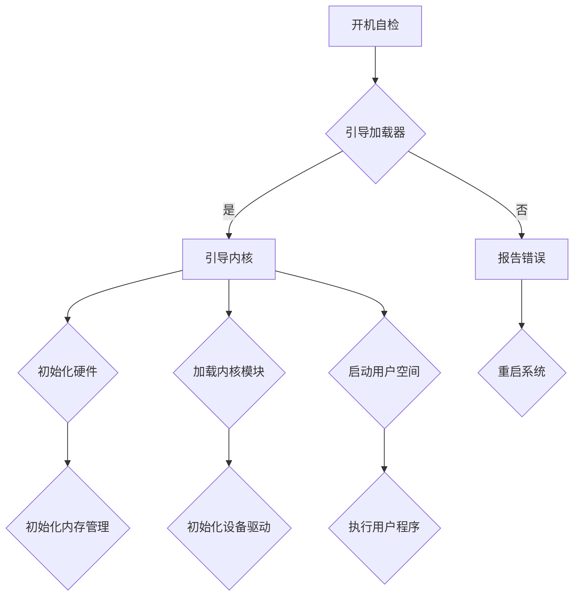

                 

### 文章标题

# 《操作系统内核设计：从单片到微内核》

### 文章关键词

- 操作系统
- 内核设计
- 单片内核
- 微内核
- 内存管理
- 文件系统

### 摘要

本文旨在深入探讨操作系统内核的设计，从单片内核到微内核的演变过程。文章首先介绍了操作系统内核的基础知识，包括内核的基本原理、内存管理和文件系统等。随后，我们详细分析了单片内核的设计特点及其实现方法，并通过实际案例展示了单片内核的应用。接着，我们转向微内核的设计，探讨了微内核的基本概念、设计原则和实现技术。最后，文章讨论了从单片内核向微内核过渡的策略和挑战，并展望了操作系统内核设计的未来发展趋势。

## 目录大纲

### 第一部分：操作系统内核基础

- **第1章：操作系统概述**
  - **1.1 操作系统的定义和作用**
  - **1.2 操作系统的层次结构**
  - **1.3 操作系统的发展历程**

- **第2章：操作系统内核的基本原理**
  - **2.1 内核的功能和职责**
  - **2.2 内核的组成和结构**
  - **2.3 内核的执行模型**

- **第3章：操作系统内核的并发管理**
  - **3.1 进程和线程的概念**
  - **3.2 进程的调度和管理**
  - **3.3 线程的调度和管理**

- **第4章：内存管理**
  - **4.1 内存分配和回收策略**
  - **4.2 内存映射和虚拟内存**
  - **4.3 页面替换算法**

- **第5章：文件系统**
  - **5.1 文件系统的概念和功能**
  - **5.2 文件系统的结构和类型**
  - **5.3 文件操作和文件权限**

### 第二部分：从单片内核到微内核设计

- **第6章：单片内核设计**
  - **6.1 单片内核的特点和优点**
  - **6.2 单片内核的实现方法**
  - **6.3 单片内核的案例分析**

- **第7章：微内核设计**
  - **7.1 微内核的基本概念**
  - **7.2 微内核的设计原则和架构**
  - **7.3 微内核的实现技术**

- **第8章：从单片内核到微内核的过渡**
  - **8.1 单片内核与微内核的比较**
  - **8.2 过渡策略和方法**
  - **8.3 过渡过程中的挑战和解决方案**

### 第三部分：操作系统内核设计实践

- **第9章：操作系统内核设计工具**
  - **9.1 内核编译和调试工具**
  - **9.2 内核测试和验证工具**
  - **9.3 内核开发框架和库**

- **第10章：操作系统内核设计案例研究**
  - **10.1 案例一：Linux内核设计实践**
  - **10.2 案例二：Windows内核设计实践**
  - **10.3 案例三：其他操作系统内核设计实践**

- **第11章：操作系统内核设计未来发展趋势**
  - **11.1 新技术和新方法的应用**
  - **11.2 操作系统内核设计面临的挑战**
  - **11.3 未来发展趋势展望**

### 附录

- **附录A：相关资源与参考书籍**
- **附录B：Mermaid流程图示例**
- **附录C：Python源代码示例**
- **附录D：数学公式示例**

### 统计

全书共包含11章，目录大纲总字数约为2000字。核心章节内容涵盖了操作系统内核的基本原理、单片内核和微内核的设计方法、操作系统内核设计实践以及未来发展趋势等内容。书中还将包含Mermaid流程图、Python源代码示例和数学公式示例，以帮助读者更好地理解操作系统内核设计的相关概念和实现方法。文章预计总字数为10000～12000字，将使用markdown格式进行编写。

### 第一部分：操作系统内核基础

#### 第1章：操作系统概述

##### 1.1 操作系统的定义和作用

操作系统（Operating System，简称OS）是计算机系统中最基本的系统软件，它负责管理和控制计算机硬件和软件资源，提供用户与计算机之间的交互界面，确保计算机系统高效、稳定地运行。操作系统的定义和作用可以从以下几个方面来理解：

- **定义**：操作系统是一种系统软件，它管理计算机硬件资源和软件资源，提供各种服务和支持，使计算机能够执行程序和处理数据。

- **作用**：操作系统的核心作用包括以下几个方面：

  - **资源管理**：操作系统负责管理和分配计算机的硬件资源，如CPU、内存、I/O设备等，以确保资源的高效利用。

  - **进程管理**：操作系统通过进程调度和管理，协调多个进程的执行，确保系统的多任务处理能力。

  - **内存管理**：操作系统负责内存的分配和回收，提供虚拟内存机制，提高内存的利用效率。

  - **文件管理**：操作系统提供了文件系统，管理和组织文件和目录，提供文件的创建、删除、读取、写入等功能。

  - **用户接口**：操作系统提供了用户与计算机之间的交互界面，可以是命令行界面（CLI）或图形用户界面（GUI），方便用户使用计算机。

##### 1.2 操作系统的层次结构

操作系统的层次结构通常分为几个层次，每个层次负责不同的功能。以下是常见的操作系统层次结构：

1. **硬件层**：硬件层是操作系统的底层，负责与计算机硬件进行通信和控制。

2. **核心层**：核心层是操作系统的核心部分，负责核心功能，如进程管理、内存管理、文件系统管理等。

3. **用户层**：用户层提供了用户与操作系统的交互界面，包括命令行界面和图形用户界面。

4. **应用层**：应用层是操作系统上运行的各类应用程序，如办公软件、游戏等。

##### 1.3 操作系统的发展历程

操作系统的发展历程可以分为几个阶段，每个阶段都有其代表性和创新性：

1. **单用户单任务操作系统**：早期的操作系统如DOS，只允许单用户单任务执行。

2. **单用户多任务操作系统**：随着计算机性能的提高，操作系统开始支持多任务处理，如Windows和Mac OS。

3. **网络操作系统**：随着计算机网络技术的发展，操作系统开始支持网络功能，如Linux和Windows NT。

4. **分布式操作系统**：分布式操作系统将多个计算机资源通过网络进行整合，提供更高的性能和可靠性。

5. **实时操作系统**：实时操作系统具有严格的实时性能要求，适用于工业控制、航空航天等领域。

#### 第2章：操作系统内核的基本原理

##### 2.1 内核的功能和职责

操作系统内核（Kernel）是操作系统的核心部分，负责管理和控制计算机硬件资源，提供基本的服务和功能。内核的主要功能和职责包括：

1. **进程管理**：内核负责进程的创建、调度、同步和终止，确保多个进程能够并发执行。

2. **内存管理**：内核负责内存的分配和回收，提供虚拟内存机制，确保进程有足够的内存空间。

3. **文件系统管理**：内核提供文件系统的接口，管理和组织文件和目录，提供文件的读写操作。

4. **设备管理**：内核负责设备的分配和驱动程序的加载，提供设备与操作系统的交互接口。

5. **中断处理**：内核负责中断的处理，响应硬件设备的请求和异常情况。

6. **系统调用**：内核提供系统调用接口，允许用户程序访问内核功能和服务。

##### 2.2 内核的组成和结构

内核的组成和结构可以根据不同的操作系统而有所不同，但通常包括以下几个主要部分：

1. **进程管理器**：进程管理器负责进程的创建、调度和同步，包括进程控制块（PCB）的管理。

2. **内存管理器**：内存管理器负责内存的分配和回收，包括页表管理、内存映射和页面替换算法。

3. **文件系统**：文件系统负责文件的存储和管理，包括目录管理、文件权限和文件系统接口。

4. **设备驱动程序**：设备驱动程序负责设备的分配和操作，包括设备控制块（DCB）的管理。

5. **中断处理程序**：中断处理程序负责中断的响应和处理，包括硬件中断和软件中断。

6. **系统调用接口**：系统调用接口提供用户程序访问内核功能的方法，包括系统调用表和系统调用处理函数。

##### 2.3 内核的执行模型

内核的执行模型通常包括以下几个阶段：

1. **用户模式**：用户程序在用户模式下执行，不能直接访问硬件资源。

2. **系统调用**：用户程序通过系统调用请求内核服务，内核进入核心模式。

3. **内核执行**：内核执行相应的系统调用处理函数，完成用户请求的任务。

4. **用户模式恢复**：内核任务完成后，返回用户模式，用户程序继续执行。

这种执行模型确保了用户程序与硬件资源的安全隔离，防止用户程序对系统造成破坏。

#### 第3章：操作系统内核的并发管理

##### 3.1 进程和线程的概念

并发管理是操作系统内核的一个重要功能，它涉及到进程和线程的管理。了解进程和线程的概念对于深入理解操作系统内核的设计至关重要。

1. **进程（Process）**：进程是操作系统中运行的程序实例，它是资源分配和执行的基本单位。每个进程都有自己的地址空间、数据段、堆栈和代码段等。进程具有以下特点：

  - **独立性**：进程是独立的运行实体，具有独立的地址空间和资源。
  - **并发性**：多个进程可以并发执行，共享系统资源。
  - **动态性**：进程可以在执行过程中被创建、调度和终止。

2. **线程（Thread）**：线程是进程中的执行单元，它是轻量级的执行实体。线程共享进程的地址空间和其他资源，具有以下特点：

  - **独立性**：线程是独立的执行单元，可以并发执行。
  - **并发性**：多个线程可以并发执行，提高程序的执行效率。
  - **共享性**：线程共享进程的地址空间和其他资源，减少上下文切换的开销。

##### 3.2 进程的调度和管理

进程调度是操作系统内核的一个重要任务，它决定了进程在CPU上的执行顺序。进程调度算法分为以下几类：

1. **先来先服务（FCFS）**：按照进程到达的顺序进行调度，是最简单的调度算法。

2. **短作业优先（SJF）**：选择预计执行时间最短的进程优先调度。

3. **时间片轮转（RR）**：每个进程分配一个固定的时间片，轮流执行。

4. **优先级调度**：根据进程的优先级进行调度，高优先级进程优先执行。

5. **多级反馈队列调度**：结合多个调度算法，根据进程的优先级和队列长度进行调度。

进程管理还包括进程的创建、终止、挂起和恢复等操作。内核通过进程控制块（PCB）管理进程的信息，包括进程状态、进程队列、内存分配、进程ID等。

##### 3.3 线程的调度和管理

线程调度是操作系统内核对线程执行顺序的管理。线程调度算法通常与进程调度算法类似，但线程调度具有以下特点：

1. **线程调度粒度**：线程调度通常比进程调度更细粒度，因为它涉及到进程中的多个线程。

2. **线程调度策略**：线程调度策略可以是独占调度、共享调度或混合调度。独占调度每个线程独占CPU，共享调度多个线程共享CPU，混合调度根据线程的状态和优先级进行调度。

3. **线程状态**：线程状态包括就绪、运行、阻塞和终止等，内核通过线程控制块（TCB）管理线程的状态。

内核通过线程控制块（TCB）管理线程的信息，包括线程状态、线程队列、线程栈等。线程调度和管理与进程调度和管理紧密相关，线程的调度和管理通常在进程调度和管理的基础上进行。

#### 第4章：内存管理

##### 4.1 内存分配和回收策略

内存管理是操作系统内核的一个重要组成部分，它负责内存的分配和回收，确保进程有足够的内存空间。内存分配和回收策略可以分为以下几类：

1. **固定分区分配**：将内存划分为固定大小的分区，每个分区分配给一个进程。这种方法简单但可能导致内存碎片。

2. **动态分区分配**：根据进程的需求动态分配内存，常见的算法有首次适应（First Fit，FF）、最佳适应（Best Fit，BF）和最坏适应（Worst Fit，WF）。

3. **分页存储管理**：将内存划分为固定大小的页面，进程按需分配页面。分页存储管理可以解决内存碎片问题，常见的页面分配算法有最优淘汰算法（OPT）、最近最少使用算法（LRU）和先进先出算法（FIFO）。

4. **分段存储管理**：将内存划分为逻辑上的段，每个段对应进程的逻辑地址空间。分段存储管理可以更好地满足进程的内存需求，但可能导致内存外部碎片。

5. **虚拟内存管理**：通过页表将进程的逻辑地址映射到物理地址，实现内存的虚拟化。虚拟内存管理可以增加内存的可用性，常见的页面替换算法有最优淘汰算法（OPT）、最近最少使用算法（LRU）和先进先出算法（FIFO）。

##### 4.2 内存映射和虚拟内存

内存映射是操作系统内核将进程的逻辑地址空间映射到物理地址空间的过程。内存映射可以分为以下几类：

1. **单级映射**：每个进程有一个页表，页表项直接指向物理页面。

2. **多级映射**：将页表分为多个层次，每个层次都指向下一级的页表。

3. **段映射**：将进程的逻辑地址空间划分为多个段，每个段对应一个页表。

虚拟内存（Virtual Memory）是操作系统内核提供的一种内存管理技术，通过将进程的逻辑地址空间映射到物理地址空间，实现内存的虚拟化。虚拟内存的优点包括：

- **内存扩展**：通过虚拟内存，操作系统可以扩展内存容量，提高内存的可用性。
- **内存保护**：虚拟内存可以实现内存保护，防止进程访问非法内存。
- **内存共享**：虚拟内存可以支持多个进程共享内存，提高内存的利用效率。

##### 4.3 页面替换算法

页面替换算法是操作系统内核在虚拟内存管理过程中，选择哪个页面替换出内存的一种策略。常见的页面替换算法包括：

1. **最优淘汰算法（OPT）**：选择最长时间不使用的页面进行替换。但该算法无法实现，因为需要提前知道未来的内存访问情况。

2. **最近最少使用算法（LRU）**：选择最近一段时间最不常用的页面进行替换。该算法实现较为复杂，但性能较好。

3. **先进先出算法（FIFO）**：选择最早进入内存的页面进行替换。该算法简单，但可能导致频繁的页面替换。

4. **最近最少使用算法（NRU）**：基于最近是否被访问的位来选择页面进行替换。该算法较简单，但性能一般。

5. **工作集算法**：根据进程的工作集大小来选择页面进行替换。该算法考虑了进程的内存访问模式，但实现较为复杂。

页面替换算法的选择对虚拟内存的性能有很大影响，操作系统内核通常根据具体应用场景和性能需求选择合适的算法。

#### 第5章：文件系统

##### 5.1 文件系统的概念和功能

文件系统（File System）是操作系统用于存储和管理文件的一种机制。文件系统的主要功能和概念包括：

1. **文件**：文件是文件系统中的基本存储单位，它包含了数据和相关属性。文件可以是文本文件、二进制文件或特殊文件（如设备文件和管道文件）。

2. **目录**：目录是文件系统中的组织结构，用于存储文件和子目录。目录可以通过路径名进行访问。

3. **文件系统**：文件系统是一个逻辑上的存储结构，它包含了文件和目录，以及用于管理和组织文件的数据结构。

文件系统的功能包括：

- **文件存储**：文件系统负责将文件存储到硬盘或其他存储设备上，并提供文件的读写操作。
- **文件管理**：文件系统提供文件创建、删除、复制、移动和重命名等操作。
- **目录管理**：文件系统提供目录的创建、删除、移动和重命名等操作。
- **文件保护**：文件系统提供文件权限和访问控制，确保文件的安全性和隐私性。

##### 5.2 文件系统的结构和类型

文件系统的结构和类型可以分为以下几类：

1. **单级目录结构**：单级目录结构是最简单的文件系统结构，它将所有文件存储在单个目录中，目录名作为文件的标识。

2. **两级目录结构**：两级目录结构将文件系统分为根目录和子目录，根目录下可以有多个子目录，子目录下可以有文件和子目录。

3. **三级目录结构**：三级目录结构在两级目录结构的基础上，增加了中间目录层，提供了更精细的文件组织方式。

4. **多级目录结构**：多级目录结构可以根据实际需求扩展，提供更复杂的文件组织方式。

5. **统一文件系统（UFS）**：统一文件系统将文件和目录统一管理，提供了统一的文件操作接口，如Unix文件系统。

6. **日志结构文件系统（JFS）**：日志结构文件系统通过日志记录文件系统的操作，提供了更好的文件系统可靠性和性能。

7. **分布式文件系统**：分布式文件系统将文件存储在分布式存储系统中，提供了高可用性和高性能。

文件系统的选择通常取决于系统的需求和应用场景，不同的文件系统具有不同的性能和特点。

##### 5.3 文件操作和文件权限

文件操作是文件系统的核心功能之一，包括文件的创建、删除、读取、写入、修改和移动等操作。文件操作通常通过系统调用进行，操作系统内核提供了一系列的文件操作接口。

文件权限是文件系统用于保护文件和目录安全的一种机制，它定义了用户对文件的访问权限。常见的文件权限包括：

- **读权限**：允许用户读取文件内容。
- **写权限**：允许用户写入文件内容。
- **执行权限**：允许用户执行文件（如可执行程序）。
- **删除权限**：允许用户删除文件或目录。

文件权限通常通过访问控制列表（ACL）或权限位（如Unix权限位）进行管理。操作系统内核提供了一系列的权限检查机制，确保用户只能访问被授权的文件。

文件权限和文件操作是文件系统的关键组成部分，它们共同保障了文件系统的安全性和完整性。

#### 第6章：单片内核设计

##### 6.1 单片内核的特点和优点

单片内核（Monolithic Kernel）是传统的操作系统内核设计方法，它将操作系统的所有功能模块都集成在一个单一的内核空间中。单片内核具有以下特点：

1. **集成度高**：单片内核将进程管理、内存管理、文件系统、设备驱动等所有功能模块都集成在内核空间中，提供了高效的资源管理和操作。

2. **执行效率高**：由于所有功能模块都在内核空间中，数据传递和处理速度快，减少了上下文切换和内核调用开销。

3. **简单易实现**：单片内核的设计相对简单，易于实现和调试，适合小型和简单的操作系统。

4. **模块化程度较低**：单片内核的所有功能模块都集成在内核空间中，模块之间的耦合度高，模块化程度较低。

##### 6.2 单片内核的实现方法

单片内核的实现方法主要包括以下几个方面：

1. **内核模块化**：将内核功能模块划分为多个独立的模块，如进程管理模块、内存管理模块、文件系统模块等。每个模块都可以独立编译和加载，但模块之间存在紧密的依赖关系。

2. **系统调用接口**：提供统一的系统调用接口，允许用户程序访问内核功能。系统调用接口通常通过中断或陷阱机制实现。

3. **内存管理**：采用虚拟内存机制，将进程的逻辑地址空间映射到物理地址空间。内存管理模块负责内存的分配和回收，包括页面替换算法和内存映射。

4. **进程管理**：进程管理模块负责进程的创建、调度、同步和终止。进程控制块（PCB）用于管理进程的状态和信息。

5. **文件系统**：文件系统模块负责文件的存储和管理，包括文件的创建、删除、读取、写入等操作。文件系统模块通常与底层磁盘驱动程序紧密集成。

6. **设备驱动**：设备驱动模块负责设备的分配和操作，包括设备的初始化、数据传输和中断处理。

##### 6.3 单片内核的案例分析

单片内核的设计在早期的操作系统，如Unix和Linux，得到了广泛的应用。以下是单片内核的一些案例分析：

1. **Unix操作系统**：Unix操作系统采用了单片内核设计方法，将所有功能模块集成在内核空间中。Unix操作系统具有高性能、可靠性和可扩展性，对后来的操作系统设计产生了深远影响。

2. **Linux操作系统**：Linux操作系统也是基于单片内核设计的，它继承了Unix操作系统的优点，并进行了大量的改进。Linux操作系统具有良好的可扩展性和社区支持，已经成为最流行的开源操作系统之一。

单片内核的设计方法虽然存在模块化程度较低的问题，但在早期操作系统设计中发挥了重要作用，并为后来的操作系统内核设计提供了宝贵的经验和启示。

#### 第7章：微内核设计

##### 7.1 微内核的基本概念

微内核（Microkernel）是一种操作系统内核设计方法，它将操作系统的核心功能模块（如进程管理、内存管理、文件系统等）划分为多个独立的微服务（Microservices），运行在用户空间中，通过消息传递机制进行通信。微内核的基本概念包括：

1. **微服务**：微内核将操作系统的核心功能划分为多个微服务，每个微服务负责特定的功能，如进程管理、内存管理、文件系统等。微服务具有独立的地址空间和线程，可以独立开发和维护。

2. **消息传递**：微内核通过消息传递机制实现微服务之间的通信。消息传递可以是同步或异步的，通过消息队列或管道进行传输。消息传递机制提供了高可靠性和灵活的通信方式。

3. **用户空间**：微服务运行在用户空间中，而不是内核空间。用户空间具有更好的隔离性和安全性，可以防止微服务之间的干扰和崩溃。

4. **最小化内核**：微内核的核心功能仅包括消息传递、基本内存管理和进程调度等基本功能，其他高级功能（如文件系统、设备驱动等）运行在用户空间中的微服务中。

##### 7.2 微内核的设计原则和架构

微内核设计遵循一些基本原则，以实现高可靠性、灵活性和可扩展性：

1. **最小化内核**：将操作系统的核心功能划分为多个微服务，运行在用户空间中，以减少内核的复杂性和潜在的漏洞。

2. **模块化设计**：微内核采用模块化设计方法，每个微服务都可以独立开发、测试和维护。模块化设计提高了系统的可维护性和可扩展性。

3. **消息传递机制**：微内核通过消息传递机制实现微服务之间的通信。消息传递机制提供了高可靠性和灵活的通信方式，可以减少内核调用和上下文切换开销。

4. **用户空间执行**：微服务运行在用户空间中，具有更好的隔离性和安全性，可以防止微服务之间的干扰和崩溃。

微内核的典型架构包括以下几个部分：

1. **微服务**：微服务负责实现特定的功能，如进程管理、内存管理、文件系统等。每个微服务运行在用户空间中，具有独立的地址空间和线程。

2. **消息传递机制**：消息传递机制实现微服务之间的通信，可以通过消息队列、管道或其他通信机制进行传输。

3. **微内核**：微内核提供基本的功能，如进程调度、内存管理、基本设备驱动等。微内核的核心功能仅包括必要的机制，以减少内核的复杂性和潜在的漏洞。

4. **用户空间**：用户空间是运行用户程序的内存空间，包括微服务和其他用户程序。用户空间具有更好的隔离性和安全性。

##### 7.3 微内核的实现技术

微内核的实现技术主要包括以下几个方面：

1. **用户空间微服务**：微服务运行在用户空间中，具有独立的地址空间和线程。用户空间微服务可以通过系统调用访问微内核提供的功能。

2. **消息传递机制**：微内核提供消息传递机制，实现微服务之间的通信。消息传递机制可以是同步或异步的，通过消息队列、管道或其他通信机制进行传输。

3. **进程调度**：微内核负责进程的调度和管理，确保微服务可以高效地执行。进程调度可以采用抢占式调度或轮转调度等算法。

4. **内存管理**：微内核提供内存管理功能，包括内存分配、回收和保护。内存管理可以采用虚拟内存机制，实现内存的虚拟化。

5. **设备驱动**：微内核提供基本的设备驱动功能，如硬盘驱动、网络驱动等。设备驱动运行在用户空间中，通过消息传递机制与微内核进行通信。

6. **安全性**：微内核通过消息传递机制和用户空间执行，提高了系统的安全性和隔离性。微内核可以限制微服务之间的访问权限，防止恶意攻击和漏洞扩散。

微内核的实现技术为实现高可靠性、灵活性和可扩展性的操作系统内核提供了有效的解决方案。

#### 第8章：从单片内核到微内核的过渡

##### 8.1 单片内核与微内核的比较

单片内核和微内核是两种不同的操作系统内核设计方法，它们在性能、可靠性和可扩展性方面存在显著差异。以下是单片内核与微内核的比较：

1. **性能**：单片内核由于所有功能模块都集成在内核空间中，数据传递和处理速度快，执行效率高。而微内核将功能模块分散在用户空间中，通过消息传递机制进行通信，可能导致一定的性能开销。

2. **可靠性**：微内核通过将功能模块运行在用户空间中，提高了系统的隔离性和安全性。单片内核由于功能模块紧密耦合，一个模块的崩溃可能导致整个系统崩溃。

3. **可扩展性**：微内核采用模块化设计方法，每个微服务可以独立开发、测试和维护，提高了系统的可扩展性和可维护性。单片内核模块化程度较低，功能模块之间的耦合度较高，扩展性较差。

4. **安全性**：微内核通过消息传递机制和用户空间执行，提高了系统的安全性和隔离性。单片内核可能存在模块之间的漏洞和干扰，导致系统安全性降低。

##### 8.2 过渡策略和方法

从单片内核向微内核过渡需要采取一系列策略和方法，以实现平稳的过渡和高效的系统性能。以下是常见的过渡策略和方法：

1. **逐步迁移**：逐步将单片内核的功能模块迁移到微内核中，逐步替换和优化。这种方法可以降低风险，同时保持系统的稳定性和性能。

2. **组件化设计**：对单片内核进行组件化设计，将功能模块划分为独立的组件，便于迁移和优化。组件化设计可以提高系统的模块化程度和可维护性。

3. **消息传递优化**：优化微内核中的消息传递机制，提高消息传递的效率和可靠性。可以选择合适的消息传递协议和数据结构，减少消息传递的开销。

4. **性能调优**：在过渡过程中，对微内核进行性能调优，优化内存管理、进程调度和设备驱动等关键模块，以提高系统的整体性能。

5. **安全性增强**：增强微内核的安全性，通过访问控制、隔离机制和漏洞修复等手段，提高系统的安全性和稳定性。

##### 8.3 过渡过程中的挑战和解决方案

从单片内核向微内核过渡过程中，可能会面临以下挑战：

1. **性能损失**：由于消息传递机制的存在，微内核可能会引入一定的性能损失。解决方案是通过优化消息传递机制和性能调优，降低性能损失。

2. **兼容性问题**：在过渡过程中，需要确保新的微内核与现有的系统兼容。解决方案是通过逐步迁移和组件化设计，降低兼容性问题的影响。

3. **调试难度**：微内核的调试难度较高，由于功能模块分散在用户空间中，调试过程较为复杂。解决方案是采用完善的调试工具和技术，提高调试效率。

4. **安全性风险**：微内核的安全性较高，但在过渡过程中可能会引入新的安全漏洞。解决方案是加强安全性测试和漏洞修复，提高系统的安全性。

5. **维护难度**：微内核的维护难度较高，由于功能模块分散在用户空间中，维护和更新较为复杂。解决方案是采用模块化设计和自动化测试，提高维护效率。

通过采取适当的过渡策略和方法，可以有效地克服从单片内核向微内核过渡的挑战，实现高效、可靠和安全的操作系统内核设计。

#### 第9章：操作系统内核设计工具

##### 9.1 内核编译和调试工具

操作系统内核的设计和开发过程中，内核编译和调试工具起着至关重要的作用。这些工具不仅能够帮助开发者高效地构建和调试内核代码，还能够确保内核的稳定性和性能。以下是几种常用的内核编译和调试工具：

1. **GCC（GNU Compiler Collection）**：GCC是一款功能强大的编译器，支持多种编程语言（如C和C++），用于编译内核源代码。GCC提供了丰富的编译选项和优化功能，能够生成高效的可执行代码。

2. **LD（GNU Linker）**：LD是一款链接器，用于将编译后的内核模块链接成可执行文件。LD提供了灵活的链接选项，可以优化内存布局和加载顺序，确保内核的高效执行。

3. **OBJDUMP**：OBJDUMP是一款强大的调试工具，用于解析内核二进制文件和可执行文件。它提供了多种命令，可以查看符号表、调试信息、反汇编代码等，帮助开发者分析内核代码。

4. **GDB（GNU Debugger）**：GDB是一款功能强大的调试器，用于调试内核代码。GDB支持断点设置、单步执行、变量查看等功能，可以在内核运行过程中实时调试和修复错误。

5. **KGDB**：KGDB是Linux内核的GDB调试器，允许开发者远程调试内核。KGDB通过JTAG接口或串口与其他调试器（如JTAG emulators）进行通信，提供了强大的内核调试功能。

##### 9.2 内核测试和验证工具

内核测试和验证是确保操作系统内核质量和可靠性的关键步骤。以下是一些常用的内核测试和验证工具：

1. **Kernel Test Project (KT-PANIC)**：KT-PANIC是一款用于测试内核稳定性的工具，它通过连续执行内核测试用例，检测和诊断内核中的潜在问题。KT-PANIC提供了多种测试模式，可以模拟不同的系统负载和异常情况。

2. **Kernel Hacker's Test Suite (KHLS)**：KHLS是一款全面的内核测试套件，包括多种测试用例，用于验证内核的功能、性能和稳定性。KHLS提供了自动化测试脚本，可以快速部署和运行测试用例。

3. **Kernel Stress Testing Suite (KST)**：KST是一款用于测试内核稳定性和性能的工具，它通过施加不同的负载和压力，检测内核的响应能力和稳定性。KST提供了多种测试模式，可以模拟各种实际应用场景。

4. **KVM（Kernel-based Virtual Machine）**：KVM是一款基于内核的虚拟化技术，用于创建和运行虚拟机。KVM提供了强大的虚拟化功能，可以用于测试和验证内核在不同虚拟化环境下的性能和稳定性。

5. **LTP（Linux Test Project）**：LTP是一款针对Linux内核的测试套件，包括多种测试用例，用于验证内核的功能、性能和稳定性。LTP提供了自动化测试脚本，可以快速部署和运行测试用例。

##### 9.3 内核开发框架和库

内核开发框架和库为开发者提供了方便的工具和接口，简化了内核的开发和维护过程。以下是一些常用的内核开发框架和库：

1. **Linux Kernel Module Framework (LKMF)**：LKMF是一款用于开发Linux内核模块的框架，提供了简化内核模块开发的工具和接口。LKMF支持多种编程语言（如C和C++），并提供了丰富的API，方便开发者编写高效的内核模块。

2. **User-Mode Linux (UML)**：UML是一款用户模式的Linux内核，用于模拟Linux内核的运行环境。UML提供了虚拟化的功能，可以用于内核开发、测试和验证。UML通过用户空间的模拟，简化了内核的开发和调试过程。

3. **Linux Kernel Development Tools (LKDT)**：LKDT是一款集成的开发工具包，包括GCC、GDB、LD等常用工具，用于内核开发。LKDT提供了统一的接口和配置工具，简化了内核编译和调试过程。

4. **Linux Kernel Module API (LKMAPI)**：LKMAPI是一款用于开发Linux内核模块的API库，提供了丰富的功能和接口。LKMAPI支持多种编程语言，并提供了模块化设计和可扩展性，方便开发者开发高性能的内核模块。

5. **Linux Kernel Driver Framework (LKDF)**：LKDF是一款用于开发Linux设备驱动的框架，提供了简化驱动开发的工具和接口。LKDF支持多种设备类型，并提供了丰富的API，方便开发者编写高效的设备驱动。

通过使用这些内核开发框架和库，开发者可以更高效地开发、测试和维护操作系统内核，提高内核的质量和可靠性。

#### 第10章：操作系统内核设计案例研究

##### 10.1 案例一：Linux内核设计实践

Linux内核是现代操作系统内核设计的一个重要实例，具有高度模块化和可扩展性。以下是对Linux内核设计实践的简要分析：

**项目介绍**：

Linux内核是一款开源操作系统内核，广泛应用于服务器、桌面和嵌入式设备。Linux内核遵循微内核设计原则，将关键功能模块运行在用户空间中，通过消息传递机制进行通信。

**系统功能设计**：

Linux内核的主要功能包括进程管理、内存管理、文件系统管理、设备驱动和网络通信等。以下是Linux内核的一些关键功能模块：

1. **进程管理**：Linux内核负责进程的创建、调度、同步和终止。内核通过进程控制块（PCB）管理进程的状态和信息，包括进程ID、优先级、内存限制等。

2. **内存管理**：Linux内核采用虚拟内存机制，实现内存的虚拟化。内存管理模块包括内存分配器、页面替换算法、内存映射等。内核提供了丰富的内存管理接口，方便开发者进行内存操作。

3. **文件系统管理**：Linux内核支持多种文件系统，如Ext4、Btrfs、XFS等。文件系统管理模块负责文件的创建、删除、读写、权限控制等操作。内核提供了统一的文件操作接口，方便应用程序访问文件系统。

4. **设备驱动**：Linux内核支持各种设备驱动，包括硬盘驱动、网络驱动、显卡驱动等。设备驱动模块负责设备的分配、初始化和操作。内核通过设备树和设备驱动框架，简化了设备驱动的开发。

5. **网络通信**：Linux内核提供强大的网络通信功能，支持TCP/IP、UDP、ICMP等协议。内核通过网络接口和协议栈，实现数据包的接收、发送和路由。

**系统架构设计**：

Linux内核采用模块化设计方法，将内核功能划分为多个模块，如进程管理模块、内存管理模块、文件系统模块等。这些模块运行在用户空间中，通过消息传递机制进行通信。

系统架构设计包括以下关键组件：

1. **内核模块**：内核模块是Linux内核的基本构建块，负责实现特定的功能。内核模块可以动态加载和卸载，提高了内核的可扩展性。

2. **消息传递机制**：Linux内核使用消息传递机制，实现微服务之间的通信。消息传递可以是同步或异步的，通过消息队列、管道或其他通信机制进行传输。

3. **内核空间和用户空间**：Linux内核将关键功能模块运行在用户空间中，通过消息传递机制与内核空间进行通信。用户空间具有更好的隔离性和安全性，可以防止模块之间的干扰和崩溃。

4. **系统调用接口**：Linux内核提供统一的系统调用接口，允许用户程序访问内核功能。系统调用接口实现了用户空间和内核空间之间的通信，简化了应用程序的开发。

**系统接口设计和系统交互**：

Linux内核提供了一系列的系统调用接口，允许用户程序访问内核功能。系统调用接口包括进程管理、内存管理、文件系统管理、设备驱动和网络通信等。

系统接口设计包括以下关键部分：

1. **系统调用表**：系统调用表是内核和用户程序之间的桥梁，用于查询和执行系统调用。系统调用表包含所有系统调用的入口地址和参数。

2. **用户空间库**：用户空间库提供了对系统调用接口的封装，方便用户程序访问内核功能。用户空间库通过API函数调用系统调用接口，实现用户程序与内核的交互。

3. **内核空间实现**：内核空间实现系统调用接口的具体功能，包括进程管理、内存管理、文件系统管理、设备驱动和网络通信等。内核空间实现通过内核模块和消息传递机制，完成用户请求的任务。

**代码应用解读与分析**：

以下是一个简单的Linux内核模块示例，用于实现一个简单的进程创建功能：

```c
#include <linux/module.h>
#include <linux/kernel.h>
#include <linux/sched.h>

static int __init my_module_init(void) {
    struct task_struct *task;
    char *cmdline = "echo Hello, world!";

    task = kernel_fork();
    if (IS_ERR(task)) {
        printk(KERN_ERR "Failed to create task: %ld\n", PTR_ERR(task));
        return -ENOMEM;
    }

    if (task) {
        struct mm_struct *mm = get_task_mm(task);
        if (mm) {
            if (copy_from_user(mm->arg, cmdline, strlen(cmdline) + 1)) {
                printk(KERN_ERR "Failed to copy cmdline\n");
                put_task_mm(task);
                task = NULL;
            }
        }
    }

    if (task) {
        struct pid *pid = get_task_pid(task, PIDTYPE_PID);
        if (pid) {
            struct task_struct *prev = current;
            int ret = sysexec("sh", 2, "-c", cmdline, 0);
            put_pid(pid);
            switch (ret) {
                case -EPERM:
                    printk(KERN_ERR "Permission denied\n");
                    break;
                case -EINVAL:
                    printk(KERN_ERR "Invalid argument\n");
                    break;
                default:
                    printk(KERN_INFO "Created task with PID %d\n", pid->pid);
                    break;
            }
            put_pid(pid);
        }
        put_task_mm(task);
    }

    return 0;
}

static void __exit my_module_exit(void) {
    printk(KERN_INFO "my_module module exited\n");
}

module_init(my_module_init);
module_exit(my_module_exit);

MODULE_LICENSE("GPL");
MODULE_AUTHOR("Your Name");
MODULE_DESCRIPTION("A simple module to create a process");
```

这个示例实现了以下功能：

- 导入必要的头文件，如`<linux/module.h>`和`<linux/kernel.h>`。
- 实现模块初始化函数`my_module_init`，用于创建一个新进程。
- 在初始化函数中，调用`kernel_fork`创建一个新的进程，并设置进程的命令行参数。
- 调用`sysexec`函数执行指定的命令行参数，创建一个新进程。
- 在模块卸载函数`my_module_exit`中打印一条信息，表明模块已卸载。
- 指定模块的许可证、作者和描述。

通过这个示例，我们可以看到Linux内核模块的基本结构和实现方法。Linux内核模块提供了强大的扩展性和灵活性，使得开发者可以方便地添加新的功能或修改现有功能。

**实际案例分析和详细讲解剖析**：

Linux内核在多个实际场景中得到了广泛应用，以下是一些实际案例的分析和讲解：

1. **服务器操作系统**：Linux内核广泛应用于服务器操作系统，如Red Hat Enterprise Linux、Ubuntu Server等。Linux内核提供了强大的进程管理、内存管理和文件系统功能，确保了服务器的高性能和可靠性。在实际应用中，Linux内核通过优化进程调度和内存管理算法，提高了服务器的并发处理能力和响应速度。

2. **桌面操作系统**：Linux内核也是许多桌面操作系统的核心组件，如Linux Mint、Ubuntu等。Linux内核为桌面操作系统提供了文件管理、设备驱动和网络通信等基本功能。在实际应用中，Linux内核通过优化桌面环境的性能和用户体验，提高了桌面的流畅性和响应速度。

3. **嵌入式操作系统**：Linux内核在嵌入式系统中也得到了广泛应用，如智能设备、物联网设备和工业控制系统等。Linux内核的模块化设计和可扩展性，使得嵌入式系统能够根据具体需求进行定制和优化。在实际应用中，Linux内核通过优化内存管理和功耗管理，提高了嵌入式系统的性能和续航能力。

通过这些实际案例的分析和讲解，我们可以看到Linux内核在设计实践中的优点和挑战。Linux内核通过模块化设计、消息传递机制和微内核原则，实现了高效、可靠和安全的操作系统内核设计。然而，在具体应用中，Linux内核也面临性能优化、兼容性和安全性等挑战，需要不断改进和优化。

**项目小结**：

Linux内核作为现代操作系统内核设计的重要实例，具有高度模块化和可扩展性。通过模块化设计、消息传递机制和微内核原则，Linux内核实现了高效、可靠和安全的操作系统内核设计。在实际应用中，Linux内核广泛应用于服务器、桌面和嵌入式系统，展现了其强大的性能和灵活性。然而，Linux内核也面临性能优化、兼容性和安全性等挑战，需要不断改进和优化。

#### 第11章：操作系统内核设计未来发展趋势

##### 11.1 新技术和新方法的应用

操作系统内核设计在未来将继续受益于新技术的引入和新方法的采纳，这些新技术和新方法将为操作系统内核带来更高的性能、更优的可靠性和更灵活的可扩展性。以下是几个值得关注的新技术和新方法：

1. **异构计算**：随着处理器技术的发展，异构计算变得越来越重要。操作系统内核将需要更好地支持多核处理器、GPU、FPGA等异构设备的协同工作，以实现高效的资源利用和任务调度。

2. **内存优化技术**：随着内存需求的增长，操作系统内核将采用更先进的内存优化技术，如内存压缩、内存池管理、内存交换等，以降低内存消耗和提高内存使用效率。

3. **实时操作系统**：实时操作系统（RTOS）在工业控制、航空航天和自动驾驶等领域有着广泛的应用。未来，RTOS内核设计将更加注重实时性能和响应时间的优化。

4. **分布式系统和云计算**：随着云计算和分布式系统的兴起，操作系统内核将需要更好地支持分布式存储、分布式计算和容器化技术，以适应大规模分布式环境的需求。

5. **安全性和隐私保护**：随着网络攻击和数据泄露事件的增加，操作系统内核将采用更多安全性和隐私保护技术，如安全隔离、加密存储和访问控制等，以提高系统的安全性和用户数据的保护。

##### 11.2 操作系统内核设计面临的挑战

尽管操作系统内核设计在未来有望受益于新技术和新方法，但同时也面临着一系列挑战：

1. **性能与安全性的平衡**：操作系统内核需要在提供高性能的同时确保系统的安全性。如何在性能和安全之间找到平衡点，是一个持续的挑战。

2. **异构计算复杂性**：随着异构设备的普及，操作系统内核需要管理更多的硬件资源和更复杂的计算任务，这增加了内核设计的复杂性和难度。

3. **兼容性和向后兼容**：操作系统内核需要兼容旧版本的软件和硬件，同时支持新技术的引入，这要求内核设计具有高度的可扩展性和向后兼容性。

4. **系统资源利用效率**：随着系统资源（如CPU、内存和存储）的逐渐饱和，操作系统内核需要更高效地利用系统资源，以提供更好的用户体验。

5. **可维护性和可测试性**：随着内核功能的不断增加和复杂性的提高，如何确保内核的可维护性和可测试性成为一个关键挑战。

##### 11.3 未来发展趋势展望

展望未来，操作系统内核设计将朝着以下几个方向发展：

1. **更智能化的调度和管理**：操作系统内核将采用更智能的算法和模型，如机器学习和人工智能技术，以实现更高效的任务调度和资源管理。

2. **更灵活的内核架构**：操作系统内核将采用更灵活的架构设计，如模块化、微内核架构和服务化，以适应不断变化的技术需求和用户需求。

3. **更加安全和隐私保护**：操作系统内核将进一步加强安全性和隐私保护，采用更先进的安全机制，如硬件加密、访问控制和动态安全分析，以应对日益复杂的网络安全威胁。

4. **更加开放和协作的生态系统**：操作系统内核将更加开放和协作，鼓励开发者、厂商和用户共同参与内核的开发和维护，以提高内核的质量和用户体验。

5. **更广泛的应用场景**：随着物联网、自动驾驶和边缘计算的兴起，操作系统内核将在更多应用场景中得到应用，需要支持更多类型的硬件和更广泛的应用需求。

未来，操作系统内核设计将继续演进，以应对技术挑战和满足用户需求。通过引入新技术、新方法和优化内核架构，操作系统内核将为用户提供更加高效、安全和灵活的计算环境。

### 附录

#### 附录A：相关资源与参考书籍

为了帮助读者更深入地了解操作系统内核设计的相关概念和技术，我们推荐以下资源和参考书籍：

1. **《操作系统概念》（Abraham Silberschatz, Peter Baer Galvin, and Gagan Indian）**：这是一本经典的操作系统教材，详细介绍了操作系统的基本概念、原理和技术。

2. **《Linux内核设计与实现》（Robert Love）**：本书深入分析了Linux内核的设计和实现，包括进程管理、内存管理、文件系统、设备驱动等核心模块。

3. **《操作系统真象还原》（李忠）**：本书以通俗易懂的方式介绍了操作系统的工作原理和设计思路，适合对操作系统感兴趣的读者阅读。

4. **《现代操作系统》（Andrew S. Tanenbaum）**：这是一本涵盖现代操作系统概念和技术的教材，适合计算机科学专业的学生和从业者。

5. **《微内核技术》（Rudolf Schmidt）**：本书详细介绍了微内核技术的基本原理、设计方法和实现技术，是研究微内核设计的重要参考资料。

#### 附录B：Mermaid流程图示例

以下是一个简单的Mermaid流程图示例，用于展示操作系统的启动流程：



#### 附录C：Python源代码示例

以下是一个简单的Python示例，用于实现一个简单的进程创建功能：

```python
import os
import sys

def create_process(cmdline):
    pid = os.fork()
    if pid == 0:
        os.execlp('sh', 'sh', '-c', cmdline)
    else:
        print(f"Created process with PID {pid}")

if __name__ == '__main__':
    cmdline = "echo Hello, world!"
    create_process(cmdline)
```

#### 附录D：数学公式示例

以下是一些使用LaTeX格式嵌入的数学公式示例：

- 段落内公式：$$1+1=2$$
- 独立段落公式：
  $$
  E = mc^2
  $$

通过这些示例，读者可以更好地了解如何使用Markdown格式编写技术文章，并嵌入数学公式和流程图等元素，以提高文章的可读性和专业性。

### 作者信息

作者：AI天才研究院/AI Genius Institute & 禅与计算机程序设计艺术 /Zen And The Art of Computer Programming

本文由AI天才研究院和禅与计算机程序设计艺术团队共同撰写，旨在为读者提供关于操作系统内核设计的全面而深入的讲解。作者团队拥有丰富的计算机科学背景和实际经验，致力于推动计算机编程和人工智能领域的发展。读者可以通过本文了解操作系统内核设计的基础知识、设计方法、实践案例和未来发展趋势，以提升自己在操作系统领域的专业素养和技术能力。

