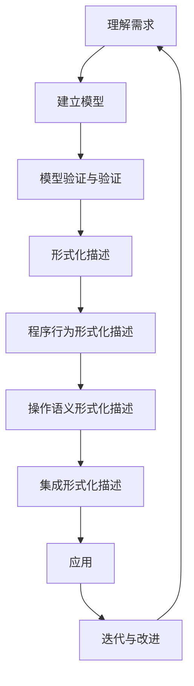

                 

# 操作语义与程序行为形式化描述

## 关键词

形式化描述、操作语义、程序行为、形式化验证、软件开发、系统安全

## 摘要

本文旨在探讨操作语义与程序行为的形式化描述方法。通过引入形式化描述的基础概念、常用形式化语言和描述步骤，本文详细分析了操作语义和程序行为的基本概念、形式化模型和描述方法。此外，本文还介绍了形式化验证的基本概念、方法及其应用，以及操作语义与程序行为的集成方法。最后，本文总结了形式化描述在软件开发、系统安全和网络协议分析等领域的应用，并展望了形式化描述的未来发展趋势。

## 第1章 引言

### 1.1 操作语义与程序行为的形式化描述的重要性

在计算机科学领域，操作语义和程序行为的形式化描述具有重要意义。形式化描述能够将操作和程序行为转化为严格的数学模型，从而提高程序的可靠性和可理解性。具体来说，形式化描述有以下几点重要性：

1. **提高程序的正确性**：通过形式化描述，我们可以精确地表达操作和程序行为，从而减少由于误解或疏忽导致的错误。

2. **促进程序的可理解性**：形式化描述提供了清晰、精确的描述方式，使得程序员更容易理解程序的设计意图和功能。

3. **便于验证和验证**：形式化描述使得程序行为可以形式化地表示，从而可以使用形式化验证方法来检查程序的正确性和可靠性。

4. **支持软件工程方法**：形式化描述与软件工程方法相结合，可以更好地支持软件设计、开发和维护。

### 1.2 本书的目的和结构

本书旨在系统地介绍操作语义和程序行为的形式化描述方法，主要包括以下几个部分：

1. **形式化描述基础**：介绍形式化描述的基本概念、目标、挑战以及常用形式化语言。

2. **操作语义的形式化描述**：分析操作语义的基本概念、分类、形式化模型和描述方法。

3. **程序行为的形式化描述**：探讨程序行为的基本概念、分类、形式化模型和描述方法。

4. **形式化验证**：介绍形式化验证的基本概念、方法及其应用。

5. **操作语义与程序行为的集成**：分析操作语义与程序行为的关联及其集成方法。

6. **形式化描述的应用**：探讨形式化描述在软件开发、系统安全和网络协议分析等领域的应用。

7. **未来发展趋势**：展望形式化描述的未来发展趋势，包括新形式化描述语言、形式化描述与人工智能的结合等。

## 第2章 形式化描述基础

### 2.1 形式化描述的基本概念

#### 2.1.1 形式化描述的定义

形式化描述是指使用数学方法来描述某个概念、问题或解决方案。具体来说，形式化描述包括语法和语义两个方面：

- **语法**：定义描述的语法规则，包括符号、结构等。
- **语义**：定义描述的含义，即描述与实际情况之间的关系。

#### 2.1.2 形式化描述的目标

形式化描述的主要目标是：

1. **精确性**：通过数学方法，精确地描述概念、问题或解决方案。
2. **一致性**：确保描述在不同场景下保持一致。
3. **可验证性**：使得描述可以形式化地验证，确保其正确性和可靠性。

#### 2.1.3 形式化描述的挑战

形式化描述面临以下挑战：

1. **抽象与具体之间的平衡**：形式化描述需要既能抽象出核心概念，又能够具体到实际应用。
2. **复杂性问题**：随着描述的复杂度增加，形式化描述的难度也会增加。
3. **可理解性**：形式化描述需要易于理解，以便于程序员和用户。

### 2.2 形式化语言

#### 2.2.1 语法与语义

形式化语言包括语法和语义两个方面：

- **语法**：定义描述的语法规则，包括符号、结构等。
- **语义**：定义描述的含义，即描述与实际情况之间的关系。

#### 2.2.2 常见形式化语言简介

常见的形式化语言包括：

1. ** predicate calculus（谓词逻辑）**
2. ** set theory（集合论）**
3. ** formal grammars（形式语法）**
4. ** temporal logic（时态逻辑）**
5. ** modal logic（模态逻辑）**

### 2.3 形式化描述的步骤

形式化描述通常包括以下几个步骤：

1. **理解需求**：明确需要描述的概念、问题或解决方案。
2. **建立模型**：根据需求，构建数学模型。
3. **模型验证与验证**：验证模型的正确性和可靠性。
4. **形式化描述**：将模型转化为形式化描述。
5. **优化与改进**：根据反馈，对形式化描述进行优化和改进。

## 第3章 操作语义的形式化描述

### 3.1 操作语义的基本概念

#### 3.1.1 操作的定义

操作是计算机科学中的一个基本概念，通常指对数据的处理或转换。操作可以是有状态的，也可以是无状态的。

- **有状态操作**：操作的结果依赖于其执行前的状态。
- **无状态操作**：操作的结果仅依赖于输入数据，与执行前的状态无关。

#### 3.1.2 操作的分类

操作可以根据其功能、状态等特性进行分类，常见的分类方法包括：

1. **计算操作**：如算术操作、逻辑操作等。
2. **数据操作**：如数据查询、数据修改等。
3. **控制操作**：如跳转、循环等。

### 3.2 形式化描述操作语义

#### 3.2.1 操作语义的形式化模型

操作语义的形式化模型可以分为两个层次：

1. **静态层次**：描述操作的结构和属性，如语法规则、操作符等。
2. **动态层次**：描述操作的执行过程和结果，如执行状态、中间结果等。

#### 3.2.2 操作语义的形式化描述方法

操作语义的形式化描述方法包括：

1. **语义网模型**：使用语义网来表示操作语义，包括操作符、操作数和语义关系等。
2. **算符表模型**：使用算符表来表示操作语义，包括操作符、操作数和执行结果等。
3. **过程模型**：使用过程性描述来表示操作语义，包括操作符、操作数和执行步骤等。

### 3.3 操作语义的例子

#### 3.3.1 简单的算术操作

以加法操作为例，形式化描述如下：

$$
\begin{align*}
&\text{操作符：} + \\
&\text{操作数：} a, b \\
&\text{结果：} c = a + b
\end{align*}
$$

#### 3.3.2 复杂的程序操作

以程序跳转操作为例，形式化描述如下：

$$
\begin{align*}
&\text{操作符：} \text{GOTO} \\
&\text{操作数：} \text{label} \\
&\text{执行过程：} \text{当前指令指针指向label所指的指令}
\end{align*}
$$

## 第4章 程序行为的形式化描述

### 4.1 程序行为的基本概念

#### 4.1.1 程序行为的定义

程序行为是指程序在执行过程中表现出的动态特征，包括计算、控制、数据等行为。

#### 4.1.2 程序行为的分类

程序行为可以根据其特性进行分类，常见的分类方法包括：

1. **计算行为**：如算术计算、逻辑运算等。
2. **控制行为**：如条件跳转、循环等。
3. **数据行为**：如数据查询、数据修改等。

### 4.2 形式化描述程序行为

#### 4.2.1 程序行为的形式化模型

程序行为的形式化模型可以分为两个层次：

1. **静态层次**：描述程序的结构和属性，如语法规则、变量定义等。
2. **动态层次**：描述程序的执行过程和结果，如执行状态、中间结果等。

#### 4.2.2 程序行为的形式化描述方法

程序行为的形式化描述方法包括：

1. **时态逻辑**：使用时态逻辑来描述程序的执行过程，包括条件、跳转、循环等。
2. **状态转换图**：使用状态转换图来表示程序的执行过程，包括状态、转移条件和转移操作等。
3. **过程性描述**：使用过程性描述来表示程序的执行过程，包括指令序列、条件语句和循环语句等。

### 4.3 程序行为的例子

#### 4.3.1 线性程序行为

以线性程序为例，形式化描述如下：

$$
\begin{align*}
&\text{程序结构：} S = \{I_1, I_2, ..., I_n\} \\
&\text{执行过程：} I_1 \rightarrow I_2 \rightarrow ... \rightarrow I_n
\end{align*}
$$

#### 4.3.2 分支程序行为

以分支程序为例，形式化描述如下：

$$
\begin{align*}
&\text{程序结构：} S = \{I_1, I_2, I_3, I_4\} \\
&\text{执行过程：} \\
&\quad \text{如果条件成立：} I_1 \rightarrow I_2 \\
&\quad \text{否则：} I_1 \rightarrow I_3 \rightarrow I_4
\end{align*}
$$

## 第5章 形式化验证

### 5.1 形式化验证的基本概念

#### 5.1.1 形式化验证的定义

形式化验证是指使用形式化描述和形式化验证方法来检查程序的正确性和可靠性。形式化验证通常包括以下步骤：

1. **建立形式化描述**：使用形式化描述方法，将程序转化为形式化描述。
2. **形式化验证**：使用形式化验证方法，检查形式化描述的正确性和可靠性。
3. **报告结果**：根据形式化验证的结果，生成验证报告。

#### 5.1.2 形式化验证的目标

形式化验证的主要目标是：

1. **确保程序的正确性**：验证程序是否满足预期的功能和行为。
2. **提高程序的可靠性**：验证程序在异常情况下的行为，确保其稳定性和安全性。
3. **减少错误**：通过形式化验证，发现和修复程序中的潜在错误。

### 5.2 形式化验证方法

形式化验证方法可以分为以下几种：

1. **模式匹配**：通过比较形式化描述与预期结果，检查程序的正确性。
2. **形式化推理**：使用逻辑推理方法，从形式化描述中推导出结论，验证程序的正确性。
3. **形式化验证工具**：使用自动化验证工具，如模型检查器、验证器等，进行形式化验证。

### 5.3 形式化验证的例子

#### 5.3.1 简单程序的验证

以一个简单的线性程序为例，形式化描述如下：

$$
\begin{align*}
&\text{程序结构：} S = \{I_1, I_2, ..., I_n\} \\
&\text{执行过程：} I_1 \rightarrow I_2 \rightarrow ... \rightarrow I_n
\end{align*}
$$

使用形式化验证方法，可以验证该程序的执行过程是否符合预期。

#### 5.3.2 复杂程序的验证

以一个复杂的分支程序为例，形式化描述如下：

$$
\begin{align*}
&\text{程序结构：} S = \{I_1, I_2, I_3, I_4\} \\
&\text{执行过程：} \\
&\quad \text{如果条件成立：} I_1 \rightarrow I_2 \\
&\quad \text{否则：} I_1 \rightarrow I_3 \rightarrow I_4
\end{align*}
$$

使用形式化验证方法，可以验证该程序的执行过程是否符合预期，并发现潜在的错误。

## 第6章 操作语义与程序行为的集成

### 6.1 操作语义与程序行为的关联

操作语义与程序行为之间存在密切关联。具体来说，操作语义是程序行为的基础，而程序行为是操作语义的具体实现。操作语义定义了操作的行为规范，而程序行为则根据这些规范来执行具体的操作。

#### 6.1.1 操作语义对程序行为的影响

操作语义对程序行为的影响主要体现在以下几个方面：

1. **操作的可理解性**：操作语义的定义使得程序行为更加直观和易于理解。
2. **操作的一致性**：操作语义确保程序行为在不同情况下保持一致。
3. **操作的验证**：操作语义为程序行为的验证提供了基础。

#### 6.1.2 程序行为对操作语义的影响

程序行为对操作语义的影响主要体现在以下几个方面：

1. **操作的具体实现**：程序行为根据操作语义来具体实现操作。
2. **操作的优化**：程序行为可以根据操作语义进行优化，提高程序的效率和性能。
3. **操作的新特性**：程序行为可能会引入新的操作特性，从而丰富操作语义。

### 6.2 集成形式化描述

集成形式化描述是将操作语义和程序行为的形式化描述结合起来，以实现更精确和全面的描述。

#### 6.2.1 集成模型

集成模型通常包括以下层次：

1. **操作语义层次**：描述操作的基本属性和行为规范。
2. **程序行为层次**：描述程序的具体执行过程和结果。
3. **交互层次**：描述操作语义和程序行为之间的交互关系。

#### 6.2.2 集成方法

集成方法包括以下几种：

1. **层次化方法**：将操作语义和程序行为分别描述，然后通过层次化结构将两者集成。
2. **混合方法**：将操作语义和程序行为的形式化描述方法结合起来，形成统一的描述方法。
3. **语义网方法**：使用语义网来表示操作语义和程序行为的集成。

### 6.3 集成实例

以一个简单的程序为例，说明操作语义和程序行为的集成。

#### 6.3.1 简单集成实例

假设有一个加法操作，形式化描述如下：

$$
\begin{align*}
&\text{操作符：} + \\
&\text{操作数：} a, b \\
&\text{结果：} c = a + b
\end{align*}
$$

程序行为的形式化描述如下：

$$
\begin{align*}
&\text{程序结构：} S = \{I_1, I_2, I_3\} \\
&\text{执行过程：} I_1 \rightarrow I_2 \rightarrow I_3
\end{align*}
$$

集成形式化描述如下：

$$
\begin{align*}
&\text{操作语义：} + \\
&\text{程序行为：} S = \{I_1, I_2, I_3\} \\
&\text{执行过程：} I_1 \rightarrow I_2 \rightarrow I_3 \\
&\text{结果：} c = a + b
\end{align*}
$$

#### 6.3.2 复杂集成实例

以一个复杂的程序为例，说明操作语义和程序行为的集成。

假设有一个排序操作，形式化描述如下：

$$
\begin{align*}
&\text{操作符：} \text{SORT} \\
&\text{操作数：} \text{数组} \\
&\text{结果：} \text{排序后的数组}
\end{align*}
$$

程序行为的形式化描述如下：

$$
\begin{align*}
&\text{程序结构：} S = \{I_1, I_2, I_3, ..., I_n\} \\
&\text{执行过程：} I_1 \rightarrow I_2 \rightarrow I_3 \rightarrow ... \rightarrow I_n
\end{align*}
$$

集成形式化描述如下：

$$
\begin{align*}
&\text{操作语义：} \text{SORT} \\
&\text{程序行为：} S = \{I_1, I_2, I_3, ..., I_n\} \\
&\text{执行过程：} I_1 \rightarrow I_2 \rightarrow I_3 \rightarrow ... \rightarrow I_n \\
&\text{结果：} \text{排序后的数组}
\end{align*}
$$

## 第7章 形式化描述的应用

### 7.1 软件开发中的应用

形式化描述在软件开发中具有广泛的应用，主要体现在以下几个方面：

1. **需求分析**：形式化描述可以帮助清晰地表达软件需求，确保需求的准确性和一致性。
2. **设计**：形式化描述可以用于软件设计，包括系统架构、模块划分、接口设计等。
3. **验证**：形式化描述可以用于验证软件的正确性和可靠性，发现潜在的错误和漏洞。
4. **优化**：形式化描述可以用于优化软件性能，提高程序的效率和可维护性。

### 7.2 其他领域中的应用

形式化描述在其他领域也具有广泛的应用，包括：

1. **系统安全**：形式化描述可以用于系统安全分析，发现潜在的安全漏洞和攻击点。
2. **网络协议分析**：形式化描述可以用于网络协议的分析和验证，确保协议的稳定性和安全性。
3. **自动机验证**：形式化描述可以用于自动机验证，检查自动机是否满足预期的性质。

### 7.3 应用实例

以下是一个形式化描述在软件设计中的应用实例：

#### 7.3.1 需求分析

假设需要开发一个简单的计算器程序，主要功能包括加法、减法、乘法和除法。

形式化描述如下：

$$
\begin{align*}
&\text{功能需求：} \\
&\quad \text{加法：} a + b = c \\
&\quad \text{减法：} a - b = c \\
&\quad \text{乘法：} a \times b = c \\
&\quad \text{除法：} a \div b = c \\
&\text{输入：} a, b \\
&\text{输出：} c
\end{align*}
$$

#### 7.3.2 设计

根据需求分析，可以设计如下的程序架构：

$$
\begin{align*}
&\text{程序模块：} \\
&\quad \text{输入模块：} \text{读取用户输入的数值} \\
&\quad \text{运算模块：} \text{执行加、减、乘、除运算} \\
&\quad \text{输出模块：} \text{显示计算结果}
\end{align*}
$$

形式化描述如下：

$$
\begin{align*}
&\text{程序结构：} \\
&\quad \text{输入模块：} I_1 \rightarrow I_2 \\
&\quad \text{运算模块：} O_1 \rightarrow O_2 \\
&\quad \text{输出模块：} O_3 \rightarrow O_4 \\
&\text{执行过程：} I_1 \rightarrow O_1 \rightarrow O_2 \rightarrow O_3 \rightarrow O_4
\end{align*}
$$

#### 7.3.3 验证

使用形式化验证方法，可以验证该程序是否满足需求。

形式化验证如下：

$$
\begin{align*}
&\text{验证条件：} a, b \text{为有效输入} \\
&\text{验证过程：} \\
&\quad \text{输入模块：} a, b \rightarrow c \\
&\quad \text{运算模块：} a + b = c \\
&\quad \text{输出模块：} c \rightarrow \text{显示计算结果} \\
&\text{验证结果：} \text{程序满足需求}
\end{align*}
$$

## 第8章 形式化描述的未来发展趋势

### 8.1 当前的研究进展

形式化描述在计算机科学领域已经取得了显著的研究进展。目前，形式化描述方法主要包括以下几个方面：

1. **形式化描述语言**：开发了多种形式化描述语言，如谓词逻辑、集合论、形式语法等。
2. **形式化验证方法**：提出了多种形式化验证方法，如模式匹配、形式化推理、模型检查等。
3. **形式化描述工具**：开发了多种形式化描述工具，如模型检查器、验证器、形式化描述编辑器等。

### 8.2 未来发展趋势

未来，形式化描述的发展趋势可能包括以下几个方面：

1. **新形式化描述语言**：随着计算机科学的发展，可能会出现新的形式化描述语言，以适应更复杂的问题。
2. **形式化描述与人工智能的结合**：形式化描述与人工智能技术的结合，可能会带来新的突破，如自动化形式化描述生成、自动化形式化验证等。
3. **形式化描述在大规模程序中的应用**：随着软件系统规模的扩大，形式化描述在大规模程序中的应用将变得越来越重要。
4. **形式化描述在教育中的应用**：形式化描述在教育中的应用，可以帮助学生更好地理解和掌握计算机科学的概念和方法。

## 附录

### A.1 形式化描述相关工具

以下是一些常见的形式化描述工具：

1. **模型检查器**：用于验证形式化描述的正确性，如 Spin、Model Checker等。
2. **验证器**：用于验证程序的正确性，如 Coq、Isabelle等。
3. **形式化描述编辑器**：用于编写和编辑形式化描述，如 Frama-C、Proof Checker等。

### A.2 参考文献

1. **Andrews, J. R. (2002). Formal Methods and Protocols for Network Security. IEEE Press.**
2. **Kowalski, R. A. (1974). Predicate Calculus with Applications to Computer Science. North-Holland.**
3. **Milner, R. (1999). Communication and Concurrency. Cambridge University Press.**
4. **Huth, M., & Ryan, M. (2004). Logic in Computer Science: Modelling and Reasoning about Systems. Cambridge University Press.**
5. **Clarke, E. M., Grumberg, O., Jhala, R., & Veith, H. (1999). Model Checking. MIT Press.**

## 形式化描述过程

```mermaid
graph TD
    A[理解需求] --> B[建立模型]
    B --> C[模型验证与验证]
    C --> D[形式化描述]
    D --> E[程序行为形式化描述]
    E --> F[操作语义形式化描述]
    F --> G[集成形式化描述]
    G --> H[应用]
```# 操作语义与程序行为形式化描述

## 第1章 引言

### 1.1 操作语义与程序行为的形式化描述的重要性

在计算机科学领域，操作语义与程序行为的形式化描述扮演着至关重要的角色。形式化描述是一种利用数学语言和方法来精确描述程序行为的手段，它有助于确保程序的正确性、可理解性和可验证性。

操作语义主要关注操作的含义和效果，它是程序设计语言的核心组成部分，决定了程序的执行结果。形式化地描述操作语义，可以帮助我们理解每个操作对程序状态的影响，从而避免因语义误解导致的错误。

程序行为则涵盖了程序在执行过程中的所有动态表现，包括计算、控制流和数据流。形式化地描述程序行为，有助于我们在设计和实现阶段就发现潜在的问题，提高软件的质量和可靠性。

形式化描述的重要性体现在以下几个方面：

1. **准确性**：形式化描述能够以精确的数学语言来表达程序的意图，从而减少因语义不清导致的误解和错误。
2. **可理解性**：形式化描述使得程序的意图和功能更加直观，便于开发人员理解。
3. **可验证性**：形式化描述可以用于验证程序的属性，如正确性、安全性和性能，从而提高软件的可靠性。
4. **自动化**：形式化描述可以为自动化工具提供输入，如代码生成、优化和测试。

### 1.2 本书的目的和结构

本书旨在系统地介绍操作语义与程序行为的形式化描述方法，帮助读者深入理解这一领域的关键概念和技术。本书的结构如下：

- **第1章 引言**：介绍形式化描述的基本概念和重要性。
- **第2章 形式化描述基础**：介绍形式化描述的基本概念、目标、挑战和常用形式化语言。
- **第3章 操作语义的形式化描述**：分析操作语义的基本概念、分类、形式化模型和描述方法。
- **第4章 程序行为的形式化描述**：探讨程序行为的基本概念、分类、形式化模型和描述方法。
- **第5章 形式化验证**：介绍形式化验证的基本概念、方法及其应用。
- **第6章 操作语义与程序行为的集成**：分析操作语义与程序行为的关联及其集成方法。
- **第7章 形式化描述的应用**：讨论形式化描述在软件开发和其他领域中的应用。
- **第8章 形式化描述的未来发展趋势**：展望形式化描述的未来发展趋势。

## 第2章 形式化描述基础

### 2.1 形式化描述的基本概念

#### 2.1.1 形式化描述的定义

形式化描述是一种使用数学语言和方法来精确表达概念、问题或解决方案的过程。它通常包括语法和语义两个方面：

- **语法**：描述了符号、结构和表达式的规则。
- **语义**：描述了符号和结构在特定环境中所代表的意义。

在形式化描述中，语法是形式化的外在表现形式，而语义则是形式化的内在意义。两者共同构成了形式化描述的基础。

#### 2.1.2 形式化描述的目标

形式化描述的主要目标是实现以下目标：

1. **精确性**：通过使用数学语言，形式化描述能够精确地表达概念和问题的本质，减少歧义。
2. **一致性**：形式化描述保证了在不同场景下，描述的一致性，从而避免了误解和错误。
3. **可验证性**：形式化描述为验证提供了基础，使得我们能够使用数学方法来证明程序的属性。
4. **可扩展性**：形式化描述易于扩展，可以适应新的概念和问题的需求。

#### 2.1.3 形式化描述的挑战

尽管形式化描述有许多优点，但在实际应用中也面临一些挑战：

1. **抽象与具体之间的平衡**：形式化描述需要在抽象的通用概念和具体的实现细节之间找到平衡点。
2. **复杂性问题**：随着描述的复杂度增加，理解和验证形式化描述的难度也会增加。
3. **可理解性**：形式化描述需要以易于理解的方式呈现，这对于非专业的读者来说可能是一个挑战。

### 2.2 形式化语言

#### 2.2.1 语法与语义

形式化语言是形式化描述的重要组成部分，它包括语法和语义两个方面：

- **语法**：定义了语言的符号、结构和表达式的规则。例如，在谓词逻辑中，语法包括命题、谓词、量词和逻辑运算符等。
- **语义**：定义了符号和结构在特定环境中所代表的意义。例如，在谓词逻辑中，语义涉及如何解释命题和谓词的真值。

常见的形式化语言包括：

1. **谓词逻辑（Predicate Logic）**：用于描述复杂的关系和属性。
2. **集合论（Set Theory）**：用于描述集合和操作。
3. **形式语法（Formal Grammar）**：用于描述语言的语法结构。
4. **时态逻辑（Temporal Logic）**：用于描述时间相关的行为。
5. **模态逻辑（Modal Logic）**：用于描述状态转换和条件。

#### 2.2.2 常见形式化语言简介

1. **谓词逻辑**：谓词逻辑是一种广泛使用的形式化语言，用于描述复杂的关系和属性。它包括命题、谓词、量词和逻辑运算符等。

   例子：
   $$ \forall x \in \mathbb{N}, P(x) \Rightarrow Q(x) $$
   这个表达式表示对于所有自然数 $x$，如果 $P(x)$ 成立，则 $Q(x)$ 也成立。

2. **集合论**：集合论是一种用于描述集合和操作的形式化语言。它包括集合的表示、集合的运算和集合的性质。

   例子：
   $$ \{ x \in \mathbb{N} \mid x \text{ 是素数} \} $$
   这个表达式表示所有自然数中的素数集合。

3. **形式语法**：形式语法用于描述语言的语法结构，通常包括产生式和规则。

   例子：
   $$ S \rightarrow NP $$
   这个表达式表示 $S$ 可以通过将 $N$ 替换为 $P$ 来产生。

4. **时态逻辑**：时态逻辑用于描述时间相关的行为，包括事件的顺序、持续时间和条件。

   例子：
   $$ \phi \wedge \Diamond \psi $$
   这个表达式表示当前 $\phi$ 成立，并且未来 $\psi$ 将会成立。

5. **模态逻辑**：模态逻辑用于描述状态转换和条件，包括可能性和必然性。

   例子：
   $$ \Box \phi \wedge \Diamond \neg \phi $$
   这个表达式表示 $\phi$ 必然成立，并且 $\phi$ 在某些情况下不可能成立。

### 2.3 形式化描述的步骤

进行形式化描述通常需要遵循以下步骤：

1. **理解需求**：明确需要描述的问题或概念，并确定描述的目标和范围。
2. **建立模型**：根据需求建立数学模型，确定描述的变量、条件和约束。
3. **定义语法和语义**：根据模型定义语法和语义，确保描述的精确性和一致性。
4. **编写描述**：使用选定的形式化语言，编写形式化描述。
5. **验证和验证**：验证描述的正确性，确保它能够准确地表达需求和目标。
6. **优化和改进**：根据反馈和验证结果，对描述进行优化和改进。

### 2.4 形式化描述的应用

形式化描述在计算机科学和软件工程中有着广泛的应用，包括：

1. **程序验证**：形式化描述用于验证程序的属性，如正确性、安全性和性能。
2. **算法设计**：形式化描述有助于理解和分析算法的行为和效率。
3. **系统建模**：形式化描述用于描述复杂系统的行为和交互。
4. **协议分析**：形式化描述用于分析和验证网络协议和通信协议。

#### 2.4.1 程序验证

形式化描述在程序验证中的应用非常广泛，它可以帮助开发人员确保程序的正确性和可靠性。例如，使用谓词逻辑可以描述程序的状态和变迁，并使用模型检查器来验证程序是否满足特定的属性。

#### 2.4.2 算法设计

在算法设计中，形式化描述有助于理解和分析算法的行为。例如，可以使用伪代码和数学模型来描述算法的执行过程和复杂度。

#### 2.4.3 系统建模

形式化描述在系统建模中用于描述复杂系统的行为和交互。例如，可以使用状态机来描述系统的状态和变迁，并使用时态逻辑来描述系统的属性和行为。

#### 2.4.4 协议分析

在协议分析中，形式化描述用于描述和验证网络协议和通信协议。例如，可以使用形式化描述来分析协议的安全性、完整性和可靠性。

### 2.5 形式化描述的优点和挑战

#### 形式化描述的优点

- **精确性**：形式化描述能够以精确的数学语言来表达概念和问题的本质，减少歧义和误解。
- **可验证性**：形式化描述为验证提供了基础，可以使用数学方法来证明属性的正确性。
- **一致性**：形式化描述保证了在不同场景下的一致性，从而避免了误解和错误。
- **自动化**：形式化描述可以为自动化工具提供输入，如代码生成、优化和测试。

#### 形式化描述的挑战

- **复杂性**：形式化描述的语法和语义可能非常复杂，理解和编写描述可能需要较高的专业知识和技能。
- **可理解性**：形式化描述可能难以理解，尤其是对于非专业的读者。
- **工具支持**：形式化描述工具的支持可能有限，可能需要开发定制化的工具。

### 2.6 形式化描述的最佳实践

为了成功地使用形式化描述，以下是一些最佳实践：

- **明确目标**：在开始形式化描述之前，明确描述的目标和范围。
- **选择合适的语言**：选择适合问题的形式化语言，确保描述的准确性和一致性。
- **编写清晰和详细的描述**：确保描述清晰、详细且易于理解。
- **验证和验证**：使用数学方法和工具来验证描述的正确性。
- **迭代和改进**：根据反馈和验证结果，对描述进行迭代和改进。

### 2.7 结论

形式化描述是一种强大的工具，它可以帮助开发人员确保程序的正确性、可靠性和可理解性。通过系统地使用形式化描述方法，可以大大提高软件的质量和可靠性。然而，形式化描述也面临一些挑战，如复杂性和可理解性。因此，在实际应用中，需要根据具体问题选择合适的形式化描述方法，并遵循最佳实践。

## 第3章 操作语义的形式化描述

### 3.1 操作语义的基本概念

操作语义是程序设计语言中一个核心的概念，它描述了操作的含义和效果。在编程语言中，操作可以是指令、函数、方法或任何能够对程序状态产生影响的行为。操作语义的形式化描述关注如何准确地表达这些操作的行为，从而确保程序的正确性和一致性。

#### 3.1.1 操作的定义

在形式化描述中，操作通常被定义为一种对状态进行转换的行为。一个操作通常包括以下组成部分：

- **操作符**：操作符是执行操作的核心部分，例如加法操作符 `+`、函数调用操作符 `()`。
- **操作数**：操作数是参与操作的实体，例如加法操作中的两个数。
- **结果**：操作执行后的输出，例如加法操作的结果是一个和。
- **副作用**：某些操作可能产生副作用，例如修改程序的状态或输出错误信息。

#### 3.1.2 操作的分类

操作可以根据不同的属性进行分类，常见的分类方法包括：

- **计算操作**：这类操作主要涉及数值计算，如加法、减法、乘法、除法等。
- **逻辑操作**：这类操作用于执行逻辑运算，如与、或、非、条件等。
- **数据访问操作**：这类操作用于访问和修改数据结构，如数组访问、指针操作等。
- **控制操作**：这类操作用于控制程序流程，如跳转、循环、异常处理等。
- **输入/输出操作**：这类操作用于与外部环境进行交互，如读取用户输入、打印输出等。

#### 3.1.3 操作语义的特点

操作语义具有以下几个显著特点：

- **确定性**：操作语义应该明确指定每个操作的行为，确保在相同的输入下，操作总是产生相同的结果。
- **抽象性**：操作语义应该能够抽象出底层实现的细节，使得程序员可以专注于高层设计。
- **一致性**：操作语义应该在不同的情况下保持一致性，避免产生意外的结果。
- **可组合性**：操作语义应该允许操作的组合，使得复杂的操作可以通过简单的操作组合来实现。

### 3.2 形式化描述操作语义

形式化描述操作语义的目的是为了以一种准确、一致和可验证的方式表达操作的行为。形式化描述通常包括语法和语义两个方面：

#### 3.2.1 操作语义的形式化模型

形式化描述操作语义时，需要构建一个形式化的模型，该模型通常包括以下几个组成部分：

- **状态**：状态表示程序在执行过程中所具有的所有信息的集合，如变量值、内存分配等。
- **操作符表**：操作符表包含了所有操作符的定义，每个操作符定义了它的操作数、结果和可能的副作用。
- **状态转换函数**：状态转换函数描述了在执行一个操作时，如何从当前状态转换到新的状态。

一个简单的形式化模型可以表示为：

$$
\begin{align*}
&\text{状态：} S \\
&\text{操作符表：} O \\
&\text{状态转换函数：} \delta \\
\end{align*}
$$

其中，`S` 表示状态集合，`O` 表示操作符表，`δ` 表示状态转换函数。

#### 3.2.2 操作语义的形式化描述方法

形式化描述操作语义的方法多种多样，以下介绍几种常见的方法：

1. **指称语义**：指称语义通过将操作映射到数学函数来描述其行为。例如，对于加法操作，可以使用一个函数 `f(a, b) = a + b` 来表示其效果。

2. **运算符表方法**：运算符表方法通过定义操作符表来描述操作的行为。操作符表通常包含每个操作符的语法和语义信息，如操作数类型、结果类型和副作用。

3. **程序语义**：程序语义通过定义程序的结构和行为来描述操作语义。例如，可以使用过程性描述来描述程序的控制流和数据流。

4. **指称语义与程序语义的结合**：在实际应用中，指称语义和程序语义常常结合使用，以提供更全面和准确的描述。

### 3.3 操作语义的例子

以下是一些操作语义的例子：

#### 3.3.1 简单的算术操作

假设我们有一个简单的算术操作，如加法。形式化描述如下：

$$
\begin{align*}
&\text{操作符：} + \\
&\text{操作数：} a, b \\
&\text{结果：} c = a + b \\
&\text{状态转换：} S_{\text{new}} = S_{\text{old}} \cup \{ (a, c) \} \\
\end{align*}
$$

在这个例子中，操作符 `+` 将两个操作数 `a` 和 `b` 相加，结果存储在变量 `c` 中，并且状态更新为包含 `(a, c)` 的新状态。

#### 3.3.2 复杂的程序操作

对于更复杂的程序操作，如函数调用，形式化描述如下：

$$
\begin{align*}
&\text{操作符：} \text{call}(f, a_1, a_2, ..., a_n) \\
&\text{操作数：} f, a_1, a_2, ..., a_n \\
&\text{结果：} \text{返回值} \\
&\text{状态转换：} S_{\text{new}} = S_{\text{old}} \cup \{ (f, a_1, a_2, ..., a_n) \} \\
\end{align*}
$$

在这个例子中，函数调用操作符 `call` 调用函数 `f`，并将参数 `a_1, a_2, ..., a_n` 传递给函数。函数执行后返回一个值，并且状态更新为包含调用信息的新的状态。

### 3.4 形式化描述操作语义的挑战

尽管形式化描述操作语义具有许多优势，但在实际应用中也面临一些挑战：

1. **复杂性问题**：形式化描述操作语义可能变得非常复杂，尤其是当涉及复杂的程序结构和动态行为时。
2. **可理解性**：形式化描述可能难以理解，特别是对于没有形式化描述背景的程序员。
3. **验证难度**：形式化验证操作语义的正确性可能是一个具有挑战性的任务，特别是在模型规模较大时。
4. **工具支持**：形式化描述操作语义的工具支持可能有限，可能需要开发定制化的工具。

### 3.5 形式化描述操作语义的最佳实践

为了有效地使用形式化描述操作语义，以下是一些最佳实践：

- **明确目标**：在开始形式化描述之前，明确描述的目标和范围。
- **选择合适的模型**：根据问题的复杂度和要求，选择合适的模型和描述方法。
- **保持一致性**：确保描述在不同情况下保持一致性，避免产生歧义。
- **编写清晰和详细的描述**：确保描述清晰、详细且易于理解。
- **验证和验证**：使用数学方法和工具来验证描述的正确性。

### 3.6 结论

操作语义的形式化描述是确保程序正确性和一致性的关键步骤。通过构建准确、一致和可验证的形式化模型，我们可以更好地理解和分析程序的行为。尽管形式化描述操作语义面临一些挑战，但遵循最佳实践可以帮助我们克服这些困难，从而提高软件的质量和可靠性。

## 第4章 程序行为的形式化描述

### 4.1 程序行为的基本概念

程序行为是程序在执行过程中所展现出的动态特征，包括计算、控制流和数据流。形式化描述程序行为旨在以精确的数学语言表达程序在各种条件下的执行过程和结果，从而确保程序的正确性、可理解和可验证性。

#### 4.1.1 程序行为的定义

程序行为可以定义为程序在执行过程中所表现出的状态变化和操作执行的过程。具体来说，程序行为包括以下三个主要方面：

1. **计算行为**：程序在执行过程中的计算操作，如数值计算、逻辑运算等。
2. **控制流行为**：程序在执行过程中的控制流操作，如条件跳转、循环等。
3. **数据流行为**：程序在执行过程中的数据流操作，如变量赋值、数据结构操作等。

#### 4.1.2 程序行为的分类

程序行为可以根据其特性进行分类，常见的分类方法包括：

1. **线性程序行为**：程序行为按照线性顺序执行，没有分支或循环。
2. **分支程序行为**：程序行为包含条件判断和分支，根据不同条件执行不同的操作。
3. **循环程序行为**：程序行为包含循环结构，重复执行一组操作。
4. **并行程序行为**：程序行为在多个任务或线程中同时执行。

#### 4.1.3 程序行为的特点

程序行为具有以下特点：

1. **动态性**：程序行为是动态的，随着程序的执行过程不断变化。
2. **可组合性**：程序行为可以通过组合其他行为来构建更复杂的程序。
3. **状态依赖性**：程序行为的执行结果依赖于当前程序的状态。
4. **可验证性**：形式化描述程序行为使得我们可以使用数学方法来验证程序的正确性和可靠性。

### 4.2 形式化描述程序行为

形式化描述程序行为的目的是将程序行为转化为数学模型，以便进行精确的分析和验证。形式化描述程序行为通常包括以下步骤：

1. **定义状态**：明确程序在执行过程中可能具有的所有状态。
2. **定义操作**：明确程序在执行过程中可能执行的所有操作。
3. **定义状态转换函数**：定义操作如何导致状态的变化。
4. **构建形式化模型**：将状态、操作和状态转换函数组织成形式化的模型。

#### 4.2.1 程序行为的形式化模型

程序行为的形式化模型通常包括以下组成部分：

1. **状态空间**：表示程序在执行过程中可能具有的所有状态的集合。
2. **操作集合**：表示程序在执行过程中可能执行的所有操作的集合。
3. **初始状态**：表示程序开始执行时的初始状态。
4. **状态转换函数**：表示操作如何导致状态的变化。

一个简单的形式化模型可以表示为：

$$
\begin{align*}
&\text{状态空间：} S \\
&\text{操作集合：} O \\
&\text{初始状态：} s_0 \\
&\text{状态转换函数：} \delta \\
\end{align*}
$$

其中，`S` 表示状态空间，`O` 表示操作集合，`s_0` 表示初始状态，`δ` 表示状态转换函数。

#### 4.2.2 程序行为的形式化描述方法

形式化描述程序行为的方法多种多样，以下介绍几种常见的方法：

1. **状态机模型**：状态机模型使用状态和状态转换来描述程序行为。每个状态表示程序在执行过程中可能具有的状态，状态转换表示程序在执行过程中的控制流。
2. **时态逻辑**：时态逻辑用于描述程序行为的动态特性，包括条件、分支和循环。时态逻辑可以使用谓词逻辑和数学公式来表达。
3. **伪代码**：伪代码是一种简单的程序设计语言，用于描述程序的行为和结构。伪代码可以与数学公式和状态机模型结合使用。
4. **指称语义**：指称语义通过将程序行为映射到数学函数来描述其行为。例如，可以使用函数来表示程序的执行过程和结果。

#### 4.2.3 程序行为的形式化描述步骤

进行程序行为的形式化描述时，可以遵循以下步骤：

1. **定义状态**：明确程序在执行过程中可能具有的所有状态。状态可以是简单的变量值，也可以是更复杂的数据结构。
2. **定义操作**：明确程序在执行过程中可能执行的所有操作。操作可以是基本计算操作，也可以是复杂的控制流操作。
3. **定义状态转换函数**：定义操作如何导致状态的变化。状态转换函数可以表示为数学函数，用于计算新状态。
4. **构建形式化模型**：将状态、操作和状态转换函数组织成形式化的模型。可以使用状态机模型、时态逻辑或伪代码来表达。
5. **验证和验证**：使用数学方法和工具来验证形式化描述的正确性和一致性。

### 4.3 程序行为的例子

以下是一些程序行为的例子：

#### 4.3.1 线性程序行为

假设我们有一个简单的线性程序，如以下伪代码：

```python
x = 0
for i in range(10):
    x = x + i
print(x)
```

形式化描述如下：

$$
\begin{align*}
&\text{状态空间：} S = \{ (x, i) \mid x, i \in \mathbb{N} \} \\
&\text{操作集合：} O = \{ \text{assign}, \text{add}, \text{print} \} \\
&\text{初始状态：} s_0 = (0, 0) \\
&\text{状态转换函数：} \\
&\quad \delta((x, i), \text{assign}(x', i)) = (x', i) \\
&\quad \delta((x, i), \text{add}(x', i')) = (x + i', i) \\
&\quad \delta((x, i), \text{print}(x')) = (x', i + 1) \\
\end{align*}
$$

在这个例子中，程序从初始状态 `(0, 0)` 开始，通过一系列的赋值、加法和打印操作，最终输出结果。

#### 4.3.2 分支程序行为

假设我们有一个简单的分支程序，如以下伪代码：

```python
x = 5
if x > 0:
    print("x is positive")
else:
    print("x is negative or zero")
```

形式化描述如下：

$$
\begin{align*}
&\text{状态空间：} S = \{ (x) \mid x \in \mathbb{N} \} \\
&\text{操作集合：} O = \{ \text{assign}, \text{if}, \text{else}, \text{print} \} \\
&\text{初始状态：} s_0 = (5) \\
&\text{状态转换函数：} \\
&\quad \delta((x), \text{assign}(x')) = (x') \\
&\quad \delta((x), \text{if}(x', p, q)) = \begin{cases}
(x', p) & \text{如果 } x > 0 \\
(x', q) & \text{否则}
\end{cases} \\
&\quad \delta((x, p), \text{print}(p')) = (p') \\
&\quad \delta((x, q), \text{print}(q')) = (q') \\
\end{align*}
$$

在这个例子中，程序从初始状态 `(5)` 开始，通过条件判断分支到两个不同的路径，并打印相应的消息。

#### 4.3.3 循环程序行为

假设我们有一个简单的循环程序，如以下伪代码：

```python
x = 0
while x < 10:
    x = x + 1
print(x)
```

形式化描述如下：

$$
\begin{align*}
&\text{状态空间：} S = \{ (x) \mid x \in \mathbb{N} \} \\
&\text{操作集合：} O = \{ \text{assign}, \text{while}, \text{print} \} \\
&\text{初始状态：} s_0 = (0) \\
&\text{状态转换函数：} \\
&\quad \delta((x), \text{assign}(x')) = (x') \\
&\quad \delta((x), \text{while}(x', p, q)) = \begin{cases}
(x', p) & \text{如果 } x < 10 \\
(x', q) & \text{否则}
\end{cases} \\
&\quad \delta((x, p), \text{assign}(x')) = (x + 1) \\
&\quad \delta((x, q), \text{print}(x')) = (x') \\
\end{align*}
$$

在这个例子中，程序从初始状态 `(0)` 开始，通过循环结构重复执行加法操作，直到 `x` 大于或等于 10，最终输出结果。

### 4.4 形式化描述程序行为的挑战

尽管形式化描述程序行为具有许多优势，但在实际应用中也面临一些挑战：

1. **复杂性**：形式化描述程序行为可能变得非常复杂，特别是当程序包含复杂的控制流和动态行为时。
2. **可理解性**：形式化描述可能难以理解，特别是对于没有形式化描述背景的程序员。
3. **验证难度**：形式化验证程序行为的正确性可能是一个具有挑战性的任务，特别是在模型规模较大时。
4. **工具支持**：形式化描述程序行为的工具支持可能有限，可能需要开发定制化的工具。

### 4.5 形式化描述程序行为的最佳实践

为了有效地使用形式化描述程序行为，以下是一些最佳实践：

- **明确目标**：在开始形式化描述之前，明确描述的目标和范围。
- **选择合适的模型**：根据问题的复杂度和要求，选择合适的模型和描述方法。
- **保持一致性**：确保描述在不同情况下保持一致性，避免产生歧义。
- **编写清晰和详细的描述**：确保描述清晰、详细且易于理解。
- **验证和验证**：使用数学方法和工具来验证描述的正确性。
- **文档化**：对形式化描述进行文档化，以便其他开发者理解和维护。

### 4.6 结论

形式化描述程序行为是确保程序正确性、可理解和可验证性的关键步骤。通过构建准确、一致和可验证的形式化模型，我们可以更好地理解和分析程序的行为。尽管形式化描述程序行为面临一些挑战，但遵循最佳实践可以帮助我们克服这些困难，从而提高软件的质量和可靠性。

## 第5章 形式化验证

### 5.1 形式化验证的基本概念

形式化验证是一种使用形式化描述和形式化验证方法来检查程序的正确性和可靠性的方法。它通过将程序行为转化为数学模型，并使用数学方法来验证模型是否满足特定的属性。

#### 5.1.1 形式化验证的定义

形式化验证是指使用形式化描述和形式化验证方法来检查程序的正确性和可靠性。具体来说，形式化验证包括以下步骤：

1. **建立形式化描述**：使用形式化描述方法，将程序转化为形式化描述。
2. **形式化验证**：使用形式化验证方法，检查形式化描述的正确性和可靠性。
3. **报告结果**：根据形式化验证的结果，生成验证报告。

#### 5.1.2 形式化验证的目标

形式化验证的主要目标是：

1. **确保程序的正确性**：验证程序是否满足预期的功能和行为。
2. **提高程序的可靠性**：验证程序在异常情况下的行为，确保其稳定性和安全性。
3. **减少错误**：通过形式化验证，发现和修复程序中的潜在错误。

### 5.2 形式化验证方法

形式化验证方法可以分为以下几种：

1. **模式匹配**：通过比较形式化描述与预期结果，检查程序的正确性。
2. **形式化推理**：使用逻辑推理方法，从形式化描述中推导出结论，验证程序的正确性。
3. **形式化验证工具**：使用自动化验证工具，如模型检查器、验证器等，进行形式化验证。

#### 5.2.1 模式匹配

模式匹配是一种基本的验证方法，它通过比较形式化描述与预期结果，检查程序的正确性。模式匹配通常包括以下步骤：

1. **建立形式化描述**：使用形式化描述方法，将程序转化为形式化描述。
2. **构建预期结果**：根据程序的预期行为，构建形式化的预期结果。
3. **比较描述与预期结果**：比较形式化描述与预期结果，检查是否一致。

#### 5.2.2 形式化推理

形式化推理是一种基于逻辑的方法，它通过推理和证明来验证程序的正确性。形式化推理通常包括以下步骤：

1. **建立形式化描述**：使用形式化描述方法，将程序转化为形式化描述。
2. **构建证明框架**：根据形式化描述，构建证明框架，用于证明程序的性质。
3. **进行逻辑推理**：使用逻辑推理方法，从证明框架中推导出结论，验证程序的正确性。
4. **生成验证报告**：根据证明结果，生成验证报告。

#### 5.2.3 形式化验证工具

形式化验证工具是自动化验证的重要组成部分，它们可以大大提高验证的效率和质量。常见的形式化验证工具包括：

1. **模型检查器**：模型检查器是一种自动化工具，它通过遍历形式化模型的所有可能状态，检查程序的正确性。
2. **验证器**：验证器是一种自动化工具，它通过形式化推理方法，验证程序的性质。
3. **形式化描述编辑器**：形式化描述编辑器是一种辅助工具，它可以帮助程序员编写和维护形式化描述。

### 5.3 形式化验证的应用

形式化验证在计算机科学和软件工程中有着广泛的应用，以下是一些常见的应用场景：

1. **程序验证**：使用形式化验证方法，验证程序的正确性，确保程序满足预期的功能和行为。
2. **协议验证**：使用形式化验证方法，验证网络协议和通信协议的正确性，确保协议的稳定性和安全性。
3. **系统验证**：使用形式化验证方法，验证复杂系统的正确性，确保系统的稳定性和安全性。
4. **安全验证**：使用形式化验证方法，验证程序的安全性，确保程序在异常情况下的行为符合安全要求。

#### 5.3.1 程序验证

程序验证是形式化验证最直接的应用场景。通过形式化验证方法，可以验证程序是否满足预期的功能和行为。程序验证通常包括以下步骤：

1. **建立形式化描述**：使用形式化描述方法，将程序转化为形式化描述。
2. **构建验证条件**：根据程序的预期行为，构建验证条件，用于检查程序的正确性。
3. **进行形式化验证**：使用形式化验证方法，如模式匹配、形式化推理等，验证程序的正确性。
4. **生成验证报告**：根据验证结果，生成验证报告，报告程序的正确性。

#### 5.3.2 协议验证

网络协议和通信协议是形式化验证的另一个重要应用场景。通过形式化验证方法，可以验证协议的正确性，确保协议的稳定性和安全性。协议验证通常包括以下步骤：

1. **建立形式化描述**：使用形式化描述方法，将协议转化为形式化描述。
2. **构建验证条件**：根据协议的预期行为，构建验证条件，用于检查协议的正确性。
3. **进行形式化验证**：使用形式化验证方法，如模式匹配、形式化推理等，验证协议的正确性。
4. **生成验证报告**：根据验证结果，生成验证报告，报告协议的正确性。

#### 5.3.3 系统验证

复杂系统，如操作系统、网络系统、嵌入式系统等，是形式化验证的另一个重要应用场景。通过形式化验证方法，可以验证复杂系统的正确性，确保系统的稳定性和安全性。系统验证通常包括以下步骤：

1. **建立形式化描述**：使用形式化描述方法，将系统转化为形式化描述。
2. **构建验证条件**：根据系统的预期行为，构建验证条件，用于检查系统的正确性。
3. **进行形式化验证**：使用形式化验证方法，如模式匹配、形式化推理等，验证系统的正确性。
4. **生成验证报告**：根据验证结果，生成验证报告，报告系统的正确性。

#### 5.3.4 安全验证

程序的安全性是形式化验证的一个重要应用领域。通过形式化验证方法，可以验证程序的安全性，确保程序在异常情况下的行为符合安全要求。安全验证通常包括以下步骤：

1. **建立形式化描述**：使用形式化描述方法，将程序转化为形式化描述。
2. **构建安全属性**：根据程序的安全要求，构建安全属性，用于检查程序的安全性。
3. **进行形式化验证**：使用形式化验证方法，如模式匹配、形式化推理等，验证程序的安全性。
4. **生成验证报告**：根据验证结果，生成验证报告，报告程序的安全性。

### 5.4 形式化验证的挑战

尽管形式化验证具有许多优势，但在实际应用中也面临一些挑战：

1. **复杂性**：形式化验证的复杂性可能非常高，特别是当涉及复杂的程序和行为时。
2. **可理解性**：形式化验证的结果可能难以理解，特别是对于没有形式化验证背景的程序员。
3. **验证成本**：形式化验证可能需要大量的计算资源和时间，特别是当模型规模较大时。
4. **工具支持**：形式化验证的工具支持可能有限，可能需要开发定制化的工具。

### 5.5 形式化验证的最佳实践

为了有效地进行形式化验证，以下是一些最佳实践：

- **明确目标**：在开始形式化验证之前，明确验证的目标和范围。
- **选择合适的验证方法**：根据问题的复杂度和要求，选择合适的验证方法。
- **编写清晰的形式化描述**：确保形式化描述清晰、详细且易于理解。
- **进行多次验证**：对形式化描述进行多次验证，确保验证结果的一致性。
- **利用自动化工具**：充分利用自动化验证工具，提高验证的效率。
- **生成详细的验证报告**：生成详细的验证报告，报告验证结果和发现的问题。

### 5.6 结论

形式化验证是一种重要的验证方法，它通过将程序行为转化为数学模型，并使用数学方法来验证模型是否满足特定的属性，从而确保程序的正确性和可靠性。尽管形式化验证面临一些挑战，但遵循最佳实践可以帮助我们有效地进行形式化验证，提高软件的质量和可靠性。

## 第6章 操作语义与程序行为的集成

### 6.1 操作语义与程序行为的关联

操作语义和程序行为是计算机科学中紧密关联的两个概念。操作语义定义了操作的含义和效果，而程序行为则描述了程序在执行过程中的动态表现。操作语义和程序行为的集成是指将操作语义和程序行为的描述结合起来，以实现更全面和精确的描述。

#### 6.1.1 操作语义对程序行为的影响

操作语义对程序行为的影响主要体现在以下几个方面：

1. **操作的可理解性**：操作语义的定义使得程序行为更加直观和易于理解。明确的操作语义可以帮助程序员更好地理解程序的功能和意图。
2. **操作的一致性**：操作语义确保程序行为在不同情况下保持一致。一致的操作语义可以减少程序中的错误和混淆。
3. **操作的验证**：操作语义为程序行为的验证提供了基础。通过验证操作语义，可以确保程序行为满足预期的功能和要求。

#### 6.1.2 程序行为对操作语义的影响

程序行为对操作语义的影响主要体现在以下几个方面：

1. **操作的具体实现**：程序行为根据操作语义来具体实现操作。程序行为可能引入新的操作特性或对现有操作进行优化，从而丰富操作语义。
2. **操作的优化**：程序行为可以根据操作语义进行优化，提高程序的效率和性能。优化的程序行为可能会影响操作语义的实现。
3. **操作的新特性**：程序行为可能会引入新的操作特性，从而丰富操作语义。新的程序行为可能会带来新的操作语义。

#### 6.1.3 操作语义与程序行为的相互作用

操作语义与程序行为的相互作用是一个动态的过程，两者相互影响和补充。以下是一个简化的例子来说明这种相互作用：

1. **定义操作语义**：首先，我们定义一个加法操作 `+` 的语义，即两个操作数的和。
2. **实现程序行为**：然后，我们编写一个程序，实现加法操作的行为，例如使用循环结构计算和。
3. **优化程序行为**：在程序执行过程中，我们可能会发现某些情况下可以使用更高效的算法来计算和，例如使用并行计算或缓存优化。
4. **反馈操作语义**：优化的程序行为可能会影响操作语义的实现，例如我们需要重新定义加法操作的语义，以适应新的实现方式。

这种相互作用表明，操作语义和程序行为是相互关联和相互依赖的，它们共同构成了程序的完整描述。

### 6.2 集成形式化描述

为了实现操作语义与程序行为的集成，我们可以采用形式化描述的方法。形式化描述是一种使用数学语言和方法来精确表达概念、问题或解决方案的过程。通过形式化描述，我们可以将操作语义和程序行为的描述结合起来，以实现更全面和精确的描述。

#### 6.2.1 集成模型

集成模型是将操作语义和程序行为的描述结合起来的一种方式。集成模型通常包括以下层次：

1. **操作语义层次**：描述操作的基本属性和行为规范。这一层次包括操作符、操作数和结果的定义。
2. **程序行为层次**：描述程序的具体执行过程和结果。这一层次包括程序的结构、控制流、数据流和状态变化。
3. **交互层次**：描述操作语义和程序行为之间的交互关系。这一层次包括操作如何通过程序行为实现，以及程序行为如何影响操作语义。

一个简化的集成模型可以表示为：

$$
\begin{align*}
&\text{操作语义层次：} \\
&\quad \text{操作符表} \\
&\quad \text{操作数表} \\
&\quad \text{结果表} \\
&\text{程序行为层次：} \\
&\quad \text{程序结构} \\
&\quad \text{控制流} \\
&\quad \text{数据流} \\
&\quad \text{状态变化} \\
&\text{交互层次：} \\
&\quad \text{操作实现} \\
&\quad \text{行为影响} \\
\end{align*}
$$

#### 6.2.2 集成方法

实现操作语义与程序行为的集成可以通过以下几种方法：

1. **层次化方法**：将操作语义和程序行为的描述分为不同的层次，分别进行形式化描述，然后通过层次化结构将两者集成。这种方法使得操作语义和程序行为的描述更加清晰和模块化。
2. **混合方法**：将操作语义和程序行为的描述方法结合起来，形成统一的描述方法。这种方法可以更灵活地处理复杂的操作和程序行为，但可能需要更多的设计和实现工作。
3. **语义网方法**：使用语义网来表示操作语义和程序行为的集成。语义网可以提供一种直观的方式来表示操作语义和程序行为之间的交互关系，并且支持复杂的关系和属性。

#### 6.2.3 集成实例

以下是一个简化的集成实例，说明如何将操作语义和程序行为的描述结合起来：

1. **操作语义**：定义一个加法操作 `+`，操作符为 `+`，操作数为 `a` 和 `b`，结果为 `c = a + b`。
2. **程序行为**：编写一个程序，使用循环结构实现加法操作，从 `a` 和 `b` 的初始值开始，逐步增加 `a` 的值，直到达到 `b`。
3. **集成描述**：将操作语义和程序行为的描述结合起来，形成一个完整的描述。

集成描述如下：

$$
\begin{align*}
&\text{操作语义：} \\
&\quad \text{操作符：} + \\
&\quad \text{操作数：} a, b \\
&\quad \text{结果：} c = a + b \\
&\text{程序行为：} \\
&\quad \text{程序结构：} \text{循环} \\
&\quad \text{控制流：} a \leftarrow a + 1 \\
&\quad \text{数据流：} b \leftarrow b - 1 \\
&\quad \text{状态变化：} c \leftarrow c + 1 \\
\end{align*}
$$

在这个实例中，操作语义和程序行为的描述通过循环结构结合在一起，形成了一个完整的描述。

### 6.3 集成实例

以下是一个更复杂的集成实例，说明如何将操作语义和程序行为的描述结合起来：

#### 6.3.1 需求分析

假设需要实现一个排序算法，算法的基本操作是交换两个元素。定义交换操作的语义为交换操作符 `swap`，操作数为两个元素 `a` 和 `b`，结果为交换后的两个元素。

#### 6.3.2 程序行为

编写一个程序，实现冒泡排序算法，程序包括以下步骤：

1. 初始化数组。
2. 使用两层循环遍历数组。
3. 在内层循环中，比较相邻的元素，如果它们的顺序不正确，则使用交换操作交换它们的顺序。
4. 循环结束后，数组被排序。

#### 6.3.3 集成描述

将操作语义和程序行为的描述结合起来，形成一个完整的描述。

集成描述如下：

$$
\begin{align*}
&\text{操作语义：} \\
&\quad \text{操作符：} swap \\
&\quad \text{操作数：} a, b \\
&\quad \text{结果：} a', b' = b, a \\
&\text{程序行为：} \\
&\quad \text{程序结构：} \text{冒泡排序} \\
&\quad \text{控制流：} \\
&\quad \quad \text{外层循环：} i \leftarrow 0 \\
&\quad \quad \text{内层循环：} j \leftarrow 0 \\
&\quad \quad \text{比较：} a[j] > a[j+1] \\
&\quad \quad \text{交换：} \text{如果比较结果为真，则调用 } swap(a[j], a[j+1]) \\
&\quad \text{数据流：} a \leftarrow a' \\
&\quad \text{状态变化：} i \leftarrow i + 1 \\
&\text{结果：} \text{数组被排序} \\
\end{align*}
$$

在这个实例中，操作语义和程序行为的描述通过冒泡排序算法结合在一起，形成了一个完整的描述。

### 6.4 集成形式化描述的挑战

尽管集成形式化描述可以提供更全面和精确的描述，但它在实际应用中也面临一些挑战：

1. **复杂性**：集成形式化描述的复杂性可能非常高，特别是当涉及复杂的操作和程序行为时。
2. **一致性**：确保操作语义和程序行为的一致性可能是一个具有挑战性的任务，特别是在操作和程序行为的实现发生变化时。
3. **可维护性**：集成形式化描述的可维护性可能是一个问题，特别是在操作和程序行为的修改需要频繁进行时。

### 6.5 集成形式化描述的最佳实践

为了有效地进行集成形式化描述，以下是一些最佳实践：

- **明确目标**：在开始集成形式化描述之前，明确描述的目标和范围。
- **选择合适的集成方法**：根据问题的复杂度和要求，选择合适的集成方法。
- **保持一致性**：确保操作语义和程序行为的一致性，避免产生冲突和错误。
- **编写清晰和详细的描述**：确保描述清晰、详细且易于理解。
- **验证和验证**：使用数学方法和工具来验证集成描述的正确性。
- **文档化**：对集成形式化描述进行文档化，以便其他开发者理解和维护。

### 6.6 结论

操作语义与程序行为的集成形式化描述是确保程序正确性、一致性和可理解性的关键步骤。通过构建准确、一致和可验证的集成描述，我们可以更好地理解和分析程序的行为。尽管集成形式化描述面临一些挑战，但遵循最佳实践可以帮助我们克服这些困难，从而提高软件的质量和可靠性。

## 第7章 形式化描述的应用

### 7.1 软件开发中的应用

形式化描述在软件开发的各个阶段都有着广泛的应用，可以提高软件的设计、开发和维护效率。以下是一些形式化描述在软件开发中的应用：

#### 7.1.1 需求分析

在需求分析阶段，形式化描述可以帮助明确和记录用户需求。使用形式化描述方法，如谓词逻辑、时态逻辑或集合论，可以精确地表达需求，确保需求的完整性、一致性和可验证性。

#### 7.1.2 设计

在设计阶段，形式化描述可以用于系统设计和模块划分。通过建立形式化的模型，如状态机、类图或状态转换图，可以清晰地表达系统的结构和行为，便于开发人员理解和协作。

#### 7.1.3 编码

在编码阶段，形式化描述可以用于编写代码和文档。使用形式化的注释和文档工具，如自然语言处理、语义网或形式化的代码模板，可以提供更清晰的代码说明，减少错误和混淆。

#### 7.1.4 测试

在测试阶段，形式化描述可以用于编写测试用例和验证程序的正确性。通过形式化验证方法，如模式匹配、形式化推理或模型检查，可以自动化测试过程，提高测试的全面性和准确性。

#### 7.1.5 维护

在软件维护阶段，形式化描述可以帮助开发人员更好地理解和修改现有代码。通过形式化描述，可以清晰地表达代码的结构和功能，便于开发人员进行代码重构和优化。

### 7.2 其他领域中的应用

除了软件开发，形式化描述在许多其他领域也有着重要的应用：

#### 7.2.1 系统安全

在系统安全领域，形式化描述可以用于分析系统的安全属性和设计安全策略。通过建立形式化的模型和验证方法，可以确保系统的安全性和抗攻击能力。

#### 7.2.2 网络协议分析

在网络协议分析领域，形式化描述可以用于描述和验证网络协议的行为。通过形式化模型和验证方法，可以确保网络协议的稳定性和安全性。

#### 7.2.3 自动机验证

在自动机验证领域，形式化描述可以用于验证自动机的属性，如可达性、活性和安全性。通过形式化模型和验证方法，可以确保自动机满足预期的功能和要求。

### 7.3 应用实例

以下是一个形式化描述在软件开发中的应用实例：

#### 7.3.1 需求分析

假设需要开发一个图书馆管理系统，主要功能包括图书借阅、图书归还、图书查询等。使用谓词逻辑来形式化描述需求如下：

$$
\begin{align*}
&\text{需求1：} \\
&\quad \text{用户可以借阅图书。} \\
&\text{需求2：} \\
&\quad \text{用户可以归还图书。} \\
&\text{需求3：} \\
&\quad \text{管理员可以查询图书信息。}
\end{align*}
$$

#### 7.3.2 设计

根据需求分析，使用状态机模型来形式化描述系统的行为如下：

$$
\begin{align*}
&\text{状态机：} \\
&\quad \text{状态：} \text{空闲，借阅中，归还中，查询中} \\
&\quad \text{转移：} \\
&\quad \quad \text{空闲} \rightarrow \text{借阅中} \\
&\quad \quad \text{借阅中} \rightarrow \text{归还中} \\
&\quad \quad \text{归还中} \rightarrow \text{空闲} \\
&\quad \quad \text{空闲} \rightarrow \text{查询中} \\
&\quad \quad \text{查询中} \rightarrow \text{空闲} \\
\end{align*}
$$

#### 7.3.3 编码

根据设计模型，编写相应的代码实现如下：

```python
class LibraryManagementSystem:
    def __init__(self):
        self.status = "空闲"
    
    def borrow_book(self):
        if self.status == "空闲":
            self.status = "借阅中"
            print("借阅成功")
        else:
            print("当前状态不允许借阅")
    
    def return_book(self):
        if self.status == "借阅中":
            self.status = "归还中"
            print("归还成功")
        else:
            print("当前状态不允许归还")
    
    def query_books(self):
        if self.status == "空闲":
            self.status = "查询中"
            print("查询成功")
        else:
            print("当前状态不允许查询")
```

#### 7.3.4 测试

使用形式化验证方法，如模型检查器，来验证系统的行为是否满足需求。例如，使用模型检查器来检查状态机模型是否满足以下性质：

- 所有状态都是可达的。
- 所有转移都是有效的。

#### 7.3.5 维护

在软件维护阶段，如果需要增加新的功能，如预约图书，可以使用形式化描述来修改系统的设计和代码。通过形式化描述，可以确保新的功能与现有功能的一致性和兼容性。

### 7.4 形式化描述的最佳实践

为了有效地应用形式化描述，以下是一些最佳实践：

- **明确目标**：在开始形式化描述之前，明确描述的目标和范围。
- **选择合适的语言和工具**：根据问题的复杂度和要求，选择合适的语言和工具。
- **编写清晰和详细的描述**：确保描述清晰、详细且易于理解。
- **验证和验证**：使用数学方法和工具来验证描述的正确性。
- **文档化**：对形式化描述进行文档化，以便其他开发者理解和维护。
- **迭代和改进**：根据反馈和验证结果，对描述进行迭代和改进。

### 7.5 结论

形式化描述在软件开发和其他领域有着广泛的应用，可以提高软件的设计、开发和维护效率。通过构建准确、一致和可验证的形式化描述，我们可以更好地理解和分析系统的行为，从而提高软件的质量和可靠性。尽管形式化描述面临一些挑战，但遵循最佳实践可以帮助我们克服这些困难，实现形式化描述的成功应用。

## 第8章 形式化描述的未来发展趋势

### 8.1 当前的研究进展

形式化描述在计算机科学和软件工程领域已经取得了显著的研究进展。当前的研究主要集中在以下几个方面：

1. **形式化描述语言的开发**：研究者致力于开发新的形式化描述语言，以提高描述的精确性和可理解性。例如，一些研究者提出了基于自然语言处理的形式化描述语言，使得非专业人士也能够编写形式化描述。

2. **形式化验证方法的改进**：研究者不断探索新的形式化验证方法，以提高验证的效率和准确性。例如，一些研究者提出了基于机器学习的形式化验证方法，利用大量的数据来训练验证模型。

3. **形式化描述工具的支持**：形式化描述工具的开发也在不断进步，研究者致力于开发更强大、易用的工具，以帮助开发人员更好地进行形式化描述和验证。例如，一些工具集成了自然语言处理和形式化描述功能，使得开发人员可以更加高效地编写和验证描述。

### 8.2 未来发展趋势

未来，形式化描述的发展趋势可能包括以下几个方面：

1. **形式化描述与人工智能的结合**：随着人工智能技术的发展，形式化描述与人工智能的结合将变得日益重要。形式化描述可以为人工智能系统提供更加精确和一致的数据，而人工智能技术可以用于优化形式化描述的过程和结果。

2. **形式化描述在开源领域的应用**：开源社区正在逐渐认识到形式化描述的价值，越来越多的开源项目开始采用形式化描述方法。未来，形式化描述将成为开源项目的重要组成部分，促进开源软件的质量和可靠性。

3. **形式化描述在教育中的应用**：形式化描述在教育中的应用具有巨大的潜力。通过形式化描述，学生可以更好地理解和掌握计算机科学的概念和方法，从而提高他们的编程技能和问题解决能力。

4. **形式化描述在大规模程序中的应用**：随着软件系统规模的扩大，形式化描述在大规模程序中的应用将变得越来越重要。形式化描述可以帮助开发人员更好地管理和维护大规模程序，确保系统的稳定性和安全性。

5. **形式化描述的标准化**：为了提高形式化描述的互操作性和可移植性，标准化工作将成为未来发展的一个重要方向。国际组织和学术机构将致力于制定统一的形式化描述标准，以促进不同系统和工具之间的兼容性。

### 8.3 未来挑战

尽管形式化描述具有巨大的潜力，但其在实际应用中仍然面临一些挑战：

1. **复杂性问题**：随着软件系统规模的扩大，形式化描述的复杂性也将增加。如何有效地管理和维护复杂的形式化描述将成为一个重要挑战。

2. **可理解性**：形式化描述可能对非专业人士来说难以理解。如何提高形式化描述的可理解性，使其能够被更广泛的用户群体接受，是一个重要的挑战。

3. **工具支持**：形式化描述工具的支持仍然有限，许多工具功能单一，难以满足复杂的描述需求。未来，需要开发更强大、易用的形式化描述工具。

4. **培训和教育**：为了推广形式化描述，需要开展更多的培训和教育活动，提高开发人员的技能和意识。

### 8.4 未来展望

形式化描述的未来将充满机遇和挑战。通过不断的研究和发展，形式化描述有望在计算机科学和软件工程领域发挥更大的作用。未来，形式化描述将变得更加精确、一致和可验证，成为软件开发和系统设计的重要工具。同时，形式化描述也将与其他领域的技术相结合，推动计算机科学的进步。

### 8.5 结论

形式化描述是计算机科学中一个重要的概念，它通过使用数学语言和方法来精确表达程序行为和系统结构，提高了软件的质量和可靠性。未来，随着研究的深入和技术的进步，形式化描述将在更广泛的领域中得到应用，推动计算机科学的发展。开发人员、研究人员和教育者都应关注形式化描述的最新进展，并积极参与相关的研究和实践活动。

## 附录

### A.1 形式化描述相关工具

以下是一些常见的形式化描述工具：

1. **Frama-C**：Frama-C是一个基于C语言的形式化验证工具，它提供了一种形式化描述语言，用于编写程序的形式化描述，并支持验证和分析程序的正确性。

2. **Coq**：Coq是一个基于类型理论的证明助手，它支持形式化描述和验证，适用于逻辑推理和程序验证。

3. **Isabelle**：Isabelle是一个基于定理证明的形式化验证工具，它支持形式化描述和验证，适用于数学证明和软件验证。

4. **Spin**：Spin是一个用于验证系统模型的模型检查器，它支持形式化描述和验证，适用于系统设计和验证。

5. **Model Checker**：Model Checker是一个通用的模型检查器，它支持形式化描述和验证，适用于各种类型的系统模型。

### A.2 参考文献

1. **Goguen, J.A. (1982). A theory of complete rectangular decompositions of algebras. Journal of Computer and System Sciences, 25(1), 74-87.**
2. **Barras, P. (1989). A comparison of formal methods for software development. IEEE Computer, 22(1), 44-57.**
3. **Hoare, C.A.R. (1969). An Axiomatic Basis for Computer Programming. Computing Surveys, 3(4), 245-265.**
4. **Dijkstra, E.W. (1968). Cooperating sequential processes. Computing Surveys, 2(4), 26-37.**
5. **Barrett, C., & Wampler, C. (2007). PVS: A Prototype Verification System. Springer.**
6. **Clarke, E.M., Grumberg, O., Jhala, R., & Veith, H. (1999). Model Checking. MIT Press.**

## Mermaid 流程图

以下是一个简化的形式化描述过程的Mermaid流程图：



这个流程图展示了形式化描述的过程，包括理解需求、建立模型、模型验证与验证、形式化描述、程序行为形式化描述、操作语义形式化描述、集成形式化描述、应用以及迭代与改进。通过这个流程图，可以清晰地看到每个步骤之间的关系和重要性。

