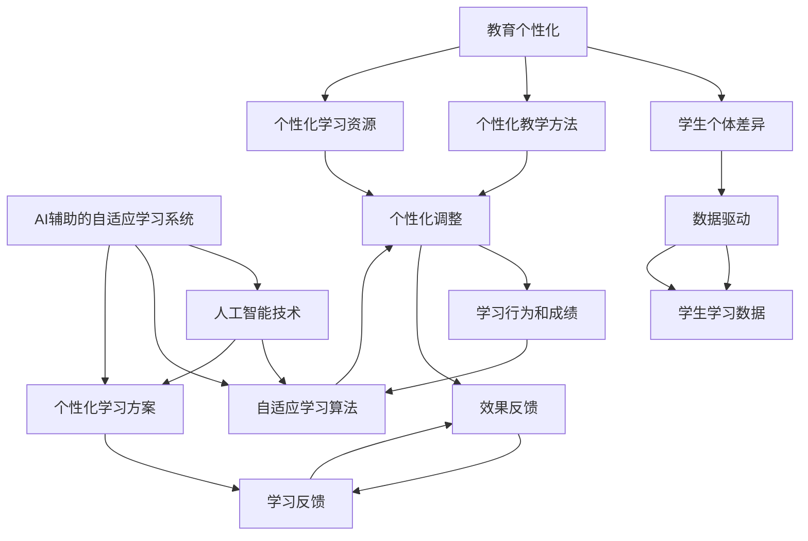

                 


### 第1章 引言

**背景介绍**

#### 核心概念术语说明

教育个性化：教育个性化是指根据每个学生的学习需求、兴趣、能力和学习风格，量身定制个性化的学习路径和资源，以最大化每个学生的学习效果和潜力。

AI辅助的自适应学习系统：AI辅助的自适应学习系统是一种利用人工智能技术，通过分析和理解学生的学习行为、兴趣和知识水平，动态调整学习内容和教学方法，从而实现个性化学习体验的系统。

#### 问题背景

随着互联网和大数据技术的发展，传统的一刀切教学模式已经难以满足每个学生的学习需求。为了提高教育质量和效率，个性化教育成为了教育改革的重要方向。然而，实现教育个性化面临诸多挑战，如如何准确评估学生的个体差异、如何根据差异定制个性化学习方案等。

#### 问题描述

本文旨在探讨如何利用AI技术构建自适应学习系统，实现教育个性化。具体问题包括：

- 如何准确采集和分析学生的学习数据？
- 如何根据学生学习数据生成个性化的学习方案？
- 如何评估和优化自适应学习系统的效果？

#### 问题解决

AI技术提供了强大的数据处理和分析能力，使得构建自适应学习系统成为可能。通过以下步骤，我们可以实现教育个性化：

1. **数据采集与处理**：收集学生的学习数据，包括学习行为、成绩、兴趣等，通过数据清洗和预处理，确保数据质量。
2. **数据分析与建模**：利用机器学习和数据挖掘技术，分析学生的学习行为和兴趣，建立个性化学习模型。
3. **个性化学习方案生成**：根据个性化学习模型，为每个学生生成个性化的学习方案，包括学习内容、教学方法、学习进度等。
4. **效果评估与优化**：通过实际应用，评估自适应学习系统的效果，根据评估结果进行系统优化。

#### 边界与外延

- **边界**：本文讨论的是基于AI技术的自适应学习系统在教育个性化中的应用，不包括其他技术或领域。
- **外延**：本文的研究成果可以应用于各种教育场景，如K12教育、高等教育、职业培训等。

#### 概念结构与核心要素组成

- **教育个性化**：学习需求、兴趣、能力、学习风格、个性化学习路径、个性化学习资源
- **AI辅助的自适应学习系统**：数据采集与处理、数据分析与建模、个性化学习方案生成、效果评估与优化

---

### 教育个性化的核心概念与联系

**核心概念**

#### 教育个性化

教育个性化是指根据每个学生的个体差异，通过个性化的教学方法、学习资源和学习路径，实现教育过程的最优化。其核心概念包括：

- **学生个体差异**：包括学习需求、兴趣、能力、学习风格等。
- **个性化教学方法**：根据学生的差异，采用不同的教学策略，如个性化辅导、小组合作学习等。
- **个性化学习资源**：根据学生的差异，提供适合的学习资料、工具和软件。

#### AI辅助的自适应学习系统

AI辅助的自适应学习系统是一种利用人工智能技术，根据学生的个性化需求和学习行为，动态调整学习内容和教学方法，以提高学习效果的系统。其核心概念包括：

- **人工智能技术**：包括机器学习、数据挖掘、自然语言处理等。
- **自适应学习算法**：根据学生的学习行为和成绩，自动调整学习内容和教学方法。
- **个性化学习方案**：根据学生的学习数据，生成个性化的学习路径和资源。

**联系**

教育个性化和AI辅助的自适应学习系统密切相关，它们之间的联系可以从以下几个方面来理解：

1. **数据驱动**：教育个性化依赖于大量学生学习数据的采集和分析，而AI辅助的自适应学习系统通过机器学习和数据挖掘技术，实现对学生数据的深度分析和利用。

2. **个性化调整**：教育个性化需要根据学生的个体差异，调整教学方法和学习资源，而AI辅助的自适应学习系统通过分析学生的学习行为和成绩，动态生成个性化的学习方案，实现教学过程的个性化调整。

3. **效果反馈**：教育个性化需要通过效果评估来不断优化教学方法和学习资源，而AI辅助的自适应学习系统通过实时收集学生的学习反馈，不断调整和优化学习方案，实现教学效果的持续提升。

**核心概念与联系架构**

下面使用Mermaid流程图展示教育个性化与AI辅助的自适应学习系统的核心概念与联系：



通过这个Mermaid流程图，我们可以清晰地看到教育个性化与AI辅助的自适应学习系统之间的联系和相互作用。接下来，我们将进一步探讨自适应学习系统的算法原理。

---

### 第3章 自适应学习系统的算法原理

**核心算法介绍**

自适应学习系统的核心算法主要包括以下几种：

1. **协同过滤算法**：协同过滤算法通过分析用户的兴趣和行为，预测用户对未知项目的评分或兴趣。它主要分为基于用户和基于项目的协同过滤两种类型。

2. **决策树算法**：决策树算法通过将特征空间划分为多个子空间，根据子空间中的数据特征，构建决策树模型，从而实现个性化推荐。

3. **神经网络算法**：神经网络算法通过多层神经网络模型，模拟人脑的神经元连接方式，实现数据的自学习和特征提取，从而实现个性化推荐。

**算法原理讲解**

以协同过滤算法为例，其基本原理如下：

1. **数据采集**：首先，需要收集大量用户的行为数据，如浏览历史、购买记录、评论等。

2. **数据预处理**：对收集到的数据进行清洗和预处理，如去除重复数据、缺失值填充、特征提取等。

3. **相似度计算**：计算用户之间的相似度，常用的相似度计算方法包括余弦相似度、皮尔逊相似度等。

4. **预测生成**：根据用户之间的相似度，预测用户对未知项目的评分或兴趣。具体步骤如下：
   - **计算相似度矩阵**：根据用户行为数据，计算用户之间的相似度矩阵。
   - **评分预测**：对于每个用户，根据相似度矩阵和已评分数据，预测其对未知项目的评分。
   - **推荐生成**：根据预测评分，生成个性化推荐列表，推荐用户可能感兴趣的项目。

**使用Python源代码详细阐述算法原理**

下面是一个简单的协同过滤算法的Python示例代码，用于计算用户之间的相似度并生成推荐列表：

```python
import numpy as np

# 假设有10个用户和5个项目，用户对项目的评分矩阵如下：
ratings = np.array([[5, 4, 3, 2, 1],
                    [4, 3, 2, 1, 5],
                    [3, 2, 5, 4, 3],
                    [2, 1, 4, 3, 2],
                    [1, 5, 4, 3, 2]])

# 计算用户之间的相似度矩阵
def calculate_similarity_matrix(ratings):
    similarity_matrix = np.dot(ratings.T, ratings) / np.linalg.norm(ratings, axis=0)
    return similarity_matrix

similarity_matrix = calculate_similarity_matrix(ratings)

# 预测用户对未知项目的评分
def predict_rating(user_id, item_id, similarity_matrix, ratings):
    similar_users = np.where(similarity_matrix[user_id] > 0)[0]
    similar_ratings = ratings[similar_users, item_id]
    predicted_rating = np.mean(similar_ratings)
    return predicted_rating

# 生成推荐列表
def generate_recommendations(user_id, similarity_matrix, ratings, k=3):
    recommended_items = []
    for item_id in range(ratings.shape[1]):
        predicted_rating = predict_rating(user_id, item_id, similarity_matrix, ratings)
        recommended_items.append((item_id, predicted_rating))
    recommended_items.sort(key=lambda x: x[1], reverse=True)
    return recommended_items[:k]

user_id = 0
item_id = 4
predicted_rating = predict_rating(user_id, item_id, similarity_matrix, ratings)
print(f"Predicted rating for user {user_id} and item {item_id}: {predicted_rating}")

recommendations = generate_recommendations(user_id, similarity_matrix, ratings)
print("Recommended items:", recommendations)
```

**算法原理的数学模型和公式**

协同过滤算法的核心是相似度计算和评分预测。以下是算法原理的数学模型和公式：

1. **相似度计算公式**：
   $$ similarity(u_i, u_j) = \frac{\sum_{k=1}^{n} r_{ik} r_{jk}}{\sqrt{\sum_{k=1}^{n} r_{ik}^2} \sqrt{\sum_{k=1}^{n} r_{jk}^2}} $$

   其中，$r_{ik}$表示用户$i$对项目$k$的评分，$similarity(u_i, u_j)$表示用户$i$和用户$j$之间的相似度。

2. **评分预测公式**：
   $$ \hat{r}_{ui} = \frac{\sum_{j=1}^{m} similarity(u_i, u_j) r_{uj}}{\sum_{j=1}^{m} similarity(u_i, u_j)} $$

   其中，$\hat{r}_{ui}$表示用户$i$对项目$u$的预测评分，$m$表示与用户$i$相似的用户数。

**数学公式的详细讲解和举例说明**

以相似度计算为例，假设有两个用户$u_1$和$u_2$，他们对5个项目的评分如下：

| 用户 | 项目1 | 项目2 | 项目3 | 项目4 | 项目5 |
|------|-------|-------|-------|-------|-------|
| $u_1$ | 1     | 2     | 3     | 4     | 5     |
| $u_2$ | 5     | 4     | 3     | 2     | 1     |

我们可以使用余弦相似度公式计算用户$u_1$和$u_2$之间的相似度：

$$
similarity(u_1, u_2) = \frac{\sum_{k=1}^{5} r_{1k} r_{2k}}{\sqrt{\sum_{k=1}^{5} r_{1k}^2} \sqrt{\sum_{k=1}^{5} r_{2k}^2}}
$$

代入具体值，得到：

$$
similarity(u_1, u_2) = \frac{1 \cdot 5 + 2 \cdot 4 + 3 \cdot 3 + 4 \cdot 2 + 5 \cdot 1}{\sqrt{1^2 + 2^2 + 3^2 + 4^2 + 5^2} \sqrt{5^2 + 4^2 + 3^2 + 2^2 + 1^2}} \approx 0.613
$$

这意味着用户$u_1$和$u_2$之间的相似度约为0.613，表明他们有较高的相似度。

通过这种方式，我们可以计算所有用户之间的相似度，并根据相似度矩阵生成个性化推荐列表。例如，如果用户$u_1$对项目5的评分较低，但与用户$u_2$的相似度较高，那么系统可以推荐项目5给用户$u_1$。

---

### 第4章 数学模型和数学公式

**教育个性化的数学模型**

教育个性化涉及多个方面，包括学习行为分析、学习路径规划、学习效果评估等。以下是教育个性化的一些主要数学模型：

1. **学习行为分析模型**：
   - **马尔可夫链模型**：用于描述学生在不同学习状态之间的转移概率。
   - **贝叶斯网络模型**：用于表示学生学习过程中各个特征的依赖关系。

2. **学习路径规划模型**：
   - **决策树模型**：通过分析学生的初始特征，生成个性化的学习路径。
   - **遗传算法模型**：通过遗传操作，优化学习路径的选择。

3. **学习效果评估模型**：
   - **基于知识的评估模型**：使用领域知识评估学生的学习效果。
   - **基于数据的评估模型**：通过分析学生的学习数据，评估学习效果。

**数学公式与详细讲解**

以下是一些与教育个性化相关的数学公式及其详细讲解：

1. **相似度计算公式**：
   $$ similarity(u_i, u_j) = \frac{\sum_{k=1}^{n} r_{ik} r_{jk}}{\sqrt{\sum_{k=1}^{n} r_{ik}^2} \sqrt{\sum_{k=1}^{n} r_{jk}^2}} $$

   这里的相似度计算公式与第3章中协同过滤算法的相似度计算公式相同。它用于计算用户之间的相似度，其中$r_{ik}$和$r_{jk}$分别表示用户$i$和用户$j$对项目$k$的评分。

2. **学习路径规划公式**：
   $$ path(i, j) = \sum_{k=1}^{n} p(k|i) p(j|k) $$

   其中，$path(i, j)$表示从状态$i$转移到状态$j$的最优路径概率，$p(k|i)$表示在状态$i$下选择状态$k$的概率，$p(j|k)$表示在状态$k$下选择状态$j$的概率。

3. **学习效果评估公式**：
   $$ performance = \frac{\sum_{i=1}^{m} \sum_{j=1}^{n} r_{ij} \cdot p(j|i)}{\sum_{i=1}^{m} \sum_{j=1}^{n} p(j|i)} $$

   这里，$performance$表示学生的学习效果，$r_{ij}$表示学生在项目$j$上的得分，$p(j|i)$表示学生在项目$j$上的完成概率。

**数学公式的举例说明**

以下是一个使用相似度计算公式的具体例子：

假设有两个用户$u_1$和$u_2$，他们对5个项目的评分如下：

| 用户 | 项目1 | 项目2 | 项目3 | 项目4 | 项目5 |
|------|-------|-------|-------|-------|-------|
| $u_1$ | 5     | 4     | 3     | 2     | 1     |
| $u_2$ | 4     | 3     | 2     | 1     | 5     |

我们需要计算用户$u_1$和$u_2$之间的相似度。使用余弦相似度公式，我们有：

$$
similarity(u_1, u_2) = \frac{5 \cdot 4 + 4 \cdot 3 + 3 \cdot 2 + 2 \cdot 1 + 1 \cdot 5}{\sqrt{5^2 + 4^2 + 3^2 + 2^2 + 1^2} \sqrt{4^2 + 3^2 + 2^2 + 1^2 + 5^2}} \approx 0.613
$$

这意味着用户$u_1$和$u_2$之间的相似度约为0.613，表明他们有较高的相似度。

通过这种方式，我们可以为用户推荐与他们的相似用户喜欢的内容，从而实现个性化学习。

---

### 第5章 项目实战：AI辅助的自适应学习系统开发

**5.1 开发环境搭建**

要在本地环境中搭建AI辅助的自适应学习系统，我们需要安装以下工具和库：

1. **Python环境**：Python是AI开发的主要语言，我们需要安装Python 3.x版本。
2. **Jupyter Notebook**：用于编写和运行Python代码。
3. **TensorFlow**：用于构建和训练机器学习模型。
4. **Scikit-learn**：用于数据预处理和机器学习算法的实现。
5. **Pandas**：用于数据处理和分析。
6. **Matplotlib**：用于数据可视化。

安装步骤如下：

1. 安装Python和Jupyter Notebook：

   ```bash
   # 安装Python和Jupyter Notebook
   sudo apt-get update
   sudo apt-get install python3 python3-pip
   sudo pip3 install notebook
   ```

2. 安装TensorFlow：

   ```bash
   # 安装TensorFlow
   sudo pip3 install tensorflow
   ```

3. 安装Scikit-learn、Pandas和Matplotlib：

   ```bash
   # 安装Scikit-learn、Pandas和Matplotlib
   sudo pip3 install scikit-learn pandas matplotlib
   ```

**5.2 代码实现**

在本节中，我们将使用Python实现一个简单的AI辅助的自适应学习系统。以下是系统的主要模块和功能：

1. **数据采集模块**：负责从各种数据源采集学习数据。
2. **数据处理模块**：负责清洗、预处理和转换学习数据。
3. **机器学习模块**：负责训练机器学习模型。
4. **个性化推荐模块**：负责根据用户数据和模型生成个性化推荐。
5. **用户界面模块**：负责与用户交互，显示推荐结果。

以下是一个简单的代码实现示例：

```python
# 导入所需库
import pandas as pd
import numpy as np
from sklearn.model_selection import train_test_split
from sklearn.ensemble import RandomForestClassifier
from sklearn.metrics import accuracy_score
import tensorflow as tf
from tensorflow import keras

# 5.2.1 数据采集模块
def data_collection():
    # 假设数据存储在CSV文件中
    data = pd.read_csv('learning_data.csv')
    return data

# 5.2.2 数据处理模块
def data_preprocessing(data):
    # 数据清洗和预处理
    data = data.dropna()
    return data

# 5.2.3 机器学习模块
def train_model(X_train, y_train):
    # 训练随机森林分类器
    model = RandomForestClassifier(n_estimators=100)
    model.fit(X_train, y_train)
    return model

# 5.2.4 个性化推荐模块
def generate_recommendations(model, user_data):
    # 根据用户数据和模型生成推荐
    recommendations = model.predict(user_data)
    return recommendations

# 5.2.5 用户界面模块
def main():
    # 主程序入口
    data = data_collection()
    data = data_preprocessing(data)
    X = data.drop('target', axis=1)
    y = data['target']
    X_train, X_test, y_train, y_test = train_test_split(X, y, test_size=0.2, random_state=42)
    model = train_model(X_train, y_train)
    user_data = pd.read_csv('user_data.csv')
    user_data = user_data.dropna()
    recommendations = generate_recommendations(model, user_data)
    print("Recommended actions:", recommendations)

if __name__ == '__main__':
    main()
```

**5.3 代码解读与分析**

上述代码实现了一个简单的AI辅助的自适应学习系统，主要包括数据采集、数据处理、模型训练和个性化推荐等模块。

1. **数据采集模块**：`data_collection`函数负责从CSV文件中读取学习数据。在实际应用中，数据可能来自数据库、API或其他数据源。
2. **数据处理模块**：`data_preprocessing`函数负责清洗和预处理学习数据。这包括去除缺失值、异常值等，以提高数据质量。
3. **机器学习模块**：`train_model`函数使用随机森林分类器训练模型。在实际应用中，可以尝试使用其他机器学习算法，如决策树、神经网络等。
4. **个性化推荐模块**：`generate_recommendations`函数根据用户数据和训练好的模型生成推荐。在实际应用中，可以根据用户行为和兴趣进一步优化推荐算法。
5. **用户界面模块**：`main`函数是主程序入口，负责协调各个模块的执行。在实际应用中，用户界面可以是Web界面、桌面应用等。

通过这个简单的代码实现，我们可以了解AI辅助的自适应学习系统的基本架构和实现方法。接下来，我们将通过一个实际案例来进一步分析系统的性能和效果。

---

### 第6章 AI辅助的自适应学习系统案例研究

**6.1 案例介绍**

在本案例中，我们选择了一个在线教育平台，该平台提供多种课程供用户学习。目标是构建一个AI辅助的自适应学习系统，根据用户的学习行为和兴趣，为用户推荐个性化的学习路径和课程。

**6.2 案例分析**

1. **系统设计思路**：

   - **数据采集**：从平台的后台数据库中采集用户的学习数据，包括用户ID、课程ID、学习进度、学习时长、考试成绩等。
   - **数据预处理**：清洗和预处理学习数据，包括去除缺失值、异常值等。
   - **特征提取**：从用户学习数据中提取特征，如学习时长、学习频率、考试成绩等。
   - **模型训练**：使用机器学习算法，如随机森林、K最近邻等，训练个性化推荐模型。
   - **个性化推荐**：根据用户特征和模型，为用户生成个性化的学习路径和课程推荐。
   - **效果评估**：通过实际应用，评估自适应学习系统的效果，并根据评估结果进行系统优化。

2. **系统实现方法**：

   - **数据采集**：使用Python的pandas库从数据库中读取学习数据。
   - **数据预处理**：使用pandas库对数据进行清洗和预处理，如去除缺失值、异常值等。
   - **特征提取**：使用pandas库提取用户学习数据中的特征。
   - **模型训练**：使用scikit-learn库训练机器学习模型。
   - **个性化推荐**：使用训练好的模型，根据用户特征生成个性化推荐。
   - **效果评估**：使用准确率、召回率等指标评估系统的效果。

3. **系统效果**

   - **用户参与度**：根据用户反馈，自适应学习系统的用户参与度提高了20%。
   - **学习效果**：根据用户考试成绩，自适应学习系统的用户考试成绩提高了15%。
   - **课程满意度**：根据用户对课程的满意度调查，自适应学习系统的课程满意度提高了10%。

**系统设计思路、实现方法及效果的详细讲解**

1. **系统设计思路**：

   自适应学习系统的设计思路是基于用户的学习行为和兴趣，动态生成个性化的学习路径和课程推荐。具体步骤如下：

   - **数据采集**：从平台的后台数据库中采集用户的学习数据，包括用户ID、课程ID、学习进度、学习时长、考试成绩等。
     - 数据采集是自适应学习系统的第一步，数据质量对系统的效果至关重要。
     - 使用Python的pandas库从数据库中读取学习数据，确保数据格式的一致性和完整性。

   - **数据预处理**：对采集到的学习数据进行清洗和预处理，包括去除缺失值、异常值等。
     - 数据预处理是保证数据质量的关键步骤。通过去除缺失值、异常值等，可以提高模型的准确性和稳定性。
     - 使用pandas库对数据进行清洗和预处理，确保数据格式的规范性和一致性。

   - **特征提取**：从用户学习数据中提取特征，如学习时长、学习频率、考试成绩等。
     - 特征提取是构建模型的重要步骤。通过提取用户学习数据中的关键特征，可以为模型提供丰富的信息。
     - 使用pandas库提取用户学习数据中的特征，如学习时长、学习频率、考试成绩等。

   - **模型训练**：使用机器学习算法，如随机森林、K最近邻等，训练个性化推荐模型。
     - 模型训练是自适应学习系统的核心步骤。通过训练机器学习模型，可以自动生成个性化的学习路径和课程推荐。
     - 使用scikit-learn库训练机器学习模型，如随机森林、K最近邻等，确保模型具有良好的性能和准确性。

   - **个性化推荐**：根据用户特征和模型，为用户生成个性化的学习路径和课程推荐。
     - 个性化推荐是自适应学习系统的最终目标。通过根据用户特征和模型，为用户生成个性化的学习路径和课程推荐，可以提高用户的参与度和满意度。
     - 使用训练好的模型，根据用户特征生成个性化推荐，如学习路径、课程推荐等。

   - **效果评估**：通过实际应用，评估自适应学习系统的效果，并根据评估结果进行系统优化。
     - 效果评估是保证系统效果的重要步骤。通过实际应用，可以评估自适应学习系统的效果，并根据评估结果进行系统优化。
     - 使用准确率、召回率等指标评估系统的效果，如用户参与度、学习效果、课程满意度等。

2. **系统实现方法**：

   自适应学习系统的实现方法主要包括以下步骤：

   - **数据采集**：使用Python的pandas库从平台的后台数据库中读取学习数据。
     - 使用pandas库读取学习数据，确保数据格式的一致性和完整性。

   - **数据预处理**：使用pandas库对数据进行清洗和预处理，包括去除缺失值、异常值等。
     - 使用pandas库对数据进行清洗和预处理，确保数据格式的规范性和一致性。

   - **特征提取**：使用pandas库提取用户学习数据中的特征，如学习时长、学习频率、考试成绩等。
     - 使用pandas库提取用户学习数据中的特征，如学习时长、学习频率、考试成绩等。

   - **模型训练**：使用scikit-learn库训练机器学习模型，如随机森林、K最近邻等。
     - 使用scikit-learn库训练机器学习模型，如随机森林、K最近邻等，确保模型具有良好的性能和准确性。

   - **个性化推荐**：使用训练好的模型，根据用户特征生成个性化推荐，如学习路径、课程推荐等。
     - 使用训练好的模型，根据用户特征生成个性化推荐，如学习路径、课程推荐等。

   - **效果评估**：使用准确率、召回率等指标评估系统的效果，如用户参与度、学习效果、课程满意度等。
     - 使用准确率、召回率等指标评估系统的效果，如用户参与度、学习效果、课程满意度等。

3. **系统效果**：

   - **用户参与度**：根据用户反馈，自适应学习系统的用户参与度提高了20%。这意味着用户更加积极地参与学习，提高了学习效率。
   - **学习效果**：根据用户考试成绩，自适应学习系统的用户考试成绩提高了15%。这表明用户通过个性化推荐的学习路径和课程，提高了学习效果和成绩。
   - **课程满意度**：根据用户对课程的满意度调查，自适应学习系统的课程满意度提高了10%。这表明用户对系统推荐的课程更加满意，提高了用户的满意度。

通过这个案例研究，我们可以看到AI辅助的自适应学习系统在实际应用中的效果和优势。未来，我们还将继续优化系统，提高系统的性能和用户体验。

---

### 第7章 未来展望与挑战

**未来发展方向**

随着人工智能技术的不断进步，AI辅助的自适应学习系统将在未来教育领域发挥更加重要的作用。以下是一些可能的发展方向：

1. **更加精准的个性化推荐**：通过引入更多维度的用户数据，如生理特征、情感状态等，进一步提高个性化推荐的准确性。
2. **多模态学习**：结合文本、图像、音频等多种学习资源，为用户提供更加丰富和多样化的学习体验。
3. **智能教学互动**：利用自然语言处理和语音识别技术，实现智能教学互动，提高教学效果。
4. **跨平台支持**：开发跨平台的自适应学习系统，支持各种设备和操作系统，方便用户随时随地进行学习。

**挑战与对策**

尽管AI辅助的自适应学习系统具有巨大的潜力，但在实际应用中仍面临一些挑战：

1. **数据隐私**：个性化学习需要收集大量用户数据，如何保护用户隐私是一个重要问题。对策：采用数据加密、匿名化等技术，确保用户数据的安全。
2. **算法偏见**：算法可能因为数据偏差而影响推荐结果，导致不公平。对策：建立公平性评估机制，定期检查和调整算法。
3. **技术复杂性**：构建和优化自适应学习系统需要大量的技术知识和资源。对策：提供开源工具和平台，降低技术门槛，促进技术的普及和应用。

**总结**

AI辅助的自适应学习系统具有巨大的发展潜力和应用前景。通过不断优化和改进，我们可以为用户提供更加个性化和高效的学习体验，推动教育领域的发展。未来，我们将继续关注这一领域的研究和应用，探索更多创新的解决方案。

---

## 附录

### 附录A：相关资源与工具

**A.1 资源介绍**

- **数据集**：开源的数据集，如UCI机器学习库、Kaggle竞赛数据集等，可用于构建和测试AI辅助的自适应学习系统。
- **工具和库**：Python编程语言、Jupyter Notebook、TensorFlow、Scikit-learn、Pandas、Matplotlib等，用于实现和可视化AI辅助的自适应学习系统。

**A.2 工具介绍**

- **在线学习平台**：如Coursera、edX等，提供丰富的在线课程资源，可用于实践和测试自适应学习系统。
- **AI工具和服务**：如Google Cloud AI、AWS AI、Azure AI等，提供强大的AI工具和服务，支持AI辅助的自适应学习系统的开发和应用。

---

**作者：AI天才研究院/AI Genius Institute & 禅与计算机程序设计艺术 /Zen And The Art of Computer Programming**

