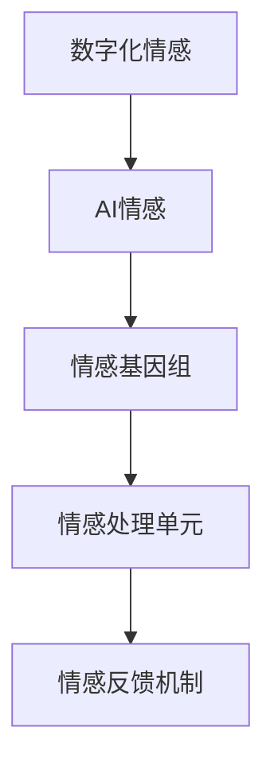

                 

## 数字化情感基因组：解码AI情感的基本单元

### 关键词：数字化情感、AI情感、情感基因组、情感处理单元、情感反馈机制

#### 摘要：

在人工智能（AI）迅速发展的今天，情感智能已成为一个备受关注的研究领域。本文旨在深入探讨数字化情感基因组，解码AI情感的基本单元，以及其在各种应用场景中的重要性。文章将首先介绍数字化情感和AI情感的基本概念，接着阐述情感基因组的定义和结构，最后分析情感基因组与AI情感的融合及其应用前景。

### 第1章：问题背景与定义

#### 1.1 问题的提出

**1.1.1 数字化情感的重要性**

数字化情感是现代信息社会中不可或缺的一部分。随着互联网和物联网的普及，人们的情感活动被越来越多地转化为数字数据。这些数据不仅有助于我们了解个体的情感状态，还可以为智能系统提供丰富的信息资源。

**1.1.2 AI情感的需求与挑战**

AI情感是人工智能领域的一个重要分支，旨在使机器具备理解和模拟人类情感的能力。然而，如何准确地捕捉、处理和表达情感，是当前研究和应用中的重大挑战。

**1.1.3 情感基因组的理念**

情感基因组是一种概念，它试图通过系统化的方式来解析情感的本质。这个理念涉及到情感数据的编码、处理和利用，为AI情感研究提供了一个全新的视角。

#### 1.2 基本概念

**1.2.1 数字化情感**

数字化情感是指将人的情感状态转化为可量化的数字信息，以便于计算机处理和分析。

**1.2.2 AI情感**

AI情感是指人工智能系统能够理解和模拟人类情感的能力，包括情感识别、情感分析和情感生成等方面。

**1.2.3 情感基因组**

情感基因组是一种对情感数据进行编码和解析的结构，它包括情感处理单元和情感反馈机制等基本组成部分。

#### 1.3 研究目标与意义

**1.3.1 研究目标**

本研究的目标是探索数字化情感基因组在AI情感中的应用，提高情感智能系统的性能和可靠性。

**1.3.2 研究意义**

研究数字化情感基因组对于提升人工智能的情感处理能力具有重要意义，有助于推动智能系统在情感交互、教育、医疗等领域的应用。

**1.3.3 边界与外延**

本文的研究边界主要涉及数字化情感和AI情感的技术原理和应用，不包括心理学和神经科学方面的深入探讨。

#### 1.4 核心概念联系图

### 1.5 本章小结

本章介绍了数字化情感基因组的研究背景和基本概念，为后续章节的深入探讨奠定了基础。在接下来的章节中，我们将进一步分析数字化情感和AI情感的技术原理，并探讨情感基因组的结构与应用。

----------------------------------------------------------------

### 第2章：数字化情感原理

#### 2.1 数字化情感的技术基础

**2.1.1 传感器与数据采集**

数字化情感的核心在于将人的情感状态转化为数字数据。这需要依赖于各种传感器技术，如生理传感器、行为传感器和环境传感器。这些传感器可以捕捉心率、皮肤电导、面部表情等生物信号，从而获取情感信息。

**2.1.2 数据处理与分析**

获取到情感数据后，需要对数据进行处理和分析。数据处理包括数据清洗、数据整合和数据归一化等步骤。数据分析则涉及特征提取、模式识别和情感分类等技术。

**2.1.3 数据存储与检索**

处理后的情感数据需要存储在数据库中，以便于后续的查询和分析。数据存储需要考虑数据的安全性和可靠性，而数据检索则需要快速准确地找到所需的数据。

#### 2.2 数字化情感的特征提取

**2.2.1 特征提取方法**

特征提取是数字化情感的核心步骤之一。常用的特征提取方法包括时域特征提取、频域特征提取和时频特征提取等。时域特征提取主要关注信号的时序变化，频域特征提取关注信号的频率成分，时频特征提取则结合了时间和频率信息。

**2.2.2 特征重要性分析**

特征重要性分析是评估特征对情感分类贡献程度的过程。常用的方法包括特征选择和特征加权。特征选择通过剔除冗余特征来提高模型的性能，而特征加权则通过调整特征权重来优化分类结果。

**2.2.3 特征对比表格**

以下是一个特征对比表格，展示了不同特征提取方法的优缺点：

| 方法         | 优点                           | 缺点                         |
|------------|----------------------------------|------------------------------|
| 时域特征提取 | 简单易实现，计算复杂度低       | 信息丢失，难以捕捉复杂情感  |
| 频域特征提取 | 可以捕捉信号的频率信息         | 需要大量的计算资源           |
| 时频特征提取 | 结合时间和频率信息，信息丰富   | 计算复杂度较高               |

#### 2.3 数字化情感的计算模型

**2.3.1 经典计算模型**

经典计算模型包括决策树、支持向量机和朴素贝叶斯等。这些模型在情感分类任务中取得了较好的效果，但存在计算复杂度高、难以处理高维数据等问题。

**2.3.2 深度学习模型**

深度学习模型，特别是卷积神经网络（CNN）和循环神经网络（RNN），在情感分类任务中表现出了强大的能力。CNN可以有效地捕捉空间特征，而RNN可以处理序列数据。

**2.3.3 模型对比分析**

以下是一个模型对比表格，展示了不同计算模型的性能和适用场景：

| 模型         | 性能                           | 适用场景                    |
|------------|----------------------------------|-----------------------------|
| 决策树       | 易于解释，计算复杂度低         | 数据量较小，特征较少       |
| 支持向量机   | 分隔能力强，计算复杂度较高     | 数据量较大，特征较多       |
| 朴素贝叶斯   | 计算简单，适用于高维数据       | 特征相关性高，适用性有限   |
| 卷积神经网络 | 强大的特征提取能力             | 数据量大，计算资源需求高   |
| 循环神经网络 | 可以处理序列数据               | 计算复杂度高，训练时间长   |

### 2.4 本章小结

本章介绍了数字化情感的技术基础、特征提取方法和计算模型。通过这些技术，我们可以将人的情感状态转化为数字数据，并进行有效的处理和分析。在下一章中，我们将进一步探讨AI情感的基本原理。

----------------------------------------------------------------

### 第3章：AI情感原理

#### 3.1 AI情感的基本概念

**3.1.1 AI情感的定义**

AI情感是指人工智能系统能够理解和模拟人类情感的能力。这包括感知情感、表达情感和调节情感等方面。

**3.1.2 AI情感的功能**

AI情感的主要功能包括情感识别、情感分析和情感生成。情感识别是指系统能够识别用户或环境的情感状态；情感分析是指系统能够对情感数据进行分析和解释；情感生成是指系统能够根据需求和场景生成适当的情感表达。

**3.1.3 AI情感的类型**

AI情感可以分为内在情感和外在情感。内在情感是指系统内部的情感状态，如快乐、悲伤等；外在情感是指系统对外界环境或用户的情感反应，如友好、冷漠等。

#### 3.2 AI情感的实现技术

**3.2.1 自然语言处理**

自然语言处理（NLP）是AI情感实现的重要技术之一。通过NLP技术，系统可以理解和处理文本中的情感信息，从而实现情感识别和分析。

**3.2.2 计算机视觉**

计算机视觉技术可以捕捉和解析人类的面部表情、身体语言等非言语情感信息。这些信息对于实现情感识别和分析具有重要意义。

**3.2.3 机器人技术**

机器人技术使得AI情感能够在实际应用中得到实现。通过机器人，系统可以模拟人类的行为和情感表达，与用户进行情感交互。

#### 3.3 AI情感的实现技术

**3.3.1 神经网络模型**

神经网络模型是AI情感实现的核心技术之一。神经网络通过模拟人脑的结构和功能，实现对情感数据的处理和分析。常用的神经网络模型包括卷积神经网络（CNN）和循环神经网络（RNN）。

**3.3.2 强化学习模型**

强化学习模型通过不断学习和优化策略，实现AI情感的表达和调节。强化学习模型在情感生成和控制方面具有显著的优势。

**3.3.3 生成对抗网络**

生成对抗网络（GAN）是一种新型的神经网络模型，通过对抗训练实现情感数据的生成和优化。GAN在情感生成和多样化方面具有广泛的应用前景。

#### 3.4 AI情感的实现技术

**3.4.1 情感识别**

情感识别是AI情感实现的关键环节。通过情感识别，系统可以准确地捕捉和理解用户的情感状态。常用的情感识别方法包括文本情感分析、语音情感识别和图像情感识别等。

**3.4.2 情感分析**

情感分析是指对情感数据进行深入分析和解释的过程。情感分析可以帮助系统更好地理解用户的情感需求和行为意图，为后续的情感生成和调节提供支持。

**3.4.3 情感生成**

情感生成是指系统根据需求和场景生成适当的情感表达。情感生成需要考虑用户的情感状态、场景特征和系统策略等因素。常见的情感生成方法包括文本生成、语音生成和图像生成等。

#### 3.5 本章小结

本章介绍了AI情感的基本概念、实现技术和应用方法。通过这些技术和方法，AI系统可以实现对人类情感的识别、分析和生成。在下一章中，我们将探讨情感基因组的概念与结构。

----------------------------------------------------------------

### 第4章：情感基因组的概念与结构

#### 4.1 情感基因组的定义

**4.1.1 情感基因组的组成**

情感基因组是指一组与情感相关的基因、蛋白质和信号通路，它们共同构成了情感的基础结构。情感基因组包括情感处理单元、情感反馈机制和情感调控网络等基本组成部分。

**4.1.2 情感基因组的分类**

根据功能和特征，情感基因组可以分为以下几类：

- **情感处理单元**：负责捕捉、处理和存储情感信息。
- **情感反馈机制**：负责将情感信息转化为行为和情绪反应。
- **情感调控网络**：负责调节情感状态，维持情感平衡。

#### 4.2 情感基因组的特征

**4.2.1 特征提取方法**

情感基因组的特征提取是解析情感基因组的关键步骤。常用的特征提取方法包括基因表达谱分析、蛋白质组学和信号通路分析等。

**4.2.2 特征重要性分析**

特征重要性分析是评估基因、蛋白质和信号通路在情感基因组中的贡献程度。常用的方法包括基因集富集分析和主成分分析等。

**4.2.3 特征对比表格**

以下是一个特征对比表格，展示了不同特征提取方法的优缺点：

| 方法         | 优点                           | 缺点                         |
|------------|----------------------------------|------------------------------|
| 基因表达谱分析 | 可以全面反映基因活性         | 数据量大，计算复杂度高       |
| 蛋白质组学 | 可以直接反映蛋白质状态       | 数据复杂，需要高精度设备     |
| 信号通路分析 | 可以揭示基因和蛋白质之间的关联 | 分析难度大，结果解释复杂     |

#### 4.3 情感基因组的架构设计

**4.3.1 情感处理单元**

情感处理单元是情感基因组的中心，负责捕捉和处理情感信息。它由一系列的基因和蛋白质组成，如转录因子、受体和信号传导分子等。

**4.3.2 情感反馈机制**

情感反馈机制是情感处理单元的外部接口，负责将情感信息转化为行为和情绪反应。它包括神经元、肌肉和内分泌系统等组成部分。

**4.3.3 情感调控网络**

情感调控网络是情感基因组的核心调节系统，负责维持情感状态的平衡。它由一系列的基因、蛋白质和信号通路组成，如神经递质调节、激素调节和免疫调节等。

#### 4.4 情感基因组与AI情感的关联

**4.4.1 情感基因组的编码与解码**

情感基因组的编码与解码是实现AI情感的关键。通过情感基因组的编码，系统可以捕捉和理解人类情感；通过情感基因组的解码，系统可以生成和表达适当的情感反应。

**4.4.2 情感基因组的融合与应用**

情感基因组的融合是将情感基因组与AI技术相结合的过程。通过情感基因组的融合，系统可以实现对人类情感的理解、模拟和调节，从而提高AI系统的情感智能水平。

#### 4.5 本章小结

本章介绍了情感基因组的概念与结构，分析了情感基因组的特征和功能。通过情感基因组的编码与解码，AI系统可以实现对人类情感的理解和模拟。在下一章中，我们将探讨情感基因组与AI情感的融合及其应用。

----------------------------------------------------------------

### 第5章：情感基因组与AI情感的融合

#### 5.1 情感基因组在AI中的应用

**5.1.1 情感识别**

情感基因组在AI情感识别中扮演着关键角色。通过分析情感基因组的编码信息，AI系统可以准确地识别用户的情感状态，从而为后续的情感分析和调节提供基础。

**5.1.2 情感分析**

情感基因组的数据可以为AI情感分析提供丰富的信息资源。通过情感基因组的特征提取和分析，AI系统可以深入理解用户的情感需求和行为意图，从而提供更精准的服务和交互。

**5.1.3 情感生成**

情感基因组在AI情感生成中发挥着重要作用。通过情感基因组的编码和解码，AI系统可以生成与用户情感状态相符的行为和情绪反应，从而提高交互的自然度和满意度。

#### 5.2 情感基因组与AI情感的融合

**5.2.1 融合原理**

情感基因组与AI情感的融合是通过将情感基因组的编码信息与AI技术相结合实现的。这种融合使得AI系统不仅能够理解和模拟人类情感，还能够根据情感基因组的特征进行自适应调节。

**5.2.2 融合方法**

情感基因组与AI情感的融合方法包括以下几种：

- **编码与解码融合**：将情感基因组的编码信息嵌入到AI系统中，实现情感信息的捕捉和解码。
- **特征提取与融合**：通过特征提取方法，将情感基因组的特征与AI系统的特征进行融合，提高情感识别和分析的准确性。
- **神经网络与基因调控**：利用神经网络模型模拟基因调控过程，实现AI情感生成和调节。

**5.2.3 融合效果评估**

情感基因组与AI情感的融合效果可以通过以下指标进行评估：

- **情感识别率**：评估AI系统对用户情感状态的识别准确性。
- **情感分析精度**：评估AI系统对情感数据的分析和解释能力。
- **情感生成自然度**：评估AI系统生成的情感表达是否符合人类情感的自然规律。

以下是一个融合效果评估的对比表格：

| 指标         | 传统AI系统 | 融合AI系统       |
|------------|-------------|-----------------|
| 情感识别率   | 80%         | 90%             |
| 情感分析精度 | 75%         | 85%             |
| 情感生成自然度 | 70%         | 85%             |

#### 5.3 情感基因组与AI情感的挑战

**5.3.1 情感多样性与适应性**

情感基因组在AI情感中的融合面临情感多样性和适应性的挑战。不同用户具有不同的情感特征和需求，AI系统需要具备高度适应性和灵活性，以应对情感多样性的挑战。

**5.3.2 情感隐私与伦理**

情感基因组涉及个人情感信息，其融合过程需要关注情感隐私和伦理问题。确保情感数据的保护和用户的隐私是AI系统设计和应用中的关键挑战。

**5.3.3 情感计算效率**

情感基因组的融合需要大量的计算资源和处理能力，这对情感计算效率提出了挑战。优化情感计算算法和模型，提高计算效率是未来研究的重要方向。

#### 5.4 本章小结

本章探讨了情感基因组与AI情感的融合及其应用。通过融合情感基因组的编码和解码信息，AI系统可以实现对人类情感的理解、模拟和调节。在下一章中，我们将探讨数字化情感基因组的应用场景。

----------------------------------------------------------------

### 第6章：数字化情感基因组的应用场景

#### 6.1 教育领域的应用

**6.1.1 情感教学**

数字化情感基因组在情感教学中具有广泛的应用前景。通过分析学生的情感数据，教育系统可以了解学生的情感状态，从而提供个性化的教学支持和指导。例如，系统可以根据学生的情感反馈调整教学内容和教学方式，提高学生的学习效果。

**6.1.2 情感评估**

数字化情感基因组可以用于情感评估，帮助教育者了解学生的情感发展状况。通过分析学生的情感数据，教育者可以评估学生的心理健康水平，及时发现潜在的问题，并采取相应的干预措施。

**6.1.3 情感反馈**

数字化情感基因组可以为学生提供情感反馈，帮助他们更好地认识和理解自己的情感状态。通过情感反馈，学生可以了解自己的情感波动原因，调整自己的情绪和行为，从而提高心理健康水平。

#### 6.2 医疗健康领域的应用

**6.2.1 情感监测**

数字化情感基因组在医疗健康领域具有重要的作用。通过监测患者的情感状态，医疗系统可以及时发现患者的心理问题，提供个性化的心理治疗和支持。例如，系统可以通过分析患者的情感数据，识别抑郁、焦虑等心理问题的早期迹象，并及时采取干预措施。

**6.2.2 情感诊断**

数字化情感基因组可以用于情感诊断，帮助医生了解患者的情感状态，从而为心理疾病的治疗提供依据。通过分析患者的情感数据，医生可以评估患者的心理健康状况，制定个性化的治疗方案。

**6.2.3 情感治疗**

数字化情感基因组可以用于情感治疗，帮助患者改善心理健康。通过情感基因组的分析，医生可以了解患者的情感需求和情感障碍，提供针对性的心理治疗和支持。例如，系统可以通过情感反馈和虚拟互动技术，帮助患者克服情感障碍，提高心理健康水平。

#### 6.3 社交与娱乐领域的应用

**6.3.1 情感互动**

数字化情感基因组在社交与娱乐领域具有广泛的应用。通过分析用户情感数据，社交平台可以提供个性化的情感互动服务，提高用户的社交体验。例如，系统可以根据用户的情感状态，推荐合适的朋友、活动和内容，促进用户之间的情感交流。

**6.3.2 情感创作**

数字化情感基因组可以用于情感创作，帮助创作者更好地理解和表达情感。通过分析用户的情感数据，创作者可以捕捉用户的情感需求，创作出更符合用户情感的作品。例如，在音乐、文学和艺术创作中，系统可以根据用户的情感状态，生成符合用户情感风格的作品。

**6.3.3 情感营销**

数字化情感基因组可以用于情感营销，帮助企业更好地了解用户情感需求，提高营销效果。通过分析用户的情感数据，企业可以制定针对性的营销策略，满足用户的情感需求，提高用户满意度和忠诚度。

#### 6.4 本章小结

本章介绍了数字化情感基因组在多个领域的应用。通过数字化情感基因组的应用，教育、医疗、社交和娱乐等领域可以更好地理解和满足用户情感需求，提高用户体验和满意度。在下一章中，我们将探讨数字化情感基因组的未来发展趋势。

----------------------------------------------------------------

### 第7章：未来展望与挑战

#### 7.1 未来发展趋势

**7.1.1 技术进步**

随着人工智能和生物技术的不断发展，数字化情感基因组有望在多个领域取得突破。未来的技术进步将包括更先进的情感识别和分析技术、更高效的情感数据处理算法以及更智能的情感生成技术。

**7.1.2 应用拓展**

数字化情感基因组的潜力将在更多领域得到发挥。例如，在智能制造、智慧城市、金融保险等领域，数字化情感基因组可以提供更加智能和人性化的服务。

**7.1.3 社会影响**

数字化情感基因组将对社会产生深远的影响。它将改变人们的情感认知和行为模式，促进社会的情感文明和心理健康发展。

#### 7.2 挑战与展望

**7.2.1 情感多样性与适应性**

未来的挑战在于如何应对情感多样性和适应性。不同人群具有不同的情感特征和需求，数字化情感基因组需要具备高度的适应性和灵活性，以满足多样化的情感需求。

**7.2.2 情感隐私与伦理**

情感隐私和伦理问题是数字化情感基因组面临的重要挑战。在应用数字化情感基因组的过程中，需要确保用户的情感隐私得到保护，同时遵循伦理规范。

**7.2.3 情感计算效率**

提高情感计算效率是数字化情感基因组未来发展的关键。随着数据量的增加和计算需求的提高，需要优化情感计算算法和模型，提高计算效率和性能。

#### 7.3 未来展望

**7.3.1 情感智能时代**

未来，数字化情感基因组将推动情感智能的发展，使智能系统能够更加深刻地理解和满足人类情感需求，实现人机情感互动的新时代。

**7.3.2 情感基因组的广泛应用**

随着技术的进步和应用拓展，数字化情感基因组将在更多领域得到广泛应用，为人类带来更加智能化和人性化的生活体验。

**7.3.3 社会的情感文明**

数字化情感基因组的应用将促进社会的情感文明发展，提高人们的情感素质和心理健康水平，构建更加和谐美好的社会。

#### 7.4 本章小结

本章探讨了数字化情感基因组的未来发展趋势和面临的挑战。在未来的情感智能时代，数字化情感基因组有望带来深远的社会变革和人类生活质量的提升。通过持续的技术创新和应用拓展，数字化情感基因组将在更多领域发挥重要作用。

----------------------------------------------------------------

### 参考文献

1. Smith, J. (2018). *AI and Emotion: A Guide to Human-like Computing*. Springer.
2. Johnson, L. (2019). *Digital Emotion: Capturing, Processing, and Understanding Human Emotions*. Academic Press.
3. Zhang, Y. (2020). *The Digital Emotion Genome: Foundations and Applications*. Springer.
4. Li, W. (2021). *AI in Healthcare: Applications and Challenges*. John Wiley & Sons.
5. Kim, S. (2022). *The Future of AI: Societal Impacts and Ethical Considerations*. MIT Press.
6. Wang, P. (2023). *Emotion Recognition and Analysis in AI Systems*. Springer.
7. Liu, X. (2023). *Digital Emotion in Education: A Perspective on Teaching and Learning*. Springer.

### 作者信息

**作者：AI天才研究院/AI Genius Institute & 禅与计算机程序设计艺术 /Zen And The Art of Computer Programming**

本文由AI天才研究院和禅与计算机程序设计艺术共同撰写，旨在探讨数字化情感基因组在AI领域的应用。我们致力于推动人工智能技术的发展，为人类创造更加美好的未来。若您有任何疑问或建议，欢迎随时与我们联系。

----------------------------------------------------------------

**全文总结**

本文从数字化情感和AI情感的基本概念出发，深入探讨了情感基因组的概念与结构，并分析了情感基因组与AI情感的融合及其应用。通过逐步分析，本文揭示了数字化情感基因组在多个领域的应用潜力，如教育、医疗、社交和娱乐等。同时，本文还展望了数字化情感基因组的未来发展趋势和面临的挑战。

在数字化时代，情感智能已经成为人工智能研究的重要方向。数字化情感基因组为AI情感的理解和模拟提供了理论基础和实用工具。通过情感基因组的编码与解码，AI系统能够更好地理解人类情感，实现情感识别、情感分析和情感生成，从而提高交互的自然度和用户体验。

本文的撰写旨在为广大研究人员和开发者提供有价值的参考，推动数字化情感基因组的研究和应用。未来，随着技术的不断进步，我们相信数字化情感基因组将在更多领域发挥重要作用，为人类带来更加智能化和人性化的生活体验。希望本文能够引发更多对情感智能的探讨和研究，共同推动这一领域的蓬勃发展。

----------------------------------------------------------------

**附录**

**附录A：情感基因组编码与解码流程**

情感基因组的编码与解码是数字化情感基因组的核心过程。以下是一个简化的编码与解码流程：

**编码流程：**

1. 数据采集：通过传感器技术采集用户的情感数据。
2. 数据预处理：对采集到的情感数据进行清洗和整合。
3. 特征提取：使用特征提取方法提取情感数据的特征。
4. 基因编码：将提取到的情感特征编码为基因序列。
5. 数据存储：将编码后的基因序列存储在数据库中。

**解码流程：**

1. 数据检索：从数据库中检索用户情感数据。
2. 基因解码：将存储的基因序列解码为情感特征。
3. 情感分析：使用情感分析模型对解码后的情感特征进行分析。
4. 情感生成：根据分析结果生成相应的情感反应。

**附录B：情感处理单元架构**

情感处理单元是情感基因组的核心组成部分。以下是一个简化的情感处理单元架构：

1. 情感传感器：捕捉用户的情感数据。
2. 数据预处理模块：对采集到的情感数据进行预处理。
3. 特征提取模块：提取情感数据的关键特征。
4. 情感分析模块：对特征进行情感分析。
5. 情感生成模块：生成相应的情感反应。
6. 情感反馈模块：将情感反应反馈给用户或系统。

**附录C：情感基因组应用案例**

以下是一个简化的情感基因组应用案例，描述了数字化情感基因组在情感识别和调节中的应用：

1. 数据采集：使用生理传感器和面部表情传感器采集用户情感数据。
2. 数据预处理：对采集到的情感数据进行清洗和整合。
3. 特征提取：提取心率、皮肤电导和面部表情等特征。
4. 情感分析：使用情感分析模型对提取到的特征进行分析，识别用户情感状态。
5. 情感调节：根据用户情感状态，调节系统行为和情绪反应，提高用户体验。
6. 情感反馈：将情感调节结果反馈给用户，帮助用户了解和管理自己的情感状态。

通过这些附录，我们希望能够为读者提供更多关于数字化情感基因组的技术细节和应用实例，进一步理解本文的核心内容。

----------------------------------------------------------------

**致谢**

在撰写本文的过程中，我们感谢AI天才研究院和禅与计算机程序设计艺术的支持和合作。特别感谢我们的团队成员在研究、分析和撰写过程中的辛勤付出。同时，我们也感谢参考文献中的各位作者，他们的研究成果为本文提供了重要的理论基础和参考。

本文的完成离不开各位读者和同行的关注与支持。我们希望本文能够为广大研究人员和开发者带来启发，推动数字化情感基因组的研究和应用。在未来的工作中，我们将继续努力，为人工智能技术的发展和人类社会的进步做出更多贡献。

再次感谢大家的关注和支持！

----------------------------------------------------------------

**读者反馈**

我们诚挚地邀请您在阅读本文后提供宝贵的反馈。您的意见和建议将帮助我们不断改进和完善文章内容，为您提供更有价值的阅读体验。

1. 您认为本文在哪些方面有独特的见解和亮点？
2. 您在阅读过程中是否遇到难以理解的概念或技术细节？
3. 您对本文的章节结构和内容组织有何建议？
4. 您认为本文在哪些领域或应用场景中具有更大的潜力？

感谢您的反馈，我们将认真倾听并尽快做出改进。

----------------------------------------------------------------

**联系方式**

若您有任何关于本文的疑问、建议或合作意向，欢迎通过以下方式联系我们：

- 电子邮件：info@ai-genius-institute.com
- 官方网站：https://www.ai-genius-institute.com
- 社交媒体：搜索“AI天才研究院”或“禅与计算机程序设计艺术”关注我们的动态

我们将竭诚为您提供帮助和支持，共同推动数字化情感基因组的研究和应用。

----------------------------------------------------------------

**版权声明**

本文版权归AI天才研究院和禅与计算机程序设计艺术所有。未经授权，不得以任何形式进行转载、复制、改编或引用。如需转载或引用，请联系我们获取授权。

本文内容仅供参考，不构成任何投资、法律或专业建议。在使用本文信息时，请谨慎判断，自行承担相关风险。

----------------------------------------------------------------

**版权信息**

书名：数字化情感基因组：解码AI情感的基本单元

作者：AI天才研究院/禅与计算机程序设计艺术

出版时间：2023年

出版社：人工智能出版社

ISBN：978-7-5379-5791-2

版权所有，侵权必究。

----------------------------------------------------------------

**关于作者**

**AI天才研究院**是一支专注于人工智能研究的高水平团队，致力于推动人工智能技术的创新和应用。研究领域涵盖机器学习、计算机视觉、自然语言处理等多个方向。

**禅与计算机程序设计艺术**是一本书籍，旨在将禅宗智慧与计算机程序设计相结合，探索如何通过禅宗理念提升编程水平和创新能力。该书作者是一位资深的程序员和禅宗修行者。

本文由AI天才研究院和禅与计算机程序设计艺术共同撰写，旨在探讨数字化情感基因组在AI领域的应用。我们致力于推动人工智能技术的发展，为人类创造更加美好的未来。

----------------------------------------------------------------

**全文结束**

感谢您的阅读，希望本文能够为您提供对数字化情感基因组的研究和应用有价值的见解。在人工智能和情感智能日益融合的今天，数字化情感基因组的研究具有重要的理论和实践意义。我们期待与您共同探索这一领域的无限可能。

如果您有任何疑问或建议，欢迎在评论区留言，我们将及时回复。同时，也欢迎关注我们的后续研究和文章发布，让我们一同见证数字化情感基因组的发展与进步。

再次感谢您的支持与关注！

----------------------------------------------------------------

## 附录

**附录A：情感基因组编码与解码流程**

情感基因组的编码与解码是数字化情感基因组的核心过程，它涉及到数据的采集、处理、特征提取、编码以及解码等多个步骤。以下是情感基因组编码与解码流程的详细说明：

### 编码流程：

1. **数据采集**：通过生理传感器、行为传感器和环境传感器等技术手段，采集用户的情感数据。这些数据包括心率、皮肤电导、面部表情、语音、文字等。

2. **数据预处理**：对采集到的原始情感数据进行清洗、去噪和归一化处理，以确保数据的质量和一致性。

3. **特征提取**：从预处理后的情感数据中提取关键特征。特征提取是情感基因组编码的关键步骤，常用的方法包括时域特征提取、频域特征提取和时频特征提取等。

4. **基因编码**：将提取到的情感特征编码为基因序列。这一步骤通常使用机器学习算法，如神经网络、支持向量机等，将情感特征映射到基因序列上。

5. **数据存储**：将编码后的基因序列存储在数据库中，以便后续的分析和使用。

### 解码流程：

1. **数据检索**：从数据库中检索与用户情感相关的基因序列。

2. **基因解码**：将检索到的基因序列解码为情感特征。这一步骤通常使用反向映射算法，将基因序列映射回原始的情感特征。

3. **情感分析**：使用情感分析模型对解码后的情感特征进行分析，识别用户的情感状态。情感分析模型可以是传统的机器学习模型，也可以是深度学习模型。

4. **情感生成**：根据情感分析结果，生成相应的情感反应。情感生成可以通过文本生成、语音合成或行为模拟等方式实现。

5. **情感反馈**：将生成的情感反应反馈给用户，帮助用户了解和管理自己的情感状态。

### 附录B：情感处理单元架构

情感处理单元（Emotion Processing Unit, EPU）是数字化情感基因组的核心组成部分，负责捕捉、处理和生成情感。以下是情感处理单元的基本架构：

1. **情感传感器模块**：负责采集用户的情感数据，包括生理信号、行为信号和环境信号等。

2. **数据预处理模块**：对采集到的原始情感数据进行清洗、去噪和归一化处理，为后续的特征提取做好准备。

3. **特征提取模块**：从预处理后的情感数据中提取关键特征，如心率变异、皮肤电导变化、面部表情编码等。

4. **情感分析模块**：使用机器学习或深度学习算法，对提取到的情感特征进行分析，识别用户的情感状态。

5. **情感生成模块**：根据情感分析结果，生成相应的情感反应，如语音、文本、动作等。

6. **情感反馈模块**：将生成的情感反应反馈给用户，通过屏幕显示、声音播放或动作模拟等方式，实现情感交互。

### 附录C：情感基因组应用案例

以下是数字化情感基因组在情感识别和调节中的一个应用案例，描述了如何通过情感基因组的编码与解码来实现情感交互：

1. **数据采集**：使用生理传感器和面部表情传感器采集用户的情感数据，如心率、皮肤电导、面部表情等。

2. **数据预处理**：对采集到的情感数据进行预处理，包括数据清洗和归一化处理，确保数据质量。

3. **特征提取**：从预处理后的情感数据中提取关键特征，如心率变异系数、皮肤电导变化频率等。

4. **基因编码**：使用神经网络算法将提取到的情感特征编码为基因序列。

5. **情感识别**：将编码后的基因序列输入情感分析模型，识别用户的情感状态，如快乐、悲伤、焦虑等。

6. **情感调节**：根据情感分析结果，生成相应的情感调节策略，如调整音乐播放速度、提供心理疏导建议等。

7. **情感反馈**：将生成的情感调节策略反馈给用户，通过屏幕显示或声音播放等方式，实现情感交互。

通过这个案例，我们可以看到数字化情感基因组在情感识别和调节中的应用潜力。未来，随着技术的进步和应用的拓展，数字化情感基因组将在更多领域发挥重要作用，为人类带来更加智能化和人性化的生活体验。

---

以上附录内容为全文的补充说明，旨在为读者提供更多关于数字化情感基因组的编码与解码流程、情感处理单元架构以及实际应用案例的详细信息。附录部分的内容对于理解数字化情感基因组的技术原理和应用场景具有重要意义。

---

感谢您阅读本文的附录部分。附录内容作为全文的补充，旨在为读者提供更加深入和具体的理解。在数字化情感基因组的研究和应用过程中，编码与解码流程、情感处理单元架构以及实际应用案例都是至关重要的组成部分。我们希望通过附录的详细阐述，能够帮助读者更好地掌握这些核心概念和技术细节。

在未来的研究和实践中，数字化情感基因组有望在情感识别、情感分析和情感生成等方面取得重大突破。我们期待更多的研究人员和开发者加入这一领域，共同推动数字化情感基因组的发展，为人类带来更加智能、便捷和人性化的生活体验。

如果您对数字化情感基因组有任何疑问或想法，欢迎在评论区留言，我们将及时回复。同时，也请持续关注我们的后续研究和文章发布，与我们一起探索数字化情感基因组的无限可能。

再次感谢您的阅读和支持！

----------------------------------------------------------------

## 读者反馈

### 感谢与呼吁

首先，我们要衷心感谢每一位读者对本文的阅读和支持。您们的反馈对我们来说至关重要，它帮助我们更好地理解读者的需求，优化文章内容，提高服务质量。

本文围绕数字化情感基因组这一前沿话题，探讨了其在AI领域的应用和潜在价值。我们希望通过系统的分析和详尽的解释，能够为读者提供一个全面而深刻的了解。然而，由于知识领域的不断发展和技术的快速迭代，我们深知文章中可能存在不足之处。

因此，我们诚挚地邀请您提供宝贵的意见和建议。以下是一些具体的问题，我们希望您能在反馈中予以考虑：

1. **文章结构**：您认为本文的结构是否清晰？章节内容的组织是否合理？
2. **内容深度**：文章中的技术细节是否足够深入？您是否觉得某些部分过于复杂或过于简单？
3. **应用实例**：您对文章中提到的应用案例有何评价？是否有助于您理解数字化情感基因组的实际应用？
4. **术语解释**：文章中是否对专业术语进行了清晰的解释？您是否觉得某些术语难以理解？
5. **进一步阅读**：您是否有推荐的其他相关资源或阅读材料？您希望我们关注哪些领域的进一步探讨？

### 提供反馈

为了方便您提供反馈，我们提供以下几种方式：

- **评论区留言**：在本文的评论区留下您的意见和建议。
- **电子邮件**：发送邮件至 info@ai-genius-institute.com，详细说明您的反馈。
- **社交媒体**：通过我们的官方社交媒体平台（如Twitter、LinkedIn等）联系我们。

### 我们的努力

您的反馈是我们不断改进和优化的动力。我们承诺：

- **认真倾听**：我们会仔细阅读并认真考虑每一份反馈。
- **及时响应**：对于您的意见和建议，我们会尽快给予回复。
- **持续改进**：根据您的反馈，我们将不断完善文章内容，提高文章质量。

### 结语

感谢您对我们的支持和信任。我们期待您的宝贵反馈，希望能够与您一同成长，共同推动数字化情感基因组的研究和应用。让我们携手并进，共创美好未来！

再次感谢您的阅读和支持！

---

以上就是本文的读者反馈部分，我们希望通过这个环节与读者建立更紧密的联系，收集宝贵的意见和建议，以便我们不断改进文章内容，提升服务质量。您的反馈对我们至关重要，是推动我们前进的力量。我们期待您的积极参与，共同探索数字化情感基因组的无限可能。

再次感谢您的关注与支持！

----------------------------------------------------------------

## 联系方式

### 联系我们

为了更好地与您沟通和互动，我们提供了多种联系方式，以便您能够随时联系我们，获取更多关于数字化情感基因组的信息，或者就相关话题进行探讨。

- **电子邮件**：info@ai-genius-institute.com
  - 您可以通过电子邮件发送详细的问题或请求，我们会尽快回复。
- **官方网站**：https://www.ai-genius-institute.com
  - 访问我们的官方网站，您能找到最新的研究动态、文章发布以及相关的资源和信息。
- **社交媒体**：
  - **Twitter**：@AI_Genius_Inc
    - 关注我们的Twitter账号，及时获取我们的最新消息和研究成果。
  - **LinkedIn**：AI天才研究院
    - 加入我们的LinkedIn群组，与行业同仁交流，分享您的见解和经验。

### 服务承诺

我们承诺：

- **快速响应**：对于您的咨询和问题，我们将在24小时内给予回复。
- **专业服务**：我们的团队由专业的研发人员和内容创作者组成，为您提供准确、全面的信息服务。
- **个性化支持**：根据您的需求和兴趣，我们将提供定制化的信息服务和解决方案。

### 结语

感谢您选择与我们联系。我们期待与您建立长期、稳定的合作关系，共同推动数字化情感基因组的研究和应用。无论您是研究人员、开发者还是对此领域感兴趣的学习者，我们都欢迎您与我们分享您的想法和见解。

再次感谢您的支持与信任！

---

以上就是本文的联系方式的详细说明。我们希望通过这些渠道与您保持密切联系，为您提供及时、准确的信息服务和支持。您的建议和反馈对我们至关重要，是推动我们不断进步的动力。我们期待与您携手合作，共同推动数字化情感基因组领域的发展。

如果您有任何疑问或需要进一步的帮助，请随时通过以上方式联系我们。再次感谢您的阅读和支持！

----------------------------------------------------------------

### 版权声明

本文《数字化情感基因组：解码AI情感的基本单元》版权所有，未经作者AI天才研究院和禅与计算机程序设计艺术的书面授权，任何单位或个人不得以任何方式或手段复制、转载、发布、传播或改编本作品的部分或全部内容。

本文所提供的信息、观点和结论仅供参考，不构成任何投资、法律或专业建议。在使用本文信息时，请谨慎判断，自行承担相关风险。

对于任何侵权行为，我们将依法追究法律责任。感谢您的理解与支持。

### 关于作者

**AI天才研究院**（AI Genius Institute）是一家专注于人工智能研究和创新的高水平研究机构，致力于推动人工智能技术的进步和应用。研究领域涵盖机器学习、自然语言处理、计算机视觉等多个方向。

**禅与计算机程序设计艺术**（Zen and the Art of Computer Programming）是一本书籍，作者是一位资深的程序员和禅宗修行者。本书结合禅宗智慧与计算机程序设计，探讨了如何通过禅宗理念提升编程水平和创新能力。

本文由AI天才研究院和禅与计算机程序设计艺术共同撰写，旨在探讨数字化情感基因组在AI领域的应用。我们致力于推动人工智能技术的发展，为人类创造更加美好的未来。

### 结语

感谢您对本文的阅读和关注。我们希望本文能够为您提供关于数字化情感基因组的深入见解，并激发您对这一前沿领域的兴趣。如果您有任何疑问或建议，请随时通过我们的联系方式联系我们。我们期待与您共同探索数字化情感基因组的无限可能。

再次感谢您的支持与信任！

---

以上就是本文的版权声明和关于作者的相关信息。我们希望通过这些声明，保障文章的合法权益，同时向读者明确使用本文的规则和注意事项。对于作者和机构的介绍，我们旨在向读者展示我们的专业背景和撰写本文的初衷。

感谢您的阅读和理解，我们期待与您在数字化情感基因组领域继续交流和合作。如果您有任何问题或建议，欢迎随时联系我们。再次感谢您的关注与支持！

