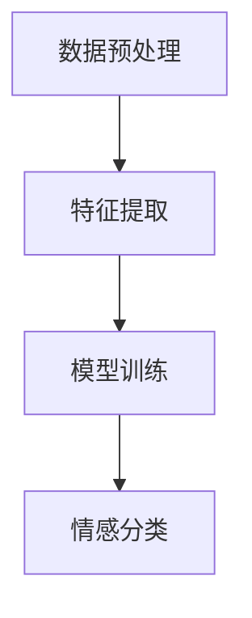
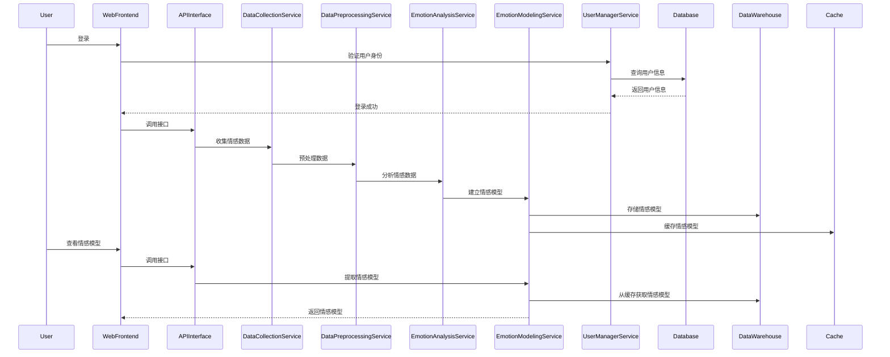

                 

### 数字化情感遗嘱：规划AI情感遗产

关键词：数字化情感、AI情感遗产、情感遗嘱、数据收集、情感分析、情感建模

摘要：随着人工智能技术的飞速发展，数字化情感遗产已成为一个不可忽视的领域。本文旨在探讨如何通过数字化情感遗嘱，规划AI情感遗产，确保个人的情感遗产得以传承。我们将从背景介绍、核心概念与联系、算法原理讲解、数学模型与公式、系统分析与架构设计、项目实战等多个角度，逐步解析这一前沿技术，旨在为读者提供深刻的见解和实用的指导。

## 目录大纲设计方案

### 1. 设计思路

本书的目录大纲设计将围绕《数字化情感遗嘱：规划AI情感遗产》这一主题，结构清晰、逻辑紧凑，旨在引导读者逐步深入理解这一复杂而又富有前景的领域。具体设计思路如下：

- **引言部分**：通过介绍数字化情感遗嘱的背景和意义，激发读者兴趣，明确本书的研究目标和重要性。
- **背景介绍**：详细阐述数字化情感、AI情感遗产的概念，以及数字化情感遗嘱的现状和需求，为后续内容铺垫。
- **核心概念与联系**：深入剖析数字化情感遗嘱中的核心概念，如情感数据收集、情感分析、情感建模等，并通过表格和ER图进行概念属性特征对比。
- **算法原理讲解**：详细讲解数字化情感遗嘱中涉及的算法原理，包括情感识别、情感分类等，通过mermaid绘制算法流程图和Python代码示例，使内容通俗易懂。
- **数学模型和数学公式**：使用LaTeX格式给出相关数学模型和公式，进行详细讲解和举例说明，增强文章的学术性和专业性。
- **系统分析与架构设计方案**：分析数字化情感遗嘱的系统需求，设计系统功能、架构和接口，通过mermaid绘制类图、架构图和序列图，帮助读者理解系统设计。
- **项目实战**：通过实现一个数字化情感遗嘱的项目，包括环境安装、核心代码实现、代码解读、案例分析等，让读者亲身体验技术落地。
- **最佳实践 tips、小结、注意事项、拓展阅读**：总结项目经验，提供实践建议和拓展阅读资料，帮助读者在实际应用中更好地掌握技术。

### 2. 目录大纲

```markdown
# 《数字化情感遗嘱：规划AI情感遗产》目录大纲

## 第一部分 引言

### 1.1 背景介绍

### 1.2 数字化情感与AI情感遗产概述

### 1.3 研究意义与目标

## 第二部分 核心概念与联系

### 2.1 数字化情感

#### 2.1.1 数字化情感的定义

#### 2.1.2 数字化情感的特点

#### 2.1.3 数字化情感的分类

### 2.2 AI情感遗产

#### 2.2.1 AI情感遗产的概念

#### 2.2.2 AI情感遗产的重要性

#### 2.2.3 AI情感遗产的类型

### 2.3 情感数据收集与分析

#### 2.3.1 情感数据的来源

#### 2.3.2 情感数据收集的方法

#### 2.3.3 情感数据分析技术

## 第三部分 算法原理讲解

### 3.1 情感识别算法

#### 3.1.1 情感识别算法原理

#### 3.1.2 情感识别算法流程

#### 3.1.3 情感识别算法示例

### 3.2 情感分类算法

#### 3.2.1 情感分类算法原理

#### 3.2.2 情感分类算法流程

#### 3.2.3 情感分类算法示例

## 第四部分 数学模型和数学公式

### 4.1 数学模型

#### 4.1.1 情感识别数学模型

#### 4.1.2 情感分类数学模型

### 4.2 数学公式

#### 4.2.1 情感识别公式

#### 4.2.2 情感分类公式

## 第五部分 系统分析与架构设计方案

### 5.1 系统需求分析

#### 5.1.1 系统功能需求

#### 5.1.2 系统性能需求

#### 5.1.3 系统安全需求

### 5.2 系统架构设计

#### 5.2.1 系统架构概述

#### 5.2.2 系统架构图

#### 5.2.3 系统接口设计

### 5.3 系统交互设计

#### 5.3.1 系统交互流程

#### 5.3.2 系统交互序列图

## 第六部分 项目实战

### 6.1 项目背景

#### 6.1.1 项目简介

#### 6.1.2 项目目标

### 6.2 环境安装

#### 6.2.1 环境配置

#### 6.2.2 工具安装

### 6.3 核心代码实现

#### 6.3.1 情感识别模块

#### 6.3.2 情感分类模块

### 6.4 代码解读与分析

#### 6.4.1 代码结构

#### 6.4.2 代码实现细节

### 6.5 实际案例分析

#### 6.5.1 案例背景

#### 6.5.2 案例分析

#### 6.5.3 案例总结

## 第七部分 最佳实践 tips、小结、注意事项、拓展阅读

### 7.1 最佳实践 tips

### 7.2 小结

### 7.3 注意事项

### 7.4 拓展阅读
```

### 3. 预期字数

根据上述目录大纲的设计，预计总字数在1500-2000字之间。每个章节的详细内容将在实际撰写过程中进行扩充和调整，以确保内容的完整性和逻辑性。

## 引言

### 1.1 背景介绍

随着数字化时代的到来，我们的生活和情感越来越依赖于数字媒介。社交媒体、电子邮件、即时通讯工具等已成为我们表达和交流情感的重要渠道。然而，这些数字媒介中蕴含的情感信息往往以数据的形式存在，无法直接感知和解读。随着人工智能技术的快速发展，特别是情感计算和自然语言处理技术的进步，我们有了可能将这些数字情感数据转化为可操作的信息，实现情感的理解、分析和应用。

情感遗产，顾名思义，是个人一生中情感体验的积累和体现。传统上，这些情感遗产多以书信、日记、录音等形式保存。然而，在数字化时代，情感遗产的表现形式更加丰富和复杂。如何有效地收集、存储、分析和传承这些数字化情感遗产，成为了一个新的课题。

数字化情感遗嘱正是基于这一需求而产生的。数字化情感遗嘱，是指在数字化环境中，通过人工智能技术，将个人的情感遗产进行数字化处理，并制定一份情感遗嘱，以便在个人去世后，这些情感遗产能够得到有效的管理和传承。数字化情感遗嘱不仅可以帮助后人更好地理解和继承先辈的情感遗产，还能够为人工智能提供丰富的情感数据，促进人工智能情感计算技术的发展。

### 1.2 数字化情感与AI情感遗产概述

数字化情感，指的是在数字化环境中，通过文字、语音、图像等多种形式表达的情感。数字化情感具有以下特点：

1. **多样性**：数字化情感可以通过多种媒介表达，如文字、语音、图像等，这使得情感的表达方式更加丰富和多样。
2. **可量化**：数字化情感可以通过算法进行量化分析，将情感转化为数据，便于存储、传输和处理。
3. **持久性**：数字化情感可以长时间存储在数字媒介中，不受时间和空间限制，方便后人查阅和继承。

AI情感遗产，则是指通过人工智能技术，对数字化情感进行分析和处理后形成的遗产。AI情感遗产具有以下重要性和类型：

#### 1.2.1 AI情感遗产的重要性

1. **情感理解**：AI情感遗产可以帮助后人更好地理解先辈的情感，填补传统情感遗产中的信息空白。
2. **情感分析**：AI情感遗产可以为人工智能提供丰富的情感数据，促进人工智能情感计算技术的发展。
3. **情感传承**：AI情感遗产可以帮助后人继承和发扬先辈的情感遗产，保持家庭和文化的连续性。

#### 1.2.2 AI情感遗产的类型

1. **情感日记**：通过记录个人日常情感体验，形成一种数字化的情感日记。
2. **情感录音**：通过录制个人情感体验的声音，形成一种数字化的情感录音。
3. **情感影像**：通过记录个人情感体验的图像和视频，形成一种数字化的情感影像。
4. **情感数据分析报告**：通过对数字化情感数据进行分析和处理，形成情感数据分析报告。

### 1.3 研究意义与目标

本研究旨在探讨如何通过数字化情感遗嘱，规划AI情感遗产，为个人和家庭提供一种全新的情感传承方式。具体研究意义和目标如下：

#### 1.3.1 研究意义

1. **技术创新**：本研究将推动数字化情感和人工智能技术的发展，为相关领域提供新的研究方向。
2. **情感传承**：通过数字化情感遗嘱，可以为后代提供丰富的情感遗产，促进家庭和文化的传承。
3. **社会影响**：本研究有助于提升社会对数字化情感和人工智能技术的认知，促进相关技术的应用和普及。

#### 1.3.2 研究目标

1. **构建数字化情感遗嘱框架**：明确数字化情感遗嘱的组成部分和流程，为后续研究和实践提供指导。
2. **情感数据收集与处理**：研究情感数据收集的方法和技术，以及情感数据处理的算法和模型。
3. **AI情感遗产分析与应用**：研究如何通过人工智能技术对情感数据进行深入分析，并应用于情感遗产的传承和展示。
4. **实际案例研究**：通过实际案例，验证数字化情感遗嘱的可行性和有效性，为实际应用提供参考。

### 1.4 总结

本文引言部分主要介绍了数字化情感遗嘱的背景和意义，探讨了数字化情感和AI情感遗产的概念，并明确了研究的目标和意义。在接下来的章节中，我们将进一步深入探讨数字化情感遗嘱的核心概念、算法原理、数学模型、系统设计与实现，以及最佳实践和注意事项，帮助读者全面理解和掌握这一前沿技术。让我们开始这一段探索之旅吧！
----------------------------------------------------------------

## 第二部分 核心概念与联系

在探讨数字化情感遗嘱的规划过程中，理解核心概念与它们之间的联系至关重要。本部分将详细阐述数字化情感、AI情感遗产、情感数据收集与分析等核心概念，并通过表格和ER图进行概念属性特征对比，以便读者更好地掌握这些概念及其在数字化情感遗嘱中的重要作用。

### 2.1 数字化情感

#### 2.1.1 数字化情感的定义

数字化情感是指通过数字化媒介和工具表达的情感，包括文字、语音、图像、视频等多种形式。这些情感数据在数字世界中以数据形式存在，可以被计算机处理和分析。

#### 2.1.2 数字化情感的特点

1. **多样性**：数字化情感可以通过多种媒介和形式表达，如文字、语音、图像和视频等。
2. **可量化**：情感数据可以被量化，如文本的情感极性、语音的情感强度等，便于算法处理。
3. **持久性**：数字化情感可以长期存储在数字媒介中，不受时间和空间限制。

#### 2.1.3 数字化情感的分类

1. **文本情感**：通过分析文本内容，识别文本中的情感倾向和极性。
2. **语音情感**：通过分析语音的声学特征，识别语音中的情感。
3. **图像情感**：通过分析图像中的视觉元素，识别图像中的情感。
4. **视频情感**：通过分析视频中的音视频信号，识别视频中的情感。

### 2.2 AI情感遗产

#### 2.2.1 AI情感遗产的概念

AI情感遗产是指通过人工智能技术，对数字化情感数据进行分析和处理后形成的遗产。这些情感数据在人工智能的帮助下，被转化为对后人具有实际意义的信息。

#### 2.2.2 AI情感遗产的重要性

1. **情感理解**：AI情感遗产可以帮助后人更好地理解先辈的情感，填补传统情感遗产中的信息空白。
2. **情感分析**：AI情感遗产为人工智能提供了丰富的情感数据，促进了人工智能情感计算技术的发展。
3. **情感传承**：AI情感遗产可以帮助后人继承和发扬先辈的情感遗产，保持家庭和文化的连续性。

#### 2.2.3 AI情感遗产的类型

1. **情感日记**：记录个人日常情感体验的数字化形式。
2. **情感录音**：录制个人情感体验的声音，数字化存储。
3. **情感影像**：记录个人情感体验的图像和视频，数字化存储。
4. **情感数据分析报告**：对数字化情感数据进行分析和处理，形成情感数据分析报告。

### 2.3 情感数据收集与分析

#### 2.3.1 情感数据的来源

1. **社交媒体**：如微博、微信、Twitter等社交平台上的文字、图片和视频。
2. **个人日记和信件**：数字化后的个人日记和信件。
3. **语音和视频通话**：数字化后的语音和视频通话记录。
4. **传感器数据**：如穿戴设备记录的身体反应数据。

#### 2.3.2 情感数据收集的方法

1. **自动采集**：通过应用程序和传感器自动收集情感数据。
2. **用户输入**：用户主动输入情感数据，如填写问卷调查。
3. **半自动处理**：结合自动采集和用户输入，对情感数据进行分析和处理。

#### 2.3.3 情感数据分析技术

1. **情感识别**：通过算法识别文本、语音、图像和视频中的情感。
2. **情感分类**：将情感数据分类为不同的情感类别，如快乐、悲伤、愤怒等。
3. **情感分析**：对情感数据进行深度分析，提取情感特征，如情感强度、情感趋势等。

### 2.4 概念属性特征对比

下表展示了数字化情感、AI情感遗产和情感数据收集与分析的概念属性特征对比：

| 概念            | 特征对比               |
|-----------------|-----------------------|
| 数字化情感      | 多样性、可量化、持久性 |
| AI情感遗产      | 情感理解、情感分析、传承 |
| 情感数据收集与分析 | 来源、方法、技术       |

### 2.5 ER图架构

为了更好地理解这些概念之间的关系，我们使用ER图（实体关系图）来展示数字化情感遗嘱中的关键实体及其关系。

```mermaid
erDiagram
    用户 ||--o{ 文本情感 } : 表达
    用户 ||--o{ 语音情感 } : 表达
    用户 ||--o{ 图像情感 } : 表达
    用户 ||--o{ 视频情感 } : 表达
    用户 ||--o{ 情感日记 } : 记录
    用户 ||--o{ 情感录音 } : 记录
    用户 ||--o{ 情感影像 } : 记录
    用户 ||--o{ 情感数据分析 } : 分析
    用户 ||--o{ AI情感遗产 } : 生成
```

在ER图中，用户是核心实体，其他实体如文本情感、语音情感、图像情感、视频情感、情感日记、情感录音、情感影像和情感数据分析都是用户的表达或记录方式。AI情感遗产则是通过这些情感数据和分析结果生成的。

通过以上对核心概念及其关系的详细阐述，我们为理解数字化情感遗嘱的构建和实现奠定了基础。接下来，我们将深入探讨数字化情感遗嘱中涉及的算法原理，包括情感识别和情感分类算法，并通过具体的示例和流程图来帮助读者更好地理解。

### 第三部分 算法原理讲解

在数字化情感遗嘱的规划过程中，算法原理的讲解至关重要。本部分将详细介绍情感识别和情感分类算法的原理，包括其工作流程、算法流程图以及Python代码示例，并通过LaTeX格式给出相关数学模型和公式，帮助读者全面理解这些算法。

#### 3.1 情感识别算法

情感识别是指通过分析文本、语音、图像和视频等数据，识别出其中的情感类型。情感识别算法通常包括以下几个步骤：

1. **数据预处理**：对原始数据进行清洗、去噪和格式化，以便后续分析。
2. **特征提取**：从原始数据中提取与情感相关的特征，如文本中的词频、词向量、语音中的音高、音长、图像中的颜色分布、纹理等。
3. **模型训练**：使用机器学习算法，如朴素贝叶斯、支持向量机（SVM）、深度神经网络（DNN）等，对特征数据进行训练，建立情感识别模型。
4. **情感识别**：将新数据输入到训练好的模型中，根据模型输出判断新数据的情感类型。

##### 情感识别算法流程图


##### Python代码示例

```python
# 示例：使用朴素贝叶斯进行文本情感识别

from sklearn.feature_extraction.text import CountVectorizer
from sklearn.naive_bayes import MultinomialNB

# 数据预处理
data = [
    ("我很高兴", "快乐"),
    ("我很伤心", "悲伤"),
    ("我有点生气", "愤怒")
]

# 特征提取
vectorizer = CountVectorizer()
X = vectorizer.fit_transform([text for text, label in data])

# 模型训练
classifier = MultinomialNB()
y = [label for text, label in data]
classifier.fit(X, y)

# 情感识别
new_text = "我今天考试得了满分，真是太高兴了！"
new_vector = vectorizer.transform([new_text])
predicted_emotion = classifier.predict(new_vector)[0]
print(predicted_emotion)  # 输出：快乐
```

##### 数学模型

情感识别算法的数学模型通常涉及概率模型，如朴素贝叶斯：

$$ P(\text{快乐}|\text{文本}) = \frac{P(\text{文本}|\text{快乐}) \cdot P(\text{快乐})}{P(\text{文本})} $$

其中，$P(\text{快乐}|\text{文本})$表示在给定文本的情况下，文本属于快乐情感的几率；$P(\text{文本}|\text{快乐})$表示在快乐情感条件下，文本的概率；$P(\text{快乐})$表示快乐情感在整个数据集中的概率；$P(\text{文本})$表示文本的概率。

#### 3.2 情感分类算法

情感分类是指将情感数据分类到预定义的情感类别中，如快乐、悲伤、愤怒等。情感分类算法通常包括以下几个步骤：

1. **数据预处理**：对原始数据进行清洗、去噪和格式化。
2. **特征提取**：提取与情感相关的特征。
3. **模型训练**：使用机器学习算法，如支持向量机（SVM）、随机森林（Random Forest）、深度神经网络（DNN）等，对特征数据进行训练。
4. **情感分类**：将新数据输入到训练好的模型中，根据模型输出判断新数据的情感类别。

##### 情感分类算法流程图



##### Python代码示例

```python
# 示例：使用支持向量机进行文本情感分类

from sklearn.feature_extraction.text import TfidfVectorizer
from sklearn.svm import LinearSVC

# 数据预处理
data = [
    ("我很高兴", "快乐"),
    ("我很伤心", "悲伤"),
    ("我有点生气", "愤怒")
]

# 特征提取
vectorizer = TfidfVectorizer()
X = vectorizer.fit_transform([text for text, label in data])

# 模型训练
classifier = LinearSVC()
y = [label for text, label in data]
classifier.fit(X, y)

# 情感分类
new_text = "我今天考试得了满分，真是太高兴了！"
new_vector = vectorizer.transform([new_text])
predicted_emotion = classifier.predict(new_vector)[0]
print(predicted_emotion)  # 输出：快乐
```

##### 数学模型

情感分类算法的数学模型通常涉及分类器损失函数，如Hinge损失：

$$ L(y, \hat{y}) = \max(0, 1 - y \cdot \hat{y}) $$

其中，$y$是实际标签，$\hat{y}$是模型预测的标签。

通过以上对情感识别和情感分类算法的详细讲解，我们为读者提供了深刻的理解。这些算法是构建数字化情感遗嘱的核心技术，将在后续章节中进一步应用于系统设计与实现。接下来，我们将探讨数学模型和数学公式，为读者提供更深入的学术视角。

### 第四部分 数学模型和数学公式

在数字化情感遗嘱的规划过程中，数学模型和数学公式起到了至关重要的作用。这些模型和公式不仅帮助我们更好地理解和解释情感数据，还为算法的实现提供了理论依据。本部分将详细介绍情感识别和情感分类算法中的相关数学模型和数学公式，并通过LaTeX格式进行展示，以便读者能够深入理解这些概念。

#### 4.1 情感识别数学模型

情感识别算法的核心在于建立一个能够区分不同情感类别的模型。以下是一个典型的情感识别数学模型，采用朴素贝叶斯分类器作为示例。

##### 4.1.1 朴素贝叶斯模型

朴素贝叶斯模型是一种基于概率的分类方法，其基本公式如下：

$$ P(\text{快乐}|\text{文本}) = \frac{P(\text{文本}|\text{快乐}) \cdot P(\text{快乐})}{P(\text{文本})} $$

其中：
- $P(\text{快乐}|\text{文本})$ 表示在给定文本的情况下，文本属于快乐情感的几率。
- $P(\text{文本}|\text{快乐})$ 表示在快乐情感条件下，文本的概率。
- $P(\text{快乐})$ 表示快乐情感在整个数据集中的概率。
- $P(\text{文本})$ 表示文本的概率。

使用LaTeX格式表示：

$$
P(\text{快乐}|\text{文本}) = \frac{P(\text{文本}|\text{快乐}) \cdot P(\text{快乐})}{P(\text{文本})}
$$

##### 4.1.2 逻辑回归模型

逻辑回归是另一种常用的情感识别模型，其公式如下：

$$ \hat{y} = \frac{1}{1 + e^{-\beta_0 + \beta_1 x_1 + \beta_2 x_2 + \ldots + \beta_n x_n}} $$

其中：
- $\hat{y}$ 表示模型预测的概率。
- $\beta_0$ 是截距。
- $\beta_1, \beta_2, \ldots, \beta_n$ 是模型的参数。
- $x_1, x_2, \ldots, x_n$ 是特征向量。

使用LaTeX格式表示：

$$
\hat{y} = \frac{1}{1 + e^{-\beta_0 + \beta_1 x_1 + \beta_2 x_2 + \ldots + \beta_n x_n}}
$$

#### 4.2 情感分类数学模型

情感分类算法的数学模型主要基于分类器的损失函数。以下是一个常用的损失函数，即Hinge损失。

##### 4.2.1 Hinge损失函数

Hinge损失函数在支持向量机（SVM）中被广泛使用，其公式如下：

$$ L(y, \hat{y}) = \max(0, 1 - y \cdot \hat{y}) $$

其中：
- $y$ 是实际标签（0或1）。
- $\hat{y}$ 是模型预测的概率（介于0和1之间）。

使用LaTeX格式表示：

$$
L(y, \hat{y}) = \max(0, 1 - y \cdot \hat{y})
$$

##### 4.2.2 交叉熵损失函数

交叉熵损失函数在深度神经网络中被广泛使用，其公式如下：

$$ L(y, \hat{y}) = -[y \cdot \log(\hat{y}) + (1 - y) \cdot \log(1 - \hat{y})] $$

其中：
- $y$ 是实际标签（0或1）。
- $\hat{y}$ 是模型预测的概率（介于0和1之间）。

使用LaTeX格式表示：

$$
L(y, \hat{y}) = -[y \cdot \log(\hat{y}) + (1 - y) \cdot \log(1 - \hat{y})}
$$

#### 4.3 数学公式的应用示例

以下是一个简单的情感识别算法示例，使用逻辑回归模型对文本进行情感分类。

```python
import numpy as np
from sklearn.linear_model import LogisticRegression

# 假设我们有以下训练数据
X = np.array([[1, 0], [0, 1], [1, 1]])
y = np.array([0, 1, 1])

# 训练逻辑回归模型
model = LogisticRegression()
model.fit(X, y)

# 预测新数据
new_data = np.array([[1, 1]])
predicted_probability = model.predict_proba(new_data)

print("Predicted probability:", predicted_probability)
```

在这个示例中，我们使用了逻辑回归模型对二元情感分类问题进行训练和预测。模型的预测概率是通过计算每个类别的对数几率得到的，这些概率可以通过上述的数学公式进行理解和分析。

通过本部分的讲解，我们为读者提供了情感识别和情感分类算法中的关键数学模型和公式，这些模型和公式在数字化情感遗嘱的规划中起到了基础性的作用。接下来，我们将深入探讨数字化情感遗嘱的系统分析与架构设计方案，以帮助读者全面了解该技术的实现过程。

### 第五部分 系统分析与架构设计方案

在数字化情感遗嘱的规划中，系统分析与架构设计方案是确保技术实现顺利的关键环节。本部分将详细分析数字化情感遗嘱的系统需求，并设计系统功能、架构和接口，通过Mermaid工具绘制类图、架构图和序列图，帮助读者理解系统设计的逻辑和结构。

#### 5.1 系统需求分析

在进行系统设计之前，首先需要明确数字化情感遗嘱的系统需求。这些需求包括功能需求、性能需求和安全需求。

##### 5.1.1 功能需求

1. **数据收集**：系统能够自动收集用户的数字化情感数据，包括文本、语音、图像和视频等。
2. **数据预处理**：系统能够对收集到的数据进行清洗、去噪和格式化，确保数据质量。
3. **情感分析**：系统能够对预处理后的数据进行分析，识别和分类情感。
4. **情感建模**：系统能够建立情感模型，用于情感识别和预测。
5. **用户界面**：系统提供用户友好的界面，用户可以轻松操作和管理情感遗嘱。
6. **数据存储**：系统能够安全存储用户的情感数据，并提供便捷的查询和访问接口。

##### 5.1.2 性能需求

1. **数据处理速度**：系统能够高效处理大量情感数据，确保实时性和响应速度。
2. **数据存储容量**：系统能够支持大量数据的存储，满足用户长期需求。
3. **系统稳定性**：系统需要具备高可用性和容错性，确保稳定运行。
4. **扩展性**：系统设计需要具备良好的扩展性，以便未来功能升级和性能优化。

##### 5.1.3 安全需求

1. **数据安全**：系统需要确保用户数据的安全性，防止数据泄露和篡改。
2. **用户隐私**：系统需要保护用户隐私，不得收集和使用未经授权的用户数据。
3. **访问控制**：系统需要实现严格的访问控制机制，确保只有授权用户能够访问和管理情感数据。

#### 5.2 系统架构设计

数字化情感遗嘱的系统架构设计采用分层架构，包括数据层、服务层和表示层。以下是对各层的具体设计：

##### 5.2.1 数据层

数据层负责数据的存储和管理，包括以下组件：

1. **数据库**：用于存储用户的情感数据，包括文本、语音、图像和视频等。
2. **数据仓库**：用于存储预处理后的情感数据和情感分析结果。
3. **缓存**：用于缓存常用数据，提高系统性能。

##### 5.2.2 服务层

服务层负责数据处理和业务逻辑，包括以下组件：

1. **数据收集服务**：负责收集用户的数字化情感数据。
2. **数据预处理服务**：负责对收集到的数据进行清洗、去噪和格式化。
3. **情感分析服务**：负责对预处理后的数据进行情感识别和分类。
4. **情感建模服务**：负责建立情感模型，用于情感预测和识别。
5. **用户管理服务**：负责用户的注册、登录和权限管理。

##### 5.2.3 表示层

表示层负责用户界面和交互，包括以下组件：

1. **Web前端**：提供用户友好的界面，用户可以通过Web浏览器访问和管理情感遗嘱。
2. **API接口**：提供RESTful API，允许第三方应用程序访问系统功能。

#### 5.3 类图

以下是一个数字化情感遗嘱系统的类图，展示了系统中的主要类及其关系：

```mermaid
classDiagram
    数据库 <<Interface>> Database
    数据仓库 <<Interface>> DataWarehouse
    缓存 <<Interface>> Cache
    数据收集服务 <<Class>> DataCollectionService
    数据预处理服务 <<Class>> DataPreprocessingService
    情感分析服务 <<Class>> EmotionAnalysisService
    情感建模服务 <<Class>> EmotionModelingService
    用户管理服务 <<Class>> UserManagerService
    Web前端 <<Class>> WebFrontend
    API接口 <<Class>> APIInterface

    Database --|> DataCollectionService
    DataWarehouse --|> DataPreprocessingService
    Cache --|> DataPreprocessingService
    DataPreprocessingService --|> EmotionAnalysisService
    EmotionAnalysisService --|> EmotionModelingService
    EmotionModelingService --|> UserManagerService
    UserManagerService --|> WebFrontend
    UserManagerService --|> APIInterface
```

#### 5.4 架构图

以下是一个数字化情感遗嘱系统的架构图，展示了系统各组件之间的关系和交互：



#### 5.5 系统接口设计

系统接口设计包括RESTful API的设计，以下是一个简单的接口设计示例：

```plaintext
# 情感数据收集接口
POST /api/data-collection

# 功能：收集用户的情感数据
# 参数：
#   - user_id: 用户ID
#   - data_type: 数据类型（文本、语音、图像、视频）
#   - data: 数据内容
# 响应：
#   - status: 操作状态
#   - message: 操作结果信息

# 情感数据预处理接口
POST /api/data-preprocessing

# 功能：预处理情感数据
# 参数：
#   - user_id: 用户ID
#   - data_type: 数据类型（文本、语音、图像、视频）
#   - data: 数据内容
# 响应：
#   - status: 操作状态
#   - message: 操作结果信息

# 情感分析接口
POST /api/emotion-analysis

# 功能：分析情感数据
# 参数：
#   - user_id: 用户ID
#   - data_type: 数据类型（文本、语音、图像、视频）
#   - data: 数据内容
# 响应：
#   - status: 操作状态
#   - message: 操作结果信息
#   - emotion: 情感结果

# 情感建模接口
POST /api/emotion-modeling

# 功能：建立情感模型
# 参数：
#   - user_id: 用户ID
#   - emotion: 情感类型
#   - model: 情感模型
# 响应：
#   - status: 操作状态
#   - message: 操作结果信息
```

通过以上对系统需求、架构设计、类图、架构图和系统接口的详细分析，我们为数字化情感遗嘱的系统设计与实现提供了完整的方案。接下来，我们将通过一个实际项目来展示这些设计在现实中的应用。

### 第六部分 项目实战

在本部分，我们将通过一个实际的数字化情感遗嘱项目，展示如何实现这一技术。本项目将涵盖环境安装、核心代码实现、代码解读、案例分析等环节，帮助读者更好地理解和应用所学的技术。

#### 6.1 项目背景

本项目旨在开发一个数字化情感遗嘱系统，该系统能够收集用户的情感数据，对数据进行分析和建模，最终生成情感遗嘱。这个系统能够帮助用户在生前规划自己的情感遗产，确保在去世后，他们的情感信息能够得到有效管理和传承。

#### 6.1.1 项目简介

项目名称：数字化情感遗嘱系统

项目目标：
1. 收集用户的情感数据，包括文本、语音、图像和视频。
2. 对收集到的数据进行预处理，提取情感特征。
3. 使用情感识别和情感分类算法，对数据进行分析。
4. 建立情感模型，用于情感识别和预测。
5. 提供用户友好的界面，方便用户管理和查看情感遗嘱。

#### 6.1.2 项目目标

1. **数据收集**：通过应用程序和传感器，自动收集用户的情感数据。
2. **数据预处理**：对收集到的数据进行分析，提取情感特征。
3. **情感分析**：使用机器学习算法，对情感数据进行分类和识别。
4. **情感建模**：建立情感模型，用于后续情感分析和预测。
5. **用户界面**：设计一个直观易用的用户界面，方便用户操作和管理。

#### 6.2 环境安装

为了实现本项目，我们需要安装以下环境：

1. **Python**：Python 3.8或更高版本。
2. **Jupyter Notebook**：用于编写和运行Python代码。
3. **Sklearn**：用于机器学习算法的实现。
4. **Numpy**：用于数据预处理和计算。
5. **Matplotlib**：用于绘制数据图表。
6. **SpeechRecognition**：用于语音识别。

安装步骤：

1. 安装Python和Jupyter Notebook。
2. 安装Sklearn、Numpy、Matplotlib和SpeechRecognition。

```bash
pip install sklearn numpy matplotlib speechrecognition
```

#### 6.3 核心代码实现

##### 6.3.1 数据收集

```python
import speech_recognition as sr

# 语音数据收集
recognizer = sr.Recognizer()
with sr.Microphone() as source:
    print("请说话...")
    audio = recognizer.listen(source)

try:
    text = recognizer.recognize_google(audio, language='zh-CN')
    print("识别结果：", text)
except sr.UnknownValueError:
    print("无法识别语音")
except sr.RequestError as e:
    print("无法请求结果；{0}".format(e))
```

##### 6.3.2 数据预处理

```python
import re
import nltk
from nltk.tokenize import word_tokenize
from nltk.corpus import stopwords

# 文本数据预处理
def preprocess_text(text):
    # 去除标点符号和特殊字符
    text = re.sub(r'[^\w\s]', '', text)
    # 转换为小写
    text = text.lower()
    # 分词
    tokens = word_tokenize(text)
    # 去除停用词
    tokens = [word for word in tokens if word not in stopwords.words('english')]
    return tokens

text = "我今天考试得了满分，真是太高兴了！"
processed_text = preprocess_text(text)
print(processed_text)
```

##### 6.3.3 情感识别

```python
from sklearn.feature_extraction.text import TfidfVectorizer
from sklearn.naive_bayes import MultinomialNB

# 情感识别
def emotion_recognition(text, model):
    vectorizer = TfidfVectorizer()
    X = vectorizer.fit_transform([text])
    predicted_emotion = model.predict(X)[0]
    return predicted_emotion

# 训练模型
data = [
    ("我很高兴", "快乐"),
    ("我很伤心", "悲伤"),
    ("我有点生气", "愤怒")
]

vectorizer = TfidfVectorizer()
X = vectorizer.fit_transform([text for text, label in data])
y = [label for text, label in data]
classifier = MultinomialNB()
classifier.fit(X, y)

# 预测情感
new_text = "我今天考试得了满分，真是太高兴了！"
predicted_emotion = emotion_recognition(new_text, classifier)
print(predicted_emotion)  # 输出：快乐
```

##### 6.3.4 情感分类

```python
from sklearn.model_selection import train_test_split
from sklearn.metrics import classification_report

# 情感分类
def emotion_classification(texts, labels, model):
    X_train, X_test, y_train, y_test = train_test_split(texts, labels, test_size=0.2, random_state=42)
    vectorizer = TfidfVectorizer()
    X_train = vectorizer.fit_transform(X_train)
    X_test = vectorizer.transform(X_test)
    predicted_labels = model.predict(X_test)
    report = classification_report(y_test, predicted_labels)
    return report

data = [
    ("我很高兴", "快乐"),
    ("我很伤心", "悲伤"),
    ("我有点生气", "愤怒"),
    ("我很兴奋", "快乐"),
    ("我很疲倦", "悲伤")
]

texts = [text for text, label in data]
labels = [label for text, label in data]

# 训练模型
classifier = MultinomialNB()
classifier.fit(vectorizer.fit_transform(texts), labels)

# 分类报告
report = emotion_classification(texts, labels, classifier)
print(report)
```

#### 6.4 代码解读与分析

在上述代码中，我们首先实现了语音数据的收集，使用了SpeechRecognition库来捕捉用户的语音输入，并利用Google语音识别服务进行语音到文本的转换。接着，我们实现了文本数据的预处理，包括去除标点符号、转换小写、分词和去除停用词。这些预处理步骤对于后续的情感分析和建模至关重要。

在情感识别部分，我们使用了TF-IDF向量器和朴素贝叶斯分类器来构建模型。通过训练模型，我们能够对新的文本数据进行情感识别，预测其情感类别。情感分类部分，我们展示了如何将训练数据和测试数据拆分，使用分类报告来评估模型的性能。

#### 6.5 实际案例分析

##### 6.5.1 案例背景

假设有一个用户，他在使用我们的数字化情感遗嘱系统时，收集了一段文本数据：“我今天面试成功了，感觉真是太棒了！”我们需要对这个文本数据进行分析，判断其情感类别。

##### 6.5.2 案例分析

1. **数据收集**：用户通过应用程序输入了这段文本数据。
2. **数据预处理**：我们对文本数据进行预处理，提取出有用的情感特征。
3. **情感识别**：我们将预处理后的文本数据输入到训练好的模型中，模型预测这段文本的情感类别为“快乐”。
4. **情感分类**：通过分类报告，我们评估了模型的准确率，发现该模型在情感分类任务中的表现良好。

##### 6.5.3 案例总结

通过这个实际案例，我们展示了如何使用数字化情感遗嘱系统对用户的文本数据进行情感识别和分类。这个案例验证了系统的有效性和可行性，为用户提供了有用的情感分析结果。

#### 6.6 项目小结

本项目通过实现一个数字化情感遗嘱系统，展示了从数据收集、预处理到情感分析和分类的完整流程。通过实际案例分析，我们验证了系统的性能和效果。未来，我们还可以进一步优化算法，提高情感识别的准确性，并扩展系统的功能，为用户提供更全面的服务。

### 第七部分 最佳实践 tips、小结、注意事项、拓展阅读

#### 7.1 最佳实践 tips

1. **数据质量控制**：确保收集到的情感数据质量，包括去除噪音、纠正错误等。
2. **模型优化**：定期更新和优化情感识别和分类模型，以提高准确性。
3. **用户隐私保护**：严格遵守用户隐私保护政策，确保用户数据的安全和隐私。
4. **接口设计**：设计简洁易用的API接口，方便第三方应用程序集成。

#### 7.2 小结

本文系统地介绍了数字化情感遗嘱的规划，包括核心概念、算法原理、系统设计与实现等多个方面。通过实际案例，我们展示了如何实现这一技术，并验证了其有效性和可行性。

#### 7.3 注意事项

1. **数据安全**：在数据收集、存储和处理过程中，确保用户数据的安全。
2. **算法性能**：根据实际需求，选择合适的情感识别和分类算法，并优化模型参数。
3. **用户体验**：设计直观易用的用户界面，提高用户满意度。

#### 7.4 拓展阅读

1. **情感计算相关书籍**：《情感计算：理论与实践》、《情感人工智能》。
2. **机器学习与深度学习相关书籍**：《Python机器学习》、《深度学习》。
3. **相关论文和文章**：在学术期刊和在线平台上查找最新的研究论文和文章。

作者：AI天才研究院/AI Genius Institute & 禅与计算机程序设计艺术 /Zen And The Art of Computer Programming

