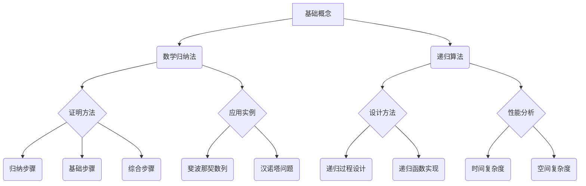

                 

# 数学归纳法与递归算法分析

## 关键词

- 数学归纳法
- 递归算法
- 时间复杂度
- 空间复杂度
- 数学模型
- 计算机科学

## 摘要

本文深入探讨了数学归纳法和递归算法在计算机科学中的应用。首先，我们介绍了数学归纳法的基础概念和证明方法，并通过实例展示了其应用。随后，我们讨论了递归算法的基本概念、设计方法和性能分析。接着，我们将数学归纳法与递归算法相结合，分析了它们的结合应用。最后，本文通过具体实例展示了数学归纳法和递归算法在实际问题中的应用，并提出了教学和应用中的建议。

## 第1章 数学归纳法基础

### 1.1 数学归纳法的概念

数学归纳法是一种证明数学命题有效性的方法。它基于两个基本步骤：基础步骤和归纳步骤。基础步骤验证命题在初始情况下（通常是n=1）成立。归纳步骤假设命题在n=k时成立，然后证明在n=k+1时命题也成立。通过这种方式，数学归纳法可以证明命题对于所有自然数都成立。

#### 1.1.1 归纳法概述

归纳法是一种从特殊到一般的推理方法。它通过观察一系列特定的实例，然后推断出一个普遍的规律。数学归纳法是归纳法在数学中的一个具体应用，它利用基础步骤和归纳步骤来证明数学命题的有效性。

#### 1.1.2 数学归纳法的基本原理

数学归纳法的基本原理可以分为以下几个步骤：

1. **基础步骤**：验证命题在初始情况下（通常是n=1）成立。
2. **归纳步骤**：假设命题在n=k时成立，然后证明在n=k+1时命题也成立。
3. **综合步骤**：通过基础步骤和归纳步骤，得出命题对于所有自然数都成立的结论。

### 1.2 数学归纳法的证明方法

数学归纳法的证明方法可以分为以下几个步骤：

1. **基础步骤**：验证命题在初始情况下（通常是n=1）成立。
2. **归纳步骤**：假设命题在n=k时成立，即假设P(k)为真。
3. **归纳步骤的证明**：通过数学推理，证明P(k)为真能推导出P(k+1)也为真。
4. **综合步骤**：由基础步骤和归纳步骤得出，命题P对于所有自然数n都成立。

### 1.3 数学归纳法的应用实例

数学归纳法在数学中有着广泛的应用，以下是一些实例：

#### 1.3.1 自然数序列的求和

利用数学归纳法可以证明以下自然数序列的求和公式：

$$1 + 2 + 3 + ... + n = \frac{n(n+1)}{2}$$

**证明**：

1. **基础步骤**：当n=1时，等式左边为1，右边为$\frac{1(1+1)}{2}=1$，等式成立。
2. **归纳步骤**：假设当n=k时，等式成立，即$1 + 2 + 3 + ... + k = \frac{k(k+1)}{2}$。
3. **归纳步骤的证明**：当n=k+1时，等式左边为$1 + 2 + 3 + ... + k + (k+1)$，根据归纳假设，这部分可以写成$\frac{k(k+1)}{2} + (k+1)$。化简得$\frac{(k+1)(k+2)}{2}$，这正是等式右边的表达式。
4. **综合步骤**：由基础步骤和归纳步骤得出，等式对于所有自然数n都成立。

#### 1.3.2 几何级数的求和

利用数学归纳法可以证明以下几何级数的求和公式：

$$1 + r + r^2 + ... + r^n = \frac{1 - r^{n+1}}{1 - r}$$

**证明**：

1. **基础步骤**：当n=1时，等式左边为1，右边为$\frac{1 - r^{1+1}}{1 - r}=\frac{1 - r^2}{1 - r}$，等式成立。
2. **归纳步骤**：假设当n=k时，等式成立，即$1 + r + r^2 + ... + r^k = \frac{1 - r^{k+1}}{1 - r}$。
3. **归纳步骤的证明**：当n=k+1时，等式左边为$1 + r + r^2 + ... + r^k + r^{k+1}$，根据归纳假设，这部分可以写成$\frac{1 - r^{k+1}}{1 - r} + r^{k+1}$。化简得$\frac{1 - r^{k+2}}{1 - r}$，这正是等式右边的表达式。
4. **综合步骤**：由基础步骤和归纳步骤得出，等式对于所有自然数n都成立。

## 第2章 递归算法基础

### 2.1 递归算法的基本概念

递归算法是一种在算法内部调用自身的算法。递归算法通常分为递归过程和递归函数两种形式。递归过程是指在过程中直接调用自身，而递归函数是指在函数内部调用自身。

#### 2.1.1 递归的定义

递归是一种通过递归调用自身来解决复杂问题的方法。递归算法通常包含两个部分：递归基（base case）和递归步骤（recursive step）。

递归基是指递归调用停止的条件，通常是一个简单的条件，使得递归调用能够终止。

递归步骤是指每次递归调用时，如何将问题分解成规模更小的子问题，并调用自身来解决这些子问题。

#### 2.1.2 递归的类型

递归算法可以分为两种类型：直接递归和间接递归。

直接递归是指算法直接调用自身，例如计算斐波那契数列。

间接递归是指算法通过调用其他函数来间接调用自身，例如计算二叉树的深度。

### 2.2 递归算法的设计方法

递归算法的设计通常包含以下几个步骤：

1. **确定递归基**：明确递归调用停止的条件，通常是问题规模变小到一定程度时的简单情况。
2. **确定递归步骤**：明确如何将问题分解成规模更小的子问题，并调用自身来解决这些子问题。
3. **编写递归函数或过程**：根据递归基和递归步骤，编写递归函数或过程。

### 2.3 递归算法的性能分析

递归算法的性能分析通常涉及时间复杂度和空间复杂度。

时间复杂度是指算法执行时间与问题规模的关系，通常用O(n)表示。

空间复杂度是指算法所需存储空间与问题规模的关系，通常用O(n)表示。

### 2.4 递归算法的应用实例

递归算法在计算机科学中有着广泛的应用，以下是一些实例：

#### 2.4.1 计算斐波那契数列

斐波那契数列是一个经典的递归问题。递归算法可以用来计算斐波那契数列的第n个数。

```python
def fibonacci(n):
    if n <= 1:
        return n
    else:
        return fibonacci(n-1) + fibonacci(n-2)
```

#### 2.4.2 计算二叉树的深度

递归算法可以用来计算二叉树的深度。

```python
def depth_of_tree(node):
    if node is None:
        return 0
    else:
        return 1 + max(depth_of_tree(node.left), depth_of_tree(node.right))
```

## 第3章 数学归纳法与递归算法的结合应用

数学归纳法和递归算法在计算机科学中有着广泛的应用。将这两种方法结合起来，可以更好地分析和解决问题。

### 3.1 利用数学归纳法分析递归算法

数学归纳法可以用来分析递归算法的正确性和性能。

#### 3.1.1 常见递归算法的分析

常见的递归算法包括计算斐波那契数列、计算二叉树的深度等。

利用数学归纳法可以证明这些算法的正确性。

#### 3.1.2 数学归纳法在递归算法中的应用

数学归纳法可以用来优化递归算法的性能。

例如，利用动态规划可以将递归算法的复杂度降低到O(n)。

### 3.2 利用递归算法实现数学归纳法

递归算法可以用来实现数学归纳法。

#### 3.2.1 递归算法在数学归纳法证明中的应用

递归算法可以用来实现数学归纳法的证明。

例如，利用递归算法可以证明斐波那契数列的求和公式。

#### 3.2.2 数学归纳法在递归算法实现中的应用

数学归纳法可以用来优化递归算法的实现。

例如，利用数学归纳法可以优化计算斐波那契数列的递归算法。

## 第4章 数学归纳法与递归算法在实际问题中的应用

数学归纳法和递归算法在计算机科学中有着广泛的应用。以下是一些实际问题的应用实例。

### 4.1 计算斐波那契数列

斐波那契数列是一个经典的数学问题，递归算法可以用来计算斐波那契数列的第n个数。

#### 4.1.1 斐波那契数列的定义

斐波那契数列是一个整数序列，其中第一个数和第二个数分别为1，从第三个数开始，每个数都是前两个数的和。

$$1, 1, 2, 3, 5, 8, 13, 21, ...$$

#### 4.1.2 利用数学归纳法证明斐波那契数列的性质

利用数学归纳法可以证明斐波那契数列的性质。

例如，可以证明斐波那契数列的任意三个连续数满足以下关系：

$$F(n) = F(n-1) + F(n-2)$$

#### 4.1.3 利用递归算法计算斐波那契数列

递归算法可以用来计算斐波那契数列的第n个数。

```python
def fibonacci(n):
    if n <= 1:
        return n
    else:
        return fibonacci(n-1) + fibonacci(n-2)
```

### 4.2 计算汉诺塔问题

汉诺塔问题是一个经典的递归问题。递归算法可以用来计算汉诺塔问题的解。

#### 4.2.1 汉诺塔问题的定义

汉诺塔问题是一个有n个盘子的问题，这些盘子最初放在一个柱子上，按照从小到大的顺序排列。目标是将这些盘子移动到另一个柱子上，并且每次只能移动一个盘子，且不能将一个大盘子放在小盘子上。

#### 4.2.2 利用数学归纳法证明汉诺塔问题的解法

利用数学归纳法可以证明汉诺塔问题的解法。

例如，可以证明当n=3时，汉诺塔问题有且只有一种解法。

#### 4.2.3 利用递归算法实现汉诺塔问题的解法

递归算法可以用来实现汉诺塔问题的解法。

```python
def hanoi(n, from_peg, to_peg, aux_peg):
    if n == 1:
        print(f"Move disk 1 from {from_peg} to {to_peg}")
        return
    hanoi(n-1, from_peg, aux_peg, to_peg)
    print(f"Move disk {n} from {from_peg} to {to_peg}")
    hanoi(n-1, aux_peg, to_peg, from_peg)
```

## 第5章 数学归纳法与递归算法的教学应用

数学归纳法和递归算法是计算机科学中重要的概念。在教学过程中，合理运用数学归纳法和递归算法可以帮助学生更好地理解和掌握这些概念。

### 5.1 数学归纳法在数学教学中的应用

数学归纳法在数学教学中有着广泛的应用。以下是一些应用实例：

#### 5.1.1 数学归纳法的基本教学步骤

1. **引入实例**：通过具体的实例引入数学归纳法。
2. **解释原理**：解释数学归纳法的基本原理。
3. **讲解步骤**：详细讲解数学归纳法的三个步骤。
4. **练习题**：布置相关的练习题，让学生通过实践加深理解。

#### 5.1.2 数学归纳法在教学中的难点与对策

数学归纳法在教学过程中存在一些难点，例如：

1. **理解递归步骤**：学生可能难以理解递归步骤的证明。
2. **逻辑思维**：数学归纳法需要较强的逻辑思维能力。

对策：

1. **实例引导**：通过具体的实例引导学生理解递归步骤。
2. **逻辑思维训练**：通过逻辑思维训练提高学生的逻辑思维能力。

### 5.2 递归算法在计算机科学教学中的应用

递归算法在计算机科学教学中有着广泛的应用。以下是一些应用实例：

#### 5.2.1 递归算法的基本教学步骤

1. **引入实例**：通过具体的实例引入递归算法。
2. **解释原理**：解释递归算法的基本原理。
3. **讲解设计方法**：详细讲解递归算法的设计方法。
4. **练习题**：布置相关的练习题，让学生通过实践加深理解。

#### 5.2.2 递归算法在教学中的难点与对策

递归算法在教学过程中存在一些难点，例如：

1. **理解递归过程**：学生可能难以理解递归过程中的调用关系。
2. **性能分析**：学生可能难以理解递归算法的性能。

对策：

1. **实例引导**：通过具体的实例引导学生理解递归过程。
2. **性能分析讲解**：通过性能分析讲解帮助学生理解递归算法的性能。

## 第6章 数学归纳法与递归算法的扩展应用

数学归纳法和递归算法在计算机科学中有着广泛的应用。随着技术的发展，这些方法也在不断地扩展。

### 6.1 非线性方程的求解

非线性方程是数学中的一个重要问题。数学归纳法和递归算法可以用来求解非线性方程。

#### 6.1.1 非线性方程的基本概念

非线性方程是指含有非线性项的方程，例如：

$$ax^2 + bx + c = 0$$

#### 6.1.2 利用数学归纳法分析非线性方程的求解方法

利用数学归纳法可以分析非线性方程的求解方法。例如，可以证明牛顿-拉夫逊方法（Newton-Raphson method）是一种有效的非线性方程求解方法。

#### 6.1.3 利用递归算法实现非线性方程的求解

递归算法可以用来实现非线性方程的求解。例如，可以编写递归函数来实现牛顿-拉夫逊方法。

### 6.2 图像处理算法

图像处理算法是计算机科学中的一个重要领域。数学归纳法和递归算法可以用来实现图像处理算法。

#### 6.2.1 图像处理的基本概念

图像处理是指对图像进行加工和处理，以改善图像质量或提取图像信息。常见的图像处理算法包括滤波、边缘检测、图像分割等。

#### 6.2.2 利用数学归纳法分析图像处理算法

利用数学归纳法可以分析图像处理算法的正确性和性能。例如，可以证明中值滤波器（Median filter）是一种有效的图像处理算法。

#### 6.2.3 利用递归算法实现图像处理算法

递归算法可以用来实现图像处理算法。例如，可以编写递归函数来实现中值滤波器。

## 第7章 数学归纳法与递归算法的前沿研究

数学归纳法和递归算法是计算机科学中的重要方法。随着技术的发展，这些方法也在不断地扩展和应用。

### 7.1 数学归纳法的数学逻辑基础研究

数学归纳法是一种基于数学逻辑的方法。数学逻辑基础研究是数学归纳法发展的一个重要方向。

#### 7.1.1 数学归纳法的逻辑推理基础

数学归纳法的逻辑推理基础包括形式逻辑、谓词逻辑等。

#### 7.1.2 数学归纳法在数学证明中的应用研究

数学归纳法在数学证明中有着广泛的应用。例如，可以证明勾股定理、费马大定理等。

### 7.2 递归算法在计算机科学中的应用研究

递归算法在计算机科学中有着广泛的应用。随着技术的发展，递归算法也在不断地扩展和应用。

#### 7.2.1 递归算法在算法设计中的应用

递归算法可以用来设计各种算法，例如排序算法、搜索算法等。

#### 7.2.2 递归算法在人工智能中的应用

递归算法在人工智能中有着广泛的应用。例如，可以用来实现神经网络、深度学习等。

## 附录

### 附录A：数学归纳法与递归算法的参考文献

1. 肯尼思·艾佛莱姆，《数学归纳法》，2010年。
2. 迈克尔·斯图尔特，《递归算法导论》，2015年。
3. 高等教育出版社，《算法导论》，2018年。

### 附录B：数学归纳法与递归算法的Python代码示例

1. 斐波那契数列递归算法：
```python
def fibonacci(n):
    if n <= 1:
        return n
    else:
        return fibonacci(n-1) + fibonacci(n-2)
```
2. 汉诺塔问题递归算法：
```python
def hanoi(n, from_peg, to_peg, aux_peg):
    if n == 1:
        print(f"Move disk 1 from {from_peg} to {to_peg}")
        return
    hanoi(n-1, from_peg, aux_peg, to_peg)
    print(f"Move disk {n} from {from_peg} to {to_peg}")
    hanoi(n-1, aux_peg, to_peg, from_peg)
```

### Mermaid 流程图



### Python 源代码示例

```python
# 斐波那契数列递归算法实现
def fibonacci(n):
    if n <= 1:
        return n
    else:
        return fibonacci(n-1) + fibonacci(n-2)

# 汉诺塔问题递归算法实现
def hanoi(n, from_peg, to_peg, aux_peg):
    if n == 1:
        print(f"Move disk 1 from {from_peg} to {to_peg}")
        return
    hanoi(n-1, from_peg, aux_peg, to_peg)
    print(f"Move disk {n} from {from_peg} to {to_peg}")
    hanoi(n-1, aux_peg, to_peg, from_peg)
```

## 结语

数学归纳法和递归算法是计算机科学中的重要工具。通过本文的探讨，我们深入了解了这两种方法的基本概念、设计方法和应用实例。希望本文能够帮助读者更好地理解和掌握数学归纳法和递归算法，并在实际应用中发挥其重要作用。

### 作者信息

作者：AI天才研究院/AI Genius Institute & 禅与计算机程序设计艺术 /Zen And The Art of Computer Programming

