                 

### 《数学形态学在图像处理算法中的实现》

#### 关键词：数学形态学、图像处理、算法、图像分割、图像增强、目标检测

> 摘要：本文深入探讨了数学形态学在图像处理算法中的应用。首先介绍了数学形态学的基本概念、发展历程和在图像处理中的应用。随后，详细阐述了数学形态学的基本操作，包括结构元素、扩展和收缩、腐蚀和膨胀、开运算和闭运算等。接着，本文介绍了高级数学形态学操作，如形态学梯度、形态学距离变换和形态学重建。最后，本文重点探讨了数学形态学在图像分割、图像增强和目标检测中的应用，并展望了数学形态学在图像处理领域的未来发展。

----------------------------------------------------------------

### 《数学形态学在图像处理算法中的实现》目录大纲

#### 第1章 引言
> **1.1 数学形态学的概述**
> **1.1.1 数学形态学的定义**
> **1.1.2 数学形态学的发展历程**
> **1.1.3 数学形态学在图像处理中的应用**

#### 第2章 数学形态学基本操作
> **2.1 结构元素**
> **2.1.1 结构元素的类型**
> **2.1.2 结构元素的构造**
> **2.1.3 结构元素的应用**

> **2.2 扩展和收缩**
> **2.2.1 扩展操作**
> **2.2.2 收缩操作**
> **2.2.3 扩展与收缩的图像效果分析**

> **2.3 腐蚀和膨胀**
> **2.3.1 腐蚀操作**
> **2.3.2 膨胀操作**
> **2.3.3 腐蚀与膨胀的图像效果分析**

> **2.4 开运算和闭运算**
> **2.4.1 开运算**
> **2.4.2 闭运算**
> **2.4.3 开运算与闭运算的图像效果分析**

#### 第3章 高级数学形态学操作
> **3.1 形态学梯度**
> **3.1.1 形态学梯度的定义**
> **3.1.2 形态学梯度的计算方法**
> **3.1.3 形态学梯度的图像效果分析**

> **3.2 形态学距离变换**
> **3.2.1 形态学距离变换的定义**
> **3.2.2 形态学距离变换的计算方法**
> **3.2.3 形态学距离变换的图像效果分析**

> **3.3 形态学重建**
> **3.3.1 形态学重建的定义**
> **3.3.2 形态学重建的计算方法**
> **3.3.3 形态学重建的图像效果分析**

#### 第4章 数学形态学在图像分割中的应用
> **4.1 图像分割基础**
> **4.1.1 图像分割的定义**
> **4.1.2 图像分割的类型**
> **4.1.3 图像分割的评价指标**

> **4.2 基于数学形态学的图像分割方法**
> **4.2.1 基于腐蚀和膨胀的图像分割**
> **4.2.2 基于开运算和闭运算的图像分割**
> **4.2.3 基于形态学距离变换的图像分割**

#### 第5章 数学形态学在图像增强中的应用
> **5.1 图像增强基础**
> **5.1.1 图像增强的定义**
> **5.1.2 图像增强的类型**
> **5.1.3 图像增强的评价指标**

> **5.2 基于数学形态学的图像增强方法**
> **5.2.1 基于扩展和收缩的图像增强**
> **5.2.2 基于腐蚀和膨胀的图像增强**
> **5.2.3 基于形态学梯度、形态学距离变换和形态学重建的图像增强**

#### 第6章 数学形态学在目标检测中的应用
> **6.1 目标检测基础**
> **6.1.1 目标检测的定义**
> **6.1.2 目标检测的类型**
> **6.1.3 目标检测的评价指标**

> **6.2 基于数学形态学的目标检测方法**
> **6.2.1 基于结构元素的提取方法**
> **6.2.2 基于形态学运算的提取方法**
> **6.2.3 基于形态学距离变换的提取方法**

#### 第7章 数学形态学在图像压缩中的应用
> **7.1 图像压缩基础**
> **7.1.1 图像压缩的定义**
> **7.1.2 图像压缩的类型**
> **7.1.3 图像压缩的评价指标**

> **7.2 基于数学形态学的图像压缩方法**
> **7.2.1 基于形态学运算的压缩方法**
> **7.2.2 基于形态学重建的压缩方法**
> **7.2.3 基于形态学距离变换的压缩方法**

#### 第8章 总结与展望
> **8.1 数学形态学在图像处理中的应用总结**
> **8.1.1 数学形态学在图像处理中的优点**
> **8.1.2 数学形态学在图像处理中的局限性**
> **8.1.3 数学形态学的发展趋势**

> **8.2 未来发展方向与挑战**
> **8.2.1 数学形态学在深度学习中的应用**
> **8.2.2 数学形态学与其他图像处理技术的融合**
> **8.2.3 数学形态学在新兴领域中的应用前景**

### 参考文献
> **8.3.1 相关书籍**
> **8.3.2 学术论文**
> **8.3.3 网络资源**

### 目录大纲图示

```mermaid
graph TD
    A[第1章 引言]
    B[1.1 数学形态学的概述]
    C[1.1.1 数学形态学的定义]
    D[1.1.2 数学形态学的发展历程]
    E[1.1.3 数学形态学在图像处理中的应用]
    A --> B
    B --> C
    B --> D
    B --> E
    
    F[第2章 数学形态学基本操作]
    G[2.1 结构元素]
    H[2.1.1 结构元素的类型]
    I[2.1.2 结构元素的构造]
    J[2.1.3 结构元素的应用]
    F --> G
    G --> H
    G --> I
    G --> J
    
    K[2.2 扩展和收缩]
    L[2.2.1 扩展操作]
    M[2.2.2 收缩操作]
    N[2.2.3 扩展与收缩的图像效果分析]
    K --> L
    K --> M
    K --> N
    
    O[2.3 腐蚀和膨胀]
    P[2.3.1 腐蚀操作]
    Q[2.3.2 膨胀操作]
    R[2.3.3 腐蚀与膨胀的图像效果分析]
    O --> P
    O --> Q
    O --> R
    
    S[2.4 开运算和闭运算]
    T[2.4.1 开运算]
    U[2.4.2 闭运算]
    V[2.4.3 开运算与闭运算的图像效果分析]
    S --> T
    S --> U
    S --> V
    
    W[第3章 高级数学形态学操作]
    X[3.1 形态学梯度]
    Y[3.1.1 形态学梯度的定义]
    Z[3.1.2 形态学梯度的计算方法]
    AA[3.1.3 形态学梯度的图像效果分析]
    W --> X
    X --> Y
    X --> Z
    X --> AA
    
    BB[3.2 形态学距离变换]
    CC[3.2.1 形态学距离变换的定义]
    DD[3.2.2 形态学距离变换的计算方法]
    EE[3.2.3 形态学距离变换的图像效果分析]
    BB --> CC
    BB --> DD
    BB --> EE
    
    FF[3.3 形态学重建]
    GG[3.3.1 形态学重建的定义]
    HH[3.3.2 形态学重建的计算方法]
    II[3.3.3 形态学重建的图像效果分析]
    FF --> GG
    FF --> HH
    FF --> II
    
    JJ[第4章 数学形态学在图像分割中的应用]
    KK[4.1 图像分割基础]
    LL[4.1.1 图像分割的定义]
    MM[4.1.2 图像分割的类型]
    NN[4.1.3 图像分割的评价指标]
    JJ --> KK
    KK --> LL
    KK --> MM
    KK --> NN
    
    OO[4.2 基于数学形态学的图像分割方法]
    PP[4.2.1 基于腐蚀和膨胀的图像分割]
    QQ[4.2.2 基于开运算和闭运算的图像分割]
    RR[4.2.3 基于形态学距离变换的图像分割]
    OO --> PP
    OO --> QQ
    OO --> RR
    
    SS[第5章 数学形态学在图像增强中的应用]
    TT[5.1 图像增强基础]
    UU[5.1.1 图像增强的定义]
    VV[5.1.2 图像增强的类型]
    WW[5.1.3 图像增强的评价指标]
    SS --> TT
    TT --> UU
    TT --> VV
    TT --> WW
    
    XX[5.2 基于数学形态学的图像增强方法]
    YY[5.2.1 基于扩展和收缩的图像增强]
    ZZ[5.2.2 基于腐蚀和膨胀的图像增强]
    AAA[5.2.3 基于形态学梯度、形态学距离变换和形态学重建的图像增强]
    XX --> YY
    XX --> ZZ
    XX --> AAA
    
    BBB[第6章 数学形态学在目标检测中的应用]
    CCC[6.1 目标检测基础]
    DDD[6.1.1 目标检测的定义]
    EEE[6.1.2 目标检测的类型]
    FFF[6.1.3 目标检测的评价指标]
    BBB --> CCC
    CCC --> DDD
    CCC --> EEE
    CCC --> FFF
    
    GGG[6.2 基于数学形态学的目标检测方法]
    HHH[6.2.1 基于结构元素的提取方法]
    III[6.2.2 基于形态学运算的提取方法]
    JJJ[6.2.3 基于形态学距离变换的提取方法]
    GGG --> HHH
    GGG --> III
    GGG --> JJJ
    
    KKK[第7章 数学形态学在图像压缩中的应用]
    LL[7.1 图像压缩基础]
    MM[7.1.1 图像压缩的定义]
    NN[7.1.2 图像压缩的类型]
    OO[7.1.3 图像压缩的评价指标]
    KKK --> LL
    LL --> MM
    LL --> NN
    LL --> OO
    
    PPP[7.2 基于数学形态学的图像压缩方法]
    QQ[7.2.1 基于形态学运算的压缩方法]
    RR[7.2.2 基于形态学重建的压缩方法]
    SS[7.2.3 基于形态学距离变换的压缩方法]
    PPP --> QQ
    PPP --> RR
    PPP --> SS
    
    TTT[第8章 总结与展望]
    UUU[8.1 数学形态学在图像处理中的应用总结]
    VVV[8.1.1 数学形态学在图像处理中的优点]
    WW[8.1.2 数学形态学在图像处理中的局限性]
    XX[8.1.3 数学形态学的发展趋势]
    TTT --> UUU
    UUU --> VVV
    UUU --> WW
    
    YY[8.2 未来发展方向与挑战]
    ZZ[8.2.1 数学形态学在深度学习中的应用]
    AAA[8.2.2 数学形态学与其他图像处理技术的融合]
    BBB[8.2.3 数学形态学在新兴领域中的应用前景]
    YY --> ZZ
    YY --> AAA
    YY --> BBB
```

