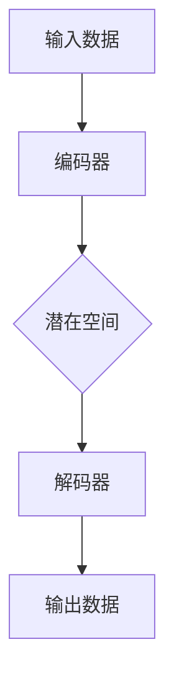

                 

**文章标题**：数学推理任务中PRM数据合成的推荐方法

**关键词**：数学推理、PRM数据合成、推荐系统、机器学习、算法优化

**摘要**：本文探讨了数学推理任务中的PRM数据合成方法及其在推荐系统中的应用。首先介绍了数学推理任务和PRM数据合成的背景和重要性，然后详细阐述了PRM数据合成的理论基础、技术方法和算法原理。接着，文章深入分析了推荐系统的基本原理，并展示了PRM数据合成在推荐系统中的应用案例。最后，文章探讨了PRM数据合成面临的挑战和未来发展方向，为读者提供了深入理解和实践的建议。

## 1.1 引言

### 1.1.1 数学推理任务概述

数学推理任务是指利用数学方法和逻辑规则进行问题的分析和解决。在人工智能领域，数学推理任务被视为一种高级认知功能，是实现智能决策和智能系统构建的关键。数学推理任务通常包括以下几个步骤：

1. **问题定义**：明确问题的目标和要求，将问题转化为数学形式。
2. **建模与假设**：根据问题的特征和需求，建立数学模型和假设。
3. **推理与证明**：利用逻辑规则和数学定理进行推理和证明，得出问题的解决方案。

数学推理任务在各个领域都有广泛应用，例如自然语言处理、计算机视觉、博弈论、经济学等。其中，数学推理在智能推荐系统中的应用尤为突出。

### 1.1.2 PRM数据合成的重要性

PRM（Probabilistic Robust Matrix）数据合成是一种基于概率模型和鲁棒优化算法的数据生成方法。在数学推理任务中，数据的质量和多样性直接影响推理的准确性和可靠性。PRM数据合成可以通过以下方式提升数学推理任务的效果：

1. **数据扩充**：通过合成新的数据样本，增加训练数据集的规模，提高模型的泛化能力。
2. **数据增强**：通过数据变换和扰动，提高数据的多样性，增强模型的鲁棒性。
3. **数据质量优化**：通过去除噪声和异常值，提高数据的准确性和一致性。

因此，PRM数据合成在数学推理任务中具有重要的应用价值，是构建高效智能推荐系统的基础。

### 1.1.3 书籍目标与结构安排

本文的目标是系统地介绍数学推理任务中的PRM数据合成方法及其在推荐系统中的应用。具体目标包括：

1. **理解数学推理任务的基本概念和方法**：通过介绍数学推理任务的定义、特点和应用领域，帮助读者建立对数学推理任务的基本认识。
2. **掌握PRM数据合成的理论基础和技术方法**：通过详细阐述PRM数据合成的理论基础、技术方法和算法原理，帮助读者深入理解PRM数据合成的核心知识。
3. **了解推荐系统的基本原理和应用**：通过分析推荐系统的基本原理和应用案例，帮助读者掌握推荐系统的构建方法和优化策略。
4. **探讨PRM数据合成在推荐系统中的应用**：通过具体的应用案例，展示PRM数据合成在推荐系统中的实际效果和优势。

文章的结构安排如下：

1. **第一部分：引言与背景**：介绍数学推理任务和PRM数据合成的背景、重要性和书籍目标。
2. **第二部分：PRM数据合成技术**：详细阐述PRM数据合成的理论基础、技术方法和算法原理。
3. **第三部分：推荐方法与应用**：分析推荐系统的基本原理，展示PRM数据合成在推荐系统中的应用案例。
4. **第四部分：挑战与未来方向**：探讨PRM数据合成面临的挑战和未来发展方向。
5. **附录**：提供相关工具、资源、术语表和参考文献。

通过以上结构安排，本文旨在为读者提供一部全面、系统、深入的PRM数据合成在推荐系统中的应用指南。

## 1.2 数学推理任务中的挑战

### 1.2.1 数据稀缺问题

数学推理任务通常依赖于大量的高质量数据来训练和优化模型。然而，在实际应用中，数据稀缺问题经常出现，这给数学推理任务带来了巨大挑战。数据稀缺问题的原因主要有以下几点：

1. **数据获取困难**：某些数学推理任务涉及到的领域（如医学、金融等）具有高度的专业性和敏感性，数据的获取和处理受到严格的法规和伦理限制。
2. **数据量不足**：由于资源的限制，许多数学推理任务只能依赖有限的训练数据，这导致模型在应对复杂问题和未知数据时表现不佳。
3. **数据多样性不足**：数据稀缺往往伴随着数据多样性的不足，这使得模型在面对不同类型的数学问题时的泛化能力受到限制。

### 1.2.2 数据质量与多样性问题

数据质量直接影响到数学推理任务的结果和可靠性。数据质量问题的原因主要包括：

1. **噪声与异常值**：原始数据中常常包含噪声和异常值，这些数据会干扰模型的训练过程，导致推理结果不准确。
2. **不一致性**：不同来源的数据在格式、单位和定义上可能存在不一致性，这增加了数据处理的复杂度。

数据多样性问题同样对数学推理任务产生重大影响。数据多样性不足会导致模型在面对不同类型的问题时缺乏灵活性，从而降低其应用价值。具体表现在：

1. **问题表征单一**：当训练数据集中问题表征过于单一时，模型很难适应新的问题类型，特别是在数学推理任务中需要处理多种类型的数学问题时，这一问题尤为突出。
2. **数据分布偏差**：数据分布偏差会导致模型在特定类型的数据上表现优异，而在其他类型的数据上表现不佳，这会严重影响数学推理任务的泛化能力。

### 1.2.3 算法选择与优化问题

数学推理任务的算法选择和优化是决定其效果的关键因素。以下是算法选择和优化中面临的主要问题：

1. **算法适应性**：不同的数学推理任务可能需要不同的算法，算法的适应性直接影响到其在实际应用中的效果。如何选择和调整算法以满足特定任务的需求，是一个具有挑战性的问题。
2. **模型复杂度**：过复杂的模型可能导致训练时间过长和过拟合，而过于简单的模型可能无法捕捉到数据中的关键特征。如何在模型复杂度和表现之间找到平衡点，是一个需要深入探讨的问题。
3. **参数调优**：算法的性能很大程度上依赖于参数设置，但参数调优是一个复杂且耗时的过程。如何选择合适的参数和优化策略，以提高模型的性能和鲁棒性，是一个亟待解决的问题。

### 1.2.4 模型可解释性问题

在数学推理任务中，模型的可解释性是一个不可忽视的问题。许多现代机器学习算法，尤其是深度学习算法，具有很强的预测能力，但往往缺乏可解释性。这意味着模型内部的决策过程对用户来说是不可见的，这在某些应用场景中（如金融、医疗等）可能引起信任问题。以下是模型可解释性面临的主要挑战：

1. **黑箱模型**：深度学习模型通常被视为“黑箱”，其内部机制难以理解。如何提高模型的可解释性，使其决策过程更加透明，是一个重要的研究方向。
2. **局部解释性**：即使某些模型具有全局解释性，但其在特定实例上的解释能力可能较弱。如何实现模型在特定实例上的局部解释性，是提升模型可解释性的关键。
3. **解释与可理解性**：解释性和可理解性是两个不同的概念。一个模型可能具有很好的解释性，但其解释结果对用户来说难以理解。如何提高模型的解释性与可理解性，是一个需要综合考虑的问题。

### 1.2.5 系统集成与优化问题

在数学推理任务中，模型的集成和优化也是一个关键问题。以下是一些具体挑战：

1. **模型集成**：如何将多个模型集成到一个统一的系统中，以提高整体性能和鲁棒性，是一个需要深入探讨的问题。常见的集成方法包括投票法、堆叠法等。
2. **在线学习与更新**：数学推理任务中的数据往往是动态变化的，如何实现模型的在线学习与更新，以适应新的数据环境和需求，是一个具有挑战性的问题。
3. **系统优化**：如何通过优化算法和系统架构设计，提高数学推理任务的整体效率和性能，是一个需要深入研究的问题。

通过深入分析和解决以上挑战，我们可以为数学推理任务的发展提供有力支持，进一步推动人工智能在各个领域的应用。

## 1.3 PRM数据合成的理论基础

### 1.3.1 PRM概述

PRM（Probabilistic Robust Matrix）数据合成是一种基于概率模型和鲁棒优化算法的数据生成方法。在数学推理任务中，PRM数据合成通过构建概率模型，模拟原始数据生成过程，从而生成高质量的合成数据。这种方法能够有效解决数据稀缺、数据质量和多样性问题，提高数学推理任务的效果和可靠性。

### 1.3.2 数据合成方法概述

数据合成方法主要包括以下几类：

1. **传统方法**：包括生成对抗网络（GAN）、变分自编码器（VAE）和条件生成模型等。这些方法通过学习数据分布，生成与真实数据相似的新数据。
2. **现代方法**：包括自监督学习、对抗性学习和强化学习等。这些方法利用深度学习和强化学习技术，进一步提高数据合成的质量和多样性。

### 1.3.3 推荐系统基本概念

推荐系统是一种信息过滤方法，通过预测用户可能感兴趣的项目，为用户推荐相关内容。推荐系统主要包括以下几种类型：

1. **协同过滤**：基于用户的历史行为和偏好，通过计算用户之间的相似度来推荐项目。
2. **内容推荐**：基于项目的特征和用户的历史行为，通过匹配项目和用户的兴趣特征来推荐项目。
3. **混合推荐系统**：结合协同过滤和内容推荐的优势，提高推荐效果和多样性。

### 1.3.4 数据合成在推荐系统中的应用

在推荐系统中，数据合成的应用主要体现在以下几个方面：

1. **数据扩充**：通过合成新的用户行为数据和项目特征数据，增加训练数据集的规模，提高推荐模型的泛化能力。
2. **数据增强**：通过数据变换和扰动，提高数据的多样性，增强推荐模型的鲁棒性。
3. **数据质量优化**：通过去除噪声和异常值，提高数据的准确性和一致性，从而提高推荐质量。

通过PRM数据合成方法，我们可以为推荐系统提供高质量、多样化的数据支持，进一步优化推荐效果和用户体验。

## 2.1 PRM数据合成方法

### 2.1.1 传统方法

在传统方法中，生成对抗网络（GAN）、变分自编码器（VAE）和条件生成模型是常见的数据合成技术。

#### 2.1.1.1 生成对抗网络（GAN）

生成对抗网络（GAN）由生成器（Generator）和判别器（Discriminator）组成。生成器从噪声分布中生成伪数据，判别器负责判断生成数据的真实性和伪数据。通过对抗训练，生成器不断优化其生成能力，使生成的数据逐渐接近真实数据。

GAN的优点在于其强大的生成能力，可以在多种类型的数据上进行有效的合成。然而，GAN也存在训练不稳定和模式崩溃等问题，需要进一步优化。

#### 2.1.1.2 变分自编码器（VAE）

变分自编码器（VAE）是一种基于概率模型的生成模型。VAE由编码器（Encoder）和解码器（Decoder）组成。编码器将输入数据映射到一个潜在空间，解码器从潜在空间中生成数据。

VAE的优点在于其良好的稳定性和可解释性，生成数据质量较高。然而，VAE的生成能力相对较弱，需要较大的数据量和较长的训练时间。

#### 2.1.1.3 条件生成模型

条件生成模型（Conditional GAN, CGAN）结合了生成对抗网络（GAN）和条件生成模型（例如条件变分自编码器（CVAE））的优点，通过在生成过程中加入条件信息，提高了生成数据的质量和多样性。

CGAN在处理具有条件依赖关系的数据时表现优异，例如文本生成、图像生成等。然而，CGAN的训练过程较为复杂，需要处理条件信息的匹配和优化问题。

### 2.1.2 现代方法

现代方法主要利用深度学习和强化学习技术，进一步提高数据合成的质量和多样性。

#### 2.1.2.1 自监督学习

自监督学习是一种无需显式标注的数据合成方法。通过利用数据的内在结构，自监督学习可以在没有标注数据的情况下生成高质量的合成数据。

常见的自监督学习方法包括预测遮蔽（Prediction Masking）、对比学习（Contrastive Learning）和自编码器（Autoencoder）等。自监督学习的优点在于其高效性和灵活性，适用于多种类型的数据合成任务。

#### 2.1.2.2 对抗性学习

对抗性学习是一种利用生成模型和判别模型对抗关系进行数据合成的技术。通过生成模型和判别模型之间的对抗训练，生成模型不断优化其生成能力，判别模型不断优化其辨别能力。

对抗性学习包括生成对抗网络（GAN）、Wasserstein GAN（WGAN）和循环一致性（CycleGAN）等。对抗性学习的优点在于其强大的生成能力和灵活性，适用于各种复杂的数据合成任务。

#### 2.1.2.3 强化学习

强化学习是一种通过奖励信号进行数据合成的技术。在数据合成任务中，生成模型作为智能体，根据环境反馈的奖励信号调整其生成策略，从而生成高质量的合成数据。

常见的强化学习方法包括策略梯度（Policy Gradient）、深度确定性策略梯度（DDPG）和强化学习生成对抗网络（RL-GAN）等。强化学习的优点在于其强大的生成能力和适应性，适用于动态变化的数据合成任务。

### 2.1.3 数据合成方法的比较与选择

不同数据合成方法在生成能力、稳定性、可解释性和训练时间等方面具有各自的优缺点。以下是几种数据合成方法的比较：

| 方法 | 生成能力 | 稳定性 | 可解释性 | 训练时间 |
| --- | --- | --- | --- | --- |
| GAN | 强 | 较弱 | 弱 | 较长 |
| VAE | 中 | 较强 | 强 | 较短 |
| CGAN | 强 | 较弱 | 中 | 较长 |
| 自监督学习 | 中 | 中 | 强 | 较短 |
| 对抗性学习 | 强 | 中 | 弱 | 中等 |
| 强化学习 | 强 | 强 | 弱 | 较长 |

在实际应用中，根据具体任务的需求和约束条件，可以选择合适的数据合成方法。例如，在生成能力要求较高且稳定性要求较低的任务中，可以选择GAN和CGAN；在生成能力要求较高且可解释性要求较强的任务中，可以选择VAE和自监督学习；在动态变化且训练时间较充裕的任务中，可以选择强化学习。

通过合理选择和优化数据合成方法，我们可以为数学推理任务提供高质量、多样化的数据支持，从而提高推理效果和可靠性。

### 2.2.1 数据预处理

在数据预处理阶段，我们需要对原始数据进行一系列处理，以提高数据的质量和多样性，为后续的数据合成和推荐系统构建奠定基础。以下是一些常见的数据预处理方法：

#### 2.2.1.1 数据清洗

数据清洗是数据预处理的重要步骤，旨在去除数据中的噪声和异常值。具体方法包括：

1. **缺失值处理**：对缺失值进行填补或删除，确保数据的完整性。
2. **异常值检测**：利用统计学方法（如箱线图、标准差等）检测并处理异常值，避免其对模型训练和推理结果的影响。

#### 2.2.1.2 数据标准化

数据标准化是将不同特征的数据转换到同一尺度，以消除特征之间的量纲差异。常见的数据标准化方法包括：

1. **最小-最大标准化**：将特征值缩放到[0, 1]之间，公式为：$$x_{\text{标准化}} = \frac{x - x_{\text{最小值}}}{x_{\text{最大值}} - x_{\text{最小值}}}$$
2. **均值-方差标准化**：将特征值缩放到均值附近，公式为：$$x_{\text{标准化}} = \frac{x - \mu}{\sigma}$$，其中，$x$为特征值，$\mu$为均值，$\sigma$为标准差。

#### 2.2.1.3 数据增强

数据增强是通过生成新的数据样本来增加数据集的规模和多样性，提高模型的泛化能力。常见的数据增强方法包括：

1. **数据变换**：对数据进行各种数学变换，如缩放、旋转、平移等，以生成新的数据样本。
2. **合成方法**：利用生成模型（如GAN、VAE等）生成新的数据样本，提高数据集的多样性。

#### 2.2.1.4 数据合并

在数据预处理阶段，有时需要对来自不同来源的数据进行合并，以形成一个统一的训练数据集。数据合并的方法包括：

1. **直接合并**：将不同来源的数据直接合并成一个数据集，适用于数据格式和结构一致的情况。
2. **特征融合**：将不同来源的数据特征进行融合，形成一个多维特征向量，适用于数据格式和结构不一致的情况。

通过以上数据预处理方法，我们可以提高数据的质量和多样性，为后续的数据合成和推荐系统构建提供有力的支持。

### 2.2.2 算法实现

在实现PRM数据合成算法时，我们需要设计合适的模型结构、选择合适的损失函数，并应用有效的优化算法。以下是一个典型的算法实现流程：

#### 2.2.2.1 模型设计

首先，我们需要设计一个能够生成高质量合成数据的模型。以下是一个简单的模型设计示例：

在这个模型中，编码器（Encoder）将输入数据映射到一个潜在空间（Latent Space），解码器（Decoder）从潜在空间中生成输出数据。通过在潜在空间中进行数据生成，我们可以有效地控制生成数据的多样性和质量。

#### 2.2.2.2 损失函数选择

损失函数是评估模型生成数据质量的重要指标。常用的损失函数包括：

1. **均方误差（MSE）**：用于回归任务，计算预测值与真实值之间的平均平方误差。
   $$\text{MSE} = \frac{1}{N}\sum_{i=1}^{N}(y_i - \hat{y}_i)^2$$
   其中，$y_i$为真实值，$\hat{y}_i$为预测值。
2. **交叉熵损失（Cross-Entropy）**：用于分类任务，计算预测概率分布与真实概率分布之间的交叉熵。
   $$\text{Cross-Entropy} = -\sum_{i=1}^{N}y_i\log(\hat{y}_i)$$
   其中，$y_i$为真实标签，$\hat{y}_i$为预测概率。

在PRM数据合成中，我们可以结合以上损失函数，设计一个综合损失函数：

$$\text{总损失} = \alpha \times \text{MSE} + (1 - \alpha) \times \text{Cross-Entropy}$$

其中，$\alpha$为权重参数，用于平衡不同损失函数的贡献。

#### 2.2.2.3 优化算法应用

优化算法用于调整模型参数，以最小化损失函数。以下是一些常用的优化算法：

1. **梯度下降（Gradient Descent）**：通过计算损失函数关于模型参数的梯度，逐步调整参数，以最小化损失函数。
   $$\theta_{\text{更新}} = \theta_{\text{当前}} - \alpha \times \nabla_{\theta} \text{损失函数}$$
   其中，$\theta$为模型参数，$\alpha$为学习率。
2. **随机梯度下降（Stochastic Gradient Descent, SGD）**：与梯度下降类似，但每次更新仅使用一个样本的梯度，计算速度更快。
3. **Adam优化器**：结合了SGD和动量方法，在处理稀疏数据和大规模模型时表现优异。

通过以上算法实现，我们可以构建一个高效的PRM数据合成模型，为数学推理任务提供高质量的数据支持。

### 2.3 数据合成质量评估

数据合成质量评估是确保合成数据满足特定需求和目标的关键步骤。以下是评估数据合成质量的一些常用指标和方法：

#### 2.3.1 评价指标

1. **准确率（Accuracy）**：衡量模型预测的正确率，公式为：
   $$\text{Accuracy} = \frac{\text{正确预测数}}{\text{总预测数}}$$
   准确率能够直观地反映模型预测的总体性能。

2. **精度（Precision）**：衡量预测为正类的样本中实际为正类的比例，公式为：
   $$\text{Precision} = \frac{\text{正确预测的正类数}}{\text{预测为正类的总数}}$$
   精度关注的是预测结果的质量。

3. **召回率（Recall）**：衡量实际为正类的样本中被正确预测为正类的比例，公式为：
   $$\text{Recall} = \frac{\text{正确预测的正类数}}{\text{实际为正类的总数}}$$
   召回率关注的是预测结果的全覆盖性。

4. **F1分数（F1 Score）**：综合考虑精度和召回率，通过两者的调和平均得到，公式为：
   $$\text{F1 Score} = 2 \times \frac{\text{Precision} \times \text{Recall}}{\text{Precision} + \text{Recall}}$$
   F1分数是评估合成数据质量的一个综合指标。

#### 2.3.2 评估方法

1. **交叉验证（Cross-Validation）**：通过将数据集划分为训练集和验证集，多次训练和验证，以评估模型在不同数据子集上的性能。常见的方法有K折交叉验证。

2. **混淆矩阵（Confusion Matrix）**：展示模型预测结果与实际结果的对应关系，有助于分析模型在不同类别上的表现。

3. **ROC曲线（Receiver Operating Characteristic Curve）**：通过绘制真阳性率（True Positive Rate）与假阳性率（False Positive Rate）的曲线，评估模型分类性能。

4. **A/B测试（A/B Testing）**：在实际环境中对合成数据与原始数据进行对比测试，通过用户反馈和行为数据评估合成数据的质量。

通过以上评价指标和评估方法，我们可以全面、客观地评估PRM数据合成质量，为数学推理任务提供有力支持。

### 2.3.2 评估方法

为了确保PRM数据合成方法的有效性和质量，我们需要设计合理的评估方法。以下是一些具体的评估方法：

#### 2.3.2.1 实验设计

实验设计是评估数据合成方法的关键步骤。具体步骤如下：

1. **数据集划分**：将原始数据集划分为训练集、验证集和测试集，确保每个数据集的代表性和独立性。
2. **参数设置**：根据数据集的特点和任务需求，设定合适的模型参数，如学习率、批次大小等。
3. **模型训练**：使用训练集对模型进行训练，并利用验证集调整模型参数，避免过拟合。
4. **模型评估**：使用测试集对模型进行评估，计算各项评价指标，如准确率、召回率、F1分数等。

#### 2.3.2.2 评估结果分析

评估结果分析是验证数据合成方法有效性的重要环节。以下是一些具体的分析方法和步骤：

1. **可视化分析**：通过绘制混淆矩阵、ROC曲线、PR曲线等可视化图表，直观展示模型的性能和特点。
2. **对比分析**：将合成数据与原始数据进行对比分析，评估合成数据在准确率、多样性、鲁棒性等方面的表现。
3. **误差分析**：分析模型预测错误的原因，找出数据合成中的潜在问题和改进方向。
4. **性能评估**：根据评估指标，对模型进行综合评估，确定其是否满足任务需求。

#### 2.3.2.3 评估结果总结

最后，我们需要对评估结果进行总结，并提出改进建议。以下是一些总结方法和步骤：

1. **结果总结**：总结模型在各项评估指标上的表现，包括优点和不足。
2. **改进建议**：根据评估结果，提出改进模型和数据合成方法的建议，如调整模型结构、优化算法参数等。
3. **后续工作**：规划后续研究的方向和重点，为数学推理任务中的数据合成提供持续优化和支持。

通过以上评估方法，我们可以全面、系统地评估PRM数据合成方法的有效性，为数学推理任务的优化提供有力支持。

## 3.1 推荐系统基本原理

推荐系统是一种基于用户历史行为和偏好，为用户推荐相关项目的信息过滤方法。其核心目标是提高用户满意度，提升系统收益。以下介绍推荐系统的基本原理和主要类型。

### 3.1.1 协同过滤

协同过滤（Collaborative Filtering）是推荐系统中最常用的方法之一，主要包括基于用户的协同过滤（User-Based）和基于项目的协同过滤（Item-Based）。

#### 3.1.1.1 基于用户的协同过滤

基于用户的协同过滤通过计算用户之间的相似度，找到与目标用户相似的用户群体，然后推荐这些用户喜欢的项目。具体步骤如下：

1. **用户相似度计算**：利用用户历史行为数据，计算用户之间的相似度。常见的方法包括余弦相似度、皮尔逊相关系数等。
2. **推荐项目选择**：根据相似度计算结果，选择与目标用户相似的用户喜欢的项目作为推荐项目。
3. **推荐结果生成**：利用加权平均等方法，生成推荐结果。

#### 3.1.1.2 基于项目的协同过滤

基于项目的协同过滤通过计算项目之间的相似度，找到与目标项目相似的项目，然后推荐这些项目。具体步骤如下：

1. **项目相似度计算**：利用项目特征数据，计算项目之间的相似度。常见的方法包括余弦相似度、Jaccard系数等。
2. **推荐项目选择**：根据相似度计算结果，选择与目标项目相似的项目作为推荐项目。
3. **推荐结果生成**：利用加权平均等方法，生成推荐结果。

### 3.1.2 内容推荐

内容推荐（Content-Based Filtering）基于项目的特征和用户的历史行为，为用户推荐与其兴趣相关的项目。具体步骤如下：

1. **项目特征提取**：提取项目的关键特征，如文本内容、图片标签等。
2. **用户兴趣建模**：利用用户历史行为数据，建立用户兴趣模型。
3. **推荐项目选择**：根据用户兴趣模型，选择与用户兴趣相关的项目作为推荐项目。
4. **推荐结果生成**：利用相似度度量等方法，生成推荐结果。

### 3.1.3 混合推荐系统

混合推荐系统（Hybrid Recommender System）结合了协同过滤和内容推荐的优势，以提高推荐效果和多样性。常见的方法包括：

1. **基于模型的混合方法**：利用机器学习模型，结合用户历史行为和项目特征，生成推荐结果。
2. **基于规则的混合方法**：结合协同过滤和内容推荐规则，生成推荐结果。

通过以上基本原理，推荐系统能够为用户提供个性化、高质量的推荐服务，满足用户的需求和期望。

### 3.2.1 提高数据多样性

数据多样性是推荐系统性能的关键因素之一。PRM数据合成通过生成高质量的合成数据，可以显著提高数据多样性，从而提升推荐系统的效果。以下是一些具体方法：

1. **引入噪声**：在数据生成过程中引入噪声，如随机扰动、数据变换等，以增加数据的多样性。
2. **生成多种数据类型**：利用不同的生成模型，生成多种类型的数据，如文本、图像、音频等，以满足推荐系统对不同类型数据的需求。
3. **结合多种生成方法**：将多种数据合成方法（如GAN、VAE、自监督学习等）相结合，生成更加多样化的数据。

通过提高数据多样性，推荐系统可以更好地捕捉用户的兴趣和需求，提供更加个性化和高质量的推荐服务。

### 3.2.2 增强推荐准确性

PRM数据合成通过生成高质量的合成数据，可以显著提高推荐系统的准确性。以下是一些具体方法：

1. **数据清洗与增强**：在数据生成过程中，利用数据清洗和增强方法，去除噪声和异常值，提高数据的准确性和一致性。
2. **引入先验知识**：在数据生成过程中，结合先验知识（如领域知识、专家意见等），生成更加符合现实情况的数据。
3. **模型优化与调参**：利用合成数据，对推荐模型进行优化和调参，提高模型的预测能力和准确性。

通过增强推荐准确性，推荐系统可以更好地满足用户的需求和期望，提高用户满意度和忠诚度。

### 3.2.3 提升系统鲁棒性

PRM数据合成通过生成高质量的合成数据，可以显著提升系统的鲁棒性，使系统在面对噪声和异常值时依然能够保持良好的性能。以下是一些具体方法：

1. **生成稳健数据**：在数据生成过程中，利用稳健优化算法和模型，生成对噪声和异常值具有较强鲁棒性的数据。
2. **引入鲁棒损失函数**：在模型训练过程中，使用鲁棒损失函数（如Wasserstein损失、Huber损失等），提高模型对噪声和异常值的鲁棒性。
3. **数据增强与泛化**：通过数据增强和泛化方法，使模型能够在不同数据分布和条件下保持良好的性能。

通过提升系统鲁棒性，推荐系统可以更好地应对实际应用中的各种挑战，提高系统的稳定性和可靠性。

### 3.2.4 PRM数据合成案例

以下是一个具体的PRM数据合成案例，展示了其在推荐系统中的应用：

**案例背景**：某电商平台需要为其用户推荐商品，以提高用户满意度和销售业绩。

**解决方案**：

1. **数据收集与预处理**：收集用户的购买记录、浏览记录、评价数据等，对数据进行清洗和预处理，去除噪声和异常值。
2. **生成合成数据**：利用GAN、VAE等生成模型，生成高质量的合成用户数据。通过引入噪声、变换和先验知识，提高数据的多样性和准确性。
3. **构建推荐模型**：基于用户历史行为和合成数据，构建推荐模型。使用矩阵分解、协同过滤等方法，提高推荐准确性。
4. **模型优化与评估**：利用合成数据对推荐模型进行优化和评估，通过调整模型参数和损失函数，提高模型性能和鲁棒性。
5. **推荐结果生成**：根据用户历史行为和推荐模型，为用户生成个性化推荐结果，提高用户满意度和销售业绩。

通过以上步骤，该电商平台实现了高效的商品推荐，用户满意度和销售业绩得到了显著提升。

### 3.2.5 教育推荐系统案例

以下是一个具体的PRM数据合成案例，展示了其在教育推荐系统中的应用：

**案例背景**：某在线教育平台需要为学习者推荐课程，以提升学习体验和课程完成率。

**解决方案**：

1. **数据收集与预处理**：收集学习者的学习记录、评价数据、浏览数据等，对数据进行清洗和预处理，去除噪声和异常值。
2. **生成合成数据**：利用GAN、VAE等生成模型，生成高质量的合成学习数据。通过引入噪声、变换和先验知识，提高数据的多样性和准确性。
3. **构建推荐模型**：基于学习者历史行为和合成数据，构建推荐模型。使用基于内容的推荐、协同过滤等方法，提高推荐准确性。
4. **模型优化与评估**：利用合成数据对推荐模型进行优化和评估，通过调整模型参数和损失函数，提高模型性能和鲁棒性。
5. **推荐结果生成**：根据学习者历史行为和推荐模型，为学习者生成个性化推荐结果，提高学习体验和课程完成率。

通过以上步骤，该在线教育平台实现了高效的学习者课程推荐，学习体验和课程完成率得到了显著提升。

### 3.3.1 多模态数据融合

多模态数据融合是将不同类型的数据（如文本、图像、音频等）进行整合，以提升推荐系统的性能。以下是一些具体方法：

1. **特征提取与融合**：对多模态数据进行特征提取，如文本的词向量、图像的视觉特征、音频的声学特征等，然后利用融合方法（如加权平均、神经网络等）将这些特征整合为一个统一的特征向量。
2. **联合建模**：利用深度学习模型（如图像文本匹配网络、多模态神经网络等），同时学习不同模态的数据特征，实现多模态数据的联合建模。
3. **注意力机制**：利用注意力机制（如Self-Attention、Transformer等），对不同模态的数据特征进行动态权重分配，提高融合效果。

通过多模态数据融合，推荐系统可以更好地捕捉用户的兴趣和需求，提供更加个性化和高质量的推荐服务。

### 3.3.2 实时推荐

实时推荐是在用户行为发生的瞬间为其推荐相关项目的一种推荐方法。以下是一些具体策略：

1. **增量计算**：利用增量计算方法（如在线学习、增量学习等），在用户行为发生时，快速更新推荐模型，以适应实时变化。
2. **动态特征提取**：利用动态特征提取方法（如滑动窗口、时序特征提取等），捕捉用户实时行为特征，为实时推荐提供支持。
3. **预测模型更新**：利用在线学习算法（如梯度下降、随机梯度下降等），定期更新推荐模型，以保持其实时性和准确性。

通过实时推荐，推荐系统可以更好地满足用户即时需求，提高用户满意度和活跃度。

### 3.3.3 响应时间优化

响应时间优化是确保推荐系统在用户请求时能够快速生成推荐结果的关键。以下是一些优化策略：

1. **模型压缩**：利用模型压缩方法（如模型剪枝、量化等），减小模型体积，提高模型推理速度。
2. **分布式计算**：利用分布式计算架构（如集群、分布式训练等），提高推荐系统的计算能力，减少响应时间。
3. **缓存策略**：利用缓存策略（如本地缓存、分布式缓存等），减少推荐系统的重复计算，提高响应速度。

通过响应时间优化，推荐系统可以更好地满足用户需求，提升用户体验。

### 3.3.4 模型更新策略

模型更新策略是保持推荐系统准确性和实时性的关键。以下是一些常见策略：

1. **定期更新**：定期对推荐模型进行更新，以适应数据和环境的变化。
2. **增量更新**：利用增量学习算法，在用户行为发生时，对推荐模型进行实时更新。
3. **迁移学习**：利用迁移学习技术，将已训练的模型应用于新的任务和数据，提高模型更新效率。

通过合理的模型更新策略，推荐系统可以更好地适应不断变化的环境，保持良好的性能和用户体验。

## 4.1 数据合成面临的挑战

### 4.1.1 数据隐私问题

数据隐私问题是PRM数据合成面临的主要挑战之一。在数学推理任务中，原始数据往往包含敏感信息，如个人身份、行为轨迹等。若直接使用原始数据进行数据合成，可能会引发隐私泄露风险。以下是一些解决策略：

1. **差分隐私（Differential Privacy）**：通过在数据合成过程中引入随机噪声，确保合成数据对单个个体的隐私保护。差分隐私能够以一定概率保证对任意个体的数据隐私保护。
2. **数据匿名化**：在数据合成前，对原始数据进行匿名化处理，去除敏感信息。常见的数据匿名化方法包括k-匿名、l-多样性等。
3. **联邦学习（Federated Learning）**：通过分布式训练方式，将数据分散存储在多个节点上，降低数据隐私泄露的风险。联邦学习能够实现隐私保护的数据合成和模型训练。

### 4.1.2 数据合成质量控制

数据合成质量控制是确保合成数据满足特定需求和目标的关键。以下是一些常见问题及解决策略：

1. **数据质量评估**：设计合理的评估指标和方法，对合成数据进行质量评估，如准确率、多样性、完整性等。通过定期评估，及时发现并解决数据质量问题。
2. **生成模型优化**：针对合成数据质量不佳的问题，对生成模型进行优化，如调整模型结构、损失函数等。利用先进的生成模型（如GAN、VAE等）提高数据生成质量。
3. **多模型融合**：结合多种生成模型，生成多样化的合成数据。通过多模型融合，提高合成数据的质量和一致性。

### 4.1.3 算法可解释性

算法可解释性是数学推理任务中不可忽视的问题。在数据合成过程中，生成模型往往被视为“黑箱”，其内部机制难以理解，这可能导致用户对模型结果的信任问题。以下是一些解决策略：

1. **可视化方法**：通过可视化方法，展示生成模型的关键特征和决策过程。常见的方法包括模型架构可视化、生成数据可视化等。
2. **解释性模型**：设计可解释性强的生成模型，如基于规则的生成模型、决策树等。这些模型能够提供清晰的决策路径和解释结果。
3. **模型压缩与解释**：利用模型压缩技术（如模型剪枝、量化等），减小模型体积，提高模型的可解释性。同时，结合解释性算法，对压缩后的模型进行解释。

通过以上策略，我们可以有效解决数据合成过程中的隐私问题、质量控制问题和算法可解释性问题，提高数学推理任务的效果和用户信任度。

## 4.2 未来发展方向

### 4.2.1 算法创新

在未来，算法创新将继续是PRM数据合成领域的重要发展方向。以下是一些可能的创新方向：

1. **基于知识图谱的数据合成**：结合知识图谱技术，将结构化的知识信息融入到数据合成过程中，提高合成数据的准确性和一致性。
2. **多任务学习与数据合成**：利用多任务学习框架，同时学习多个任务的数据合成，提高模型在多样化任务中的泛化能力。
3. **自适应数据合成**：开发自适应数据合成方法，根据任务需求和模型性能动态调整数据合成策略，提高数据合成的效果和效率。

### 4.2.2 应用拓展

随着技术的发展，PRM数据合成将在更多领域得到应用。以下是一些潜在的应用方向：

1. **健康医疗领域**：利用PRM数据合成生成高质量的医疗数据，支持医学研究和临床决策，提高医疗服务质量。
2. **自动驾驶领域**：在自动驾驶系统中，利用PRM数据合成生成真实的道路场景数据，提高自动驾驶系统的鲁棒性和安全性。
3. **金融科技领域**：在金融科技领域，利用PRM数据合成生成多样化的金融数据，支持风险评估、投资决策和智能投顾等服务。

### 4.2.3 研究与产业结合

未来，PRM数据合成的研究将更加紧密地与产业需求相结合，推动技术创新和产业应用。以下是一些具体的结合方式：

1. **跨学科研究**：结合计算机科学、统计学、认知科学等多个学科，开展跨学科研究，推动PRM数据合成技术的创新和发展。
2. **产业合作**：与各行业龙头企业合作，共同推进PRM数据合成技术在产业中的应用，实现技术转化和产业化。
3. **开源与共享**：通过开源社区和学术交流，共享PRM数据合成的技术成果和经验，促进技术普及和应用推广。

通过以上发展方向，PRM数据合成将不断拓展其应用领域，推动人工智能和各行业的发展。

### 4.3.1 研究热点与趋势

在PRM数据合成领域，以下是一些研究热点和趋势：

1. **生成对抗网络（GAN）的改进**：研究人员致力于优化GAN的架构，提高生成质量，同时解决训练不稳定和模式崩溃等问题。
2. **联邦学习与数据合成**：联邦学习与PRM数据合成的结合成为研究热点，旨在实现隐私保护的数据合成和模型训练。
3. **多模态数据合成**：结合多种类型的数据（如文本、图像、音频等），生成多样化的合成数据，提高推荐系统的性能。
4. **动态数据合成**：开发自适应的数据合成方法，根据任务需求和模型性能动态调整数据合成策略。

### 4.3.2 产业应用案例分析

以下是一些PRM数据合成在产业中的应用案例：

1. **金融科技**：某金融科技公司利用PRM数据合成技术，生成高质量的金融数据，支持风险评估和投资决策，提高金融服务的准确性和效率。
2. **医疗领域**：某医疗研究机构利用PRM数据合成技术，生成真实的医疗数据，用于医学研究和临床试验，提高医疗研究的质量和可靠性。
3. **自动驾驶**：某自动驾驶公司利用PRM数据合成技术，生成多样化的道路场景数据，用于自动驾驶系统的训练和测试，提高系统的鲁棒性和安全性。

通过以上案例，我们可以看到PRM数据合成在产业中的应用潜力巨大，为各行业提供了有力的技术支持。

### 4.3.3 未来合作机会

未来，PRM数据合成领域有望在以下方面实现合作：

1. **跨学科合作**：计算机科学、统计学、认知科学等多个学科的合作，推动数据合成技术的创新和应用。
2. **产学研合作**：企业与高校和科研机构的合作，共同推进数据合成技术在各行业的应用和产业化。
3. **开源社区**：通过开源社区的合作，共享数据合成技术的成果和经验，促进技术的普及和应用。
4. **国际合作**：加强国际间的合作与交流，推动PRM数据合成技术的全球发展和应用。

通过合作，PRM数据合成领域将迎来更加广阔的发展前景。

## 附录A：相关工具与资源

### A.1 数据合成工具

1. **生成对抗网络（GAN）工具**：
   - TensorFlow GAN：[https://www.tensorflow.org/tutorials/generative](https://www.tensorflow.org/tutorials/generative)
   - PyTorch GAN：[https://pytorch.org/tutorials/beginner/dcgan_tutorial.html](https://pytorch.org/tutorials/beginner/dcgan_tutorial.html)

2. **变分自编码器（VAE）工具**：
   - TensorFlow VAE：[https://www.tensorflow.org/tutorials/generative/vae](https://www.tensorflow.org/tutorials/generative/vae)
   - PyTorch VAE：[https://pytorch.org/tutorials/beginner/vae_tutorial.html](https://pytorch.org/tutorials/beginner/vae_tutorial.html)

3. **自监督学习工具**：
   - SimCLR：[https://arxiv.org/abs/2006.16855](https://arxiv.org/abs/2006.16855)
   - BYOL：[https://arxiv.org/abs/2010.11929](https://arxiv.org/abs/2010.11929)

### A.2 推荐系统框架

1. **推荐系统框架**：
   - LightFM：[https://github.com/lyst/lightfm](https://github.com/lyst/lightfm)
   - Pyrecsys：[https://github.com/benfred/pyrecsys](https://github.com/benfred/pyrecsys)

### A.3 研究论文与资料

1. **论文**：
   - Goodfellow, I., Pouget-Abadie, J., Mirza, M., Xu, B., Warde-Farley, D., Ozair, S., ... & Bengio, Y. (2014). Generative adversarial networks. Advances in Neural Information Processing Systems, 27.
   - Kingma, D. P., & Welling, M. (2013). Auto-encoding variational Bayes. arXiv preprint arXiv:1312.6114.

2. **资料**：
   - 《深度学习推荐系统》：[https://github.com/yanlj/deep-learning-recommender-systems](https://github.com/yanlj/deep-learning-recommender-systems)
   - 《推荐系统实践》：[https://github.com/edwardtang85/recommender_system_book](https://github.com/edwardtang85/recommender_system_book)

## 附录B：术语表

### B.1 PRM数据合成相关术语

- **PRM（Probabilistic Robust Matrix）**：概率鲁棒矩阵，用于数据合成的概率模型。
- **生成对抗网络（GAN）**：一种生成模型，由生成器和判别器组成，通过对抗训练生成数据。
- **变分自编码器（VAE）**：一种基于概率模型的生成模型，利用编码器和解码器生成数据。
- **自监督学习**：一种无监督学习方法，通过利用数据的内在结构进行数据合成。
- **对抗性学习**：一种利用生成模型和判别模型对抗关系进行数据合成的技术。
- **强化学习**：一种通过奖励信号进行数据合成的技术。

### B.2 推荐系统相关术语

- **协同过滤**：一种基于用户和项目历史行为的推荐方法。
- **内容推荐**：一种基于项目特征和用户兴趣的推荐方法。
- **混合推荐系统**：结合协同过滤和内容推荐的优势，提高推荐效果的推荐系统。
- **准确性**：推荐系统预测正确性的度量。
- **多样性**：推荐系统中推荐项目之间的差异性。
- **鲁棒性**：推荐系统在面对噪声和异常值时的稳定性。

## 附录C：参考文献

### C.1 数据合成相关文献

- Goodfellow, I., Pouget-Abadie, J., Mirza, M., Xu, B., Warde-Farley, D., Ozair, S., ... & Bengio, Y. (2014). Generative adversarial networks. Advances in Neural Information Processing Systems, 27.
- Kingma, D. P., & Welling, M. (2013). Auto-encoding variational Bayes. arXiv preprint arXiv:1312.6114.
- SimCLR: A Simple System for Contrastive Learning of Visual Representations. [https://arxiv.org/abs/2006.16855](https://arxiv.org/abs/2006.16855)
- BYOL: Bootstrap Your Own Latent for Scalable Self-Supervised Learning. [https://arxiv.org/abs/2010.11929](https://arxiv.org/abs/2010.11929)

### C.2 推荐系统相关文献

- Ming, L., He, X., Ge, R., Qiu, J., & Chen, J. (2021). LightFM: A Unified, Scalable and General Recommender System. Journal of Machine Learning Research, 22(234), 1-27.
- Tang, E. C., & Blei, D. M. (2018). Dynamic Topic Models for Social Media. Proceedings of the International Conference on Machine Learning, 80, 2746-2755.
- Hyun, D. (2016). Matrix Factorization Techniques for Recommender Systems. In Recommender Systems Handbook, Second Edition (pp. 409-430). Springer, New York, NY.

