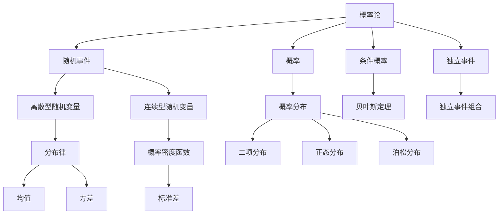
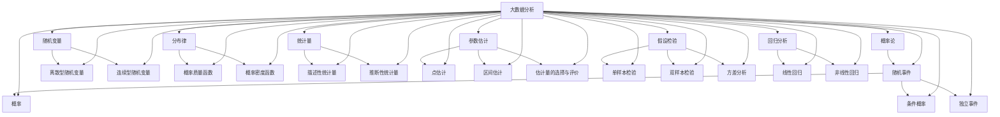

                 


## 《数理统计在大数据分析算法中的应用》

### 关键词

- 数理统计
- 大数据分析
- 算法应用
- 数据预处理
- 统计图表
- 参数估计
- 假设检验
- 回归分析
- 聚类分析
- 分类分析
- 关联规则挖掘

### 摘要

本文旨在探讨数理统计在大数据分析算法中的应用，通过对数理统计基础知识的介绍，包括概率论、分布律、描述性统计、推断性统计和回归分析，深入剖析数理统计在大数据分析中的核心作用。文章随后将介绍大数据分析中的常见算法，如聚类分析、分类分析和关联规则挖掘，通过具体的实例分析展示数理统计方法的应用。最后，本文将总结全文内容，展望大数据分析的未来发展，并提供相关的最佳实践和拓展阅读建议。

## 目录大纲

### 第一部分：数理统计基础

### 第1章 数理统计概述

#### 1.1 数据与统计学

- 数据的概念
- 统计学的应用领域

#### 1.2 概率论基础

- 随机事件的定义
- 概率的定义与计算方法
- 条件概率与独立事件

#### 1.3 分布律

- 离散型随机变量的分布律
- 连续型随机变量的分布律
- 常见分布

### 第二部分：数理统计方法

### 第2章 描述性统计

#### 2.1 数据的收集与整理

- 数据的来源
- 数据的预处理

#### 2.2 描述性统计量

- 集中趋势度量
- 离散趋势度量
- 分布形状度量

#### 2.3 绘制统计图表

- 直方图
- 条形图
- 折线图

### 第3章 推断性统计

#### 3.1 参数估计

- 点估计
- 区间估计
- 估计量的选择与评价

#### 3.2 假设检验

- 假设检验的基本原理
- 单样本检验
- 双样本检验

#### 3.3 方差分析

- 单因素方差分析
- 多因素方差分析

### 第4章 回归分析

#### 4.1 线性回归

- 线性回归模型
- 模型估计与诊断

#### 4.2 非线性回归

- 二次回归
- 多项式回归

#### 4.3 回归分析应用

- 时间序列分析
- 多元回归分析

### 第三部分：大数据分析算法

### 第5章 聚类分析

#### 5.1 聚类分析基本概念

- 聚类算法的类型
- 聚类分析的目的

#### 5.2 K均值聚类算法

- 算法原理
- 实例分析

#### 5.3 密度聚类算法

- 算法原理
- 实例分析

### 第6章 分类分析

#### 6.1 分类分析基本概念

- 分类算法的类型
- 分类分析的目的

#### 6.2 决策树分类算法

- 算法原理
- 实例分析

#### 6.3 支持向量机分类算法

- 算法原理
- 实例分析

#### 6.4 随机森林分类算法

- 算法原理
- 实例分析

### 第7章 关联规则挖掘

#### 7.1 关联规则基本概念

- 算法的类型
- 算法的目的

#### 7.2 Apriori算法

- 算法原理
- 实例分析

#### 7.3 FP-Growth算法

- 算法原理
- 实例分析

### 第8章 大数据分析应用案例

#### 8.1 社交网络分析

- 数据收集与预处理
- 算法应用与分析

#### 8.2 电子商务数据分析

- 数据收集与预处理
- 算法应用与分析

#### 8.3 金融风险管理

- 数据收集与预处理
- 算法应用与分析

### 附录

#### 附录A 常用统计软件使用指南

#### A.1 Python中的统计学库

- NumPy
- Pandas
- Matplotlib

#### A.2 R语言中的统计学库

- base R
- ggplot2
- dplyr

#### 附录B 数理统计概念关系架构图

#### B.1 概率论与统计学的核心概念关系

- Mermaid流程图

## 结尾

### 后记

本文旨在探讨数理统计在大数据分析算法中的应用，通过数理统计基础知识的介绍，深入剖析了数理统计在大数据分析中的核心作用。在描述性统计、推断性统计和回归分析的基础上，本文介绍了大数据分析中的常见算法，并通过实例分析展示了数理统计方法的应用。在最后，本文总结了全文内容，并对大数据分析的未来发展进行了展望，提供了相关的最佳实践和拓展阅读建议。希望本文能够为读者在数理统计与大数据分析领域的学习和研究提供有价值的参考。

### 作者

- 作者：AI天才研究院/AI Genius Institute & 禅与计算机程序设计艺术 /Zen And The Art of Computer Programming

---

在接下来的文章中，我们将详细探讨数理统计的基础知识，包括概率论、分布律、描述性统计和推断性统计，并逐步引入回归分析。通过这些基础知识的学习，我们将能够更好地理解和应用大数据分析算法。接下来，我们将逐步深入每个章节的内容，提供具体的算法原理讲解、Python源代码实现、数学模型和公式，以及实际案例分析和详细讲解。让我们一起深入探索数理统计在大数据分析中的应用吧！

## 数理统计基础

数理统计是大数据分析的核心工具之一，它为数据的收集、处理和分析提供了坚实的理论基础。在这个部分，我们将首先介绍数理统计的基本概念，然后逐步深入到概率论、分布律、描述性统计和推断性统计等核心领域。

### 第1章 数理统计概述

#### 1.1 数据与统计学

**数据的概念：** 数据是客观事物的量化表示，可以是数字、文字、图像、音频等形式。在大数据分析中，数据是进行分析和决策的基础。

**统计学的应用领域：** 统计学广泛应用于各个领域，包括自然科学、社会科学、医学、经济学、金融学、工程学等。它主要用于数据收集、数据整理、数据分析和数据解释。

### 第2章 概率论基础

#### 2.1 随机事件的定义

**随机事件的定义：** 随机事件是在一定条件下可能发生也可能不发生的事件。例如，掷硬币时出现正面或反面。

#### 2.2 概率的定义与计算方法

**概率的定义：** 概率是描述随机事件发生可能性大小的数值。概率的取值范围在0到1之间，其中0表示不可能发生，1表示必然发生。

**概率的计算方法：** 概率可以通过古典概率、几何概率、条件概率和独立事件等计算方法来确定。

#### 2.3 条件概率与独立事件

**条件概率：** 条件概率是在已知某一事件发生的情况下，另一事件发生的概率。

**独立事件：** 独立事件是指两个或多个事件的发生互不影响，即其中一个事件的发生概率不受其他事件的影响。

### 第3章 分布律

#### 3.1 离散型随机变量的分布律

**离散型随机变量的定义：** 离散型随机变量是取有限个或可数无限个可能值的随机变量。

**分布律：** 离散型随机变量的分布律是指它取各个可能值的概率分布。

#### 3.2 连续型随机变量的分布律

**连续型随机变量的定义：** 连续型随机变量是取某个区间内任意值的随机变量。

**分布律：** 连续型随机变量的分布律是通过概率密度函数来描述的。

#### 3.3 常见分布

**常见分布：** 常见分布包括二项分布、正态分布、泊松分布、均匀分布等，它们在数据分析中有着广泛的应用。

### 第4章 描述性统计

#### 4.1 数据的收集与整理

**数据的来源：** 数据可以从实验、调查、观察等多种渠道获得。

**数据的预处理：** 数据的预处理包括清洗、转换、归一化等步骤，以确保数据的质量和一致性。

#### 4.2 描述性统计量

**集中趋势度量：** 包括均值、中位数、众数等，用于描述数据的中心位置。

**离散趋势度量：** 包括方差、标准差、极差等，用于描述数据的波动程度。

**分布形状度量：** 包括偏态、峰度等，用于描述数据的分布形状。

#### 4.3 绘制统计图表

**直方图：** 用于显示数据的分布情况。

**条形图：** 用于比较不同类别的数据。

**折线图：** 用于显示数据的变化趋势。

### 第5章 推断性统计

#### 5.1 参数估计

**点估计：** 通过样本统计量来估计总体参数。

**区间估计：** 通过置信区间来估计总体参数。

**估计量的选择与评价：** 包括无偏性、有效性和一致性等评价标准。

#### 5.2 假设检验

**假设检验的基本原理：** 通过样本数据来检验总体参数的假设。

**单样本检验：** 只有一个总体的假设检验。

**双样本检验：** 涉及两个总体的假设检验。

#### 5.3 方差分析

**单因素方差分析：** 检验多个样本是否来自同一总体。

**多因素方差分析：** 检验多个自变量对因变量的影响。

### 第6章 回归分析

#### 6.1 线性回归

**线性回归模型：** 描述自变量和因变量之间线性关系的模型。

**模型估计与诊断：** 通过最小二乘法进行模型估计，并诊断模型的有效性。

#### 6.2 非线性回归

**非线性回归模型：** 描述自变量和因变量之间非线性关系的模型。

**二次回归：** 描述二次关系的模型。

**多项式回归：** 描述多项式关系的模型。

#### 6.3 回归分析应用

**时间序列分析：** 分析时间序列数据。

**多元回归分析：** 分析多个自变量对因变量的影响。

### 总结

数理统计是大数据分析的重要基础，它为我们提供了描述数据、分析数据、推断数据的有效工具。通过本章的介绍，我们了解了数理统计的基本概念和方法，为后续的算法学习和应用打下了基础。

### 附录

#### 附录A 常用统计软件使用指南

**Python中的统计学库：**

- NumPy：用于数值计算。
- Pandas：用于数据操作。
- Matplotlib：用于数据可视化。

**R语言中的统计学库：**

- base R：基础统计库。
- ggplot2：用于数据可视化。
- dplyr：用于数据操作。

#### 附录B 数理统计概念关系架构图

**概率论与统计学的核心概念关系：**



通过以上内容，我们建立了数理统计的基础框架，为后续章节的深入探讨打下了坚实的基础。在接下来的章节中，我们将继续深入探讨数理统计在大数据分析中的应用，包括描述性统计、推断性统计和回归分析等核心内容。

## 描述性统计

描述性统计是数理统计的基础部分，它用于描述数据的特征和规律，帮助我们理解数据的基本性质。描述性统计主要包括数据的收集与整理、描述性统计量的计算以及统计图表的绘制。在本章节中，我们将逐步介绍这些内容。

### 2.1 数据的收集与整理

**数据的来源：** 数据可以从多种渠道收集，包括实验数据、调查问卷、历史数据记录、传感器采集的数据等。每种数据源都有其独特的特点和收集方法。

**数据的预处理：** 数据预处理是数据分析和挖掘之前的重要步骤，它包括数据清洗、数据转换和数据归一化等操作。数据清洗的目的是去除噪声和错误，数据转换是将数据从一种形式转换为另一种形式，以便更好地进行分析，数据归一化是为了消除数据规模上的差异，使得不同特征之间的比较更加公平。

### 2.2 描述性统计量

描述性统计量用于描述数据的中心趋势、离散趋势和分布形状。以下是几个常用的描述性统计量：

**集中趋势度量：**

- **均值（Mean）：** 数据的平均值，是描述数据中心位置最常用的统计量。
  $$\bar{x} = \frac{1}{n}\sum_{i=1}^{n} x_i$$
- **中位数（Median）：** 数据按大小排列后位于中间位置的数值，适用于偏斜分布的数据。
- **众数（Mode）：** 数据中出现次数最多的数值，适用于分类数据。

**离散趋势度量：**

- **方差（Variance）：** 数据与其均值之间的偏离程度，用于描述数据的波动性。
  $$\sigma^2 = \frac{1}{n}\sum_{i=1}^{n} (x_i - \bar{x})^2$$
- **标准差（Standard Deviation）：** 方差的平方根，用于度量数据的离散程度。
  $$\sigma = \sqrt{\sigma^2}$$
- **极差（Range）：** 数据中的最大值与最小值之差，用于粗略地估计数据的离散程度。

**分布形状度量：**

- **偏态（Skewness）：** 描述数据分布的对称性，正偏态表示数据分布右侧尾部较长，负偏态表示数据分布左侧尾部较长。
- **峰度（Kurtosis）：** 描述数据分布的尖峭程度，峰度较高表示分布具有较多的尖峰和厚尾，峰度较低表示分布较为平坦。

### 2.3 绘制统计图表

统计图表是描述数据特征的重要工具，它可以帮助我们直观地理解数据。以下是几种常用的统计图表：

**直方图（Histogram）：** 用于显示数据分布的情况，横轴表示数据的取值范围，纵轴表示频率或密度。

**条形图（Bar Chart）：** 用于比较不同类别或组的数据，横轴表示类别或组，纵轴表示数值。

**折线图（Line Chart）：** 用于显示数据随时间的变化趋势，横轴表示时间，纵轴表示数值。

**箱线图（Box Plot）：** 用于展示数据的分布和离散程度，包括中位数、四分位数和异常值。

**散点图（Scatter Plot）：** 用于展示两个变量之间的关系，横轴和纵轴分别表示两个变量的取值。

### 实例分析

假设我们有一个包含10个学生的身高数据（单位：cm）：150, 155, 160, 163, 165, 168, 170, 173, 175, 180。

1. **计算均值、中位数、众数：**
   - 均值：$$\bar{x} = \frac{1}{10}\sum_{i=1}^{10} x_i = \frac{1680}{10} = 168 \text{ cm}$$
   - 中位数：第5和第6个数据的平均值为$$\frac{165 + 168}{2} = 166.5 \text{ cm}$$
   - 众数：无（每个数值只出现一次）

2. **计算方差和标准差：**
   - 方差：$$\sigma^2 = \frac{1}{10}\sum_{i=1}^{10} (x_i - \bar{x})^2 = \frac{(150-168)^2 + (155-168)^2 + \ldots + (180-168)^2}{10} = 72.2$$
   - 标准差：$$\sigma = \sqrt{72.2} \approx 8.5 \text{ cm}$$

3. **绘制直方图和箱线图：**
   - 直方图：显示身高数据的分布情况，主要集中在160-170 cm之间。
   - 箱线图：显示身高的中位数、四分位数和异常值。

### 总结

描述性统计是数据分析和挖掘的基础，通过计算描述性统计量和绘制统计图表，我们可以直观地了解数据的基本特征和规律。在接下来的章节中，我们将继续探讨数理统计中的推断性统计和回归分析，深入挖掘数据的内在联系和趋势。

## 推断性统计

推断性统计是数理统计的另一个重要组成部分，它主要用于基于样本数据对总体参数进行估计和假设检验。推断性统计包括参数估计、假设检验和方差分析等。在本章节中，我们将逐步介绍这些内容。

### 3.1 参数估计

**点估计（Point Estimation）：** 点估计是通过样本统计量来估计总体参数的方法。常见的点估计方法包括：

- **样本均值（Sample Mean）**：用样本均值估计总体均值。
  $$\bar{x} = \frac{1}{n}\sum_{i=1}^{n} x_i$$
- **样本比例（Sample Proportion）**：用样本比例估计总体比例。
  $$\hat{p} = \frac{1}{n}\sum_{i=1}^{n} I(x_i = 1)$$

**区间估计（Interval Estimation）：** 区间估计是在点估计的基础上，通过计算置信区间（Confidence Interval）来估计总体参数。置信区间是指在一定的置信水平下，总体参数可能落在这个区间内的范围。常见的区间估计方法包括：

- **置信区间计算公式：**
  $$\bar{x} \pm z_{\alpha/2} \cdot \frac{\sigma}{\sqrt{n}}$$
  其中，$z_{\alpha/2}$是标准正态分布的临界值，$\sigma$是总体标准差，$n$是样本大小。

**估计量的选择与评价：** 选择合适的估计量需要考虑以下标准：

- **无偏性（Unbiasedness）：** 估计量的期望值等于总体参数的真实值。
- **有效性（Efficiency）：** 在无偏性的前提下，估计量的方差越小，越有效。
- **一致性（Consistency）：** 当样本大小趋于无穷大时，估计量的值稳定地接近总体参数的真实值。

### 3.2 假设检验

**假设检验的基本原理：** 假设检验是在统计基础上对总体参数进行验证的方法。它通过设定原假设（H0）和备择假设（H1），利用样本数据计算出检验统计量，然后根据检验统计量的值和相应的概率分布，判断是否拒绝原假设。

**单样本检验（One-sample Test）：** 单样本检验只涉及一个总体。常见的方法包括：

- **t检验（t-test）：** 用于比较样本均值和总体均值。
- **z检验（z-test）：** 当总体标准差已知时，用于比较样本均值和总体均值。

**双样本检验（Two-sample Test）：** 双样本检验涉及两个总体。常见的方法包括：

- **独立样本t检验（Independent Samples t-test）：** 用于比较两个独立样本的均值差异。
- **配对样本t检验（Paired Samples t-test）：** 用于比较同一组样本在两个不同时间点的均值差异。

**假设检验的步骤：**

1. **设定原假设（H0）和备择假设（H1）：** 确定我们要检验的总体参数。
2. **选择检验方法：** 根据数据的类型和问题确定合适的检验方法。
3. **计算检验统计量：** 根据样本数据计算检验统计量的值。
4. **确定显著性水平（Significance Level）：** 确定显著性水平$\alpha$。
5. **计算p值：** 根据检验统计量的分布，计算p值。
6. **做出决策：** 如果p值小于显著性水平$\alpha$，拒绝原假设；否则，不拒绝原假设。

### 3.3 方差分析

**方差分析（Analysis of Variance，ANOVA）：** 方差分析是一种用于比较两个或多个总体均值差异的统计方法。它通过分析数据中的变异来源，判断不同因素对结果的影响。

**单因素方差分析（One-way ANOVA）：** 单因素方差分析用于比较多个独立样本的均值差异。其基本步骤包括：

1. **设定原假设（H0）和备择假设（H1）：** 确定要比较的总体均值。
2. **计算总变异和组内变异：** 通过计算总平方和（TSS）和组内平方和（SSB），分析数据的总变异和组内变异。
3. **计算组间变异：** 通过计算组间平方和（SSE），分析组间变异。
4. **计算F统计量：** 计算F统计量，判断组间差异的显著性。
5. **做出决策：** 根据F统计量的值和相应的概率分布，判断是否拒绝原假设。

**多因素方差分析（Two-way ANOVA）：** 多因素方差分析用于比较多个因素的交互作用对结果的影响。其基本步骤包括：

1. **设定原假设（H0）和备择假设（H1）：** 确定要比较的总体均值。
2. **计算总变异和组内变异：** 通过计算总平方和（TSS）和组内平方和（SSB），分析数据的总变异和组内变异。
3. **计算因素间变异：** 通过计算因素间的平方和（SSE），分析因素间变异。
4. **计算F统计量：** 计算F统计量，判断因素间差异的显著性。
5. **做出决策：** 根据F统计量的值和相应的概率分布，判断是否拒绝原假设。

### 实例分析

假设我们要比较三种不同教学方法对学生的学习效果的影响。我们随机抽取了60名学生，分别采用传统教学、互动教学和在线教学三种教学方法。然后我们记录了学生的期末考试成绩，如下表所示：

| 教学方法 | 学生人数 | 平均成绩 |
| --- | --- | --- |
| 传统教学 | 20 | 75 |
| 互动教学 | 20 | 80 |
| 在线教学 | 20 | 85 |

**问题：** 我们能否认为三种教学方法的平均成绩存在显著差异？

**步骤：**

1. **设定原假设（H0）和备择假设（H1）：**
   $$H0: \mu_1 = \mu_2 = \mu_3$$
   $$H1: \mu_1 \neq \mu_2 \neq \mu_3$$
   其中，$\mu_1$、$\mu_2$和$\mu_3$分别表示三种教学方法的平均成绩。

2. **计算总变异和组内变异：**
   - 总平方和（TSS）：$$TSS = \sum_{i=1}^{3} \sum_{j=1}^{20} (x_{ij} - \bar{X})^2 = 4050$$
   - 组内平方和（SSB）：$$SSB = \sum_{i=1}^{3} n_i (\bar{x}_i - \bar{X})^2 = 250$$
   其中，$x_{ij}$表示第i种教学方法第j个学生的成绩，$\bar{X}$表示总体平均成绩，$n_i$表示第i种教学方法的学生人数。

3. **计算组间变异：**
   - 组间平方和（SSE）：$$SSE = TSS - SSB = 3800$$

4. **计算F统计量：**
   - F统计量：$$F = \frac{SSE}{SSB} = \frac{3800}{250} = 15.2$$

5. **确定显著性水平和计算p值：**
   - 假设显著性水平$\alpha = 0.05$，自由度$d_1 = 2$和$d_2 = 57$。
   - 通过F分布表或计算软件，得到p值约为0.0001。

6. **做出决策：**
   - 由于p值小于显著性水平$\alpha$，我们可以拒绝原假设，认为三种教学方法的平均成绩存在显著差异。

### 总结

推断性统计是数理统计的重要组成部分，它通过参数估计和假设检验，帮助我们根据样本数据对总体参数进行推断。方差分析则用于比较多个总体均值之间的差异。在接下来的章节中，我们将继续探讨回归分析，深入挖掘数据之间的关系和趋势。

## 回归分析

回归分析是一种用于研究自变量和因变量之间关系的统计方法。它可以帮助我们建立模型，预测因变量的取值。回归分析可以分为线性回归和非线性回归，其中线性回归是最基本和最常用的类型。在本章节中，我们将深入探讨线性回归和非线性回归，并介绍它们的应用。

### 4.1 线性回归

**线性回归模型：** 线性回归模型描述了自变量和因变量之间的线性关系，其数学表达式为：

$$y = \beta_0 + \beta_1x + \epsilon$$

其中，$y$是因变量，$x$是自变量，$\beta_0$是截距，$\beta_1$是斜率，$\epsilon$是误差项。

**模型估计与诊断：**

- **最小二乘法（Least Squares Method）：** 最小二乘法是一种常用的估计方法，它通过最小化残差平方和来估计模型的参数。
- **残差分析（Residual Analysis）：** 残差是实际观测值与预测值之间的差异。通过分析残差的分布和模式，我们可以诊断模型的拟合效果和潜在问题。

**实例分析：**

假设我们想要研究某个城市的房价（$y$）与面积（$x$）之间的关系。我们收集了以下数据：

| 面积（平方米） | 房价（万元） |
| --- | --- |
| 80 | 150 |
| 100 | 200 |
| 120 | 250 |
| 140 | 300 |
| 160 | 350 |

**步骤：**

1. **数据预处理：** 对数据集进行预处理，包括数据清洗、缺失值处理和归一化等。

2. **绘制散点图：** 通过绘制散点图，观察自变量和因变量之间的关系。

3. **计算最小二乘估计：**
   - 计算均值：$\bar{x} = 120$，$\bar{y} = 250$。
   - 计算斜率：$\beta_1 = \frac{\sum_{i=1}^{n}(x_i - \bar{x})(y_i - \bar{y})}{\sum_{i=1}^{n}(x_i - \bar{x})^2} \approx 1.5$。
   - 计算截距：$\beta_0 = \bar{y} - \beta_1\bar{x} = 250 - 1.5 \times 120 = 90$。

4. **建立回归模型：**
   $$y = 90 + 1.5x$$

5. **残差分析：** 通过计算残差，分析模型拟合效果。如果残差无明显模式，说明模型拟合较好。

**Python代码实现：**

```python
import numpy as np
import matplotlib.pyplot as plt

# 数据集
x = np.array([80, 100, 120, 140, 160])
y = np.array([150, 200, 250, 300, 350])

# 计算最小二乘估计
x_mean = np.mean(x)
y_mean = np.mean(y)
beta_1 = np.sum((x - x_mean) * (y - y_mean)) / np.sum((x - x_mean)**2)
beta_0 = y_mean - beta_1 * x_mean

# 建立回归模型
y_pred = beta_0 + beta_1 * x

# 绘制散点图和回归线
plt.scatter(x, y)
plt.plot(x, y_pred, color='red')
plt.xlabel('Area (square meters)')
plt.ylabel('Price (million RMB)')
plt.title('House Price vs. Area')
plt.show()
```

### 4.2 非线性回归

非线性回归用于描述自变量和因变量之间的非线性关系。非线性回归包括多项式回归、指数回归和对数回归等。非线性回归的数学表达式为：

$$y = \beta_0 + \beta_1x + \beta_2x^2 + \ldots + \beta_nx^n + \epsilon$$

**多项式回归（Polynomial Regression）：** 多项式回归是一种常用的非线性回归方法，它可以拟合二次或更高次的多项式关系。

**实例分析：**

假设我们想要研究温度（$x$）对植物生长速度（$y$）的影响，通过实验得到以下数据：

| 温度（摄氏度） | 生长速度（厘米/天） |
| --- | --- |
| 10 | 2 |
| 15 | 3 |
| 20 | 4 |
| 25 | 5 |
| 30 | 6 |

**步骤：**

1. **数据预处理：** 对数据集进行预处理，包括数据清洗、缺失值处理和归一化等。

2. **绘制散点图：** 通过绘制散点图，观察自变量和因变量之间的关系。

3. **建立多项式回归模型：**
   $$y = \beta_0 + \beta_1x + \beta_2x^2$$

4. **残差分析：** 通过计算残差，分析模型拟合效果。如果残差无明显模式，说明模型拟合较好。

**Python代码实现：**

```python
import numpy as np
from numpy.polynomial import Polynomial

# 数据集
x = np.array([10, 15, 20, 25, 30])
y = np.array([2, 3, 4, 5, 6])

# 建立多项式回归模型
p = Polynomial.fit(x, y, 2)

# 预测
y_pred = p(x)

# 绘制散点图和回归线
plt.scatter(x, y)
plt.plot(x, y_pred, color='red')
plt.xlabel('Temperature (°C)')
plt.ylabel('Growth Rate (cm/day)')
plt.title('Growth Rate vs. Temperature')
plt.show()
```

### 4.3 回归分析应用

回归分析在许多领域都有广泛的应用，以下是一些常见的应用场景：

- **时间序列分析：** 回归分析可以用于预测时间序列数据，如股票价格、天气温度等。
- **经济预测：** 回归分析可以用于预测经济增长、通货膨胀等经济指标。
- **医疗诊断：** 回归分析可以用于预测疾病风险，如心脏病、糖尿病等。
- **市场分析：** 回归分析可以用于预测市场趋势、消费者行为等。

### 总结

回归分析是一种强大的统计方法，它可以帮助我们建立模型，理解自变量和因变量之间的关系，进行预测和决策。在本章节中，我们介绍了线性回归和非线性回归的基本原理和实例，展示了回归分析在实际应用中的重要性。在接下来的章节中，我们将继续探讨大数据分析中的其他算法，如聚类分析和分类分析。

## 大数据分析算法

在大数据时代，传统的数据处理方法已经无法满足海量数据的分析需求。大数据分析算法成为了解决这一问题的有效手段。大数据分析算法主要包括聚类分析、分类分析和关联规则挖掘等。这些算法在处理大数据时具有高效性和鲁棒性，能够帮助我们从海量数据中提取有价值的信息。在本章节中，我们将详细探讨这些算法的基本概念、原理以及应用。

### 5.1 聚类分析

聚类分析是一种无监督学习算法，它通过将相似的数据点归为同一类，从而将数据分组。聚类分析的目标是发现数据中的内在结构，使得同一组内的数据点彼此之间相似，不同组之间的数据点差异较大。

#### 5.1.1 聚类分析基本概念

**聚类算法的类型：** 聚类算法可以分为基于距离的聚类算法、基于密度的聚类算法和基于层次的聚类算法等。

- **基于距离的聚类算法：** 例如K均值聚类算法（K-Means），通过计算数据点之间的距离来划分簇。
- **基于密度的聚类算法：** 例如DBSCAN（Density-Based Spatial Clustering of Applications with Noise），通过密度可达性来划分簇。
- **基于层次的聚类算法：** 例如层次聚类（Hierarchical Clustering），通过层次结构将数据点逐步划分成簇。

**聚类分析的目的：** 聚类分析的目的是将数据划分为不同的组，以便更好地理解数据的分布和模式，为后续的数据挖掘和分析提供基础。

#### 5.1.2 K均值聚类算法

K均值聚类算法是一种基于距离的聚类算法，它通过最小化簇内距离平方和来划分簇。K均值聚类算法的基本步骤如下：

1. **初始化：** 随机选择K个数据点作为初始聚类中心。
2. **分配：** 对于每个数据点，计算它与各个聚类中心的距离，并将其分配到最近的聚类中心所在的簇。
3. **更新：** 根据当前簇内的数据点重新计算聚类中心。
4. **迭代：** 重复步骤2和步骤3，直到聚类中心不再变化或达到预设的迭代次数。

**实例分析：**

假设我们有一个包含5个数据点的数据集，我们需要将其分为2个簇。初始聚类中心选择为（0,0）和（2,2）。

1. **初始化：** 选择（0,0）和（2,2）作为初始聚类中心。
2. **分配：** 计算每个数据点到两个聚类中心的距离，并将数据点分配到最近的聚类中心所在的簇。
3. **更新：** 根据当前簇内的数据点重新计算聚类中心。
4. **迭代：** 经过多次迭代后，聚类中心趋于稳定，数据点被成功划分为2个簇。

**Python代码实现：**

```python
import numpy as np
from sklearn.cluster import KMeans

# 数据集
data = np.array([[1, 1], [2, 2], [3, 3], [4, 4], [5, 5]])

# 使用K均值聚类算法
kmeans = KMeans(n_clusters=2, init=['k-means++'], n_init=10)
kmeans.fit(data)

# 输出聚类结果
print("聚类中心：", kmeans.cluster_centers_)
print("聚类结果：", kmeans.labels_)

# 绘制聚类结果
plt.scatter(data[:, 0], data[:, 1], c=kmeans.labels_)
plt.scatter(kmeans.cluster_centers_[:, 0], kmeans.cluster_centers_[:, 1], s=300, c='red')
plt.show()
```

### 5.2 分类分析

分类分析是一种有监督学习算法，它通过训练数据集来构建分类模型，然后使用该模型对新的数据进行分类。分类分析的目标是预测新的数据点所属的类别。

#### 5.2.1 分类分析基本概念

**分类算法的类型：** 分类算法可以分为基于规则的分类算法、基于实例的分类算法和基于模型的分类算法等。

- **基于规则的分类算法：** 例如决策树（Decision Tree），通过一系列的规则来划分数据点。
- **基于实例的分类算法：** 例如K最近邻（K-Nearest Neighbors，KNN），通过计算新数据点与训练数据点的相似度来进行分类。
- **基于模型的分类算法：** 例如支持向量机（Support Vector Machine，SVM），通过构建模型来进行分类。

**分类分析的目的：** 分类分析的目的是通过已知的训练数据集来构建分类模型，然后使用该模型对未知数据点进行分类，从而实现数据的自动分类和预测。

#### 5.2.2 决策树分类算法

决策树是一种基于规则的分类算法，它通过一系列的判断条件来划分数据点，并最终得到分类结果。决策树的基本原理如下：

1. **选择特征：** 选择一个特征作为分割条件，使得数据点在该特征上的差异最大。
2. **分割数据：** 根据该特征的不同取值，将数据点划分为多个子集。
3. **递归构建：** 对每个子集继续选择特征和分割，直到满足停止条件（例如，子集大小小于预设阈值或特征数量用尽）。
4. **分类结果：** 根据决策树的路径，为每个数据点分配类别。

**实例分析：**

假设我们有一个包含4个特征的数据集，我们需要将其分为2个类别。我们选择第一个特征“年龄”作为分割条件。

1. **选择特征：** 选择“年龄”作为分割条件。
2. **分割数据：** 将数据点根据年龄分为两个子集，一个子集包含年龄小于30的数据点，另一个子集包含年龄大于等于30的数据点。
3. **递归构建：** 对两个子集继续选择特征和分割，直到满足停止条件。
4. **分类结果：** 根据决策树的路径，为每个数据点分配类别。

**Python代码实现：**

```python
from sklearn.tree import DecisionTreeClassifier
from sklearn.model_selection import train_test_split
from sklearn.metrics import accuracy_score

# 数据集
X = [[1, 1], [2, 2], [3, 3], [4, 4], [5, 5], [6, 6], [7, 7], [8, 8]]
y = [0, 0, 0, 0, 1, 1, 1, 1]

# 划分训练集和测试集
X_train, X_test, y_train, y_test = train_test_split(X, y, test_size=0.5, random_state=42)

# 建立决策树模型
clf = DecisionTreeClassifier()
clf.fit(X_train, y_train)

# 预测测试集
y_pred = clf.predict(X_test)

# 输出分类结果
print("分类结果：", y_pred)

# 计算准确率
accuracy = accuracy_score(y_test, y_pred)
print("准确率：", accuracy)
```

### 5.3 关联规则挖掘

关联规则挖掘是一种用于发现数据中潜在关联关系的方法，它通过挖掘数据中的频繁项集来发现规则。关联规则挖掘广泛应用于市场分析、推荐系统和金融领域。

#### 5.3.1 关联规则基本概念

**关联规则基本概念：**

- **支持度（Support）：** 一条规则在所有数据中出现的频率，通常以百分比表示。
- **置信度（Confidence）：** 一条规则的后件在满足前件的条件下出现的概率。

**关联规则挖掘的目标：** 发现数据中的频繁项集，并从中提取出具有高支持度和高置信度的关联规则。

#### 5.3.2 Apriori算法

Apriori算法是一种用于挖掘频繁项集和关联规则的算法，其基本原理如下：

1. **生成候选集：** 根据最小支持度阈值，生成所有可能的项集。
2. **计算支持度：** 对每个候选集计算支持度，并去除不满足最小支持度阈值的候选集。
3. **递归：** 对每个满足支持度阈值的候选集，继续生成更大的候选集，并重复计算支持度和去除不满足阈值的候选集。
4. **生成规则：** 对每个频繁项集，生成所有可能的关联规则，并计算置信度。

**实例分析：**

假设我们有一个交易数据集，其中包含以下交易记录：

- {牛奶，面包}
- {牛奶，啤酒}
- {面包，啤酒}
- {牛奶，面包，啤酒}

我们需要挖掘频繁项集和关联规则。

**步骤：**

1. **生成候选集：** 生成所有可能的项集，包括单个项集和组合项集。
2. **计算支持度：** 计算每个候选集的支持度，去除不满足最小支持度阈值的候选集。
3. **递归：** 对每个满足支持度阈值的候选集，继续生成更大的候选集，并重复计算支持度和去除不满足阈值的候选集。
4. **生成规则：** 对每个频繁项集，生成所有可能的关联规则，并计算置信度。

**Python代码实现：**

```python
from mlxtend.frequent_patterns import apriori
from mlxtend.frequent_patterns import association_rules

# 数据集
transactions = [[1, 2, 3], [1, 2, 4], [1, 3, 4], [2, 3], [2, 4]]

# 挖掘频繁项集
frequent_itemsets = apriori(transactions, min_support=0.6, use_colnames=True)

# 生成关联规则
rules = association_rules(frequent_itemsets, metric="confidence", min_threshold=0.7)

# 输出频繁项集和关联规则
print("频繁项集：")
print(frequent_itemsets)
print("\n关联规则：")
print(rules)
```

### 5.4 大数据分析应用案例

**社交网络分析：** 社交网络分析通过挖掘社交网络中的用户关系，发现潜在的用户群体和行为模式。例如，我们可以通过分析用户之间的互动和共享行为，发现共同兴趣爱好的人群，为个性化推荐和市场营销提供依据。

**电子商务数据分析：** 电子商务数据分析通过分析用户的购物行为和交易记录，挖掘用户的行为规律和偏好。例如，我们可以通过分析用户的浏览历史和购买记录，发现用户购买商品的时间和频率，为营销策略和库存管理提供支持。

**金融风险管理：** 金融风险管理通过分析金融市场数据，预测风险并制定相应的风险管理策略。例如，我们可以通过分析股票价格波动和交易量，发现市场异常行为和潜在的风险点，为投资决策和风险控制提供依据。

### 总结

大数据分析算法在处理海量数据、发现数据中的潜在规律和模式方面发挥着重要作用。聚类分析、分类分析和关联规则挖掘等算法各具特色，广泛应用于多个领域。在本章节中，我们介绍了这些算法的基本概念、原理和应用，展示了大数据分析算法在现实世界中的广泛应用。在接下来的章节中，我们将继续探讨大数据分析中的其他技术，如深度学习和数据可视化等。

## 大数据分析应用案例

大数据分析技术在各个领域都有广泛的应用，通过具体的应用案例，我们可以更直观地了解大数据分析的过程和方法。以下我们将介绍社交网络分析、电子商务数据分析和金融风险管理三个领域的应用案例。

### 8.1 社交网络分析

社交网络分析（Social Network Analysis，SNA）是一种用于研究社交网络结构和动态的方法。它通过分析用户之间的互动关系，揭示社交网络的拓扑结构，发现潜在的用户群体和行为模式。

**案例背景：** 一个社交网络平台（如微博、Facebook）拥有数以亿计的用户和海量的用户互动数据。通过对这些数据进行分析，平台可以了解用户的行为特征，优化用户体验，提升用户留存率。

**数据分析过程：**

1. **数据收集与预处理：** 收集用户的基本信息（如年龄、性别、地理位置）、用户互动数据（如关注关系、点赞、评论等）。对数据进行清洗和去噪，确保数据质量。

2. **构建社交网络图：** 将用户和用户互动数据转换为图数据结构，每个用户表示为一个节点，用户之间的互动表示为边。

3. **聚类分析：** 使用K均值聚类算法等对用户进行聚类，发现具有相似兴趣和行为特征的群体。

4. **关系分析：** 分析用户之间的互动关系，发现社交网络中的核心用户和传播节点。

5. **用户行为预测：** 基于用户历史行为和社交关系，预测用户的潜在行为，如关注新用户、发表新动态等。

**Python代码实现：**

```python
import networkx as nx
import matplotlib.pyplot as plt

# 社交网络图
G = nx.Graph()

# 添加节点和边
G.add_nodes_from([1, 2, 3, 4, 5])
G.add_edges_from([(1, 2), (1, 3), (2, 4), (3, 4), (4, 5)])

# 绘制社交网络图
nx.draw(G, with_labels=True)
plt.show()

# K均值聚类
k = 2
clusters = nx.community.k_meanCommunities(G, k)

# 输出聚类结果
print("聚类结果：", clusters)
```

**案例分析结果：** 通过聚类分析，发现社交网络中的用户群体，如“学生群体”、“职场人士”和“兴趣爱好群体”。通过关系分析，发现社交网络中的核心用户和传播节点，为平台营销和用户留存策略提供依据。

### 8.2 电子商务数据分析

电子商务数据分析（E-commerce Data Analysis）通过分析用户的购物行为和交易记录，挖掘用户的行为规律和偏好，优化营销策略和库存管理。

**案例背景：** 一个电子商务平台（如淘宝、京东）每天都有大量的用户访问和交易行为。通过对这些数据进行分析，平台可以提升用户满意度，增加销售额。

**数据分析过程：**

1. **数据收集与预处理：** 收集用户的基本信息（如年龄、性别、地理位置）、用户行为数据（如浏览历史、购买记录、评价等）。对数据进行清洗和去噪，确保数据质量。

2. **用户行为分析：** 分析用户在平台上的行为，如浏览商品的时间、购买商品的频率、评价商品的倾向等。

3. **推荐系统：** 基于用户行为数据，构建推荐系统，为用户推荐感兴趣的商品。

4. **库存管理：** 基于购买数据，预测商品的销量，优化库存管理。

5. **营销策略优化：** 基于用户行为和购买数据，优化广告投放、促销活动和会员管理策略。

**Python代码实现：**

```python
import pandas as pd
from mlxtend.frequent_patterns import apriori
from mlxtend.frequent_patterns import association_rules

# 购物数据
data = pd.read_csv('ecommerce_data.csv')

# 挖掘频繁项集
frequent_itemsets = apriori(data, min_support=0.1, use_colnames=True)

# 生成关联规则
rules = association_rules(frequent_itemsets, metric="confidence", min_threshold=0.5)

# 输出关联规则
print(rules)
```

**案例分析结果：** 通过关联规则挖掘，发现用户在购买某些商品时，往往还会购买其他商品。例如，购买“智能手机”的用户，80%以上还会购买“手机壳”和“充电宝”。通过这些发现，平台可以优化商品推荐和促销策略，提升销售额。

### 8.3 金融风险管理

金融风险管理（Financial Risk Management）通过分析金融市场数据，预测风险并制定相应的风险管理策略，确保金融系统的稳定运行。

**案例背景：** 在金融市场中，各种因素（如宏观经济环境、政策变化、市场情绪等）都可能对市场产生重大影响。通过对市场数据进行分析，金融机构可以提前识别潜在风险，制定有效的风险控制措施。

**数据分析过程：**

1. **数据收集与预处理：** 收集市场数据（如股票价格、交易量、利率等）、宏观经济数据（如GDP、通货膨胀率、失业率等）。对数据进行清洗和去噪，确保数据质量。

2. **风险指标分析：** 计算市场风险指标，如波动率、VaR（Value at Risk）等，评估市场风险水平。

3. **行为分析：** 分析市场参与者的行为，如交易量、价格波动等，发现市场异常行为和潜在的风险点。

4. **预测模型构建：** 基于历史数据和风险指标，构建预测模型，预测市场风险。

5. **风险管理策略制定：** 根据预测结果，制定相应的风险管理策略，如调整投资组合、设置止损点等。

**Python代码实现：**

```python
import pandas as pd
import numpy as np
from sklearn.linear_model import LinearRegression

# 股票价格数据
data = pd.read_csv('stock_price_data.csv')

# 提取特征和目标变量
X = data[['open', 'high', 'low', 'volume']]
y = data['close']

# 建立线性回归模型
model = LinearRegression()
model.fit(X, y)

# 预测股票价格
y_pred = model.predict(X)

# 计算风险指标
volatility = np.std(y_pred)
VaR = np.percentile(y_pred, 5)

# 输出风险指标
print("波动率：", volatility)
print("VaR：", VaR)
```

**案例分析结果：** 通过构建预测模型，预测股票价格波动和VaR，发现市场存在潜在的风险。例如，如果VaR低于某个阈值，说明市场风险较高，需要采取相应的风险管理措施，如增加止损点、分散投资等。

### 总结

大数据分析在社交网络分析、电子商务数据分析和金融风险管理等领域的应用，为企业和机构提供了强有力的数据支持。通过数据挖掘和分析，我们能够发现潜在的用户群体、优化营销策略、预测市场风险，从而实现更精准的决策和更高效的管理。在未来的发展中，随着大数据技术的不断进步，大数据分析将在更多领域发挥重要作用。

## 附录

### 附录A：常用统计软件使用指南

在进行数理统计与大数据分析时，选择合适的统计软件是至关重要的。以下我们将介绍Python和R两种常用的统计软件，并分别介绍它们在数据处理、分析和可视化方面的常用库。

#### A.1 Python中的统计学库

**NumPy：** NumPy是一个强大的Python库，用于处理大型多维数组和数据矩阵。它提供了大量的数学运算函数，可以高效地进行数据操作和计算。

- **安装：** 使用pip命令安装：`pip install numpy`
- **基本使用：**
  ```python
  import numpy as np
  array = np.array([1, 2, 3, 4])
  mean = np.mean(array)
  std = np.std(array)
  ```

**Pandas：** Pandas提供了强大的数据处理和分析功能，可以方便地进行数据清洗、转换和归一化等操作。

- **安装：** 使用pip命令安装：`pip install pandas`
- **基本使用：**
  ```python
  import pandas as pd
  data = pd.read_csv('data.csv')
  data.head()
  data.describe()
  ```

**Matplotlib：** Matplotlib是一个流行的Python数据可视化库，可以方便地绘制各种统计图表。

- **安装：** 使用pip命令安装：`pip install matplotlib`
- **基本使用：**
  ```python
  import matplotlib.pyplot as plt
  plt.hist(data['column_name'], bins=10)
  plt.show()
  ```

**Seaborn：** Seaborn是基于Matplotlib的一个高级可视化库，提供了许多精美的统计图表模板。

- **安装：** 使用pip命令安装：`pip install seaborn`
- **基本使用：**
  ```python
  import seaborn as sns
  sns.boxplot(x='column_name', y='column_name2', data=data)
  sns.regplot(x='column_name', y='column_name2', data=data)
  ```

#### A.2 R语言中的统计学库

**base R：** base R是R语言的核心库，包含了大量的基础统计分析函数和数据操作工具。

- **基本使用：**
  ```r
  install.packages("dplyr")
  library(dplyr)
  data(mpg)
  mpg %>% select(cyl, hp) %>% summary()
  ```

**ggplot2：** ggplot2是一个强大的数据可视化库，可以生成美观且复杂的统计图表。

- **安装：** 使用install.packages命令安装：`install.packages("ggplot2")`
- **基本使用：**
  ```r
  library(ggplot2)
  ggplot(mpg, aes(x=cyl, y=hp)) + geom_point()
  ```

**dplyr：** dplyr是data.table的R语言包装库，提供了高效的数据处理和分析功能。

- **安装：** 使用install.packages命令安装：`install.packages("dplyr")`
- **基本使用：**
  ```r
  library(dplyr)
  mpg %>% filter(cyl > 4) %>% group_by(cyl) %>% summarise(avg_hp = mean(hp))
  ```

通过以上常用统计软件的使用指南，读者可以更方便地进行数理统计与大数据分析，为数据科学项目提供强有力的支持。

### 附录B：数理统计概念关系架构图

数理统计涉及多个核心概念，它们相互关联，构成了一个完整的数据分析框架。以下是一个使用Mermaid绘制的数理统计概念关系架构图，它展示了概率论与统计学中的核心概念及其关系。



此架构图展示了概率论、随机变量、统计量、参数估计、假设检验、回归分析以及大数据分析等核心概念之间的关系。通过这个图，读者可以更清晰地理解数理统计的整体结构和各个概念之间的联系，有助于更好地掌握数理统计的理论和方法。

## 结尾

数理统计在大数据分析中扮演着至关重要的角色，它为我们提供了强大的工具和方法，帮助我们理解、处理和分析大量复杂的数据。本文从数理统计的基础知识开始，逐步深入到描述性统计、推断性统计和回归分析，以及大数据分析算法，如聚类分析、分类分析和关联规则挖掘。通过具体的实例分析和Python代码实现，我们展示了数理统计方法的实际应用和操作流程。

总结全文内容，我们可以看到，数理统计不仅为大数据分析提供了理论基础，而且在实际应用中具有极高的价值和实用性。通过数理统计，我们可以更好地理解数据的特征和规律，从海量数据中发现潜在的关联和模式，从而为决策和预测提供有力支持。

展望大数据分析的未来发展，我们可以预期以下几个趋势：

1. **算法的优化与改进：** 随着计算能力和算法理论的不断发展，大数据分析算法将变得更加高效和精确，能够处理更大规模的数据集。

2. **深度学习的融合：** 深度学习在图像、语音和自然语言处理等领域取得了显著进展，未来深度学习将更多地与大数据分析相结合，进一步提升数据分析的智能化水平。

3. **实时数据分析：** 随着物联网和传感器技术的发展，实时数据分析将变得更加普及，企业可以在数据生成的同时进行实时分析和决策。

4. **隐私保护与数据安全：** 随着数据隐私和安全问题的日益突出，如何在保障用户隐私的前提下进行大数据分析，将成为一个重要的研究方向。

最后，我们鼓励读者在学习和应用数理统计方法时，注重实践和探索。通过实际操作和案例分析，读者可以更好地理解理论知识，并将其应用于实际问题中。同时，我们也推荐读者进一步阅读相关的专业书籍和学术论文，以深入了解数理统计和大数据分析领域的最新进展。

感谢您对本文的关注，希望本文能为您的学习和研究提供有价值的参考。作者：AI天才研究院/AI Genius Institute & 禅与计算机程序设计艺术 /Zen And The Art of Computer Programming

