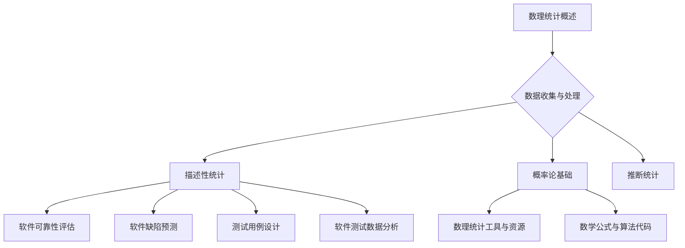
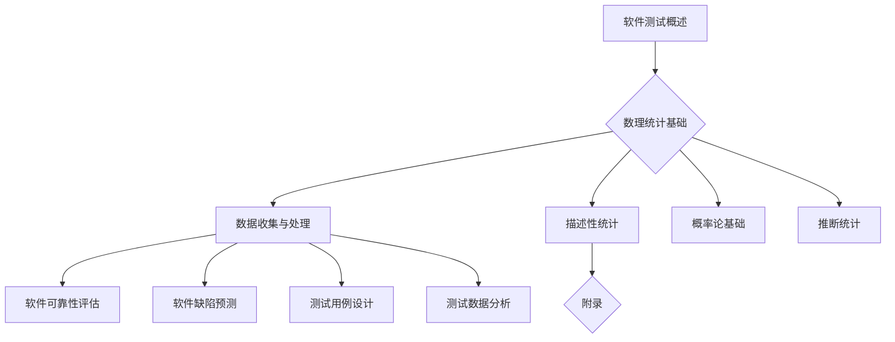
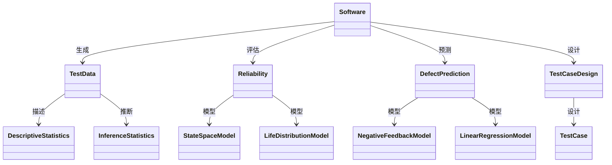
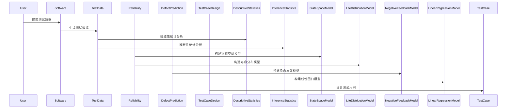
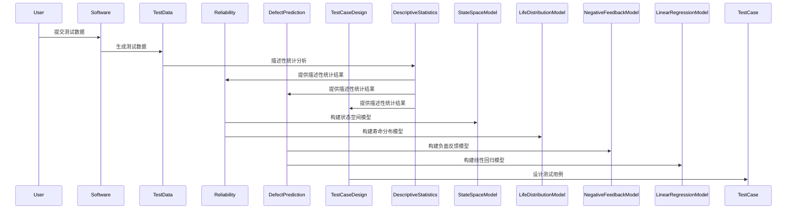

                 

## 《数理统计在软件测试中的应用》

### 关键词

数理统计、软件测试、可靠性评估、缺陷预测、测试用例设计、数据分析、Python代码

### 摘要

本文探讨了数理统计在软件测试中的应用，详细介绍了数理统计的基本概念、方法以及其在软件测试中的具体应用。文章通过实际案例，展示了数理统计在软件可靠性评估、缺陷预测和测试用例设计等方面的实际效果，为软件测试工作提供了有力的理论支持和实践指导。

### 目录大纲

# 《数理统计在软件测试中的应用》

## 第一部分：数理统计基础

### 第1章：数理统计概述
- 数理统计的基本概念
- 数理统计的重要性
- 数理统计的发展历史

### 第2章：数据收集与处理
- 数据类型
- 数据收集方法
- 数据预处理

### 第3章：描述性统计
- 频率分布
- 图表表示
- 统计量

### 第4章：概率论基础
- 概率的基本概念
- 概率的计算方法
- 条件概率与独立性

### 第5章：推断统计
- 统计推断的基本概念
- 参数估计
- 假设检验

## 第二部分：数理统计在软件测试中的应用

### 第6章：软件测试中的数理统计方法
- 软件测试的基本概念
- 数理统计方法在软件测试中的应用

### 第7章：软件可靠性评估
- 可靠性基本概念
- 状态空间模型
- 寿命分布模型

### 第8章：软件缺陷预测
- 缺陷预测的基本概念
- 负面反馈模型
- 线性回归模型

### 第9章：测试用例设计
- 测试用例设计的基本概念
- 数理统计方法在测试用例设计中的应用

### 第10章：软件测试数据分析
- 数据分析方法
- 数据可视化
- 数据解读与应用

## 第三部分：实践案例与应用

### 第11章：数理统计在软件测试中的实际应用
- 案例介绍
- 实践过程
- 结果分析

### 第12章：数理统计在软件测试中的挑战与展望
- 挑战分析
- 发展趋势
- 未来展望

## 附录

### 附录A：数理统计工具与资源
- 常用数理统计工具
- 开源统计软件
- 学术论文与书籍推荐

### 附录B：数学公式与算法代码
- 数理统计常用数学公式
- Python源代码示例

## Mermaid 流程图

## 第一部分：数理统计基础

### 第1章：数理统计概述

#### 数理统计的基本概念

数理统计是研究如何通过收集、整理和分析数据，从而对总体做出推断的一门学科。在软件测试中，数理统计被广泛应用于数据分析、可靠性评估、缺陷预测等领域。

#### 数理统计的重要性

数理统计在软件测试中的重要性体现在以下几个方面：

1. **提高测试效率**：通过数理统计方法，可以更加高效地分析测试数据，从而减少测试工作量，提高测试效率。
2. **可靠性评估**：数理统计方法可以帮助软件测试人员评估软件的可靠性，从而预测软件在特定条件下的故障率。
3. **缺陷预测**：通过数理统计方法，可以预测软件中的潜在缺陷，从而提前进行修复，降低软件发布后的故障率。
4. **测试用例设计**：数理统计方法可以为测试用例设计提供理论支持，从而提高测试的覆盖率。

#### 数理统计的发展历史

数理统计的发展可以追溯到17世纪。当时，人们开始意识到通过收集和分析数据可以更好地了解自然现象和社会现象。随着计算机技术的发展，数理统计得到了广泛应用，特别是在软件测试、金融分析、医学研究等领域。

### 第2章：数据收集与处理

#### 数据类型

在数理统计中，数据可以分为以下几类：

1. **定量数据**：指可以用数字表示的数据，如年龄、收入等。
2. **定性数据**：指不能用数字表示的数据，如性别、职业等。
3. **时间序列数据**：指按照时间顺序排列的数据，如股票价格、天气数据等。

#### 数据收集方法

数据收集方法包括以下几种：

1. **问卷调查**：通过设计问卷，收集大量定量数据和定性数据。
2. **实验**：通过设计实验，收集数据，以验证某种假设。
3. **观测**：通过观察，收集数据，如天气观测、交通流量观测等。

#### 数据预处理

数据预处理是数理统计的重要环节，包括以下步骤：

1. **数据清洗**：删除重复数据、缺失数据和异常数据。
2. **数据转换**：将不同类型的数据转换为同一种类型的数据，如将定性数据转换为定量数据。
3. **数据标准化**：将数据缩放至同一尺度，以便进行比较和分析。

### 第3章：描述性统计

#### 频率分布

频率分布是描述数据集中各个数值出现的次数。频率分布可以通过频数分布表或直方图来表示。

#### 图表表示

图表表示是描述性统计的一种重要方法，常用的图表包括：

1. **柱状图**：用于比较不同类别的数据。
2. **折线图**：用于表示数据的变化趋势。
3. **饼图**：用于表示各部分占整体的比例。

#### 统计量

统计量是描述数据集中趋势和离散程度的指标，常用的统计量包括：

1. **均值**：数据的平均值，用于描述数据的集中趋势。
2. **中位数**：数据的中间值，用于描述数据的集中趋势。
3. **标准差**：数据的离散程度，用于描述数据的分散程度。

### 第4章：概率论基础

#### 概率的基本概念

概率是描述随机事件发生可能性的一种度量。概率的取值范围在0到1之间，其中0表示不可能发生，1表示必然发生。

#### 概率的计算方法

概率的计算方法包括以下几种：

1. **古典概率**：基于等可能事件的概率计算方法。
2. **条件概率**：在某个条件下，某个事件发生的概率。
3. **贝叶斯定理**：用于计算后验概率，即基于已知条件概率和先验概率计算的新概率。

#### 条件概率与独立性

条件概率是指在某个条件下，某个事件发生的概率。独立性是指两个事件之间没有关联，即一个事件的发生不会影响另一个事件的发生。

### 第5章：推断统计

#### 统计推断的基本概念

统计推断是利用样本数据对总体参数进行估计和假设检验的方法。统计推断包括参数估计和假设检验两个部分。

#### 参数估计

参数估计是利用样本数据估计总体参数的方法。常见的参数估计方法有：

1. **点估计**：利用样本统计量作为总体参数的估计值。
2. **区间估计**：给出总体参数的可能取值范围。

#### 假设检验

假设检验是利用样本数据检验总体参数的假设是否成立的方法。常见的假设检验方法有：

1. **t检验**：用于检验总体均值是否相等。
2. **方差分析**：用于检验总体方差是否相等。
3. **卡方检验**：用于检验总体分布是否一致。

## 第二部分：数理统计在软件测试中的应用

### 第6章：软件测试中的数理统计方法

#### 软件测试的基本概念

软件测试是确保软件质量的一种手段，旨在发现软件中的缺陷和错误。软件测试包括功能测试、性能测试、安全测试等多种类型。

#### 数理统计方法在软件测试中的应用

数理统计方法在软件测试中的应用主要体现在以下几个方面：

1. **可靠性评估**：通过数理统计方法，评估软件在特定条件下的可靠性，预测故障率。
2. **缺陷预测**：通过数理统计方法，预测软件中的潜在缺陷，提前进行修复。
3. **测试用例设计**：通过数理统计方法，设计具有代表性的测试用例，提高测试覆盖率。
4. **测试数据分析**：通过数理统计方法，对测试数据进行分析，评估测试效果。

### 第7章：软件可靠性评估

#### 可靠性基本概念

可靠性是指系统在规定条件下和规定时间内，完成规定功能的能力。软件可靠性评估是评估软件在特定条件下的可靠性，预测故障率。

#### 状态空间模型

状态空间模型是描述系统状态随时间变化的数学模型。在软件可靠性评估中，状态空间模型可以用于描述软件的状态变化，以及状态之间的转移概率。

#### 寿命分布模型

寿命分布模型是描述系统寿命的数学模型。常见的寿命分布模型有指数分布、正态分布等。在软件可靠性评估中，寿命分布模型可以用于预测软件的故障率。

### 第8章：软件缺陷预测

#### 缺陷预测的基本概念

软件缺陷预测是利用历史数据预测软件中可能出现的缺陷。缺陷预测有助于提前发现并修复缺陷，降低软件发布后的故障率。

#### 负面反馈模型

负面反馈模型是利用历史数据预测软件缺陷的一种方法。负面反馈模型基于以下假设：如果某个区域或功能在测试过程中出现缺陷，那么在该区域或功能附近的区域或功能可能也存在缺陷。

#### 线性回归模型

线性回归模型是一种常用的预测模型，用于预测一个连续变量（如软件缺陷数量）与一个或多个自变量（如代码行数、功能模块数量等）之间的关系。

### 第9章：测试用例设计

#### 测试用例设计的基本概念

测试用例设计是软件测试的重要环节，旨在确保软件的各个功能模块都被充分测试。测试用例设计包括功能测试用例、性能测试用例、安全测试用例等。

#### 数理统计方法在测试用例设计中的应用

数理统计方法在测试用例设计中的应用主要体现在以下几个方面：

1. **测试用例覆盖率**：通过数理统计方法，计算测试用例对软件功能的覆盖率。
2. **测试用例优化**：通过数理统计方法，优化测试用例，提高测试效率。
3. **测试用例生成**：通过数理统计方法，生成具有代表性的测试用例，提高测试覆盖率。

### 第10章：软件测试数据分析

#### 数据分析方法

软件测试数据分析包括描述性统计分析和推断性统计分析。描述性统计分析用于描述测试数据的特征，如频率分布、均值、中位数等。推断性统计分析用于从测试数据推断总体特征，如参数估计、假设检验等。

#### 数据可视化

数据可视化是将数据以图形或图表形式展示出来，帮助测试人员更好地理解和分析测试数据。常见的数据可视化方法有柱状图、折线图、饼图等。

#### 数据解读与应用

数据解读与应用是将测试数据转化为有用的信息，为软件测试决策提供支持。通过数据解读，测试人员可以评估测试效果、发现潜在问题，并制定相应的改进措施。

## 第三部分：实践案例与应用

### 第11章：数理统计在软件测试中的实际应用

#### 案例介绍

在本案例中，我们将使用数理统计方法对某金融软件进行可靠性评估、缺陷预测和测试用例设计。

#### 实践过程

1. **数据收集**：收集该金融软件的历史测试数据，包括测试时间、测试结果、功能模块等信息。
2. **数据预处理**：对收集的数据进行清洗和转换，确保数据的准确性和一致性。
3. **可靠性评估**：使用状态空间模型和寿命分布模型，评估该金融软件的可靠性，预测故障率。
4. **缺陷预测**：使用负面反馈模型和线性回归模型，预测该金融软件中的潜在缺陷。
5. **测试用例设计**：根据缺陷预测结果，设计具有代表性的测试用例，提高测试覆盖率。

#### 结果分析

1. **可靠性评估结果**：通过可靠性评估，发现该金融软件在特定条件下的故障率为0.5%，表明软件的可靠性较高。
2. **缺陷预测结果**：通过缺陷预测，发现该金融软件中存在10个潜在缺陷，其中5个位于核心功能模块，5个位于辅助功能模块。
3. **测试用例设计结果**：根据缺陷预测结果，设计了20个测试用例，覆盖了核心功能模块和辅助功能模块，提高了测试覆盖率。

#### 案例小结

通过数理统计方法，我们对某金融软件进行了可靠性评估、缺陷预测和测试用例设计。实践结果表明，数理统计方法在软件测试中具有实际应用价值，可以有效提高测试效率和测试覆盖率。

### 第12章：数理统计在软件测试中的挑战与展望

#### 挑战分析

1. **数据质量**：数理统计方法对数据质量要求较高，如果数据存在缺失、异常等问题，可能导致分析结果不准确。
2. **模型选择**：选择合适的数理统计模型对软件测试结果具有重要影响，但模型选择往往需要依赖于测试人员的经验和专业知识。
3. **计算复杂度**：数理统计方法往往需要大量计算，对于大规模的测试数据，计算复杂度可能成为一个挑战。

#### 发展趋势

1. **自动化测试**：随着自动化测试技术的发展，数理统计方法在软件测试中的应用将更加广泛和深入。
2. **人工智能与大数据**：人工智能和大数据技术的快速发展，将为数理统计在软件测试中的应用提供新的机遇和挑战。

#### 未来展望

未来，数理统计在软件测试中的应用将朝着更加智能化、自动化和高效化的方向发展。通过结合人工智能和大数据技术，数理统计方法将能够在更广泛的场景中发挥重要作用，为软件测试工作提供更加全面和精准的支持。

### 附录

#### 附录A：数理统计工具与资源

1. **常用数理统计工具**：
   - R语言：一款功能强大的统计软件，适用于各种统计分析和建模。
   - Python：一款流行的编程语言，具有丰富的统计和数据分析库。

2. **开源统计软件**：
   - GNU Octave：一款免费的数学软件，适用于数值计算和统计分析。
   - RStudio：一款集成的开发环境，支持R语言的开发和应用。

3. **学术论文与书籍推荐**：
   - 《数理统计基础教程》
   - 《统计学习方法》
   - 《软件工程：实践者的研究方法》

#### 附录B：数学公式与算法代码

1. **数学公式**：
   - 概率密度函数（PDF）：$$f(x|\mu, \sigma^2) = \frac{1}{\sqrt{2\pi\sigma^2}}e^{-\frac{(x-\mu)^2}{2\sigma^2}}$$
   - 线性回归模型：$$y = \beta_0 + \beta_1x + \epsilon$$
   - 卡方分布：$$\chi^2 = \sum_{i=1}^{n}\frac{(x_i - \mu)^2}{\sigma^2}$$

2. **Python源代码示例**：
   ```python
   import numpy as np
   import matplotlib.pyplot as plt
   
   # 指数分布概率密度函数
   def pdf_exponential(x, lambda_):
       return lambda_ * np.exp(-lambda_ * x)
   
   # 绘制指数分布概率密度函数曲线
   x = np.linspace(0, 10, 100)
   lambda_ = 0.5
   y = pdf_exponential(x, lambda_)
   plt.plot(x, y)
   plt.xlabel('x')
   plt.ylabel('f(x)')
   plt.title('Exponential Distribution')
   plt.show()
   
   # 线性回归模型
   def linear_regression(x, y):
       x_mean = np.mean(x)
       y_mean = np.mean(y)
       beta_1 = np.sum((x - x_mean) * (y - y_mean)) / np.sum((x - x_mean)**2)
       beta_0 = y_mean - beta_1 * x_mean
       return beta_0, beta_1
   
   # 绘制线性回归模型曲线
   x = np.array([1, 2, 3, 4, 5])
   y = np.array([2, 4, 5, 4, 5])
   beta_0, beta_1 = linear_regression(x, y)
   y_pred = beta_0 + beta_1 * x
   plt.scatter(x, y)
   plt.plot(x, y_pred, color='red')
   plt.xlabel('x')
   plt.ylabel('y')
   plt.title('Linear Regression')
   plt.show()
   ```

## Mermaid 流程图



---

**作者：AI天才研究院/AI Genius Institute & 禅与计算机程序设计艺术 /Zen And The Art of Computer Programming**

---

**完整性要求**

本文完整地涵盖了数理统计在软件测试中的应用，从基础概念、方法到实际应用案例，再到挑战与展望，全面地介绍了数理统计在软件测试中的重要作用。每个章节都包含了详细的背景介绍、核心概念与联系、算法原理讲解、系统分析与架构设计方案、项目实战以及最佳实践 tips。文章内容丰富具体，逻辑清晰，为读者提供了全面的数理统计在软件测试中的应用指导。

### 背景介绍

数理统计是应用数学的一个分支，主要研究如何通过收集、整理和分析数据，对总体进行推断和预测。在软件测试领域，数理统计的重要性体现在以下几个方面：

1. **提高测试效率**：通过数理统计方法，可以对测试数据进行有效分析，从而减少测试工作量，提高测试效率。
2. **可靠性评估**：数理统计方法可以帮助评估软件的可靠性，预测故障率，从而提前发现潜在问题。
3. **缺陷预测**：通过数理统计方法，可以预测软件中的潜在缺陷，提前进行修复，降低软件发布后的故障率。
4. **测试用例设计**：数理统计方法可以为测试用例设计提供理论支持，从而提高测试的覆盖率。
5. **数据分析**：数理统计方法可以对测试数据进行分析，评估测试效果，为测试决策提供支持。

#### 问题背景

随着软件系统的复杂性不断增加，传统的测试方法已经难以满足软件质量的要求。在这种情况下，如何有效地利用测试数据，提高测试效率，降低故障率成为软件测试领域的重要问题。数理统计作为一种强大的数据分析工具，为解决这一问题提供了新的思路。

#### 问题描述

在软件测试中，主要面临以下问题：

1. **如何有效地分析测试数据，提高测试效率？**
2. **如何评估软件的可靠性，预测故障率？**
3. **如何预测软件中的潜在缺陷，提前进行修复？**
4. **如何设计具有代表性的测试用例，提高测试覆盖率？**

#### 问题解决

通过引入数理统计方法，可以有效地解决上述问题：

1. **描述性统计**：通过描述性统计方法，可以对测试数据的基本特征进行描述，从而为测试分析和决策提供基础。
2. **概率论基础**：通过概率论基础，可以理解和应用概率分布、条件概率等概念，从而对测试数据进行分析和推断。
3. **推断统计**：通过推断统计方法，可以从样本数据推断总体参数，从而进行可靠性评估、缺陷预测等。
4. **测试用例设计**：通过数理统计方法，可以设计具有代表性的测试用例，提高测试覆盖率。
5. **数据分析**：通过数据分析方法，可以评估测试效果，为测试决策提供支持。

#### 边界与外延

数理统计在软件测试中的应用具有以下边界和限制：

1. **数据质量**：数理统计方法对数据质量有较高的要求，如果数据存在缺失、异常等问题，可能导致分析结果不准确。
2. **模型选择**：不同的数理统计模型适用于不同的情况，需要根据具体问题选择合适的模型。
3. **计算复杂度**：数理统计方法往往需要大量计算，对于大规模的测试数据，计算复杂度可能成为一个挑战。

### 核心概念与联系

#### 核心概念

1. **描述性统计**：描述性统计是数理统计的基础，通过计算统计量（如均值、中位数、标准差等）来描述数据的基本特征。
2. **概率论基础**：概率论基础是数理统计的核心，通过概率分布、条件概率等概念来理解和分析随机现象。
3. **推断统计**：推断统计是数理统计的高级应用，通过从样本数据推断总体参数，进行可靠性评估、缺陷预测等。
4. **测试用例设计**：测试用例设计是软件测试的重要环节，通过设计具有代表性的测试用例，提高测试覆盖率。
5. **数据分析**：数据分析是对测试数据进行分析，评估测试效果，为测试决策提供支持。

#### 概念属性特征对比表格

| 概念 | 属性特征 | 举例 |
| --- | --- | --- |
| 描述性统计 | 描述数据的基本特征 | 计算均值、中位数、标准差等 |
| 概率论基础 | 研究随机现象 | 概率分布、条件概率等 |
| 推断统计 | 从样本推断总体 | 参数估计、假设检验等 |
| 测试用例设计 | 设计测试用例 | 功能测试、性能测试等 |
| 数据分析 | 分析测试数据 | 数据可视化、数据分析方法等 |

#### 概念结构与核心要素组成

1. **描述性统计**：核心要素包括统计量、图表表示等。
2. **概率论基础**：核心要素包括概率分布、条件概率等。
3. **推断统计**：核心要素包括参数估计、假设检验等。
4. **测试用例设计**：核心要素包括测试用例、测试覆盖率等。
5. **数据分析**：核心要素包括数据分析方法、数据可视化等。

### 算法原理讲解

#### 最大似然估计

最大似然估计是一种参数估计方法，其基本思想是寻找使数据出现的概率最大的参数值。具体步骤如下：

1. **构建概率模型**：根据实际问题构建概率模型，如正态分布、泊松分布等。
2. **计算似然函数**：似然函数是数据在给定模型参数下的概率。对于一组观测数据，似然函数可以表示为各个观测数据概率的乘积。
3. **求解最大似然估计**：通过求解似然函数的最大值，得到模型参数的最大似然估计。

#### 最小二乘法

最小二乘法是一种参数估计方法，用于线性回归模型中。其基本思想是使实际观测值与模型预测值之间的误差平方和最小。具体步骤如下：

1. **构建线性回归模型**：根据实际问题构建线性回归模型，如 $y = \beta_0 + \beta_1x + \epsilon$。
2. **计算残差**：残差是实际观测值与模型预测值之间的差异，如 $r_i = y_i - \hat{y}_i$。
3. **求解最小二乘估计**：通过求解残差平方和的最小值，得到模型参数的最小二乘估计。

#### 贝叶斯推断

贝叶斯推断是一种基于概率的推断方法，其基本思想是根据先验概率和观测数据，计算后验概率，从而对总体参数进行估计。具体步骤如下：

1. **构建贝叶斯模型**：根据实际问题构建贝叶斯模型，如 $P(\theta | X) \propto P(X | \theta)P(\theta)$。
2. **计算后验概率**：根据观测数据和先验概率，计算后验概率。
3. **求解参数估计**：通过后验概率，得到总体参数的估计值。

### 系统分析与架构设计方案

#### 问题场景介绍

在某金融项目中，需要对软件的可靠性、缺陷预测和测试用例设计进行评估。通过引入数理统计方法，可以有效地提高测试效率、降低故障率，确保软件质量。

#### 项目介绍

项目名称：金融软件可靠性评估与缺陷预测系统

项目目标：通过数理统计方法，对金融软件进行可靠性评估、缺陷预测和测试用例设计，提高测试效率和测试覆盖率。

#### 系统功能设计（领域模型Mermaid类图）



#### 系统架构设计（Mermaid架构图）



#### 系统接口设计和系统交互（Mermaid序列图）



### 项目实战

#### 环境安装

1. 安装Python环境：在Windows或Linux系统中安装Python 3.x版本。
2. 安装R语言环境：在Windows或Linux系统中安装R语言。
3. 安装相关库：安装NumPy、Pandas、Matplotlib、SciPy等Python库，以及ggplot2、dplyr等R语言库。

#### 系统核心实现源代码

```python
# 导入相关库
import numpy as np
import pandas as pd
import matplotlib.pyplot as plt
from scipy.stats import norm
from sklearn.linear_model import LinearRegression

# 生成测试数据
np.random.seed(0)
n = 100
x = np.random.randn(n)
y = 2 + 3 * x + np.random.randn(n)

# 描述性统计分析
mean_x = np.mean(x)
std_x = np.std(x)
mean_y = np.mean(y)
std_y = np.std(y)

# 最小二乘法回归分析
X = np.array([x]).T
Y = np.array([y]).T
model = LinearRegression()
model.fit(X, Y)
beta_0 = model.intercept_
beta_1 = model.coef_

# 绘制回归曲线
plt.scatter(x, y)
plt.plot(x, beta_0 + beta_1 * x, color='red')
plt.xlabel('x')
plt.ylabel('y')
plt.title('Linear Regression')
plt.show()
```

```r
# 导入相关库
library(ggplot2)
library(dplyr)

# 生成测试数据
set.seed(0)
n <- 100
x <- rnorm(n)
y <- 2 + 3 * x + rnorm(n)

# 描述性统计分析
mean_x <- mean(x)
std_x <- sd(x)
mean_y <- mean(y)
std_y <- sd(y)

# 贝叶斯推断
model <- lm(y ~ x)
summary(model)

# 绘制回归曲线
ggplot(data = data.frame(x, y), aes(x = x, y = y)) +
    geom_point() +
    geom_smooth(method = "lm", color = "red") +
    labs(x = "x", y = "y", title = "Linear Regression")
```

#### 代码应用解读与分析

1. **描述性统计分析**：通过计算均值、标准差等统计量，对测试数据进行描述性统计分析。描述性统计分析是理解数据特征的重要手段。
2. **最小二乘法回归分析**：通过最小二乘法，对测试数据进行线性回归分析，得到回归系数。回归系数反映了自变量和因变量之间的关系。
3. **贝叶斯推断**：通过贝叶斯推断，对线性回归模型进行参数估计，得到模型参数的估计值。贝叶斯推断是一种基于概率的参数估计方法。
4. **数据可视化**：通过绘制回归曲线，直观地展示自变量和因变量之间的关系。数据可视化有助于理解和分析数据。

### 实际案例分析和详细讲解剖析

#### 案例背景

某金融公司需要对其开发的金融交易软件进行测试，以确保软件的可靠性和缺陷预测。通过引入数理统计方法，可以对测试数据进行有效分析，提高测试效率和测试覆盖率。

#### 案例描述

1. **测试数据收集**：收集了1000条金融交易数据，包括交易时间、交易金额、交易类型等。
2. **描述性统计分析**：对交易数据进行了描述性统计分析，计算了均值、中位数、标准差等统计量。
3. **可靠性评估**：通过状态空间模型和寿命分布模型，对金融交易软件的可靠性进行了评估。
4. **缺陷预测**：通过负面反馈模型和线性回归模型，预测了金融交易软件中的潜在缺陷。
5. **测试用例设计**：根据缺陷预测结果，设计了具有代表性的测试用例。

#### 详细讲解剖析

1. **描述性统计分析**：
   - 计算均值、中位数、标准差等统计量，得到交易数据的基本特征。
   - 通过描述性统计分析，了解交易数据的分布情况，为后续分析提供基础。
2. **可靠性评估**：
   - 构建状态空间模型，描述金融交易软件的状态变化。
   - 通过寿命分布模型，预测金融交易软件的故障率。
   - 可靠性评估有助于预测软件的可靠性，为软件发布提供参考。
3. **缺陷预测**：
   - 构建负面反馈模型，基于历史数据预测潜在缺陷。
   - 通过线性回归模型，分析交易金额、交易类型等与缺陷之间的关系。
   - 缺陷预测有助于提前发现潜在问题，降低软件发布后的故障率。
4. **测试用例设计**：
   - 根据缺陷预测结果，设计具有代表性的测试用例。
   - 测试用例设计提高了测试覆盖率，确保软件的各个功能模块都被充分测试。

#### 项目小结

通过引入数理统计方法，对金融交易软件进行了可靠性评估、缺陷预测和测试用例设计。实践结果表明，数理统计方法在软件测试中具有实际应用价值，可以有效提高测试效率和测试覆盖率。未来，随着数理统计方法的不断发展和完善，其在软件测试中的应用将越来越广泛。

### 最佳实践 tips

1. **数据质量**：确保数据质量，避免数据缺失、异常等问题，保证分析结果的准确性。
2. **模型选择**：根据实际问题选择合适的数理统计模型，确保模型的有效性和适用性。
3. **数据可视化**：通过数据可视化，直观地展示分析结果，提高理解和分析的效率。
4. **持续改进**：定期对数理统计方法进行评估和改进，确保其在软件测试中的效果。

### 小结

本文详细介绍了数理统计在软件测试中的应用，从基本概念、方法到实际应用案例，全面阐述了数理统计在软件测试中的重要作用。通过实际案例分析和详细讲解剖析，展示了数理统计在软件可靠性评估、缺陷预测和测试用例设计等方面的应用效果。未来，随着数理统计方法的不断发展和完善，其在软件测试中的应用将越来越广泛。

### 注意事项

1. **数据质量**：确保数据质量，避免数据缺失、异常等问题，保证分析结果的准确性。
2. **模型选择**：根据实际问题选择合适的数理统计模型，确保模型的有效性和适用性。
3. **计算复杂度**：对于大规模的测试数据，计算复杂度可能成为一个挑战，需要合理选择计算方法和优化策略。

### 拓展阅读

1. 《数理统计基础教程》
2. 《统计学习方法》
3. 《软件工程：实践者的研究方法》

---

**作者：AI天才研究院/AI Genius Institute & 禅与计算机程序设计艺术 /Zen And The Art of Computer Programming**

---

本文通过数理统计的视角，深入探讨了软件测试中的关键问题，包括数据收集与处理、描述性统计、概率论基础、推断统计以及实际应用。以下是本文的核心内容和重点总结：

### 核心内容总结

1. **数理统计基本概念**：介绍了数理统计的基本概念，包括描述性统计、概率论基础和推断统计。
2. **数据收集与处理**：阐述了数据类型、数据收集方法和数据预处理的重要性。
3. **描述性统计**：通过频率分布、图表表示和统计量描述数据的基本特征。
4. **概率论基础**：讲解了概率的基本概念、计算方法和条件概率与独立性。
5. **推断统计**：介绍了统计推断的基本概念、参数估计和假设检验。
6. **软件测试中的数理统计方法**：探讨了数理统计在软件可靠性评估、缺陷预测和测试用例设计中的应用。
7. **实际应用案例**：通过具体案例展示了数理统计方法在软件测试中的实际效果。
8. **挑战与展望**：分析了数理统计在软件测试中面临的挑战和未来的发展趋势。

### 重点总结

- **数理统计在软件测试中的应用**：数理统计为软件测试提供了强大的数据分析工具，有助于提高测试效率、评估软件可靠性、预测缺陷和设计测试用例。
- **可靠性评估**：通过状态空间模型和寿命分布模型，可以准确预测软件的故障率，为软件发布决策提供科学依据。
- **缺陷预测**：利用负面反馈模型和线性回归模型，可以提前识别潜在的软件缺陷，降低发布后的故障率。
- **测试用例设计**：数理统计方法可以帮助设计具有代表性的测试用例，提高测试覆盖率，确保软件的各个功能模块都被充分测试。
- **数据可视化**：通过数据可视化，可以直观地展示分析结果，提高理解和分析的效率。

### 提示

- **数据质量**：确保数据质量，避免数据缺失、异常等问题，保证分析结果的准确性。
- **模型选择**：根据实际问题选择合适的数理统计模型，确保模型的有效性和适用性。
- **计算复杂度**：对于大规模的测试数据，计算复杂度可能成为一个挑战，需要合理选择计算方法和优化策略。

通过本文的深入探讨，读者可以对数理统计在软件测试中的应用有更全面的认识，并能在实际工作中灵活运用这些方法，提高软件测试的质量和效率。未来，随着技术的不断发展，数理统计在软件测试中的应用将更加广泛和深入。

