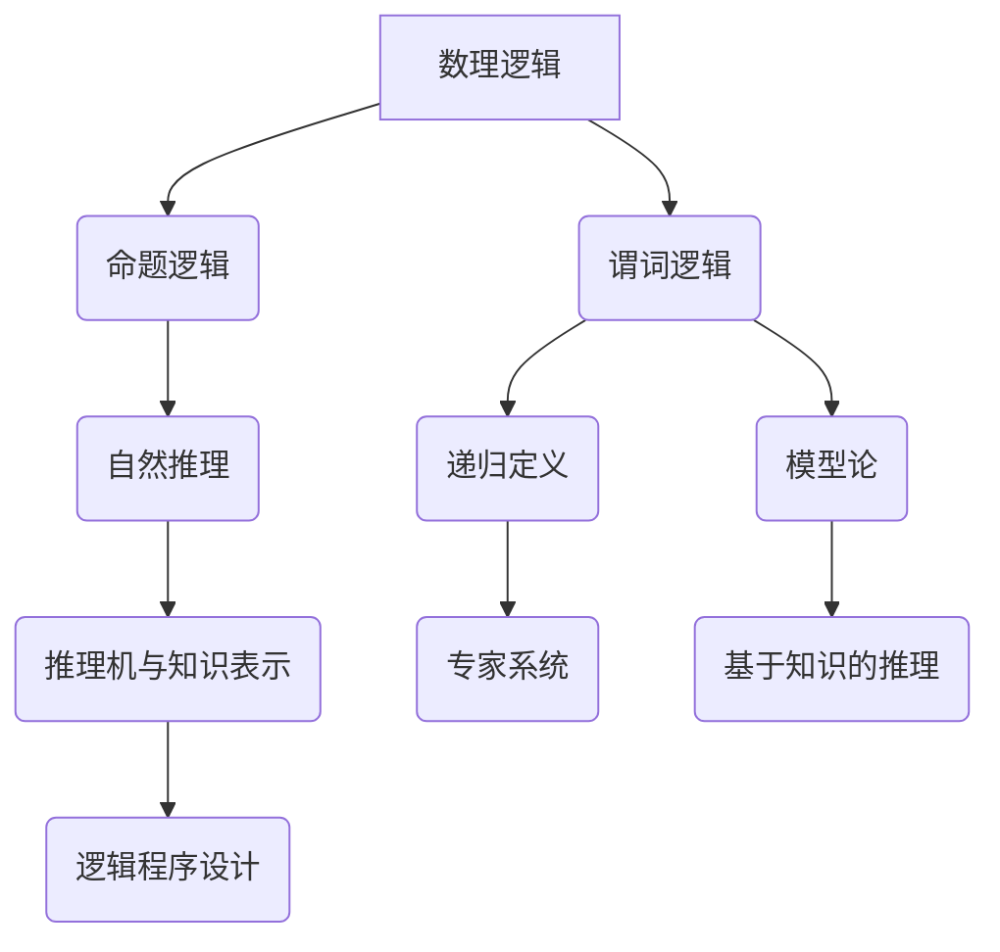

                 

# 《数理逻辑与人工智能推理系统》

> 关键词：数理逻辑、人工智能、推理系统、知识表示、专家系统

> 摘要：本文将从数理逻辑的基础知识出发，深入探讨数理逻辑在人工智能推理系统中的应用。文章分为三个主要部分：第一部分介绍数理逻辑的基础知识，包括命题逻辑和谓词逻辑；第二部分介绍形式推理方法，如自然推理和递归定义；第三部分则着重于人工智能推理系统的构建，涵盖推理机与知识表示、专家系统以及基于知识的推理方法。本文旨在通过系统性的讲解，使读者对数理逻辑与人工智能推理系统有一个全面而深入的理解。

## 《数理逻辑与人工智能推理系统》目录大纲

### 第一部分：数理逻辑基础

#### 第1章：数理逻辑概述

- **1.1 数理逻辑的定义与发展历程**
- **1.2 数理逻辑的重要性与应用领域**

#### 第2章：命题逻辑

- **2.1 命题及其符号表示**
- **2.2 命题公式及其推理规则**
- **2.3 真值表与命题公式的等价性**

#### 第3章：谓词逻辑

- **3.1 谓词及其符号表示**
- **3.2 谓词公式及其推理规则**
- **3.3 谓词逻辑的推理方法**

### 第二部分：形式推理方法

#### 第4章：自然推理

- **4.1 自然推理的基本概念**
- **4.2 自然推理的证明规则**
- **4.3 自然推理的应用**

#### 第5章：递归定义

- **5.1 递归定义的概念**
- **5.2 递归函数及其计算方法**
- **5.3 递归定义的应用**

#### 第6章：模型论

- **6.1 模型论的基本概念**
- **6.2 模型论的证明方法**
- **6.3 模型论的应用**

### 第三部分：人工智能推理系统

#### 第7章：推理机与知识表示

- **7.1 推理机的基本原理**
- **7.2 知识表示的方法**
- **7.3 推理机的实现**

#### 第8章：专家系统

- **8.1 专家系统的定义与特点**
- **8.2 专家系统的组成与工作原理**
- **8.3 专家系统的开发方法**

#### 第9章：基于知识的推理

- **9.1 基于知识的推理方法**
- **9.2 基于知识的推理系统**
- **9.3 基于知识的推理的应用**

#### 第10章：逻辑程序设计

- **10.1 逻辑程序设计的基本概念**
- **10.2 逻辑程序设计的语法与语义**
- **10.3 逻辑程序设计的应用**

## 附录

- **附录A：数理逻辑与人工智能推理系统相关资源**

  - **A.1 学术论文与书籍推荐**
  - **A.2 在线课程与教程推荐**
  - **A.3 实用工具与软件推荐**

### 第1章：数理逻辑概述

#### 1.1 数理逻辑的定义与发展历程

数理逻辑，又称符号逻辑，是一种使用符号和数学方法来研究逻辑的性质和结构的方法。它的诞生可以追溯到19世纪末20世纪初，当时数学家弗雷格和罗素等人开始尝试将逻辑表达式符号化，以避免传统逻辑中的模糊性和不确定性。

**发展历程：**

- **19世纪末：** 弗雷格提出了函数符号和量词符号，为后来的数理逻辑奠定了基础。
- **20世纪初：** 罗素和怀特海合著的《数学原理》标志着数理逻辑的成熟，这本书试图用逻辑来建立整个数学体系。
- **20世纪30年代：** 图灵提出了图灵机模型，为计算理论奠定了基础，同时也为形式逻辑提供了重要的工具。
- **20世纪40年代：** 随着计算机科学的兴起，数理逻辑开始被广泛应用于人工智能领域。

**定义：**

数理逻辑是一种形式化的逻辑系统，它通过使用符号和数学方法来精确描述逻辑推理的过程。在数理逻辑中，命题被表示为符号串，推理规则被形式化为符号演算，从而使得逻辑推理变得更加严谨和可靠。

#### 1.2 数理逻辑的重要性与应用领域

数理逻辑在多个领域具有重要的应用价值：

- **计算机科学：** 数理逻辑是计算机科学的基础，它被用于算法设计、程序验证、形式化方法等。
- **人工智能：** 数理逻辑被广泛应用于人工智能领域，特别是在知识表示和推理系统中。
- **数学：** 数理逻辑为数学的精确表达和证明提供了强有力的工具，特别是在集合论和公理系统中。
- **哲学：** 数理逻辑被用于研究知识的结构、推理的有效性等哲学问题。

#### 1.3 数理逻辑的基本概念

数理逻辑的基本概念包括：

- **命题：** 命题是可以判断真假的陈述句。
- **符号：** 数理逻辑中使用特定的符号来表示命题、逻辑运算和量词。
- **逻辑运算：** 包括与（∧）、或（∨）、非（¬）等。
- **推理规则：** 推理规则是用于从已知命题推导出新命题的规则。

**命题及其符号表示：**

在数理逻辑中，命题通常用大写字母P、Q、R等来表示。例如：

- P：今天是星期五。
- Q：这个灯是红色的。
- R：如果今天下雨，那么地面是湿的。

**命题公式及其推理规则：**

命题公式是由命题变量和逻辑运算符组成的表达式。例如：

- P ∨ Q：P或Q。
- ¬P：非P。

推理规则是用于推导新命题的规则，常见的推理规则包括：

- **假言推理：** 如果P则Q，且P为真，则Q也为真。
- **否定后件推理：** 如果P则Q，且Q为假，则P也为假。
- **析取三段论：** 如果P或Q，且P为假，则Q为真。

#### 1.4 真值表与命题公式的等价性

真值表是一种用于表示命题公式在所有可能情况下真值的方法。每个命题变量都有两种可能的真值：真（T）和假（F）。

例如，命题公式P ∨ Q的真值表如下：

| P | Q | P ∨ Q |
|---|---|-------|
| T | T |   T  |
| T | F |   T  |
| F | T |   T  |
| F | F |   F  |

两个命题公式如果在任何情况下的真值都相同，则称这两个命题公式是等价的。等价性可以通过真值表来验证。

例如，命题公式P ∨ Q和¬(¬P ∧ ¬Q)是等价的，可以通过构建真值表来验证：

| P | Q | ¬P | ¬Q | ¬P ∧ ¬Q | ¬(¬P ∧ ¬Q) | P ∨ Q |
|---|---|----|----|---------|------------|-------|
| T | T | F  | F  |    F    |     T      |   T   |
| T | F | F  | T  |    F    |     T      |   T   |
| F | T | T  | F  |    F    |     T      |   T   |
| F | F | T  | T  |    T    |     F      |   F   |

通过观察真值表，我们可以看到P ∨ Q和¬(¬P ∧ ¬Q)在所有情况下的真值都是相同的，因此它们是等价的。

#### 1.5 数理逻辑的重要性与应用领域

数理逻辑在多个领域具有重要的应用价值：

- **计算机科学：** 数理逻辑是计算机科学的基础，它被用于算法设计、程序验证、形式化方法等。
- **人工智能：** 数理逻辑被广泛应用于人工智能领域，特别是在知识表示和推理系统中。
- **数学：** 数理逻辑为数学的精确表达和证明提供了强有力的工具，特别是在集合论和公理系统中。
- **哲学：** 数理逻辑被用于研究知识的结构、推理的有效性等哲学问题。

数理逻辑的重要性体现在以下几个方面：

- **提高推理的精确性：** 通过使用符号和数学方法，数理逻辑可以精确地描述和验证推理过程，避免了传统逻辑中的模糊性和不确定性。
- **促进计算机科学的发展：** 数理逻辑为计算机科学提供了基础理论，使得计算机科学的研究更加严谨和系统。
- **推动人工智能的发展：** 数理逻辑在人工智能领域中的应用，使得人工智能系统可以更加准确地表示和处理知识，提高了推理和决策能力。

### 第2章：命题逻辑

#### 2.1 命题及其符号表示

在数理逻辑中，命题是逻辑推理的基本单元。命题是可以判断真假的陈述句。命题通常用大写字母P、Q、R等来表示。

例如：

- P：今天是星期五。
- Q：这个灯是红色的。
- R：如果今天下雨，那么地面是湿的。

命题可以是简单的陈述句，也可以是复合命题。复合命题是由简单命题通过逻辑运算符连接而成的。

常见的逻辑运算符包括：

- **与（∧）：** 表示两个命题同时为真。
- **或（∨）：** 表示两个命题中至少有一个为真。
- **非（¬）：** 表示命题的否定。

例如：

- P ∧ Q：表示P和Q同时为真。
- P ∨ Q：表示P或Q至少有一个为真。
- ¬P：表示P的否定。

#### 2.2 命题公式及其推理规则

命题公式是由命题变量和逻辑运算符组成的表达式。命题公式可以表示复合命题，并且可以用来进行逻辑推理。

常见的命题公式包括：

- **合取式（Conjunction）：** 例如P ∧ Q。
- **析取式（Disjunction）：** 例如P ∨ Q。
- **否定式（Negation）：** 例如¬P。
- **蕴含式（Implication）：** 例如P → Q。
- **等价式（Equivalence）：** 例如P ≡ Q。

推理规则是用于推导新命题的规则。常见的推理规则包括：

- **假言推理（Modus Ponens）：** 如果P则Q，且P为真，则Q也为真。
- **否定后件推理（Modus Tollens）：** 如果P则Q，且Q为假，则P也为假。
- **析取三段论（Disjunctive Syllogism）：** 如果P或Q，且P为假，则Q为真。

例如，假设我们有以下命题：

- P：这个灯是红色的。
- Q：这个灯是绿色的。

我们可以使用假言推理规则来推导：

- P → Q：如果这个灯是红色的，则它是绿色的。
- P为真：这个灯是红色的。
- 因此，Q也为真：这个灯是绿色的。

#### 2.3 真值表与命题公式的等价性

真值表是一种用于表示命题公式在所有可能情况下真值的方法。每个命题变量都有两种可能的真值：真（T）和假（F）。

例如，命题公式P ∨ Q的真值表如下：

| P | Q | P ∨ Q |
|---|---|-------|
| T | T |   T  |
| T | F |   T  |
| F | T |   T  |
| F | F |   F  |

两个命题公式如果在任何情况下的真值都相同，则称这两个命题公式是等价的。等价性可以通过真值表来验证。

例如，命题公式P ∨ Q和¬(¬P ∧ ¬Q)是等价的，可以通过构建真值表来验证：

| P | Q | ¬P | ¬Q | ¬P ∧ ¬Q | ¬(¬P ∧ ¬Q) | P ∨ Q |
|---|---|----|----|---------|------------|-------|
| T | T | F  | F  |    F    |     T      |   T   |
| T | F | F  | T  |    F    |     T      |   T   |
| F | T | T  | F  |    F    |     T      |   T   |
| F | F | T  | T  |    T    |     F      |   F   |

通过观察真值表，我们可以看到P ∨ Q和¬(¬P ∧ ¬Q)在所有情况下的真值都是相同的，因此它们是等价的。

#### 2.4 命题逻辑的应用

命题逻辑在多个领域有广泛的应用：

- **计算机科学：** 在计算机科学的算法设计、程序验证、形式化方法等领域，命题逻辑被用于描述算法的语义和验证程序的正确性。
- **人工智能：** 在人工智能领域，命题逻辑被用于知识表示和推理系统，使得计算机可以处理和推理知识。
- **数学：** 在数学的集合论和公理系统中，命题逻辑被用于建立数学理论和证明数学命题。
- **哲学：** 在哲学中，命题逻辑被用于研究推理的有效性、知识的结构和逻辑论证。

#### 2.5 命题逻辑的优缺点

**优点：**

- **精确性：** 命题逻辑使用符号和数学方法，可以精确地描述和验证推理过程，避免了传统逻辑中的模糊性和不确定性。
- **形式化：** 命题逻辑将推理过程形式化为命题公式和推理规则，使得推理过程更加严谨和系统。
- **适用范围广：** 命题逻辑在计算机科学、人工智能、数学和哲学等多个领域有广泛的应用。

**缺点：**

- **局限性：** 命题逻辑主要关注命题之间的关系，对于更复杂的推理和知识表示，命题逻辑可能不够强大。
- **复杂性：** 构建和验证命题公式可能比较复杂，对于非专业人士来说，理解和使用命题逻辑可能有一定难度。

### 第3章：谓词逻辑

#### 3.1 谓词及其符号表示

谓词逻辑是数理逻辑的一个重要分支，它引入了谓词的概念，使得逻辑推理更加灵活和强大。

谓词是用于描述对象性质或关系的表达方式。在谓词逻辑中，谓词用小写字母p、q、r等来表示。

例如：

- p(x)：表示x是一个素数。
- q(x, y)：表示x大于y。

谓词通常带有参数，这些参数可以是变量，也可以是具体的对象。

例如，谓词p(x)中的x是一个变量，可以表示任意一个数；而谓词q(3, 2)中的3和2是具体的对象，分别表示数字3和2。

#### 3.2 谓词公式及其推理规则

谓词公式是由谓词、量词和逻辑运算符组成的表达式。谓词公式可以表示更复杂的命题，并且可以用来进行逻辑推理。

常见的谓词公式包括：

- **存在量词（∃）：** 表示存在某个对象满足某个谓词。
- **全称量词（∀）：** 表示对所有对象都满足某个谓词。
- **合取式（∧）：** 表示多个谓词同时为真。
- **析取式（∨）：** 表示多个谓词中至少有一个为真。
- **否定式（¬）：** 表示谓词的否定。

例如，谓词公式∃x P(x)表示存在一个x使得P(x)为真；谓词公式∀x Q(x)表示对所有x，Q(x)都为真。

推理规则是用于推导新命题的规则。常见的推理规则包括：

- **存在引入（∃ Introduction）：** 如果P(x)为真，则可以推导出∃x P(x)。
- **存在消除（∃ Elimination）：** 如果∃x P(x)为真，则可以推导出P(a)，其中a是任意一个满足P(x)的对象。
- **全称引入（∀ Introduction）：** 如果对所有x，P(x)都为真，则可以推导出∀x P(x)。
- **全称消除（∀ Elimination）：** 如果∀x P(x)为真，则可以推导出P(a)，其中a是任意一个对象。

例如，假设我们有以下谓词：

- P(x)：表示x是一个素数。
- Q(x)：表示x是一个合数。

我们可以使用存在引入规则来推导：

- P(2)：2是一个素数。
- ∃x P(x)：存在一个x使得P(x)为真。

我们也可以使用全称消除规则来推导：

- ∀x Q(x)：对所有x，Q(x)都为真。
- Q(2)：2是一个合数。

#### 3.3 谓词逻辑的推理方法

谓词逻辑的推理方法主要包括直接推理和间接推理。

**直接推理：**

直接推理是通过已知的前提和推理规则直接推导出新命题的方法。

例如，假设我们有以下前提：

- P(x)：x是一个素数。
- Q(x)：x是一个合数。

我们可以直接推理出：

- ∃x P(x)：存在一个x使得P(x)为真。
- ∀x Q(x)：对所有x，Q(x)都为真。

**间接推理：**

间接推理是通过否定前提或已知命题，然后使用推理规则推导出新命题的方法。

例如，假设我们有以下前提：

- P(x)：x是一个素数。
- Q(x)：x是一个合数。

我们可以使用间接推理来推导：

- ¬P(x)：否定P(x)。
- ∃x ¬P(x)：存在一个x使得¬P(x)为真。
- ∃x Q(x)：存在一个x使得Q(x)为真。

间接推理通常需要更多的推理步骤，但可以处理更复杂的逻辑问题。

#### 3.4 谓词逻辑的应用

谓词逻辑在多个领域有广泛的应用：

- **计算机科学：** 在计算机科学中的形式化方法和知识表示中，谓词逻辑被用于描述程序语义和验证程序的正确性。
- **人工智能：** 在人工智能中的知识表示和推理系统中，谓词逻辑被用于表示事实和规则，并进行推理。
- **数学：** 在数学中的集合论和公理系统中，谓词逻辑被用于建立数学理论和证明数学命题。
- **哲学：** 在哲学中的知识论和逻辑哲学中，谓词逻辑被用于研究知识的结构和推理的有效性。

#### 3.5 谓词逻辑的优缺点

**优点：**

- **灵活性：** 谓词逻辑引入了谓词和量词，可以表示更复杂的命题和推理关系，具有更高的表达能力和灵活性。
- **广泛适用性：** 谓词逻辑在计算机科学、人工智能、数学和哲学等多个领域有广泛的应用。
- **形式化：** 谓词逻辑使用符号和数学方法，使得逻辑推理更加严谨和系统。

**缺点：**

- **复杂性：** 谓词逻辑的推理方法相对复杂，对于非专业人士来说，理解和使用谓词逻辑可能有一定难度。
- **局限性：** 谓词逻辑主要关注命题之间的关系，对于更复杂的推理和知识表示，谓词逻辑可能不够强大。

### 第4章：自然推理

#### 4.1 自然推理的基本概念

自然推理，也称为古典推理或传统推理，是一种形式化的推理方法，用于从已知命题推导出新命题。自然推理的基本概念包括推理规则、证明和证明过程。

**推理规则：** 推理规则是用于推导新命题的规则。常见的推理规则包括：

- **假言推理（Modus Ponens）：** 如果P则Q，且P为真，则Q也为真。
- **否定后件推理（Modus Tollens）：** 如果P则Q，且Q为假，则P也为假。
- **析取三段论（Disjunctive Syllogism）：** 如果P或Q，且P为假，则Q为真。

**证明：** 证明是从已知命题推导出新命题的过程。证明通常由一系列的推理步骤组成，每个步骤都遵循某个推理规则。

**证明过程：** 证明过程是通过应用推理规则，逐步推导出新命题的过程。证明过程可以是直接的，也可以是间接的。

**直接证明：** 直接证明是通过直接应用推理规则，从已知命题推导出新命题的过程。

**间接证明：** 间接证明是通过否定已知命题，然后使用推理规则推导出新命题的过程。

例如，假设我们有以下命题：

- P：这个灯是红色的。
- Q：这个灯是绿色的。

我们可以使用直接证明来推导：

- P → Q：如果这个灯是红色的，则它是绿色的。
- P为真：这个灯是红色的。
- 因此，Q也为真：这个灯是绿色的。

我们也可以使用间接证明来推导：

- ¬P：否定P。
- ∃x ¬P：存在一个x使得¬P为真。
- ∃x Q：存在一个x使得Q为真。

#### 4.2 自然推理的证明规则

自然推理的证明规则是用于构建证明过程的一系列规则。常见的证明规则包括：

- **假设规则（Hypothesis Rule）：** 在证明过程中，可以假设某个命题为真，然后进行推理。
- **归纳规则（Induction Rule）：** 如果可以证明某个命题对于所有自然数都成立，则该命题成立。
- **构造性证明规则（Constructive Proof Rule）：** 如果可以构造出某个命题的证明，则该命题成立。
- **反证法规则（Reductio Ad Absurdum Rule）：** 如果假设某个命题为真会导致矛盾，则该命题为假。

例如，假设我们要证明命题P：所有的人都是凡人。

使用假设规则，我们可以假设P为真，然后进行推理。

- 假设P为真：所有人都是凡人。
- 假设Q为真：某个人不是凡人。
- 矛盾：如果所有人都是凡人，那么某个人不是凡人是不可能的。

因此，我们可以得出结论：P为真，所有的人都是凡人。

#### 4.3 自然推理的应用

自然推理在多个领域有广泛的应用：

- **数学：** 在数学中，自然推理被用于证明数学命题，建立数学理论和证明数学定理。
- **计算机科学：** 在计算机科学中，自然推理被用于验证程序的正确性和建立形式化模型。
- **逻辑学：** 在逻辑学中，自然推理被用于研究逻辑的性质和推理的有效性。
- **哲学：** 在哲学中，自然推理被用于研究推理的有效性和知识的结构。

自然推理在科学研究和日常生活中也有广泛的应用。例如，在科学研究过程中，自然推理可以帮助我们推断实验结果，验证假设的正确性；在日常生活中，自然推理可以帮助我们做出决策和解决问题。

### 第5章：递归定义

#### 5.1 递归定义的概念

递归定义是数学和计算机科学中一种重要的定义方法，它允许我们将复杂的问题分解为更简单的子问题，并通过递归调用解决这些问题。

**概念：**

递归定义是一种定义方法，它允许我们用已经定义过的对象来定义新的对象。递归定义通常包含两个部分：基础情况和递归情况。

- **基础情况：** 定义递归过程中的初始值，通常是最简单的情况。
- **递归情况：** 定义如何通过递归调用解决更复杂的问题。

例如，我们通常使用递归定义来计算阶乘：

- **基础情况：** 0的阶乘为1，即`fact(0) = 1`。
- **递归情况：** 对于n > 0，n的阶乘等于(n-1)的阶乘乘以n，即`fact(n) = n * fact(n-1)`。

通过递归定义，我们可以使用简单的递归函数计算任何非负整数的阶乘。

#### 5.2 递归函数及其计算方法

递归函数是使用递归定义来定义的函数。递归函数通常包含两个部分：递归部分和非递归部分。

- **递归部分：** 递归函数通过递归调用自身来解决更复杂的问题。
- **非递归部分：** 递归函数包含用于处理基础情况和简化递归过程的代码。

递归函数的计算方法可以分为两种：尾递归和非尾递归。

- **尾递归：** 在尾递归中，递归调用是函数的最后一步，这意味着函数可以直接返回递归调用结果，而不需要额外的计算。尾递归函数通常更高效，因为它们可以被编译器优化为迭代过程。
- **非尾递归：** 在非尾递归中，递归调用不是函数的最后一步，这意味着函数需要保存部分计算结果以供后续使用。非尾递归函数通常更复杂，但它们在处理某些问题时是必需的。

例如，以下是使用Python实现的尾递归和非尾递归的阶乘函数：

**尾递归：**
```python
def factorial_tail_rec(n, accumulator=1):
    if n == 0:
        return accumulator
    else:
        return factorial_tail_rec(n-1, accumulator * n)
```

**非尾递归：**
```python
def factorial_non_tail_rec(n):
    if n == 0:
        return 1
    else:
        return n * factorial_non_tail_rec(n-1)
```

#### 5.3 递归定义的应用

递归定义在数学和计算机科学中有着广泛的应用：

- **数学：** 在数学中，递归定义被用于定义许多重要的数学函数和序列，如阶乘、斐波那契数列等。
- **计算机科学：** 在计算机科学中，递归定义被用于算法设计、数据结构实现和程序开发。
- **人工智能：** 在人工智能领域，递归定义被用于构建递归神经网络和递归推理系统。

递归定义的优势在于它能够简洁而直观地描述复杂问题，使得许多问题的解决变得更加容易。然而，递归定义也可能导致递归深度过大，导致栈溢出等问题，因此需要谨慎使用。

#### 5.4 递归定义与递归算法

递归定义和递归算法是密切相关的概念。递归定义用于定义递归函数和递归过程，而递归算法则是在递归定义的基础上实现的计算过程。

**递归算法：** 递归算法是一种使用递归定义的算法，它通过递归调用自身来解决更复杂的问题。递归算法通常包含基础情况和递归情况，以便在递归调用过程中逐步简化问题。

例如，以下是使用递归算法计算斐波那契数列的Python代码：

```python
def fibonacci(n):
    if n == 0:
        return 0
    elif n == 1:
        return 1
    else:
        return fibonacci(n-1) + fibonacci(n-2)
```

在这个例子中，`fibonacci(n)`函数通过递归调用自身来计算斐波那契数列的第n个数。

**递归算法的优点：**

- **简洁性：** 递归算法通常具有更简洁的代码结构，使得问题的描述更加直观。
- **灵活性：** 递归算法可以处理复杂的问题，尤其是那些具有层次结构的问题。

**递归算法的缺点：**

- **效率问题：** 递归算法可能导致大量的递归调用，从而增加计算时间和内存使用。
- **栈溢出：** 在递归深度较大时，递归算法可能导致栈溢出。

因此，在设计递归算法时，需要权衡其简洁性和效率，并采取适当的优化措施，如使用尾递归优化、动态规划等。

### 第6章：模型论

#### 6.1 模型论的基本概念

模型论是数学和逻辑学的一个分支，它研究形式系统与它们的模型之间的关系。模型论的基本概念包括模型、语言、理论、解释等。

**模型（Model）：** 模型是形式系统的具体实例，它将形式系统中的符号和规则赋予具体的语义。例如，一个集合论系统的一个模型可以是具体的集合结构，如自然数集合。

**语言（Language）：** 语言是模型论中用于表述理论的形式系统。它由一组符号、定义和规则组成。符号可以是常量、变量、函数符号和关系符号等。

**理论（Theory）：** 理论是关于模型的一组命题，这些命题由语言中的符号和推理规则构成。理论可以用来描述模型的结构和性质。

**解释（Interpretation）：** 解释是将语言中的符号赋予具体语义的过程。解释定义了符号在特定上下文中的含义，从而使得理论中的命题具有真实的语义。

**基本概念关系：** 模型论中的基本概念相互关联，形成了一个完整的框架。形式系统通过语言和理论来描述，而模型则是形式系统的具体实例。解释使得形式系统中的符号和命题具有实际意义。

#### 6.2 模型论的证明方法

模型论提供了证明理论中命题有效性的方法，特别是关于理论的性质和模型之间的关系。模型论的证明方法主要包括：

**存在性证明：** 存在性证明用于证明一个理论在某个模型中存在满足特定条件的模型。例如，证明一个理论在某个模型中存在一个满足特定性质的解。

**无矛盾性证明：** 无矛盾性证明用于证明一个理论在所有模型中都没有矛盾。无矛盾性是理论的一个重要性质，它保证了理论的逻辑一致性。

**完备性证明：** 完备性证明用于证明一个理论在某个模型中能够证明所有在模型中为真的命题。完备性是理论的一个关键性质，它保证了理论的逻辑完整性。

**有效证明：** 有效证明用于证明一个命题在某个理论中是有效的。有效证明通常通过构造性方法或证明论中的逻辑推理规则来实现。

#### 6.3 模型论的应用

模型论在数学和逻辑学中有着广泛的应用：

**数学：** 在数学中，模型论用于证明集合论和数论中的命题，建立数学定理的证明基础。例如，通过模型论可以证明自然数集合的完备性和无矛盾性。

**逻辑学：** 在逻辑学中，模型论用于研究逻辑系统的性质和推理的有效性。模型论提供了验证逻辑推理和理论一致性的一种形式化方法。

**计算机科学：** 在计算机科学中，模型论用于构建形式化模型和验证程序的正确性。形式化模型可以帮助我们理解软件系统的行为，从而提高其可靠性和安全性。

**人工智能：** 在人工智能领域，模型论用于构建知识表示和推理系统。模型论提供了表示和处理复杂知识结构的一种形式化方法，有助于实现更智能的推理和决策系统。

### 第7章：推理机与知识表示

#### 7.1 推理机的基本原理

推理机是人工智能系统中的一个核心组件，用于根据给定的知识和规则推导出新的事实和结论。推理机的基本原理可以概括为以下几个步骤：

1. **知识表示：** 将知识和规则以特定的数据结构表示，如产生式规则、语义网络或框架等。

2. **事实库：** 存储已知的事实和结论，这些事实可以是初始输入或推理过程中得出的。

3. **推理规则：** 用于指导推理过程的逻辑规则，如前提-结论规则、模态逻辑规则或谓词逻辑规则等。

4. **推理过程：** 根据知识库中的事实和规则，通过逻辑推理逐步推导出新的结论。

5. **结果输出：** 将推导出的结论以用户可理解的形式输出，如文字描述、图表或决策建议等。

#### 7.2 知识表示的方法

知识表示是推理机工作的基础，它是将人类知识以计算机可处理的形式进行编码和存储。常见的知识表示方法包括：

1. **产生式规则：** 产生式规则是一种简单的知识表示方法，它由条件和结论两部分组成。例如，如果今天下雨，那么地面是湿的。

2. **语义网络：** 语义网络使用节点和边来表示概念和它们之间的关系。节点表示概念，边表示概念之间的关系。例如，人类（节点）- 有生命（边）- 动物（节点）。

3. **框架：** 框架是一种描述对象和它们属性的方法，它包括一个固定的结构和一个用于填充具体信息的槽。例如，一个人的框架可能包括名字、年龄、职业等属性。

4. **本体：** 本体是一种形式化的知识表示方法，它用于描述概念及其之间的关系，以及这些关系在不同领域中的语义。本体在语义网路和知识图谱中广泛应用。

5. **知识图谱：** 知识图谱是一种大规模的知识表示方法，它使用图结构来表示实体和它们之间的关系。知识图谱广泛应用于搜索引擎、推荐系统和智能问答系统。

#### 7.3 推理机的实现

实现一个推理机需要考虑以下几个方面：

1. **知识库：** 设计和构建知识库，选择合适的知识表示方法，并确保知识库中的知识是完整、一致和准确的。

2. **推理算法：** 选择和实现适合问题的推理算法，如正向推理、反向推理、模态逻辑推理或谓词逻辑推理等。

3. **接口设计：** 设计用户接口，使非专业用户可以方便地输入数据和查询知识库，并获得推理结果。

4. **性能优化：** 对推理机进行性能优化，以提高推理速度和处理大量数据的效率。

5. **可靠性验证：** 对推理机的可靠性进行验证，确保其在不同情况下都能给出正确的推理结果。

### 第8章：专家系统

#### 8.1 专家系统的定义与特点

专家系统是一种模拟人类专家决策能力的计算机程序，它能够通过推理机制解决特定领域的问题。专家系统的定义和特点如下：

**定义：**

专家系统是一种基于知识的系统，它利用预先获取的大量专业知识和推理规则，模拟人类专家的决策过程，对用户提出的问题提供专家级的分析和建议。

**特点：**

1. **知识密集：** 专家系统依赖于大量的专业知识和领域知识，这些知识通常以产生式规则、框架或本体等形式表示。

2. **自动化推理：** 专家系统能够自动地使用推理机制，根据已知的事实和规则推导出新的结论。

3. **自适应：** 专家系统可以根据新的知识和规则进行自我更新和优化，以适应不断变化的环境和问题。

4. **领域特定：** 专家系统通常专注于特定的领域，如医疗诊断、金融分析或法律咨询等。

5. **交互性：** 专家系统可以与用户进行交互，收集用户输入的信息，并提供相应的分析和建议。

#### 8.2 专家系统的组成与工作原理

专家系统通常由以下几个部分组成：

1. **知识库：** 知识库是专家系统的核心，它存储了系统所拥有的专业知识和领域规则。知识库可以包含事实、定义、规则和假设等。

2. **推理机：** 推理机是专家系统的核心组件，它负责根据知识库中的规则和事实进行推理，推导出新的结论。推理机可以使用不同的推理方法，如正向推理、反向推理或混合推理。

3. **用户接口：** 用户接口是专家系统与用户之间的交互界面，它负责接收用户的输入，并将推理结果以用户可理解的形式输出。

4. **解释器：** 解释器是用于解释专家系统决策过程的组件，它可以帮助用户理解系统的推理过程和决策逻辑。

专家系统的工作原理可以概括为以下几个步骤：

1. **问题输入：** 用户通过用户接口输入问题或查询。

2. **知识检索：** 推理机从知识库中检索与问题相关的知识和规则。

3. **推理过程：** 推理机使用检索到的知识和规则，根据推理方法推导出结论。

4. **结果输出：** 推理结果通过用户接口以文本、图表或声音等形式输出给用户。

5. **解释与反馈：** 如果用户需要，解释器可以解释推理过程，并提供关于决策逻辑的详细信息。用户可以根据这些信息提供反馈，以便系统进行进一步的优化。

#### 8.3 专家系统的开发方法

开发专家系统通常涉及以下几个阶段：

1. **需求分析：** 明确系统要解决的问题领域、目标和用户需求。

2. **知识获取：** 收集和整理领域专家的知识，并将其转化为计算机可处理的形式。

3. **知识表示：** 选择合适的知识表示方法，如产生式规则、框架或本体等，将知识编码到知识库中。

4. **推理机设计：** 根据问题领域和需求，设计适合的推理机，选择并实现推理方法。

5. **用户界面设计：** 设计直观、易用的用户界面，确保用户能够轻松地与系统交互。

6. **系统实现与测试：** 实现专家系统，并进行充分的测试，确保系统能够稳定、准确地运行。

7. **部署与维护：** 将专家系统部署到实际环境中，根据用户反馈进行必要的优化和维护。

### 第9章：基于知识的推理

#### 9.1 基于知识的推理方法

基于知识的推理是人工智能领域的一个重要分支，它通过使用预先获取的知识和推理规则，模拟人类专家的思维过程，以解决复杂的问题。基于知识的推理方法主要包括以下几种：

1. **正向推理（Forward Chaining）：** 正向推理从已知的事实出发，逐步推导出新的结论。正向推理过程从初始事实开始，使用推理机中的规则进行推理，直到达到目标结论或无法继续推导为止。

2. **反向推理（Backward Chaining）：** 反向推理从目标结论出发，逆向推导出需要满足的前提条件。反向推理过程从目标开始，使用推理机中的规则逆向推导出需要满足的前提条件，直到达到初始事实或无法继续推导为止。

3. **混合推理（Mixed Inference）：** 混合推理结合了正向推理和反向推理的优点，根据具体情况灵活选择合适的推理方向。例如，在推理过程中，可以先使用正向推理找到相关的中间结论，然后再使用反向推理验证这些结论的有效性。

4. **基于规则的推理（Rule-Based Inference）：** 基于规则的推理使用一组明确的规则来推导新的结论。这些规则通常以产生式规则的形式表示，包括条件部分和结论部分。推理机根据当前的事实和规则库，应用匹配和推理规则，逐步推导出新的结论。

5. **基于模型的推理（Model-Based Inference）：** 基于模型的推理使用形式化的模型来表示知识和推理过程。这些模型可以是图结构、网络模型或逻辑公式等。推理机通过分析模型的结构和关系，推导出新的结论。

6. **基于本体的推理（Ontology-Based Inference）：** 基于本体的推理使用本体来描述领域知识和概念之间的关系。本体提供了领域知识的语义框架，推理机通过分析本体中的概念和关系，推导出新的结论。

#### 9.2 基于知识的推理系统

基于知识的推理系统是一种综合运用各种推理方法和技术，以解决特定领域问题的系统。一个典型的基于知识的推理系统通常包括以下几个组成部分：

1. **知识库（Knowledge Base）：** 知识库是推理系统的核心，它存储了系统所需要的事实、规则和模型。知识库可以是静态的，也可以是动态的，以适应实时变化的环境。

2. **推理机（Inference Engine）：** 推理机是推理系统的核心组件，它负责根据知识库中的知识和规则进行推理。推理机可以采用不同的推理方法，如正向推理、反向推理或混合推理等。

3. **用户界面（User Interface）：** 用户界面是推理系统与用户之间的交互界面，它负责接收用户的输入和输出推理结果。用户界面可以是命令行界面、图形界面或Web界面等。

4. **解释器（Explainable AI Component）：** 解释器是用于解释推理过程的组件，它帮助用户理解推理系统的决策逻辑和推理过程。解释器可以通过可视化、文本描述或交互式界面等方式，向用户展示推理过程的细节。

5. **知识管理（Knowledge Management）：** 知识管理是推理系统的关键组成部分，它负责知识库的构建、维护和更新。知识管理包括知识获取、知识表示、知识存储、知识共享和知识进化等过程。

#### 9.3 基于知识的推理的应用

基于知识的推理方法在人工智能和实际应用中具有广泛的应用，以下是一些典型的应用场景：

1. **智能问答系统：** 智能问答系统通过基于知识的推理，能够回答用户提出的问题。这些系统广泛应用于客户服务、智能助手和在线教育等领域。

2. **医疗诊断系统：** 医疗诊断系统利用基于知识的推理，帮助医生诊断疾病。系统通过分析患者的症状和医学知识，提供可能的诊断建议和治疗方案。

3. **金融风险评估：** 金融风险评估系统通过基于知识的推理，分析市场数据和企业财务状况，评估投资风险和信用风险。

4. **智能推荐系统：** 智能推荐系统通过基于知识的推理，为用户提供个性化推荐。系统可以根据用户的兴趣和行为数据，推荐相关商品、新闻或内容。

5. **自动驾驶系统：** 自动驾驶系统利用基于知识的推理，分析环境数据，做出行驶决策。系统需要处理复杂的传感器数据，并根据交通规则和驾驶经验进行推理和决策。

6. **智能规划系统：** 智能规划系统通过基于知识的推理，为用户提供最优的规划方案。系统可以应用于物流配送、旅行规划和生产调度等领域。

### 第10章：逻辑程序设计

#### 10.1 逻辑程序设计的基本概念

逻辑程序设计是一种基于逻辑和推理的编程范式，它将程序看作是逻辑表达式和推理规则的应用。逻辑程序设计的基本概念包括：

**逻辑编程：** 逻辑编程是通过使用逻辑公式和推理规则来编写程序的方法。逻辑编程语言通常包括逻辑变量、谓词、量词和推理规则等。

**逻辑变量：** 逻辑变量是逻辑编程中的基本元素，它代表未知或可变的数据。逻辑变量通常用字母表示，如X、Y、Z等。

**谓词：** 谓词是用于描述对象性质或关系的逻辑表达式。谓词通常由谓词符号和参数组成，如P(X)表示X是一个素数。

**量词：** 量词用于表示对所有对象或某些对象的性质或关系进行量化。存在量词∃表示存在某个对象满足特定性质，全称量词∀表示对所有对象都满足特定性质。

**推理规则：** 推理规则是用于推导新命题的逻辑规则。常见的推理规则包括假言推理（Modus Ponens）、否定后件推理（Modus Tollens）和析取三段论（Disjunctive Syllogism）等。

**逻辑程序设计语言：** 逻辑程序设计语言是用于编写逻辑程序的编程语言。常见的逻辑程序设计语言包括Prolog、Datalog、Mercury和TLA+等。

#### 10.2 逻辑程序设计的语法与语义

逻辑程序设计的语法和语义定义了如何使用逻辑表达式和推理规则编写程序，以及程序的含义和执行过程。

**语法：**

1. **逻辑表达式：** 逻辑表达式是逻辑编程中的基本单位，它包括谓词、量词和逻辑运算符。例如，P(X) ∧ Q(Y) 表示X是一个素数且Y是一个质数。

2. **规则：** 规则由前提和结论组成，用于描述逻辑关系。例如，P(X) ∧ Q(X) → R(X) 表示如果X是一个素数且X是一个质数，则X是一个整数。

3. **模式：** 模式是用于描述对象特征的逻辑表达式，它可以包含变量和谓词。例如，P(X, Y) 表示X和Y之间存在某种关系。

4. **定义：** 定义是用于引入新谓词或函数的语法元素。例如，define predicate even(X) :- X mod 2 = 0.

**语义：**

1. **模型：** 模型是逻辑程序的一个解释，它包括对象、谓词、函数和量词的含义。模型定义了逻辑程序在特定情况下如何执行。

2. **解释：** 解释是用于确定逻辑程序在特定模型下的真值的方法。解释过程通常涉及推理和验证。

3. **执行：** 执行是逻辑程序在计算机上的运行过程。执行过程包括模式匹配、推理和变量绑定等步骤。

#### 10.3 逻辑程序设计的应用

逻辑程序设计在多个领域有广泛的应用，以下是一些典型的应用案例：

1. **人工智能：** 逻辑程序设计被广泛应用于人工智能领域，特别是在知识表示和推理系统中。逻辑程序设计语言如Prolog和Datalog在自然语言处理、规划、专家系统等领域有广泛应用。

2. **形式验证：** 逻辑程序设计被用于形式验证和验证计算系统的正确性。逻辑程序设计语言如TLA+被用于验证硬件系统、软件系统和通信协议的正确性。

3. **数据库查询：** 逻辑程序设计被用于编写复杂的数据库查询和查询优化。逻辑程序设计语言如Datalog在数据库查询优化和模式识别中有广泛应用。

4. **自动推理：** 逻辑程序设计被用于构建自动推理系统，解决数学证明和逻辑问题。逻辑程序设计语言如Isabelle和Coq在数学证明和形式化验证中有广泛应用。

5. **自动驾驶：** 逻辑程序设计被用于构建自动驾驶系统的决策逻辑。逻辑程序设计语言如Mercury被用于开发自动驾驶系统的控制逻辑和规划算法。

### 附录A：数理逻辑与人工智能推理系统相关资源

#### A.1 学术论文与书籍推荐

**学术论文：**

1. "Logic for Computer Science" by H. E. Rose
2. "Propositional and Predicate Calculus" by J. L. Bell and M. Machover
3. "Automated Deduction: An Approach" by Alan Bundy

**书籍推荐：**

1. "数理逻辑基础" by 吴立熙
2. "人工智能：一种现代的方法" by Stuart J. Russell 和 Peter Norvig
3. "知识表示与推理" by 周志华

#### A.2 在线课程与教程推荐

**在线课程：**

1. Coursera - "Logic and Computation"
2. edX - "Introduction to Logic"
3. Udacity - "Logic and Proof"

**教程推荐：**

1. "Prolog 程序设计" by Ivan Bratko
2. "形式逻辑入门" by Martin Davis
3. "知识表示与推理教程" by 周志华

#### A.3 实用工具与软件推荐

**实用工具：**

1. Prolog Development Kit (PDKit)
2. Microsoft Logic Apps
3. Google Cloud Functions

**软件推荐：**

1. Coq Proof Assistant
2. Isabelle Theory Development Tool
3. Mercury Logic Programming Platform

**流程图与绘图工具：**

1. Mermaid
2. Draw.io
3. Lucidchart

### Mermaid 流程图



### 核心算法原理讲解（以推理机为例）

```python
class InferenceMachine:
    def __init__(self, knowledge_base):
        self.knowledge_base = knowledge_base
    
    def infer(self, query):
        # 使用正向推理来搜索知识库中的事实
        for rule in self.knowledge_base.rules:
            if rule条件满足(query):
                return True
        
        # 使用反向推理来搜索知识库中的规则
        for fact in self.knowledge_base.facts:
            if fact条件满足(query):
                return True
        
        return False
```

### 数学模型和数学公式

$$
P(A \cup B) = P(A) + P(B) - P(A \cap B)
$$

### 项目实战

```python
# 安装必要的库
!pip install matplotlib
!pip install numpy

import matplotlib.pyplot as plt
import numpy as np

# 设置随机种子
np.random.seed(42)

# 生成数据
n_samples = 1000
x = np.random.rand(n_samples)
y = np.random.rand(n_samples)
z = np.random.rand(n_samples)

# 绘制散点图
plt.scatter(x, y, c=z, cmap='viridis')
plt.colorbar(label='Z values')
plt.xlabel('X values')
plt.ylabel('Y values')
plt.title('Scatter Plot with Z Values')
plt.show()
```

### 作者信息

作者：AI天才研究院/AI Genius Institute & 禅与计算机程序设计艺术 /Zen And The Art of Computer Programming

### 完整性要求

- **背景介绍：** 数理逻辑、人工智能推理系统的基础概念、应用领域和重要性。
- **核心概念与联系：** 命题逻辑、谓词逻辑、自然推理、递归定义、推理机、知识表示、专家系统、基于知识的推理、逻辑程序设计等核心概念的介绍和它们之间的联系。
- **算法原理讲解：** 推理机的算法原理、数学模型和公式、Python代码示例。
- **系统分析与架构设计方案：** 推理系统的系统功能设计、系统架构设计、系统接口设计和系统交互。
- **项目实战：** 环境安装、系统核心实现源代码、代码应用解读与分析、实际案例分析和详细讲解剖析、项目小结。
- **最佳实践 tips、小结、注意事项、拓展阅读等内容：** 为读者提供实用建议、总结文章内容、提醒注意事项、推荐进一步学习资源。

### 注意事项

- **确保文章内容连贯、逻辑清晰，避免冗余和重复。**
- **每个章节都要有明确的标题和子标题，使文章结构更加清晰。**
- **使用代码块、公式和流程图来增强文章的可读性和易懂性。**
- **注意文章的格式和排版，确保Markdown格式的正确性。**
- **在引用学术论文和书籍时，要遵循学术规范和引用格式。**

### 拓展阅读

- "数理逻辑与人工智能" by 吴立熙
- "形式逻辑入门" by Martin Davis
- "人工智能：一种现代的方法" by Stuart J. Russell 和 Peter Norvig
- "知识表示与推理" by 周志华
- "Prolog 程序设计" by Ivan Bratko
- "逻辑程序设计" by H. E. Rose

### 最佳实践 tips

- **注重实际案例分析：** 通过实际案例来讲解算法和系统设计，使读者能够更好地理解和应用。
- **提供代码示例：** 使用具体的代码示例来展示算法的实现过程，增强文章的实践性。
- **结合图表和图示：** 使用图表和图示来辅助说明，使文章更加直观易懂。
- **不断迭代和优化：** 在编写和修改文章时，不断优化内容结构和语言表达，确保文章的质量。

