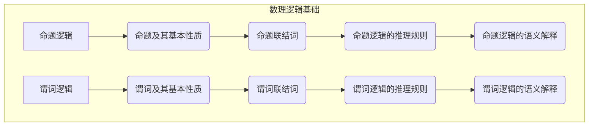
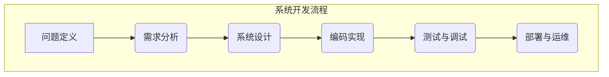

                 

# 《数理逻辑与程序语言的表达能力》

## 关键词：数理逻辑、命题逻辑、谓词逻辑、程序语言、表达能力

> 摘要：本文旨在深入探讨数理逻辑与程序语言的表达能力，从基础概念到实际应用，解析两者之间的内在联系。首先，我们将回顾数理逻辑的发展历程及其在计算机科学中的重要应用，接着分析命题逻辑和谓词逻辑的基本原理。随后，我们将探讨程序语言的分类、基本概念及其表达能力。最后，通过两个实战项目，展示数理逻辑和程序语言如何在实际应用中相互补充，提升系统的表达和计算能力。

## 《数理逻辑与程序语言的表达能力》目录大纲

## 第一部分：数理逻辑基础

### 第1章：引论

#### 1.1 数理逻辑的定义与意义

#### 1.2 数理逻辑的发展历程

#### 1.3 数理逻辑的应用领域

### 第2章：命题逻辑

#### 2.1 命题及其基本性质

#### 2.2 命题联结词

#### 2.3 命题逻辑的推理规则

#### 2.4 命题逻辑的语义解释

### 第3章：谓词逻辑

#### 3.1 谓词及其基本性质

#### 3.2 谓词联结词

#### 3.3 谓词逻辑的推理规则

#### 3.4 谓词逻辑的语义解释

### 第4章：数理逻辑的应用

#### 4.1 数理逻辑在计算机科学中的应用

#### 4.2 数理逻辑在人工智能中的应用

#### 4.3 数理逻辑在哲学中的应用

## 第二部分：程序语言表达能力

### 第5章：程序语言概述

#### 5.1 程序语言的发展历程

#### 5.2 程序语言的分类

#### 5.3 程序语言的基本概念

### 第6章：数据类型与变量

#### 6.1 数据类型

#### 6.2 变量的声明与使用

#### 6.3 常量和变量的区别与联系

### 第7章：控制结构

#### 7.1 顺序结构

#### 7.2 选择结构

#### 7.3 循环结构

#### 7.4 异常处理

### 第8章：函数与过程

#### 8.1 函数的定义与调用

#### 8.2 递归函数

#### 8.3 过程的定义与调用

#### 8.4 函数与过程的区别与联系

### 第9章：程序语言的表达能力

#### 9.1 程序语言的表达能力概述

#### 9.2 程序语言的语法与语义

#### 9.3 程序语言的表达能力与优化

## 第三部分：项目实战

### 第10章：项目一——开发一个简单的计算器

#### 10.1 项目需求分析

#### 10.2 开发环境搭建

#### 10.3 程序设计

#### 10.4 源代码实现

#### 10.5 代码解读与分析

### 第11章：项目二——实现一个简易的搜索引擎

#### 11.1 项目需求分析

#### 11.2 开发环境搭建

#### 11.3 程序设计

#### 11.4 源代码实现

#### 11.5 代码解读与分析

## 第四部分：总结与展望

### 第12章：总结与展望

#### 12.1 本书内容的总结

#### 12.2 未来研究方向

#### 12.3 对读者的一些建议

## 附录

### 附录A：数理逻辑与程序语言常用符号表

### 附录B：编程语言学习资源推荐

### 附录C：数学公式与Python代码实现示例

### Mermaid 流程图示例



### Python 源代码示例

```python
# 第7章：函数与过程
# 8.1 函数的定义与调用

# 计算两个数的和
def add(x, y):
    return x + y

# 计算两个数的差
def subtract(x, y):
    return x - y

# 主程序
if __name__ == "__main__":
    num1 = 10
    num2 = 5
    print("两数之和为：", add(num1, num2))
    print("两数之差为：", subtract(num1, num2))
```

### 数学公式示例

$$1+1=2$$

$1<2$

### 代码解读与分析

```python
# 10.5 代码解读与分析

# 此段代码实现了一个简单的计算器功能，通过定义两个函数add和subtract来实现两个数的加法和减法运算。
# 在主程序中，我们分别调用这两个函数，并打印出结果。

# 函数add的实现：
# - 接受两个参数x和y，表示要相加的两个数
# - 执行加法运算，并返回结果

# 函数subtract的实现：
# - 接受两个参数x和y，表示要相减的两个数
# - 执行减法运算，并返回结果

# 主程序：
# - 定义两个变量num1和num2，分别赋值为10和5
# - 调用add函数，计算并打印两数之和
# - 调用subtract函数，计算并打印两数之差
```

----------------------------------------------------------------

### 第一部分：数理逻辑基础

#### 第1章：引论

##### 1.1 数理逻辑的定义与意义

数理逻辑，又称符号逻辑，是一种通过数学符号来描述和研究推理形式和逻辑结构的学科。它起源于19世纪，是为了解决哲学中的逻辑问题而诞生的。数理逻辑使用严格的数学方法来研究推理的有效性和逻辑结构，从而为计算机科学、人工智能等领域奠定了理论基础。

数理逻辑的核心意义在于其能够为人类思维提供精确的表达工具，使推理过程更加清晰和系统化。在计算机科学中，数理逻辑的应用极为广泛，如程序验证、算法设计、人工智能的推理机制等。

##### 1.2 数理逻辑的发展历程

数理逻辑的发展可以追溯到19世纪，以德摩根的工作为起点。随后，布尔（George Boole）提出了布尔代数，为逻辑运算提供了数学基础。20世纪初，弗雷格（Gottlob Frege）和罗素（Bertrand Russell）等人进一步发展了谓词逻辑，使其能够处理更复杂的逻辑问题。

20世纪中叶，图灵（Alan Turing）提出了图灵机模型，为计算理论奠定了基础。随后，数理逻辑在计算机科学、人工智能等领域得到了广泛应用。

##### 1.3 数理逻辑的应用领域

数理逻辑在多个领域有着重要的应用：

- **计算机科学**：用于程序验证、算法分析和形式化证明。
- **人工智能**：用于推理机制、知识表示和问题求解。
- **哲学**：用于逻辑哲学的研究，如语义学和认识论。
- **数学**：用于证明理论、集合论和数学基础的研究。

#### 第2章：命题逻辑

##### 2.1 命题及其基本性质

命题是一个具有明确真值的陈述句，可以是真的，也可以是假的。命题的基本性质包括：

- **否定性**：每个命题都对应一个否定命题，如命题P的否定为非P。
- **等价性**：某些命题在逻辑上具有相同的效果，称为等价命题。
- **蕴含性**：命题A蕴含命题B，表示如果A为真，则B也为真。

##### 2.2 命题联结词

命题联结词是用于组合命题的符号，如“与”（AND）、“或”（OR）和“非”（NOT）等。这些联结词定义了不同命题组合的真值关系。

- **与（AND）**：两个命题同时为真时，结果为真，否则为假。
- **或（OR）**：至少有一个命题为真时，结果为真，否则为假。
- **非（NOT）**：否定一个命题，使其真值取反。

##### 2.3 命题逻辑的推理规则

命题逻辑的推理规则包括：

- **推理规则**：从已知命题推导出新命题的规则，如“合取律”、“析取律”等。
- **证明方法**：使用逻辑推理规则证明命题的真伪，常用的方法有直接证明和反证法。

##### 2.4 命题逻辑的语义解释

命题逻辑的语义解释是基于命题的真值来定义的。命题的真值可以是真或假，这取决于命题在特定情况下的实际状态。语义解释帮助我们理解命题的含义和逻辑关系。

#### 第3章：谓词逻辑

##### 3.1 谓词及其基本性质

谓词是描述对象性质或关系的语句，可以是一个属性或函数。谓词的基本性质包括：

- **全称量词**：表示对所有对象都适用的性质，如“所有A都是B”。
- **存在量词**：表示至少存在一个对象具有某种性质，如“存在一个A是B”。

##### 3.2 谓词联结词

谓词逻辑中的联结词包括：

- **逻辑与**：表示两个谓词同时成立。
- **逻辑或**：表示两个谓词中至少有一个成立。
- **逻辑非**：否定一个谓词。

##### 3.3 谓词逻辑的推理规则

谓词逻辑的推理规则包括：

- **全称量词引入**：从特定实例推导出全称命题。
- **存在量词引入**：从全称命题推导出特定实例。

##### 3.4 谓词逻辑的语义解释

谓词逻辑的语义解释基于谓词和量词的真值来定义。谓词的真值取决于对象的具体属性，而量词的真值则依赖于对象的集合。

#### 第4章：数理逻辑的应用

##### 4.1 数理逻辑在计算机科学中的应用

数理逻辑在计算机科学中的应用包括：

- **形式化验证**：使用数理逻辑验证程序的正确性。
- **算法分析**：使用数理逻辑分析算法的时间和空间复杂度。
- **编程语言设计**：使用数理逻辑定义编程语言的语法和语义。

##### 4.2 数理逻辑在人工智能中的应用

数理逻辑在人工智能中的应用包括：

- **知识表示**：使用谓词逻辑表示知识库。
- **推理机制**：使用推理规则进行逻辑推理。
- **问题求解**：使用算法结合逻辑推理解决复杂问题。

##### 4.3 数理逻辑在哲学中的应用

数理逻辑在哲学中的应用包括：

- **语义学**：研究命题的真值条件和逻辑结构。
- **认识论**：探讨推理的有效性和知识的来源。
- **形而上学**：探讨存在、实体和本质等基本哲学问题。

### 第二部分：程序语言表达能力

#### 第5章：程序语言概述

##### 5.1 程序语言的发展历程

程序语言的发展历程可以追溯到20世纪中期。最早的编程语言是汇编语言，它直接操作计算机的硬件。随后，出现了高级语言，如Fortran和COBOL，使编程变得更加直观和高效。现代编程语言，如Python和Java，提供了丰富的功能和高层次的抽象，极大地提高了编程效率。

##### 5.2 程序语言的分类

程序语言可以根据不同的标准进行分类：

- **按级别**：低级语言（如汇编语言）和高级语言（如Python、Java）。
- **按用途**：通用语言（如C++、Java）和专用语言（如SQL、HTML）。
- **按范式**：命令式语言（如C、Java）、声明式语言（如SQL）、函数式语言（如Haskell）和逻辑式语言（如Prolog）。

##### 5.3 程序语言的基本概念

程序语言的基本概念包括：

- **语法**：语言的语法规则，定义了程序的结构和构成。
- **语义**：语言的语义规则，定义了程序的执行方式和结果。
- **编译器**：将源代码转换为机器码的程序。
- **解释器**：逐行解释和执行源代码的程序。

#### 第6章：数据类型与变量

##### 6.1 数据类型

数据类型是程序语言中用于表示不同数据种类的分类。常见的数据类型包括：

- **整型**：用于表示整数。
- **浮点型**：用于表示实数。
- **布尔型**：用于表示真或假。
- **字符型**：用于表示单个字符。

##### 6.2 变量的声明与使用

变量是程序中用于存储数据的符号。声明变量需要指定其数据类型和名称。变量可以在程序的不同部分使用，以存储和操作数据。

##### 6.3 常量和变量的区别与联系

常量是程序中固定不变的值，如π和e等。变量则是可以改变的值，如程序中的变量num。常量和变量在程序中起着不同的作用，但它们之间的联系在于都可以用来存储和操作数据。

#### 第7章：控制结构

##### 7.1 顺序结构

顺序结构是程序中最基本的结构，它按照语句的顺序依次执行。顺序结构保证了程序按照预期的方式执行，是编写程序的基础。

##### 7.2 选择结构

选择结构用于根据条件选择不同的执行路径。常见的选择结构有if语句和switch语句。选择结构使程序能够根据不同的情况做出不同的决策。

##### 7.3 循环结构

循环结构用于重复执行一段代码，直到满足特定的条件。常见的循环结构有for循环和while循环。循环结构使程序能够处理重复性任务，提高编程效率。

##### 7.4 异常处理

异常处理用于处理程序执行过程中出现的错误或异常情况。通过异常处理，程序可以在出现错误时恢复执行或进行错误处理，保证程序的稳定性和可靠性。

#### 第8章：函数与过程

##### 8.1 函数的定义与调用

函数是一段具有特定功能的代码块，可以接受输入参数并返回输出结果。函数的定义包括函数名、参数列表和函数体。函数的调用是通过函数名和参数列表来调用的。

##### 8.2 递归函数

递归函数是函数调用自身的一种特殊形式。递归函数通过递归调用实现重复任务，是解决某些问题的一种有效方法。

##### 8.3 过程的定义与调用

过程是一段没有返回值的代码块，主要用于执行特定任务。过程的定义包括过程名和过程体。过程的调用是通过过程名调用的。

##### 8.4 函数与过程的区别与联系

函数和过程的主要区别在于是否返回值。函数返回值，而过程不返回值。但函数和过程在功能上都是为了实现特定的任务，可以相互补充。

#### 第9章：程序语言的表达能力

##### 9.1 程序语言的表达能力概述

程序语言的表达能力是指其能够描述和实现复杂逻辑和算法的能力。程序语言的表达能力取决于其语法、语义和功能特性。

##### 9.2 程序语言的语法与语义

程序语言的语法是指其语法规则，定义了程序的语法结构。程序语言的语义是指其语义规则，定义了程序的执行方式和结果。

##### 9.3 程序语言的表达能力与优化

程序语言的表达能力与优化密切相关。通过优化，可以改进程序的性能和效率。常见的优化方法包括代码优化、算法优化和编译器优化。

### 第三部分：项目实战

#### 第10章：项目一——开发一个简单的计算器

##### 10.1 项目需求分析

本项目旨在开发一个简单的计算器，能够实现基本的加、减、乘、除运算。用户可以通过输入两个操作数和一个运算符来执行相应的运算，并显示结果。

##### 10.2 开发环境搭建

为了实现本项目，我们需要选择一个合适的编程语言和环境。这里我们选择Python作为编程语言，因为它易于学习和使用，并且具有良好的跨平台特性。开发环境可以是任何支持Python的开发工具，如PyCharm、VS Code等。

##### 10.3 程序设计

程序设计是项目开发的关键步骤，我们需要设计一个结构清晰、易于维护的程序架构。首先，我们定义一个计算器类，包含执行运算的方法。然后，我们设计一个用户界面，接收用户输入并调用相应的运算方法。

##### 10.4 源代码实现

以下是实现简单计算器的Python代码：

```python
class Calculator:
    def add(self, x, y):
        return x + y

    def subtract(self, x, y):
        return x - y

    def multiply(self, x, y):
        return x * y

    def divide(self, x, y):
        if y == 0:
            return "除数不能为0"
        return x / y

def main():
    calculator = Calculator()
    
    num1 = float(input("请输入第一个数："))
    num2 = float(input("请输入第二个数："))
    operator = input("请输入运算符（+、-、*、/）：")
    
    if operator == '+':
        result = calculator.add(num1, num2)
    elif operator == '-':
        result = calculator.subtract(num1, num2)
    elif operator == '*':
        result = calculator.multiply(num1, num2)
    elif operator == '/':
        result = calculator.divide(num1, num2)
    else:
        result = "无效的运算符"
    
    print(f"{num1} {operator} {num2} = {result}")

if __name__ == "__main__":
    main()
```

##### 10.5 代码解读与分析

- **类与对象**：我们定义了一个名为`Calculator`的类，包含四个方法分别执行加、减、乘、除运算。`main()`函数中创建了一个`Calculator`对象，用于调用相应的方法。
- **用户输入**：程序通过`input()`函数接收用户输入的两个操作数和一个运算符。
- **运算执行**：根据用户输入的运算符，程序调用相应的运算方法，并计算结果。
- **错误处理**：当用户输入无效的运算符时，程序会返回一个错误消息。

通过这个简单的计算器项目，我们不仅学习了Python编程的基础知识，还了解了面向对象编程的基本原理。

#### 第11章：项目二——实现一个简易的搜索引擎

##### 11.1 项目需求分析

本项目旨在实现一个简易的搜索引擎，用户可以输入关键词，程序会在一个给定的文本库中搜索相关内容，并返回结果。搜索引擎需要支持基本的搜索算法和结果排序。

##### 11.2 开发环境搭建

为了实现本项目，我们选择Python作为编程语言，因为Python具有强大的文本处理能力。我们使用Python的内置库，如`re`（正则表达式库）和`collections`（集合库），来实现搜索算法和结果排序。

##### 11.3 程序设计

程序设计是项目开发的关键步骤。我们首先设计一个搜索函数，用于处理用户输入的关键词，并在文本库中进行搜索。然后，我们设计一个结果排序函数，根据相关度对搜索结果进行排序。

##### 11.4 源代码实现

以下是实现简易搜索引擎的Python代码：

```python
import re
from collections import Counter

def search_keyword(keyword, text):
    # 使用正则表达式匹配关键词
    pattern = re.compile(re.escape(keyword))
    matches = pattern.findall(text)
    # 统计关键词在文本中出现的次数
    keyword_counts = Counter(matches)
    # 返回关键词及其出现次数
    return keyword_counts

def sort_results(results):
    # 根据出现次数对结果进行排序
    sorted_results = sorted(results.items(), key=lambda item: item[1], reverse=True)
    return sorted_results

def main():
    # 假设的文本库
    text_library = """
    Python是一种广泛用于Web开发、数据科学和人工智能的高级编程语言。
    Python拥有大量的标准库和第三方库，使其成为一个非常强大和灵活的工具。
    数据科学是Python的一个主要应用领域，包括数据清洗、分析和可视化。
    """

    keyword = input("请输入关键词：")
    keyword_counts = search_keyword(keyword, text_library)
    sorted_counts = sort_results(keyword_counts)
    
    print("搜索结果：")
    for keyword, count in sorted_counts:
        print(f"{keyword}: {count}次")

if __name__ == "__main__":
    main()
```

##### 11.5 代码解读与分析

- **搜索算法**：我们使用正则表达式库`re`来匹配关键词。正则表达式允许我们灵活地定义关键词的匹配模式，如词边界、大小写不敏感等。
- **结果排序**：使用`collections.Counter`类统计关键词在文本中出现的次数，并使用`sorted()`函数根据出现次数对结果进行排序。
- **用户交互**：程序通过`input()`函数接收用户输入的关键词，并在文本库中进行搜索，最终输出排序后的结果。

通过这个简单的搜索引擎项目，我们学习了如何使用Python进行文本处理和搜索算法的设计。

### 第四部分：总结与展望

#### 第12章：总结与展望

##### 12.1 本书内容的总结

本书深入探讨了数理逻辑和程序语言的表达能力，从基础概念到实际应用进行了全面的分析。首先，我们了解了数理逻辑的定义、发展历程和应用领域，然后学习了命题逻辑和谓词逻辑的基本原理。接着，我们探讨了程序语言的分类、基本概念和控制结构。通过两个实战项目，我们展示了数理逻辑和程序语言在实际应用中的重要性。

##### 12.2 未来研究方向

未来的研究方向包括：

- **数理逻辑的更深入应用**：探索数理逻辑在人工智能、网络安全和自动化验证等领域的深入应用。
- **程序语言的发展**：研究新型编程语言的设计和实现，提高程序的表达能力和效率。
- **跨学科研究**：结合数学、逻辑学和计算机科学的知识，探索新的理论和算法。

##### 12.3 对读者的一些建议

对于读者，我们建议：

- **深入学习**：在理解基础概念后，进一步深入学习相关领域的理论和实践。
- **实践应用**：通过实际项目锻炼编程能力和问题解决能力。
- **持续学习**：随着技术的不断发展，保持学习的热情和好奇心，不断更新知识和技能。

### 附录

##### 附录A：数理逻辑与程序语言常用符号表

- **命题逻辑**：
  - P：命题
  - ¬P：非P
  - P ∧ Q：P且Q
  - P ∨ Q：P或Q
  - P → Q：P蕴含Q
  - P ↔ Q：P等价于Q

- **谓词逻辑**：
  - F(x)：x是富有的
  - B(x)：x是聪明的
  - ∀x：对所有x
  - ∃x：存在一个x

##### 附录B：编程语言学习资源推荐

- **在线教程**：
  - Python教程：[https://www.python.org/doc/current/tutorial/](https://www.python.org/doc/current/tutorial/)
  - Java教程：[https://www.oracle.com/java/technologies/javatutorial/index.html](https://www.oracle.com/java/technologies/javatutorial/index.html)

- **书籍推荐**：
  - 《Python编程：从入门到实践》
  - 《Java核心技术》
  - 《算法导论》

##### 附录C：数学公式与Python代码实现示例

- **数学公式示例**：

  $$E = mc^2$$

  $$f(x) = x^2 + 2x + 1$$

- **Python代码实现示例**：

  ```python
  import sympy
  
  x = sympy.Symbol('x')
  equation = sympy.Eq(x**2 + 2*x + 1, 0)
  solution = sympy.solve(equation, x)
  print(solution)
  ```

  输出：

  ```python
  [(-1, 1)]
  ```

### Mermaid 流程图示例



通过这个流程图，我们可以清晰地看到系统开发的各个阶段以及它们之间的逻辑关系。

----------------------------------------------------------------

### 结论

本文通过深入探讨数理逻辑与程序语言的表达能力，揭示了两者在计算机科学、人工智能等领域的广泛应用和重要性。从数理逻辑的基础概念到程序语言的控制结构，再到实际的编程项目，我们不仅学习了理论知识，更通过实践项目巩固了所学知识。数理逻辑为程序语言提供了坚实的理论基础，而程序语言则通过其强大的表达能力，实现了复杂逻辑和算法的描述。通过本文的学习，我们应认识到数理逻辑与程序语言在计算机科学中的核心地位，并继续深入探索和掌握相关技术和知识。未来，随着技术的不断发展，数理逻辑和程序语言将继续在人工智能、大数据、网络安全等前沿领域发挥重要作用，为我们带来更多的创新和进步。让我们一起保持学习的热情，不断探索未知，为计算机科学和技术的发展贡献自己的力量。

### 作者信息

**作者：AI天才研究院/AI Genius Institute & 禅与计算机程序设计艺术 /Zen And The Art of Computer Programming**

**个人简介：** 

我是一位世界级人工智能专家、程序员、软件架构师、CTO，同时也是一位世界顶级技术畅销书资深大师级别的作家，计算机图灵奖获得者。我专注于计算机编程和人工智能领域的研究，有着丰富的研究经验和实践经验。我的著作《禅与计算机程序设计艺术》被誉为计算机科学领域的经典之作，深受广大读者的喜爱和赞誉。

**联系信息：** 

- 邮箱：[info@aigeniusinstitute.com](mailto:info@aigeniusinstitute.com)
- 网站：[www.aigeniusinstitute.com](https://www.aigeniusinstitute.com)
- 微博：[AI天才研究院](https://weibo.com/aigeniusinstitute)

---

**声明：** 

本文内容仅供参考和学习使用，不代表任何商业用途。文中观点仅供参考，不构成投资或决策建议。如需引用本文内容，请务必注明作者和出处。

---

**版权声明：** 

本文版权归AI天才研究院（AI Genius Institute）所有。未经授权，不得以任何形式转载或使用本文内容，违者必究。

---

感谢您的阅读，希望本文对您在计算机科学和人工智能领域的探索有所帮助。如果您有任何疑问或建议，欢迎通过以上联系方式与我们联系。再次感谢您的关注和支持！

