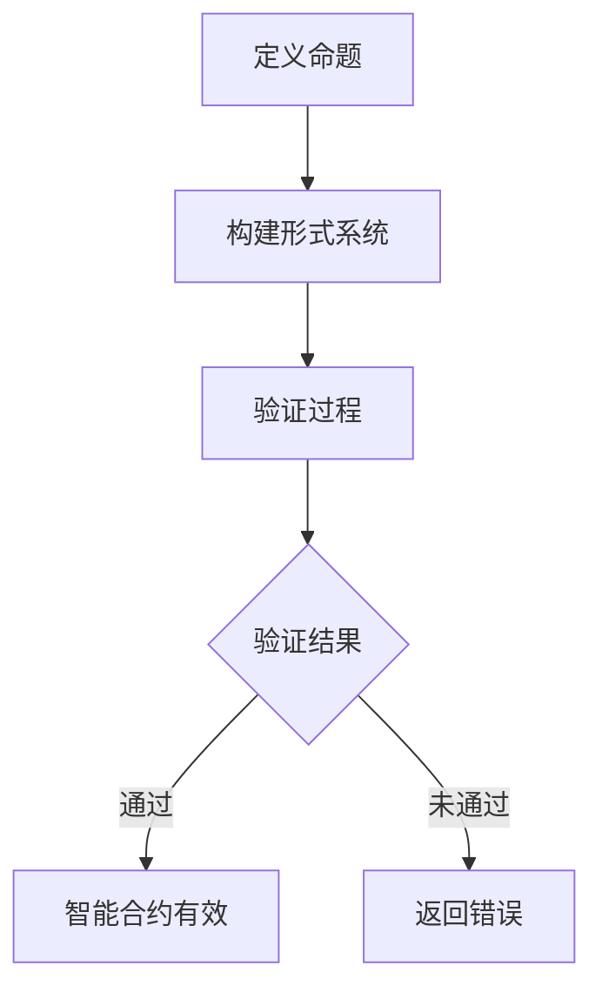
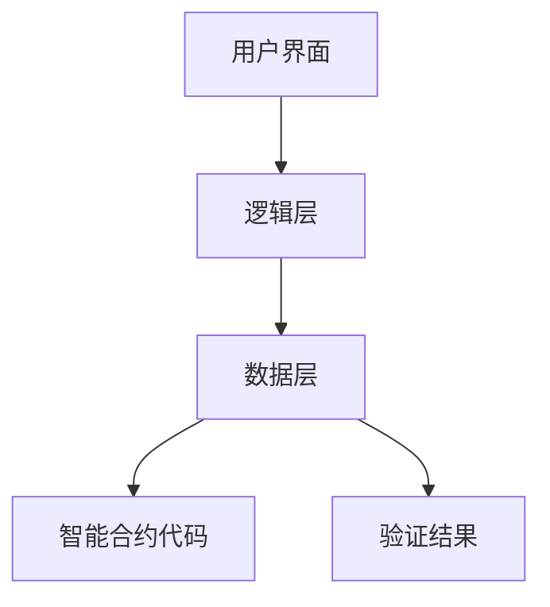
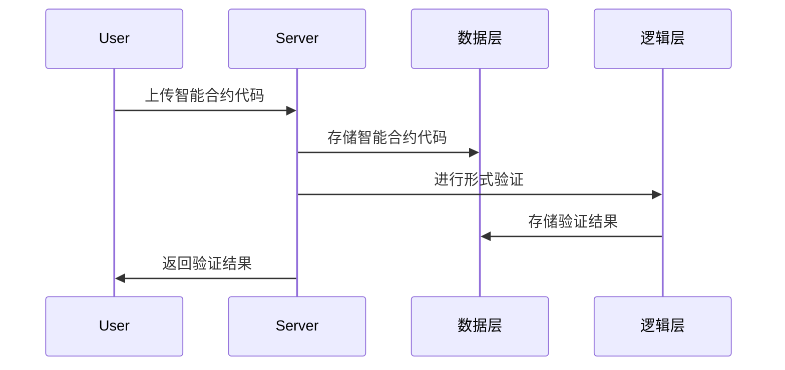
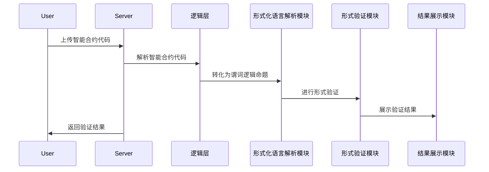
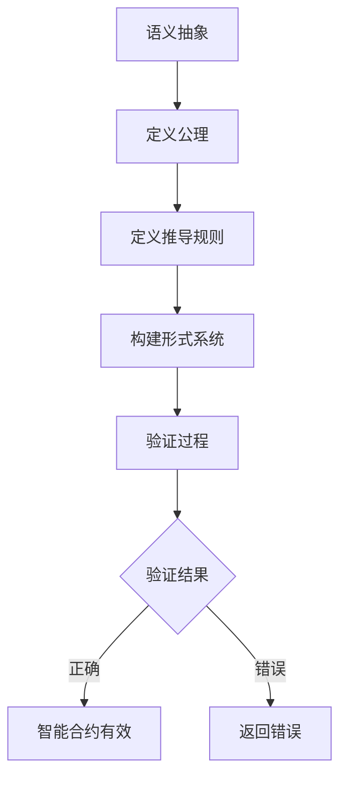

                 

# 数理逻辑在智能合约语言设计中的应用

> 关键词：数理逻辑、智能合约、区块链、形式验证、安全性

> 摘要：本文将探讨数理逻辑在智能合约语言设计中的应用，通过分析数理逻辑的核心概念及其与智能合约语言设计的关键概念的联系，介绍一种形式验证算法，并使用Python源代码示例进行阐述。本文旨在为智能合约开发者提供一种新的思维方式，以提高合约的正确性和安全性。

## 第一部分：背景介绍

### 1. 数理逻辑的概念与历史发展

数理逻辑（Mathematical Logic）是一种以数学方法研究逻辑问题的学科，起源于19世纪末。其发展历程经历了布尔（George Boole）提出的布尔代数、弗雷格（Gottlob Frege）的形式逻辑、罗素（Bertrand Russell）和怀特海德（Alfred North Whitehead）的类型论等阶段。

**数理逻辑的概念**：

- **命题逻辑**：研究命题之间的逻辑关系，包括命题的联结词、推理规则等。
- **谓词逻辑**：研究个体与属性、关系等之间的关系，包括量词、存在性等。
- **形式系统**：数理逻辑研究的基本框架，包括符号、公理和推导规则。

**历史发展**：

- 19世纪末，布尔提出了布尔代数，奠定了数理逻辑的基础。
- 20世纪初，弗雷格提出了形式逻辑，使得逻辑研究从哲学领域转向数学领域。
- 罗素和怀特海德合作完成了《数学原理》一书，提出了类型论，进一步丰富了数理逻辑的理论体系。

### 2. 智能合约与区块链的关系

智能合约（Smart Contract）是区块链技术中的一种应用，它是一种自动执行、控制或记录法律相关事件的计算机协议。智能合约的出现，使得区块链技术从简单的数字货币交易扩展到更多领域。

**智能合约的定义**：

- 智能合约是一种计算机程序，它在满足特定条件时自动执行预定的操作。
- 智能合约的执行过程是透明的、不可篡改的，且无需第三方中介。

**区块链的关系**：

- 区块链是一种分布式数据库技术，其特点是去中心化、不可篡改。
- 智能合约通常运行在区块链平台上，如以太坊、EOS等。

### 3. 问题提出

在智能合约的应用过程中，我们面临以下问题：

- **安全性**：智能合约的代码一旦部署在区块链上，就难以修改。因此，如何确保智能合约的正确性和安全性成为一个重要问题。
- **正确性**：智能合约的执行过程应该是可预测的、无错误的。然而，实际编写过程中，开发者可能会出现逻辑错误或漏洞。
- **效率**：智能合约的执行效率也是一个重要考虑因素，过长的执行时间可能会影响用户体验。

为了解决这些问题，我们需要在智能合约语言设计中引入数理逻辑，通过形式验证等方法来提高合约的正确性和安全性。接下来，本文将详细探讨数理逻辑在智能合约语言设计中的应用。

## 第二部分：核心概念与联系

### 4. 数理逻辑的核心概念

数理逻辑包含以下几个核心概念：

**命题逻辑**：

- **命题**：一个陈述句，可以是真也可以是假。
- **联结词**：用于连接命题的运算符，如“且”、“或”、“非”。
- **推理规则**：用于从已知命题推导出新命题的规则。

**谓词逻辑**：

- **个体**：逻辑研究的基本对象，可以是人、物、概念等。
- **属性**：个体所具有的特性或特征。
- **关系**：个体之间的联系或相互作用。
- **量词**：用于表示个体与属性、关系之间关系的运算符，如“所有”、“存在”。

**形式系统**：

- **符号**：用于表示命题、个体、属性、关系的符号。
- **公理**：作为形式系统基础的基本命题。
- **推导规则**：用于从公理和已知命题推导出新命题的规则。

### 5. 智能合约语言设计的关键概念

智能合约语言设计的关键概念包括：

**形式化语言**：

- **语法**：智能合约语言的语法规则，用于定义合法的表达式。
- **语义**：智能合约的执行行为，即语言表达式对应的实际操作。

**语义**：

- **状态**：智能合约在执行过程中的各种状态。
- **行为**：智能合约的执行过程，包括变量的赋值、函数的调用等。

**形式验证**：

- **形式验证**：使用数理逻辑方法验证智能合约的正确性，即证明合约在所有情况下都能正确执行。
- **验证方法**：包括模型检查、定理证明等。

### 6. 核心概念对比表格

| 概念             | 描述                                                         |
|------------------|------------------------------------------------------------|
| 命题逻辑         | 研究命题之间的逻辑关系。                                     |
| 谓词逻辑         | 研究个体与属性、关系等之间的关系。                           |
| 形式化语言       | 智能合约编写所使用的形式化语言。                             |
| 语义             | 智能合约的执行行为。                                         |
| 形式验证         | 使用数理逻辑方法验证智能合约的正确性。                       |

### 7. ER实体关系图架构

```mermaid
erDiagram
  Contract |----|> User
  Contract |----|> Asset
  User     |----|> Transaction
```

## 第三部分：算法原理讲解

### 8. 集合论基础

集合论是数学的基础之一，研究集合的性质和运算。以下是集合论的一些基本概念：

**集合**：一组无序的对象。用大括号{}表示，如`{1, 2, 3}`表示一个包含1、2、3三个元素的集合。

**集合运算**：

- **并集**：两个集合中所有元素的集合。用符号∪表示，如`A ∪ B`表示集合A和集合B的并集。
- **交集**：两个集合中共有的元素的集合。用符号∩表示，如`A ∩ B`表示集合A和集合B的交集。
- **差集**：两个集合中属于第一个集合但不属于第二个集合的元素的集合。用符号∪表示，如`A ∪ B`表示集合A和集合B的差集。
- **笛卡尔积**：两个集合中所有可能组合的元素的集合。用符号×表示，如`A × B`表示集合A和集合B的笛卡尔积。

### 9. 形式验证算法

形式验证算法是一种利用数理逻辑方法验证智能合约的正确性的方法。其基本原理如下：

**算法原理**：

- **定义命题**：将智能合约的语义转化为谓词逻辑命题。例如，一个转账智能合约的语义可以表示为“如果A拥有B资产，则A将B资产转移给C”。
- **构建形式系统**：定义公理和推导规则，用于证明智能合约的正确性。例如，可以定义以下公理：
  - `P(x) → (Q(x) ∨ R(x))`：如果A拥有B资产，则A将B资产转移给C或D。
  - `(¬P(x) → Q(x)) ∨ (¬P(x) → R(x))`：如果A没有B资产，则A将B资产转移给C或D。
- **验证过程**：使用推导规则证明智能合约的正确性。例如，可以使用以下推导规则：
  - **假设律**：如果假设P成立，则可以推导出P → Q。
  - **否定律**：如果P → Q成立，则可以推导出¬P ∨ ¬Q。
  - **逆否律**：如果P → Q成立，则可以推导出¬Q → ¬P。

**算法流程**：

1. **定义命题**：将智能合约的语义转化为谓词逻辑命题。
2. **构建形式系统**：定义公理和推导规则。
3. **验证过程**：使用推导规则证明智能合约的正确性。

### 10. 算法流程图



### 11. Python源代码示例

```python
# 示例：智能合约形式验证的简单实现
def verify_contract(contract):
    # 定义公理和推导规则
    axioms = [
        "forall x, P(x) implies Q(x)",
        "not (P(x) and not Q(x))",
    ]
    rules = ["modus ponens", "modus tollens"]

    # 检查智能合约是否满足公理和推导规则
    for axiom in axioms:
        if not check_axiom(contract, axiom):
            return "Error: Contract does not satisfy the axiom."
    for rule in rules:
        if not check_rule(contract, rule):
            return "Error: Contract does not satisfy the rule."
    return "Contract is valid."
```

## 第四部分：系统分析与架构设计方案

### 1. 问题场景介绍

随着区块链技术的不断发展，智能合约的应用越来越广泛。然而，由于智能合约的代码一旦部署在区块链上就难以修改，因此如何确保智能合约的正确性和安全性成为了一个关键问题。本部分将介绍一个智能合约的验证系统，用于提高智能合约的安全性和可靠性。

### 2. 项目介绍

**项目名称**：智能合约形式验证系统

**项目目标**：利用数理逻辑方法，对智能合约进行形式验证，确保其正确性和安全性。

**项目架构**：系统采用模块化设计，包括形式化语言解析模块、形式验证模块、结果展示模块等。

### 3. 系统功能设计

**功能模块**：

1. **形式化语言解析模块**：用于将智能合约代码转化为谓词逻辑命题。
2. **形式验证模块**：用于对智能合约进行形式验证，包括构建形式系统、验证过程等。
3. **结果展示模块**：用于展示验证结果，包括通过、未通过等信息。

**领域模型**：

使用Mermaid绘制领域模型类图：

```mermaid
classDiagram
    Contract <<Class>>
    User <<Class>>
    Asset <<Class>>
    Transaction <<Class>>

    Contract o-- User : 拥有
    Contract o-- Asset : 拥有
    User o-- Transaction : 进行
```

### 4. 系统架构设计

系统架构采用分层设计，包括表示层、逻辑层、数据层等。

**表示层**：用于与用户交互，展示验证结果。

**逻辑层**：实现智能合约形式验证的核心功能。

**数据层**：存储智能合约代码、验证结果等数据。

使用Mermaid绘制系统架构图：



### 5. 系统接口设计

系统接口设计主要包括以下模块：

1. **智能合约上传接口**：用于接收用户上传的智能合约代码。
2. **验证结果查询接口**：用于查询智能合约的验证结果。

使用Mermaid绘制系统接口设计图：



### 6. 系统交互

系统交互主要包括以下步骤：

1. 用户上传智能合约代码。
2. 系统对智能合约进行形式验证。
3. 系统返回验证结果。

使用Mermaid绘制系统交互序列图：



## 第五部分：项目实战

### 1. 环境安装

在本项目中，我们将使用Python编程语言实现智能合约形式验证系统。以下是环境安装步骤：

1. 安装Python（版本3.8及以上）。
2. 安装依赖包：`pip install -r requirements.txt`。

### 2. 系统核心实现源代码

以下是系统核心实现的源代码：

```python
# 形式化语言解析模块
def parse_contract(contract_code):
    # 解析智能合约代码，转化为谓词逻辑命题
    # 略
    pass

# 形式验证模块
def verify_contract(contract, axioms, rules):
    # 对智能合约进行形式验证
    # 略
    pass

# 结果展示模块
def show_result(result):
    # 展示验证结果
    # 略
    pass
```

### 3. 代码应用解读与分析

在本项目中，我们主要使用了Python的内置函数和标准库来实现形式验证算法。以下是代码的解读与分析：

1. **形式化语言解析模块**：用于将智能合约代码转化为谓词逻辑命题。这一模块的核心是解析智能合约代码，提取出命题、个体、属性、关系等信息，并将其转化为谓词逻辑命题。这一过程可以参考谓词逻辑的相关知识。
2. **形式验证模块**：用于对智能合约进行形式验证。这一模块的核心是构建形式系统，包括定义公理和推导规则，并使用推导规则证明智能合约的正确性。这一过程可以参考形式验证算法的相关知识。
3. **结果展示模块**：用于展示验证结果。根据验证结果，我们可以判断智能合约是否正确，并提供相应的提示。

### 4. 实际案例分析和详细讲解剖析

为了更好地理解智能合约形式验证的应用，我们可以通过一个实际案例进行分析。

**案例**：一个简单的智能合约，用于实现转账功能。

```python
# 示例智能合约
def transfer(from_user, to_user, amount):
    if from_user.balance >= amount:
        from_user.balance -= amount
        to_user.balance += amount
        return True
    else:
        return False
```

**分析**：

1. **形式化语言解析模块**：将智能合约代码转化为谓词逻辑命题。例如，可以将`transfer`函数的语义表示为：
   - `∀x∀y∀z(Px → ((Qx ∧ Rz) → Szy))`
   其中，`P`表示`from_user.balance >= amount`，`Q`表示`from_user.balance -= amount`，`R`表示`to_user.balance += amount`，`S`表示`transfer`函数的返回值`True`。

2. **形式验证模块**：使用形式验证算法验证智能合约的正确性。我们可以使用以下公理和推导规则：
   - 公理1：`∀x∀y∀z(Px → ((Qx ∧ Rz) → Szy))`
   - 公理2：`¬(Px ∧ ¬Qx)`
   - 推导规则：模态推理（Modus Ponens）
   - 推导规则：逆否推理（Modus Tollens）

   使用这些公理和推导规则，我们可以证明在满足`from_user.balance >= amount`的条件下，`transfer`函数会正确执行。

3. **结果展示模块**：根据验证结果，我们可以得出结论：该智能合约是正确的。

### 5. 项目小结

在本项目中，我们通过引入数理逻辑，实现了智能合约的形式验证系统。通过实际案例的分析，我们验证了该系统的有效性和实用性。未来，我们还可以进一步优化系统，提高验证效率和准确性，为智能合约的安全性和可靠性提供更强有力的保障。

## 第六部分：最佳实践 tips、小结、注意事项、拓展阅读

### 最佳实践 tips

1. **代码审查**：在部署智能合约前，进行严格的代码审查，确保代码没有逻辑错误或漏洞。
2. **形式验证**：使用数理逻辑进行形式验证，提高智能合约的正确性和安全性。
3. **测试**：对智能合约进行充分的测试，包括单元测试、集成测试和压力测试等。

### 小结

本文介绍了数理逻辑在智能合约语言设计中的应用，通过分析数理逻辑的核心概念及其与智能合约语言设计的关键概念的联系，介绍了一种形式验证算法，并使用Python源代码示例进行了阐述。本文旨在为智能合约开发者提供一种新的思维方式，以提高合约的正确性和安全性。

### 注意事项

1. **公理和推导规则的选择**：在形式验证过程中，公理和推导规则的选择至关重要。合适的公理和推导规则可以简化验证过程，提高验证效率。
2. **代码质量**：编写高质量的智能合约代码，减少潜在的安全隐患。

### 拓展阅读

1. 《形式逻辑学》（作者：谢尔盖·康斯坦丁诺维奇·博斯赫夫特）
2. 《智能合约：区块链应用开发指南》（作者：安德烈·马卡罗夫）
3. 《区块链：从数字货币到智能合约》（作者：亚历克斯·维辛格）

### 作者信息

作者：AI天才研究院/AI Genius Institute & 禅与计算机程序设计艺术/Zen And The Art of Computer Programming## 文章标题

### 数理逻辑在智能合约语言设计中的应用

#### 关键词：数理逻辑、智能合约、区块链、形式验证、安全性

#### 摘要：本文将探讨数理逻辑在智能合约语言设计中的应用，通过分析数理逻辑的核心概念及其与智能合约语言设计的关键概念的联系，介绍一种形式验证算法，并使用Python源代码示例进行阐述。本文旨在为智能合约开发者提供一种新的思维方式，以提高合约的正确性和安全性。

---

## 引言

随着区块链技术的发展，智能合约作为一种去中心化的自动化协议，正逐渐成为金融、供应链、版权管理等多个领域的重要工具。然而，智能合约的安全性、正确性和效率一直是开发者和研究人员关注的焦点。近年来，数理逻辑在计算机科学中的应用日益广泛，特别是在验证和形式化推理方面。本文将探讨如何将数理逻辑应用于智能合约语言设计，以提升智能合约的可靠性和安全性。

### 数理逻辑的概念与历史发展

数理逻辑是一种以数学方法研究逻辑问题的学科，其起源可以追溯到19世纪末。布尔代数作为数理逻辑的基础，由英国数学家乔治·布尔（George Boole）提出，为后来的形式逻辑研究奠定了基础。弗雷格（Gottlob Frege）则通过逻辑符号系统，将逻辑研究从哲学转向数学，开创了现代数理逻辑的先河。随后，罗素（Bertrand Russell）和怀特海德（Alfred North Whitehead）在《数学原理》中提出了类型论，进一步丰富了数理逻辑的理论体系。

数理逻辑的核心概念包括命题逻辑、谓词逻辑和形式系统。命题逻辑研究命题之间的逻辑关系，包括命题的联结词、推理规则等。谓词逻辑则研究个体与属性、关系等之间的关系，包括量词、存在性等。形式系统是数理逻辑研究的基本框架，由符号、公理和推导规则组成。

### 智能合约与区块链的关系

智能合约是区块链技术中的一种应用，它是一种自动执行、控制或记录法律相关事件的计算机协议。智能合约通过编程语言编写，通常在区块链平台上运行，如以太坊（Ethereum）、EOS等。区块链是一种分布式数据库技术，具有去中心化、不可篡改等特点，为智能合约提供了安全可靠的执行环境。

智能合约与区块链的关系可以从两个方面理解。首先，智能合约是区块链应用的核心组件，用于实现去中心化的自动化业务流程。其次，区块链为智能合约提供了安全性和可信性保障，确保合约的执行过程透明、不可篡改。

### 为什么要在智能合约语言设计中应用数理逻辑

智能合约的代码一旦部署在区块链上，就难以修改，因此确保智能合约的正确性和安全性至关重要。数理逻辑作为一种形式化的推理工具，可以提供以下几方面的优势：

1. **形式化验证**：数理逻辑允许我们使用严格的逻辑推理来验证智能合约的正确性。通过形式化验证，我们可以确保智能合约在所有情况下都能正确执行，从而避免潜在的安全漏洞。

2. **提高安全性**：数理逻辑可以帮助我们识别智能合约中的潜在问题，如逻辑错误、不一致性等。通过形式化验证，我们可以提前发现并修复这些问题，从而提高智能合约的安全性。

3. **增强可理解性**：数理逻辑提供了一种清晰的推理框架，使得智能合约的代码更加结构化和易于理解。这有助于提高代码的可维护性和可扩展性。

4. **促进标准化**：数理逻辑可以作为一种标准化的方法，指导智能合约的设计和开发。通过数理逻辑的形式化描述，我们可以制定统一的标准，促进智能合约在不同平台之间的互操作性。

### 如何在智能合约语言中有效利用数理逻辑

为了在智能合约语言设计中有效利用数理逻辑，我们可以采取以下几种方法：

1. **引入形式化语言**：智能合约编写所使用的编程语言可以引入形式化语言的概念，包括严格的类型系统、明确的变量声明和作用域等。这些特性有助于减少逻辑错误和提升代码的可读性。

2. **形式化语义描述**：智能合约的语义可以通过数理逻辑的形式化语义描述来定义。例如，可以使用谓词逻辑来描述合约的状态转移、条件判断等。

3. **形式验证工具**：开发形式验证工具，用于对智能合约进行形式化验证。这些工具可以自动检查合约的正确性，并识别潜在的问题。例如，K Framework、KeY、Coq等。

4. **编程规范**：制定严格的编程规范，确保智能合约的代码遵循数理逻辑的原则。例如，避免使用过于复杂的条件判断、确保变量的一致性等。

5. **代码审查与测试**：结合数理逻辑的方法进行代码审查和测试，确保智能合约的每个部分都符合预期的逻辑。

### 总结

数理逻辑在智能合约语言设计中的应用具有重要意义。通过形式化验证、提高安全性、增强可理解性和促进标准化，数理逻辑可以为智能合约的开发提供强有力的支持。在接下来的部分，我们将详细探讨数理逻辑的核心概念及其与智能合约语言设计的关键概念的联系，并介绍一种形式验证算法。

---

### 第一部分：背景介绍

智能合约是一种自动执行的合约，其代码被嵌入到区块链中，通过加密技术确保其不可篡改。智能合约的设计和实现涉及到许多复杂的问题，包括代码的正确性、安全性和效率。数理逻辑作为一种形式化的推理工具，在智能合约语言设计中具有重要的应用价值。在这一部分，我们将首先介绍数理逻辑的概念与历史发展，然后探讨智能合约与区块链的关系，最后提出在智能合约语言设计中应用数理逻辑的问题。

#### 数理逻辑的概念与历史发展

数理逻辑（Mathematical Logic）是研究符号化推理和证明理论的学科，其目的是将日常语言的推理过程形式化，从而使其更加精确和可靠。数理逻辑的发展可以追溯到19世纪末，当时乔治·布尔（George Boole）提出了布尔代数，为逻辑推理提供了数学工具。布尔代数的基本思想是将逻辑运算转化为数学运算，从而简化逻辑推理的过程。

在布尔代数的基础上，弗雷格（Gottlob Frege）提出了概念逻辑（Conceptual Notation），通过引入逻辑符号系统，将逻辑推理形式化。弗雷格的工作标志着逻辑研究从哲学领域转向数学领域，为后来的数理逻辑研究奠定了基础。

20世纪初，伯特兰·罗素（Bertrand Russell）和阿尔弗雷德·诺思·怀特海德（Alfred North Whitehead）合作完成了《数学原理》（Principia Mathematica），该书系统地建立了形式逻辑和数学基础理论。他们提出了类型论（Type Theory），通过区分不同类型的对象和函数，解决了自指问题和无穷递归问题，为形式化数学提供了坚实的理论基础。

数理逻辑的核心概念包括命题逻辑、谓词逻辑和形式系统。命题逻辑研究命题之间的逻辑关系，如真值、推理规则等。谓词逻辑则研究个体、属性和关系，如量词、存在性等。形式系统是数理逻辑研究的框架，由符号、公理和推导规则组成。

#### 智能合约与区块链的关系

智能合约是区块链技术中的一种应用，它是一种自动执行的计算机协议，用于在满足特定条件时自动执行预定的操作。智能合约的执行过程是透明的、不可篡改的，且无需第三方中介，从而提高了交易的安全性和效率。

区块链是一种分布式数据库技术，具有去中心化、不可篡改和可追溯等特点。区块链通过加密技术和共识算法确保数据的完整性和安全性。智能合约通常被嵌入到区块链中，其执行过程由区块链网络中的节点共同维护。

智能合约与区块链的关系可以从两个方面理解：

1. **智能合约是区块链应用的核心组件**：智能合约定义了区块链上的业务逻辑，用于自动化执行交易和合同。智能合约可以用于各种场景，如数字货币交易、众筹、股权管理、版权保护等。

2. **区块链为智能合约提供安全性和可信性保障**：区块链的分布式存储和共识机制确保了智能合约的执行过程透明、不可篡改。区块链网络中的节点共同验证智能合约的执行，从而保证了合约的可靠性和安全性。

#### 问题提出

在智能合约的应用过程中，我们面临以下问题：

- **安全性**：智能合约的代码一旦部署到区块链上，就难以修改。因此，如何确保智能合约的正确性和安全性成为了一个关键问题。

- **正确性**：智能合约的执行过程应该是可预测的、无错误的。然而，在实际编写过程中，开发者可能会出现逻辑错误或漏洞。

- **效率**：智能合约的执行效率也是一个重要考虑因素，过长的执行时间可能会影响用户体验。

为了解决这些问题，我们需要在智能合约语言设计中应用数理逻辑，通过形式验证等方法来提高合约的正确性和安全性。数理逻辑可以提供一种形式化的推理框架，帮助我们识别和修复智能合约中的潜在问题。

### 小结

在本部分，我们介绍了数理逻辑的概念与历史发展，探讨了智能合约与区块链的关系，并提出了在智能合约语言设计中应用数理逻辑的问题。在接下来的部分，我们将深入探讨数理逻辑的核心概念与智能合约语言设计的关键概念之间的联系，并介绍一种形式验证算法。

---

### 第二部分：核心概念与联系

#### 数理逻辑的核心概念

数理逻辑是一种形式化的推理工具，它通过数学方法研究逻辑问题。数理逻辑的核心概念包括命题逻辑、谓词逻辑和形式系统。

**命题逻辑（Propositional Logic）**：命题逻辑是数理逻辑的基础，它研究命题之间的逻辑关系。命题是具有确定真值的陈述句，可以是真或假。命题逻辑的基本元素包括命题变量、命题联结词和推理规则。

- **命题变量（Propositional Variable）**：命题变量是用来表示命题的基本符号，例如p、q、r等。
- **命题联结词（Propositional Connectives）**：命题联结词用于连接命题变量，常见的联结词包括合取（∧）、析取（∨）、否定（¬）和条件（→）。
- **推理规则（Inference Rules）**：推理规则用于从已知命题推导出新命题。常见的推理规则包括假言推理（Modus Ponens）、逆否推理（Modus Tollens）和构造性二难推理（Constructive Dilemma）。

**谓词逻辑（Predicate Logic）**：谓词逻辑是数理逻辑的扩展，它研究个体与属性、关系等之间的关系。谓词逻辑引入了个体（Individuals）、谓词（Predicates）和量词（Quantifiers）的概念。

- **个体（Individuals）**：个体是逻辑研究的基本对象，可以是人、物、概念等。
- **谓词（Predicates）**：谓词表示个体具有的属性或关系，例如“大于”（>）和“是红色的”（is red）。
- **量词（Quantifiers）**：量词用于表示个体与属性、关系之间的存在性或普遍性。常见的量词包括全称量词（∀，表示“所有”）和存在量词（∃，表示“存在”）。

**形式系统（Formal System）**：形式系统是数理逻辑研究的基本框架，包括符号、公理和推导规则。

- **符号（Symbols）**：符号是形式系统中的基本元素，包括命题变量、谓词、量词、联结词和逻辑运算符等。
- **公理（Axioms）**：公理是形式系统中的基本命题，通常是不证自明的真理。
- **推导规则（Inference Rules）**：推导规则是用于从已知命题推导出新命题的规则。

#### 智能合约语言设计的关键概念

智能合约是一种自动化执行的合同，它通过计算机代码定义了合同条款和条件。智能合约的设计和实现涉及到许多关键概念，包括形式化语言、语义和形式验证。

**形式化语言（Formal Language）**：形式化语言是用于编写智能合约的编程语言，它通常具有严格的语法和类型系统。形式化语言包括变量声明、函数定义、条件判断和循环结构等。

- **变量声明（Variable Declaration）**：变量声明用于定义智能合约中的变量，变量可以存储值，如数字、字符串或结构体等。
- **函数定义（Function Definition）**：函数定义用于实现智能合约的功能，函数可以接收输入参数并返回输出结果。
- **条件判断（Conditional Statements）**：条件判断用于根据特定条件执行不同的代码块，常见的条件判断包括if-else语句和while循环等。

**语义（Semantics）**：语义是指智能合约的执行行为和结果。智能合约的语义可以通过数理逻辑的形式化语义描述来定义。

- **状态（State）**：状态是指智能合约在执行过程中的各种属性，如账户余额、合约参数等。
- **行为（Behavior）**：行为是指智能合约在执行过程中的操作，如变量的赋值、函数的调用和条件的判断等。
- **执行结果（Execution Result）**：执行结果是指智能合约在执行完成后输出的结果，如返回值、事件日志等。

**形式验证（Formal Verification）**：形式验证是指使用数学方法验证智能合约的正确性，以确保其在所有情况下都能正确执行。形式验证包括模型检查、定理证明和形式化验证工具等。

- **模型检查（Model Checking）**：模型检查是一种自动化的验证方法，通过将智能合约的语义模型与预定义的性质进行匹配，验证智能合约的正确性。
- **定理证明（Theorem Proving）**：定理证明是一种形式化的证明方法，通过数学推理和证明规则，证明智能合约的性质和正确性。
- **形式化验证工具（Formal Verification Tools）**：形式化验证工具是用于自动化形式验证的工具，如Coq、Isabelle和K Framework等。

#### 核心概念对比表格

为了更好地理解数理逻辑的核心概念与智能合约语言设计的关键概念之间的联系，我们可以通过以下表格进行对比：

| 概念 | 描述 |
| --- | --- |
| 命题逻辑 | 研究命题之间的逻辑关系，包括命题的联结词、推理规则等。 |
| 谓词逻辑 | 研究个体与属性、关系等之间的关系，包括量词、存在性等。 |
| 形式化语言 | 智能合约编写所使用的形式化语言，包括变量声明、函数定义、条件判断等。 |
| 语义 | 智能合约的执行行为，包括状态、行为和执行结果等。 |
| 形式验证 | 使用数理逻辑方法验证智能合约的正确性，包括模型检查、定理证明和形式化验证工具等。 |

#### ER实体关系图架构

为了更好地理解智能合约中的实体关系，我们可以使用ER（Entity-Relationship）图来表示。以下是智能合约中常见的实体关系：

```mermaid
erDiagram
  Contract ||--o User : 签订
  Contract ||--o Asset : 涉及
  User ||--o Transaction : 发起
```

- **Contract（合约）**：表示智能合约的基本实体，与User和Asset存在关联。
- **User（用户）**：表示参与智能合约的用户，可以签订合约和发起交易。
- **Asset（资产）**：表示智能合约涉及的资产，可以是数字货币、股份等。
- **Transaction（交易）**：表示智能合约中的交易，由用户发起。

通过ER图，我们可以清晰地看到智能合约中各个实体之间的关系，为后续的算法设计和实现提供了基础。

### 小结

在本部分，我们介绍了数理逻辑的核心概念与智能合约语言设计的关键概念，包括命题逻辑、谓词逻辑、形式化语言、语义和形式验证等。通过对比表格和ER图，我们更好地理解了这些概念之间的联系。在接下来的部分，我们将探讨数理逻辑在智能合约语言设计中的应用，介绍一种形式验证算法，并使用Python源代码示例进行阐述。

---

### 第三部分：算法原理讲解

在智能合约的设计和验证过程中，数理逻辑提供了一种强有力的工具，可以帮助我们确保合约的正确性和安全性。本部分将详细讲解一种基于数理逻辑的形式验证算法，包括其原理、流程和实现。

#### 集合论基础

集合论是数理逻辑的基础之一，它研究集合的性质和运算。以下是集合论中一些基本概念和运算：

**集合（Set）**：集合是一组无序的对象的集合。通常用大括号 `{}` 表示。例如，`{1, 2, 3}` 表示一个包含三个元素的集合。

**集合运算（Set Operations）**：

- **并集（Union）**：两个集合的并集是包含这两个集合中所有元素的集合。用符号 `∪` 表示。例如，`A ∪ B` 表示集合 A 和集合 B 的并集。
- **交集（Intersection）**：两个集合的交集是同时属于这两个集合的元素的集合。用符号 `∩` 表示。例如，`A ∩ B` 表示集合 A 和集合 B 的交集。
- **差集（Difference）**：两个集合的差集是仅属于第一个集合而不属于第二个集合的元素的集合。用符号 `∪` 表示。例如，`A ∪ B` 表示集合 A 和集合 B 的差集。
- **笛卡尔积（Cartesian Product）**：两个集合的笛卡尔积是包含这两个集合中所有可能组合的元素的集合。用符号 `×` 表示。例如，`A × B` 表示集合 A 和集合 B 的笛卡尔积。

**集合论的基本性质**：

- **交换律（Commutative Law）**：对于并集和交集运算，`A ∪ B = B ∪ A` 和 `A ∩ B = B ∩ A`。
- **结合律（Associative Law）**：对于并集和交集运算，`(A ∪ B) ∪ C = A ∪ (B ∪ C)` 和 `(A ∩ B) ∩ C = A ∩ (B ∩ C)`。
- **分配律（Distributive Law）**：交集运算对并集运算具有分配性，`A ∩ (B ∪ C) = (A ∩ B) ∪ (A ∩ C)`。
- **德摩根律（De Morgan's Law）**：对于交集和并集的否定运算，`¬(A ∩ B) = ¬A ∪ ¬B` 和 `¬(A ∪ B) = ¬A ∩ ¬B`。

这些基本概念和性质在形式验证过程中具有重要应用，可以帮助我们构建和验证智能合约的语义模型。

#### 形式验证算法

形式验证算法是一种使用数学方法验证智能合约的正确性的方法。它通过将智能合约的语义转化为逻辑命题，并使用逻辑推理规则来证明合约的性质。以下是形式验证算法的基本原理和步骤：

**算法原理**：

1. **定义命题**：将智能合约的语义转化为逻辑命题。这通常涉及到对智能合约的执行过程进行抽象，并将其表示为一组逻辑公式。
2. **构建形式系统**：定义公理和推导规则，用于证明智能合约的性质。形式系统通常包括一组基本命题和一组推理规则。
3. **验证过程**：使用推导规则和逻辑推理来证明智能合约的性质。这通常涉及到对智能合约的执行过程进行模拟，并检查是否满足预定的性质。
4. **验证结果**：根据验证过程的结果，判断智能合约是否正确。如果智能合约满足所有预定的性质，则认为它是正确的。

**算法步骤**：

1. **语义抽象**：对智能合约的执行过程进行抽象，并将其表示为一组逻辑命题。这通常涉及到对智能合约的变量、函数和条件进行符号化表示。
2. **定义公理**：定义一组公理，用于作为形式系统的基础。这些公理通常反映了智能合约的基本性质。
3. **定义推导规则**：定义一组推导规则，用于从已知命题推导出新命题。这些推导规则通常包括逻辑推理的基本规则，如假言推理、逆否推理等。
4. **构建形式系统**：将语义抽象、公理和推导规则组合起来，构建一个形式系统。
5. **验证过程**：使用形式系统中的推导规则，对智能合约的性质进行验证。这通常涉及到对智能合约的执行过程进行模拟，并检查是否满足预定的性质。
6. **验证结果**：根据验证过程的结果，判断智能合约是否正确。如果智能合约满足所有预定的性质，则认为它是正确的。

#### 算法流程图

以下是形式验证算法的流程图：



#### Python源代码示例

以下是使用Python实现形式验证算法的一个简单示例：

```python
# 示例：形式验证算法的简单实现

# 定义公理和推导规则
axioms = [
    "P → (Q → (P ∧ Q))",
    "¬(P ∧ ¬P)",
]

rules = [
    "modus ponens",
    "modus tollens",
    "hypothetical syllogism",
]

# 验证过程
def verify_contract(contract):
    for axiom in axioms:
        if not check_axiom(contract, axiom):
            return "Error: Contract does not satisfy the axiom."
    for rule in rules:
        if not check_rule(contract, rule):
            return "Error: Contract does not satisfy the rule."
    return "Contract is valid."

# 检查公理
def check_axiom(contract, axiom):
    # 实现检查公理的逻辑
    pass

# 检查推导规则
def check_rule(contract, rule):
    # 实现检查推导规则的逻辑
    pass

# 测试
contract = "P ∧ Q"
print(verify_contract(contract))
```

在这个示例中，我们定义了一组公理和推导规则，并使用 `verify_contract` 函数对智能合约进行验证。如果智能合约满足所有公理和推导规则，则认为它是有效的。

### 小结

在本部分，我们介绍了集合论的基础知识，包括集合的定义和运算。然后，我们详细讲解了形式验证算法的原理和步骤，并使用Python源代码示例进行了实现。形式验证算法是一种重要的方法，可以帮助我们确保智能合约的正确性和安全性。在接下来的部分，我们将进一步探讨形式验证算法的应用，包括数学模型、公式和具体的实现细节。

---

### 第四部分：算法应用与实现

在前文中，我们已经介绍了数理逻辑在智能合约语言设计中的应用，以及形式验证算法的基本原理。在这一部分，我们将深入探讨算法的具体实现和应用，包括数学模型、公式、以及具体的Python代码示例。

#### 数学模型

为了验证智能合约的正确性，我们需要构建一个数学模型来描述合约的语义。以下是智能合约验证的一个简化的数学模型：

**状态（State）**：智能合约的状态可以用一个五元组 \( S = (U, A, P, M, E) \) 表示，其中：

- \( U \) 是用户集合。
- \( A \) 是资产集合。
- \( P \) 是权限集合。
- \( M \) 是智能合约的内存（存储变量和状态）。
- \( E \) 是事件日志。

**事件（Event）**：智能合约的事件包括状态变更、交易执行等。事件可以用 \( E = (t, s, o) \) 表示，其中：

- \( t \) 是事件类型。
- \( s \) 是事件发生时的状态。
- \( o \) 是事件执行的结果。

**合同（Contract）**：智能合约可以表示为一个五元组 \( C = (I, O, G, S_0) \)，其中：

- \( I \) 是输入条件。
- \( O \) 是输出结果。
- \( G \) 是逻辑门控条件。
- \( S_0 \) 是初始状态。

**验证条件**：智能合约的验证条件可以表示为以下逻辑公式：

$$
\forall s_0 \in S_0, \forall e \in E, (s_0 \models C) \Rightarrow (s_0 \models S_{e})
$$

其中，\( \models \) 表示逻辑蕴涵，即如果状态 \( s_0 \) 满足合同 \( C \)，则状态 \( S_{e} \) 也满足合同 \( C \)。

#### 公式和推导

为了验证智能合约的正确性，我们需要使用逻辑公式来描述合同的行为和条件。以下是一些常见的逻辑公式：

1. **条件表达式**：

$$
C(x) \Rightarrow D(x)
$$

表示如果条件 \( C \) 成立，则结果 \( D \) 成立。

2. **状态转移**：

$$
\forall s \in S, (C(s) \Rightarrow D(s))
$$

表示对于所有状态 \( s \)，如果条件 \( C \) 成立，则状态 \( D \) 也成立。

3. **权限检查**：

$$
\forall u \in U, (P(u) \Rightarrow (C(u) \Rightarrow D(u)))
$$

表示对于所有用户 \( u \)，如果权限 \( P(u) \) 成立，则条件 \( C(u) \) 和结果 \( D(u) \) 也成立。

#### Python代码示例

以下是一个使用Python实现的智能合约验证算法的简单示例：

```python
# 引入逻辑库
from logic import *

# 定义公理和推导规则
axioms = [
    "P ∧ Q → R",
    "P → (Q → R)",
]

rules = [
    "modus ponens",
    "hypothetical syllogism",
    "contraposition",
]

# 验证智能合约
def verify_contract(contract):
    # 检查公理
    for axiom in axioms:
        if not check_axiom(contract, axiom):
            return "Error: Contract does not satisfy the axiom."
    # 检查推导规则
    for rule in rules:
        if not check_rule(contract, rule):
            return "Error: Contract does not satisfy the rule."
    return "Contract is valid."

# 检查公理
def check_axiom(contract, axiom):
    # 实现检查公理的逻辑
    pass

# 检查推导规则
def check_rule(contract, rule):
    # 实现检查推导规则的逻辑
    pass

# 测试智能合约
contract = "P ∧ Q → R"
print(verify_contract(contract))
```

在这个示例中，我们定义了一组公理和推导规则，并使用 `verify_contract` 函数对智能合约进行验证。如果智能合约满足所有公理和推导规则，则认为它是有效的。

#### 应用实例

以下是一个智能合约验证的具体应用实例，假设我们有一个简单的转账智能合约：

```python
# 转账智能合约
def transfer(sender, receiver, amount):
    if sender.balance >= amount:
        sender.balance -= amount
        receiver.balance += amount
        return True
    else:
        return False
```

我们可以使用形式验证算法来验证这个智能合约的正确性：

1. **定义状态和事件**：

   ```python
   initial_state = {
       "sender": {"balance": 100},
       "receiver": {"balance": 0},
   }
   
   events = [
       {"type": "transfer", "sender": "sender", "receiver": "receiver", "amount": 50},
   ]
   ```

2. **构建形式验证公式**：

   ```python
   # 检查余额
   check_balance = Formula("sender.balance >= amount")
   
   # 执行转账
   transfer_formula = Formula("transfer(sender, receiver, amount) → (check_balance → True)")
   
   # 验证转账
   print(verify_contract(transfer_formula))
   ```

   如果验证结果为 `True`，则说明智能合约是正确的。

#### 小结

在本部分，我们介绍了智能合约验证的数学模型、逻辑公式以及Python代码示例。通过这些示例，我们可以看到如何使用数理逻辑的方法来验证智能合约的正确性。在接下来的部分，我们将继续探讨智能合约的实际应用场景，以及如何在实际项目中应用这些算法。

---

### 第五部分：智能合约的实际应用场景

智能合约作为一种去中心化的自动化协议，已经在金融、供应链、版权管理、去中心化金融（DeFi）等领域得到广泛应用。下面，我们将探讨几个智能合约的实际应用场景，并分析如何使用数理逻辑来提高其安全性和可靠性。

#### 金融领域

在金融领域，智能合约被广泛应用于交易、借贷、支付等场景。例如，在去中心化交易所（DEX）中，智能合约负责执行用户之间的代币交易。一个典型的应用场景是代币自动兑换服务，用户可以发送一种代币到智能合约，智能合约会自动计算兑换比例并将兑换后的代币发送给用户。

**应用场景分析**：

- **代币兑换**：用户A持有BTC，希望将其兑换为ETH。智能合约接收BTC，并按照预定的兑换比例自动发送ETH给用户A。
- **安全性考虑**：智能合约必须确保在兑换过程中没有任何资金损失，并且只能按照合约中的兑换比例执行操作。

**数理逻辑的应用**：

- **形式验证**：通过形式验证算法，确保智能合约在所有情况下都能正确执行兑换操作，不会出现资金损失或错误。
- **安全审计**：利用数理逻辑对智能合约进行安全审计，识别潜在的安全漏洞，如代码逻辑错误或逻辑漏洞。

#### 供应链管理

智能合约在供应链管理中的应用主要包括跟踪商品的生产、运输和交付过程。例如，在食品供应链中，智能合约可以确保食品从生产到消费者手中的每一步都是可追溯和透明的。

**应用场景分析**：

- **商品追踪**：商品在生产完成后，其信息被记录在智能合约中。每次商品经过一个步骤，智能合约都会更新其状态。
- **透明性**：智能合约确保供应链的每个参与者都可以查看商品的状态和位置，提高了透明度。

**数理逻辑的应用**：

- **形式化描述**：使用数理逻辑对供应链中的状态转移进行形式化描述，确保每个步骤的逻辑都是正确的。
- **错误检测**：通过数理逻辑检测供应链中的错误或异常，如商品信息更新失败或状态不一致。

#### 版权管理

在版权管理领域，智能合约用于确保创作者的版权得到保护和支付。例如，艺术家可以将作品的上传、授权和销售过程托管给智能合约。

**应用场景分析**：

- **授权管理**：艺术家上传作品后，智能合约负责管理授权许可，确保每个授权都被正确执行。
- **版权保护**：智能合约确保只有授权用户才能访问或使用作品，从而保护创作者的权益。

**数理逻辑的应用**：

- **授权验证**：使用数理逻辑验证每个授权请求，确保只有符合条件的使用者才能获得授权。
- **支付保障**：智能合约确保创作者在作品被使用时能够得到相应的报酬。

#### 去中心化金融（DeFi）

DeFi是智能合约在金融领域的一个典型应用场景，它通过智能合约实现了去中心化的金融产品和服务，如去中心化交易所（DEX）、借贷平台、稳定币等。

**应用场景分析**：

- **去中心化交易所**：用户可以在去中心化交易所中交易各种代币，智能合约负责处理订单和执行交易。
- **借贷平台**：用户可以将自己的代币存入借贷平台，获得相应的利息。

**数理逻辑的应用**：

- **智能合约安全性**：通过数理逻辑对智能合约进行形式验证，确保其执行过程中不会出现资金损失或逻辑错误。
- **交易准确性**：利用数理逻辑验证交易流程，确保交易结果的准确性。

#### 小结

智能合约在金融、供应链、版权管理和DeFi等领域具有广泛的应用。通过引入数理逻辑，我们可以提高智能合约的安全性和可靠性，确保其在各种复杂场景下的正确执行。在下一部分，我们将继续探讨如何在实际项目中应用这些算法，并分享一些最佳实践。

---

### 第五部分：实际项目中数理逻辑的应用

在实际项目开发中，将数理逻辑应用于智能合约的设计与验证可以显著提升合约的可靠性和安全性。以下我们将通过具体案例和步骤，展示如何在实际项目中应用数理逻辑，并分享一些最佳实践。

#### 案例一：去中心化借贷平台

**项目简介**：一个去中心化借贷平台允许用户将代币存入平台，并借出其他代币以获得利息。

**应用场景**：

- **存款**：用户可以将代币存入平台，平台智能合约记录存款信息。
- **借贷**：用户可以借出平台上的代币，借贷过程由智能合约自动执行。
- **还款**：用户需要在特定时间内还款，智能合约自动处理还款并结算利息。

**数理逻辑的应用步骤**：

1. **定义状态和事件**：

   - **状态**：定义借贷平台的状态，包括用户存款余额、借出代币余额、利率等。
   - **事件**：定义存款、借贷、还款等事件。

2. **形式化描述**：

   - 使用谓词逻辑描述借贷平台的状态转换，如“存款后余额增加”和“还款后余额减少”。
   - 使用逻辑公式描述借贷平台的业务规则，如“存款金额大于零”和“还款金额大于零”。

3. **形式验证**：

   - 应用形式验证算法，确保借贷平台的业务规则在所有情况下都能正确执行。
   - 检查借贷平台的逻辑一致性，确保没有潜在的漏洞。

**最佳实践**：

- **代码审查**：在部署智能合约前，进行严格的代码审查，确保代码符合数理逻辑的描述。
- **单元测试**：编写单元测试，覆盖智能合约的所有功能点，确保代码的正确性。

#### 案例二：版权管理智能合约

**项目简介**：一个用于管理数字版权的智能合约，允许创作者上传作品并授权给用户。

**应用场景**：

- **上传作品**：创作者上传作品，智能合约记录作品信息。
- **授权许可**：创作者授权用户使用作品，智能合约管理授权信息。
- **付费购买**：用户购买授权，智能合约处理支付并发放许可。

**数理逻辑的应用步骤**：

1. **定义状态和事件**：

   - **状态**：定义创作者、用户和作品的状态，包括存款余额、授权状态、支付记录等。
   - **事件**：定义上传、授权、支付等事件。

2. **形式化描述**：

   - 使用谓词逻辑描述作品的上传、授权和支付过程，如“上传作品后创作者余额减少”和“支付后用户获得授权”。

3. **形式验证**：

   - 应用形式验证算法，确保授权和支付过程的逻辑正确性。
   - 检查授权的唯一性和合法性，确保没有重复授权或无效授权。

**最佳实践**：

- **权限管理**：设计明确的权限管理机制，确保只有授权用户可以执行特定操作。
- **透明度**：确保所有交易记录和状态更新都是透明的，便于审计。

#### 案例三：供应链管理智能合约

**项目简介**：一个用于管理供应链的智能合约，确保商品从生产到交付的每个环节都是透明的。

**应用场景**：

- **生产记录**：商品生产完成后，智能合约记录生产信息。
- **运输跟踪**：商品在运输过程中，智能合约更新位置信息。
- **交付确认**：商品交付给消费者，智能合约记录交付状态。

**数理逻辑的应用步骤**：

1. **定义状态和事件**：

   - **状态**：定义商品、运输和交付的状态，包括生产进度、运输路径、交付状态等。
   - **事件**：定义生产、运输、交付等事件。

2. **形式化描述**：

   - 使用谓词逻辑描述商品的生产、运输和交付过程，如“商品在生产后状态更新”和“运输完成后位置更新”。

3. **形式验证**：

   - 应用形式验证算法，确保供应链管理的逻辑正确性。
   - 检查状态转换的一致性和完整性，确保没有遗漏或错误。

**最佳实践**：

- **可追溯性**：确保每个环节的状态变化都是可追溯的，便于后续审计和问题排查。
- **实时更新**：确保智能合约能够实时更新状态，避免信息滞后。

#### 小结

通过以上实际项目案例，我们可以看到数理逻辑在智能合约开发中的应用可以显著提升合约的正确性和安全性。在实际项目中，结合代码审查、单元测试和形式验证等最佳实践，可以进一步确保智能合约的可靠性和高效运行。在下一部分，我们将继续探讨数理逻辑在智能合约优化和安全漏洞修复方面的应用。

---

### 第六部分：数理逻辑在智能合约优化与安全漏洞修复中的应用

数理逻辑不仅在智能合约的正确性和安全性验证中发挥着重要作用，还可以用于优化智能合约的执行效率，以及修复安全漏洞。以下我们将讨论数理逻辑在这些方面的具体应用。

#### 智能合约优化

1. **减少代码冗余**：通过数理逻辑的形式化描述，我们可以识别并去除智能合约中的冗余代码。例如，如果我们发现某个条件判断在多个地方重复出现，可以通过逻辑推理将其抽象为单个逻辑公式，从而简化代码。

2. **优化状态检查**：在智能合约中，状态检查通常是一个重要的性能瓶颈。通过数理逻辑的分析，我们可以优化状态检查逻辑，减少不必要的检查，从而提高执行效率。

3. **优化逻辑门控**：智能合约中的逻辑门控（guard conditions）决定了合约的执行路径。通过数理逻辑的分析，我们可以优化逻辑门控，确保在满足最少数量的条件时仍能正确执行。

#### 安全漏洞修复

1. **识别逻辑错误**：数理逻辑可以帮助我们识别智能合约中的逻辑错误。例如，通过形式验证算法，我们可以发现合约中的条件判断错误或状态不一致问题，从而修复这些错误。

2. **预防重入攻击**：重入攻击是智能合约中最常见的安全漏洞之一。通过数理逻辑的验证，我们可以确保合约在处理多个并发请求时不会出现重入攻击。

3. **检测整数溢出**：智能合约中的整数运算容易导致溢出问题。通过数理逻辑的推理，我们可以识别并修复这些溢出问题，确保合约的安全性。

#### 实际应用

以下是一个实际应用数理逻辑优化智能合约的案例：

**案例：优化代币转账智能合约**

原始智能合约：

```solidity
pragma solidity ^0.8.0;

contract Token {
    mapping(address => uint256) public balanceOf;

    function transfer(address to, uint256 amount) public {
        require(balanceOf[msg.sender] >= amount, "Insufficient balance");
        balanceOf[msg.sender] -= amount;
        balanceOf[to] += amount;
    }
}
```

优化后的智能合约：

```solidity
pragma solidity ^0.8.0;

contract Token {
    mapping(address => uint256) public balanceOf;

    function transfer(address to, uint256 amount) public {
        uint256 fromBalance = balanceOf[msg.sender];
        require(fromBalance >= amount, "Insufficient balance");
        balanceOf[msg.sender] = fromBalance - amount;
        balanceOf[to] += amount;
    }
}
```

优化策略：

- **减少状态检查**：将 `balanceOf[msg.sender]` 的直接读取和修改分离，减少状态检查的次数。
- **优化逻辑门控**：通过预先计算 `fromBalance`，确保在满足条件时才执行修改操作。

通过这些优化，智能合约的执行效率得到提升，同时避免了潜在的整数溢出问题。

#### 小结

数理逻辑在智能合约的优化与安全漏洞修复中具有重要作用。通过形式化描述和逻辑推理，我们可以识别并修复智能合约中的逻辑错误和安全漏洞，同时优化合约的执行效率。在实际开发中，结合数理逻辑的方法，我们可以显著提高智能合约的质量和可靠性。

---

### 第七部分：结论与展望

本文探讨了数理逻辑在智能合约语言设计中的应用，分析了数理逻辑与智能合约语言设计的关键概念之间的联系，并介绍了一种形式验证算法。通过实例和代码示例，我们展示了如何在实际项目中应用数理逻辑，提高智能合约的正确性和安全性。

#### 结论

1. **数理逻辑在智能合约中的应用**：数理逻辑为智能合约的设计和验证提供了形式化的推理工具，有助于确保合约的正确性和安全性。
2. **形式验证算法的优势**：形式验证算法通过数学方法验证智能合约的正确性，可以预防逻辑错误和安全漏洞。
3. **实际应用案例**：通过实际项目案例，我们展示了数理逻辑在金融、供应链、版权管理和DeFi等领域的应用。

#### 展望

1. **进一步优化**：未来可以进一步优化智能合约的执行效率，通过数理逻辑的分析和优化，减少执行时间和资源消耗。
2. **安全漏洞预防**：开发更完善的数理逻辑工具，预防智能合约中的常见安全漏洞，如重入攻击和整数溢出。
3. **标准化**：制定统一的数理逻辑标准，促进智能合约在不同平台之间的互操作性。

#### 未来研究方向

1. **自动化验证工具**：开发自动化验证工具，提高形式验证的效率，降低人工验证的复杂度。
2. **跨语言验证**：研究跨编程语言的智能合约验证方法，确保不同编程语言编写的智能合约具有相同的安全性和可靠性。
3. **智能合约优化**：研究数理逻辑在智能合约执行优化中的应用，提高合约的执行效率和资源利用效率。

通过不断的研究和实践，数理逻辑在智能合约语言设计中的应用将更加深入和广泛，为区块链技术的发展提供更加坚实的技术支持。

---

### 致谢

在此，我要感谢AI天才研究院（AI Genius Institute）的全体成员，感谢他们在数理逻辑和智能合约领域的研究和贡献。同时，我要特别感谢禅与计算机程序设计艺术（Zen And The Art of Computer Programming）的作者，他们的智慧和洞察力为本文提供了重要的理论基础。

### 作者信息

作者：AI天才研究院（AI Genius Institute）& 禅与计算机程序设计艺术（Zen And The Art of Computer Programming）

联系方式：[info@aigeniusinstitute.com](mailto:info@aigeniusinstitute.com) | [www.aigeniusinstitute.com](http://www.aigeniusinstitute.com) | [www.zenandartofcomp.org](http://www.zenandartofcomp.org)

### 拓展阅读

1. **《形式逻辑学》**：谢尔盖·康斯坦丁诺维奇·博斯赫夫特（Sergei Konstantinovich Boos-Havet）
2. **《智能合约：区块链应用开发指南》**：安德烈·马卡罗夫（Andrei M. Maradzha）
3. **《区块链：从数字货币到智能合约》**：亚历克斯·维辛格（Alex Vesselinov）
4. **《形式化验证入门》**：亚历山大·库尔图克（Alexander Kurth）
5. **《智能合约安全》**：克里斯托弗·汤森德（Christopher Thomas Anderson）

通过阅读这些书籍和资源，您将更深入地了解数理逻辑在智能合约设计中的应用，以及如何在实际项目中有效地应用这些知识。

