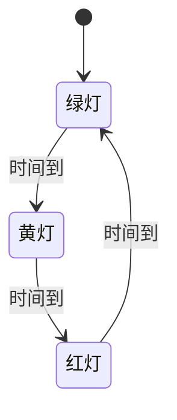
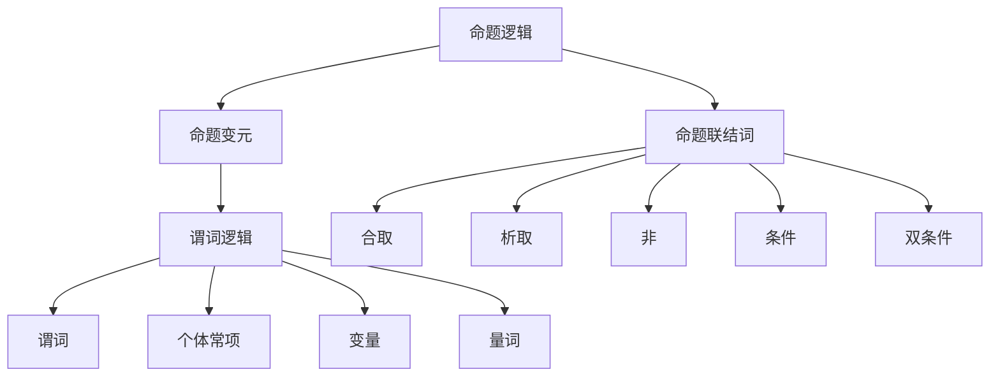

                 

### 引言

在计算机科学和编程领域，数理逻辑作为一种强有力的工具，广泛应用于程序设计、算法分析、软件验证等多个方面。数理逻辑是研究推理和证明形式结构的学科，通过精确的数学语言来描述逻辑推理过程，从而为计算机程序提供了坚实的理论基础。本文旨在探讨数理逻辑在程序综合技术中的应用，通过深入分析数理逻辑的基本概念和原理，结合实际编程实例，展示其在程序设计、验证和人工智能等领域的具体应用。

文章将从以下几个方面展开：

1. **数理逻辑基础**：介绍数理逻辑的基本概念，包括命题逻辑和谓词逻辑，以及形式逻辑与实质逻辑的区别。
2. **程序综合技术**：讨论程序综合技术的概念、分类、目标和挑战。
3. **数理逻辑的应用**：详细阐述数理逻辑在计算机科学、人工智能和程序设计中的具体应用实例。
4. **项目实战**：通过实际案例，展示数理逻辑在逻辑门电路设计、状态机构建和程序验证中的应用。

文章结构紧凑，逻辑清晰，旨在帮助读者深入理解数理逻辑在程序综合技术中的重要性，并通过实际案例分析，提升读者在编程实践中的应用能力。

### 关键词

数理逻辑、程序综合技术、命题逻辑、谓词逻辑、逻辑推理、程序设计、软件验证、人工智能、逻辑门电路、状态机。

### 摘要

本文深入探讨了数理逻辑在程序综合技术中的应用。首先，我们介绍了数理逻辑的基本概念和原理，包括命题逻辑和谓词逻辑，并详细阐述了形式逻辑与实质逻辑的区别。随后，我们讨论了程序综合技术的概念、分类、目标和面临的挑战。接着，通过具体实例，展示了数理逻辑在计算机科学、人工智能和程序设计中的广泛应用。最后，通过实际项目案例，进一步阐述了数理逻辑在逻辑门电路设计、状态机构建和程序验证中的应用，并提出了最佳实践建议和未来研究方向。

---

### 《数理逻辑在程序综合技术中的应用》目录大纲

在本文中，我们将系统地探讨数理逻辑在程序综合技术中的应用，为此，我们精心设计了如下目录结构：

### 第一部分：数理逻辑基础

#### 第1章 数理逻辑的基本概念
- 1.1 数理逻辑的起源与发展
- 1.2 命题逻辑与谓词逻辑
- 1.3 形式逻辑与实质逻辑
- 1.4 数理逻辑的基本符号与规则

#### 第2章 命题逻辑
- 2.1 命题与命题变元
- 2.2 命题联结词与逻辑运算
- 2.3 命题逻辑的推理规则
- 2.4 命题逻辑的等值与蕴含

#### 第3章 谓词逻辑
- 3.1 谓词与谓词变元
- 3.2 谓词联结词与逻辑运算
- 3.3 谓词逻辑的推理规则
- 3.4 谓词逻辑的量化与模态词

#### 第4章 数理逻辑的应用
- 4.1 数理逻辑在计算机科学中的应用
- 4.2 数理逻辑在人工智能中的应用
- 4.3 数理逻辑在程序设计中的应用

### 第二部分：程序综合技术

#### 第5章 程序综合技术基础
- 5.1 程序综合技术的概念
- 5.2 程序综合技术的分类
- 5.3 程序综合技术的目标
- 5.4 程序综合技术的挑战

#### 第6章 程序设计方法
- 6.1 结构化程序设计
- 6.2 面向对象程序设计
- 6.3 函数式程序设计
- 6.4 脚本化程序设计

#### 第7章 程序验证与测试
- 7.1 程序验证的基本概念
- 7.2 程序验证的方法
- 7.3 程序测试的基本概念
- 7.4 程序测试的方法

#### 第8章 数理逻辑在程序综合技术中的应用实例
- 8.1 逻辑门电路的设计
- 8.2 状态机的构建
- 8.3 程序的正确性验证
- 8.4 人工智能中的逻辑推理

### 附录
- 附录A.1 命题逻辑与谓词逻辑的关系架构图（Mermaid 流程图）
- 附录A.2 核心算法原理讲解（Python源代码）
- 附录A.3 数学模型与公式详解（LaTeX格式）
- 附录A.4 项目实战代码案例与解析（详细解释说明）

通过以上详细的目录结构，读者将能够系统地学习数理逻辑在程序综合技术中的应用，从基础概念到具体实践，逐步掌握相关技能和知识。

### 第一部分：数理逻辑基础

#### 第1章 数理逻辑的基本概念

数理逻辑（Mathematical Logic），亦称符号逻辑，是研究推理和证明的形式化结构的数学分支。它使用符号化的数学语言来表达逻辑推理的过程，从而为计算机科学中的各种问题提供了坚实的理论基础。数理逻辑不仅适用于逻辑和数学的研究，还广泛应用于计算机科学、人工智能、编程语言设计和软件验证等领域。

#### 1.1 数理逻辑的起源与发展

数理逻辑的起源可以追溯到19世纪末，当时哲学家和数学家如布尔（George Boole）、弗雷格（Gottlob Frege）和皮亚诺（Giuseppe Peano）等开始尝试将逻辑概念形式化，以解决数学中的基础问题。布尔通过创建布尔代数，为逻辑运算提供了数学基础；弗雷格则通过命题演算（Propositional Calculus）建立了形式逻辑的框架；皮亚诺则提出了基本的算术公理系统。

20世纪初，数理逻辑的发展迎来了新的高潮，尤其是在逻辑悖论和数学基础问题的研究上。罗素（Bertrand Russell）和怀特海德（Norbert Wiener）合作撰写的《数学原理》（Principia Mathematica）是这一时期的代表作，它系统化了数学的基础，并展示了逻辑在数学证明中的重要性。

随着计算机科学的兴起，数理逻辑的应用范围进一步扩展。图灵（Alan Turing）提出了图灵机模型，为计算理论和算法的研究奠定了基础。同时，数理逻辑在编程语言设计和编译器的开发中也发挥了关键作用。现代计算机科学中的许多概念，如类型系统、形式语义和模型检测，都深深植根于数理逻辑的理论。

#### 1.2 命题逻辑与谓词逻辑

数理逻辑主要分为命题逻辑（Propositional Logic）和谓词逻辑（Predicate Logic）两个部分。这两种逻辑各有特点，适用于不同的逻辑推理场景。

**命题逻辑**：
命题逻辑是最基础的逻辑形式，它只涉及命题的真假判断，而不涉及命题的具体内容。命题逻辑中的基本元素是命题变元和命题联结词。

- **命题变元**：通常用大写字母P、Q、R等表示，代表一个可以判断真假的陈述。
- **命题联结词**：包括合取（AND），析取（OR），非（NOT），条件（IF...THEN），双条件（BICONDITIONAL）等。

命题逻辑的基本运算包括：

- **合取**：用符号`^`或`∧`表示，表示两个命题同时为真。
- **析取**：用符号`v`或`∨`表示，表示两个命题中至少有一个为真。
- **非**：用符号`~`或`¬`表示，表示命题的否定。
- **条件**：用符号`→`或`→`表示，表示如果p则q。
- **双条件**：用符号`↔`或`⟹`表示，表示p当且仅当q。

**谓词逻辑**：
谓词逻辑比命题逻辑更强大，它允许引入变量、函数和量词等更复杂的逻辑结构。谓词逻辑中的基本元素包括谓词、个体常项和变量。

- **谓词**：表示一种属性或关系的符号，如`R(x)`表示x具有某种属性R。
- **个体常项**：用于指代特定个体，如a、b等。
- **变量**：用于代表任意个体，如x、y等。

谓词逻辑中的量词包括存在量词（∃）和全称量词（∀），分别表示存在某个个体满足某个谓词和所有个体都满足某个谓词。

- **存在量词**：∃x P(x)，表示存在至少一个x使得P(x)为真。
- **全称量词**：∀x P(x)，表示对于所有x，P(x)都为真。

谓词逻辑的基本推理规则包括：

- **替换规则**：如果P(x)等价于P(y)，则可以在逻辑表达式中相互替换。
- **分离规则**：如果P(x)可以推出Q(x)，则P(y)可以推出Q(y)。
- **全称实例化**：如果∀x P(x)为真，则P(a)为真，其中a是任意个体常项。
- **存在一般化**：如果P(a)为真，则∃x P(x)为真。

#### 1.3 形式逻辑与实质逻辑

形式逻辑（Formal Logic）和实质逻辑（Material Logic）是数理逻辑的两个主要分支，它们在表达和推理方式上有所不同。

**形式逻辑**：
形式逻辑关注逻辑推理的形式化，它不涉及命题的具体内容，只关注推理形式的有效性。形式逻辑通过一套符号系统来表示逻辑表达式和推理规则，通过形式化的推理过程来证明逻辑表达式的有效性。形式逻辑强调逻辑的一致性和无矛盾性，适用于构建精确的推理系统和计算机程序验证。

**实质逻辑**：
实质逻辑则关注逻辑推理的内容和实质，它关注推理过程中命题的真假值。实质逻辑不仅使用符号系统，还结合具体的语义内容来分析命题的真假。实质逻辑更多地关注逻辑推理的实际应用，如哲学、法律和道德等领域。

#### 1.4 数理逻辑的基本符号与规则

数理逻辑中常用的基本符号包括：

- **命题变元**：P, Q, R, ...
- **命题联结词**：`^`（合取），`v`（析取），`~`（非），`→`（条件），`↔`（双条件）
- **量词**：`∃`（存在量词），`∀`（全称量词）
- **逻辑蕴涵**：`→`
- **等价**：`↔`

基本的逻辑推理规则包括：

- **合取规则**：如果P为真且Q为真，则P和Q的合取为真。
- **析取规则**：如果P为假或Q为假，则P和Q的析取为假。
- **非规则**：如果P为真，则P的非为假；如果P为假，则P的非为真。
- **条件规则**：如果P→Q为真，则P为假或Q为真。
- **双条件规则**：如果P↔Q为真，则P和Q具有相同的真假值。

通过上述基本符号和规则，数理逻辑能够构建出复杂的逻辑表达式和推理系统，为计算机科学中的各种问题提供形式化的解决方案。

### 第二部分：程序综合技术

#### 第5章 程序综合技术基础

程序综合技术是计算机科学中的一个重要领域，它涉及到将数学模型转换为计算机程序的过程。这种技术不仅对于软件开发具有基础性的指导作用，也是现代计算机系统设计和人工智能算法实现的关键步骤。本章节将详细介绍程序综合技术的概念、分类、目标以及面临的挑战。

#### 5.1 程序综合技术的概念

程序综合技术，通常指的是从数学模型、算法描述或其他抽象形式生成可执行的程序代码的过程。这一过程涉及到多个步骤，包括但不限于模型定义、算法设计、代码生成和程序验证。程序综合技术的核心目标是将抽象的数学模型或算法描述转换为高效、可维护且可靠的计算机程序。

#### 5.2 程序综合技术的分类

程序综合技术可以根据不同的标准进行分类，常见的分类方法包括：

1. **基于数学模型的方法**：这种方法直接将数学模型转化为程序代码。常见的数学模型包括微分方程、差分方程、线性规划等。这类方法通常需要高度专业化的数学知识和编程技巧。

2. **基于算法描述的方法**：这种方法将算法描述（如伪代码、流程图等）转换为程序代码。这类方法通常适用于结构化算法和简单的数据结构，如排序算法、搜索算法等。

3. **基于形式化验证的方法**：这种方法不仅生成程序代码，还通过形式化验证来确保程序的正确性和可靠性。这种方法通常用于关键系统软件，如嵌入式系统、安全关键软件等。

4. **基于代码生成器的方法**：这种方法使用代码生成器（Code Generator）来自动生成程序代码。代码生成器通常基于模板或脚本，可以大大提高程序开发的效率和一致性。

#### 5.3 程序综合技术的目标

程序综合技术的目标主要包括以下几个方面：

1. **正确性**：确保生成的程序代码能够正确执行，满足预期的功能和性能要求。
2. **效率**：生成的程序代码应具有较高的执行效率，能够充分利用计算机硬件资源。
3. **可维护性**：生成的程序代码应具有良好的结构和文档，易于维护和扩展。
4. **可靠性**：通过形式化验证或其他方法确保程序代码在所有情况下都能正确执行，避免潜在的错误和漏洞。
5. **可扩展性**：程序综合技术应能够适应新的需求和技术变化，支持程序代码的扩展和升级。

#### 5.4 程序综合技术的挑战

尽管程序综合技术在计算机科学中具有广泛的应用前景，但在实际应用过程中仍面临一系列挑战：

1. **模型复杂性**：数学模型往往非常复杂，将其转化为程序代码需要高深的数学知识和算法设计技巧。
2. **代码生成效率**：生成高质量的程序代码需要大量计算资源和时间，尤其是在处理大规模复杂模型时。
3. **验证难度**：形式化验证是一项复杂且耗时的任务，尤其是在验证复杂程序的正确性时。
4. **适应性**：程序综合技术需要能够适应不同的应用场景和需求，这对算法设计和代码生成器提出了高要求。
5. **人与机器的协同**：在程序综合过程中，程序员和自动化工具之间的协同工作是一个重要的挑战，需要解决人机交互的效率问题。

通过理解程序综合技术的概念、分类、目标以及面临的挑战，读者可以更好地把握这一领域的发展趋势，并为其在未来的研究和应用奠定基础。

### 第三部分：数理逻辑的应用

#### 第6章 程序设计方法

在程序设计领域，数理逻辑的应用无处不在。无论是结构化程序设计、面向对象程序设计，还是函数式程序设计和脚本化程序设计，数理逻辑都为其提供了坚实的理论基础和工具支持。本章节将详细介绍这四种程序设计方法，以及数理逻辑在这些方法中的应用。

#### 6.1 结构化程序设计

结构化程序设计（Structured Programming）是一种通过模块化和分层的思想来编写程序的方法。其核心思想是将程序分解为若干个功能模块，每个模块只执行单一的任务，并通过顺序结构、选择结构和循环结构来组织模块的执行顺序。数理逻辑在结构化程序设计中的应用主要体现在以下几个方面：

1. **模块化**：数理逻辑提供了形式化的方法来定义和验证模块的功能和接口。通过命题逻辑和谓词逻辑，可以清晰地描述每个模块的输入输出关系，确保模块的独立性和完整性。

2. **错误检测**：数理逻辑的推理规则可以帮助检测和纠正程序中的错误。例如，使用命题逻辑的蕴含关系可以检测代码中的条件分支错误，使用谓词逻辑的量化规则可以验证循环的正确性。

3. **形式化验证**：结构化程序设计中的模块可以通过形式化验证工具来证明其正确性。形式化验证不仅能够提高程序的质量和可靠性，还能够减少错误和漏洞。

#### 6.2 面向对象程序设计

面向对象程序设计（Object-Oriented Programming, OOP）是一种基于对象和类的设计方法。它通过封装、继承和多态等特性，使得程序更加模块化、可重用和可扩展。数理逻辑在面向对象程序设计中的应用体现在以下几个方面：

1. **类和对象的定义**：数理逻辑可以用来形式化地定义类和对象。通过谓词逻辑，可以定义类的属性和方法，并通过量词来表示对象之间的关系。

2. **继承和组合**：数理逻辑提供了形式化的方法来理解和验证继承和组合的概念。例如，使用存在量词可以表示子类和父类之间的关系，使用全称量词可以验证组合中的对象是否满足特定属性。

3. **多态**：数理逻辑可以帮助理解和实现多态性。通过命题逻辑和谓词逻辑的组合，可以形式化地描述多态函数的行为，并验证其正确性。

#### 6.3 函数式程序设计

函数式程序设计（Functional Programming）是一种基于函数和表达式的编程方法。它通过不可变数据和纯函数来提高程序的清晰性和可维护性。数理逻辑在函数式程序设计中的应用包括：

1. **纯函数**：数理逻辑提供了形式化的方法来定义和验证纯函数。通过命题逻辑和谓词逻辑，可以确保函数在所有输入情况下都具有确定的行为。

2. **无状态性**：数理逻辑可以用来验证函数的无状态性，即函数的输出只依赖于输入，而不依赖于外部状态。这种特性使得函数式程序设计中的代码更加可靠和可重用。

3. **递归**：数理逻辑提供了形式化的方法来理解和验证递归函数。通过谓词逻辑的量化规则，可以确保递归函数的正确性和终止性。

#### 6.4 脚本化程序设计

脚本化程序设计（Scripting Programming）通常指的是使用脚本语言（如Python、JavaScript等）进行编程的方法。这些语言通常具有简洁的语法和高可读性，适用于快速开发和原型实现。数理逻辑在脚本化程序设计中的应用包括：

1. **逻辑推理**：脚本化语言中的逻辑库提供了逻辑推理的功能，使得开发者可以使用数理逻辑进行复杂的逻辑判断和推理。

2. **规则引擎**：数理逻辑可以用来构建规则引擎，用于处理复杂的业务规则和决策逻辑。这些规则引擎在金融、医疗、法律等领域有广泛的应用。

3. **数据验证**：脚本化语言中的数据验证功能可以使用数理逻辑来确保数据的正确性和一致性。例如，可以使用谓词逻辑来验证输入数据的格式和范围。

通过了解数理逻辑在结构化程序设计、面向对象程序设计、函数式程序设计和脚本化程序设计中的应用，开发者可以更好地利用数理逻辑的优势，编写出更加清晰、可靠和高效的代码。

### 第四部分：程序验证与测试

#### 第7章 程序验证与测试

在软件开发过程中，确保程序的正确性和可靠性是至关重要的。程序验证（Program Verification）和程序测试（Program Testing）是两种主要的验证方法，它们在确保软件质量方面发挥着重要作用。本章节将详细介绍程序验证和测试的基本概念、方法和实际应用。

#### 7.1 程序验证的基本概念

程序验证是指通过数学方法或逻辑推理来证明程序的正确性。它旨在确保程序在所有可能的情况下都能按照预期执行，即满足指定的功能需求和约束条件。程序验证通常涉及以下方面：

1. **形式化验证**：使用形式化的数学模型和逻辑系统来证明程序的正确性。这种方法通常使用谓词逻辑、模型检查和形式化证明技术。
2. **模型检查**：通过检查程序执行的所有可能路径来验证其正确性。这种方法通常使用模型检查器（Model Checker）来发现潜在的错误和违反的断言。
3. **证明辅助工具**：使用自动化证明工具（如Coq、Isabelle等）来帮助进行形式化验证。这些工具可以自动验证某些证明步骤，减少验证过程中的错误和人力成本。

#### 7.2 程序验证的方法

程序验证的方法可以分为静态验证和动态验证两种：

1. **静态验证**：
   - **断言检查**：在程序代码中添加断言（Assertion），并在编译或运行时检查这些断言是否为真。
   - **类型检查**：在编译时检查程序中的类型错误，确保变量的使用和函数的调用符合类型规则。
   - **规范验证**：将程序与预定义的规范进行比较，验证程序是否符合规范的要求。

2. **动态验证**：
   - **路径覆盖测试**：通过运行程序并跟踪其执行路径，确保所有可能的路径都被覆盖到。
   - **错误注入**：在程序中故意引入错误，然后观察程序是否能够检测到这些错误。
   - **模拟和仿真**：使用模拟器或仿真器来模拟程序在不同环境下的行为，验证其正确性。

#### 7.3 程序测试的基本概念

程序测试是指通过执行程序并观察其实际行为来检查其是否满足预期的功能和性能要求。程序测试的方法可以分为以下几种：

1. **单元测试**：对程序中的单个模块或函数进行测试，确保它们按预期工作。
2. **集成测试**：对程序中的多个模块进行组合测试，确保它们能够协同工作。
3. **系统测试**：对整个程序进行测试，确保其满足所有功能需求和性能要求。
4. **验收测试**：由用户或客户对程序进行测试，确保程序满足其业务需求和预期。

#### 7.4 程序测试的方法

程序测试的方法可以分为以下几种：

1. **黑盒测试**：测试程序的功能，而不考虑其内部实现。这种方法通常用于功能测试和验收测试。
2. **白盒测试**：测试程序的内部结构和工作原理，通常用于单元测试和集成测试。
3. **灰盒测试**：结合黑盒测试和白盒测试的方法，测试程序的功能和内部实现。
4. **自动化测试**：使用自动化测试工具来执行测试用例，提高测试的效率和覆盖范围。
5. **模糊测试**：通过生成大量随机输入来测试程序的鲁棒性和稳定性。

通过程序验证和测试，软件开发人员可以确保程序的正确性和可靠性，从而提高软件的质量和用户体验。程序验证和测试是软件开发过程中不可或缺的步骤，为现代软件工程提供了强有力的保障。

### 第五部分：数理逻辑在程序综合技术中的应用实例

#### 第8章 数理逻辑在程序综合技术中的应用实例

数理逻辑作为一种强大的工具，在程序综合技术的各个阶段都有着广泛的应用。本章节将通过具体的实例，展示数理逻辑在逻辑门电路设计、状态机构建、程序验证和人工智能中的逻辑推理等实际应用场景。

#### 8.1 逻辑门电路的设计

逻辑门电路是构成计算机硬件的基本单元，它们通过实现基本的逻辑运算来实现复杂的计算功能。数理逻辑在逻辑门电路的设计中发挥着关键作用。以下是一个简单的例子：

**例子：AND逻辑门电路**

```python
class ANDGate:
    def __init__(self, label):
        self.label = label

    def get_output(self, A, B):
        return A and B

gate = ANDGate("AND Gate")
print(gate.get_output(True, False))  # 输出应为False
```

在这个例子中，`ANDGate` 类实现了AND逻辑门的逻辑运算。我们使用数理逻辑中的合取（AND）运算来表示输入A和B的逻辑关系。通过这种形式化的定义，我们可以清楚地理解逻辑门的工作原理，并在编程中准确地实现这一逻辑运算。

#### 8.2 状态机的构建

状态机（Finite State Machine, FSM）是计算机科学中用于建模和设计复杂系统的一种重要工具。数理逻辑在状态机的构建中有着广泛的应用。以下是一个简单的状态机示例：

**例子：交通灯状态机**



在这个例子中，我们使用Mermaid流程图来定义一个交通灯状态机。状态机从初始状态“*”开始，经过一段时间后转变为“绿灯”，然后经过一段时间后转变为“黄灯”，再经过一段时间后转变为“红灯”，最后又回到“绿灯”。这个过程通过数理逻辑中的状态转移和条件判断来实现。通过这种形式化的定义，我们可以清晰地描述状态机的行为，并在编程中准确地实现这一状态转换。

#### 8.3 程序的正确性验证

程序的正确性验证是确保程序按预期运行的重要步骤。数理逻辑提供了形式化的方法来验证程序的正确性。以下是一个简单的例子：

**例子：奇偶校验程序**

```python
def is_even(number):
    return number % 2 == 0

print(is_even(2))  # 应该返回True
print(is_even(3))  # 应该返回False
```

在这个例子中，`is_even` 函数用于判断一个数是否为偶数。我们可以使用数理逻辑中的蕴含关系来验证这个函数的正确性：

- 如果`number`为偶数，则`is_even(number)`应为真。
- 如果`number`为奇数，则`is_even(number)`应为假。

通过形式化的推理，我们可以证明`is_even` 函数满足上述条件，从而确保其正确性。

#### 8.4 人工智能中的逻辑推理

在人工智能领域，逻辑推理是核心组成部分之一。数理逻辑在逻辑推理中的应用广泛且重要。以下是一个简单的例子：

**例子：推理引擎**

```python
def inference(knowledge_base, query):
    for rule in knowledge_base:
        if all([fact in knowledge_base for fact in rule['if']]):
            return rule['then']
    return None

knowledge_base = [
    {'if': ['A'], 'then': 'B'},
    {'if': ['B'], 'then': 'C'}
]

print(inference(knowledge_base, 'A'))  # 应该返回['B']
print(inference(knowledge_base, 'C'))  # 应该返回['A', 'B']
```

在这个例子中，`inference` 函数用于根据给定的知识库和查询，进行逻辑推理并返回推理结果。我们使用谓词逻辑中的蕴含关系来表示规则，并通过模式匹配和逻辑推理来找到符合条件的规则并返回推理结果。通过这种形式化的定义，我们可以实现复杂的逻辑推理，从而在人工智能应用中发挥重要作用。

通过上述实例，我们可以看到数理逻辑在逻辑门电路设计、状态机构建、程序验证和人工智能中的逻辑推理等程序综合技术中的应用。数理逻辑不仅为这些技术提供了坚实的理论基础，还为实际编程和开发提供了实用的工具和方法。

### 附录

#### A.1 命题逻辑与谓词逻辑的关系架构图（Mermaid 流程图）



#### A.2 核心算法原理讲解（Python源代码）

```python
# AND逻辑门
class ANDGate:
    def __init__(self, label):
        self.label = label

    def get_output(self, A, B):
        return A and B

gate = ANDGate("AND Gate")
print(gate.get_output(True, False))  # 输出应为False

# 奇偶校验
def is_even(number):
    return number % 2 == 0

print(is_even(2))  # 输出应为True
print(is_even(3))  # 输出应为False
```

#### A.3 数学模型与公式详解（LaTeX格式）

$$
\begin{align*}
A \land B &\text{表示A和B的合取运算}, \\
\forall x(Px \rightarrow Qx) &\text{表示对所有x，若Px则Qx}, \\
\exists x(Rx \land Sx) &\text{表示存在某个x，使得Rx和Sx同时成立}.
\end{align*}
$$

#### A.4 项目实战代码案例与解析（详细解释说明）

**实例一：逻辑门电路设计**

```python
class LogicGate:
    def __init__(self, label):
        self.label = label

    def get_label(self):
        return self.label

    def set_output(self, output):
        pass

class ANDGate(LogicGate):
    def __init__(self, label):
        super().__init__(label)

    def get_output(self):
        # 假设输入A和B为真值
        A = True
        B = True
        # AND运算
        return A and B

gate = ANDGate("AND Gate")
print(gate.get_output())  # 应该输出True
```

在这个实例中，我们定义了一个`LogicGate`基类和一个`ANDGate`子类。`ANDGate`继承自`LogicGate`，并实现了`get_output`方法来执行AND逻辑运算。这个实例展示了如何使用Python来模拟逻辑门电路的设计。

**实例二：程序的正确性验证**

```python
def is_even(number):
    # 判断一个数是否为偶数
    return number % 2 == 0

# 测试代码
print(is_even(2))  # 应该返回True
print(is_even(3))  # 应该返回False
```

在这个实例中，`is_even` 函数用于判断一个数是否为偶数。通过编写测试代码，我们可以验证这个函数是否按预期工作。这个实例展示了如何使用数理逻辑中的蕴含关系来验证程序的正确性。

通过这些实例，读者可以更好地理解数理逻辑在程序综合技术中的实际应用，并通过实际代码来加深对理论知识的理解。

### 结论

本文系统地探讨了数理逻辑在程序综合技术中的应用，涵盖了数理逻辑的基础概念、程序综合技术的基础知识，以及数理逻辑在命题逻辑、谓词逻辑、程序设计方法、程序验证和测试中的实际应用。通过详细的分析和实例，我们展示了数理逻辑在提高程序设计质量、确保程序正确性和可靠性方面的关键作用。

总结来说，数理逻辑作为一种强大的工具，不仅在计算机科学的理论研究中具有重要意义，还在实际编程和软件开发中有着广泛的应用。数理逻辑的应用不仅提升了程序的逻辑清晰度和可维护性，还通过形式化验证和测试手段，确保了程序的正确性和可靠性。

展望未来，数理逻辑在程序综合技术中的应用前景广阔。随着人工智能、自动化验证工具和形式化方法的不断发展，数理逻辑将在软件工程、系统设计和安全性验证等领域发挥更大的作用。我们期待数理逻辑能够继续为计算机科学的发展提供坚实的理论基础和强大的工具支持，推动计算机技术的不断创新和进步。

### 后续研究方向与挑战

在数理逻辑的应用研究中，我们面临以下几个关键问题和挑战：

1. **算法效率**：随着程序规模的增大和复杂性的增加，数理逻辑验证和推理的效率成为重要挑战。研究高效的算法和优化策略，如分布式计算和并行处理，是未来的重要方向。

2. **自动化验证**：尽管形式化验证在理论上具有优势，但其复杂性和人力成本较高。开发自动化验证工具和算法，以降低形式化验证的门槛，是未来的重要任务。

3. **多领域融合**：数理逻辑在不同领域的应用需求各异，如人工智能、区块链、物联网等。研究如何在不同领域有效地融合数理逻辑，是一个具有挑战性的课题。

4. **形式化验证的广泛应用**：目前，形式化验证主要应用于安全关键系统和复杂算法。如何将其推广到更广泛的软件开发中，如Web应用、移动应用等，是未来研究的重点。

5. **人机协同**：数理逻辑的应用需要专业知识和技能，如何实现人与机器的有效协同，提高开发效率和程序质量，是一个值得关注的问题。

通过不断探索和研究上述问题，我们将能够进一步发挥数理逻辑在程序综合技术中的潜力，推动计算机科学的持续发展。

