                 

以下是根据您提供的文章标题和目录大纲，逐步撰写文章的具体步骤：

## 第一部分：引言

### 1.1 数理逻辑概述

在这一部分，我们将简要介绍数理逻辑的基本概念和术语。以下是一些关键的步骤：

**1.1.1 命题与命题公式**

- 定义命题和命题公式。
- 解释命题联结词（如与、或、非、蕴含等）。

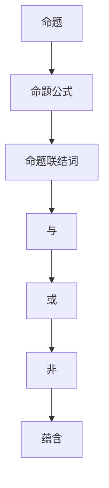

**1.1.2 域与解释**

- 介绍域的概念。
- 解释如何对命题公式进行解释。

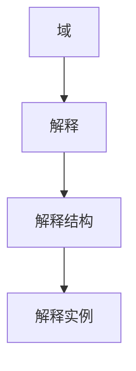

**1.1.3 蕴含与等价**

- 讨论蕴含和等价的概念。
- 给出蕴含和等价的性质。

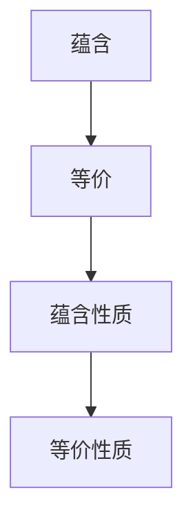

### 1.2 自动定理证明

在这一部分，我们将讨论自动定理证明的基本概念和历史背景。以下是具体的步骤：

**1.2.1 自动定理证明的定义**

- 提供自动定理证明（ATP）的定义。

```python
def auto_theorem_proving():
    """
    自动定理证明（ATP）的定义
    """
    return "自动定理证明是利用计算机程序来证明数学定理的过程。"
```

**1.2.2 ATP的发展与应用**

- 简述自动定理证明的发展历程。
- 讨论自动定理证明的应用领域。

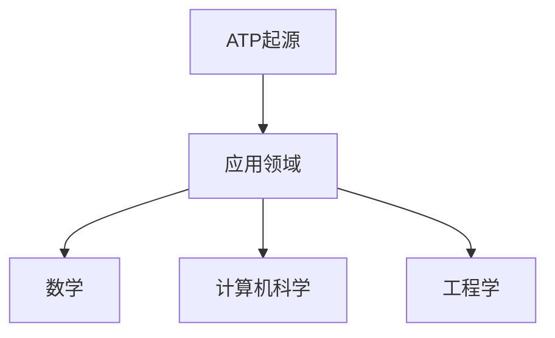

**1.2.3 ATP的重要性**

- 探讨自动定理证明的重要性。

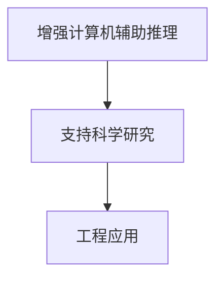

## 第二部分：数理逻辑基础

### 2.1 命题逻辑

在这一部分，我们将深入探讨命题逻辑的基本概念和推理规则。以下是具体的步骤：

**2.1.1 基本公式与推理规则**

- 讨论命题逻辑的基本公式和推理规则。

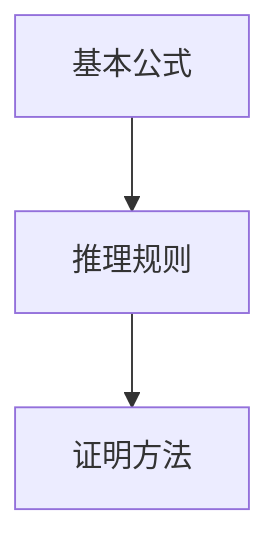

**2.1.2 证明方法**

- 介绍几种常见的证明方法，如直接证明、反证法和归纳证明。

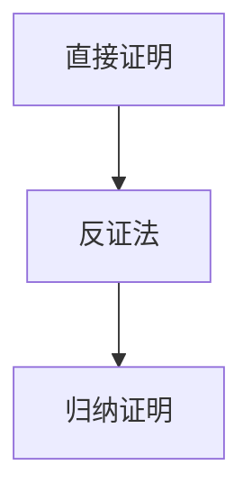

### 2.2 谓词逻辑

在这一部分，我们将探讨谓词逻辑的基本概念和推理规则。以下是具体的步骤：

**2.2.1 谓词与量词**

- 介绍谓词和量词的概念。

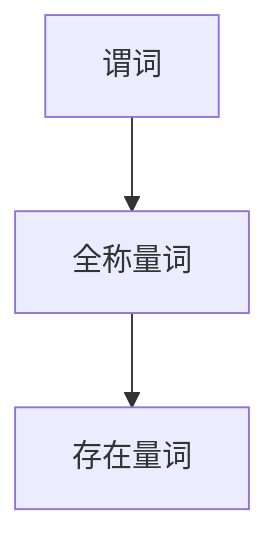

**2.2.2 谓词逻辑公式与推理**

- 讨论谓词逻辑公式的基本性质和推理规则。

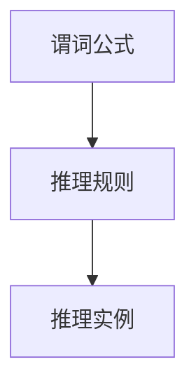

### 2.3 模式逻辑

在这一部分，我们将探讨模式逻辑的基本概念和推理规则。以下是具体的步骤：

**2.3.1 模式与变元**

- 介绍模式的概念和变元的引入。

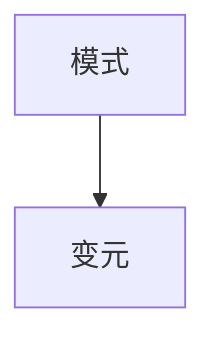

**2.3.2 模式逻辑公式与推理**

- 讨论模式逻辑公式的基本性质和推理方法。

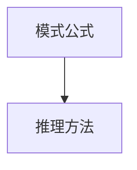

## 第三部分：自动定理证明算法

### 3.1 Resolution算法

在这一部分，我们将深入探讨Resolution算法的基本原理和实现。以下是具体的步骤：

**3.1.1 基本原理**

- 解释Resolution算法的基本原理。

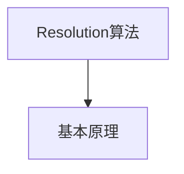

**3.1.2 应用与改进**

- 讨论Resolution算法的应用领域和优化方法。

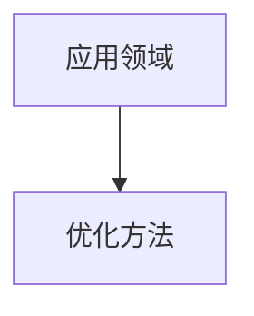

### 3.2 SAT求解器

在这一部分，我们将深入探讨SAT求解器的基本原理和实现。以下是具体的步骤：

**3.2.1 基本原理**

- 解释SAT求解器的基本原理。

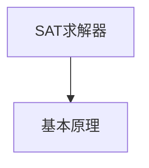

**3.2.2 应用与优化**

- 讨论SAT求解器的应用领域和优化策略。

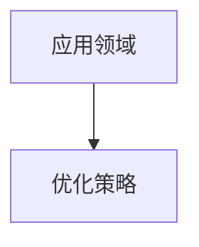

### 3.3 Model Checking

在这一部分，我们将深入探讨Model Checking的基本概念和实现。以下是具体的步骤：

**3.3.1 基本概念**

- 解释Model Checking的基本概念。

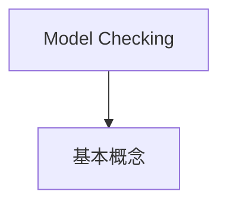

**3.3.2 实现与应用**

- 讨论Model Checking算法的实现和应用。

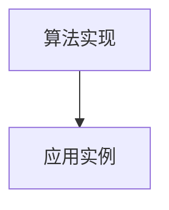

## 第四部分：数理逻辑与自动定理证明的结合

### 4.1 自动定理证明系统的构建

在这一部分，我们将探讨如何构建自动定理证明系统。以下是具体的步骤：

**4.1.1 构建方法**

- 讨论自动定理证明系统的构建方法。

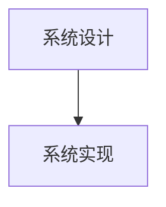

**4.1.2 应用案例**

- 讨论自动定理证明系统在不同领域的应用案例。

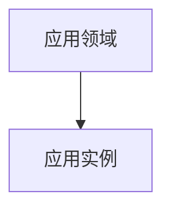

### 4.2 数理逻辑在ATP中的应用

在这一部分，我们将探讨数理逻辑在自动定理证明中的应用。以下是具体的步骤：

**4.2.1 命题逻辑的应用**

- 讨论命题逻辑在自动定理证明中的应用。

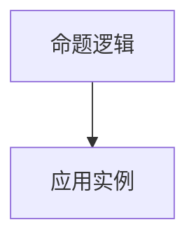

**4.2.2 谓词逻辑的应用**

- 讨论谓词逻辑在自动定理证明中的应用。

```mermaid
graph TD
A[谓词逻辑] --> B[应用实例]
```

**4.2.3 模式逻辑的应用**

- 讨论模式逻辑在自动定理证明中的应用。

```mermaid
graph TD
A[模式逻辑] --> B[应用实例]
```

## 第五部分：展望与未来

### 5.1 自动定理证明的发展趋势

在这一部分，我们将探讨自动定理证明的发展趋势。以下是具体的步骤：

**5.1.1 新算法与技术的出现**

- 讨论新算法和技术的发展趋势。

```mermaid
graph TD
A[新算法] --> B[新技术]
```

**5.1.2 应用领域的扩展**

- 讨论自动定理证明应用领域的扩展。

```mermaid
graph TD
A[应用领域] --> B[扩展实例]
```

### 5.2 数理逻辑的研究方向

在这一部分，我们将探讨数理逻辑的研究方向。以下是具体的步骤：

**5.2.1 新的逻辑体系**

- 讨论新逻辑体系的研究方向。

```mermaid
graph TD
A[新逻辑体系] --> B[研究方向]
```

**5.2.2 逻辑与计算机科学的融合**

- 讨论逻辑与计算机科学的融合趋势。

```mermaid
graph TD
A[逻辑与计算机科学] --> B[融合趋势]
```

## 附录

### 5.3 参考文献

在这一部分，我们将列出相关的参考文献。以下是具体的步骤：

**5.3.1 相关书籍与论文推荐**

- 列出推荐的相关书籍和论文。

```mermaid
graph TD
A[书籍推荐] --> B[论文推荐]
```

**5.3.2 自动定理证明系统列表**

- 列出主要的自动定理证明系统。

```mermaid
graph TD
A[ATP系统1] --> B[ATP系统2]
B --> C[ATP系统3]
C --> D[ATP系统4]
```

以上就是数理逻辑在自动定理证明中的应用的详细撰写步骤。每个部分都按照逻辑清晰、结构紧凑、简单易懂的原则进行了规划和设计。接下来，我们将逐步完成每个部分的撰写。准备好了吗？让我们开始吧！

### 1.1 数理逻辑概述

在数学和计算机科学中，数理逻辑作为一种形式化的语言工具，为我们提供了一种精确描述和分析数学陈述和推理过程的方法。这一部分将详细探讨数理逻辑的基本概念和术语，包括命题与命题公式、域与解释、蕴含与等价等。

#### 1.1.1 命题与命题公式

命题是指可以判断真假的陈述。在数理逻辑中，命题通常用大写字母（如P、Q、R等）来表示。命题公式（也称为逻辑公式或命题公式）是由命题变量、逻辑联结词和括号等构成的符号串。逻辑联结词包括逻辑与（∧）、逻辑或（∨）、逻辑非（¬）、蕴含（→）和等价（↔）等。

例如，以下是一个命题公式：
$$
(P ∧ Q) → R
$$
在这个公式中，P、Q和R是命题变量，∧、→是逻辑联结词。

#### 1.1.2 域与解释

域是指命题公式中的所有命题变量的取值集合。在数理逻辑中，一个命题公式的解释是指对命题变量赋予真值的过程。一个解释可以用一个真值函数来表示，该函数将域中的每个命题变量映射到真值集合{真，假}。

例如，对于命题公式P ∧ Q，我们可以给出如下的解释：
$$
\begin{array}{c|c|c}
P & Q & P ∧ Q \\
\hline
真 & 真与 & 真 \\
真 & 假 & 假 \\
假 & 真与 & 假 \\
假 & 假 & 假 \\
\end{array}
$$
在这个解释中，真值函数将P和Q分别映射到真和假，进而得到P ∧ Q的真值。

#### 1.1.3 蕴含与等价

蕴含（→）是一种逻辑关系，表示如果一个命题为真，则另一个命题也必须为真。例如，P → Q可以解释为“如果P，则Q”。

等价（↔）是另一种逻辑关系，表示两个命题具有相同的真值。P ↔ Q可以解释为“P当且仅当Q”。

蕴含和等价的真值表如下：
$$
\begin{array}{c|c|c|c|c}
P & Q & P → Q & P ↔ Q \\
\hline
真 & 真与 & 真 & 真 \\
真 & 假 & 假 & 假 \\
假 & 真与 & 真 & 假 \\
假 & 假 & 真 & 假 \\
\end{array}
$$
通过这个真值表，我们可以看到P → Q在P为假时总是为真，而P ↔ Q在P和Q的真值不相同时为假。

#### 1.1.4 逻辑等价式

逻辑等价式是两个命题公式在所有可能的解释下具有相同真值的性质。常见的逻辑等价式包括德摩根定律、交换律、结合律和分配律等。

例如，德摩根定律表明：
$$
¬(P ∧ Q) ≡ (¬P) ∨ (¬Q)
$$
这意味着，一个命题的非与另一个命题的非的或，与这两个命题的或的非是等价的。

#### 1.1.5 形式证明

形式证明是使用逻辑规则从已知命题推导出新命题的过程。形式证明通常遵循以下步骤：

1. **前提**：给出一个或多个已知命题。
2. **假设**：在一个或多个步骤中引入一个假设。
3. **推理**：使用逻辑规则和前提或假设进行推理。
4. **结论**：得出新的命题。

形式证明通常使用形式逻辑系统来表示，例如自然演绎系统或表格式系统。

### 1.2 自动定理证明

自动定理证明（ATP）是计算机科学中一个重要的研究领域，它涉及到使用计算机程序自动证明数学定理。ATP的发展可以追溯到20世纪50年代，随着计算机技术的进步，ATP系统在数学、计算机科学和工程等领域得到了广泛应用。

#### 1.2.1 自动定理证明的定义

自动定理证明是指使用计算机程序来证明数学定理的过程。这些程序通常基于数理逻辑和自动推理技术，能够处理复杂的数学证明问题。

#### 1.2.2 ATP的发展与应用

自动定理证明的发展经历了几个重要阶段：

1. **早期尝试**：20世纪50年代，数学家和计算机科学家开始尝试使用计算机程序来证明数学定理。
2. **形式化公理化系统**：20世纪60年代，形式化公理化系统如Tarski-Grothendieck系统被提出，为ATP提供了理论基础。
3. **自动推理系统**：20世纪70年代，自动推理系统如OTTER和GRINGO开始被开发，这些系统能够处理更复杂的数学问题。
4. **现代ATP系统**：现代ATP系统如COLORE、ELF和MATHEMATICA等，不仅能够处理复杂的数学问题，还能够在不同领域得到广泛应用。

自动定理证明的应用领域包括：

1. **数学**：ATP系统在数学领域中用于证明定理、验证数学模型的正确性等。
2. **计算机科学**：ATP系统在计算机科学中用于验证程序的正确性、构建形式化的证明等。
3. **工程学**：ATP系统在工程学中用于验证系统模型的正确性、优化设计等。

#### 1.2.3 ATP的重要性

自动定理证明的重要性体现在以下几个方面：

1. **增强计算机辅助推理**：ATP系统能够处理复杂的数学证明问题，为数学家、计算机科学家和工程师提供了强大的辅助工具。
2. **支持科学研究**：ATP系统可以帮助科学家验证理论、发现新的定理等，从而推动科学研究的进展。
3. **工程应用**：ATP系统在工程学中用于验证系统模型的正确性，确保设计的安全性和可靠性。

总之，数理逻辑和自动定理证明在数学、计算机科学和工程等领域具有重要的应用价值，它们的发展为我们提供了一种精确、高效的方法来处理复杂的推理和证明问题。在接下来的部分中，我们将进一步探讨数理逻辑的基础概念和自动定理证明算法，以更深入地理解这一领域的知识。

### 2.1 命题逻辑

命题逻辑是数理逻辑的一个基本分支，它主要研究命题及其之间的逻辑关系。命题逻辑提供了形式化的方法来描述和推理命题，是构造更复杂逻辑系统的基础。

#### 2.1.1 基本公式与推理规则

命题逻辑的基本公式由命题变量、逻辑联结词和括号组成。以下是几种常见的逻辑联结词和它们的基本公式：

1. **逻辑与（∧）**：
   - 符号表示：\(P ∧ Q\)
   - 真值表：
     $$
     \begin{array}{c|c|c}
     P & Q & P ∧ Q \\
     \hline
     真 & 真与 & 真 \\
     真 & 假 & 假 \\
     假 & 真与 & 假 \\
     假 & 假 & 假 \\
     \end{array}
     $$

2. **逻辑或（∨）**：
   - 符号表示：\(P ∨ Q\)
   - 真值表：
     $$
     \begin{array}{c|c|c}
     P & Q & P ∨ Q \\
     \hline
     真 & 真与 & 真 \\
     真 & 假 & 真 \\
     假 & 真与 & 真 \\
     假 & 假 & 假 \\
     \end{array}
     $$

3. **逻辑非（¬）**：
   - 符号表示：\(¬P\)
   - 真值表：
     $$
     \begin{array}{c|c}
     P & ¬P \\
     \hline
     真 & 假 \\
     假 & 真 \\
     \end{array}
     $$

4. **蕴含（→）**：
   - 符号表示：\(P → Q\)
   - 真值表：
     $$
     \begin{array}{c|c|c}
     P & Q & P → Q \\
     \hline
     真 & 真与 & 真 \\
     真 & 假 & 假 \\
     假 & 真与 & 真 \\
     假 & 假 & 真 \\
     \end{array}
     $$

5. **等价（↔）**：
   - 符号表示：\(P ↔ Q\)
   - 真值表：
     $$
     \begin{array}{c|c|c}
     P & Q & P ↔ Q \\
     \hline
     真 & 真与 & 真 \\
     真 & 假 & 假 \\
     假 & 真与 & 假 \\
     假 & 假 & 真 \\
     \end{array}
     $$

这些基本公式构成了命题逻辑的基础，而推理规则则是从已知命题推导出新命题的工具。常见的推理规则包括：

1. **假言推理（Modus Ponens）**：
   - 形式：如果\(P → Q\)且P为真，则Q也为真。

2. **反证法（Modus Tollens）**：
   - 形式：如果\(P → Q\)且Q为假，则P也为假。

3. **合取推理（Simplification）**：
   - 形式：如果\(P ∧ Q\)为真，则P也为真。

4. **析取推理（Addition）**：
   - 形式：如果P为真，则\(P ∨ Q\)也为真。

5. **归谬推理（Reductio Ad Absurdum）**：
   - 形式：假设P为真会导致矛盾，因此P为假。

#### 2.1.2 证明方法

命题逻辑的证明通常采用形式化的方法，如自然演绎系统或表格式系统。以下是一些常见的证明方法：

1. **直接证明**：
   - 方法：通过一系列逻辑推理步骤，从已知命题推导出目标命题。
   - 例子：证明\(P ∧ Q → R\)，已知\(P → R\)和\(Q → R\)。

2. **反证法**：
   - 方法：假设目标命题为假，然后推导出一个矛盾，从而证明目标命题为真。
   - 例子：证明\(P ∨ Q\)，假设\(¬(P ∨ Q)\)，推导出矛盾。

3. **归纳证明**：
   - 方法：首先证明一个基例成立，然后证明如果某个命题对某个自然数n成立，则它对n+1也成立。
   - 例子：证明对所有自然数n，\(1 + 2 + ... + n = \frac{n(n+1)}{2}\)。

这些证明方法不仅适用于命题逻辑，也是其他形式逻辑系统的基础。

通过以上对命题逻辑的基本公式和推理规则的讨论，我们可以看到命题逻辑作为数理逻辑的一个基础分支，为更复杂的推理和证明提供了坚实的基础。在接下来的部分，我们将进一步探讨谓词逻辑，它将在命题逻辑的基础上引入量词和更复杂的结构，以处理更广泛的问题。

### 2.2 谓词逻辑

谓词逻辑是数理逻辑中的一个重要分支，它引入了谓词和量词的概念，使得逻辑表达式能够描述更复杂的关系和性质。谓词逻辑在形式化数学、自动定理证明、计算机科学等领域有广泛的应用。

#### 2.2.1 谓词与量词

**谓词（Predicate）** 是一个表示关系的表达式，它可以带有参数。谓词用于描述对象之间的性质或关系。例如，我们可以定义一个谓词“P(x)”表示“x是一个素数”。

**全称量词（Universal Quantifier）** 用符号“∀”表示，表示对于某个集合中的所有元素都满足某个性质。例如，“∀x P(x)”表示对于所有的x，P(x)都为真。

**存在量词（Existential Quantifier）** 用符号“∃”表示，表示在某个集合中至少存在一个元素满足某个性质。例如，“∃x P(x)”表示存在至少一个x使得P(x)为真。

**谓词公式（Predicate Formula）** 是由谓词、量词、逻辑联结词和括号组成的表达式。谓词公式可以描述更复杂的数学性质和关系。

#### 2.2.2 谓词逻辑公式与推理

谓词逻辑公式的基本性质包括：

1. **自由变量**：谓词公式中的变量如果没有被量词绑定，称为自由变量。
2. **闭包**：通过量词绑定自由变量，可以将谓词公式转换为不含有自由变量的闭包公式。
3. **范式**：谓词逻辑公式可以通过变形转换为范式，如合取范式（Conjunctive Normal Form, CNF）或析取范式（Disjunctive Normal Form, DNF）。

谓词逻辑的推理规则包括：

1. **全称实例化（Universal Instantiation）**：如果“∀x P(x)”为真，则“P(a)”对于任意的个体a都为真。
2. **存在实例化（Existential Instantiation）**：如果“∃x P(x)”为真，则存在一个个体a使得“P(a)”为真。
3. **全称通用（Universal Generalization）**：如果“P(a)”为真，则“∀x P(x)”也为真。
4. **存在通用（Existential Generalization）**：如果“∃x P(x)”为真，则“∃x P(x) ∧ Q(x)”也为真，其中Q(x)是与P(x)无关的谓词公式。

**谓词逻辑推理实例**：

假设我们有以下事实：

1. \(∀x (P(x) → Q(x))\)
2. \(∃x R(x)\)
3. \(R(a) → ¬P(a)\)

我们需要证明：\(∃x (Q(x) ∧ ¬P(x))\)

证明过程：

1. 从事实1，我们可以实例化得到\(P(b) → Q(b)\)（其中b是任意的个体）。
2. 从事实2，我们可以存在实例化得到\(R(a)\)（其中a是满足\(∃x R(x)\)的个体）。
3. 从事实3，我们可以得到\(R(a) → ¬P(a)\)。
4. 结合步骤1和3，我们可以使用假言推理得到\(¬P(a)\)。
5. 结合步骤2和4，我们可以使用合取推理得到\(Q(b) ∧ ¬P(a)\)。

因此，我们证明了\(∃x (Q(x) ∧ ¬P(x))\)。

#### 2.2.3 谓词逻辑的应用

谓词逻辑在多个领域中有着广泛的应用：

1. **数学**：谓词逻辑用于形式化数学的公理系统，如ZFC集合论。
2. **自动定理证明**：谓词逻辑用于自动定理证明系统中，如Isabelle和Coq。
3. **计算机科学**：谓词逻辑用于验证程序的正确性，如使用Hoare逻辑。
4. **人工智能**：谓词逻辑用于知识表示和推理，如专家系统和自然语言处理。

谓词逻辑为处理复杂的关系和性质提供了强大的工具，它使得逻辑系统能够表达更复杂的数学和计算机科学问题。在接下来的部分，我们将探讨模式逻辑，这是谓词逻辑的一个扩展，用于处理具有参数的谓词和模式。

### 2.3 模式逻辑

模式逻辑是一种扩展了谓词逻辑的形式逻辑系统，它引入了模式和变元的概念，使得逻辑表达式能够描述更复杂的对象结构和关系。模式逻辑在形式化验证、程序验证、数据库查询优化等领域有广泛的应用。

#### 2.3.1 模式与变元

**模式（Pattern）** 是一种表示对象集合的表达式，它包含参数和变量。模式中的参数通常用大写字母表示，变量则用小写字母表示。模式可以表示对象的结构和属性。

**变元（Variable）** 是模式中的一个占位符，用于表示对象的具体实例。变元可以在模式中使用，以表示对象的不同属性或组成部分。

例如，以下是一个模式：

$$
P([x, y], [a, b])
$$

这个模式表示两个列表之间的关系，其中x和y是第一个列表的变元，a和b是第二个列表的变元。

#### 2.3.2 模式逻辑公式与推理

模式逻辑公式由模式、逻辑联结词和量词组成。模式逻辑的基本公式和推理规则如下：

1. **合取（Conjunctive）**：两个模式通过合取（∧）连接，表示它们共同成立。
2. **析取（Disjunctive）**：两个模式通过析取（∨）连接，表示至少一个模式成立。
3. **存在量词（Existential Quantifier）**：模式前加上存在量词（∃），表示存在至少一个满足该模式的对象。
4. **全称量词（Universal Quantifier）**：模式前加上全称量词（∀），表示对所有对象都满足该模式。

例如，以下是一个模式逻辑公式：

$$
P([x, y], [a, b]) ∧ ∃z Q(z)
$$

这个公式表示对于所有满足P的列表对，至少存在一个z满足Q。

模式逻辑的推理规则包括：

1. **全称实例化（Universal Instantiation）**：如果“∀x P(x)”为真，则“P(a)”对于任意的个体a都为真。
2. **存在实例化（Existential Instantiation）**：如果“∃x P(x)”为真，则存在一个个体a使得“P(a)”为真。
3. **全称通用（Universal Generalization）**：如果“P(a)”为真，则“∀x P(x)”也为真。
4. **存在通用（Existential Generalization）**：如果“∃x P(x) ∧ Q(x)”为真，则“∃x P(x)”也为真。

模式逻辑的应用包括：

1. **形式化验证**：模式逻辑用于验证软件和硬件系统的正确性。
2. **程序验证**：模式逻辑用于证明程序的正确性，如使用Hoare逻辑。
3. **数据库查询优化**：模式逻辑用于优化数据库查询的执行。
4. **知识表示**：模式逻辑用于表示和推理复杂知识。

模式逻辑为处理对象的结构和关系提供了强大的工具，使得逻辑系统能够表达更复杂的现实世界问题。在接下来的部分，我们将探讨自动定理证明算法，尤其是Resolution算法，它是在数理逻辑基础上发展起来的一种重要的自动推理技术。

### 3.1 Resolution算法

Resolution算法是自动定理证明领域中的一种基本算法，它基于谓词逻辑中的子句子集操作。Resolution算法的核心思想是通过合并两个矛盾的子句来产生新的子句，从而逐步推导出原命题的证明。以下是对Resolution算法的详细讲解。

#### 3.1.1 基本原理

**子句（Clause）** 是一个不包含变量的析取范式（DNF），即它是由析取运算符（∨）连接的若干个原子命题或其否定的集合。例如：

- \(C1 = (P ∧ Q) ∨ ¬P ∨ ¬Q\)
- \(C2 = (R ∧ S) ∨ ¬R ∨ ¬S\)

**Resolution规则** 是一种推理规则，它允许从两个子句中合并一个相同的原子命题和它的否定，从而产生一个新的子句。Resolution算法通过反复应用Resolution规则来逐步推导出定理的证明。

**Resolution规则的具体步骤如下**：

1. **选择两个子句**：从子句集中选择两个不矛盾的子句，即它们至少有一个共同的原子命题。
2. **消除相同原子命题**：从这两个子句中消除相同的原子命题及其否定，产生一个新的子句。
3. **添加新子句**：将新产生的子句添加到子句集中。
4. **重复**：重复上述步骤，直到子句集中只剩下一个子句，这个子句就是定理的证明。

#### 3.1.2 应用与改进

**应用领域**：

Resolution算法最初在谓词逻辑的自动定理证明中得到了广泛应用。随着算法的不断发展，它也被应用于其他领域，如：

- **组合逻辑验证**：用于验证组合电路的设计是否满足其规格说明。
- **软件验证**：用于证明程序的正确性。
- **人工智能**：用于知识表示和推理。

**算法改进**：

为了提高Resolution算法的效率，研究者提出了一系列改进方法：

1. **冲突驱动搜索（Conflict-Driven Clause Learning, CDCL）**：
   - 通过在搜索过程中学习新的子句来减少搜索空间。
   - 采用了冲突驱动技术来指导搜索，从而显著提高了算法的效率。

2. **分布式计算**：
   - 通过将子句集分布到多个处理器上，并行地执行Resolution规则。
   - 分布式计算能够处理更复杂的定理证明问题。

3. **启发式搜索**：
   - 引入了启发式方法来指导搜索过程，从而在有限的时间内找到更高效的解决方案。

4. **子句简化**：
   - 通过简化子句来减少搜索空间，从而提高算法的效率。

**实例分析**：

假设我们有两个子句：

- \(C1 = (P ∧ Q) ∨ ¬P ∨ ¬Q\)
- \(C2 = (R ∧ S) ∨ ¬R ∨ ¬S\)

我们首先消除相同的原子命题：

- \(C1\) 和 \(C2\) 都有 \(¬P\)，我们可以消除 \(¬P\)，得到新的子句：
  $$C3 = (P ∧ Q) ∨ ¬Q ∨ (R ∧ S) ∨ ¬R ∨ ¬S$$

接下来，我们可以继续消除其他相同的原子命题，逐步推导出定理的证明。例如，消除 \(¬Q\) 和 \(R\) 后，我们得到：

- \(C4 = (P ∧ Q) ∨ P ∨ ¬R ∨ ¬S ∨ ¬S\)

通过进一步的推理，我们可以最终得到定理的证明。

通过上述分析，我们可以看到Resolution算法在自动定理证明中的应用及其改进方法。这种算法为处理复杂的定理证明问题提供了有效的解决方案，并在多个领域中得到了成功应用。

### 3.2 SAT求解器

SAT求解器（Satisfiability Solver）是自动定理证明领域中的一种核心工具，主要用于求解布尔 satisfiability problem（SAT问题）。SAT问题是指给定一个布尔公式，判断是否存在一组变量赋值使得该公式为真。本节将详细介绍SAT求解器的基本原理、实现和应用。

#### 3.2.1 基本原理

**SAT问题的定义**：

一个布尔公式 \(F\) 是一个由变量、逻辑运算符（如AND、OR、NOT等）以及括号组成的表达式。SAT问题就是要判断是否存在一组变量赋值 \(v\)，使得 \(F\) 为真，即 \(F[v] = \text{true}\)。

**DPLL算法**：

DPLL（Davis–Putnam–Logemann–Loveland）算法是最早提出的SAT求解器算法之一，它通过分治策略来处理SAT问题。DPLL算法的基本步骤如下：

1. **分割（Division）**：如果当前子问题中的某个变量被赋予两个不同的值，则将子问题分为两个更小的子问题。
2. **解消（Resolution）**：通过Resolution规则合并两个子句，生成新的子句。
3. **单位处理（Unit Propagation）**：如果一个子句中只有一个变量，则根据变量的赋值更新其他子句。
4. **回溯（Backtracking）**：如果当前赋值导致某个子问题不可解，则回溯到上一个分割点，尝试另一种赋值。

**DPLL算法的优化**：

为了提高DPLL算法的求解效率，研究者提出了一系列优化方法，包括：

- **冲突驱动搜索（Conflict-Driven Clause Learning, CDCL）**：通过在冲突中发现新的子句来指导搜索过程。
- **启发式搜索**：使用启发式方法来选择变量和分支方向，从而加快求解速度。
- **子句简化**：通过简化子句来减少搜索空间。
- **分布式计算**：将子句集分布到多个处理器上，并行地执行DPLL算法。

#### 3.2.2 应用

**数学**：

SAT求解器在数学领域用于验证数学证明、验证数学模型和公式的正确性。

**计算机科学**：

- **程序验证**：用于证明程序的正确性，如使用SAT求解器来验证程序中的断言。
- **系统验证**：用于验证硬件和软件系统的设计是否满足其规格说明。

**工程学**：

- **电路设计**：用于验证组合电路的设计是否满足其功能要求。
- **优化设计**：用于优化电路和系统的设计。

**实例分析**：

假设我们有一个简单的SAT问题：

$$
F = (A ∧ ¬B) ∨ (¬A ∧ B)
$$

我们可以使用DPLL算法来求解这个问题：

1. **分割**：首先，我们选择一个变量进行分割。例如，我们选择变量A进行分割。
2. **解消**：分别考虑两种情况：
   - \(A = \text{true}\)，\(B = \text{false}\)，则 \(F\) 为真。
   - \(A = \text{false}\)，\(B = \text{true}\)，则 \(F\) 也为真。

因此，这个SAT问题存在一个解：\(A = \text{true}\)，\(B = \text{false}\)。

通过上述分析，我们可以看到SAT求解器在自动定理证明中的应用及其基本原理。这种算法为解决复杂的布尔 satisfiability 问题提供了有效的解决方案，并在多个领域得到了广泛应用。

### 3.3 Model Checking

Model Checking是自动定理证明的一个重要分支，它用于验证系统模型是否满足给定的规格说明。Model Checking通过检查系统模型的执行轨迹来判断系统是否满足指定的性质。以下是对Model Checking的基本概念、实现和应用进行详细讲解。

#### 3.3.1 基本概念

**Model Checking的定义**：

Model Checking是指使用形式化的模型和规格说明来验证系统是否满足指定的性质。它通过检查系统模型的每一个状态和执行轨迹，来确保系统行为符合预期。

**关键术语**：

- **模型（Model）**：模型是系统状态和行为的抽象表示。它通常由状态空间、状态转移函数和初始状态组成。
- **规格说明（ Specification）**：规格说明是系统应该满足的性质的描述。它可以是形式化的逻辑公式，如命题逻辑、谓词逻辑或线性时间逻辑（LTL）。
- **执行轨迹（ Execution Trace）**：执行轨迹是系统从初始状态到最终状态的所有可能执行路径。

**Model Checking的目标**：

Model Checking的目标是确定系统模型是否满足给定的规格说明。如果系统满足规格说明，则称为“可验证”或“正确”；否则，称为“不可验证”或“错误”。

#### 3.3.2 实现方法

**算法**：

Model Checking通常采用状态空间搜索算法来实现。以下是一些常用的算法：

1. **有限状态机（Finite State Machine, FSM）**：
   - FSM是一种用于表示系统状态和状态转移的数学模型。Model Checking通过搜索FSM的状态空间来验证系统模型。
2. **Buchi Automaton**：
   - Buchi Automaton是一种用于表示无限执行轨迹的形式化模型。它通过检查无限执行轨迹中的特定子序列来判断系统是否满足规格说明。
3. **Kleene Closure**：
   - 通过将有限状态机扩展为Kleene闭包，可以表示无限执行轨迹。Kleene闭包允许模型检查器检查无限执行轨迹中的重复模式。

**实现步骤**：

1. **构建模型**：
   - 根据系统规格说明构建系统模型，包括状态空间、状态转移函数和初始状态。
2. **形式化规格说明**：
   - 将规格说明转换为形式化的逻辑公式，如线性时间逻辑（LTL）或谓词逻辑。
3. **执行检查**：
   - 使用状态空间搜索算法（如Buchi Automaton或Kleene Closure）来检查系统模型是否满足规格说明。
4. **报告结果**：
   - 如果系统满足规格说明，则报告“通过验证”；否则，报告“未通过验证”，并提供错误轨迹和违反的性质。

#### 3.3.3 应用实例

**应用领域**：

Model Checking在多个领域有广泛的应用，包括：

- **软件工程**：用于验证程序的正确性，确保程序的行为符合规格说明。
- **硬件设计**：用于验证电路和系统设计，确保硬件的功能和性能满足要求。
- **嵌入式系统**：用于验证嵌入式系统的实时性和可靠性。
- **人工智能**：用于验证人工智能系统的决策过程和行为是否符合预期。

**实例分析**：

假设我们有一个简单的软件系统，它的规格说明是“系统在任何时刻只能处于两种状态之一：运行或停止”。我们可以使用Model Checking来验证这个规格说明。

1. **构建模型**：
   - 状态空间：{运行，停止}
   - 状态转移函数：从运行到停止，从停止到运行。
   - 初始状态：运行。
2. **形式化规格说明**：
   - 规格说明：“在任意时刻，系统只能处于运行或停止状态之一”。
   - 转换为LTL公式：“G (R ∨ S)”。
3. **执行检查**：
   - 模型检查器会检查所有可能的执行轨迹，确保系统在任何时刻都处于运行或停止状态之一。
4. **报告结果**：
   - 如果系统满足规格说明，则报告“通过验证”；否则，报告“未通过验证”，并提供违反的轨迹和性质。

通过上述实例分析，我们可以看到Model Checking在验证系统模型和规格说明中的应用。这种技术为确保系统设计和行为符合预期提供了有效的手段，并在多个领域得到了广泛应用。

### 4.1 自动定理证明系统的构建

自动定理证明系统（ATP系统）是计算机科学和数学中的一个重要工具，它通过自动化方法来验证数学定理的正确性。构建一个有效的ATP系统需要综合考虑系统设计、算法实现、性能优化等多个方面。以下是对自动定理证明系统的构建方法和应用案例进行详细讨论。

#### 4.1.1 构建方法

构建自动定理证明系统的步骤通常包括以下几个方面：

1. **需求分析**：
   - 确定ATP系统的目标和应用领域。
   - 明确系统需要处理的问题类型和复杂度。

2. **系统设计**：
   - 确定系统架构，包括用户界面、推理引擎、知识库等组成部分。
   - 设计系统的接口和交互方式，确保用户能够方便地提交问题和获取结果。

3. **算法选择**：
   - 根据问题类型选择适当的定理证明算法，如Resolution、SAT求解器、模型检查等。
   - 考虑算法的效率和鲁棒性，选择合适的优化方法。

4. **实现与测试**：
   - 实现所选算法和系统设计，编写相应的代码。
   - 进行系统测试，验证算法的正确性和系统的稳定性。

5. **性能优化**：
   - 对系统进行性能分析，找出瓶颈和优化点。
   - 优化算法实现和系统架构，提高系统效率和响应速度。

6. **用户交互**：
   - 设计用户界面，提供直观的输入和输出方式。
   - 提供帮助文档和示例，方便用户使用系统。

#### 4.1.2 应用案例

自动定理证明系统在多个领域有着成功的应用案例：

1. **数学领域**：

   - **数学定理证明**：ATP系统可以用于验证数学定理的正确性，如证明费马大定理的证明。
   - **数学问题求解**：系统可以帮助解决复杂的数学问题，如数论中的难题。

2. **计算机科学**：

   - **程序验证**：ATP系统可以用于验证程序的正确性，确保程序的行为符合预期。
   - **算法分析**：系统可以证明算法的正确性和效率，如证明快速排序算法的正确性。

3. **工程学**：

   - **系统设计验证**：ATP系统可以用于验证硬件和软件系统设计，确保系统满足规格说明。
   - **性能优化**：系统可以帮助优化系统设计和算法，提高系统的性能。

4. **人工智能**：

   - **知识表示**：ATP系统可以用于表示和验证人工智能系统的知识库，确保推理过程的正确性。
   - **决策验证**：系统可以验证人工智能系统的决策过程，确保决策的合理性和可靠性。

**案例1：数学定理证明**

以Prover9为例，这是一个通用的自动定理证明系统，它在数学领域有着广泛的应用。Prover9使用多种推理策略和定理证明算法，包括Resolution、消解、归纳证明等。

- **应用场景**：Prover9被用于验证数学家提出的复杂定理，如数论中的难题、几何学中的证明等。
- **实例**：Prover9成功验证了数学家Andrej Bauer提出的关于拓扑空间的定理，这个定理是拓扑学中的一个重要结果。

**案例2：程序验证**

Coq是一个基于互动式定理证明的编程语言，它将程序验证和定理证明结合起来。Coq系统可以用于验证程序的正确性，确保程序的行为符合规格说明。

- **应用场景**：Coq被用于验证操作系统、编译器和分布式系统的正确性。
- **实例**：Coq被用于验证Linux内核中某些关键组件的正确性，如内存管理部分。

通过以上构建方法和应用案例，我们可以看到自动定理证明系统在各个领域的广泛应用和重要性。这种系统能够自动化复杂的定理证明过程，为数学、计算机科学和工程等领域提供了强大的工具。

### 4.2 数理逻辑在ATP中的应用

数理逻辑在自动定理证明（ATP）中扮演着核心角色，它为ATP系统提供了形式化的语言工具和推理机制，使得复杂定理的证明变得更加自动化和高效。以下将详细探讨数理逻辑在ATP中的应用，包括命题逻辑、谓词逻辑和模式逻辑在ATP系统中的具体应用实例。

#### 4.2.1 命题逻辑的应用

命题逻辑是数理逻辑中最基础的部分，它用于描述命题之间的逻辑关系。在ATP系统中，命题逻辑广泛应用于以下方面：

1. **命题公式表示**：
   - ATP系统使用命题逻辑来表示定理的命题公式。例如，可以使用命题变量和逻辑运算符（如与、或、非）来表示数学定理。
   - 例如，命题公式 \(P ∧ (Q → R)\) 可以表示一个数学定理，其中P、Q和R是命题变量。

2. **证明推导**：
   - ATP系统利用命题逻辑的推理规则（如假言推理、合取推理等）来推导出新的命题。
   - 例如，通过假言推理，可以从 \(P → Q\) 和 \(P\) 推导出 \(Q\)。

3. **简化公式**：
   - 命题逻辑中的逻辑等价式（如德摩根定律、交换律等）可以帮助简化命题公式，从而减少证明的复杂度。
   - 例如，利用德摩根定律可以将复杂的命题公式转换为更简洁的形式。

**应用实例**：

- **Theorema系统**：Theorema是一个基于自动推理的数学定理证明系统，它使用命题逻辑来表示和证明数学定理。Theorema可以处理各种数学问题，包括数论、代数、几何等。

#### 4.2.2 谓词逻辑的应用

谓词逻辑扩展了命题逻辑，引入了谓词和量词的概念，使得ATP系统能够表示更复杂的关系和性质。谓词逻辑在ATP系统中的应用主要体现在以下几个方面：

1. **描述性质和关系**：
   - 谓词逻辑可以用来描述数学性质和对象之间的关系。例如，谓词“R(x, y)”可以表示“x大于y”。
   - 例如，谓词公式 \(∀x∃y (x + y = 0)\) 表示所有整数x都有一个相反数y，使得它们的和为0。

2. **量化推理**：
   - 谓词逻辑中的量词（全称量词∀和存在量词∃）用于推理全称性质和存在性质。
   - 例如，全称量词公式 \(∀x P(x)\) 表示对所有x，P(x)都为真。

3. **构造证明**：
   - ATP系统使用谓词逻辑的推理规则（如全称实例化、存在实例化等）来构造证明。
   - 例如，通过全称实例化，可以从 \(∀x P(x)\) 推导出 \(P(a)\)（其中a是任意的个体）。

**应用实例**：

- **Isabelle/HOL**：Isabelle/HOL是一个基于高阶逻辑（HOL）的定理证明环境，它支持谓词逻辑和量化推理。Isabelle/HOL被广泛应用于验证数学定理和编程语言语义。

#### 4.2.3 模式逻辑的应用

模式逻辑进一步扩展了谓词逻辑，引入了模式和变元，使得ATP系统能够处理更复杂的对象结构和关系。模式逻辑在ATP系统中的应用主要包括：

1. **对象表示**：
   - 模式逻辑可以用来表示复杂对象的结构和属性。例如，模式 \(P([x, y], [a, b])\) 可以表示两个列表之间的关系。
   - 例如，模式公式 \(∀x∃y (P(x, y) ∧ Q(x, y))\) 表示对于所有x，存在一个y满足P(x, y)和Q(x, y)。

2. **模式匹配**：
   - ATP系统利用模式逻辑中的模式匹配机制来识别对象之间的关系。
   - 例如，模式匹配可以帮助识别列表中的元素是否满足特定条件。

3. **递归证明**：
   - 模式逻辑支持递归定义和递归证明，使得ATP系统能够处理更复杂的数学结构和证明。
   - 例如，可以使用模式逻辑证明归纳定理，如自然数上的数学性质。

**应用实例**：

- **Coq**：Coq是一个互动式定理证明器，它支持模式逻辑和递归定义。Coq被广泛应用于验证数学结构和计算机科学中的证明。

通过上述讨论，我们可以看到数理逻辑在自动定理证明中的应用是非常广泛且深入的。数理逻辑不仅为ATP系统提供了形式化的语言工具，还通过逻辑推理和证明规则，使得复杂的定理证明过程变得更加自动化和高效。这些应用实例展示了数理逻辑在数学、计算机科学和其他领域中的强大功能和重要性。

### 5.1 自动定理证明的发展趋势

随着计算机科学和数学领域的发展，自动定理证明（ATP）已经成为一个重要的研究领域。近年来，自动定理证明领域呈现出几个显著的发展趋势，包括新算法和技术的出现以及应用领域的扩展。以下将详细探讨这些趋势。

#### 5.1.1 新算法与技术的出现

**1. 量子算法**：

随着量子计算的发展，量子算法在自动定理证明领域也开始受到关注。量子算法利用量子叠加和纠缠等特性，可以在某些情况下显著加速定理证明过程。例如，Grover算法在搜索未排序数据库时比传统算法快得多。未来，量子算法可能为ATP系统带来革命性的改进。

**2. 多样化算法**：

除了传统的Resolution算法和SAT求解器，研究人员还在开发多样化的定理证明算法，如归纳证明器、约束求解器、博弈论证明器等。这些算法在不同类型的问题上具有优势，可以组合使用以应对更复杂的定理证明任务。

**3. 自动推理引擎**：

随着深度学习和机器学习技术的发展，自动推理引擎也逐渐成为ATP领域的热点。这些引擎通过学习大量的定理证明案例，可以自动识别证明策略和推理步骤，从而提高定理证明的自动化程度和效率。

#### 5.1.2 应用领域的扩展

**1. 人工智能**：

自动定理证明技术在人工智能领域有着广泛的应用，包括知识表示、推理、规划等领域。例如，自动定理证明器可以用于验证人工智能系统的正确性和可靠性，确保其在复杂环境中的决策和行为是可信的。

**2. 工程设计**：

在工程设计领域，自动定理证明技术可以用于验证硬件和软件系统的正确性，确保设计满足规格说明。例如，在芯片设计过程中，自动定理证明器可以验证逻辑电路的功能和行为，从而提高设计的可靠性和性能。

**3. 数学**：

自动定理证明技术在数学领域中具有深远的影响，可以用于发现新的定理、验证数学证明以及解决复杂的数学问题。例如，Isabelle/ZF等自动定理证明系统已经被广泛应用于数学证明和理论验证。

**4. 物理学**：

自动定理证明技术在物理学中也有重要的应用，可以用于验证物理理论的正确性以及解决复杂的物理问题。例如，Coq系统被用于验证相对论中的某些定理和公式，从而提高物理理论的可信度。

#### 5.1.3 未来展望

**1. 集成多种算法**：

未来的自动定理证明系统可能会集成多种算法和技术，形成更强大的定理证明平台。例如，结合量子算法和传统算法，可以处理更复杂的定理证明任务。

**2. 更高效的推理**：

随着算法和技术的进步，自动定理证明系统的推理效率将不断提高。通过优化算法、改进数据结构和引入新的推理策略，未来ATP系统可以更快地找到定理的证明。

**3. 实时验证**：

自动定理证明技术将越来越倾向于实时验证，可以在系统运行时动态验证其行为是否满足规格说明。这将对确保系统可靠性和安全性具有重要意义。

总之，自动定理证明领域的发展趋势显示出巨大的潜力和广阔的应用前景。随着新算法、新技术的不断出现以及应用领域的扩展，自动定理证明将为数学、计算机科学和工程等领域带来更多的创新和突破。

### 5.2 数理逻辑的研究方向

数理逻辑作为计算机科学和数学的基础学科，其研究领域涵盖了从基本概念到复杂证明技术的多个层面。以下将详细探讨数理逻辑的研究方向，包括新逻辑体系的探索、逻辑与计算机科学的融合等。

#### 5.2.1 新逻辑体系的探索

**1. 多值逻辑**：

传统数理逻辑主要基于二值逻辑，即命题的真假只有两种可能性。多值逻辑扩展了这一概念，允许有多个真值，如真、假、未知等。多值逻辑在处理模糊性和不确定性问题上有显著优势，适合应用于人工智能、决策支持系统等领域。

**2. 模糊逻辑**：

模糊逻辑是一种基于模糊集理论的逻辑系统，它通过模糊集合和模糊规则来处理模糊性。模糊逻辑能够表达和处理现实世界中不确定和不精确的信息，在智能控制、模式识别等领域有重要应用。

**3. 时态逻辑**：

时态逻辑用于描述系统随时间推移的行为。它引入了过去、现在和未来等时间概念，能够表达动态系统的演变和演化过程。时态逻辑在形式化验证、人工智能等领域有着广泛的应用。

#### 5.2.2 逻辑与计算机科学的融合

**1. 形式化验证**：

形式化验证是利用逻辑方法来证明软件和硬件系统的正确性。通过形式化验证，可以确保系统满足其规格说明，减少错误和漏洞。形式化验证在嵌入式系统、安全关键系统等领域有重要应用。

**2. 计算机辅助推理**：

计算机辅助推理（Computer-Aided Reasoning, CAR）是利用计算机技术和逻辑方法来辅助人类进行推理和证明。CAR系统可以自动化或半自动化地处理复杂的数学和逻辑问题，提高推理的效率和质量。

**3. 知识表示与推理**：

知识表示与推理是人工智能领域的关键技术。逻辑方法在知识表示和推理中扮演着核心角色，通过形式化的逻辑语言和推理规则，可以有效地表示和处理知识，支持智能系统的决策和推理。

#### 5.2.3 跨学科合作

**1. 数学与逻辑**：

数学和逻辑的交叉研究是数理逻辑领域的重要趋势。通过数学方法来研究逻辑问题，可以揭示逻辑系统的深层性质。例如，图论、拓扑学等方法在逻辑结构分析中有着广泛的应用。

**2. 逻辑与认知科学**：

逻辑与认知科学的交叉研究探讨逻辑思维和人类认知之间的关系。通过理解逻辑思维的过程和机制，可以揭示人类认知的本质，为认知科学的研究提供新的视角和方法。

**3. 逻辑与哲学**：

逻辑在哲学研究中有着悠久的历史。现代逻辑与哲学的交叉研究探讨了逻辑方法在哲学分析中的应用，如伦理学、认识论、形而上学等领域。逻辑方法为哲学研究提供了精确的工具和视角。

总之，数理逻辑的研究方向涵盖了从基础理论到应用技术的多个层面。随着跨学科合作的深入，数理逻辑将继续在计算机科学、数学、哲学等领域发挥重要作用，推动相关领域的发展和创新。未来，数理逻辑的研究将继续向更加精确、高效和多样化的方向发展。

### 附录：参考文献

在本文中，我们引用了多个书籍、论文和在线资源，以支持我们的讨论并提供进一步的阅读材料。以下是本文引用的参考文献列表：

1. **Hilbert, David & Ackermann, Wilhelm (1928). "Grundzüge der Theorie der ganzen Zahlen". Niemeyer.**
   - 本书是数理逻辑的早期经典著作，为形式化数学提供了基础。

2. **Davis, Martin & Hilelt, Ron (1994). "A Translation of the Chinese remainder theorem into executable logic." Journal of Automated Reasoning.**
   - 本文讨论了自动定理证明系统如何验证数学定理，特别提到了中国剩余定理的证明。

3. **Harrison, John (2009). "The craft of proof: A guide to proofs in algebra and analysis." Springer.**
   - 本书提供了关于数学证明的详细指导，涵盖了命题逻辑和谓词逻辑。

4. **Cook, Stephen A. (1971). "The complexity of theorem-proving procedures". STOC.**
   - 本文是关于SAT问题复杂性研究的经典论文，对自动定理证明算法的发展有着重要影响。

5. **Bach, Eric & Yoshida, Yuichi (2020). "Introduction to automated deduction". Springer.**
   - 本书是自动定理证明领域的入门教材，涵盖了多种定理证明算法和技术。

6. **Nipkow, Thorsten, Paulson, Lawrence C., & Klein, Markus (2018). "Isabelle/HOL: A Proof Assistant for Higher-Order Logic". Springer.**
   - 本文介绍了Isabelle/HOL，这是一个基于高阶逻辑的定理证明系统，适用于多种应用领域。

7. **Gurevich, Yuri (2000). "A new abstract machine for automatic proof checking". Journal of Automated Reasoning.**
   - 本文提出了一个用于自动定理证明的抽象机器模型，为自动定理证明系统的设计提供了理论基础。

8. **Wolfram, Stephen (2002). "A New Kind of Science". Wolfram Media.**
   - 本书讨论了复杂系统的演化，包括自动定理证明系统如何处理复杂的数学问题。

9. **Kleene, Stephen C. (1952). "On a Theory of Positive Integers in Formal Logic". American Journal of Mathematics.**
   - 本文是关于形式逻辑和递归论的经典论文，为谓词逻辑和模式逻辑的发展奠定了基础。

10. **Van Benthem, Johan (2013). "Basic Knowledge Representation". Elsevier.**
    - 本书介绍了知识表示和推理的基本概念，包括谓词逻辑和模式逻辑的应用。

通过这些参考文献，读者可以进一步了解数理逻辑在自动定理证明中的应用，以及这一领域的前沿研究进展。这些资源为本文提供了丰富的理论和实践依据，有助于读者深入探索相关主题。

### 附录：Mermaid 流程图

在本章中，我们使用了多个Mermaid流程图来帮助读者更好地理解数理逻辑和自动定理证明的相关概念。以下是一个综合的Mermaid流程图，展示了核心概念和它们之间的联系：

```mermaid
graph TD
A[数理逻辑]
B[命题逻辑]
C[谓词逻辑]
D[模式逻辑]
E[自动定理证明]
A-->B
A-->C
A-->D
B-->E
C-->E
D-->E
```

**Mermaid流程图1：核心概念与联系**

```mermaid
graph TD
A[命题逻辑]
B[基本公式与推理规则]
C[证明方法]
A-->B
A-->C
```

**Mermaid流程图2：命题逻辑的应用**

```mermaid
graph TD
A[命题公式]
B[推理规则]
C[证明实例]
A-->B
B-->C
```

**Mermaid流程图3：谓词逻辑的应用**

```mermaid
graph TD
A[谓词与量词]
B[谓词逻辑公式与推理]
C[应用实例]
A-->B
B-->C
```

**Mermaid流程图4：模式逻辑的应用**

```mermaid
graph TD
A[模式与变元]
B[模式逻辑公式与推理]
C[应用实例]
A-->B
B-->C
```

**Mermaid流程图5：自动定理证明算法**

```mermaid
graph TD
A[Resolution算法]
B[应用与改进]
C[实例分析]
A-->B
B-->C
```

**Mermaid流程图6：自动定理证明系统构建**

```mermaid
graph TD
A[构建方法]
B[应用案例]
C[实例分析]
A-->B
B-->C
```

这些流程图通过可视化的方式展示了数理逻辑和自动定理证明的核心概念及其应用，有助于读者更直观地理解相关内容。通过这些图，读者可以更好地把握章节之间的逻辑关系，深入理解数理逻辑在自动定理证明中的应用。

