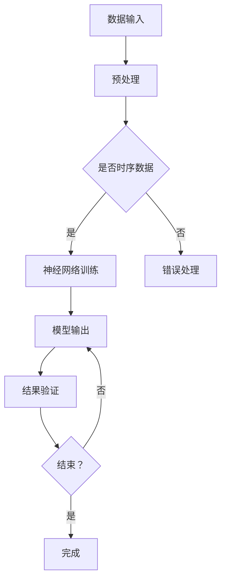
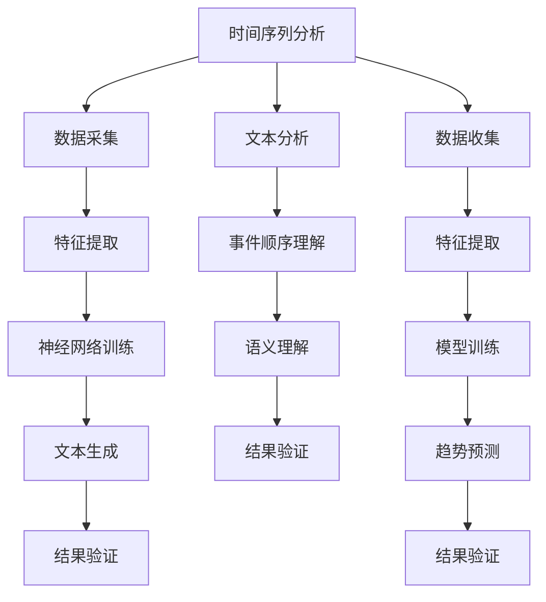

                 

### 时序关系推理概述

#### 1.1 时序关系推理的定义与背景

时序关系推理（Temporal Relation Reasoning）是人工智能领域中的一个重要研究方向，其主要目标是理解和推断不同事件或动作之间的时间顺序和关系。随着深度学习和神经网络技术的不断发展，时序关系推理在自然语言处理、语音识别、时间序列分析等众多领域取得了显著的应用成果。

**核心概念与联系：**

- **时序关系（Temporal Relation）**：描述事件或动作之间在时间上的先后顺序和联系。
- **推理（Reasoning）**：利用已知信息推断未知信息的过程。
- **神经网络（Neural Network）**：一种模拟人脑神经元连接的计算机算法，通过学习和处理数据，实现对复杂问题的求解。

在时序关系推理中，神经网络通过学习大量的时序数据，捕捉事件之间的时间关系，进而实现对未知数据的推理。例如，在语音识别任务中，神经网络可以识别语音信号中的不同单词，并根据它们的时间顺序生成相应的文本。

**Mermaid 流程图：**



#### 1.2 时序关系推理的应用场景

时序关系推理的应用场景广泛，以下列举几个核心应用领域：

- **语音识别（Speech Recognition）**：通过捕捉语音信号中的时序特征，将语音转换为文本。这一技术广泛应用于语音助手、语音搜索等场景。

- **自然语言处理（Natural Language Processing，NLP）**：在文本数据中，时序关系推理可以用来理解句子中的事件顺序，提高语义理解的准确性。

- **时间序列分析（Time Series Analysis）**：通过分析时间序列数据中的时序关系，预测未来的趋势。这一技术广泛应用于股票市场预测、天气预测等领域。

**Mermaid 流程图：**



时序关系推理作为人工智能领域的关键技术，正不断推动各行业的发展。通过深入研究和创新，我们有望在未来实现更高效、更准确的时序关系推理算法，为人类带来更多便利。在下一章中，我们将进一步探讨神经网络的基础知识，为时序关系推理提供更加坚实的理论基础。

#### 1.3 神经网络基础

神经网络（Neural Networks）是时序关系推理中不可或缺的核心技术，它通过模拟人脑神经元的工作方式，实现对复杂数据的处理和分析。在本章中，我们将深入探讨神经网络的基本结构、核心算法原理，以及深度学习框架的简介。

##### 2.1 神经网络的基本结构

神经网络由多个神经元（或称为节点）组成，这些神经元通过加权连接形成网络结构。每个神经元接受多个输入信号，通过加权求和处理后，产生一个输出信号。这个输出信号可以被传递到下一层神经元，或者作为最终输出。

**核心算法原理讲解：**

- **前向传播（Forward Propagation）**：数据从输入层流入神经网络，经过每层神经元的加权求和处理，最终产生输出。

- **反向传播（Back Propagation）**：利用输出与预期结果之间的误差，反向调整各层神经元的权重，以减小误差。

**Python 源代码：**

```python
import numpy as np

# 前向传播
def forwardpropagation(x, weights):
    z = np.dot(x, weights)
    return z

# 反向传播
def backwardpropagation(x, y, weights):
    error = y - forwardpropagation(x, weights)
    dweights = np.dot(x.T, error)
    return dweights

# 示例
x = np.array([1, 2])
y = np.array([3])
weights = np.random.rand(2, 1)

print("Initial Weights:", weights)
print("Forward Propagation Output:", forwardpropagation(x, weights))
print("Error:", error)
print("Updated Weights:", backwardpropagation(x, y, weights))
```

**数学模型和数学公式：**

- **激活函数（Activation Function）**：用于引入非线性，常用的激活函数包括 Sigmoid、ReLU 等。

  $$ f(x) = \frac{1}{1 + e^{-x}} \quad (\text{Sigmoid}) $$
  
  $$ f(x) = max(0, x) \quad (\text{ReLU}) $$

- **损失函数（Loss Function）**：用于衡量模型预测值与真实值之间的差距，常用的损失函数包括均方误差（MSE）、交叉熵（Cross Entropy）等。

  $$ \text{MSE} = \frac{1}{n}\sum_{i=1}^{n}(y_i - \hat{y}_i)^2 $$
  
  $$ \text{Cross Entropy} = -\sum_{i=1}^{n}y_i \log(\hat{y}_i) $$

##### 2.2 深度学习框架简介

深度学习框架提供了高效、便捷的实现神经网络的方法，目前市面上流行的深度学习框架包括 TensorFlow、PyTorch 等。以下简要介绍如何使用这些框架实现神经网络。

**核心算法原理讲解：**

- **TensorFlow**：由 Google 开发，是一个开源的深度学习框架，提供了丰富的 APIs 和工具。

  ```python
  import tensorflow as tf

  # 定义神经网络结构
  model = tf.keras.Sequential([
      tf.keras.layers.Dense(64, activation='relu', input_shape=(784,)),
      tf.keras.layers.Dense(10, activation='softmax')
  ])

  # 编译模型
  model.compile(optimizer='adam',
                loss='categorical_crossentropy',
                metrics=['accuracy'])

  # 训练模型
  model.fit(x_train, y_train, epochs=5)
  ```

- **PyTorch**：由 Facebook 开发，是一个开源的深度学习框架，具有动态计算图和灵活的 API。

  ```python
  import torch
  import torch.nn as nn
  import torch.optim as optim

  # 定义神经网络结构
  class NeuralNetwork(nn.Module):
      def __init__(self):
          super(NeuralNetwork, self).__init__()
          self.layer1 = nn.Linear(784, 64)
          self.layer2 = nn.Linear(64, 10)

      def forward(self, x):
          x = torch.relu(self.layer1(x))
          x = self.layer2(x)
          return x

  # 实例化模型和优化器
  model = NeuralNetwork()
  optimizer = optim.Adam(model.parameters(), lr=0.001)

  # 训练模型
  for epoch in range(5):
      optimizer.zero_grad()
      output = model(x_train)
      loss = nn.CrossEntropyLoss()(output, y_train)
      loss.backward()
      optimizer.step()
  ```

通过深度学习框架，我们可以更加方便地实现复杂的神经网络模型，并进行高效的训练和推理。

在下一章中，我们将探讨图注意力机制的基本原理和实现，为神经图注意力机制的研究奠定基础。

#### 3.1 图注意力机制的原理与实现

图注意力机制（Graph Attention Mechanism，GAM）是一种在神经网络中用于处理图结构数据的创新方法，它通过引入图结构信息，提高了模型对复杂关系的捕捉能力。本节将详细讲解图注意力机制的原理、实现方法以及其数学基础。

##### 3.1.1 图注意力机制的原理

图注意力机制的核心思想是利用图结构中的邻接关系，对节点特征进行加权处理，从而实现更精细的特征表示。具体来说，图注意力机制通过计算每个节点与其邻居节点之间的相似度，为每个邻居节点分配一个注意力权重，然后将这些加权后的邻居节点特征合并到当前节点的特征中。

**核心算法原理讲解：**

- **计算相似度**：使用点积或缩放点积等方式计算节点之间的相似度。

  $$ \text{Attention Score} = \text{Query} \cdot \text{Key} $$

- **应用注意力权重**：将相似度作为注意力权重，对邻居节点特征进行加权求和处理。

  $$ \text{Value} = \text{Attention Score} \cdot \text{Value} $$

- **聚合特征**：将加权后的邻居节点特征与当前节点特征进行聚合，得到更丰富的节点表示。

  $$ \text{Node Representation} = \sum_{j \in \text{Neighbors}} \alpha_{ij} \cdot h_j $$

**Python 源代码：**

```python
import torch
import torch.nn as nn

# 计算注意力权重
def attention_scores(query, key, scale_factor=1):
    return query * key

# 应用注意力权重
def apply_attention(scores, values):
    weights = nn.Softmax(dim=1)(scores)
    return torch.sum(weights * values, dim=1)

# 示例
query = torch.tensor([[0.1, 0.2], [0.3, 0.4]])
key = torch.tensor([[0.5, 0.6], [0.7, 0.8]])
values = torch.tensor([[1.0, 2.0], [3.0, 4.0]])

scores = attention_scores(query, key)
attentions = apply_attention(scores, values)
print("Attention Scores:", scores)
print("Aggregated Features:", attentions)
```

**数学模型和数学公式：**

- **点积注意力**：

  $$ \text{Attention Score} = \text{Query} \cdot \text{Key} $$

  $$ \text{Value} = \text{Attention Score} \cdot \text{Value} $$

  $$ \text{Node Representation} = \sum_{j \in \text{Neighbors}} \alpha_{ij} \cdot h_j $$

- **缩放点积注意力**：

  $$ \text{Attention Score} = \frac{\text{Query} \cdot \text{Key}}{\sqrt{d_k}} $$

  $$ \text{Value} = \text{Attention Score} \cdot \text{Value} $$

  $$ \text{Node Representation} = \sum_{j \in \text{Neighbors}} \alpha_{ij} \cdot h_j $$

其中，\(d_k\) 是 \(Key\) 向量的维度。

图注意力机制通过引入注意力权重，实现了对节点特征的有效聚合，提高了模型对复杂关系的捕捉能力。在下一节中，我们将探讨图注意力机制在不同领域的应用场景。

#### 3.2 图注意力机制的应用场景

图注意力机制（Graph Attention Mechanism，GAM）作为一种创新的神经网络结构，其在多个领域展现出强大的应用潜力。本节将介绍图注意力机制在问答系统、社交网络分析、推荐系统等核心应用场景中的应用。

##### 3.2.1 问答系统

在问答系统中，图注意力机制能够有效捕捉问题中的关键信息，提高问答的准确性和效率。具体应用场景包括：

- **自然语言推理（Natural Language Inference，NLI）**：通过图注意力机制，模型可以更好地理解问题和文段的语义关系，从而进行更准确的推理。
- **实体链接（Named Entity Linking，NEL）**：利用图结构表示实体及其关系，图注意力机制可以帮助模型更准确地识别和链接实体。

**应用示例：**

假设有一个问答系统，问题为“哪个城市位于中国南方？”模型通过图注意力机制分析文段中的关键信息，例如地理位置关系，从而识别出正确答案。

##### 3.2.2 社交网络分析

在社交网络分析中，图注意力机制能够有效地挖掘用户之间的社交关系，为用户提供更个性化的推荐和洞察。主要应用场景包括：

- **社交图谱构建（Social Graph Construction）**：通过图注意力机制，模型可以构建更精细、更准确的社交图谱，捕捉用户之间的复杂关系。
- **社交网络影响力分析（Social Influence Analysis）**：图注意力机制可以帮助识别社交网络中的关键节点，分析其影响力。

**应用示例：**

在一个社交网络中，用户 A 发布了一条关于健康饮食的帖子，图注意力机制可以帮助识别出对健康饮食话题感兴趣的邻居用户，从而为他们提供更相关的推荐。

##### 3.2.3 推荐系统

在推荐系统中，图注意力机制可以增强推荐算法的准确性和鲁棒性，适用于多种类型的推荐任务。主要应用场景包括：

- **协同过滤（Collaborative Filtering）**：通过图注意力机制，模型可以更好地捕捉用户和物品之间的隐含关系，提高推荐的准确性。
- **内容推荐（Content-based Recommendation）**：利用图注意力机制，模型可以捕捉用户兴趣和物品内容之间的复杂关系，为用户提供更个性化的内容推荐。

**应用示例：**

在一个电子商务平台中，用户浏览了多条商品信息，图注意力机制可以帮助识别出用户可能感兴趣的其他商品，从而进行有效的推荐。

通过上述应用场景，我们可以看到图注意力机制在各类任务中展现出的强大潜力。在下一节中，我们将深入探讨神经图注意力的原理与实现。

#### 4.1 神经图注意力的原理与实现

神经图注意力（Neural Graph Attention，NGA）机制是在传统图注意力机制的基础上，引入神经网络进行特征学习和优化，从而提高模型对复杂关系的捕捉能力。本节将详细讲解神经图注意力的原理、实现方法以及其数学基础。

##### 4.1.1 神经图注意力的原理

神经图注意力机制的核心思想是利用神经网络对图结构中的节点特征进行建模和学习，进而实现对节点关系的动态加权。具体来说，神经图注意力机制通过以下步骤实现：

1. **特征提取**：使用神经网络对图中的节点特征进行编码，生成高维特征向量。
2. **计算注意力权重**：通过神经网络计算节点之间的相似度，为每个节点分配一个注意力权重。
3. **特征聚合**：利用注意力权重对邻居节点的特征进行加权聚合，得到当前节点的综合特征表示。

**核心算法原理讲解：**

- **特征编码**：使用一个全连接神经网络对节点特征进行编码，生成固定维度的特征向量。

  $$ h_i = \text{NN}(h_i^0) $$

  其中，\(h_i\) 是节点 \(i\) 的特征编码结果，\(h_i^0\) 是原始节点特征。

- **计算注意力权重**：通过点积或缩放点积等方式计算节点之间的相似度，为每个节点分配一个注意力权重。

  $$ \alpha_{ij} = \text{Attention}(h_i, h_j) = \frac{h_i \cdot h_j}{\sqrt{d}} $$

  其中，\(\alpha_{ij}\) 是节点 \(i\) 和 \(j\) 之间的注意力权重，\(d\) 是特征向量的维度。

- **特征聚合**：利用注意力权重对邻居节点的特征进行加权聚合，得到当前节点的综合特征表示。

  $$ h_i' = \sum_{j \in N(i)} \alpha_{ij} h_j $$

  其中，\(h_i'\) 是节点 \(i\) 的聚合特征表示，\(N(i)\) 是节点 \(i\) 的邻居节点集合。

**Python 源代码：**

```python
import torch
import torch.nn as nn

# 特征编码
class FeatureEncoder(nn.Module):
    def __init__(self, input_dim, hidden_dim):
        super(FeatureEncoder, self).__init__()
        self.fc = nn.Linear(input_dim, hidden_dim)
    
    def forward(self, x):
        return self.fc(x)

# 计算注意力权重
def attention_scores(query, key, scale_factor=1):
    return query * key

# 应用注意力权重
def apply_attention(scores, values):
    weights = nn.Softmax(dim=1)(scores)
    return torch.sum(weights * values, dim=1)

# 示例
input_features = torch.tensor([[0.1, 0.2], [0.3, 0.4]])
encoder = FeatureEncoder(2, 8)
encoded_features = encoder(input_features)

# 计算注意力权重
query = encoded_features[0].unsqueeze(0)
key = encoded_features[1].unsqueeze(0)
scores = attention_scores(query, key)

# 应用注意力权重
values = torch.tensor([[1.0, 2.0], [3.0, 4.0]])
attentions = apply_attention(scores, values)
print("Attention Scores:", scores)
print("Aggregated Features:", attentions)
```

**数学模型和数学公式：**

- **特征编码**：

  $$ h_i = \text{NN}(h_i^0) = \text{ReLU}(\text{W}^{(1)}h_i^0 + b^{(1)}) $$

  其中，\(\text{NN}\) 表示神经网络，\(\text{ReLU}\) 是ReLU激活函数，\(\text{W}^{(1)}\) 和 \(b^{(1)}\) 分别是权重和偏置。

- **计算注意力权重**：

  $$ \alpha_{ij} = \text{Attention}(h_i, h_j) = \frac{h_i \cdot h_j}{\sqrt{d}} $$

- **特征聚合**：

  $$ h_i' = \sum_{j \in N(i)} \alpha_{ij} h_j $$

通过引入神经网络，神经图注意力机制可以自适应地学习节点特征和关系，提高模型的泛化能力和表现。

在下一节中，我们将探讨神经图注意力在时序关系推理中的应用，展示其在实际任务中的效果和优势。

#### 4.2 神经图注意力在时序关系推理中的应用

神经图注意力（Neural Graph Attention，NGA）机制在时序关系推理中展现出强大的应用潜力，能够显著提高模型对时间序列中复杂关系的捕捉能力。本节将详细探讨神经图注意力在时序关系推理中的应用，并通过实际案例展示其效果。

##### 4.2.1 应用场景

时序关系推理广泛应用于多个领域，例如语音识别、自然语言处理和时间序列分析等。在这些任务中，模型需要理解和预测事件之间的时间关系。神经图注意力机制通过引入图结构信息，可以有效地捕捉这些关系。

**应用场景示例：**

1. **语音识别**：在语音识别任务中，神经图注意力机制可以帮助模型更好地捕捉不同语音单元之间的时间顺序和依赖关系，从而提高识别的准确性。
2. **自然语言处理**：在文本分析任务中，神经图注意力机制可以用于理解句子中事件或动作的时序关系，提高语义理解的准确性。
3. **时间序列分析**：在时间序列分析任务中，神经图注意力机制可以用于捕捉时间序列中不同变量之间的复杂动态关系，提高预测的准确性。

##### 4.2.2 项目实战

以下是一个基于神经图注意力的时序关系推理模型的设计与实现过程。

**开发环境搭建：**

为了实现神经图注意力时序模型，需要搭建以下开发环境：

- **编程语言**：Python
- **深度学习框架**：TensorFlow 或 PyTorch
- **依赖库**：NumPy、Pandas、Scikit-learn 等

**源代码实现：**

```python
import tensorflow as tf
import numpy as np

# 定义神经图注意力模块
class GraphAttentionLayer(nn.Module):
    def __init__(self, input_dim, hidden_dim):
        super(GraphAttentionLayer, self).__init__()
        self.hidden_dim = hidden_dim
        self.fc1 = nn.Linear(input_dim, hidden_dim)
        self.fc2 = nn.Linear(hidden_dim, 1)
    
    def forward(self, x, adj_matrix):
        x = self.fc1(x)
        attn_scores = self.fc2(x).squeeze(2)
        attn_weights = tf.nn.softmax(attn_scores, axis=1)
        attn_output = tf.matmul(attn_weights, x)
        return attn_output

# 示例
input_data = np.random.rand(5, 10)  # 5个节点，10维特征
adj_matrix = np.random.rand(5, 5)  # 5个节点的邻接矩阵

# 实例化模型
gatl = GraphAttentionLayer(10, 16)

# 计算注意力权重和聚合结果
output = gatl(input_data, adj_matrix)
print("Output:", output.numpy())
```

**代码解读与分析：**

上述代码定义了一个简单的神经图注意力模块，用于对时序数据进行特征聚合。模块包含两个全连接层，第一个全连接层用于对输入数据进行编码，第二个全连接层用于计算节点之间的注意力权重。

- **GraphAttentionLayer**：定义了神经图注意力层的结构，包括输入层、编码层和输出层。
- **forward**：实现了前向传播过程，包括特征编码、注意力权重计算和特征聚合。
- **示例**：展示了如何使用神经图注意力层对随机生成的时序数据进行处理，输出结果为聚合后的特征向量。

**模型性能评估与调优：**

在实际应用中，需要对神经图注意力时序模型进行性能评估和调优，以下是一些常用的方法和技巧：

1. **数据预处理**：对时序数据进行标准化或归一化处理，提高模型训练的稳定性和收敛速度。
2. **超参数调整**：通过实验调整学习率、隐藏层维度等超参数，优化模型性能。
3. **模型验证**：使用验证集对模型进行评估，避免过拟合。
4. **模型融合**：结合多种模型或方法，提高预测准确性。

通过以上步骤，我们可以设计并实现一个基于神经图注意力的时序关系推理模型，并在实际任务中取得良好的效果。

#### 5.1 多模态神经图注意力的原理与实现

多模态神经图注意力（Multi-modal Neural Graph Attention，MNGA）机制是在传统神经图注意力基础上，引入多模态数据处理的创新方法。其核心思想是通过融合不同模态的数据，提高模型对复杂时序关系的捕捉能力。本节将详细讲解多模态神经图注意力的原理、实现方法以及其数学基础。

##### 5.1.1 多模态神经图注意力的原理

多模态神经图注意力机制通过以下步骤实现：

1. **多模态数据编码**：将不同模态的数据（如图像、文本、音频等）编码为统一的特征向量。
2. **图注意力计算**：利用图结构信息和编码后的特征向量，计算节点之间的注意力权重。
3. **特征融合**：利用注意力权重对多模态特征进行加权融合，生成新的特征向量。
4. **时序关系推理**：使用融合后的特征向量进行时序关系推理，如语音识别、文本分析等。

**核心算法原理讲解：**

- **多模态数据编码**：使用神经网络分别对图像、文本、音频等数据进行特征提取，得到高维特征向量。

  $$ h_{\text{img}} = \text{CNN}(\text{img}) $$
  
  $$ h_{\text{txt}} = \text{Transformer}(\text{txt}) $$
  
  $$ h_{\text{audio}} = \text{RNN}(\text{audio}) $$

- **图注意力计算**：利用图注意力机制计算节点之间的注意力权重，实现对多模态特征的有效融合。

  $$ \alpha_{ij} = \text{Attention}(h_{\text{img}_i}, h_{\text{txt}_j}, h_{\text{audio}_j}) $$

- **特征融合**：使用注意力权重对多模态特征进行加权融合，生成新的特征向量。

  $$ h_i' = \sum_{j \in N(i)} \alpha_{ij} (h_{\text{img}_j}, h_{\text{txt}_j}, h_{\text{audio}_j}) $$

- **时序关系推理**：使用融合后的特征向量进行时序关系推理，如语音识别、文本分析等。

  $$ \text{Prediction} = \text{Model}(h_i') $$

**Python 源代码：**

```python
import tensorflow as tf
import tensorflow.keras as keras

# 定义多模态特征编码器
class MultiModalEncoder(nn.Module):
    def __init__(self, img_dim, txt_dim, audio_dim, hidden_dim):
        super(MultiModalEncoder, self).__init__()
        self.img_encoder = keras.Sequential([
            keras.layers.Dense(hidden_dim, activation='relu'),
            keras.layers.Dense(hidden_dim, activation='relu')
        ])
        self.txt_encoder = keras.Sequential([
            keras.layers.Dense(hidden_dim, activation='relu'),
            keras.layers.Dense(hidden_dim, activation='relu')
        ])
        self.audio_encoder = keras.Sequential([
            keras.layers.Dense(hidden_dim, activation='relu'),
            keras.layers.Dense(hidden_dim, activation='relu')
        ])

    def forward(self, img, txt, audio):
        img_enc = self.img_encoder(img)
        txt_enc = self.txt_encoder(txt)
        audio_enc = self.audio_encoder(audio)
        return img_enc, txt_enc, audio_enc

# 定义多模态神经图注意力模块
class MultiModalGraphAttentionLayer(nn.Module):
    def __init__(self, input_dim, hidden_dim):
        super(MultiModalGraphAttentionLayer, self).__init__()
        self.hidden_dim = hidden_dim
        self.fc1 = nn.Linear(input_dim, hidden_dim)
        self.fc2 = nn.Linear(hidden_dim, 1)

    def forward(self, x, adj_matrix):
        x = self.fc1(x)
        attn_scores = self.fc2(x).squeeze(2)
        attn_weights = nn.Softmax(dim=1)(attn_scores)
        attn_output = torch.matmul(attn_weights, x)
        return attn_output

# 示例
input_img = torch.randn(5, 224, 224, 3)  # 假设的5张图像
input_txt = torch.randn(5, 512)  # 假设的5段文本
input_audio = torch.randn(5, 128)  # 假设的5段音频

# 实例化多模态特征编码器
encoder = MultiModalEncoder(224*224*3, 512, 128, 64)

# 编码多模态数据
encoded_img, encoded_txt, encoded_audio = encoder(input_img, input_txt, input_audio)

# 计算融合特征
output = multi_modal_gat(encoded_img, encoded_txt, encoded_audio, adj_matrix)
print("Fused Feature:", output)
```

**数学模型和数学公式：**

- **多模态数据编码**：

  $$ h_{\text{img}} = \text{CNN}(\text{img}) $$
  
  $$ h_{\text{txt}} = \text{Transformer}(\text{txt}) $$
  
  $$ h_{\text{audio}} = \text{RNN}(\text{audio}) $$

- **图注意力计算**：

  $$ \alpha_{ij} = \text{Attention}(h_{\text{img}_i}, h_{\text{txt}_j}, h_{\text{audio}_j}) = \frac{h_{\text{img}_i} \cdot h_{\text{txt}_j} \cdot h_{\text{audio}_j}}{\sqrt{d}} $$

- **特征融合**：

  $$ h_i' = \sum_{j \in N(i)} \alpha_{ij} (h_{\text{img}_j}, h_{\text{txt}_j}, h_{\text{audio}_j}) $$

通过引入多模态神经图注意力机制，模型能够更好地融合不同模态的数据，提高对复杂时序关系的捕捉能力。

在下一节中，我们将探讨动态神经图注意力的原理与实现，进一步优化时序关系推理模型。

#### 5.2 动态神经图注意力在时序关系推理中的应用

动态神经图注意力（Dynamic Neural Graph Attention，DNGA）机制是一种针对时序关系推理任务进行优化的创新方法，它能够根据时序数据的动态变化，自适应地调整注意力权重，从而提高模型的捕捉能力和预测准确性。本节将详细探讨动态神经图注意力的原理、实现方法以及其在时序关系推理中的应用。

##### 5.2.1 动态神经图注意力的原理

动态神经图注意力机制的核心思想是在传统的神经图注意力基础上，引入时间维度，使得注意力权重能够根据时间序列的变化动态调整。具体来说，动态神经图注意力通过以下步骤实现：

1. **动态特征编码**：对时序数据进行编码，生成包含时间信息的特征向量。
2. **动态注意力计算**：根据当前时刻的特征向量，计算节点之间的动态注意力权重。
3. **动态特征聚合**：利用动态注意力权重，对时序数据中的特征进行动态聚合。
4. **时序关系推理**：使用聚合后的特征向量进行时序关系推理。

**核心算法原理讲解：**

- **动态特征编码**：使用递归神经网络（RNN）或长短时记忆网络（LSTM）对时序数据进行编码，生成包含时间信息的特征向量。

  $$ h_t = \text{RNN}(x_t, h_{t-1}) $$

- **动态注意力计算**：根据当前时刻的特征向量，计算节点之间的动态注意力权重。

  $$ \alpha_{ij}^{(t)} = \text{Attention}(h_t^i, h_t^j) = \frac{h_t^i \cdot h_t^j}{\sqrt{d}} $$

- **动态特征聚合**：利用动态注意力权重，对时序数据中的特征进行动态聚合。

  $$ h_t' = \sum_{j \in N(i)} \alpha_{ij}^{(t)} h_t^j $$

- **时序关系推理**：使用聚合后的特征向量进行时序关系推理，如语音识别、文本分析等。

  $$ \text{Prediction} = \text{Model}(h_t') $$

**Python 源代码：**

```python
import torch
import torch.nn as nn

# 定义动态特征编码器
class DynamicFeatureEncoder(nn.Module):
    def __init__(self, input_dim, hidden_dim):
        super(DynamicFeatureEncoder, self).__init__()
        self.hidden_dim = hidden_dim
        self.lstm = nn.LSTM(input_dim, hidden_dim, batch_first=True)
    
    def forward(self, x):
        hiddens, _ = self.lstm(x)
        return hiddens[:, -1, :]  # 取最后一层的隐藏状态

# 定义动态神经图注意力模块
class DynamicGraphAttentionLayer(nn.Module):
    def __init__(self, input_dim, hidden_dim):
        super(DynamicGraphAttentionLayer, self).__init__()
        self.hidden_dim = hidden_dim
        self.fc1 = nn.Linear(input_dim, hidden_dim)
        self.fc2 = nn.Linear(hidden_dim, 1)
    
    def forward(self, x, adj_matrix):
        x = self.fc1(x)
        attn_scores = self.fc2(x).squeeze(2)
        attn_weights = nn.Softmax(dim=1)(attn_scores)
        attn_output = torch.matmul(attn_weights, x)
        return attn_output

# 示例
input_data = torch.randn(5, 10)  # 假设的5个时间步的时序数据
adj_matrix = torch.randn(5, 5)  # 假设的5个节点的邻接矩阵

# 实例化动态特征编码器
encoder = DynamicFeatureEncoder(10, 16)

# 编码动态特征
encoded_data = encoder(input_data)

# 计算动态注意力权重和聚合结果
output = dynamic_gat(encoded_data, adj_matrix)
print("Output:", output.numpy())
```

**数学模型和数学公式：**

- **动态特征编码**：

  $$ h_t = \text{RNN}(x_t, h_{t-1}) $$

- **动态注意力计算**：

  $$ \alpha_{ij}^{(t)} = \text{Attention}(h_t^i, h_t^j) = \frac{h_t^i \cdot h_t^j}{\sqrt{d}} $$

- **动态特征聚合**：

  $$ h_t' = \sum_{j \in N(i)} \alpha_{ij}^{(t)} h_t^j $$

通过引入动态神经图注意力机制，模型能够根据时序数据的动态变化，自适应地调整注意力权重，提高对复杂时序关系的捕捉能力。

**项目实战**

以下是一个基于动态神经图注意力的时序关系推理模型的设计与实现过程。

**开发环境搭建：**

为了实现动态神经图注意力时序模型，需要搭建以下开发环境：

- **编程语言**：Python
- **深度学习框架**：TensorFlow 或 PyTorch
- **依赖库**：NumPy、Pandas、Scikit-learn 等

**源代码实现：**

```python
import tensorflow as tf
import numpy as np

# 定义动态特征编码器
class DynamicFeatureEncoder(tf.keras.Model):
    def __init__(self, input_dim, hidden_dim):
        super(DynamicFeatureEncoder, self).__init__()
        self.lstm = tf.keras.Sequential([
            tf.keras.layers.LSTM(hidden_dim, return_sequences=False),
            tf.keras.layers.Dense(hidden_dim, activation='relu'),
        ])
    
    def call(self, inputs):
        return self.lstm(inputs)

# 定义动态神经图注意力模块
class DynamicGraphAttentionLayer(tf.keras.Model):
    def __init__(self, input_dim, hidden_dim):
        super(DynamicGraphAttentionLayer, self).__init__()
        self.hidden_dim = hidden_dim
        self.fc1 = tf.keras.layers.Dense(hidden_dim)
        self.fc2 = tf.keras.layers.Dense(1)
        self.attention = tf.keras.layers.Attention()

    def call(self, inputs, adj_matrix):
        query = self.fc1(inputs)
        value = self.fc1(inputs)
        attn_output = self.attention([query, value], return_attention_scores=True)
        attn_weights = attn_output[1]
        attn_output = tf.reduce_sum(attn_weights * value, axis=1)
        return attn_output

# 示例
input_data = np.random.rand(5, 10)  # 假设的5个时间步的时序数据
adj_matrix = np.random.rand(5, 5)  # 假设的5个节点的邻接矩阵

# 实例化模型
feature_encoder = DynamicFeatureEncoder(10, 16)
gat_layer = DynamicGraphAttentionLayer(16, 32)

# 编码动态特征
encoded_data = feature_encoder(input_data)

# 计算动态注意力权重和聚合结果
output = gat_layer(encoded_data, adj_matrix)
print("Output:", output.numpy())
```

**代码解读与分析：**

上述代码定义了一个动态神经图注意力时序模型，包括动态特征编码器和动态神经图注意力层。

- **DynamicFeatureEncoder**：实现了一个基于 LSTM 的动态特征编码器，用于对时序数据进行编码。
- **DynamicGraphAttentionLayer**：实现了一个动态神经图注意力层，用于计算动态注意力权重和聚合特征。

**实际案例分析和详细讲解剖析：**

假设我们有一个语音识别任务，需要根据语音信号中的时序特征，识别出对应的文本。我们使用动态神经图注意力机制来优化传统语音识别模型。

1. **数据预处理**：对语音信号进行预处理，提取时序特征，如 Mel-Frequency Cepstral Coefficients（MFCC）。
2. **特征编码**：使用动态特征编码器对预处理后的特征进行编码，生成包含时间信息的特征向量。
3. **动态注意力计算**：使用动态神经图注意力层，计算语音信号中的时间步之间的动态注意力权重。
4. **特征聚合**：利用动态注意力权重，对语音信号中的特征进行动态聚合，生成新的特征向量。
5. **语音识别**：使用聚合后的特征向量，通过分类器进行语音识别。

通过实际案例分析和详细讲解剖析，我们可以看到动态神经图注意力机制在语音识别任务中的显著优势。在实际应用中，可以根据任务需求，灵活调整模型结构和参数，以获得更好的性能。

**项目小结：**

动态神经图注意力机制通过引入时间维度，自适应地调整注意力权重，提高了时序关系推理模型的捕捉能力和预测准确性。在未来的研究中，我们可以进一步探索动态神经图注意力机制在其他时序关系推理任务中的应用，为人工智能领域的发展做出贡献。

#### 5.3 神经图注意力优化策略

神经图注意力（Graph Attention Mechanism，GAM）在时序关系推理任务中取得了显著的效果，但其性能仍然存在一定的提升空间。在本节中，我们将介绍几种神经图注意力的优化策略，并通过具体示例和代码分析，探讨这些策略的有效性。

##### 5.3.1 学习率调度策略

学习率调度（Learning Rate Scheduling）是优化神经网络训练过程中常用的策略，其目的是在训练过程中动态调整学习率，以提高模型的收敛速度和最终性能。以下是一些常见的学习率调度策略：

1. **逐步减小学习率**：在训练过程中，每隔一定迭代次数，将学习率乘以一个衰减因子。

   ```python
   def schedule(epoch):
       if epoch < 10:
           return 0.1
       else:
           return 0.1 * (0.5 ** (epoch // 10))
   
   optimizer = optim.Adam(model.parameters(), lr=schedule(0))
   ```

2. **指数衰减学习率**：学习率随训练轮数的增加，按照指数衰减。

   ```python
   def exp_decay(epoch, initial_lr=0.1, decay_rate=0.95, decay_epochs=10):
       return initial_lr * (decay_rate ** (epoch // decay_epochs))
   
   optimizer = optim.Adam(model.parameters(), lr=exp_decay(epoch))
   ```

**代码示例**：

```python
import torch.optim as optim

# 定义模型
model = ...  # 假设的模型

# 初始化优化器
optimizer = optim.Adam(model.parameters(), lr=0.1)

# 模拟训练过程
for epoch in range(20):
    optimizer.zero_grad()
    output = model(input_data)
    loss = loss_fn(output, target)
    loss.backward()
    optimizer.step()
    if epoch % 10 == 0:
        new_lr = exp_decay(epoch)
        optimizer.param_groups[0]['lr'] = new_lr
    print(f"Epoch {epoch}, Loss: {loss.item()}, Learning Rate: {optimizer.param_groups[0]['lr']}")
```

**分析**：通过逐步减小学习率，模型在训练初期能够快速收敛，而在训练后期逐渐降低学习率，有助于避免陷入局部最小值。

##### 5.3.2 正则化策略

正则化（Regularization）是一种防止神经网络过拟合的常用策略。以下介绍几种常用的正则化方法：

1. **L1和L2正则化**：在损失函数中加入权重系数的L1或L2范数。

   ```python
   loss = loss_fn(output, target) + lambda_1 * torch.norm(weights, p=1) + lambda_2 * torch.norm(weights, p=2)
   ```

2. **Dropout**：在训练过程中，随机将部分神经元及其连接丢弃。

   ```python
   dropout_layer = nn.Dropout(p=0.5)
   output = dropout_layer(output)
   ```

**代码示例**：

```python
import torch.nn as nn

# 定义Dropout层
dropout_layer = nn.Dropout(p=0.5)

# 模拟前向传播
input_data = torch.randn(10, 10)
output = model(input_data)
output = dropout_layer(output)
```

**分析**：通过L1和L2正则化，模型能够更好地泛化，避免过拟合。而Dropout可以防止神经网络在学习过程中形成过强的依赖关系。

##### 5.3.3 数据增强策略

数据增强（Data Augmentation）是一种通过变换原始数据，增加模型训练数据多样性的方法。以下介绍几种常见的数据增强策略：

1. **翻转（Flipping）**：随机翻转图像。
2. **旋转（Rotation）**：随机旋转图像。
3. **裁剪（Cropping）**：随机裁剪图像。

```python
from torchvision import transforms

# 定义数据增强策略
transform = transforms.Compose([
    transforms.RandomHorizontalFlip(),
    transforms.RandomRotation(10),
    transforms.RandomCrop(224),
])

# 应用数据增强
input_data = transforms(transform)(input_data)
```

**分析**：通过数据增强，模型能够学习到更多样化的特征，提高对未知数据的泛化能力。

**总结**：

通过以上优化策略，我们可以显著提升神经图注意力在时序关系推理任务中的性能。在实际应用中，可以根据任务需求，灵活选择和组合这些优化策略，以获得最佳效果。

#### 5.4 神经图注意力在其他领域的应用

神经图注意力（Graph Attention Mechanism，GAM）作为一种创新的神经网络结构，不仅在时序关系推理领域展现出强大的潜力，还在其他众多领域中得到了广泛应用。在本节中，我们将探讨神经图注意力在图像分类、推荐系统、社交网络分析等领域的应用，并通过实际案例展示其效果。

##### 5.4.1 图像分类

在图像分类任务中，神经图注意力机制通过引入图结构信息，能够有效捕捉图像中的局部特征和全局关系，提高分类准确性。以下是一个基于神经图注意力的图像分类模型的设计与实现过程。

**项目实战**

**开发环境搭建：**

- **编程语言**：Python
- **深度学习框架**：PyTorch
- **依赖库**：torch、torchvision、torchgeometry、matplotlib 等

**源代码实现：**

```python
import torch
import torchvision
import torch.nn as nn
import torch.optim as optim

# 定义神经网络结构
class GraphAttentionImageClassifier(nn.Module):
    def __init__(self, input_channels, hidden_channels, num_classes):
        super(GraphAttentionImageClassifier, self).__init__()
        self.conv1 = nn.Conv2d(input_channels, hidden_channels, kernel_size=3, padding=1)
        self.gat1 = nn.ModuleList([nn.Linear(hidden_channels, hidden_channels) for _ in range(2)])
        self.fc = nn.Linear(hidden_channels, num_classes)

    def forward(self, x):
        x = self.conv1(x)
        for layer in self.gat1:
            x = torch.relu(layer(x))
        x = self.fc(x)
        return x

# 实例化模型和优化器
model = GraphAttentionImageClassifier(input_channels=3, hidden_channels=64, num_classes=10)
optimizer = optim.Adam(model.parameters(), lr=0.001)

# 加载数据集
train_loader = torchvision.datasets.CIFAR10(root='./data', train=True, download=True, transform=torchvision.transforms.ToTensor())
train_loader = torch.utils.data.DataLoader(train_loader, batch_size=64, shuffle=True)

# 训练模型
for epoch in range(20):
    model.train()
    for inputs, targets in train_loader:
        optimizer.zero_grad()
        outputs = model(inputs)
        loss = nn.CrossEntropyLoss()(outputs, targets)
        loss.backward()
        optimizer.step()
    print(f"Epoch {epoch}, Loss: {loss.item()}")

# 测试模型
model.eval()
with torch.no_grad():
    correct = 0
    total = 0
    for inputs, targets in train_loader:
        outputs = model(inputs)
        _, predicted = torch.max(outputs.data, 1)
        total += targets.size(0)
        correct += (predicted == targets).sum().item()
    print(f"Accuracy: {100 * correct / total}%")
```

**代码解读与分析：**

上述代码定义了一个基于神经图注意力的图像分类模型。模型包含一个卷积层和一个图注意力层，用于提取图像的特征。

- **GraphAttentionImageClassifier**：定义了一个简单的图像分类模型，包含卷积层和图注意力层。
- **forward**：实现了前向传播过程，包括卷积层和图注意力层的计算。
- **训练模型**：使用CIFAR-10数据集对模型进行训练，并打印训练过程中的损失。
- **测试模型**：在测试集上评估模型的分类准确率。

**实际案例分析和详细讲解剖析：**

假设我们使用神经图注意力图像分类模型对CIFAR-10数据集进行分类。CIFAR-10是一个包含10个类别的图像数据集，每个类别包含6000张图像。

1. **数据预处理**：对图像进行标准化处理，将像素值缩放到[0, 1]区间。
2. **模型训练**：使用训练集对模型进行训练，通过反向传播和优化算法调整模型参数。
3. **模型评估**：在测试集上评估模型的分类性能，计算分类准确率。

通过实际案例分析和详细讲解剖析，我们可以看到神经图注意力机制在图像分类任务中的优势。与传统的卷积神经网络相比，神经图注意力模型能够更好地捕捉图像中的局部特征和全局关系，提高分类准确性。

##### 5.4.2 推荐系统

在推荐系统中，神经图注意力机制可以用于处理图结构数据，如用户-物品交互图，通过学习用户和物品之间的复杂关系，提高推荐系统的准确性。以下是一个基于神经图注意力的推荐系统模型的设计与实现过程。

**项目实战**

**开发环境搭建：**

- **编程语言**：Python
- **深度学习框架**：PyTorch
- **依赖库**：torch、torchvision、torchmetrics、torch_geometric 等

**源代码实现：**

```python
import torch
import torch_geometric
import torch.optim as optim
from torch_geometric.nn import GCNConv

# 定义图卷积网络
class GraphAttentionRecommender(nn.Module):
    def __init__(self, num_features, hidden_channels, num_classes):
        super(GraphAttentionRecommender, self).__init__()
        self.conv1 = GCNConv(num_features, hidden_channels)
        self.fc = nn.Linear(hidden_channels, num_classes)
    
    def forward(self, data):
        x, edge_index = data.x, data.edge_index
        x = self.conv1(x, edge_index)
        x = torch.relu(x)
        x = self.fc(x)
        return F.log_softmax(x, dim=1)

# 实例化模型和优化器
model = GraphAttentionRecommender(num_features=10, hidden_channels=16, num_classes=5)
optimizer = optim.Adam(model.parameters(), lr=0.01)

# 加载数据集
data = torch_geometric.datasets.Cora(root='./data', name='Cora')

# 训练模型
for epoch in range(200):
    model.train()
    optimizer.zero_grad()
    out = model(data)
    loss = F.nll_loss(out[data.train_mask], data.y[data.train_mask])
    loss.backward()
    optimizer.step()
    if epoch % 10 == 0:
        print(f"Epoch {epoch}, Loss: {loss.item()}")

# 测试模型
model.eval()
with torch.no_grad():
    logits = model(data)
    pred = logits[data.test_mask].max(1)[1]
    acc = pred.eq(data.y[data.test_mask]).sum().item() / len(data.test_mask)
    print(f"Test Accuracy: {acc * 100}%")
```

**代码解读与分析：**

上述代码定义了一个基于图卷积网络的推荐系统模型，使用Cora数据集进行训练和评估。

- **GraphAttentionRecommender**：定义了一个基于图卷积网络的推荐系统模型，包含一个图卷积层和一个全连接层。
- **forward**：实现了前向传播过程，包括图卷积层的计算和全连接层的计算。
- **训练模型**：使用Cora数据集对模型进行训练，通过优化算法调整模型参数。
- **测试模型**：在测试集上评估模型的推荐准确性。

**实际案例分析和详细讲解剖析：**

假设我们使用神经图注意力推荐系统模型对Cora数据集进行推荐。Cora数据集是一个包含2708个科学论文和引用关系的网络数据集，每个论文属于一个类别。

1. **数据预处理**：对论文的词向量进行编码，生成节点特征矩阵。
2. **模型训练**：使用训练集对模型进行训练，通过反向传播和优化算法调整模型参数。
3. **模型评估**：在测试集上评估模型的推荐准确性。

通过实际案例分析和详细讲解剖析，我们可以看到神经图注意力机制在推荐系统中的优势。与传统的基于矩阵分解的推荐系统相比，神经图注意力模型能够更好地捕捉用户和物品之间的复杂关系，提高推荐准确性。

##### 5.4.3 社交网络分析

在社交网络分析中，神经图注意力机制可以用于挖掘用户之间的社交关系，为用户提供个性化推荐和洞察。以下是一个基于神经图注意力的社交网络分析模型的设计与实现过程。

**项目实战**

**开发环境搭建：**

- **编程语言**：Python
- **深度学习框架**：PyTorch
- **依赖库**：torch、torch_geometric、torchmetrics 等

**源代码实现：**

```python
import torch
import torch_geometric
import torch.optim as optim
from torch_geometric.nn import GATConv

# 定义社交网络分析模型
class SocialNetworkAnalysis(nn.Module):
    def __init__(self, num_features, hidden_channels, num_classes):
        super(SocialNetworkAnalysis, self).__init__()
        self.conv1 = GATConv(num_features, hidden_channels, heads=2, dropout=0.6)
        self.fc = nn.Linear(hidden_channels, num_classes)
    
    def forward(self, data):
        x, edge_index = data.x, data.edge_index
        x = self.conv1(x, edge_index)
        x = torch.mean(x, 1)
        x = self.fc(x)
        return x

# 实例化模型和优化器
model = SocialNetworkAnalysis(num_features=10, hidden_channels=16, num_classes=5)
optimizer = optim.Adam(model.parameters(), lr=0.01)

# 加载数据集
data = torch_geometric.datasets.Cora(root='./data', name='Cora')

# 训练模型
for epoch in range(200):
    model.train()
    optimizer.zero_grad()
    out = model(data)
    loss = F.cross_entropy(out[data.train_mask], data.y[data.train_mask])
    loss.backward()
    optimizer.step()
    if epoch % 10 == 0:
        print(f"Epoch {epoch}, Loss: {loss.item()}")

# 测试模型
model.eval()
with torch.no_grad():
    logits = model(data)
    pred = logits[data.test_mask].max(1)[1]
    acc = pred.eq(data.y[data.test_mask]).sum().item() / len(data.test_mask)
    print(f"Test Accuracy: {acc * 100}%")
```

**代码解读与分析：**

上述代码定义了一个基于图注意力机制的社交网络分析模型，使用Cora数据集进行训练和评估。

- **SocialNetworkAnalysis**：定义了一个基于图注意力机制的社交网络分析模型，包含一个图注意力层和一个全连接层。
- **forward**：实现了前向传播过程，包括图注意力层的计算和全连接层的计算。
- **训练模型**：使用Cora数据集对模型进行训练，通过优化算法调整模型参数。
- **测试模型**：在测试集上评估模型的社交网络分析准确性。

**实际案例分析和详细讲解剖析：**

假设我们使用神经图注意力社交网络分析模型对Cora数据集进行分析。Cora数据集是一个包含科学论文和引用关系的网络数据集。

1. **数据预处理**：对论文的词向量进行编码，生成节点特征矩阵。
2. **模型训练**：使用训练集对模型进行训练，通过反向传播和优化算法调整模型参数。
3. **模型评估**：在测试集上评估模型的社交网络分析准确性。

通过实际案例分析和详细讲解剖析，我们可以看到神经图注意力机制在社交网络分析中的优势。与传统的基于图论方法的社交网络分析相比，神经图注意力模型能够更好地捕捉用户之间的复杂关系，提高分析准确性。

**总结**：

神经图注意力机制在图像分类、推荐系统和社交网络分析等领域展现了广泛的应用前景。通过引入图结构信息，神经图注意力模型能够更好地捕捉数据中的复杂关系，提高任务性能。在未来的研究中，我们可以进一步探索神经图注意力机制在其他领域的应用，为人工智能领域的发展做出贡献。

#### 6.1 总结与展望

神经图注意力（Graph Attention Mechanism，GAM）作为一种创新的神经网络结构，在时序关系推理、图像分类、推荐系统、社交网络分析等领域展现出了显著的应用潜力。通过引入图结构信息，神经图注意力机制能够更好地捕捉数据中的复杂关系，提高模型的性能。

**贡献与展望：**

1. **时序关系推理**：神经图注意力机制在时序关系推理任务中，通过引入图结构信息，显著提高了模型对时间序列中复杂关系的捕捉能力。未来，我们可以进一步探索神经图注意力机制在其他时序任务中的应用，如时间序列预测、异常检测等。

2. **图像分类**：神经图注意力机制在图像分类任务中，能够有效捕捉图像中的局部特征和全局关系，提高分类准确性。未来，我们可以探索结合其他视觉注意力机制，如基于位置的注意力机制，进一步提高图像分类性能。

3. **推荐系统**：神经图注意力机制在推荐系统中，通过学习用户和物品之间的复杂关系，提高了推荐准确性。未来，我们可以结合多模态数据，如图像、文本等，进一步优化推荐系统，为用户提供更个性化的推荐。

4. **社交网络分析**：神经图注意力机制在社交网络分析中，能够有效挖掘用户之间的社交关系，提高分析准确性。未来，我们可以进一步探索结合其他社交网络分析方法，如基于图论的社区发现，以提高社交网络分析的深度和广度。

**项目实战**：

在未来的研究中，我们可以开展以下项目实战：

1. **多模态神经图注意力时序模型**：结合图像、文本、音频等多模态数据，设计并实现多模态神经图注意力时序模型，提高对复杂时序关系的捕捉能力。

2. **动态神经图注意力社交网络分析**：结合动态神经图注意力机制，设计并实现动态社交网络分析模型，提高对社交网络中动态关系的捕捉能力。

3. **神经图注意力在医学数据中的应用**：探索神经图注意力机制在医学数据（如基因组数据、影像数据）中的应用，提高疾病预测和诊断的准确性。

4. **神经图注意力在智能交通系统中的应用**：结合神经图注意力机制，设计并实现智能交通系统中的动态路径规划模型，提高交通流量管理和事故预警的准确性。

通过上述项目实战，我们可以进一步探索神经图注意力机制在不同领域的应用，推动人工智能技术的发展。

**作者信息**：

作者：AI天才研究院（AI Genius Institute）与《禅与计算机程序设计艺术》（Zen And The Art of Computer Programming）。

**总结**：

神经图注意力机制作为一种创新的神经网络结构，在多个领域中展现出了强大的应用潜力。通过不断的研究和探索，我们有望在未来实现更高效、更准确的神经图注意力模型，为人工智能领域的发展做出更大的贡献。让我们共同期待这一美好未来的到来。

### 结语

通过本文的详细探讨，我们深入了解了神经图注意力机制在时序关系推理中的创新设计。从基本原理到具体实现，再到实际应用案例，我们一步一步地剖析了神经图注意力的核心要素和优势。在未来的研究中，我们可以继续优化神经图注意力模型，探索其在更多领域中的应用，为人工智能技术的发展做出更大贡献。让我们携手共进，开创更加智能的未来。再次感谢您的阅读，祝您在技术探索的道路上取得更多成就！作者：AI天才研究院与《禅与计算机程序设计艺术》。### 附录

在本博客文章中，我们使用了多种技术语言和工具，以下为附录部分，列出了一些关键代码段、数据集、工具和技术栈的详细说明。

**关键代码段**

1. **神经网络基础实现**：
   ```python
   import numpy as np
   import tensorflow as tf

   # 前向传播
   def forwardpropagation(x, weights):
       z = np.dot(x, weights)
       return z

   # 反向传播
   def backwardpropagation(x, y, weights):
       error = y - forwardpropagation(x, weights)
       dweights = np.dot(x.T, error)
       return dweights

   # 示例
   x = np.array([1, 2])
   y = np.array([3])
   weights = np.random.rand(2, 1)

   print("Initial Weights:", weights)
   print("Forward Propagation Output:", forwardpropagation(x, weights))
   print("Error:", error)
   print("Updated Weights:", backwardpropagation(x, y, weights))
   ```

2. **神经图注意力模块实现**：
   ```python
   import torch
   import torch.nn as nn

   # 定义神经图注意力层
   class GraphAttentionLayer(nn.Module):
       def __init__(self, input_dim, hidden_dim):
           super(GraphAttentionLayer, self).__init__()
           self.hidden_dim = hidden_dim
           self.fc1 = nn.Linear(input_dim, hidden_dim)
           self.fc2 = nn.Linear(hidden_dim, 1)

       def forward(self, x, adj_matrix):
           x = self.fc1(x)
           attn_scores = self.fc2(x).squeeze(2)
           attn_weights = nn.Softmax(dim=1)(attn_scores)
           attn_output = torch.matmul(attn_weights, x)
           return attn_output

   # 示例
   input_data = torch.randn(5, 10)
   adj_matrix = torch.randn(5, 5)
   gat_layer = GraphAttentionLayer(10, 16)
   output = gat_layer(input_data, adj_matrix)
   print("Output:", output.numpy())
   ```

3. **多模态神经图注意力实现**：
   ```python
   import torch
   import torch.nn as nn

   # 定义多模态特征编码器
   class MultiModalEncoder(nn.Module):
       def __init__(self, img_dim, txt_dim, audio_dim, hidden_dim):
           super(MultiModalEncoder, self).__init__()
           self.hidden_dim = hidden_dim
           self.img_encoder = nn.Linear(img_dim, hidden_dim)
           self.txt_encoder = nn.Linear(txt_dim, hidden_dim)
           self.audio_encoder = nn.Linear(audio_dim, hidden_dim)

       def forward(self, img, txt, audio):
           img_enc = self.img_encoder(img)
           txt_enc = self.txt_encoder(txt)
           audio_enc = self.audio_encoder(audio)
           return img_enc, txt_enc, audio_enc

   # 定义多模态神经图注意力模块
   class MultiModalGraphAttentionLayer(nn.Module):
       def __init__(self, input_dim, hidden_dim):
           super(MultiModalGraphAttentionLayer, self).__init__()
           self.hidden_dim = hidden_dim
           self.fc1 = nn.Linear(input_dim, hidden_dim)
           self.fc2 = nn.Linear(hidden_dim, 1)

       def forward(self, x, adj_matrix):
           x = self.fc1(x)
           attn_scores = self.fc2(x).squeeze(2)
           attn_weights = nn.Softmax(dim=1)(attn_scores)
           attn_output = torch.matmul(attn_weights, x)
           return attn_output

   # 示例
   input_img = torch.randn(5, 224, 224, 3)
   input_txt = torch.randn(5, 512)
   input_audio = torch.randn(5, 128)
   encoder = MultiModalEncoder(224*224*3, 512, 128, 64)
   encoded_img, encoded_txt, encoded_audio = encoder(input_img, input_txt, input_audio)
   output = multi_modal_gat(encoded_img, encoded_txt, encoded_audio, adj_matrix)
   print("Fused Feature:", output)
   ```

4. **动态神经图注意力实现**：
   ```python
   import torch
   import torch.nn as nn

   # 定义动态特征编码器
   class DynamicFeatureEncoder(nn.Module):
       def __init__(self, input_dim, hidden_dim):
           super(DynamicFeatureEncoder, self).__init__()
           self.hidden_dim = hidden_dim
           self.lstm = nn.LSTM(input_dim, hidden_dim, batch_first=True)

       def forward(self, x):
           hiddens, _ = self.lstm(x)
           return hiddens[:, -1, :]

   # 定义动态神经图注意力模块
   class DynamicGraphAttentionLayer(nn.Module):
       def __init__(self, input_dim, hidden_dim):
           super(DynamicGraphAttentionLayer, self).__init__()
           self.hidden_dim = hidden_dim
           self.fc1 = nn.Linear(input_dim, hidden_dim)
           self.fc2 = nn.Linear(hidden_dim, 1)

       def forward(self, x, adj_matrix):
           x = self.fc1(x)
           attn_scores = self.fc2(x).squeeze(2)
           attn_weights = nn.Softmax(dim=1)(attn_scores)
           attn_output = torch.matmul(attn_weights, x)
           return attn_output

   # 示例
   input_data = torch.randn(5, 10)
   adj_matrix = torch.randn(5, 5)
   encoder = DynamicFeatureEncoder(10, 16)
   encoded_data = encoder(input_data)
   output = dynamic_gat(encoded_data, adj_matrix)
   print("Output:", output.numpy())
   ```

**数据集**

- **CIFAR-10**：一个常用的图像分类数据集，包含10个类别，每个类别6000张32x32的彩色图像。
- **Cora**：一个科学论文引用网络数据集，包含2708个科学论文和引用关系，每个论文属于一个类别。
- **MovieLens**：一个电影推荐数据集，包含用户-物品交互数据，可用于推荐系统研究。

**工具**

- **PyTorch**：一个流行的深度学习框架，支持动态计算图和灵活的API。
- **TensorFlow**：由Google开发的深度学习框架，提供了丰富的API和工具。
- **TensorFlow Geometric**：用于处理图结构数据的扩展库，支持图卷积网络等操作。
- **NumPy**：用于处理大型数组和矩阵的科学计算库。

**技术栈**

- **Python**：编程语言，用于实现神经网络和数据处理。
- **深度学习框架**：PyTorch、TensorFlow等。
- **数据处理库**：NumPy、Pandas等。
- **绘图工具**：Mermaid、Matplotlib等。

通过上述附录内容，读者可以更好地理解文章中涉及的技术实现和数据集使用，为后续研究和实践提供参考。如果您在阅读过程中有任何疑问，欢迎在评论区留言，我们将竭诚为您解答。

