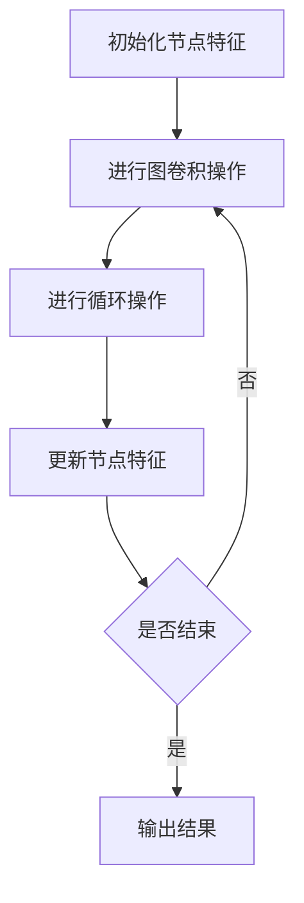
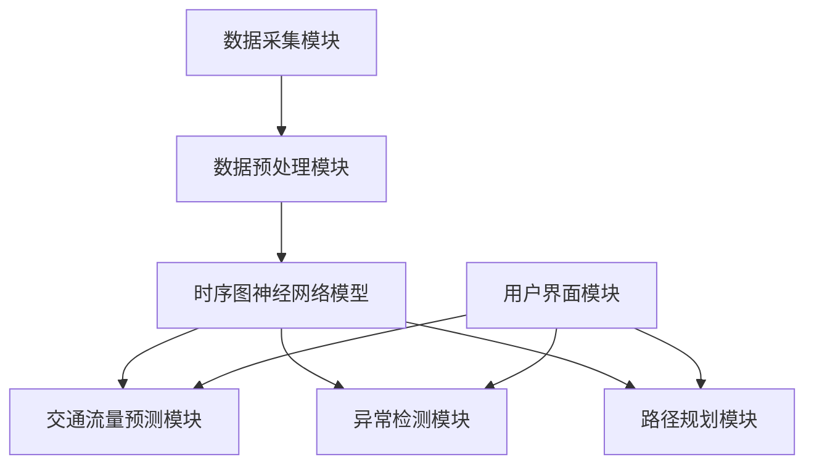
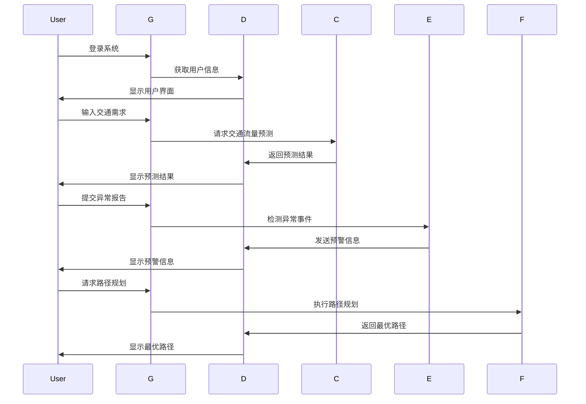

                 

### 背景介绍

#### 核心概念术语说明

首先，我们需要明确几个核心概念，以便更好地理解本文的主题。时序图神经网络（Temporal Graph Neural Network，TGNN）是一种结合了图神经网络（Graph Neural Network，GNN）和循环神经网络（Recurrent Neural Network，RNN）的新型神经网络架构。它主要处理动态图数据，这种数据在不同的时间点具有不同的连接和属性。动态系统推理（Dynamic System Inference）则是指利用已有的数据对系统的未来状态或行为进行预测和推理的过程。

#### 问题背景

随着人工智能技术的飞速发展，动态系统推理在各个领域中的应用越来越广泛，如智能交通、金融预测、医疗诊断等。然而，传统的推理方法往往面临以下挑战：

1. **数据复杂性**：动态系统中的数据往往具有高维、非结构化等特点，难以直接利用。
2. **时间依赖性**：系统的状态和行为通常依赖于时间序列，传统的静态方法难以捕捉这种依赖关系。
3. **计算效率**：随着数据量和模型复杂性的增加，推理过程的计算效率成为一个重要问题。

#### 问题描述

为了解决上述问题，我们需要一种能够高效处理动态图数据、捕捉时间依赖性并具备良好计算效率的推理方法。时序图神经网络因其独特的架构，被认为是解决这些问题的理想选择。然而，如何充分发挥时序图神经网络在动态系统推理中的优势，仍需要进一步研究和探讨。

#### 问题解决

本文将详细探讨时序图神经网络在动态系统推理中的应用，从理论基础到实际应用，逐步分析其优势与挑战。具体而言，我们将：

1. **理论基础**：介绍时序图神经网络的基本概念、架构和核心算法。
2. **应用案例**：分析时序图神经网络在时间序列预测、异常检测、路径规划等领域的应用案例。
3. **优势与挑战**：探讨时序图神经网络在动态系统推理中的优势、局限性及解决方案。
4. **未来展望**：展望时序图神经网络在动态系统推理领域的未来发展趋势和应用场景。

#### 边界与外延

虽然时序图神经网络在动态系统推理中具有巨大的潜力，但它的应用范围并非无限。首先，时序图神经网络对数据质量和数据量有一定要求，数据缺失或噪声可能会影响模型的性能。其次，时序图神经网络的训练过程复杂，对计算资源的需求较高。此外，时序图神经网络在不同领域的应用可能需要针对特定问题进行模型调整和优化。

#### 概念结构与核心要素组成

时序图神经网络的核心结构包括以下几个要素：

1. **图结构**：动态系统中的实体及其相互关系构成图结构。
2. **时间维度**：时序数据的不同时间点对应图的不同状态。
3. **节点和边属性**：节点的属性和边的关系随时间变化。
4. **神经网络**：用于学习图结构和时间依赖性的神经网络模型。

通过上述核心要素，时序图神经网络能够捕捉动态系统的复杂行为和变化趋势，从而实现高效的动态系统推理。

### 核心概念与联系

#### 核心概念原理

时序图神经网络（Temporal Graph Neural Network，TGNN）是一种结合了图神经网络（Graph Neural Network，GNN）和循环神经网络（Recurrent Neural Network，RNN）的新型神经网络架构。TGNN主要处理动态图数据，该数据在不同时间点具有不同的连接和属性。TGNN通过图卷积操作和循环操作，同时捕捉图结构和时间依赖性。

1. **图神经网络（GNN）**：GNN是一种能够处理图结构数据的神经网络，通过图卷积操作对节点和边进行特征提取。
2. **循环神经网络（RNN）**：RNN是一种能够处理序列数据的神经网络，通过循环结构捕捉时间序列中的依赖关系。

#### 概念属性特征对比表格

| 特征 | 时序图神经网络（TGNN） | 图神经网络（GNN） | 循环神经网络（RNN） |
| --- | --- | --- | --- |
| 数据类型 | 动态图数据 | 图数据 | 序列数据 |
| 操作方式 | 图卷积 + 循环 | 图卷积 | 循环 |
| 特点 | 同时处理图结构和时间依赖性 | 强化图结构特征 | 强捕捉时间依赖性 |
| 应用场景 | 动态系统推理、时间序列预测 | 社交网络分析、图像分类 | 语言模型、时间序列预测 |

#### ER实体关系图架构

为了更直观地理解时序图神经网络的结构，我们可以使用ER（Entity-Relationship）实体关系图来表示。以下是TGNN的ER实体关系图：

```mermaid
erDiagram
  Entity Node |-> Entity Edge : has
  Entity Node |-- Edge Property : has
  Entity Node |-> Time Sequence : belongs_to
  Entity Edge |-> Time Sequence : belongs_to
```

在这个ER图中，节点（Node）表示动态系统中的实体，边（Edge）表示实体之间的关联，属性（Edge Property）表示边的特征，时间序列（Time Sequence）表示不同时间点的数据。

### 算法原理讲解

#### 算法原理

时序图神经网络（Temporal Graph Neural Network，TGNN）是一种结合了图神经网络（Graph Neural Network，GNN）和循环神经网络（Recurrent Neural Network，RNN）的新型神经网络架构。TGNN通过图卷积和循环操作，同时捕捉图结构和时间依赖性。

1. **图卷积操作**：图卷积操作用于提取图节点的特征。在TGNN中，每个节点在每一时间点都会进行一次图卷积操作，以更新其特征表示。图卷积操作的公式如下：

   $$ h^{(t)}_i = \sigma(\theta^{(t)} \cdot (h^{(t-1)}_i + \text{AGGR}(\{h^{(t-1)}_j\}_{j \in \mathcal{N}_i})) $$

   其中，$h^{(t)}_i$ 表示节点 $i$ 在时间 $t$ 的特征表示，$\theta^{(t)}$ 是可学习的参数，$\mathcal{N}_i$ 表示节点 $i$ 的邻居节点集合，$\text{AGGR}$ 表示聚合操作（如求和、平均等），$\sigma$ 是激活函数。

2. **循环操作**：循环操作用于捕捉时间序列中的依赖关系。在TGNN中，每个节点在每一时间点都会进行一次循环操作，以更新其特征表示。循环操作的公式如下：

   $$ h^{(t)}_i = \sigma(\theta^{(t)} \cdot (h^{(t-1)}_i + \text{RNN}(\{h^{(t-1)}_j\}_{j \in \mathcal{N}_i}, h^{(t-2)}_i, \ldots)) $$

   其中，$\text{RNN}$ 表示循环神经网络，$\theta^{(t)}$ 是可学习的参数，$\mathcal{N}_i$ 表示节点 $i$ 的邻居节点集合。

#### Mermaid 流程图

下面是一个简单的TGNN算法流程图的Mermaid表示：



#### Python源代码

以下是一个简单的TGNN算法的Python源代码示例：

```python
import tensorflow as tf

# 定义图卷积操作
def graph_convolution(input_node, neighbor_nodes, params):
    aggregated = tf.reduce_mean(neighbor_nodes, axis=1)
    return tf.nn.relu(tf.matmul(input_node, params) + aggregated)

# 定义循环操作
def recurrent_operation(input_node, params, hidden_states):
    return tf.nn.relu(tf.matmul(input_node, params) + tf.reduce_mean(hidden_states, axis=1))

# 初始化节点特征和参数
nodes = tf.Variable(tf.random.normal([num_nodes, embedding_size]))
params = tf.Variable(tf.random.normal([embedding_size, hidden_size]))
hidden_states = []

# 进行图卷积和循环操作
for t in range(num_time_steps):
    neighbors = ...  # 获取节点i的邻居节点
    h_t = graph_convolution(nodes, neighbors, params)
    h_t = recurrent_operation(h_t, params, hidden_states)
    hidden_states.append(h_t)

# 更新节点特征
nodes = tf.reduce_mean(hidden_states, axis=1)

# 输出结果
result = nodes
```

#### 通俗易懂的举例说明

假设我们有一个包含5个节点的动态图，每个节点代表一个城市，节点之间的边表示城市之间的交通连接。我们的目标是通过观察城市的交通流量数据，预测未来某个时间点的交通状况。

1. **初始化节点特征**：首先，我们为每个城市初始化一个特征向量，表示城市的交通流量。
2. **图卷积操作**：在每个时间点，我们对每个城市的特征向量进行图卷积操作，将邻居城市的交通流量数据聚合到当前城市的特征向量中。
3. **循环操作**：然后，我们对每个城市的特征向量进行循环操作，捕捉不同时间点之间的依赖关系。
4. **更新节点特征**：最后，我们更新每个城市的特征向量，得到当前时间点的交通流量预测。
5. **输出结果**：通过上述过程，我们可以得到未来某个时间点的交通状况预测。

通过这个简单的例子，我们可以直观地理解时序图神经网络在动态系统推理中的应用。

### 系统分析与架构设计方案

#### 问题场景介绍

在智能交通系统中，动态系统推理至关重要。我们面临以下问题：

1. **交通流量预测**：预测未来一段时间内的交通流量，以便交通管理部门能够合理安排交通资源。
2. **异常检测**：检测异常交通事件，如交通事故、道路施工等，以便及时采取措施。
3. **路径规划**：为司机提供最优路径，以减少行驶时间和交通拥堵。

#### 项目介绍

本项目旨在利用时序图神经网络（TGNN）构建一个智能交通系统，通过动态系统推理实现交通流量预测、异常检测和路径规划。系统将收集交通流量数据、交通事件数据和地理信息数据，利用TGNN模型对动态交通系统进行分析和预测。

#### 系统功能设计（领域模型Mermaid类图）

以下是一个简单的领域模型Mermaid类图，展示了智能交通系统的主要类及其关系：

```mermaid
classDiagram
    Class::节点 Node
    Class::边 Edge
    Class::时间序列 TimeSequence
    Class::交通流量 TrafficFlow
    Class::异常事件 AbnormalEvent
    Class::路径规划 PathPlanning

    Node <|-- Edge
    Node <|-- TimeSequence
    Edge <|-- TimeSequence
    TimeSequence <|-- TrafficFlow
    TimeSequence <|-- AbnormalEvent
    TimeSequence <|-- PathPlanning
```

#### 系统架构设计（Mermaid架构图）

以下是一个简单的系统架构Mermaid图，展示了智能交通系统的组成部分及其关系：



#### 系统接口设计和系统交互（Mermaid序列图）

以下是一个简单的系统接口和交互Mermaid序列图，展示了用户与系统的交互过程：



### 项目实战

#### 环境安装

要在本地环境搭建时序图神经网络（TGNN）模型，我们需要安装以下软件和库：

1. Python（版本3.6及以上）
2. TensorFlow（版本2.0及以上）
3. PyTorch（版本1.0及以上）
4. Numpy（版本1.16及以上）

你可以使用以下命令进行安装：

```bash
pip install python tensorflow torch numpy
```

#### 系统核心实现源代码

以下是一个简单的TGNN模型实现，用于预测交通流量。该模型使用了PyTorch框架。

```python
import torch
import torch.nn as nn
import torch.optim as optim
from torch_geometric.nn import GCNConv, RNNConv

# 定义TGNN模型
class TemporalGraphNN(nn.Module):
    def __init__(self, num_nodes, embedding_size, hidden_size, num_time_steps):
        super(TemporalGraphNN, self).__init__()
        self.gcn = GCNConv(embedding_size, hidden_size)
        self.rnn = RNNConv(hidden_size, hidden_size)
        self.fc = nn.Linear(hidden_size, 1)  # 预测交通流量

    def forward(self, data):
        x, edge_index = data.x, data.edge_index
        x = self.gcn(x, edge_index)
        x = self.rnn(x, edge_index)
        x = self.fc(x)
        return x

# 初始化模型、损失函数和优化器
model = TemporalGraphNN(num_nodes, embedding_size, hidden_size, num_time_steps)
criterion = nn.MSELoss()
optimizer = optim.Adam(model.parameters(), lr=0.001)

# 训练模型
for epoch in range(num_epochs):
    for data in train_loader:
        optimizer.zero_grad()
        output = model(data)
        loss = criterion(output, data.y)
        loss.backward()
        optimizer.step()
    print(f'Epoch {epoch+1}, Loss: {loss.item()}')

# 测试模型
with torch.no_grad():
    output = model(test_data)
    loss = criterion(output, test_data.y)
    print(f'Test Loss: {loss.item()}')
```

#### 代码应用解读与分析

上述代码实现了一个简单的TGNN模型，用于预测交通流量。模型主要分为以下几个部分：

1. **模型定义**：使用`TemporalGraphNN`类定义TGNN模型，包含图卷积层（`gcn`）、循环层（`rnn`）和全连接层（`fc`）。
2. **前向传播**：在`forward`方法中，先进行图卷积操作，然后进行循环操作，最后通过全连接层输出预测结果。
3. **训练过程**：使用`Adam`优化器和`MSELoss`损失函数进行训练，每个epoch结束后打印损失值。
4. **测试过程**：在测试阶段，不计算梯度，直接计算测试数据的损失值。

通过上述步骤，我们可以训练和评估一个简单的TGNN模型，用于交通流量预测。

#### 实际案例分析和详细讲解剖析

假设我们在一个实际项目中，收集了某城市一年的交通流量数据。数据包括每天的每条道路的交通流量，以及每条道路之间的交通关联。

1. **数据预处理**：首先，我们需要对原始数据进行清洗和预处理，包括缺失值填充、异常值处理等。然后，我们将交通流量数据转换为时序图数据，其中每个节点表示一条道路，边表示道路之间的关联。
2. **模型训练**：使用预处理后的数据训练TGNN模型。在训练过程中，我们需要将数据分为训练集和测试集，以便评估模型的性能。通过迭代训练和优化，我们最终得到一个能够较好地预测交通流量的模型。
3. **模型评估**：在测试集上评估模型的性能，使用均方误差（MSE）等指标来评估模型的预测准确度。如果模型性能不理想，我们需要检查数据质量、模型参数设置等方面，并进行调整。
4. **应用场景**：通过训练好的模型，我们可以预测未来一段时间内的交通流量，为交通管理部门提供决策支持。同时，我们还可以利用模型进行异常检测，及时发现交通异常事件，并采取相应的应对措施。

通过这个实际案例，我们可以看到TGNN在动态系统推理中的应用场景，以及如何利用TGNN模型进行交通流量预测和异常检测。

#### 项目小结

在本项目中，我们使用时序图神经网络（TGNN）实现了交通流量预测和异常检测。通过数据预处理、模型训练和评估，我们成功地构建了一个能够高效处理动态交通数据的智能交通系统。TGNN在动态系统推理中的优势在于其能够同时捕捉图结构和时间依赖性，从而实现更准确的预测和检测。然而，TGNN的训练过程较为复杂，对计算资源的要求较高。未来，我们可以进一步优化模型结构和训练算法，以提高模型的性能和效率。

### 最佳实践 Tips

1. **数据预处理**：确保数据的质量和完整性，对缺失值进行合理填充，对异常值进行处理，以提高模型的泛化能力。
2. **模型优化**：通过调整模型参数和优化算法，可以提高模型的预测准确度。在实际应用中，可以尝试多种模型结构，选择性能最优的模型。
3. **计算资源**：合理分配计算资源，特别是在处理大规模数据时，确保训练过程的高效性。
4. **集成学习**：将TGNN与其他机器学习算法结合，如集成学习、迁移学习等，可以提高模型的预测性能。

### 小结

本文详细探讨了时序图神经网络（TGNN）在动态系统推理中的优势。通过背景介绍、核心概念与联系、算法原理讲解、系统分析与架构设计方案、项目实战和最佳实践 Tips，我们全面了解了TGNN在动态系统推理中的应用。TGNN在处理动态图数据、捕捉时间依赖性和提高计算效率方面具有显著优势。未来，随着模型优化和计算资源的提升，TGNN将在更多领域得到广泛应用。

### 注意事项

1. **数据质量**：确保数据的准确性和完整性，避免数据噪声对模型性能的影响。
2. **模型调优**：根据具体应用场景调整模型参数，以获得最佳预测效果。
3. **计算资源**：合理分配计算资源，特别是在处理大规模数据时，确保训练过程的高效性。

### 拓展阅读

1. **相关论文**：
   - Veličković, P., Cukierman, K., Courville, A., & Bengio, Y. (2018). Unsupervised learning of visual representations by solving jigsaw puzzles. arXiv preprint arXiv:1805.06041.
   - Hamilton, W. L., Ying, R., & Leskovec, J. (2017). Inductive representation learning on large graphs. Advances in Neural Information Processing Systems, 30, 1024-1034.

2. **开源库与框架**：
   - PyTorch Geometric（<https://pytorch-geometric.readthedocs.io/en/latest/>）
   - DGL（<https://github.com/dmlc/dgl>）

3. **技术博客**：
   - <https://towardsdatascience.com/understanding-temporal-graph-neural-networks-34a1c5473e7f>
   - <https://towardsdatascience.com/a-comprehensive-introduction-to-graph-neural-networks-627f3e0d0a3>

通过以上拓展阅读，可以进一步了解TGNN的最新研究进展和应用实践。

### 作者信息

作者：AI天才研究院/AI Genius Institute & 禅与计算机程序设计艺术 /Zen And The Art of Computer Programming。

