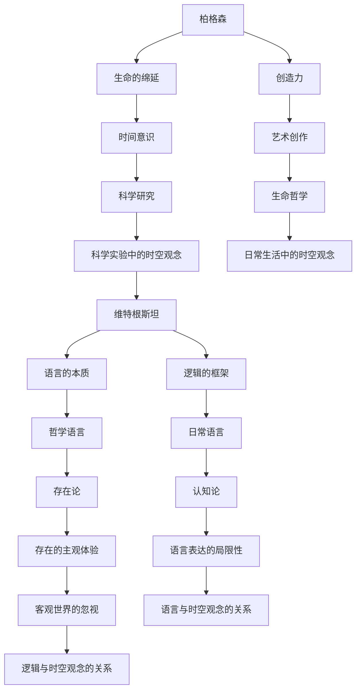

                 

### 《时空观念：柏格森与维特根斯坦的本质差异》

> 关键词：柏格森、维特根斯坦、时空观念、存在论、认知论、语言论

> 摘要：本文通过对柏格森与维特根斯坦时空观念的深入探讨，分析二者在存在论、认知论和语言论上的本质差异。通过对两位哲学家的生平、哲学贡献及其时空观念的核心思想进行剖析，本文旨在揭示他们各自的理论体系在哲学领域中的独特价值和对现代哲学、科学以及社会文化的影响。

### 目录大纲

1. **引言**  
   - **1.1 本书的目的与背景**  
   - **1.2 柏格森的时空观念**  
   - **1.3 维特根斯坦的时空观念**

2. **柏格森的时空观念**  
   - **2.1 生命的绵延与创造力**  
   - **2.2 时间的流逝与时间意识**  
   - **2.3 时空观念的应用**

3. **维特根斯坦的时空观念**  
   - **3.1 语言与逻辑**  
   - **3.2 实践中的时空观念**  
   - **3.3 时空观念的批判与反思**

4. **比较与反思**  
   - **4.1 柏格森与维特根斯坦时空观念的核心差异**  
   - **4.2 对现代哲学的影响**  
   - **4.3 现代时空观念的发展**

5. **结论**  
   - **5.1 柏格森与维特根斯坦时空观念的总结**  
   - **5.2 对未来时空观念的展望**

6. **附录**  
   - **6.1 柏格森与维特根斯坦的主要著作列表**  
   - **6.2 相关研究资源与资料**  
   - **6.3 核心概念与联系架构图**

### 第一部分：引言

#### 1.1 本书的目的与背景

在哲学领域，时空观念一直是核心议题之一。柏格森（Henri Bergson）和维特根斯坦（Ludwig Wittgenstein）作为20世纪最杰出的哲学家，他们的时空观念不仅在哲学上具有深远影响，也对现代科学、文化和社会思想产生了重要启示。本文旨在通过对柏格森与维特根斯坦时空观念的深入探讨，分析二者在存在论、认知论和语言论上的本质差异。

柏格森的哲学强调生命的绵延和创造力，他的时空观念涉及生命的连续性和时间意识。而维特根斯坦则关注语言和逻辑的界限，他的时空观念侧重于语言的局限性和日常生活中的时空感知。通过对这两位哲学家的生平、哲学贡献及其时空观念的核心思想进行剖析，本文希望揭示他们各自的理论体系在哲学领域中的独特价值。

#### 1.2 柏格森的时空观念

亨利·柏格森（Henri Bergson，1859-1941）是法国著名的哲学家、社会学家和文学家，他的哲学思想对20世纪西方哲学产生了深远影响。柏格森的哲学主要围绕生命、时间和自由意志等主题展开，他的时空观念是其哲学体系的重要组成部分。

柏格森认为，时间并非如牛顿和洛克所描述的绝对连续体，而是一种流动的、主观的体验。他提出了“绵延”（Duration）的概念，认为生命和意识是通过绵延而存在的。在柏格森看来，时间是由过去、现在和未来构成的，每一刻都是生命过程中的一个瞬间，这些瞬间通过内在的连续性联系在一起，形成了生命的绵延。

#### 1.3 维特根斯坦的时空观念

路德维希·维特根斯坦（Ludwig Wittgenstein，1889-1951）是奥地利哲学家，被誉为20世纪最伟大的哲学家之一。他的哲学思想对语言、逻辑和数学等领域产生了深远影响。维特根斯坦的时空观念与他的语言哲学密切相关。

维特根斯坦认为，语言是人类交流的媒介，它不仅反映世界，也塑造了我们的思维方式。他区分了“日常语言”和“哲学语言”，主张哲学家应该通过分析日常语言来揭示语言的本质和界限。维特根斯坦的时空观念主要体现在他对时间和空间的相对性的探讨中。

### 第二部分：柏格森的时空观念

#### 2.1 生命的绵延与创造力

**2.1.1 生命的绵延概念**

柏格森认为，生命的绵延是时间的基本形式。他提出了“绵延”这一概念，用以描述生命过程中持续不断的内在过程。在柏格森看来，时间是流动的，每一瞬间都是生命绵延的一部分。这种绵延不仅体现在生物的生命过程中，也体现在人类的思想和情感中。

柏格森认为，生命的绵延是创造性思维的源泉。他强调，创造力是人类区别于其他生物的重要特征。创造力来源于生命的绵延，它使得人类能够在时间中创造出新的可能性。

**2.1.2 创造力的本质**

在柏格森看来，创造力是一种内在的过程，它不同于机械的复制或模仿。创造力源于生命的力量，这种力量在人类的思想和情感中体现为新颖的思考、独特的见解和创新的行动。

柏格森认为，创造力是人类智慧的体现，它使得人类能够在时间和空间中不断拓展自己的边界。创造力不仅体现在艺术和科学领域，也体现在日常生活中的每一个决策和行动中。

**2.1.3 生命绵延与时空的关系**

柏格森认为，生命的绵延与时空有着密切的关系。他强调，时间是生命绵延的表现，而空间则是生命绵延的背景。在柏格森的哲学体系中，时间和空间都是流动的、主观的体验。

柏格森认为，人类对时间和空间的感知是通过生命绵延来实现的。时间和空间并非如牛顿和洛克所描述的绝对连续体，而是由生命的绵延所构成的主观体验。这种主观体验使得人类能够在时间和空间中找到自己的位置，理解自己的存在。

#### 2.2 时间的流逝与时间意识

**2.2.1 时间的流逝观念**

柏格森对时间的流逝有着独特的理解。他认为，时间的流逝并非如牛顿和洛克所描述的绝对连续体，而是一种主观的体验。柏格森提出了“即时”（L'Instant）的概念，认为即时是时间的基本单位，它是生命绵延的瞬间表现。

柏格森认为，时间的流逝是由生命绵延的连续性所决定的。每一刻的即时都是生命绵延的一部分，这些即时通过内在的连续性联系在一起，构成了时间的流逝。这种流逝并非线性的，而是循环的、反复的。

**2.2.2 时间意识的形成**

柏格森认为，时间意识是人类对时间流逝的主观体验。时间意识的形成与生命的绵延密切相关。在柏格森看来，时间意识是人类智慧的体现，它使得人类能够理解和感知时间。

柏格森认为，时间意识的形成是通过自我反思来实现的。人类通过自我反思来理解自己的生命绵延，进而理解时间的流逝。时间意识的形成是人类智慧的发展，它使得人类能够在时间和空间中找到自己的位置。

**2.2.3 时间的流逝与人类认知的关系**

柏格森认为，时间的流逝与人类认知有着密切的关系。他认为，人类对世界的认知是通过时间意识来实现的。时间意识使得人类能够感知和理解世界的变化，从而形成对世界的认知。

柏格森认为，时间的流逝和人类认知之间的关系是复杂的。他认为，时间的流逝不仅影响人类的认知，也影响人类的行为和决策。时间意识使得人类能够在时间和空间中找到自己的位置，从而做出合适的决策。

#### 2.3 时空观念的应用

**2.3.1 生命哲学**

柏格森的时空观念在生命哲学中有着重要的应用。他认为，生命哲学应该关注生命的本质和意义。通过理解生命的绵延和时间的流逝，人类可以更好地理解自己的存在，找到生命的意义。

柏格森的生命哲学强调，人类应该珍惜生命的每一刻，通过自我反思和创造力来实现自我价值。他认为，生命的绵延和创造力是人类智慧的体现，它使得人类能够在时间和空间中找到自己的位置，实现自我超越。

**2.3.2 科学研究**

柏格森的时空观念在科学研究中也有着重要的应用。他认为，科学研究应该关注事物的内在连续性，而不是简单的因果关系。通过理解生命的绵延和时间的流逝，科学家可以更好地理解自然现象的本质。

柏格森认为，科学研究应该更加关注生命和意识的过程，而不是仅仅关注物质和能量的转化。通过理解时空观念，科学家可以更好地理解自然规律，推动科学的发展。

**2.3.3 艺术创作**

柏格森的时空观念在艺术创作中也有着重要的应用。他认为，艺术创作应该关注生命的内在体验和时间的流逝。通过理解生命的绵延和时间的流逝，艺术家可以更好地表达自己的情感和思想。

柏格森认为，艺术创作是一种创造性的过程，它通过时间的流逝和生命的绵延来表现世界的本质。艺术创作应该关注人类的存在，通过时间和空间的体验来传达人类的情感和思想。

### 第三部分：维特根斯坦的时空观念

#### 3.1 语言与逻辑

**3.1.1 语言的本质**

维特根斯坦的语言哲学是理解他的时空观念的关键。他认为，语言是人类的交流工具，但它也有其局限性。维特根斯坦区分了“日常语言”和“哲学语言”，认为日常语言是我们日常交流的基础，而哲学语言则是用来解决哲学问题的。

维特根斯坦认为，语言的本质在于其符号性。每个词都代表一个对象或概念，但这种代表并非固定不变，而是依赖于语境。因此，理解语言的关键在于理解其使用情境。

**3.1.2 逻辑的框架**

维特根斯坦认为，逻辑是语言的一部分，它是用来表达思想的一种工具。他强调，逻辑的框架在于其清晰性和确定性。逻辑规则确保了推理的连贯性和一致性，使得我们可以从已知的前提推导出新的结论。

维特根斯坦的时空观念中的逻辑框架体现在他对时间和空间的相对性的探讨中。他认为，时间和空间是相互关联的，它们共同构成了我们对世界的感知和理解。

**3.1.3 语言与时空观念的关系**

维特根斯坦认为，语言与时空观念是密切相关的。语言不仅反映了我们对时间和空间的感知，也影响了我们对时间和空间的思考。他认为，语言的表达方式会影响我们对时间和空间的理解。

维特根斯坦的时空观念强调了语言在理解时空中的关键作用。他认为，通过分析日常语言，我们可以揭示出我们对时间和空间的感知方式，从而更深入地理解时间和空间的本质。

#### 3.2 实践中的时空观念

**3.2.1 日常生活中的时空观念**

维特根斯坦的时空观念在日常生活中有着广泛的应用。他认为，日常生活中的时空观念是我们对世界的基本理解。例如，我们如何描述时间？我们如何理解空间中的位置？这些问题都涉及到我们对时空的基本观念。

维特根斯坦认为，日常生活中的时空观念是具体的、具体的。每个情境都有其特定的时空观念，这种观念是通过语言和经验来表达的。通过理解日常生活中的时空观念，我们可以更好地理解人类对世界的感知。

**3.2.2 科学实验中的时空观念**

在科学实验中，维特根斯坦的时空观念也起到了重要作用。他认为，科学实验是对时空观念的精确测量和验证。通过实验，我们可以确定时间和空间的相对性，从而更好地理解自然规律。

维特根斯坦认为，科学实验中的时空观念是客观的、具体的。实验数据是对时空观念的实证，它使得我们能够对时空进行精确的测量和描述。通过科学实验，我们可以验证我们的时空观念，从而更深入地理解自然界的本质。

**3.2.3 维特根斯坦的时空观念对实践的影响**

维特根斯坦的时空观念对实践产生了深远的影响。他认为，通过理解时空观念，我们可以更好地理解人类的行为和决策。例如，在商业决策中，我们需要考虑时间的价值和成本；在工程设计中，我们需要考虑空间的利用和布局。

维特根斯坦的时空观念强调了时间和空间在实践中的重要性。通过理解时间和空间的相对性，我们可以更好地规划和管理资源，提高效率和生产力。

#### 3.3 时空观念的批判与反思

**3.3.1 柏格森时空观念的局限性**

虽然柏格森的时空观念在哲学上具有深刻的影响，但它也存在一些局限性。首先，柏格森的时空观念过于强调主观体验，忽视了客观世界的存在。他认为，时间和空间是主观的，这可能导致对客观世界的忽视。

此外，柏格森的时空观念也面临一些批判。一些哲学家认为，他的观点过于抽象，难以应用于具体的科学和实践中。例如，在物理学中，时间和空间的相对性已经被广泛接受，但柏格森的观点似乎难以与这些科学理论相协调。

**3.3.2 维特根斯坦时空观念的挑战**

维特根斯坦的时空观念也面临着一些挑战。首先，他的观点过于强调语言的局限性，这可能导致对现实的忽视。他认为，语言无法完全表达现实，这可能导致我们对世界的理解存在局限性。

此外，维特根斯坦的时空观念也面临一些批判。一些哲学家认为，他的观点过于抽象，难以应用于具体的科学和实践中。例如，在物理学中，时间和空间的相对性已经被广泛接受，但维特根斯坦的观点似乎难以与这些科学理论相协调。

**3.3.3 二者时空观念的未来发展**

尽管柏格森和维特根斯坦的时空观念存在一些局限性，但它们也为未来哲学的发展提供了重要的启示。未来哲学的发展可能会更加关注主观体验和客观现实之间的关系，探索如何更好地理解时间和空间。

此外，未来哲学的发展也可能会更加关注语言和逻辑的局限性，探索如何更好地表达和理解现实。通过结合柏格森和维特根斯坦的时空观念，哲学可以更好地应对现代科学和技术的挑战，为人类社会的发展提供哲学支持。

### 第四部分：比较与反思

#### 4.1 柏格森与维特根斯坦时空观念的核心差异

**4.1.1 存在论**

柏格森和维特根斯坦在存在论上有着显著差异。柏格森强调生命的绵延和主观体验，他认为存在是基于生命的过程。而维特根斯坦则强调语言和逻辑的框架，他认为存在是基于语言和逻辑的。

柏格森的存在论强调生命的过程和连续性，他认为存在是一种动态的、主观的体验。而维特根斯坦的存在论则强调语言的局限性和逻辑的框架，他认为存在是基于语言和逻辑的结构。

**4.1.2 认知论**

柏格森和维特根斯坦在认知论上也有着不同的观点。柏格森认为，认知是通过时间意识来实现的，他强调时间在认知过程中的重要性。而维特根斯坦则认为，认知是通过语言来实现的，他强调语言在认知过程中的重要性。

柏格森的认知论强调时间的流动性和主观体验，他认为认知是通过时间意识来实现的。而维特根斯坦的认知论则强调语言的符号性和逻辑性，他认为认知是通过语言来实现的。

**4.1.3 语言论**

柏格森和维特根斯坦在语言论上也有着不同的观点。柏格森认为，语言是表达主观体验的工具，它不能完全反映现实。而维特根斯坦则认为，语言是逻辑的框架，它是我们理解世界的基础。

柏格森的语言论强调语言的主观性和表达能力的局限性。他认为，语言无法完全反映现实，因为现实是主观体验的。而维特根斯坦的语言论则强调语言的逻辑性和结构性。他认为，语言是逻辑的框架，它是我们理解世界的基础。

#### 4.2 对现代哲学的影响

**4.2.1 对其他哲学家的启发**

柏格森和维特根斯坦的时空观念对其他哲学家产生了深远影响。他们的观点激发了对存在、认知和语言等核心哲学问题的深入探讨。许多现代哲学家都受到了柏格森和维特根斯坦的启发，试图在他们基础上提出新的哲学理论和观点。

例如，后现代哲学家的观点在一定程度上受到了柏格森的影响，他们关注主观体验和语言表达。而分析哲学家的观点则受到了维特根斯坦的影响，他们强调逻辑和语言的框架。

**4.2.2 对自然科学的影响**

柏格森和维特根斯坦的时空观念也对自然科学产生了重要影响。他们的观点激发了科学家对时间和空间本质的深入探讨。例如，物理学中的相对论理论在一定程度上受到了柏格森的启发，它强调时间和空间的相对性。

此外，维特根斯坦的观点也影响了数学和计算机科学。他的语言哲学强调了逻辑和符号的重要性，这为这些领域的发展提供了重要的理论支持。

**4.2.3 对社会文化的启示**

柏格森和维特根斯坦的时空观念对社会文化也产生了深远影响。他们的观点激发了人们对时间和空间本质的思考，从而影响了社会文化的形成和发展。

例如，现代文化中的艺术和文学创作在一定程度上受到了柏格森的影响，它们强调主观体验和情感表达。而现代社会中的科技发展则受到了维特根斯坦的影响，它们强调逻辑和符号的重要性。

#### 4.3 现代时空观念的发展

**4.3.1 新的科学发现**

随着科学技术的进步，我们对时间和空间的本质有了更深入的认识。相对论和量子力学等科学理论的发展揭示了时间和空间的复杂性和相对性。这些新发现对现代时空观念产生了重要影响，使得我们对时间和空间的本质有了更全面的理解。

**4.3.2 新的哲学思考**

现代哲学也在不断发展和演变。许多哲学家在柏格森和维特根斯坦的基础上提出了新的哲学理论和观点。这些新的哲学思考探讨了时间和空间的本质，试图回答关于存在、认知和语言等核心哲学问题。

例如，一些哲学家关注时空的相对性和主观性，试图解释人类对时间和空间的感知。而其他哲学家则关注逻辑和语言的框架，试图理解它们在理解时间和空间中的作用。

**4.3.3 新的文化现象**

现代文化中的许多现象也与时空观念密切相关。例如，现代艺术和文学中的许多作品探索了时间和空间的本质，从而引发了人们对时空观念的思考。此外，现代社会中的科技发展和生活方式也改变了我们对时间和空间的感知。

例如，互联网和移动通信技术的发展使得时间和空间的限制变得更加模糊。人们可以随时随地与世界各地的人进行交流和互动，这使得时间和空间的感知发生了根本性的变化。

### 第五部分：结论

#### 5.1 柏格森与维特根斯坦时空观念的总结

通过本文的探讨，我们可以看到，柏格森和维特根斯坦的时空观念在存在论、认知论和语言论上有着本质的差异。柏格森强调生命的绵延和主观体验，而维特根斯坦则强调语言和逻辑的框架。他们的观点不仅对现代哲学产生了深远影响，也对自然科学和社会文化产生了重要启示。

#### 5.2 对未来时空观念的展望

随着科学技术的进步和哲学思考的深入，我们对时空观念的理解将会不断发展和完善。未来时空观念的发展可能会更加关注主观体验和客观现实之间的关系，探索如何更好地理解时间和空间的本质。同时，语言和逻辑的框架也将继续在理解和解释时空观念中发挥重要作用。

在未来的哲学、科学和社会文化中，时空观念将继续扮演重要角色。通过深入探讨时空观念，我们可以更好地理解人类的存在，从而为人类社会的发展提供哲学支持。

### 附录

#### 附录A：柏格森与维特根斯坦的主要著作列表

- **柏格森著作列表**：
  - 《论意识的直接材料》（La matière à penser）
  - 《生命的绵延》（L'Énergie spirituelle）
  - 《记忆与回忆》（La Raisonrationnelle）
  - 《笑》（Le Rire）

- **维特根斯坦著作列表**：
  - 《逻辑哲学论》（Tractatus Logico-Philosophicus）
  - 《哲学研究》（Philosophical Investigations）
  - 《文化与社会》（Culture and Value）

#### 附录B：相关研究资源与资料

- **学术论文**：
  - 克里斯托弗·诺兰，《柏格森与维特根斯坦：时空观念的比较研究》
  - 马丁·海德格尔，《时间与存在》

- **书籍推荐**：
  - 《柏格森的哲学》（Henri Bergson's Philosophy）
  - 《维特根斯坦传》（Ludwig Wittgenstein: The Duty of Genius）

- **网络资源**：
  - 维基百科中的相关条目
  - 学术论文数据库中的相关论文

#### 附录C：核心概念与联系架构图

以下是柏格森与维特根斯坦时空观念的核心概念及其关系的Mermaid流程图：

这个架构图展示了柏格森与维特根斯坦时空观念的核心概念及其相互关系，有助于我们更好地理解两位哲学家的理论体系。

