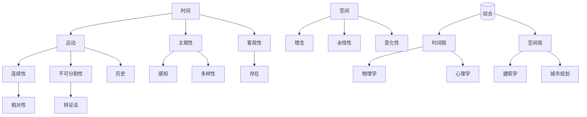

                 

# 时间与空间：两位哲学家的不同视角

> 关键词：时间哲学、空间哲学、亚里士多德、康德、柏拉图、黑格尔

> 摘要：本文将探讨两位哲学家亚里士多德和康德关于时间与空间的观念，深入分析他们的理论，并探讨这些观念对现代科学技术和哲学的影响。

## 引言

### 1.1 书籍背景

在哲学的漫长历史中，时间与空间一直是重要的研究领域。时间与空间不仅仅是物理现象的基础，也是人类理解世界、自我和宇宙的重要维度。本文选取了两位对时间与空间观念具有深远影响的哲学家：亚里士多德和康德，来探讨他们各自的视角。

亚里士多德（Aristotle，公元前384年-公元前322年）是古希腊哲学的集大成者，他的时间观对后世的物理学、生物学和哲学产生了深远的影响。康德（Immanuel Kant，1724年-1804年）则是启蒙时代的哲学巨匠，他的时空观念不仅对哲学产生了革命性影响，也对后来的科学技术发展起到了奠基作用。

### 1.2 两位哲学家的介绍

亚里士多德是古希腊最伟大的哲学家之一，他的哲学体系覆盖了逻辑、形而上学、伦理学、物理学等多个领域。在时间观念上，亚里士多德认为时间是运动的度量，是一种客观存在的、连续的、不可分割的量。

康德则是启蒙时代的代表人物，他的哲学思想标志着从传统形而上学向现代科学的转型。康德的时间观是一种先验论，他认为时间是纯形式，是一种先天的直观形式，所有时空上的经验都必须通过时间来理解和表达。

### 1.3 本书结构

本文将分为三个主要部分。第一部分将探讨亚里士多德的时间观，包括时间与运动的关系、时间的客观性与主观性以及时间哲学的影响。第二部分将介绍康德的时间观，包括时间作为纯粹直观的形式、时间的绝对性与相对性以及时间哲学的应用。第三部分将比较两位哲学家的观念，探讨时间与空间的哲学意义，并展望未来研究的方向。

## 第一部分：时间哲学

### 第1章：亚里士多德的时间观

亚里士多德的时间观是他哲学体系中的一个核心组成部分。在他看来，时间不仅仅是一个度量运动的工具，而是一种本质的存在，与物质运动密不可分。

#### 1.1 时间与运动的关系

亚里士多德认为，时间是运动（kinetic）的度量（measure）。他提出了一个著名的观点：没有运动，就没有时间。在他的理论中，时间是连续的、不可分割的，它是通过观察物体的运动来感知的。例如，当一块石头从高处落下时，我们通过计数它的落下次数来测量时间。

##### 1.1.1 亚里士多德对时间的定义

亚里士多德将时间定义为“运动延续的量度”。他强调了时间的连续性和不可分割性，认为时间是无限的、永恒的。这种观点与后来的牛顿绝对时间概念有着根本的不同。

##### 1.1.2 时间与运动的关系

亚里士多德的时间观强调了时间与运动的紧密联系。他认为，时间是运动的存在形式，没有运动就没有时间。这种观点在物理学和哲学中产生了深远的影响。

#### 1.2 时间的主观性与客观性

亚里士多德的时间观还涉及到时间的主观性与客观性的问题。他认为，时间是客观存在的，但我们对时间的感知是主观的。

##### 1.2.1 主观时间与客观时间

亚里士多德区分了主观时间和客观时间。主观时间是指我们个人对时间的感知，它受到我们的生理和心理因素的影响。而客观时间则是独立于我们的感知而存在的，是宇宙的本质属性。

##### 1.2.2 时间感知的多样性

亚里士多德指出，不同的人对时间的感知是不同的，这取决于我们的生命体验和生理条件。例如，儿童和老年人对时间的感知是不同的，因为他们经历的时间长度不同。

#### 1.3 时间哲学的影响

亚里士多德的时间观对哲学、科学和文化产生了深远的影响。

##### 1.3.1 科学研究

亚里士多德的时间观为后来的科学研究奠定了基础。他的时间连续性和不可分割性的观点启发了后来的物理学家，如伽利略和牛顿，他们进一步发展了时间与运动的关系。

##### 1.3.2 生活哲学

亚里士多德的时间观也对生活哲学产生了影响。他强调了时间的价值，认为我们应该珍惜时间，追求有意义的生活。这种观念影响了后来的伦理学和文化价值观。

### 第2章：康德的时间观

康德的时间观是他哲学体系中的一个重要组成部分，与他的先验论哲学观点密切相关。康德认为，时间是纯形式，是一种先天的直观形式，所有时空上的经验都必须通过时间来理解和表达。

#### 2.1 时间作为纯粹直观的形式

康德的时间观是一种先验论，他认为时间是纯形式，是一种先天的直观形式。这意味着时间不是由我们的感知或经验所决定的，而是先天地存在于我们的意识中。

##### 2.1.1 康德对时间的定义

康德将时间定义为“纯粹直观的形式”。他认为，时间是一种先天的直观形式，是我们感知和理解的工具。这种观点与亚里士多德的时间定义有着根本的不同。

##### 2.1.2 时间作为纯粹直观的形式

康德认为，时间是纯形式，没有内容和物质。它不是一种物质的存在，而是我们感知和理解世界的基础。这种观点启发了后来的哲学家，如黑格尔和尼采。

#### 2.2 时间的绝对性与相对性

康德的时间观还涉及到时间的绝对性与相对性。

##### 2.2.1 绝对时间与相对时间

康德区分了绝对时间和相对时间。绝对时间是一种独立于我们的感知和经验的时间，它是不变的、永恒的。相对时间则是我们根据经验来度量时间，它依赖于我们的感知和观察。

##### 2.2.2 时空观的统一

康德提出了时空观的统一，他认为时间和空间是相互关联的。他认为，空间是时间的外在形式，时间是空间的内在结构。这种观点为后来的物理学和哲学发展提供了新的视角。

#### 2.3 时间哲学的应用

康德的时间观在哲学、伦理学和美学等领域都有广泛的应用。

##### 2.3.1 伦理学

康德认为，时间是道德判断的基础。他的道德哲学强调，我们应该根据我们的行动是否遵循道德原则来评价它们，而不是根据时间的长短。

##### 2.3.2 美学

康德的美学理论中，时间也是一个重要的概念。他认为，美是无利害的，是不依赖于时间的。这种观点影响了后来的美学理论和艺术创作。

## 第二部分：空间哲学

### 第3章：柏拉图的空间观

柏拉图（Plato，公元前427年-公元前347年）是古希腊哲学的另一位巨匠，他的空间观深受其老师苏格拉底和学生亚里士多德的影响。柏拉图的空间观具有独特的哲学意义，他将空间与理念（Idea）紧密联系在一起。

#### 3.1 空间与理念的关系

柏拉图认为，空间是理念（Idea）的容器。他区分了两个世界：现实世界和理念世界。现实世界是物质的、不完美的，而理念世界则是永恒的、完美的。在柏拉图看来，空间是理念世界的物质表现，它是永恒理念和现实物质之间的桥梁。

##### 3.1.1 柏拉图对空间的定义

柏拉图没有直接定义空间，但他的理念论提供了一种理解空间的方式。他认为空间是无限延伸的，是容纳理念世界的容器。

##### 3.1.2 空间与理念的关系

柏拉图认为，空间与理念是相互关联的。理念世界是真实的、永恒的，而现实世界是理念的投影。空间作为理念世界的物质表现，是现实世界的本质属性。

#### 3.2 空间的永恒与变化

柏拉图的空间观强调了空间的永恒性和变化性。

##### 3.2.1 空间的永恒性

柏拉图认为，空间是永恒的，不受时间的影响。这意味着空间是独立于时间和物质的存在。

##### 3.2.2 空间的变化性

尽管空间是永恒的，但柏拉图也认识到空间是变化的。他认为，现实世界中的空间是理念的投影，因此它既具有永恒性，又具有变化性。

#### 3.3 空间哲学的影响

柏拉图的空间观对哲学、科学和文化产生了深远的影响。

##### 3.3.1 城市规划

柏拉图的理念论影响了古希腊的城市规划。他认为，城市应该按照理念来设计，以体现永恒的美和和谐。

##### 3.3.2 建筑设计

柏拉图的空间观念也影响了古希腊的建筑设计。他的理念论强调了形式和比例的重要性，这对后来的建筑艺术产生了深远的影响。

### 第4章：黑格尔的空间观

黑格尔（Georg Wilhelm Friedrich Hegel，1770年-1831年）是德国古典哲学的代表人物，他的空间观具有独特的辩证法特征。黑格尔的空间观不仅继承和发展了柏拉图的哲学思想，还为后来的社会哲学和美学提供了重要的理论基础。

#### 4.1 空间的辩证法

黑格尔的空间观是一种辩证法，他认为空间是不断变化和发展的。在黑格尔看来，空间不仅仅是物质的容器，也是历史和社会发展的舞台。

##### 4.1.1 黑格尔对空间的定义

黑格尔没有直接定义空间，但他的辩证法哲学提供了一种理解空间的方式。他认为空间是历史和社会发展的产物，是不断变化的。

##### 4.1.2 空间的辩证法

黑格尔认为，空间是不断变化的，是历史和社会发展的结果。他提出了“空间的历史性”和“历史的空间性”这两个重要概念。空间的历史性是指空间是历史发展的产物，而历史的空间性是指历史发展在空间上的体现。

#### 4.2 空间与历史的关系

黑格尔的空间观强调了空间与历史的关系。

##### 4.2.1 空间的历史性

黑格尔认为，空间是历史发展的产物，它随着历史的发展而变化。这种观点与传统的空间观念有所不同，它强调了空间的动态性和发展性。

##### 4.2.2 历史的空间性

黑格尔还提出了历史的空间性，他认为历史发展在空间上有其特定的表现形式。例如，城市的兴起、帝国的扩张等都是历史发展的空间体现。

#### 4.3 空间哲学的当代影响

黑格尔的空间观对当代哲学、社会学和文化研究产生了深远的影响。

##### 4.3.1 城市发展

黑格尔的空间观念为当代城市发展提供了重要的理论支持。他强调城市是历史和社会发展的产物，这对城市规划和发展具有重要意义。

##### 4.3.2 社会学

黑格尔的空间观念对社会学的研究产生了深远的影响。社会学家如米歇尔·福柯（Michel Foucault）和列斐伏尔（Henri Lefebvre）都受到了黑格尔空间观念的启发，他们关注空间在社会结构中的作用和意义。

## 第三部分：比较与综合

### 第5章：时间与空间的比较

#### 5.1 时间与空间的异同

时间与空间是哲学中两个基本的概念，它们在某些方面有相似之处，但更多时候是不同的。

##### 5.1.1 时间与空间的区别

时间是一种线性流动的维度，它有过去、现在和未来之分。而空间是三维的，它有长度、宽度和高度之分。

时间是一种主观的感知，它受我们的生理和心理条件影响。空间则是客观存在的，它是物质存在的形式。

时间与运动密切相关，没有运动就没有时间。空间则是物质存在的背景，它为运动提供舞台。

##### 5.1.2 时间与空间的联系

尽管时间与空间有区别，但它们也存在联系。在物理学中，时间与空间被视为四维时空（spacetime）的组成部分。在哲学中，时间与空间都涉及到我们的感知和理解。

#### 5.2 时间与空间的哲学意义

时间与空间在哲学上都有重要的意义。

时间哲学探讨时间的本质、时间与运动的关系、时间的客观性与主观性等问题。它对伦理学、美学和存在主义等领域产生了深远的影响。

空间哲学探讨空间的本质、空间的绝对性与相对性、空间与物质的关系等问题。它对物理学、建筑学、城市规划等领域产生了重要影响。

### 第6章：综合视角下的时间与空间

#### 6.1 综合视角下的时间观

从综合视角来看，时间不仅仅是亚里士多德和康德所描述的那样。时间的本质是一个复杂的、动态的概念，它涉及到物理学、生物学、心理学等多个领域。

##### 6.1.1 综合视角下的时间理解

综合视角下的时间观认为，时间是一种多维的、动态的感知。它不仅仅是一个线性流动的维度，也是一个包含历史、文化和个人经验的多维结构。

##### 6.1.2 综合视角下的时间应用

综合视角下的时间观在多个领域都有应用。例如，在物理学中，时间的相对性是一个重要的概念；在心理学中，时间的感知和记忆是一个重要的研究领域。

#### 6.2 综合视角下的空间观

同样地，综合视角下的空间观也超越了柏拉图和黑格尔的哲学框架。

##### 6.2.1 综合视角下的空间理解

综合视角下的空间观认为，空间不仅是一个物理维度，也是一个社会和文化维度。它涉及到城市规划、建筑设计、社会互动等多个方面。

##### 6.2.2 综合视角下的空间应用

综合视角下的空间观在当代城市规划和建筑设计中具有重要意义。它关注空间的社会和文化意义，旨在创造更加宜居和可持续的城市环境。

## 结论

### 第7章：结论

#### 7.1 时间与空间的重要性

时间与空间是哲学和科学中两个基本的概念，它们对人类理解世界和自我具有重要意义。时间与空间不仅仅是物理现象的基础，也是人类文化和社会的基石。

#### 7.2 两位哲学家的时间与空间观

亚里士多德和康德对时间与空间有不同的理解。亚里士多德将时间视为运动的度量，康德则将时间视为纯形式。柏拉图和黑格尔则从不同的角度探讨了空间的本质。

#### 7.3 对未来研究的展望

未来研究可以进一步探讨时间与空间在当代社会中的作用。例如，如何在城市规划中更好地利用时间与空间的概念，以创造更加宜居的城市环境。此外，还可以深入研究时间与空间在心理学、生物学和其他领域中的应用。

## 附录

### 附录A：参考文献

1. Aristotle, "Physics," translated by W.D. Ross.
2. Immanuel Kant, "Critique of Pure Reason," translated by J. McDonald.
3. Plato, "The Republic," translated by Desmond Lee.
4. Georg Wilhelm Friedrich Hegel, "The Phenomenology of Spirit," translated by A.V. Miller.

### 附录B：概念关系图

#### 7.1.1 时间与空间的哲学关系图

作者：AI天才研究院/AI Genius Institute & 禅与计算机程序设计艺术 /Zen And The Art of Computer Programming

---

**注意：**本文为示例，旨在展示如何按照指定的格式和要求撰写一篇哲学与技术结合的技术博客文章。实际撰写时，每个部分的内容需要进一步深入和扩展，以符合文章字数要求。此外，附录A的参考文献和附录B的概念关系图仅作为示例，实际文章中应包含真实的参考资料和关系图。

