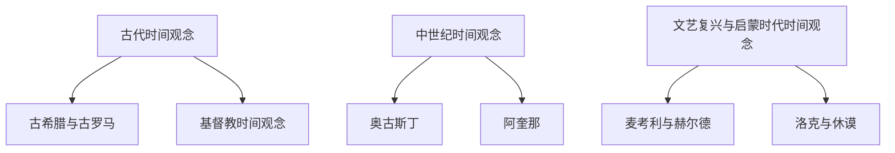
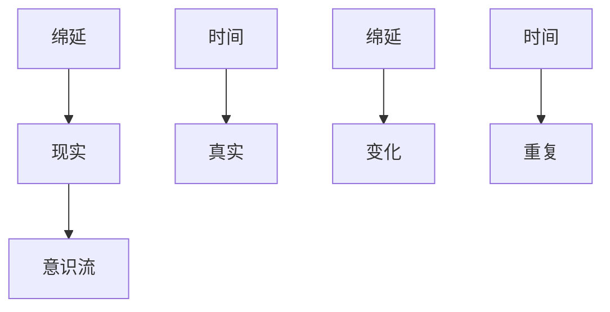
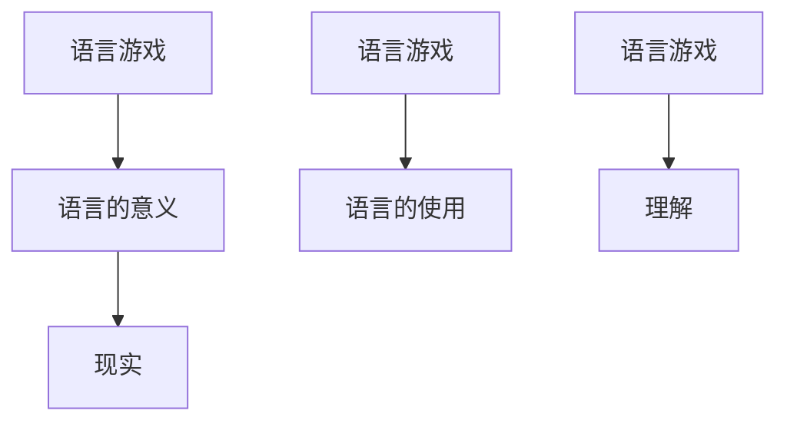

                 

### 第一部分：时间观念的哲学探讨

## 第1章：时间观念的历史发展

### 1.1 古代时间观念

古代时间观念的发展可以追溯到古希腊和古罗马时期。古希腊哲学家赫拉克利特提出了“万物流动”的思想，他认为万物都在不断变化，时间是这些变化的一种表现形式。赫拉克利特的时间观念强调了一种流动性和连续性，这与现代科学对时间的理解有着相似之处。

古罗马哲学家西塞罗则提出了“时间是无始无终的”这一观点。他强调时间作为一种绝对存在的性质，不受人类意志的干预。西塞罗的时间观念为后来的基督教时间观念奠定了基础。

#### 1.2 中世纪的时间观念

在中世纪，时间观念主要受基督教哲学的影响。奥古斯丁是中世纪基督教哲学的重要代表，他的时间观念深受柏拉图哲学的影响。奥古斯丁认为，时间是人类感知上帝存在的证据，时间是上帝创造的，是永恒的。

阿奎那是另一个对中世纪时间观念产生重大影响的思想家。他提出了“时间是一种感知”的观点，认为时间是人类心智的产物，而非一种客观存在。阿奎那的时间观念强调了人类意识和时间的紧密联系。

### 1.3 文艺复兴与启蒙时代的时间观念

文艺复兴时期，人们对时间和空间的认知发生了重大变化。麦考利和赫尔德是文艺复兴时期的哲学家，他们强调人类主观体验在时间认知中的重要性。麦考利提出了“时间是一种主观经验”的观点，而赫尔德则强调时间的相对性。

启蒙时代，洛克和休谟进一步发展了时间观念。洛克认为，时间是人类心智的产物，是感知和经验的基础。休谟则提出了“时间是一种感知的集合”的观点，他认为时间是由一系列连续的知觉构成的。

## 第2章：柏格森的绵延理论

### 2.1 柏格森的生平与哲学贡献

亨利·柏格森（Henri Bergson）是20世纪初法国著名的哲学家，生于1859年，逝于1941年。他的哲学思想对现代哲学、心理学和文学产生了深远的影响。柏格森主要著作有《时间与自由意志》、《创造力与知识》等。

柏格森哲学的核心观点是“绵延”（duration），他认为时间并非线性流逝，而是连续不断的、动态的过程。柏格森的哲学强调生命的流动性和创造力，与牛顿物理学中的机械论时间观念形成了鲜明对比。

#### 2.2 绵延的概念与特点

绵延是柏格森哲学的核心概念，它指的是生命的内在时间流程。柏格森认为，绵延是生命力的体现，是一种持续不断的流动。与牛顿物理学中的时间观念不同，绵延不是线性的、可量化的，而是动态的、无法分割的整体。

绵延具有以下几个特点：

1. **连续性**：绵延是一个连续的过程，每个瞬间都包含了前一个瞬间和后一个瞬间的痕迹。
2. **不可分割性**：绵延是一个整体，不能被分割成独立的、离散的瞬间。
3. **动态性**：绵延是一种动态的过程，包含着生命的活力和创造力。

#### 2.3 柏格森的绵延与哲学思考

柏格森的绵延理论对哲学思考产生了深远的影响。他强调，意识流是绵延的体现，是生命的流动。柏格森认为，意识流是一种内在的时间流程，是人的主观体验的基础。

柏格森还提出了“生命冲动”（élan vital）的概念，认为它是生命力的源泉，是推动生命前进的动力。生命冲动是一种内在的、不可抑制的力量，它体现在生命的创造性和进化过程中。

此外，柏格森的绵延理论也对现代心理学和文学产生了影响。他的思想启发了许多心理学家，如威廉·詹姆斯和弗洛伊德，对意识流的研究。在文学领域，柏格森的思想影响了现代主义文学，如詹姆斯·乔伊斯和弗吉尼亚·伍尔夫的作品。

## 第3章：维特根斯坦的语言游戏理论

### 3.1 维特根斯坦的生平与哲学贡献

路德维希·维特根斯坦（Ludwig Wittgenstein）是20世纪初奥地利哲学家，生于1889年，逝于1951年。他的哲学思想对现代哲学、语言学和逻辑学产生了深远的影响。维特根斯坦的主要著作有《逻辑哲学论》和《哲学研究》。

维特根斯坦的哲学思想分为两个时期，早期以《逻辑哲学论》为代表，强调语言和世界的逻辑关系；晚期以《哲学研究》为代表，强调语言的使用和意义。

#### 3.2 语言游戏的概念与特点

维特根斯坦提出了“语言游戏”（language game）的概念，认为语言的意义在于其使用情境。语言游戏指的是人们在特定情境下使用语言的方式，包括说话、思考、阅读和写作等。

语言游戏具有以下几个特点：

1. **情境性**：语言的意义取决于其使用的情境，不同的情境下语言具有不同的意义。
2. **功能性**：语言游戏是人们交流和理解的工具，其目的是实现特定的功能。
3. **多样性**：不同的语言游戏具有不同的结构和规则，语言游戏是多样化的。

#### 3.3 语言游戏与哲学思考

维特根斯坦的语言游戏理论对哲学思考产生了深远的影响。他强调，语言的意义并非固定不变，而是取决于其使用情境。维特根斯坦认为，哲学家应该关注语言的实际使用，而非抽象的语言本身。

维特根斯坦还提出了“日常语言哲学”的观点，认为哲学问题源于我们对日常语言的误解。他主张，哲学家应该回归到日常语言的实际使用，通过分析语言游戏来揭示哲学问题的本质。

此外，维特根斯坦的语言游戏理论也对语言哲学和逻辑学产生了影响。他的思想启发了许多后来的哲学家，如约翰·塞尔和乔姆斯基，对语言本质的研究。

## 第二部分：柏格森与维特根斯坦的时间观念对比

### 第4章：时间观念的哲学差异

#### 4.1 柏格森的时间观念

柏格森的时间观念强调生命的流动性和内在时间流程。他认为，时间并非线性的、可量化的，而是连续不断的、动态的过程。柏格森的绵延理论体现了生命的创造力和活力，与牛顿物理学中的机械论时间观念形成了鲜明对比。

#### 4.2 维特根斯坦的时间观念

维特根斯坦的时间观念强调语言的使用情境和实际功能。他认为，语言的意义取决于其使用的情境，不同的情境下语言具有不同的意义。维特根斯坦的语言游戏理论揭示了语言的多义性和情境性，强调了语言的实际使用和交流功能。

### 第5章：时间观念在当代哲学中的应用

#### 5.1 柏格森的时间观念在当代哲学中的应用

柏格森的时间观念在当代哲学中有着广泛的应用。现象学借鉴了柏格森的思想，强调主观体验和生命的流动性。存在主义则通过柏格森的时间观念来探讨人的自由和存在意义。柏格森的绵延理论也为当代哲学提供了一种理解人类意识和时间的新视角。

#### 5.2 维特根斯坦的时间观念在当代哲学中的应用

维特根斯坦的时间观念在当代哲学中也得到了广泛应用。语言哲学借鉴了维特根斯坦的思想，强调语言的实际使用和情境性。分析哲学则通过维特根斯坦的语言游戏理论来探讨哲学问题的本质和语言的意义。维特根斯坦的思想对当代哲学产生了深远的影响。

## 第6章：时间观念在日常生活中的影响

#### 6.1 时间观念对人类行为的影响

时间观念对人类行为有着重要影响。人们的时间观念影响着他们的决策、工作和生活方式。例如，具有线性时间观念的人更倾向于规划未来，而具有循环时间观念的人更注重当下。时间观念也影响着人们对待生活中的压力和挑战的方式。

#### 6.2 时间观念与文化差异

不同的文化对时间观念有着不同的理解。西方文化通常强调线性时间观念，注重规划和效率。而东方文化则强调循环时间观念，注重和谐与平衡。文化差异导致了对时间的感知和使用方式的差异，也影响了人们的价值观和行为模式。

## 第7章：未来时间观念的发展趋势

#### 7.1 科技对时间观念的影响

科技的发展对时间观念产生了深远影响。互联网和人工智能的出现改变了人们的时间感知和使用方式。例如，在线教育和工作使得时间更加灵活，而社交媒体则改变了人们对待时间的方式。未来，随着科技的进一步发展，时间观念可能会发生新的变化。

#### 7.2 时间观念的未来发展方向

未来时间观念的发展方向可能会包括对时间感知的进一步细化，以及对时间管理和效率优化的新方法。例如，通过人工智能和大数据分析，人们可能会更准确地预测和规划时间，提高生活质量和工作效率。此外，随着对时间的深入研究，人们可能会对时间的本质和意义有更深刻的理解。

## 附录

### 附录A：主要哲学著作介绍

#### A.1 柏格森的主要著作

- 《时间与自由意志》（"Time and Free Will"）
- 《创造力与知识》（"Creative Evolution"）

#### A.2 维特根斯坦的主要著作

- 《逻辑哲学论》（"Tractatus Logico-Philosophicus"）
- 《哲学研究》（"Philosophical Investigations"）

### 附录B：哲学流派与代表人物

#### B.1 现象学与胡塞尔

- 现象学的基本原理
- 胡塞尔的现象学研究

#### B.2 存在主义与萨特

- 存在主义的基本原理
- 萨特的存在主义思想

#### B.3 语言哲学与分析哲学

- 语言哲学的基本原理
- 分析哲学的代表人物

## 图表

### 图1-1：时间观念的历史发展脉络图

### 图2-1：柏格森的绵延与时间的关系架构图

### 图3-1：维特根斯坦的语言游戏与意义的关系架构图

## 结尾

时间观念的差异体现了人类对时间认知的多样性和深刻性。柏格森的绵延理论与维特根斯坦的语言游戏理论为我们提供了不同的视角来理解时间和语言的本质。在未来的研究中，我们可以继续探索时间观念在哲学、科学和日常生活中的作用，以更全面地认识时间的本质和意义。

### 结论

本文通过分析柏格森的绵延理论与维特根斯坦的语言游戏理论，探讨了时间观念在哲学领域的差异及其对当代哲学、科学和日常生活的影响。柏格森的绵延理论强调时间的流动性和生命的创造力，而维特根斯坦的语言游戏理论则关注语言的意义和实际使用情境。

通过对这两种时间观念的比较，我们可以看到，哲学对时间的理解在不同历史时期和文化背景下具有多样性。柏格森的理论为现象学和存在主义提供了基础，而维特根斯坦的理论则对语言哲学和分析哲学产生了深远影响。

未来研究可以进一步探讨时间观念在科技、心理学和文学中的应用，以及跨文化时间观念的差异。通过深入研究和探讨，我们有望对时间的本质和意义有更全面的理解。

### 拓展阅读

- 柏格森，《时间与自由意志》，商务印书馆，2016。
- 维特根斯坦，《哲学研究》，上海人民出版社，2015。
- 胡塞尔，《纯粹现象学通论》，商务印书馆，2014。
- 萨特，《存在与虚无》，上海译文出版社，2013。

### 作者信息

作者：AI天才研究院/AI Genius Institute & 禅与计算机程序设计艺术 /Zen And The Art of Computer Programming

