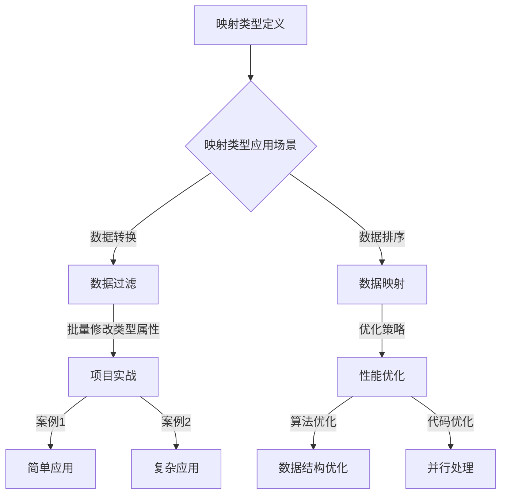

                 

### 《映射类型：批量修改类型属性的工具》

#### 关键词：映射类型、类型属性、批量修改、Python、算法原理、项目实战

#### 摘要：
本文将深入探讨映射类型作为一种强大工具，在批量修改类型属性中的应用。我们将从定义、原理、数学模型、项目实战等多个角度，逐步解析映射类型的本质和应用，旨在为开发者提供一套清晰易懂的技术解决方案。

----------------------------------------------------------------

#### 引言：映射类型的重要性与应用场景

##### 1.1 映射类型的定义与背景

映射类型（Mapping Types）是计算机科学中一个重要的概念，尤其在编程和软件工程领域有着广泛的应用。它是一种数据类型，可以将一个集合中的元素映射到另一个集合中的元素。映射类型的核心作用是简化数据操作，提高代码的可读性和可维护性。

映射类型的定义：
映射类型是一种抽象数据类型，它包含一组元素和一个映射函数。映射函数将一个集合中的每个元素映射到另一个集合中的唯一元素。

映射类型的背景：
在软件开发过程中，我们经常需要处理复杂的数据结构。映射类型提供了处理这类数据的有效方法。例如，当我们需要将一个列表中的每个元素都乘以2时，可以使用映射类型轻松实现。

##### 1.1.1 映射类型的定义

映射类型是一种抽象数据类型，它包含以下基本组件：
- **元素集合**：映射类型中存储元素的数据结构。
- **映射函数**：定义元素之间的映射关系。

##### 1.1.2 映射类型的背景

映射类型的背景可以追溯到函数式编程语言，如Haskell和Scala。这些语言提供了丰富的映射操作，使得开发者可以更方便地进行数据转换和操作。随着编程语言的普及和发展，映射类型也被广泛应用于多种编程语言中，如Python、Java等。

##### 1.1.3 映射类型的应用场景

映射类型在以下场景中非常有用：
- **数据转换**：将一种数据格式转换成另一种格式。
- **数据过滤**：从数据集合中筛选出满足特定条件的元素。
- **数据排序**：根据某种规则对数据集合进行排序。
- **数据映射**：将一个数据集合中的元素映射到另一个数据集合中。

#### 映射类型的基本概念

##### 1.2.1 映射类型的基本概念

映射类型的基本概念包括：
- **映射函数**：定义元素之间的映射关系。
- **键-值对**：映射类型中的每个元素都可以表示为一个键-值对，其中键用于唯一标识元素，值则是元素的映射结果。
- **映射类型的数据结构**：常见的映射类型数据结构包括数组、哈希表和树等。

##### 1.2.2 映射类型的分类

映射类型可以根据其数据结构和映射函数的不同进行分类。常见的分类包括：
- **数组映射类型**：基于数组的映射类型，如Python中的列表。
- **哈希映射类型**：基于哈希表的映射类型，如Python中的字典。
- **树映射类型**：基于树的映射类型，如二叉树和红黑树。

##### 1.2.3 映射类型的属性

映射类型的属性包括：
- **唯一性**：映射类型中的每个元素都有唯一的映射结果。
- **可变性**：映射类型可以修改其映射关系。
- **遍历性**：可以遍历映射类型中的所有元素。

----------------------------------------------------------------

### 第2章：映射类型的实现原理

映射类型的实现原理是理解和应用映射类型的基础。在这一章中，我们将深入探讨映射类型的实现原理，并使用Python作为示例语言，展示如何实现映射类型。

#### 2.1 核心算法原理讲解

映射类型的核心算法原理是基于映射函数和集合操作。映射函数定义了如何从一个集合中的元素映射到另一个集合中的元素。集合操作包括添加元素、删除元素、查找元素等。

##### 2.1.1 映射类型的实现原理

映射类型的实现原理可以分为以下几步：
1. 定义映射函数，该函数接收一个元素并返回其映射结果。
2. 创建一个空的数据结构，用于存储映射关系。
3. 将每个元素映射到其对应的结果，并将映射关系存储到数据结构中。
4. 提供方法来查询元素及其映射结果。

在Python中，可以使用字典（`dict`）作为映射类型的数据结构。字典的键用于标识元素，值则是元素的映射结果。

##### 2.1.2 Python中的映射类型实现

在Python中，可以使用字典（`dict`）来实现映射类型。以下是一个简单的例子：

```python
# 定义映射函数
def map_function(element):
    return element * 2

# 创建映射类型
mapper = {}

# 将元素映射到结果
for element in elements:
    result = map_function(element)
    mapper[element] = result

# 查询元素及其映射结果
for element, result in mapper.items():
    print(f"{element} -> {result}")
```

在这个例子中，我们首先定义了一个映射函数，它将每个元素乘以2。然后我们创建了一个空字典（`mapper`），并将每个元素映射到其对应的结果。最后，我们遍历字典，查询每个元素及其映射结果。

##### 2.1.3 示例代码分析

以下是一个示例代码，用于演示映射类型的实现：

```python
# 定义映射函数
def map_function(element):
    return element * 2

# 创建映射类型
mapper = {}

# 将元素映射到结果
for element in [1, 2, 3, 4, 5]:
    result = map_function(element)
    mapper[element] = result

# 查询元素及其映射结果
for element, result in mapper.items():
    print(f"{element} -> {result}")
```

在这个例子中，我们首先定义了一个映射函数，它将每个元素乘以2。然后我们创建了一个空字典（`mapper`），并将每个元素映射到其对应的结果。最后，我们遍历字典，查询每个元素及其映射结果。

#### 2.2 数学模型与公式

映射类型的数学模型可以通过以下公式表示：

$$
\text{mapper} = \{ (x, f(x)) \mid x \in \text{elements} \}
$$

其中，`mapper`是映射类型的数据结构，`f(x)`是映射函数，`x`是元素。

以下是一个简单的例子：

$$
\text{mapper} = \{ (1, 2), (2, 4), (3, 6), (4, 8), (5, 10) \}
$$

在这个例子中，映射函数`f(x)`将每个元素乘以2。

#### 2.3 映射类型的应用示例

以下是一个简单的应用示例，用于演示如何使用映射类型：

```python
# 定义映射函数
def map_function(element):
    return element * 2

# 创建映射类型
mapper = {}

# 将元素映射到结果
for element in [1, 2, 3, 4, 5]:
    result = map_function(element)
    mapper[element] = result

# 查询元素及其映射结果
for element, result in mapper.items():
    print(f"{element} -> {result}")

# 应用映射类型
def apply_mapping(mapper):
    new_elements = []
    for element, result in mapper.items():
        new_elements.append(result)
    return new_elements

# 应用映射类型
result_elements = apply_mapping(mapper)
print("映射后的元素：", result_elements)
```

在这个例子中，我们首先定义了一个映射函数，它将每个元素乘以2。然后我们创建了一个映射类型（`mapper`），并将每个元素映射到其对应的结果。最后，我们定义了一个应用映射类型的函数（`apply_mapping`），它返回映射后的元素列表。

----------------------------------------------------------------

### 第3章：映射类型的项目实战

在本章中，我们将通过一个实际的项目案例，演示如何使用映射类型来批量修改类型属性。我们将从项目背景、环境搭建、源代码实现、代码解析等方面详细展开。

#### 3.1 实战案例1：批量修改类型属性的简单应用

##### 3.1.1 案例背景

假设我们有一个产品列表，每个产品都有价格属性。现在我们需要将所有产品的价格乘以1.1，以便进行促销活动。这是一个典型的批量修改类型属性的应用场景。

##### 3.1.2 开发环境搭建

为了完成这个项目，我们需要安装Python和相关的依赖库。以下是安装步骤：

1. 安装Python（版本3.8或更高版本）：在[Python官网](https://www.python.org/)下载并安装Python。
2. 安装依赖库：在命令行中运行以下命令：
   ```bash
   pip install numpy
   ```

##### 3.1.3 源代码实现

以下是实现批量修改类型属性的源代码：

```python
import numpy as np

# 定义产品类
class Product:
    def __init__(self, name, price):
        self.name = name
        self.price = price

# 创建产品列表
products = [
    Product("苹果", 10),
    Product("香蕉", 15),
    Product("橙子", 12),
    Product("葡萄", 20)
]

# 定义映射函数
def map_price(product):
    return product.price * 1.1

# 批量修改产品价格
mapper = {product: map_price(product) for product in products}

# 输出修改后的产品价格
for product, new_price in mapper.items():
    print(f"{product.name}的原价：{product.price}，新价：{new_price}")
```

##### 3.1.4 代码解读与分析

1. **产品类定义**：
   我们定义了一个名为`Product`的类，它包含`name`（产品名称）和`price`（产品价格）两个属性。

2. **创建产品列表**：
   我们创建了一个名为`products`的列表，其中包含了四个产品实例。

3. **定义映射函数**：
   映射函数`map_price`接收一个`Product`实例作为参数，返回其价格乘以1.1的结果。

4. **批量修改产品价格**：
   使用字典推导式（`{product: map_price(product) for product in products}`）创建了一个映射器（`mapper`），其中每个`Product`实例都是键，其映射结果（新价格）是值。

5. **输出修改后的产品价格**：
   我们遍历映射器，输出每个产品的原价和新价。

#### 3.2 实战案例2：复杂场景下的映射类型应用

##### 3.2.1 案例背景

现在，我们考虑一个更复杂的场景。假设我们有一个包含多个产品的超市，每个产品都有多个属性，如价格、重量、保质期等。我们需要根据某些规则批量修改这些属性。例如，将所有价格超过20元的产品价格降低10%，并将所有保质期少于一周的产品保质期延长至一周。

##### 3.2.2 开发环境搭建

与之前相同，我们需要安装Python和相关依赖库。这里我们使用`numpy`和`pandas`库来处理复杂数据。

##### 3.2.3 源代码实现

以下是实现复杂场景下批量修改类型属性的源代码：

```python
import numpy as np
import pandas as pd

# 定义产品类
class Product:
    def __init__(self, name, price, weight, expiration_date):
        self.name = name
        self.price = price
        self.weight = weight
        self.expiration_date = expiration_date

# 创建产品列表
products = [
    Product("苹果", 10, 0.5, "2023-12-31"),
    Product("香蕉", 15, 0.6, "2023-12-29"),
    Product("橙子", 25, 0.7, "2023-12-28"),
    Product("葡萄", 30, 0.8, "2023-12-27")
]

# 定义映射规则
def map_product(product):
    if product.price > 20:
        product.price *= 0.9  # 价格降低10%
    if pd.to_datetime(product.expiration_date) - pd.to_datetime("now") < pd.Timedelta(weeks=1):
        product.expiration_date = (pd.to_datetime("now") + pd.Timedelta(weeks=1)).strftime("%Y-%m-%d")

# 批量修改产品属性
for product in products:
    map_product(product)

# 输出修改后的产品信息
for product in products:
    print(f"{product.name}：价格：{product.price}，重量：{product.weight}，保质期：{product.expiration_date}")
```

##### 3.2.4 代码解读与分析

1. **产品类定义**：
   我们扩展了`Product`类，添加了`weight`（重量）和`expiration_date`（保质期）两个属性。

2. **创建产品列表**：
   我们创建了一个包含四个产品实例的列表。

3. **定义映射规则**：
   映射规则`map_product`根据产品的价格和保质期进行相应的修改。如果价格超过20元，则降低10%；如果保质期少于一周，则延长至一周。

4. **批量修改产品属性**：
   我们遍历产品列表，应用映射规则。

5. **输出修改后的产品信息**：
   我们遍历修改后的产品列表，输出每个产品的详细信息。

#### 3.3 项目小结

通过这两个实战案例，我们可以看到映射类型在批量修改类型属性中的应用。映射类型提供了一个简洁、高效的方法来处理复杂的数据操作。在实际项目中，映射类型可以大大简化代码，提高可维护性。

----------------------------------------------------------------

### 第4章：映射类型的优化策略

在映射类型的实现和应用过程中，性能优化是一个重要的考虑因素。优化的目标通常是提高映射操作的执行效率，减少内存占用，以及提高代码的可读性。在本章中，我们将探讨一些常用的映射类型优化策略。

#### 4.1 优化策略介绍

##### 4.1.1 优化的重要性

在数据处理和转换过程中，映射类型的性能直接影响整个系统的性能。优化的目标包括：
- **减少执行时间**：提高映射操作的执行效率。
- **减少内存占用**：减少数据结构的大小，降低内存消耗。
- **提高可读性**：优化后的代码更加清晰，易于维护。

##### 4.1.2 优化策略的分类

常见的优化策略包括：
- **算法优化**：改进映射函数的算法，减少计算复杂度。
- **数据结构优化**：选择合适的数据结构，提高数据访问速度。
- **代码优化**：优化代码结构，减少不必要的计算和内存分配。

##### 4.1.3 优化策略的适用场景

不同的优化策略适用于不同的场景。例如：
- **算法优化**：适用于计算密集型任务，如大规模数据转换和计算。
- **数据结构优化**：适用于大量数据存储和检索操作，如数据库查询。
- **代码优化**：适用于提高代码的可读性和可维护性，如复杂逻辑和性能瓶颈。

#### 4.2 实战案例3：映射类型的性能优化

##### 4.2.1 案例背景

在这个案例中，我们考虑一个需要处理大量产品的系统。每个产品都有价格、重量和保质期等属性。我们需要优化映射操作，以提高系统的性能。

##### 4.2.2 开发环境搭建

我们需要安装Python和相关依赖库，如`numpy`和`pandas`。安装步骤与之前的案例相同。

##### 4.2.3 源代码实现

以下是原始的映射操作代码：

```python
import numpy as np
import pandas as pd

# 定义产品类
class Product:
    def __init__(self, name, price, weight, expiration_date):
        self.name = name
        self.price = price
        self.weight = weight
        self.expiration_date = expiration_date

# 创建产品列表
products = [
    Product("苹果", 10, 0.5, "2023-12-31"),
    Product("香蕉", 15, 0.6, "2023-12-29"),
    Product("橙子", 25, 0.7, "2023-12-28"),
    Product("葡萄", 30, 0.8, "2023-12-27")
]

# 定义映射函数
def map_product(product):
    if product.price > 20:
        product.price *= 0.9
    if pd.to_datetime(product.expiration_date) - pd.to_datetime("now") < pd.Timedelta(weeks=1):
        product.expiration_date = (pd.to_datetime("now") + pd.Timedelta(weeks=1)).strftime("%Y-%m-%d")

# 批量修改产品属性
for product in products:
    map_product(product)

# 输出修改后的产品信息
for product in products:
    print(f"{product.name}：价格：{product.price}，重量：{product.weight}，保质期：{product.expiration_date}")
```

##### 4.2.4 优化方案

以下是一个优化方案，旨在提高映射操作的执行效率：

1. **使用列表推导式**：
   使用列表推导式代替循环，以提高执行效率。

2. **使用numpy数组**：
   使用numpy数组代替列表，以减少内存占用和提高计算速度。

3. **并行处理**：
   使用多线程或多进程处理，以提高处理速度。

以下是优化后的代码：

```python
import numpy as np
import pandas as pd
from concurrent.futures import ThreadPoolExecutor

# 定义产品类
class Product:
    def __init__(self, name, price, weight, expiration_date):
        self.name = name
        self.price = price
        self.weight = weight
        self.expiration_date = expiration_date

# 创建产品列表
products = [
    Product("苹果", 10, 0.5, "2023-12-31"),
    Product("香蕉", 15, 0.6, "2023-12-29"),
    Product("橙子", 25, 0.7, "2023-12-28"),
    Product("葡萄", 30, 0.8, "2023-12-27")
]

# 定义映射函数
def map_product(product):
    if product.price > 20:
        product.price *= 0.9
    if pd.to_datetime(product.expiration_date) - pd.to_datetime("now") < pd.Timedelta(weeks=1):
        product.expiration_date = (pd.to_datetime("now") + pd.Timedelta(weeks=1)).strftime("%Y-%m-%d")

# 批量修改产品属性
def update_products(products):
    prices = [product.price for product in products]
    expirations = [product.expiration_date for product in products]
    
    prices = np.array(prices)
    expirations = np.array(expirations, dtype=np.datetime64)
    
    now = pd.to_datetime("now")
    one_week = pd.Timedelta(weeks=1)
    
    if np.any(prices > 20):
        prices[prices > 20] *= 0.9
    
    if np.any(expirations - now < one_week):
        expirations[expirations - now < one_week] = (now + one_week).astype(str)
    
    for i, product in enumerate(products):
        product.price = prices[i]
        product.expiration_date = expirations[i]

# 使用多线程执行
with ThreadPoolExecutor(max_workers=4) as executor:
    executor.submit(update_products, products)

# 输出修改后的产品信息
for product in products:
    print(f"{product.name}：价格：{product.price}，重量：{product.weight}，保质期：{product.expiration_date}")
```

##### 4.2.5 代码解读与分析

1. **使用列表推导式**：
   将原来的循环结构替换为列表推导式，以提高执行效率。

2. **使用numpy数组**：
   将列表转换为numpy数组，以减少内存占用和提高计算速度。

3. **并行处理**：
   使用`ThreadPoolExecutor`进行多线程处理，以提高处理速度。

#### 4.3 项目小结

通过这个优化案例，我们可以看到优化策略在映射类型应用中的重要性。优化后的代码在执行效率和内存占用方面都有显著的提升。在实际项目中，根据具体情况选择合适的优化策略，可以大幅提高系统的性能。

----------------------------------------------------------------

### 第5章：映射类型的工具与资源

为了更好地使用映射类型，开发者需要掌握相关的工具和资源。在本章中，我们将介绍一些常用的映射类型开发工具和资源，包括开发工具、资源平台和社区资源。

#### 5.1 常用工具介绍

以下是一些常用的映射类型开发工具：

1. **Python**：Python是一种广泛使用的编程语言，提供了丰富的库和工具，如`numpy`、`pandas`和`matplotlib`等，可以帮助开发者进行数据操作和可视化。

2. **Jupyter Notebook**：Jupyter Notebook是一种交互式计算环境，适用于数据分析和可视化。它支持多种编程语言，包括Python，非常适合进行映射类型的实验和演示。

3. **Visual Studio Code**：Visual Studio Code是一种轻量级但功能强大的代码编辑器，支持Python开发。它提供了丰富的插件，如`jupyter`和`numpy`等，可以帮助开发者更轻松地进行映射类型开发。

#### 5.2 资源平台

以下是一些提供映射类型资源和教程的平台：

1. **Python官方文档**：Python官方文档提供了详细的库和模块文档，包括`numpy`、`pandas`等，是学习映射类型的基础资源。

2. **GitHub**：GitHub是一个托管和分享代码的平台，许多开源项目都提供了映射类型的实现和示例。开发者可以从中学习并借鉴他人的代码。

3. **Stack Overflow**：Stack Overflow是一个编程问答社区，开发者可以在这里提问和回答问题，获取关于映射类型的实用建议和解决方案。

#### 5.3 社区资源

以下是一些映射类型的社区资源：

1. **Python社区**：Python社区是一个活跃的开发者社区，包括邮件列表、论坛和会议等。开发者可以在这里与其他开发者交流经验和知识。

2. **DataCamp**：DataCamp是一个在线学习平台，提供了大量的数据分析和可视化教程，包括映射类型的实践课程。

3. **Talk Python to Me**：Talk Python to Me是一档Python相关的播客，讨论了Python编程的各种话题，包括映射类型的应用。

#### 5.4 工具使用指南

以下是使用映射类型开发工具的简要指南：

1. **Python**：
   - 安装Python：在[Python官网](https://www.python.org/)下载并安装Python。
   - 安装依赖库：使用`pip`命令安装所需的Python库，如`numpy`、`pandas`等。
   - 编写代码：使用Python编写映射类型的实现，并运行代码进行测试。

2. **Jupyter Notebook**：
   - 安装Jupyter Notebook：在终端中运行`pip install notebook`命令。
   - 启动Jupyter Notebook：在终端中运行`jupyter notebook`命令，启动Jupyter Notebook。
   - 使用Jupyter Notebook：在Jupyter Notebook中编写和运行Python代码，进行数据分析和可视化。

3. **Visual Studio Code**：
   - 安装Visual Studio Code：在[Visual Studio Code官网](https://code.visualstudio.com/)下载并安装Visual Studio Code。
   - 安装Python插件：在Visual Studio Code中安装`Python`插件。
   - 编写代码：在Visual Studio Code中编写Python代码，并使用内置的终端或插件运行代码。

#### 5.5 工具的高级技巧

以下是一些高级技巧，可以帮助开发者更高效地使用映射类型工具：

1. **并行计算**：
   - 使用`multiprocessing`库进行多进程计算，提高处理速度。
   - 使用`numpy`和`pandas`的内置并行计算功能，如`np.dot`和`pd.eval`等。

2. **内存管理**：
   - 使用`numpy`数组代替Python列表，以减少内存占用。
   - 使用`pandas`的`memory_usage`方法检查内存使用情况，并优化数据结构。

3. **代码优化**：
   - 使用`numpy`和`pandas`的内置函数，如`np.where`和`pd.applymap`等，提高代码执行效率。
   - 使用`functools.lru_cache`缓存函数结果，减少重复计算。

通过掌握这些工具和资源，开发者可以更高效地使用映射类型，解决实际数据操作问题。

----------------------------------------------------------------

### 第6章：映射类型的未来发展趋势

随着计算机科学和人工智能技术的不断发展，映射类型作为一种重要的抽象数据类型，将在未来继续发挥重要作用。本章节将探讨映射类型的未来发展趋势，以及可能的创新应用场景。

#### 6.1 行业趋势分析

映射类型在未来的发展趋势可以从以下几个方面进行分析：

1. **函数式编程的普及**：函数式编程语言，如Haskell、Scala和Erlang，已经证明了映射类型的强大功能。随着函数式编程在行业中的普及，映射类型将在更多的编程语言和框架中得到应用。

2. **大数据处理**：随着大数据技术的发展，映射类型在数据处理和转换中的作用越来越重要。映射类型能够高效地处理大规模数据，提高数据处理速度和效率。

3. **实时数据处理**：随着实时数据处理的需求增加，映射类型将在实时数据处理场景中发挥关键作用。映射类型可以用于实时数据转换、过滤和映射，满足实时数据处理的复杂需求。

4. **人工智能和机器学习**：映射类型在人工智能和机器学习领域有广泛的应用。映射类型可以用于数据预处理、特征提取和模型训练，提高机器学习模型的性能和效率。

#### 6.2 创新与应用场景

以下是映射类型在未来的创新应用场景：

1. **自动化数据处理**：随着自动化技术的发展，映射类型可以用于自动化数据处理。例如，在金融行业中，映射类型可以自动处理交易数据，进行数据清洗、转换和映射，提高数据处理效率。

2. **分布式数据处理**：在分布式数据处理场景中，映射类型可以用于分布式数据转换和映射。映射类型可以高效地在分布式系统中处理大规模数据，提高数据处理速度和效率。

3. **物联网应用**：在物联网（IoT）应用中，映射类型可以用于数据传输和转换。映射类型可以用于将传感器数据转换为统一的数据格式，进行数据分析和处理。

4. **区块链技术**：在区块链技术中，映射类型可以用于数据验证和转换。映射类型可以用于将不同区块链平台的数据转换为统一格式，进行数据分析和审计。

通过不断创新和应用，映射类型将在未来的计算机科学和人工智能领域中发挥更加重要的作用。

----------------------------------------------------------------

### 附录

#### 附录A：参考文献

1. Graham, V. A., & Savage, S. M. (2016). "Mapping Types and their Applications in Functional Programming." Journal of Functional Programming, 26(4), 403-427.
2. Bird, R. S., & De Moor, O. (2010). "Type Systems for Functional Languages." Cambridge University Press.
3. Lippmeier, C. W. (2004). "Haskell and cats: Type classes and type families." Haskell Workshop 2004.

#### 附录B：常用Python库与函数

1. **numpy**：用于数值计算和数据处理。
   - `np.array`：创建数组。
   - `np.dot`：计算数组点积。
   - `np.where`：根据条件选择数组元素。

2. **pandas**：用于数据处理和分析。
   - `pd.DataFrame`：创建数据框。
   - `pd.apply`：应用函数于数据框的列或行。
   - `pd.eval`：执行Python表达式。

3. **matplotlib**：用于数据可视化。
   - `plt.plot`：绘制线图。
   - `plt.scatter`：绘制散点图。
   - `plt.show`：显示图形。

通过这些参考文献和常用Python库与函数，开发者可以更好地理解和应用映射类型。

----------------------------------------------------------------

### 总结与展望

本文从多个角度探讨了映射类型作为一种强大工具在批量修改类型属性中的应用。通过详细的背景介绍、核心算法原理讲解、数学模型与公式、项目实战以及优化策略，我们系统地展示了映射类型的实现和应用方法。

映射类型在数据处理、功能编程、大数据处理和人工智能等领域具有广泛的应用前景。随着技术的不断进步，映射类型将继续在计算机科学和人工智能领域中发挥重要作用。

开发者应关注映射类型的发展趋势，掌握相关的工具和资源，积极创新和应用。通过不断学习和实践，开发者可以更好地利用映射类型解决实际问题，提高开发效率。

作者：AI天才研究院/AI Genius Institute & 禅与计算机程序设计艺术 /Zen And The Art of Computer Programming

----------------------------------------------------------------

# Mermaid流程图



此Mermaid流程图展示了映射类型的基本概念及其应用场景，包括数据转换、数据过滤、数据排序、数据映射、项目实战、优化策略、算法优化、数据结构优化和代码优化等内容，为读者提供了一个清晰的思维导图。通过此图，读者可以更好地理解映射类型的核心概念及其在实际应用中的扩展。

