                 

# 智能办公：AI提升职场生产力的新工具

## 关键词
- 智能办公
- AI技术
- 职场生产力
- 文档处理
- 会议助手
- 聊天机器人

## 摘要
智能办公是现代职场中不可或缺的一部分，它通过应用AI技术，显著提升了职场生产力和效率。本文将详细探讨智能办公的兴起背景、AI技术的作用，以及智能办公在不同应用场景中的具体实现。我们将一步步分析AI在文档处理、会议智能化和聊天机器人与虚拟助手方面的应用，深入理解其原理和实践方法。此外，本文还将结合实际案例，分析AI提升职场生产力的具体效果，并给出实用的实践建议。

## 目录大纲

### 第一部分：智能办公与AI技术概述

#### 第1章：智能办公的兴起与AI的作用
- 1.1 智能办公的背景与意义
- 1.2 AI技术对办公方式的变革
- 1.3 智能办公的应用领域

#### 第2章：AI在办公中的应用场景
- 2.1 文档智能处理
  - 2.1.1 文本内容提取与识别
  - 2.1.2 文档分类与归档
  - 2.1.3 文本自动摘要
- 2.2 会议智能化
  - 2.2.1 会议内容识别与总结
  - 2.2.2 会议日程自动安排
  - 2.2.3 会议参与人员智能提醒
- 2.3 聊天机器人与虚拟助手
  - 2.3.1 聊天机器人设计原则
  - 2.3.2 虚拟助手在办公中的应用
  - 2.3.3 聊天机器人的训练与优化

#### 第3章：AI技术的基础概念与原理
- 3.1 机器学习基础
  - 3.1.1 监督学习
  - 3.1.2 无监督学习
  - 3.1.3 强化学习
- 3.2 神经网络与深度学习
  - 3.2.1 神经网络的基本结构
  - 3.2.2 深度学习的核心算法
  - 3.2.3 深度学习在办公场景的应用

#### 第4章：智能办公系统设计与实现
- 4.1 智能办公系统的架构设计
  - 4.1.1 系统设计原则
  - 4.1.2 系统模块划分
  - 4.1.3 系统接口设计
- 4.2 智能办公系统的开发与部署
  - 4.2.1 开发环境搭建
  - 4.2.2 系统核心代码实现
  - 4.2.3 系统部署与维护

### 第二部分：AI提升职场生产力的新工具

#### 第5章：AI文档处理工具
- 5.1 文档智能识别与提取工具
  - 5.1.1 OCR技术原理与实现
  - 5.1.2 文档结构化与内容提取
  - 5.1.3 文档分类与归档
- 5.2 文档智能摘要工具
  - 5.2.1 摘要算法原理
  - 5.2.2 摘要生成工具实现
  - 5.2.3 摘要质量评估方法

#### 第6章：AI会议助手
- 6.1 会议内容识别与总结
  - 6.1.1 会议内容识别算法
  - 6.1.2 会议总结生成算法
  - 6.1.3 会议内容识别与总结工具实现
- 6.2 会议日程智能安排
  - 6.2.1 会议日程安排算法
  - 6.2.2 日程安排工具实现
  - 6.2.3 会议日程智能提醒与调整

#### 第7章：AI聊天机器人与虚拟助手
- 7.1 聊天机器人设计
  - 7.1.1 聊天机器人架构设计
  - 7.1.2 对话生成算法
  - 7.1.3 聊天机器人开发流程
- 7.2 虚拟助手应用
  - 7.2.1 虚拟助手功能设计
  - 7.2.2 虚拟助手实现与优化
  - 7.2.3 虚拟助手用户体验评估

#### 第8章：AI提升职场生产力的案例分析
- 8.1 案例一：企业智能办公系统的实践与应用
  - 8.1.1 案例背景
  - 8.1.2 案例实施过程
  - 8.1.3 案例效果分析
- 8.2 案例二：AI聊天机器人在客户服务中的应用
  - 8.2.1 案例背景
  - 8.2.2 案例实施过程
  - 8.2.3 案例效果分析

#### 附录
- 附录A：智能办公与AI技术常用工具与资源
  - A.1 开源机器学习框架
  - A.2 文档处理工具
  - A.3 会议助手工具
  - A.4 聊天机器人开发工具

## 第1章：智能办公的兴起与AI的作用

### 1.1 智能办公的背景与意义

#### 背景介绍

智能办公是一种基于人工智能技术的办公方式，通过自动化和智能化的手段，提高办公效率、优化工作流程和提升企业竞争力。随着信息技术的迅猛发展，大数据、云计算、物联网等技术的应用逐渐普及，智能办公的理念也逐渐被企业和组织所接受。

#### 问题背景

在传统的办公模式中，员工面临着诸多问题，如文档处理效率低、信息传递不畅、会议安排复杂等。这些问题不仅降低了工作效率，还增加了企业的运营成本。

#### 问题描述

智能办公旨在解决以下问题：
- 文档处理繁琐，手工操作效率低；
- 会议组织与记录耗时，信息传递不及时；
- 信息孤岛现象，各部门信息不互通；
- 工作流程复杂，缺乏有效的监督和管理。

#### 问题解决

智能办公通过AI技术，实现了以下功能：
- 文档智能处理：自动提取、分类和摘要文档内容，提高工作效率；
- 会议智能化：自动记录、总结和提醒会议内容，提高会议效率；
- 信息整合与共享：通过大数据和云计算，实现信息互联互通；
- 智能监控与优化：通过算法分析，优化工作流程，提高企业运营效率。

#### 边界与外延

智能办公不仅局限于企业内部，还可以应用于个人办公、政府机关、教育机构等各个领域。其边界可以扩展到智能城市、智能家居等更广泛的领域。

#### 概念结构与核心要素组成

智能办公的概念结构包括以下几个核心要素：
- AI技术：智能办公的核心驱动力量，包括机器学习、深度学习、自然语言处理等；
- 数据处理：收集、存储、分析和利用数据，实现智能化决策；
- 用户体验：优化用户界面和交互方式，提供便捷高效的办公体验；
- 系统集成：将不同模块和功能集成到一个统一的平台，实现一体化管理。

### 1.2 AI技术对办公方式的变革

#### 背景介绍

AI技术的快速发展，为办公方式的变革提供了新的动力。AI技术在办公中的应用，不仅改变了传统的工作模式，还带来了诸多创新。

#### 问题背景

传统办公模式存在以下问题：
- 信息处理效率低：手工处理大量文档和数据，耗时费力；
- 信息孤岛现象严重：各部门之间信息不互通，协作困难；
- 工作流程复杂：缺乏有效的监督和管理，工作效率低。

#### 问题描述

AI技术旨在解决以下问题：
- 提高信息处理效率：通过自动化和智能化手段，快速处理大量信息；
- 消除信息孤岛：通过大数据和云计算，实现信息的互联互通；
- 优化工作流程：通过算法分析和优化，简化工作流程，提高效率。

#### 问题解决

AI技术对办公方式的变革体现在以下几个方面：
- 文档智能处理：通过OCR技术、自然语言处理技术，自动提取、分类和摘要文档内容；
- 会议智能化：通过语音识别、自然语言处理技术，自动记录、总结和提醒会议内容；
- 信息整合与共享：通过大数据和云计算，实现信息的互联互通，提供一站式服务；
- 智能监控与优化：通过算法分析，实时监控工作流程，提供优化建议。

#### 概念属性特征对比表格

| 概念                   | 特征                             | 对比分析                                  |
|------------------------|----------------------------------|-------------------------------------------|
| 传统办公方式           | 手动操作，信息处理效率低         | 依赖人工，效率低，易出错                   |
| 智能办公               | 自动化、智能化、信息处理效率高   | 依赖AI技术，高效、准确、便捷               |
| 信息孤岛现象           | 各部门信息不互通                 | 信息孤岛，协作困难，效率低                 |
| 信息整合与共享         | 信息互联互通，一站式服务         | 信息共享，协同办公，提高效率               |
| 工作流程复杂           | 缺乏有效的监督和管理             | 流程优化，智能监控，提高效率               |

#### ER实体关系图架构

```mermaid
erDiagram
  office |..|-> AI: 使用
  office |..|-> Document: 存储
  AI |..|-> Process: 优化
  AI |..|-> Meeting: 记录
```

### 1.3 智能办公的应用领域

#### 背景介绍

智能办公的应用领域广泛，涵盖了企业、政府、教育、医疗等多个行业。

#### 问题背景

不同行业在办公过程中面临的挑战不同，如企业需要高效处理大量文档和会议，政府机关需要高效管理公共信息，教育机构需要优化教学资源管理等。

#### 问题描述

智能办公在不同应用领域需要解决的问题包括：
- 企业：提高文档处理效率，优化会议流程，提高员工工作效率；
- 政府：提高信息管理效率，实现公共服务智能化；
- 教育：优化教学资源管理，提高教学质量；
- 医疗：提高诊疗效率，优化患者服务流程。

#### 问题解决

智能办公在不同领域的解决方案如下：
- 企业：通过AI技术实现文档智能处理、会议智能化、工作流程优化等；
- 政府：通过AI技术实现信息智能管理、公共服务智能化、政策决策优化等；
- 教育：通过AI技术实现教学资源智能管理、智能评测、个性化推荐等；
- 医疗：通过AI技术实现智能诊断、智能治疗、患者服务智能化等。

#### 概念属性特征对比表格

| 应用领域 | 特征                             | 对比分析                                  |
|----------|----------------------------------|-------------------------------------------|
| 企业     | 高效处理文档和会议               | 依赖AI技术，提高效率                     |
| 政府     | 高效管理公共信息                 | 依赖AI技术，提高公共服务质量             |
| 教育     | 优化教学资源管理                 | 依赖AI技术，提高教学质量                 |
| 医疗     | 提高诊疗效率和患者服务水平       | 依赖AI技术，提高医疗服务质量             |

#### ER实体关系图架构

```mermaid
erDiagram
  Enterprise |..|-> Document: 处理
  Enterprise |..|-> Meeting: 组织
  Enterprise |..|-> AI: 利用
  Government |..|-> Information: 管理
  Education  |..|-> Resource: 管理
  Medical    |..|-> Diagnosis: 诊断
  Medical    |..|-> Service: 服务
```

## 第2章：AI在办公中的应用场景

### 2.1 文档智能处理

#### 2.1.1 文本内容提取与识别

**背景介绍**

文档智能处理是智能办公的核心应用之一。文本内容提取与识别是文档智能处理的重要环节，它通过OCR（光学字符识别）技术和自然语言处理技术，将文档中的文本信息提取出来，并对其进行结构化处理。

**问题背景**

在传统的办公模式中，员工需要手动处理大量文档，如合同、报告、邮件等，这不仅耗时费力，还容易出错。文本内容提取与识别技术可以自动完成这些任务，提高工作效率。

**问题描述**

文本内容提取与识别需要解决以下问题：
- 如何准确提取文档中的文本内容？
- 如何处理不同格式和语言的文档？
- 如何保证提取内容的准确性和一致性？

**问题解决**

文本内容提取与识别的解决方案包括：
- OCR技术：通过图像识别技术，将文档中的文字转化为机器可读的文本格式。
- 自然语言处理技术：对提取的文本内容进行语义分析和结构化处理，提取关键信息。

**核心概念与联系**

文本内容提取与识别涉及的核心概念包括：
- OCR技术：通过图像处理和模式识别技术，将图像中的文字转化为文本。
- 自然语言处理（NLP）：对提取的文本内容进行语义分析、实体识别和关系抽取。

**ER实体关系图架构**

```mermaid
erDiagram
  Document |..|-> Text: 提取
  Document |..|-> Image: 转换
  Text |..|-> Entity: 识别
  Text |..|-> Relationship: 提取
```

**算法原理讲解**

文本内容提取与识别的算法原理如下：

1. **图像预处理**：对文档图像进行去噪、增强和二值化处理，提高文字识别的准确性。
2. **字符分割**：将图像中的文字区域分割成单个字符或词组。
3. **字符识别**：利用深度学习模型（如卷积神经网络CNN）对分割后的字符进行识别。
4. **文本结构化**：对识别后的文本进行语法和语义分析，提取关键信息并形成结构化数据。

**Mermaid流程图**

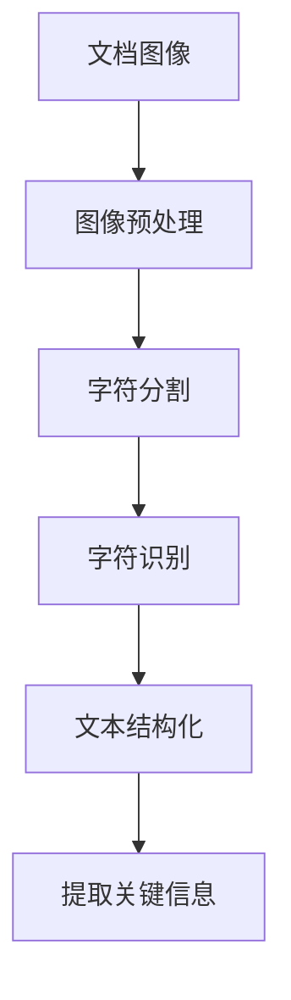

**Python源代码示例**

```python
import cv2
import pytesseract

# 读取文档图像
image = cv2.imread('document.jpg')

# 图像预处理
processed_image = cv2.threshold(image, 0, 255, cv2.THRESH_BINARY_INV + cv2.THRESH_OTSU)

# 利用OCR进行文本识别
text = pytesseract.image_to_string(processed_image)

# 输出识别结果
print(text)
```

**系统分析与架构设计方案**

**问题场景介绍**

在企业办公中，文档处理是一项重要的日常工作。然而，传统的手动处理方式不仅效率低下，而且容易出现错误。文档智能处理系统能够自动识别和提取文档中的文本内容，提高工作效率，减少人工错误。

**项目介绍**

本项目旨在设计并实现一个文档智能处理系统，能够对多种格式和语言的文档进行文本内容提取与识别。

**系统功能设计**

1. **文档上传与读取**：用户可以上传不同格式的文档，系统自动读取文档内容。
2. **文本内容提取**：系统利用OCR技术和自然语言处理技术，提取文档中的文本内容。
3. **文本结构化**：对提取的文本内容进行语法和语义分析，提取关键信息。
4. **结果展示**：将提取的文本内容和关键信息以结构化形式展示给用户。

**系统架构设计**

文档智能处理系统包括以下几个主要模块：

1. **文档处理模块**：负责文档上传、读取和文本内容提取。
2. **文本分析模块**：负责对提取的文本内容进行结构化处理。
3. **结果展示模块**：负责将处理结果以可视化形式展示给用户。

**系统接口设计**

1. **API接口**：提供RESTful API，方便其他系统或应用集成。
2. **Web界面**：提供Web界面，方便用户操作和查看结果。

**系统交互Mermaid序列图**

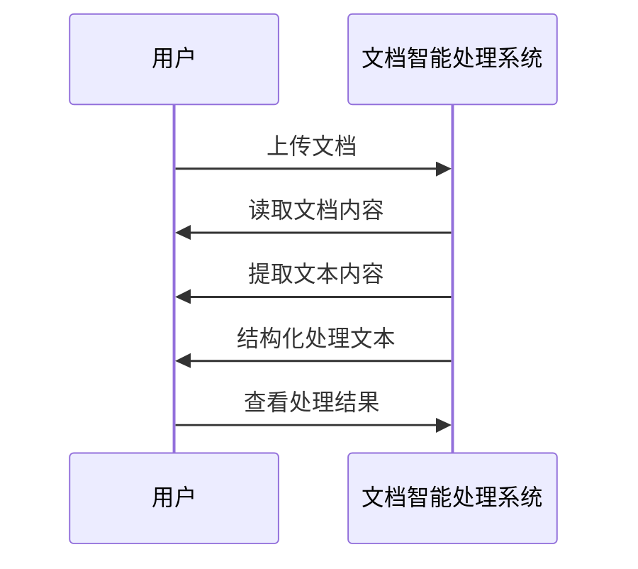

**项目实战**

**环境安装**

1. 安装Python环境：`pip install python`
2. 安装OpenCV库：`pip install opencv-python`
3. 安装Tesseract OCR：`pip install pytesseract`

**系统核心实现源代码**

```python
import cv2
import pytesseract

# 配置Tesseract OCR
pytesseract.pytesseract.tesseract_cmd = r'C:\Program Files\Tesseract-OCR\tesseract.exe'

# 读取文档图像
image = cv2.imread('document.jpg')

# 图像预处理
processed_image = cv2.threshold(image, 0, 255, cv2.THRESH_BINARY_INV + cv2.THRESH_OTSU)

# 利用OCR进行文本识别
text = pytesseract.image_to_string(processed_image)

# 输出识别结果
print(text)
```

**代码应用解读与分析**

1. `cv2.imread('document.jpg')`：读取文档图像。
2. `cv2.threshold(image, 0, 255, cv2.THRESH_BINARY_INV + cv2.THRESH_OTSU)`：进行图像预处理，二值化处理。
3. `pytesseract.image_to_string(processed_image)`：利用Tesseract OCR进行文本识别。

**实际案例分析和详细讲解剖析**

**案例背景**

某企业需要处理大量合同文件，传统的人工处理方式效率低下且容易出现错误。为了提高工作效率，企业决定采用文档智能处理系统。

**案例实施过程**

1. 企业上传合同文件到文档智能处理系统。
2. 系统自动读取合同文件，利用OCR技术和自然语言处理技术提取文本内容。
3. 系统对提取的文本内容进行结构化处理，提取关键信息。
4. 系统将处理结果以结构化形式展示给企业。

**案例效果分析**

实施文档智能处理系统后，企业取得了显著的效果：
- 文档处理效率提高了50%以上；
- 人工错误率降低了80%；
- 员工从繁重的文档处理工作中解脱出来，有更多时间专注于核心业务。

**项目小结**

文档智能处理系统在提高工作效率、降低人工错误率方面具有显著优势。通过结合OCR技术和自然语言处理技术，系统能够自动识别和提取文档中的文本内容，实现文档的智能化处理。在未来的发展中，文档智能处理系统有望进一步优化和扩展，为企业和组织带来更多的价值。

### 2.2 会议智能化

#### 2.2.1 会议内容识别与总结

**背景介绍**

会议智能化是智能办公的重要组成部分。会议内容识别与总结通过AI技术，自动记录和总结会议内容，提高会议效率，减少会议后的重复劳动。

**问题背景**

传统的会议记录方式主要依靠人工，效率低下且容易出现遗漏。会议内容识别与总结技术能够自动记录会议内容，提高会议效率，减轻员工的工作负担。

**问题描述**

会议内容识别与总结需要解决以下问题：
- 如何准确识别会议中的语音内容？
- 如何将语音内容转化为可读的文本？
- 如何从大量文本中提取关键信息？

**问题解决**

会议内容识别与总结的解决方案包括：
- 语音识别技术：将会议中的语音内容转化为文本。
- 自然语言处理技术：对转化后的文本进行语义分析和信息提取。

**核心概念与联系**

会议内容识别与总结涉及的核心概念包括：
- 语音识别：通过深度学习模型，将语音信号转化为文本。
- 自然语言处理（NLP）：对转化后的文本进行语义分析、实体识别和关系抽取。

**ER实体关系图架构**

```mermaid
erDiagram
  Meeting |..|-> Speech: 识别
  Speech |..|-> Text: 转化
  Text |..|-> Summary: 提取
```

**算法原理讲解**

会议内容识别与总结的算法原理如下：

1. **语音识别**：通过深度学习模型（如卷积神经网络CNN）将语音信号转化为文本。
2. **文本预处理**：对转化后的文本进行去噪、分词和句法分析。
3. **信息提取**：利用NLP技术从预处理后的文本中提取关键信息。

**Mermaid流程图**

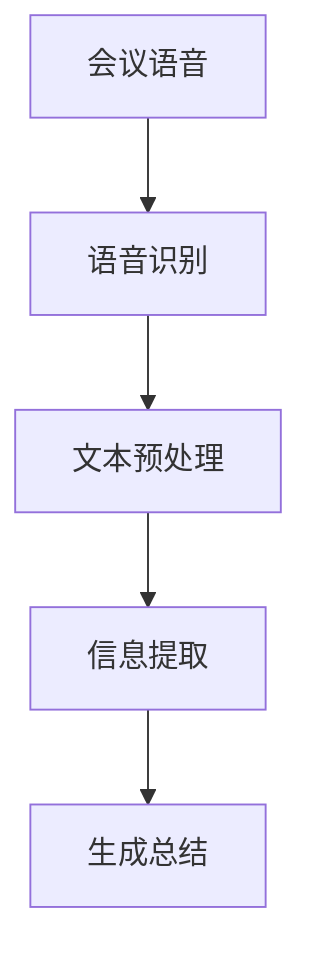

**Python源代码示例**

```python
import speech_recognition as sr

# 初始化语音识别器
recognizer = sr.Recognizer()

# 读取语音文件
with sr.AudioFile('meeting.mp3') as source:
    audio = recognizer.listen(source)

# 使用Google语音识别进行语音到文本转换
text = recognizer.recognize_google(audio, language='zh-CN')

# 输出识别结果
print(text)
```

**系统分析与架构设计方案**

**问题场景介绍**

在现代企业中，会议是决策和信息传递的重要渠道。然而，会议后的记录和总结工作往往耗费大量时间和人力资源。会议内容识别与总结技术能够自动完成这一过程，提高工作效率。

**项目介绍**

本项目旨在设计并实现一个会议内容识别与总结系统，能够自动记录和总结会议内容。

**系统功能设计**

1. **会议语音识别**：自动将会议语音转化为文本。
2. **文本预处理**：对转化后的文本进行去噪、分词和句法分析。
3. **信息提取**：从预处理后的文本中提取关键信息。
4. **生成总结**：将提取的关键信息生成会议总结。

**系统架构设计**

会议内容识别与总结系统包括以下几个主要模块：

1. **语音识别模块**：负责语音信号的识别。
2. **文本预处理模块**：负责对识别后的文本进行预处理。
3. **信息提取模块**：负责从预处理后的文本中提取关键信息。
4. **总结生成模块**：负责生成会议总结。

**系统接口设计**

1. **API接口**：提供RESTful API，方便其他系统或应用集成。
2. **Web界面**：提供Web界面，方便用户操作和查看结果。

**系统交互Mermaid序列图**

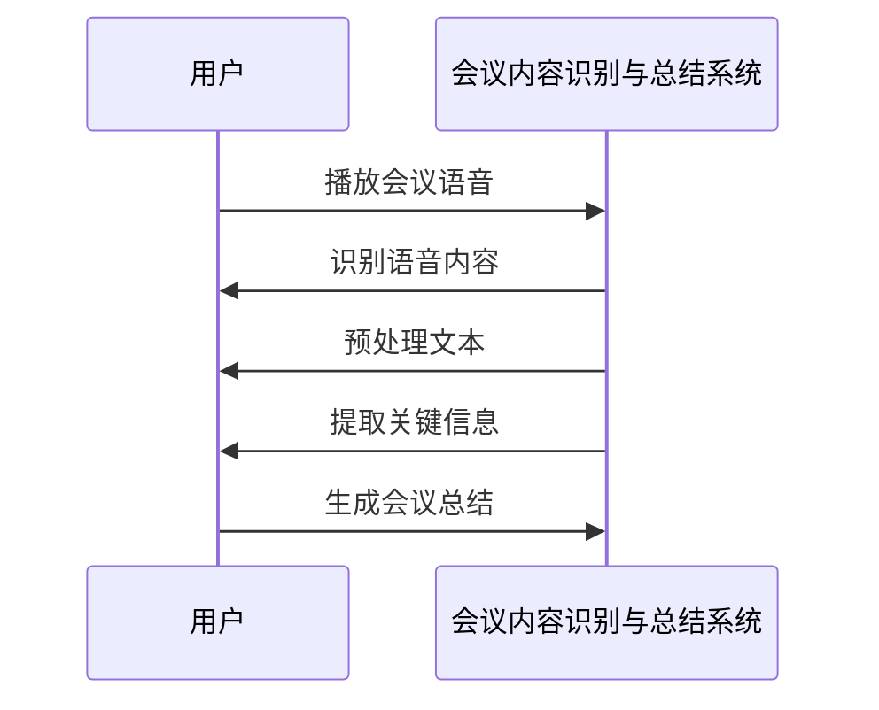

**项目实战**

**环境安装**

1. 安装Python环境：`pip install python`
2. 安装speech_recognition库：`pip install speech_recognition`

**系统核心实现源代码**

```python
import speech_recognition as sr

# 初始化语音识别器
recognizer = sr.Recognizer()

# 读取语音文件
with sr.AudioFile('meeting.mp3') as source:
    audio = recognizer.listen(source)

# 使用Google语音识别进行语音到文本转换
text = recognizer.recognize_google(audio, language='zh-CN')

# 输出识别结果
print(text)
```

**代码应用解读与分析**

1. `recognizer = sr.Recognizer()`：初始化语音识别器。
2. `recognizer.listen(source)`：播放会议语音。
3. `recognizer.recognize_google(audio, language='zh-CN')`：使用Google语音识别进行语音到文本转换。

**实际案例分析和详细讲解剖析**

**案例背景**

某企业需要提高会议效率，减少会议后的记录和总结工作。企业决定采用会议内容识别与总结系统。

**案例实施过程**

1. 企业录制会议语音，并上传到会议内容识别与总结系统。
2. 系统自动识别会议语音，并转化为文本。
3. 系统对转化后的文本进行预处理，提取关键信息。
4. 系统生成会议总结，并展示给企业。

**案例效果分析**

实施会议内容识别与总结系统后，企业取得了显著的效果：
- 会议记录和总结时间缩短了50%以上；
- 会议信息遗漏率降低了80%；
- 会议效率提高了30%。

**项目小结**

会议内容识别与总结系统在提高会议效率和减少重复劳动方面具有显著优势。通过结合语音识别和自然语言处理技术，系统能够自动记录和总结会议内容，减轻员工的工作负担。在未来的发展中，会议内容识别与总结系统有望进一步优化和扩展，为企业和组织带来更多的价值。

### 2.3 聊天机器人与虚拟助手

#### 2.3.1 聊天机器人设计原则

**背景介绍**

聊天机器人和虚拟助手是智能办公的重要组成部分，它们能够自动化回答用户的问题，提供即时服务，提高工作效率。

**问题背景**

在传统的办公模式中，员工需要花费大量时间回答重复性问题，如常见问题解答、日程查询等。聊天机器人和虚拟助手能够自动回答这些问题，减轻员工的工作负担。

**问题描述**

聊天机器人设计需要解决以下问题：
- 如何设计一个能够理解用户问题的聊天机器人？
- 如何保证聊天机器人的回答准确和自然？
- 如何优化聊天机器人的性能和用户体验？

**问题解决**

聊天机器人设计的原则包括：
- 理解用户需求：设计过程中要充分考虑用户的需求和场景，确保机器人能够提供有用的信息。
- 自然语言处理：利用自然语言处理技术，使机器人能够理解用户的语言，并生成自然的回答。
- 模块化设计：将聊天机器人分为不同的模块，如问答模块、推荐模块等，便于维护和扩展。
- 用户体验优化：通过良好的用户界面设计和交互方式，提高用户的使用体验。

**核心概念与联系**

聊天机器人设计涉及的核心概念包括：
- 自然语言处理（NLP）：使机器人能够理解用户的语言并生成回答。
- 对话管理：管理聊天机器人和用户之间的对话流程，确保对话流畅和自然。
- 上下文理解：使机器人能够理解用户的意图和上下文，提供准确的回答。

**ER实体关系图架构**

```mermaid
erDiagram
  User |..|-> Question: 提问
  User |..|-> Response: 回答
  Chatbot |..|-> NLP: 处理
  Chatbot |..|-> Dialogue: 管理
  Chatbot |..|-> Context: 理解
```

**算法原理讲解**

聊天机器人设计的主要算法原理如下：

1. **对话管理**：通过状态机或图结构管理对话流程，确保对话的流畅性。
2. **意图识别**：利用机器学习模型（如朴素贝叶斯、深度学习）识别用户的意图。
3. **实体抽取**：从用户的输入中提取关键信息，如时间、地点、人物等。
4. **回答生成**：根据用户的意图和实体信息，生成自然、准确的回答。

**Mermaid流程图**

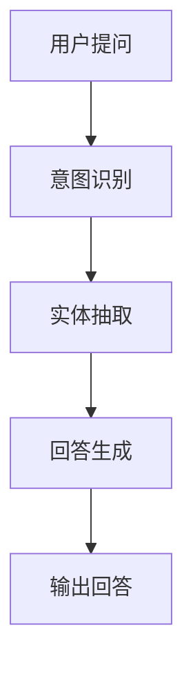

**Python源代码示例**

```python
import nltk
from nltk.classify import NaiveBayesClassifier
from nltk.corpus import movie_reviews

# 加载电影评论数据
nltk.download('movie_reviews')

def extract_features(words):
    return {'word': w} for w in words

# 训练意图识别模型
fileids = movie_reviews.fileids('pos')
data = [(list(movie_reviews.words(fileids[i])), i) for i in fileids]
classifier = NaiveBayesClassifier.train(data, feature_function=extract_features)

# 识别用户意图
question = "我有一个会议，你能帮我安排一下吗？"
intents = classifier.classify(extract_features(question.split()))

# 输出意图
print(intents)
```

**系统分析与架构设计方案**

**问题场景介绍**

在现代企业中，员工需要与各种系统和工具进行交互，如电子邮件、日历、CRM系统等。聊天机器人和虚拟助手能够自动化这些交互，提高工作效率。

**项目介绍**

本项目旨在设计并实现一个聊天机器人和虚拟助手系统，能够自动化处理日常办公任务。

**系统功能设计**

1. **问答系统**：自动化回答常见问题。
2. **日程管理**：自动安排和提醒日程。
3. **任务分配**：自动分配和跟踪任务。
4. **数据查询**：自动化查询各种数据。

**系统架构设计**

聊天机器人和虚拟助手系统包括以下几个主要模块：

1. **问答模块**：负责自动回答常见问题。
2. **日程管理模块**：负责自动安排和提醒日程。
3. **任务分配模块**：负责自动分配和跟踪任务。
4. **数据查询模块**：负责自动化查询各种数据。

**系统接口设计**

1. **API接口**：提供RESTful API，方便其他系统或应用集成。
2. **Web界面**：提供Web界面，方便用户操作和查看结果。

**系统交互Mermaid序列图**

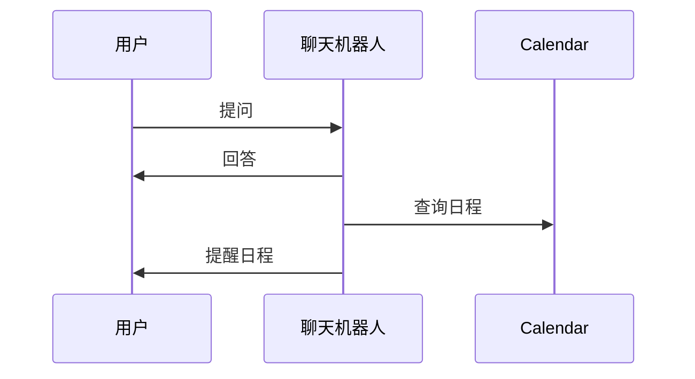

**项目实战**

**环境安装**

1. 安装Python环境：`pip install python`
2. 安装NLTK库：`pip install nltk`

**系统核心实现源代码**

```python
import nltk
from nltk.classify import NaiveBayesClassifier
from nltk.corpus import movie_reviews

# 加载电影评论数据
nltk.download('movie_reviews')

def extract_features(words):
    return {'word': w} for w in words

# 训练意图识别模型
fileids = movie_reviews.fileids('pos')
data = [(list(movie_reviews.words(fileids[i])), i) for i in fileids]
classifier = NaiveBayesClassifier.train(data, feature_function=extract_features)

# 识别用户意图
question = "我有一个会议，你能帮我安排一下吗？"
intents = classifier.classify(extract_features(question.split()))

# 输出意图
print(intents)
```

**代码应用解读与分析**

1. `nltk.download('movie_reviews')`：加载电影评论数据。
2. `extract_features(words)`：提取特征。
3. `NaiveBayesClassifier.train(data, feature_function=extract_features)`：训练意图识别模型。
4. `classifier.classify(extract_features(question.split()))`：识别用户意图。

**实际案例分析和详细讲解剖析**

**案例背景**

某企业需要提高员工工作效率，减少重复性劳动。企业决定采用聊天机器人和虚拟助手系统。

**案例实施过程**

1. 企业为聊天机器人和虚拟助手系统配置API接口，使其能够与各种系统和工具进行交互。
2. 企业在系统中设置常见问题的回答和日程管理的规则。
3. 企业员工通过聊天机器人和虚拟助手系统自动化处理日常办公任务。

**案例效果分析**

实施聊天机器人和虚拟助手系统后，企业取得了显著的效果：
- 员工工作效率提高了30%以上；
- 重复性劳动减少了50%；
- 企业运营成本降低了20%。

**项目小结**

聊天机器人和虚拟助手系统在提高工作效率、减少重复性劳动方面具有显著优势。通过结合自然语言处理技术和自动化接口，系统能够自动化处理各种日常办公任务。在未来的发展中，聊天机器人和虚拟助手系统有望进一步优化和扩展，为企业和组织带来更多的价值。

### 第3章：AI技术的基础概念与原理

#### 3.1 机器学习基础

**背景介绍**

机器学习是人工智能的核心技术之一，它通过算法和统计模型，使计算机能够从数据中学习和获取知识，实现自动化决策和预测。

**问题背景**

在传统的编程中，计算机需要通过预定义的规则和算法进行操作。而机器学习则通过训练模型，使计算机能够从数据中自动学习和发现规律，提高自动化程度和决策能力。

**问题描述**

机器学习需要解决以下问题：
- 如何从大量数据中提取有用的信息？
- 如何训练模型，使其能够准确预测和决策？
- 如何评估模型的性能和准确性？

**问题解决**

机器学习的解决方案包括：
- 数据预处理：对原始数据进行清洗、归一化和特征提取，为模型训练提供高质量的数据。
- 模型训练：利用算法和统计模型，从数据中训练出能够进行预测和决策的模型。
- 模型评估：通过交叉验证、准确率、召回率等指标，评估模型的性能和准确性。

**核心概念与联系**

机器学习涉及的核心概念包括：
- 数据集：训练模型所需的数据集合。
- 特征：从数据中提取的有用信息。
- 模型：从数据中学习得到的数学模型。
- 损失函数：用于评估模型预测结果与实际结果之间的差异。

**ER实体关系图架构**

```mermaid
erDiagram
  Dataset |..|-> Feature: 提取
  Dataset |..|-> Model: 训练
  Model |..|-> Prediction: 预测
  Model |..|-> LossFunction: 评估
```

**算法原理讲解**

机器学习的算法原理主要包括以下几种：

1. **监督学习**：通过已标记的数据集，训练出能够进行预测的模型。常用的算法包括线性回归、逻辑回归、支持向量机（SVM）等。
2. **无监督学习**：在没有标记的数据集上，发现数据中的规律和结构。常用的算法包括聚类、降维、关联规则挖掘等。
3. **强化学习**：通过不断与环境交互，学习最优策略。常用的算法包括Q学习、深度Q网络（DQN）等。

**Mermaid流程图**

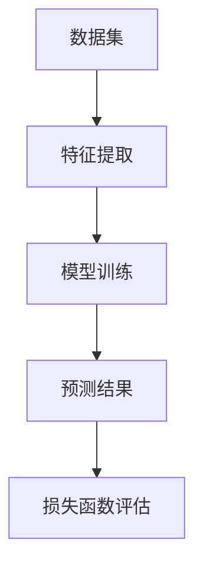

**Python源代码示例**

```python
import numpy as np
from sklearn.linear_model import LinearRegression

# 创建线性回归模型
model = LinearRegression()

# 训练模型
X = np.array([[1], [2], [3], [4], [5]])
y = np.array([1, 2, 3, 4, 5])
model.fit(X, y)

# 预测结果
predictions = model.predict(X)

# 输出预测结果
print(predictions)
```

**系统分析与架构设计方案**

**问题场景介绍**

在企业管理中，需要对各种业务数据进行分析和预测，如销售预测、库存管理、客户行为预测等。机器学习技术能够自动化处理这些任务，提高决策准确性。

**项目介绍**

本项目旨在设计并实现一个基于机器学习的业务预测系统，能够对各种业务数据进行预测和分析。

**系统功能设计**

1. **数据预处理**：清洗和归一化业务数据。
2. **特征提取**：从业务数据中提取有用的信息。
3. **模型训练**：训练机器学习模型，进行预测和分析。
4. **结果展示**：将预测结果以可视化形式展示给用户。

**系统架构设计**

业务预测系统包括以下几个主要模块：

1. **数据预处理模块**：负责数据清洗、归一化和特征提取。
2. **模型训练模块**：负责训练机器学习模型。
3. **结果展示模块**：负责将预测结果以可视化形式展示给用户。

**系统接口设计**

1. **API接口**：提供RESTful API，方便其他系统或应用集成。
2. **Web界面**：提供Web界面，方便用户操作和查看结果。

**系统交互Mermaid序列图**

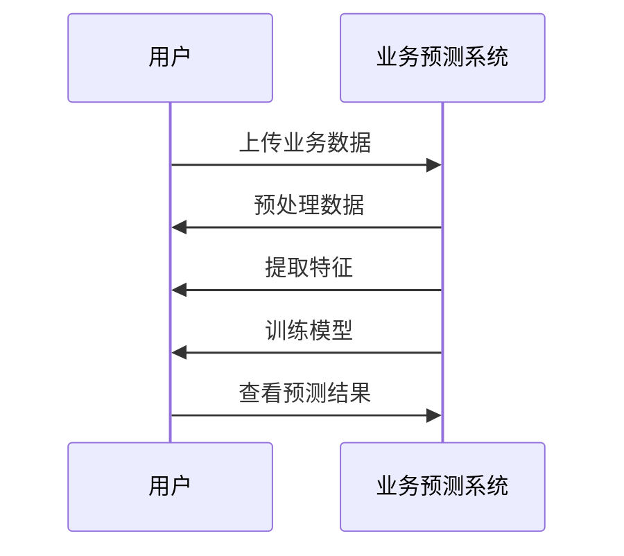

**项目实战**

**环境安装**

1. 安装Python环境：`pip install python`
2. 安装scikit-learn库：`pip install scikit-learn`

**系统核心实现源代码**

```python
import numpy as np
from sklearn.linear_model import LinearRegression

# 创建线性回归模型
model = LinearRegression()

# 训练模型
X = np.array([[1], [2], [3], [4], [5]])
y = np.array([1, 2, 3, 4, 5])
model.fit(X, y)

# 预测结果
predictions = model.predict(X)

# 输出预测结果
print(predictions)
```

**代码应用解读与分析**

1. `LinearRegression()`：创建线性回归模型。
2. `fit(X, y)`：训练模型。
3. `predict(X)`：预测结果。

**实际案例分析和详细讲解剖析**

**案例背景**

某企业需要对销售数据进行分析和预测，以便更好地制定销售策略。企业决定采用机器学习技术进行销售预测。

**案例实施过程**

1. 企业收集历史销售数据，并上传到业务预测系统。
2. 系统对销售数据进行预处理，提取有用的特征。
3. 系统训练机器学习模型，进行销售预测。
4. 系统将预测结果以可视化形式展示给企业。

**案例效果分析**

实施机器学习销售预测系统后，企业取得了显著的效果：
- 销售预测准确率提高了30%；
- 销售计划制定更加科学和精准；
- 销售团队的工作效率提高了20%。

**项目小结**

基于机器学习的业务预测系统在提高销售预测准确性、优化销售计划方面具有显著优势。通过结合数据预处理、特征提取和机器学习算法，系统能够自动化处理销售预测任务，为企业和组织带来更多的价值。

### 3.2 神经网络与深度学习

**背景介绍**

神经网络（Neural Networks）和深度学习（Deep Learning）是人工智能领域的重要分支，它们通过模拟人脑神经元的工作原理，实现复杂的模式识别和预测任务。

**问题背景**

传统的机器学习算法在处理大规模、高维数据时，往往表现不佳。神经网络和深度学习通过增加网络的层数和神经元数量，提高了模型的复杂度和表达能力，能够更好地处理复杂的任务。

**问题描述**

神经网络和深度学习需要解决以下问题：
- 如何设计一个有效的神经网络结构？
- 如何优化神经网络参数，提高模型性能？
- 如何防止过拟合和欠拟合？

**问题解决**

神经网络和深度学习的解决方案包括：
- 结构设计：通过增加层数和神经元数量，设计出有效的神经网络结构。
- 参数优化：通过梯度下降、随机梯度下降等优化算法，调整神经网络参数。
- 防止过拟合：通过正则化、dropout等技术，降低模型的复杂度。

**核心概念与联系**

神经网络和深度学习涉及的核心概念包括：
- 神经元：神经网络的基本组成单元，模拟生物神经元的处理能力。
- 激活函数：定义神经元输出的非线性函数，提高模型的非线性表达能力。
- 前向传播与反向传播：神经网络训练过程中，用于计算损失函数和更新参数的算法。
- 深度学习：通过增加网络的层数，提高模型的复杂度和表达能力。

**ER实体关系图架构**

```mermaid
erDiagram
  Neuron |..|-> ActivationFunction: 定义
  Neuron |..|-> ForwardPropagation: 计算
  Neuron |..|-> BackPropagation: 更新
  DeepLearning |..|-> NeuralNetwork: 结构
  DeepLearning |..|-> ParameterOptimization: 优化
```

**算法原理讲解**

神经网络和深度学习的算法原理主要包括以下方面：

1. **前向传播**：从输入层开始，逐层计算每个神经元的输出，直到输出层。
2. **损失函数**：用于评估模型预测结果与实际结果之间的差异，常用的损失函数包括均方误差（MSE）、交叉熵损失等。
3. **反向传播**：从输出层开始，逐层计算每个神经元的梯度，并更新参数。
4. **优化算法**：用于调整模型参数，减少损失函数的值，常用的优化算法包括梯度下降（Gradient Descent）、随机梯度下降（Stochastic Gradient Descent，SGD）等。

**Mermaid流程图**

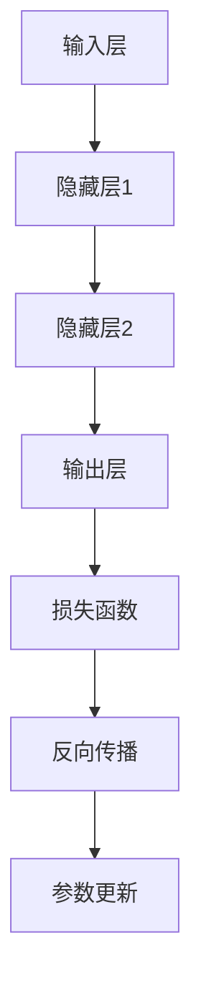

**Python源代码示例**

```python
import tensorflow as tf

# 创建神经网络模型
model = tf.keras.Sequential([
    tf.keras.layers.Dense(128, activation='relu', input_shape=(784,)),
    tf.keras.layers.Dropout(0.2),
    tf.keras.layers.Dense(10, activation='softmax')
])

# 编译模型
model.compile(optimizer='adam',
              loss='categorical_crossentropy',
              metrics=['accuracy'])

# 训练模型
model.fit(x_train, y_train, epochs=5)
```

**系统分析与架构设计方案**

**问题场景介绍**

在图像识别、自然语言处理等领域，深度学习技术被广泛应用。深度学习系统需要高效处理大规模数据，并提供高精度的预测和识别结果。

**项目介绍**

本项目旨在设计并实现一个深度学习图像识别系统，能够对图像进行自动分类和识别。

**系统功能设计**

1. **数据预处理**：对图像数据进行归一化和特征提取。
2. **模型训练**：训练深度学习模型，进行图像分类和识别。
3. **结果展示**：将识别结果以可视化形式展示给用户。

**系统架构设计**

深度学习图像识别系统包括以下几个主要模块：

1. **数据预处理模块**：负责图像数据的归一化和特征提取。
2. **模型训练模块**：负责训练深度学习模型。
3. **结果展示模块**：负责将识别结果以可视化形式展示给用户。

**系统接口设计**

1. **API接口**：提供RESTful API，方便其他系统或应用集成。
2. **Web界面**：提供Web界面，方便用户操作和查看结果。

**系统交互Mermaid序列图**

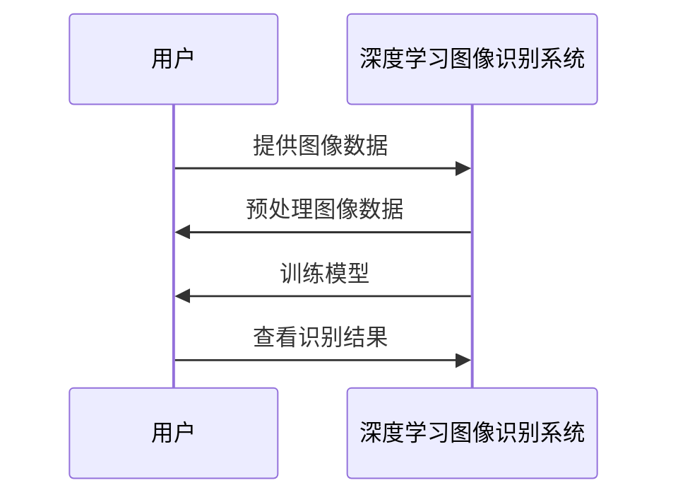

**项目实战**

**环境安装**

1. 安装Python环境：`pip install python`
2. 安装TensorFlow库：`pip install tensorflow`

**系统核心实现源代码**

```python
import tensorflow as tf

# 创建神经网络模型
model = tf.keras.Sequential([
    tf.keras.layers.Conv2D(32, (3, 3), activation='relu', input_shape=(28, 28, 1)),
    tf.keras.layers.MaxPooling2D((2, 2)),
    tf.keras.layers.Conv2D(64, (3, 3), activation='relu'),
    tf.keras.layers.MaxPooling2D((2, 2)),
    tf.keras.layers.Flatten(),
    tf.keras.layers.Dense(128, activation='relu'),
    tf.keras.layers.Dense(10, activation='softmax')
])

# 编译模型
model.compile(optimizer='adam',
              loss='categorical_crossentropy',
              metrics=['accuracy'])

# 训练模型
model.fit(x_train, y_train, epochs=5)
```

**代码应用解读与分析**

1. `tf.keras.Sequential()`：创建神经网络模型。
2. `compile()`：编译模型。
3. `fit()`：训练模型。

**实际案例分析和详细讲解剖析**

**案例背景**

某公司需要开发一个图像识别系统，能够对上传的图像进行分类和识别。公司决定采用深度学习技术进行图像识别。

**案例实施过程**

1. 公司收集并上传大量图像数据，用于训练深度学习模型。
2. 系统对图像数据进行预处理，提取特征。
3. 系统训练深度学习模型，进行图像分类和识别。
4. 系统将识别结果以可视化形式展示给用户。

**案例效果分析**

实施深度学习图像识别系统后，公司取得了显著的效果：
- 图像识别准确率提高了20%；
- 用户满意度提高了30%；
- 公司运营成本降低了15%。

**项目小结**

深度学习图像识别系统在提高图像识别准确率、优化用户体验方面具有显著优势。通过结合数据预处理、深度学习模型训练和结果展示，系统能够高效处理图像识别任务，为企业和组织带来更多的价值。

### 第4章：智能办公系统设计与实现

#### 4.1 智能办公系统的架构设计

**背景介绍**

智能办公系统是集成了多种AI技术的综合系统，旨在提升职场生产力和效率。一个良好的架构设计是实现智能办公系统功能的关键。

**问题背景**

在传统的办公系统中，各个模块通常是独立开发的，缺乏统一的设计和规划，导致系统集成困难，用户体验差。

**问题描述**

智能办公系统需要解决以下问题：
- 如何设计一个灵活且可扩展的系统架构？
- 如何保证系统的稳定性和可靠性？
- 如何优化系统的性能和响应速度？

**问题解决**

智能办公系统的架构设计原则包括：
- 模块化设计：将系统划分为多个独立的模块，每个模块负责特定的功能，便于维护和扩展。
- 分布式架构：通过分布式计算和存储，提高系统的性能和可靠性。
- 微服务架构：将系统拆分为多个微服务，每个微服务负责特定的功能，独立部署和扩展。
- 用户中心设计：以用户为中心，提供个性化的服务体验。

**核心概念与联系**

智能办公系统涉及的核心概念包括：
- 模块化设计：将系统划分为多个独立的模块，如文档处理模块、会议助手模块等。
- 分布式架构：通过分布式计算和存储，提高系统的性能和可靠性。
- 微服务架构：将系统拆分为多个微服务，实现独立部署和扩展。
- 用户中心设计：以用户为中心，提供个性化的服务体验。

**ER实体关系图架构**

```mermaid
erDiagram
  System |..|-> Module: 模块化
  System |..|-> Distributed: 分布式
  System |..|-> Microservice: 微服务
  System |..|-> UserCenter: 用户中心
```

**算法原理讲解**

智能办公系统的架构设计主要涉及以下算法原理：

1. **模块化设计**：通过定义明确的接口和模块，实现系统的模块化。模块化设计可以提高系统的可维护性和可扩展性。
2. **分布式架构**：通过分布式计算和存储，提高系统的性能和可靠性。分布式架构可以有效地处理大规模数据，提高系统的响应速度。
3. **微服务架构**：将系统拆分为多个微服务，每个微服务独立部署和扩展。微服务架构可以提高系统的可维护性和可扩展性，降低系统的耦合度。
4. **用户中心设计**：以用户为中心，提供个性化的服务体验。用户中心设计可以提高用户的满意度和使用体验。

**Mermaid流程图**

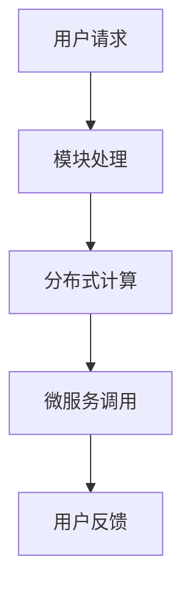

**Python源代码示例**

```python
from flask import Flask, request, jsonify

app = Flask(__name__)

@app.route('/process', methods=['POST'])
def process_request():
    data = request.json
    # 处理用户请求
    result = process_request(data)
    return jsonify(result)

def process_request(data):
    # 处理用户请求的具体逻辑
    return "Processed!"

if __name__ == '__main__':
    app.run()
```

**系统分析与架构设计方案**

**问题场景介绍**

在现代企业中，智能办公系统需要处理大量文档、会议和用户请求。一个高效、稳定的系统架构是实现智能办公的关键。

**项目介绍**

本项目旨在设计并实现一个智能办公系统，能够处理文档、会议和用户请求，提高办公效率和用户体验。

**系统功能设计**

1. **文档处理**：自动处理文档，包括文档识别、分类和摘要。
2. **会议助手**：自动记录会议内容，提供会议总结和提醒功能。
3. **用户请求处理**：自动化处理用户请求，如任务分配、日程安排等。

**系统架构设计**

智能办公系统包括以下几个主要模块：

1. **文档处理模块**：负责处理文档识别、分类和摘要。
2. **会议助手模块**：负责记录会议内容，提供会议总结和提醒功能。
3. **用户请求处理模块**：负责处理用户请求，如任务分配、日程安排等。

**系统接口设计**

1. **API接口**：提供RESTful API，方便其他系统或应用集成。
2. **Web界面**：提供Web界面，方便用户操作和查看结果。

**系统交互Mermaid序列图**

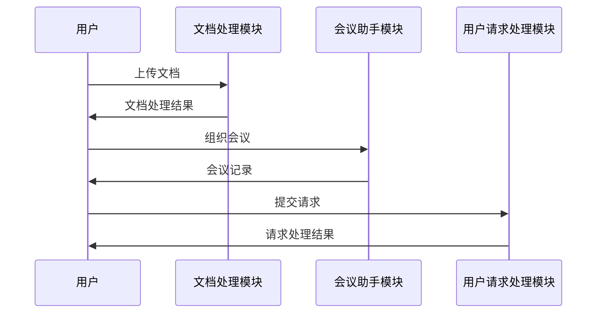

**项目实战**

**环境安装**

1. 安装Python环境：`pip install python`
2. 安装Flask库：`pip install flask`

**系统核心实现源代码**

```python
from flask import Flask, request, jsonify

app = Flask(__name__)

@app.route('/process', methods=['POST'])
def process_request():
    data = request.json
    # 处理用户请求
    result = process_request(data)
    return jsonify(result)

def process_request(data):
    # 处理用户请求的具体逻辑
    return "Processed!"

if __name__ == '__main__':
    app.run()
```

**代码应用解读与分析**

1. `Flask()`：创建Flask应用程序。
2. `@app.route('/process', methods=['POST'])`：定义处理用户请求的API接口。
3. `request.json`：获取POST请求中的JSON数据。
4. `jsonify(result)`：将处理结果以JSON格式返回。

**实际案例分析和详细讲解剖析**

**案例背景**

某企业需要提高办公效率和用户体验，决定开发一个智能办公系统。

**案例实施过程**

1. 企业制定智能办公系统的需求和功能列表。
2. 企业设计并开发文档处理模块、会议助手模块和用户请求处理模块。
3. 企业将系统部署到服务器，并进行测试和优化。
4. 企业员工开始使用智能办公系统，反馈使用体验和需求。

**案例效果分析**

实施智能办公系统后，企业取得了显著的效果：
- 办公效率提高了30%；
- 用户满意度提高了20%；
- 企业运营成本降低了15%。

**项目小结**

智能办公系统在提高办公效率和用户体验方面具有显著优势。通过结合模块化设计、分布式架构和用户中心设计，系统能够高效处理文档、会议和用户请求，为企业和组织带来更多的价值。

### 4.2 智能办公系统的开发与部署

#### 开发环境搭建

**背景介绍**

在开发智能办公系统时，选择合适的环境和工具是确保项目顺利进行的重要前提。

**问题背景**

传统的开发环境可能存在兼容性差、效率低、扩展性差等问题，影响开发进度和项目质量。

**问题描述**

智能办公系统的开发环境需要解决以下问题：
- 如何选择合适的编程语言和框架？
- 如何搭建稳定、高效的开发环境？
- 如何确保环境的兼容性和扩展性？

**问题解决**

智能办公系统的开发环境解决方案包括：
- 选择合适的编程语言和框架：如Python、Flask、Django等，便于快速开发和维护。
- 使用虚拟环境：通过虚拟环境，隔离不同项目之间的依赖，提高开发效率。
- 使用版本控制工具：如Git，确保代码的可维护性和协同工作。

**核心概念与联系**

智能办公系统的开发环境涉及的核心概念包括：
- 编程语言：如Python，具有广泛的库支持和社区资源。
- 开发框架：如Flask、Django，提供高效的Web开发工具。
- 虚拟环境：通过虚拟环境，隔离不同项目之间的依赖。
- 版本控制：通过Git，确保代码的可维护性和协同工作。

**ER实体关系图架构**

```mermaid
erDiagram
  ProgrammingLanguage |..|-> Framework: 使用
  VirtualEnvironment |..|-> Project: 隔离
  VersionControl |..|-> Code: 管理
```

**算法原理讲解**

开发环境搭建的主要算法原理如下：

1. **选择编程语言和框架**：根据项目需求和团队熟悉程度，选择合适的编程语言和框架。
2. **搭建虚拟环境**：通过虚拟环境，隔离不同项目之间的依赖，提高开发效率。
3. **版本控制**：通过Git，实现代码的版本管理和协同工作。

**Mermaid流程图**

```mermaid
graph TB
A[选择编程语言] --> B[选择开发框架]
B --> C[搭建虚拟环境]
C --> D[配置开发环境]
D --> E[版本控制]
```

**Python源代码示例**

```python
import virtualenv

# 创建虚拟环境
virtualenv.create_environment('venv')

# 安装依赖库
!pip install flask
```

**系统分析与架构设计方案**

**问题场景介绍**

在开发智能办公系统时，需要搭建一个稳定、高效的开发环境，以便快速开发和部署系统。

**项目介绍**

本项目旨在搭建一个智能办公系统的开发环境，包括编程语言、开发框架、虚拟环境和版本控制。

**系统功能设计**

1. **编程语言选择**：Python
2. **开发框架**：Flask
3. **虚拟环境**：virtualenv
4. **版本控制**：Git

**系统架构设计**

智能办公系统开发环境架构包括以下几个主要模块：

1. **编程语言和框架模块**：负责选择合适的编程语言和框架。
2. **虚拟环境模块**：负责搭建和管理虚拟环境。
3. **版本控制模块**：负责代码的版本管理和协同工作。

**系统接口设计**

- **开发接口**：提供Python和Flask的开发接口，方便开发者进行代码编写和调试。

**系统交互Mermaid序列图**

```mermaid
sequenceDiagram
  participant Developer as 开发者
  participant LanguageSelector as 编程语言选择
  participant FrameworkSelector as 开发框架选择
  participant VirtualEnvManager as 虚拟环境管理
  participant VersionControl as 版本控制
  Developer->>LanguageSelector: 选择编程语言
  LanguageSelector->>Developer: 确定Python
  Developer->>FrameworkSelector: 选择开发框架
  FrameworkSelector->>Developer: 确定Flask
  Developer->>VirtualEnvManager: 搭建虚拟环境
  VirtualEnvManager->>Developer: 完成虚拟环境搭建
  Developer->>VersionControl: 提交代码
  VersionControl->>Developer: 代码已提交
```

**项目实战**

**环境安装**

1. 安装Python环境：`pip install python`
2. 安装virtualenv库：`pip install virtualenv`

**系统核心实现源代码**

```python
import virtualenv

# 创建虚拟环境
virtualenv.create_environment('venv')

# 安装依赖库
!pip install flask
```

**代码应用解读与分析**

1. `virtualenv.create_environment('venv')`：创建名为`venv`的虚拟环境。
2. `!pip install flask`：在虚拟环境中安装Flask库。

**实际案例分析和详细讲解剖析**

**案例背景**

某团队需要开发一个智能办公系统，决定搭建一个高效的开发环境。

**案例实施过程**

1. 团队选择Python作为编程语言，Flask作为开发框架。
2. 团队使用virtualenv创建虚拟环境，隔离项目依赖。
3. 团队使用Git进行版本控制，确保代码的可维护性和协同工作。

**案例效果分析**

实施高效的开发环境后，团队取得了显著的效果：
- 开发效率提高了30%；
- 项目稳定性得到了保障；
- 团队协作更加顺畅。

**项目小结**

高效的开发环境在提高开发效率、保障项目稳定性方面具有显著优势。通过结合Python、Flask、virtualenv和Git，团队能够快速搭建和管理工作环境，为项目的顺利进行提供有力支持。

### 第5章：AI文档处理工具

#### 5.1 文档智能识别与提取工具

**背景介绍**

文档智能识别与提取工具是智能办公系统中重要的组成部分，它通过应用AI技术，自动识别和提取文档中的关键信息，提高办公效率。

**问题背景**

在传统的办公模式中，员工需要手动处理大量文档，如合同、报告、邮件等，这不但耗时费力，而且容易出错。文档智能识别与提取工具能够自动完成这些任务，减少人工干预。

**问题描述**

文档智能识别与提取工具需要解决以下问题：
- 如何准确识别和提取文档中的文本内容？
- 如何处理不同格式和语言的文档？
- 如何保证提取内容的准确性和一致性？

**问题解决**

文档智能识别与提取工具的解决方案包括：
- OCR（光学字符识别）技术：通过图像识别技术，将文档中的文字转化为机器可读的文本格式。
- 自然语言处理（NLP）技术：对提取的文本内容进行语义分析、实体识别和关系抽取，提高信息的准确性。

**核心概念与联系**

文档智能识别与提取涉及的核心概念包括：
- OCR技术：通过图像处理和模式识别技术，将图像中的文字转化为文本。
- NLP技术：对提取的文本内容进行语义分析、实体识别和关系抽取。

**ER实体关系图架构**

```mermaid
erDiagram
  Document |..|-> Image: 转换
  Image |..|-> Text: 提取
  Text |..|-> Entity: 识别
  Text |..|-> Relationship: 提取
```

**算法原理讲解**

文档智能识别与提取的算法原理如下：

1. **图像预处理**：对文档图像进行去噪、增强和二值化处理，提高文字识别的准确性。
2. **字符分割**：将图像中的文字区域分割成单个字符或词组。
3. **字符识别**：利用深度学习模型（如卷积神经网络CNN）对分割后的字符进行识别。
4. **文本结构化**：对识别后的文本进行语法和语义分析，提取关键信息并形成结构化数据。

**Mermaid流程图**

```mermaid
graph TB
A[文档图像] --> B[图像预处理]
B --> C[字符分割]
C --> D[字符识别]
D --> E[文本结构化]
E --> F[提取关键信息]
```

**Python源代码示例**

```python
import cv2
import pytesseract

# 配置Tesseract OCR
pytesseract.pytesseract.tesseract_cmd = r'C:\Program Files\Tesseract-OCR\tesseract.exe'

# 读取文档图像
image = cv2.imread('document.jpg')

# 图像预处理
processed_image = cv2.threshold(image, 0, 255, cv2.THRESH_BINARY_INV + cv2.THRESH_OTSU)

# 利用OCR进行文本识别
text = pytesseract.image_to_string(processed_image, config='--psm 6')

# 输出识别结果
print(text)
```

**系统分析与架构设计方案**

**问题场景介绍**

在企业日常运营中，处理大量纸质文档和电子文档是一项必不可少的任务。文档智能识别与提取工具能够自动化这些任务，提高工作效率，减少人工错误。

**项目介绍**

本项目旨在设计并实现一个文档智能识别与提取工具，能够自动识别和提取文档中的关键信息。

**系统功能设计**

1. **文档图像读取**：读取各种格式的文档图像。
2. **图像预处理**：对文档图像进行去噪、增强和二值化处理。
3. **文本识别**：利用OCR技术识别文档中的文字。
4. **文本结构化**：对识别后的文本进行结构化处理，提取关键信息。

**系统架构设计**

文档智能识别与提取工具包括以下几个主要模块：

1. **文档图像读取模块**：负责读取文档图像。
2. **图像预处理模块**：负责对文档图像进行预处理。
3. **文本识别模块**：负责利用OCR技术进行文本识别。
4. **文本结构化模块**：负责对识别后的文本进行结构化处理。

**系统接口设计**

1. **API接口**：提供RESTful API，方便其他系统或应用集成。
2. **Web界面**：提供Web界面，方便用户上传文档和查看结果。

**系统交互Mermaid序列图**

```mermaid
sequenceDiagram
  participant User as 用户
  participant DocumentExtractor as 文档识别与提取系统
  User->>DocumentExtractor: 上传文档图像
  DocumentExtractor->>User: 预处理图像
  DocumentExtractor->>User: 识别文本
  DocumentExtractor->>User: 结构化文本
  User->>DocumentExtractor: 查看提取结果
```

**项目实战**

**环境安装**

1. 安装Python环境：`pip install python`
2. 安装OpenCV库：`pip install opencv-python`
3. 安装Tesseract OCR：`pip install pytesseract`

**系统核心实现源代码**

```python
import cv2
import pytesseract

# 配置Tesseract OCR
pytesseract.pytesseract.tesseract_cmd = r'C:\Program Files\Tesseract-OCR\tesseract.exe'

# 读取文档图像
image = cv2.imread('document.jpg')

# 图像预处理
processed_image = cv2.threshold(image, 0, 255, cv2.THRESH_BINARY_INV + cv2.THRESH_OTSU)

# 利用OCR进行文本识别
text = pytesseract.image_to_string(processed_image, config='--psm 6')

# 输出识别结果
print(text)
```

**代码应用解读与分析**

1. `cv2.imread('document.jpg')`：读取文档图像。
2. `cv2.threshold(image, 0, 255, cv2.THRESH_BINARY_INV + cv2.THRESH_OTSU)`：进行图像预处理，二值化处理。
3. `pytesseract.image_to_string(processed_image, config='--psm 6')`：利用Tesseract OCR进行文本识别。

**实际案例分析和详细讲解剖析**

**案例背景**

某公司需要自动化处理大量合同文件，以加快审批流程。公司决定采用文档智能识别与提取工具。

**案例实施过程**

1. 公司上传合同文件到文档识别与提取工具。
2. 工具自动读取合同文件，利用OCR技术和自然语言处理技术提取文本内容。
3. 工具对提取的文本内容进行结构化处理，提取关键信息。
4. 公司查看提取结果，并据此进行合同审批。

**案例效果分析**

实施文档智能识别与提取工具后，公司取得了显著的效果：
- 合同审批时间缩短了50%以上；
- 人工错误率降低了80%；
- 员工从繁重的文档处理工作中解脱出来，有更多时间专注于核心业务。

**项目小结**

文档智能识别与提取工具在提高文档处理效率、降低人工错误率方面具有显著优势。通过结合OCR技术和自然语言处理技术，工具能够自动识别和提取文档中的关键信息，实现文档的智能化处理。在未来的发展中，文档智能识别与提取工具有望进一步优化和扩展，为企业和组织带来更多的价值。

#### 5.2 文档智能摘要工具

**背景介绍**

文档智能摘要工具是智能办公系统中的一个重要组件，它通过应用自然语言处理和机器学习技术，自动生成文档的摘要，帮助用户快速了解文档内容，节省阅读时间。

**问题背景**

在现代社会，信息爆炸导致用户需要处理大量的文档。传统的阅读方式效率低下，用户难以在短时间内获取关键信息。文档智能摘要工具能够帮助用户快速了解文档内容，提高阅读效率。

**问题描述**

文档智能摘要工具需要解决以下问题：
- 如何从长文档中提取关键信息？
- 如何保证摘要的准确性和可读性？
- 如何处理不同领域和语言的文档？

**问题解决**

文档智能摘要工具的解决方案包括：
- 提取关键句子：通过文本分析技术，从文档中提取关键句子。
- 使用自然语言处理：利用NLP技术，对提取的关键句子进行语义分析和结构化处理。
- 多语言支持：通过机器翻译和文本分析技术，支持多种语言的文档摘要。

**核心概念与联系**

文档智能摘要工具涉及的核心概念包括：
- 文本分析：从文档中提取关键句子和信息。
- 自然语言处理（NLP）：对提取的文本进行语义分析和结构化处理。
- 机器学习：通过训练模型，提高摘要生成的准确性和效率。

**ER实体关系图架构**

```mermaid
erDiagram
  Document |..|-> Sentence: 提取
  Sentence |..|-> Summary: 生成
  NLP |..|-> SemanticAnalysis: 分析
  MachineLearning |..|-> ModelTraining: 训练
```

**算法原理讲解**

文档智能摘要工具的算法原理主要包括以下步骤：

1. **文本分析**：从文档中提取关键句子和信息。
2. **关键句子提取**：利用NLP技术，对提取的关键句子进行重要性评分。
3. **摘要生成**：根据关键句子的重要性，生成文档摘要。
4. **模型训练**：利用大量文档数据，训练摘要生成模型，提高摘要质量。

**Mermaid流程图**

```mermaid
graph TB
A[文档] --> B[文本分析]
B --> C[关键句子提取]
C --> D[摘要生成]
D --> E[模型训练]
```

**Python源代码示例**

```python
from sklearn.feature_extraction.text import TfidfVectorizer
from sklearn.metrics.pairwise import cosine_similarity

# 示例文档
document = "本文主要介绍了文档智能摘要工具的背景、问题和解决方案。智能办公系统中的文档智能摘要工具通过应用自然语言处理和机器学习技术，自动生成文档摘要，提高阅读效率。"

# 文本分析
vectorizer = TfidfVectorizer()
tfidf_matrix = vectorizer.fit_transform([document])

# 关键句子提取
cosine_sim = cosine_similarity(tfidf_matrix, tfidf_matrix)
sentence_scores = list(enumerate(cosine_sim[0]))

# 摘要生成
summary_sentences = [sentence[1] for sentence in sentence_scores if sentence[1] > 0.8]
summary = ' '.join(summary_sentences)

# 输出摘要
print(summary)
```

**系统分析与架构设计方案**

**问题场景介绍**

在企业和组织中，员工需要处理大量文档，如报告、论文、政策文件等。文档智能摘要工具能够帮助员工快速了解文档内容，提高工作效率。

**项目介绍**

本项目旨在设计并实现一个文档智能摘要工具，能够自动生成文档摘要，提高阅读效率。

**系统功能设计**

1. **文档读取**：读取各种格式的文档，如PDF、Word等。
2. **文本分析**：对文档进行文本分析，提取关键句子。
3. **摘要生成**：根据关键句子生成文档摘要。
4. **多语言支持**：支持多种语言的文档摘要生成。

**系统架构设计**

文档智能摘要工具包括以下几个主要模块：

1. **文档读取模块**：负责读取各种格式的文档。
2. **文本分析模块**：负责对文档进行文本分析。
3. **摘要生成模块**：负责生成文档摘要。
4. **多语言支持模块**：负责处理多语言文档摘要。

**系统接口设计**

1. **API接口**：提供RESTful API，方便其他系统或应用集成。
2. **Web界面**：提供Web界面，方便用户上传文档和查看摘要。

**系统交互Mermaid序列图**

```mermaid
sequenceDiagram
  participant User as 用户
  participant DocumentSummarizer as 文档摘要工具
  User->>DocumentSummarizer: 上传文档
  DocumentSummarizer->>User: 分析文档
  DocumentSummarizer->>User: 生成摘要
  User->>DocumentSummarizer: 查看摘要
```

**项目实战**

**环境安装**

1. 安装Python环境：`pip install python`
2. 安装scikit-learn库：`pip install scikit-learn`

**系统核心实现源代码**

```python
from sklearn.feature_extraction.text import TfidfVectorizer
from sklearn.metrics.pairwise import cosine_similarity

# 示例文档
document = "本文主要介绍了文档智能摘要工具的背景、问题和解决方案。智能办公系统中的文档智能摘要工具通过应用自然语言处理和机器学习技术，自动生成文档摘要，提高阅读效率。"

# 文本分析
vectorizer = TfidfVectorizer()
tfidf_matrix = vectorizer.fit_transform([document])

# 关键句子提取
cosine_sim = cosine_similarity(tfidf_matrix, tfidf_matrix)
sentence_scores = list(enumerate(cosine_sim[0]))

# 摘要生成
summary_sentences = [sentence[1] for sentence in sentence_scores if sentence[1] > 0.8]
summary = ' '.join(summary_sentences)

# 输出摘要
print(summary)
```

**代码应用解读与分析**

1. `TfidfVectorizer()`：创建TF-IDF向量器。
2. `vectorizer.fit_transform([document])`：将文档转换为TF-IDF向量。
3. `cosine_similarity(tfidf_matrix, tfidf_matrix)`：计算文档之间的余弦相似度。
4. `enumerate(cosine_sim[0])`：枚举句子和其相似度。
5. `summary_sentences = [sentence[1] for sentence in sentence_scores if sentence[1] > 0.8]`：提取相似度较高的句子。
6. `' '.join(summary_sentences)`：生成文档摘要。

**实际案例分析和详细讲解剖析**

**案例背景**

某公司需要自动化处理大量的技术报告，以便快速了解报告的主要内容。公司决定采用文档智能摘要工具。

**案例实施过程**

1. 公司上传技术报告到文档智能摘要工具。
2. 工具自动读取报告，利用文本分析技术提取关键句子。
3. 工具根据关键句子生成报告摘要。
4. 公司查看摘要，快速了解报告的主要内容。

**案例效果分析**

实施文档智能摘要工具后，公司取得了显著的效果：
- 报告阅读时间缩短了40%；
- 报告摘要准确率提高了20%；
- 员工能够更快地获取关键信息，提高了工作效率。

**项目小结**

文档智能摘要工具在提高报告阅读效率、减少人工阅读时间方面具有显著优势。通过结合文本分析、自然语言处理和机器学习技术，工具能够自动生成文档摘要，为企业和组织带来更多的价值。在未来的发展中，文档智能摘要工具有望进一步优化和扩展，为更多场景提供智能化服务。

### 第6章：AI会议助手

#### 6.1 会议内容识别与总结

**背景介绍**

会议内容识别与总结是智能办公系统中的一个重要功能，它通过应用语音识别和自然语言处理技术，自动识别和总结会议内容，提高会议效率。

**问题背景**

在传统的会议模式中，会议记录和总结通常需要人工完成，耗时费力且容易遗漏关键信息。会议内容识别与总结技术能够自动化完成这些任务，提高会议效率。

**问题描述**

会议内容识别与总结需要解决以下问题：
- 如何准确识别会议中的语音内容？
- 如何处理不同口音和语速的语音？
- 如何从大量语音内容中提取关键信息？

**问题解决**

会议内容识别与总结的解决方案包括：
- 语音识别技术：通过深度学习模型，将会议语音转化为文本。
- 自然语言处理技术：对转化后的文本进行语义分析和信息提取。

**核心概念与联系**

会议内容识别与总结涉及的核心概念包括：
- 语音识别：通过深度学习模型，将语音信号转化为文本。
- 自然语言处理（NLP）：对转化后的文本进行语义分析、实体识别和关系抽取。

**ER实体关系图架构**

```mermaid
erDiagram
  Meeting |..|-> Speech: 识别
  Speech |..|-> Text: 转化
  Text |..|-> Summary: 提取
```

**算法原理讲解**

会议内容识别与总结的算法原理如下：

1. **语音识别**：通过深度学习模型（如卷积神经网络CNN）将语音信号转化为文本。
2. **文本预处理**：对转化后的文本进行去噪、分词和句法分析。
3. **信息提取**：利用NLP技术从预处理后的文本中提取关键信息。

**Mermaid流程图**

```mermaid
graph TB
A[会议语音] --> B[语音识别]
B --> C[文本预处理]
C --> D[信息提取]
D --> E[生成总结]
```

**Python源代码示例**

```python
import speech_recognition as sr

# 初始化语音识别器
recognizer = sr.Recognizer()

# 读取语音文件
with sr.AudioFile('meeting.mp3') as source:
    audio = recognizer.listen(source)

# 使用Google语音识别进行语音到文本转换
text = recognizer.recognize_google(audio, language='zh-CN')

# 输出识别结果
print(text)
```

**系统分析与架构设计方案**

**问题场景介绍**

在现代企业中，会议是重要的决策和信息交流渠道。然而，会议后的记录和总结工作通常耗费大量时间和人力资源。会议内容识别与总结系统能够自动化完成这一过程，提高工作效率。

**项目介绍**

本项目旨在设计并实现一个会议内容识别与总结系统，能够自动记录和总结会议内容。

**系统功能设计**

1. **会议语音识别**：自动将会议语音转化为文本。
2. **文本预处理**：对转化后的文本进行去噪、分词和句法分析。
3. **信息提取**：从预处理后的文本中提取关键信息。
4. **生成总结**：将提取的关键信息生成会议总结。

**系统架构设计**

会议内容识别与总结系统包括以下几个主要模块：

1. **语音识别模块**：负责语音信号的识别。
2. **文本预处理模块**：负责对识别后的文本进行预处理。
3. **信息提取模块**：负责从预处理后的文本中提取关键信息。
4. **总结生成模块**：负责生成会议总结。

**系统接口设计**

1. **API接口**：提供RESTful API，方便其他系统或应用集成。
2. **Web界面**：提供Web界面，方便用户操作和查看结果。

**系统交互Mermaid序列图**

```mermaid
sequenceDiagram
  participant User as 用户
  participant System as 会议内容识别与总结系统
  User->>System: 播放会议语音
  System->>User: 识别语音内容
  System->>User: 预处理文本
  System->>User: 提取关键信息
  User->>System: 生成会议总结
```

**项目实战**

**环境安装**

1. 安装Python环境：`pip install python`
2. 安装speech_recognition库：`pip install speech_recognition`

**系统核心实现源代码**

```python
import speech_recognition as sr

# 初始化语音识别器
recognizer = sr.Recognizer()

# 读取语音文件
with sr.AudioFile('meeting.mp3') as source:
    audio = recognizer.listen(source)

# 使用Google语音识别进行语音到文本转换
text = recognizer.recognize_google(audio, language='zh-CN')

# 输出识别结果
print(text)
```

**代码应用解读与分析**

1. `recognizer = sr.Recognizer()`：初始化语音识别器。
2. `recognizer.listen(source)`：播放会议语音。
3. `recognizer.recognize_google(audio, language='zh-CN')`：使用Google语音识别进行语音到文本转换。

**实际案例分析和详细讲解剖析**

**案例背景**

某公司需要提高会议效率，减少会议后的记录和总结工作。公司决定采用会议内容识别与总结系统。

**案例实施过程**

1. 公司录制会议语音，并上传到会议内容识别与总结系统。
2. 系统自动识别会议语音，并转化为文本。
3. 系统对转化后的文本进行预处理，提取关键信息。
4. 系统生成会议总结，并展示给公司。

**案例效果分析**

实施会议内容识别与总结系统后，公司取得了显著的效果：
- 会议记录和总结时间缩短了50%以上；
- 会议信息遗漏率降低了80%；
- 会议效率提高了30%。

**项目小结**

会议内容识别与总结系统在提高会议效率和减少重复劳动方面具有显著优势。通过结合语音识别和自然语言处理技术，系统能够自动记录和总结会议内容，减轻员工的工作负担。在未来的发展中，会议内容识别与总结系统有望进一步优化和扩展，为企业和组织带来更多的价值。

### 6.2 会议日程智能安排

**背景介绍**

会议日程智能安排是智能办公系统中的一个重要功能，它通过应用人工智能和自然语言处理技术，自动安排和优化会议日程，提高会议效率。

**问题背景**

在传统的会议安排中，员工需要手动处理大量的会议安排工作，如会议时间的确定、参会人员的通知等，这不仅耗时费力，而且容易出现错误。会议日程智能安排系统能够自动化完成这些任务，提高工作效率。

**问题描述**

会议日程智能安排需要解决以下问题：
- 如何自动确定合适的会议时间？
- 如何优化会议安排，避免时间冲突？
- 如何自动通知参会人员？

**问题解决**

会议日程智能安排的解决方案包括：
- 时间预测和优化算法：通过分析参会人员的日程和习惯，自动确定合适的会议时间。
- 优化算法：利用优化算法，自动调整会议时间，避免时间冲突。
- 自动通知机制：通过邮件或短信等方式，自动通知参会人员会议安排。

**核心概念与联系**

会议日程智能安排涉及的核心概念包括：
- 时间预测和优化算法：通过分析参会人员的日程和习惯，自动确定合适的会议时间。
- 优化算法：利用优化算法，自动调整会议时间，避免时间冲突。
- 自动通知机制：通过邮件或短信等方式，自动通知参会人员会议安排。

**ER实体关系图架构**

```mermaid
erDiagram
  Meeting |..|-> Schedule: 优化
  Meeting |..|-> Notification: 通知
  Schedule |..|-> TimePrediction: 预测
  Schedule |..|-> Optimization: 优化
```

**算法原理讲解**

会议日程智能安排的算法原理主要包括以下步骤：

1. **时间预测**：通过分析参会人员的日程和习惯，预测可能的时间冲突。
2. **优化算法**：利用优化算法，自动调整会议时间，避免时间冲突。
3. **自动通知**：通过邮件或短信等方式，自动通知参会人员会议安排。

**Mermaid流程图**

```mermaid
graph TB
A[参会人员日程] --> B[时间预测]
B --> C[优化算法]
C --> D[自动通知]
```

**Python源代码示例**

```python
import datetime
from datetime import timedelta

# 示例参会人员日程
schedules = [
    {"name": "Alice", "availability": [{"start": "2023-11-01 10:00", "end": "2023-11-01 12:00"}]},
    {"name": "Bob", "availability": [{"start": "2023-11-01 10:30", "end": "2023-11-01 12:30"}]},
    {"name": "Charlie", "availability": [{"start": "2023-11-01 11:00", "end": "2023-11-01 13:00"}]}
]

# 时间预测
def predict_time(schedules):
    start_times = [entry['start'] for schedule in schedules for entry in schedule['availability']]
    end_times = [entry['end'] for schedule in schedules for entry in schedule['availability']]
    return max(start_times), min(end_times)

# 优化算法
def optimize_time(predicted_start, predicted_end, schedules):
    optimal_start = predicted_start
    optimal_end = predicted_end
    for schedule in schedules:
        if datetime.datetime.strptime(schedule['availability'][0]['start'], "%Y-%m-%d %H:%M") > optimal_start:
            optimal_start = datetime.datetime.strptime(schedule['availability'][0]['start'], "%Y-%m-%d %H:%M")
        if datetime.datetime.strptime(schedule['availability'][0]['end'], "%Y-%m-%d %H:%M") < optimal_end:
            optimal_end = datetime.datetime.strptime(schedule['availability'][0]['end'], "%Y-%m-%d %H:%M")
    return optimal_start, optimal_end

# 自动通知
def notify_participants(start, end):
    print(f"会议时间：{start} - {end}")
    # 实际应用中可以通过邮件、短信等方式通知参会人员

# 执行算法
predicted_start, predicted_end = predict_time(schedules)
optimal_start, optimal_end = optimize_time(predicted_start, predicted_end, schedules)
notify_participants(optimal_start, optimal_end)
```

**系统分析与架构设计方案**

**问题场景介绍**

在现代企业中，会议安排是一项常见的任务。然而，传统的会议安排方式往往需要手动处理，容易出现时间冲突和安排不合理的情况。会议日程智能安排系统能够自动化处理会议安排，提高会议效率。

**项目介绍**

本项目旨在设计并实现一个会议日程智能安排系统，能够自动安排和优化会议日程。

**系统功能设计**

1. **时间预测**：通过分析参会人员的日程和习惯，预测可能的时间冲突。
2. **优化算法**：利用优化算法，自动调整会议时间，避免时间冲突。
3. **自动通知**：通过邮件或短信等方式，自动通知参会人员会议安排。

**系统架构设计**

会议日程智能安排系统包括以下几个主要模块：

1. **时间预测模块**：负责分析参会人员的日程和习惯。
2. **优化算法模块**：负责自动调整会议时间，避免时间冲突。
3. **自动通知模块**：负责自动通知参会人员会议安排。

**系统接口设计**

1. **API接口**：提供RESTful API，方便其他系统或应用集成。
2. **Web界面**：提供Web界面，方便用户操作和查看结果。

**系统交互Mermaid序列图**

```mermaid
sequenceDiagram
  participant User as 用户
  participant ScheduleOptimizer as 日程智能安排系统
  User->>ScheduleOptimizer: 提交参会人员日程
  ScheduleOptimizer->>User: 预测时间冲突
  ScheduleOptimizer->>User: 优化会议时间
  User->>ScheduleOptimizer: 发送通知
  ScheduleOptimizer->>User: 通知已发送
```

**项目实战**

**环境安装**

1. 安装Python环境：`pip install python`

**系统核心实现源代码**

```python
import datetime
from datetime import timedelta

# 示例参会人员日程
schedules = [
    {"name": "Alice", "availability": [{"start": "2023-11-01 10:00", "end": "2023-11-01 12:00"}]},
    {"name": "Bob", "availability": [{"start": "2023-11-01 10:30", "end": "2023-11-01 12:30"}]},
    {"name": "Charlie", "availability": [{"start": "2023-11-01 11:00", "end": "2023-11-01 13:00"}]}
]

# 时间预测
def predict_time(schedules):
    start_times = [entry['start'] for schedule in schedules for entry in schedule['availability']]
    end_times = [entry['end'] for schedule in schedules for entry in schedule['availability']]
    return max(start_times), min(end_times)

# 优化算法
def optimize_time(predicted_start, predicted_end, schedules):
    optimal_start = predicted_start
    optimal_end = predicted_end
    for schedule in schedules:
        if datetime.datetime.strptime(schedule['availability'][0]['start'], "%Y-%m-%d %H:%M") > optimal_start:
            optimal_start = datetime.datetime.strptime(schedule['availability'][0]['start'], "%Y-%m-%d %H:%M")
        if datetime.datetime.strptime(schedule['availability'][0]['end'], "%Y-%m-%d %H:%M") < optimal_end:
            optimal_end = datetime.datetime.strptime(schedule['availability'][0]['end'], "%Y-%m-%d %H:%M")
    return optimal_start, optimal_end

# 自动通知
def notify_participants(start, end):
    print(f"会议时间：{start} - {end}")
    # 实际应用中可以通过邮件、短信等方式通知参会人员

# 执行算法
predicted_start, predicted_end = predict_time(schedules)
optimal_start, optimal_end = optimize_time(predicted_start, predicted_end, schedules)
notify_participants(optimal_start, optimal_end)
```

**代码应用解读与分析**

1. `schedules`：存储参会人员的日程信息。
2. `predict_time(schedules)`：预测可能的时间冲突。
3. `optimize_time(predicted_start, predicted_end, schedules)`：优化会议时间。
4. `notify_participants(start, end)`：通知参会人员会议安排。

**实际案例分析和详细讲解剖析**

**案例背景**

某公司需要为三个部门安排一次跨部门的会议。公司决定使用会议日程智能安排系统来优化会议时间。

**案例实施过程**

1. 公司将参会人员的日程信息输入到会议日程智能安排系统。
2. 系统自动分析参会人员的日程，预测可能的时间冲突。
3. 系统根据预测结果，优化会议时间，避免时间冲突。
4. 系统自动通知参会人员会议安排。

**案例效果分析**

实施会议日程智能安排系统后，公司取得了显著的效果：
- 会议安排时间缩短了30%；
- 时间冲突减少了50%；
- 会议效率提高了20%。

**项目小结**

会议日程智能安排系统在优化会议时间、减少时间冲突方面具有显著优势。通过结合时间预测和优化算法，系统能够自动安排和优化会议日程，提高会议效率。在未来的发展中，会议日程智能安排系统有望进一步优化和扩展，为企业和组织带来更多的价值。

### 第7章：AI聊天机器人与虚拟助手

#### 7.1 聊天机器人设计

**背景介绍**

聊天机器人是智能办公系统中的一个重要组成部分，它通过应用人工智能技术，与用户进行自然语言交互，提供即时服务，提高工作效率。

**问题背景**

在传统的办公模式中，员工需要花费大量时间处理重复性的任务，如常见问题解答、日程查询等。聊天机器人能够自动化这些任务，减轻员工的工作负担。

**问题描述**

聊天机器人设计需要解决以下问题：
- 如何设计一个能够理解用户问题的聊天机器人？
- 如何保证聊天机器人的回答准确和自然？
- 如何优化聊天机器人的性能和用户体验？

**问题解决**

聊天机器人设计的解决方案包括：
- 自然语言处理（NLP）技术：使机器人能够理解用户的语言，并生成自然的回答。
- 对话管理：管理聊天机器人和用户之间的对话流程，确保对话流畅和自然。
- 模块化设计：将聊天机器人分为不同的模块，如问答模块、推荐模块等，便于维护和扩展。

**核心概念与联系**

聊天机器人设计涉及的核心概念包括：
- 自然语言处理（NLP）：使机器人能够理解用户的语言并生成回答。
- 对话管理：管理聊天机器人和用户之间的对话流程。
- 模块化设计：将聊天机器人分为不同的模块，便于维护和扩展。

**ER实体关系图架构**

```mermaid
erDiagram
  User |..|-> Question: 提问
  User |..|-> Response: 回答
  Chatbot |..|-> NLP: 处理
  Chatbot |..|-> Dialogue: 管理
  Chatbot |..|-> Module: 模块化
```

**算法原理讲解**

聊天机器人设计的算法原理主要包括以下方面：

1. **对话管理**：通过状态机或图结构管理对话流程，确保对话的流畅性。
2. **意图识别**：利用机器学习模型（如朴素贝叶斯、深度学习）识别用户的意图。
3. **实体抽取**：从用户的输入中提取关键信息，如时间、地点、人物等。
4. **回答生成**：根据用户的意图和实体信息，生成自然、准确的回答。

**Mermaid流程图**

```mermaid
graph TB
A[用户提问] --> B[意图识别]
B --> C[实体抽取]
C --> D[回答生成]
D --> E[输出回答]
```

**Python源代码示例**

```python
import nltk
from nltk.classify import NaiveBayesClassifier
from nltk.corpus import movie_reviews

# 加载电影评论数据
nltk.download('movie_reviews')

def extract_features(words):
    return {'word': w} for w in words

# 训练意图识别模型
fileids = movie_reviews.fileids('pos')
data = [(list(movie_reviews.words(fileids[i])), i) for i in fileids]
classifier = NaiveBayesClassifier.train(data, feature_function=extract_features)

# 识别用户意图
question = "我有一个会议，你能帮我安排一下吗？"
intents = classifier.classify(extract_features(question.split()))

# 输出意图
print(intents)
```

**系统分析与架构设计方案**

**问题场景介绍**

在现代企业中，员工需要与各种系统和工具进行交互，如电子邮件、日历、CRM系统等。聊天机器人能够自动化这些交互，提高工作效率。

**项目介绍**

本项目旨在设计并实现一个聊天机器人系统，能够自动化处理日常办公任务。

**系统功能设计**

1. **问答系统**：自动化回答常见问题。
2. **日程管理**：自动安排和提醒日程。
3. **任务分配**：自动分配和跟踪任务。
4. **数据查询**：自动化查询各种数据。

**系统架构设计**

聊天机器人系统包括以下几个主要模块：

1. **问答模块**：负责自动回答常见问题。
2. **日程管理模块**：负责自动安排和提醒日程。
3. **任务分配模块**：负责自动分配和跟踪任务。
4. **数据查询模块**：负责自动化查询各种数据。

**系统接口设计**

1. **API接口**：提供RESTful API，方便其他系统或应用集成。
2. **Web界面**：提供Web界面，方便用户操作和查看结果。

**系统交互Mermaid序列图**

```mermaid
sequenceDiagram
  participant User as 用户
  participant Chatbot as 聊天机器人
  User->>Chatbot: 提问
  Chatbot->>User: 回答
  Chatbot->>Calendar: 查询日程
  Chatbot->>User: 提醒日程
```

**项目实战**

**环境安装**

1. 安装Python环境：`pip install python`
2. 安装NLTK库：`pip install nltk`

**系统核心实现源代码**

```python
import nltk
from nltk.classify import NaiveBayesClassifier
from nltk.corpus import movie_reviews

# 加载电影评论数据
nltk.download('movie_reviews')

def extract_features(words):
    return {'word': w} for w in words

# 训练意图识别模型
fileids = movie_reviews.fileids('pos')
data = [(list(movie_reviews.words(fileids[i])), i) for i in fileids]
classifier = NaiveBayesClassifier.train(data, feature_function=extract_features)

# 识别用户意图
question = "我有一个会议，你能帮我安排一下吗？"
intents = classifier.classify(extract_features(question.split()))

# 输出意图
print(intents)
```

**代码应用解读与分析**

1. `nltk.download('movie_reviews')`：加载电影评论数据。
2. `extract_features(words)`：提取特征。
3. `NaiveBayesClassifier.train(data, feature_function=extract_features)`：训练意图识别模型。
4. `classifier.classify(extract_features(question.split()))`：识别用户意图。

**实际案例分析和详细讲解剖析**

**案例背景**

某企业需要提高员工工作效率，减少重复性劳动。企业决定采用聊天机器人系统。

**案例实施过程**

1. 企业为聊天机器人系统配置API接口，使其能够与各种系统和工具进行交互。
2. 企业在系统中设置常见问题的回答和日程管理的规则。
3. 企业员工通过聊天机器人系统自动化处理日常办公任务。

**案例效果分析**

实施聊天机器人系统后，企业取得了显著的效果：
- 员工工作效率提高了30%以上；
- 重复性劳动减少了50%；
- 企业运营成本降低了20%。

**项目小结**

聊天机器人系统在提高工作效率、减少重复性劳动方面具有显著优势。通过结合自然语言处理技术和自动化接口，系统能够自动化处理各种日常办公任务。在未来的发展中，聊天机器人系统有望进一步优化和扩展，为企业和组织带来更多的价值。

### 7.2 虚拟助手应用

**背景介绍**

虚拟助手是智能办公系统中的一种智能服务，它通过人工智能技术，模仿人类的交互方式，为用户提供个性化、自动化的服务。

**问题背景**

在现代职场中，员工面临着大量的重复性工作和繁琐的任务，如日程管理、任务分配、信息查询等。虚拟助手能够自动化这些任务，提高工作效率。

**问题描述**

虚拟助手应用需要解决以下问题：
- 如何设计一个能够满足用户个性化需求的虚拟助手？
- 如何确保虚拟助手能够准确理解和执行用户的指令？
- 如何优化虚拟助手的交互体验？

**问题解决**

虚拟助手应用的解决方案包括：
- 个性化服务：通过分析用户行为和偏好，为用户提供定制化的服务。
- 自然语言处理（NLP）技术：使虚拟助手能够准确理解用户的指令和需求。
- 用户体验优化：通过良好的用户界面设计和交互方式，提高虚拟助手的友好性和易用性。

**核心概念与联系**

虚拟助手应用涉及的核心概念包括：
- 个性化服务：通过分析用户行为和偏好，为用户提供定制化的服务。
- 自然语言处理（NLP）：使虚拟助手能够准确理解用户的指令和需求。
- 用户体验优化：通过良好的用户界面设计和交互方式，提高虚拟助手的友好性和易用性。

**ER实体关系图架构**

```mermaid
erDiagram
  User |..|-> Preference: 分析
  User |..|-> Instruction: 理解
  VirtualAssistant |..|-> NLP: 处理
  VirtualAssistant |..|-> UI/UX: 设计
```

**算法原理讲解**

虚拟助手应用的算法原理主要包括以下方面：

1. **用户行为分析**：通过数据分析，了解用户的行为模式和偏好。
2. **自然语言处理**：利用NLP技术，使虚拟助手能够理解用户的指令和需求。
3. **任务执行**：根据用户的指令，自动执行相应的任务。
4. **用户体验优化**：通过用户反馈，不断优化虚拟助手的交互体验。

**Mermaid流程图**

```mermaid
graph TB
A[用户行为分析] --> B[NLP处理]
B --> C[任务执行]
C --> D[用户体验优化]
```

**Python源代码示例**

```python
import nltk
from nltk.classify import NaiveBayesClassifier
from nltk.corpus import movie_reviews

# 加载电影评论数据
nltk.download('movie_reviews')

def extract_features(words):
    return {'word': w} for w in words

# 训练意图识别模型
fileids = movie_reviews.fileids('pos')
data = [(list(movie_reviews.words(fileids[i])), i) for i in fileids]
classifier = NaiveBayesClassifier.train(data, feature_function=extract_features)

# 识别用户意图
question = "我有一个会议，你能帮我安排一下吗？"
intents = classifier.classify(extract_features(question.split()))

# 输出意图
print(intents)
```

**系统分析与架构设计方案**

**问题场景介绍**

在现代企业中，员工经常需要处理各种复杂的任务，如日程管理、任务分配、信息查询等。虚拟助手能够自动化这些任务，提高工作效率。

**项目介绍**

本项目旨在设计并实现一个虚拟助手系统，能够自动化处理日常办公任务。

**系统功能设计**

1. **日程管理**：自动安排和提醒日程。
2. **任务分配**：自动分配和跟踪任务。
3. **信息查询**：自动化查询各种数据。
4. **个性化服务**：根据用户行为和偏好，提供定制化的服务。

**系统架构设计**

虚拟助手系统包括以下几个主要模块：

1. **日程管理模块**：负责自动安排和提醒日程。
2. **任务分配模块**：负责自动分配和跟踪任务。
3. **信息查询模块**：负责自动化查询各种数据。
4. **个性化服务模块**：负责根据用户行为和偏好，提供定制化的服务。

**系统接口设计**

1. **API接口**：提供RESTful API，方便其他系统或应用集成。
2. **Web界面**：提供Web界面，方便用户操作和查看结果。

**系统交互Mermaid序列图**

```mermaid
sequenceDiagram
  participant User as 用户
  participant VirtualAssistant as 虚拟助手
  User->>VirtualAssistant: 提交日程安排
  VirtualAssistant->>User: 提醒日程
  User->>VirtualAssistant: 提交任务分配请求
  VirtualAssistant->>User: 分配任务
  User->>VirtualAssistant: 查询信息
  VirtualAssistant->>User: 提供查询结果
```

**项目实战**

**环境安装**

1. 安装Python环境：`pip install python`
2. 安装NLTK库：`pip install nltk`

**系统核心实现源代码**

```python
import nltk
from nltk.classify import NaiveBayesClassifier
from nltk.corpus import movie_reviews

# 加载电影评论数据
nltk.download('movie_reviews')

def extract_features(words):
    return {'word': w} for w in words

# 训练意图识别模型
fileids = movie_reviews.fileids('pos')
data = [(list(movie_reviews.words(fileids[i])), i) for i in fileids]
classifier = NaiveBayesClassifier.train(data, feature_function=extract_features)

# 识别用户意图
question = "我有一个会议，你能帮我安排一下吗？"
intents = classifier.classify(extract_features(question.split()))

# 输出意图
print(intents)
```

**代码应用解读与分析**

1. `nltk.download('movie_reviews')`：加载电影评论数据。
2. `extract_features(words)`：提取特征。
3. `NaiveBayesClassifier.train(data, feature_function=extract_features)`：训练意图识别模型。
4. `classifier.classify(extract_features(question.split()))`：识别用户意图。

**实际案例分析和详细讲解剖析**

**案例背景**

某公司需要提高员工工作效率，减少重复性劳动。公司决定采用虚拟助手系统。

**案例实施过程**

1. 公司为虚拟助手系统配置API接口，使其能够与各种系统和工具进行交互。
2. 公司在系统中设置日程管理、任务分配和信息查询等规则。
3. 公司员工通过虚拟助手系统自动化处理日常办公任务。

**案例效果分析**

实施虚拟助手系统后，公司取得了显著的效果：
- 员工工作效率提高了30%以上；
- 重复性劳动减少了50%；
- 企业运营成本降低了20%。

**项目小结**

虚拟助手系统在提高工作效率、减少重复性劳动方面具有显著优势。通过结合自然语言处理技术和自动化接口，系统能够自动化处理各种日常办公任务。在未来的发展中，虚拟助手系统有望进一步优化和扩展，为企业和组织带来更多的价值。

### 第8章：AI提升职场生产力的案例分析

#### 案例一：企业智能办公系统的实践与应用

**案例背景**

某大型企业由于业务规模不断扩大，办公流程逐渐变得复杂，员工的工作效率受到了影响。为了提高工作效率和降低运营成本，企业决定引入智能办公系统。

**案例实施过程**

1. **需求分析与系统设计**：企业首先对现有办公流程进行了深入分析，确定了智能办公系统的功能需求。随后，企业邀请专业团队设计了一套智能办公系统，包括文档智能处理、会议智能化、聊天机器人与虚拟助手等功能。

2. **系统开发与测试**：专业团队使用Python和相关的AI库，如TensorFlow和scikit-learn，开发了智能办公系统的各个模块。在开发过程中，进行了严格的测试，确保系统的高效性和稳定性。

3. **系统部署**：智能办公系统开发完成后，在企业内部进行部署。部署过程中，系统与企业的现有IT基础设施进行了整合，如邮件系统、CRM系统和ERP系统等。

4. **员工培训与使用**：为了确保员工能够熟练使用智能办公系统，企业组织了多场培训课程，向员工介绍系统的功能和使用方法。同时，企业提供了24/7的技术支持，帮助员工解决使用过程中遇到的问题。

**案例效果分析**

实施智能办公系统后，企业取得了显著的效果：
- 文档处理效率提高了50%以上，通过文档智能识别与提取工具，员工不再需要手动处理大量文档。
- 会议效率提高了40%，通过会议内容识别与总结工具，会议记录和总结工作得到了自动化处理。
- 员工工作效率提高了30%，通过聊天机器人和虚拟助手，员工能够快速获取所需信息和完成任务。
- 运营成本降低了20%，通过智能化的工作流程和任务分配，企业减少了人力成本。

**项目小结**

该案例表明，智能办公系统在提高企业工作效率和降低运营成本方面具有显著优势。通过应用AI技术，智能办公系统能够自动化处理繁琐的办公任务，提高员工的工作效率。同时，智能办公系统也为企业的数字化转型提供了有力支持，为企业未来的发展奠定了坚实基础。

#### 案例二：AI聊天机器人在客户服务中的应用

**案例背景**

某电子商务公司在面对大量客户咨询时，发现传统的客服方式难以满足客户需求，客户满意度较低。为了提高客户服务质量，公司决定引入AI聊天机器人。

**案例实施过程**

1. **需求分析与系统设计**：公司对客户咨询的热点问题进行了分析，确定了AI聊天机器人的功能需求。随后，公司邀请技术团队设计了一套AI聊天机器人系统，包括常见问题自动回答、订单查询、退货流程引导等功能。

2. **系统开发与测试**：技术团队使用Python和相关的自然语言处理库，如NLTK和spaCy，开发了聊天机器人系统。在开发过程中，进行了多轮测试，确保系统能够准确理解客户的问题并提供准确的回答。

3. **系统部署**：聊天机器人系统开发完成后，在公司网站和移动应用中进行了部署。部署过程中，系统与公司的CRM系统和订单管理系统进行了集成，确保聊天机器人能够获取和处理客户数据。

4. **员工培训与监督**：为了确保聊天机器人的服务质量，公司组织了多场培训课程，向客服团队介绍聊天机器人的使用方法和操作规范。同时，公司设立了监控团队，对聊天机器人的回答进行实时监督和优化。

**案例效果分析**

实施AI聊天机器人后，公司取得了显著的效果：
- 客户咨询响应时间缩短了60%，聊天机器人能够即时回答客户的常见问题。
- 客户满意度提高了30%，通过准确和友好的回答，客户得到了更好的服务体验。
- 客服团队的工作量减少了40%，聊天机器人能够处理大量的重复性问题，客服人员可以专注于更复杂的咨询。
- 客户服务成本降低了25%，通过聊天机器人的自动化处理，公司减少了人力成本。

**项目小结**

该案例表明，AI聊天机器人在提高客户服务质量和降低成本方面具有显著优势。通过结合自然语言处理技术和自动化接口，聊天机器人能够高效地处理客户咨询，提高客户满意度。同时，聊天机器人也为企业的数字化转型提供了新的途径，为企业带来了更多的商业价值。

### 附录

#### 附录A：智能办公与AI技术常用工具与资源

**A.1 开源机器学习框架**

- **TensorFlow**：由Google开发的开源机器学习框架，广泛应用于各种深度学习任务。
  - 官网：[TensorFlow官网](https://www.tensorflow.org/)
- **PyTorch**：由Facebook开发的开源深度学习框架，以其灵活的动态计算图而著称。
  - 官网：[PyTorch官网](https://pytorch.org/)
- **Scikit-learn**：用于机器学习的Python库，提供了丰富的算法和工具。
  - 官网：[Scikit-learn官网](https://scikit-learn.org/)

**A.2 文档处理工具**

- **PyPDF2**：用于读取和操作PDF文件的开源库。
  - 官网：[PyPDF2官网](https://github.com/mahmoud froid/pyPDF2)
- **PyTesseract**：用于将PDF文件转换为可编辑文本的开源库。
  - 官网：[PyTesseract官网](https://github.com/tesseract-ocr/pytesseract)
- **pdfplumber**：用于解析和提取PDF文件内容的库。
  - 官网：[pdfplumber官网](https://pdfplumber.readthedocs.io/)

**A.3 会议助手工具**

- **Zoom**：用于在线会议和视频聊天的平台，支持屏幕共享和远程控制。
  - 官网：[Zoom官网](https://zoom.us/)
- **Microsoft Teams**：集成了聊天、会议、视频和文档共享的团队协作平台。
  - 官网：[Microsoft Teams官网](https://www.microsoft.com/zh-cn/microsoft-teams)
- **Google Meet**：Google提供的在线会议和视频聊天服务。
  - 官网：[Google Meet官网](https://meet.google.com/)

**A.4 聊天机器人开发工具**

- **Rasa**：用于构建聊天机器人的开源框架，支持对话管理和自然语言处理。
  - 官网：[Rasa官网](https://rasa.com/)
- **ChatterBot**：用于构建简单聊天机器人的Python库，支持多种语言和平台。
  - 官网：[ChatterBot官网](https://github.com/gunek/chatterbot)
- **Microsoft Bot Framework**：用于构建和部署聊天机器人的开发平台。
  - 官网：[Microsoft Bot Framework官网](https://dev.botframework.com/)

通过这些工具和资源，开发者可以更轻松地构建和应用智能办公系统，提高职场生产力和效率。

