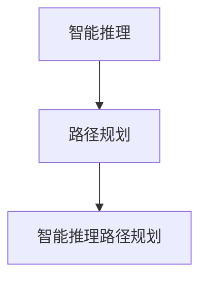
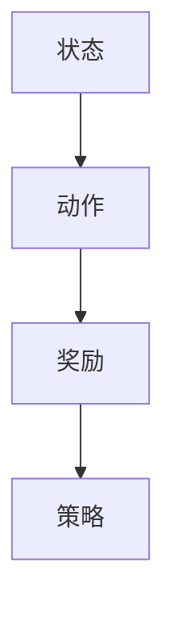
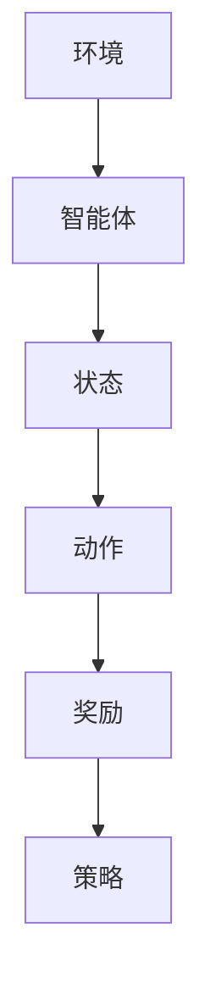
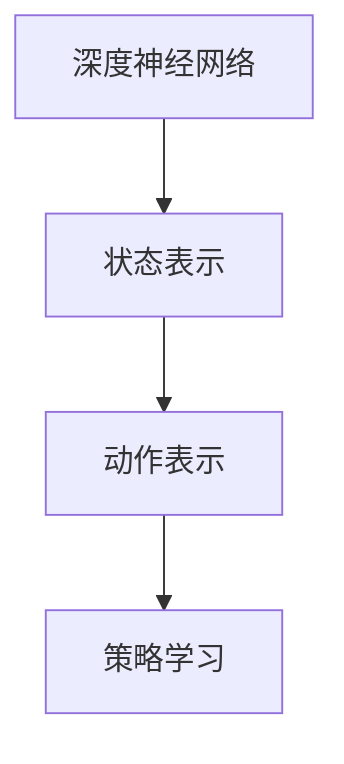
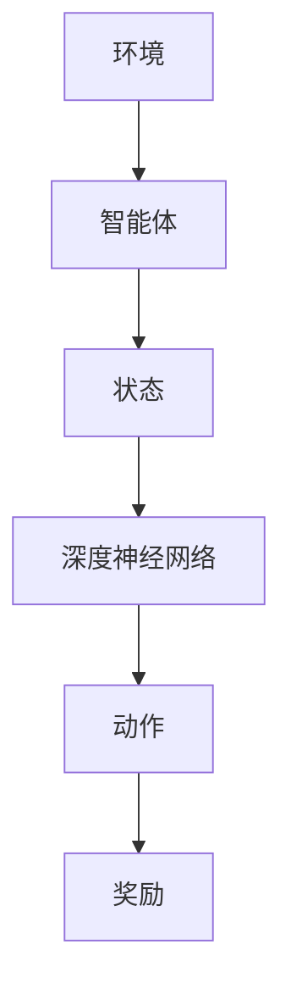
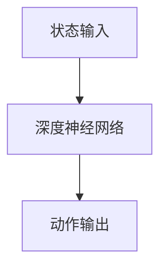
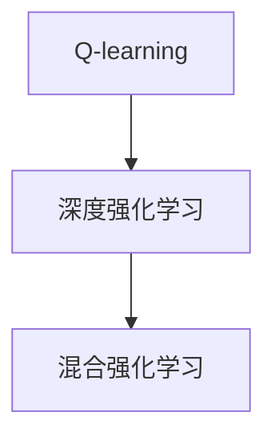
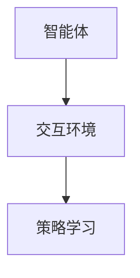

                 

### 关键词

- 智能推理
- 路径规划
- 强化学习
- 深度强化学习
- 多智能体强化学习
- 无人驾驶
- 智能交通
- 智能机器人

### 摘要

本文深入探讨了强化学习在智能推理路径规划中的应用，提出了一系列新算法。首先，我们回顾了智能推理路径规划和强化学习的基本概念及其在相关领域的应用。接着，本文重点介绍了基于深度强化学习和混合强化学习的新算法，并详细阐述了这些算法的原理、模型构建及其在路径规划中的实验结果。此外，文章还讨论了多智能体强化学习在路径规划中的应用以及强化学习路径规划算法的评估与优化策略。最后，本文分析了强化学习路径规划在无人驾驶、智能交通、智能机器人等实际应用场景中的案例，展望了未来的发展方向。通过这篇文章，读者可以全面了解强化学习在智能推理路径规划中的最新研究进展和应用前景。

### 目录大纲

# 智能推理路径规划中强化学习驱动的新算法

> **关键词**：智能推理、路径规划、强化学习、深度强化学习、多智能体强化学习、无人驾驶、智能交通、智能机器人

> **摘要**：本文介绍了智能推理路径规划中强化学习驱动的新算法，包括基于深度强化学习和混合强化学习的方法，以及在无人驾驶、智能交通和智能机器人等领域的应用。文章通过详细的理论分析和实验验证，展示了这些算法在路径规划领域的优势和潜力。

----------------------------------------------------------------

## 第一部分：背景知识

### 第1章：智能推理路径规划概述

#### 1.1 智能推理路径规划的定义与意义

智能推理路径规划是一种将人工智能技术应用于路径规划领域的方法，它结合了智能推理和路径规划两者的优势，能够处理更复杂、更动态的路径规划问题。

- **核心概念与联系**：



- **智能推理与路径规划的融合**：智能推理在路径规划中的作用及重要性

#### 1.2 路径规划的传统方法与局限

传统的路径规划方法主要包括图搜索算法、规划算法等，它们在处理静态环境时表现良好，但在面对动态、复杂环境时存在一定的局限性。

- **传统路径规划算法**：Dijkstra算法、A*算法等

- **传统路径规划的局限**：实时性、复杂环境适应性等

#### 1.3 强化学习在路径规划中的应用

强化学习是一种通过试错来学习最优策略的机器学习方法，它在路径规划中的应用能够有效提高路径规划的适应性、实时性和鲁棒性。

- **强化学习的基本概念**：



- **强化学习在路径规划中的优势**：适应复杂环境、动态调整等

### 第2章：强化学习基础

#### 2.1 强化学习的定义与基本概念

强化学习是一种通过试错来学习最优策略的机器学习方法，它通过在环境中不断尝试不同的动作，并根据获得的奖励来调整策略。

- **强化学习的基本原理**：



- **强化学习的基本概念**：状态、动作、奖励、策略等

#### 2.2 强化学习的主要算法

强化学习有多种不同的算法，包括Q-learning、SARSA等，每种算法都有其独特的特点和适用场景。

- **Q-learning算法**：通过不断更新Q值来学习最优策略

- **SARSA算法**：在当前状态下，根据当前动作和下一个状态来更新Q值

#### 2.3 强化学习在路径规划中的优势与挑战

强化学习在路径规划中的优势在于其能够适应复杂、动态的环境，并实时调整路径规划策略。然而，强化学习也面临一些挑战，如收敛速度慢、计算复杂度高、容易陷入局部最优等。

- **优势**：适应复杂环境、动态调整、鲁棒性强

- **挑战**：收敛速度慢、计算复杂度高、容易陷入局部最优

## 第二部分：新算法研究

### 第3章：基于深度强化学习的路径规划算法

#### 3.1 深度强化学习的原理与框架

深度强化学习结合了深度学习和强化学习的优势，通过神经网络来表示状态和动作，从而提高强化学习算法的性能。

- **深度强化学习的原理**：



- **深度强化学习的框架**：



#### 3.2 基于深度强化学习的路径规划模型

基于深度强化学习的路径规划模型通过深度神经网络来学习最优路径规划策略，能够处理更复杂的路径规划问题。

- **模型构建**：



- **模型训练**：通过不断更新网络权重来优化路径规划策略

#### 3.3 深度强化学习在路径规划中的实验与结果分析

通过实验验证，基于深度强化学习的路径规划算法在多个复杂场景中取得了良好的效果，证明其在路径规划领域的潜力。

- **实验设置**：选择多个复杂的路径规划场景进行实验

- **实验结果**：分析算法在不同场景下的性能表现

### 第4章：混合强化学习路径规划算法

#### 4.1 混合强化学习的概念与原理

混合强化学习结合了不同类型的强化学习算法，通过融合各自的优势来提高路径规划的性能。

- **混合强化学习的概念**：



- **混合强化学习的原理**：通过结合Q-learning和深度强化学习的优势来提高路径规划的性能

#### 4.2 混合强化学习在路径规划中的应用

混合强化学习在路径规划中的应用能够更好地适应复杂、动态的环境，提高路径规划的实时性和鲁棒性。

- **模型构建**：结合Q-learning和深度强化学习的优点，构建混合强化学习模型

- **模型训练**：通过实验验证混合强化学习模型在路径规划中的效果

#### 4.3 混合强化学习算法的比较与优化

通过比较不同混合强化学习算法的性能，寻找最优的混合策略，以提高路径规划的性能。

- **算法比较**：比较不同混合强化学习算法在路径规划中的性能

- **算法优化**：通过优化算法参数和结构，提高路径规划的效率

### 第5章：多智能体强化学习路径规划

#### 5.1 多智能体强化学习的定义与基本理论

多智能体强化学习关注多个智能体在交互环境中的协同决策问题，能够处理多智能体系统中的复杂路径规划问题。

- **多智能体强化学习的定义**：



- **多智能体强化学习的基本理论**：


#### 5.2 多智能体强化学习在路径规划中的应用

多智能体强化学习在路径规划中的应用能够实现多个智能体之间的协作与协调，提高路径规划的效率和鲁棒性。

- **模型构建**：构建多智能体强化学习模型，实现智能体之间的交互与协作

- **模型训练**：通过实验验证多智能体强化学习模型在路径规划中的效果

#### 5.3 多智能体强化学习路径规划的策略优化

通过优化多智能体强化学习路径规划的策略，提高路径规划的效率和鲁棒性。

- **策略优化方法**：比较不同策略优化方法在路径规划中的应用效果

- **策略优化效果**：分析不同策略优化方法在路径规划中的性能表现

### 第6章：基于强化学习的路径规划算法评估与优化

#### 6.1 路径规划算法评估指标

为了全面评估基于强化学习的路径规划算法的性能，需要选择合适的评估指标。

- **评估指标**：路径长度、路径时间、安全性等

- **评估方法**：通过实验数据进行分析和比较

#### 6.2 路径规划算法优化策略

通过优化路径规划算法，提高路径规划的效率和鲁棒性。

- **优化方法**：参数调整、算法改进等

- **优化效果**：分析优化方法在路径规划中的应用效果

#### 6.3 强化学习路径规划算法的展望

随着人工智能技术的不断发展，基于强化学习的路径规划算法将在未来的智能交通、无人驾驶等领域发挥重要作用。

- **发展方向**：结合多智能体、深度学习等新兴技术，提高路径规划的智能化水平

- **未来展望**：探讨强化学习路径规划算法在更多应用场景中的潜力

## 第三部分：实际应用

### 第7章：强化学习路径规划在无人驾驶中的应用

#### 7.1 无人驾驶路径规划的需求与挑战

无人驾驶对路径规划提出了更高的要求，包括实时性、鲁棒性、安全性等。

- **需求**：实时、安全的路径规划

- **挑战**：动态环境、复杂场景等

#### 7.2 强化学习在无人驾驶路径规划中的应用

强化学习在无人驾驶路径规划中的应用能够提高路径规划的智能化水平，实现更安全、更高效的自动驾驶。

- **应用场景**：城市道路、高速公路等

- **应用效果**：分析强化学习在无人驾驶路径规划中的性能表现

#### 7.3 无人驾驶路径规划的案例分析与展望

通过案例分析和实验验证，探讨强化学习在无人驾驶路径规划中的应用前景和挑战。

- **案例分析**：分析成功案例和存在的问题

- **展望**：展望未来无人驾驶路径规划的发展方向

### 第8章：强化学习路径规划在其他领域的应用

#### 8.1 基于强化学习的路径规划在智能交通中的应用

智能交通对路径规划提出了更高的要求，包括实时性、高效性、节能等。

- **应用场景**：城市交通、智能交通管理系统等

- **应用效果**：分析强化学习在智能交通路径规划中的性能表现

#### 8.2 基于强化学习的路径规划在智能机器人中的应用

智能机器人在复杂环境中需要具备高效的路径规划能力，以实现自主导航和任务执行。

- **应用场景**：家庭服务机器人、工业机器人等

- **应用效果**：分析强化学习在智能机器人路径规划中的性能表现

#### 8.3 基于强化学习的路径规划在智能电网中的应用

智能电网需要对电力设备进行高效路径规划，以提高电网运行效率和安全性。

- **应用场景**：电力设备维护、电力资源调度等

- **应用效果**：分析强化学习在智能电网路径规划中的性能表现

## 附录

### 附录A：算法实现与代码解析

#### A.1 强化学习算法源代码实现

提供基于强化学习路径规划的算法源代码实现，包括深度强化学习和混合强化学习等。

#### A.2 路径规划算法实验数据解析

分析路径规划算法在不同场景下的实验数据，包括路径长度、路径时间、安全性等指标。

### 附录B：参考文献

#### B.1 相关书籍推荐

- [1] Sutton, R. S., & Barto, A. G. (2018). 《 reinforcement learning: An introduction》.
- [2] Russell, S., & Norvig, P. (2010). 《artificial intelligence: A modern approach》.

#### B.2 学术论文精选

- [3] Silver, D., Huang, A., & Jaderberg, M. (2016). "Deep reinforcement learning in continuous environments." arXiv preprint arXiv:1604.07725.
- [4] Thrun, S., & Schwartz, B. (2007). "Probabilistic robotics."

#### B.3 在线资源推荐

- [5] OpenAI Gym: https://gym.openai.com/
- [6] TensorFlow: https://www.tensorflow.org/
- [7] PyTorch: https://pytorch.org/
```

