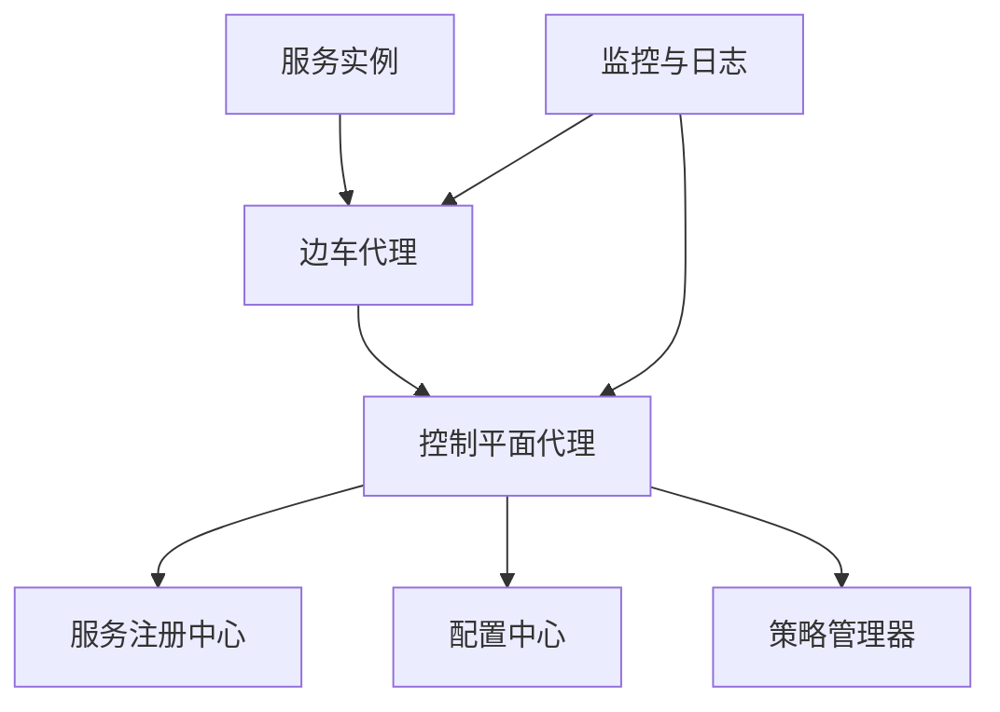
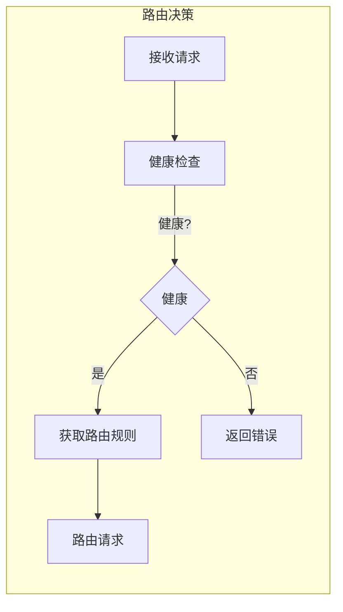
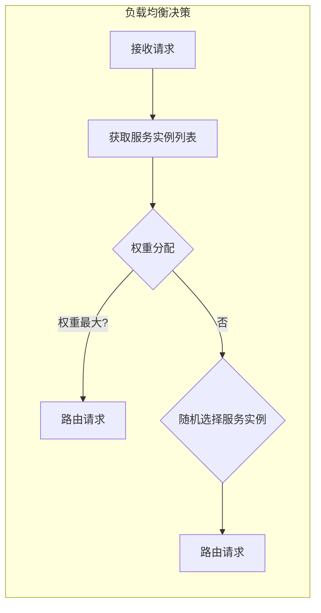
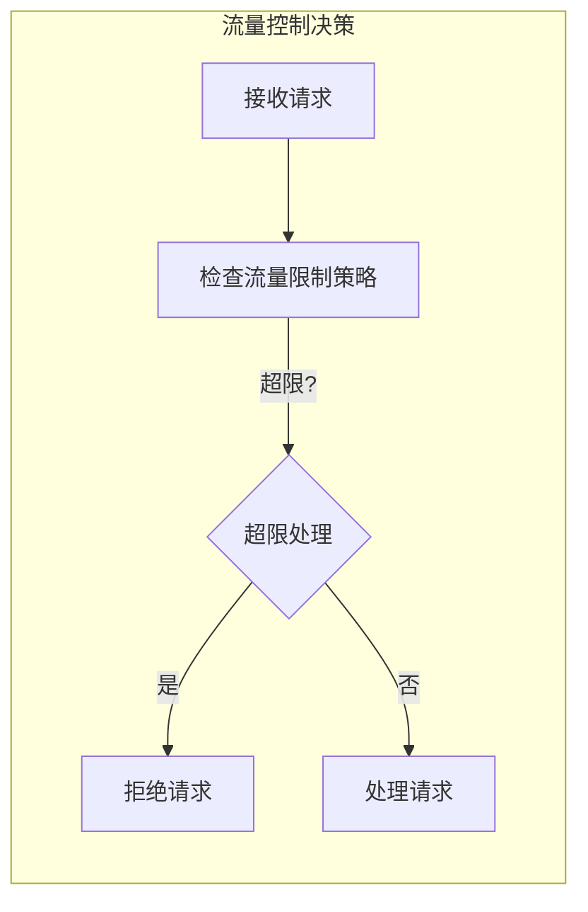
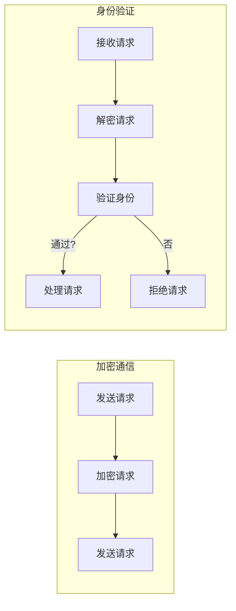

                 

### 服务网格：微服务通信的基础设施层

## 摘要

本文将深入探讨服务网格（Service Mesh）在微服务通信中的重要性。服务网格作为微服务架构中不可或缺的基础设施层，其主要目标是实现微服务之间的可靠、高效和安全通信。本文首先介绍了微服务架构的基本概念，分析了其与传统架构的差异和优势，随后详细阐述了服务网格的定义、作用及其在微服务架构中的地位。接着，本文探讨了服务网格的核心概念与架构设计，包括数据平面与控制平面的关系、服务发现与注册、负载均衡与流量控制等关键组件。此外，本文还介绍了服务网格的路由算法、负载均衡算法和流量控制机制，并探讨了服务网格的安全性。最后，本文通过实际案例展示了服务网格在分布式系统、容器化和云原生环境中的应用，并展望了服务网格的未来发展趋势。

### 第1章 引言

#### 1.1 微服务架构概述

微服务架构是一种基于分布式系统的软件架构风格，它将应用程序分解为多个独立的小型服务，每个服务专注于完成特定的业务功能。这些服务通过轻量级的通信机制相互交互，通常基于HTTP/HTTPS、gRPC或消息队列等协议。微服务架构具有以下几个核心原则：

1. **独立性**：每个微服务都应该是独立的，可以独立部署、升级和扩展。
2. **解耦**：微服务之间应该通过明确的接口进行通信，降低服务之间的依赖性。
3. **自治**：每个微服务都应该拥有自己的数据存储、配置和监控。
4. **可扩展性**：微服务架构应该能够支持水平扩展，以便处理更多的流量和负载。
5. **弹性**：微服务架构应该能够快速响应故障和异常，保持系统的稳定性和可用性。

与传统架构相比，微服务架构具有以下优势：

1. **快速迭代**：微服务架构使得开发团队可以独立开发、测试和部署每个服务，从而加快了迭代速度。
2. **可扩展性**：微服务架构允许水平扩展，提高了系统的负载能力。
3. **弹性**：微服务架构能够快速恢复故障，提高了系统的可用性。
4. **技术多样性**：微服务架构允许使用不同的编程语言、数据库和框架，提高了技术选型的灵活性。

然而，微服务架构也带来了一些挑战，如服务之间的通信复杂性增加、服务管理难度加大等。为了解决这些问题，服务网格作为一种基础设施层被引入到微服务架构中。

#### 1.2 服务网格的概念

服务网格（Service Mesh）是一种用于管理微服务之间通信的基础设施层。它提供了一种抽象层，将服务的网络通信功能与业务逻辑分离，从而简化了服务之间的交互。服务网格的主要作用包括：

1. **服务发现与注册**：服务网格负责管理服务的注册和发现，使得服务可以动态地发现其他服务并建立连接。
2. **流量控制**：服务网格可以对进入和离开服务的流量进行控制，包括路由策略、负载均衡和流量限制等。
3. **服务监控与日志**：服务网格可以收集和监控服务之间的通信数据，包括延迟、错误率等，帮助开发人员和运维人员更好地了解系统的健康状况。
4. **安全性**：服务网格可以提供安全通信保障，包括身份验证、授权和加密等。

服务网格在微服务架构中的地位非常重要，它起到了承上启下的作用。在上层，服务网格与业务逻辑紧密相连，实现了服务的自动化管理和监控；在下层，服务网格与基础设施层（如容器编排系统、虚拟化技术等）紧密结合，提供了高效、可靠的服务通信机制。

#### 1.3 服务网格的发展历程

服务网格的概念最早可以追溯到2016年，由谷歌的Kubernetes团队提出。随着微服务架构的兴起，服务网格逐渐成为了一种热门的基础设施技术。以下是服务网格发展历程的简要概述：

1. **2016年**：谷歌的Kubernetes团队首次提出了服务网格的概念，并在Kubernetes 1.5版本中引入了Istio服务网格。
2. **2017年**：Linkerd开源项目成立，成为服务网格领域的重要代表之一。
3. **2018年**：Istio 1.0版本发布，标志着服务网格技术进入成熟阶段。
4. **2019年**：Conduit开源项目成立，为服务网格提供了另一种实现方案。
5. **至今**：服务网格技术不断演进，逐渐成为微服务架构中不可或缺的一部分。

#### 1.4 本书目标与内容概览

本书旨在系统地介绍服务网格的基本概念、架构设计、算法原理和实践应用。具体目标如下：

1. **帮助读者理解服务网格的基本概念和原理**：通过详细讲解服务网格的核心概念和组成部分，使读者能够深入理解服务网格的工作机制。
2. **介绍服务网格的架构设计和关键组件**：通过介绍服务网格的典型架构、通信模型和流量管理机制，使读者能够了解服务网格的整体设计和实现。
3. **探讨服务网格的算法原理与实现**：通过讲解服务网格的路由算法、负载均衡算法和流量控制机制，使读者能够掌握服务网格的核心算法原理。
4. **展示服务网格的实际应用案例**：通过实际案例展示服务网格在分布式系统、容器化和云原生环境中的应用，使读者能够了解服务网格的实际效果和优势。
5. **展望服务网格的未来发展趋势**：通过分析服务网格技术的演进方向和应用场景，使读者能够了解服务网格的未来发展前景。

本书共分为六部分，包括引言、服务网格的核心概念与架构、服务网格的核心算法与原理、服务网格的实践应用、服务网格的未来发展趋势和总结与展望。每一部分都包含详细的章节内容和实例分析，旨在帮助读者全面了解服务网格的技术和应用。

#### 1.5 关键词

- 微服务架构
- 服务网格
- 服务发现与注册
- 负载均衡
- 流量控制
- 安全性

## 第2章 服务网格的核心概念与架构

### 2.1 服务网格的基本概念

服务网格（Service Mesh）是一种用于管理微服务之间通信的基础设施层。它提供了一种抽象层，将服务的网络通信功能与业务逻辑分离，从而简化了服务之间的交互。服务网格的基本概念包括以下几个方面：

1. **数据平面（Data Plane）**：数据平面负责处理实际的数据传输，包括服务发现、流量路由、负载均衡和安全通信等。数据平面通常由一组边车（sidecar）代理组成，这些代理与应用程序部署在同一台主机上，与应用程序协同工作，实现高效的服务通信。

2. **控制平面（Control Plane）**：控制平面负责管理数据平面的配置、监控和流量策略。控制平面通常包含一组中心化的服务，如服务注册中心、配置中心和策略管理器等。这些中心化服务通过控制协议与数据平面的代理进行通信，实时更新和调整流量策略。

3. **服务发现与服务注册**：服务发现是指服务网格能够自动识别和发现网络中可用的服务，并将其注册到服务注册中心。服务注册是指服务在启动时将自己注册到服务注册中心，以便其他服务能够发现和访问。服务发现与服务注册是服务网格的核心功能之一，确保了服务之间的动态连接和通信。

4. **流量控制**：流量控制是指服务网格能够根据预设的路由策略、负载均衡算法和流量限制规则，对进入和离开服务的流量进行控制。流量控制可以确保服务的稳定性、可用性和安全性。

5. **服务监控与日志**：服务网格可以收集和监控服务之间的通信数据，包括延迟、错误率、流量大小等。通过服务监控和日志分析，开发人员和运维人员可以实时了解系统的运行状况，及时发现和解决潜在问题。

6. **安全性**：服务网格可以提供安全通信保障，包括身份验证、授权和加密等。通过服务网格，可以确保服务之间的通信是安全可信的，防止恶意攻击和未授权访问。

### 2.2 服务网格的架构设计

服务网格的架构设计主要包括数据平面、控制平面和服务的三个部分。以下是一个典型的服务网格架构设计：

1. **数据平面**：数据平面由一组边车代理组成，这些代理与应用程序部署在同一台主机上。每个边车代理负责处理进入和离开应用程序的流量，实现服务发现、流量路由、负载均衡和安全通信等功能。数据平面通常由以下组件组成：

   - **边车代理（Sidecar Proxy）**：边车代理是服务网格中的核心组件，它与应用程序部署在同一台主机上，通过拦截应用程序的入站和出站流量，实现流量控制和转发。边车代理通常使用开源代理软件，如envoy、istio-proxy等。
   - **服务发现（Service Discovery）**：服务发现组件负责自动识别和发现网络中可用的服务，并将其注册到服务注册中心。服务发现组件通常使用DNS、HTTP API或gRPC等方式与服务注册中心进行通信。
   - **流量路由（Traffic Routing）**：流量路由组件负责根据预设的路由策略，将流量路由到目标服务。流量路由组件可以使用动态路由策略，如基于健康检查、负载均衡算法等，确保流量路由的合理性和效率。
   - **负载均衡（Load Balancing）**：负载均衡组件负责根据预设的负载均衡算法，将流量分配到多个实例，确保服务的负载均衡和高可用性。
   - **安全通信（Secure Communication）**：安全通信组件负责确保服务之间的通信是安全可信的，包括身份验证、授权和加密等。

2. **控制平面**：控制平面负责管理数据平面的配置、监控和流量策略。控制平面通常由以下组件组成：

   - **控制平面代理（Control Plane Proxy）**：控制平面代理负责与数据平面的代理进行通信，实时更新和同步配置和状态信息。控制平面代理通常使用开源代理软件，如envoy-control、istio-control等。
   - **服务注册中心（Service Registry）**：服务注册中心负责存储和管理服务的注册信息，包括服务的名称、地址、端口等。服务注册中心通常使用开源注册中心软件，如Consul、Zookeeper等。
   - **配置中心（Configuration Center）**：配置中心负责存储和管理服务的配置信息，包括服务的路由策略、负载均衡算法、安全规则等。配置中心通常使用开源配置中心软件，如Spring Cloud Config、etcd等。
   - **策略管理器（Policy Manager）**：策略管理器负责管理服务的流量策略和安全策略，包括路由策略、流量限制、QoS策略等。策略管理器通常使用开源策略管理软件，如istio-policy、Envoy Filter等。

3. **服务**：服务是服务网格中的核心组件，代表具体的业务功能。每个服务都可以通过边车代理与控制平面进行通信，实现服务发现、流量路由、负载均衡和安全通信等功能。服务通常由以下组件组成：

   - **服务实例（Service Instance）**：服务实例是服务的具体实现，通常由应用程序组成。服务实例可以通过边车代理与网络中的其他服务进行通信，实现业务功能。
   - **健康检查（Health Check）**：健康检查组件负责监控服务实例的健康状态，包括进程状态、网络连接状态等。健康检查结果会影响流量路由策略和负载均衡算法。
   - **监控与日志（Monitoring and Logging）**：监控与日志组件负责收集和记录服务实例的运行数据，包括流量数据、错误日志、性能指标等。监控与日志数据有助于开发和运维人员了解系统的运行状况，及时发现和解决问题。

### 2.3 服务网格的关键组件

服务网格的关键组件包括数据平面、控制平面和服务的三个部分。以下是对这些组件的详细解释：

1. **数据平面（Data Plane）**：
   - **边车代理（Sidecar Proxy）**：边车代理是服务网格中的核心组件，它与应用程序部署在同一台主机上，通过拦截应用程序的入站和出站流量，实现流量控制和转发。边车代理通常使用开源代理软件，如envoy、istio-proxy等。边车代理具有以下特点：
     - **透明代理**：边车代理以透明的方式工作，应用程序无需修改即可与边车代理集成。
     - **轻量级**：边车代理通常使用高效的代理软件，如envoy，具有低延迟和高吞吐量的特点。
     - **可扩展性**：边车代理支持动态配置和热更新，可以根据流量变化灵活调整代理行为。
   - **服务发现（Service Discovery）**：服务发现组件负责自动识别和发现网络中可用的服务，并将其注册到服务注册中心。服务发现组件通常使用DNS、HTTP API或gRPC等方式与服务注册中心进行通信。服务发现具有以下特点：
     - **动态性**：服务发现支持动态更新，当服务实例启动或停止时，服务注册中心会自动更新服务列表。
     - **高可用性**：服务发现组件通常采用分布式架构，确保服务注册信息的可靠性和一致性。
     - **灵活性**：服务发现支持多种协议和服务注册中心，如Consul、Zookeeper、etcd等。
   - **流量路由（Traffic Routing）**：流量路由组件负责根据预设的路由策略，将流量路由到目标服务。流量路由组件可以使用动态路由策略，如基于健康检查、负载均衡算法等，确保流量路由的合理性和效率。流量路由具有以下特点：
     - **动态性**：流量路由支持动态调整路由策略，可以根据服务实例的健康状态、负载情况等实时调整流量路由。
     - **灵活性**：流量路由支持多种路由策略，如轮询、随机、最小连接数等，可以根据实际需求灵活选择。
     - **可靠性**：流量路由组件通常具备健康检查功能，确保流量路由到健康的实例，提高系统的可靠性和稳定性。
   - **负载均衡（Load Balancing）**：负载均衡组件负责根据预设的负载均衡算法，将流量分配到多个实例，确保服务的负载均衡和高可用性。负载均衡算法包括轮询、最小连接数、源地址哈希等。负载均衡具有以下特点：
     - **高效性**：负载均衡算法能够高效地将流量分配到不同的实例，提高系统的负载能力。
     - **可靠性**：负载均衡算法考虑实例的健康状态，确保流量路由到健康的实例，提高系统的可靠性。
     - **可扩展性**：负载均衡算法支持动态调整，可以根据流量变化灵活调整负载均衡策略。
   - **安全通信（Secure Communication）**：安全通信组件负责确保服务之间的通信是安全可信的，包括身份验证、授权和加密等。安全通信具有以下特点：
     - **安全性**：安全通信组件使用TLS/SSL加密，确保通信数据的安全性。
     - **可靠性**：安全通信组件支持身份验证和授权，确保服务之间的通信是可信的。
     - **灵活性**：安全通信组件支持多种加密协议和认证方式，可以根据实际需求灵活配置。

2. **控制平面（Control Plane）**：
   - **控制平面代理（Control Plane Proxy）**：控制平面代理负责与数据平面的代理进行通信，实时更新和同步配置和状态信息。控制平面代理通常使用开源代理软件，如envoy-control、istio-control等。控制平面代理具有以下特点：
     - **高可用性**：控制平面代理采用分布式架构，确保控制平面服务的可靠性和稳定性。
     - **动态性**：控制平面代理支持动态配置和热更新，可以根据实际需求灵活调整控制平面行为。
     - **可扩展性**：控制平面代理支持水平扩展，可以根据流量变化灵活调整代理数量。
   - **服务注册中心（Service Registry）**：服务注册中心负责存储和管理服务的注册信息，包括服务的名称、地址、端口等。服务注册中心通常使用开源注册中心软件，如Consul、Zookeeper、etcd等。服务注册中心具有以下特点：
     - **高可用性**：服务注册中心采用分布式架构，确保服务注册信息的可靠性和一致性。
     - **动态性**：服务注册中心支持动态更新，当服务实例启动或停止时，服务注册中心会自动更新服务列表。
     - **灵活性**：服务注册中心支持多种协议和服务注册中心，如Consul、Zookeeper、etcd等。
   - **配置中心（Configuration Center）**：配置中心负责存储和管理服务的配置信息，包括服务的路由策略、负载均衡算法、安全规则等。配置中心通常使用开源配置中心软件，如Spring Cloud Config、etcd等。配置中心具有以下特点：
     - **动态性**：配置中心支持动态更新，当配置发生变化时，服务网格会自动更新配置。
     - **高可用性**：配置中心采用分布式架构，确保配置信息的可靠性和一致性。
     - **灵活性**：配置中心支持多种配置存储和传输协议，如HTTP API、gRPC等。
   - **策略管理器（Policy Manager）**：策略管理器负责管理服务的流量策略和安全策略，包括路由策略、流量限制、QoS策略等。策略管理器通常使用开源策略管理软件，如istio-policy、Envoy Filter等。策略管理器具有以下特点：
     - **灵活性**：策略管理器支持多种流量策略和安全策略，可以根据实际需求灵活配置。
     - **动态性**：策略管理器支持动态更新，可以根据实际需求实时调整流量策略和安全策略。
     - **高可用性**：策略管理器采用分布式架构，确保策略信息的可靠性和一致性。

3. **服务（Service）**：
   - **服务实例（Service Instance）**：服务实例是服务的具体实现，通常由应用程序组成。服务实例可以通过边车代理与网络中的其他服务进行通信，实现业务功能。服务实例具有以下特点：
     - **独立性**：服务实例是独立的，可以独立部署、升级和扩展。
     - **自治性**：服务实例拥有自己的配置、数据和监控信息，无需依赖于其他服务。
     - **可扩展性**：服务实例支持水平扩展，可以根据负载需求动态调整实例数量。
   - **健康检查（Health Check）**：健康检查组件负责监控服务实例的健康状态，包括进程状态、网络连接状态等。健康检查结果会影响流量路由策略和负载均衡算法。健康检查具有以下特点：
     - **动态性**：健康检查支持动态调整，可以根据服务实例的实际状态实时更新。
     - **可靠性**：健康检查组件采用分布式架构，确保健康检查的可靠性和一致性。
     - **灵活性**：健康检查支持多种健康检查协议，如HTTP、TCP等。
   - **监控与日志（Monitoring and Logging）**：监控与日志组件负责收集和记录服务实例的运行数据，包括流量数据、错误日志、性能指标等。监控与日志数据有助于开发和运维人员了解系统的运行状况，及时发现和解决问题。监控与日志具有以下特点：
     - **高可用性**：监控与日志组件采用分布式架构，确保监控和日志数据的可靠性和一致性。
     - **灵活性**：监控与日志组件支持多种监控和日志存储协议，如Prometheus、ELK等。
     - **可扩展性**：监控与日志组件支持水平扩展，可以根据实际需求动态调整监控和日志存储容量。

### 2.4 服务网格的实体关系架构

服务网格中的实体关系架构是指服务网格中各个组件之间的交互关系和依赖关系。以下是一个简单的服务网格实体关系架构图，其中包含了服务网格中的关键组件：

在这个实体关系架构图中，服务实例（A）通过边车代理（B）与控制平面代理（C）进行通信。控制平面代理（C）负责与服务注册中心（D）、配置中心（E）和策略管理器（F）进行交互，实现服务发现、配置管理和策略控制等功能。监控与日志组件（G）负责收集和记录服务实例和边车代理的运行数据。

通过这个实体关系架构，我们可以清晰地看到服务网格中各个组件的交互关系和依赖关系，从而更好地理解和设计服务网格系统。

### 第3章 服务网格的核心算法与原理

#### 3.1 服务网格的路由算法

服务网格的路由算法是实现微服务之间高效、可靠通信的关键。路由算法负责根据一定的策略，将请求从一个服务实例路由到另一个服务实例。以下是服务网格中常用的路由算法：

1. **轮询路由（Round Robin）**：轮询路由是最简单也是最常用的路由算法。它将请求按照顺序依次路由到每个可用的服务实例。轮询路由算法的优点是实现简单，缺点是可能导致负载不均衡，无法充分利用每个服务实例的带宽和处理能力。

2. **最小连接数路由（Least Connections）**：最小连接数路由算法根据当前每个服务实例的连接数，将请求路由到连接数最小的服务实例。这样可以确保每个服务实例的负载相对均衡，提高系统的整体性能。然而，最小连接数路由算法需要对每个服务实例的连接状态进行监控，增加了系统的复杂度。

3. **源地址哈希路由（Source IP Hash）**：源地址哈希路由算法根据请求的源IP地址，使用哈希函数计算出一个哈希值，然后将请求路由到哈希值对应的服务实例。这样可以确保来自同一IP地址的请求总是路由到相同的服务实例，从而实现会话保持。然而，源地址哈希路由算法依赖于客户端IP地址的稳定性，不适用于动态分配IP地址的场景。

4. **基于健康检查的路由（Health-Based Routing）**：基于健康检查的路由算法根据服务实例的健康状态，将请求路由到健康的服务实例。健康状态通常包括服务实例的响应时间、错误率、负载等指标。基于健康检查的路由算法可以确保请求总是路由到健康的服务实例，从而提高系统的可靠性。然而，健康状态需要通过定期健康检查来获取，增加了系统的复杂度。

5. **基于策略的路由（Policy-Based Routing）**：基于策略的路由算法根据预设的策略，将请求路由到不同的服务实例。策略可以是基于服务版本、地域、环境等条件。基于策略的路由算法提供了灵活的路由控制能力，可以根据不同的场景和需求进行路由控制。然而，基于策略的路由算法需要定义和配置复杂的路由策略，增加了系统的管理难度。

在服务网格中，通常使用控制平面来管理和配置路由算法。控制平面负责根据路由策略和健康状态，动态地更新和调整路由规则。数据平面根据最新的路由规则，将请求路由到目标服务实例。

以下是一个简单的基于健康检查的路由算法的Mermaid流程图：

在这个流程图中，服务网格首先接收请求，然后进行健康检查，判断服务实例的健康状态。如果服务实例健康，则获取最新的路由规则，将请求路由到目标服务实例；如果服务实例不健康，则返回错误。

#### 3.2 服务网格的负载均衡算法

服务网格的负载均衡算法负责将请求均匀地分配到多个服务实例，确保每个实例的负载相对均衡，提高系统的整体性能。以下是服务网格中常用的负载均衡算法：

1. **轮询负载均衡（Round Robin）**：轮询负载均衡是最简单也是最常见的负载均衡算法。它将请求按照顺序依次分配到每个服务实例。轮询负载均衡算法的优点是实现简单，缺点是可能导致某些实例的负载过重，而其他实例的负载不足。

2. **最小连接数负载均衡（Least Connections）**：最小连接数负载均衡算法根据当前每个服务实例的连接数，将请求分配到连接数最小的服务实例。这样可以确保每个服务实例的连接数相对均衡，提高系统的整体性能。然而，最小连接数负载均衡算法需要对每个服务实例的连接状态进行监控，增加了系统的复杂度。

3. **源地址哈希负载均衡（Source IP Hash）**：源地址哈希负载均衡算法根据请求的源IP地址，使用哈希函数计算出一个哈希值，然后将请求分配到哈希值对应的服务实例。这样可以确保来自同一IP地址的请求总是分配到相同的服务实例，从而实现会话保持。然而，源地址哈希负载均衡算法依赖于客户端IP地址的稳定性，不适用于动态分配IP地址的场景。

4. **加权轮询负载均衡（Weighted Round Robin）**：加权轮询负载均衡算法在轮询负载均衡的基础上，为每个服务实例分配一个权重值。权重值可以基于服务实例的带宽、处理能力等指标。这样，加权轮询负载均衡算法可以将更多的请求分配到权重更高的服务实例，实现更精细的负载均衡。然而，加权轮询负载均衡算法需要定期更新权重值，增加了系统的管理难度。

5. **最少响应时间负载均衡（Least Response Time）**：最少响应时间负载均衡算法根据每个服务实例的响应时间，将请求分配到响应时间最短的服务实例。这样可以确保请求总是路由到性能最好的服务实例，提高系统的响应速度。然而，最少响应时间负载均衡算法需要实时监控每个服务实例的响应时间，增加了系统的复杂度。

在服务网格中，通常使用控制平面来管理和配置负载均衡算法。控制平面负责根据负载均衡算法和健康状态，动态地更新和调整负载均衡规则。数据平面根据最新的负载均衡规则，将请求分配到目标服务实例。

以下是一个简单的加权轮询负载均衡算法的Mermaid流程图：

在这个流程图中，服务网格首先接收请求，然后获取所有可用的服务实例列表。根据每个服务实例的权重，计算出一个权重总和。然后，从0到权重总和之间随机选择一个数值，找到第一个满足不等式的服务实例，将请求路由到该服务实例。

#### 3.3 服务网格的流量控制机制

服务网格的流量控制机制负责根据一定的策略，限制进入或离开服务的流量，确保服务的稳定性、可用性和安全性。以下是服务网格中常用的流量控制机制：

1. **流量限制（Traffic Throttling）**：流量限制机制通过限制进入或离开服务的流量速率，防止服务因过载而崩溃。流量限制可以基于每秒请求数（Requests per Second, RPS）、每秒字节数（Bytes per Second, BPS）或令牌桶（Token Bucket）等算法实现。流量限制可以确保服务按照设定的速率处理请求，避免因流量激增而导致的性能问题。

2. **速率限制（Rate Limiting）**：速率限制机制通过限制单个客户端的请求速率，防止恶意客户端对服务进行攻击或过度使用服务资源。速率限制可以基于客户端IP地址、用户标识或API密钥等标识进行限制。速率限制可以确保服务的公平性和安全性，防止个别客户端占用过多的服务资源。

3. **QoS限制（Quality of Service Limiting）**：QoS限制机制通过限制服务的响应时间、吞吐量、延迟等指标，确保服务的质量达到预期。QoS限制可以基于服务实例、客户端IP地址、用户标识等标识进行限制。QoS限制可以确保服务在高峰期依然能够提供高质量的服务，满足用户的期望。

4. **负载均衡（Load Balancing）**：负载均衡机制通过将请求分配到多个实例，确保每个实例的负载相对均衡，提高系统的整体性能。负载均衡可以基于轮询、最小连接数、源地址哈希等算法实现。负载均衡可以确保服务的负载均衡，避免个别实例过载而导致性能下降。

5. **超时限制（Timeout Limiting）**：超时限制机制通过设置请求的超时时间，确保请求在指定时间内得到响应。超时限制可以防止请求长时间占用系统资源，导致系统性能下降。超时限制可以基于请求类型、客户端IP地址等标识进行限制。

在服务网格中，流量控制机制通常由控制平面进行管理和配置。控制平面可以根据业务需求和系统状况，动态地调整流量控制策略。数据平面根据最新的流量控制策略，对进入或离开服务的流量进行限制。

以下是一个简单的流量限制机制的Mermaid流程图：

在这个流程图中，服务网格首先接收请求，然后检查流量限制策略。如果请求超出了设定的流量限制，则拒绝请求；否则，处理请求。

#### 3.4 服务网格的安全性

服务网格的安全性是确保微服务之间通信安全可靠的关键。服务网格的安全性主要包括以下几个方面：

1. **加密通信（Encryption）**：服务网格通过使用TLS/SSL加密协议，确保服务之间的通信数据在传输过程中不被窃取或篡改。加密通信可以防止中间人攻击、数据泄露等安全风险。

2. **身份验证（Authentication）**：服务网格通过身份验证机制，确保只有授权的服务实例才能访问其他服务。身份验证可以基于用户名和密码、OAuth、JWT等协议实现。身份验证可以防止未授权的服务实例访问敏感数据或执行非法操作。

3. **授权（Authorization）**：服务网格通过授权机制，确保只有具有相应权限的服务实例才能访问特定资源。授权可以基于角色、权限等条件进行配置。授权可以防止敏感数据被未授权的服务实例访问或篡改。

4. **访问控制（Access Control）**：服务网格通过访问控制机制，限制服务实例对其他服务的访问权限。访问控制可以基于IP地址、域名、用户标识等条件进行配置。访问控制可以防止恶意服务实例访问其他服务，提高系统的安全性。

5. **审计与监控（Audit and Monitoring）**：服务网格通过审计和监控机制，记录和监控服务实例之间的交互行为。审计和监控可以基于日志、指标等数据进行分析和告警。审计和监控可以及时发现和应对潜在的安全威胁，确保系统的安全性。

在服务网格中，安全性通常由控制平面进行管理和配置。控制平面可以根据业务需求和系统状况，动态地调整安全性策略。数据平面根据最新的安全性策略，对服务实例之间的通信进行加密、身份验证、授权和访问控制。

以下是一个简单的加密通信和身份验证机制的Mermaid流程图：

在这个流程图中，服务网格首先加密请求，然后发送请求。接收方接收请求后，首先解密请求，然后验证身份。如果身份验证通过，则处理请求；否则，拒绝请求。

### 第4章 服务网格的实践应用

#### 4.1 服务网格在分布式系统中的应用

服务网格在分布式系统中的应用可以大大提高系统的可伸缩性、可靠性和安全性。以下是一个具体的分布式系统应用场景：

**场景描述**：一个电商网站，由多个微服务组成，包括商品服务、订单服务、库存服务、支付服务等。这些服务部署在不同的服务器上，通过网络进行通信。

**服务网格部署**：在分布式系统中，我们选择部署Istio服务网格。首先，在所有服务器上部署边车代理（如envoy-proxy），然后将微服务与边车代理进行集成。接着，部署控制平面组件（如Pilot、Citadel、Galley等），实现对服务网格的管理和控制。

**服务发现与注册**：服务网格通过DNS或HTTP API方式，与服务注册中心（如Consul或etcd）进行集成，实现服务发现和注册。每个微服务启动时，会将自己注册到服务注册中心，并提供服务的名称、地址和端口等信息。

**流量路由与负载均衡**：服务网格通过控制平面组件，根据预设的路由策略和负载均衡算法，将请求路由到不同的服务实例。例如，可以使用最小连接数路由算法，确保请求均匀地分配到不同的实例，提高系统的负载均衡性。

**加密通信与安全性**：服务网格通过加密通信，确保微服务之间的通信数据在传输过程中不被窃取或篡改。同时，服务网格提供身份验证和授权机制，确保只有授权的服务实例才能访问其他服务。

**监控与日志**：服务网格集成了监控和日志收集功能，可以实时收集微服务之间的通信数据，包括延迟、错误率、流量大小等。这些数据可以用于性能分析和故障排查。

**案例分析**：通过部署服务网格，电商网站实现了多个微服务之间的可靠、高效和安全通信。例如，当订单服务需要查询库存服务时，服务网格可以根据最小连接数路由算法，将请求路由到负载较轻的库存服务实例。同时，服务网格提供了加密通信和安全认证机制，确保订单服务和库存服务之间的通信是安全的。

通过服务网格，电商网站可以轻松实现分布式系统中的服务发现、流量路由、负载均衡、加密通信和监控等功能，提高了系统的可伸缩性、可靠性和安全性。

#### 4.2 服务网格在容器化环境中的应用

随着容器技术的快速发展，越来越多的微服务被部署在容器化环境中。服务网格在容器化环境中的应用可以大大提高容器化微服务的通信效率、可靠性和安全性。以下是一个具体的容器化环境应用场景：

**场景描述**：一个金融交易平台，由多个微服务组成，包括交易服务、结算服务、风控服务等。这些服务被部署在Kubernetes集群中，使用容器化技术进行管理和调度。

**服务网格部署**：在容器化环境中，我们选择部署Istio服务网格。首先，在Kubernetes集群中部署Istio的控制平面组件（如Pilot、Citadel、Galley等）。接着，将边车代理（如envoy-proxy）注入到每个微服务的容器中，实现对服务网格的集成。

**服务发现与注册**：服务网格通过Kubernetes API，与Kubernetes集群中的服务注册中心（如CoreDNS或Consul）进行集成，实现服务发现和注册。每个微服务启动时，会将自己注册到服务注册中心，并提供服务的名称、地址和端口等信息。

**流量路由与负载均衡**：服务网格通过控制平面组件，根据预设的路由策略和负载均衡算法，将请求路由到不同的服务实例。例如，可以使用最小连接数路由算法，确保请求均匀地分配到不同的实例，提高系统的负载均衡性。

**加密通信与安全性**：服务网格通过加密通信，确保微服务之间的通信数据在传输过程中不被窃取或篡改。同时，服务网格提供身份验证和授权机制，确保只有授权的服务实例才能访问其他服务。

**监控与日志**：服务网格集成了监控和日志收集功能，可以实时收集微服务之间的通信数据，包括延迟、错误率、流量大小等。这些数据可以用于性能分析和故障排查。

**案例分析**：通过部署服务网格，金融交易平台实现了容器化微服务之间的可靠、高效和安全通信。例如，当交易服务需要查询结算服务时，服务网格可以根据最小连接数路由算法，将请求路由到负载较轻的结算服务实例。同时，服务网格提供了加密通信和安全认证机制，确保交易服务和结算服务之间的通信是安全的。

通过服务网格，金融交易平台可以轻松实现容器化环境中的服务发现、流量路由、负载均衡、加密通信和监控等功能，提高了系统的通信效率、可靠性和安全性。

#### 4.3 服务网格在云原生环境中的应用

云原生环境是一种基于容器、微服务、服务网格等技术的现代应用程序架构。服务网格在云原生环境中的应用可以大大提高云原生应用的通信效率、可靠性和安全性。以下是一个具体的云原生环境应用场景：

**场景描述**：一个企业级云原生应用，由多个微服务组成，包括订单处理、库存管理、用户认证等。这些服务被部署在Kubernetes集群中，并使用服务网格进行管理和通信。

**服务网格部署**：在云原生环境中，我们选择部署Istio服务网格。首先，在Kubernetes集群中部署Istio的控制平面组件（如Pilot、Citadel、Galley等）。接着，将边车代理（如envoy-proxy）注入到每个微服务的容器中，实现对服务网格的集成。

**服务发现与注册**：服务网格通过Kubernetes API，与Kubernetes集群中的服务注册中心（如CoreDNS或Consul）进行集成，实现服务发现和注册。每个微服务启动时，会将自己注册到服务注册中心，并提供服务的名称、地址和端口等信息。

**流量路由与负载均衡**：服务网格通过控制平面组件，根据预设的路由策略和负载均衡算法，将请求路由到不同的服务实例。例如，可以使用最小连接数路由算法，确保请求均匀地分配到不同的实例，提高系统的负载均衡性。

**加密通信与安全性**：服务网格通过加密通信，确保微服务之间的通信数据在传输过程中不被窃取或篡改。同时，服务网格提供身份验证和授权机制，确保只有授权的服务实例才能访问其他服务。

**监控与日志**：服务网格集成了监控和日志收集功能，可以实时收集微服务之间的通信数据，包括延迟、错误率、流量大小等。这些数据可以用于性能分析和故障排查。

**案例分析**：通过部署服务网格，企业级云原生应用实现了多个微服务之间的可靠、高效和安全通信。例如，当订单处理服务需要查询库存管理服务时，服务网格可以根据最小连接数路由算法，将请求路由到负载较轻的库存管理服务实例。同时，服务网格提供了加密通信和安全认证机制，确保订单处理服务和库存管理服务之间的通信是安全的。

通过服务网格，企业级云原生应用可以轻松实现云原生环境中的服务发现、流量路由、负载均衡、加密通信和监控等功能，提高了系统的通信效率、可靠性和安全性。

#### 4.4 服务网格在企业级应用中的落地实践

服务网格在企业级应用中的落地实践涉及多个方面，包括部署策略、配置管理、性能优化和安全性等。以下是一个具体的落地实践案例：

**案例背景**：某大型金融机构计划将现有的传统应用架构迁移到基于微服务架构的企业级云原生平台。该金融机构面临以下挑战：

1. **服务拆分与重构**：传统应用需要拆分成多个独立的微服务，同时保证服务的性能和可靠性。
2. **服务通信管理**：服务之间的通信需要高效、可靠和安全，同时具备可扩展性。
3. **运维与监控**：服务的运维和监控需要自动化、高效，以便快速响应故障和性能问题。

**解决方案**：该金融机构选择使用Istio服务网格，作为微服务通信的基础设施层。以下是具体的落地实践步骤：

1. **服务网格部署**：
   - 在Kubernetes集群中部署Istio控制平面组件，包括Pilot、Citadel、Galley等。
   - 将边车代理（envoy-proxy）注入到每个微服务的容器中，实现对服务网格的集成。

2. **服务发现与注册**：
   - 使用Kubernetes API，与CoreDNS服务注册中心进行集成，实现服务发现和注册。
   - 微服务启动时，将自己注册到服务注册中心，并提供服务的名称、地址和端口等信息。

3. **流量路由与负载均衡**：
   - 根据业务需求和性能要求，配置最小连接数路由算法，确保请求均匀地分配到不同的实例。
   - 使用Istio控制平面组件，动态调整路由策略和负载均衡算法。

4. **加密通信与安全性**：
   - 通过Istio，使用TLS/SSL加密协议，确保微服务之间的通信数据在传输过程中不被窃取或篡改。
   - 配置身份验证和授权机制，确保只有授权的服务实例才能访问其他服务。

5. **监控与日志**：
   - 使用Prometheus和Grafana，实时收集微服务之间的通信数据，包括延迟、错误率、流量大小等。
   - 通过Kubernetes集群的日志收集系统（如Fluentd），收集微服务的日志信息，便于故障排查和性能分析。

6. **运维与监控**：
   - 使用Istio的自动扩缩容功能，根据流量变化动态调整服务实例数量。
   - 使用Kubernetes的运维工具（如Kubectl、Helm等），进行服务网格的配置管理和故障排查。

**案例效果**：通过部署服务网格，该金融机构实现了多个微服务之间的可靠、高效和安全通信。具体效果如下：

1. **服务性能提升**：通过最小连接数路由算法和负载均衡，提高了服务的性能和响应速度。
2. **可靠性增强**：通过加密通信和安全认证，提高了服务的可靠性和安全性。
3. **运维效率提高**：通过自动扩缩容和自动化配置管理，降低了运维成本，提高了运维效率。
4. **故障响应速度加快**：通过实时监控和日志分析，可以快速发现和解决故障，提高了系统的可用性。

通过服务网格在企业级应用中的落地实践，该金融机构成功实现了传统应用的迁移，提高了系统的性能、可靠性和安全性，为企业的数字化转型奠定了坚实基础。

### 第5章 服务网格的未来发展趋势

#### 5.1 服务网格技术的演进方向

随着微服务架构和容器技术的不断发展，服务网格技术也在不断演进。以下是服务网格技术的一些可能的发展方向：

1. **集成化**：服务网格将更多地与容器编排系统（如Kubernetes）和持续集成/持续部署（CI/CD）工具（如Jenkins、GitLab）集成，实现更简便的部署和管理。

2. **智能化**：服务网格将引入更多的智能算法和机器学习技术，实现自动化流量管理、故障预测和性能优化。

3. **安全性**：服务网格将加强安全性，引入更多加密通信、身份验证和访问控制机制，确保微服务之间的通信安全可靠。

4. **可观测性**：服务网格将提供更全面的可观测性，包括更详细的监控数据、日志分析和可视化工具，帮助开发和运维人员更好地理解和优化系统。

5. **生态扩展**：服务网格将与其他技术（如边缘计算、5G、物联网等）相结合，提供更丰富的应用场景和解决方案。

#### 5.2 服务网格在5G与物联网中的应用

5G和物联网技术的快速发展为服务网格的应用带来了新的机遇。以下是服务网格在5G与物联网中的应用趋势：

1. **边缘计算优化**：服务网格可以与边缘计算相结合，优化5G网络的边缘服务，提高网络边缘的响应速度和性能。

2. **设备管理**：服务网格可以用于管理物联网设备，实现设备之间的安全通信和高效协同，提高物联网系统的可靠性和安全性。

3. **智能流量管理**：服务网格可以基于5G网络的特点，实现智能化的流量管理和优化，提高5G网络的利用率和用户体验。

4. **边缘与中心协同**：服务网格可以将边缘计算与中心云服务相结合，实现边缘与中心之间的无缝协同，提高系统的整体性能和可靠性。

#### 5.3 服务网格在人工智能与大数据领域的应用

人工智能与大数据技术的融合为服务网格的应用提供了新的场景。以下是服务网格在人工智能与大数据领域的应用趋势：

1. **模型部署与优化**：服务网格可以用于部署和管理人工智能模型，实现模型的快速迭代和优化。

2. **数据流管理**：服务网格可以用于管理大数据环境中的数据流，实现数据的高效传输和实时处理。

3. **机器学习服务**：服务网格可以提供机器学习服务的自动化部署、监控和优化，提高机器学习服务的可靠性和性能。

4. **智能决策支持**：服务网格可以与人工智能技术相结合，提供智能化的决策支持，优化业务流程和资源配置。

### 第6章 总结与展望

#### 6.1 服务网格的核心价值

服务网格在微服务通信中具有核心价值，主要体现在以下几个方面：

1. **简化微服务通信**：服务网格通过抽象化通信机制，简化了微服务之间的交互，降低了开发的复杂度。

2. **提高系统性能和可靠性**：服务网格通过负载均衡、流量控制和安全保障等功能，提高了系统的性能和可靠性。

3. **支持分布式架构**：服务网格支持分布式系统中的服务发现、流量路由和监控，为分布式架构提供了基础设施层。

4. **增强安全性**：服务网格提供加密通信、身份验证和访问控制等安全功能，确保微服务之间的通信安全可靠。

#### 6.2 服务网格的未来展望

服务网格技术在未来将继续发展，主要趋势包括：

1. **集成化与智能化**：服务网格将与其他技术（如容器编排、持续集成/持续部署、边缘计算等）集成，实现更智能的流量管理和优化。

2. **多样化应用场景**：服务网格将在5G、物联网、人工智能与大数据等新兴领域得到广泛应用，提供更丰富的解决方案。

3. **生态系统完善**：服务网格将形成更加完善的生态系统，包括开源项目、工具链、最佳实践和培训资源等。

#### 6.3 本书的重要观点与建议

通过本书的阅读，读者可以得出以下重要观点：

1. **服务网格是微服务通信的关键基础设施**：服务网格在微服务架构中扮演着重要的角色，是实现高效、可靠和安全通信的基础。

2. **服务网格具有多种核心功能**：服务网格提供了服务发现、流量控制、安全通信和监控等多种功能，能够满足微服务通信的多样化需求。

3. **服务网格技术的快速发展**：服务网格技术正处于快速发展阶段，未来将出现更多创新和应用场景。

针对服务网格的学习和实践，本书给出以下建议：

1. **理论与实践相结合**：读者可以通过学习服务网格的理论知识，结合实际项目进行实践，深入理解服务网格的工作原理和实际应用。

2. **关注开源项目**：读者可以关注主流的开源服务网格项目（如Istio、Linkerd等），了解其架构和实现，为自己的项目选择合适的解决方案。

3. **持续学习和探索**：服务网格技术不断演进，读者需要持续学习和关注行业动态，不断探索新技术和新应用场景。

### 附录

#### 附录A：服务网格常用工具与平台

1. **Istio**：Istio是一个开源的服务网格平台，提供了丰富的功能和良好的生态系统，广泛应用于微服务架构中。

2. **Linkerd**：Linkerd是一个开源的服务网格工具，专注于提高微服务的通信性能和可靠性。

3. **Conduit**：Conduit是一个开源的服务网格平台，旨在提供简单、可扩展的服务网格解决方案。

#### 附录B：服务网格相关文献与资源

1. **相关论文与报告**：
   - **“Service Mesh: A Modern Approach to Microservices Intercommunication”**：本文介绍了服务网格的基本概念和架构设计。
   - **“Istio: A Platform for Building Service Meshes”**：本文详细介绍了Istio的设计原理和实现细节。

2. **开源项目与代码库**：
   - **Istio GitHub仓库**：https://github.com/istio/istio
   - **Linkerd GitHub仓库**：https://github.com/linkerd/linkerd
   - **Conduit GitHub仓库**：https://github.com/f5devcentral/conduit

3. **社区资源与交流平台**：
   - **Service Mesh社区论坛**：https://servicemesh.gitbook.io/service-mesh-community/
   - **Istio社区论坛**：https://discuss.istio.io/
   - **Linkerd社区论坛**：https://linkerd.io/community/

### 总结

本文系统地介绍了服务网格在微服务通信中的重要性，详细阐述了服务网格的核心概念、架构设计、算法原理和实践应用。通过本文的阅读，读者可以深入理解服务网格的工作原理和应用场景，为微服务架构的构建提供有力支持。

作者：AI天才研究院/AI Genius Institute & 禅与计算机程序设计艺术 /Zen And The Art of Computer Programming

