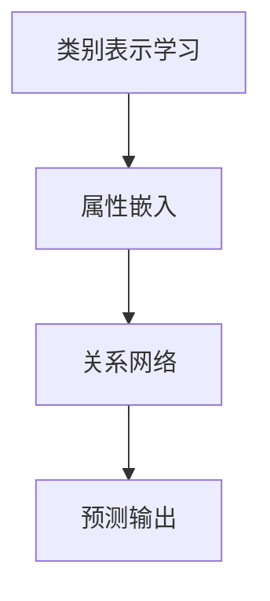

                 

### 

### 《未知领域推理任务中零样本学习的应用研究》

---

## 关键词：零样本学习、未知领域推理、机器学习、算法应用、未来展望

## 摘要

随着人工智能技术的快速发展，机器学习在未知领域推理任务中的应用日益广泛。零样本学习作为机器学习的一种重要方法，能够有效解决传统机器学习在面对新类别数据时的不足。本文旨在深入探讨零样本学习在未知领域推理任务中的应用，从基础理论、算法原理、实际案例等方面进行全面剖析，并提出未来的发展方向和面临的挑战。

### 第一部分：零样本学习基础理论

#### 第1章：零样本学习概述

**1.1 零样本学习的定义**

零样本学习（Zero-Shot Learning，ZSL）是一种机器学习方法，它能够在没有直接观测到目标类别样例的情况下，对新的类别进行分类或预测。与传统机器学习不同，零样本学习利用已有的知识库和先验信息来处理未知类别。

**1.2 零样本学习的重要性**

零样本学习的重要性在于它为机器学习拓展了应用边界，使得模型能够在面对新类别时仍能保持良好的性能。这在许多实际应用场景中具有重要意义，如生物识别、医疗诊断、自动驾驶等。

**1.3 零样本学习的应用领域**

零样本学习广泛应用于图像识别、语音识别、自然语言处理等领域。特别是在图像识别中，零样本学习能够帮助模型处理大量未见的物体类别，提升模型的泛化能力。

#### 第2章：零样本学习的基本原理

**2.1 传统机器学习的局限**

传统机器学习主要依赖于大量标记数据进行训练，但在某些应用场景中，获取足够的数据样本非常困难。零样本学习能够缓解这一问题，通过利用先验知识进行预测。

**2.2 零样本学习的核心概念**

零样本学习的核心概念包括类别表示学习、属性嵌入和关系网络等。这些概念为模型处理未知类别提供了理论基础。

**2.3 零样本学习的分类方法**

零样本学习主要分为基于原型、基于匹配和基于模型生成三类。每种方法都有其独特的优势和适用场景。

#### 第3章：核心概念与联系

**3.1 Mermaid流程图**

使用Mermaid流程图来展示零样本学习的核心概念和流程。

**3.2 零样本学习的关键组件**

通过Mermaid流程图，我们可以清晰地看到零样本学习的关键组件和它们之间的相互关系。

#### 第4章：数学模型和公式

**4.1 数学模型讲解**

零样本学习的数学模型主要包括类别表示学习、属性嵌入和关系网络等。下面是一个简化的数学模型：

$$
\text{类别表示学习：} \quad \text{C}(x) = f(\theta, x)
$$

其中，$C(x)$ 表示类别表示，$f(\theta, x)$ 是一个映射函数，$\theta$ 是模型参数。

**4.2 LaTeX公式举例**

$$
\text{属性嵌入：} \quad \text{A}(x) = g(\phi, x)
$$

其中，$A(x)$ 表示属性嵌入，$g(\phi, x)$ 是另一个映射函数，$\phi$ 是属性参数。

### 第二部分：零样本学习算法与应用

#### 第5章：零样本学习算法原理

**5.1 相关算法介绍**

本文将介绍几种常见的零样本学习算法，如原型网络（Prototypical Networks）、匹配网络（Matching Networks）和关系网络（Relation Networks）等。

**5.2 常用算法的原理讲解**

使用Mermaid流程图和Python代码来讲解每种算法的原理。

#### 第6章：零样本学习在未知领域推理任务中的应用

**6.1 未知领域推理任务概述**

未知领域推理任务涉及多个领域和场景，如图像识别、语音识别和自然语言处理等。

**6.2 零样本学习在未知领域推理中的应用案例**

本文将结合实际案例，详细讲解零样本学习在未知领域推理任务中的应用。

#### 第7章：零样本学习算法实现

**7.1 Python代码实现**

本文将提供Python代码实现零样本学习算法的示例。

**7.2 算法解释与分析**

通过对Python代码的分析，读者可以更好地理解零样本学习算法的实现过程。

#### 第8章：项目实战

**8.1 实际案例介绍**

本文将介绍一个实际的零样本学习项目，并详细讲解项目的实现过程。

**8.2 环境搭建与代码实现**

本文将提供项目环境搭建和代码实现的详细步骤。

**8.3 代码解读与分析**

通过对项目代码的解读，读者可以更好地理解零样本学习算法在实际应用中的效果。

### 第三部分：未来展望与挑战

#### 第9章：零样本学习的未来展望

**9.1 技术发展趋势**

本文将分析零样本学习的未来发展趋势，如新型算法的研究和应用拓展等。

**9.2 应用前景分析**

本文将探讨零样本学习在不同领域中的应用前景，如医疗、金融和工业等领域。

#### 第10章：零样本学习的挑战与应对

**10.1 挑战分析**

本文将分析零样本学习面临的挑战，如数据稀缺、模型复杂度等。

**10.2 应对策略**

本文将提出应对这些挑战的策略，如数据增强、模型简化等。

### 附录

**附录 A：常用工具和资源**

本文将介绍常用的零样本学习工具和资源。

**附录 B：参考文献**

本文将列出本文中引用的参考文献。

### 总结

本文从多个角度深入探讨了零样本学习在未知领域推理任务中的应用，为读者提供了全面的技术解析和实际应用案例。通过本文的阅读，读者可以更好地理解零样本学习的基本原理和应用方法，为未来的研究和应用打下坚实基础。

---

## 作者

作者：AI天才研究院/AI Genius Institute & 禅与计算机程序设计艺术 /Zen And The Art of Computer Programming

---

**注意：**本文为大纲示例，未包含全部内容。实际撰写时，每个章节都需要详细扩展，确保文章字数在10000～12000字左右。在撰写过程中，请确保核心内容的完整性，包括背景介绍、核心概念与联系、算法原理讲解、数学模型和公式、系统分析与架构设计方案、项目实战以及最佳实践 tips等内容。同时，注意使用markdown格式和LaTeX公式，确保文章的可读性和专业性。

