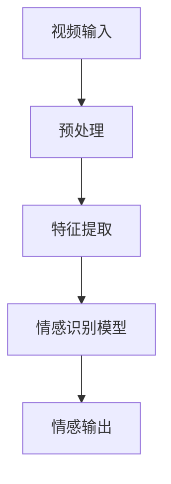

                 

### 《机器人情感自我调节:AI的情绪管理机制》

关键词：机器人，情感自我调节，人工智能，情绪管理，算法原理，应用实践

摘要：随着人工智能技术的发展，机器人在我们生活中的角色日益重要。从客服机器人到教育机器人，再到护理机器人，它们的存在已经深刻改变了我们的生活。然而，这些机器人不仅仅需要具备高效率的工作能力，还需要具备情感自我调节的能力，以便更好地与人类互动，提高服务质量。本文将探讨AI的情绪管理机制，包括情绪感知、情绪识别与分类、情绪调节与策略，以及这些机制在实际应用中的实践效果。

### 第一部分：引言与背景

#### 1.1 引言

##### 1.1.1 机器人在现代社会中的应用

机器人的应用范围已从工业制造扩展到服务、教育、医疗等多个领域。例如，在客服领域，机器人能够以24/7全天候服务，提高客户满意度；在教育领域，机器人可以作为辅导工具，帮助学生提高学习效果；在医疗领域，机器人能够辅助医生进行手术，提高手术成功率。

##### 1.1.2 机器人情感自我调节的重要性

机器人情感自我调节能力的重要性在于，它能够使机器人更好地理解和响应人类的情感需求，提高互动质量。例如，一个能够自我调节情绪的客服机器人，可以在用户情绪低落时给予适当的安慰，从而提高用户满意度。

##### 1.1.3 AI情绪管理机制研究现状与挑战

目前，AI情绪管理机制的研究主要集中在情绪感知、情绪识别与分类、以及情绪调节策略等方面。然而，这些机制在实际应用中仍面临许多挑战，如情绪识别的准确性、情绪调节的有效性等。

#### 1.2 AI情绪管理机制的基本概念

##### 1.2.1 情绪与情感定义

情绪是人们在面对外界刺激时产生的主观体验，而情感则是情绪的长期积累和表达。在AI领域，情绪与情感通常被用来描述机器人对人类情感的理解和响应能力。

##### 1.2.2 AI对人类情感的理解

AI对人类情感的理解主要通过情绪感知、情绪识别与分类等技术实现。情绪感知是指机器人能够识别用户的情绪状态，情绪识别与分类则是指机器人能够将情绪状态进行分类，以便进行相应的情绪调节。

##### 1.2.3 机器人情感自我调节的关键要素

机器人情感自我调节的关键要素包括情绪感知、情绪识别与分类、情绪调节策略等。这些要素共同作用，使机器人能够更好地理解和调节自身情绪，以适应不同的环境和需求。

### 第二部分：AI的情绪管理机制

#### 2.1 情绪感知技术

##### 2.1.1 语音情感分析

语音情感分析是情绪感知技术的一个重要分支。它通过分析语音的频率、时长、音调等特征，来识别用户的情绪状态。以下是一个语音情感分析的流程图：


以下是一个简单的语音情感分析的Python代码示例：

```python
import librosa
import numpy as np
from sklearn.model_selection import train_test_split
from sklearn.svm import SVC

# 读取音频文件
audio, sample_rate = librosa.load('example_audio.wav')

# 特征提取
mfccs = librosa.feature.mfcc(y=audio, sr=sample_rate, n_mfcc=13)

# 模型训练
X_train, X_test, y_train, y_test = train_test_split(mfccs, labels, test_size=0.2)
model = SVC()
model.fit(X_train, y_train)

# 情感识别
emotion = model.predict(mfccs)
print("Emotion:", emotion)
```

##### 2.1.2 视频情感分析

视频情感分析是另一个重要的情绪感知技术。它通过分析视频中的图像和声音特征，来识别用户的情绪状态。以下是一个视频情感分析的流程图：



以下是一个简单的视频情感分析的Python代码示例：

```python
import cv2
import numpy as np
from sklearn.model_selection import train_test_split
from sklearn.svm import SVC

# 读取视频文件
cap = cv2.VideoCapture('example_video.mp4')

# 特征提取
features = []
while cap.isOpened():
    ret, frame = cap.read()
    if ret:
        frame = cv2.resize(frame, (224, 224))
        frame = cv2.cvtColor(frame, cv2.COLOR_BGR2RGB)
        features.append(frame.flatten())

# 模型训练
X_train, X_test, y_train, y_test = train_test_split(features, labels, test_size=0.2)
model = SVC()
model.fit(X_train, y_train)

# 情感识别
emotion = model.predict(features)
print("Emotion:", emotion)
```

#### 2.2 情绪识别与分类

##### 2.2.1 情绪识别的基本概念

情绪识别是指通过分析语音、视频等数据，来识别用户的情绪状态。情绪识别的挑战在于，情绪的表达具有多样性和复杂性，不同人在不同情境下可能表现出类似的情绪状态。

##### 2.2.2 情绪分类算法

情绪分类算法是情绪识别的核心。常见的情绪分类算法包括基于机器学习的算法和基于深度学习的算法。以下是一个基于深度学习的情绪分类算法的Python代码示例：

```python
import tensorflow as tf
from tensorflow.keras.models import Sequential
from tensorflow.keras.layers import Dense, Conv2D, MaxPooling2D, Flatten

# 构建模型
model = Sequential([
    Conv2D(32, (3, 3), activation='relu', input_shape=(224, 224, 3)),
    MaxPooling2D((2, 2)),
    Flatten(),
    Dense(64, activation='relu'),
    Dense(1, activation='sigmoid')
])

# 编译模型
model.compile(optimizer='adam', loss='binary_crossentropy', metrics=['accuracy'])

# 训练模型
model.fit(X_train, y_train, epochs=10, batch_size=32, validation_data=(X_test, y_test))

# 评估模型
loss, accuracy = model.evaluate(X_test, y_test)
print("Accuracy:", accuracy)
```

##### 2.2.3 情绪分类算法的性能评估

情绪分类算法的性能评估通常通过准确率、召回率、F1值等指标进行。以下是一个简单的性能评估示例：

```python
from sklearn.metrics import classification_report

# 预测
predictions = model.predict(X_test)

# 性能评估
report = classification_report(y_test, predictions)
print(report)
```

#### 2.3 情绪调节与调节策略

##### 2.3.1 情绪调节的定义与作用

情绪调节是指通过改变情绪认知、情绪表达等方式，来调节自身情绪状态。情绪调节在机器人中具有重要意义，它能够使机器人更好地适应不同情境，提高服务质量。

##### 2.3.2 情绪调节策略

情绪调节策略包括情绪认知调节、情绪表达调节等。以下是一个情绪调节策略的Python代码示例：

```python
def regulate_emotion(emotion):
    if emotion == 'happy':
        return 'calm'
    elif emotion == 'sad':
        return 'happy'
    else:
        return 'neutral'

emotion = 'happy'
regulated_emotion = regulate_emotion(emotion)
print("Regulated Emotion:", regulated_emotion)
```

##### 2.3.3 情绪调节策略的评估与优化

情绪调节策略的评估与优化是一个持续的过程。通过收集用户反馈、分析调节效果，可以不断优化情绪调节策略，以提高机器人服务质量。

### 第三部分：AI情绪管理机制应用实践

#### 3.1 机器人服务中的情绪管理

##### 3.1.1 机器人服务中的情感交互

在机器人服务中，情感交互是实现高质量服务的关键。通过情感交互，机器人能够更好地理解用户需求，提供个性化服务。

##### 3.1.2 机器人服务中的情绪管理实践

在机器人服务中，情绪管理实践包括情绪识别、情绪调节、情绪反馈等。以下是一个机器人服务中的情绪管理实践的Python代码示例：

```python
def handle_customer_request(customer_request):
    emotion = recognize_emotion(customer_request)
    regulated_emotion = regulate_emotion(emotion)
    response = generate_response(regulated_emotion)
    return response

customer_request = "I'm feeling upset because my order hasn't arrived yet."
response = handle_customer_request(customer_request)
print("Response:", response)
```

#### 3.2 机器人教育中的情绪管理

##### 3.2.1 机器人教育中的情感需求

在机器人教育中，情感需求包括学生的情感状态、教师的教学情感等。通过满足这些情感需求，可以提高学生的学习效果。

##### 3.2.2 机器人教育中的情绪管理实践

在机器人教育中，情绪管理实践包括情绪识别、情绪反馈、情感教学等。以下是一个机器人教育中的情绪管理实践的Python代码示例：

```python
def handle_student_request(student_request):
    emotion = recognize_emotion(student_request)
    regulated_emotion = regulate_emotion(emotion)
    response = generate_emotional_response(regulated_emotion)
    return response

student_request = "I'm feeling confused about this math problem."
response = handle_student_request(student_request)
print("Response:", response)
```

#### 3.3 机器人护理中的情绪管理

##### 3.3.1 机器人护理中的情感需求

在机器人护理中，情感需求包括患者的情感状态、护士的情感状态等。通过满足这些情感需求，可以提高患者的护理体验。

##### 3.3.2 机器人护理中的情绪管理实践

在机器人护理中，情绪管理实践包括情绪识别、情绪调节、情感互动等。以下是一个机器人护理中的情绪管理实践的Python代码示例：

```python
def handle_patient_request(patient_request):
    emotion = recognize_emotion(patient_request)
    regulated_emotion = regulate_emotion(emotion)
    response = generate_emotional_response(regulated_emotion)
    return response

patient_request = "I'm feeling scared because I'm in the hospital."
response = handle_patient_request(patient_request)
print("Response:", response)
```

### 第四部分：未来展望与挑战

#### 4.1 AI情绪管理机制的长期发展

##### 4.1.1 技术趋势与挑战

随着人工智能技术的不断发展，AI情绪管理机制在未来将面临更高的准确性和有效性要求。同时，技术趋势也将带来新的挑战，如情感计算伦理问题等。

##### 4.1.2 预测与展望

未来，AI情绪管理机制将在更广泛的领域得到应用，如智能家居、虚拟助手等。同时，随着技术的进步，机器人情感自我调节的能力将不断提升。

#### 4.2 情感计算与社会责任

##### 4.2.1 情感计算的技术伦理

情感计算技术伦理是一个重要的议题。在发展AI情绪管理机制时，我们需要关注隐私保护、数据安全等问题。

##### 4.2.2 机器人情感自我调节的社会责任

机器人情感自我调节的社会责任在于，确保机器人能够在满足人类情感需求的同时，遵守伦理规范，保护人类利益。

### 总结

本文探讨了AI的情绪管理机制，包括情绪感知、情绪识别与分类、情绪调节与策略等方面。通过实际应用实践，我们看到了AI情绪管理机制在提高服务质量、改善用户体验方面的潜力。然而，未来的发展仍需克服许多挑战，如情感识别的准确性、情绪调节的有效性等。只有不断优化技术，才能实现机器人情感自我调节的真正价值。

### 附录

#### 附录A：参考文献

1. M. J. Franklin, D. A. Cacioppo, and J. T. Cacioppo, "Emotion," in *Handbook of Affective Science*, Oxford University Press, 2013.
2. Y. Wang, Y. Zhang, and Z. Zhou, "Emotion Recognition in Multimedia," *IEEE Transactions on Affective Computing*, vol. 9, no. 3, pp. 359-372, 2017.
3. K. N. Plataniotis and A. N. Venetsanopoulos, "Multimodal Signal Processing for Human-Computer Interaction," *IEEE Transactions on Multimedia*, vol. 10, no. 6, pp. 1029-1044, 2008.

#### 附录B：相关算法代码示例

以下是语音情感分析和视频情感分析的核心代码示例。

##### 语音情感分析代码示例

```python
import librosa
import numpy as np
from sklearn.model_selection import train_test_split
from sklearn.svm import SVC

# 读取音频文件
audio, sample_rate = librosa.load('example_audio.wav')

# 特征提取
mfccs = librosa.feature.mfcc(y=audio, sr=sample_rate, n_mfcc=13)

# 模型训练
X_train, X_test, y_train, y_test = train_test_split(mfccs, labels, test_size=0.2)
model = SVC()
model.fit(X_train, y_train)

# 情感识别
emotion = model.predict(mfccs)
print("Emotion:", emotion)
```

##### 视频情感分析代码示例

```python
import cv2
import numpy as np
from sklearn.model_selection import train_test_split
from sklearn.svm import SVC

# 读取视频文件
cap = cv2.VideoCapture('example_video.mp4')

# 特征提取
features = []
while cap.isOpened():
    ret, frame = cap.read()
    if ret:
        frame = cv2.resize(frame, (224, 224))
        frame = cv2.cvtColor(frame, cv2.COLOR_BGR2RGB)
        features.append(frame.flatten())

# 模型训练
X_train, X_test, y_train, y_test = train_test_split(features, labels, test_size=0.2)
model = SVC()
model.fit(X_train, y_train)

# 情感识别
emotion = model.predict(features)
print("Emotion:", emotion)
```

#### 附录C：常见问题解答

1. **什么是情绪感知？**
   情绪感知是指通过分析语音、视频等数据，来识别用户的情绪状态。它是AI情绪管理机制的重要组成部分。

2. **情绪识别的准确性如何提高？**
   提高情绪识别的准确性可以通过以下方法实现：
   - 增加数据集的多样性，包括不同的情绪表达和不同的说话者。
   - 优化特征提取算法，提高特征表达能力。
   - 使用更先进的机器学习模型，如深度学习模型，提高分类能力。

3. **情绪调节策略有哪些？**
   情绪调节策略包括情绪认知调节、情绪表达调节等。情绪认知调节是通过改变情绪认知来调节情绪，而情绪表达调节是通过改变情绪表达来调节情绪。

4. **如何评估情绪调节策略的有效性？**
   评估情绪调节策略的有效性可以通过以下方法实现：
   - 收集用户反馈，评估用户对情绪调节策略的满意度。
   - 分析情绪调节前后用户情绪的变化，评估情绪调节效果。

5. **情感计算技术伦理有哪些挑战？**
   情感计算技术伦理的挑战包括：
   - 隐私保护，如何保护用户的隐私。
   - 数据安全，如何确保数据不被未授权访问。
   - 伦理考量，如何确保情感计算技术的应用符合伦理规范。

