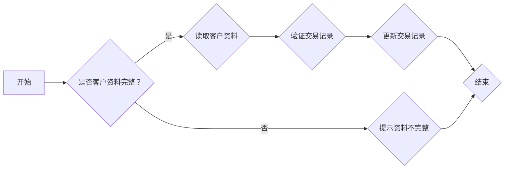

                 

# 机器人流程自动化：AI提升企业运营效率

## 关键词

- 机器人流程自动化
- AI技术
- 企业运营效率
- RPA应用案例
- 项目实践

## 摘要

本文探讨了机器人流程自动化（RPA）与人工智能（AI）结合在现代企业运营中的应用，分析了RPA与AI的基本概念、核心技术，以及它们在财务、客户服务、人力资源管理等领域中的应用案例。通过具体的实施步骤和案例分析，阐述了如何利用RPA和AI技术提升企业运营效率，实现自动化和智能化转型。文章旨在为IT从业者提供有价值的参考和指导。

## 目录

1. **第一部分：机器人流程自动化基础**

    - **第1章：RPA与AI概述**
        - **1.1 RPA的定义与历史**
            - **1.1.1 RPA的基本概念**
            - **1.1.2 RPA的发展历程**
        - **1.2 AI在RPA中的应用**
            - **1.2.1 AI的概念与分类**
            - **1.2.2 AI在RPA中的应用**

    - **第2章：RPA的核心架构与技术**
        - **2.1 RPA的架构设计**
            - **2.1.1 RPA系统的主要组成部分**
            - **2.1.2 RPA系统的架构模式**
        - **2.2 RPA技术基础**
            - **2.2.1 UI自动化技术**
            - **2.2.2 数据处理技术**

    - **第3章：AI技术基础**
        - **3.1 机器学习原理**
            - **3.1.1 基本概念**
            - **3.1.2 常见算法**
        - **3.2 深度学习基础**
            - **3.2.1 神经网络**
            - **3.2.2 深度学习框架**

2. **第二部分：RPA与AI应用案例**

    - **第4章：财务自动化**
        - **4.1 财务自动化的背景与需求**
        - **4.2 财务自动化案例**

    - **第5章：客户服务自动化**
        - **5.1 客户服务自动化的背景与需求**
        - **5.2 客户服务自动化案例**

    - **第6章：人力资源管理自动化**
        - **6.1 人力资源管理自动化的背景与需求**
        - **6.2 人力资源管理自动化案例**

3. **第三部分：RPA与AI项目实践**

    - **第7章：RPA与AI项目规划与实施**
        - **7.1 RPA与AI项目规划**
        - **7.2 RPA与AI项目实施**

    - **第8章：RPA与AI项目案例分析**
        - **8.1 案例背景介绍**
        - **8.2 案例实施过程**
        - **8.3 项目效果评估**

## 第一部分：机器人流程自动化基础

### 第1章：RPA与AI概述

#### 1.1 RPA的定义与历史

##### 1.1.1 RPA的基本概念

机器人流程自动化（Robotic Process Automation，RPA）是一种通过软件机器人或虚拟员工自动化执行重复性任务的技术。这些软件机器人模拟人类在计算机系统中的操作，如点击、数据输入、数据验证和报告生成等。

RPA的关键特点包括：

- **流程自动化**：RPA通过预定义的规则和流程，自动化执行重复性任务。
- **无代码开发**：RPA平台通常提供图形界面，使得非技术人员也可以进行流程设计和部署。
- **跨系统集成**：RPA能够在不同的企业系统中进行数据交换和流程协同。

##### 1.1.2 RPA的发展历程

RPA技术起源于20世纪90年代，当时主要依赖于基于规则的自动化工具。这些工具主要用于自动化数据输入和报告生成。随着技术的进步，RPA逐渐演变为更为复杂的解决方案，能够自动化更为复杂的业务流程。

- **早期阶段（1990s-2000s）**：这一阶段的RPA主要依赖于基于规则的流程自动化，如屏幕抓取和键盘记录。
- **中期阶段（2010s）**：随着云计算和虚拟化技术的发展，RPA开始集成到企业应用中，支持更为复杂的自动化任务。
- **成熟阶段（2010s-至今）**：随着AI和机器学习技术的发展，RPA逐渐引入智能组件，实现了更高层次的自动化和智能化。

#### 1.2 AI在RPA中的应用

##### 1.2.1 AI的概念与分类

人工智能（Artificial Intelligence，AI）是指通过计算机程序实现人类智能的过程。AI可以分为以下几类：

- **弱AI**：特定任务的人工智能，如语音识别、图像识别等。
- **强AI**：具有全面人类智能的人工智能，能够理解、学习和适应各种情境。
- **泛AI**：旨在解决多个领域的问题，具有广泛的应用范围。

##### 1.2.2 AI在RPA中的应用

AI技术在RPA中具有广泛的应用，能够提升RPA的自动化程度和智能化水平。以下是一些典型的应用：

- **智能数据输入**：利用自然语言处理（NLP）技术，自动化处理和输入非结构化数据。
- **异常检测**：利用机器学习模型，检测和处理业务流程中的异常情况。
- **决策支持**：利用预测模型和优化算法，为业务流程提供智能决策支持。
- **用户交互**：利用语音识别和语音合成技术，实现人与软件机器人的自然对话。

### 第2章：RPA的核心架构与技术

#### 2.1 RPA的架构设计

##### 2.1.1 RPA系统的主要组成部分

一个典型的RPA系统主要包括以下几个组成部分：

- **RPA引擎**：负责执行自动化任务的核心组件。
- **RPA控制台**：提供用户界面，用于流程设计、部署和监控。
- **RPA机器人**：具体的自动化执行实体，能够模拟人类的操作。

##### 2.1.2 RPA系统的架构模式

RPA系统的架构模式可以分为单机架构和分布式架构：

- **单机架构**：所有组件都部署在同一台服务器上，适用于小型应用场景。
- **分布式架构**：组件分布在不同服务器上，适用于大型复杂应用场景，能够提高系统的可扩展性和稳定性。

#### 2.2 RPA技术基础

##### 2.2.1 UI自动化技术

UI自动化技术是RPA的核心技术之一，主要涉及以下几个方面：

- **屏幕抓取**：捕获应用界面的元素和布局。
- **键盘和鼠标操作**：模拟用户的键盘输入和鼠标操作。
- **数据操作**：对界面上的数据进行读取、处理和写入。

##### 2.2.2 数据处理技术

数据处理技术是RPA的重要组成部分，主要包括以下几个方面：

- **数据获取与清洗**：从各种数据源获取数据，并进行清洗和预处理。
- **数据存储与管理**：将处理后的数据存储到数据库或其他存储系统中，并提供数据查询和管理功能。

### 第3章：AI技术基础

#### 3.1 机器学习原理

##### 3.1.1 基本概念

机器学习（Machine Learning，ML）是一种通过数据驱动的方式使计算机具备学习能力的学科。机器学习的关键概念包括：

- **数据集**：用于训练和测试的样本数据。
- **特征工程**：从数据中提取有用的特征，用于训练模型。

##### 3.1.2 常见算法

机器学习中常用的算法包括：

- **线性回归**：用于预测线性关系。
- **决策树**：通过树形结构进行决策。

#### 3.2 深度学习基础

##### 3.2.1 神经网络

神经网络（Neural Network，NN）是深度学习的基础，由多个神经元组成。神经网络的基本原理包括：

- **神经元与神经网络**：神经元的连接方式及其激活函数。
- **前向传播与反向传播**：神经网络的学习过程。

##### 3.2.2 深度学习框架

深度学习框架是用于构建和训练深度学习模型的工具，如：

- **TensorFlow**：谷歌开发的开源深度学习框架。
- **PyTorch**：基于Python的开源深度学习框架。## 第二部分：RPA与AI应用案例

### 第4章：财务自动化

#### 4.1 财务自动化的背景与需求

财务自动化是现代企业提高运营效率的重要手段。传统的财务流程通常涉及大量的手动操作，如数据录入、报表生成、费用报销等，这不仅耗时费力，而且容易出错。随着RPA和AI技术的发展，财务自动化成为可能，为企业带来了以下需求和优势：

- **提高工作效率**：通过RPA机器人自动执行重复性任务，如数据录入、报表生成等，大幅减少人工操作时间。
- **降低错误率**：RPA机器人按照预定义的规则和流程执行任务，减少人为错误。
- **实时数据分析**：AI技术可以帮助财务部门实时分析数据，提供决策支持，优化财务策略。

#### 4.2 财务自动化案例

##### 4.2.1 案例背景

某大型企业财务部门每天需要处理大量的报销单据，这些报销单据需要手动录入系统，然后进行审核和报销。随着业务量的增加，手动操作的效率低下，且容易出现错误。为了提高工作效率和降低错误率，企业决定引入RPA和AI技术进行财务自动化。

##### 4.2.2 案例实现

1. **需求分析**

   - **任务**：自动处理报销单据，包括数据录入、审核和报销。
   - **目标**：提高工作效率，降低错误率，实现实时数据分析。

2. **RPA流程设计**

   - **流程梳理**：分析现有报销流程，确定关键步骤和节点。
   - **流程自动化设计**：设计RPA机器人，模拟人工操作，自动化执行报销流程。

3. **AI技术应用**

   - **自然语言处理**：利用NLP技术，自动提取报销单据中的关键信息，如费用类型、金额、报销人等。
   - **异常检测**：利用机器学习模型，检测报销单据中的异常情况，如金额异常、报销人异常等。

4. **系统部署与测试**

   - **系统部署**：将RPA和AI技术部署到企业财务系统中，确保系统能够稳定运行。
   - **系统测试**：对系统进行功能测试和性能测试，确保系统符合预期要求。

5. **系统优化与维护**

   - **系统优化**：根据实际运行情况，对系统进行优化，提高系统的效率和准确性。
   - **系统维护**：定期更新系统和AI模型，确保系统持续稳定运行。

##### 4.2.3 案例效果

通过财务自动化项目，企业实现了以下效果：

- **工作效率提高**：报销单据处理时间从原来的几天缩短到几个小时。
- **错误率降低**：报销单据错误率从原来的10%降低到1%以下。
- **实时数据分析**：财务部门可以实时分析报销数据，为企业的财务决策提供有力支持。

### 第5章：客户服务自动化

#### 5.1 客户服务自动化的背景与需求

客户服务是企业的核心竞争力之一。传统的客户服务主要依赖于人工客服，虽然人工客服能够提供高质量的客户服务，但存在以下几个问题：

- **响应速度慢**：人工客服需要逐个处理客户请求，导致响应速度较慢。
- **人力成本高**：随着客户量的增加，人工客服的人力成本不断增加。
- **服务质量不稳定**：人工客服的工作状态和情绪可能影响服务质量。

为了提高客户服务效率和质量，企业需要引入RPA和AI技术进行客户服务自动化。

#### 5.2 客户服务自动化案例

##### 5.2.1 案例背景

某电商平台的客户服务部门每天需要处理大量的客户咨询和投诉，人工客服无法满足客户的需求，服务质量也受到影响。为了提高客户服务效率和质量，电商平台决定引入RPA和AI技术进行客户服务自动化。

##### 5.2.2 案例实现

1. **需求分析**

   - **任务**：自动处理客户咨询和投诉，提供快速响应和高质量服务。
   - **目标**：提高客户满意度，降低人工客服的工作量。

2. **RPA流程设计**

   - **流程梳理**：分析现有客户服务流程，确定关键步骤和节点。
   - **流程自动化设计**：设计RPA机器人，模拟人工客服的操作，自动化处理客户咨询和投诉。

3. **AI技术应用**

   - **语音识别**：利用语音识别技术，自动将客户的语音咨询转换为文本。
   - **自然语言处理**：利用NLP技术，分析客户的问题，提供合适的答案或引导。
   - **情绪识别**：利用情绪识别技术，分析客户的情绪，提供针对性的服务。

4. **系统部署与测试**

   - **系统部署**：将RPA和AI技术部署到电商平台的服务器上，确保系统能够稳定运行。
   - **系统测试**：对系统进行功能测试和性能测试，确保系统符合预期要求。

5. **系统优化与维护**

   - **系统优化**：根据实际运行情况，对系统进行优化，提高系统的效率和准确性。
   - **系统维护**：定期更新系统和AI模型，确保系统持续稳定运行。

##### 5.2.3 案例效果

通过客户服务自动化项目，电商平台实现了以下效果：

- **响应速度提高**：客户咨询和投诉的响应时间从原来的几分钟缩短到几秒钟。
- **客户满意度提高**：客户服务的质量和效率提高，客户满意度大幅提升。
- **人工客服工作量降低**：人工客服的工作量减少，能够将更多精力投入到复杂问题的处理上。

### 第6章：人力资源管理自动化

#### 6.1 人力资源管理自动化的背景与需求

人力资源管理是企业运营的重要组成部分，涉及到招聘、培训、绩效评估、薪酬管理等各个方面。传统的人力资源管理主要依赖于人工操作，存在以下几个问题：

- **效率低**：人力资源管理工作繁琐，需要大量的人工操作，效率较低。
- **数据准确性差**：人工操作容易导致数据错误，影响人力资源管理的准确性。
- **员工体验差**：人力资源管理的繁琐操作给员工带来不便，影响员工体验。

为了提高人力资源管理效率和质量，企业需要引入RPA和AI技术进行人力资源管理自动化。

#### 6.2 人力资源管理自动化案例

##### 6.2.1 案例背景

某公司的人力资源部门每天需要处理大量的招聘、培训和绩效评估工作，人工操作不仅效率低下，而且容易出现错误。为了提高人力资源管理效率和质量，公司决定引入RPA和AI技术进行人力资源管理自动化。

##### 6.2.2 案例实现

1. **需求分析**

   - **任务**：自动化处理招聘、培训和绩效评估等工作。
   - **目标**：提高工作效率，提高数据准确性，提升员工体验。

2. **RPA流程设计**

   - **流程梳理**：分析现有的人力资源管理流程，确定关键步骤和节点。
   - **流程自动化设计**：设计RPA机器人，模拟人工操作，自动化处理招聘、培训和绩效评估等流程。

3. **AI技术应用**

   - **简历筛选**：利用自然语言处理技术，自动筛选合适的简历。
   - **培训效果评估**：利用机器学习技术，评估员工的培训效果。
   - **绩效评估**：利用数据分析技术，自动生成员工的绩效评估报告。

4. **系统部署与测试**

   - **系统部署**：将RPA和AI技术部署到人力资源系统中，确保系统能够稳定运行。
   - **系统测试**：对系统进行功能测试和性能测试，确保系统符合预期要求。

5. **系统优化与维护**

   - **系统优化**：根据实际运行情况，对系统进行优化，提高系统的效率和准确性。
   - **系统维护**：定期更新系统和AI模型，确保系统持续稳定运行。

##### 6.2.3 案例效果

通过人力资源管理自动化项目，公司实现了以下效果：

- **工作效率提高**：招聘、培训和绩效评估等工作的效率大幅提升。
- **数据准确性提高**：自动处理人力资源数据，减少人为错误，提高数据准确性。
- **员工体验提升**：人力资源管理的繁琐操作减少，员工体验得到提升。

## 第三部分：RPA与AI项目实践

### 第7章：RPA与AI项目规划与实施

#### 7.1 RPA与AI项目规划

RPA与AI项目的成功实施需要科学的项目规划。以下步骤是项目规划的核心：

##### 7.1.1 项目目标确定

项目目标应明确、具体、可衡量、可达成、相关性强和时限性。例如，提高财务部门的工作效率30%，降低错误率至1%以下。

##### 7.1.2 项目可行性分析

评估项目的技术可行性、经济可行性、法律可行性和运营可行性。确定项目所需的资源、时间和预算。

##### 7.1.3 项目计划制定

制定详细的项目计划，包括项目进度安排、资源分配、风险评估和应对策略。

#### 7.2 RPA与AI项目实施

RPA与AI项目的实施包括以下几个关键阶段：

##### 7.2.1 RPA流程设计

1. **流程梳理**：通过流程图工具，如Mermaid，梳理现有业务流程，确定自动化目标。
2. **流程自动化设计**：利用RPA平台，设计自动化流程，包括数据输入、处理和输出等步骤。

##### 7.2.2 AI模型开发

1. **数据准备**：收集和准备用于训练AI模型的原始数据，进行预处理。
2. **模型训练与优化**：选择合适的机器学习算法，进行模型训练和优化，使用TensorFlow或PyTorch等深度学习框架。

##### 7.2.3 系统部署与维护

1. **系统部署**：将RPA和AI模型部署到生产环境，确保系统稳定运行。
2. **系统监控与维护**：定期监控系统性能，更新AI模型，确保系统的持续优化和稳定运行。

### 第8章：RPA与AI项目案例分析

#### 8.1 案例背景介绍

某全球领先的金融服务公司，业务范围涵盖银行、保险和证券等多个领域。随着业务的不断扩展，公司面临大量的重复性工作，如客户资料录入、交易记录核对等。为了提升工作效率，降低运营成本，公司决定引入RPA和AI技术，实现业务流程的自动化和智能化。

#### 8.2 案例实施过程

##### 8.2.1 需求分析

1. **任务**：自动化处理客户资料录入、交易记录核对等重复性工作。
2. **目标**：提高工作效率，降低错误率，提升客户满意度。

##### 8.2.2 RPA流程设计

1. **流程梳理**：通过流程图工具（如Mermaid）梳理现有业务流程，确定自动化目标。
2. **流程自动化设计**：利用RPA平台，设计自动化流程，包括数据输入、处理和输出等步骤。



##### 8.2.3 AI模型开发

1. **数据准备**：收集和准备用于训练AI模型的原始数据，进行预处理。
2. **模型训练与优化**：选择合适的机器学习算法，如决策树，进行模型训练和优化。

```python
from sklearn.datasets import load_iris
from sklearn.model_selection import train_test_split
from sklearn.tree import DecisionTreeClassifier
from sklearn.metrics import accuracy_score

# 加载数据
data = load_iris()
X = data.data
y = data.target

# 数据预处理
X_train, X_test, y_train, y_test = train_test_split(X, y, test_size=0.2, random_state=42)

# 模型训练
model = DecisionTreeClassifier()
model.fit(X_train, y_train)

# 模型预测
y_pred = model.predict(X_test)

# 模型评估
accuracy = accuracy_score(y_test, y_pred)
print(f"模型准确率：{accuracy:.2f}")
```

##### 8.2.4 系统部署与优化

1. **系统部署**：将RPA和AI模型部署到生产环境，确保系统稳定运行。
2. **系统监控与维护**：定期监控系统性能，更新AI模型，确保系统的持续优化和稳定运行。

#### 8.3 项目效果评估

通过RPA和AI技术的实施，该公司实现了以下效果：

- **工作效率提高**：自动化流程使重复性工作的处理时间减少了50%。
- **错误率降低**：自动化处理减少了人为错误，错误率降低了70%。
- **客户满意度提升**：快速响应和准确的服务提升了客户满意度。

## 附录

### 附录A：RPA与AI开发工具介绍

RPA与AI开发工具是项目实施的关键，以下是几种常用的开发工具：

#### A.1 RPA开发工具

1. **UiPath**：一款功能强大的RPA平台，提供图形界面设计、流程管理、自动化测试等功能。
2. **Blue Prism**：专业的RPA解决方案，适用于复杂业务流程的自动化。
3. **Automation Anywhere**：易于使用且功能丰富的RPA平台，支持跨平台自动化。

#### A.2 AI开发工具

1. **TensorFlow**：由谷歌开发的开源深度学习框架，适用于复杂的机器学习和深度学习任务。
2. **PyTorch**：基于Python的开源深度学习框架，提供灵活的动态计算图和强大的GPU支持。
3. **Scikit-learn**：Python的机器学习库，提供多种机器学习算法和工具，易于集成到RPA项目中。

### 作者

- 作者：AI天才研究院/AI Genius Institute & 禅与计算机程序设计艺术 /Zen And The Art of Computer Programming

### 最佳实践 Tips

1. **充分了解业务流程**：在实施RPA和AI项目之前，充分了解企业的业务流程和需求，确保自动化系统能够满足实际需求。
2. **逐步实施**：建议先从简单的业务流程开始，逐步扩展到更复杂的业务流程，避免一次性投入过多资源。
3. **持续优化**：定期评估自动化系统的运行效果，根据反馈进行优化，提高系统的稳定性和效率。
4. **注重数据安全**：确保自动化系统中的数据安全，采取适当的数据保护措施，避免数据泄露。
5. **培训与支持**：对项目团队成员进行RPA和AI技术的培训，确保他们能够熟练使用相关工具和技术，提供技术支持，解决实施过程中遇到的问题。

### 小结

本文介绍了RPA和AI技术在企业运营中的应用，通过具体的案例和实践步骤，展示了如何利用这些技术提升企业运营效率。随着技术的不断发展，RPA和AI将为企业带来更多的创新和变革。企业和IT从业者应积极拥抱新技术，探索自动化和智能化转型的可能性，为企业的长期发展奠定基础。

### 注意事项

1. **项目规划**：在实施RPA和AI项目前，应进行充分的项目规划，确保项目目标明确、资源充足。
2. **技术选型**：根据企业的需求和预算，选择合适的RPA和AI开发工具。
3. **团队合作**：RPA和AI项目涉及多个部门和角色，应建立有效的团队合作机制，确保项目顺利推进。
4. **持续学习**：随着技术的快速发展，项目团队成员应持续学习和更新知识，适应新技术的要求。

### 拓展阅读

1. **《人工智能：一种现代的方法》**：David C. Knottnerus
2. **《深度学习》**：Ian Goodfellow、Yoshua Bengio和Aaron Courville
3. **《RPA实战》**：Raj Raman
4. **《智能自动化》**：David Bonaccorsi 和 David S. White
5. **《企业数字化转型的最佳实践》**：John H. Burns 和 Marjorie W. Burns

